# 14 矩阵数据的降维

本节涵盖

+   通过几何旋转简化矩阵

+   什么是主成分分析？

+   用于减少矩阵大小的先进矩阵运算

+   什么是奇异值分解？

+   使用 scikit-learn 进行降维

降维是一系列在保留数据信息内容的同时缩小数据的技术。这些技术渗透到我们许多日常的数字活动中。例如，假设你刚刚从伯利兹度假回来。你的手机上有 10 张度假照片，你希望发送给朋友。不幸的是，这些照片相当大，而你当前的无线连接速度很慢。每张照片高 1,200 像素，宽 1,200 像素。每张照片占用 5.5 MB 的内存，需要 15 秒来传输。传输所有 10 张照片将需要 2.5 分钟。幸运的是，你的消息应用为你提供了一个更好的选择：你可以将每张照片从 1,200 × 1,200 像素缩小到 600 × 480 像素。这使每张照片的维度减少了六倍。通过降低分辨率，你将牺牲一些细节。然而，度假照片将保留大部分信息——郁郁葱葱的热带雨林、蔚蓝的大海和闪烁的沙滩将清晰地可见于图像中。因此，这种权衡是值得的。通过减少六倍的维度将使传输速度提高六倍：只需 25 秒就可以与朋友分享这 10 张照片。

当然，降维的好处不仅仅是传输速度。例如，地图制作可以被视为一个降维问题。我们的地球是一个三维球体，可以精确地模拟成一个地球仪。我们可以通过将地球的 3D 形状投影到二维纸张上来将地球仪变成地图。纸张地图更容易从一个地方带到另一个地方——与地球仪不同，我们可以折叠地图并放入口袋。此外，二维地图还提供了额外的优势。假设我们被要求定位至少与 10 个邻近领土接壤的所有国家。在地图上找到这些密集的边界区域很容易：我们可以通过查看二维地图来聚焦于拥挤的国家集群。如果我们使用地球仪，这项任务将变得更加具有挑战性。我们需要在多个视角上旋转地球仪，因为我们不能一次看到所有国家。在某种程度上，地球仪的曲率充当了一层噪声，干扰了我们的任务。移除这种曲率可以简化我们的努力，但代价是：南极洲大陆几乎从地图上被删除。当然，南极洲没有国家，所以从我们任务的视角来看，这种权衡是值得的。

我们的地图类比展示了降维数据的以下优势：

+   更紧凑的数据更容易传输和存储。

+   当我们的数据更小的时候，算法任务所需的时间更少。

+   通过移除不必要的信息，某些复杂任务，如聚类检测，可以简化。

最后两个要点与这个案例研究非常相关。我们希望根据主题将成千上万的文本文档进行聚类。聚类将涉及计算所有文档相似性的矩阵。如前所述，这个计算可能很慢。降维可以通过减少数据矩阵的列数来加快这个过程。作为额外的奖励，降维后的文本数据已被证明可以产生更高质量的主题聚类。

让我们更深入地探讨降维与数据聚类之间的关系。我们从一项简单的任务开始，即在一维中聚类 2D 数据。

## 14.1 在一维中聚类 2D 数据

降维有许多用途，包括更可解释的聚类。考虑一个场景，我们管理一个在线服装店。当客户访问我们的网站时，他们被要求提供他们的身高和体重。这些测量值被添加到客户数据库中。需要两个数据库列来存储每位客户的测量值，因此数据是二维的。2D 测量值用于根据可用的库存向客户提供适当尺寸的服装。我们的库存有三种尺寸：小号、中号和大号。给定 180 位客户的测量数据，我们希望做以下事情：

+   根据尺寸将我们的客户分成三个不同的集群。

+   建立一个可解释的模型，使用我们计算出的聚类来确定每位新客户的服装尺码类别。

+   让我们的聚类足够简单，以便我们的非技术型投资者能够理解。

尤其是第三点限制了我们的决策。我们的聚类不能依赖于技术概念，例如质心或到平均值的距离。理想情况下，我们能够用一张图来解释我们的模型。我们可以通过降维来实现这种程度的简单性。然而，我们首先需要为 180 位客户模拟 2D 测量数据。让我们先从模拟客户身高开始。我们的身高范围从 60 英寸（5 英尺）到 78 英寸（6.5 英尺）。我们通过调用`np.arange(60, 78, 0.1)`来制造这些身高。这返回一个介于 60 英寸和 78 英寸之间的身高数组，其中每个连续的身高增加 0.1 英寸。

列表 14.1 模拟一系列身高

```
import numpy as np
heights = np.arange(60, 78, 0.1)
```

同时，我们的模拟体重强烈依赖于身高。一个更高的人可能比一个更矮的人重。研究表明，平均而言，一个人的体重（磅）大约等于`4 * height - 130`。当然，每个个体的体重都会围绕这个平均值波动。我们将使用标准差为 10 磅的正态分布来模拟这些随机波动。因此，给定一个`height`变量，我们可以将体重建模为`4 * height - 130 + np.random.normal(scale=10)`。接下来，我们使用这种关系为我们的 180 个身高制造体重。

列表 14.2 使用身高模拟重量

```
np.random.seed(0)
random_fluctuations = np.random.normal(scale=10, size=heights.size)     ❶
weights = 4 * heights - 130 + random_fluctuations
```

❶ 尺度参数设置标准差。

我们可以将身高和体重视为`measurements`矩阵中的二维坐标。让我们存储并绘制这些测量坐标（图 14.1）。

列表 14.3 绘制 2D 测量结果

```
import matplotlib.pyplot as plt
measurements = np.array([heights, weights])
plt.scatter(measurements[0], measurements[1])
plt.xlabel('Height (in)')
plt.ylabel('Weight (lb)')
plt.show()
```

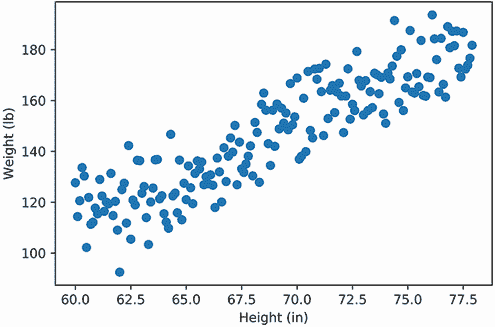

图 14.1 身高与体重的图表。它们之间的线性关系清晰可见。

图表中清晰地显示了身高与体重之间的线性关系。同样，正如预期的那样，身高和体重的坐标轴缩放不同。作为一个提醒，Matplotlib 操纵其 2D 坐标轴以使最终图表看起来美观。通常，这是一件好事。然而，我们很快将旋转图表以简化数据。旋转将改变坐标轴的缩放，使得旋转后的数据难以与原始数据图表进行比较。因此，我们应该使坐标轴等比例，以获得一致的视觉输出。让我们通过调用`plt.axis('equal')`来等比例化坐标轴，然后重新生成图表（图 14.2）。

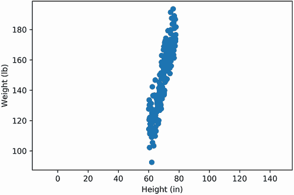

图 14.2 高度与体重的关系图，两个坐标轴均等比例缩放

列表 14.4 使用等比例刻度的坐标轴绘制 2D 测量结果

```
plt.scatter(measurements[0], measurements[1])
plt.xlabel('Height (in)')
plt.ylabel('Weight (lb)')
plt.axis('equal')
plt.show()
```

我们现在的图表形成了一个细长的雪茄形状。如果我们将其切成三等份，就可以按大小对雪茄进行聚类。获得聚类的一种方法是通过使用 K-means。当然，解释这个输出需要理解 K-means 算法。一个不那么技术性的解决方案是将雪茄倾斜。如果雪茄形状的图表是水平放置的，我们可以通过两个垂直切片将其分成三部分，如图 14.3 所示。第一刀将隔离最左边的 60 个数据点，第二刀将隔离最右边的 60 个客户点。这些操作将以一种易于解释的方式将我们的客户进行分割，即使是非技术人员也能理解。


图 14.3 我们线性测量的图表，水平旋转以便主要位于 x 轴上。两个垂直截断足以将数据分成三个等量的集群：小、中、大。在图表中，x 轴足以区分测量值。因此，我们可以通过最小信息损失消除 y 轴。请注意，此图是使用列表 14.15 生成的。

注意：为了练习的目的，我们假设小、中、大尺寸是均匀分布的。在现实世界的服装行业中，情况可能并非如此。

如果我们将数据旋转到 x 轴方向，水平 x 值应该足以区分点。因此，我们可以不依赖于垂直 y 值来聚类数据。实际上，我们将能够通过最小信息损失删除 y 值。这种删除将把我们的数据从二维减少到一维（图 14.4）。

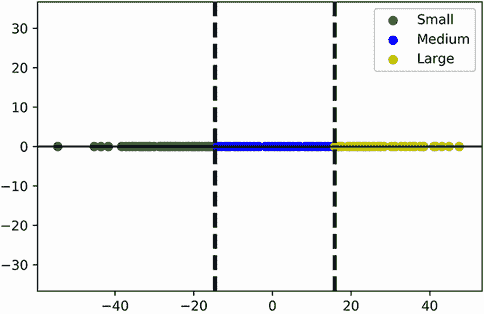

图 14.4 使用水平旋转将我们的线性测量值降低到一维。数据点已旋转朝向 x 轴，并且它们的 y 值坐标已被删除。尽管如此，剩余的 x 值足以区分点。因此，我们的 1D 输出仍然允许我们将数据分成三个相等的簇。

我们现在将尝试通过翻转数据来对 2D 数据进行聚类。这种水平旋转将使我们能够聚类数据并将其降低到一维。

### 14.1.1 使用旋转降低维度

要将我们的数据翻转到侧面，我们必须执行两个独立的步骤：

1.  将所有数据点移动到绘图的原点中心，该原点位于坐标(0, 0)。这将使旋转绘图朝向 x 轴更容易。

1.  将绘制的数据旋转，直到数据点到 x 轴的总距离最小化。

在原点中心化我们的数据是微不足道的。每个数据集的中心点等于其平均值。因此，我们需要调整我们的坐标，使它们的 x 值平均值和 y 值平均值都等于零。这可以通过从每个坐标中减去当前的平均值来完成；换句话说，从`heights`中减去平均身高，从`weights`中减去平均体重，将产生一个以(0, 0)为中心的数据集。

让我们调整身高和体重的坐标，并将这些变化存储在`centered_data`数组中。然后我们绘制调整后的坐标，以验证它们是否以原点为中心（图 14.5）。

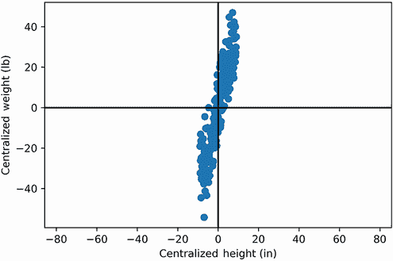

图 14.5 以原点为中心的身高与体重的绘图。中心化的数据可以像螺旋桨一样旋转。

列表 14.5 在原点中心化测量值

```
centered_data = np.array([heights - heights.mean(),
                          weights - weights.mean()])
plt.scatter(centered_data[0], centered_data[1])
plt.axhline(0, c='black')                          ❶
plt.axvline(0, c='black')
plt.xlabel('Centralized Height (in)')
plt.ylabel('Centralized Weight (lb)')
plt.axis('equal')
plt.show()
```

❶ 可视化 x 轴和 y 轴以标记原点的位置

我们的数据现在完美地以原点为中心。然而，数据的方向更接近 y 轴而不是 x 轴。我们的目标是通过对数据进行旋转来调整这个方向。我们希望将绘制的点绕原点旋转，直到它们与 x 轴重叠。围绕中心旋转 2D 绘图需要使用一个*旋转矩阵*：一个形式为`np.array([[cos(x), -sin(x)], [sin(x), cos(x)]])`的二维数组，其中`x`是旋转角度。这个数组和`centered_data`的矩阵乘积将数据旋转`x`弧度。旋转是逆时针方向的。我们也可以通过输入`-x`而不是`x`来将数据顺时针旋转。

让我们利用旋转矩阵将`centered_data`顺时针旋转 90 度。然后我们绘制旋转后的数据和原始的`centered_data`数组（图 14.6）。

列表 14.6 将`centered_data`旋转 90 度

```
from math import sin, cos
angle = np.radians(-90)                                 ❶
rotation_matrix = np.array([[cos(angle), -sin(angle)],
                            [sin(angle), cos(angle)]])
rotated_data = rotation_matrix @ centered_data
plt.scatter(centered_data[0], centered_data[1], label='Original Data')
plt.scatter(rotated_data[0], rotated_data[1], c='y', label='Rotated Data')
plt.axhline(0, c='black')
plt.axvline(0, c='black')
plt.legend()
plt.axis('equal')
plt.show()
```

❶ 将角度从度转换为弧度

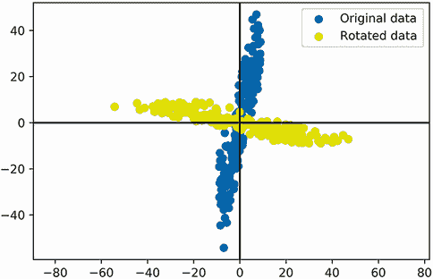

图 14.6 旋转前后`centered_data`的绘图。数据已绕原点旋转 90 度。现在它更靠近 x 轴。

如预期，我们的`rotated_data`结果与`centered_data`图垂直。我们已经成功将图表旋转了 90 度。此外，我们的旋转使图表更靠近 x 轴。我们需要一种方法来量化这种移动。让我们生成一个随着数据向 x 轴旋转而减少的惩罚分数。

我们将对所有垂直 y 轴值进行惩罚。我们的惩罚基于 5 节中引入的平方距离概念。惩罚平方等于`rotated_data`的平均平方 y 值。由于 y 值代表到 x 轴的距离，我们的惩罚等于到 x 轴的平均平方距离。当旋转后的数据集靠近 x 轴时，其平均平方 y 值会降低。

对于任何`y_values`数组，我们可以通过运行`sum([y ** 2 for y in y_values]) / y_values.size`来计算惩罚。然而，我们也可以通过执行`y_values @ y_values / y.size`来计算惩罚。这两个结果相同，点积计算更高效。让我们比较`rotated_data`和`centered_data`的惩罚分数。

列表 14.7 惩罚垂直 y 值

```
data_labels = ['unrotated', 'rotated']
data_list = [centered_data, rotated_data]
for data_label, data in zip(data_labels, data_list):
    y_values = data[1]
    penalty = y_values @ y_values / y_values.size
    print(f"The penalty score for the {data_label} data is {penalty:.2f}")

The penalty score for the unrotated data is 519.82
The penalty score for the rotated data is 27.00
```

旋转数据将惩罚分数降低了 20 多倍。这种减少具有统计意义。如果我们考虑以下内容，我们可以将惩罚与方差联系起来：

+   我们的惩罚分数等于`y_values`数组中从 0 到平均平方 y 值距离的平均值。

+   `y_values.mean()`等于 0。

+   因此，我们的惩罚平方等于从平均值到平均平方 y 值距离。

+   从平均值到平均平方距离等于方差。

+   我们的惩罚分数等于`y_values.var()`。

我们推断出惩罚分数等于 y 轴方差。因此，我们的数据旋转将 y 轴方差降低了 20 多倍。让我们确认。

列表 14.8 将惩罚与 y 轴方差相等

```
for data_label, data in zip(data_labels, data_list):
    y_var = data[1].var()
    penalty = data[1] @ data[1] / data[0].size
    assert round(y_var, 14) == round(penalty, 14)         ❶
    print(f"The y-axis variance for the {data_label} data is {y_var:.2f}")

The y-axis variance for the unrotated data is 519.82
The y-axis variance for the rotated data is 27.00
```

❶四舍五入以考虑浮点误差

我们可以根据方差来评分旋转。将数据旋转到 x 轴方向会减少 y 轴上的方差。这种旋转如何影响 x 轴上的方差呢？让我们来看看。

列表 14.9 测量旋转 x 轴方差

```
for data_label, data in zip(data_labels, data_list):
    x_var = data[0].var()
    print(f"The x-axis variance for the {data_label} data is {x_var:.2f}")

The x-axis variance for the unrotated data is 27.00
The x-axis variance for the rotated data is 519.82
```

旋转完全翻转了 x 轴方差和 y 轴方差。然而，方差值的总和保持不变。总方差在旋转后仍然保持不变。让我们验证这个事实。

列表 14.10 确认总方差的守恒

```
total_variance = centered_data[0].var() + centered_data[1].var()
assert total_variance == rotated_data[0].var() + rotated_data[1].var()
```

方差的守恒使我们能够推断出以下内容：

+   x 轴方差和 y 轴方差可以合并成一个单一的比例分数，其中`x_values.var() / total_variance`等于`1 - y_values.var() / total_variance`。

+   将数据旋转到 x 轴会导致 x 轴方差增加，y 轴方差相应减少。通过减少`p`百分比的垂直分散度，会增加`p`百分比的水平分散度。

以下代码确认了这些结论。

列表 14.11 探索轴方差覆盖率

```
for data_label, data in zip(data_labels, data_list):
    percent_x_axis_var = 100 * data[0].var() / total_variance
    percent_y_axis_var = 100 * data[1].var() / total_variance
    print(f"In the {data_label} data, {percent_x_axis_var:.2f}% of the "
           "total variance is distributed across the x-axis")
    print(f"The remaining {percent_y_axis_var:.2f}% of the total "
           "variance is distributed across the y-axis\n")

In the unrotated data, 4.94% of the total variance is distributed across the x-axis
The remaining 95.06% of the total variance is distributed across the y-axis

In the rotated data, 95.06% of the total variance is distributed across the x-axis
The remaining 4.94% of the total variance is distributed across the y-axis
```

将数据旋转到 x 轴方向增加了 x 轴方差 90 个百分点。同时，旋转减少了 y 轴方差相同的 90 个百分点。

让我们进一步旋转`centered_data`，直到其与 x 轴的距离最小化。最小化与 x 轴的距离相当于

+   最小化 x 轴覆盖的总方差百分比。这最小化了垂直分散。

+   最大化 x 轴覆盖的总方差百分比。这最大化了水平分散。

我们通过最大化水平分散将`centered_data`旋转到 x 轴方向。这种分散是在从 1 度到 180 度的所有角度范围内测量的。我们在图中可视化这些测量结果（图 14.7）。此外，我们提取了最大化 x 轴覆盖百分比的旋转角度。我们的代码打印出该角度和百分比，同时在图中标记该角度。

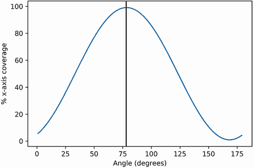

图 14.7：旋转角度与 x 轴覆盖的总方差百分比的对比图。一条垂直线标记了 x 轴方差最大化的角度。78.3 度的旋转角度将超过 99%的总方差转移到 x 轴上。以该角度旋转将使我们能够降低数据的维度。

列表 14.12 最大化水平分散

```
def rotate(angle, data=centered_data):                                  ❶
    angle = np.radians(-angle)
    rotation_matrix = np.array([[cos(angle), -sin(angle)],
                                [sin(angle), cos(angle)]])
    return rotation_matrix @ data

angles = np.arange(1, 180, 0.1)                                         ❷
x_variances = [(rotate(angle)[0].var()) for angle in angles]            ❸

percent_x_variances = 100 * np.array(x_variances) / total_variance
optimal_index = np.argmax(percent_x_variances)
optimal_angle = angles[optimal_index]                                   ❹
plt.plot(angles, percent_x_variances)
plt.axvline(optimal_angle, c='k')                                       ❺
plt.xlabel('Angle (degrees)')
plt.ylabel('% x-axis coverage')
plt.show()

max_coverage = percent_x_variances[optimal_index]
max_x_var = x_variances[optimal_index]

print("The horizontal variance is maximized to approximately "
      f"{int(max_x_var)} after a {optimal_angle:.1f} degree rotation.")
print(f"That rotation distributes {max_coverage:.2f}% of the total "
       "variance onto the x-axis.")

The horizontal variance is maximized to approximately 541 after a 78.3 degree rotation.
That rotation distributes 99.08% of the total variance onto the x-axis.
```

❶ 通过输入度数旋转数据。数据变量预设为 centered_data。

❷ 返回一个从 0 到 180 度的角度数组，其中每个连续角度增加 0.1 度

❸ 计算每个旋转角度的 x 轴方差

❹ 计算导致最大方差的角度

❺ 在 optimal_angle 处绘制一条垂直线。

将`centered_data`旋转 78.3 度将最大化水平分散。在该旋转角度下，99.08%的总方差将分布在 x 轴上。因此，我们可以预期旋转后的数据主要沿着 1D 轴线。让我们通过运行旋转并绘制结果（图 14.8）来确认。

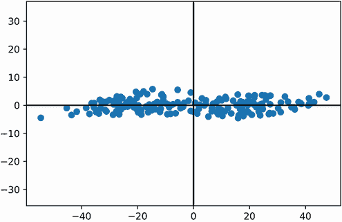

图 14.8：78.3 度旋转的`centered_data`的对比图。这种旋转最大化了 x 轴上的方差并最小化了 y 轴上的方差。总方差中不到 1%沿着 y 轴。因此，我们可以删除 y 坐标，而信息损失最小。

列表 14.13 绘制具有高 x 轴覆盖率的旋转数据

```
best_rotated_data = rotate(optimal_angle)
plt.scatter(best_rotated_data[0], best_rotated_data[1])
plt.axhline(0, c='black')
plt.axvline(0, c='black')
plt.axis('equal')
plt.show()
```

大部分数据靠近 x 轴。数据在该水平方向上的分散度最大。高度分散的点，按定义，是高度分离的。分离的点更容易相互区分。相比之下，垂直 y 轴上的分散度已经被最小化。垂直方向上，数据点难以区分。因此，我们可以删除所有 y 轴坐标，信息损失最小。这种删除应占不到总方差的 1%，因此剩余的 x 轴值将足以聚类我们的测量值。

让我们将`best_rotated_data`简化为一维，通过丢弃 y 轴。然后我们将使用剩余的一维数组来提取两个聚类阈值。第一个阈值将小型客户与中型客户分开，第二个阈值将中型客户与大型客户分开。这两个阈值共同将我们的 180 名客户分成三个大小相等的集群。

列表 14.14 将旋转数据简化为一维以进行聚类

```
x_values = best_rotated_data[0]
sorted_x_values = sorted(x_values)
cluster_size = int(x_values.size / 3)
small_cutoff = max(sorted_x_values[:cluster_size])
large_cutoff = min(sorted_x_values[-cluster_size:])
print(f"A 1D threshold of {small_cutoff:.2f} separates the small-sized "
       "and medium-sized customers.")
print(f"A 1D threshold of {large_cutoff:.2f} separates the medium-sized "
        "and large-sized customers.")

A 1D threshold of -14.61 separates the small-sized and medium-sized customers.
A 1D threshold of 15.80 separates the medium-sized and large-sized customers.
```

我们可以通过使用它们垂直切割`best_reduced_data`图来可视化我们的阈值。这两个切割将图分为三个部分，每个部分对应一个客户大小。接下来，我们将可视化阈值和部分，并为每个部分着色（图 14.9）。

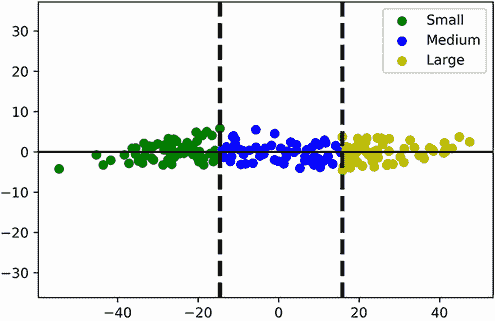

图 14.9 使用两个垂直阈值对`centered_data`进行水平绘制。细分将图分为三个客户集群：小型、中型和大型。一维 x 轴足以提取这些集群。

列表 14.15 绘制分为三个段落的水平客户数据

```
def plot_customer_segments(horizontal_2d_data):                    ❶
    small, medium, large = [], [], []
    cluster_labels = ['Small', 'Medium', 'Large']
    for x_value, y_value in horizontal_2d_data.T:                  ❷
        if x_value <= small_cutoff:
            small.append([x_value, y_value])
        elif small_cutoff < x_value < large_cutoff:
            medium.append([x_value, y_value])
        else:
            large.append([x_value, y_value])
    for i, cluster in enumerate([small, medium, large]):           ❸
        cluster_x_values, cluster_y_values = np.array(cluster).T
        plt.scatter(cluster_x_values, cluster_y_values,
                    color=['g', 'b', 'y'][i],
                    label=cluster_labels[i])

    plt.axhline(0, c='black')
    plt.axvline(large_cutoff, c='black', linewidth=3, linestyle='--')
    plt.axvline(small_cutoff, c='black', linewidth=3, linestyle='--')
    plt.axis('equal')
    plt.legend()
    plt.show()

plot_customer_segments(best_rotated_data)
```

❶ 输入一个水平定位的客户数据集，使用垂直阈值细分数据，并分别绘制每个客户细分。此函数在本节的其他地方被重复使用。

❷ 使用一维 x 值阈值来细分数据。

❸ 每个客户细分单独绘制。

我们的 1D `x_values`数组足以对客户数据进行细分，因为它捕捉到了数据方差的 99.08%。因此，我们可以使用该数组来复制 99.08%的`centered_data`数据集（图 14.10）。我们只需通过添加一个全零数组来重新引入 y 轴维度。然后我们需要将得到的数组旋转回原始位置。这些步骤将在下一步进行。

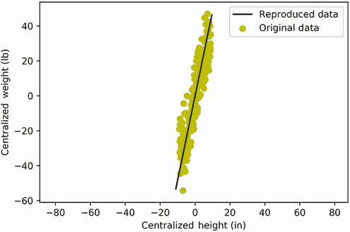

图 14.10 复制数据与原始数据点的对比图。我们的`reproduced_data`数组形成了一条穿过`centered_data`散点图的直线。这条线代表了数据方差最大化的线性方向。`reproduced_data`线覆盖了总方差的 99.08%。

列表 14.16 从一维数组中复制二维数据

```
zero_y_values = np.zeros(x_values.size)                                   ❶
reproduced_data = rotate(-optimal_angle, data=[x_values, zero_y_values])
```

❶ 返回一个全零向量

让我们一起绘制`reproduced_data`和我们的`centered_data`矩阵，以评估复制的质量。

列表 14.17 绘制重现数据和原始数据

```
plt.plot(reproduced_data[0], reproduced_data[1], c='k',
         label='Reproduced Data')
plt.scatter(centered_data[0], centered_data[1], c='y',
            label='Original Data')
plt.axis('equal')
plt.legend()
plt.show()
```

重现的数据形成了一条直接穿过`centered_data`散点图中间的线。这条线代表*第一主方向*，这是数据方差最大化的线性方向。大多数二维数据集包含两个主方向。*第二主方向*与第一个方向垂直；它代表第一方向未覆盖的剩余方差。

我们可以使用第一主方向来处理未来客户的身高和体重。我们假设这些客户来自与我们现有的`measurements`数据相同的分布。如果是这样，那么他们的中心化身高和体重也将沿着图 14.10 中看到的第一个主方向。这种对齐最终将使我们能够使用现有的阈值来分割新客户数据。

让我们通过模拟新的客户测量数据来更具体地探讨这个场景。然后我们将集中并绘制我们的测量数据（图 14.11）。我们还绘制了一条代表第一主方向的线——我们预计绘制的测量数据将与这条方向线对齐。

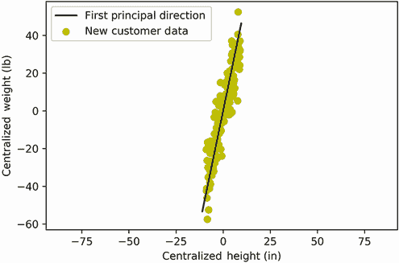

图 14.11 包含新客户数据和原始客户数据集的主方向的集中绘图。主方向直接穿过一个以前未见过的数据图。该方向与 x 轴的夹角是已知的。因此，我们可以自信地将这些数据侧过来，以便进行聚类。

注意：第一主方向与原点相交。因此，我们必须确保我们的新客户数据也与原点相交，以便对齐。因此，我们必须集中这些数据。

列表 14.18 模拟和绘制新客户数据

```
np.random.seed(1)
new_heights = np.arange(60, 78, .11)                                    ❶
random_fluctuations = np.random.normal(scale=10, size=new_heights.size)
new_weights =  4 * new_heights - 130 + random_fluctuations
new_centered_data = np.array([new_heights - heights.mean(),
                              new_weights - weights.mean()])            ❷
plt.scatter(new_centered_data[0], new_centered_data[1], c='y',
            label='New Customer Data')
plt.plot(reproduced_data[0], reproduced_data[1], c='k',
         label='First Principal Direction')
plt.xlabel('Centralized Height (in)')
plt.ylabel('Centralized Weight (lb)')
plt.axis('equal')
plt.legend()
plt.show()
```

❶ 将所有新的身高分开 0.11 英寸，以最大限度地减少与先前身高的重叠

❷ 我们假设新的客户分布与之前看到的分布相同。这使我们能够利用现有的数据集中化方法。

我们的新客户数据继续沿着第一主方向。这个方向覆盖了超过 99%的数据方差，同时与 x 轴形成 78.3 度的角度。因此，我们可以通过旋转 78.3 度将我们的新数据侧过来。结果 x 值覆盖了超过 99%的总方差。这种高水平的水平分散使我们能够在不依赖 y 值信息的情况下分割客户。我们现有的 1D 分割阈值应该足以完成这个目的。

接下来，我们将新客户数据水平放置，并使用我们的`plot_customer_segments`函数来分割这些数据（图 14.12）。

列表 14.19 旋转和分割我们的新客户数据

```
new_horizontal_data = rotate(optimal_angle, data=new_centered_data)
plot_customer_segments(new_horizontal_data)
```


图 14.12 新客户数据的水平图。数据使用先前计算的两个垂直阈值进行分段。分段将图分为三个客户集群：小型、中型和大型。一维 x 轴足以提取这些集群。

现在，我们将简要回顾我们的观察结果。我们可以通过将数据侧翻来将任何二维客户测量数组降低到一维。一维的水平 x 值应该足以按大小对客户进行聚类。此外，当我们知道方差最大化的主方向时，翻转数据更容易。给定第一个主方向，我们通过降维来简化客户数据，以便更容易聚类。

注意：作为额外的好处，降维使我们能够简化我们的客户数据库。我们不必存储身高和体重，只需存储水平 x 值即可。将数据库存储从二维降低到一维将加快客户查找速度并降低我们的存储成本。

到目前为止，我们已经通过旋转数据以最大化方差来提取了第一个主方向。不幸的是，这种技术无法扩展到更高维度。想象一下，如果我们分析一个 1000 维度的数据集，检查 1000 个不同轴的每个角度在计算上是不切实际的。幸运的是，有一种更简单的方法来提取所有主方向。我们只需要应用一种称为*主成分分析*（PCA）的可扩展算法。

在接下来的几个小节中，我们将探讨 PCA。它易于实现，但理解起来可能有些棘手。因此，我们将分部分探讨该算法。我们首先运行 scikit-learn 的 PCA 实现。我们将 PCA 应用于几个数据集以实现更好的聚类和可视化。然后，我们通过从头开始推导 PCA 来探究算法的弱点。最后，我们消除这些弱点。

## 14.2 使用 PCA 和 scikit-learn 进行降维

PCA 算法调整数据集的轴，使得大部分方差分布在少数几个维度上。因此，并非每个维度都需要用来区分数据点。简化的数据区分导致聚类简化。因此，scikit-learn 提供了一个名为`PCA`的主成分分析类，这真是幸运。让我们从`sklearn.decomposition`中导入`PCA`。

列表 14.20 从 scikit-learn 导入`PCA`

```
from sklearn.decomposition import PCA
```

运行`PCA()`初始化一个`pca_model`对象，其结构与第十部分中使用的 scikit-learn `cluster_model`对象相似。在那个章节中，我们创建了能够聚类输入数组的模型。现在，我们创建一个能够将我们的`measurements`数组侧翻的 PCA 模型。

列表 14.21 初始化`pca_model`对象

```
pca_object = PCA()
```

使用 `pca_model`，我们可以通过运行 `pca_model.fit_transform(data)` 来水平翻转一个 2D `data` 矩阵。该方法调用将轴分配给矩阵列，并随后重新定位这些轴以最大化方差。然而，在我们的 `measurements` 数组中，轴存储在矩阵行中。因此，我们需要通过取矩阵的转置来交换行和列。运行 `pca_model.fit_transform(measurements.T)` 返回一个 `pca_transformed_data` 矩阵。第一个矩阵列代表方差最大化的 x 轴，第二个列代表方差最小化的 y 轴。这两个列的绘图应类似于侧躺的雪茄。让我们验证一下：我们在 `measurements.T` 上运行 `fit_transform` 方法，然后绘制结果列（图 14.13）。作为提醒，NumPy 矩阵 `M` 的第 *i* 个列可以通过运行 `M[:,i]` 来访问。

列表 14.22 使用 scikit-learn 运行 PCA

```
pca_transformed_data = pca_object.fit_transform(measurements.T)
plt.scatter(pca_transformed_data[:,0], pca_transformed_data[:,1])
plt.axhline(0, c='black')
plt.axvline(0, c='black')
plt.axis('equal')
plt.show()
```

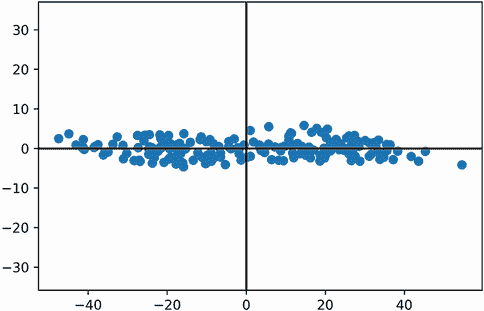

图 14.13 scikit-learn 的 PCA 实现的绘图输出。该图是图 14.8 中水平放置的客户数据的镜像。PCA 已重新定位这些数据，使其方差主要沿 x 轴分布。因此，可以删除 y 轴而损失的信息最少。

我们的图是图 14.8 的镜像，y 值在 y 轴上反射。对二维数据集运行 PCA 保证将数据倾斜，使其水平位于 x 轴上。然而，数据的实际反射并不局限于特定的方向。

注意 我们可以通过将所有 y 值乘以 –1 来重新创建原始的水平图。因此，运行 `plot_customer_segments((pca_transformed_data * np.array([1, -1])).T)` 会生成一个分段客户规模的图，与图 14.9 相当。

尽管我们的绘图数据方向不同，但其 x 轴的方差覆盖率应与之前的观察结果一致。我们可以使用 `pca_object` 的 `explained_variance_ratio_` 属性来确认。该属性包含每个轴覆盖的分数方差数组。因此，`100 * pca_object.explained_variance_ratio_[0]` 应等于之前观察到的约 99.08% 的 x 轴覆盖率。让我们验证一下。

列表 14.23 从 scikit-learn 的 PCA 输出中提取方差

```
percent_variance_coverages = 100 * pca_object.explained_variance_ratio_  ❶
x_axis_coverage, y_axis_coverage = percent_variance_coverages            ❷
print(f"The x-axis of our PCA output covers {x_axis_coverage:.2f}% of "
       "the total variance")

The x-axis of our PCA output covers 99.08% of the total variance
```

❶ 该属性是一个 NumPy 数组，包含每个轴的分数覆盖率。乘以 100 将这些分数转换为百分比。

❶ 数组的第 *i* 个元素对应于第 *i* 个轴的方差覆盖率。

我们的`pca_object`通过揭示数据集的两个主方向，最大化了 x 轴的方差。这些方向存储在`pca.components`属性中（它本身是一个矩阵）。提醒一下，向量是从原点指向某个方向的线性段。此外，第一主方向是从原点升起的一条线。因此，我们可以将第一主方向表示为一个称为*第一主成分*的向量。我们可以通过打印`pca_object.components[0]`来访问我们数据的第一个主成分。接下来，我们输出该向量及其模量。

列表 14.24 输出第一个主成分

```
first_pc = pca_object.components_[0]
magnitude = norm(first_pc)
print(f"Vector {first_pc} points in a direction that covers "
      f"{x_axis_coverage:.2f}% of the total variance.")
print(f"The vector has a magnitude of {magnitude}")

Vector [-0.20223994 -0.979336  ] points in a direction that covers 99.08%
of the total variance.
The vector has a magnitude of 1.0
```

第一主成分是一个模量为 1.0 的单位向量。它从原点延伸出一个完整的单位长度。将向量乘以一个数可以进一步拉伸其模量。如果我们拉伸得足够远，我们可以捕捉到数据的整个主方向。换句话说，我们可以将向量拉伸到完全贯穿我们香肠形状图表的内部，就像一根棒上的热狗。可视化的结果应该与图 14.10 相同。

注意：如果向量`pc`是主成分，那么`-pc`也是主成分。`-pc`向量代表`pc`的镜像。尽管这两个向量指向对方，但它们都沿着第一主方向。因此，在降维过程中，`pc`和`-pc`可以互换使用。

接下来，我们生成那个图表（图 14.14）。首先，我们将`first_pc`向量拉伸，使其从原点向正负两个方向延伸 50 个单位。然后，我们将拉伸的部分与之前计算出的`centered_data`矩阵一起绘制。稍后，我们将使用绘制的部分来深入了解 PCA 算法的工作原理。

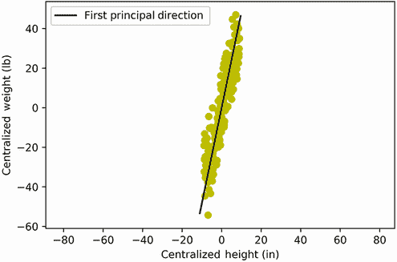

图 14.14 包含客户数据和第一主方向的集中化图表。方向是通过拉伸第一主成分绘制的。

注意：我们绘制的是`centered_data`而不是`measurements`，因为`centered_data`是以原点为中心的。我们拉伸出的向量也是以原点为中心的。这使得中心化的矩阵和向量在视觉上可以比较。

列表 14.25 拉伸单位向量以覆盖第一主方向

```
def plot_stretched_vector(v, **kwargs):                                  ❶
    plt.plot([-50 * v[0], 50 * v[0]], [-50 * v[1], 50 * v[1]], **kwargs)

plt.plot(reproduced_data[0], reproduced_data[1], c='k',
         label='First Principal Direction')
plt.scatter(centered_data[0], centered_data[1], c='y')
plt.xlabel('Centralized Height (in)')
plt.ylabel('Centralized Weight (lb)')
plt.axis('equal')
plt.legend()
plt.show()
```

❶ 函数将输入的单位向量 v 拉伸。拉伸的部分从原点向正负两个方向延伸 50 个单位。然后绘制拉伸的部分。我们很快会再次使用这个函数。

我们已经使用第一个主成分来沿着其第一个主方向刺穿我们的数据集。同样地，我们可以拉伸 PCA 算法返回的其他方向单位向量。如前所述，大多数二维数据集包含两个主方向。第二个主方向与第一个方向垂直，其向量表示称为**第二个主成分**。该成分存储在我们计算的`components`矩阵的第二行。

为什么我们应该关注第二个主成分呢？毕竟，它指向的方向覆盖的数据方差不到 1%。尽管如此，这个成分有其用途。第一个和第二个主成分都与我们的数据 x 轴和 y 轴有特殊的关系。直观地揭示这种关系会使主成分分析（PCA）更容易理解。因此，我们现在在`components`矩阵中拉伸并绘制这两个成分。此外，我们还绘制了`centered_data`以及两个轴。最终的可视化将为我们提供宝贵的见解（图 14.15）。

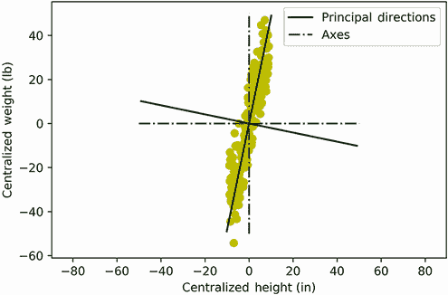

图 14.15 将第一和第二个主方向与客户数据一起绘制。这些方向相互垂直。如果我们把 x 轴和 y 轴旋转 78.3 度，它们将完美地与主方向对齐。因此，用主方向交换轴可以重现图 14.8 中显示的水平图。

列表 14.26 绘制主方向、轴和数据信息

```
principal_components = pca_object.components_
for i, pc in enumerate(principal_components):
    plot_stretched_vector(pc, c='k',
                          label='Principal Directions' if i == 0 else None)

for i, axis_vector in enumerate([np.array([0, 1]), np.array([1, 0])]):    ❶
    plot_stretched_vector(axis_vector,  c='g', linestyle='-.',
                          label='Axes' if i == 0 else None)

plt.scatter(centered_data[0], centered_data[1], c='y')
plt.xlabel('Centralized Height (in)')
plt.ylabel('Centralized Weight (lb)')
plt.axis('equal')
plt.legend()
plt.show()
```

❶ 通过拉伸两个单位向量（一个垂直和一个水平）来绘制 x 轴和 y 轴，使它们的幅度与拉伸的主成分对齐。因此，拉伸的轴和拉伸的主成分在视觉上是可比较的。

根据绘图，两个主方向实际上是 x 轴和 y 轴的旋转版本。想象一下，如果我们把两个轴逆时针旋转 78.3 度。旋转后，x 轴和 y 轴将与两个主成分对齐。这些轴覆盖的方差将分别等于 99.02%和 0.08%。因此，这种轴交换将重现图 14.8 中的水平图。

注意：在注视图 14.15 的同时向左倾斜头部将帮助你想象这个结果。

上文提到的轴交换被称为**投影**。将我们的两个轴交换为主方向被称为**投影到主方向**。通过三角学，我们可以证明`centered_data`投影到主方向等于`centered_data`和两个主成分的矩阵乘积。换句话说，`principal_components @ centered_data`重新定位了数据集的 x 和 y 坐标相对于主方向。最终的输出应该等于`pca_transformed_data.T`。让我们通过列表 14.27 中的代码来确认。

注意更普遍地，第 *i* 个主成分与一个中心化数据点的点积将数据点投影到第 *i* 个主方向。因此，运行 `first_pc @ centered_data[i]` 将第 *i* 个数据点投影到第一个主方向。结果等于当 x 轴与第一个主方向交换时获得的 x 值（`pca_transformed_data[i][0]`）。这样，我们可以通过矩阵乘法将多个数据点投影到多个主方向。

列表 14.27 使用投影交换标准轴与主方向

```
projections = principal_components @ centered_data
assert np.allclose(pca_transformed_data.T, projections)
```

PCA 的重新定位输出取决于投影。一般而言，PCA 算法的工作原理如下：

1.  通过从每个数据点中减去平均值来集中输入数据。

1.  计算数据集的主成分。计算细节将在本节稍后讨论。

1.  将集中化数据与主成分之间的矩阵乘积。这交换了数据的标准轴为其主方向。

通常，一个 *N*-维数据集有 *N* 个主方向（每个轴一个）。第 *k* 个主方向最大化未被前 *k* – 1 个方向覆盖的方差。因此，一个 4 维数据集有四个主方向：第一个主方向最大化单向分散，第二个最大化未被第一个方向覆盖的所有单向分散，最后两个覆盖所有剩余的方差。

这里变得有趣了。假设我们将一个 4 维数据集投影到其四个主方向。因此，数据集的标准轴与其主方向交换。在适当的条件下，两个新轴将覆盖相当一部分方差。因此，剩余的轴可以被丢弃，信息损失最小。丢弃这两个轴将把 4 维数据集减少到两个维度。然后我们就能在 2 维散点图中可视化这些数据。理想情况下，2 维图将保持足够的分散，使我们能够正确识别数据簇。让我们探索一个实际场景，其中我们在二维中可视化 4 维数据。

关键术语

+   *第一个主方向*—数据分散最大化的线性方向。将 x 轴与第一个主方向交换重新定位数据集以最大化其水平方向的分布。这种重新定位可以允许更简单的 1D 聚类。

+   第 *k* 个主方向*—最大化未被前 *K* – 1 个主方向覆盖的方差的线性方向。

+   第 *k* 个主成分*—第 *k* 个主方向的单位向量表示。这个向量可以用于方向投影。

+   *投影*—将数据投影到主方向上相当于将标准轴与该方向交换。我们可以通过将集中化数据集与其前 *K* 个主成分的矩阵乘积来将数据集投影到其前 *K* 个主方向。

## 14.3 在二维中对 4D 数据进行聚类

假设我们是一群在盛开的花草丛中研究花朵的植物学家。我们随机选择了 150 朵花。对于每一朵花，我们记录以下测量值：

+   彩色花瓣的长度

+   彩色花瓣的宽度

+   支持花瓣的绿色叶片的长度

+   支持花瓣的绿色叶片的宽度

这些 4D 花朵测量值已经存在，并且可以使用 scikit-learn 访问。我们可以通过从 `sklearn.datasets` 导入 `load_iris` 来获取测量值。调用 `load_iris()['data']` 返回一个包含 150 行和 4 列的矩阵：每一行对应一朵花，每一列对应叶子和花瓣的测量值。接下来，我们加载数据并打印单朵花的测量值。所有记录的测量值都是以厘米为单位的。

列表 14.28 从 scikit-learn 加载花朵测量值

```
from sklearn.datasets import load_iris
flower_data = load_iris()
flower_measurements = flower_data['data']
num_flowers, num_measurements = flower_measurements.shape
print(f"{num_flowers} flowers have been measured.")
print(f"{num_measurements} measurements were recorded for every flower.")
print("The first flower has the following measurements (in cm): "
      f"{flower_measurements[0]}")

150 flowers have been measured.
4 measurements were recorded for every flower.
The first flower has the following measurements (in cm): [5.1 3.5 1.4 0.2]
```

给定这个花朵测量值的矩阵，我们的目标如下：

+   我们想在二维空间中可视化我们的花朵数据。

+   我们想确定在 2D 可视化中是否存在任何聚类。

+   我们想构建一个非常简单的模型来区分花朵簇类型（假设找到了任何簇）。

我们首先可视化数据。它是四维的，但我们想将其绘制在二维中。将数据降低到二维需要将其投影到其第一和第二主方向上。其余的两个方向可以被丢弃。因此，我们的分析只需要前两个主成分。

使用 scikit-learn，我们可以将 PCA 分析限制在前两个主成分。我们只需在 `PCA` 对象初始化时运行 `PCA(n_components=2)`。初始化后的对象将能够将输入数据降低到二维投影。接下来，我们初始化一个两成分的 `PCA` 对象，并使用 `fit_transform` 将我们的花朵测量值降低到二维。

列表 14.29 将花朵测量值降至二维

```
pca_object_2D = PCA(n_components=2)
transformed_data_2D = pca_object_2D.fit_transform(flower_measurements)
```

计算的 `transformed_data_2D` 矩阵应该是二维的，只包含两列。让我们确认一下。

列表 14.30 检查降维矩阵的形状

```
row_count, column_count = transformed_data_2D.shape
print(f"The matrix contains {row_count} rows, corresponding to "
      f"{row_count} recorded flowers.")
print(f"It also contains {column_count} columns, corresponding to "
      f"{column_count} dimensions.")

The matrix contains 150 rows, corresponding to 150 recorded flowers.
It also contains 2 columns, corresponding to 2 dimensions.
```

我们输出的数据矩阵覆盖了总数据方差的多少？我们可以使用 `pca_object_2D` 的 `explained_variance_ratio_` 属性来找出。

列表 14.31 测量降维矩阵的方差覆盖率

```
def print_2D_variance_coverage(pca_object):                              ❶
    percent_var_coverages = 100 * pca_object.explained_variance_ratio_
    x_axis_coverage, y_axis_coverage = percent_var_coverages
    total_coverage = x_axis_coverage + y_axis_coverage
    print(f"The x-axis covers {x_axis_coverage:.2f}% "
            "of the total variance")
    print(f"The y-axis covers {y_axis_coverage:.2f}% "
           "of the total variance")
    print(f"Together, the 2 axes cover {total_coverage:.2f}% "
           "of the total variance")

print_2D_variance_coverage(pca_object_2D)
The x-axis covers 92.46% of the total variance
The y-axis covers 5.31% of the total variance
Together, the 2 axes cover 97.77% of the total variance
```

❶ 计算与 pca_object 相关的降维 2D 数据集的方差覆盖率。此函数在本节的其他地方被重用。

我们的降维矩阵覆盖了超过 97% 的总数据方差。因此，`transformed_data_2D` 的散点图应该显示数据集中存在的大多数聚类模式（图 14.16）。

列表 14.32 在 2D 中绘制花朵数据

```
plt.scatter(transformed_data_2D[:,0], transformed_data_2D[:,1])
plt.show()
```

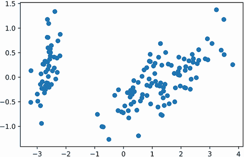

图 14.16 4D 花测量值在二维空间中的绘制。这些测量值使用 PCA 降维到两个维度。降维数据覆盖了总方差的 97%以上。我们的二维图很有信息量：两个或三个花簇清晰可见。

当我们的花数据在二维空间中绘制时，会形成簇。基于聚类，我们可以假设存在两种或三种花类型。实际上，我们的测量数据代表三种独特的花种。这种物种信息存储在 `flower_data` 字典中。接下来，我们按物种给花图着色，并验证颜色是否落在三个不同的簇中（图 14.17）。

列表 14.33 按花种着色绘制的数据

```
def visualize_flower_data(dim_reduced_data):                               ❶
    species_names = flower_data['target_names']                            ❷
    for i, species in enumerate(species_names):
        species_data = np.array([dim_reduced_data[j]
                                 for j in range(dim_reduced_data.shape[0])
                                 if flower_data['target'][j] == i]).T      ❸
        plt.scatter(species_data[0], species_data[1], label=species.title(),
                     color=['g', 'k', 'y'][i])                             ❹
    plt.legend()
    plt.show()

visualize_flower_data(transformed_data_2D)
```

❶ 在按物种着色的同时绘制降维花数据。此函数在本节的其他地方被重用。

❷ 返回数据集中三种花种的名字

❸ 仅提取与特定物种相关的坐标。为了过滤目的，我们使用 `flower_data[target]`，它映射到一个物种 ID 列表。这些 ID 对应于三个物种名称。如果第 *j* 朵花对应于 species_name[i]，那么它的物种 ID 等于 *j*。

❹ 使用独特的颜色绘制每个物种

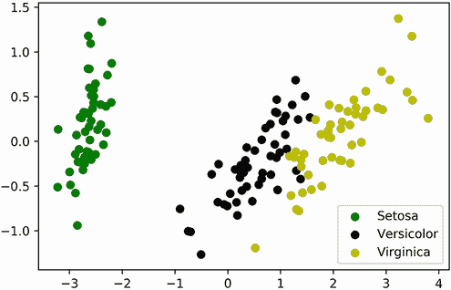

图 14.17 4D 花测量值在二维空间中的绘制。每个绘制的花点根据其物种着色。三种物种分为三个簇。因此，我们的二维降维正确地捕捉了区分物种所需的信号。

大部分情况下，三种物种在空间上是分开的。*Versicolor* 和 *Virgincia* 有一点重叠，这意味着它们有相似的 petals 属性。另一方面，*Setosa* 形成一个完全独立的簇。一个垂直的 x 值阈值为-2 足以将 *Setosa* 从所有其他物种中隔离出来。因此，我们可以定义一个非常简单的 *Setosa* 检测函数。该函数接受一个名为 `flower_sample` 的四个元素数组作为输入，该数组包含四个花瓣测量值。该函数将执行以下操作：

1.  通过从 `flower_sample` 中减去 `flower_measurements` 的平均值来集中样本。这个平均值存储在 `pca_object_2D` 的一个属性中。它等于 `pca_object_2D.mean_`。

1.  将集中样本投影到第一主方向，通过将其与第一主成分的点积来实现。提醒一下，第一主成分存储在 `pca_object_2D.components_[0]` 中。

1.  检查投影值是否小于-2。如果是这样，那么这个花样本将被视为可能的 *Setosa* 物种。

注意：我们的 *Setosa* 检测函数不考虑我们已记录的三种花以外的任何花种。然而，该函数仍然应该足够分析我们草地上的新花，因为我们没有观察到其他物种。

接下来，我们定义 `detect_setosa` 函数，然后分析一个具有测量值（单位为厘米）的 `[4.8, 3.7, 1.2, 0.24]` 的花样本。

列表 14.34 基于降维数据定义 Setosa 检测器

```
def detect_setosa(flower_sample):
    centered_sample = flower_sample - pca_object_2D.mean_
    projection = pca_object_2D.components_[0] @ centered_sample
    if projection < -2:
        print("The sample could be a Setosa")
    else:
        print("The sample is not a Setosa")

new_flower_sample = np.array([4.8, 3.7, 1.2, 0.24])
detect_setosa(new_flower_sample)
The sample could be a Setosa
```

根据我们的简单阈值分析，花朵样本可能是 *Setosa*，这是由 PCA 实现的。PCA 的各种好处包括以下内容：

+   复杂数据的可视化。

+   简化的数据分类和聚类。

+   简化的分类。

+   减少了内存使用。将数据从四维减少到二维，将存储数据所需的字节数减半。

+   更快的计算。将数据从四维减少到二维，将计算相似性矩阵所需的时间缩短了四倍。

那么，我们是否准备好使用 PCA 对我们的文本数据进行聚类？不幸的是，答案是否定的。我们必须首先讨论并解决算法固有的某些缺陷。

常见的 scikit-learn PCA 方法

+   `pca_object = PCA()`—创建一个 `PCA` 对象，能够重新定位输入数据，使其轴与主方向对齐。

+   `pca_object = PCA(n_components=K)`—创建一个 `PCA` 对象，能够重新定位输入数据，使其 *K* 个轴与最高的 *K* 个主方向对齐。所有其他轴被忽略。这减少了数据到 *K* 维。

+   `pca_transformed_data = pca_object.fit_transform(data)`—使用初始化的 `PCA` 对象对输入数据执行 PCA。`fit_transform` 方法假设 `data` 矩阵的列对应于空间轴。轴随后与数据的主方向对齐。此结果存储在 `pca_transformed_data` 矩阵中。

+   `pca_object.explained_variance_ratio_`—返回与拟合 `PCA` 对象的每个主方向相关的方差覆盖率分数。第 *i* 个元素对应于第 *i* 个主方向的方差覆盖率分数。

+   `pca_object.mean_`—返回拟合到 `PCA` 对象的输入数据的平均值。

+   `pca_object.components_`—返回输入数据的特征值，这些特征值已经拟合到 `PCA` 对象中。`components_` 矩阵的每一行对应于第 *i* 个主成分。运行 `pca_object.components_[i] @ (data[j] - pca_object.mean_)` 将第 *j* 个数据点投影到第 *i* 个主成分上。投影输出等于 `pca_transformed_data[j][i]`。

### 14.3.1 PCA 的局限性

PCA 确实有一些严重的局限性。它对测量单位过于敏感。例如，我们的花朵测量值都是以厘米为单位，但我们可以想象通过运行 `10 * flower_measurements[0]` 将第一个轴转换为毫米。该轴的信息含量不应该改变；然而，其方差将会发生变化。让我们转换轴单位来评估方差是如何受到影响的。

列表 14.35 测量单位变化对轴方差的影响

```
first_axis_var = flower_measurements[:,0].var()
print(f"The variance of the first axis is: {first_axis_var:.2f}")

flower_measurements[:,0] *= 10
first_axis_var = flower_measurements[:,0].var()
print("We've converted the measurements from cm to mm.\nThat variance "
      f"now equals {first_axis_var:.2f}")

The variance of the first axis is: 0.68
We've converted the measurements from cm to mm.
That variance now equals 68.11
```

我们的数据方差增加了 100 倍。现在，第一个轴方差主导了我们的数据集。考虑对这些修改后的花朵测量值运行 PCA 的后果：PCA 将尝试找到方差最大化的轴。当然，这将产生方差从 0.68 增加到 68 的第一个轴。因此，PCA 将所有数据投影到第一个轴上。我们的数据将缩减到一维！我们可以通过重新拟合`pca_object_2D`到`flower_measurements`并打印方差覆盖来证明这一点。

列表 14.36 测量单位变化对 PCA 的影响

```
pca_object_2D.fit_transform(flower_measurements)      ❶
print_2D_variance_coverage(pca_object_2D)

The x-axis covers 98.49% of the total variance
The y-axis covers 1.32% of the total variance
Together, the 2 axes cover 99.82% of the total variance
```

❶ 将我们的 PCA 对象重新拟合到更新的 flower_measurements 数据

现在，超过 98%的方差沿着一个单一的轴。之前，需要两个维度来捕获 97%的数据方差。显然，我们已经在数据中引入了一个错误。我们如何解决这个问题？一个明显的解决方案是确保所有轴具有相同的测量单位。然而，这种实际的方法并不总是可行的。有时测量单位根本不可用。其他时候，轴对应于不同的测量类型（如长度和重量），因此单位不兼容。我们该怎么办？

让我们考虑方差变化的根本原因。我们在`flower_measurements[:,0]`中的值变大了，因此它们的方差也变大了。轴方差的不同是由值大小的不同引起的。在上一个部分，我们能够通过标准化消除这种大小差异。提醒一下，在标准化过程中，一个向量被其大小除以。这产生了一个大小等于 1.0 的单位向量。因此，如果我们标准化我们的轴，所有轴的值都将介于 0 和 1 之间。因此，第一个轴的主导地位将被消除。让我们标准化`flower_measurements`并将标准化后的数据缩减到二维。结果二维方差覆盖应该再次接近 97%。

列表 14.37 标准化数据以消除测量单位差异

```
for i in range(flower_measurements.shape[1]):
    flower_measurements[:,i] /= norm(flower_measurements[:,i])

transformed_data_2D = pca_object_2D.fit_transform(flower_measurements)
print_2D_variance_coverage(pca_object_2D)

The x-axis covers 94.00% of the total variance
The y-axis covers 3.67% of the total variance
Together, the 2 axes cover 97.67% of the total variance
```

标准化略微修改了我们的数据。现在，第一个主成分方向覆盖了总方差的 94%，而不是 92.46%。同时，第二个主成分覆盖了总方差的 3.67%，而不是 5.31%。尽管有这些变化，总的二维方差覆盖仍然大约是 97%。我们重新绘制 PCA 输出以确认二维聚类模式保持不变（图 14.18）。

列表 14.38 标准化后绘制二维 PCA 输出

```
visualize_flower_data(transformed_data_2D)
```

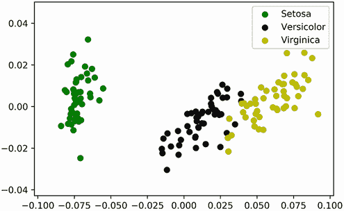

图 14.18 4D 标准化花朵测量值在二维中绘制。每个绘制的花朵点根据其物种着色。三种物种分为三个簇。因此，我们的二维降维正确地捕捉了区分物种所需的信号。

我们的图表与我们之前的观察略有不同。然而，三种花卉种类继续分离成三个簇，*Setosa*仍然与其他种类在空间上明显不同。归一化保留了现有的簇分离，同时消除了由单位差异引起的错误。

不幸的是，归一化确实导致了意外的后果。我们的归一化轴值现在介于 0 和 1 之间，因此每个轴的平均值也介于 0 和 1 之间。所有值都小于 1 个单位远离其平均值。这是一个问题：PCA 要求我们从每个轴值中减去平均值以归一化我们的数据。然后，归一化的矩阵乘以主成分以重新对齐轴。遗憾的是，由于浮点数错误，数据归一化并不总是可行的。从相似值中减去 100%的精度在计算上是困难的，因此很难从非常接近平均值的值中减去平均值。例如，假设我们分析一个包含两个数据点`1 + 1e-3`和`1 - 1e-3`的数组。该数组的平均值等于 1。从数组中减去 1 应该导致归一化平均值为 0，但由于错误，实际平均值不会等于 0，如下所示。

列表 14.39 展示由接近其平均值的值引起的错误

```
data = np.array([1 + 1e-3, 1 - 1e-3])
mean = data.mean()
assert mean == 1
centralized_data = data - 2 * [mean]
assert centralized_data.mean() != 0                          ❶
print(f"Actual mean is equal to {centralized_data.mean()}")

Actual mean is equal to -5.551115123125783e-17
```

❶ 归一化数据的平均值并不等于预期的 0。

我们无法可靠地归一化接近平均值的数值。因此，我们无法在归一化数据上可靠地执行 PCA。我们应该怎么办？

我们的问题确实存在解决方案。然而，要推导出它，我们必须深入到 PCA 算法的核心。我们必须学习如何从头开始计算主成分而不进行旋转。这个过程有点抽象，但无需学习高级数学就能理解。一旦我们推导出 PCA 算法，我们就能对其进行轻微的修改。这个微小的修改将完全绕过数据归一化。这个修改后的算法被称为*奇异值分解*（SVD），它将使我们能够有效地聚类文本数据。

注意：如果您对 SVD 的推导不感兴趣，可以跳到最后一小节。它描述了 scikit-learn 中 SVD 的使用。

## 14.4 不旋转计算主成分

在本小节中，我们将学习如何从头开始提取主成分。为了更好地说明提取过程，我们将可视化我们的成分向量。当然，当向量是二维的时候更容易绘制。因此，我们首先回顾我们的客户`measurements`数据集，其主成分是二维的。作为提醒，我们已经为这些数据计算了以下输出：

+   `centralized_data`—`measurements`数据集的归一化版本。`centralized_data`的平均值是`[0 0]`。

+   `first_pc`—`measurements`数据集的第一个主成分。它是一个二维数组。

正如我们之前讨论的，`first_pc` 是一个指向第一个主方向的单位向量。这个方向最大化了数据的分散度。之前，我们通过旋转我们的二维数据集来发现第一个主方向。旋转的目标是最大化 x 轴的方差或最小化 y 轴的方差。之前，我们使用向量点积运算来计算轴方差。然而，我们可以通过矩阵乘法更有效地测量轴方差。更重要的是，通过将所有方差存储在矩阵中，我们可以在不旋转的情况下提取我们的成分。让我们考虑以下内容：

+   我们已经展示了 `axis` 数组的方差等于 `axis @ axis / axis.size`（参见列表 14.8）。

+   因此，`centered_data` 中轴 `i` 的方差等于 `centered_data[i] @ centered_data[i] / centered_data.shape[1]`。

+   因此，运行 `centered_data @ centered_data.T / centered_data .shape[1]` 将产生一个矩阵 `m`，其中 `m[i][i]` 等于轴 `i` 的方差。

从本质上讲，我们可以在一次矩阵运算中计算出所有轴的方差。我们只需将我们的矩阵与其转置相乘，同时除以数据大小。这会产生一个新的矩阵，称为*协方差矩阵*。协方差矩阵的对角线存储了每个轴上的方差。

注意：协方差矩阵的非对角元素也具有信息性：它们决定了两个轴之间线性斜率的方向。在 `centered_data` 中，x 和 y 之间的斜率是正的。因此，`centered_data @ centered_data.T` 中的非对角元素也是正的。

接下来，我们计算 `centered_data` 的协方差矩阵并将其分配给变量 `cov_matrix`。然后我们确认对于每个 `i`，`cov_matrix[i][i]` 等于第 *i* 个轴的方差。

列表 14.40 计算协方差矩阵

```
cov_matrix = centered_data @ centered_data.T / centered_data.shape[1]
print(f"Covariance matrix:\n {cov_matrix}")
for i in range(centered_data.shape[0]):
    variance = cov_matrix[i][i]
    assert round(variance, 10) == round(centered_data[i].var(), 10)    ❶

Covariance matrix:
 [[ 26.99916667 106.30456732]
 [106.30456732 519.8206294 ]]
```

❶ 由于浮点数错误而四舍五入

协方差矩阵和主成分之间存在一个非常特殊（且有用）的关系：协方差矩阵与主成分的归一化乘积等于该主成分！因此，对 `cov_matrix @ first_pc` 进行归一化会产生一个与 `first_pc` 完全相同的向量。让我们通过绘制 `first_pc` 和 `cov_matrix` 与 `first_pc` 的归一化乘积（图 14.19）来展示这种关系。

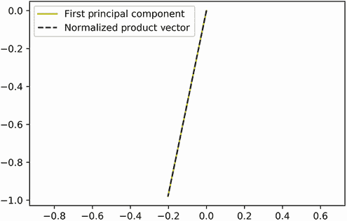

图 14.19 `first_pc` 与 `cov_matrix` 和 `first_pc` 的归一化乘积的绘图。两个绘制的向量是相同的。协方差矩阵与主成分的乘积指向与该主成分相同的方向。

注意：当计算矩阵和向量的乘积时，我们将向量视为一个单列表。因此，具有`x`个元素的向量被视为一个有`x`行和一列的矩阵。一旦向量被重新配置为矩阵，就执行标准的矩阵乘法。这种乘法产生另一个单列矩阵，这相当于一个向量。因此，矩阵`M`和向量`v`的乘积等于`np.array([row @ v for row in M])`。

列表 14.41 揭示`cov_matrix`和`first_pc`之间的关系

```
def plot_vector(vector, **kwargs):                   ❶
    plt.plot([0, vector[0]], [0, vector[1]], **kwargs)

plot_vector(first_pc, c='y', label='First Principal Component')
product_vector = cov_matrix @ first_pc
product_vector /= norm(product_vector)
plot_vector(product_vector, c='k', linestyle='--',
            label='Normalized Product Vector')

plt.legend()
plt.axis('equal')
plt.show()
```

❶ 这个辅助函数将二维向量绘制为从原点延伸的线段。

绘制的两个向量是相同的！`cov_matrix`和`first_pc`的矩阵-向量乘积指向与`first_pc`相同的方向。因此，根据定义，`first_pc`是`cov_matrix`的*特征向量*。矩阵的特征向量满足以下特殊性质：矩阵和特征向量的乘积指向与特征向量相同的方向。方向不会改变，无论我们进行多少次乘法。所以，`cov_matrix @ product_vector`指向与`product_vector`相同的方向，向量之间的角度等于零。让我们来确认。

列表 14.42 计算特征向量乘积之间的角度

```
product_vector2 = cov_matrix @ product_vector
product_vector2 /= norm(product_vector2)
cosine_similarity = product_vector @ product_vector2            ❶
angle = np.degrees(np.arccos(cosine_similarity))                ❷
print(f"The angle between vectors equals {angle:.2f} degrees")

The angle between vectors equals 0.00 degrees
```

❶ 两个向量都是单位向量。在第十三部分中讨论过，两个单位向量的点积等于它们之间角度的余弦值。

❷ 对余弦相似度的反余弦返回向量之间的角度。

矩阵与其特征向量的乘积保持特征向量的方向。然而，在大多数情况下，它会改变特征向量的幅度。例如，`first_pc`是一个幅度为 1 的特征向量。将`first_pc`与协方差矩阵相乘将使该幅度增加 x 倍。让我们通过运行`norm(cov_matrix @ first_pc)`来打印实际幅度变化。

列表 14.43 测量幅度变化

```
new_magnitude = norm(cov_matrix @ first_pc)
print("Multiplication has stretched the first principal component by "
      f"approximately {new_magnitude:.1f} units.")

Multiplication has stretched the first principal component by
approximately 541.8 units
```

乘法将`first_pc`在第一主方向上拉伸了 541.8 个单位。因此，`cov_matrix @ first_pc`等于`541.8 * first_pc`。对于任何矩阵`m`及其特征向量`eigen_vec`，`m`和`eigen_vec`的乘积始终等于`v * eigen_vec`，其中`v`是一个数值，正式称为*特征值*。我们的`first_pc`特征向量的特征值约为 541。这个值可能看起来很熟悉，因为我们之前见过它：在本节的开头，我们打印了最大化的 x 轴方差，其值约为 541。因此，我们的特征值等于第一主方向上的方差。我们可以通过调用`(centered_data @ first_pc).var()`来确认。

列表 14.44 比较特征值与方差

```
variance = (centered_data.T @ first_pc).var()
direction1_var = projections[0].var()
assert round(variance, 10) == round(direction1_var, 10)
print("The variance along the first principal direction is approximately"
       f" {variance:.1f}")

The variance along the first principal direction is approximately 541.8
```

让我们回顾我们的观察：

+   第一主成分是协方差矩阵的特征向量。

+   相关联的特征值等于第一主方向上的方差。

这些观察并非巧合。数学家已经证明了以下内容：

+   数据集的主成分等于数据集协方差矩阵的规范化特征向量。

+   主方向上的方差等于相关主成分的特征值。

因此，为了揭示第一个主成分，只需执行以下操作：

1.  计算协方差矩阵。

1.  找到具有最大特征值的矩阵的特征向量。该特征向量对应于具有最高方差覆盖率的方向。

我们可以使用称为 *幂迭代法* 的简单算法提取具有最大特征值的特征向量。

关键术语

+   *协方差矩阵*——`m @ m.T / m.shape[1]`，其中 `m` 是具有零均值的矩阵。协方差矩阵的对角线等于 `m` 每个轴上的方差。

+   *特征向量*——与矩阵相关联的特殊类型的向量。如果 `m` 是具有特征向量 `eigen_vec` 的矩阵，那么 `m @ eigen_vec` 将指向与 `eigen_vec` 相同的方向。此外，如果 `m` 是协方差矩阵，则 `eigen_vec` 是主成分。

+   *特征值*——与特征向量相关联的数值。如果 `m` 是具有特征向量 `eigen_vec` 的矩阵，那么 `m @ eigen_vec` 将特征向量拉伸 `eigenvalue` 个单位。因此，特征值等于 `norm(m @ eigen_vec) / norm(eigen_vec)`。主成分的特征值等于该成分覆盖的方差。

### 14.4.1 使用幂迭代法提取特征向量

我们的目标是获得 `cov_matrix` 的特征向量。执行此操作的步骤很简单。我们首先生成一个随机单位向量，`random_vector`。

列表 14.45 生成随机单位向量

```
np.random.seed(0)
random_vector = np.random.random(size=2)
random_vector /= norm(random_vector)
```

接下来，我们计算 `cov_matrix @ random_vector`。这个矩阵-向量乘积既旋转又拉伸我们的随机向量。我们规范化新向量，使其大小与 `random_vector` 相当，然后绘制新向量和随机向量（图 14.20）。我们期望这两个向量将指向不同的方向。

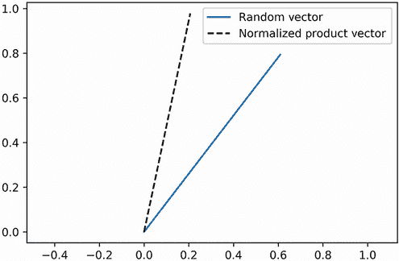

图 14.20 `random_vector` 与规范化后的 `cov_matrix` 和 `random_vector` 的乘积的绘图。两个绘制的向量指向不同的方向。

列表 14.46 计算 `cov_matrix` 和 `random_vector` 的乘积

```
product_vector = cov_matrix @ random_vector
product_vector /= norm(product_vector)

plt.plot([0, random_vector[0]], [0, random_vector[1]],
          label='Random Vector')
plt.plot([0, product_vector[0]], [0, product_vector[1]], linestyle='--',
         c='k', label='Normalized Product Vector')

plt.legend()
plt.axis('equal')
plt.show()
```

我们的两个向量没有任何共同点。让我们看看当我们通过运行 `cov_matrix @ product_vector` 重复前面的步骤会发生什么。接下来，我们规范化并绘制这个额外的向量，以及之前绘制的 `product_vector`（图 14.21）。

列表 14.47 计算 `cov_matrix` 和 `product_vector` 的乘积

```
product_vector2 = cov_matrix @ product_vector
product_vector2 /= norm(product_vector2)

plt.plot([0, product_vector[0]], [0, product_vector[1]], linestyle='--',
         c='k', label='Normalized Product Vector')
plt.plot([0, product_vector2[0]], [0, product_vector2[1]], linestyle=':',
         c='r', label='Normalized Product Vector2')
plt.legend()
plt.axis('equal')
plt.show()
```

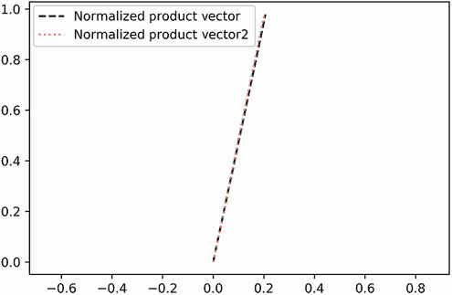

图 14.21 `product_vector` 与规范化后的 `cov_matrix` 和 `product_vector` 的乘积的绘图。两个绘制的向量完全相同。因此，我们已经发现了协方差矩阵的一个特征向量。

我们的产品向量指向相同的方向！因此，`product_vector` 是 `cov_matrix` 的特征向量。基本上，我们进行了一次 *幂迭代*，这是一种简单的特征向量检测算法。我们在算法的使用上很幸运：一次矩阵乘法就足以揭示特征向量。更常见的情况是，需要额外的几次迭代。

幂迭代的工作原理如下：

1.  生成一个随机单位向量。

1.  将向量乘以我们的矩阵，并对结果进行归一化。我们的单位向量被旋转了。

1.  重复执行前面的步骤，直到单位向量“卡住”——它不再旋转。根据定义，它现在是一个特征向量。

幂迭代保证收敛到一个特征向量（如果存在的话）。一般来说，10 次迭代就足够实现收敛。得到的特征向量相对于矩阵的其他特征向量具有可能的最大特征值。

注意：一些矩阵具有具有负特征值的特征向量。在这种情况下，幂迭代返回具有最大绝对特征值的特征向量。

让我们定义一个 `power_iteration` 函数，它接受一个矩阵作为输入。它返回一个特征向量和特征值作为输出。我们通过运行 `power_ iteration(cov_matrix)` 来测试这个函数。

列表 14.48 实现幂迭代算法

```
np.random.seed(0)
def power_iteration(matrix):
    random_vector = np.random.random(size=matrix.shape[0])
    random_vector = random_vector / norm(random_vector)
    old_rotated_vector = random_vector
    for _ in range(10):
        rotated_vector = matrix @ old_rotated_vector
        rotated_vector = rotated_vector / norm(rotated_vector)
        old_rotated_vector = rotated_vector

    eigenvector = rotated_vector
    eigenvalue = norm(matrix @ eigenvector)
    return eigenvector, eigenvalue

eigenvector, eigenvalue = power_iteration(cov_matrix)
print(f"The extracted eigenvector is {eigenvector}")
print(f"Its eigenvalue is approximately {eigenvalue: .1f}")

The extracted eigenvector is [0.20223994 0.979336  ]
Its eigenvalue is approximately  541.8
```

`power_iteration` 函数提取了一个特征值为约 541 的特征向量。这对应于第一个主轴的方差。因此，我们的特征向量等于第一个主成分。

注意：你可能已经注意到，图 14.21 中提取的特征向量在图中向正值方向拉伸。同时，图 14.19 中的第一个主成分向负值方向拉伸。如前所述，在 PCA 执行期间，主成分 `pc` 可以与 `-pc` 互换使用——投影到主方向不会产生错误。唯一明显的影响将是反射在投影轴上的差异，如图 14.13 所示。

我们的函数返回具有最大特征值的单个特征向量。因此，`power_iteration(cov_matrix)` 返回具有最大方差覆盖的主成分。如前所述，第二个主成分也是一个特征向量。它的特征值对应于第二个主方向的方差。因此，该分量是具有第二大的特征值的特征向量。我们如何找到它？这个解决方案只需要几行代码。没有了解高等数学，这个解决方案不容易理解，但我们将回顾其基本步骤。

为了提取第二个特征向量，我们必须从 `cov_matrix` 中消除第一个特征向量的所有痕迹。这个过程被称为 *矩阵降维*。一旦矩阵被降维，其第二大特征值就变成了其最大的特征值。为了降维 `cov_matrix`，我们必须计算 `eigenvector` 与其自身的 *外积*。这个外积是通过计算 `eigenvector[i] * eigenvector[j]` 的成对乘积来计算的，对于 `i` 和 `j` 的所有可能值。成对乘积存储在一个矩阵 `M` 中，其中 `M[i][j] = eigenvector[i] * eigenvector[j]`。我们可以使用两个嵌套循环或使用 NumPy 并运行 `np.outer(eigenvector, eigenvector)` 来计算外积。

注意 通常，外积是在两个向量 `v1` 和 `v2` 之间计算的。那个外积返回一个矩阵 `m`，其中 `m[i][j]` 等于 `v1[i] * v2[j]`。在矩阵降维过程中，`v1` 和 `v2` 都等于 `eigenvector`。

列表 14.49 计算特征向量与其自身的外积

```
outer_product = np.outer(eigenvector, eigenvector)
for i in range(eigenvector.size):
    for j in range(eigenvector.size):
        assert outer_product[i][j] == eigenvector[i] * eigenvector[j]
```

给定外积，我们可以通过运行 `cov_matrix - eigenvalue * outer_product` 来降维 `cov_matrix`。这个基本操作产生一个矩阵，其主特征向量等于第二个主成分。

列表 14.50 降维协方差矩阵

```
deflated_matrix = cov_matrix - eigenvalue * outer_product
```

运行 `product_iteration(deflated_matrix)` 返回一个我们将称之为 `next_eigenvector` 的特征向量。根据我们的讨论，我们知道以下应该是正确的：

+   `next_eigenvector` 等于第二个主成分。

+   因此，`np.array([eigenvector, next_eigenvector])` 等于一个主成分矩阵，我们称之为 `components`。

+   执行 `components @ centered_data` 将我们的数据集投影到其主方向上。

+   绘制投影应产生一个水平放置的、类似图 14.8 或图 14.13 中的雪茄形状的图。

接下来，我们提取 `next_eigenvector` 并执行上述投影。然后我们绘制投影以确认我们的假设是正确的（图 14.22）。

列表 14.51 从降维矩阵中提取第二个主成分

```
np.random.seed(0)
next_eigenvector, _ = power_iteration(deflated_matrix)
components = np.array([eigenvector, next_eigenvector])
projections = components @ centered_data
plt.scatter(projections[0], projections[1])
plt.axhline(0, c='black')
plt.axvline(0, c='black')
plt.axis('equal')
plt.show()

```

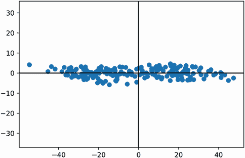

图 14.22 将 `centered_data` 投影到其主成分上的图，其中主成分是通过幂迭代法计算的。该图与图 14.13 相同，后者是使用 scikit-learn 的 PCA 实现生成的。

NumPy 矩阵降维计算

+   `np.outer(eigenvector, eigenvector)`—计算一个特征向量的外积。返回一个矩阵 `m`，其中 `m[i][j]` 等于 `eigenvector[i] * eigenvector[j]`。

+   `matrix -= eigenvalue * np.outer(eigenvector, eigenvector)`—通过从矩阵中移除具有最大特征值特征向量的所有痕迹来降维矩阵。运行 `power_iteration(matrix)` 返回具有下一个最大特征值的特征向量。

我们基本上开发了一个算法，用于提取所有行平均值为零的矩阵的前 *K* 个主成分。给定任何这样的 `centered_matrix`，算法的执行如下：

1.  通过运行 `centered_matrix @ centered_matrix.T` 计算中心化矩阵的协方差矩阵。

1.  在协方差矩阵上运行 `power_iteration`。该函数返回协方差矩阵的一个特征向量（`eigenvector`），对应于最大的可能特征值（`eigenvalue`）。这个特征向量等于第一个主成分。

1.  通过减去 `eigenvalue * np.outer(eigenvector, eigenvector)` 来降维矩阵。在降维矩阵上运行 `power_iteration` 提取下一个主成分。

1.  重复之前的步骤 *K* – 2 次以提取前 *K* 个主成分。

让我们通过定义 `find_top_principal_components` 函数来实现该算法。该函数从 `centered_matrix` 输入中提取前 *K* 个主成分。

列表 14.52 提取前 *K* 个主成分

```
def find_top_principal_components(centered_matrix, k=2):    ❶
    cov_matrix = centered_matrix @ centered_matrix.T
    cov_matrix /= centered_matrix[1].size
    return find_top_eigenvectors(cov_matrix, k=k)           ❷

def find_top_eigenvectors(matrix, k=2):
    matrix = matrix.copy()                                  ❸
    eigenvectors = []
    for _ in range(k):
        eigenvector, eigenvalue = power_iteration(matrix)
        eigenvectors.append(eigenvector)
        matrix -= eigenvalue * np.outer(eigenvector, eigenvector)

    return np.array(eigenvectors)
```

❶ 从一个所有行平均值为零的矩阵中提取前 *K* 个主成分。K 的值预设为 2。

❷ 主成分仅仅是协方差矩阵的前几个特征向量（特征向量的秩由特征值确定）。为了强调这一点，我们定义了一个单独的函数来提取任何矩阵的前 *K* 个特征向量。

❸ 制作矩阵的副本，这样我们就可以在不修改原始矩阵的情况下对副本进行降维

我们定义了一个函数来提取数据集的前 *K* 个主成分。这些成分使我们能够将数据集投影到其前 *K* 个主方向上。这些方向在 *K* 个轴上最大化数据分散。因此，可以忽略剩余的数据轴，将坐标列的大小缩减到 *K*。因此，我们可以将任何数据集降低到 *K* 维。

基本上，我们现在能够从头开始运行 PCA，而不依赖于 scikit-learn。我们可以使用 PCA 将 *N*-维数据集降低到 *K* 维（其中 *N* 是输入数据矩阵的列数）。要运行该算法，我们必须执行以下步骤：

1.  计算数据集中每个轴上的均值。

1.  从每个轴上减去均值，从而将数据集中心化在原点。

1.  使用 `find_top_principal_components` 函数从中心化数据集中提取前 *K* 个主成分。

1.  将主成分与中心化数据集进行矩阵乘法。

让我们在一个名为 `reduce_dimensions` 的函数中实现这些步骤。为什么不叫这个函数 `pca` 呢？嗯，PCA 的前两个步骤要求我们对数据进行中心化。然而，我们很快就会了解到，降维可以在不进行中心化的情况下实现。因此，我们将一个可选的 `centralize_data` 参数传递到我们的函数中。我们预设该参数为 `True`，以确保函数在默认条件下执行 PCA。

列表 14.53 定义 `reduce_dimensions` 函数

```
def reduce_dimensions(data, k=2, centralize_data=True):     ❶
    data = data.T.copy()                                    ❷
    if centralize_data:                                     ❸
        for i in range(data.shape[0]):
            data[i] -= data[i].mean()

    principal_components = find_top_principal_components(data)
    return (principal_components @ data).T
```

❶ 函数接受一个数据矩阵作为输入，其列对应于轴。这与 scikit-learn 的 fit_transform 方法的输入方向一致。然后函数将矩阵从 N 列减少到 k 列。

❷ 数据被转置，以保持与 `find_principal_components` 预期输入的一致性。

❸ 可选地通过减去其均值来集中数据，使新的均值等于 0

让我们通过将 `reduce_dimensions` 应用于之前分析的 `flower_measurements` 数据来测试它。我们使用自定义的 PCA 实现将数据降至 2D，然后可视化结果（图 14.23）。我们的图表应该与图 14.18 中的图表一致。

列表 14.54 使用自定义 PCA 实现将花数据降至 2D

```
np.random.seed(0)
dim_reduced_data = reduce_dimensions(flower_measurements)

visualize_flower_data(dim_reduced_data)
```


图 14.23 使用自定义 PCA 实现将 4D 归一化花测量数据降至二维。图表与 scikit-learn 生成的 PCA 输出相同。

我们的图表完美地类似于 scikit-learn 的 PCA 输出。我们重新设计了 scikit-learn 的实现，但有一个很大的不同：在我们的函数中，集中化是可选的。这将会很有用！正如我们之前讨论的，我们无法可靠地对归一化数据进行集中化。此外，我们的花数据集已经被归一化以消除单位差异。因此，我们无法可靠地运行 `flower_measurements` 的 PCA。一个替代方案是通过将 `centralize_data=False` 传递给 `reduce_dimensions` 来绕过集中化。当然，这违反了 PCA 算法的许多假设。然而，输出仍然可能是有用的。如果我们不进行集中化就降低 `flower_measurements` 的维度会发生什么？让我们通过将 `centralize_data` 设置为 `False` 并绘制结果（图 14.24）来找出答案。

列表 14.55 在未集中化的情况下运行 `reduce_dimensions`

```
np.random.seed(3)                                           ❶
dim_reduced_data = reduce_dimensions(flower_measurements,
                                     centralize_data=False)
visualize_flower_data(dim_reduced_data)
```

❶ 如前所述，特征向量提取的随机性可以影响 2D 图表的方向。在这里，我们播种算法以确保方向与稍后呈现的另一个图表一致（图 14.25）。

![图片 14-24.png]

图 14.24 4D 归一化花测量数据在未集中化的情况下降至二维。每个绘制的花点根据其物种着色。三种物种继续落入三个簇中。然而，图表不再类似于我们的 PCA 输出。

在输出中，三种花物种继续分离成三个簇。此外，*Setosa* 仍然在空间上与其他物种明显不同。然而，图表中有所变化。*Setosa* 形成的簇比之前在 PCA 结果中观察到的更紧密。这引发了一个问题，我们的最新图表是否像我们的 PCA 输出那样全面？换句话说，它是否继续代表 97% 的总数据方差？我们可以通过测量 `dim_reduced_data` 的方差并将其除以 `flower_measurements` 的总方差来检查。

列表 14.56 检查未中心化降低数据时的方差

```
variances = [sum(data[:,i].var() for i in range(data.shape[1]))
             for data in [dim_reduced_data, flower_measurements]]
dim_reduced_var, total_var = variances
percent_coverege = 100 * dim_reduced_var / total_var
print(f"Our plot covers {percent_coverege:.2f}% of the total variance")

Our plot covers 97.29% of the total variance
```

我们保持了二维方差覆盖。尽管其值略有波动，但覆盖率保持在约 97%。因此，我们可以降低维度而不依赖于中心化。然而，中心化仍然是 PCA 的一个定义特征，因此我们的改进技术需要一个不同的名称。官方名称，如前所述，该技术称为 *奇异值分解*（SVD）。

警告 与 PCA 不同，SVD 并不保证在降低输出中的每个轴上最大化方差。然而，在大多数实际情况下，SVD 能够将数据降维到非常实用的程度。

SVD 的数学性质很复杂，超出了本书的范围。尽管如此，计算机科学家可以使用这些性质来非常高效地执行 SVD，并且这些优化已经集成到 scikit-learn 中。在下一个小节中，我们将利用 scikit-learn 优化的 SVD 实现。

## 14.5 使用 SVD 和 scikit-learn 进行高效降维

Scikit-learn 包含一个名为 `TruncatedSVD` 的降维类，该类旨在优化 SVD 的执行。让我们从 `sklearn.decomposition` 中导入 `TruncatedSVD`。

列表 14.57 从 scikit-learn 导入 `TruncatedSVD`

```
from sklearn.decomposition import TruncatedSVD
```

将 `TruncatedSVD` 应用于我们的 `flower_measurements` 数据非常简单。首先，我们需要运行 `TruncatedSVD(n_components=2)` 来创建一个 `svd_object` 对象，该对象能够将数据降至二维。然后，我们可以通过运行 `svd_object.fit_(flower_measurements)` 来执行 SVD。该方法调用返回一个二维的 `svd_transformed_data` 矩阵。接下来，我们应用 `TruncatedSVD` 并绘制我们的结果（图 14.25）。该图表应该类似于我们的自定义 SVD 输出，如图 14.24 所示。

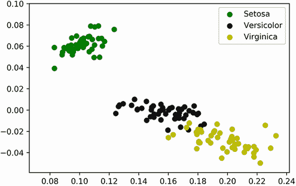

图 14.25 使用 scikit-learn 的 SVD 实现将 4D 标准化花朵测量数据降至二维。输出与图 14.24 相同，后者是使用我们的自定义 SVD 实现生成的。

注意 与 `PCA` 类不同，scikit-learn 的 `TruncatedSVD` 实现需要一个 `n_components` 输入。该参数的默认值预设为 2。

列表 14.58 使用 scikit-learn 运行 SVD

```
svd_object = TruncatedSVD(n_components=2)
svd_transformed_data = svd_object.fit_transform(flower_measurements)
visualize_flower_data(svd_transformed_data)
```

毫不奇怪，scikit-learn 的结果与我们的自定义 SVD 实现完全相同。scikit-learn 的算法更快，更节省内存，但其输出并未偏离我们的结果。

注意 当我们降低维度数量时，输出不会偏离。然而，随着维度数量的增加，我们的实现将变得不够精确，因为微小的错误会渗入我们的特征向量计算中。这些微小错误会随着每个计算的特征向量而放大。另一方面，scikit-learn 使用数学技巧来限制这些错误。

我们可以通过比较方差覆盖率来进一步验证输出之间的重叠。我们的 `svd_object` 有一个 `explained_variance_ratio_` 属性，它包含一个数组，表示每个降维维度覆盖的分数方差。对 `100 * explained_variance_ratio_` 进行求和应该返回在 2D 图中覆盖的总方差的百分比。根据我们的分析，我们预计这个输出将接近 97.29%。让我们来确认一下。

列表 14.59 从 scikit-learn 的 SVD 输出中提取方差

```
percent_variance_coverages = 100 * svd_object.explained_variance_ratio_  ❶
x_axis_coverage, y_axis_coverage = percent_variance_coverages            ❷
total_2d_coverage = x_axis_coverage + y_axis_coverage
print(f"Our Scikit-Learn SVD output covers {total_2d_coverage:.2f}% of "
       "the total variance")

Our Scikit-Learn SVD output covers 97.29% of the total variance
```

❶ 该属性是一个 NumPy 数组，包含每个轴的分数覆盖率。乘以 100 将这些分数转换为百分比。

❷ 数组的第 *i* 个元素对应于第 *i* 个轴的方差覆盖率。

常见的 scikit-learn SVD 方法

+   `svd_object = TruncatedSVD(n_components=K)`—创建一个可以将输入数据降至 *K* 维度的 SVD 对象。

+   `svd_tranformed_data = svd_object.fit_transform(data)`—使用初始化的 `TruncatedSVD` 对象对输入数据进行 SVD 计算。`fit_transform` 方法假定 `data` 矩阵的列对应于空间轴。降维后的结果存储在 `svd_transformed_data` 矩阵中。

+   `svd_object.explained_variance_ratio_`—返回与拟合的 `TruncatedSVD` 对象的每个降维轴相关联的分数方差覆盖率。

Scikit-learn 的优化 SVD 实现可以将数据从数万个维度减少到只有几百或几十个维度。压缩后的数据可以更有效地被存储、传输和处理，以便由预测算法使用。许多实际数据任务在分析之前需要使用 SVD 进行数据压缩。应用范围从图像压缩、音频噪声消除到自然语言处理。特别是，NLP 由于文本数据的膨胀性质，依赖于该算法。正如我们在上一节中讨论的，现实世界的文档形成非常大的矩阵，其列数非常高。我们无法有效地乘以这样的矩阵，因此无法计算文本相似度。幸运的是，SVD 使这些文档矩阵变得更容易管理。SVD 允许我们在保留大部分方差的同时减少文本矩阵的列数，这样我们就可以及时地计算大规模文本相似度。然后，这些文本相似度可以用来对输入文档进行聚类。

在下一节中，我们最终分析大型文档数据集。我们学习如何清理和聚类这些数据集，同时可视化聚类输出。我们使用 SVD 的方法将证明对这个分析至关重要。

## 摘要

+   降低数据集的维度可以简化某些任务，如聚类。

+   我们可以通过围绕原点旋转数据，直到数据点靠近 x 轴，将二维数据集减少到一维。这样做最大化了沿 x 轴的数据分布，从而允许我们删除 y 轴。然而，这种旋转需要我们首先将数据集中心化，使其平均坐标位于原点。

+   将数据旋转到 x 轴方向相当于将 x 轴旋转到**第一主方向**。第一主方向是数据方差最大化的线性方向。**第二主方向**与第一主方向垂直。在二维数据集中，这个方向代表第一主方向未覆盖的剩余方差。

+   可以使用**主成分分析**（PCA）进行降维。PCA 揭示了数据集的主方向，并使用称为**主成分**的单位向量来表示它们。中心化数据矩阵与主成分的乘积交换了数据的标准轴与主方向。这种轴交换称为**投影**。当我们将数据投影到主方向上时，我们最大化了某些轴上的数据分散，并最小化了其他轴上的数据分散。分散度降低的轴可以被删除。

+   我们可以通过计算一个**协方差矩阵**来提取主成分：将中心化数据集与其自身进行矩阵乘积，然后除以数据集的大小。该矩阵的对角线表示轴的方差值。

+   主成分是协方差方差的**特征向量**。因此，根据定义，协方差矩阵与每个主成分的归一化乘积等于该主成分。

+   我们可以使用**幂迭代**算法提取矩阵的最高特征向量。幂迭代包括通过矩阵重复乘法和归一化一个向量。将幂迭代应用于协方差矩阵返回第一个主成分。

+   通过应用**矩阵降维**，我们可以消除特征向量的所有痕迹。对协方差矩阵进行降维并重新应用幂迭代返回第二个主成分。重复此过程会迭代地返回所有主成分。

+   PCA 对测量单位敏感。对输入数据进行归一化可以减少这种敏感性。然而，作为后果，归一化后的数据将接近其平均值。这是一个问题，因为 PCA 要求我们从每个轴值中减去平均值以中心化数据。减去接近的值会导致浮点误差。

+   我们可以通过在运行降维之前拒绝中心化我们的数据来避免这些浮点误差。结果输出以足够有意义的程度捕捉数据方差。这种修改后的技术称为**奇异值分解**（SVD）。
