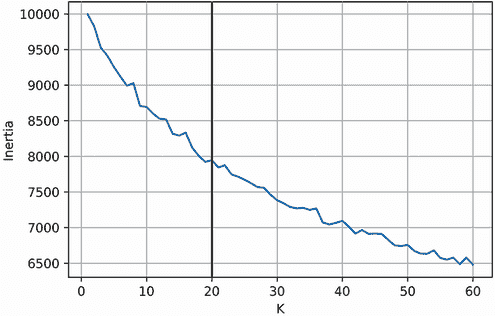
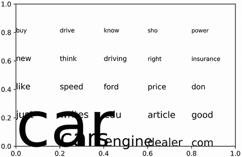
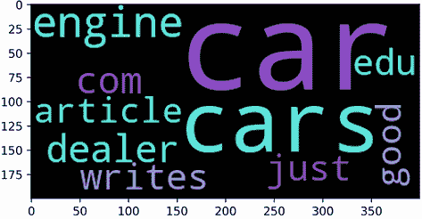
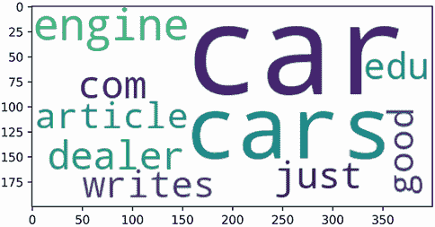
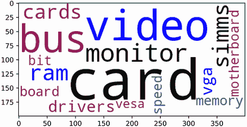
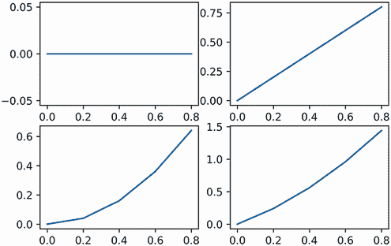
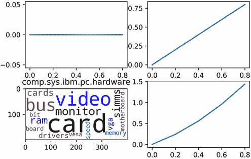
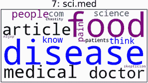

# 15 大型文本数据集的 NLP 分析

本节涵盖

+   使用 scikit-learn 向量化文本

+   对向量化文本数据进行降维

+   大型文本数据集的聚类

+   可视化文本聚类

+   同时显示多个可视化

我们之前关于自然语言处理（NLP）技术的讨论主要集中在玩具示例和小数据集上。在本节中，我们对大量现实世界文本执行 NLP。鉴于迄今为止介绍的技术，这种分析似乎很简单。例如，假设我们在多个在线讨论论坛中进行市场研究。每个论坛由数百名用户组成，他们讨论特定主题，如政治、时尚、技术或汽车。我们希望根据用户对话的内容自动提取所有讨论主题。这些提取的主题将被用于规划营销活动，该活动将针对用户的在线兴趣进行定位。

我们如何将用户讨论聚类成主题？一种方法可以是以下步骤：

1.  使用第十三部分中讨论的技术将所有讨论文本转换为词频矩阵。

1.  使用奇异值分解（SVD）对词频矩阵进行降维。这将使我们能够通过矩阵乘法有效地完成所有文本相似性对。

1.  利用文本相似度矩阵将讨论聚类成主题。

1.  探索主题聚类以识别对我们营销活动有用的主题。

当然，在现实生活中，这种简单的分析并不像看起来那么简单。未解决的问题仍然存在。我们如何在不逐个阅读所有聚类文本的情况下有效地探索主题聚类？此外，我们应该利用第十部分中介绍的哪个聚类算法来聚类讨论？

即使在成对文本比较的水平上，我们也面临某些问题。我们如何处理诸如 *the*、*it* 和 *they* 这样的常见无信息词？我们应该惩罚它们吗？忽略它们？完全过滤掉它们？那么，关于诸如托管讨论论坛的网站名称之类的其他常见、语料库特定的词怎么办？

所有这些问题都有答案，这些答案最好通过实际探索包含数千个文本的在线论坛数据集来理解。Scikit-learn 在其示例数据集中包含这样一个现实世界的数据集。在本节中，我们加载、探索并对这个大型在线论坛数据集进行聚类。Python 的外部数据科学库，如 scikit-learn 和 NumPy，将在这种现实世界分析中证明其价值。

## 15.1 使用 scikit-learn 加载在线论坛讨论

Scikit-learn 为我们提供了来自 Usenet 的数据，Usenet 是一个成熟的在线讨论论坛集合。这些 Usenet 论坛被称为*newsgroups*。每个单独的新闻组都专注于某个讨论主题，这在其新闻组名称中简要概述。新闻组中的用户通过发布消息进行交流。这些用户帖子不受长度限制，因此有些帖子可能相当长。帖子的多样性和不同长度将给我们一个机会来扩展我们的 NLP 技能。为了训练目的，scikit-learn 库提供了超过 10,000 篇已发布消息的访问权限。我们可以通过从`sklearn.datasets`导入`fetch_20newsgroups`来加载这些新闻组帖子。调用`fetch_20newsgroups()`返回一个包含文本数据的`newsgroups`对象。此外，将`remove=('headers', 'footers')`作为可选参数传递给函数调用会从文本中删除冗余信息。（删除的元数据并不对应于有意义的帖子内容。）列表 15.1 在过滤冗余信息的同时加载了新闻组数据。

警告：新闻组数据集相当大。因此，它没有与 scikit-learn 预包装。运行`fetch_20newsgroups`会强制 scikit-learn 在本地机器上下载并存储数据集，因此首次获取数据集时需要互联网连接。所有随后的`fetch_20newsgroups`调用都将从本地加载数据集，而不需要互联网连接。

列表 15.1 获取新闻组数据集

```
from sklearn.datasets import fetch_20newsgroups
newsgroups = fetch_20newsgroups(remove=('headers', 'footers'))
```

`newsgroups`对象包含来自 20 个不同新闻组的帖子。如前所述，每个新闻组的讨论主题在其名称中概述。我们可以通过打印`newsgroups.target_names`来查看这些新闻组名称。

列表 15.2 打印所有 20 个新闻组的名称

```
print(newsgroups.target_names)

['alt.atheism', 'comp.graphics', 'comp.os.ms-windows.misc',
'comp.sys.ibm.pc.hardware', 'comp.sys.mac.hardware', 'comp.windows.x',
 'misc.forsale', 'rec.autos', 'rec.motorcycles', 'rec.sport.baseball',
 'rec.sport.hockey', 'sci.crypt', 'sci.electronics', 'sci.med', 'sci.space',
 'soc.religion.christian', 'talk.politics.guns', 'talk.politics.mideast',
 'talk.politics.misc', 'talk.religion.misc']
```

新闻组类别差异很大，从太空探索（*sci.space*）到汽车（*rec.auto*）再到电子（*sci.electronics*）。有些类别非常广泛。例如，政治（*talk.politics.misc*）可以涵盖广泛的政治主题。其他类别则非常狭窄：例如，*comp.sys.mac.hardware*专注于 Mac 硬件，而*comp.sys.ibm.pc_hardware*专注于 PC 硬件。从类别上讲，这两个新闻组极其相似：唯一的区别是计算机硬件属于 Mac 还是 PC。有时类别差异很微妙；文本主题之间的边界是流动的，并不一定刻在石头上。我们在本节后面的聚类新闻组帖子时需要记住这一点。

现在，让我们将注意力转向实际的新闻组文本，这些文本存储在`newsgroups.data`属性中的列表中。例如，`newsgroups.data[0]`包含第一个存储的新闻组帖子的文本。让我们输出这篇帖子。

列表 15.3 打印第一个新闻组帖子

```
print(newsgroups.data[0])

I was wondering if anyone out there could enlighten me on this car I saw
the other day. It was a 2-door sports car, looked to be from the late 60s/
early 70s. It was called a Bricklin. The doors were really small.
In addition, the front bumper was separate from the rest of the body. This
is all I know. If anyone can tellme a model name, engine specs, years
of production, where this car is made, history, or whatever info you
have on this funky looking car, please e-mail.
```

这篇帖子是关于汽车的。它可能被发布在汽车讨论新闻组*rec.autos*中。我们可以通过打印`newsgroups.target_names[newsgroups.target[0]]`来确认。

注意`newsgroups.target[i]`返回与第*i*个文档相关联的新闻组名称的索引。

列表 15.4 打印索引为 0 的新闻组名称

```
origin = newsgroups.target_names[newsgroups.target[0]]
print(f"The post at index 0 first appeared in the '{origin}' group")

The post at index 0 first appeared in the 'rec.autos' group
```

正如我们所预测的，我们的与汽车相关的帖子出现在汽车讨论组中。一些关键词如*car*、*bumper*和*engine*的存在足以区分这一点。当然，这只是众多帖子中的一个。对剩余帖子进行分类可能不会那么容易。

让我们通过打印数据集大小来更深入地了解我们的新闻组数据集。

列表 15.5 计算新闻组帖子的数量

```
dataset_size = len(newsgroups.data)
print(f"Our dataset contains {dataset_size} newsgroup posts")

Our dataset contains 11314 newsgroup posts
```

我们的数据集包含超过 11,000 篇帖子。我们的目标是按主题对这些帖子进行聚类，但在这个规模上进行文本聚类需要计算效率。我们需要通过将我们的文本数据表示为矩阵来高效地计算新闻组帖子的相似度。为此，我们需要将每个新闻组帖子转换为一个词频（TF）向量。如第十三部分所述，TF 向量的索引映射到文档中的单词计数。之前，我们使用自定义函数计算这些向量化的单词计数。现在我们将使用 scikit-learn 来计算它们。

## 15.2 使用 scikit-learn 对文档进行向量化

Scikit-learn 提供了一个内置类，用于将输入文本转换为 TF 向量：`CountVectorizer`。初始化`CountVectorizer`创建了一个`vectorizer`对象，该对象能够将我们的文本进行向量化。接下来，我们从`sklearn.feature_extraction.text`导入`CountVectorizer`并初始化该类。

列表 15.6 初始化`CountVectorizer`对象

```
from sklearn.feature_extraction.text import CountVectorizer
vectorizer = CountVectorizer()
```

现在，我们已经准备好将存储在`newsgroups.data`列表中的文本进行向量化。我们所需做的只是运行`vectorizer.fit_transform(newsgroups.data)`。这个方法调用返回与向量化新闻组帖子对应的 TF 矩阵。作为提醒，TF 矩阵存储了所有文本（行）中单词（列）的计数。让我们将帖子向量化，然后打印出结果 TF 矩阵。

列表 15.7 使用 scikit-learn 计算 TF 矩阵

```
tf_matrix = vectorizer.fit_transform(newsgroups.data)
print(tf_matrix)

(0, 108644)   4
(0, 110106)   1
(0, 57577)    2
(0, 24398)    2
(0, 79534)    1
(0, 100942)   1
(0, 37154)    1
(0, 45141)    1
(0, 70570)    1
(0, 78701)    2
(0, 101084)   4
(0, 32499)    4
(0, 92157)    1
(0, 100827)   6
(0, 79461)    1
(0, 39275)    1
(0, 60326)    2
(0, 42332)    1
(0, 96432)    1
(0, 67137)    1
(0, 101732)   1
(0, 27703)    1
(0, 49871)    2
(0, 65338)    1
(0, 14106)    1
:    :
(11313, 55901)    1
(11313, 93448)    1
(11313, 97535)    1
(11313, 93393)    1
(11313, 109366)   1
(11313, 102215)   1
(11313, 29148)    1
(11313, 26901)    1
(11313, 94401)    1
(11313, 89686)    1
(11313, 80827)    1
(11313, 72219)    1
(11313, 32984)    1
(11313, 82912)    1
(11313, 99934)    1
(11313, 96505)    1
(11313, 72102)    1
(11313, 32981)    1
(11313, 82692)    1
(11313, 101854)   1
(11313, 66399)    1
(11313, 63405)    1
(11313, 61366)    1
(11313, 7462)     1
(11313, 109600)   1
```

我们打印的`tf_matrix`看起来不是一个 NumPy 数组。它是什么类型的数据结构？我们可以通过打印`type(tf_matrix)`来检查。

列表 15.8 检查`tf_matrix`的数据类型

```
print(type(tf_matrix))
<class 'scipy.sparse.csr.csr_matrix'>
```

这个矩阵是一个名为`csr_matrix`的 SciPy 对象。*CSR*代表*压缩稀疏行*，这是一种用于压缩主要由零组成的矩阵的存储格式。这些主要空矩阵被称为*稀疏矩阵*。通过仅存储非零元素，可以减小矩阵的大小。这种压缩导致更高效的内存使用和更快的计算。大规模基于文本的矩阵通常非常稀疏，因为单个文档通常只包含总词汇量的一小部分。因此，scikit-learn 会自动将向量化文本转换为 CSR 格式。转换是通过从 SciPy 导入的`csr_matrix`类来完成的。

这种各种外部数据科学库之间的交互很有用，但也有些令人困惑。特别是，对于一个新手来说，理解 NumPy 数组和 SciPy CSR 矩阵之间的区别可能有些棘手。这是因为数组和 CSR 矩阵共享一些属性，但并非全部。此外，数组和 CSR 矩阵与一些 NumPy 函数兼容，但并非全部。为了减少混淆，我们将`tf_matrix`转换为 2D NumPy 数组。我们后续的大部分分析都将在这个 NumPy 数组上进行。然而，我们将会定期比较数组和 CSR 矩阵的使用情况。这样做将使我们更全面地理解这两种矩阵表示之间的相似性和差异。列表 15.9 通过运行`tf_matrix.toarray()`将`tf_matrix`转换为 NumPy，然后打印转换后的结果。

警告：这种转换非常占用内存，需要近 10 GB 的内存。如果你的本地机器内存有限，我们建议你在 Google Colab（Colab）上执行此代码，Colab 是一个免费、基于云的 Jupyter Notebook 环境，提供 12 GB 的免费内存。Google 提供了一个全面的 Colab 使用介绍，涵盖了您开始所需的一切：[`colab.research.google.com/notebooks/welcome.ipynb`](https://colab.research.google.com/notebooks/welcome.ipynb)。

列表 15.9 将 CSR 矩阵转换为 NumPy 数组

```
tf_np_matrix = tf_matrix.toarray()
print(tf_np_matrix)

[[0 0 0 ... 0 0 0]
 [0 0 0 ... 0 0 0]
 [0 0 0 ... 0 0 0]
 ...
 [0 0 0 ... 0 0 0]
 [0 0 0 ... 0 0 0]
 [0 0 0 ... 0 0 0]]
```

打印的矩阵是一个 2D NumPy 数组。所有预览的矩阵元素都是零，这证实了矩阵相当稀疏。每个矩阵元素对应于帖子中单词的计数。矩阵行代表帖子，而列代表单个单词。因此，总列数等于我们的数据集的词汇量大小。我们使用`shape`属性来访问这个计数。这个属性由 CSR 矩阵和 NumPy 数组共享。让我们使用`tf_np_matrix.shape`来输出词汇量大小。

列表 15.10 检查词汇量大小

```
assert tf_np_matrix.shape == tf_matrix.shape
num_posts, vocabulary_size = tf_np_matrix.shape
print(f"Our collection of {num_posts} newsgroup posts contain a total of "
      f"{vocabulary_size} unique words")

Our collection of 11314 newsgroup posts contain a total of 114751 unique
words
```

我们的数据包含 114751 个独特的单词。然而，大多数帖子只包含几十个这些单词。我们可以通过在`tf_np_matrix[i]`行中计数非零元素的数量来衡量索引为`i`的帖子的独特单词计数。最容易计数这些非零元素的方法是使用 NumPy。这个库允许我们获取`tf_np_matrix[i]`向量中所有非零索引。我们只需将向量输入到`np.flatnonzero`函数中。接下来，我们计数并输出`newsgroups.data[0]`中汽车帖子的非零索引。

列表 15.11 计算汽车帖子中的独特单词

```
import numpy as np
tf_vector = tf_np_matrix[0]
non_zero_indices = np.flatnonzero(tf_vector)       ❶
num_unique_words = non_zero_indices.size
print(f"The newsgroup in row 0 contains {num_unique_words} unique words.")
print("The actual word counts map to the following column indices:\n")
print(non_zero_indices)

The newsgroup in row 0 contains 64 unique words.
The actual word-counts map to the following column indices:

[ 14106  15549  22088  23323  24398  27703  29357  30093  30629  32194
  32305  32499  37154  39275  42332  42333  43643  45089  45141  49871
  49881  50165  54442  55453  57577  58321  58842  60116  60326  64083
  65338  67137  67140  68931  69080  70570  72915  75280  78264  78701
  79055  79461  79534  82759  84398  87690  89161  92157  93304  95225
  96145  96432 100406 100827 100942 101084 101732 108644 109086 109254
 109294 110106 112936 113262]
```

❶ 这相当于运行`np.nonzero(tf_vector)[0]`。`np.nonzero`函数将非零索引的计算推广到 x 维数组。它返回一个长度为 x 的元组，其中每个*i*个元组元素表示第*i*维上的非零索引。因此，给定一个 1 维 tf_vector 数组，`np.nonzero`函数返回一个形式为(non_zero_indices)的元组。

第一篇新闻组的帖子包含 64 个独特的单词。这些单词是什么？为了找出这些单词，我们需要在 TF 向量索引和单词值之间建立一个映射。这个映射可以通过调用`vectorizer.get_feature_names()`生成，它返回一个我们称之为`words`的单词列表。每个索引`i`对应于列表中的第*i*个单词。因此，运行`[words[i] for i in non_zero_indices]`将返回我们帖子中的所有独特单词。

注意：我们也可以通过调用`vectorizer.inverse_transform(tf_vector)`来获取这些单词。`inverse_transform`方法返回与输入的 TF 向量相关联的所有单词。

列表 15.12 打印汽车帖子中的独特单词

```
words = vectorizer.get_feature_names()
unique_words = [words[i] for i in non_zero_indices]
print(unique_words)

['60s', '70s', 'addition', 'all', 'anyone', 'be', 'body', 'bricklin',
'bumper', 'called', 'can', 'car', 'could', 'day', 'door', 'doors',
'early', 'engine', 'enlighten', 'from', 'front', 'funky', 'have',
'history', 'if', 'in', 'info', 'is', 'it', 'know', 'late', 'looked',
'looking', 'made', 'mail', 'me', 'model', 'name', 'of', 'on', 'or',
'other', 'out', 'please', 'production', 'really', 'rest', 'saw',
'separate', 'small', 'specs', 'sports', 'tellme', 'the', 'there',
'this', 'to', 'was', 'were', 'whatever', 'where', 'wondering', 'years',
'you']
```

我们已经打印了`newsgroups.data[0]`中的所有单词。当然，并不是所有这些单词的提及次数都相等——有些比其他单词出现得更频繁。也许这些频繁出现的单词与汽车的主题更为相关。列表 15.13 打印了帖子中频率最高的 10 个单词及其相关计数。为了可视化目的，我们将此输出表示为 Pandas 表格。

提取 1 维 NumPy 数组中的非零元素

+   `non_zero_indices = np.flatnonzero(np_vector)`——返回 1 维 NumPy 数组中的非零索引

+   `non_zero_vector = np_vector[non_zero_indices]`——选择 1 维 NumPy 数组中的非零元素（假设`non_zero_indices`对应于该数组的非零索引）

列表 15.13 打印汽车帖子中最频繁的单词

```
import pandas as pd
data = {'Word': unique_words,
        'Count': tf_vector[non_zero_indices]}

df = pd.DataFrame(data).sort_values('Count', ascending=False)     ❶
print(df[:10].to_string(index=False))

Word  Count
    the      6
   this      4
    was      4
    car      4
     if      2
     is      2
     it      2
   from      2
     on      2
 anyone      2
```

❶ 根据计数对 Pandas 表格进行排序，从高到低

文章中的 64 个单词中有四个至少被提到了四次。其中一个是 *car*，考虑到文章出现在一个汽车讨论组中，这并不令人惊讶。然而，其他三个单词与汽车无关：*the*、*this* 和 *was* 是英语中最常见的单词之一。它们不能为汽车帖子与其他主题不同的帖子提供区分信号——相反，常见的单词是噪声的来源，增加了两个无关文档聚在一起的可能性。NLP 实践者将此类噪声词称为 *停用词*，因为它们被阻止出现在向量化的结果中。通常在向量化之前从文本中删除停用词。这就是为什么 `CountVectorizer` 类有一个内置的停用词删除选项。运行 `CountVectorizer(stop_words='english')` 将初始化一个准备进行停用词删除的向量器。该向量器会忽略文本中所有最常见的英语单词。

接下来，我们重新初始化一个停用词感知的向量器。然后我们重新运行 `fit_transform` 来重新计算 TF 矩阵。该矩阵中的单词列数将少于我们之前计算的词汇量 114,751。我们还重新生成了我们的 `words` 列表：这次，常见的停用词如 *the*、*this*、*of* 和 *it* 将会缺失。

列表 15.14 向量化过程中移除停用词

```
vectorizer = CountVectorizer(stop_words='english')
tf_matrix = vectorizer.fit_transform(newsgroups.data)
assert tf_matrix.shape[1] < 114751                             ❶

words = vectorizer.get_feature_names()
for common_word in ['the', 'this', 'was', 'if', 'it', 'on']:   ❷
    assert common_word not in words
```

❶ 确保我们的词汇量已经减小

❷ 已过滤掉常见的停用词。

所有停用词已从重新计算的 `tf_matrix` 中删除。现在我们可以重新生成 `newsgroups.data[0]` 中的前 10 个最频繁的单词。请注意，在这个过程中，我们重新计算了 `tf_np_matrix`、`tf_vector`、`unique_words`、`non_zero_indices` 和 `df`。

警告 这种重新生成过程非常消耗内存，需要 2.5 GB 的内存。

列表 15.15 停用词删除后重新打印的顶级单词

```
tf_np_matrix = tf_matrix.toarray()
tf_vector = tf_np_matrix[0]
non_zero_indices = np.flatnonzero(tf_vector)
unique_words = [words[index] for index in non_zero_indices]
data = {'Word': unique_words,
        'Count': tf_vector[non_zero_indices]}

df = pd.DataFrame(data).sort_values('Count', ascending=False)
print(f"After stop-word deletion, {df.shape[0]} unique words remain.")
print("The 10 most frequent words are:\n")
print(df[:10].to_string(index=False))

After stop-word deletion, 34 unique words remain.
The 10 most frequent words are:

       Word  Count
        car      4
        60s      1
        saw      1
    looking      1
       mail      1
      model      1
 production      1
     really      1
       rest      1
   separate      1
```

在停用词过滤后，剩下 34 个单词。其中，*car* 是唯一一个被提及超过一次的单词。其他 33 个单词的提及次数都是 1，并且被向量化器同等对待。然而，值得注意的是，并非所有单词在相关性上都是平等的。有些单词比其他单词更相关于汽车讨论：例如，单词 *model* 指的是汽车型号（尽管当然它也可能指超级模特或机器学习模型）。同时，单词 *really* 更为通用；它不指代任何与汽车相关的事物。这个单词如此不相关且常见，以至于它几乎可以成为一个停用词。实际上，一些自然语言处理从业者将 *really* 保留在他们的停用词列表中——但其他人则不这么做。不幸的是，关于哪些单词总是无用的以及哪些不是，并没有共识。然而，所有从业者都同意，如果一个单词在太多文本中被提及，那么它就变得不那么有用。因此，*really* 比较不相关于 *model*，因为前者在更多帖子中被提及。因此，当根据相关性对单词进行排名时，我们应该使用帖子频率和计数。如果两个单词的计数相等，我们应该根据帖子频率对它们进行排名。

让我们根据帖子频率和计数重新排名我们的 34 个单词。然后我们将探索如何使用这些排名来改进文本向量化。

常见的 scikit-learn CountVectorizer 方法

+   `vectorizer = CountVectorizer()`—初始化一个 `CountVectorizer` 对象，该对象能够根据输入文本的 TF 计数进行向量化。

+   `vectorizer = CountVectorizer(stopwords='english')`—初始化一个对象，该对象能够在向量化输入文本的同时过滤掉常见的英语单词，如 *this* 和 *the*。

+   `tf_matrix = vectorizer.fit_transform(texts)`—使用初始化的 `vectorizer` 对象在输入文本列表上执行 TF 向量化，并返回一个包含词频值的 CSR 矩阵。矩阵的每一行 `i` 对应于 `texts[i]`。矩阵的每一列 `j` 对应于单词 `j` 的词频。

+   `vocabulary_list = vectorizer.get_feature_names()`—返回与计算 TF 矩阵的列相关联的词汇表。矩阵的每一列 `j` 对应于 `vocabulary_list[j]`。

## 15.3 通过帖子频率和计数对单词进行排名

`df.Word` 中的 34 个单词在新闻组帖子中出现的比例各不相同。在自然语言处理（NLP）中，这个比例被称为一个单词的*文档频率*。我们假设文档频率可以改善我们的单词排名。作为科学家，我们现在将尝试通过探索文档频率与单词重要性之间的关系来验证这个假设。最初，我们将我们的探索限制在单个文档上。稍后，我们将我们的见解推广到数据集中的其他文档。

注意：这种开放式探索在数据科学中很常见。我们首先探索一小部分数据。通过探测这个小样本，我们可以锤炼我们对数据集中更大模式直觉。然后我们可以在更大规模上测试这种直觉。

现在我们开始探索。我们的直接目标是计算 34 个文档频率，以尝试改进我们的单词相关性排名。我们可以通过一系列 NumPy 矩阵操作来计算这些频率。首先，我们想要选择 `tf_np_matrix` 中与 `non_zero_indices` 数组中的 34 个非零索引相对应的列。我们可以通过执行 `tf_np_matrix[:,non_zero_indices]` 来获得这个子矩阵。

列表 15.16 使用 `non_zero_indices` 过滤矩阵列

```
sub_matrix = tf_np_matrix[:,non_zero_indices]                        ❶
print("Our sub-matrix corresponds to the 34 words within post 0\. "
      "The first row of the sub-matrix is:")
print(sub_matrix[0])

Our sub-matrix corresponds to the 34 words within post 0\. The first row of
 the sub-matrix is:
[1 1 1 1 1 1 1 4 1 1 1 1 1 1 1 1 1 1 1 1 1 1 1 1 1 1 1 1 1 1 1 1 1 1]
```

❶ 仅访问矩阵中第一行包含非零值的那些列

`sub_matrix` 的第一行对应于 `df` 中的 34 个单词计数。所有矩阵行一起对应于所有帖子的计数。然而，我们目前对精确单词计数不感兴趣：我们只想知道每个单词是否出现在每个帖子中。因此，我们需要将我们的计数转换为二进制值。基本上，我们需要一个二进制矩阵，其中元素 `(i, j)` 等于 1 如果单词 `j` 出现在帖子 `i` 中，否则为 0。我们可以通过从 `sklearn.preprocessing` 导入 `binarize` 来二值化子矩阵。然后，执行 `binarize(sub_matrix)` 将产生必要的结果。

列表 15.17 将单词计数转换为二进制值

```
from sklearn.preprocessing import binarize
binary_matrix = binarize(sub_matrix)         ❶
print(binary_matrix)

[[1 1 1 ... 1 1 1]
 [0 0 0 ... 0 0 0]
 [0 0 0 ... 0 1 0]
 ...
 [0 0 0 ... 0 0 0]
 [0 0 0 ... 0 0 0]
 [0 0 0 ... 0 0 0]]
```

❶ `binarize` 函数将任何 x 维数组中的所有非零元素替换为 1。

现在我们需要将我们的二进制子矩阵的行加在一起。这样做将产生一个整数计数的向量。每个 *i* 个向量元素将等于包含单词 `i` 的唯一帖子的数量。要计算二维数组的行和，我们只需将 `axis=0` 传递到数组的 `sum` 方法。执行 `binary_matrix.sum(axis=0)` 返回一个唯一帖子计数的向量。

注意：二维 NumPy 数组包含两个轴：axis 0 对应水平行，axis 1 对应垂直列。因此，执行 `binary_matrix.sum(axis=0)` 返回一个行和的向量。同时，执行 `binary_matrix.sum(axis=1)` 返回一个列和的向量。

列表 15.18 通过求矩阵行和获得帖子计数

```
unique_post_mentions = binary_matrix.sum(axis=0)
print("This vector counts the unique posts in which each word is "
      f"mentioned:\n {unique_post_mentions}")                         ❶

This vector counts the unique posts in which each word is mentioned:
[  18   21  202  314    4   26  802  536  842  154   67  348  184   25
    7  368  469 3093  238  268  780  901  292   95 1493  407  354  158
  574   95   98    2  295 1174]
```

❶ 通常，执行 multi_dim_array.sum(axis=i) 返回一个多维数组第 *i* 轴上的和的向量。

我们应该注意，前三个过程可以通过执行 `binarize(tf_np_matrix[:,non_zero_indices]).sum(axis=0)` 合并为单行代码。此外，用 NumPy 的 `tf_np_matrix` 替换 SciPy 的 `tf_matrix` 仍然会产生相同的帖子提及计数。

列表 15.19 在单行代码中计算帖子提及计数

```
np_post_mentions = binarize(tf_np_matrix[:,non_zero_indices]).sum(axis=0)
csr_post_mentions = binarize(tf_matrix[:,non_zero_indices]).sum(axis=0)
print(f'NumPy matrix-generated counts:\n {np_post_mentions}\n')
print(f'CSR matrix-generated counts:\n {csr_post_mentions}')

NumPy matrix-generated counts:
 [  18   21  202  314    4   26  802  536  842  154   67  348  184   25
    7  368  469 3093  238  268  780  901  292   95 1493  407  354  158
  574   95   98    2  295 1174]

CSR matrix-generated counts:
 [[  18   21  202  314    4   26  802  536  842  154   67  348  184   25
     7  368  469 3093  238  268  780  901  292   95 1493  407  354  158
   574   95   98    2  295 1174]]                                          ❶
```

❶ `np_post_mentions` 和 `csr_post_mentions` 中的数字看起来相同。然而，`csr_post_mentions` 包含一个额外的括号集合，因为 CSR 矩阵行的聚合求和不会返回一个 NumPy 数组；相反，它返回一个特殊的矩阵对象。在该对象中，1D 向量表示为一个具有一行和 n 列的矩阵。要将矩阵转换为 1D NumPy 数组，我们必须运行 `np.asarray(csr_post_mentions)[0]`。

矩阵行聚合方法

+   `vector_of_sums = np_matrix.sum(axis=0)`—计算 NumPy 矩阵的行之和。如果 `np_matrix` 是一个 TF 矩阵，那么 `vector_of_sums[i]` 等于数据集中单词 `i` 的总提及次数。

+   `vector_of_sums = binarize( np_matrix).sum(axis=0)`—将 NumPy 矩阵转换为二进制矩阵，然后对其行求和。如果 `np_matrix` 是一个 TF 矩阵，那么 `vector_of_sums[i]` 等于提及单词 `i` 的文本总数。

+   `matrix_1D = binarize(csr_matrix).sum(axis=0)`—将 CSR 矩阵转换为二进制，然后对其行求和。返回的结果是一个特殊的一维矩阵对象——它不是一个 NumPy 向量。`matrix_1D` 可以通过运行 `np.asarray(matrix_1D)[0]` 转换为一个 NumPy 向量。

根据打印的帖子提及计数向量，我们知道一些单词出现在成千上万的帖子中。其他单词出现在不到一打的帖子中。让我们将这些计数转换为文档频率，并将频率与 `df.Word` 对齐。然后我们将输出至少在 10% 的新组帖子中提及的所有单词。这些单词很可能在各种帖子中普遍出现；因此，我们假设打印的单词不会特定于某个主题。如果假设正确，这些单词将不太相关。

列表 15.20 打印具有最高文档频率的单词

```
document_frequencies = unique_post_mentions / dataset_size
data = {'Word': unique_words,
        'Count': tf_vector[non_zero_indices],
        'Document Frequency': document_frequencies}

df = pd.DataFrame(data)
df_common_words = df[df['Document Frequency'] >= .1]    ❶
print(df_common_words.to_string(index=False))

   Word  Count  Document Frequency                      ❷
   know      1            0.273378
 really      1            0.131960
  years      1            0.103765
```

❶ 我们只选择文档频率大于 1/10 的单词。

❷ 作为提醒，文档频率指的是我们所有的帖子。同时，计数仅指索引 0 的帖子。

在 34 个单词中有 3 个的文档频率大于 0.1。正如预期的那样，这些单词非常通用，并不特定于汽车。因此，我们可以利用文档频率进行排名。让我们以下述方式按相关性对单词进行排名。首先，按计数从大到小对单词进行排序。然后，所有计数相同的单词按文档频率从小到大排序。在 Pandas 中，我们可以通过运行 `df.sort_values(['Count', 'Document Frequency'], ascending=[False, True])` 执行双列排序。

列表 15.21 按计数和文档频率对单词进行排名

```
df_sorted = df.sort_values(['Count', 'Document Frequency'],
                           ascending=[False, True])
print(df_sorted[:10].to_string(index=False))

       Word  Count  Document Frequency
        car      4            0.047375
     tellme      1            0.000177
   bricklin      1            0.000354
      funky      1            0.000619
        60s      1            0.001591
        70s      1            0.001856
  enlighten      1            0.002210
     bumper      1            0.002298
      doors      1            0.005922
 production      1            0.008397
```

我们的排序是成功的。新的与汽车相关的词汇，例如*保险杠*，现在出现在我们排名前茅的词汇列表中。然而，实际的排序过程相当复杂：它要求我们分别对两列进行排序。也许我们可以通过将词频和文档频率合并为一个单一得分来简化这个过程。我们如何做到这一点？一种方法是将每个词频除以其相关的文档频率。如果以下任何一个条件成立，结果值将会增加：

+   词频增加。

+   文档频率下降。

让我们将词频和文档频率合并为一个单一得分。我们首先计算`1 / document_frequencies`。这样做会产生一个*逆文档频率*（IDFs）数组。接下来，我们将`df.Count`乘以 IDF 数组来计算组合得分。然后，我们将 IDF 值和我们的组合得分都添加到我们的 Pandas 表中。最后，我们根据组合得分进行排序并输出结果。

列表 15.22 将计数和频率合并为单一得分

```
inverse_document_frequencies = 1 / document_frequencies
df['IDF'] = inverse_document_frequencies
df['Combined'] = df.Count * inverse_document_frequencies
df_sorted = df.sort_values('Combined', ascending=False)
print(df_sorted[:10].to_string(index=False))

       Word  Count  Document Frequency          IDF     Combined
     tellme      1            0.000177  5657.000000  5657.000000
   bricklin      1            0.000354  2828.500000  2828.500000
      funky      1            0.000619  1616.285714  1616.285714
        60s      1            0.001591   628.555556   628.555556
        70s      1            0.001856   538.761905   538.761905
  enlighten      1            0.002210   452.560000   452.560000
     bumper      1            0.002298   435.153846   435.153846
      doors      1            0.005922   168.865672   168.865672
      specs      1            0.008397   119.094737   119.094737
 production      1            0.008397   119.094737   119.094737
```

我们的新排名失败了！单词*汽车*不再出现在列表的顶部。发生了什么？好吧，让我们看看我们的表格。IDF 值存在问题：其中一些非常大！打印的 IDF 值范围大约从 100 到超过 5,000。同时，我们的词频范围非常小：从 1 到 4。因此，当我们将词频乘以 IDF 值时，IDF 起主导作用，计数对最终结果没有影响。我们需要 somehow 使我们的 IDF 值更小。我们应该怎么做？

数据科学家通常会遇到过大的数值。一种缩小数值的方法是应用对数函数。例如，运行`np.log10(1000000)`返回`6`。本质上，1,000,000 的值被替换为该值中零的数量。

列表 15.23 使用对数缩小大数值

```
assert np.log10(1000000) == 6
```

让我们通过运行`df.Count * np.log10(df.IDF)`来重新计算我们的排名得分。计数和缩小后的 IDF 值的乘积应该导致一个更合理的排名指标。

列表 15.24 使用对数调整组合得分

```
df['Combined'] = df.Count * np.log10(df.IDF)
df_sorted = df.sort_values('Combined', ascending=False)
print(df_sorted[:10].to_string(index=False))

      Word  Count  Document Frequency          IDF  Combined
       car      4            0.047375    21.108209  5.297806
    tellme      1            0.000177  5657.000000  3.752586
  bricklin      1            0.000354  2828.500000  3.451556
     funky      1            0.000619  1616.285714  3.208518
       60s      1            0.001591   628.555556  2.798344
       70s      1            0.001856   538.761905  2.731397
 enlighten      1            0.002210   452.560000  2.655676
    bumper      1            0.002298   435.153846  2.638643
     doors      1            0.005922   168.865672  2.227541
     specs      1            0.008397   119.094737  2.075893
```

我们调整后的排名得分产生了良好的结果。单词*汽车*再次出现在排名列表的顶部。此外，*保险杠*仍然出现在排名前 10 的词汇中。同时，*真的*从列表中消失了。

我们的有效得分被称为*词频-逆文档频率*（TFIDF）。TFIDF 可以通过将 TF（词频）与 IDF 的对数相乘来计算。

注意：从数学上讲，`np.log(1 / x)` 等于 `-np.log(x)`。因此，我们可以直接从文档频率中计算 TFIDF。我们只需运行 `df.Count * -np.log10(document_frequences)`。另外，请注意，文献中存在其他，较少见的 TFIDF 公式。例如，当处理大型文档时，一些 NLP 从业者将 TFIDF 计算为 `np.log(df.Count + 1) * -np.log10(document_frequences)`。这限制了任何非常常见单词在文档中的影响。

TFIDF 是一个简单但强大的度量标准，用于对文档中的单词进行排序。当然，该度量标准仅在文档是更大文档组的一部分时才有意义。否则，计算出的 TFIDF 值都等于零。当应用于相似测试的小集合时，该度量标准也失去了其有效性。尽管如此，对于大多数现实世界的文本数据集，TFIDF 产生良好的排序结果。并且它还有其他用途：它可以用来向量化文档中的单词。`df.Combined`的数值内容基本上是由修改存储在`df.Count`中的 TF 向量产生的向量。以同样的方式，我们可以将任何 TF 向量转换为 TFIDF 向量。我们只需要将 TF 向量乘以逆文档频率的对数。

将 TF 向量转换为更复杂的 TFIDF 向量有什么好处吗？是的！在较大的文本数据集中，TFIDF 向量提供了更大的文本相似性和差异信号。例如，两个都在讨论汽车的文本，如果它们的无关向量元素受到惩罚，它们更有可能聚集在一起。因此，使用 IDF 惩罚常见单词可以改善大型文本集合的聚类。

注意：这并不一定适用于较小的数据集，其中文档数量较少，文档频率较高。因此，IDF 可能太小，无法有意义地改进聚类结果。

因此，通过将我们的 TF 矩阵转换为 TFIDF 矩阵，我们可以从中获益。我们可以轻松地使用自定义代码执行此转换。然而，使用 scikit-learn 内置的`TfidfVectorizer`类计算 TFIDF 矩阵更为方便。

### 15.3.1 使用 scikit-learn 计算 TFIDF 向量

`TfidfVectorizer`类几乎与`CountVectorizer`相同，只是在向量化过程中考虑了 IDF。接下来，我们从`sklearn.feature_extraction.text`导入`TfidfVectorizer`并运行`TfidfVectorizer(stop_words='english')`来初始化类。构造的`tfidf_vectorizer`对象被参数化为忽略所有停用词。随后，执行`tfidf_vectorizer.fit_transform(newsgroups.data)`返回一个向量化的 TFIDF 值矩阵。该矩阵的形状与`tf_matrix.shape`相同。

列表 15.25 使用 scikit-learn 计算 TFIDF 矩阵

```
from sklearn.feature_extraction.text import TfidfVectorizer
tfidf_vectorizer = TfidfVectorizer(stop_words='english')
tfidf_matrix = tfidf_vectorizer.fit_transform(newsgroups.data)
assert tfidf_matrix.shape == tf_matrix.shape
```

我们的 `tfidf_vectorizer` 学习了与简单的 TF 向量化器相同的词汇表。事实上，`tfidf_matrix` 中单词的索引与 `tf_matrix` 中的索引相同。我们可以通过调用 `tfidf_vectorizer.get_feature_names()` 来确认这一点。该方法调用返回一个与之前计算的 `words` 列表相同的有序单词列表。

列表 15.26 确认向量化单词索引的保留

```
assert tfidf_vectorizer.get_feature_names() == words
```

由于词序被保留，我们应该期望 `tfidf_matrix[0]` 的非零索引等于我们之前计算的 `non_zero_indices` 数组。在将 `tfidf_matrix` 从 CSR 数据结构转换为 NumPy 数组后，我们将进行确认。

列表 15.27 确认非零索引的保留

```
tfidf_np_matrix = tfidf_matrix.toarray()
tfidf_vector = tfidf_np_matrix[0]
tfidf_non_zero_indices = np.flatnonzero(tfidf_vector)
assert np.array_equal(tfidf_non_zero_indices,
                      non_zero_indices)
```

`tf_vector` 和 `tfidf_vector` 的非零索引是相同的。因此，我们可以将 TFIDF 向量作为列添加到现有的 `df` 表中。添加 `TFIDF` 列将允许我们比较 scikit-learn 的输出与手动计算的分数。

列表 15.28 将 TFIDF 向量添加到现有的 Pandas 表中

```
df['TFIDF'] = tfidf_vector[non_zero_indices]
```

按 `df.TFIDF` 排序应该产生一个与我们的先前观察一致的关联排名。让我们验证排序后 `df.TFIDF` 和 `df.Combined` 是否产生相同的单词排名。

列表 15.29 按 `df.TFIDF` 排序单词

```
df_sorted_old = df.sort_values('Combined', ascending=False)
df_sorted_new = df.sort_values('TFIDF', ascending=False)
assert np.array_equal(df_sorted_old['Word'].values,
                      df_sorted_new['Word'].values)
print(df_sorted_new[:10].to_string(index=False))

      Word  Count  Document Frequency          IDF  Combined     TFIDF
       car      4            0.047375    21.108209  5.297806  0.459552
    tellme      1            0.000177  5657.000000  3.752586  0.262118
  bricklin      1            0.000354  2828.500000  3.451556  0.247619
     funky      1            0.000619  1616.285714  3.208518  0.234280
       60s      1            0.001591   628.555556  2.798344  0.209729
       70s      1            0.001856   538.761905  2.731397  0.205568
 enlighten      1            0.002210   452.560000  2.655676  0.200827
    bumper      1            0.002298   435.153846  2.638643  0.199756
     doors      1            0.005922   168.865672  2.227541  0.173540
     specs      1            0.008397   119.094737  2.075893  0.163752
```

我们的关键词排名保持不变。然而，`TFIDF` 和 `Combined` 列的值并不相同。我们手动计算的顶级 10 个 `Combined` 值都大于 1，但 scikit-learn 的所有 *TFIDF* 值都小于 1。为什么会这样？

结果表明，scikit-learn 自动规范化其 TFIDF 向量结果。`df.TFIDF` 的幅度已被修改为等于 1。我们可以通过调用 `norm(df.TFIDF.values)` 来确认。

注意：要关闭规范化，我们必须在向量化器的初始化函数中传递 `norm=None`。运行 `TfidfVectorizer(norm=None, stop_words='english')` 返回一个已关闭规范化的向量化器。

列表 15.30 确认我们的 TFIDF 向量已规范化

```
from numpy.linalg import norm
assert norm(df.TFIDF.values) == 1
```

为什么 scikit-learn 会自动规范化向量？为了我们自己的利益！如第十三部分所述，当所有向量的幅度等于 1 时，计算文本向量相似性更容易。因此，我们的规范化 TFIDF 矩阵已准备好进行相似性分析。

常见的 scikit-learn TfidfVectorizer 方法

+   `tfidf_vectorizer = TfidfVectorizer(stopwords='english')` — 初始化一个 `TfidfVectorizer` 对象，该对象能够根据输入文本的 TFIDF 值进行向量化。该对象预设为过滤常见的英语停用词。

+   `tfidf_matrix = tfidf_vectorizer.fit_transform(texts)` — 使用初始化的 `vectorizer` 对象在输入文本列表上执行 TFIDF 向量化，并返回一个规范化 TFIDF 值的 CSR 矩阵。矩阵的每一行都会自动规范化，以便更容易进行相似性计算。

+   `vocabulary_list = tfidf_vectorizer.get_feature_names()`—返回与计算 TFIDF 矩阵的列关联的词汇表。矩阵的每个`j`列对应于`vocabulary_list[j]`。

## 15.4 在大型文档数据集中计算相似度

让我们回答一个简单的问题：我们的新闻组帖子中哪一个与`newsgroups.post[0]`最相似？我们可以通过计算`tfidf_np_matrix`和`tf_np_matrix[0]`之间的所有余弦相似度来得到答案。如第十三部分所述，这些相似度可以通过取`tfidf_np_matrix`和`tfidf_matrix[0]`的乘积来获得。矩阵和向量之间的简单乘法就足够了，因为矩阵中的所有行都具有长度为 1。

列表 15.31 计算与单个新闻组帖子的相似度

```
cosine_similarities = tfidf_np_matrix @ tfidf_np_matrix[0]
print(cosine_similarities)

[1\.         0.00834093 0.04448717 ... 0\.         0.00270615 0.01968562]
```

矩阵-向量乘法需要几秒钟才能完成。它的输出是一个余弦相似度向量：向量的每个*i*个索引对应于`newsgroups.data[0]`和`newsgroups.data[i]`之间的余弦相似度。从打印输出中，我们可以看到`cosine_similarities[0]`等于 1.0。这并不令人惊讶，因为`newsgroups_data[0]`将与自身具有完美的相似度。向量中下一个最高的相似度是多少？我们可以通过调用`np.argsort(cosine_similarities)[-2]`来找出。`argsort`调用按升序值对数组索引进行排序。因此，倒数第二个索引将对应于相似度第二高的帖子。

注意：我们假设不存在其他帖子具有完美的相似度 1。另外，请注意，我们可以通过调用`np.argmax(cosine_similarities[1:]) + 1`来达到相同的结果，尽管这种方法仅适用于索引 0 的帖子。

我们现在提取该索引并打印其对应的相似度。我们还打印相应的文本以确认其与存储在`newsgroups .data[0]`中的汽车帖子的重叠。

列表 15.32 寻找最相似的新闻组帖子

```
most_similar_index = np.argsort(cosine_similarities)[-2]
similarity = cosine_similarities[most_similar_index]
most_similar_post = newsgroups.data[most_similar_index]
print(f"The following post has a cosine similarity of {similarity:.2f} "
       "with newsgroups.data[0]:\n")
print(most_similar_post)

The following post has a cosine similarity of 0.64 with newsgroups.data[0]:

In article <1993Apr20.174246.14375@wam.umd.edu> lerxst@wam.umd.edu
(where's my
thing) writes:
>
>  I was wondering if anyone out there could enlighten me on this car I saw
> the other day. It was a 2-door sports car, looked to be from the late
> 60s/ early 70s. It was called a Bricklin. The doors were really small. In
addition,
> the front bumper was separate from the rest of the body. This is
> all I know. If anyone can tellme a model name, engine specs, years
> of production, where this car is made, history, or whatever info you
> have on this funky looking car, please e-mail.

Bricklins were manufactured in the 70s with engines from Ford. They are
rather odd looking with the encased front bumper. There aren't a lot of
them around, but Hemmings (Motor News) ususally has ten or so listed.
Basically, they are a performance Ford with new styling slapped on top.

>    ---- brought to you by your neighborhood Lerxst ----

Rush fan?
```

打印的文本是对索引 0 处的汽车帖子的回复。回复中包含了原始帖子，这是一个关于某个汽车品牌的问题。我们在回复的底部附近看到了对这个问题的详细答案。由于文本重叠，原始帖子和回复彼此之间非常相似。它们的余弦相似度为 0.64，这个数字看起来并不大。然而，在大量的文本集合中，余弦相似度大于 0.6 是一个重叠内容的良好指标。

注意如第十三部分所述，余弦相似度可以很容易地转换为 Tanimoto 相似度，它对文本重叠有更深入的理论基础。我们可以通过运行`cosine_similarities / (2 - cosine_similarities)`将`cosine_similarities`转换为 Tanimoto 相似度。然而，这种转换不会改变我们的最终结果。选择 Tanimoto 数组的顶部索引仍然会返回相同的帖子回复。因此，为了简单起见，我们在接下来的几个文本比较示例中关注余弦相似度。

到目前为止，我们只分析了索引为 0 的汽车帖子。让我们将我们的分析扩展到另一篇帖子。我们将随机选择一个新闻组帖子，选择其最相似的邻居，然后输出这两篇帖子及其余弦相似度。为了使这个练习更有趣，我们首先计算所有帖子之间的余弦相似度矩阵。然后，我们将使用这个矩阵来选择我们的随机相似帖子对。

注意为什么我们要计算所有帖子之间的相似度矩阵？主要原因是练习我们在上一节中学到的内容。然而，能够访问这个矩阵确实带来了一定的好处。假设我们希望将相邻帖子的网络从 2 增加到 10。我们还希望包括每个邻居的邻居（类似于我们在第十部分中推导的 DBSCAN）。在这种情况下，预先计算所有文本相似度要高效得多。

我们如何计算所有帖子之间的余弦相似度矩阵？直观的方法是将`tfidf_np_matrix`与其转置相乘。然而，如第十三部分所述，这种矩阵乘法在计算上并不高效。我们的 TFIDF 矩阵有超过 100,000 列。在执行乘法之前，我们需要减小矩阵的大小。在上一节中，我们学习了如何使用 scikit-learn 的`TruncatedSVD`类来减少列数。该类可以将矩阵缩小到指定的列数。减少的列数由`n_components`参数确定。根据 scikit-learn 的文档，处理文本数据时建议`n_components`值为 100。

注意 Scikit-learn 的文档偶尔会为常见的算法应用提供有用的参数。例如，看看`TruncatedSVD`的文档[`mng.bz/PXP9`](http://mng.bz/PXP9)。根据该页面，“截断奇异值分解（Truncated SVD）在 sklearn.feature_extraction.text 中的向量器返回的词频/逆文档频率矩阵上工作。在这种情况下，它被称为潜在语义分析（LSA）。”文档进一步描述了`n_components`参数：“输出数据的期望维度。必须严格小于特征数。对于 LSA，建议值为 100。”

大多数自然语言处理（NLP）从业者都认为通过传递`n_components=100`可以将 TFIDF 矩阵减少到高效的大小，同时保持有用的列信息。接下来，我们将遵循这一建议，通过运行`TruncatedSVD(n_components=100).fit_transform(tfidf_matrix)`来实现。方法调用将返回一个 100 列的`shrunk_matrix`结果，即使我们传递基于 SciPy 的`tfidf_matrix`作为我们的输入，它也将是一个 2D NumPy 数组。

列表 15.33 使用 SVD 对`tfidf_matrix`进行降维

```
np.random.seed(0)                                      ❶
from sklearn.decomposition import TruncatedSVD

shrunk_matrix = TruncatedSVD(n_components=100).fit_transform(tfidf_matrix)
print(f"We've dimensionally reduced a {tfidf_matrix.shape[1]}-column "
      f"{type(tfidf_matrix)} matrix.")

print(f"Our output is a {shrunk_matrix.shape[1]}-column "
      f"{type(shrunk_matrix)} matrix.")

We've dimensionally reduced a 114441-column
<class 'scipy.sparse.csr.csr_matrix'> matrix.
Our output is a 100-column <class 'numpy.ndarray'> matrix.
```

❶ 最终的奇异值分解（SVD）输出取决于计算出的特征向量的方向。正如我们在上一节中看到的，这个方向是随机确定的。因此，我们运行`np.random.seed(0)`以确保结果的一致性。

我们缩小的矩阵只有 100 列。我们现在可以通过运行`shrunk_matrix @ shrunk_matrix.T`来有效地计算余弦相似度。然而，首先我们需要确认矩阵行仍然保持归一化。让我们检查`shrunk_matrix[0]`的幅度。

列表 15.34 检查`shrunk_matrix[0]`的幅度

```
magnitude = norm(shrunk_matrix[0])
print(f"The magnitude of the first row is {magnitude:.2f}")

The magnitude of the first row is 0.49
```

行的幅度小于 1。Scikit-learn 的 SVD 输出没有自动归一化。在计算相似度之前，我们需要手动归一化矩阵。Scikit-learn 的内置`normalize`函数将帮助我们完成这个过程。我们从`sklearn.preprocessing`导入`normalize`，然后运行`normalize(shrunk_matrix)`。随后，归一化矩阵中行的幅度将等于 1。

列表 15.35 正规化 SVD 输出

```
from sklearn.preprocessing import normalize
shrunk_norm_matrix = normalize(shrunk_matrix)
magnitude = norm(shrunk_norm_matrix[0])
print(f"The magnitude of the first row is {magnitude:.2f}")

The magnitude of the first row is 1.00
```

缩小的矩阵已经归一化。现在，运行`shrunk_norm_matrix @ shrunk_norm_matrix.T`应该产生一个所有对之间的余弦相似度矩阵。

列表 15.36 计算所有对之间的余弦相似度

```
cosine_similarity_matrix = shrunk_norm_matrix @ shrunk_norm_matrix.T
```

我们已经有了相似度矩阵。让我们用它来选择一对非常相似的文本。我们首先随机选择一个位于某个`index1`的帖子。接下来，我们选择`cosine_similarities[index1]`中具有第二高余弦相似度的索引。然后，我们在显示文本之前打印这两个索引及其相似度。

列表 15.37 选择一对相似的随机帖子

```
np.random.seed(1)
index1 = np.random.randint(dataset_size)
index2 = np.argsort(cosine_similarity_matrix[index1])[-2]
similarity = cosine_similarity_matrix[index1][index2]
print(f"The posts at indices {index1} and {index2} share a cosine "
      f"similarity of {similarity:.2f}")
The posts at indices 235 and 7805 share a cosine similarity of 0.91
```

列表 15.38 打印随机选择的帖子

```
print(newsgroups.data[index2].replace('\n\n', '\n'))     ❶
Hello,
    Who can tell me   Where can I find the PD or ShareWare
Which can CAPTURE windows 3.1's output of printer mananger?
    I want to capture the output of HP Laser Jet III.
    Though the PostScript can setup to print to file,but HP can't.
    I try DOS's redirect program,but they can't work in Windows 3.1
        Thankx for any help....
--
 Internet Address: u7911093@cc.nctu.edu.tw
    English Name: Erik Wang
    Chinese Name: Wang Jyh-Shyang
```

❶ 这篇帖子包含空白行。我们过滤掉这些行以节省空间。

再次强调，打印的帖子是一个问题。可以安全地假设`index1`处的帖子是对该问题的回答。

列表 15.39 打印最相似的帖子回复

```
print(newsgroups.data[index1].replace('\n\n', '\n'))

u7911093@cc.nctu.edu.tw ("By SWH ) writes:
>Who can tell me which program (PD or ShareWare) can redirect windows 3.1's
>output of printer manager to file?
>    I want to capture HP Laser Jet III's print output.
>     Though PostScript can setup print to file,but HP can't.
>    I use DOS's redirect program,but they can't work in windows.
>        Thankx for any help...
>--
> Internet Address: u7911093@cc.nctu.edu.tw
>    English Name: Erik Wang
>    Chinese Name: Wang Jyh-Shyang
> National Chiao-Tung University,Taiwan,R.O.C.
Try setting up another HPIII printer but when choosing what port to connect
it to choose FILE instead of like :LPT1\.  This will prompt you for a file
name everytime you print with that "HPIII on FILE" printer. Good Luck.
```

到目前为止，我们已经检查了两对相似帖子。每一对帖子都由一个问题和一个回复组成，其中问题包含在回复中。这样的重叠文本对非常容易提取。让我们挑战自己找到更有趣的东西。我们将寻找相似文本的簇，其中簇中的帖子共享一些文本，而不完全重叠。

## 15.5 通过主题对文本进行聚类

在第十部分中，我们介绍了两种聚类算法：K-means 和 DBSCAN。K-means 只能在欧几里得距离上进行聚类。相反，DBSCAN 可以基于任何距离度量进行聚类。一个可能的度量是余弦距离，它等于 1 减去余弦相似度。

注意：为什么使用余弦距离而不是余弦相似度？好吧，所有聚类算法都假设两个相同的数据点共享一个距离为 0。同时，如果两个数据点没有任何共同点，余弦相似度等于 0。当两个数据点完全相同的时候，它也等于 1。我们可以通过运行 `1 - cosine_similarity_matrix` 来修复这个差异，从而将我们的结果转换为余弦距离。转换后，两个相同文本将共享一个余弦距离为 0。

余弦距离通常与 DBSCAN 一起使用。这就是为什么 scikit-learn 的 `DBSCAN` 实现允许我们在对象初始化期间直接指定余弦距离。我们只需将 `metric='cosine'` 传递给类构造函数即可。这样做将初始化一个设置为基于余弦距离进行聚类的 `cluster_model` 对象。

注意：Scikit-learn 的 `DBSCAN` 实现通过首先重新计算 `cosine_similarity_matrix` 来计算余弦距离。或者，我们可以通过将 `metric='precomputed'` 传递给构造函数来避免重新计算。这样做将初始化一个设置为基于预计算距离矩阵进行聚类的 `cluster_model` 对象。接下来，运行 `cluster_model.fit_transform(1 - cosine_similarity_matrix)` 理论上应该返回聚类结果。然而，实际上，距离矩阵中的负值（可能由浮点误差引起）可能会在聚类过程中造成问题。在聚类之前，距离矩阵中的所有负值都必须替换为零。这个操作需要通过在 NumPy 中执行 `x[x < 0] = 0` 来手动运行，其中 `x = 1 - cosine_similarity_matrix`。

让我们根据余弦距离使用 DBSCAN 对 `shrunk_matrix` 进行聚类。在聚类过程中，我们将做出以下合理的假设：

+   如果两个新闻组帖子共享至少 0.6 的余弦相似度（这对应于余弦距离不超过 0.4），它们就会落在同一个聚类中。

+   一个聚类至少包含 50 个新闻组帖子。

基于这些假设，算法的 `eps` 和 `min_samples` 参数应该分别等于 0.4 和 50。因此，我们通过运行 `DBSCAN(eps=0.4, min_samples=50, metric='cosine')` 来初始化 `DBSCAN`。然后我们使用初始化的 `cluster_model` 对象对 `shrunk_matrix` 进行聚类。

列表 15.40 使用 DBSCAN 对新闻组帖子进行聚类

```
from sklearn.cluster import DBSCAN
cluster_model = DBSCAN(eps=0.4, min_samples=50, metric='cosine')
clusters = cluster_model.fit_predict(shrunk_matrix)
```

我们已经生成了一组聚类。让我们快速评估聚类质量。我们已经知道新闻组数据集涵盖了 20 个新闻组类别。一些类别的名称非常相似；其他主题则极其广泛。因此，我们可以合理地假设数据集涵盖了 10 到 25 个真正不同的主题。因此，我们可以预期我们的`clusters`数组将包含大约 10 到 25 个聚类——否则，我们的输入聚类参数可能有问题。我们现在计算聚类的数量。

列表 15.41 计算 DBSCAN 聚类数量

```
cluster_count = clusters.max() + 1
print(f"We've generated {cluster_count} DBSCAN clusters")

We've generated 3 DBSCAN clusters
```

我们只生成了三个聚类，这远远低于我们预期的聚类数量。显然，我们的 DBSCAN 参数是错误的。是否有某种算法方法可以相应地调整这些参数？或者文献中是否有已知的 DBSCAN 设置可以产生可接受的文本聚类？遗憾的是，没有。碰巧的是，文本的 DBSCAN 聚类对输入的文档数据非常敏感。用于聚类特定类型文本（如新闻组帖子）的 DBSCAN 参数不太可能很好地转移到其他文档类别（如新闻文章或电子邮件）。因此，与 SVD 不同，DBSCAN 算法缺乏一致的 NLP 参数。这并不意味着 DBSCAN 不能应用于我们的文本数据，但适当的`eps`和`min_samples`输入必须通过试错法确定。不幸的是，DBSCAN 缺乏一个经过良好建立的算法来优化这两个关键参数。

另一方面，K-means 算法以单个*K*参数作为输入。我们可以使用我们在第十部分中介绍的肘图技术来估计*K*。然而，K-means 算法只能根据欧几里得距离进行聚类：它不能处理余弦距离。这是问题吗？不一定。碰巧的是，我们很幸运！`shrunk_norm_matrix`中的所有行都是归一化单位向量。在第十三部分中，我们展示了两个归一化向量`v1`和`v2`之间的欧几里得距离等于`(2 - 2 * v1 @ v2) ** 0.5`。此外，向量之间的余弦距离等于`1 - v1 @ v2`。通过基本的代数运算，我们可以轻松地证明两个归一化向量之间的欧几里得距离与余弦距离的平方根成正比。这两个距离度量非常密切相关！这种关系为我们使用 K-means 聚类`shrunk_norm_matrix`提供了数学上的合理性。

警告：如果两个向量是归一化的，它们的欧几里得距离是余弦相似度的充分替代。然而，对于非归一化向量来说，情况并非如此。因此，如果我们没有对这些矩阵进行归一化，我们永远不应该将 K-means 应用于从文本派生的矩阵。

研究表明，K-means 聚类为文本数据提供了合理的分段。这可能会让人感到困惑，因为在之前的章节中，DBSCAN 给出了更好的结果。遗憾的是，在数据科学中，算法的正确选择因领域而异。很少有算法可以解决所有类型的问题。打个比方，不是每个任务都需要锤子——有时我们需要螺丝刀或扳手。数据科学家在选择特定任务的适当工具时必须保持灵活。

注意：有时我们可能不知道在给定的问题上应该使用哪种算法。当我们陷入困境时，阅读在线上的已知解决方案会有所帮助。特别是 scikit-learn 网站提供了对常见问题的深入解决方案。例如，scikit-learn 网站提供了在[`mng.bz/wQ9q`](http://mng.bz/wQ9q)上的聚类文本的示例代码。值得注意的是，文档中的代码说明了 K-means 如何在 SVD 处理之后聚类文本向量。文档还指定，向量必须进行归一化“以获得更好的结果。”

让我们利用 K-means 将`shrunk_norm_matrix`聚类成*K*个不同的组。我们首先需要为*K*分配一个值。假设我们的文本属于 20 个不同的新闻组类别。但如前所述，实际的聚类数量可能不等于 20。我们希望通过生成肘图来估计*K*的真实值。为此，我们将执行从 1 到 60 的*K*值范围内的 K-means，然后绘制惯性结果。

然而，我们面临一个问题。我们的数据集很大，包含超过 10,000 个点。scikit-learn 的`KMeans`实现将花费一秒钟或两秒钟来聚类数据。这种延迟对于单次聚类运行是可以接受的，但对于 60 次不同的运行，执行时间可能会累计到几分钟。我们如何加快 K-means 的运行时间？好吧，一种方法是从我们庞大的数据集中随机采样。我们可以在 K-means 质心计算期间选择 1,000 篇随机的新闻组帖子，然后选择另外 1,000 篇随机帖子，然后根据帖子内容更新聚类中心。通过这种方式，我们可以通过采样迭代地估计中心。在任何时候，我们都不需要一次性分析整个数据集。这种修改后的 K-means 算法被称为*mini-batch K-means*。Scikit-learn 通过其`MiniBatchKMeans`类提供了一个 mini-batch 实现。`MiniBatchKMeans`的方法几乎与标准的`KMeans`类相同。接下来，我们将导入这两个实现并比较它们的运行时间。

注意：我们应该强调，即使是使用`MiniBatchKMeans`，只有在我们已经将数据降维的情况下，才能实现高效的计算时间。

列表 15.42 比较`KMeans`与`MiniBatchKMeans`

```
np.random.seed(0)
import time
from sklearn.cluster import KMeans, MiniBatchKMeans

k=20
times = []
for KMeans_class in [KMeans, MiniBatchKMeans]:    ❶
    start_time = time.time()                      ❷
    KMeans_class(k).fit(shrunk_norm_matrix)
    times.append(time.time() - start_time)

running_time_ratio = times[0] / times[1]
print(f"Mini Batch K-means ran {running_time_ratio:.2f} times faster "
       "than regular K-means")

Mini Batch K-means ran 10.53 times faster than regular K-means
```

❶ 计算每个聚类算法实现的运行时间

❷ 运行 time.time()返回当前时间，单位为秒。

`MiniBatchKMeans`的运行速度大约是常规`KMeans`的 10 倍。这种运行时间的减少带来了一些小的代价：已经证明`MiniBatchKMeans`产生的聚类质量略低于`KMeans`。然而，我们现在的关注点不是聚类质量；我们更感兴趣的是使用肘图在`range(1, 61)`范围内估计 K。快速的`MiniBatchKMeans`实现应该作为估计工具对我们来说足够好了。

我们现在使用 mini-batch K-means 生成该图。我们还向图中添加了网格线，以更好地隔离潜在的肘坐标。如第十部分所示，我们可以通过调用`plt.grid(True)`来可视化这些网格线。最后，我们想要将肘图与官方新闻组类别计数进行比较。为此，我们将在 K 值为 20 的位置绘制一条垂直线（图 15.1）。

列表 15.43 使用`MiniBatchKMeans`绘制肘图

```
np.random.seed(0)
import matplotlib.pyplot as plt

k_values = range(1, 61)
inertia_values = [MiniBatchKMeans(k).fit(shrunk_norm_matrix).inertia_
                  for k in k_values]
plt.plot(k_values, inertia_values)
plt.xlabel('K')
plt.ylabel('Inertia')
plt.axvline(20, c='k')
plt.grid(True)
plt.show()
```



图 15.1 使用 mini-batch K-means 在 1 到 61 的 K 值范围内生成的肘图。肘的确切位置难以确定。然而，在 K 值为 20 之前，绘制的曲线明显更陡峭。此外，在 K 值为 20 之后，曲线开始变平。因此，我们推断大约 20 的值是 K 的一个合适的输入。

我们绘制的曲线平滑下降。弯曲肘形状的精确位置难以辨认。我们确实看到当 K 小于 20 时，曲线明显更陡峭。在 20 个聚类之后，曲线开始变平，但没有一个单一的位置肘突然弯曲。数据集没有完美的 K 值，使得文本自然地落入聚类中。为什么？一方面，现实世界的文本是杂乱和细微的。分类边界并不总是明显的。例如，我们可以就技术进行对话，或者就政治进行对话。此外，我们可以公开讨论政治如何受到技术的影响。看似不同的讨论主题可以融合在一起，形成自己独特的话题。由于这种复杂性，文本聚类之间很少存在单一的、平滑的过渡。因此，确定理想的 K 值是困难的。但我们可以做出某些有用的推断：基于肘图，我们可以推断 20 是 K 参数的一个合理的估计。是的，曲线是模糊的，也许输入 18 或 22 也会行得通。然而，我们需要从某个地方开始，K 值为 20 比 K 值为 3 或 50 更有意义。我们的解决方案并不完美，但它是可行的。有时，当我们处理现实世界的数据时，一个可行的解决方案是我们能期望的最好的。

注意：如果你不习惯通过盯着图表来定性选择肘部，请考虑使用外部 Yellowbrick 库。该库包含一个 `KElbowVisualizer` 类 ([`mng.bz/7lV9`](http://mng.bz/7lV9))，它使用 Matplotlib 和 scikit-learn 的 mini-batch K-means 实现来以自动化的方式突出显示肘部位置。如果我们初始化 `KElbowVisualizer` 并将其应用于我们的数据，相应的对象将返回一个 *K* 值为 23。此外，Yellowbrick 还提供了更强大的 *K*-选择方法，例如轮廓分数（我们在第十部分中提到过）。可以通过运行 `pip install yellowbrick` 来安装此库。

我们现在将 `shrunk_norm_matrix` 划分为 20 个聚类。我们运行原始的 `KMeans` 实现以获得最大精度，然后将文本索引和聚类 ID 存储在 Pandas 表中，以便更容易分析。

列表 15.44 将新闻组帖子聚类到 20 个聚类

```
np.random.seed(0)
cluster_model = KMeans(n_clusters=20)
clusters = cluster_model.fit_predict(shrunk_norm_matrix)
df = pd.DataFrame({'Index': range(clusters.size), 'Cluster': clusters})
```

我们已经对文本进行了聚类，并准备好探索聚类内容。然而，首先我们必须简要讨论执行 K-means 在大型矩阵输入上的一个重要后果：结果聚类可能会在不同计算机上略有不同，即使我们运行 `np.random.seed(0)`。这种差异是由不同机器处理浮点数的方式不同所驱动的。一些计算机将小数向上舍入，而其他计算机将这些数字向下舍入。通常，这些差异并不明显。不幸的是，在 10,000 行 100 列的矩阵中，小的差异可能会影响聚类结果。K-means 不是确定性的，正如我们在第十部分中讨论的——它可以以多种方式收敛到多组同样有效的聚类。因此，你本地运行的文本聚类可能与本书中的输出不同，但你的观察和结论应该是相似的。

考虑到这一点，让我们继续分析。我们首先分析单个聚类。稍后，我们将同时分析所有聚类。

### 15.5.1 探索单个文本聚类

我们 20 个聚类中的一个包含 `newsgroups.data` 中索引 0 的汽车帖子。让我们隔离并计算与该汽车主题信息一起组合的文本数量。

列表 15.45 隔离汽车聚类

```
df_car = df[df.Cluster == clusters[0]]
cluster_size = df_car.shape[0]
print(f"{cluster_size} posts cluster together with the car-themed post "
       "at index 0")

393 posts cluster together with the car-themed post at index 0
```

警告：正如我们刚才讨论的，聚类的内容可能在你的本地机器上略有不同。总聚类大小可能最小程度地偏离 393。如果发生这种情况，后续的代码列表可能会产生不同的结果。不管这些差异如何，你仍然应该能够从你本地生成的输出中得出相似的结论。

在索引 0 处与汽车主题文本相关的帖子有 393 篇。据推测，这些帖子也是关于汽车的。如果是这样，那么随机选择的帖子应该会提到汽车。让我们验证这是否属实。

列表 15.46 打印汽车聚类中的随机帖子

```
np.random.seed(1)
def get_post_category(index):                    ❶
    target_index = newsgroups.target[index]
    return newsgroups.target_names[target_index]

random_index = np.random.choice(df_car.Index.values)
post_category = get_post_category(random_index)

print(f"This post appeared in the {post_category} discussion group:\n")
print(newsgroups.data[random_index].replace('\n\n', '\n'))

This post appeared in the rec.autos discussion group:

My wife and I looked at, and drove one last fall. This was a 1992 model.
It was WAYYYYYYYYY underpowered. I could not imagine driving it in the
mountains here in Colorado at anything approaching highway speeds. I
have read that the new 1993 models have a newer, improved hp engine.
I'm quite serious that I laughed in the salesman face when he said "once
it's broken in it will feel more powerful". I had been used to driving a
Jeep 4.0L 190hp engine. I believe the 92's Land Cruisers (Land Yachts)
were 3.0L, the sames as the 4Runner, which is also underpowered (in my
own personal opinion).
They are big cars, very roomy, but nothing spectacular.
```

❶ 返回在索引 "index" 找到的新闻组帖子的后类别。我们将在本节的其他地方重用此函数。

随机帖子讨论了一种吉普车模型。它是在*rec.autos*讨论组中发布的。在簇中属于*rec.autos*的近 400 个帖子中有多少？让我们找出答案。

列表 15.47 检查簇成员资格到*rec.autos*

```
rec_autos_count = 0
for index in df_car.Index.values:
    if get_post_category(index) == 'rec.autos':
        rec_autos_count += 1

rec_autos_percent = 100 * rec_autos_count / cluster_size
print(f"{rec_autos_percent:.2f}% of posts within the cluster appeared "
       "in the rec.autos discussion group")

84.73% of posts within the cluster appeared in the rec.autos discussion
group
```

在这个簇中，84%的帖子出现在*rec.autos*中。因此，这个簇主要由那个汽车讨论组主导。那么，簇中剩余的 16%帖子呢？它们是否错误地进入了簇？或者它们与汽车主题相关？我们将很快找到答案。让我们隔离`df_car`中不属于*rec.autos*的帖子的索引。然后，我们将选择一个随机索引并打印相关的帖子。

列表 15.48 检查未出现在*rec.autos*中的帖子

```
np.random.seed(1)
not_autos_indices = [index for index in df_car.Index.values
                     if get_post_category(index) != 'rec.autos']

random_index = np.random.choice(not_autos_indices)
post_category = get_post_category(random_index)

print(f"This post appeared in the {post_category} discussion group:\n")
print(newsgroups.data[random_index].replace('\n\n', '\n'))

This post appeared in the sci.electronics discussion group:

>The father of a friend of mine is a police officer in West Virginia.  Not
>only is his word as a skilled observer good in court, but his skill as an
>observer has been tested to be more accurate than the radar gun in some
>cases . . ..  No foolin!  He can guess a car's speed to within 2-3mph just
>by watching it blow by - whether he's standing still or moving too!  (Yes,
1) How was this testing done, and how many times?  (Calibrated
speedometer?)
2) It's not the "some cases" that worry me, it's the "other cases" :-)

They are big cars, very roomy, but nothing spectacular.
```

随机帖子出现在一个电子讨论组中。该帖子描述了使用雷达测量汽车速度。从主题上看，它关于汽车，因此看起来已经正确聚类。那么，`not_autos_indices`列表中代表的其他 60 多篇帖子呢？我们如何评估它们的相关性？我们可以逐篇阅读帖子，但这不是一个可扩展的解决方案。相反，我们可以通过显示所有帖子中的顶级单词来聚合它们的内容。我们通过在`not_autos_indices`中的每个索引处求和每个单词的 TFIDF 来对每个单词进行排名。然后，我们将单词根据它们的聚合 TFIDF 进行排序。打印出前 10 个单词将帮助我们确定我们的内容是否与汽车相关。

接下来，我们定义一个`rank_words_by_tfidf`函数。该函数接受一个索引列表作为输入，并使用之前描述的方法在这些索引之间对单词进行排名。排名的单词存储在一个 Pandas 表中，以便更容易显示。用于排名单词的求和 TFIDF 值也存储在该表中。一旦我们的函数定义完成，我们将运行`rank_words_by_tfidf(not_autos_indices)`并输出前 10 个排名结果。

注意：给定一个`indices`数组，我们希望聚合`tfidf_ np_matrix[indices]`的行。如前所述，我们可以通过运行`tfidf_np_matrix[indices].sum(axis=0)`来对行求和。此外，我们还可以通过运行`tfidf_matrix[indices].sum(axis=0)`来生成这个和，其中`tfidf_ matrix`是一个 SciPy CSR 对象。对稀疏 CSR 矩阵的行求和在计算上要快得多，但这个求和返回的是一个 1-by-*n*形状的矩阵，它不是一个 NumPy 对象。我们需要通过运行`np.asarray(tfidf_matrix[indices].sum(axis=0))[0]`将输出转换为 NumPy 数组。

列表 15.49 使用 TFIDF 对顶级 10 个单词进行排名

```
def rank_words_by_tfidf(indices, word_list=words):
    summed_tfidf = np.asarray(tfidf_matrix[indices].sum(axis=0))[0]    ❶
    data = {'Word': word_list,
            'Summed TFIDF': summed_tfidf}
    return pd.DataFrame(data).sort_values('Summed TFIDF', ascending=False)

df_ranked_words = rank_words_by_tfidf(not_autos_indices)
print(df_ranked_words[:10].to_string(index=False))

     Word  Summed TFIDF
      car      8.026003
     cars      1.842831
    radar      1.408331
    radio      1.365664
      ham      1.273830
      com      1.164511
 odometer      1.162576
    speed      1.145510
     just      1.144489
   writes      1.070528
```

❶ 这个求和等同于运行`tfidf_np_matrix[indices].sum(axis=0)`。简单的 NumPy 数组聚合大约需要 1 秒钟来计算。一秒钟可能看起来不多，但一旦我们在 20 个簇上重复计算，运行时间将累计到 20 秒。对稀疏矩阵的行求和要快得多。

前两个顶级单词是*car*和*cars*。

注意：单词*cars*是*car*的复数形式。我们可以根据*cars*结尾的*s*将这些单词聚合在一起。将复数形式还原为其基本单词的过程称为*词干提取*。外部自然语言处理工具包库([`www.nltk.org`](https://www.nltk.org))提供了用于高效词干提取的有用函数。

在排名列表的其他地方，我们看到提到了*rada*、*里程表*和*速度*。其中一些术语也出现在我们随机选择的*sci.electronics*帖子中。使用雷达技术来测量汽车速度似乎是`not_autos_indices`所代表的文本中的常见主题。这些与速度主题相关的关键词与其他汽车簇中的帖子相比如何？我们可以通过将`df_car.Index.values`输入到`rank_words_by_tfidf`中来检查。

列表 15.50 按照汽车簇中的前 10 个单词进行排名

```
df_ranked_words = rank_words_by_tfidf(df_car.Index.values)
print(df_ranked_words[:10].to_string(index=False))

    Word  Summed TFIDF
     car     47.824319
    cars     17.875903
  engine     10.947385
  dealer      8.416367
     com      7.902425
    just      7.303276
  writes      7.272754
     edu      7.216044
 article      6.768039
    good      6.685494
```

通常，`df_car`簇中的帖子主要关注汽车引擎和汽车经销商。然而，少数帖子讨论了汽车速度的雷达测量。这些雷达帖子更有可能出现在*sci.electronics*新闻组中。尽管如此，这些帖子确实讨论了汽车（而不是讨论政治、软件或医学）。因此，我们的`df_car`簇看起来是真实的。通过检查顶级关键词，我们能够验证簇，而无需手动阅读每个簇帖子。

以同样的方式，我们可以使用`rank_words_by_tfidf`来获取 20 个簇中的每个簇的关键词。这些关键词将帮助我们理解每个簇的主题。不幸的是，打印 20 个不同的单词表在视觉上并不高效——打印的表格会占用太多空间，给这本书增加多余的页面。作为替代，我们可以将这些簇关键词作为单个连贯图中的图像来可视化。让我们学习如何可视化多个文本簇的内容。

## 15.6 可视化文本簇

我们的目标是在多个文本簇中可视化排名关键词。首先，我们需要解决一个更简单的问题：我们如何可视化单个簇中的重要关键词？一种方法就是按照重要性的顺序打印关键词。不幸的是，这种排序缺乏相对重要性的感觉。例如，在我们的`df_ranked_words`表中，单词*cars*紧随*engine*之后。然而，*cars*的总 TFIDF 得分为 17.8，而*engine*的得分为 10.9。因此，*cars*相对于汽车簇的重要性大约是*engine*的 1.6 倍。我们如何将相对重要性纳入我们的可视化中？嗯，我们可以使用字体大小来表示重要性：我们可以用 17.8 的字体大小显示*cars*，用 10.9 的字体大小显示*engine*。在显示中，*cars*将大 1.6 倍，因此重要 1.6 倍。当然，10.9 的字体大小可能太小，难以舒适阅读。我们可以通过将总 TFIDF 重要性得分加倍来增加字体大小。

Python 不允许我们在打印时直接修改字体大小。然而，我们可以使用 Matplotlib 的`plt.text`函数来修改字体大小。运行`plt.text(x, y, word, fontsize=z)`将在坐标`(x, y)`处显示一个词，并将字体大小设置为等于`z`。该函数允许我们在一个二维网格中可视化词，其中词的大小与重要性成比例。这种可视化类型称为*词云*。让我们利用`plt.text`生成`df_ranked_words`中顶级词的词云。我们将词云绘制为一个五词乘五词的网格（图 15.2）。每个词的字体大小等于其重要性得分的两倍。

列表 15.51 使用 Matplotlib 绘制词云

```
i = 0
for x_coord in np.arange(0, 1, .2):
    for y_coord in np.arange(0, 1, .2):
        word, significance = df_ranked_words.iloc[i].values
        plt.text(y_coord, x_coord, word, fontsize=2*significance)
        i += 1

plt.show()
```



图 15.2 使用 Matplotlib 生成的词云。由于词重叠，词云显得混乱。

我们的可视化一团糟！像*car*这样的大词占据了太多的空间。它们与其他词重叠，使得图像难以辨认。我们需要更智能地绘制我们的词。两个词不应该有任何重叠。消除二维绘制的词的重叠不是一个简单任务。幸运的是，外部 Wordcloud 库的创建者已经为我们完成了这项艰苦的工作。该库能够以视觉上吸引人的方式生成词云。我们现在安装 Wordcloud，然后导入并初始化库的`WordCloud`类。

注意：在命令行终端中输入`pip install wordcloud`来安装 Wordcloud 库。

列表 15.52 初始化`WordCloud`类

```
from wordcloud import WordCloud
cloud_generator = WordCloud(random_state=1)      ❶
```

❶ 词云中词的位置是随机生成的。为了保持输出一致性，我们必须直接通过 random_state 参数传递随机种子。

运行`WordCloud()`返回一个`cloud_generator`对象。我们将使用该对象的`fit_words`方法来生成词云。运行`cloud_generator.fit_words(words_to_score)`将从`words_to_score`创建一个图像，其中`words_to_score`是一个将词映射到其重要性得分的字典。

注意：请注意，运行`cloud_generator.generate_from_frequencies(word_to_score)`将得到相同的结果。

让我们创建一个由`df_ranked_words`中最重要词组成的图像。我们将该图像存储在`wordcloud_image`变量中，但暂时不会绘制该图像。

列表 15.53 生成词云图像

```
words_to_score = {word: score
                  for word, score in df_ranked_words[:10].values}
wordcloud_image = cloud_generator.fit_words(words_to_score)
```

现在我们准备可视化`wordcloud_image`。Matplotlib 的`plt.imshow`函数能够根据输入的各种图像格式绘制图像。运行`plt.imshow(wordcloud_image)`将显示我们生成的词云（图 15.3）。



图 15.3 使用`WordCloud`类生成的词云。词不再重叠。然而，背景太暗。此外，一些字母的边缘看起来很粗糙。

注意：在 Python 中表示图像有多种方式。一种方法是将图像存储为 2D NumPy 数组。或者，我们可以使用 Python Imaging Library（PIL）中的特殊类来存储图像。`plt.imshow`函数可以显示存储为 NumPy 对象或 PIL `Image`对象的图像。它还可以显示包含`to_image`方法的自定义图像对象，但该方法输出必须返回一个 NumPy 数组或 PIL `Image`对象。

列表 15.54 使用`plt.imshow`绘制图像

```
plt.imshow(wordcloud_image)
plt.show()
```

我们已经可视化了词云。我们的可视化并不理想：深色背景使得阅读单词变得困难。我们可以在初始化时运行`WordCloud(background_color='white')`将背景从黑色改为白色。此外，单个字母的边缘是像素化和块状的：我们可以通过将`interpolation="bilinear"`传递给`plt.imshow`来平滑我们图像图中的所有边缘。让我们用较浅的背景重新生成词云，同时平滑可视化的字母（图 15.4）。



图 15.4 使用`WordCloud`类生成的词云。背景设置为白色，以便更好地可见，边缘的字母被平滑处理。

列表 15.55 提高词云图像质量

```
cloud_generator = WordCloud(background_color='white',
                            random_state=1)
wordcloud_image = cloud_generator.fit_words(words_to_score)
plt.imshow(wordcloud_image, interpolation="bilinear")
plt.show()
```

汽车簇中的顶级单词已经成功可视化。单词*car*和*cars*明显优于其他术语，如*engine*和*dealer*。我们可以仅通过查看词云来解释簇的内容。当然，我们已经在很大程度上检查了汽车簇，并且从这个可视化中没有发现任何新的东西。让我们将词云可视化应用于随机选择的簇（图 15.5）。词云将显示簇的 15 个最重要的单词，我们将使用这个显示来确定簇的主要主题。



图 15.5 随机簇的词云。该簇的主题似乎是技术和计算机硬件。

注意：词云中的单词颜色是随机生成的，并且一些随机颜色在本书的黑白版本中渲染效果不佳。因此，我们特别限制颜色选择为`WordCloud`类中的`color_func`参数的小颜色子集。

列表 15.56 绘制随机簇的词云

```
np.random.seed(1)

def cluster_to_image(df_cluster, max_words=15):                   ❶
    indices = df_cluster.Index.values
    df_ranked_words = rank_words_by_tfidf(indices)[:max_words]
    words_to_score = {word: score
                      for word, score in df_ranked_words[:max_words].values}
    cloud_generator = WordCloud(background_color='white',
                                color_func=_color_func,           ❷
                                random_state=1)
    wordcloud_image = cloud_generator.fit_words(words_to_score)
    return wordcloud_image

def _color_func(*args, **kwargs):                                 ❸
    return np.random.choice(['black', 'blue', 'teal', 'purple', 'brown'])

cluster_id = np.random.randint(0, 20)
df_random_cluster = df[df.Cluster == cluster_id]
wordcloud_image = cluster_to_image(df_random_cluster)
plt.imshow(wordcloud_image, interpolation="bilinear")
plt.show()
```

❶ 输入 df_cluster 表，并返回对应于簇的前 max_words 个单词的词云图像。使用先前定义的 rank_words_by_tfidf 函数对簇中的单词进行排序。

❷ WordCloud 类包含一个可选的 color_func 参数。该参数期望一个颜色选择函数，为每个单词分配一个颜色。在这里，我们定义一个自定义函数来控制颜色设置。

❸ 为每个单词随机分配五种可接受颜色之一的一个辅助函数

我们随机选择的簇包括诸如 *monitor*（显示器）、*video*（视频）、*memory*（内存）、*card*（卡）、*motherboard*（主板）、*bit*（位）和 *ram*（RAM）等顶级单词。这个簇似乎专注于技术和计算机硬件。我们可以通过打印簇中最常见的新闻组类别来验证这一点。

注意：通过观察单词 *card*、*video* 和 *memory*，我们可以推断 *card* 指的是 *video card*（显卡）或 *memory card*（内存卡）。在自然语言处理（NLP）中，这样的两个连续单词序列被称为 *bigrams*。通常，*n* 个连续单词的序列被称为 *n-gram*。`TfidfVectorizer` 能够对任意长度的 n-gram 进行向量化。我们只需在初始化时传入一个 `ngram_range` 参数。运行 `TfidfVectorizer(ngram_range(1, 3))` 创建一个向量器，它跟踪所有 1-gram（单个单词）、2-gram（如 *video card*）和 3-gram（如 *natural language processing*）。当然，这些 n-gram 会导致词汇量上升到数百万。然而，我们可以通过将 `max_features=100000` 传递到向量器的初始化方法中，将词汇量限制在最高的 100,000 个 n-gram。

列表 15.57 检查最常见的簇类别

```
from collections import Counter

def get_top_category(df_cluster):
    categories = [get_post_category(index)
                  for index in df_cluster.Index.values]
    top_category, _ = Counter(categories).most_common()[0]
    return top_category

top_category = get_top_category(df_random_cluster)
print("The posts within the cluster commonly appear in the "
      f"'{top_category}' newsgroup")

The posts within the cluster commonly appear in the
'comp.sys.ibm.pc.hardware' newsgroup
```

该簇中的许多帖子出现在 *comp.sys.ibm.pc.hardware* 新闻组中。因此，我们已经成功识别出簇的主题是硬件。我们只是通过查看词云做到了这一点。

到目前为止，我们已经为两个不同的簇生成了两个独立的词云。然而，我们的最终目标是同时显示多个词云。现在，我们将使用 Matplotlib 的一个概念，即 *subplot*，在一个单独的图中可视化所有词云。

常见的可视化单词方法

+   `plt.text(word, x, y, fontsize=z)`—在坐标 `(x, y)` 处绘制一个字体大小为 `z` 的单词。

+   `cloud_generator = WordCloud()`—初始化一个可以生成词云的对象。该词云的背景是黑色。

+   `cloud_generator = WordCloud(background_color='white')`—初始化一个可以生成词云的对象。该词云的背景是白色。

+   `wordcloud_image = cloud_generator.fit_words(words_to_score)`—从 `words_to_score` 字典生成词云图像，该字典将单词映射到其重要性分数。`wordcloud_image` 中每个单词的大小都是相对于其重要性计算的。

+   `plt.imshow(wordcloud_image)`—绘制计算出的 `wordcloud_image`。

+   `plt.imshow(wordcloud_image, interpolation="bilinear")`—绘制计算出的 `wordcloud_image`，同时平滑可视化字母。

### 15.6.1 使用子图显示多个词云

Matplotlib 允许我们在单个图中包含多个图表。每个独立的图表称为 *子图*。子图可以以任何数量的方式组织，但它们最常见的是以网格状排列。我们可以通过运行 `plt.subplots(r, c)` 创建一个包含 `r` 行和 `c` 列的子图网格。`plt.subplots` 函数生成网格的同时返回一个元组：`(figure, axes)`。`figure` 变量是一个特殊类，它跟踪主图，该图包含网格。同时，`axes` 变量是一个包含 `r` 行和 `c` 列的 2D 列表。`axes` 的每个元素都是一个 Matplotlib `AxesSubplot` 对象。每个子图对象都可以用来输出独特的可视化：运行 `axes[i][j].plot(x, y)` 在网格的第 *i* 行和 *j* 列的子图中绘制 `x` 与 `y`。

警告 运行 `subplots(1, z)` 或 `subplots(z, 1)` 返回一个 1D `axes` 列表，其中 `len(axes) == z` 而不是 2D 网格。

让我们演示 `plt.subplots` 的使用。我们通过运行 `plt.subplots(2, 2)` 生成一个 2x2 的子图网格。然后我们遍历网格中的每一行 `r` 和每一列 `c`。对于网格中位于 `(r, c)` 的每个唯一的子图，我们绘制一个二次曲线，其中 `y` = `r * x*x + c * x`。通过将曲线参数与网格位置链接，我们生成四个不同的曲线，所有这些曲线都出现在单个图的范围之内（图 15.6）。

列表 15.58 使用 Matplotlib 生成四个子图

```
figure, axes = plt.subplots(2, 2)
for r in range(2):
    for c in range(2):
        x = np.arange(0, 1, .2)
        y = r * x * x + c * x
        axes[r][c].plot(x, y)

plt.show()
```



图 15.6 在单个图中绘制四个子图中的四个不同曲线

在我们的网格子图中出现了四个不同的曲线。我们可以用词云替换这些曲线中的任何一个。让我们通过运行 `axes[1][0].imshow(wordcloud_image)` 在网格的左下角可视化 `wordcloud_image`（图 15.7）。同时，我们也给这个子图添加一个标题：标题等于 `top_category`，即 *comp.sys.ibm.pc .hardware*。我们通过运行 `axes[r][c].set_title(top_category)` 来设置子图标题。

列表 15.59 在子图中绘制词云

```
figure, axes = plt.subplots(2, 2)
for r in range(2):
    for c in range(2):
        if (r, c) == (1, 0):
            axes[r][c].set_title(top_category)
            axes[r][c].imshow(wordcloud_image,
                              interpolation="bilinear")
        else:
            x = np.arange(0, 1, .2)
            y = r * x * x + c * x
        axes[r][c].plot(x, y)

plt.show()
```



图 15.7 在四个子图中绘制了三条曲线和一个词云。由于格式问题和图大小问题，词云的可读性存在问题。

我们在子图网格中可视化了一个词云，但可视化存在一些问题。由于子图太小，云中的单词难以阅读。我们需要使子图更大，这需要我们改变图的大小。我们可以使用 `figsize` 参数来做到这一点。将 `figsize=(width, height)` 传递给 `plt.subplots` 创建一个宽度为 `width` 英寸、高度为 `height` 英寸的图。图中的每个子图也相应调整以适应更新的大小。

此外，我们还可以进行其他一些小的修改来改善图表。将可视化的词数从 15 减少到 10 将使较小的词云更容易阅读。我们还应该从图表中移除坐标轴刻度标记——它们占用太多空间且不提供任何有用的信息。我们可以通过调用 `axis[r][c].set_xticks([])` 和 `axis[r][c].set_yticks([])` 分别删除 `axis[r][c]` 的 x 轴和 y 轴刻度标记。考虑到这一点，让我们生成一个宽度为 20 英寸、高度为 15 英寸的图表（列表 15.60）。

注意：由于图像格式化，书中图表的实际尺寸不是 20 英寸乘以 15 英寸。

大图包含 20 个子图，排列在 5 行 4 列的网格中。每个子图包含一个与我们的一个聚类相对应的词云，并且每个子图的标题都设置为聚类中的主导新闻组类别。我们还将在每个标题中包含聚类索引，以便于后续参考。最后，我们从所有图表中移除了坐标轴刻度标记。最终的可视化让我们能够从鸟瞰的角度看到所有 20 个聚类中的主导词模式（图 15.8）。


图 15.8 在 20 个子图中可视化的 20 个词云。每个词云对应于 20 个聚类中的一个。每个子图的标题等于每个聚类中的顶级新闻组类别。在大多数词云中，标题与显示的词内容相对应；但某些词云（如聚类 1 和 7 的词云）不提供信息性的显示。

常见的子图方法

+   `figure, axes = plt.subplots(x, y)`—创建一个包含 `x` 行 `y` 列子图的图表。如果 `x > 1` 且 `y > 1`，则 `axes[r][c]` 对应于子图网格中行 `r` 和列 `c` 的子图。

+   `figure, axes = plt.subplots(x, y, figsize=(width, height))`—创建一个包含 `x` 行 `y` 列子图的图表。该图表宽度为 `width` 英寸，高度为 `height` 英寸。

+   `axes[r][c].plot(x_values, y_values)`—在位于行 `r` 和列 `c` 的子图中绘制数据。

+   `axes[r][c].set_title(title)`—为位于行 `r` 和列 `c` 的子图添加标题。

列表 15.60 使用 20 个子图可视化所有聚类

```
np.random.seed(0)

def get_title(df_cluster):                                 ❶
    top_category = get_top_category(df_cluster)
    cluster_id = df_cluster.Cluster.values[0]
    return f"{cluster_id}: {top_category}"

figure, axes = plt.subplots(5, 4, figsize=(20, 15))
cluster_groups = list(df.groupby('Cluster'))
for r in range(5):
    for c in range(4):
        _, df_cluster = cluster_groups.pop(0)
        wordcloud_image = cluster_to_image(df_cluster, max_words=10)
        ax = axes[r][c]
        ax.imshow(wordcloud_image,
                  interpolation="bilinear")
        ax.set_title(get_title(df_cluster), fontsize=20)    ❷
        ax.set_xticks([])
        ax.set_yticks([])

plt.show()
```

❶ 通过将聚类 ID 与聚类中最常见的新闻组类别组合来生成子图标题

❷ 将标题字体增加到 20 以获得更好的可读性

我们可视化了所有 20 个集群中的顶级单词。大部分可视化的单词是有意义的！集群 0 的主要主题是密码学：其顶级单词包括*encryption*、*secure*、*keys*和*nsa*。集群 2 的主要主题是太空：其顶级单词包括*space*、*nasa*、*shuttle*、*moon*和*orbit*。集群 4 以购物为中心，顶级单词有*sale*、*offer*、*shipping*和*condition*。集群 9 和 18 是体育集群：它们的主要主题分别是*baseball*和*hockey*。集群 9 中的帖子经常提到*games*、*runs*、*baseball*、*pitching*和*team*。集群 18 中的帖子经常提到*game*、*team*、*players*、*hockey*和*nhl*。大多数集群根据其词云很容易解释，可以说 75%的集群包含与它们主导类别标题对应的顶级单词。

当然，我们的输出存在一些问题。有几个词云没有意义：例如，集群 1 的子图标题为`sci.electronics`，但其词云由像*just*、*like*、*does*和*kow*这样的通用词组成。同时，集群 7 的子图标题为`sci.med`，但其词云由像*pitt*、*msg*和*gordon*这样的词组成。不幸的是，词云可视化并不总是完美的。有时底层集群是变形的，或者集群中的主导语言偏向于意外的文本模式。

注意阅读集群中的一些样本帖子可以帮助揭示这些偏差。例如，集群 1 中的许多电子问题都包括问题，“does anyone know?”。同样，集群 7 中的许多帖子是由一个名叫 Gordon 的学生撰写的，他在匹兹堡大学(*pitt*)学习。

幸运的是，我们可以采取一些步骤来挽救那些难以辨认的词云。例如，我们可以过滤掉明显无用的单词，然后重新生成云。或者我们可以简单地忽略集群中排名前*x*的单词，并使用下一个排名靠前的单词来可视化云。让我们从集群 7 中移除前 10 个单词，并重新计算其词云（图 15.9）。



图 15.9 过滤后重新计算的集群 7 的词云。现在很明显，医学是集群的主要主题。

列表 15.61 过滤后重新计算词云

```
np.random.seed(3)
df_cluster= df[df.Cluster == 7]
df_ranked_words = rank_words_by_tfidf(df_cluster.Index.values)

words_to_score = {word: score
                  for word, score in df_ranked_words[10:25].values}   ❶
cloud_generator = WordCloud(background_color='white',
                            color_func=_color_func,
                            random_state=1)
wordcloud_image = cloud_generator.fit_words(words_to_score)
plt.imshow(wordcloud_image, interpolation="bilinear")
plt.title(get_title(df_cluster), fontsize=20)                          ❷
plt.xticks([])
plt.yticks([])
plt.show()
```

❶ 我们可视化前 15 个单词，因为我们不受子图的空间限制。

❷ 注意，plt 缺少 subplot 的 set_title、set_xticks 和 set_yticks 方法。相反，我们必须调用 plt.title、plt.xticks 和 plt.yticks 来实现相同的结果。

第 7 个聚类主要由像*disease*、*medical*、*doctor*、*food*、*pain*和*patients*这样的词组成。其医药主题现在很清晰；通过忽略无用的关键词，我们已经设法阐明了聚类的真正内容。当然，这种方法并不总是有效。自然语言处理很复杂，没有一劳永逸的解决方案能解决我们所有的问题。尽管如此，我们仍然可以取得很多成就，尽管复杂文本的无结构性质。考虑我们所取得的成就：我们已将 10,000 篇多样化的真实世界文本聚类成多个有意义的主题。此外，我们已将这些主题可视化在一张单独的图像中，该图像中的大多数主题都是可解释的。我们通过一系列简单的步骤实现了这些结果，这些步骤可以应用于任何大型文本数据集。实际上，我们已经开发了一个用于聚类和可视化非结构化文本数据的管道。该管道的工作原理如下：

1.  使用`TfidfVectorizer`类将我们的文本转换为标准化的 TFIDF 矩阵。

1.  使用 SVD 算法将矩阵降低到 100 维。

1.  为了聚类目的，对降维后的输出进行归一化。

1.  使用 K-means 对标准化输出进行聚类。我们可以通过生成肘图来估计*K*，肘图使用的是优化速度的迷你批 K-means。

1.  使用词云可视化每个聚类的关键词。所有词云都显示在单个图中的子图中。词的排名基于它们在聚类中所有文本的 TFIDF 值的总和。

1.  使用词云可视化来解释每个聚类的主题。任何无法解释的聚类都需要更详细地检查。

给定我们的文本分析管道，我们可以有效地聚类和解释几乎任何真实世界的文本数据集。

## 摘要

+   Scikit-learn 的新组数据集包含超过 10,000 篇新组帖子，分布在 20 个新组类别中。

+   我们可以使用 scikit-learn 的`CountVectorizer`类将帖子转换为 TF 矩阵。生成的矩阵以*CSR*格式存储。该格式用于高效分析主要由零组成的稀疏矩阵。

+   通常，TF 矩阵是稀疏的；单行可能只引用整个数据集词汇表中的几十个词。我们可以通过`np.flatnonzero`函数访问这些非零词。

+   文本中最常出现的词往往是*停用词*，如*the*或*this*。在向量化之前应从文本数据集中过滤掉停用词。

+   即使经过停用词过滤，某些过于常见的词仍然会保留。我们可以通过它们的文档频率最小化这些词的影响。一个词的*document frequency*等于该词出现在所有文本中的总分数。更常见的词不那么重要。因此，不那么重要的词具有更高的文档频率。

+   我们可以将词频和文档频率合并成一个称为*TFIDF*的单个显著性分数。通常，TFIDF 向量比 TF 向量更有信息量。我们可以使用 scikit-learn 的`TfidfVectorizer`类将文本转换为 TFIDF 向量。该向量器返回一个 TFIDF 矩阵，其行自动归一化，以便更容易进行相似度计算。

+   在聚类之前，大型 TFIDF 矩阵应该进行降维。推荐的维度数量是 100。Scikit-learn 的降维 SVD 输出在后续分析之前需要归一化。

+   我们可以使用 K-means 或 DBSCAN 对归一化、降维后的文本数据进行聚类。不幸的是，在文本聚类过程中优化 DBSCAN 的参数比较困难。因此，K-means 仍然是首选的聚类算法。我们可以通过绘制肘部图来估计*K*值。如果我们的数据集很大，我们应该使用`MiniBatchKMeans`来生成图表以获得更快的运行时间。

+   对于任何给定的文本聚类，我们希望查看与聚类最相关的单词。我们可以通过将聚类表示的所有矩阵行中的 TFIDF 值相加来对每个单词进行排名。此外，我们可以在*词云*中可视化排名的单词：由单词组成的 2D 图像，其中单词大小与重要性成比例。

+   我们可以使用`plt.subplots`函数在一个图中绘制多个词云。这种可视化方式让我们能够从鸟瞰的角度看到所有聚类中的主导词模式。
