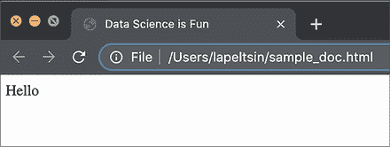
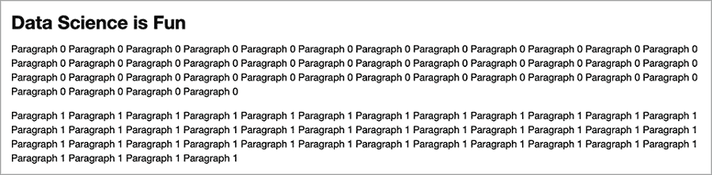
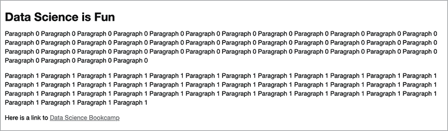
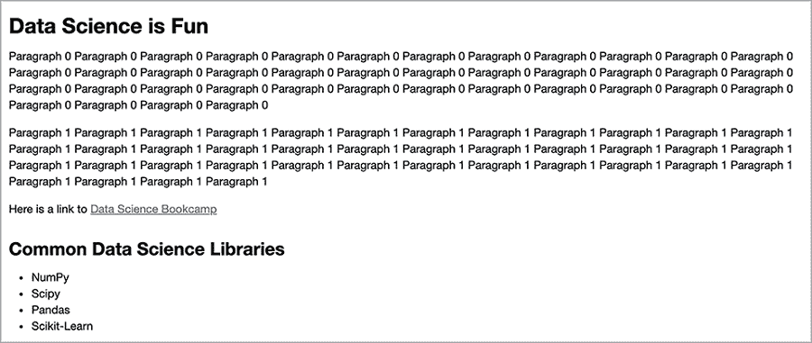
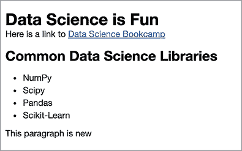

# 16 从网页中提取文本

本节涵盖

+   使用 HTML 渲染网页

+   HTML 文件的基本结构

+   使用 Beautiful Soup 库从 HTML 文件中提取文本

+   从在线来源下载 HTML 文件

互联网是文本数据的一个巨大资源。数百万个网页以新闻文章、百科全书页面、科学论文、餐厅评论、政治讨论、专利、公司财务报表、职位发布等形式提供了无限量的文本内容。如果我们下载这些网页的超文本标记语言（HTML）文件，所有这些页面都可以进行分析。*标记语言*是一种用于注释文档的系统，它将注释与文档文本区分开来。在 HTML 的情况下，这些注释是关于如何可视化网页的指令。

网页的可视化通常使用网页浏览器进行。首先，浏览器根据网页地址（URL）下载页面的 HTML。接下来，浏览器解析 HTML 文档以获取布局指令。最后，浏览器的渲染引擎根据标记规范格式化和显示所有图像和文本。渲染后的页面可以很容易地被人类阅读。

当然，在进行大规模数据分析时，我们不需要渲染每个页面。计算机可以在不需要任何可视化的情况下处理文档文本。因此，在分析 HTML 文档时，我们可以专注于文本，而跳过显示指令。尽管如此，我们也不应该完全忽略注释——它们可以为我们提供有价值的信息。例如，文档的注释标题可以简洁地总结文档的内容。因此，我们可以通过从文档的注释段落中区分出标题来受益。如果我们能够区分不同的文档部分，我们就可以进行更明智的调查。因此，对于在线文本分析来说，基本了解 HTML 结构是必不可少的。考虑到这一点，我们首先回顾 HTML 结构。然后我们学习如何使用 Python 库来解析这个结构。

注意：如果您已经熟悉基本的 HTML，请自由跳转到子节 16.2。

## 16.1 HTML 文档的结构

HTML 文档由 HTML 元素组成。每个元素对应于文档的一个组件。例如，文档的标题是一个元素；文档中的每个段落也是元素。元素的起始位置由起始标签界定：例如，标题的起始标签是`<title>`，段落的起始标签是`<p>`。每个起始标签都以尖括号`<>`开始和结束。在标签中添加一个正斜杠将其转换为结束标签。大多数元素的终点由结束标签界定：因此，标题的紧随其后的文本是`</title>`，段落的文本是`</p>`。

稍后，我们将探讨许多常见的 HTML 标签。但首先，我们必须介绍最重要的 HTML 标签：`<html>`，它指定了整个 HTML 文档的开始。让我们利用这个标签创建一个只包含单词*Hello*的文档。我们通过编码`html_contents = "<html>Hello</html>"`来生成文档的内容。

列表 16.1 定义简单的 HTML 字符串

```
html_contents = "<html>Hello</html>"
```

HTML 内容旨在在网页浏览器中渲染。因此，我们可以通过将其保存到文件并在我们选择的浏览器中加载来可视化`html_contents`。或者，我们可以在 IPython Jupyter Notebook 中直接渲染`html_contents`。我们只需从`IPython.core.display`导入`HTML`和`display`。然后，执行`display(HTML(html_contents))`将显示渲染后的输出（图 16.1）。

列表 16.2 渲染 HTML 字符串

```
from IPython.core.display import display, HTML
def render(html_contents): display(HTML(html_contents))     ❶
render(html_contents)
```

❶ 定义一个单行渲染函数，以更少的代码重复可视化我们的 HTML


图 16.1 一个渲染的 HTML 文档。它包含一个单词：*Hello*。

我们已经渲染了我们的 HTML 文档。它并不非常令人印象深刻——主体由一个单词组成。此外，文档缺少标题。让我们使用`<title>`标签给文档分配一个标题。我们将标题设置为像*数据科学很有趣*这样的简单内容。为此，我们首先创建一个等于`"<title>Data Science is Fun</title>"`的标题字符串。

列表 16.3 在 HTML 中定义标题

```
title = "<title>Data Science is Fun</title>"
```

现在我们通过运行`html_contents = f"<html>{title}Hello</html>"`将标题嵌套在`<html>`和`</html>`中，然后渲染更新后的内容（图 16.2）。


图 16.2 一个渲染的 HTML 文档。文档的标题没有出现在渲染输出中——只有单词*Hello*是可见的。

列表 16.4 向 HTML 字符串添加标题

```
html_contents = f"<html>{title}Hello</html>"
render(html_contents)
```

我们的结果与我们之前看到的是一样的！标题没有出现在渲染的 HTML 的主体中；它只出现在网页浏览器的标题栏中（图 16.3）。



图 16.3 网页浏览器渲染的 HTML 文档。文档的标题出现在浏览器的标题栏中。

尽管它部分不可见，但标题为我们提供了非常重要的信息：它总结了文档的内容。例如，在职位列表中，标题直接总结了工作的性质。因此，尽管标题没有出现在文档的主体中，但它反映了关键信息。这种关键的区别通常通过使用`<head>`和`<body>`标签来强调。由 HTML `<body>`标签定义的内容将出现在输出体的主体中。同时，`<head>`定义了不在主体中渲染的关键信息。让我们通过将`title`嵌套在 HTML 的*head*元素中来强调这种区别。我们还将可见的*Hello*嵌套在内容的*body*元素中。

列表 16.5 向 HTML 字符串添加 head 和 body

```
head = f"<head>{title}</head>"
body = "<body>Hello</body>"
html_contents = f"<html> {title} {body}</html>"
```

有时，我们想在页面的主体中显示文档的标题。例如，在招聘启事中，雇主可能希望显示工作的标题。这个可视化的标题被称为页面的 *标题*，并用 `<h1>` 标签标记。当然，这个标签嵌套在 `<body>` 中，其中包含所有可视化的内容。让我们给我们的 HTML 主体添加一个标题（图 16.4）。

列表 16.6 向 HTML 字符串添加标题

```
header = "<h1>Data Science is Fun</h1>"
body = f"<body>{header}Hello</body>"               ❶
html_contents = f"<html> {title} {body}</html>"
render(html_contents)
```

❶ HTML 元素可以像俄罗斯套娃一样嵌套。在这里，我们在 body 元素内部嵌套标题元素，并将 body 和标题元素都嵌套在 `<html>` 和 `</html>` 标签中。


图 16.4 一个渲染的 HTML 文档。渲染输出中出现了一个大的标题。

我们的单个单词与大的标题相比显得有些笨拙。通常，HTML 文档旨在在主体中包含多个单词——它们通常包含多个段落中的多个句子。如前所述，这样的段落用 `<p>` 标签标记。

让我们在我们的 HTML 中添加两个连续的段落（图 16.5）。我们通过重复的单词序列来组成这些虚拟段落：第一个段落包含重复 40 次的短语 *Paragraph 0*；在随后的段落中，我们将 0 替换为 1。

列表 16.7 向 HTML 字符串添加段落

```
paragraphs = ''
for i in range(2):
    paragraph_string = f"Paragraph {i} " * 40
    paragraphs += f"<p>{paragraph_string}</p>"

body = f"<body>{header}{paragraphs}</body>"
html_contents = f"<html> {title} {body}</html>"
render(html_contents)
```



图 16.5 一个渲染的 HTML 文档。渲染输出中出现了两个段落。

我们已经将段落元素插入到我们的 HTML 中。这些元素可以通过它们的内部文本来区分。然而，它们的 `<p>` 标签都是相同的；HTML 解析器无法轻易区分第一个和第二个标签。偶尔，使标签之间的差异更加明显是有价值的（尤其是如果每个段落都有独特的格式）。我们可以通过为每个标签分配一个唯一的 ID 来区分 `<p>` 标签，这个 ID 可以直接插入到标签括号中。例如，我们通过写入 `<p id="paragraph 0">` 来识别第一个段落为 *paragraph 0*。添加的 `id` 被称为段落元素的 *属性*。属性被插入到元素开始标签中，以跟踪有用的标签信息。

现在我们向我们的段落标签添加 `id` 属性。稍后，我们将利用这些属性来区分段落。

列表 16.8 向段落添加 `id` 属性

```
paragraphs = ''
for i in range(2):
    paragraph_string = f"Paragraph {i} " * 40
    attribute = f"id='paragraph {i}'"
    paragraphs += f"<p {attribute}>{paragraph_string}</p>"

body = f"<body>{header}{paragraphs}</body>"
html_contents = f"<html> {title} {body}</html>"
```

HTML 属性扮演着许多关键角色。它们在文档之间链接时尤其必要。互联网建立在 *超链接* 之上，超链接是连接网页的可点击文本。点击超链接会将您带到一个新的 HTML 文档。每个超链接都由一个锚点标签 `<a>` 标记，这使得文本可点击。然而，还需要额外的信息来指定链接文档的地址。我们可以使用 `href` 属性来提供这些信息，其中 *href* 代表 *超文本引用*。例如，使用 `<a href="https://www.manning .com">` 标记的文本会将文本链接到 Manning 网站。

接下来，我们创建一个链接，内容为 *Data Science Bookcamp*，并将这个可点击文本链接到这本书的网站。然后我们将这个链接插入到一个新的段落中，并给这个段落分配一个 ID 为 `paragraph 3`（图 16.6）。



图 16.6 一个渲染的 HTML 文档。渲染输出中已添加一个包含到 *Data Science Bookcamp* 可点击链接的额外段落。

列表 16.9 将链接添加到 HTML 字符串中

```
link_text = "Data Science Bookcamp"
url = "https://www.manning.com/books/data-science-bookcamp"
hyperlink = f"<a href='{url}'>{link_text}</a>"                            ❶
new_paragraph = f"<p id='paragraph 2'>Here is a link to {hyperlink}</p>"
paragraphs += new_paragraph
body = f"<body>{header}{paragraphs}</body>"
html_contents = f"<html> {title} {body}</html>"
render(html_contents)
```

❶ 创建一个可点击的链接。点击“Data Science Bookcamp”这些词会将用户带到书的在线 URL。

HTML 文本元素可以具有不同的复杂度。除了标题和段落之外，我们还可以在 HTML 文档中可视化文本列表。例如，如果我们想显示一组流行的数据科学库列表，我们首先在 Python 中定义这个列表。

列表 16.10 定义数据科学库列表

```
libraries = ['NumPy', 'SciPy', 'Pandas', 'Scikit-Learn']
```

现在我们使用 `<li>` 标签标记列表中的每个项目，其中 `<li>` 代表 *列表项*。我们将这些项目存储在 `items` 字符串中。

列表 16.11 使用 `<li>` 标签标记列表项。

```
items = ''
for library in libraries:
    items += f"<li>{library}</li>"
```

最后，我们在 `<ul>` 标签中嵌套 `items` 字符串，其中 `ul` 代表 *非结构化列表*。然后我们将非结构化列表添加到 HTML 的主体中。我们还在段落和列表之间插入了一个第二个标题：*常见数据科学库*。我们使用 `<h2>` 标签来区分第二个标题和第一个（图 16.7）。

列表 16.12 将非结构化列表添加到 HTML 字符串中

```
unstructured_list = f"<ul>{items}</ul>"
header2 = '<h2>Common Data Science Libraries</h2>'
body = f"<body>{header}{paragraphs}{header2}{unstructured_list}</body>"
html_contents = f"<html> {title} {body}</html>"
render(html_contents)
```



图 16.7 一个渲染的 HTML 文档。更新的文档包含常见数据科学库的带点列表。

数据科学库已渲染为带点的列表。每个项目点占一行。传统上，这样的项目点用于表示不同的概念类别，从数据科学库到早餐食品，再到工作招聘中所需技能。

在这一点上，值得注意的是我们的 HTML 主体被分为两个不同的部分：第一部分对应三个段落序列，第二部分对应项目符号列表。通常，这样的划分是通过特殊的`<div>`标签来实现的，这些标签允许前端工程师跟踪分割的元素并相应地自定义它们的格式。通常，每个`<div>`标签都有一个属性来区分。如果该属性对某个部分是唯一的，那么该属性就是一个`id`；如果该属性被多个部分共享，则使用特殊的`class`标识符。

为了保持一致性，我们通过将它们嵌套在两个不同的分割中来划分我们的两个部分。第一个分割被分配了一个`paragraph` ID，第二个被分配了一个`list` ID。此外，由于这两个分割只包含文本，我们给每个都分配了一个`text`类属性。我们还添加了一个第三个空的分割到主体中；我们稍后会更新它。这个空分割的 ID 和类都被设置为`empty`。

列表 16.13 向 HTML 字符串添加分割

```
div1 = f"<div id='paragraphs' class='text'>{paragraphs}</div>"
div2 = f"<div id='list' class='text'>{header2}{unstructured_list}</div>"
div3 = "<div id='empty' class='empty'></div>"                             ❶
body = f"<body>{header}{div1}{div2}{div3}</body>"
html_contents = f"<html> {title}{body}</html>"
```

❶ 第三个分割是空的，但它仍然可以通过类和 ID 访问。稍后，我们将访问这个分割以插入额外的文本。

常见 HTML 元素和属性

+   `<html>..</html>`—标记整个 HTML 文档。

+   `<title>..</title>`—文档的标题。这个标题出现在网页浏览器的标题栏中，但不在浏览器的渲染内容中。

+   `<head>..</head>`—文档的头部。头部中的信息不打算在浏览器的渲染内容中显示。

+   `<body>..</body>`—文档的主体。主体中的信息旨在在浏览器的渲染内容中显示。

+   `<h1>..</h1>`—文档中的标题。它通常以大号粗体字母显示。

+   `<h2>..</h2>`—文档中的标题，其格式略不同于`<h1>`。

+   `<p>..</p>`—文档中的单个段落。

+   `<p id="unique_id">..</p>`—文档中包含一个唯一`id`属性的单个段落，该属性不与其他文档元素共享。

+   `<a href="http:/ /www.manning.com">..</a>`—一个可点击的文本超链接。点击文本会将用户发送到`href`属性中指定的 URL。

+   `<ul>..</ul>`—由单个列表项组成的无结构列表，这些列表项在浏览器的渲染内容中以项目符号的形式出现。

+   `<li>..</li>`—无结构列表中的单个列表项。

+   `<div>..</div>`—标记文档特定子部分的分割。

+   `<div class="category_class">..</div>`—标记文档特定子部分的分割。该分割通过`class`属性分配了一个类别类。与唯一的 ID 不同，这个类可以在 HTML 的其他分割中共享。

我们对`html_contents`字符串进行了许多修改。让我们回顾其修改后的内容。

列表 16.14 打印修改后的 HTML 字符串

```
print(html_contents)

<html> <title>Data Science is Fun</title><body><h1>Data Science is Fun</h1>
<div id='paragraphs' class='text'><p id='paragraph 0'>Paragraph 0 
Paragraph 0 Paragraph 0 Paragraph 0 Paragraph 0 Paragraph 0 Paragraph 0
Paragraph 0 Paragraph 0 Paragraph 0 Paragraph 0 Paragraph 0 Paragraph 0
Paragraph 0 Paragraph 0 Paragraph 0 Paragraph 0 Paragraph 0 Paragraph 0
Paragraph 0 Paragraph 0 Paragraph 0 Paragraph 0 Paragraph 0 Paragraph 0
Paragraph 0 Paragraph 0 Paragraph 0 Paragraph 0 Paragraph 0 Paragraph 0
Paragraph 0 Paragraph 0 Paragraph 0 Paragraph 0 Paragraph 0 Paragraph 0
Paragraph 0 Paragraph 0 Paragraph 0 </p><p id='paragraph 1'>Paragraph 1 
Paragraph 1 Paragraph 1 Paragraph 1 Paragraph 1 Paragraph 1 Paragraph 1
Paragraph 1 Paragraph 1 Paragraph 1 Paragraph 1 Paragraph 1 Paragraph 1
Paragraph 1 Paragraph 1 Paragraph 1 Paragraph 1 Paragraph 1 Paragraph 1
Paragraph 1 Paragraph 1 Paragraph 1 Paragraph 1 Paragraph 1 Paragraph 1
Paragraph 1 Paragraph 1 Paragraph 1 Paragraph 1 Paragraph 1 Paragraph 1
Paragraph 1 Paragraph 1 Paragraph 1 Paragraph 1 Paragraph 1 Paragraph 1
Paragraph 1 Paragraph 1 Paragraph 1 </p><p id='paragraph 2'>
Here is a link to <a href='https://www.manning.com/books/data-science-bookcamp'>
Data Science Bookcamp</a></p></div><div id='list' class='text'>
<h2>Common Data Science Libraries</h2><ul><li>NumPy</li>
<li>SciPy</li><li>Pandas</li><li>Scikit-Learn</li>
</ul></div><div id='empty' class='empty'></div></body></html>
```

打印的输出一团糟！HTML 内容几乎无法阅读。此外，从`html_contents`中提取单个元素极其困难。想象一下，如果我们想提取 HTML 文档的标题：我们需要首先在`>`括号上分割`html_contents`。然后，我们必须遍历分割结果，直到找到等于`<title`的字符串。接下来，我们需要向前移动一个索引并提取包含标题文本的字符串。最后，我们必须通过在剩余的`<`括号上分割来清理标题字符串。这个复杂的标题提取过程将在下面进行说明。

列表 16.15 使用基本的 Python 提取 HTML 标题

```
split_contents = html_contents.split('>')
for i, substring in enumerate(split_contents):    ❶
    if substring.endswith('<title'):              ❷
        next_string = split_contents[i + 1]
        title = next_string.split('<')[0]
        print(title)
        break

Data Science is Fun
```

❶ 遍历每个跟随`>`的子字符串

❷ 子字符串在标题开始标签处结束。因此，下一个子字符串等于标题。

有没有一种更干净的方法可以从 HTML 文档中提取元素？是的！我们不需要手动解析文档。相反，我们可以使用外部的 Beautiful Soup 库。

## 16.2 使用 Beautiful Soup 解析 HTML

我们首先安装 Beautiful Soup 库。然后从`bs4`导入`BeautifulSoup`类。遵循一个常见的约定，我们将`BeautifulSoup`简单地导入为`bs`。

注意 从命令行终端调用`pip install bs4`来安装 Beautiful Soup 库。

列表 16.16 导入`BeautifulSoup`类

```
from bs4 import BeautifulSoup as bs
```

现在，我们通过运行`bs(html_contents)`初始化`BeautifulSoup`类。按照惯例，我们将初始化的对象分配给`soup`变量（列表 16.17）。

注意 默认情况下，`bs`类使用 Python 的内置 HTML 解析器来提取 HTML 内容。然而，通过外部库可以获得更高效的解析器。一个流行的库叫做 lxml，可以通过运行`pip install lxml`来安装。安装后，lxml 解析器可以在`bs`初始化期间使用。我们只需要执行`bs(html_contents, 'lxml')`。

列表 16.17 使用 HTML 字符串初始化`BeautifulSoup`

```
soup = bs(html_contents)
```

我们的`soup`对象跟踪解析的 HTML 中的所有元素。我们可以通过运行`soup.prettify()`方法以干净、可读的格式输出这些元素。

列表 16.18 使用 Beautiful Soup 打印可读的 HTML

```
print(soup.prettify())

<html>
 <title>
  Data Science is Fun
 </title>
 <body>
  <h1>
   Data Science is Fun
  </h1>
  <div class="text" id="paragraphs">
   <p id="paragraph 0">
    Paragraph 0 Paragraph 0 Paragraph 0 Paragraph 0 Paragraph 0 Paragraph 0
Paragraph 0 Paragraph 0 Paragraph 0 Paragraph 0 Paragraph 0 Paragraph 0
Paragraph 0 Paragraph 0 Paragraph 0 Paragraph 0 Paragraph 0 Paragraph 0
Paragraph 0 Paragraph 0 Paragraph 0 Paragraph 0 Paragraph 0 Paragraph 0
Paragraph 0 Paragraph 0 Paragraph 0 Paragraph 0 Paragraph 0 Paragraph 0
Paragraph 0 Paragraph 0 Paragraph 0 Paragraph 0 Paragraph 0 Paragraph 0
Paragraph 0 Paragraph 0 Paragraph 0 Paragraph 0
   </p>
   <p id="paragraph 1">
    Paragraph 1 Paragraph 1 Paragraph 1 Paragraph 1 Paragraph 1 Paragraph 1
Paragraph 1 Paragraph 1 Paragraph 1 Paragraph 1 Paragraph 1 Paragraph 1
Paragraph 1 Paragraph 1 Paragraph 1 Paragraph 1 Paragraph 1 Paragraph 1
Paragraph 1 Paragraph 1 Paragraph 1 Paragraph 1 Paragraph 1 Paragraph 1
Paragraph 1 Paragraph 1 Paragraph 1 Paragraph 1 Paragraph 1 Paragraph 1
Paragraph 1 Paragraph 1 Paragraph 1 Paragraph 1 Paragraph 1 Paragraph 1
Paragraph 1 Paragraph 1 Paragraph 1 Paragraph 1
   </p>
   <p id="paragraph 2">
    Here is a link to
    <a href="https://www.manning.com/books/data-science-bookcamp">
     Data Science Bookcamp
    </a>
   </p>
  </div>
  <div class="text" id="list">
   <h2>
    Common Data Science Libraries
   </h2>
   <ul>
    <li>
     NumPy
    </li>
    <li>
     SciPy
    </li>
    <li>
     Pandas
    </li>
    <li>
     Scikit-Learn
    </li>
   </ul>
  </div>
  <div class="empty" id="empty">
  </div>
 </body>
</html>
```

假设我们想访问单个元素，例如标题。`soup`对象通过其`find`方法提供这种访问。运行`soup.find('title')`返回标题开始和结束标签之间的所有内容。

列表 16.19 使用 Beautiful Soup 提取标题

```
title = soup.find('title')
print(title)

<title>Data Science is Fun</title>
```

输出的`title`看起来是一个由标题标签界定的 HTML 字符串。然而，我们的`title`变量不是一个字符串：它是一个初始化的 Beautiful Soup `Tag`类。我们可以通过打印`type(title)`来验证。

列表 16.20 输出标题的数据类型

```
print(type(title))

<class 'bs4.element.Tag'>
```

每个`Tag`对象都包含一个`text`属性，它映射到标签中的文本。因此，打印`title.text`返回*数据科学很有趣*。

列表 16.21 输出标题的文本属性

```
print(title.text)

Data Science is Fun
```

我们通过运行`soup.find('title')`来访问我们的`title`标签。我们也可以简单地通过运行`soup.title`来访问相同的标签。因此，运行`soup.title.text`返回一个等于`title.text`的字符串。

列表 16.22 从`soup`中访问标题的文本属性

```
assert soup.title.text == title.text
```

以同样的方式，我们可以通过运行`soup.body`来访问我们文档的正文。接下来，我们输出 HTML 正文中的所有文本。

列表 16.23 从`soup`中访问正文体的`text`属性

```
body = soup.body
print(body.text)

Data Science is FunParagraph 0 Paragraph 0 Paragraph 0 Paragraph 0 
Paragraph 0 Paragraph 0 Paragraph 0 Paragraph 0 Paragraph 0 Paragraph 0
Paragraph 0 Paragraph 0 Paragraph 0 Paragraph 0 Paragraph 0 Paragraph 0
Paragraph 0 Paragraph 0 Paragraph 0 Paragraph 0 Paragraph 0 Paragraph 0
Paragraph 0 Paragraph 0 Paragraph 0 Paragraph 0 Paragraph 0 Paragraph 0
Paragraph 0 Paragraph 0 Paragraph 0 Paragraph 0 Paragraph 0 Paragraph 0
Paragraph 0 Paragraph 0 Paragraph 0 Paragraph 0 Paragraph 0 Paragraph 0
Paragraph 1 Paragraph 1 Paragraph 1 Paragraph 1 Paragraph 1 Paragraph 1
Paragraph 1 Paragraph 1 Paragraph 1 Paragraph 1 Paragraph 1 Paragraph 1
Paragraph 1 Paragraph 1 Paragraph 1 Paragraph 1 Paragraph 1 Paragraph 1
Paragraph 1 Paragraph 1 Paragraph 1 Paragraph 1 Paragraph 1 Paragraph 1
Paragraph 1 Paragraph 1 Paragraph 1 Paragraph 1 Paragraph 1 Paragraph 1
Paragraph 1 Paragraph 1 Paragraph 1 Paragraph 1 Paragraph 1 Paragraph 1
Paragraph 1 Paragraph 1 Paragraph 1 Paragraph 1 
Here is a link to Data Science BookcampCommon Data Science LibrariesNumPySciPyPandasScikit-Learn
```

我们输出的结果是正文中的所有文本的聚合。这个文本块包括所有标题、项目符号和段落。它几乎无法阅读。与其输出所有文本，我们不如缩小输出范围。让我们通过打印`body.p.text`来仅打印第一段的文本。或者，打印`soup.p.text`会产生相同的输出。

列表 16.24 访问第一段的文本

```
assert body.p.text == soup.p.text
print(soup.p.text)

Paragraph 0 Paragraph 0 Paragraph 0 Paragraph 0 Paragraph 0 Paragraph 0
Paragraph 0 Paragraph 0 Paragraph 0 Paragraph 0 Paragraph 0 Paragraph 0
Paragraph 0 Paragraph 0 Paragraph 0 Paragraph 0 Paragraph 0 Paragraph 0
Paragraph 0 Paragraph 0 Paragraph 0 Paragraph 0 Paragraph 0 Paragraph 0
Paragraph 0 Paragraph 0 Paragraph 0 Paragraph 0 Paragraph 0 Paragraph 0
Paragraph 0 Paragraph 0 Paragraph 0 Paragraph 0 Paragraph 0 Paragraph 0
Paragraph 0 Paragraph 0 Paragraph 0 Paragraph 0
```

访问`body.p`返回`body`中的第一个段落。我们如何访问剩余的两个段落？嗯，我们可以利用`find_all`方法。运行`body.find_all('p')`返回正文中的所有段落标签列表。

列表 16.25 在正文中访问所有段落

```
paragraphs = body.find_all('p')
for i, paragraph in enumerate(paragraphs):
    print(f"\nPARAGRAPH {i}:")
    print(paragraph.text)

PARAGRAPH 0:
Paragraph 0 Paragraph 0 Paragraph 0 Paragraph 0 Paragraph 0 Paragraph 0
Paragraph 0 Paragraph 0 Paragraph 0 Paragraph 0 Paragraph 0 Paragraph 0
Paragraph 0 Paragraph 0 Paragraph 0 Paragraph 0 Paragraph 0 Paragraph 0
Paragraph 0 Paragraph 0 Paragraph 0 Paragraph 0 Paragraph 0 Paragraph 0
Paragraph 0 Paragraph 0 Paragraph 0 Paragraph 0 Paragraph 0 Paragraph 0
Paragraph 0 Paragraph 0 Paragraph 0 Paragraph 0 Paragraph 0 Paragraph 0
Paragraph 0 Paragraph 0 Paragraph 0 Paragraph 0

PARAGRAPH 1:
Paragraph 1 Paragraph 1 Paragraph 1 Paragraph 1 Paragraph 1 Paragraph 1
Paragraph 1 Paragraph 1 Paragraph 1 Paragraph 1 Paragraph 1 Paragraph 1
Paragraph 1 Paragraph 1 Paragraph 1 Paragraph 1 Paragraph 1 Paragraph 1
Paragraph 1 Paragraph 1 Paragraph 1 Paragraph 1 Paragraph 1 Paragraph 1
Paragraph 1 Paragraph 1 Paragraph 1 Paragraph 1 Paragraph 1 Paragraph 1
Paragraph 1 Paragraph 1 Paragraph 1 Paragraph 1 Paragraph 1 Paragraph 1
Paragraph 1 Paragraph 1 Paragraph 1 Paragraph 1

PARAGRAPH 2:
Here is a link to Data Science Bookcamp
```

同样，我们通过运行`body.find_all('li')`来访问我们的项目符号列表。让我们利用`find_all`来打印正文中的所有项目符号列表。

列表 16.26 在正文中访问所有项目符号

```
print([bullet.text for bullet
       in  body.find_all('li')])

['NumPy', 'Scipy', 'Pandas', 'Scikit-Learn']
```

`find`和`find_all`方法允许我们通过标签类型和属性来搜索元素。假设我们希望访问一个具有唯一 ID `x`的元素。要搜索该属性 ID，我们只需执行`find(id='x')`。考虑到这一点，让我们输出分配 ID 为`paragraph_2`的最后一个段落的文本。

列表 16.27 通过 ID 访问一个段落

```
paragraph_2 = soup.find(id='paragraph 2')
print(paragraph_2.text)

Here is a link to Data Science Bookcamp
```

`paragraph_2`的内容包括一个指向*数据科学书营*的网页链接。实际的 URL 存储在`href`属性中。Beautiful Soup 允许我们使用`get`方法访问任何属性。因此，运行`paragraph_2.get('id')`返回*段落 2*。运行`paragraph_2.a.get('href')`返回 URL；让我们打印它。

列表 16.28 在标签中访问一个属性

```
assert paragraph_2.get('id') == 'paragraph 2'
print(paragraph_2.a.get('href'))

https://www.manning.com/books/data-science-bookcamp
```

在我们的 HTML 中，所有属性 ID 都分配了唯一的值。然而，并不是所有的属性都是唯一的。例如，我们三个分部元素中的两个共享`class`属性为`text`。同时，第三个分部元素包含一个设置为`empty`的唯一类。运行`body.find_all('div')`返回所有三个分部元素。我们如何只获取那些设置为`text`的类别的两个分部？我们只需要运行`body.find_all('div', class_='text')`。添加的`class_`参数将结果限制在那些类设置适当的分部。列表 16.29 搜索这些分部并输出它们的文本内容。

注意为什么我们在`class_`上运行`find_all`而不是`class`？嗯，在 Python 中，`class`是一个受限标识符，用于定义新类。Beautiful Soup 允许使用特殊的`class_`参数来绕过这个关键字限制。

列表 16.29 通过共享的`class`属性访问分区

```
for division in soup.find_all('div', class_='text'):
    id_ = division.get('id')
    print(f"\nDivision with id '{id_}':")
    print(division.text)
Division with id 'paragraphs':

Paragraph 0 Paragraph 0 Paragraph 0 Paragraph 0 Paragraph 0 Paragraph 0
Paragraph 0 Paragraph 0 Paragraph 0 Paragraph 0 Paragraph 0 Paragraph 0
Paragraph 0 Paragraph 0 Paragraph 0 Paragraph 0 Paragraph 0 Paragraph 0
Paragraph 0 Paragraph 0 Paragraph 0 Paragraph 0 Paragraph 0 Paragraph 0
Paragraph 0 Paragraph 0 Paragraph 0 Paragraph 0 Paragraph 0 Paragraph 0
Paragraph 0 Paragraph 0 Paragraph 0 Paragraph 0 Paragraph 0 Paragraph 0
Paragraph 0 Paragraph 0 Paragraph 0 Paragraph 0 Paragraph 1 Paragraph 1
Paragraph 1 Paragraph 1 Paragraph 1 Paragraph 1 Paragraph 1 Paragraph 1
Paragraph 1 Paragraph 1 Paragraph 1 Paragraph 1 Paragraph 1 Paragraph 1
Paragraph 1 Paragraph 1 Paragraph 1 Paragraph 1 Paragraph 1 Paragraph 1
Paragraph 1 Paragraph 1 Paragraph 1 Paragraph 1 Paragraph 1 Paragraph 1
Paragraph 1 Paragraph 1 Paragraph 1 Paragraph 1 Paragraph 1 Paragraph 1
Paragraph 1 Paragraph 1 Paragraph 1 Paragraph 1 Paragraph 1 Paragraph 1
Paragraph 1 Paragraph 1 Here is a link to Data Science Bookcamp

Division with id 'list':
Common Data Science LibrariesNumPyScipyPandasScikit-Learn
```

到目前为止，我们已经使用 Beautiful Soup 来访问 HTML 中的元素。然而，这个库还允许我们编辑单个元素。例如，给定一个`tag`对象，我们可以通过运行`tag.decompose()`来删除该对象。`decompose`方法将该元素从所有我们的数据结构中删除，包括`soup`。因此，调用`body.find(id='paragraph 0').decompose()`将删除第一个段落的全部痕迹。同样，调用`soup.find(id='paragraph 1').decompose()`将从`soup`和`body`对象中删除第二个段落。在这些删除之后，只剩下第三个段落。让我们确认。

列表 16.30 使用 Beautiful Soup 删除段落

```
body.find(id='paragraph 0').decompose()
soup.find(id='paragraph 1').decompose()     ❶
print(body.find(id='paragraphs').text)

Here is a link to Data Science Bookcamp
```

❶ `decompose`方法从所有嵌套的标签对象中删除段落。从 soup 中删除段落也会从 body 中删除，反之亦然。

此外，我们还能将新标签插入到 HTML 中。假设我们希望将一个新段落插入到我们最终的空分区中。为此，我们必须首先创建一个新的段落元素。运行`soup.new_tag('p')`返回一个空的段落`Tag`对象。

列表 16.31 初始化一个空的段落`Tag`

```
new_paragraph = soup.new_tag('p')
print(new_paragraph)

<p></p>
```

接下来，我们必须通过将其赋值给`new_paragraph.string`来更新初始化的段落文本。运行`new_paragraph.string = x`将段落的文本设置为等于`x`。

列表 16.32 更新空段落的文本

```
new_paragraph.string = "This paragraph is new"
print(new_paragraph)

<p>This paragraph is new</p>
```

最后，我们将更新的`new_paragraph`追加到一个现有的`Tag`对象中。给定两个`Tag`对象`tag1`和`tag2`，我们可以通过运行`tag2.append(tag1)`将`tag1`插入到`tag2`中。因此，运行`soup.find(id='empty').append(new_paragraph)`应该将段落追加到空分区中。让我们更新我们的 HTML，然后通过渲染更新后的结果（图 16.8）来确认更改。



图 16.8 一个渲染的 HTML 文档。文档已被编辑，三个原始段落中的两个已被删除，并插入了一个新段落。

列表 16.33 使用 Beautiful Soup 插入段落

```
soup.find(id='empty').append(new_paragraph)
render(soup.prettify())
```

常见的 Beautiful Soup 方法

+   `soup = bs(html_contents)`—从解析的`html_contents`中的 HTML 元素初始化一个`BeautifulSoup`对象。

+   `soup.prettify()`—以干净、易于阅读的格式返回解析的 HTML 文档。

+   `title = soup.title`—返回与解析文档的标题元素相关联的`Tag`对象。

+   `title = soup.find('title')`—返回与解析文档的标题元素相关联的`Tag`对象。

+   `tag_object = soup.find('element_tag')`—返回与指定`element_tag`标签所标记的第一个 HTML 元素相关联的`Tag`对象。

+   `tag_objects = soup.find_all('element_tag')`—返回一个包含指定`element_tag`标签的所有`Tag`对象的列表。

+   `tag_object = soup.find(id='unique_id')`—返回包含指定唯一`id`属性的`Tag`对象。

+   `tag_objects = soup.find_all('element_tag', class_='category_class')`—返回一个包含指定`element_tag`标签和指定类属性的`Tag`对象的列表。

+   `tag_object = soup.new_tag('element_tag')`—创建一个新的`Tag`对象，其 HTML 元素类型由`element`标签指定。

+   `tag_object.decompose()`—从`soup`中删除`Tag`对象。

+   `tab_object.append(tag_object2)`—给定两个`Tag`对象，`tag_object`和`tag_object2`，将`tag_object2`插入到`tag_object`中。

+   `tag_object.text`—返回`Tag`对象中的所有可见文本。

+   `tag_object.get('attribute')`—返回分配给`Tag`对象的 HTML 属性。

## 16.3 下载和解析在线数据

Beautiful Soup 库允许我们轻松解析、分析和编辑 HTML 文档。在大多数情况下，这些文档必须直接从网络下载。让我们简要回顾使用 Python 内置的`urllib`模块下载 HTML 文件的步骤。我们首先从`urllib.request`导入`urlopen`函数。

注意：当从单个不安全的在线页面下载单个 HTML 文档时，`urlopen`函数是足够的。然而，对于更复杂的下载，你应该考虑使用外部的 Requests 库（[`requests.readthedocs.io`](https://requests.readthedocs.io)）。

列表 16.34 导入`urlopen`函数

```
from urllib.request import urlopen
```

给定在线文档的 URL，我们可以通过运行`urlopen(url).read()`下载相关的 HTML 内容。然后，我们使用`urlopen`下载此书的 Manning 网站。然后我们打印下载的 HTML 的前 1,000 个字符。

警告：以下代码仅在有效的互联网连接下运行。此外，下载的 HTML 可能会随着网站的改变而改变。

列表 16.35 下载 HTML 文档

```
url = "https://www.manning.com/books/data-science-bookcamp"
html_contents = urlopen(url).read()                                       ❶
print(html_contents[:1000])
b'\n<!DOCTYPE html>\n<!--[if lt IE 7 ]> <html lang="en" class="no-js ie6
ie"> <![endif]-->\n<!--[if IE 7 ]>    <html lang="en" class="no-js ie7
ie"> <![endif]-->\n<!--[if IE 8 ]>    <html lang="en" class="no-js ie8
ie"> <![endif]-->\n<!--[if IE 9 ]>    <html lang="en" class="no-js ie9
ie"> <![endif]-->\n<!--[if (gt IE 9)|!(IE)]><!--> <html lang="en"
class="no-js"><!--<![endif]-->\n<head>\n
<title>Manning | Data Science Bookcamp</title>\n\n
<meta name="msapplication-TileColor" content=" #343434"/>\n
<meta name="msapplication-square70x70logo" content="/assets/favicon/windows-small-tile-6f6b7c9200a7af9169e488a11d13a7d3.png"/>\n
<meta name="msapplication-square150x150logo" content="/assets/favicon/windows-medium-tile-8fae4270fe3f1a6398f15015221501fb.png"/>\n
<meta name="msapplication-wide310x150logo" content="/assets/favicon/windows-wide-tile-a856d33fb5e508f52f09495e2f412453.png"/>\n
<meta name="msapplication-square310x310logo"
content="/assets/favicon/windows-large-tile-072d5381c2c83afa'
```

❶ `urlopen`函数与指定的 URL 建立网络连接。该连接通过一个特殊的 URLopener 对象进行跟踪。调用该对象的 read 方法从建立的连接下载文本。

让我们使用 Beautiful Soup 从杂乱的 HTML 中提取标题。

列表 16.36 使用 Beautiful Soup 获取标题

```
soup = bs(html_contents)
print(soup.title.text)

Manning | Data Science Bookcamp
```

使用我们的`soup`对象，我们可以进一步分析页面。例如，我们可以提取包含`关于本书`标题的`div`元素，以打印本书的描述。

警告：在线 HTML 是持续更新的。Manning 网站的将来更新可能会导致以下代码出现故障。遇到预期输出与实际输出不一致的读者，鼓励手动探索 HTML 以提取书籍描述。

列表 16.37 获取本书的描述

```
for division in soup.find_all('div'):             ❶
    header = division.h2                          ❷
    if header is None:
        continue

    if header.text.lower() == 'about the book':
        print(division.text)                      ❸

about the book

Data Science Bookcamp is a comprehensive set of challenging projects
carefully designed to grow your data science skills from novice to master.
Veteran data scientist Leonard Apeltsin sets five increasingly difficult
exercises that test your abilities against the kind of problems you'd
encounter in the real world. As you solve each challenge, you'll acquire
and expand the data science and Python skills you'll use as a professional
data scientist. Ranging from text processing to machine learning, each
project comes complete with a unique, downloadable data set and a fully
explained step-by-step solution. Because these projects come from Dr.
Apeltsin's vast experience, each solution highlights the most likely
failure points along with practical advice for getting past unexpected
pitfalls.  When you wrap up these five awesome exercises, you'll have a
diverse, relevant skill set that's transferable to working in industry.
```

❶ 遍历页面中的所有`div`元素

❷ 检查是否存在标题分区

❸ 一旦识别出“关于”部分，就打印出书籍的描述

我们现在可以使用 Beautiful Soup 来解析职位发布信息，作为我们的案例研究解决方案的一部分。

## 摘要

+   HTML 文档由嵌套元素组成，这些元素提供了关于文本的辅助信息。大多数元素由起始标签和结束标签定义。

+   一些元素中的文本旨在在浏览器中渲染。传统上，这种渲染信息嵌套在文档的 *body* 元素中。其他非渲染文本（如文档的标题）嵌套在文档的 *head* 元素中。

+   可以将属性插入到 HTML 起始标签中，以跟踪额外的标签信息。独特的 `id` 属性可以帮助区分相同类型的标签。此外，`class` 属性可以用来按类别跟踪元素。与唯一的 `id` 不同，`class` 属性可以被同一类别中的多个元素共享。

+   在基本 Python 中手动从 HTML 中提取文本是困难的。幸运的是，Beautiful Soup 库简化了文本提取过程。Beautiful Soup 允许我们通过标签类型和指定的属性值查询元素。此外，该库允许我们编辑底层的 HTML。

+   使用 Python 的内置 `urlopen` 函数，我们可以直接从网络上下载 HTML 文件。然后我们可以使用 Beautiful Soup 分析这些文件中的文本。
