# 17 案例研究 4 解决方案

本节涵盖

+   从 HTML 中解析文本

+   计算文本相似度

+   聚类和探索大型文本数据集

我们通过在这本书的目录中搜索案例研究 1 至 4（详细信息请参阅问题陈述）来下载了数千份职位发布。除了下载的发布内容外，我们还拥有两个文本文件：resume.txt 和 table_of_contents.txt。第一个文件包含一份简历草案，第二个文件包含用于查询职位列表结果的截断目录。我们的目标是提取下载的职位发布中的常见数据科学技能。然后我们将这些技能与我们的简历进行比较，以确定缺少哪些技能。我们将按以下步骤进行：

1.  解析下载的 HTML 文件中的所有文本。

1.  探索解析后的输出，了解在线发布中如何描述工作技能。我们将特别注意某些 HTML 标签是否与技能描述更相关。

1.  尝试从我们的数据集中过滤掉任何不相关的职位发布。

1.  根据文本相似性对工作技能进行聚类。

1.  使用词云可视化聚类。

1.  如有必要，调整聚类参数以改善可视化输出。

1.  将聚类技能与我们的简历进行比较，以揭示缺失的技能。

警告 揭示警告！案例研究 4 的解决方案即将揭晓。我们强烈建议你在阅读解决方案之前尝试解决问题。原始问题陈述可在案例研究开始处参考。

## 17.1 从职位发布数据中提取技能要求

我们首先加载 job_postings 目录中的所有 HTML 文件。我们将这些文件的 内容存储在`html_contents`列表中。

警告 确保在执行以下代码之前手动解压缩压缩文件 job_postings.zip 目录。

列表 17.1 加载 HTML 文件

```
import glob
html_contents = []

for file_name in sorted(glob.glob('job_postings/*.html')):     ❶
    with open(file_name, 'r') as f:
        html_contents.append(f.read())

print(f"We've loaded {len(html_contents)} HTML files.")

We've loaded 1458 HTML files.
```

❶ 我们使用 Python 3 的 glob 模块从 job_postings 目录中获取 HTML 扩展名的文件名。这些文件名按顺序排序，以确保所有读者在不同个人机器上的输出一致性。这确保了前两个样本文件对所有读者都是相同的。

我们的所有 1,458 个 HTML 文件都可以使用 Beautiful Soup 进行解析。让我们执行解析并将解析结果存储在`soup_objects`列表中。我们还确认每个解析的 HTML 文件都包含一个标题和一个正文。

列表 17.2 解析 HTML 文件

```
from bs4 import BeautifulSoup as bs

soup_objects = []
for html in html_contents:
    soup = bs(html)
    assert soup.title is not None
    assert soup.body is not None
    soup_objects.append(soup)
```

每个解析的 HTML 文件都包含一个标题和一个正文。这些文件的标题或正文之间是否有重复？我们可以通过在 Pandas 表中存储所有标题文本和正文文本在两列中，来找出答案。调用 Pandas 的`describe`方法将揭示文本中是否存在重复。

列表 17.3 检查标题和正文文本是否存在重复

```
import pandas as pd
html_dict = {'Title': [], 'Body': []}

for soup in soup_objects:
    title = soup.find('title').text
    body = soup.find('body').text
    html_dict['Title'].append(title)
    html_dict['Body'].append(body)

df_jobs = pd.DataFrame(html_dict)
summary = df_jobs.describe()
print(summary)

Title  \
count                            1458
unique                           1364
top     Data Scientist - New York, NY
freq                               13

                                                     Body
count                                                1458
unique                                               1458
top     Data Scientist - New York, NY 10011\nAbout the...
freq                                                    1
```

在 1,458 个标题中，有 1,364 个是唯一的。剩余的 94 个标题是重复的。最常见的标题重复了 13 次：它是一个位于纽约的数据科学家职位。我们可以轻松验证所有重复的标题都对应着独特的正文内容。所有 1,458 个正文都是唯一的，所以没有任何职位发布重复出现，即使有些发布共享了一个通用的标题。

我们已经确认 HTML 中没有重复项。现在，让我们更详细地探索 HTML 内容。我们探索的目标是确定在 HTML 中如何描述职位技能。

### 17.1.1 探索技能描述的 HTML

我们通过渲染`html_contents`中的第 0 个 HTML 来开始我们的探索（图 17.1）。

列表 17.4 渲染第一个职位发布的 HTML

```
from IPython.core.display import display, HTML
assert len(set(html_contents)) == len(html_contents)
display(HTML(html_contents[0]))
```

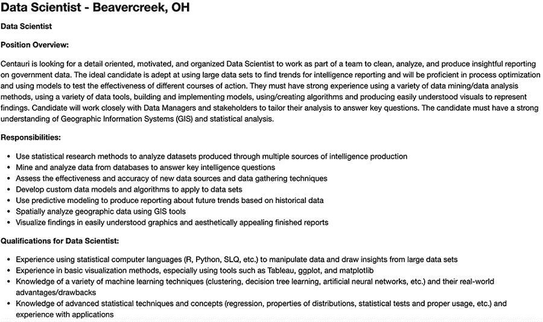

图 17.1 第一个职位发布的渲染 HTML。首段总结了数据科学职位。该段落后面是包含获得该职位所需技能的要点列表。

渲染的职位发布是一个数据科学职位。发布从简短的工作概述开始，从中我们了解到该工作涉及从政府数据中提取见解。所需的各种技能包括模型构建、统计学和可视化。这些技能在两个加粗的小节中得到进一步阐述：职责和资格。每个小节由多个单句要点组成。要点的内容各异：职责包括统计方法的使用（要点 1）、未来趋势的发现（要点 5）、地理数据的空间分析（要点 6）和美观的视觉呈现（要点 7）。此外，要点资格涵盖了诸如 R 或 Python 等计算机语言（要点 1）、Matplotlib 等可视化工具（要点 2）、包括聚类在内的机器学习技术（要点 3）以及高级统计概念的掌握（要点 4）。

值得注意的是，资格与职责并没有太大的区别。是的，资格侧重于工具和概念，而职责则更贴近工作上的行动；但某种程度上，它们的要点是可以互换的。每个要点描述了申请者必须具备的技能，以便在岗位上表现良好。因此，我们可以将`html_contents[0]`划分为两个概念上不同的部分：

+   一个初始的职位摘要

+   获得该职位所需技能的要点列表

下一个职位发布是否以类似的方式结构化？让我们通过渲染`html_contents[1]`（图 17.2）来找出答案。

列表 17.5 渲染第二个职位发布的 HTML

```
display(HTML(html_contents[1]))
```

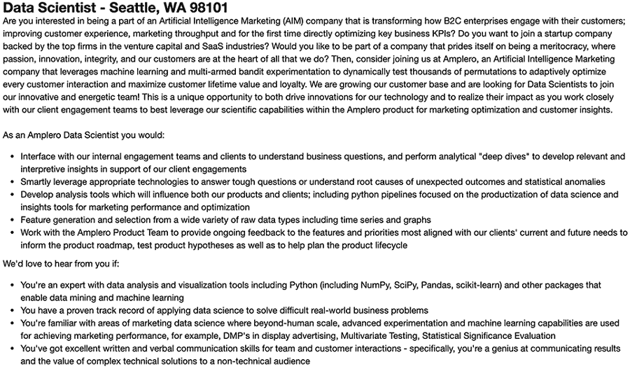

图 17.2 第二个职位发布的渲染 HTML。与第一个发布一样，首段总结了数据科学职位，然后是一个描述获得该职位所需技能的要点列表。

这则职位招聘的是一家 AI 营销公司的数据科学职位。帖子的结构类似于 `html_contents[0]`：职位在帖子的第一段中总结，然后以项目符号的形式展示所需技能。这些项目符号的技能在技术要求和细节方面各不相同。例如，从底部起的第四个项目符号要求具备 Python 数据科学栈（NumPy、SciPy、Pandas、scikit-learn）的专业知识，下一个项目符号要求有解决困难现实世界商业问题的记录，最后一个项目符号要求有优秀的书面和口头沟通技能。这三个项目符号技能非常不同。这种差异是有意的——帖子的作者在强调获得这份工作所需的多样化要求。因此，`html_contents[0]` 和 `html_contents[1]` 中的项目符号只有一个目的：它们为我们提供了每个职位所需独特技能的简短、句子长度的描述。

这些类型的带项目符号的技能描述是否出现在其他职位帖子中？让我们来了解一下。首先，我们将从每个解析的 HTML 文件中提取项目符号。提醒一下，项目符号由 HTML 标签 `<li>` 表示。任何带项目符号的文件都包含多个此类标签；因此，我们可以通过调用 `soup.find_all('li')` 从 `soup` 对象中提取项目符号列表。接下来，我们将遍历我们的 `soup_objects` 列表，并从该列表的每个元素中提取所有项目符号。我们将这些结果存储在我们现有的 `df_jobs` 表的 `Bullets` 列中。

列表 17.6 从 HTML 中提取项目符号

```
df_jobs['Bullets'] = [[bullet.text.strip()                 ❶
                      for bullet in soup.find_all('li')]
                      for soup in soup_objects]
```

❶ 从每个项目符号中删除换行符，以避免在我们后续的调查中打印换行符

每个职位帖子中的项目符号存储在 `df_jobs.Bullets` 中。然而，可能有一些（或大多数）帖子没有包含任何项目符号。有多少百分比的工作帖子实际上包含带项目符号的文本？我们需要找出！如果这个百分比太低，进一步的子弹分析不值得我们花费时间。让我们来测量这个百分比。

列表 17.7 测量带项目符号的帖子百分比

```
bulleted_post_count = 0
for bullet_list in df_jobs.Bullets:
    if bullet_list:
        bulleted_post_count += 1

percent_bulleted = 100 * bulleted_post_count / df_jobs.shape[0]
print(f"{percent_bulleted:.2f}% of the postings contain bullets")

90.53% of the postings contain bullets
```

90% 的工作帖子包含项目符号。所有（或大多数）这些项目符号是否都集中在技能上？我们目前还不知道。然而，我们可以通过打印这些项目符号文本中的排名最高的单词来更好地衡量其内容。我们可以通过出现次数来对这些单词进行排名；或者，我们可以使用术语频率-逆文档频率（TFIDF）值而不是原始计数来进行排名。如第十五部分所述，这种 TFIDF 排名不太可能包含无关的单词。

接下来，我们使用求和的 TFIDF 值对单词进行排名。首先，我们计算一个 TFIDF 矩阵，其中行对应于单个项目符号。然后，我们在矩阵的行上求和：这些和用于对单词进行排名，这些单词对应于矩阵的列。最后，我们检查排名前五的单词，以检查与技能相关的术语。

列表 17.8 检查 HTML 项目符号中的顶级单词

```
import pandas as pd
from sklearn.feature_extraction.text import TfidfVectorizer

def rank_words(text_list):                                          ❶
    vectorizer = TfidfVectorizer(stop_words='english')
    tfidf_matrix = vectorizer.fit_transform(text_list).toarray()
    df = pd.DataFrame({'Words': vectorizer.get_feature_names(),
                       'Summed TFIDF': tfidf_matrix.sum(axis=0)})   ❷
    sorted_df = df.sort_values('Summed TFIDF', ascending=False)
    return sorted_df

all_bullets = []
for bullet_list in df_jobs.Bullets:
    all_bullets.extend(bullet_list)

sorted_df = rank_words(all_bullets)
print(sorted_df[:5].to_string(index=False))

      Words  Summed TFIDF
 experience    878.030398
       data    842.978780
     skills    440.780236
       work    371.684232
    ability    370.969638
```

❶ 返回一个按排名排序的 Pandas 表

❷ 单词是根据 tfidf_matrix 中每行的 TFIDF 值总和进行排序的。

*技能*和*能力*等术语出现在前五个项目符号中。有合理的证据表明，项目符号与个人的工作技能相对应。这些项目符号与每个职位帖子中的其他单词如何比较？让我们找出答案。我们遍历每个帖子的正文，并使用 Beautiful Soup 的`decompose`方法删除任何项目符号列表。然后我们提取剩余的正文文本，并将其存储在`non_bullets`列表中。最后，我们将我们的`rank_words`函数应用于该列表，并显示前五个非项目符号单词。

列表 17.9 检查 HTML 正文中的顶级单词

```
non_bullets = []
for soup in soup_objects:
    body = soup.body
    for tag in body.find_all('li'):
        tag.decompose()                ❶

    non_bullets.append(body.text)

sorted_df = rank_words(non_bullets)
print(sorted_df[:5].to_string(index=False))

      Words  Summed TFIDF
       data     99.111312
       team     39.175041
       work     38.928948
 experience     36.820836
   business     36.140488
```

❶ 另一种方法是调用 body.find_all('ul')将得到相同的结果。

*技能*和*能力*这两个词不再出现在排名输出中。它们已被*商业*和*团队*这两个词所取代。因此，非项目符号文本似乎比项目符号内容更不侧重于技能。然而，仍然值得注意的是，某些顶级排名的单词在`bullets`和`non_bullets`之间共享：这些单词是*数据*、*经验*和*工作*。奇怪的是，*科学家*和*科学*这两个词在列表中缺失。是否有帖子涉及数据驱动的工作，而这些工作并非直接的数据科学工作？让我们积极探索这个可能性。我们首先遍历所有职位的所有标题，并检查每个标题是否提到了数据科学职位。然后我们测量缺少*数据科学*和*数据科学家*这两个词的职位的百分比。最后，为了评估目的，我们打印出 10 个这样的标题样本。

注意：如第十一部分所述，我们使用正则表达式将我们的术语与标题文本进行匹配。

列表 17.10 检查标题是否有提及数据科学职位

```
regex = r'Data Scien(ce|tist)'
df_non_ds_jobs = df_jobs[~df_jobs.Title.str.contains(regex, case=False)]   ❶

percent_non_ds = 100 * df_non_ds_jobs.shape[0] / df_jobs.shape[0]
print(f"{percent_non_ds:.2f}% of the job posting titles do not mention a "
       "data science position. Below is a sample of such titles:\n")

for title in df_non_ds_jobs.Title[:10]:
    print(title)

64.81% of the job posting titles do not mention a data science position. Below 
is a sample of such titles:

Patient Care Assistant / PCA - Med/Surg (Fayette, AL) - Fayette, AL
Data Manager / Analyst - Oakland, CA
Scientific Programmer - Berkeley, CA
JD Digits - AI Lab Research Intern - Mountain View, CA
Operations and Technology Summer 2020 Internship-West Coast - Universal City, CA
Data and Reporting Analyst - Olympia, WA 98501
Senior Manager Advanced Analytics - Walmart Media Group - San Bruno, CA
Data Specialist, Product Support Operations - Sunnyvale, CA
Deep Learning Engineer - Westlake, TX
Research Intern, 2020 - San Francisco, CA 94105
```

❶ Pandas 的 str.contains 方法可以将正则表达式匹配到列文本。传递 case=False 确保匹配不区分大小写。

几乎 65%的帖子标题没有提及数据科学职位。然而，从我们的样本输出中，我们可以了解到可以用来描述数据科学工作的替代语言。一个帖子可能要求一个*数据专家*、一个*数据分析师*或一个*科学程序员*。此外，某些职位帖子是为研究实习生的，我们可以假设这些实习是数据驱动的。但并非所有样本工作都与我们的直接职业目标完全相关：多个帖子是为管理职位的，这与我们的直接职业目标不符。管理是一个独立的职业路径，需要其独特的技能集。我们应该考虑从我们的分析中排除管理职位。

更令人不安的是，列表中的第一份发布信息是关于一名*患者护理助理*或*PCA*。显然，这份发布信息被错误地抓取了。也许抓取算法将职位名称与 PCA 数据缩减技术混淆了。这份错误发布的信息包含我们缺乏且没有兴趣获得的技能。这些无关的技能对我们的分析构成了危险，如果不删除，将成为噪声的来源。我们可以通过打印`df_non_ds_jobs[0]`的前五个项目符号来说明这种危险。

列表 17.11 从非数据科学职位中采样项目符号

```
bullets = df_non_ds_jobs.Bullets.iloc[0]
for i, bullet in enumerate(bullets[:5]):
     print(f"{i}: {bullet.strip()}")

0: Provides all personal care services in accordance with the plan of
treatment assigned by the registered nurse
1: Accurately documents care provided
2: Applies safety principles and proper body mechanics to the performance 
of specific techniques of personal and supportive care, such as ambulation 
of patients, transferring patients, assisting with normal range of motions 
and positioning
3: Participates in economical utilization of supplies and ensures that 
equipment and nursing units are maintained in a clean, safe manner
4: Routinely follows and adheres to all policies and procedures
```

我们是数据科学家；我们的主要目标不是患者护理（索引 0）或护理设备维护（索引 4）。我们需要从我们的数据集中删除这些技能，但如何操作呢？一种方法是使用文本相似度。我们可以将职位发布信息与我们的简历进行比较，并删除与简历内容不一致的工作。此外，我们还应该考虑将职位发布信息与本书的目录进行比较，以增加信号。基本上，我们应该评估每个职位相对于简历和书籍材料的相关性；这将使我们能够过滤掉无关的发布信息，仅保留最相关的职位。

或者，我们可以考虑过滤掉项目符号中包含的个别技能。基本上，我们会给个别项目符号排名，而不是个别工作。但第二种方法存在一个问题。想象一下，如果我们过滤掉所有与我们的简历或书籍材料不一致的项目符号：剩下的项目符号将涵盖我们已掌握的技能。这与我们的目标相悖，即通过相关数据科学发布信息来揭示我们缺失的技能。相反，我们应该按照以下方式完成我们的目标：

1.  获取与我们的现有技能集部分匹配的相关职位发布信息。

1.  检查这些发布信息中哪些项目符号缺少在我们的现有技能集中。

思考这个策略，我们现在将根据相关性过滤工作。

## 17.2 通过相关性过滤工作

我们的目标是使用文本相似度来评估职位的相关性。我们希望将每份发布信息中的文本与我们的简历和/或本书的目录进行比较。为此，让我们将我们的简历存储在一个`resume`字符串中。

列表 17.12 加载简历

```
resume = open('resume.txt', 'r').read()
print(resume)

Experience

1\. Developed probability simulations using NumPy.
2\. Assessed online ad-clicks for statistical significance using Permutation testing.
3\. Analyzed disease outbreaks using common clustering algorithms.

Additional Skills

1\. Data visualization using Matplotlib.
2\. Statistical analysis using SciPy.
3\. Processing structured tables using Pandas.
4\. Executing K-Means clustering and DBSCAN clustering using Scikit-Learn.
5\. Extracting locations from text using GeonamesCache.
6\. Location analysis and visualization using GeonamesCache and Cartopy.
7\. Dimensionality reduction with PCA and SVD, using Scikit-Learn.
8\. NLP analysis and text topic detection using Scikit-Learn.
```

以同样的方式，我们可以将目录存储在一个`table_of_contents`字符串中。

列表 17.13 加载目录

```
table_of_contents = open('table_of_contents.txt', 'r').read()
```

`resume`和`table_of_contents`一起总结了我们的现有技能集。让我们将这些技能连接成一个单一的`existing_skills`字符串。

列表 17.14 将技能合并成一个字符串

```
existing_skills = resume + table_of_contents
```

我们的任务是计算每个职位发布与我们的现有技能之间的文本相似度。换句话说，我们想要计算`df_jobs.Body`和`existing_skills.`之间的所有相似度。这种计算首先需要将所有文本向量化。我们需要将`df_jobs.Body`和`existing_skills`一起向量化，以确保所有向量共享相同的词汇表。接下来，我们将我们的职位发布和技能字符串合并成一个单独的文本列表，并使用 scikit-learn 的`TfidfVectorizer`实现向量化这些文本。

列表 17.15 向量化我们的技能和职位发布数据

```
text_list = df_jobs.Body.values.tolist() + [existing_skills]
vectorizer = TfidfVectorizer(stop_words='english')
tfidf_matrix = vectorizer.fit_transform(text_list).toarray()
```

我们向量化后的文本存储在`tfidf_matrix`矩阵格式中。最终的矩阵行（`tfidf_matrix[-1]`）对应于我们的现有技能集，而`(tfidf_matrix[:-1])`中的所有其他行对应于职位发布。因此，我们可以轻松地计算职位发布与`existing_skills`之间的余弦相似度。我们只需执行`tfidf_matrix[:-1] @ tfidf_matrix[-1]`：这个矩阵-向量积返回一个余弦相似度数组。列表 17.16 计算了`cosine_similarities`数组。

注意：你可能想知道可视化排名分布是否有价值。答案是肯定的！我们很快就会绘制这个分布以获得有价值的见解，但首先我们想要通过打印排名最高的职位标题来进行简单的合理性检查。这样做将确认我们的假设是正确的，并且所有打印的职位都是相关的。

列表 17.16 计算基于技能的余弦相似度

```
cosine_similarities = tfidf_matrix[:-1] @ tfidf_matrix[-1]
```

余弦相似度捕捉了我们现有技能与发布的职位之间的文本重叠。重叠度更高的职位更相关，重叠度较低的职位则不太相关。因此，我们可以使用余弦相似度来按相关性对职位进行排序。让我们进行排序。首先，我们需要将余弦相似度存储在`df_jobs`的`Relevance`列中。然后，我们按`df_jobs.Relevance`降序排列表格。最后，我们打印出排序表中排名最低的 20 个职位标题，并确认这些排名靠后的职位是否与数据科学有关。

列表 17.17 打印出 20 个最不相关的职位

```
df_jobs['Relevance'] = cosine_similarities
sorted_df_jobs = df_jobs.sort_values('Relevance', ascending=False)
for title in sorted_df_jobs[-20:].Title:
    print(title)

Data Analyst Internship (8 month minimum) - San Francisco, CA
Leadership and Advocacy Coordinator - Oakland, CA 94607
Finance Consultant - Audi Palo Alto - Palo Alto, CA
RN - Hattiesburg, MS
Configuration Management Specialist - Dahlgren, VA
Deal Desk Analyst - Mountain View, CA
Dev Ops Engineer AWS - Rockville, MD
Web Development Teaching Assistant - UC Berkeley (Berkeley) - Berkeley, CA
Scorekeeper - Oakland, CA 94612
Direct Care - All Experience Levels (CNA, HHA, PCA Welcome) - Norwell, MA 02061
Director of Marketing - Cambridge, MA
Certified Strength and Conditioning Specialist - United States
PCA - PCU Full Time - Festus, MO 63028
Performance Improvement Consultant - Los Angeles, CA
Patient Services Rep II - Oakland, CA
Lab Researcher I - Richmond, CA
Part-time instructor of Statistics for Data Science and Machine Learning - San Francisco, CA 94105
Plant Engineering Specialist - San Pablo, CA
Page Not Found - Indeed Mobile
Director of Econometric Modeling - External Careers
```

打印出的大多数职位都完全不相关。各种无关的就业机会包括*领导倡导协调员*、*财务顾问*、*注册护士*（RN）和*记分员*。甚至有一个职位标题是*页面未找到*，这表明网页没有正确下载。然而，其中一些职位与数据科学相关：例如，有一个职位要求招聘*统计学和数据科学及机器学习兼职讲师*。尽管如此，这个职位并不是我们真正想要的。毕竟，我们的直接目标是练习数据科学，而不是教授它。我们可以丢弃排序表中排名最低的 20 个职位。现在，为了进行比较，让我们打印出`sorted_ds_jobs`中排名最高的 20 个职位标题。

列表 17.18 打印出 20 个最相关的职位

```
for title in sorted_df_jobs[:20].Title:
    print(title)

Chief Data Officer - Culver City, CA 90230
Data Scientist - Beavercreek, OH
Data Scientist Population Health - Los Angeles, CA 90059
Data Scientist - San Diego, CA
Data Scientist - Beavercreek, OH
Senior Data Scientist - New York, NY 10018
Data Architect - Raleigh, NC 27609
Data Scientist (PhD) - Spring, TX
Data Science Analyst - Chicago, IL 60612
Associate Data Scientist (BS / MS) - Spring, TX
Data Scientist - Streetsboro, OH 44241
Data Scientist - Los Angeles, CA
Sr Director of Data Science - Elkridge, MD
2019-57 Sr. Data Scientist - Reston, VA 20191
Data Scientist (PhD) - Intern - Spring, TX
Sr Data Scientist. - Alpharetta, GA 30004
Data Scientist GS 13/14 - Clarksburg, WV 26301
Data Science Intern (BS / MS) - Intern - Spring, TX
Senior Data Scientist - New York, NY 10038
Data Scientist - United States
```

几乎所有打印的职位名称都是数据科学职位。一些职位，如 *首席数据官*，可能超出了我们现有的专业知识水平，但排名最高的职位似乎与我们数据科学职业非常相关。

注：根据其标题，首席数据官（*Chief Data Officer*）的位置看起来是一个管理职位。正如我们之前所述，管理职位需要一套独特的技能。然而，如果我们输出职位描述的主体（`sorted_df_jobs.iloc[0].Body`），我们会立即发现这份工作根本不是管理职位！公司只是在寻找一位经验丰富的数据科学家来满足其所有的数据科学需求。有时职位名称可能会误导人；仅仅浏览标题并不能完全替代仔细阅读正文。

显然，当 `df_jobs.Relevance` 较高时，相关的职位发布是相关的。随着 `df_jobs.Relevance` 的降低，相关的职位变得不那么相关。因此，我们可以假设存在某个 `df_jobs.Relevance` 截止值，将相关职位与非相关职位分开。让我们尝试识别这个截止值。我们首先可视化排序后的相关性分布相对于排名的形状。换句话说，我们绘制 `range(df_jobs.shape[0])` 与 `sorted_df_jobs.Relevance` 的关系图（图 17.3）。在图表中，我们期望看到一个持续下降的相关性曲线；曲线中任何突然的相关性下降都表明相关职位与非相关职位之间的分离。

列表 17.19 绘制职位排名与相关性的关系

```
import matplotlib.pyplot as plt
plt.plot(range(df_jobs.shape[0]), sorted_df_jobs.Relevance.values)
plt.xlabel('Index')
plt.ylabel('Relevance')
plt.show()
```

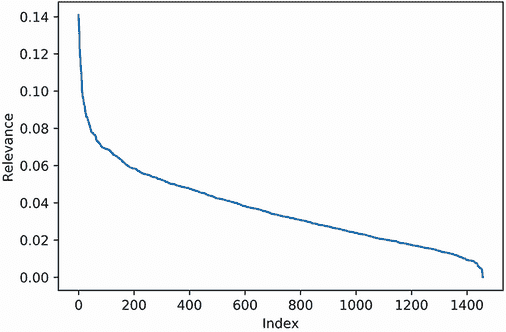

图 17.3 职位发布排名索引与相关性的关系图。较低的索引表示较高的相关性。相关性等于每个职位与 `existing_skills` 之间的余弦相似度。相关性在约 60 的索引处迅速下降。

我们的相关性曲线类似于 K-means 肘部图。最初，相关性迅速下降。然后，在 x 值约为 60 时，曲线开始平缓。让我们通过在图表中 x 位置 60 处画一条垂直线来强调这一转变（图 17.4）。

列表 17.20 在相关性图中添加截止值

```
plt.plot(range(df_jobs.shape[0]), sorted_df_jobs.Relevance.values)
plt.xlabel('Index')
plt.ylabel('Relevance')
plt.axvline(60, c='k')
plt.show()
```

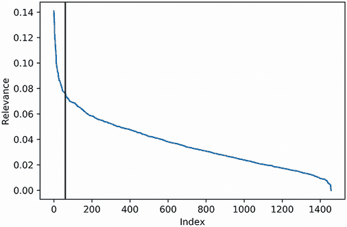

图 17.4 职位发布排名索引与相关性的关系图。图中还包括了 60 的垂直截止值。低于 60 的索引对应于更高的相关性值。

我们的图表表明，前 60 个职位与所有后续职位相比明显更具相关性。现在，我们将探究这一暗示。正如我们已经看到的，前 20 个职位高度相关。根据我们的假设，40 到 60 之间的职位也应该高度相关。接下来，为了评估目的，我们打印 `sorted_ds_jobs[40: 60].Title`。

列表 17.21 打印低于相关性截止值的职位

```
for title in sorted_df_jobs[40: 60].Title.values:
    print(title)

Data Scientist III - Pasadena, CA 91101
Global Data Engineer - Boston, MA
Data Analyst and Data Scientist - Summit, NJ
Data Scientist - Generalist - Glendale, CA
Data Scientist - Seattle, WA
IT Data Scientist - Contract - Riverton, UT
Data Scientist (Analytic Consultant 4) - San Francisco, CA
Data Scientist - Seattle, WA
Data Science & Tagging Analyst - Bethesda, MD 20814
Data Scientist - New York, NY
Senior Data Scientist - Los Angeles, CA
Principal Statistician - Los Angeles, CA
Senior Data Analyst - Los Angeles, CA
Data Scientist - Aliso Viejo, CA 92656
Data Engineer - Seattle, WA
Data Scientist - Digital Factory - Tampa, FL 33607
Data Scientist - Grapevine, TX 76051
Data Scientist - Bioinformatics - Denver, CO 80221
EPIDEMIOLOGIST - Los Angeles, CA
Data Scientist - Bellevue, WA
```

几乎所有发布的职位都是数据科学家/分析师职位。唯一的异常是一个流行病学家职位，这可能是由于我们声明的跟踪疾病流行的经验。尽管有异常，剩余的工作相关性仍然很高。隐含地，当我们打印下一个 20 个工作标题时，相关性应该会降低，因为它们超出了索引 60 的范围。让我们验证一下这是否属实。

列表 17.22 打印超出相关性截止值的工作

```
for title in sorted_df_jobs[60: 80].Title.values:
    print(title)

Data Scientist - Aliso Viejo, CA
Data Scientist and Visualization Specialist - Santa Clara Valley, CA 95014
Data Scientist - Los Angeles, CA
Data Scientist Manager - NEW YORK LOCATION! - New York, NY 10036
Data Science Intern - San Francisco, CA 94105
Research Data Analyst - San Francisco, CA
Sr Data Scientist (Analytic Consultant 5) - San Francisco, CA
Data Scientist, Media Manipulation - Cambridge, MA
Manager, Data Science, Programming and Visualization - Boston, MA
Data Scientist in Broomfield, CO - Broomfield, CO
Senior Data Scientist - Executive Projects and New Solutions - Foster City, CA
Manager of Data Science - Burbank California - Burbank, CA
Data Scientist Manager - Hiring in Burbank! - Burbank, CA
Data Scientists needed in NY - Senior Consultants and Managers! - New York, NY 10036
Data Scientist - Menlo Park, CA
Data Engineer - Santa Clara, CA
Data Scientist - Remote
Data Scientist I-III - Phoenix, AZ 85021
SWE Data Scientist - Santa Clara Valley, CA 95014
Health Science Specialist - San Francisco, CA 94102
```

60 到 80 号发布的几个工作标题的相关性明显较低。有些工作是管理职位，还有一个是健康科学专家职位。尽管如此，大多数工作都涉及健康科学或管理范围之外的数据科学/分析师角色。我们可以快速使用正则表达式量化这一观察结果。我们定义了一个 `percent_relevant_titles` 函数，它返回数据帧切片中非管理数据科学和分析工作的百分比。然后我们将该函数应用于 `sorted_df_jobs[60: 80]`。输出给出了基于工作发布标题的非常简单的相关性替代度量。

列表 17.23 在工作子集中测量标题相关性

```
import re
def percent_relevant_titles(df):
    regex_relevant = re.compile(r'Data (Scien|Analy)',            ❶
                                flags=re.IGNORECASE)
    regex_irrelevant = re.compile(r'\b(Manage)',                  ❷
                                  flags=re.IGNORECASE)
    match_count = len([title for title in df.Title
                       if regex_relevant.search(title)
                       and not regex_irrelevant.search(title)])   ❸
    percent = 100 * match_count / df.shape[0]
    return percent

percent = percent_relevant_titles(sorted_df_jobs[60: 80])
print(f"Approximately {percent:.2f}% of job titles between indices "
       "60 - 80 are relevant")

Approximately 65.00% of job titles between indices 60 - 80 are relevant
```

❶ 匹配提及数据科学/分析师职位的相关工作标题

❷ 匹配提及管理职位的不相关工作标题

❸ 计算非管理数据科学/分析师标题匹配的数量

`sorted_df_jobs[60: 80]` 中的工作标题中有大约三分之二的相关性。尽管工作相关性在索引 60 之后有所下降，但仍有超过 50% 的标题指的是数据科学工作。如果我们从索引范围 80 到 100 样本下一个 20 个工作，这个百分比可能会下降。让我们检查一下。

列表 17.24 在下一个工作子集测量标题相关性

```
percent = percent_relevant_titles(sorted_df_jobs[80: 100])
print(f"Approximately {percent:.2f}% of job titles between indices "
       "80 - 100 are relevant")

Approximately 80.00% of job titles between indices 80 - 100 are relevant
```

没错！数据科学标题的百分比上升到 80%。百分比将在何时降至 50% 以下？我们可以轻松地找出答案！让我们遍历 `sorted_df_jobs[i: i + 20]` 的所有 `i` 值。在每次迭代中，我们计算相关性百分比。然后我们绘制所有百分比（图 17.5）。我们还绘制了一条 50% 的水平线，以便我们确定相关工作标题落入少数的索引。

列表 17.25 绘制所有标题样本的相关性百分比

```
def relevant_title_plot(index_range=20):                    ❶
    percentages = []
    start_indices = range(df_jobs.shape[0] - index_range)   ❷
    for i in start_indices:
        df_slice = sorted_df_jobs[i: i + index_range]
        percent = percent_relevant_titles(df_slice)
        percentages.append(percent)

    plt.plot(start_indices, percentages)
    plt.axhline(50, c='k')
    plt.xlabel('Index')
    plt.ylabel('% Relevant Titles')

relevant_title_plot()
plt.show()
```

❶ 函数在索引范围的工作的每个连续切片上运行 `percent_relevant_titles`。接下来，绘制所有百分比。`index_range` 参数预设为 20。稍后，我们将调整该参数值。

❷ 分析 `sorted_df_jobs[i: i + index_range]`，其中 i 的范围从 0 到总发布数减去索引范围

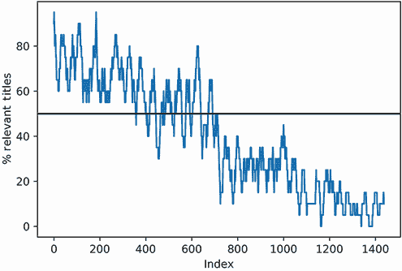

图 17.5 按标题相关性排序的工作发布索引与标题相关性对比。标题相关性等于 20 个连续工作发布中数据科学标题的百分比（从某个索引开始）。一条水平线标志着 50% 的相关性。相关性在约 700 个索引处降至 50% 以下。

图表波动幅度很大。但尽管有波动，我们可以观察到相关的数据科学标题在约 700 的索引处下降到 50%以下。当然，700 的截止点可能只是我们选择的索引范围的一个偶然现象。如果我们将索引范围加倍，截止点还会存在吗？我们将通过运行`relevant_title_plot(index_range=40)`（图 17.6）来找出答案。我们还绘制了一条垂直线在索引 700 处，以确认百分比在超过该线的地方下降到 50%以下。

列表 17.26 在增加的索引范围内绘制百分比相关性

```
relevant_title_plot(index_range=40)
plt.axvline(700, c='k')
plt.show()
```

我们更新的图表继续在索引截止点 700 以下下降到 50%以下。

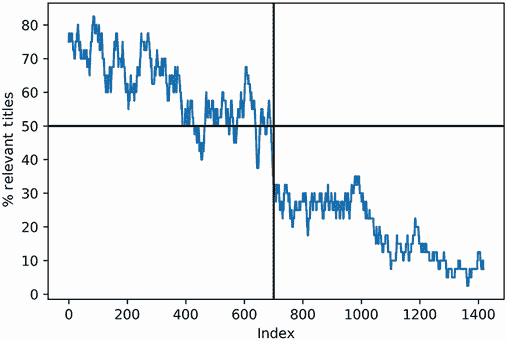

图 17.6 职位发布索引排名与标题相关性的对比。标题相关性等于 40 个连续职位发布中数据科学标题的百分比（从某个索引开始）。一条水平线表示 50%的相关性，一条垂直线表示索引 700。在这条线以下，相关性下降到 50%以下。

注意：近似该截止点的方法不止一种。例如，我们可以简化我们的正则表达式为`r'Data (Science|Scientist)'`。这样我们就忽略了所有关于分析师或经理的提及。此外，假设我们消除使用索引范围，而是计算每个索引以下出现的数据科学标题的总数。如果我们绘制这些简单结果，我们会看到一条在索引 700 处趋于平稳的曲线。尽管我们的简化，我们仍然取得了非常相似的结果。在数据科学中，通常有不止一条通往有洞察力的观察的路径。

在这一点上，我们面临两个相关性截止点的选择。我们的第一个截止点，在索引 60 处，非常精确：大多数低于该截止点的职位都是数据科学职位。然而，该截止点的召回率有限：数百个数据科学职位出现在索引 60 以上。同时，我们的第二个截止点 700 捕捉到了更多的数据科学职位，但也有一些不相关的职位出现在截止点范围内。两个相关性截止点之间几乎有 12 倍的区别。那么，我们应该选择哪个截止点？我们更倾向于更高的精确度还是更高的召回率？如果我们选择更高的召回率，噪声会损害我们的分析吗？如果我们选择更高的精确度，看到的技能的有限多样性会使我们的分析不完整吗？这些都是重要的问题。不幸的是，没有立即正确的答案。以牺牲召回率为代价的更高精确度可能会对我们造成伤害，反之亦然。我们应该怎么做？

那么尝试两个截止点怎么样？这样，我们可以比较每个截止点的权衡和好处！首先，我们将对索引 60 以下的职位发布中的技能集进行聚类。然后，我们将对索引 700 以下的职位发布重复我们的分析。最后，我们将将这些不同的分析整合成一个单一、连贯的结论。

## 17.3 相关职位发布中的聚类技能

我们的目标是对 60 个最相关的工作帖子中的技能进行聚类。每个帖子中的技能多种多样，部分由项目点表示。因此，我们面临一个选择：

+   将`sorted_df_jobs[:60].Body`中的 60 个文本进行聚类。

+   将`sorted_df_jobs[:60].Bullets`中的数百个单独的项目点进行聚类。

第二种选择更可取，以下是一些原因：

+   我们的目标是识别缺失的技能。项目点更多地关注每个帖子中的个人技能，而不是每个帖子的异质体。

+   短的项目点易于打印和阅读。对于较大的帖子来说并非如此。因此，通过项目点进行聚类使我们能够通过输出聚类项目文本的样本来检查每个聚类。

我们将聚类抓取的项目点。我们首先将`sorted_df_jobs[:60].Bullets`存储在一个单独的列表中。

列表 17.27 从 60 个最相关的职位中获取项目点

```
total_bullets = []
for bullets in sorted_df_jobs[:60].Bullets:
    total_bullets.extend(bullets)
```

列表中有多少个项目点？是否有重复的项目点？我们可以通过将`total_bullets`加载到 Pandas 表中并应用`describe`方法来检查。

列表 17.28 总结基本的项目点统计信息

```
df_bullets = pd.DataFrame({'Bullet': total_bullets})
print(df_bullets.describe())

Bullet
count                                                1091
unique                                                900
top     Knowledge of advanced statistical techniques a...
freq                                                    9
```

列表中包含 1,091 个项目点。然而，只有 900 个是唯一的——剩余的 91 个项目点是重复的。最频繁的重复项被提及了九次。如果我们不处理这个问题，它可能会影响我们的聚类。在进行分析之前，我们应该移除所有重复文本。

注意：这些重复项从何而来？我们可以通过追踪几个重复项到它们原始的工作帖子中找到答案。为了简洁起见，这项分析不包括在书中。然而，我们鼓励你自己尝试。输出显示了某些公司如何为不同的工作重复使用工作模板。每个模板都会为每个职位进行修改，但某些重复的项目点仍然保留。这些重复的项目点可能会使我们的聚类偏向于特定公司的技能，因此应该从`total_bullets`中移除。

接下来，我们从我们的项目点列表中过滤掉空字符串和重复项。然后我们使用 TFIDF 向量器对列表进行向量化。

列表 17.29 移除重复项并对项目点进行向量化

```
total_bullets = sorted(set(total_bullets))              ❶
vectorizer = TfidfVectorizer(stop_words='english')
tfidf_matrix = vectorizer.fit_transform(total_bullets)
num_rows, num_columns = tfidf_matrix.shape
print(f"Our matrix has {num_rows} rows and {num_columns} columns")
```

❶ 将`total_bullets`转换为集合以移除 91 个重复项。我们对该集合进行排序以确保一致的顺序（从而保证一致的输出）。或者，我们可以通过运行`df_bullets.drop_duplicates(inplace=True)`直接从我们的 Pandas 表中删除重复项。

我们已经将去重后的项目点列表进行了向量化。得到的 TFIDF 矩阵有 900 行和超过 2000 列；因此，它包含超过 180 万个元素。这个矩阵对于有效的聚类来说太大。让我们使用第十五部分中描述的程序对矩阵进行降维：我们将使用 SVD 将矩阵缩小到 100 维，然后对矩阵进行归一化处理。

列表 17.30 对 TFIDF 矩阵进行降维

```
import numpy as np
from sklearn.decomposition import TruncatedSVD
from sklearn.preprocessing import normalize
np.random.seed(0)

def shrink_matrix(tfidf_matrix):                   ❶
    svd_object = TruncatedSVD(n_components=100)
    shrunk_matrix = svd_object.fit_transform(tfidf_matrix)
    return normalize(shrunk_matrix)

shrunk_norm_matrix = shrink_matrix(tfidf_matrix)
```

❶ 对输入的 TFIDF 矩阵应用奇异值分解（SVD）。矩阵被降至 100 维，进行归一化处理并返回。

我们几乎准备好使用 K-means 算法对标准化矩阵进行聚类了。然而，首先我们需要估计*K*值。让我们使用迷你批量的 K-means 算法生成一个肘部图，该算法针对速度进行了优化（图 17.7）。

列表 17.31 使用迷你批量的 K-means 算法绘制肘部曲线

```
np.random.seed(0)
from sklearn.cluster import MiniBatchKMeans
def generate_elbow_plot(matrix):                                ❶
    k_values = range(1, 61)                                     ❷
    inertia_values = [MiniBatchKMeans(k).fit(matrix).inertia_
                      for k in k_values]
    plt.plot(k_values, inertia_values)
    plt.xlabel('K')
    plt.ylabel('Inertia')
    plt.grid(True)                                              ❸
    plt.show()

generate_elbow_plot(shrunk_norm_matrix)
```

❶ 使用迷你批量的 K-means 算法在输入数据矩阵上生成肘部图

❷ 聚类的数量从 1 到 60 不等。

❸ 绘制网格线以帮助我们确定肘部在 x 轴上的位置

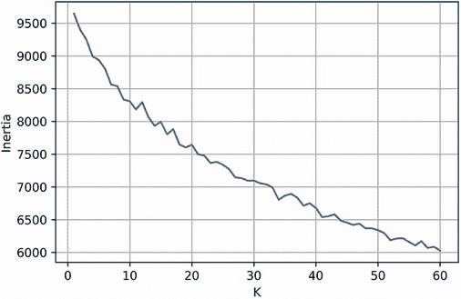

图 17.7 使用迷你批量的 K-means 算法生成的肘部图，*K*值从 1 到 60 不等。肘部的确切位置难以确定。

我们绘制的曲线平滑下降。弯曲肘部形状的精确位置难以辨认：该曲线在*K*值为 10 时急剧下降，然后逐渐弯曲到 10 和 25 之间的某个位置。我们应该选择哪个*K*值？10，25，还是介于两者之间的某个值，比如 15 或 20？正确的答案并不立即明朗。那么为什么不尝试多个*K*值呢？让我们使用 10，15，20 和 25 的*K*值多次聚类我们的数据。然后我们将比较和对比结果。如果需要，我们将考虑为聚类选择不同的*K*值。我们将首先将工作技能分组到 15 个聚类中。

注意：我们的目标是调查四个不同*K*值输出的结果。我们生成输出的顺序是完全随机的。在这本书中，我们从*K*值为 15 开始，因为生成的聚类数量既不太大也不太小。这为后续讨论输出结果提供了一个很好的基线。

### 17.3.1 将工作技能分组到 15 个聚类中

我们使用*K*值为 15 执行 K-means 算法。然后我们将文本索引和聚类 ID 存储在一个 Pandas 表中。我们还存储了实际的子弹文本，以便更容易访问。最后，我们利用 Pandas 的`groupby`方法按聚类分割表。

列表 17.32 将子弹聚类到 15 个聚类中

```
np.random.seed(0)
from sklearn.cluster import KMeans

def compute_cluster_groups(shrunk_norm_matrix, k=15,                       ❶
                           bullets=total_bullets):
    cluster_model = KMeans(n_clusters=k)
    clusters = cluster_model.fit_predict(shrunk_norm_matrix)
    df = pd.DataFrame({'Index': range(clusters.size), 'Cluster': clusters,
                       'Bullet': bullets})                                 ❷
    return [df_cluster for  _, df_cluster in df.groupby('Cluster')]

cluster_groups = compute_cluster_groups(shrunk_norm_matrix)
```

❶ 在输入的 shrink_norm_matrix 上执行 K-means 聚类。K 参数预设为 15。该函数返回一个 Pandas 表的列表，其中每个表代表一个聚类。聚类后的子弹包含在这些表中；子弹是通过可选的 bullets 参数传递的。

❷ 跟踪每个聚类子弹的索引、聚类 ID 和文本

我们的每个文本聚类都存储在`cluster_groups`列表中的 Pandas 表中。我们可以使用词云可视化聚类。在第十五部分中，我们定义了一个自定义的`cluster_to_image`函数用于词云可视化。该函数接受一个特定聚类的 Pandas 表作为输入，并返回一个词云图像。列表 17.33 重新定义了该函数并将其应用于`cluster_groups[0]`（图 17.8）。

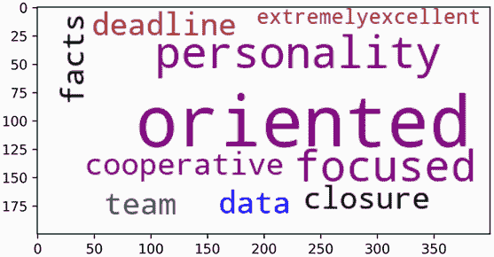

图 17.8 为索引 0 的聚类生成的词云。词云中的语言有些模糊。它似乎在描述一个专注、以数据为导向的性格。

注意：为什么我们要重新定义函数？好吧，在第十五部分中，`cluster_to_image`依赖于一个固定的 TFIDF 矩阵和词汇表。在我们的当前分析中，这些参数不是固定的——矩阵和词汇表将随着我们调整相关性指数而变化。因此，我们需要更新函数以允许更动态的输入。

列表 17.33 可视化第一个簇

```
from wordcloud import WordCloud
np.random.seed(0)

def cluster_to_image(df_cluster, max_words=10, tfidf_matrix=tfidf_matrix, ❶
                     vectorizer=vectorizer):  
    indices = df_cluster.Index.values
    summed_tfidf = np.asarray(tfidf_matrix[indices].sum(axis=0))[0]
    data = {'Word': vectorizer.get_feature_names(),'Summed TFIDF': summed_tfidf}
    df_ranked_words = pd.DataFrame(data).sort_values('Summed TFIDF', ascending=False)
    words_to_score = {word: score
                     for word, score in df_ranked_words[:max_words].values
                     if score != 0}
    cloud_generator = WordCloud(background_color='white',
                                color_func=_color_func,
                                random_state=1)
    wordcloud_image = cloud_generator.fit_words(words_to_score)
    return wordcloud_image

def _color_func(*args, **kwargs):                                         ❷
    return np.random.choice(['black', 'blue', 'teal', 'purple', 'brown'])

wordcloud_image = cluster_to_image(cluster_groups[0])
plt.imshow(wordcloud_image, interpolation="bilinear")
plt.show()
```

❶ 以 df_cluster 表作为输入，并返回对应于簇的 top max_words 个单词的词云图像。单词来自输入的 vectorizer 类。它们通过输入的 tfidf_matrix 的行求和进行排序。当我们将工作阈值从 60 扩展到 700 时，vectorizer 和 tfidf_matrix 都必须相应调整。

❷ 辅助函数，随机将五种可接受的颜色中的一种分配给每个单词

词云中的语言似乎在描述一个专注且数据导向的人，但它有点模糊。也许我们可以通过打印`cluster_group[0]`的一些样本子弹来更多地了解这个簇。

注意：我们将打印子弹的随机样本。这应该足够提供信息以理解簇。然而，值得强调的是，并非所有子弹都是平等的：一些子弹更接近它们的 K-means 簇质心，因此更能代表簇。因此，我们可以根据子弹到簇平均距离的远近进行排序。在这本书中，我们为了简洁起见跳过了子弹排名，但鼓励你自己尝试对子弹进行排名。

列表 17.34 从簇 0 打印样本子弹

```
np.random.seed(1)
def print_cluster_sample(cluster_id):           ❶
    df_cluster = cluster_groups[cluster_id]
    for bullet in np.random.choice(df_cluster.Bullet.values, 5,
                                   replace=False):
        print(bullet)

print_cluster_sample(0)

Data-oriented personality
Detail-oriented
Detail-oriented — quality and precision-focused
Should be extremelyExcellent facts and data oriented
Data oriented personality
```

❶ 从 cluster_groups[cluster_id]中打印五个随机子弹

打印的子弹都使用非常相似的语言：它们呼吁招聘一个注重细节和数据导向的员工。从语言学的角度来看，这个簇是合法的。不幸的是，它代表了一种难以掌握的技能。注重细节是一个非常通用的技能——很难量化、展示和学习。理想情况下，其他簇将包含更多具体的技术技能。

让我们同时使用词云来检查所有 15 个簇。这些词云在一个五行三列的网格中显示在 15 个子图中（图 17.9）。

列表 17.35 可视化所有 15 个簇

```
def plot_wordcloud_grid(cluster_groups, num_rows=5, num_columns=3,        ❶
                        **kwargs):                                        ❷
    figure, axes = plt.subplots(num_rows, num_columns, figsize=(20, 15))
    cluster_groups_copy = cluster_groups[:]
    for r in range(num_rows):
        for c in range(num_columns):
            if not cluster_groups_copy:
                break

            df_cluster = cluster_groups_copy.pop(0)
            wordcloud_image = cluster_to_image(df_cluster, **kwargs)
            ax = axes[r][c]
            ax.imshow(wordcloud_image,
            interpolation="bilinear")
            ax.set_title(f"Cluster {df_cluster.Cluster.iloc[0]}")
            ax.set_xticks([])
            ax.set_yticks([])

plot_wordcloud_grid(cluster_groups)
plt.show()
```

❶ 在 cluster_groups 中为每个簇绘制词云。词云绘制在一个 num_rows 行 num_columns 列的网格中。

❷ **kwargs 语法允许我们将额外的参数传递给使用的 cluster_to_image 函数。这样，我们可以轻松地修改 vectorizer 和 tfidf_matrix。

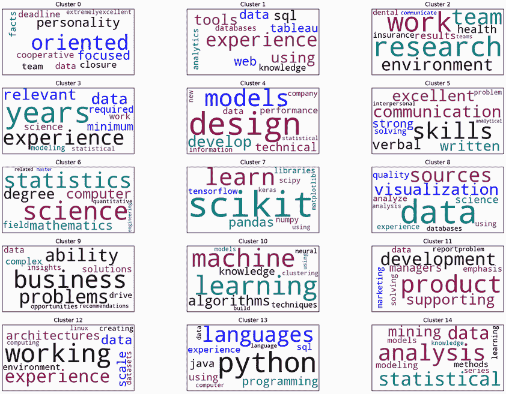

图 17.9 在 15 个子图中可视化的 15 个词云。每个词云对应于 15 个簇中的一个。子图标题对应于簇 ID。一些簇，如簇 7，描述技术技能；其他簇，如簇 0，则不太技术化。

我们的 15 个技能集群展示了多样化的主题集合。其中一些集群非常技术性。例如，第 7 个集群专注于外部数据科学库，如 scikit-learn、Pandas、NumPy、Matplotlib 和 SciPy。scikit-learn 库明显占据主导地位。这些库中的大多数都出现在我们的简历中，并在本书中进行了讨论。让我们打印出第 7 个集群的一些样本项目符号，以确认它们对数据科学库的关注。

列表 17.36 打印第 7 个集群的样本子弹

```
np.random.seed(1)
print_cluster_sample(7)

Experience using one or more of the following software packages: 
scikit-learn, numpy, pandas, jupyter, matplotlib, scipy, nltk, spacy, keras,
tensorflow
Using one or more of the following software packages: scikit-learn, numpy,
pandas, jupyter, matplotlib, scipy, nltk, spacy, keras, tensorflow
Experience with machine learning libraries and platforms, like Scikit-learn
and Tensorflow
Proficiency in incorporating the use of external proprietary and open-source
libraries such as, but not limited to, Pandas, Scikit- learn, Matplotlib, 
Seaborn, GDAL, GeoPandas, and ArcPy
Experience using ML libraries, such as scikit-learn, caret, mlr, mllib
```

同时，其他集群，如第 0 个集群，专注于非技术技能。这些软技能，包括商业洞察力、专注力、策略、沟通和协作，在我们的简历中明显缺失。因此，平均而言，非技术集群的简历相似度应该较低。这种思考方式引出了一个有趣的可能性：也许我们可以通过文本相似度来区分技术集群和软技能集群。这种分离将使我们能够更系统地检查每种技能类型。让我们试试看！我们将从计算`total_bullets`中每个项目符号与我们的简历之间的余弦相似度开始。

注意 为什么只使用简历而不是将`existing_skills`变量中的合并简历和目录排序？嗯，我们的最终目标是确定哪些技能集群缺失在简历中。简历与每个集群之间的直接相似度在这方面可能很有用。如果相似度低，那么集群中的技能在简历文本中未得到适当体现。

列表 17.37 计算子弹与简历之间的相似度

```
def compute_bullet_similarity(bullet_texts):                     ❶
    bullet_vectorizer = TfidfVectorizer(stop_words='english')
    matrix = bullet_vectorizer.fit_transform(bullet_texts + [resume])
    matrix = matrix.toarray()
    return matrix[:-1] @ matrix[-1]

bullet_cosine_similarities = compute_bullet_similarity(total_bullets)
```

❶ 计算输入的 bullet_texts 与简历变量之间的余弦相似度

我们的`bullet_cosine_similarities`数组包含了所有集群子弹之间的文本相似度。对于任何给定的集群，我们可以通过取它们的平均值将这些余弦相似度组合成一个分数。根据我们的假设，技术集群的平均相似度应该比软技能相似度集群更高。让我们确认技术集群 7 和软技能集群 0 是否是这样的情况。

列表 17.38 比较平均简历相似度

```
def compute_mean_similarity(df_cluster):
    indices = df_cluster.Index.values
    return bullet_cosine_similarities[indices].mean()

tech_mean = compute_mean_similarity(cluster_groups[7])
soft_mean =  compute_mean_similarity(cluster_groups[0])
print(f"Technical cluster 7 has a mean similarity of {tech_mean:.3f}")
print(f"Soft-skill cluster 3 has a mean similarity of {soft_mean:.3f}")

Technical cluster 7 has a mean similarity of 0.203
Soft-skill cluster 3 has a mean similarity of 0.002
```

技术集群与我们的简历的相似度是软技能集群的 100 倍。看起来我们正在正确的道路上！让我们计算所有 15 个集群的平均相似度。然后我们将按相似度分数降序排列这些集群。如果我们的假设正确，技术集群将首先出现在排序结果中。我们将通过重新绘制单词云子图网格来确认这一点。列表 17.39 执行了排序并可视化了排序后的集群（图 17.10）。

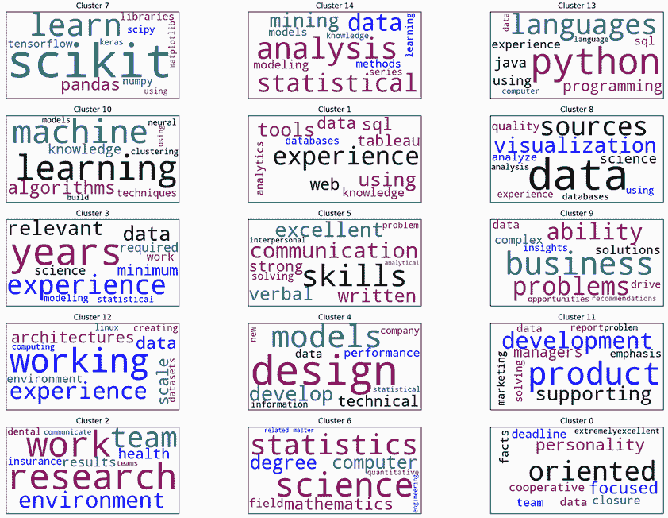

图 17.10 在 15 个子图中可视化的 15 个单词云。每个单词云对应于 15 个集群中的一个。集群按平均简历相似度排序。子图网格的前两行对应于更技术性的集群。

注意：我们即将按技术相关性对集群进行排序。这并不是完成案例研究所必需的——可以单独、无序地检查每个集群。然而，通过重新排序集群，我们可以更快地提取见解。因此，排序是简化我们工作流程的一种更可取的方式。

列表 17.39 按简历相似度对子图进行排序

```
def sort_cluster_groups(cluster_groups):                       ❶
    mean_similarities = [compute_mean_similarity(df_cluster)
                         for df_cluster in cluster_groups]

    sorted_indices = sorted(range(len(cluster_groups)),
                            key=lambda i: mean_similarities[i],
                            reverse=True)
    return [cluster_groups[i] for i in sorted_indices]

sorted_cluster_groups = sort_cluster_groups(cluster_groups)
plot_wordcloud_grid(sorted_cluster_groups)
plt.show()
```

❶ 按输入的 cluster_groups 数组与简历的平均余弦相似度进行排序

我们的假设是正确的！更新后的子图中的前两行明显对应着技术技能。此外，这些技术技能现在根据它们与我们的简历的相似度方便地排序。这使得我们可以系统地按相似度从高到低（因此由我们的简历表示）到低（因此可能缺少在我们的简历中）对技能进行排名。

### 17.3.2 调查技术技能集群

让我们把注意力转向子图网格中前两行的六个技术技能集群。接下来，我们将在两行三列的网格中重新绘制它们相关的词云（图 17.11）。这种技术导向的可视化将允许我们扩大词云的大小。稍后，我们将回到图 17.10 中剩余的软技能词云。

列表 17.40 仅绘制前六个技术集群

```
plot_wordcloud_gri(sorted_cluster_groups[:6], num_rows=3, num_columns=2)
plt.show()
```

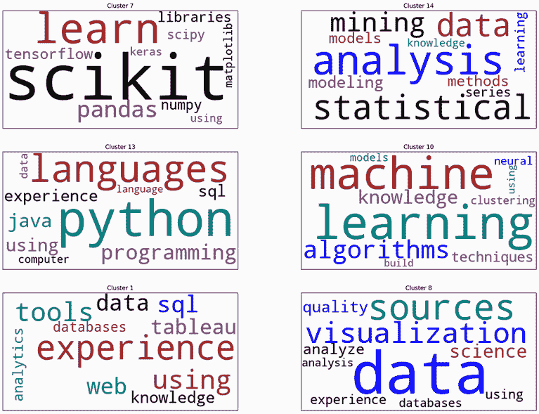

图 17.11 与六个技术技能集群相关的六个词云。它们按平均简历相似度排序。前四个词云很有信息量：它们专注于数据科学库、统计分析、Python 编程和机器学习。其余两个词云模糊且无信息。

网格图中前四个技术技能集群非常具有信息量。现在，我们将逐一检查这些集群，从网格的左上角开始。为了简洁起见，我们仅依赖于词云；它们的内容应该足以理解每个集群所代表的技能。但是，如果您想深入了解任何集群，请随意查看集群的要点。

前四个技术集群可以描述如下：

+   *集群 7（行 0，列 0）*——这个数据科学库集群已经讨论过了。本书涵盖了诸如 scikit-learn、NumPy、SciPy 和 Pandas 等库。

    以下两个库尚未介绍：TensorFlow 和 Keras。这些是 AI 实践者用于在高性能硬件上训练复杂、预测模型的深度学习库。数据科学职位和 AI 职位之间的界限并不总是清晰的。尽管深度学习知识通常不是先决条件，但有时它将有助于你找到工作。考虑到这一点，如果你希望更详细地学习这些库，请查看 Nishant Shukla 的《使用 TensorFlow 进行机器学习》（Manning，2018，[www.manning.com/books/machine-learning-with-tensorflow](https://www.manning.com/books/machine-learning-with-tensorflow)）或 François Chollet 的《使用 Python 进行深度学习》（第二版）（Manning，2021，[www.manning.com/books/deep-learning-with-python-second-edition](https://www.manning.com/books/deep-learning-with-python-second-edition)）。

+   *聚类 14（行 0，列 1）*—这个聚类讨论统计分析，这在我们的简历中有体现。本书的案例研究 2 中涵盖了统计方法。

+   *聚类 13（行 1，列 0）*—这个聚类关注编程语言熟练度。在这些语言中，Python 明显占主导地位。鉴于我们对 Python 的经验，为什么这个编程聚类没有排名更高呢？好吧，结果发现 Python 在我们的简历中根本没被提及！是的，我们提到了许多 Python 库，这暗示我们熟悉这种语言，但我们在本书过程中磨练的 Python 技能并没有明确地被引用。也许我们应该通过提及我们的 Python 技能来更新我们的简历。

+   *聚类 10（行 1，列 2）*—这个聚类关注机器学习。机器学习领域包括各种数据驱动预测算法。本书后续的案例研究中介绍了许多这些算法；但在完成这个案例研究之前，我们无法在我们的简历中引用机器学习。

    作为一个旁注，我们应该提到，聚类技术有时被称为*无监督*机器学习算法。因此，提及无监督技术是可以接受的。但任何提及更广泛机器学习的说法都会给我们技能的印象造成误解。

最后两个技术技能聚类模糊且缺乏信息。它们提到了许多不相关的工具和分析技术。列表 17.41 从这些聚类（8 和 1）中抽取样本以确认缺乏模式。

注意：这两个聚类都提到了数据库。数据库的使用是一项有用的技能，但不是这两个聚类中的主要内容。在本节后面的内容中，我们将遇到一个数据库聚类，这是当我们增加 *K* 的值时出现的。

列表 17.41 打印来自聚类 8 和 1 的样本项目符号

```
np.random.seed(1)
for cluster_id in [8, 1]:
    print(f'\nCluster {cluster_id}:')
    print_cluster_sample(cluster_id)

Cluster 8:
Use data to inform and label customer outcomes and processes
Perform exploratory data analysis for quality control and improved 
understanding
Champion a data-driven culture and help develop best-in-class data science 
capabilities
Work with data engineers to plan, implement, and automate integration of 
external data sources across a variety of architectures, including local 
databases, web APIs, CRM systems, etc
Design, implement, and maintain a cutting-edge cloud-based 
data-infrastructure for large data-sets

Cluster 1:
Have good knowledge on Project management tools JIRA, Redmine, and Bugzilla
Using common cloud computing platforms including AWS and GCP in addition to 
their respective utilities for managing and manipulating large data sources, 
model, development, and deployment
Experience in project deployment using Heroku/Jenkins and using web Services 
like Amazon Web Services (AWS)
Expert level data analytics experience with T-SQL and Tableau
Experience reviewing and assessing military ground technologies
```

我们已经完成了对技术技能聚类的分析。其中四个聚类是相关的，而两个则不是。现在，让我们将注意力转向剩余的软技能聚类。我们想看看数据中是否存在任何相关的软技能聚类。

### 17.3.3 调查软技能簇

我们首先在一个三行三列的网格中可视化剩余的九个软技能簇（图 17.12）。

列表 17.42 绘制剩余的九个软技能簇

```
plot_wordcloud_grid(sorted_cluster_groups[:6], num_rows=3, num_columns=3)
plt.show()
```

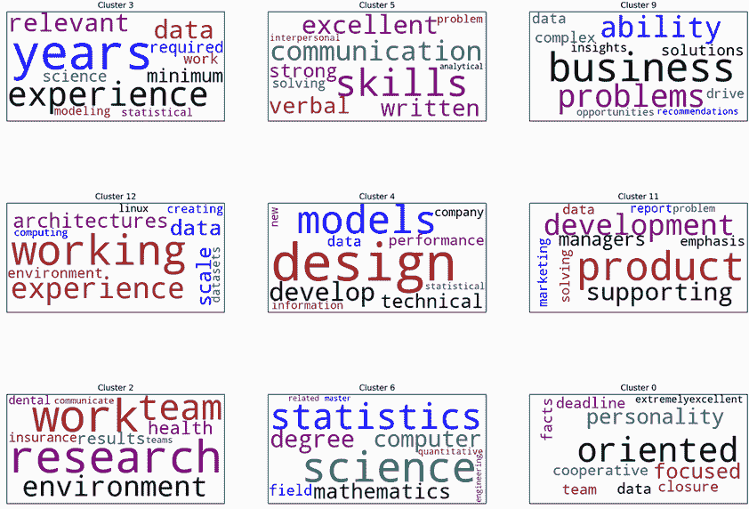

图 17.12 与九个软技能簇相关的九个词云。它们按平均简历相似度排序。大多数簇都很模糊且没有信息量，但第一行的沟通技能簇值得关注。

剩余的簇看起来比前四个技术簇要模糊得多。它们更难解释。例如，簇 2（行 2，列 0）使用了诸如 *工作*、*团队*、*研究* 和 *环境* 这样的模糊术语。簇 12（行 1，列 0）同样神秘莫测，由诸如 *环境*、*工作* 和 *经验* 这样的术语组成。此外，输出变得更加复杂，因为有些簇并不代表真正的技能！例如，簇 3（行 0，列 0）由技能而非时间经验组成：它包括需要一定年限在行业工作的子弹。同样，簇 6（行 2，列 1）也不是由技能组成；它代表教育限制，要求有定量学位才能获得面试机会。我们在假设上略有错误——并非所有子弹都代表真正的技能。我们可以通过从簇 6 和 3 中抽样子弹点来确认我们的错误。

列表 17.43 打印来自簇 6 和 3 的样本子弹

```
np.random.seed(1)
for cluster_id in [6, 3]:
    print(f'\nCluster {cluster_id}:')
    print_cluster_sample(cluster_id)

Cluster 6:
MS in a quantitative research discipline (e.g., Artificial Intelligence, 
Computer Science, Machine Learning, Statistics, Applied Math, Operations 
Research)
Master's degree in data science, applied mathematics, or bioinformatics 
preferred.
PhD degree preferred
Ph.D. in a quantitative discipline (e.g., statistics, computer science, 
economics, mathematics, physics, electrical engineering, industrial 
engineering or other STEM fields)
7+ years of experience manipulating data sets and building statistical 
models, has advanced education in Statistics, Mathematics, Computer Science 
or another quantitative field, and is familiar with the following software/tools:

Cluster 3:
Minimum 6 years relevant work experience (if Bachelor's degree) or minimum 3 
years relevant work experience (if Master's degree) with a proven track 
record in driving value in a commercial setting using data science skills.
Minimum five (5) years of experience manipulating data sets and building 
statistical models, and familiarity with:
5+ years of relevant work experience in data analysis or related field. 
(e.g., as a statistician / data scientist / scientific researcher)
3+ years of statistical modeling experience
Data Science: 2 years (Required)
```

我们的软技能簇中有一个非常容易解释：簇 5（行 0，列 1）专注于人际沟通技能，包括书面和口头沟通。良好的沟通技巧在数据科学职业生涯中至关重要。我们从复杂数据中提取的见解必须仔细传达给所有利益相关者。利益相关者将根据我们论点的说服力采取重要行动。如果我们无法传达我们的结果，所有我们的辛勤工作都将化为乌有。

不幸的是，沟通技巧并不容易学习。仅仅读书是不够的；需要与其他个人进行实践合作。如果您想拓宽您的沟通能力，您应该考虑与本地或远程的其他新兴数据科学家互动。选择一个数据驱动型项目，并作为团队的一部分完成该项目。然后务必在您的简历中强调您磨炼的沟通技能。

### 17.3.4 探索 K 的不同值下的簇

当我们将 *K* 设置为 15 时，K-means 簇群算法给出了相当不错的结果。然而，这个参数输入部分是随机的，因为我们无法确定一个完美的最优 *K*。我们洞察力的任意性有点令人不安：也许我们只是运气好，不同的 *K* 可能根本不会产生任何洞察。或者，也许我们选择了错误的 *K* 而错过了关键的簇。我们需要探究的问题是簇的一致性。如果我们修改 *K*，我们驱动的多少个洞察力簇将保持不变？为了找出答案，我们将使用不同的 *K* 值重新生成簇。我们首先将 *K* 设置为 25，并在一个五行五列的网格中绘制结果（图 17.13）。子图将根据簇与我们简历的相似性进行排序。

列表 17.44 可视化 25 个排序后的簇

```
np.random.seed(0)
cluster_groups = compute_cluster_groups(shrunk_norm_matrix, k=25)
sorted_cluster_groups = sort_cluster_groups(cluster_groups)
plot_wordcloud_grid(sorted_cluster_groups, num_rows=5, num_columns=5)
plt.show()
```

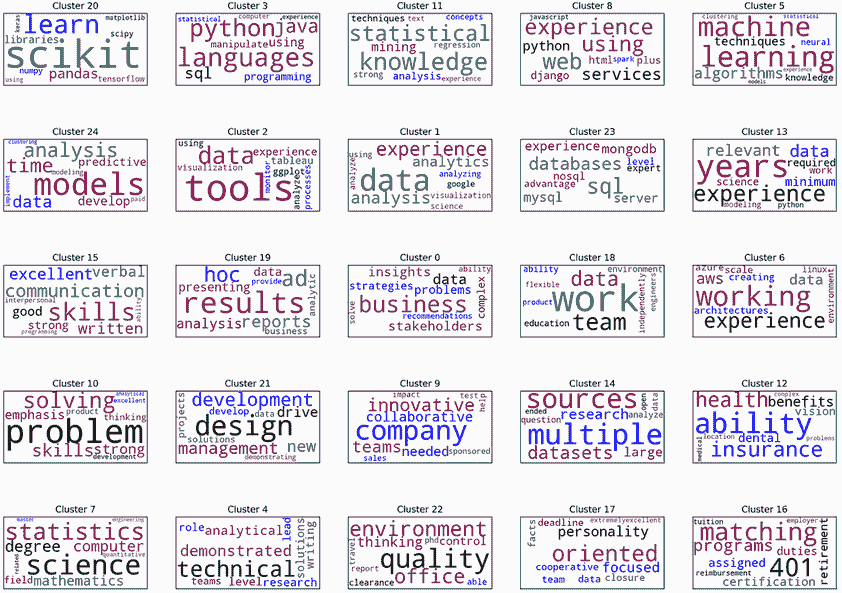

图 17.13 与 25 个技能簇相关的 25 个词云。我们之前讨论的技能在我们增加 *K* 值后仍然存在。此外，我们还看到了一些值得注意的新技术技能，包括网络服务使用和对数据库的熟悉。

大多数之前观察到的簇在更新后的输出中仍然存在。这些包括数据科学库的使用（行 0，列 0）、统计分析（行 0，列 2）、Python 编程（行 0，列 1）、机器学习（行 1，列 2）和沟通技巧（行 2，列 0）。此外，我们还获得了三个有洞察力的技术技能簇，它们出现在网格的前两行中：

+   *簇 8（行 0，列 4）*—该簇专注于网络服务。这些是传播客户端与远程服务器之间通信的工具。在大多数工业数据科学设置中，数据存储在远程服务器上，可以通过自定义 API 进行传输。在 Python 中，这些 API 协议通常使用 Django 框架进行编码。对于初学者数据科学家来说，对这些工具有所了解是首选，但并非必需。要了解更多关于网络服务和 API 传输的信息，请参阅 Michael Wittig 和 Andreas Wittig 所著的 *《Amazon Web Services in Action》*（Manning，2018，[`www.manning.com/books/amazon-web-services-in-action-second-edition`](https://www.manning.com/books/amazon-web-services-in-action-second-edition)）以及 Arnaud Lauret 所著的 *《Web APIs 的设计》*（Manning，2019，[`www.manning.com/books/the-design-of-web-apis`](https://www.manning.com/books/the-design-of-web-apis)）。

+   *聚类 23（第 1 行，第 3 列）*—这个聚类专注于各种类型的数据库。大规模结构化数据通常存储在关系型数据库中，可以使用结构化查询语言（SQL）进行查询。然而，并非所有数据库都是关系型的。有时数据存储在替代的、非结构化的数据库中，例如 MongoDB。非结构化数据库中的数据可以使用 NoSQL 查询语言进行查询。了解各种数据库类型在数据科学职业生涯中可能非常有用。如果你想了解更多关于这个主题的信息，可以查看 *《理解数据库》*（Manning，2019，[www.manning.com/books/understanding-databases](https://www.manning.com/books/understanding-databases)）；并且要了解更多关于 MongoDB 的信息，可以查看 Kyle Banker 等人编写的 *《MongoDB 实战第二版》*（Manning，2016，[www.manning.com/books/mongodb-in-action-second-edition](http://www.manning.com/books/mongodb-in-action-second-edition)）。

+   *聚类 2（第 1 行，第 1 列）*—这个聚类专注于非 Python 可视化工具，例如 Tableau 和 ggplot。Tableau 是 Salesforce 提供的付费软件，通常被能够承担 Salesforce 合同的企业使用；你可以在 *《实用 Tableau》* [由 Ryan Sleeper 编著 ((O’Reilly, 2018,](http://mng.bz/Xrdv) http://mng.bz/Xrdv) 中了解更多信息。ggplot 是用于统计编程语言 R 的数据可视化包。一般来说，Python 数据科学家不需要了解 R；但如果你想熟悉这个主题，可以查看 Nina Zumel 和 John Mount 编著的 *《实用数据科学 R 语言第二版》*（Manning，2019，[www.manning.com/books/practical-data-science-with-r-second-edition](http://www.manning.com/books/practical-data-science-with-r-second-edition)）。

我们的图表还包含七个新添加的聚类。这些聚类主要包含一些通用技能，如问题解决（第 3 行，第 0 列）和团队合作（第 2 行，第 3 列）。此外，至少有一个新的技能聚类不对应于实际技能（例如第 3 行，第 4 列的健康保险福利聚类）。

将 *K* 从 15 增加到 25 保留了之前观察到的所有有洞察力的聚类，并引入了几个有趣的新聚类。如果我们把 *K* 转移到中间值 20，这些聚类的稳定性会持续吗？我们将在下一部分通过在一个四行五列的网格中绘制 20 个排序后的聚类来找出答案（图 17.14）。

列表 17.45 可视化 20 个排序后的聚类

```
np.random.seed(0)
cluster_groups = compute_cluster_groups(shrunk_norm_matrix, k=20)
sorted_cluster_groups = sort_cluster_groups(cluster_groups)
plot_wordcloud_grid(sorted_cluster_groups, num_rows=4, num_columns=5)
plt.show()
```

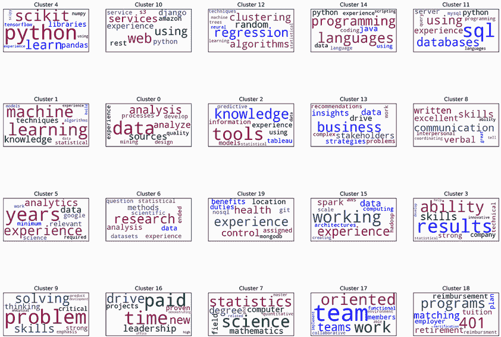

图 17.14 与 20 个技能聚类相关的 20 个词云。我们之前讨论的大多数技能仍然存在，但现在统计分析聚类已从输出中消失。

我们观察到的多数有见解的聚类在`k=20`时仍然存在，包括数据科学库的使用（第 0 行，第 0 列）、Python 编程（第 0 行，第 3 列）、机器学习（第 1 行，第 0 列）、沟通技巧（第 1 行，第 4 列）、网络服务（第 0 行，第 1 列）和数据库使用（第 0 行，第 4 列）。然而，非 Python 可视化聚类已消失。更令人不安的是，在*K*值为 15 和 25 时观察到的统计分析聚类缺失。

注意：这个统计分析聚类似乎已被一个统计算法聚类所取代，该聚类位于网格的第 0 行，第 2 列。它主要由三个术语组成：*算法*、*聚类*和*回归*。当然，到现在我们已经非常熟悉聚类了。然而，回归技术尚未出现在我们的简历上，因为我们还没有学习它们。我们将在案例研究 5 中学习这些技术，然后可以将它们添加到我们的简历中。

一个看似稳定的聚类已被消除。不幸的是，这种波动相当常见。由于人类语言的复杂性质，文本聚类对参数变化很敏感。语言主题可以以多种方式解释，这使得找到一致完美的参数变得困难。在某一组参数下出现的聚类，如果这些参数被调整，可能会消失。如果我们只对*K*的一个值进行聚类，我们可能会错过有用的见解。因此，在文本分析期间，最好在一系列*K*值上可视化结果。考虑到这一点，让我们看看当我们将*K*减少到 10 时会发生什么（图 17.15）。

列出 17.46 可视化 10 个排序后的聚类

```
np.random.seed(0)
cluster_groups = compute_cluster_groups(shrunk_norm_matrix, k=10)
sorted_cluster_groups = sort_cluster_groups(cluster_groups)
plot_wordcloud_grid(sorted_cluster_groups, num_rows=5, num_columns=2)
plt.show()
```

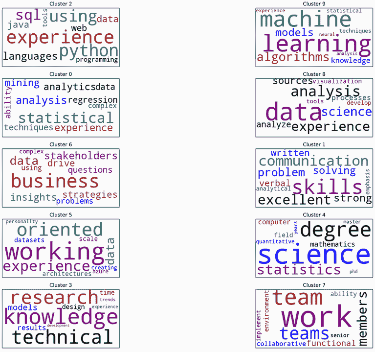

图 17.15 与 10 个技能聚类相关的 10 个词云。尽管*K*值较低，但我们之前讨论的四个技能仍然存在。

10 个可视化的聚类相当有限。尽管如此，10 个聚类中有 4 个包含我们之前观察到的关键技能：Python 编程（第 0 行，第 0 列）、机器学习（第 0 行，第 1 列）和沟通技巧（第 2 行，第 1 列）。统计分析聚类也再次出现（第 1 行，第 0 列）。令人惊讶的是，一些我们的技能聚类具有多功能性，甚至在*K*值大幅调整时也会出现。尽管我们的聚类存在一些随机性，但仍然保持了一定的一致性。因此，我们观察到的见解并不仅仅是随机输出——它们是我们从复杂、混乱的真实世界文本中捕捉到的可感知的模式。

到目前为止，我们的观察仅限于 60 个最相关的职位发布。然而，正如我们所看到的，该数据子集中存在一些噪声。如果我们将我们的分析扩展到前 700 个发布，会发生什么？我们的观察会改变还是保持不变？让我们来看看。

### 17.3.5 分析前 700 个最相关的发布

我们首先通过以下方式为聚类准备`sorted_df_jobs[:700].Bullets`：

1.  提取所有子弹，同时删除重复项。

1.  向量化子弹文本。

1.  对向量化文本进行降维，并对生成的矩阵进行归一化。

列表 17.47 准备 `sorted_df_jobs[:700]` 用于聚类分析

```
np.random.seed(0)
total_bullets_700 = set()
for bullets in sorted_df_jobs[:700].Bullets:
    total_bullets_700.update([bullet.strip()
                              for bullet in bullets])

total_bullets_700 = sorted(total_bullets_700)
vectorizer_700 = TfidfVectorizer(stop_words='english')
tfidf_matrix_700 = vectorizer_700.fit_transform(total_bullets_700)
shrunk_norm_matrix_700 = shrink_matrix(tfidf_matrix_700)
print(f"We've vectorized {shrunk_norm_matrix_700.shape[0]} bullets")

We've vectorized 10194 bullets
```

我们已经将 10,194 个子弹向量化。现在，我们生成一个基于向量化结果的肘部图。根据之前的观察，我们预计肘部图不会特别有信息量，但我们创建这个图以保持与之前分析的一致性（图 17.16）。

列表 17.48 为 10,194 个子弹绘制肘部曲线

```
np.random.seed(0)
generate_elbow_plot(shrunk_norm_matrix_700)
plt.show()
```

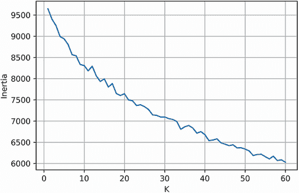

图 17.16 使用前 700 个最相关帖子生成的肘部图。肘部的确切位置难以确定。

如预期的那样，在图中肘部的确切位置并不清晰。肘部在 10 和 25 之间的 *K* 值上分散。我们将通过任意地将 *K* 设置为 20 来处理这种歧义。让我们生成并可视化 20 个聚类；如果需要，我们将调整 *K* 以进行比较聚类（图 17.17）。

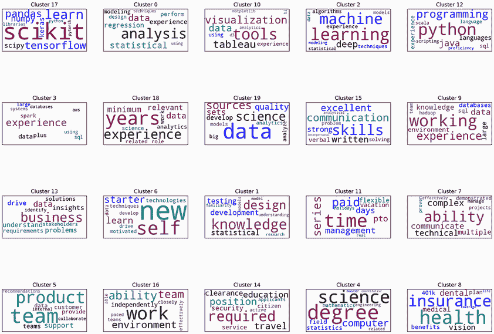

图 17.17 通过 10,000 个子弹进行聚类生成的 20 个词云。尽管子弹数量增加了 10 倍，但观察到的技能聚类大多保持不变。

警告 如我们在第十五部分中讨论的，对于包含 10,000 行 100 列的大矩阵，K-means 输出可能因计算机而异。您的本地聚类结果可能与此处显示的输出不同，但您应该能够得出与本书中提出的类似结论。

列表 17.49 可视化 10,194 个子弹的 20 个排序聚类

```
np.random.seed(0)
cluster_groups_700 = compute_cluster_groups(shrunk_norm_matrix_700, k=20,
                                            bullets=total_bullets_700)
bullet_cosine_similarities = compute_bullet_similarity(total_bullets_700)  ❶
sorted_cluster_groups_700 = sort_cluster_groups(cluster_groups_700)
plot_wordcloud_grid(sorted_cluster_groups_700, num_rows=4, num_columns=5,
                    vectorizer=vectorizer_700,                             ❷
                    tfidf_matrix=tfidf_matrix_700)
```

❶ 重新计算用于排序的 bullet_cosine_similarities

❷ 我们需要将更新的 TFIDF 矩阵和向量器传递给我们的绘图函数。

我们的聚类输出看起来与我们之前看到的非常相似。我们观察到的关键洞察力聚类在 60 个帖子中仍然存在，包括数据科学库的使用（行 0，列 0）、统计分析（行 0，列 1）、Python 编程（行 0，列 4）、机器学习（行 0，列 3）和沟通技巧（行 1，列 3）。有一些细微的变化，但大部分输出是相同的。

注意 一个有趣的变化是出现了一个通用的可视化聚类（行 0，列 2）。这个聚类包括各种可视化工具，包括 Matplotlib。此外，在聚类的词云中提到了免费可用的 JavaScript 库 D3.js。一些数据科学家使用 D3.js 库制作交互式网络可视化。要了解更多关于这个库的信息，请参阅 Elijah Meeks（Manning，2017）所著的《D3.js in Action, Second Edition》（[www.manning.com/books/d3js-in-action-second-edition](https://www.manning.com/books/d3js-in-action-second-edition)）。

某些技能在职位发布中持续出现。这些技能对我们的所选相关性阈值不太敏感，因此即使我们的阈值不确定，我们也可以阐明它们。

## 17.4 结论

我们准备好更新简历草案。首先，我们应该强调我们的 Python 技能。一句说我们“精通 Python”就足够了。此外，我们想要强调我们的沟通技能。我们如何展示我们是优秀的沟通者？这很棘手；仅仅声明我们能够“清晰地与不同受众沟通复杂的结果”是不够的。相反，我们应该描述一个个人项目，其中我们做了以下事情：

+   与队友合作解决困难的数据问题

+   将复杂的结果，无论是口头还是书面形式，传达给非技术受众

注意：如果你有参与此类项目的经验，你绝对应该将其添加到你的简历中。否则，我们鼓励你自愿追求此类项目。你将获得的技能将证明是无价的，同时也会改善你的就业前景。

此外，在我们完成简历之前，我们需要解决我们剩余的技能缺陷。机器学习经验对于成功的数据科学职业生涯至关重要。我们尚未学习机器学习，但在随后的案例研究中，我们将扩展我们的机器学习技能。然后我们就能在简历中自豪地描述我们的机器学习能力。

最后，展示一些使用工具获取和存储远程数据的经验是值得的。这些工具包括数据库和托管网络服务。它们的使用超出了本书的范围，但可以通过独立学习来掌握。数据库和网络服务经验并非总是获得工作的必要条件；然而，一些有限的经验总是受到潜在雇主的欢迎。

## 摘要

+   文本数据不应盲目分析。我们在运行任何算法之前，都应该采样并阅读一些文本。这在 HTML 文件中尤其如此，其中标签可以界定文本中的独特信号。通过渲染采样后的职位发布，我们发现独特的职位技能在每个 HTML 文件中都用项目符号标记。如果我们盲目地对每个文件的正文进行聚类，我们的最终结果就不会那么有信息量。

+   文本聚类很困难。理想的聚类数量很少存在，因为语言是流动的，主题之间的边界也是如此。但尽管存在不确定性，某些主题在多个聚类数量中始终出现。因此，即使我们的肘部图没有揭示确切的聚类数量，情况也是可以挽救的：对多个聚类参数进行采样可以揭示文本中的稳定主题。

+   选择参数值并不总是容易。这个问题远远超出了简单的聚类。当我们选择相关性截止值时，我们在两个值之间犹豫不决：60 和 700。这两个值似乎并没有一个明显优于另一个，所以我们尝试了两个！在数据科学中，一些问题并没有一个理想的阈值或参数。然而，我们不应该放弃并忽略这些问题。相反，我们应该进行实验。科学家通过探索一系列参数输入的输出来学习。作为数据科学家，我们可以通过调整和调整我们的参数来获得宝贵的见解。
