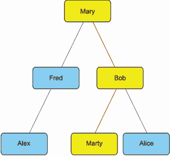

# 第五部分. 案例研究 5：从社交网络数据预测未来的友谊

## 问题陈述

欢迎来到 FriendHook，硅谷最新热门的初创公司。FriendHook 是一个面向大学生社交网络的 APP。要加入，本科生必须扫描他们的大学 ID 以证明他们的归属。批准后，本科生可以创建一个 FriendHook 个人资料，列出他们的宿舍名称和学术兴趣。创建个人资料后，本科生可以向他们大学中的其他学生发送**好友请求**。收到好友请求的学生可以批准或拒绝。当好友请求被批准时，这两名学生正式成为 FriendHook 朋友。利用他们新的数字联系，FriendHook 朋友可以分享照片，合作完成课程作业，并互相更新最新的校园八卦。

FriendHook 应用非常受欢迎。它在全球数百所大学中使用。用户基础在增长，公司也在增长。你是 FriendHook 的第一位数据科学员工！你的第一个挑战性任务将是研究 FriendHook 的朋友推荐算法。

### 介绍朋友的朋友推荐算法

有时 FriendHook 用户在数字应用中难以找到他们的现实生活中朋友。为了促进更多连接，工程团队已经实施了一个简单的朋友推荐引擎。每周一次，所有用户都会收到一封推荐一个尚未加入他们网络的新朋友的电子邮件。用户可以选择忽略电子邮件，或者发送好友请求。该请求随后要么被接受，要么被拒绝/忽略。

目前，推荐引擎遵循一个简单的算法，称为**朋友的朋友推荐算法**。该算法的工作原理如下。假设我们想要为学生 A 推荐一个新的朋友。我们随机选择一个已经与学生 A 成为朋友的学生 B。然后我们随机选择一个与学生 B 是朋友但与学生 A 不是朋友的学生 C。学生 C 随后被选为学生 A 的推荐朋友，如图 CS5.1 所示。

图 CS5.1 朋友的朋友推荐算法的实际应用。玛丽有两个朋友：弗雷德和鲍勃。其中一位朋友（鲍勃）被随机选中。鲍勃有两个额外的朋友：马蒂和爱丽丝。爱丽丝和马蒂都不是玛丽的的朋友。一个朋友的朋友（马蒂）被随机选中。玛丽收到一封电子邮件，建议她向马蒂发送好友请求。

实质上，该算法假设你的朋友的朋友也很可能成为你的朋友。这个假设是合理的，但也有些简单化。这个假设有多好？没有人知道！然而，作为公司的第一位数据科学家，你的任务是找出答案。你被分配了一个构建模型的任务，该模型可以预测学生对推荐算法的反应。

### 预测用户行为

朋友的朋友推荐引擎可以引发三种类型的行为：

+   用户阅读电子邮件中的好友推荐，要么拒绝要么忽略该推荐。

+   用户根据推荐发送好友请求。该请求被拒绝或忽略。

+   用户根据推荐发送好友请求。好友请求被接受，并建立了新的 FriendHook 连接。

是否可以预测这三种行为？FriendHook 的首席技术官希望你能找出答案。CTO 已经为你提供了从随机选择的大学获取的 FriendHook 数据。这些数据涵盖了该大学所有 FriendHook 用户的所有观察到的行为，以及对每周好友推荐的响应。数据还包括每个用户的资料信息，涵盖诸如学生专业和居住宿舍名称等内容。这些个人资料信息已被加密以保护每个用户的隐私（关于这一点稍后还会详细介绍）。最后，数据还包括在发送友谊推荐电子邮件之前编译的大学中现有的 FriendHook 连接网络。

你的任务是构建一个基于用户资料和社会网络数据预测用户行为的模型。该模型必须泛化到其他学院和大学。这种泛化能力非常重要——不能在其他学院使用的模型对产品团队来说毫无价值。例如，考虑一个在样本大学的一个或两个宿舍中准确预测行为的模型。换句话说，它需要特定的宿舍名称才能做出准确的预测。这样的模型没有用，因为其他大学将有不同的宿舍名称。理想情况下，该模型应该泛化到全球所有大学的所有宿舍。

一旦你构建了泛化模型，你应该探索其内部工作原理。你的目标是了解大学生活如何促进新的 FriendHook 连接。

项目目标雄心勃勃，但同时也非常可行。你可以通过执行以下任务来完成它们：

1.  加载与用户行为、用户资料和用户友谊网络相关的三个数据集。探索每个数据集，并根据需要对其进行清理。

1.  构建并评估一个基于用户资料和建立的友谊连接预测用户行为的模型。你可以选择将这个任务分为两个子任务：仅使用友谊网络构建模型，然后添加资料信息并测试这是否能提高模型的表现。

1.  确定模型是否很好地泛化到其他大学。

1.  探索模型的内部工作原理，以更好地了解学生行为。

## 数据集描述

我们的数据包含存储在 friendhook 目录中的三个文件。这些文件是 CSV 表格，分别命名为 Profiles.csv、Observations.csv 和 Friendships.csv。让我们分别讨论每个表格。

### Profiles 表

`Profiles.csv`包含所选大学所有学生的个人资料信息。这些信息分布在六个列中：`Profile_ID`、`Sex`、`Relationship_Status`、`Major`、`Dorm`和`Year`。维护学生隐私对 FriendHook 团队来说非常重要，因此所有个人资料信息都已被仔细加密。FriendHook 的加密算法接受描述性文本并返回一个唯一的、打乱的 12 位字符代码，称为*哈希码*。例如，如果一个学生将他们的专业列为物理学，那么单词*physics*将被打乱并替换为一个哈希码，例如*b90a1221d2bc*。如果另一个学生将他们的专业列为艺术史，则返回不同的哈希码（例如，*983a9b1dc2ef*）。通过这种方式，我们可以检查两个学生是否拥有相同的专业，而无需知道该专业的身份。所有六个个人资料列都作为预防措施进行了加密。让我们详细讨论各个单独的列：

+   `Profile_ID`—一个用于跟踪每个学生的唯一标识符。该标识符可以与`Observations`表中的用户行为相关联。它还可以与`Friendships`表中的 FriendHook 连接相关联。

+   `Sex`—这是一个可选字段，描述学生的性别为`Male`或`Female`。不希望指定性别的学生可以留空`Sex`字段。空白输入在表中存储为空值。

+   `Relationship_Status`—这是一个可选字段，指定学生的关系状态。每个学生可以从以下三个关系类别中选择一个：`Single`、`In a Relationship`或`It’s Complicated`。所有学生都有一个选项可以留空这个字段。空白输入在表中存储为空值。

+   `Major`—学生选择的学习领域，例如物理学、历史、经济学等。此字段是激活 FriendHook 账户所必需的。尚未选择专业的学生可以从选项中选择`Undecided`。

+   `Dorm`—学生居住的宿舍名称。此字段是激活 FriendHook 账户所必需的。居住在校园外的学生可以从选项中选择`Off-Campus Housing`。

+   `Year`—本科生年级。此字段必须设置为以下四个选项之一：`Freshman`、`Sophomore`、`Junior`或`Senior`。

### `Observations`表

`Observations.csv`包含对通过电子邮件推荐的友人的观察到的用户行为。它包括以下五个字段：

+   `Profile_ID`—收到朋友推荐的用户 ID。该 ID 与`Profiles`表中的个人资料 ID 相对应。

+   `Selected_Friend`—在`Profile_ID`列中的用户的一个现有朋友。

+   `Selected_Friend_of_Friend`—随机选择的一个朋友，该朋友不是`Profile_ID`的朋友。这个随机的朋友作为推荐给用户的友人。

+   `Friend_Requent_Sent`—一个布尔列，如果用户向建议的好友发送好友请求则为`True`，否则为`False`。

+   `Friend_Request_Accepted`—一个布尔列，只有当用户发送好友请求并且该请求被接受时才为`True`。

此表存储了所有用户对每周推荐电子邮件的响应观察到的用户行为。我们的目标是根据个人资料和社交网络数据预测最后两个表列的布尔输出。

### `Friendships`表

`Friendships.csv`包含与所选大学对应的 FriendHook 好友网络。这个网络被用作朋友推荐算法的输入。`Friendships`表只有两列：`Friend A`和`Friend B`。这些列包含与`Profiles`和`Observations`表的`Profile_ID`列相对应的配置文件 ID。每一行对应着一对 FriendHook 好友。例如，第一行包含 ID `b8bc075e54b9`和`49194b3720b6`。从这些 ID 中，我们可以推断出相关的学生已经建立了 FriendHook 连接。使用这些 ID，我们可以查找每个学生的配置文件。然后，这些配置文件允许我们探索这些朋友是否拥有相同的专业或是否住在同一宿舍。

## 概述

为了解决当前的问题，我们需要知道如何做以下几件事：

+   使用 Python 分析网络数据

+   在社交网络中发现友谊聚类

+   训练和评估监督机器学习模型

+   探索训练模型的内部工作原理，以从我们的数据中得出见解
