# 18 图论和网络分析简介

本节涵盖

+   将多样化的数据集表示为网络

+   使用 NetworkX 库进行网络分析

+   在网络中优化旅行路径

研究联系可能产生数十亿美元的价值。在 20 世纪 90 年代，两名研究生分析了相互连接的网页属性。他们的洞察力使他们创立了谷歌。在 21 世纪初，一名本科生开始追踪人与人之间的联系。他继续推出了 Facebook。联系分析可能导致无法估量的财富，但它也可以拯救无数的生命。追踪癌细胞中蛋白质之间的联系可以产生药物靶点，从而消除那种癌症。分析疑似恐怖分子之间的联系可以揭露并预防狡猾的阴谋。这些看似不同的场景有一个共同点：它们可以使用被称为*网络理论*（有些人称之为）或*图论*（有些人称之为）的数学分支进行研究。

*网络理论*是研究对象之间联系的研究。这些对象可以是任何东西：通过关系连接的人，通过网页链接连接的网页，或通过道路连接的城市。一组对象及其分散的连接被称为*网络*或*图*，这取决于你问的是谁。工程师更喜欢使用术语*网络*，而数学家更喜欢*图*。就我们的目的而言，我们将交替使用这两个术语。图是简单的抽象，它捕捉了我们错综复杂、相互关联的世界的复杂性。图的性质在社会和自然系统之间保持惊人的一致性。图论是一个用于数学上跟踪这些一致性的框架。它结合了来自不同数学分支的想法，包括概率理论和矩阵分析。这些想法可以用来获得有用的现实世界见解，从搜索引擎页面排名到社交圈聚类，因此对图论的了解对于做好数据科学是必不可少的。

在接下来的两节中，我们通过构建之前学习的数据科学概念和库，学习图论的基础。我们通过解决基本问题并探索网页链接和道路的图开始缓慢学习。稍后，在第十九部分中，我们利用更高级的技术来检测社交图中的朋友集群。然而，我们首先从一项更简单的数据科学任务开始，即按流行度对网站进行排名。

## 18.1 使用基本的图论按流行度对网站进行排名

互联网上有许多数据科学网站。有些网站比其他网站更受欢迎。假设你想使用公开可用的数据来估计最受欢迎的数据科学网站。这排除了私人跟踪的流量数据。你应该怎么做？网络理论为我们提供了一种简单的方法，可以根据网站的公开链接对网站进行排名。为了了解如何，让我们构建一个由两个数据科学网站组成的简单网络：一个 NumPy 教程和一个 SciPy 教程。在图论中，这些网站被称为图中的 *节点*。节点是网络点，可以相互形成连接；这些连接被称为 *边*。如果其中一个网站链接到另一个网站或反之亦然，我们的两个网站节点将形成一个边。

我们首先将我们的两个节点存储在一个包含两个元素的列表中。这些元素分别等于 `'NumPy'` 和 `'SciPy'`。

列表 18.1 定义节点列表

```
nodes = ['NumPy', 'SciPy']
```

假设 SciPy 网站正在讨论 NumPy 的依赖关系。这次讨论包括指向 NumPy 页面的网页链接。点击该链接将读者从由 `nodes[1]` 表示的网站带到由 `nodes[0]` 表示的网站。我们将这种连接视为从索引 1 到索引 0 的边，如图 18.1 所示。边可以用元组 `(1, 0)` 来表示。在这里，我们通过在 `edges` 列表中存储 `(1, 0)` 来形成一个边。

列表 18.2 定义边列表

```
edges = [(1, 0)]
```


图 18.1 NumPy 和 SciPy 这两个网站被表示为圆形节点。一个有向边从 SciPy 指向 NumPy，表示这两个网站之间的有向链接。如果 NumPy 和 SciPy 被存储为节点索引 `0` 和 `1`，我们可以将边表示为元组 `(1, 0)`。在本节后面的内容中，我们将学习如何生成图中所示的网络图。

我们的单个边 `(1, 0)` 表示一个将用户从 `nodes[1]` 指向 `nodes[0]` 的链接。这条边具有特定的方向，被称为 *有向边*。包含有向边的图被称为 *有向图*。在有向图中，边 `(i, j)` 与边 `(j, i)` 的处理方式不同。`edges` 列表中存在 `(i, j)` 并不意味着存在 `(j, i)`。例如，在我们的网络中，NumPy 页面尚未链接到 SciPy 页面，因此边元组 `(0, 1)` 不存在于 `edges` 列表中。

给定我们的有向 `edges` 列表，我们可以轻松地检查索引 `i` 的网页是否链接到索引 `j` 的网页。如果 `(i, j) in edges` 等于 `True`，则存在这种连接。因此，我们可以定义一个单行的 `edge_exists` 函数，该函数检查索引 `i` 和 `j` 之间是否存在边。

列表 18.3 检查边的存在性

```
def edge_exists(i, j): return (i, j) in edges

assert edge_exists(1, 0)
assert not edge_exists(0, 1)
```

我们的 `edge_exists` 函数是有效的，但效率不高。该函数必须遍历一个列表来检查边的存在。对于大小为 1 的边列表，这种遍历不是问题。然而，如果我们把我们的网络规模增加到 1,000 个网页，那么我们的边列表大小可能会增加到多达 1 百万条边。遍历一百万条边的计算成本是不合理的。我们需要一个替代方案。

一种替代方法是将每条边 `(i, j)` 的存在或不存在存储在表格的第 *i* 行和第 *j* 列中。本质上，我们可以在一个表格 `t` 中构造一个，其中 `t[i][j] = edge_exists(i, j)`，这样边查找将变得即时。此外，如果我们把 `not edge_exists(i, j)` 存储为 0 而 `edge_exists(i, j)` 存储为 1，那么我们可以将这个表格表示为一个二维二进制数组，因此我们可以将我们的图表示为一个二进制矩阵 `M`，其中 `M[i][j] = 1` 如果节点 `i` 和节点 `j` 之间存在边。这种网络矩阵表示称为 *邻接矩阵*。我们现在计算并打印出我们两个节点单边有向图的邻接矩阵。最初，这个矩阵只包含 0。然后我们遍历 `edges` 中的每个边 `(i, j)` 并将 `adjacency_matrix[i][j]` 设置为 1。

列表 18.4 使用矩阵跟踪节点和边

```
import numpy as np
adjacency_matrix = np.zeros((len(nodes), len(nodes)))
for i, j in edges:
    adjacency_matrix[i][j] = 1

assert adjacency_matrix[1][0]
assert not adjacency_matrix[0][1]

print(adjacency_matrix)

[[0\. 0.]
 [1\. 0.]]
```

我们的矩阵打印输出使我们能够查看网络中存在的边。此外，我们还可以观察到网络中缺失的潜在边。例如，我们可以清楚地看到从节点 1 到节点 0 的边。同时，可能的边 `(0, 0)`、`(0, 1)` 和 `(1, 1)` 都不在图中。也没有从节点 0 到节点 0 的链接。NumPy 页面不会链接到自身，尽管从理论上讲，它可以！我们可以想象一个设计糟糕的网页，其中超链接指向自身——点击该链接将毫无用处，因为它会直接把你带回到起点，但这种自我链接是可能的。在图论中，这种自我引用的边被称为 *自环* 或 *环扣*。在下一节中，我们将遇到一个如果包含自环则改进的算法。然而，目前，我们将我们的分析限制在不同节点对之间的边。

让我们添加从节点 0 到节点 1 的缺失边。这将意味着 NumPy 页面现在链接到 SciPy 页面。

列表 18.5 向邻接矩阵添加边

```
adjacency_matrix[0][1] = 1
print(adjacency_matrix)

[[0\. 1.]
 [1\. 0.]]
```

假设我们希望通过添加两个讨论 Pandas 和 Matplotlib 的数据科学网站来扩展我们的网站网络。添加它们将使我们的节点数量从两个增加到四个，因此我们需要将邻接矩阵的维度从二维扩展到四维。在扩展过程中，我们还将保持节点 0 和节点 1 之间所有现有的关系。不幸的是，在 NumPy 中，在保持所有现有矩阵值的同时调整矩阵大小是很困难的——NumPy 并未设计为轻松处理形状不断扩展的动态数组。这与互联网不断扩展的本质相冲突，因为新的网站不断被添加。因此，NumPy 并不是分析扩展网络的最佳工具。我们应该怎么办？

注意 NumPy 在跟踪新添加的节点和边方面不太方便。然而，正如我们之前讨论的，它在高效执行矩阵乘法方面是必不可少的。在下一节中，我们将乘以邻接矩阵来分析社交图。因此，我们使用 NumPy 的做法对于高级网络分析至关重要。但就目前而言，我们依赖于一个替代的 Python 库来更轻松地构建我们的网络。

我们需要切换到不同的 Python 库。NetworkX 是一个外部库，它允许轻松修改网络。它还提供了其他有用的功能，包括网络可视化。让我们使用 NetworkX 继续进行我们的网站分析。

### 18.1.1 使用 NetworkX 分析网络

我们首先安装 NetworkX。然后按照常见的 NetworkX 使用惯例，我们将 `networkx` 导入为 `nx`。

注意 从命令行终端调用 `pip install networkx` 以安装 NetworkX 库。

列表 18.6 导入 NetworkX 库

```
import networkx as nx
```

现在我们将利用 `nx` 生成一个有向图。在 NetworkX 中，有向图是通过 `nx.DiGraph` 类来跟踪的。调用 `nx.DiGraph()` 初始化一个新的有向图对象，该对象包含零个节点和零条边。以下代码初始化了该有向图；按照 NetworkX 的惯例，我们将初始化的图称为 `G`。

列表 18.7 初始化有向图对象

```
G = nx.DiGraph()
```

让我们逐步扩展有向图。首先，我们添加一个单独的节点。可以使用 `add_node` 方法将节点添加到 NetworkX 图对象中。调用 `G.add_node(0)` 创建一个节点，其邻接矩阵索引为 0。我们可以通过运行 `nx.to_numpy_array(G)` 来查看这个邻接矩阵。

警告 `add_node` 方法始终通过单个节点扩展图的邻接矩阵。这种扩展无论输入方法如何都会发生。因此，`G.add_node(1000)` 也会创建一个邻接矩阵索引为 0 的节点。然而，该节点还将使用 1000 的次级索引进行跟踪，这当然可能导致混淆。确保 `add_node` 中的数值输入与添加的邻接矩阵索引相对应是一个好习惯。

列表 18.8 向图对象添加单个节点

```
G.add_node(0)
print(nx.to_numpy_array(G))

[[0.]]
```

我们的单一节点与 NumPy 网页相关联。我们可以通过执行`G.nodes[0]['webpage'] = 'NumPy'`显式记录这种关联。`G.nodes`数据类型是一个特殊类，旨在跟踪`G`中的所有节点。它类似于列表。运行`G[i]`返回与节点`i`关联的属性字典。这些属性旨在帮助我们跟踪节点的身份。在我们的情况下，我们希望将网页分配给节点，因此我们将值映射到`G.nodes[i]['webpage']`。

以下代码遍历`G.nodes`并打印`G.nodes[i]`处的属性字典。我们的初始输出代表一个单独的节点，其属性字典为空：我们分配一个网页给该节点，然后再次打印其字典。

列表 18.9 向现有节点添加属性

```
def print_node_attributes():
    for i in G.nodes:
        print(f"The attribute dictionary at node {i} is {G.nodes[i]}")

print_node_attributes()
G.nodes[0]['webpage'] = 'NumPy'
print("\nWe've added a webpage to node 0")
print_node_attributes()

The attribute dictionary at node 0 is {}

We've added a webpage to node 0
The attribute dictionary at node 0 is {'webpage': 'NumPy'}
```

我们可以在将节点插入图中时直接分配属性。我们只需要将`attribute=some_value`传递给`G.add_node`方法。例如，我们即将插入一个索引为 1 的节点，它与 SciPy 网页相关联。执行`G.add_node(1, webpage='SciPy')`将添加节点及其属性。

列表 18.10 添加具有属性的节点

```
G.add_node(1, webpage='SciPy')
print_node_attributes()

The attribute dictionary at node 0 is {'webpage': 'NumPy'}
The attribute dictionary at node 1 is {'webpage': 'SciPy'}
```

注意，我们可以通过简单地运行`G.nodes(data=True)`来输出所有节点及其属性。

列表 18.11 输出节点及其属性

```
print(G.nodes(data=True))

[(0, {'webpage': 'NumPy'}), (1, {'webpage': 'SciPy'})]
```

现在，让我们从节点 1（SciPy）到节点 0（NumPy）添加一个网页链接。给定一个有向图，我们可以通过运行`G.add_edge(i, j)`从`i`到`j`插入一条边。

列表 18.12 向图形对象添加单条边

```
G.add_edge(1, 0)
print(nx.to_numpy_array(G))

[[0\. 0.]
 [1\. 0.]]
```

从打印的邻接矩阵中，我们可以观察到一条从节点 1 到节点 0 的边。不幸的是，随着其他节点的添加，我们的矩阵打印将变得繁琐。在二维表中跟踪 1 和 0 并不是显示网络的直观方式。如果我们直接绘制网络会怎么样呢？我们的两个节点可以绘制为二维空间中的两个点，而我们的单条边可以绘制为连接这些点的线段。这样的图可以使用 Matplotlib 轻松生成。这就是为什么我们的`G`对象有一个内置的`draw()`方法，用于使用 Matplotlib 库绘制图形。我们调用`G.draw()`来可视化我们的图形（图 18.2）。

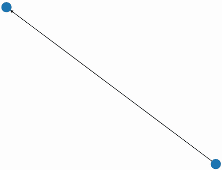

图 18.2 一个可视化的两个节点的有向图。一个几乎看不见的有向箭头从下节点指向上节点。

列表 18.13 绘制图形对象

```
import matplotlib.pyplot as plt
np.random.seed(0)                ❶
nx.draw(G)
plt.show()                       ❷
```

❶ 节点的位置使用随机算法确定。我们播种随机化以确保一致的可视化。

❷ 根据 Matplotlib 的要求，我们必须调用 plt.show()来显示绘制的图形。

我们绘制的图形显然需要一些改进。首先，我们需要使箭头更大。这可以通过使用`arrowsize`参数来实现：将`arrowsize=20`传递给`G.draw`将使绘制的箭头的长度和宽度加倍。我们还应该给节点添加标签；标签可以通过`labels`参数绘制，该参数接受一个将节点 ID 映射到预期标签的字典。列表 18.14 通过运行`{i: G.nodes[i]['webpage'] for i in G.nodes}`生成映射，然后使用节点标签和更大的箭头重新绘制我们的网络（图 18.3）。


图 18.3 一个可视化的两个节点的有向图。一个指向上节点的有向箭头从下节点指向。两个节点都有标签，但标签难以看清。

注意：此外，我们可以通过将`node_size`参数传递给`nx.draw`来修改节点大小。但就目前而言，我们的节点大小设置为默认值 300，大小适中。

列表 18.14 调整图形可视化

```
np.random.seed(0)
labels = {i: G.nodes[i]['webpage'] for i in G.nodes}
nx.draw(G, labels=labels, arrowsize=20)
plt.show()
```

现在箭头更大了，节点标签部分可见。不幸的是，这些标签被深色的节点颜色所遮挡。我们可以通过将节点颜色改为更浅的颜色（如青色）来使标签更易于识别。我们通过将`node_color="cyan"`传递给`G.draw`来调整节点颜色（图 18.4）。

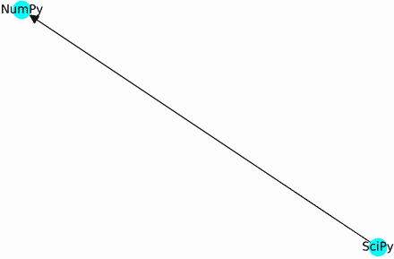

图 18.4 一个可视化的两个节点的有向图。两个节点都有标签。节点的颜色已经调整，以便标签清晰可见。

列表 18.15 修改节点颜色

```
np.random.seed(0)
nx.draw(G, labels=labels, node_color="cyan", arrowsize=20)
plt.show()
```

在我们最新的图表中，标签更加清晰可见。我们看到从 SciPy 到 NumPy 的定向链接。现在，让我们添加一个从 NumPy 到 SciPy 的反向网页链接（图 18.5）。

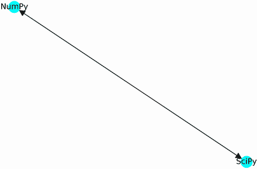

图 18.5 一个可视化的两个节点的有向图。在节点之间的边两端都有指向的箭头，表示该边是双向的。

列表 18.16 在网页之间添加反向链接

```
np.random.seed(0)
G.add_edge(0, 1)
nx.draw(G, labels=labels, node_color="cyan", arrowsize=20)
plt.show()
```

我们现在准备通过添加两个更多的网页：Pandas 和 Matplotlib 来扩展我们的网络。这些网页将分别对应于 ID 为 `2` 和 `3` 的节点。我们可以通过调用 `G.add_node(2)` 然后调用 `G.add_node(3)` 单独插入这两个节点。或者，我们可以使用 `G.add_nodes_from` 方法同时插入节点，该方法接受一个要插入图中的节点列表。因此，运行 `G.add_nodes_from([2, 3])` 将将适当的节点 ID 添加到我们的网络中。然而，这些新节点将缺少任何网页属性分配。幸运的是，`G.add_nodes_from` 方法允许我们传递属性值以及节点 ID。我们只需将 `[(2, attributes_2), [(3, attributes_3)]` 传递给该方法。本质上，我们必须传递一个与节点 ID 和属性相对应的元组列表。属性存储在一个将属性名称映射到属性值的字典中。例如，Pandas 的 `attributes_2` 字典将等于 `{'webpage': 'Pandas'}`。让我们插入这些节点，包括它们的属性，并输出 `G.nodes(data=True)` 以验证新节点是否存在。

列表 18.17 向图形对象添加多个节点

```
webpages = ['Pandas', 'Matplotlib']
new_nodes = [(i, {'webpage': webpage})
             for i, webpage in enumerate(webpages, 2)]
G.add_nodes_from(new_nodes)

print(f"We've added these nodes to our graph:\n{new_nodes}")
print('\nOur updated list of nodes is:')
print(G.nodes(data=True))

We've added these nodes to our graph:
[(2, {'webpage': 'Pandas'}), (3, {'webpage': 'Matplotlib'})]

Our updated list of nodes is:
[(0, {'webpage': 'NumPy'}), (1, {'webpage': 'SciPy'}), (2, {'webpage': 'Pandas'}), (3, {'webpage': 'Matplotlib'})]
```

我们已经添加了两个更多的节点。让我们可视化更新后的图形（图 18.6）。

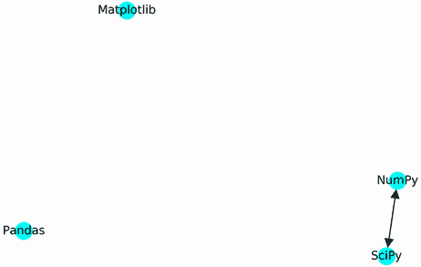

图 18.6 一个可视化的网页有向图。Pandas 和 Matplotlib 页面仍然未连接。

列表 18.18 绘制更新的四节点图

```
np.random.seed(0)
labels = {i: G.nodes[i]['webpage'] for i in G.nodes}
nx.draw(G, labels=labels, node_color="cyan", arrowsize=20)
plt.show()
```

我们当前的网页链接网络是断开的。我们添加了两个更多的网页链接：从 Matplotlib（节点 3）到 NumPy（节点 0），以及从 NumPy（节点 0）到 Pandas（节点 2）。这些链接可以通过调用 `G.add_edge(3, 0)` 然后调用 `G.add_edge(0, 2)` 来添加。或者，我们可以使用 `G.add_edges_from` 方法同时添加边：该方法接受一个边列表作为输入，其中每个边都是一个形式为 `(i, j)` 的元组。因此，运行 `G.add_edges_from([(0, 2), (3, 0)])` 应该将两个新边插入我们的图中。以下代码插入这些边并重新生成我们的图表（图 18.7）。

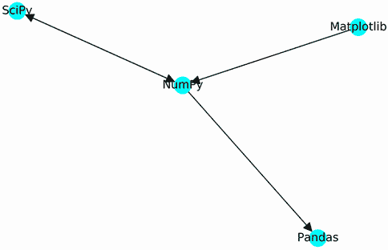

图 18.7 一个可视化的网页有向图。有两个入链指向 NumPy 页面。所有其他页面最多只有一个入链。

列表 18.19 向图形对象添加多个边

```
np.random.seed(1)
G.add_edges_from([(0, 2), (3, 0)])
nx.draw(G, labels=labels, node_color="cyan", arrowsize=20)
plt.show()
```

注意：在我们的图形可视化中，节点已经被分散开来以强调它们各自边的连接性。这种效果是通过一种称为*力导向布局*的可视化技术实现的。力导向布局基于物理原理。节点被建模为相互排斥的带负电荷的粒子，而边被建模为连接粒子的弹簧。当连接的节点相互远离时，弹簧开始将它们拉回。在这个系统中建模物理方程产生了我们的图形可视化。

NumPy 网页出现在我们更新的图的中心。两个网页，SciPy 和 Matplotlib，有指向 NumPy 的链接。所有其他网页最多只有一个入链。更多的网页内容创作者努力引用 NumPy 页面，比任何其他网站都多：我们可以推断出 NumPy 是我们最受欢迎的网站，因为它比任何其他页面有更多的入链。我们基本上开发了一个简单的指标来衡量互联网上的网站排名。该指标等于指向网站的入链数量，也称为 *入度*。这是 *出度* 的对立面，出度等于指向网站的边的数量。通过查看我们绘制的图，我们可以自动推断每个网站的入度。然而，我们也可以直接从图的邻接矩阵中计算入度。为了演示如何做到这一点，我们首先打印我们的更新后的邻接矩阵。

列表 18.20 打印更新的邻接矩阵

```
adjacency_matrix = nx.to_numpy_array(G)
print(adjacency_matrix)

[[0\. 1\. 1\. 0.]
 [1\. 0\. 0\. 0.]
 [0\. 0\. 0\. 0.]
 [1\. 0\. 0\. 0.]]
```

作为提醒，矩阵中的第 *i* 列跟踪节点 `i` 的入边。入边的总数等于该列中 1 的数量。因此，该列值的总和等于节点的入度。例如，我们的矩阵的第 0 列等于 `[0, 1, 0, 1]`。这些值的总和揭示了一个入度为 2，对应于 NumPy 页面。一般来说，执行 `adjacency_matrix .sum(axis=0)` 返回一个入度向量。该向量的最大元素对应于我们互联网图中最受欢迎的页面。

注意：我们的简单排名系统假设所有入链都拥有相同的权重，但这并不成立。来自非常受欢迎网站的入链具有更大的权重，因为它为该网站带来了更多的流量。在下一节中，我们将介绍一个更复杂的排名算法，称为 PageRank，该算法结合了流量导向网站的受欢迎程度。

列表 18.21 使用邻接矩阵计算入度

```
in_degrees = adjacency_matrix.sum(axis=0)
for i, in_degree in enumerate(in_degrees):
    page = G.nodes[i]['webpage']
    print(f"{page} has an in-degree of {in_degree}")

top_page = G.nodes[in_degrees.argmax()]['webpage']
print(f"\n{top_page} is the most popular page.")

NumPy has an in-degree of 2.0
SciPy has an in-degree of 1.0
Pandas has an in-degree of 1.0
Matplotlib has an in-degree of 0.0

NumPy is the most popular page.
```

或者，我们可以使用 NetworkX 的 `in_degree` 方法来计算所有入度。调用 `G.in_degree(i)` 返回节点 `i` 的入度，因此我们期望 `G.in_degree(0)` 等于 2。让我们来验证一下。

列表 18.22 使用 NetworkX 计算入度

```
assert G.in_degree(0) == 2
```

在这段代码中，我们必须记住 `G.nodes[0]` 对应于 NumPy 页面。跟踪节点 ID 和页面名称之间的映射可能有些不便，但我们可以通过为单个节点分配字符串 ID 来绕过这种不便。例如，给定一个空图 `G2`，我们通过运行 `G2.add_nodes_from(['NumPy', 'SciPy', 'Matplotlib', 'Pandas'])` 将我们的节点 ID 作为字符串插入。然后调用 `G2.in_degree('NumPy')` 返回 NumPy 页面的入度。

注意将节点 ID 存储为字符串可以更方便地访问图中的某些节点。然而，这种便利的代价是节点 ID 与邻接矩阵中的索引之间缺乏对应关系。正如我们将学到的，邻接矩阵对于某些网络任务来说是必不可少的，因此通常将节点 ID 存储为索引而不是字符串是良好的实践。

列表 18.23 在图中使用字符串作为节点 ID

```
G2 = nx.DiGraph()
G2.add_nodes_from(['NumPy', 'SciPy', 'Matplotlib', 'Pandas'])
G2.add_edges_from([('SciPy', 'NumPy'), ('SciPy', 'NumPy'),
                   ('NumPy', 'Pandas'), ('Matplotlib', 'NumPy')])
assert G2.in_degree('NumPy') == 2
```

给定一组节点属性和一组边，我们只需三行代码就能生成图。这种模式在许多网络问题中非常有用。通常，当处理图数据时，数据科学家会提供两个文件：一个包含所有节点属性，另一个包含链接信息。例如，在本案例研究中，我们提供了一个 FriendHook 个人资料表以及一个现有友谊表。这些友谊作为边，可以通过调用 `add_edges_from` 来加载。同时，个人资料信息描述了友谊图中每个用户的属性。经过适当的准备，这些个人资料可以通过调用 `add_nodes_from` 映射回节点。因此，将 FriendHook 图加载到 NetworkX 进行进一步分析非常直接。

网络 X 图方法入门

+   `G = nx.DiGraph()`—初始化一个新的有向图。

+   `G.add_node(i)`—创建一个索引为 `i` 的新节点。

+   `G.nodes[i]['attribute'] = x`—将属性 `x` 分配给节点 `i`。

+   `G.add_node(i, attribute=x)`—创建一个具有属性 `x` 的新节点 `i`。

+   `G.add_nodes_from([i, j])`—创建索引为 `i` 和 `j` 的新节点。

+   `G.add_nodes_from([(i, {'a': x}), (j, {'a': y})]`—创建具有索引 `i` 和 `j` 的新节点。每个新节点的属性 `a` 分别设置为 `x` 和 `y`。

+   `G.add_edge(i, j)`—创建从节点 `i` 到节点 `j` 的边。

+   `G.add_edges_from([(i, j), (k, m)])`—创建从 `i` 到 `j` 和从 `k` 到 `m` 的新边。

+   `nx.draw(G)`—绘制图 `G`。

到目前为止，我们一直关注有向图，其中节点之间的遍历是有限的。每个有向边就像一条单行道，禁止向某个方向行驶。如果我们把每条边都当作双向道来处理会怎样？我们的边就会是**无向的**，从而得到一个**无向图**。在无向图中，我们可以以任意方向遍历连接的节点。这种模式不适用于互联网背后的有向网络，但它适用于连接世界各地的城市的无向道路网络。在下一个小节中，我们将使用无向图分析道路旅行。稍后，我们将利用这些图来优化城镇之间的旅行时间。

## 18.2 利用无向图优化城镇间的旅行时间

在商业物流中，产品交付时间可能会影响某些关键决策。考虑以下场景，您已经开设了自己的 kombucha 酿酒厂。您的计划是将美味的发酵茶批量运送到合理驾驶半径内的所有城镇。更具体地说，只有当城镇在酿酒厂两小时驾驶距离内时，您才会向该城镇运送；否则，汽油成本将无法证明该次运送的收益。邻县的一家杂货店对定期送货感兴趣。您的酿酒厂和该商店之间的最快驾驶时间是多少？

通常，您可以通过在智能手机上搜索路线来获得答案，但我们将假设现有的技术解决方案不可用（可能该地区偏远，当地地图尚未扫描到在线数据库中）。换句话说，您需要复制现有智能手机工具执行的计算旅行时间。为此，您需要查阅当地地区的印刷地图。在地图上，道路在城镇之间蜿蜒，一些城镇通过道路直接相连。方便的是，连接城镇之间的旅行时间在地图上被清楚地表示出来。我们可以使用无向图来模拟这些连接。

假设一条道路连接了两个城镇，城镇 0 和城镇 1。这两个城镇之间的驾驶时间是 20 分钟。让我们将这个信息记录在一个无向图中。首先，我们通过运行`nx.Graph()`在 NetworkX 中生成图。接下来，我们通过执行`G.add_edge(0, 1)`向该图添加一个无向边。最后，我们通过运行`G[0][1]['travel_time'] = 20`将驾驶时间作为插入边的属性。

列表 18.24 创建一个两节点无向图

```
G = nx.Graph()
G.add_edge(0, 1)
G[0][1]['travel_time'] = 20
```

我们的旅行时间是边`(0, 1)`的一个属性。给定边`(i, j)`的属性`k`，我们可以通过运行`G[i][j][k]`来访问该属性，因此我们可以通过运行`G[0][1]['travel_time']`来访问旅行时间。在我们的无向图中，城镇之间的旅行时间不依赖于方向，所以`G[1][0]['travel_time']`也等于 20。

列表 18.25 检查图的边属性

```
for i, j in [(0, 1), (1, 0)]:
    travel_time = G[i][j]['travel_time']
    print(f"It takes {travel_time} minutes to drive from Town {i} to Town {j}.")

It takes 20 minutes to drive from Town 0 to Town 1.
It takes 20 minutes to drive from Town 1 to Town 0.
```

在我们的地图上，城镇 1 和城镇 0 是相连的。然而，并非所有城镇都是直接相连的。想象一下有一个额外的城镇 2，它与城镇 1 相连，但与城镇 0 不相连。城镇 0 和城镇 2 之间没有道路，但城镇 1 和城镇 2 之间有道路。这条路上的旅行时间是 15 分钟。让我们将这个新的连接添加到我们的图中。我们通过执行单行代码`G.add_edge(1, 2, travel_time=15)`来添加边和旅行时间，然后使用`nx.draw`可视化图形。我们将可视化的节点标签设置为等于节点 ID，通过将`with_labels=True`传递给`draw`函数（图 18.8）。

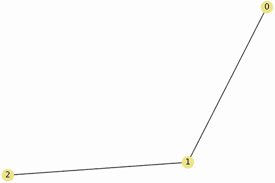

图 18.8 通过城镇 1 从城镇 0 到城镇 2 的可视化旅行路径

列表 18.26 可视化多个城镇之间的路径

```
np.random.seed(0)
G.add_edge(1, 2, travel_time=15)
nx.draw(G, with_labels=True, node_color='khaki')
plt.show()
```

从城镇 0 到城镇 2 的旅行需要我们首先穿越城镇 1。因此，总旅行时间等于`G[0][1]['travel_time']`和`G[1][2]['travel_time']`的和。让我们计算那个旅行时间。

列表 18.27 计算城镇之间的旅行时间

```
travel_time = sum(G[i][1]['travel_time'] for i in [0, 2])
print(f"It takes {travel_time} minutes to drive from Town 0 to Town 2.")

It takes 35 minutes to drive from Town 0 to Town 2.
```

我们已经计算了两个城镇之间的最快旅行时间。我们的计算很简单，因为城镇 0 和城镇 2 之间只有一条路线。然而，在现实生活中，在局部城镇之间可能存在许多路线。优化多个城镇之间的驾驶时间并不简单。为了说明这一点，让我们构建一个包含十几个城镇的图，这些城镇分布在多个县。在我们的图模型中，当城镇位于不同的县时，城镇之间的旅行时间会增加。我们将假设以下情况：

+   我们的城市位于六个不同的县。

+   每个县包含 3 到 10 个城镇。

+   单个县中的 90%的城镇直接通过道路连接。县内道路的平均旅行时间为 20 分钟。

+   不同县之间的城镇中有 5%直接通过道路连接。县内道路的平均旅行时间为 45 分钟。

我们现在将模拟这个场景。然后我们将设计一个算法来计算我们复杂网络中任意两个城镇之间的最快旅行时间。

常见的 NetworkX 方法和属性分配

+   `G = nx.Graph()`—初始化一个新的无向图

+   `G.nodes[i]['attribute'] = x`—将属性`x`分配给节点`i`

+   `G[i][j]['attribute'] = x`—将属性`x`分配给边`(i, j)`

### 18.2.1 建模城镇和县的网络

让我们先模拟一个包含五个城镇的单个县。首先，我们将五个节点插入到空图中。每个节点都被分配一个`county_id`属性为 0，表示所有节点都属于同一个县。

列表 18.28 在同一县建模五个城镇

```
G = nx.Graph()
G.add_nodes_from((i, {'county_id': 0}) for i in range(5))
```

接下来，我们将随机道路分配给我们的五个城镇（图 18.9）。我们遍历节点对的每个组合并抛一个有偏的硬币。硬币有 90%的概率落在正面：每次我们看到正面，我们就在这对节点之间添加一个边。每条边的`travel_time`参数是通过从均值为 20 的正态分布中采样随机选择的。

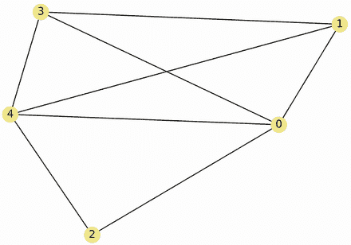

图 18.9 在五个城镇县中随机生成的道路网络

注意：作为提醒，正态分布是一种钟形曲线，常用于分析概率和统计学中的随机过程。请参阅第六部分以获取对该曲线的更详细讨论。

列表 18.29 建模县内的随机道路

```

import numpy as np
np.random.seed(0)

def add_random_edge(G, node1, node2, prob_road=0.9,
                    mean_drive_time=20):                            ❶
    if np.random.binomial(1, prob_road):                            ❷
        drive_time = np.random.normal(mean_drive_time)              ❸
        G.add_edge(node1, node2, travel_time=round(drive_time, 2)) 

nodes = list(G.nodes())
for node1 in nodes[:-1]:
    for node2 in nodes[node1 + 1:]:
        add_random_edge(G, node1, node2)

nx.draw(G, with_labels=True, node_color='khaki')
plt.show()
```

❶ 函数尝试在图 G 中生成节点 1 和节点 2 之间的随机边。边插入的概率等于 prob_road。如果插入边，则分配一个随机的旅行时间属性。旅行时间是从均值为 mean_travel_time 的正态分布中选择的。

❷ 抛硬币以确定是否插入边缘

❸ 从正态分布中选择旅行时间

我们已经连接了县 0 中的大多数城镇。以同样的方式，我们可以为第二个县：县 1 随机生成道路和城镇。在这里，我们生成县 1 并将其输出存储在单独的图中（图 18.10）。县 1 中的城镇数量是在 3 到 10 之间随机选择的值。

列表 18.30 建模第二个随机县

```
np.random.seed(0)
def random_county(county_id):                   ❶
    numTowns = np.random.randint(3, 10)         ❷
    G = nx.Graph()
    nodes = [(node_id, {'county_id': county_id})
            for node_id in range(numTowns)]
    G.add_nodes_from(nodes)
    for node1, _ in nodes[:-1]:
        for node2, _ in nodes[node1 + 1:]:
            add_random_edge(G, node1, node2)    ❸

    return G

G2 = random_county(1)
nx.draw(G2, with_labels=True, node_color='khaki')
plt.show()
```

❶ 生成一个随机的县图

❷ 从 3 到 10 的整数范围内随机选择县中的城镇数量

❸ 随机添加县内道路

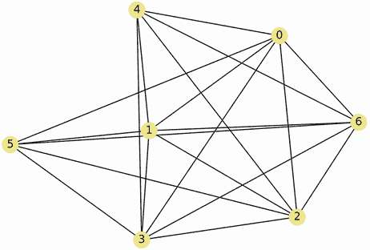

图 18.10 第二个县中随机生成的道路网络。县中的城镇数量也已被随机选择。

目前，县 1 和县 2 存储在两个独立的图中：`G`和`G2`。我们需要以某种方式合并这些图。由于`G`和`G2`中节点的共享 ID，合并图变得更加困难。幸运的是，`nx.disjoint_union`函数简化了我们的任务，它接受两个图作为输入：`G`和`G2`。然后它将每个节点 ID 重置为 0 到总节点数之间的唯一值。最后，它合并这两个图。在这里，我们执行`nx.disjoint_union(G, G2)`然后绘制结果（图 18.11）。

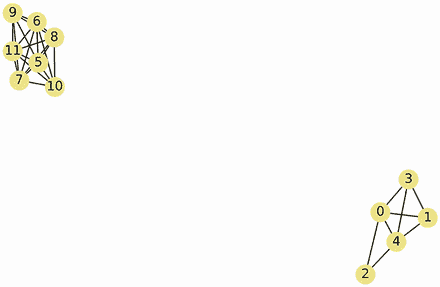

图 18.11 两个县网络合并在一起

列表 18.31 合并两个独立的图

```
np.random.seed(0)
G = nx.disjoint_union(G, G2)
nx.draw(G, with_labels=True, node_color='khaki')
plt.show()
```

我们的两个县出现在同一个图中。图中的每个城镇都被分配了一个唯一的 ID。现在是我们生成县之间的随机道路的时候了（图 18.12）。我们遍历所有跨县节点对（其中`G[n1]['county_id'] != G[n2]['county_id']`）。对于每个节点对，我们应用`add_random_edge`。边的概率设置为低，为 0.05，平均旅行时间设置为高，为 90 分钟。

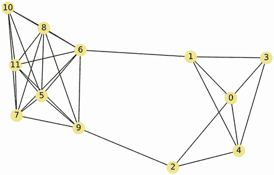

图 18.12 通过随机道路连接的两个县网络

列表 18.32 添加随机跨县道路

```
np.random.seed(0)
def add_intercounty_edges(G):                                         ❶
    nodes = list(G.nodes(data=True)) 
    for node1, attributes1 in nodes[:-1]:                             ❷
        county1 = attributes1['county_id']
        for node2, attributes2 in nodes[node1:]:                      ❸
            if county1 != attributes2['county_id']:
                add_random_edge(G, node1, node2,
                                prob_road=0.05, mean_drive_time=45)   ❹
    return G

G = add_intercounty_edges(G)
np.random.seed(0)
nx.draw(G, with_labels=True, node_color='khaki')
```

❶ 在图 G 中添加不匹配县 ID 的节点之间的随机边

❷ 遍历每个节点及其关联的属性

❸ 遍历我们尚未比较的节点对

❹ 尝试添加一个随机的跨县边

我们成功地模拟了两个相互连接的县。现在我们模拟六个相互连接的县（图 18.13）。

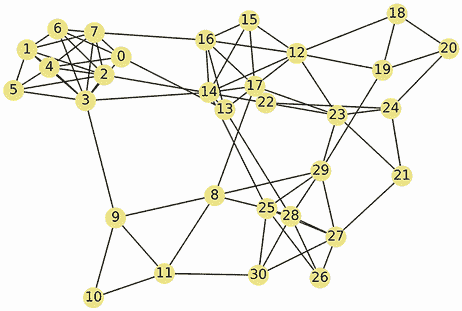

图 18.13 通过随机道路连接的六个县网络

列表 18.33 模拟六个相互连接的县

```
np.random.seed(1)
G = random_county(0)
for county_id in range(1, 6):
    G2 = random_county(county_id)
    G = nx.disjoint_union(G, G2)

G = add_intercounty_edges(G)
np.random.seed(1)
nx.draw(G, with_labels=True, node_color='khaki')
plt.show()
```

我们已经可视化了我们的六个县图，但在可视化中区分各个县是困难的。幸运的是，我们可以通过根据县 ID 着色每个节点来改进我们的绘图。这样做需要我们修改输入到`node_color`参数：而不是传递一个单独的颜色字符串，我们将传递一个颜色字符串列表。列表中的第*i*个颜色将对应于索引`i`的节点的分配颜色。以下代码确保不同县的节点接收不同的颜色分配，而共享同一个县的节点分配相同的颜色（图 18.14）。

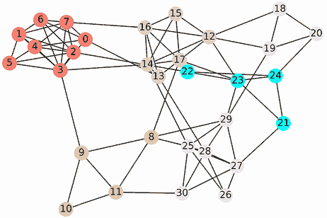

图 18.14 六个通过随机道路连接的县网络。各个城镇根据县 ID 着色。

列表 18.34 根据县对节点进行着色

```
np.random.seed(1)
county_colors = ['salmon', 'khaki', 'pink', 'beige', 'cyan', 'lavender']
county_ids = [G.nodes[n]['county_id']
              for n in G.nodes]
node_colors = [county_colors[id_]
               for id_ in county_ids]
nx.draw(G, with_labels=True, node_color=node_colors)
plt.show()
```

现在可以清楚地看到各个县。大多数县在网络中形成紧密的簇。稍后，我们将自动提取这些簇使用网络聚类。现在，我们专注于计算节点之间的最快旅行时间。

常见的 NetworkX 图可视化函数

+   `nx.draw(G)`—绘制图`G`。

+   `nx.draw(G, labels=True)`—绘制带有节点标签的图`G`。标签等于节点 ID。

+   `nx.draw(G, labels=ids_to_labels)`—绘制带有节点标签的图`G`。节点使用节点 ID 和标签之间的映射进行标记。该映射由`ids_to_labels`字典指定。

+   `nx.draw(G, node_color=c)`—绘制图`G`。所有节点都使用`color c`着色。

+   `nx.draw(G, node_color=ids_to_colors)`—绘制图`G`。所有节点都使用节点 ID 和颜色之间的映射进行着色。该映射由`ids_to_colors`字典指定。

+   `nx.draw(G, arrowsize=20)`—绘制带有增加的箭头大小的有向图`G`。

+   `nx.draw(G, node_size=20)`—绘制图`G`，将节点大小从默认值 300 减小到 20。

### 18.2.2 计算节点之间的最快旅行时间

假设我们的酿酒厂位于城镇 0，我们的潜在客户位于城镇 30。我们想要确定城镇 0 和城镇 30 之间的最快旅行时间。在这个过程中，我们需要计算城镇 0 和每个其他城镇之间的最快旅行时间。我们如何做到这一点？最初，我们所知道的是城镇 0 与其自身的平凡旅行时间：0 分钟。让我们将这个旅行时间记录在`fastest_times`字典中。稍后，我们将这个字典填充到每个城镇的旅行时间。

列表 18.35 跟踪已知的最快旅行时间

```
fastest_times = {0: 0}
```

接下来，我们可以回答一个简单的问题：已知从城镇 0 到其相邻城镇的旅行距离是多少？在这个上下文中，“相邻”是指与城镇 0 相连的城镇。在 NetworkX 中，我们可以通过执行`G.neighbors(0)`来访问城镇 0 的邻居。这个方法调用返回一个包含连接到节点 0 的节点 ID 的可迭代对象。或者，我们也可以通过运行`G[0]`来访问邻居。在这里，我们输出所有相邻城镇的 ID。

列表 18.36 访问城镇 0 的邻居

```
neighbors = list(G.neighbors(0))
assert list(neighbors) == list(G[0])
print(f"The following towns connect directly with Town 0:\n{neighbors}")
The following towns connect directly with Town 0:
[3, 4, 6, 7, 13]
```

现在，我们记录城镇 0 与其五个邻居之间的旅行时间，并使用这些时间来更新`fastest_times`。此外，我们以排序顺序输出旅行时间，以便进行进一步分析。

列表 18.37 跟踪到相邻城镇的旅行时间

```
time_to_neighbor = {n: G[0][n]['travel_time'] for n in neighbors}
fastest_times.update(time_to_neighbor)
for neighbor, travel_time in sorted(time_to_neighbor.items(),
                                    key=lambda x: x[1]):
    print(f"It takes {travel_time} minutes to drive from Town 0 to Town "
          f"{neighbor}.")

It takes 18.04 minutes to drive from Town 0 to Town 7.
It takes 18.4 minutes to drive from Town 0 to Town 3.
It takes 18.52 minutes to drive from Town 0 to Town 4.
It takes 20.26 minutes to drive from Town 0 to Town 6.
It takes 44.75 minutes to drive from Town 0 to Town 13.
```

从城镇 0 开车到城镇 13 大约需要 45 分钟。这是这两个城镇之间最快的旅行时间吗？不一定！通过另一个城镇绕行可能会加快旅行速度，如图 18.15 所示。

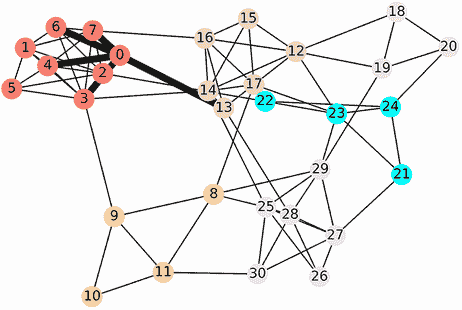

图 18.15 使用粗黑边突出显示了连接城镇 0 与其邻居的道路。这些五条道路的旅行时间是已知的。可能存在更快的旅行路线，但这些路线将需要额外的绕行。

例如，考虑通过城镇 7 的绕行。这是我们最近的城镇，驾驶时间仅为 18 分钟。如果城镇 7 和城镇 13 之间存在一条道路，并且其旅行时间低于 27 分钟，那么前往城镇 13 的路线可能会更快！相同的逻辑也适用于城镇 3、4 和 6。如果我们检查城镇 7 的邻居，我们可能可以减少旅行时间。让我们这样进行考察：

1.  获取城镇 7 的邻居。

1.  获取城镇 7 与每个相邻城镇*N*之间的旅行时间。

1.  将上一步获得的旅行时间增加 18.04 分钟。这代表当我们通过城镇 7 绕行时，从城镇 0 到城镇*N*的旅行时间。

1.  如果*N*在`最快时间`中，检查绕行是否比`最快时间[N]`更快。如果发现改进，则更新`最快时间`并打印更快的旅行时间。

1.  如果*N*不在`最快时间`中，则使用步骤 3 中计算的旅行时间更新该字典。这代表当两个城镇之间没有直接道路连接时，从城镇 0 到城镇*N*的旅行时间。

以下代码执行这些步骤。

列表 18.38 通过城镇 7 寻找更快的绕行路线

```
def examine_detour(town_id):                                       ❶
    detour_found = False

    travel_time = fastest_times[town_id]                           ❷
    for n in G[town_id]:
        detour_time = travel_time + G[town_id][n]['travel_time']   ❸
        if n in fastest_times:
            if detour_time < fastest_times[n]:                     ❹
                detour_found = True
                print(f"A detour through Town {town_id} reduces "
                      f"travel-time to Town {n} from "
                      f"{fastest_times[n]:.2f} to "
                      f"{detour_time:.2f} minutes.")
                fastest_times[n] = detour_time

        else:
            fastest_times[n] = detour_time                         ❺

    return detour_found

if not examine_detour(7):
    print("No detours were found.")

addedTowns = len(fastest_times) - 6                                ❻
print(f"We've computed travel-times to {addedTowns} additional towns.")

No detours were found.
We've computed travel-times to 3 additional towns.
```

❶ 检查通过 town_id 的绕行是否改变了从城镇 0 到其他城镇的最快已知旅行时间

❷ 城镇 0 和 town_id 之间的旅行时间

❸ 从城镇 0 到 town_id 邻居的绕行时间

❹ 检查绕行是否改善了从城镇 0 到 n 的最快已知旅行时间

❺ 记录从城镇 0 到 n 的最快已知旅行时间

❻ 检查除了字典中最初存在的六个城镇外，还有多少新城镇被添加到最快时间中

我们已经发现了前往三个额外城镇的旅行时间，但我们还没有找到前往城镇 0 邻居的更快的绕行路线。然而，这些绕行路线可能存在。让我们选择另一个可行的绕行候选者。我们将选择一个靠近城镇 0 的城镇，其邻居我们尚未检查。这样做需要我们执行以下操作：

1.  将城镇 0 和城镇 7 的邻居合并为一个绕行候选者池。请注意，城镇 0 和城镇 7 将存在于该池中，因此需要下一步。

1.  从候选者池中移除城镇 0 和城镇 7，留下未检查的城镇集合。

1.  选择一个具有前往城镇 0 最快已知旅行时间的未检查城镇。

让我们运行这些步骤来选择我们的下一个绕行候选者，使用图 18.16 中可视化的逻辑。

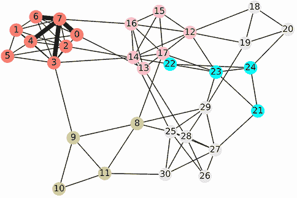

图 18.16 通过城镇 7 直接绕行到城镇 0 的邻居用粗黑边突出显示。这些绕行并没有改善我们的驾驶时间。也许通过城镇 3 的额外绕行会产生更好的结果。

列表 18.39 选择替代绕行候选

```
candidate_pool = set(G[0]) | set(G[7])                   ❶
examinedTowns = {0, 7}
unexaminedTowns = candidate_pool - examinedTowns         ❷
detour_candidate = min(unexaminedTowns,
                       key=lambda x: fastest_times[x])   ❸
travel_time = fastest_times[detour_candidate]
print(f"Our next detour candidate is Town {detour_candidate}, "
      f"which is located {travel_time} minutes from Town 0.")

Our next detour candidate is Town 3, which is located 18.4 minutes from Town 0.
```

❶ 绕行候选池结合了城镇 0 和城镇 7 的邻居。请注意，这两个城镇都是彼此的邻居。因此，它们需要从候选集中删除。

❷ 从候选集中删除所有先前检查的城镇

❸ 选择到城镇 0 最快的已知旅行时间的绕行候选

我们下一个绕行候选是城镇 3。我们检查城镇 3 的绕行情况：检查这个城镇的邻居可能会揭示新的、未检查的城镇。我们将所有这样的城镇插入到`unexaminedTowns`中，这将使我们能够跟踪剩余的绕行候选以进行进一步分析。请注意，候选跟踪要求我们在检查后，将城镇 3 从`unexaminedTowns`转移到`examinedTowns`。

列表 18.40 通过城镇 3 寻找更快的绕行路线

```
if not examine_detour(detour_candidate):           ❶
    print("No detours were found.")

def new_neighbors(town_id):                        ❷
    return set(G[town_id]) - examinedTowns

def shift_to_examined(town_id):                    ❸
    unexaminedTowns.remove(town_id)
    examinedTowns.add(town_id)

unexaminedTowns.update(new_neighbors(detour_candidate))
shift_to_examined(detour_candidate)
num_candidates = len(unexaminedTowns)
print(f"{num_candidates} detour candidates remain.")

No detours were found.
9 detour candidates remain.
```

❶ 检查城镇 3 的可能的绕行

❷ 此辅助函数获取尚未包含在我们绕行候选集的城镇 3 的邻居。

❸ 在检查后，此辅助函数将城镇 3 转移到`examinedTowns`。

再次，没有发现绕行路线。然而，我们的`unexaminedTowns`集中还有九个绕行候选。让我们检查剩余的候选。列表 18.41 逐个检查每个城镇以寻找更快的绕行路线：

1.  选择一个到城镇 0 最快的已知旅行时间的未检查城镇。

1.  使用`examine_detour`检查该城镇的绕行。

1.  将城镇的 ID 从`unexaminedTowns`转移到`examinedTowns`。

1.  如果还有未检查的城镇，请重复步骤 1。否则终止。

列表 18.41 检查每个城镇以寻找更快的绕行路线

```
while unexaminedTowns:                                        ❶
    detour_candidate = min(unexaminedTowns,
                       key=lambda x: fastest_times[x])        ❷
    examine_detour(detour_candidate)                          ❸
    shift_to_examined(detour_candidate)                       ❹
    unexaminedTowns.update(new_neighbors(detour_candidate))   ❺

A detour through Town 14 reduces travel-time to Town 15 from 83.25 to 82.27 minutes.
A detour through Town 22 reduces travel-time to Town 23 from 111.21 to 102.38 minutes.
A detour through Town 28 reduces travel-time to Town 29 from 127.60 to 108.46 minutes.
A detour through Town 28 reduces travel-time to Town 30 from 126.46 to 109.61 minutes.
A detour through Town 19 reduces travel-time to Town 20 from 148.03 to 131.23 minutes.
```

❶ 迭代继续，直到检查了每个可能的城镇。

❷ 根据到城镇 0 最快的旅行时间选择新的绕行候选

❸ 检查候选绕行

❹ 从未检查的城镇中删除候选

❺ 将候选的先前未见过的邻居添加到`unexaminedTowns`

我们已经检查了每个城镇的旅行时间，并发现了五个可能的绕行路线。其中两条绕行路线是通过城镇 28 进行的：它们将城镇 29 和 30 的旅行时间从 2.1 小时减少到 1.8 小时，因此这两个城镇都落在我们 kombucha 酿酒厂的可行驾驶范围内。

有多少其他城镇在城镇 0 的两小时内？让我们找出答案。

列表 18.42 计算所有两小时驾驶范围内的城镇数量

```
closeTowns = {town for town, drive_time in fastest_times.items()
               if drive_time <= 2 * 60}

num_closeTowns = len(closeTowns)
totalTowns = len(G.nodes)
print(f"{num_closeTowns} of our {totalTowns} towns are within two "
      "hours of our brewery.")

29 of our 31 towns are within two hours of our brewery.
```

除了两个城镇外，我们的所有城镇都在酿酒厂两小时之内。我们是通过解决*最短路径长度问题*得出这个结论的。这个问题适用于包含数值属性的图，这些属性被称为*边权重*。此外，图中节点转换的序列被称为*路径*。每个路径遍历一系列边。该序列中边权重的总和被称为*路径长度*。这个问题要求我们计算节点*N*与图中每个节点之间的最短路径长度。如果所有边权重都是正数，我们可以这样计算这些路径长度：

1.  创建一个最短路径长度的字典。最初，该字典等于`{N: 0}`。

1.  创建一个检查节点集。最初，它是空的。

1.  创建一组我们希望检查的节点。最初，它只包含*N*。

1.  从我们的未检查节点集中移除一个未检查的节点*U*。我们选择一个到*N*的路径长度最小的*U*。

1.  获取*U*的所有邻居。

1.  计算每个邻居与*N*之间的路径长度。相应地更新最短路径长度字典。

1.  将所有尚未检查的邻居添加到我们的未检查节点集中。

1.  将*U*添加到我们的检查节点集中。

1.  如果还有未检查的节点，则重复步骤 4。否则终止。

这个最短路径长度算法包含在 NetworkX 中。给定具有`weight`边权重属性的图*G*，我们可以通过运行`nx.shortest_path_length(G, weight='weight', source=N)`来计算从节点*N*到图中的所有节点的所有最短路径长度。在这里，我们使用`shortest_path_length`函数通过一行代码计算`fastest_times`。

列表 18.43 使用 NetworkX 计算最短路径长度

```
shortest_lengths = nx.shortest_path_length(G, weight='travel_time',
                                           source=0)
for town, path_length in shortest_lengths.items():
    assert fastest_times[town] == path_length
```

我们的最短路径长度算法实际上并不返回最短路径。然而，在现实世界的情境中，我们希望知道最小化节点之间距离的路径。例如，仅仅知道城镇 0 和城镇 30 之间的最快旅行时间是不够的：我们还需要得到在两小时内到达那里的驾驶方向。幸运的是，最短路径长度算法可以很容易地修改以追踪最短路径。我们只需要添加一个跟踪节点之间转换的字典结构。实际遍历的节点序列可以用一个列表来表示。为了简洁起见，我们省略了从头开始定义最短路径追踪器的步骤；然而，我们鼓励你编写一个最短路径函数，并将其输出与内置的 NetworkX `shortest_path`函数进行比较。调用`nx.shortest_path_length(G, weight='weight', source=N)`计算从节点`N`到`G`中每个节点的所有最短路径。因此，执行`nx.shortest_path(G, weight='travel_time', source=0)[30]`应该返回城镇 0 和城镇 30 之间的最快旅行路线。我们现在将打印出这条路线，它也在图 18.17 中显示。

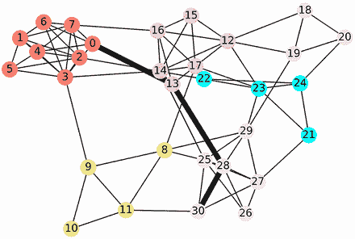

图 18.17 在图中用粗黑边突出显示了城镇 0 和城镇 30 之间的最短路径。路径从城镇 0 到城镇 13，然后是城镇 28 和 30。值得注意的是，图中存在替代路径：例如，我们可以从城镇 13 旅行到城镇 25，然后到城镇 30。然而，我们突出显示的路径保证具有可能的最短路径长度。

列表 18.44 使用 NetworkX 计算最短路径

```
shortest_path = nx.shortest_path(G, weight='travel_time', source=0)[30]
print(shortest_path)
[0, 13, 28, 30]
```

如果我们从城镇 0 开车到城镇 13，再到城镇 28，最后到城镇 30，行驶时间将最小化。我们预计旅行时间将与 `fastest_times[30]` 相等。让我们来确认一下。

列表 18.45 验证最短路径长度

```
travel_time = 0
for i, town_a in enumerate(shortest_path[:-1]):
    town_b = shortest_path[i + 1]
    travel_time += G[town_a][town_b]['travel_time']
print("The fastest travel time between Town 0 and Town 30 is "
      f"{travel_time} minutes.")
assert travel_time == fastest_times[30]

The fastest travel time between Town 0 and Town 30 is 109.61 minutes.
```

基本网络理论使我们能够优化地理位置之间的旅行路径。在下一节中，我们将在此基础上开发更高级的技术。更确切地说，我们将模拟城镇网络中的交通流量。这种模拟将使我们能够揭示图中最中心的城镇。稍后，我们将使用这些交通模拟将城镇聚类成不同的县，并说明这种聚类技术如何用于识别社交图中的朋友群体。

常见的 NetworkX 路径相关技术

+   `G.neighbors(i)`—返回节点 `i` 的所有邻居。

+   `G[i]`—返回节点 `i` 的所有邻居。

+   `G[i][j]['weight']`—返回相邻节点 `i` 和 `j` 之间单条过渡路径的长度。

+   `nx.shortest_path_length(G, weight='weight', source=N)`—返回从节点 `N` 到图中所有可访问节点的最短路径长度的字典。`weight` 属性用于测量路径长度。

+   `nx.shortest_path(G, weight='weight', source=N)`—返回从节点 `N` 到图中所有可访问节点的最短路径字典。

## 摘要

+   *网络理论* 是研究对象之间连接的学科。一组对象及其分散的连接被称为 *网络* 或 *图*。这些对象被称为 *节点*，而连接被称为 *边*。

+   如果一条边具有特定的方向，则称为 *有向边*。具有有向边的图称为 *有向图*。如果图不是有向的，则称为 *无向图*。

+   我们可以将一个图表示为一个二进制矩阵 `M`，其中 `M[i][j] = 1` 如果节点 `i` 和节点 `j` 之间存在边。这种图的矩阵表示称为 *邻接矩阵*。

+   在有向图中，我们可以计算每个节点的入边和出边。入边的数量称为 *入度*，出边的数量称为 *出度*。在某些图中，入度作为节点流行度的衡量标准。我们可以通过在邻接矩阵的行上求和来计算入度。

+   我们可以使用图论来优化节点之间的旅行。一系列节点转换被称为*路径*。如果每条边都分配了一个数值属性，则可以与该路径关联一个长度。这个数值属性被称为*边权重*。路径中节点序列上边权重的总和被称为*路径长度*。*最短路径长度问题*试图最小化从节点*N*到图中所有其他节点的路径长度。如果边权重为正，则可以通过算法最小化路径长度。
