# 19 动态图论技术在节点排名和社会网络分析中的应用

本节涵盖

+   寻找最中心的网络位置

+   网络中连接的聚类

+   理解社交图分析

在上一节中，我们研究了多种类型的图。我们考察了通过有向链接连接的网页，以及跨越多个县的道路网络。在我们的分析中，我们主要将网络视为静止的、静态的对象——我们像计算照片中的静止云朵一样计算邻近节点。在现实生活中，云朵不断在运动，许多网络也是如此。大多数值得研究的网络都始终充满动态活动。汽车在道路网络上疾驰，导致热门城镇附近的交通拥堵。同样，当数十亿用户探索互联网上的众多网页时，网络流量也会在互联网上流动。我们的社交网络也在活动中流动，流言、谣言和文化梗在紧密的亲密朋友圈子中传播。理解这种动态流动可以帮助我们以自动化的方式揭示朋友群体。理解流量还可以帮助我们识别互联网上最繁忙的网页。这种动态网络活动的建模对于许多大型科技组织的功能至关重要。事实上，本节中提出的一种建模方法导致了一家价值万亿美元公司的成立。

图上的动态流动（如人流、车流等）是一个固有的随机过程，因此可以使用类似于第三部分中展示的随机模拟来研究。在本节的前部分，我们利用随机模拟来研究汽车流量。然后我们尝试使用矩阵乘法更有效地计算流量概率。稍后，我们使用我们的矩阵分析来揭示交通繁忙的社区集群。然后我们将我们的聚类技术应用于揭示社交网络中的朋友群体。

让我们开始吧。我们从一个简单的问题开始，即根据交通模拟揭示交通繁忙的城镇。

## 19.1 基于网络预期流量揭示中心节点

在上一节中，我们模拟了一个连接 6 个不同县 31 个城镇的道路网络（图 19.1）。我们将该网络存储在一个名为`G`的图中。我们的目标是优化 31 个城镇之间的商业配送旅行时间。让我们进一步探讨这个场景。

假设我们的业务正在以令人印象深刻的速度增长。我们希望通过在`G.nodes`表示的当地城镇之一投放广告牌来扩大我们的客户群。为了最大化广告牌的观看次数，我们将选择交通流量最大的城镇。直观地说，交通流量是由每天通过城镇的汽车数量决定的。我们能否根据预期的每日交通量对`G.nodes`中的 31 个城镇进行排名？是的，我们可以！通过简单的建模，我们可以预测城镇之间道路网络中的交通流量。稍后，我们将扩展这些交通流量技术，以自动识别本地县。

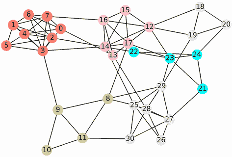

图 19.1：第十八部分中模拟的节点网络，存储在图`G`中。道路连接了 31 个城镇，这些城镇分布在六个县。每个城镇根据其县 ID 着色。

我们需要一种方法来根据预期的交通量对城镇进行排名。天真地，我们可以简单地计算每个城镇进入的道路数量：一个有五条道路的城镇可以从五个不同的方向接收交通，而只有一条道路的城镇在交通流量上更为有限。道路数量与我们在第十八部分中介绍的网站的入度排名类似。提醒一下，一个节点的入度是指指向该节点的有向边的数量。然而，与网站图不同，我们的道路网络是无向的：没有区分进入边和出去边。因此，没有区分节点的入度和出度；这两个值相等，所以无向图中节点的边数简单地称为节点的*度*。我们可以通过计算图的邻接矩阵的第*i*列的总和来计算任何节点`i`的度，或者我们可以通过运行`len(G.nodes[i])`来测量度。或者，我们可以通过调用`G.degree(i)`来利用 NetworkX 的`degree`方法。在这里，我们使用所有这些技术来计算穿过城镇 0 的道路数量。

列表 19.1：计算单个节点的度

```
adjacency_matrix = nx.to_numpy_array(G)
degree_town_0 = adjacency_matrix[:,0].sum()
assert degree_town_0 == len(G[0])
assert degree_town_0 == G.degree(0)
print(f"Town 0 is connected by {degree_town_0:.0f} roads.")

Town 0 is connected by 5 roads.
```

使用它们的度，我们根据重要性对节点进行排名。在图论中，任何关于节点重要性的度量通常称为*节点中心性*，基于节点度的排名称为*度中心性*。我们现在选择`G`中具有最高度中心性的节点：这个中心节点将作为广告牌位置的初始选择（图 19.2）。

列表 19.2：使用中心度选择中心节点

```
np.random.seed(1)
central_town = adjacency_matrix.sum(axis=0).argmax()
degree = G.degree(central_town)
print(f"Town {central_town} is our most central town. It has {degree} "
       "connecting roads.")
node_colors[central_town] = 'k'
nx.draw(G, with_labels=True, node_color=node_colors)
plt.show()

Town 3 is our most central town. It has 9 connecting roads.
```

城镇 3 是我们最中心的城镇。道路连接它到九个不同的城镇和三个不同的县。城镇 3 与第二中心城镇相比如何？我们将通过输出`G`中的第二高度来快速检查。

列表 19.3：选择具有第二高中心度的节点

```
second_town = sorted(G.nodes, key=lambda x: G.degree(x), reverse=True)[1]
second_degree = G.degree(second_town)
print(f"Town {second_town} has {second_degree} connecting roads.")

Town 12 has 8 connecting roads.
```

12 镇有八条连接道路——它比 3 镇少一条道路。如果这两个城镇的度数相等，我们会怎么做？让我们挑战自己来找出答案。在图 19.2 中，我们看到一条连接 3 镇和 9 镇的道路。假设这条道路因为损坏而关闭。这种关闭需要从`G`中移除一条边。运行`G.remove(3, 9)`移除了节点 3 和 9 之间的边，因此 3 镇的度数变为与 12 镇相等。网络中还有其他重要的结构变化。在这里，我们可视化这些变化（图 19.3）。

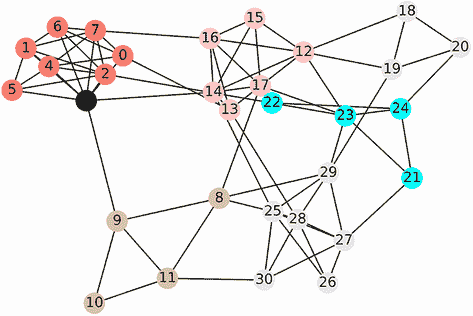

图 19.2 不同城镇之间的道路网络。3 镇具有最高的度数中心性，被涂成黑色。

列表 19.4 从最中心节点移除边

```
np.random.seed(1)
G.remove_edge(3, 9)
assert G.degree(3) == G.degree(12)                    ❶
nx.draw(G, with_labels=True, node_color=node_colors)
plt.show()
```

❶ 在删除边之后，3 镇和 12 镇的中心度数相同。

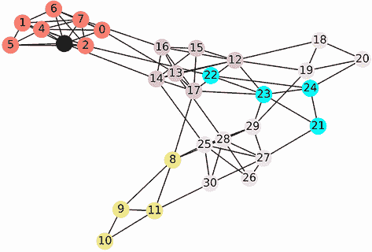

图 19.3 在道路关闭后不同城镇之间的道路网络。3 镇和 12 镇现在具有相同度数中心性。尽管它们的度数相同，但在图中 12 镇似乎处于更中心的位置。它的县界与多个其他县接壤。同时，关闭的道路部分地将 3 镇与外界隔离开来。

道路的移除也部分地将 3 镇及其邻近城镇与外界隔离开来。3 镇位于县 0，该县包括 0 镇到 7 镇。之前，一条穿过 3 镇的道路将县 0 与县 1 连接起来；现在这条道路已被消除，因此 3 镇比以前更难到达。这与继续成为多个不同县邻居的 12 镇形成对比。

现在 3 镇的中心性不如 12 镇，但两个城镇的度数相等。我们暴露了度数中心性的一个重大缺陷：如果连接的道路不通往任何重要的地方，那么这些道路就不重要。

想象一下，如果一座城镇有 1000 条道路，所有这些道路都通向死胡同。现在想象一座只有四条道路的城镇，但每条道路都通往一个大都市。我们预计第二个城镇的交通量会比第一个城镇大，尽管它们的度数差异极大。同样，我们预计 12 镇会比 3 镇吸引更多的交通量，尽管它们的度数相等。实际上，我们可以使用随机模拟来量化这些差异。在下一小节中，我们将通过模拟城镇之间的交通流量来测量城镇的中心性。

### 19.1.1 使用交通模拟测量中心性

我们将通过让 20,000 辆模拟汽车在我们的 31 个城镇中随机驾驶来模拟网络中的交通。然而，首先我们需要模拟单辆汽车的随机路径。汽车将从随机城镇`i`开始其旅程。然后驾驶员将随机选择一条穿过城镇的`G.degree(i)`条道路，并访问`i`的随机邻近城镇。接下来，将选择另一条随机道路。这个过程将重复进行，直到汽车穿过 10 个城镇。让我们定义一个`random_drive`函数，在图`G`上运行这个模拟；该函数返回汽车的最终位置。

注意：在图论中，这种在节点之间随机遍历的类型被称为*随机游走*。

列表 19.5 模拟单辆车的随机路线

```
np.random.seed(0)
def random_drive(num_stops=10):            ❶
    town = np.random.choice(G.nodes)       ❷
    for _ in range(num_stops):
        town = np.random.choice(G[town])   ❸

    return town

destination = random_drive()
print(f"After driving randomly, the car has reached Town {destination}.")

After driving randomly, the car has reached Town 24.
```

❶ 该函数模拟了汽车在 num_paths 个城镇之间的随机路径。

❷ 随机选择汽车的起始位置。

❸ 汽车驶向一个随机的邻近城镇。

列表 19.6 使用 20,000 辆汽车重复此模拟，并计算 31 个城镇中每个城镇的汽车数量。这个汽车计数代表了每个城镇的交通。我们打印了访问最频繁城镇的交通情况。我们还对 20,000 次迭代进行了计时，以了解与交通模拟相关的运行时成本。

注意：我们的模拟被大大简化了。在现实生活中，人们不会随意从一个城镇开车到另一个城镇：某些地区交通繁忙，因为它们位于人们必须定期前往的地方，那里有许多住宅、就业机会、零售商等。但我们的简化并不损害模型；相反，它是有益的！我们的模型不仅适用于汽车交通，还可以推广到网络交通和社会互动的流动。简而言之，我们将扩展我们的分析到这些其他类别的图——如果我们的模型不那么简单、更具体，这种扩展将是不可能的。

列表 19.6 使用 20,000 辆汽车模拟交通

```
import time
np.random.seed(0)
car_counts = np.zeros(len(G.nodes))      ❶
num_cars = 20000

start_time = time.time()
for _ in range(num_cars):
    destination = random_drive()
    car_counts[destination] += 1

central_town = car_counts.argmax()
traffic = car_counts[central_town]
running_time = time.time() - start_time
print(f"We ran a {running_time:.2f} second simulation.")
print(f"Town {central_town} has the most traffic.")
print(f"There are {traffic:.0f} cars in that town.")

We ran a 3.47 second simulation.
Town 12 has the most traffic.
There are 1015 cars in that town.
```

❶ 将交通计数存储在数组中，而不是字典中，以便在后续代码中更容易对这些计数进行向量化

第 12 个城镇的交通最为繁忙，有超过 1000 辆车。考虑到第 12 个城镇和第 3 个城镇共享最高的中心度，这一点并不令人惊讶。根据我们之前的讨论，我们也预计第 12 个城镇的交通比第 3 个城镇更繁忙。让我们来确认一下。

列表 19.7 检查第 3 个城镇的交通

```
print(f"There are {car_counts[3]:.0f} cars in Town 3.")

There are 934 cars in Town 3.
```

我们的预期得到了验证。第 3 个城镇的汽车数量少于 1000 辆。我们应该注意，汽车计数在比较时可能很麻烦，尤其是当`num_cars`很大时。因此，最好通过除以模拟计数将这些直接计数替换为概率。如果我们执行`car_counts / num_cars`，我们将获得一个概率数组：每个*i*的概率等于随机行驶的汽车最终到达城镇`i`的可能性。让我们打印出第 12 个和第 3 个城镇的概率。

列表 19.8 将交通计数转换为概率

```
probabilities = car_counts / num_cars
for i in [12, 3]:
    prob = probabilities[i]
    print(f"The probability of winding up in Town {i} is {prob:.3f}.")

The probability of winding up in Town 12 is 0.051.
The probability of winding up in Town 3 is 0.047.
```

根据我们的随机模拟，我们将在 5.1%的时间内到达城镇 12，而在 4.7%的时间内到达城镇 3。因此，我们已经表明城镇 12 比城镇 3 更中心。不幸的是，我们的模拟过程速度慢，并且不适合更大的图。

注意：我们的模拟运行了 3.47 秒。这似乎是一个合理的运行时间，但更大的图将需要更多的模拟来估计旅行概率。这是由于大数定律，我们在第四部分中介绍了它。具有 1,000 倍更多节点的图将需要 1,000 倍更多的模拟，这将使我们的运行时间增加到大约一小时。

我们能否直接计算这些概率而不模拟 20,000 辆车的流量？是的！在下一节中，我们将展示如何使用简单的矩阵乘法来计算交通概率。

## 19.2 使用矩阵乘法计算旅行概率

我们可以使用矩阵和向量数学地模拟交通模拟。我们将这个过程分解成简单、可管理的部分。例如，考虑一辆即将离开城镇 0 前往邻近城镇的汽车。有 `G.degree(0)` 个邻近城镇可以选择，因此从城镇 0 到任何邻近城镇旅行的概率是 `1 / G.degree(0)`。让我们计算这个概率。

列表 19.9 计算前往邻近城镇的旅行概率

```
num_neighbors = G.degree(0)
prob_travel = 1 / num_neighbors
print("The probability of traveling from Town 0 to one of its "
      f"{G.degree(0)} neighboring towns is {prob_travel}")

The probability of traveling from Town 0 to one of its
5 neighboring towns is 0.2
```

如果我们在城镇 0，而城镇 *i* 是一个邻近城镇，我们有 20%的几率从城镇 0 前往城镇 *i*。当然，如果城镇 *i* 不是一个邻近城镇，概率将降至 0.0。我们可以使用向量 `v` 跟踪每个可能的 `i` 的概率。如果 `i` 在 `G[0]` 中，`v[i]` 的值将等于 0.2，否则为 0。向量 `v` 被称为 *过渡向量*，因为它跟踪从城镇 0 过渡到其他城镇的概率。有多种方法可以计算过渡向量：

+   运行 `np.array([0.2 if i in G[0] else 0 for i in G.nodes])`。每个 *i*th 元素将等于 0.2，如果 `i` 在 `G[0]` 中，否则为 0。

+   运行 `np.array([1 if i in G[0] else 0 for i in G.nodes]) * 0.2`。在这里，我们只是将 0.2 乘以跟踪连接到 `G[0]` 的边的存在或不存在二进制向量。

+   运行 `M[:,0] * 0.2`，其中 `M` 是邻接矩阵。每个邻接矩阵列跟踪节点之间边的二进制存在或不存在，因此 `M` 的列 `0` 将等于前一个示例中的数组。

第三种计算是最简单的。当然，`0.2` 等于 `1 / G.degree(0)`。正如我们在本节开头讨论的那样，度也可以通过求邻接矩阵列的和来计算。因此，我们也可以通过运行 `M[:,0] / M[:,0].sum()` 来计算过渡向量。列表 19.10 使用所有列出的方法计算过渡向量。

注意：目前，一个邻接矩阵 `M` 存储在 `adjacency_matrix` 变量中。然而，该矩阵没有考虑到城镇 3 和城镇 9 之间的删除边，因此我们通过运行 `adjacency_matrix = nx.to_numpy_array(G)` 重新计算矩阵。

列表 19.10 计算过渡向量

```
transition_vector = np.array([0.2 if i in G[0] else 0 for i in G.nodes])

adjacency_matrix = nx.to_numpy_array(G)                        ❶
v2 = np.array([1 if i in G[0] else 0 for i in G.nodes]) * 0.2
v3 = adjacency_matrix[:,0] * 0.2
v4 = adjacency_matrix[:,0] / adjacency_matrix[:,0].sum()       ❷

for v in [v2, v3, v4]:
    assert np.array_equal(transition_vector, v)                ❸

print(transition_vector)

[0\.  0\.  0\.  0.2 0.2 0\.  0.2 0.2 0\.  0\.  0\.  0\.  0\.  0.2 0\.  0\.  0\.  0.
 0\.  0\.  0\.  0\.  0\.  0\.  0\.  0\.  0\.  0\.  0\.  0\.  0\. ]
```

❶ 重新计算邻接矩阵以考虑我们之前删除的边

❷ 直接从邻接矩阵列计算过渡向量

❸ 所有四种过渡向量的计算版本都是相同的。

我们可以通过运行 `M[:,i] / M[:,i] .sum()` 来计算任何城镇 *i* 的过渡向量，其中 `M` 是邻接矩阵。此外，我们可以通过运行 `M / M.sum(axis=0)` 一次性计算这些向量。这个操作将邻接矩阵的每一列除以相关的度。最终结果是列对应于过渡向量的矩阵。这个在图 19.4 中展示的矩阵被称为 *过渡矩阵*。它也常被称为 *马尔可夫矩阵*，以纪念研究随机过程的俄罗斯数学家安德烈·马尔可夫。我们现在计算过渡矩阵：根据我们的预期，输出的第 0 列应该等于城镇 0 的 `transition_vector`。

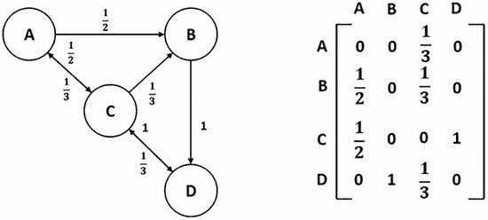

图 19.4 如果 `M` 是邻接矩阵，那么 `M / M.sum(axis=0)` 等于过渡矩阵，即使邻接关系是定向的。此图显示了一个有向图。边用过渡概率标记。这些概率也显示在等于 `M / M.sum(axis=0)` 的矩阵中。矩阵中的每一列都是一个概率之和为 1.0 的过渡向量。根据矩阵，从 A 到 C 的旅行概率是 `1/2`，从 C 到 A 的旅行概率是 `1/3`。

列表 19.11 计算过渡矩阵

```
transition_matrix = adjacency_matrix / adjacency_matrix.sum(axis=0)
assert np.array_equal(transition_vector, transition_matrix[:,0])
```

我们的过渡矩阵有一个迷人的特性：它允许我们仅用几行代码就计算到每个城镇的旅行概率！如果我们想知道在 10 次停留后最终停留在城镇 *i* 的概率，我们只需做以下操作：

1.  初始化一个向量 `v`，其中 `v` 等于 `np.ones(31) / 31`。

1.  将 `v` 更新为 `transition_matrix @ v`，迭代 10 次。

1.  返回 `v[i]`。

之后，我们将从头推导这个惊人的特性。现在，让我们通过矩阵乘法计算前往城镇 12 和 3 的旅行概率来证明我们的论断。根据我们之前的观察，我们预计这些概率将等于 0.051 和 0.047。

列表 19.12 使用过渡矩阵计算旅行概率

```
v = np.ones(31) / 31
for _ in range(10):
    v = transition_matrix @ v

for i in [12, 3]:
    print(f"The probability of winding up in Town {i} is {v[i]:.3f}.")

The probability of winding up in Town 12 is 0.051.
The probability of winding up in Town 3 is 0.047.
```

我们的预期得到了证实。

我们可以使用一系列矩阵乘法来模拟交通流量。这些乘法是 *PageRank 中心性* 的基础，这是历史上最有利可图的节点重要性度量。PageRank 中心性是由 Google 的创始人发明的；他们使用它通过将用户的在线旅程建模为一系列通过互联网图进行随机点击来对网页进行排名。这些页面点击类似于一辆在随机选择的城镇中行驶的车。更受欢迎的网页有更高的访问可能性。这一洞察使 Google 能够以完全自动化的方式发现相关网站。因此，Google 能够超越其竞争对手，成为一家价值万亿美元的公司。有时，数据科学可以带来丰厚的回报。

PageRank 中心性容易计算但不容易推导。尽管如此，借助基本的概率理论，我们可以证明为什么重复的 `transition_matrix` 乘法直接产生旅行概率。

注意：如果您对 PageRank 中心性的推导不感兴趣，请跳到下一小节。它描述了 NetworkX 中 PageRank 的使用。

### 19.2.1 从概率论推导 PageRank 中心性

我们知道 `transition_matrix[i][j]` 等于从城镇 *j* 直接旅行到城镇 *i* 的概率，但这假设我们的车实际上位于城镇 *j*。如果车的位置不确定怎么办？例如，如果只有 50% 的可能性车位于城镇 *j*，在这种情况下，旅行概率等于 `0.5 * transition_matrix[i][j]`。一般来说，如果我们当前的位置概率是 `p`，那么从当前位置 `j` 到新位置 `i` 的旅行概率等于 `p * transition_matrix[i][j]`。

假设一辆车从一个随机的城镇开始旅行，并前往下一个城镇。这辆车从城镇 3 旅行到城镇 0 的概率是多少？嗯，车可以从 31 个不同的城镇中的任何一个开始旅行，所以从城镇 3 开始旅行的概率是 `1 / 31`。因此，从城镇 3 旅行到城镇 0 的概率是 `transition_matrix[0][3] / 31`。

列表 19.13 从随机起始位置计算旅行可能性

```
prob = transition_matrix[0][3] / 31
print("Probability of starting in Town 3 and driving to Town 0 is "
      f"{prob:.2}")

Probability of starting in Town 3 and driving to Town 0 is 0.004
```

从随机起始位置直接到达城镇 0 有多种方式。让我们打印出每个可能的城镇 *i* 的 `transition_matrix[0][i] / 31` 的所有非零实例。

列表 19.14 计算通向城镇 0 的随机路线的旅行可能性

```
for i in range(31):
    prob = transition_matrix[0][i] / 31
    if not prob:
        continue

    print(f"Probability of starting in Town {i} and driving to Town 0 is "
          f"{prob:.2}")

print("\nAll remaining transition probabilities are 0.0")

Probability of starting in Town 3 and driving to Town 0 is 0.004
Probability of starting in Town 4 and driving to Town 0 is 0.0054
Probability of starting in Town 6 and driving to Town 0 is 0.0065
Probability of starting in Town 7 and driving to Town 0 is 0.0046
Probability of starting in Town 13 and driving to Town 0 is 0.0054

All remaining transition probabilities are 0.0
```

五条不同的路线通向城镇 0。每条路线有不同的概率，这些概率的总和等于从任何随机城镇出发直接到达城镇 0 的可能性（图 19.5）。我们现在将计算这个可能性。此外，我们将将其与随机模拟的结果进行比较。我们通过执行 `random_drive(num_stops=1)` 50,000 次来运行模拟，这会产生在随机旅程中城镇 0 作为第一次停靠出现的频率。我们预计这个频率将近似于我们的概率总和。

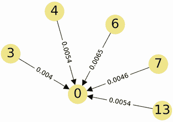

图 19.5 五条不同的路线直接从随机初始城镇到达城镇 0。每条路线都分配了一个小概率。将这些值相加得到从随机城镇出发直接到达城镇 0 的概率。

列表 19.15 计算第一次停靠在城镇 0 的概率

```
np.random.seed(0)
prob = sum(transition_matrix[0][i] / 31 for i in range(31))
frequency = np.mean([random_drive(num_stops=1) == 0
                     for _ in range(50000)])

print(f"Probability of making our first stop in Town 0: {prob:.3f}")
print(f"Frequency with which our first stop is Town 0: {frequency:.3f}")

Probability of making our first stop in Town 0: 0.026
Frequency with which our first stop is Town 0: 0.026
```

我们计算的概率与观察到的频率一致：我们的旅程第一次停靠在城镇 0 大约是 2.6%。值得注意的是，这个概率可以更简洁地计算为一个向量点积操作——我们只需要运行 `transition_matrix[0] @ v`，其中 `v` 是一个包含 31 个元素的向量，其元素都等于 `1 / 31`。让我们执行这个计算快捷方式。

列表 19.16 使用向量点积计算旅行概率

```
v = np.ones(31) / 31
assert transition_matrix[0] @ v == prob
```

执行 `transition_matrix[i] @ v` 返回在城镇 *i* 停靠第一次的可能性。我们可以通过运行 `[transition_matrix[i] @ v for i in range(31)]` 来计算每个城镇的可能性。当然，这个操作等同于 `transition_matrix` 和 `v` 的矩阵乘积，所以 `transition_matrix @ v` 返回所有第一次停靠的概率。列表 19.17 计算了 `stop_1_probabilities` 数组，并打印了在城镇 12 停靠第一次的概率。这个概率应该近似于通过随机模拟计算出的频率。

列表 19.17 计算所有第一次停靠概率

```
np.random.seed(0)
stop_1_probabilities = transition_matrix @ v
prob = stop_1_probabilities[12]
frequency = np.mean([random_drive(num_stops=1) == 12
                     for _ in range(50000)])

print('First stop probabilities:')
print(np.round(stop_1_probabilities, 3))
print(f"\nProbability of making our first stop in Town 12: {prob:.3f}")
print(f"Frequency with which our first stop is Town 12: {frequency:.3f}")

First stop probabilities:
[0.026 0.033 0.045 0.046 0.033 0.019 0.025 0.038 0.033 0.031 0.019 0.041
 0.052 0.03  0.036 0.019 0.031 0.039 0.023 0.031 0.027 0.019 0.018 0.044
 0.038 0.046 0.015 0.045 0.04  0.035 0.023]

Probability of making our first stop in Town 12: 0.052
Frequency with which our first stop is Town 12: 0.052
```

我们已经证明 `transition_matrix @ v` 返回一个第一次停靠概率的向量。现在我们需要证明迭代重复这个操作最终会得到一个第十次停靠概率的向量。然而，首先让我们回答一个更简单的问题：在城镇 *i* 停靠第二次的概率是多少？根据我们之前的讨论，我们知道以下内容：

+   在城镇 *j* 停靠第一次的概率等于 `stop_1_probabilities[j]`。

+   如果当前位置的概率是 `p`，那么从当前位置 `j` 到新位置 `i` 的旅行概率等于 `p * transition_matrix[i][j]`。

+   因此，第一次停靠在城镇 *j* 然后前往城镇 *i* 的概率是 `p * transition_matrix[i][j]`，其中 `p = stop_1_probabilities[j]`。

+   我们可以计算每个可能的城镇 *j* 的旅行概率。

+   这些概率的总和等于在随机城镇进行第一次停留然后直接前往城镇 *i* 的可能性。总和等于 `sum(p * transition_matrix[i][j] for j, p in enumerate(stop_1_probabilities))`。

+   我们可以将这个似然性更简洁地表示为向量点积操作。该操作等于 `transition_matrix[i] @ stop_1_probabilities`。

在城镇 *i* 进行第二次停留的概率等于 `transition_matrix[i] @ stop_1_probabilities`。我们可以通过矩阵-向量积计算每个城镇的这种可能性。因此，`transition_matrix @ stop_1_probabilities` 返回所有第二次停留的概率。然而，`stop_1_probabilities` 等于 `transition_matrix @ v`，因此第二次停留的概率也等于 `transition_matrix @ transition_matrix @ v`。

让我们通过获取第二次停留的概率来确认我们的计算。然后我们打印在城镇 12 进行第二次停留的概率，这应该近似于通过随机模拟计算出的频率。

列表 19.18 计算所有第二次停留的概率

```
np.random.seed(0)
stop_2_probabilities = transition_matrix @ transition_matrix @ v
prob = stop_2_probabilities[12]
frequency = np.mean([random_drive(num_stops=2) == 12
                     for _ in range(50000)])

print('Second stop probabilities:')
print(np.round(stop_2_probabilities, 3))
print(f"\nProbability of making our second stop in Town 12: {prob:.3f}")
print(f"Frequency with which our second stop is Town 12: {frequency:.3f}")

Second stop probabilities:
[0.027 0.033 0.038 0.043 0.033 0.023 0.028 0.039 0.039 0.026 0.021 0.032
 0.048 0.034 0.039 0.023 0.032 0.041 0.023 0.029 0.025 0.024 0.023 0.04
 0.029 0.043 0.021 0.036 0.036 0.042 0.031]

Probability of making our second stop in Town 12: 0.048
Frequency with which our second stop is Town 12: 0.048
```

我们能够直接从第一次停留的概率推导出第二次停留的概率。类似地，我们可以推导出第三次停留的概率。如果我们重复推导，我们可以很容易地证明 `stop_3_probabilities` 等于 `transition_matrix @ stop_2_probabilities`。当然，这个向量也等于 `M @ M @ M @ v`，其中 `M` 是转换矩阵。

我们可以重复这个过程来计算第四次停留的概率，然后是第五次停留的概率，最终是第 *N* 次停留的概率。要计算第 *N* 次停留的概率，我们只需要在 *N* 次迭代中执行 `M @ v`。让我们定义一个函数，该函数可以直接从转换矩阵 `M` 计算所有第 *N* 次停留的概率。

注意：我们处理的是一个由 *N* 个不同步骤组成的随机过程，其中第 *N* 步的概率可以直接从第 *N* - 1 步计算得出。这样的过程被称为 *马尔可夫链*，以数学家安德烈·马尔可夫的名字命名。

列表 19.19 计算第 *N* 次停留的概率

```
def compute_stop_likelihoods(M, num_stops):
    v = np.ones(M.shape[0]) / M.shape[0]
    for _ in range(num_stops):
        v = M @ v

    return v

stop_10_probabilities = compute_stop_likelihoods(transition_matrix, 10)
prob = stop_10_probabilities[12]
print('Tenth stop probabilities:')
print(np.round(stop_10_probabilities, 3))
print(f"\nProbability of making our tenth stop in Town 12: {prob:.3f}")

Tenth stop probabilities:
[0.029 0.035 0.041 0.047 0.035 0.023 0.029 0.041 0.034 0.021 0.014 0.028
 0.051 0.038 0.044 0.025 0.037 0.045 0.02  0.026 0.02  0.02  0.019 0.039
 0.026 0.047 0.02  0.04  0.04  0.04  0.027]

Probability of making our tenth stop in Town 12: 0.051
```

正如我们之前讨论的，我们的迭代矩阵乘法是 PageRank 中心性的基础。在下一个小节中，我们将比较我们的输出与 NetworkX 的 PageRank 实现。这种比较将使我们更深入地了解 PageRank 算法。

### 19.2.2 使用 NetworkX 计算 PageRank 中心性

NetworkX 中包含一个用于计算 PageRank 中心性的函数。调用 `nx.pagerank(G)` 返回一个字典，将节点 ID 映射到它们的中心性值。让我们打印城镇 12 的 PageRank 中心性。它是否等于 0.051？

列表 19.20 使用 NetworkX 计算 PageRank 中心性

```
centrality = nx.pagerank(G)[12]
print(f"The PageRank centrality of Town 12 is {centrality:.3f}.")

The PageRank centrality of Town 12 is 0.048.
```

打印的 PageRank 值是 0.048，略低于预期。这种差异是由于一个细微的调整，确保 PageRank 可以在所有可能的网络上工作。提醒一下：PageRank 最初旨在通过网页链接图模拟随机点击。网页链接图有有向边，这意味着某些网页可能没有任何出站链接。因此，如果用户依赖出站链接来浏览网络，他们可能会卡在死胡同页面（图 19.6）。为了解决这个问题，PageRank 的设计者假设用户最终会厌倦点击网页链接，并通过访问一个完全随机的网页来重新开始他们的旅程——换句话说，他们会通过互联网图中的`len(G.nodes)`个节点之一进行传送。PageRank 的设计者将传送编程为在 15%的横跨实例中发生。传送确保用户永远不会被困在没有出站链接的节点上。

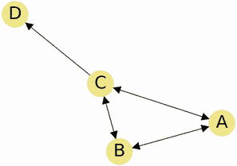

图 19.6 包含四个节点的有向图。我们可以自由地在相互连接的节点 A、B 和 C 之间旅行，但节点 D 没有出站边。迟早，随机遍历会带我们从 C 到 D。然后我们将永远被困在节点 D 上。传送防止这种情况发生。在我们的 15%的遍历中，我们将传送到一个随机选择的节点。即使我们到达节点 D，我们仍然可以传送回节点 A、B 和 C。

在我们的道路网络示例中，传送类似于呼叫直升机服务。想象一下，在我们的 15%的城镇访问中，我们对当地地区感到厌烦。然后我们呼叫直升机，它飞来并将我们带到完全随机的城镇。一旦在空中，我们飞往任何城镇的概率都是 1 / 31。我们着陆后，我们租一辆车，继续使用现有的道路网络继续我们的旅程。因此，15%的时间内，我们以 1 / 31 的概率从城镇*i*飞到城镇*j*。在剩余的 85%的情况下，我们以`transition_matrix[j][i]`的概率从城镇*i*开车到城镇*j*。因此，实际的旅行概率等于`transition_matrix[j][i]`和 1 / 31 的加权平均值。相应的权重是 0.85 和 0.15。如第五部分所述，我们可以使用`np.average`函数计算加权平均值。我们也可以通过运行`0.85 * transition_matrix[j][i] + 0.15 / 31`直接计算那个平均值。

对转换矩阵的所有元素取加权平均值将产生一个新的转换矩阵。让我们将这个新矩阵输入到我们的`compute_stop_likelihoods`函数中，并打印城镇 12 的新旅行概率。我们预计这个概率将从 0.051 下降到 0.048。

列表 19.21 将随机传送引入我们的模型

```
new_matrix = 0.85 * transition_matrix + 0.15 / 31                  ❶
stop_10_probabilities = compute_stop_likelihoods(new_matrix, 10)

prob = stop_10_probabilities[12]
print(f"The probability of winding up in Town 12 is {prob:.3f}.")

The probability of winding up in Town 12 is 0.048.
```

❶ 将 transition_matrix 乘以 0.85，然后向每个元素添加 0.15 / 31。参见第十三部分，了解更多关于 2D NumPy 数组上的算术运算的讨论。

我们的新输出与 NetworkX 的结果一致。如果我们把停止次数从 10 增加到 1,000，输出还会保持一致吗？让我们找出答案。我们将输入 1,000 个停止点到 `compute_stop_likelihoods` 中，并检查城镇 12 的 PageRank 是否仍然等于 0.048。

列表 19.22 计算 1,000 次停止后的概率

```
prob = compute_stop_likelihoods(new_matrix, 1000)[12]
print(f"The probability of winding up in Town 12 is {prob:.3f}.")

The probability of winding up in Town 12 is 0.048.
```

中心性仍然是 0.048。10 次迭代足以收敛到一个稳定的值。为什么是这样呢？好吧，我们的 PageRank 计算不过是矩阵和向量的重复乘法。乘积向量的元素都是介于 0 和 1 之间的值。也许这听起来很熟悉：我们的 PageRank 计算几乎与我们在第十四部分中介绍的幂迭代算法相同。幂迭代反复取矩阵和向量的乘积；最终，乘积收敛到矩阵的特征向量。作为提醒，矩阵 `M` 的特征向量 `v` 是一个特殊的向量，其中 `norm(v) == norm(M @ v)`。通常，10 次迭代就足以实现收敛。因此，我们的 PageRank 值收敛是因为我们在运行幂迭代！这证明了我们的中心性向量是转移矩阵的特征向量。因此，PageRank 中心性与降维背后的美丽数学不可分割地联系在一起。

对于任何图 `G`，我们通过以下一系列步骤计算其 PageRank 中心性：

1.  获取图的邻接矩阵 `M`。

1.  通过运行 `M = M / M.sum(axis=0)` 将邻接矩阵转换为转移矩阵。

1.  更新 `M` 以允许随机跳跃。这是通过取 `M` 和 `1 / n` 的加权平均来完成的，其中 `n` 等于图中的节点数。权重通常设置为 0.85 和 0.15，因此加权平均等于 `0.85 * M + 0.15 / n`。

1.  返回矩阵 `M` 的最大（且仅有一个）特征向量。我们可以通过运行 `v = M @ v` 大约 10 次迭代来计算特征向量。初始时，向量 `v` 被设置为 `np.ones(n) / n`。

马尔可夫矩阵将图论与概率论和矩阵论联系在一起。它们还可以通过称为 *马尔可夫聚类* 的程序来聚类网络数据。在下一小节中，我们将利用马尔可夫矩阵来聚类图中的社区。

常见的 NetworkX 中心性计算

+   `G.in_degree(i)`—返回有向图中节点 `i` 的入度

+   `G.degree(i)`—返回无向图中节点 `i` 的度

+   `nx.pagerank(G)`—返回一个字典，将节点 ID 映射到它们的 PageRank 中心性

## 19.3 使用马尔可夫聚类进行社区检测

图 `G` 表示一个城镇网络，其中一些城镇属于本地县。目前，我们知道县 ID，但如果我们不知道呢？我们将如何识别县？让我们通过可视化 `G` 而不进行任何形式的颜色映射来思考这个问题（图 19.7）。

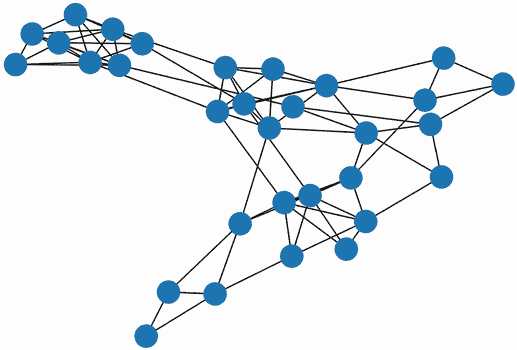

图 19.7 不同城镇之间的道路网络。城镇没有根据其县区着色。但我们在网络中仍然可以识别出某些县区：它们以空间聚集的团块形式出现。

列表 19.23 不基于县区着色的 `G` 绘图

```
np.random.seed(1)
nx.draw(G)
plt.show()
```

我们绘制的图既没有颜色也没有标签。尽管如此，我们仍然可以识别出潜在的县区：它们在网络中看起来像是紧密连接的节点簇。在图论中，这样的簇正式被称为 *社区*。具有明显可见社区的图包含 *社区结构*。许多类型的图都包含社区结构，包括城镇图和社交媒体朋友的图。

注意：一些常见的图不包含社区结构。例如，互联网缺少紧密聚集的网页社区。

揭示图社区的过程被称为 *社区检测* 或 *图聚类*。存在多种图聚类算法，其中一些依赖于交通流量的模拟。

我们如何利用交通来揭示网络中县区的聚类？嗯，我们知道同一国家的城镇比不同县区的城镇更有可能共享道路，所以如果我们开车去邻近的城镇，我们很可能会留在同一个县。在具有社区结构的图中，即使我们开车穿越两个城镇，这个逻辑也是成立的。例如，假设我们开车从城镇 *i* 到城镇 *j*，然后再到城镇 *k*。根据我们的网络结构，城镇 *i* 和 *k* 更有可能位于同一个县。我们很快就会证实这个说法；然而，首先我们需要计算从城镇 *i* 到城镇 *k* 经过两站后的转换概率。这个概率被称为 *随机流量* 或简称为 *流量*。流量与转换概率密切相关；但与转换概率不同，流量覆盖了没有直接连接的城镇。我们需要计算每对城镇之间的流量，并将该输出存储在 *流量矩阵* 中。稍后，我们将展示平均流量在共享同一社区城镇中更高。

注意：一般来说，在网络理论中，流量是一个定义非常宽泛的概念。但在马尔可夫聚类中，这个定义被限制在节点之间最终旅行的概率。

我们如何计算流量值的矩阵？一种策略是在随机城镇之间模拟一次两站旅程。然后可以将模拟的频率转换为概率。然而，直接计算这些概率要容易得多。通过一点数学，我们可以证明流量矩阵等于 `transition_matrix @ transition_matrix`。

注意：我们可以如下证明这个陈述。之前，我们证明了第二站概率等于 `transition_matrix @ transition_matrix @ v`。此外，`transition_matrix @ transition_matrix` 产生一个新的矩阵，`M`。因此，第二站概率等于 `M @ v`。本质上，`M` 执行与 `transition_matrix` 相同的功能，但它跟踪两个站点而不是一个；因此 `M` 符合我们对于流矩阵的定义。

基本上，随机模拟近似了转换矩阵与其自身的乘积。在继续之前，让我们快速验证一下。

列表 19.24 比较计算流量与随机模拟

```
np.random.seed(0)
flow_matrix = transition_matrix @ transition_matrix

simulated_flow_matrix = np.zeros((31, 31))
num_simulations = 10000
for town_i in range(31):
    for _ in range(num_simulations):
        town_j = np.random.choice(G[town_i])
        town_k = np.random.choice(G[town_j])
        simulated_flow_matrix[town_k][town_i] += 1                  ❶

simulated_flow_matrix /= num_simulations
assert np.allclose(flow_matrix, simulated_flow_matrix, atol=1e-2)   ❷
```

❶ 跟踪两次停留后从城镇 i 到城镇 k 的频率

❷ 确保我们的模拟频率与直接计算的流量非常相似

我们的 `flow_matrix` 与随机模拟结果一致。现在，让我们测试我们的理论，即同一县内的城镇之间的流量更高。提醒一下，`G.nodes` 中的每个城镇都已被分配了一个县 ID。我们相信，如果 `G.nodes[i]['county_id']` 等于 `G.nodes[j]['county_id']`，那么城镇 *i* 和 *j* 之间的平均流量会更高。我们可以通过将所有流量分为两个列表来确认：`county_flows` 和 `between_county_flows`。这两个列表分别跟踪县内流量和县间流量。我们将为每个列表绘制直方图并比较它们的平均流量值（图 19.8）。如果我们正确，那么 `np.mean(county_flows)` 应该明显高于第二个列表的平均流量。我们还将检查是否有任何县间流量明确小于 `np.min(county_flows)`。

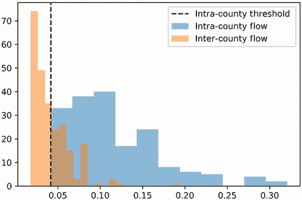

图 19.8 表示所有非零县间流量和县内流量的两个直方图。流量类型之间的分离非常明显。县间流量强烈偏向左侧：大约 0.042 的阈值足以将 132 个县间流量从县内流量分布中分离出来。

注意，为了进行公平的比较，我们应该只考虑非零流量。因此，如果 `flow_matrix[j][i]` 有零值，我们必须跳过 `flow_matrix[j][i]`。零值意味着仅用两次停留从 `i` 到 `j` 是不可能的（这种情况发生的概率为零）。至少需要三次停留，这表明城镇相距很远。这实际上保证了它们位于不同的县。因此，包含零流量将不公平地使我们的县间值分布偏向零。让我们挑战自己，只检查那些城镇之间的流量，这些城镇地理位置相近。

列表 19.25 比较县内和县间流量分布

```
def compare_flow_distributions():
    county_flows = []                                         ❶
    between_county_flows = []                                 ❷
    for i in range(31):
        county = G.nodes[i]['county_id']
        nonzero_indices = np.nonzero(flow_matrix[:,i])[0]     ❸
        for j in nonzero_indices:
            flow = flow_matrix[j][i]

            if county == G.nodes[j]['county_id']:             ❹
                county_flows.append(flow)
            else:
                between_county_flows.append(flow)

    mean_intra_flow = np.mean(county_flows)
    mean_inter_flow = np.mean(between_county_flows)
    print(f"Mean flow within a county: {mean_intra_flow:.3f}")
    print(f"Mean flow between different counties: {mean_inter_flow:.3f}")

    threshold = min(county_flows)
    num_below = len([flow for flow in between_county_flows
                     if flow < threshold])                    ❺
    print(f"The minimum intra-county flow is approximately {threshold:.3f}")
    print(f"{num_below} inter-county flows fall below that threshold.")

    plt.hist(county_flows, bins='auto',  alpha=0.5,
             label='Intra-County Flow')                       ❻
    plt.hist(between_county_flows,  bins='auto', alpha=0.5,
             label='Inter-County Flow')                       ❼
    plt.axvline(threshold, linestyle='--', color='k',
                label='Intra-County Threshold')
    plt.legend()
    plt.show()

compare_flow_distributions()

Mean flow within a county: 0.116
Mean flow between different counties: 0.042
The minimum intra-county flow is approximately 0.042
132 inter-county flows fall below that threshold.
```

❶ 跟踪两次停留后从城镇 i 到城镇 k 的非零县内流量

❷ 跟踪非零县间流量

❸ 我们只遍历列 i 中的非零行。

❹ 检查两个城镇是否位于同一县

❺ 跟踪所有低于最小县内流量的县间流量

❻ 县内流量的直方图

❼ 县际流量的直方图

县际间的平均流量是不同县镇间平均流量的三分之一。这种差异在绘制的分布图中清晰可见：低于约 0.04 阈值的流量保证代表县际值。因此，我们可以使用显式的阈值截止来隔离县际镇。当然，我们之所以能够观察到这个阈值，是因为我们事先知道了县的身份。在现实世界的场景中，实际的县 ID 是未知的，因此分离截止无法明确确定。我们被迫假设截止值是一个低值，比如 0.01。假设我们用我们的数据做出了这个假设。有多少非零县际流量小于 0.01？让我们来看看。

列表 19.26 降低分离阈值

```
num_below = np.count_nonzero((flow_matrix > 0.0) & (flow_matrix < 0.01))
print(f"{num_below} inter-county flows fall below a threshold of 0.01")

0 inter-county flows fall below a threshold of 0.01
```

没有流量值低于严格的 0.01 阈值。我们应该怎么办？一个选择是操纵流量分布来夸大大小值之间的差异。理想情况下，我们将迫使小值低于 0.01，同时确保较大的流量不会降低。这种操纵可以通过一个简单的过程来实现，称为*通货膨胀*。通货膨胀的目的是影响向量的值，同时保持其平均值不变。低于平均值的值会下降，而剩余的值会增加。我们将通过一个简单的例子来演示通货膨胀。假设我们正在膨胀一个向量`v`，其等于`[0.7, 0.3]`。`v`的平均值是 0.5。我们希望增加`v[0]`同时减少`v[1]`。一个部分解决方案是通过运行`v ** 2`对`v`的每个元素进行平方。这样做将`v[1]`从 0.3 降低到 0.09。不幸的是，它也将`v[0]`从 0.7 降低到 0.49，因此`v[0]`低于原始向量的平均值。我们可以通过将平方向量除以其和来减轻下降，从而产生一个膨胀向量`v2`，其和为 1。因此，`v2.mean()`等于`v.mean()`。此外，`v2[0]`大于`v[0]`，而`v2[1]`小于`v[1]`。让我们来确认。

列表 19.27 通过向量通货膨胀夸大值差异

```
v = np.array([0.7, 0.3])
v2 = v ** 2
v2 /= v2.sum()
assert v.mean() == round(v2.mean(), 10)
assert v2[0] > v[0]
assert v2[1] < v[1]
```

与向量`v`一样，我们的流量矩阵的列也是元素之和为 1 的向量。我们可以通过平方其元素然后除以下一个列和来膨胀每一列。让我们为此定义一个`inflate`函数。然后我们将膨胀流量矩阵，并重新运行`compare_flow_distributions()`来检查我们的县际阈值是否降低（图 19.9）。

列表 19.28 通过向量通货膨胀夸大流量差异

```
def inflate(matrix):
    matrix = matrix ** 2
    return matrix / matrix.sum(axis=0)

flow_matrix = inflate(flow_matrix)
compare_flow_distributions()

Mean flow within a county: 0.146
Mean flow between different counties: 0.020
The minimum intra-county flow is approximately 0.012
118 inter-county flows fall below that threshold.
```


图 19.9 展示了所有非零县际流量和县内流量在通货膨胀后的两个直方图。流量的分离变得更加明显：通货膨胀将分离阈值从 0.042 降低到 0.012。

膨胀后，我们的阈值从 0.042 降低到了 0.012，但仍然高于 0.01。我们如何进一步放大县际和县内边之间的差异？答案是出人意料的简单，尽管其推理并不立即明显：我们只需要将`flow_matrix`与自身相乘，然后膨胀结果。换句话说，将流量矩阵设置为等于`inflate (flow_matrix @ flow_matrix)`将导致阈值急剧下降。在讨论阈值下降背后的直观原因之前，让我们验证这个说法（图 19.10）。

列表 19.29 膨胀`flow_matrix`的乘积

```
flow_matrix = inflate(flow_matrix @ flow_matrix)      ❶
compare_flow_distributions()

Mean flow within a county: 0.159
Mean flow between different counties: 0.004
The minimum intra-county flow is approximately 0.001
541 inter-county flows fall below that threshold.
```

❶ 在这一步之前，流量矩阵等于 inflate(transition_matrix @ transition_matrix)。我们实际上是在重复一个矩阵乘法，然后将其与膨胀相结合。

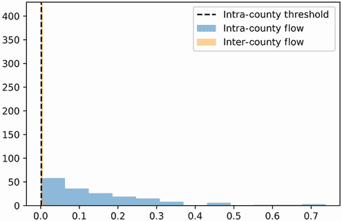

图 19.10 展示了在将`flow_matrix @ flow_matrix`进行膨胀后，所有非零的县际流量和县内流量的两个直方图。现在，大部分的县际流量都低于非常小的分离阈值 0.001。

阈值降低到了 0.001。超过 500 条县际道路低于这个阈值。我们的策略为什么成功？我们可以用一个简单的类比来回答。假设我们可以在城镇之间建设新的道路，但所有建设的道路都需要进行一些年度维护。维护不当的道路会发展出裂缝和裂缝。驾驶员会更不愿意走上一条损坏的道路，因此定期的维修非常重要。然而，在我们的类比中，没有足够的资金来同时修复`G`中所有现有的道路并建设新的道路。一个地方交通局被赋予了决定

+   哪些新的道路被建设

+   哪些现有的道路得到了维护

+   哪些现有的道路被忽略

局部做出以下假设：流量大的城镇对需要更好的交通基础设施。因此，只有当`flow_matrix[i][j]`或`flow_matrix[j][i]`值高时，城镇*i*和*j*之间才会维护道路。如果`flow_matrix[i][j]`值高但*i*和*j*之间没有道路，那么资源将被分配以直接连接城镇*i*和*j*。

注释：如果存在多条短途绕行，一对非相邻城镇之间仍然会有高流量。在这对城镇之间建设一条道路是有意义的，因为这样做可以缓解绕行的交通。

很遗憾，并非所有现有的道路都会得到维护。较少使用的县际道路流量较低，不会引起局部的注意。因此，这些道路将部分退化，驾驶员之间穿越县份的可能性会降低。相反，驾驶员会更倾向于选择维护良好的县内道路，以及城镇之间新建的道路。

注意：作为提醒，我们假设司机随机旅行，没有特定的目的地。他们的漫无目的的驾驶完全由道路条件的质量决定。

道路建设、维护和退化不可避免地会改变我们的转移矩阵。低流量道路的退化之间的转移概率将下降。同时，维护良好的高流量道路之间的转移概率将增加。我们需要以某种方式模拟矩阵的变化，同时确保矩阵的列仍然总和为 1。如何做？当然是通过通货膨胀！我们的`通货膨胀`函数放大矩阵中值的差异，同时保持列总和为 1。因此，我们将通过更新我们的转移矩阵`M`等于`通货膨胀(flow_matrix)`来模拟局部的决策结果。

但故事还没有结束。通过改变转移矩阵，我们也改变了图中的流量。流量等于`M @ M`，其中`M`是通货膨胀后的流量矩阵。当然，这种变化将改变局部资源分配：在新的道路建设和退化一轮之后，转移概率将等于`通货膨胀(M @ M)`。我们可以将迭代道路工作的影响建模为`M = 通货膨胀(M @ M)`。请注意，在当前版本的代码中，`M`被设置为`flow_matrix`。因此，运行`flow_matrix = 通货膨胀(flow_matrix @ flow_matrix)`将加强常走的道路，即使不太受欢迎的道路正在枯萎（图 19.11）。

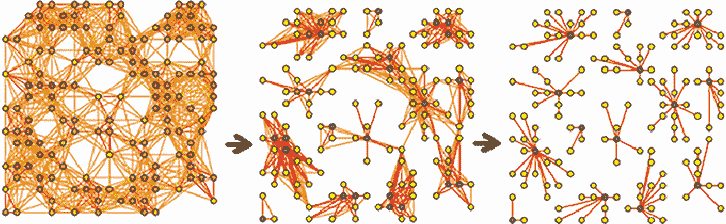

图 19.11 使用通货膨胀模拟道路图的变化。紧密相连的城镇之间的道路得到加强。同时，资源被从交通较少的道路上转移，这导致这些道路退化。最终，只有图中的社区内的道路仍然存在。

这个迭代反馈循环有出乎意料的后果：每年，县际道路的状况都会越来越差。结果，更多的司机选择留在他们所在县的边界内。更多的资源被分配到内部县道路，而县际道路得到的支持减少，进一步崩溃。这是一个恶性循环——最终，县际道路将化为尘土，从县到县的旅行将不再可能。每个单独的县将变成一个完全与邻居隔绝的孤立岛屿。这种隔离导致糟糕的交通政策，但它极大地简化了社区检测的过程。一个孤立的城镇集群很容易检测，因为它与其他集群没有边界。因此，我们的道路建设与退化模型成为网络聚类算法的基础：*马尔可夫聚类算法*（MCL），也称为*马尔可夫聚类*。

MCL 通过多次重复迭代运行 `inflate(flow_matrix @ flow_matrix)` 来执行。随着每次迭代的进行，跨县流量会越来越小；最终它们会降至零。与此同时，内县流量保持正值。这种二进制差异使我们能够识别紧密连接的县集群。列表 19.30 尝试通过在 20 次迭代中运行 `flow_matrix = inflate (flow_matrix @ flow_matrix)` 来执行 MCL。

列表 19.30 重复使用自身膨胀 `flow_matrix` 的乘积

```
for _ in range(20):
    flow_matrix = inflate(flow_matrix @ flow_matrix)
```

根据我们的讨论，图 `G` 中的某些边现在应该有零流量。我们预计这些边将连接分叉县。让我们隔离可疑的跨县边。我们通过调用 `G.edges()` 方法遍历每个边 `(i, j)`。然后我们跟踪每个边 `(i, j)`，其中流量不存在，并将所有跟踪到的边按 `suspected_inter_county` 边列表排序。

列表 19.31 选择可疑跨县边

```
suspected_inter_county = [(i, j) for (i, j) in G.edges()
                         if not (flow_matrix[i][j] or flow_matrix[j][i])]
num_suspected = len(suspected_inter_county)
print(f"We suspect {num_suspected} edges of appearing between counties.")

We suspect 57 edges of appearing between counties.
```

57 条边没有任何流量。我们怀疑这些边连接着分叉县之间的城镇。从我们的图中删除这些可疑边应该切断所有跨县连接，因此如果我们在删除边后可视化图，应该只剩下集群县。让我们通过从我们图的副本（图 19.12）中删除可疑边来验证这一点。我们使用 NetworkX 的 `remove_edge_from` 方法来删除 `suspected_inter_county` 列表中的所有边。

列表 19.32 删除可疑跨县边

```
np.random.seed(1)
G_copy = G.copy()        ❶
G_copy.remove_edges_from(suspected_inter_county)
nx.draw(G_copy, with_labels=True, node_color=node_colors)
plt.show()
```

❶ 调用 G.copy() 返回图 G 的副本。我们可以在副本中删除边，同时保留原始图中的边。

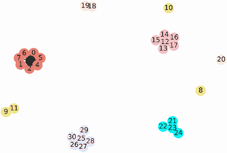

图 19.12 删除所有可疑跨县边后的城镇网络。所有县之间都已完全隔离。六个县中有四个已完全保留，但剩下的两个县不再完全相连。

所有跨县边都已消除。不幸的是，一些关键的内县边也被删除了。城镇 8、10 和 20 现在不再与其他城镇相连。我们的算法过于激进。为什么会出现这种情况？问题源于我们模型的一个小错误：它假设旅行者可以开车去邻近的城镇，但不允许旅行者停留在当前位置。这产生了意外的后果。

我们将用一个简单的双节点网络来说明。想象一下，一条单独的道路连接着 A 镇和 B 镇。在我们的当前模型中，A 镇的司机除了去 B 镇别无选择。但司机不能停留：他们必须掉头回到 A 镇。两个城镇之间不存在两站点的路径，尽管它们是相连的。因此，城镇之间的流量将等于零，连接它们的道路将被消除。当然，这种情况是荒谬的——我们应该给司机一个留在 B 镇的选择。怎么办？一个解决方案是从 B 镇到 B 镇添加一条边。这条边就像一条环路，带你回到你的当前位置（图 19.13）。换句话说，这条边是一个自环。向图中添加自环将限制意外的模型行为。列表 19.33 展示了在简单的双节点邻接矩阵中自环的影响。

列表 19.33 通过添加自环改进流量

```
def compute_flow(adjacency_matrix):
    transaction_matrix = adjacency_matrix / adjacency_matrix.sum(axis=0)
    return (transaction_matrix @ transaction_matrix)[1][0]

M1 = np.array([[0, 1], [1, 0]])
M2 = np.array([[1, 1], [1, 1]])
flow1, flow2 = [compute_flow(M) for M in [M1, M2]]
print(f"The flow from A to B without self-loops is {flow1}")
print(f"The flow from A to B with self-loops is {flow2}")

The flow from A to B without self-loops is 0.0
The flow from A to B with self-loops is 0.5
```

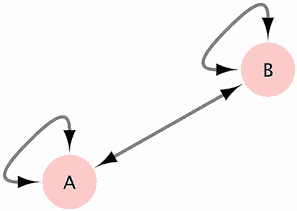


向图 `G` 添加自环应限制不适当的边删除。我们可以通过为 `G.nodes` 中的每个 `i` 运行 `G.add_edge(i, i)` 来添加这些环。考虑到这一点，现在让我们定义一个 `run_mcl` 函数，该函数通过执行以下步骤在输入的图上运行 MCL：

1.  向图中每个节点添加一个自环。

1.  通过将邻接矩阵除以其列和来计算图的转移矩阵。

1.  从 `transition_matrix @ transition_matrix` 计算流量矩阵。

1.  在 20 次迭代过程中将 `flow_matrix` 设置为等于 `inflate(flow_matrix @ flow_matrix)`。

1.  删除图中所有没有流量的边。

在定义了 `run_mcl` 之后，我们在图 `G` 的副本上执行该函数。绘制的输出应保留所有相关的县内边，同时删除社区之间的所有边（图 19.14）。

列表 19.34 定义 MCL 函数

```
def run_mcl(G):
    for i in G.nodes:
        G.add_edge(i, i)      ❶

    adjacency_matrix = nx.to_numpy_array(G)
    transition_matrix = adjacency_matrix / adjacency_matrix.sum(axis=0)
    flow_matrix = inflate(transition_matrix @ transition_matrix)

    for _ in range(20):
        flow_matrix = inflate(flow_matrix @ flow_matrix)

    G.remove_edges_from([(i, j) for i, j in G.edges()
                        if not (flow_matrix[i][j] or flow_matrix[j][i])])

G_copy = G.copy()
run_mcl(G_copy)
nx.draw(G_copy, with_labels=True, node_color=node_colors)
plt.show()
```

❶ 为图中每个节点添加自环

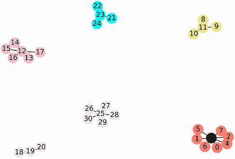


我们将图完美地聚类成六个隐蔽的县。每个县内的城镇之间可以互相访问，同时与外界保持隔离。在图论中，这样的孤立集群被称为*连通分量*：如果两个节点之间存在路径，则它们属于同一个连通分量。否则，节点存在于不同的分量（因此存在于不同的社区）。要计算一个节点的完整分量，只需在该节点上运行`nx.shortest_path_length`即可。最短路径长度算法仅返回那些在聚类社区内可访问的节点。以下代码使用`nx.shortest_path_length`计算所有从城镇 0 可访问的城镇，并确认所有这些城镇共享相同的县 ID。

列表 19.35 使用路径长度揭示县集群

```
component = nx.shortest_path_length(G_copy, source=0).keys()
county_id = G.nodes[0]['county_id']
for i in component:
    assert G.nodes[i]['county_id'] == county_id

print(f"The following towns are found in County {county_id}:")
print(sorted(component))

The following towns are found in County 0:
[0, 1, 2, 3, 4, 5, 6, 7]
```

通过对最短路径长度算法进行轻微修改，我们可以提取图的连通分量。为了简洁起见，我们不会讨论这些修改，但鼓励你自己尝试解决这些问题。这个修改后的分量算法已集成到 NetworkX 中：调用`nx.connected_components(G)`返回`G`中所有连通分量的可迭代对象。每个连通分量存储为节点 ID 的集合。让我们利用这个函数输出所有县集群。

列表 19.36 提取所有聚类连通分量

```
for component in nx.connected_components(G_copy):
    county_id = G.nodes[list(component)[0]]['county_id']
    print(f"\nThe following towns are found in County {county_id}:")
    print(component)

The following towns are found in County 0:
{0, 1, 2, 3, 4, 5, 6, 7}

The following towns are found in County 1:
{8, 9, 10, 11}

The following towns are found in County 2:
{12, 13, 14, 15, 16, 17}

The following towns are found in County 3:
{18, 19, 20}

The following towns are found in County 4:
{24, 21, 22, 23}

The following towns are found in County 5:
{25, 26, 27, 28, 29, 30}
```

常见的网络矩阵计算

+   `adjaceny_matrix = nx.to_numpy_array(G)`—返回图的邻接矩阵。

+   `degrees = adjaceny_matrix.sum(axis=0)`—使用邻接矩阵计算度向量。

+   `transition_matrix = adjacency_matrix / degrees`—计算图的转移矩阵。

+   `stop_1_probabilities = transition_matrix @ v`—计算在每个节点处第一次停下的概率。在这里，我们假设`v`是一个具有等可能起始概率的向量。

+   `stop_2_probabilities = transition_matrix @ stop_1_probabilities`—计算在每个节点处第二次停下的概率。

+   `transition_matrix @ stop_n_probabilities`—返回在每个节点处进行*N* + 1 次停下的概率。

+   `flow_matrix = transition_matrix @ transition_matrix`—计算在两次停留中从`i`到`j`的转移概率矩阵。

+   `(flow_matrix ** 2) / (flow_matrix ** 2).sum(axis=0)`—在流量矩阵中膨胀流量。

我们已经成功使用很少的代码揭示了图中的社区。不幸的是，我们的 MCL 实现无法扩展到非常大的网络。需要进一步的优化才能成功扩展；这些优化已集成到外部马尔可夫聚类库中。让我们安装库并从已安装的`markov_clustering`模块导入两个函数：`get_clusters`和`run_mcl`。

注意：从命令行终端调用`pip install markov_clustering`以安装马尔可夫聚类库。

列表 19.37 从马尔可夫聚类库导入

```
from markov_clustering import get_clusters, run_mcl
```

给定一个邻接矩阵 `M`，我们可以通过运行 `get_clusters(run_mcl(M))` 来高效地执行马尔可夫聚类。嵌套函数调用返回一个 `clusters` 列表。`clusters` 中的每个元素都是一个节点元组，这些节点形成一个聚类社区。让我们在我们的原始图 `G` 上执行这个聚类。输出的聚类应该与 `G_copy` 中的连通分量保持一致。

列表 19.38 使用马尔可夫聚类库进行聚类

```
adjacency_matrix = nx.to_numpy_array(G)
clusters = get_clusters(run_mcl(adjacency_matrix))

for cluster in clusters:
    county_id = G.nodes[cluster[0]]['county_id']
    print(f"\nThe following towns are found in County {county_id}:")
    print(cluster)

The following towns are found in County 0:
(0, 1, 2, 3, 4, 5, 6, 7)

The following towns are found in County 1:
(8, 9, 10, 11)

The following towns are found in County 2:
(12, 13, 14, 15, 16, 17)

The following towns are found in County 3:
(18, 19, 20)

The following towns are found in County 4:
(21, 22, 23, 24)

The following towns are found in County 5:
(25, 26, 27, 28, 29, 30)
```

通过马尔可夫聚类，我们可以在社区结构图中检测社区。当我们搜索社交网络中的朋友群体时，这将非常有用。

## 19.4 在社交网络中揭示朋友群体

我们可以将许多过程表示为网络，包括人与人之间的关系。在这些 *社交网络* 中，节点代表个人。如果两个人在社会上有某种互动，则它们之间存在边。例如，如果两个人是朋友，我们可以通过边连接他们。

可能存在许多不同类型的社交网络。有些网络是数字化的：例如，FriendHook 的服务是围绕在线连接构建的。然而，在社交媒体兴起之前，社交网络已经被研究了数十年。最被研究的社会网络之一起源于 20 世纪 70 年代：*Zachery 的空手道俱乐部*，这是由一位名叫 Wayne Zachery 的科学家根据一所大学空手道俱乐部的社交结构记录下来的。在三年时间里，Zachery 跟踪了俱乐部 34 名成员之间的友谊。边被分配来追踪在俱乐部外频繁聚会的朋友。三年后，发生了一些意想不到的事情：一位名叫 Mr. Hi 的空手道教练离开了，去创立他自己的新俱乐部，一半的空手道俱乐部成员随他而去。让 Zachery 意外的是，大多数离开的成员仅从网络结构中就可以被识别出来。

我们现在将重复 Zachery 的实验。首先，我们将加载他著名的空手道网络，该网络可通过 NetworkX 获得。调用 `nx.karate_club_graph()` 返回该图。以下代码打印出图节点及其属性。作为提醒，我们可以通过调用 `G.nodes(data=True)` 来输出带有属性的节点。

列表 19.39 加载空手道俱乐部图

```
G_karate = nx.karate_club_graph()
print(G_karate.nodes(data=True))

[(0, {'club': 'Mr. Hi'}), (1, {'club': 'Mr. Hi'}), (2, {'club': 'Mr. Hi'}),
(3, {'club': 'Mr. Hi'}), (4, {'club': 'Mr. Hi'}), (5, {'club': 'Mr. Hi'}),
(6, {'club': 'Mr. Hi'}), (7, {'club': 'Mr. Hi'}), (8, {'club': 'Mr. Hi'}),
(9, {'club': 'Officer'}), (10, {'club': 'Mr. Hi'}), (11, {'club':
'Mr. Hi'}), (12, {'club': 'Mr. Hi'}), (13, {'club': 'Mr. Hi'}), (14,
{'club': 'Officer'}), (15, {'club': 'Officer'}), (16, {'club': 'Mr. Hi'}),
(17, {'club': 'Mr. Hi'}), (18, {'club': 'Officer'}), (19, {'club':
'Mr. Hi'}), (20, {'club': 'Officer'}), (21, {'club': 'Mr. Hi'}), (22,
{'club': 'Officer'}), (23, {'club': 'Officer'}), (24, {'club':
'Officer'}), (25, {'club': 'Officer'}), (26, {'club': 'Officer'}), (27,
{'club': 'Officer'}), (28, {'club': 'Officer'}), (29, {'club': 'Officer'}),
(30, {'club': 'Officer'}), (31, {'club': 'Officer'}), (32, {'club':
'Officer'}), (33, {'club': 'Officer'})]
```

我们跟踪 34 个人。如果一个人加入了 Mr. Hi 的新俱乐部，则每个节点都有一个设置为 `Mr. Hi` 的 `club` 属性；否则设置为 `Officer`。让我们可视化这个网络：我们根据 `club` 属性类型给每个节点着色（图 19.15）。

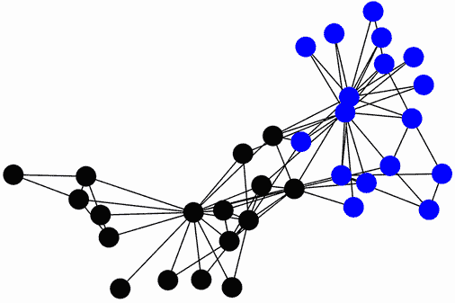

图 19.15 可视化的空手道俱乐部图。节点颜色对应于俱乐部的分裂。这些颜色与图的社区结构重叠。

列表 19.40 可视化空手道俱乐部图

```
np.random.seed(2)
club_to_color = {'Mr. Hi': 'k', 'Officer': 'b'}
node_colors = [club_to_color[G_karate.nodes[i]['club']]
               for i in G_karate]

nx.draw(G_karate, node_color=node_colors)
plt.show()
```

空手道俱乐部图具有清晰的社区结构。这并不令人惊讶；许多社交网络都包含可检测的社区。在这种情况下，社区对应于俱乐部的分裂：图表左侧的黑色簇代表离开加入希先生的那部分俱乐部成员，右侧的簇代表留下来的学生。这些簇代表了在多年中形成的友谊群体。当发生分裂时，大多数成员只是跟随他们偏好的朋友群体。

我们能否自动提取这些友谊簇？我们可以尝试使用 MCL。首先，我们在图的邻接矩阵上运行算法，并打印出所有生成的簇。

列表 19.41 对空手道俱乐部图进行聚类

```
adjacency_matrix = nx.to_numpy_array(G_karate)
clusters = get_clusters(run_mcl(adjacency_matrix))
for i, cluster in enumerate(clusters):
    print(f"Cluster {i}:\n{cluster}\n")

Cluster 0:
(0, 1, 3, 4, 5, 6, 7, 10, 11, 12, 13, 16, 17, 19, 21)

Cluster 1:
(2, 8, 9, 14, 15, 18, 20, 22, 23, 24, 25, 26, 27, 28, 29, 30, 31, 32, 33)
```

如预期，输出了两个簇。我们现在重新绘制图表，同时根据簇 ID 着色每个节点（图 19.16）。

列表 19.42 根据簇着色绘制的图表

```
np.random.seed(2)
cluster_0, cluster_1 = clusters
node_colors = ['k' if i in cluster_0 else 'b'
               for i in G_karate.nodes]

nx.draw(G_karate, node_color=node_colors)
plt.show()
```

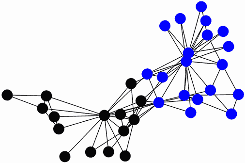

图 19.16 可视化的空手道俱乐部图。节点颜色对应社区簇。这些颜色与俱乐部最终的分裂重叠。

我们生成的簇几乎与两个分裂的俱乐部相同。MCL 成功地从社交网络中提取了友谊群体，因此该算法在追求我们的案例研究解决方案时应该会很有用。在我们的案例研究中，我们被要求分析一个数字社交网络。提取现有的友谊群体可能对分析非常有价值。当然，在一个大型网络中，组数将大于两个——我们可以预期会遇到一打（或许更多）的友谊簇。我们还可能想要在图中可视化这些簇。手动为十几个簇分配颜色是一项繁琐的任务，因此我们希望自动生成簇颜色。在 NetworkX 中，我们可以如下自动化颜色分配：

1.  通过在每个节点上添加一个`cluster_id`属性，创建每个节点与其簇 ID 之间的映射。

1.  将`node_colors`中的每个元素设置为等于簇 ID，而不是颜色。这可以通过运行`[G.nodes[n]['cluster_id'] for n in G.nodes]`来完成，其中`G`是聚类社交图。

1.  将`cmap=plt.cm.tab20`传递给`nx.draw`，以及数字`node_colors`列表。`cmap`参数为每个簇 ID 分配颜色映射。`plt.cm.tab20`代表生成该映射的颜色调色板；我们之前已经使用颜色调色板映射来生成热图（见第八部分详情）。

让我们执行这些步骤来自动着色我们的簇（图 19.17）。

列表 19.43 自动着色社交图簇

```
np.random.seed(2)
for cluster_id, node_indices in enumerate(clusters):
    for i in node_indices:
        G_karate.nodes[i]['cluster_id'] = cluster_id                     ❶

node_colors = [G_karate.nodes[n]['cluster_id'] for n in G_karate.nodes]  ❷
nx.draw(G_karate, node_color=node_colors, cmap=plt.cm.tab20)             ❸
plt.show()
```

❶ 为每个节点分配簇 ID

❷ 将节点颜色映射到数字簇 ID

❸ 使用 plt.cm.tab20 颜色调色板为每个簇 ID 分配颜色映射

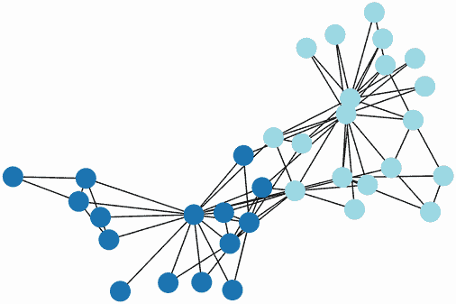

图 19.17 可视化的空手道俱乐部图。节点颜色对应社区簇。这些颜色是自动生成的。

我们已经完成了对图论的深入研究。在下一节中，我们将利用我们新获得的知识来推导一个简单基于图的预测算法。

## 摘要

+   在无向图中，节点的边数简单地称为节点的*度*。我们可以通过计算图的邻接矩阵的列的和来计算每个节点的度。

+   在图论中，任何衡量节点重要性的度量通常称为*节点中心性*。基于节点度的排名重要性称为*中心度*。

+   有时，中心度的大小不足以衡量节点的重要性。我们可以通过在网络中模拟随机流量来更好地推导中心度。流量可以被转换成随机到达特定节点的概率。

+   流量概率可以直接从图的*转移矩阵*中计算得出。转移矩阵跟踪从节点`i`随机旅行到节点`j`的可能性。重复将转移矩阵与概率向量相乘会产生一个最终端点可能性的向量。较高的可能性对应于更中心的节点。这种中心性度量称为*PageRank 中心性*；从数学上讲，它等于转移矩阵的特征向量。

+   某些图在可视化时显示出紧密连接的集群。这些节点集群被称为*社区*。具有明显可见社区的图被称为包含*社区结构*。在图中揭示社区的过程称为*社区检测*。

+   我们可以使用*马尔可夫聚类算法*（MCL）来检测社区。此算法要求我们计算一个*随机流量*，这是一个多站过渡概率。通过将转移矩阵与其自身相乘产生流量矩阵。较低的流量值更有可能与社区间的边相对应。这种低流量值和高流量值之间的差异可以通过*膨胀*进一步放大。通过迭代重复矩阵乘法和膨胀，社区间的流量会降至零。然后，删除零流量边可以完全隔离图中的社区。这些隔离的组件可以通过最短路径长度算法的变体来识别。

+   在*社交网络*中，边代表人与人之间的关系。社交网络通常包含社区结构，因此我们可以使用 MCL 来检测这些网络中朋友的集群。
