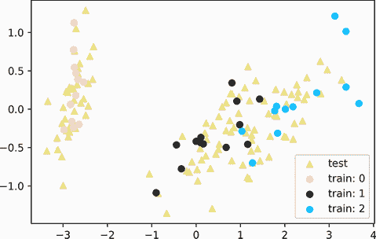
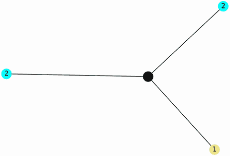
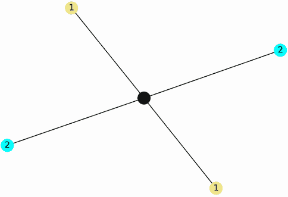
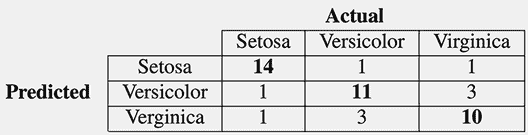
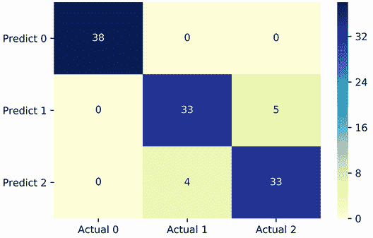
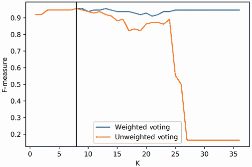

# 20 网络驱动的监督机器学习

本节涵盖

+   在监督机器学习中使用分类器

+   基于相似性进行简单预测

+   评估预测质量的标准

+   scikit-learn 中的常见监督学习方法

人们可以从现实世界的观察中学习。在某种程度上，机器也可以做到同样的事情。通过精心挑选的经验来隐喻性地让计算机理解世界，这被称为*监督机器学习*。近年来，监督机器学习一直备受关注：计算机被训练来预测股价、诊断疾病，甚至驾驶汽车。这些进步被正确地誉为尖端创新。然而，在某些方面，这些创新背后的算法并不那么新颖。现有的机器学习技术的变体已经存在了几十年；但由于计算能力的限制，这些技术无法得到充分的应用。只有现在，我们的计算能力才赶上了。因此，多年前种下的想法终于结出了显著技术进步的果实。

在本节中，我们探讨了一种最古老且最简单的监督学习技术。这个算法被称为 K 近邻算法，最早由美国空军在 1951 年开发。它根植于网络理论，可以追溯到中世纪学者阿尔哈森的发现。尽管这个算法历史悠久，但其应用与更现代的技术有很多共同之处。因此，我们将获得的见解可以转移到更广泛的监督机器学习领域。

## 20.1 监督机器学习的基本原理

监督机器学习用于自动化某些任务，这些任务原本由人类完成。机器观察人类执行任务，然后学习复制观察到的行为。我们将使用第十四部分中引入的花卉数据集来说明这种学习。作为提醒，该数据集代表三种不同的鸢尾花物种，如图 20.1 所示。从视觉上看，这三种物种看起来很相似；植物学家使用叶片长度和宽度上的细微差异来区分物种。那种专业知识必须学习——没有经过训练，任何人类或机器都无法区分这些物种。


图 20.1 三种鸢尾花物种：*Setosa*、*Versicolor*和*Virginica*。这些物种看起来都很相似。它们叶片上的细微差异可以用来区分物种，但需要训练才能适当地识别不同的物种。

假设一位植物学教授对当地牧场的生态进行了分析。牧场上生长着数百种鸢尾植物，教授希望了解这些植物中鸢尾物种的分布情况。然而，教授正忙于撰写拨款申请，没有时间亲自检查所有花朵。因此，教授雇佣了一位助手来检查牧场上的花朵。不幸的是，这位助手不是植物学家，缺乏区分物种的技能。相反，助手选择仔细测量每朵花的叶片长度和宽度。这些测量能否用于自动识别所有物种？这个问题正是监督学习的核心。

实际上，我们希望构建一个模型，将输入的测量值映射到三种物种类别之一。在机器学习中，这些输入的测量值被称为*特征*，输出的类别被称为*类别*。监督学习的目标是构建一个模型，可以根据特征识别类别。这样的模型被称为*分类器*。

注意：根据定义，类别是离散的、分类变量，如花的物种或汽车类型。另一种模型称为*回归器*，它预测数值变量，如房屋价格或汽车速度。

机器学习中有许多不同类型的分类器。整本书都是专门用来区分各种分类器类别的。尽管它们种类繁多，但大多数分类器在构建和实施时都需要相同的共同步骤。要实现一个分类器，我们需要做以下事情：

1.  计算每个数据点的特征。在我们的植物学示例中，所有数据点都是花朵，因此我们需要测量每朵花的叶片长度。

1.  领域专家必须对数据点的一个子集分配标签。我们的植物学家别无选择，只能手动识别一部分花朵中的物种。没有教授的监督，分类器无法正确构建。*监督学习*这个术语就是从这个监督标签阶段来的。标记花朵的子集需要花费时间，但一旦分类器能够进行自动预测，这些努力就会得到回报。

1.  向分类器展示特征组合和手动标记的类别。然后它尝试学习特征与类别之间的关联。这个学习阶段因分类器而异。

1.  向分类器展示一组它之前未曾遇到的特征。然后它尝试根据其接触到的标记数据预测相关的类别。

为了构建一个分类器，我们的植物学家需要一组已识别花朵的特征。每朵花被分配以下四个特征（在 14 节中已讨论过）：

+   支持花瓣的有色花瓣的长度

+   支持花瓣的有色花瓣的宽度

+   支持花瓣的绿色叶片的长度

+   支持花瓣的绿色叶片的宽度

我们可以将这些特征存储在一个特征矩阵中。每个矩阵列对应于四个特征之一，每个矩阵行对应于一个标记的花朵。类别标签存储在一个 NumPy 数组中。这样的数组旨在存储数字而不是文本；因此，在机器学习中，类别标签表示为从 0 到*N* - 1（其中*N*是类别总数）的整数。在我们的鸢尾花示例中，我们处理三种物种，因此类别标签的范围是从 0 到 2。

如第十四部分所示，我们可以使用 scikit-learn 的`load_iris`函数加载已知的鸢尾花特征和类别标签。现在让我们这样做。按照现有的 scikit-learn 约定，特征矩阵通常分配给一个名为`X`的变量，类别标签数组分配给一个名为`y`的变量。遵循这一约定，以下代码通过将`return_X_y=True`传递给`load_iris`来加载鸢尾花的`X`和`y`。

列表 20.1 加载鸢尾花特征和类别标签

```
from sklearn.datasets import load_iris
X, y = load_iris(return_X_y=True)
num_classes = len(set(y))
print(f"We have {y.size} labeled examples across the following "
      f"{num_classes} classes:\n{set(y)}\n")
print(f"First four feature rows:\n{X[:4]}")
print(f"\nFirst four labels:\n{y[:4]}")

We have 150 labeled examples across the following 3 classes:
{0, 1, 2}

First four feature rows:
[[5.1 3.5 1.4 0.2]
 [4.9 3\.  1.4 0.2]
 [4.7 3.2 1.3 0.2]
 [4.6 3.1 1.5 0.2]]

First four labels:
[0 0 0 0]
```

所有 150 朵花的测量值都已标记为属于三种花卉物种之一。这种标记工作很辛苦。想象一下，我们的植物学家只有时间标记四分之一的花朵。然后教授构建了一个分类器来预测剩余花朵的类别。让我们模拟这个场景。我们首先选择`X`和`y`中的前四分之一数据点。这个数据切片被称为`X_train`和`y_train`，因为它用于训练目的；这样的数据集被称为*训练集*。在采样我们的训练集之后，我们调查`y_train`的内容。

列表 20.2 创建训练集

```
sampling_size = int(y.size / 4)
X_train, y_train = X[:sampling_size], y[:sampling_size]
print(f"Training set labels:\n{y_train}")

Training set labels:
[0 0 0 0 0 0 0 0 0 0 0 0 0 0 0 0 0 0 0 0 0 0 0 0 0 0 0 0 0 0 0 0 0 0 0 0 0]
```

我们的训练集仅包含标记为物种 0 的示例；其他两种花卉物种没有代表。为了增加代表性，我们应该从`X`和`y`中进行随机采样。随机采样可以通过使用 scikit-learn 的`train_test_split`函数实现，该函数接受`X`和`y`作为输入，并返回四个随机生成的输出。前两个输出是`X_train`和`y_train`，对应我们的训练集。接下来的两个输出涵盖了训练集之外的特征和类别。这些输出可以在训练后用于测试分类器，因此这些数据通常被称为*测试集*。我们将测试特征和类别分别称为`X_test`和`y_test`。在本节的后面部分，我们使用测试集来评估我们的训练模型。

列表 20.3 调用了`train_test_split`函数，并传递了一个可选的`train_size=0.25`参数。`train_size`参数确保我们总数据的 25%最终进入训练集。最后，我们打印`y_train`以确保所有三个标签都得到了适当的表示。

列表 20.3 通过随机采样创建训练集

```
from sklearn.model_selection import train_test_split
import numpy as np
np.random.seed(0)
X_train, X_test, y_train, y_test = train_test_split(X, y, train_size=0.25)
print(f"Training set labels:\n{y_train}")

Training set labels:
[0 2 1 2 1 0 2 0 2 0 0 2 0 2 1 1 1 2 2 1 1 0 1 2 2 0 1 1 1 1 0 0 0 2 1 2 0]
```

训练数据中包含所有三个标签类别。我们如何利用 `X_train` 和 `y_train` 来预测测试集中剩余花朵的类别？一种简单的策略涉及几何邻近性。正如我们在第十四部分中看到的，鸢尾花数据集中的特征可以在多维空间中绘制。这些绘制的数据形成空间簇：`X_test` 中的元素更有可能与相邻簇中找到的 `X_train` 点共享它们的类别。

让我们通过在 2D 空间中绘制 `X_train` 和 `X_test` 来说明这种直觉（图 20.2）。我们使用主成分分析将我们的数据缩小到两个维度，然后绘制我们的训练集中的降维特征，并根据每个绘制点的标记类别着色。我们还使用三角形标记绘制我们的测试集元素，以表示没有标签。然后我们根据未标记点与标记数据的接近程度猜测未标记点的身份。



图 20.2 在 2D 空间中绘制的花朵数据点。每个标记的花朵根据其物种类别着色。图中也存在未标记的花朵。从视觉上，我们可以根据它们与标记点的接近程度来猜测未标记花朵的身份。

列表 20.4 绘制训练集和测试集

```
import matplotlib.pyplot as plt
from sklearn.decomposition import PCA

pca_model = PCA()
transformed_data_2D = pca_model.fit_transform(X_train)

unlabeled_data = pca_model.transform(X_test)
plt.scatter(unlabeled_data[:,0], unlabeled_data[:,1],
            color='khaki', marker='^', label='test')

for label in range(3):
    data_subset = transformed_data_2D[y_train == label]
    plt.scatter(data_subset[:,0], data_subset[:,1],
            color=['r', 'k', 'b'][label], label=f'train: {label}')

plt.legend()
plt.show()
```

在我们图表的左侧部分，许多未标记的点围绕着物种 0 聚集。这里没有歧义：这些未标记的花朵显然属于同一物种。在图表的其他地方，某些未标记的花朵与物种 1 和物种 2 都很接近。对于这样的每个点，我们需要量化哪些标记的物种更接近。这样做需要我们跟踪 `X_test` 中每个特征与 `X_train` 中每个特征之间的欧几里得距离。本质上，我们需要一个距离矩阵 `M`，其中 `M[i][j]` 等于 `X_test[i]` 和 `X_test[j]` 之间的欧几里得距离。这样的矩阵可以很容易地使用 scikit-learn 的 `euclidean_distances` 函数生成。我们只需执行 `euclidean_distances(X_test, X_train)` 来返回距离矩阵。

列表 20.5 计算点之间的欧几里得距离

```
from sklearn.metrics.pairwise import euclidean_distances
distance_matrix = euclidean_distances(X_test, X_train)

f_train, f_test = X_test[0], X[0]
distance = distance_matrix[0][0]
print(f"Our first test set feature is {f_train}")
print(f"Our first training set feature is {f_test}")
print(f"The Euclidean distance between the features is {distance:.2f}")

Our first test set feature is [5.8 2.8 5.1 2.4]
Our first training set feature is [5.1 3.5 1.4 0.2]
The Euclidean distance between the features is 4.18
```

对于 `X_test` 中的任何未标记点，我们可以使用以下策略分配一个类别：

1.  根据它们到未标记点的距离对训练集中的所有数据点进行排序。

1.  选择点的 *K* 个最近邻。目前，我们将 *K* 随意设置为 3。

1.  选择在 *K* 个邻近点中最常出现的类别。

实际上，我们假设每个未标记点与其邻居共享一个类别，这个类别是它们的共同类别。这种策略是 *K-最近邻*（KNN）算法的基础。让我们在一个随机选择的点上尝试这种策略。

列表 20.6 基于最近邻标记一个点

```
from collections import Counter
np.random.seed(6)
random_index = np.random.randint(y_test.size)
labeled_distances = distance_matrix[random_index]
labeled_neighbors = np.argsort(labeled_distances)[:3]
labels = y_train[labeled_neighbors]

top_label, count = Counter(labels).most_common()[0]
print(f"The 3 nearest neighbors of Point {random_index} have the "
      f"following labels:\n{labels}")
print(f"\nThe most common class label is {top_label}. It occurs {count} "
       "times.")

The 3 nearest neighbors of Point 10 have the following labels:
[2 1 2]

The most common class label is 2\. It occurs 2 times.
```

点 10 的邻居中最常见的类别标签是标签 2。这与花朵的实际类别相比如何？

列表 20.7 检查预测标签的真实类别

```
true_label = y_test[random_index]
print(f"The true class of Point {random_index} is {true_label}.")

The true class of Point 10 is 2.
```

KNN 成功识别了点 10 的花卉类别。我们所需做的只是检查标签邻居并计算其中最常见的标签。有趣的是，这个过程可以被重新表述为一个图论问题。我们可以将每个点视为一个节点，其标签作为节点属性，然后选择一个未标记的点并扩展边到其最近的 K 个标记邻居。可视化邻居图可以帮助我们识别该点。

注意：这种类型的图结构被称为*K-最近邻图*（k-NNG）。这类图在许多领域都有应用，包括交通规划、图像压缩和机器人技术。此外，这些图还可以用来改进 DBSCAN 聚类算法。

让我们通过绘制点 10 的邻居图（图 20.3）来展示问题的网络公式。我们利用 NetworkX 进行可视化。



图 20.3 一个表示未标记点和其三个最近标记邻居的 NetworkX 图。其中三个邻居中有两个被标记为类别 2。因此，我们可以假设未标记的点也属于那个多数类别。

列表 20.8 使用 NetworkX 可视化最近邻

```
import networkx as nx
np.random.seed(0)

def generate_neighbor_graph(unlabeled_index, labeled_neighbors):          ❶
    G = nx.Graph()
    nodes = [(i, {'label': y_train[i]}) for i in labeled_neighbors]       ❷
    nodes.append((unlabeled_index, {'label': 'U'}))
    G.add_nodes_from(nodes)
    G.add_edges_from([(i, unlabeled_index) for i in labeled_neighbors])
    labels = y_train[labeled_neighbors]
    label_colors = ['pink', 'khaki', 'cyan']
    colors = [label_colors[y_train[i]] for i in labeled_neighbors] + ['k']❸
    labels = {i: G.nodes[i]['label'] for i in G.nodes}
    nx.draw(G, node_color=colors, labels=labels, with_labels=True)
    plt.show()
    return G

G = generate_neighbor_graph(random_index, labeled_neighbors)
```

❶ 绘制并返回一个包含未标记数据点和该点的标记最近邻之间连接的 NetworkX 图

❷ 获取最近邻的标签

❸ 根据标签为标记邻居着色

当只有三个邻居时，KNN 可以工作。如果我们增加邻居数量到四个会发生什么？让我们找出答案（图 20.4）



图 20.4 一个表示未标记点和其四个最近标记邻居的 NetworkX 图。其中两个邻居被标记为类别 2，其余两个邻居属于类别 1。没有多数类别存在。因此，我们无法识别未标记的点

列表 20.9 增加最近邻的数量

```
np.random.seed(0)
labeled_neighbors = np.argsort(labeled_distances)[:4]
G = generate_neighbor_graph(random_index, labeled_neighbors)
```

出现平局！没有标签主导多数。我们无法做出决定。我们该怎么办？一个选择是随机打破平局。一个更好的方法是考虑到标签点的距离。距离点 10 更近的标签点更有可能共享正确的类别。因此，我们应该给予更近的点更多的权重，但如何操作呢？

好吧，在我们最初的 KNN 实现中，每个标记点都得到了平等的投票，就像在一个公平的民主中一样。现在我们想要根据距离来权衡每个投票。一个简单的权衡方案是给每个标记点`1 / distance`票：距离一个单位的点将得到一票，距离 0.5 单位的点将得到两票，距离两个单位的点将得到半票。这并不构成公平的政治，但它可能会改善我们算法的输出。

以下代码将每个标记点的投票量分配为其与点 10 的倒数距离相等。然后我们让标记点根据它们的类别进行投票。我们利用累计的投票来为我们的点 10 选择一个当选的类别。

列表 20.10 根据距离权衡邻居的投票

```
from collections import defaultdict
class_to_votes = defaultdict(int)
for node in G.neighbors(random_index):
    label = G.nodes[node]['label']
    distance = distance_matrix[random_index][node]
    num_votes = 1 / distance
    print(f"A data point with a label of {label} is {distance:.2f} units "
          f"away. It receives {num_votes:.2f} votes.")
    class_to_votes[label] += num_votes

print()
for class_label, votes in class_to_votes.items():
    print(f"We counted {votes:.2f} votes for class {class_label}.")

top_class = max(class_to_votes.items(), key=lambda x: x[1])[0]
print(f"Class {top_class} has received the plurality of the votes.")

A data point with a label of 2 is 0.54 units away. It receives 1.86 votes.
A data point with a label of 1 is 0.74 units away. It receives 1.35 votes.
A data point with a label of 2 is 0.77 units away. It receives 1.29 votes.
A data point with a label of 1 is 0.98 units away. It receives 1.02 votes.

We counted 3.15 votes for class 2.
We counted 2.36 votes for class 1.
Class 2 has received the plurality of the votes.
```

我们再次正确地将类别 2 选为点 10 的真实类别。可选的加权投票可能会提高我们的最终预测。当然，这种改进并不保证；有时加权投票可能会使输出结果变得更糟。根据我们预设的*K*值，加权投票可能会改善或恶化我们的预测。我们只有在测试一系列参数的预测性能后才能确定。这种测试需要我们开发一个健壮的指标来衡量性能准确性。

## 20.2 测量预测标签的准确性

到目前为止，我们已经检查了一个随机选择的点的类别预测。现在我们想要分析`X_test`中所有点的预测。为此，我们定义了一个`predict`函数，它接受一个未标记点的索引和一个预设的*K*值，我们预设为 1。

注意 我们故意输入一个低值的*K*来生成许多值得改进的错误。稍后，我们将测量多个*K*值的错误以优化性能。

最后一个参数是一个`weighted_voting`布尔值，我们将其设置为`False`。这个布尔值确定投票是否应根据距离分布。

列表 20.11 参数化 KNN 预测

```
def predict(index, K=1, weighted_voting=False):                           ❶
    labeled_distances = distance_matrix[index]
    labeled_neighbors = np.argsort(labeled_distances)[:K]                 ❷
    class_to_votes = defaultdict(int)
    for neighbor in labeled_neighbors:
        label = y_train[neighbor]
        distance = distance_matrix[index][neighbor]
        num_votes = 1 / max(distance, 1e-10) if weighted_voting else 1    ❸
        class_to_votes[label] += num_votes
    return max(class_to_votes, key=lambda x: class_to_votes[x])           ❹

assert predict(random_index, K=3) == 2
assert predict(random_index, K=4, weighted_voting=True) == 2
```

❶ 使用点在距离矩阵中的行索引根据其 K 最近邻预测点的标签。`weighted_voting`布尔值确定投票是否根据邻居距离加权。

❷ 获取 K 最近邻

❸ 如果`weighted_voting`为 False，则平等地权衡投票，否则根据距离的倒数进行权衡。我们在计算倒数时采取预防措施，以避免除以零。

❹ 返回获得最多投票的类别标签

让我们在所有未标记的索引上执行`predict`。遵循常见的命名约定，我们将预测的类别存储在一个名为`y_pred`的数组中。

列表 20.12 预测所有未标记的花类

```
y_pred = np.array([predict(i) for i in range(y_test.size)])
```

我们想要将预测的类别与实际类别在`y_test`中进行比较。让我们先打印出`y_pred`和`y_test`数组。

列表 20.13 比较预测和实际类别

```
print(f"Predicted Classes:\n{y_pred}")
print(f"\nActual Classes:\n{y_test}")

Predicted Classes:
[2 1 0 2 0 2 0 1 1 1 2 1 1 1 2 0 2 1 0 0 2 1 0 0 2 0 0 1 1 0 2 1 0 2 2 1 0
 2 1 1 2 0 2 0 0 1 2 2 1 2 1 2 1 1 1 1 1 1 1 2 1 0 2 1 1 1 2 2 0 0 2 1 0 0
 1 0 2 1 0 1 2 1 0 2 2 2 2 0 0 2 2 0 2 0 2 2 0 0 2 0 0 0 1 2 2 0 0 0 1 1 0
 0 1]

Actual Classes:
[2 1 0 2 0 2 0 1 1 1 2 1 1 1 1 0 1 1 0 0 2 1 0 0 2 0 0 1 1 0 2 1 0 2 2 1 0
 1 1 1 2 0 2 0 0 1 2 2 2 2 1 2 1 1 2 2 2 2 1 2 1 0 2 1 1 1 1 2 0 0 2 1 0 0
 1 0 2 1 0 1 2 1 0 2 2 2 2 0 0 2 2 0 2 0 2 2 0 0 2 0 0 0 1 2 2 0 0 0 1 1 0
 0 1]
```

比较打印出的两个数组很困难。如果我们将这些数组聚合到一个包含三行三列的单个矩阵`M`中，比较会更容易，这个矩阵对应于类别的数量。行跟踪预测类别，列跟踪真实类别的标识。每个元素`M[i][j]`计算预测类别*i*和实际类别*j*之间的共现次数，如图 20.5 所示。



图 20.5 预测类别和实际类别的假设矩阵表示。行对应于预测类别，列对应于实际类别。每个元素 `M[i][j]` 计算预测类别 *i* 和实际类别 *j* 之间的共现次数。因此，矩阵的对角线计算所有准确预测。

这种矩阵表示法被称为 *混淆矩阵* 或 *误差矩阵*。正如我们很快将看到的，混淆矩阵可以帮助量化预测误差。我们现在使用 `y_pred` 和 `y_test` 计算混淆矩阵，并使用 Seaborn 将矩阵可视化为热图（图 20.6）。



图 20.6 比较预测结果和实际结果的混淆矩阵。行对应于预测类别，列对应于实际类别。矩阵元素计算预测类别和实际类别之间的所有对应实例。矩阵的对角线计算所有准确预测。我们的大多数计数都沿着矩阵的对角线，这表明我们的模型非常准确。

列表 20.14 计算混淆矩阵

```
import seaborn as sns
def compute_confusion_matrix(y_pred, y_test):           ❶
    num_classes = len(set(y_pred) | set(y_test))        ❷
    confusion_matrix = np.zeros((num_classes, num_classes))
    for prediction, actual in zip(y_pred, y_test):
        confusion_matrix[prediction][actual] += 1       ❸

    return confusion_matrix

M = compute_confusion_matrix(y_pred, y_test)
sns.heatmap(M, annot=True, cmap='YlGnBu',
            yticklabels=[f"Predict {i}" for i in range(3)],
            xticklabels = [f"Actual {i}" for i in range(3)])
plt.yticks(rotation=0)
plt.show()
```

❶ 计算 y_pred 和 y_test 之间的混淆矩阵

❷ 检查类别的总数。此值定义了矩阵的行数和列数。

❸ 每个预测类别预测与实际类别实际对应。对于每一对这样的类别，我们在矩阵的预测行和实际列中添加一个 1。注意，如果预测 == 实际，则添加的值出现在矩阵的对角线上。

矩阵中的大多数值都沿着其对角线排列。每个对角元素 `M[i][i]` 跟踪类别 *i* 的准确预测实例数。这种准确的预测通常被称为 *真阳性*。根据我们显示的对角线值，我们知道我们的真阳性计数非常高。让我们通过求 `M.diagonal()` 的和来打印总真阳性计数。

列表 20.15 计算准确预测的数量

```
num_accurate_predictions = M.diagonal().sum()
print(f"Our results contain {int(num_accurate_predictions)} accurate "
       "predictions.")

Our results contain 104 accurate predictions.
```

结果包括 104 个准确预测：我们的准确度很高。当然，并非所有预测都是准确的。有时，我们的分类器会混淆并预测错误的类别标签：在 113 个总预测中，矩阵中有 9 个预测位于对角线之外。总准确预测的分数被称为 *准确度* 分数。准确度可以通过将矩阵元素的总和除以对角线总和来计算：在我们的情况下，将 104 除以 113 产生一个高准确度值。

列表 20.16 测量准确度得分

```
accuracy = M.diagonal().sum() / M.sum()
assert accuracy == 104 / (104 + 9)
print(f"Our predictions are {100 * accuracy:.0f}% accurate.")

Our predictions are 92% accurate.
```

我们的预测相当准确，但并不完美。输出中存在错误。这些错误并不均匀分布：例如，通过检查矩阵，我们可以看到我们的第 0 类预测总是正确的。模型从未将第 0 类与其他任何类别混淆，反之亦然；该类别的所有 38 个预测都位于对角线上。其他两个类别并非如此：模型会定期混淆第 1 类和第 2 类的实例。

让我们尝试量化观察到的混淆。考虑矩阵的第 1 行元素，它跟踪我们对第 1 类的预测。对该行求和得到我们预测属于第 1 类的元素总数。

列表 20.17 计算预测的第 1 类元素数量

```
row1_sum = M[1].sum()
print(f"We've predicted that {int(row1_sum)} elements belong to Class 1.")

We've predicted that 38 elements belong to Class 1.
```

我们预测第 1 类有 38 个元素。这些预测中有多少是正确的？嗯，有 33 个预测位于 `M[1][1]` 对角线上。因此，我们正确识别了 33 个第 1 类的真实阳性。同时，剩余的 5 个预测位于第 2 列。这 5 个 *假阳性* 代表我们将属于第 2 类的元素错误地识别为属于第 1 类；这使我们的第 1 类预测变得不那么可靠。仅仅因为我们的模型返回了第 1 类标签，并不意味着预测是正确的。事实上，在我们的 38 个总实例中，只有 33 个第 1 类标签是正确的。比率 33 / 38 产生了一个称为 *精确度* 的指标：真实阳性数除以真实阳性数和假阳性数的总和。第 *i* 类的精确度也等于 `M[i][i]` 除以第 *i* 行的总和。低精确度表明预测的类别标签不太可靠。让我们输出第 1 类的精确度。

列表 20.18 计算第 1 类的精确度

```
precision = M[1][1] / M[1].sum()
assert precision == 33 / 38
print(f"Precision of Class 1 is {precision:.2f}")

Precision of Class 1 is 0.87
```

第 1 类的精确度为 0.87，因此第 1 类标签只有 87% 的时间是可靠的。在剩余的 13% 的实例中，预测结果是假阳性。这些假阳性是错误的原因之一，但并非唯一：混淆矩阵的列中还可以检测到其他错误。例如，考虑第 1 列，它跟踪所有在 `y_test` 中的元素，其真实标签等于第 1 类。对第 1 列求和得到第 1 类元素的总数。

列表 20.19 计算总第 1 类元素数量

```
col1_sum = M[:,1].sum()
assert col1_sum == y_test[y_test == 1].size
print(f"{int(col1_sum)} elements in our test set belong to Class 1.")

37 elements in our test set belong to Class 1.
```

在我们的测试集中，有 37 个元素属于类别 1。其中 33 个元素位于 `M[1][1]` 对角线上：这些真正的阳性元素已被正确识别。其余四个元素位于第 2 行；这些 *假阴性* 代表我们错误地将属于类别 2 的类别 1 元素识别出来的情况。因此，我们对类别 1 元素的识别是不完整的。在 37 个可能的类别实例中，只有 33 个被正确识别。比例 33 / 37 产生了一个称为 *召回率* 的指标：真正的阳性计数除以真正的阳性计数和假阴性计数之和。类别 *i* 的召回率也等于 `M[i][i]` 除以第 *i* 列的总和。低召回率表明我们的预测器通常会错过某个类别的有效实例。让我们输出类别 1 的召回率。

列表 20.20 计算类别 1 的召回率

```
recall = M[1][1] / M[:,1].sum()
assert recall == 33 / 37
print(f"Recall of Class 1 is {recall:.2f}")

Recall of Class 1 is 0.89
```

类别 1 的召回率为 0.89，这意味着我们能够检测到 89% 的有效类别 1 实例。剩余的 11% 实例被错误识别。召回率衡量的是在牧场中被识别的类别 1 花朵的比例。相比之下，精度衡量的是类别 1 预测正确的可能性。

值得注意的是，达到最大召回率 1.0 是非常简单的：我们只需将每个 incoming 数据点标记为属于类别 1。我们将检测到所有有效的类别 1 实例，但这样的高召回率将付出代价。精度将大幅下降，因为所有类别 0 和类别 2 的实例都将被错误地识别为属于类别 1。这种低精度分数等于 `M[1][1] / M.sum()`。

列表 20.21 在召回率为 1.0 时检查精度

```
low_precision = M[1][1] / M.sum()
print(f"Precision at a trivially maximized recall is {low_precision:.2f}")

Precision at a trivially maximized recall is 0.29
```

以同样的方式，如果召回率低，最大化精度也是没有价值的。想象一下，如果类别 1 的精度等于 1.0。那么，我们将有 100% 的信心认为所有类别 1 的预测都是正确的。然而，如果相应的召回率太低，大多数类别 1 的实例将被错误地识别为属于另一个类别。因此，如果分类器忽略了大多数真实实例，那么高级别的信心就几乎没有用处。

一个好的预测模型应该产生高精确度和高召回率。因此，我们应该将精确度和召回率合并成一个单一的分数。我们如何将这两个不同的度量合并起来？一个明显的解决方案是运行`(precision + recall) / 2`来取它们的平均值。不幸的是，这个解决方案有一个意想不到的缺点。精确度和召回率都是分数：`M[1][1] / M[1].sum()`和`M[1][1] / M[:,1].sum()`，分别。它们有相同的分子，但有不同的分母。这是问题所在；分数只有在它们的分母相等时才能相加。因此，取平均所需的求和是不明智的。我们应该怎么办？嗯，我们可以取精确度和召回率的倒数。倒数会交换每个分子和分母，所以`1 / precision`和`1 / recall`将共享一个相等的分母`M[1][1]`。然后，这些倒数的分数可以被相加。让我们看看当我们取倒数的平均度量时的结果。

列表 20.22 取倒数的平均度量

```
inverse_average = (1 / precision + 1 / recall) / 2
print(f"The average of the inverted metrics is {inverse_average:.2f}")

The average of the inverted metrics is 1.14
```

倒数的平均值大于 1.0，但精确度和召回率都有一个最大上限为 1.0。因此，它们的聚合应该低于 1.0。我们可以通过取计算出的平均值的倒数来保证这一点。

列表 20.23 取倒数的倒数

```
result = 1 / inverse_average
print(f"The inverse of the average is {result:.2f}")

The inverse of the average is 0.88
```

我们最终的聚合分数是 0.88，位于精确度 0.87 和召回率 0.89 之间。因此，这种聚合是精确度和召回率的完美平衡。这个聚合度量被称为*f1 度量*、*f1 分数*，或者通常简单地称为*f 度量*。f 度量可以通过运行`2 * precision * recall / (precision + recall)`来更直接地计算。

注意，这种逆运算的倒数平均值被称为*调和平均数*。调和平均数旨在衡量比率（如速度）的中心趋势。例如，假设一名运动员在一英里湖边跑了三圈。第一圈用了 10 分钟，下一圈用了 16 分钟，最后一圈用了 20 分钟，因此运动员的每分钟英里数分别是 1/10（0.1）、1/16（0.0625）和 1/20（0.05）。算术平均数是（0.1 + 0.0625 + 0.05）/ 3：大约是 0.071。然而，这个值是错误的，因为分母在相加时发生了发散。相反，我们应该计算调和平均数，即 3 / (10 + 16 + 20)，这大约是 0.065 英里/分钟。根据定义，f 度量等于精确度和召回率的调和平均数。

列表 20.24 计算第 1 类的 f 度量

```
f_measure = 2 * precision * recall / (precision + recall)
print(f"The f-measure of Class 1 is {f_measure:.2f}")

The f-measure of Class 1 is 0.88
```

我们应该注意，虽然在这个例子中，f 度量等于精确度和召回率的平均值，但这并不总是如此。考虑一个预测结果，其中有一个真实正例，一个假正例，以及零个假负例。精确度和召回率是多少？它们的平均值与 f 度量相比如何？让我们来检查一下。

列表 20.25 比较 f 度量与平均值

```
tp, fp, fn = 1, 1, 0
precision = tp / (tp + fp)
recall = tp / (tp + fn)
f_measure = 2 * precision * recall / (precision + recall)
average = (precision + recall) / 2
print(f"Precision: {precision}")
print(f"Recall: {recall}")
print(f"Average: {average}")
print(f"F-measure: {f_measure:.2f}")

Precision: 0.5
Recall: 1.0
Average: 0.75
F-measure: 0.67
```

在这个理论示例中，精确度低：50%。同时，召回率是完美的 100%。这两个度量之间的平均值是可接受的 75%。然而，f 度量比平均值低得多，因为高召回率不能由异常低的精确度值来证明。

f 度量为我们提供了一个对单个类别的稳健评估。考虑到这一点，我们现在将计算数据集中每个类别的 f 度量。

列表 20.26：计算每个类别的 f 度量

```
def compute_f_measures(M):
    precisions = M.diagonal() / M.sum(axis=0)
    recalls = M.diagonal() / M.sum(axis=1)
    return 2 * precisions * recalls / (precisions + recalls)

f_measures = compute_f_measures(M)
for class_label, f_measure in enumerate(f_measures):
    print(f"The f-measure for Class {class_label} is {f_measure:.2f}")

The f-measure for Class 0 is 1.00
The f-measure for Class 1 is 0.88
The f-measure for Class 2 is 0.88
```

类别 0 的 f 度量是 1.0：这个独特的类别可以以完美的精确度和完美的召回率被识别。同时，类别 1 和类别 2 共享一个 f 度量 0.88。这些类别之间的区别并不完美，一个常常被误认为是另一个。这些错误降低了每个类别的精确度和召回率。尽管如此，最终的 f 度量 0.88 是完全可接受的。

注意：对于可接受的 f 度量没有官方标准。合适的值可能因问题而异。但通常将 f 度量视为考试成绩：f 度量在 0.9 到 1.0 之间被视为 A；模型表现非常出色。f 度量在 0.8 到 0.89 之间被视为 B；尽管模型可以接受，但仍有改进的空间。f 度量在 0.7 到 0.79 之间被视为 C；模型表现尚可，但不太令人印象深刻。f 度量在 0.6 到 0.69 之间被视为*D*；不可接受，但仍然比随机要好。f 度量值低于 0.6 通常被视为完全不可靠。

我们在三个不同的类别上计算了三个 f 度量。这些 f 度量可以通过取平均值合并成一个单一的分数。列表 20.27 输出了这个统一的 f 度量分数。

注意：我们的三个 f 度量是具有可能不同分母的分数。正如我们讨论的，只有在分母相等时才最好合并分数。不幸的是，与精确度和召回率不同，没有现有方法可以在 f 度量输出之间实现分母相等。因此，如果我们希望获得一个统一的分数，我们别无选择，只能计算它们的平均值。

列表 20.27：计算所有类别的统一 f 度量

```
avg_f = f_measures.mean()
print(f"Our unified f-measure equals {avg_f:.2f}")

Our unified f-measure equals 0.92
```

f-measure 的 0.92 与我们的准确度相同。这并不令人惊讶，因为 f-measure 和准确度都是为了衡量模型性能而设计的。然而，我们必须强调，f-measure 和准确度并不保证相同。当类别不平衡时，这两个指标之间的差异尤为明显。在一个不平衡的数据集中，某些类别 A 的实例远多于某些类别 B 的实例。让我们考虑一个我们有 100 个类别 A 的实例和仅 1 个类别 B 的实例的例子。此外，假设我们的类别 B 预测的召回率为 100%，精确度为 50%。我们可以用形式为 `[[99, 0], [1, 1]]` 的二乘二混淆矩阵来表示这种场景。让我们比较这个不平衡结果的准确度与统一 f-measure。

列表 20.28 在不平衡数据上比较性能指标

```
M_imbalanced = np.array([[99, 0], [1, 1]])
accuracy_imb = M_imbalanced.diagonal().sum() / M_imbalanced.sum()
f_measure_imb =  compute_f_measures(M_imbalanced).mean()
print(f"The accuracy for our imbalanced dataset is {accuracy_imb:.2f}")
print(f"The f-measure for our imbalanced dataset is {f_measure_imb:.2f}")

The accuracy for our imbalanced dataset is 0.99
The f-measure for our imbalanced dataset is 0.83
```

我们的准确度接近 100%。这种准确度具有误导性——它并不能真正代表模型预测第二类时的糟糕精确度。同时，较低的 f-measure 更好地反映了不同类别预测之间的平衡。一般来说，f-measure 由于其对不平衡的敏感性，被认为是一个更优越的预测指标。因此，我们将继续依靠 f-measure 来评估我们的分类器。

### 20.2.1 Scikit-learn 的预测测量函数

我们迄今为止讨论的所有预测指标都可在 scikit-learn 中找到。它们可以从 `sklearn.metrics` 模块导入。每个指标函数都接受 `y_pred` 和 `y_test` 作为输入，并返回我们选择的指标标准。例如，我们可以通过导入并运行 `confusion_matrix` 来计算混淆矩阵。

列表 20.29 使用 scikit-learn 计算混淆矩阵

```
from sklearn.metrics import confusion_matrix
new_M = confusion_matrix(y_pred, y_test)
assert np.array_equal(new_M, M)
print(new_M)

[[38  0  0]
 [ 0 33  5]
 [ 0  4 33]]
```

以同样的方式，我们可以通过导入并运行 `accuracy_score` 来计算准确度。

列表 20.30 使用 scikit-learn 计算准确度

```
from sklearn.metrics import accuracy_score
assert accuracy_score(y_pred, y_test) == accuracy
```

此外，f-measure 可以通过 `f1_score` 函数来计算。使用此函数稍微复杂一些，因为 f-measure 可以作为向量或统一平均值返回。将 `average=None` 传递给函数会返回每个类别的单个 f-measure 向量。

列表 20.31 使用 scikit-learn 计算所有 f-measure

```
from sklearn.metrics import f1_score
new_f_measures = f1_score(y_pred, y_test, average=None)
assert np.array_equal(new_f_measures, f_measures)
print(new_f_measures)

[1\.   0.88 0.88]
```

同时，传递 `average='macro'` 会返回一个单一的平均分数。

注意：传递 `average='micro'` 会计算所有类别的平均精确度和平均召回率。然后，这些平均值被用来计算一个单一的 f-measure 分数。通常，这种方法不会对最终的统一 f-measure 结果产生重大影响。

列表 20.32 使用 scikit-learn 计算统一 f-measure

```
new_f_measure = f1_score(y_pred, y_test, average='macro')
assert new_f_measure == new_f_measures.mean()
assert new_f_measure == avg_f
```

使用 `f1_score` 函数，我们可以轻松地优化我们的 KNN 分类器在其输入参数上的性能。

常见的 scikit-learn 分类器评估函数

+   `M = confusion_matrix(y_pred, y_test)`—基于`y_pred`中的预测类别和`y_test`中的实际类别返回混淆矩阵`M`。每个矩阵元素`M[i][j]`计算在所有可能的`index`中`y_pred[index] == i`且`y_test[index] == j`的次数。

+   `accuracy_score(y_pred, y_test)`—基于`y_pred`中的预测类别和`y_test`中的实际类别返回准确度分数。给定混淆矩阵`M`，准确度分数等于`M.diagonal().sum() / M.sum()`。

+   `f_measure_vector = f1_score(y_pred, y_test, average=None)`—返回所有可能的`f_measure_vector.size`类别的 f 度量向量。类别*i*的 f 度量等于`f_measure_vector[i]`。这等于类别*i*的精确度和召回率的调和平均。精确度和召回率都可以从混淆矩阵`M`中计算得出。类别*i*的精确度等于`M[i][i] / M[i].sum()`，类别*i*的召回率等于`M[i][i] / M[:,i] .sum()`。最终的 f 度量值`f_measure_vector[i]`等于`2 * precision * recall / (precision + recall)`。

+   `f1_score(y_pred, y_test, average='macro')`—返回平均 f 度量，等于`f_measure_vector.mean()`。

## 20.3 优化 KNN 性能

目前，我们的`predict`函数接受两个输入参数：*K*和`weighted_voting`。这些参数必须在训练之前设置，并影响分类器的性能。数据科学家将此类参数称为*超参数*。所有机器学习模型都有一些可以调整以增强预测能力的超参数。让我们通过遍历所有可能的*K*和`weighted_voting`组合来优化我们的分类器超参数。我们的*K*值从 1 到`y_train .size`，我们的布尔`weighted_voting`参数设置为`True`或`False`。对于每个超参数组合，我们在`y_train`上训练并计算`y_pred`。然后根据我们的预测获得 f 度量。所有 f 度量都与输入*K*相关。我们绘制两条独立的曲线：一条用于`weighted_voting = True`，另一条用于`weighted_voting = False`（图 20.7）。最后，我们在图中找到最大的 f 度量并返回其优化参数。



图 20.7 在一系列输入*K*值上 KNN 加权和无加权投票性能度量的图表。当*K*设置为 8 时，f 度量最大化。对于低值的*K*，加权和无加权的投票没有显著差异。然而，当*K*大于 10 时，无加权的性能开始下降。

列表 20.33 优化 KNN 超参数

```
k_values = range(1, y_train.size)
weighted_voting_bools = [True, False]
f_scores = [[], []]

params_to_f = {}                                                  ❶
for k in k_values:
    for i, weighted_voting in enumerate(weighted_voting_bools):
        y_pred = np.array([predict(i, K=k,
                           weighted_voting=weighted_voting)
                        for i in range(y_test.size)])             ❷
        f_measure = f1_score(y_pred, y_test, average='macro')
        f_scores[i].append(f_measure)                             ❸
        params_to_f[(k, weighted_voting)] = f_measure

(best_k, best_weighted), best_f = max(params_to_f.items(),
                                      key=lambda x: x[1])         ❹
plt.plot(k_values, f_scores[0], label='Weighted Voting')
plt.plot(k_values, f_scores[1], label='Unweighted Voting')
plt.axvline(best_k, c='k')
plt.xlabel('K')
plt.ylabel('F-measure')
plt.legend()
plt.show()

print(f"The maximum f-measure of {best_f:.2f} is achieved when K={best_k} "
      f"and weighted_voting={best_weighted}")

The maximum f-measure of 0.96 is achieved when K=8 and weighted_voting=True
```

❶ 跟踪每个参数组合与 f 度量之间的映射

❷ 对每个参数组合计算 KNN 预测

❸ 计算每个参数组合的 f 度量

❹ 找到最大化 f 度量的参数

当*K*设置为 8 并且激活加权投票时，性能最大化。然而，对于这个值，加权投票和无加权投票的输出之间没有显著差异。有趣的是，随着*K*的继续增加，无加权 f-measure 迅速下降。同时，加权 f-measure 继续保持在 90%以上。因此，加权 KNN 似乎比无加权变体更稳定。

我们通过穷举所有可能的输入参数来获得这些见解。这种穷举方法被称为*参数扫描*或*网格搜索*。网格搜索是一种简单但有效的方法来优化超参数。尽管当参数数量高时，它受到计算复杂性的影响，但网格搜索非常容易并行化。有了足够的计算能力，网格搜索可以有效地优化许多常见的机器学习算法。通常，网格搜索是这样进行的：

1.  选择我们感兴趣的超参数。

1.  为每个超参数分配一个值范围。

1.  将我们的输入数据分为训练集和验证集。验证集用于衡量预测质量。这种方法被称为*交叉验证*。注意，可以将数据进一步分为多个训练集和验证集；这样，多个预测指标可以平均到一个单一的分数上。

1.  遍历所有可能的超参数组合。

1.  在每次迭代中，使用指定的超参数在训练数据上训练一个分类器。

1.  使用验证集来衡量分类器的性能。

1.  一旦所有迭代都完成，返回具有最高指标输出的超参数组合。

Scikit-learn 允许我们在其所有内置机器学习算法上执行网格搜索。让我们利用 scikit-learn 在 KNN 上运行一个网格搜索。

## 20.4 使用 scikit-learn 运行网格搜索

Scikit-learn 具有运行 KNN 分类的内置逻辑。我们通过导入`KNeighborsClassifier`类来利用这个逻辑。

列表 20.34 导入 scikit-learn 的 KNN 类

```
from sklearn.neighbors import KNeighborsClassifier
```

初始化类创建了一个 KNN 分类器对象。按照常规惯例，我们将此对象存储在`clf`变量中。

注意：KNN 算法可以扩展到不仅仅是分类：它可以修改为预测连续值。想象一下，我们希望预测房屋的销售价格。我们可以通过平均相似房屋的已知销售价格来实现这一点。同样，我们构建一个 KNN 回归器，通过平均其邻居的已知值来预测数据点的连续值。Scikit-learn 包括一个`KNeighborsRegressor`类，专为这个特定目的设计。

列表 20.35 初始化 scikit-learn 的 KNN 分类器

```
clf = KNeighborsClassifier()
```

初始化的`clf`对象为*K*和加权投票预设了规格。*K*值存储在`clf.n_neighbors`属性中，加权投票规格存储在`clf.weights`属性中。让我们打印并检查这两个属性。

列表 20.36 打印预设的 KNN 参数

```
K = clf.n_neighbors
weighted_voting = clf.weights
print(f"K is set to {K}.")
print(f"Weighted voting is set to '{weighted_voting}'.")

K is set to 5.
Weighted voting is set to 'uniform'.
```

我们的*K*设置为 5，加权投票设置为`uniform`，表示所有投票权重相等。将`weights='distance'`传递给初始化函数确保投票按距离加权。此外，传递`n_neighbors=4`将*K*设置为 4。让我们用这些参数重新初始化`clf`。

列表 20.37 设置 scikit-learn 的 KNN 参数

```
clf = KNeighborsClassifier(n_neighbors=4, weights='distance')
assert clf.n_neighbors == 4
assert clf.weights == 'distance'
```

现在我们想要训练我们的 KNN 模型。任何 scikit-learn `clf`分类器都可以使用`fit`方法进行训练。我们只需执行`clf.fit(X, y)`，其中`X`是一个特征矩阵，`y`是一个类别标签数组。让我们使用由`X_train`和`y_train`定义的训练集来训练分类器。

列表 20.38 训练 scikit-learn 的 KNN 分类器

```
clf.fit(X_train, y_train)
```

训练后，`clf`可以预测任何输入`X_test`矩阵（其维度与`X_train`匹配）的类别。预测是通过`clf.predict`方法进行的。运行`clf.predict(X_test)`返回一个`y_pred`预测数组。随后，`y_pred`与`y_test`一起可用于计算 f-measure。

列表 20.39 使用训练好的 KNN 分类器进行类别预测

```
y_pred = clf.predict(X_test)
f_measure = f1_score(y_pred, y_test, average='macro')
print(f"The predicted classes are:\n{y_pred}")
print(f"\nThe f-measure equals {f_measure:.2f}.")

The predicted classes are:
[2 1 0 2 0 2 0 1 1 1 2 1 1 1 1 0 1 1 0 0 2 1 0 0 2 0 0 1 1 0 2 1 0 2 2 1 0
 2 1 1 2 0 2 0 0 1 2 2 1 2 1 2 1 1 1 1 1 1 1 2 1 0 2 1 1 1 1 2 0 0 2 1 0 0
 1 0 2 1 0 1 2 1 0 2 2 2 2 0 0 2 2 0 2 0 2 2 0 0 2 0 0 0 1 2 2 0 0 0 1 1 0
 0 1]

The f-measure equals 0.95.
```

`clf`还允许我们提取更细致的预测输出。例如，我们可以生成输入样本在`X_test`中每个类别收到的投票比例。要获得这个投票分布，我们需要运行`clf.predict_proba(X_test)`。`predict_proba`方法返回一个矩阵，其列对应于投票比率。这里我们打印这个矩阵的前四行，它们对应于`X_test[:5]`。

列表 20.40 输出每个类别的投票比例

```
vote_ratios = clf.predict_proba(X_test)
print(vote_ratios[:4])

array([[0\.        , 0.21419074, 0.78580926],
       [0\.        , 1\.        , 0\.        ],
       [1\.        , 0\.        , 0\.        ],
       [0\.        , 0\.        , 1\.        ]])
```

如我们所见，数据点`X_test[0]`获得了类别 2 的 78.5%的投票。其余的投票给了类别 1。同时，`X_test[4]`获得了类别 2 的 100%的投票。尽管这两个数据点都被分配了类别标签 2，但第二个点分配该标签的置信度更高。

值得注意的是，所有 scikit-learn 分类器都包含它们自己的`predict_proba`版本。该方法返回数据点属于某个类别的估计概率分布。概率最高的列索引等于`y_pred`中的类别标签。

相关的 scikit-learn 分类器方法

+   `clf = KNeighborsClassifier()`—初始化一个*K* = 5 且在五个最近邻中投票均匀的 KNN 分类器。

+   `clf = KNeighborsClassifier(n_neighbors=x)`—初始化一个*K* = `x`且在`x`个邻居中投票均匀的 KNN 分类器。

+   `clf = KNeighborsClassifier(n_neighbors=x, weights='distance')`—初始化一个 KNN 分类器，其中 *K* = `x`，投票按距离每个 `x` 个邻居进行加权。

+   `clf.fit(X_train, y_train)`—将任何分类器 `clf` 调整以根据训练特征 `X_train` 和训练标签类 `y_train` 预测类别 `y`。

+   `y = clf.predict(X)`—预测与特征矩阵 `X` 相关的类别数组。每个预测类别 `y[i]` 将矩阵特征行 `X[i]` 映射到。

+   `M = clf.predict_proba(X)`—返回一个概率分布矩阵 `M`。矩阵的每一行 `M[i]` 代表数据点 `i` 属于某个类的概率分布。该数据点的类别预测等于分布的最大值。更简洁地说，`M[i].argmax() == clf.predict(X)[i]`。

现在，让我们将注意力转向在 `KNeighborsClassifier` 上运行网格搜索。首先，我们需要指定一个将超参数及其值范围映射的字典。字典键等于我们的输入参数 `n_neighbors` 和 `weights`。字典值等于相应的可迭代对象，`range(1, 40)` 和 `['uniform', 'distance']`。让我们创建这个 `hyperparams` 字典。

列表 20.41 定义超参数字典

```
hyperparams = {'n_neighbors': range(1, 40),         ❶
              'weights': ['uniform', 'distance']}
```

❶ 在我们的手动网格搜索中，邻居数量从 1 到 y_train.size，其中 y_train.size 等于 37。然而，该参数范围可以设置为任何任意值。在这里，我们将范围截止值设置为 40，这是一个很好的整数值。

接下来，我们需要导入 scikit-learn 的 `GridSearchCV` 类，我们将使用它来执行网格搜索。

列表 20.42 导入 scikit-learn 的网格搜索类

```
from sklearn.model_selection import GridSearchCV
```

是时候初始化 `GridSearchCV` 类了。我们将三个参数输入到初始化方法中。第一个参数是 `KNeighborsClassifier()`：一个初始化的 scikit-learn 对象，我们希望优化其超参数。我们的第二个输入是 `hyperparams` 字典。我们的最后一个输入是 `scoring='f1_macro'`，这会将评估指标设置为平均 f-measure 值。

以下代码执行 `GridSearchCV(KNeighborsClassifier(), hyperparams, scoring='f1_macro')`。初始化的对象可以执行分类，因此我们将其赋值给变量 `clf_grid`。

列表 20.43 初始化 scikit-learn 的网格搜索类

```
clf_grid = GridSearchCV(KNeighborsClassifier(), hyperparams,
                        scoring='f1_macro')
```

我们准备好在我们的完全标记的数据集 `X, y` 上运行网格搜索。执行 `clf_grid.fit(X, y)` 执行此参数扫描。Scikit-learn 的内部方法在验证过程中自动拆分 `X` 和 `y`。

列表 20.44 使用 scikit-learn 运行网格搜索

```
clf_grid.fit(X, y)
```

我们已经执行了网格搜索。优化的超参数存储在 `clf_grid.best_params_` 属性中，与这些参数相关的 f-measure 存储在 `clf_grid.best_score_` 中。让我们输出这些结果。

列表 20.45 检查优化的网格搜索结果

```
best_f = clf_grid.best_score_
best_params = clf_grid.best_params_
print(f"A maximum f-measure of {best_f:.2f} is achieved with the "
      f"following hyperparameters:\n{best_params}")

A maximum f-measure of 0.99 is achieved with the following hyperparameters:
{'n_neighbors': 10, 'weights': 'distance'}
```

Scikit-learn 的网格搜索实现了 0.99 的 f-measure。这个值高于我们自定义网格搜索的 0.96 输出。为什么更高呢？因为 scikit-learn 执行了一个更复杂的交叉验证版本。它不是将数据集分成两部分，而是将数据分成五个相等的部分。每个数据分区作为训练集，每个分区外的数据用于测试。计算了五个训练集的五个 f-score 并取平均值。最终的 0.99 平均值代表了对分类器性能的更准确估计。

注意：将数据分成五部分用于评估称为*5 折交叉验证*。通常，我们可以将数据分成*K*个相等的部分。在`GridSearchCV`中，分割由`cv`参数控制。传递`cv = 2`将数据分成两部分，最终的 f-measure 类似于我们原始的 0.96 值。

当`n_neighbors`设置为 10 并且激活加权投票时，达到最大性能。包含这些参数的实际 KNN 分类器存储在`clf_grid.best_estimator_`属性中。

注意：多个超参数组合可能导致 f-measure 达到 0.99。所选组合可能因不同机器而异。因此，即使优化的 f-measure 保持不变，你的参数输出也可能略有不同。

列表 20.46 访问优化后的分类器

```
clf_best = clf_grid.best_estimator_
assert clf_best.n_neighbors == best_params['n_neighbors']
assert clf_best.weights == best_params['weights']
```

通过使用`clf_best`，我们可以在新数据上执行预测。或者，我们可以通过运行`clf_grid.predict`直接使用我们的优化`clf_grid`对象进行预测。这两个对象返回相同的结果。

列表 20.47 使用`clf_grid`生成预测

```
assert np.array_equal(clf_grid.predict(X), clf_best.predict(X))
```

相关的 scikit-learn 网格搜索方法和属性

+   `clf_grid = GridSearchCV(ClassifierClass(), hyperparams, scoring = scoring_metric)`—创建一个网格搜索对象，旨在根据由`scoring`指定的评分指标优化分类器在所有可能的超参数上的预测。如果`ClassifierClass()`等于`KNeighborsClassifier()`，则`clf_grid`用于优化`KNN`。如果`scoring_metric`等于`f1_macro`，则用于优化的平均 f-measure。

+   `clf_grid.fit(X, y)`—执行网格搜索以优化所有可能的超参数值组合的分类器性能。

+   `clf_grid.best_score_`—执行网格搜索后，返回分类器性能的最佳度量。

+   `clf_grid.best_params_`—返回基于网格搜索导致最佳性能的超参数组合。

+   `clf_best = clf_grid.best_estimator_`—返回一个基于网格搜索显示最佳性能的 scikit-learn 分类器对象。

+   `clf_grid.predict(X)`—执行`clf_grid.best_estimator_ .predict(X)`的快捷方式。

## 20.5 KNN 算法的局限性

KNN 是所有监督学习算法中最简单的。这种简单性导致了一些缺陷。与其他算法不同，KNN 是不可解释的：我们可以预测类别和输入的数据点，但我们无法理解为什么这个数据点属于那个类别。假设我们训练一个 KNN 模型来预测一个高中生是否属于 10 个可能的社会小团体中的 1 个。即使模型是准确的，我们仍然无法理解为什么这个学生被归类为运动员而不是校合唱团成员。稍后，我们将遇到其他算法，这些算法可以更好地理解数据特征与类别身份之间的关系。

此外，KNN 只在特征数量较少时表现良好。随着特征数量的增加，可能冗余的信息开始进入数据。因此，距离度量变得不那么可靠，预测质量受到影响。幸运的是，可以通过第十四部分中介绍的降维技术部分缓解特征冗余。但是，即使正确应用这些技术，大型特征集仍然可能导致预测不够准确。

最后，KNN 的最大问题是其速度。当训练集很大时，算法运行可能会非常慢。假设我们构建了一个包含一百万个标记花朵的训练集。直观地，找到未标记花朵的最近邻需要我们扫描它与一百万朵花之间的距离。这将花费很多时间。当然，我们可以通过更有效地组织训练数据来优化速度。这个过程类似于组织字典中的单词。想象一下，我们想在未按字母顺序排列的字典中查找单词 *data*。由于单词是随意存储的，我们需要扫描每一页。在 6,000 页的牛津字典中，这将花费很长时间。幸运的是，所有字典都是按字母顺序排列的，所以我们可以通过翻到大约中间的位置快速查找单词。在这里，在第 3,000 页，我们遇到了字母 *M* 和 *N*。然后我们可以翻到第 3,000 页和内封之间的中间点；这带我们到第 1,500 页，应该包含以字母 *D* 开头的单词。因此，我们离目标更近了。重复这个过程几次后，我们将到达单词 *data*。

以类似的方式，如果我们首先按空间距离组织训练集，我们可以快速扫描最近邻。Scikit-learn 使用一种特殊的数据结构，称为 *K-D 树*，以确保邻近的训练点存储得更近。这导致扫描更快，查找邻居更快。K-D 树构建的细节超出了本书的范围，但鼓励您阅读 Marcello La Rocca 的 *Advanced Algorithms and Data Structures*（2021，[www.manning.com/books/algorithms-and-data-structures-in-action](http://www.manning.com/books/algorithms-and-data-structures-in-action)）以了解更多关于这种非常有用的技术。

尽管内置的查找优化，正如我们提到的，当训练集很大时，KNN 仍然可能运行缓慢。在超参数优化期间，这种减少尤其繁琐。我们将通过将训练集 `(X, y)` 中的元素增加 2,000 倍来展示这种减速。然后我们将计时扩展数据的网格搜索。

警告 以下代码运行时间将很长。

列表 20.48 在大型训练集上优化 KNN

```
import time
X_large = np.vstack([X for _ in range(2000)])
y_large = np.hstack([y for _ in range(2000)])
clf_grid = GridSearchCV(KNeighborsClassifier(), hyperparams,
                        scoring='f1_macro')
start_time = time.time()
clf_grid.fit(X_large, y_large)
running_time = (time.time() - start_time) / 60
print(f"The grid search took {running_time:.2f} minutes to run.")

The grid search took 16.23 minutes to run.
```

我们的网格搜索运行了超过 16 分钟！这不是可接受的运行时间。我们需要一个替代方案。在下一节中，我们将探讨新的分类器，其预测运行时间不依赖于训练集的大小。我们首先从常识性原理出发开发这些分类器，然后利用它们的 scikit-learn 实现。

## 摘要

+   在 *监督式机器学习* 中，我们的目标是找到输入测量值（称为 *特征*）和输出类别（称为 *类别*）之间的映射。基于特征识别类别的模型称为 *分类器*。

+   要构建一个分类器，我们首先需要一个包含特征和标记类别的数据集。这个数据集称为 *训练集*。

+   一个非常简单的分类器是 *K 近邻*（KNN）。KNN 可以根据训练集中 *K* 个最近标记点的多数类别对未标记点进行分类。本质上，这些邻居投票来决定未知类别。可选地，投票可以根据邻居到未标记点的距离进行加权。

+   我们可以通过计算 *混淆矩阵* `M` 来评估分类器的性能。矩阵 `M` 的每个对角元素 `M[i][i]` 跟踪类别 `i` 的准确预测实例数量。这种准确的预测被称为该类别的 *真阳性* 实例。`M` 对角线上元素的总数与 `M` 对角线上元素总数的比例是 *准确率*。

+   实际属于类别 B 但被预测为类别 A 的元素被称为类别 A 的 *假阳性*。将真阳性数量除以真阳性数量和假阳性数量的总和，得到一个称为 *精度* 的指标。低精度表明预测的类别标签不太可靠。

+   实际属于 A 类但预测属于 B 类的元素被称为 A 类的*假阴性*。将真正例的数量除以真正例和假阴性的总和产生一个称为*召回率*的指标。低召回率表明我们的预测器通常会错过某个类别的有效实例。

+   一个好的分类器应该同时具有高精确度和高召回率。我们可以将精确度和召回率结合成一个单一的指标，称为*f 度量*。给定精确度`p`和召回率`r`，我们可以通过计算`2 * p * r / (p + r)`来得到 f 度量。可以将多个类别的多个 f 度量平均到一个单一的得分上。

+   f 度量有时可能优于准确度，尤其是在数据不平衡的情况下，因此它是首选的评估指标。

+   为了优化 KNN 的性能，我们需要选择一个最佳的*K*值。我们还需要决定是否使用加权投票。这两个参数化的输入被称为*超参数*。这些超参数必须在训练之前设置。所有机器学习模型都有可以调整以增强预测能力的超参数。

+   最简单的超参数优化技术称为*网格搜索*，它通过遍历每个可能的超参数组合来实现。在迭代之前，原始数据集被分成训练集和验证集。这种分割被称为*交叉验证*。然后我们遍历参数。在每次迭代中，对分类器进行训练和评估。最后，我们选择导致最高指标输出的超参数值。
