# 21 使用逻辑回归训练线性分类器

本节涵盖

+   通过简单的线性切割分离数据类别

+   逻辑回归是什么？

+   使用 scikit-learn 训练线性分类器

+   解释类别预测与训练分类器参数之间的关系

数据分类，就像聚类一样，可以被视为一个几何问题。同样，标记的类别在抽象空间中聚集在一起。通过测量点之间的距离，我们可以识别哪些数据点属于同一个簇或类别。然而，正如我们在上一节中学到的，计算这个距离可能是昂贵的。幸运的是，我们可以找到相关的类别，而无需测量所有点之间的距离。这是我们之前做过的事情：在第十四部分中，我们检查了一家服装店的顾客。每个顾客由两个特征表示：身高和体重。绘制这些特征揭示了一个雪茄形状的图表。我们将雪茄翻转并垂直切割成三个部分，代表三种顾客类别：小型、中型和大型。

可以通过将数据类别切割出来，就像用刀切割一样来分离不同的数据类别。切割可以通过简单的线性切割来完成。之前，我们限制了自己只进行垂直向下切割。在本节中，我们将学习如何以角度切割数据以最大化类别分离。通过有方向的线性切割，我们可以对数据进行分类，而不依赖于距离计算。在这个过程中，我们将学习如何训练和解释线性分类器。让我们通过重新审视按大小分离顾客的问题来开始。

## 21.1 通过大小线性分离顾客

在第十四部分中，我们模拟了顾客的身高（以英寸为单位）和体重（以磅为单位）。身高和体重组合较大的顾客被归入大型顾客类别。现在我们将重新运行这个模拟。我们的身高和体重存储在特征矩阵`X`中，顾客类别存储在标签数组`y`中。为了这个练习的目的，我们关注大型和非大型两个类别。我们假设大型类别的顾客身高超过 72 英寸，体重超过 160 磅。在模拟完这些数据后，我们制作了一个散点图，图中`X`的绘制点根据`y`中的类别标签着色（图 21.1）。这种视觉表示将帮助我们寻找不同顾客类型之间的空间分离。

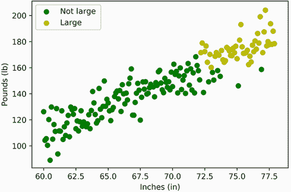

图 21.1 顾客测量值的图表：英寸与磅。大型和非大型顾客根据其类别以不同的颜色着色。

列表 21.1 模拟分类顾客测量值

```
import matplotlib.pyplot as plt
import numpy as np
np.random.seed(1)

def plot_customers(X, y, xlabel='Inches (in)', ylabel='Pounds (lb)'):    ❶
    colors = ['g', 'y']
    labels = ['Not Large', 'Large']                                      ❷
    for i, (color, label) in enumerate(zip(colors, labels)):
        plt.scatter(X[:,0][y == i], X[:,1][y == i], color=color, label=label)

    plt.xlabel(xlabel)
    plt.ylabel(ylabel)

inches = np.arange(60, 78, 0.1)
random_fluctuations = np.random.normal(scale=10, size=inches.size)
pounds = 4 * inches - 130 + random_fluctuations
X = np.array([inches, pounds]).T                                         ❸
y = ((X[:,0] > 72) & (X[:,1] > 160)).astype(int)                         ❹

plot_customers(X, y)
plt.legend()
plt.show()
```

❶ 在根据类别着色顾客的同时绘制顾客测量值。顾客身高和体重在特征矩阵 X 中被视为两个不同的特征。顾客类别类型存储在标签数组 y 中。

❷ 顾客分为两大类，大型和非大型。

❸ 按照第十四部分中的线性公式将体重建模为高度函数

❹ 如果客户的高度大于 72 英寸且体重大于 160 磅，则被视为大型客户。

我们的图表类似于两端颜色不同的雪茄。我们可以想象一把刀切过雪茄来分离颜色。这把刀就像一个边界，将两个客户类别分开。我们可以使用斜率为 –3.5 且 y 截距为 415 的直线来表示这个边界。这条线的公式是 `lbs = -3.5 * inches + 415`。让我们将这个线性边界添加到图表中（图 21.2）。

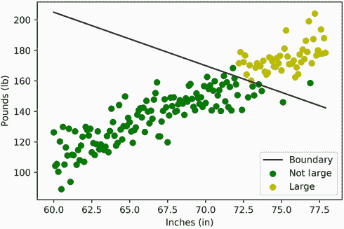

图 21.2 客户测量值的图表：`英寸` 对 `磅`。一条线性边界将大型客户和非大型客户分开。

注意 我们将在本节后面学习如何自动计算线性边界。

列表 21.2 绘制用于分隔两个客户类别的边界

```
def boundary(inches): return  -3.5 * inches + 415
plt.plot(X[:,0], boundary(X[:,0]), color='k', label='Boundary')
plot_customers(X, y)
plt.legend()
plt.show()
```

绘制的线被称为 *线性决策边界*，因为它可以用来准确地选择客户的类别。大多数大型客户都位于这条线以上。给定一个测量值为 `(英寸, 磅)` 的客户，我们通过检查 `lbs > -3.5 * inches + 415` 来预测客户的类别。如果这个不等式成立，则该客户是大型客户。让我们使用这个不等式来预测客户类别。我们将我们的预测存储在 `y_pred` 数组中，并通过打印 f-measure 来评估我们的预测。

注意 如我们在第二十部分中讨论的，f-measure 是我们评估类别预测质量的首选方式。作为提醒，f-measure 等于分类器的精确率和召回率的调和平均值。

列表 21.3 使用线性边界预测类别

```
from sklearn.metrics import f1_score
y_pred = []
for inches, lbs in X:
    prediction = int(lbs > -3.5 * inches + 415)    ❶
    y_pred.append(prediction)

f_measure = f1_score(y_pred, y)
print(f'The f-measure is {f_measure:.2f}')

The f-measure is 0.97
```

❶ 如果 b 是 Python 布尔值，则 int(b) 返回 1（如果布尔值为 True）或 0（否则）。因此，我们可以通过运行 int(lbs > –3.5 * inches + 415) 来返回测量值（英寸、磅）的类别标签。

如预期，f-measure 很高。给定不等式 `lbs > -3.5 * inches + 415`，我们可以准确地分类我们的数据。此外，我们可以使用向量点积更简洁地运行分类。考虑以下内容：

1.  我们的不等式重新排列为 `3.5 * inches + lbs - 415 > 0`。

1.  两个向量 `[x, y, z]` 和 `[a, b, c]` 的点积等于 `a * x + b * y + c * z`。

1.  如果我们将向量 `[inches, lbs, 1]` 和 `[3.5, 1, -415]` 的点积，结果等于 `3.5 * inches + lbs - 415`。

1.  因此，我们的不等式简化为 `w @ v > 0`，其中 `w` 和 `v` 都是向量，`@` 是点积运算符，如图 21.3 所示。

注意，只有一个向量依赖于 `lbs` 和 `inches` 的值。第二个向量 `[3.5, 1, -415]` 不随客户测量值变化。数据科学家将这个不变的向量称为 *权重向量* 或简称为 *权重*。

注意 这个名称与我们测量的客户体重（磅）无关。

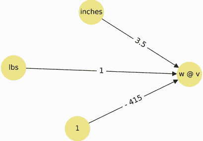

图 21.3 我们可以将 `weights` 和 `[英寸, 磅, 1]` 之间的点积可视化为一个有向图。在图中，最左边的节点代表测量值 `[英寸, 磅, 1]`，边权重代表权重 `[3.5, 1, -415]`。我们乘以每个节点对应的边权重并求和。这个和等于我们两个向量 `v` 和 `w` 的乘积。客户分类由 `w @ v > 0` 来确定。

使用向量点积，我们将在两行代码中重新创建 `y_pred` 的内容：

1.  将 `weights` 向量赋值为 `[3.5, 1, -415]`。

1.  使用点积将每个 `(英寸, 磅)` 客户样本在 `X` 中分类，点积是 `weights` 和 `[英寸, 磅, 1]` 的点积。

列表 21.4 使用向量点积预测类别

```
weights = np.array([3.5, 1, -415])
predictions = [int(weights @ [inches, lbs, 1] > 0) for inches, lbs in X]
assert predictions == y_pred
```

如果我们使用矩阵乘法，我们可以进一步简化我们的代码。

考虑以下内容：

1.  目前，我们必须遍历矩阵 `X` 中的每个 `[英寸, 磅]` 行，并附加一个 `1` 以获得向量 `[英寸, 磅, 1]`。

1.  相反，我们可以将一列 1 连接到矩阵 `X` 上，从而获得一个三列矩阵 `M`。每个矩阵行等于 `[英寸, 磅, 1]`。我们将 `M` 称为 *填充特征矩阵*。

1.  执行 `[weights @ v for v in M]` 返回 `weights` 和矩阵 `M` 中每一行的点积。当然，这个操作等同于 `M` 和 `weights` 之间的矩阵乘积。

1.  我们可以通过执行 `M @ weights` 来简洁地计算矩阵乘积。

1.  执行 `M @ weights > 0` 返回一个布尔数组。只有当对应客户的测量值满足 `3.5 * 英寸 + 磅 - 415 > 0` 时，每个元素才为真。

实际上，`M @ weights > 0` 返回一个布尔向量，其 *i* 个值如果 `y_pred[i] == 1` 则为真，否则为假。我们可以使用 NumPy 的 `astype` 方法将布尔值转换为数值标签。因此，我们可以通过执行 `(M @ weights > 0).astype(int)` 来生成我们的预测。让我们来验证一下。

列表 21.5 使用矩阵乘法预测类别

```
M = np.column_stack([X, np.ones(X.shape[0])])               ❶
print("First five rows of our padded feature matrix are:")
print(np.round(M[:5], 2))

predictions = (M @ weights > 0).astype(int)
assert predictions.tolist() == y_pred                       ❷

First five rows of our padded feature matrix are:
[[ 60\.   126.24   1\.  ]
 [ 60.1  104.28   1\.  ]
 [ 60.2  105.52   1\.  ]
 [ 60.3  100.47   1\.  ]
 [ 60.4  120.25   1\.  ]]
```

❶ 将一列 1 连接到特征矩阵 X 上，以创建三列矩阵 M

❷ 检查以确保我们的预测保持不变。请注意，矩阵乘积返回一个 NumPy 数组，必须将其转换为列表才能进行此比较。

我们将客户分类简化为一个简单的矩阵-向量乘积。这种矩阵乘积分类器被称为 *线性分类器*。线性分类器只需要一个权重向量来对输入特征进行分类。在这里，我们定义了一个 `linear_classifier` 函数，它接受特征矩阵 `X` 和权重向量 `weights` 作为输入，并返回一个类别预测数组。

列表 21.6 定义线性分类器函数

```
def linear_classifier(X, weights):
    M = np.column_stack([X, np.ones(X.shape[0])])
    return (M @ weights > 0).astype(int)

predictions = linear_classifier(X, weights)
assert predictions.tolist() == y_pred
```

线性分类器检查加权特征和一个常数相加是否大于零。存储在`weights[-1]`中的常数值被称为*偏差*。其余的权重被称为*系数*。在分类过程中，每个系数都会乘以其对应特征。在我们的情况下，`weights[0]`中的`inches`系数会乘以`inches`，`weights[1]`中的`lbs`系数会乘以`lbs`。因此，`weights`包含两个系数和一个偏差，形式为`[inches_coef, lbs_coef, bias]`。

我们使用已知的决策边界推导出了`weights`向量，但`weights`也可以直接从我们的训练集`(X, y)`中计算得出。在下面的子节中，我们将讨论如何训练一个线性分类器。训练包括找到系数和偏差，这些系数和偏差可以线性地分离我们的客户类别。

注意：训练结果不等于`weights`，因为无限多个`weights`向量满足不等式`M @ weights > 0`。我们可以通过将两边乘以一个正常数`k`来证明这一点。当然，`0 * k`等于`0`。同时，`weights * k`产生一个新的向量`w2`。因此，当`M @ weights > 0`时（反之亦然），`M @ w2`大于`0`。存在无限多个`k`常数，因此存在无限多个`w2`向量，但这些向量指向同一方向。

## 21.2 训练线性分类器

我们想要找到一个权重向量，以优化`X`上的类别预测。让我们首先将`weights`设置为三个随机值。然后我们计算与这个随机向量相关的 f 度量。我们预计 f 度量会非常低。

列表 21.7 使用随机权重进行分类

```
np.random.seed(0)
weights = np.random.normal(size=3)
y_pred = linear_classifier(X, weights)
f_measure = f1_score(y_pred, y)

print('We inputted the following random weights:')
print(np.round(weights, 2))
print(f'\nThe f-measure is {f_measure:.2f}')

We inputted the following random weights:
[1.76 0.4  0.98]

The f-measure is 0.43
```

如预期的那样，我们的 f 度量非常糟糕！我们可以通过打印`y_pred`来深入了解原因。

列表 21.8 输出预测类别

```
print(y_pred)

[1 1 1 1 1 1 1 1 1 1 1 1 1 1 1 1 1 1 1 1 1 1 1 1 1 1 1 1 1 1 1 1 1 1 1 1 1
 1 1 1 1 1 1 1 1 1 1 1 1 1 1 1 1 1 1 1 1 1 1 1 1 1 1 1 1 1 1 1 1 1 1 1 1 1
 1 1 1 1 1 1 1 1 1 1 1 1 1 1 1 1 1 1 1 1 1 1 1 1 1 1 1 1 1 1 1 1 1 1 1 1 1
 1 1 1 1 1 1 1 1 1 1 1 1 1 1 1 1 1 1 1 1 1 1 1 1 1 1 1 1 1 1 1 1 1 1 1 1 1
 1 1 1 1 1 1 1 1 1 1 1 1 1 1 1 1 1 1 1 1 1 1 1 1 1 1 1 1 1 1 1 1]
```

我们所有的数据点都被分配了一个类别标签 1！我们权重和每个特征向量的乘积总是大于零，所以我们的权重必须太高。降低权重将产生更多的类别 0 预测。例如，如果我们把权重设置为`[0, 0, 0]`，我们所有的类别预测都等于 0。

列表 21.9 通过降低权重来调整类别预测

```
assert np.all(linear_classifier(X, [0, 0, 0]) == 0)
```

降低权重会产生更多的类别 0 预测。提高它们会产生更多的类别 1 预测。因此，我们可以智能地提高和降低权重，直到我们的预测与实际类别标签一致。让我们制定一个调整权重以匹配标签的策略。我们首先调整`weights[-1]`处的偏差。

注意：调整系数需要更多的细微差别，所以现在我们将专注于偏差。

我们的目标是最小化`y_pred`中的预测与`y`中的实际标签之间的差异。我们如何做到这一点？一种简单的策略是比较每个*预测*/*实际*类别标签对。基于每个比较，我们可以调整偏差如下：

+   如果预测值等于实际类别，则预测是正确的。因此，我们不会修改偏差。

+   如果预测值为 1 而实际类别为 0，则权重过高。因此，我们将偏差降低一个单位。

+   如果预测值为 0 而实际类别为 1，则权重过低。因此，我们将偏差增加一个单位。

让我们定义一个函数，根据预测和实际标签来计算这个偏差偏移。

注意 请记住，根据现有惯例，偏差偏移是从权重中减去的。因此，当权重旨在降低时，我们的 `get_bias_shift` 函数返回一个正值。

列表 21.10 基于预测质量计算偏差偏移

```
def get_bias_shift(predicted, actual):
    if predicted == actual:
        return 0
    if predicted > actual:
        return 1

    return -1
```

从数学上讲，我们可以证明我们的 `get_bias_shift` 函数等价于 `predicted - actual`。以下代码明确证明了这一点，适用于预测和实际类别标签的所有四种组合。

列表 21.11 使用算术计算偏差偏移

```
for predicted, actual in [(0, 0), (1, 0), (0, 1), (1, 1)]:
    bias_shift = get_bias_shift(predicted, actual)
    assert bias_shift == predicted - actual
```

值得注意的是，我们的单个单位偏移是一个任意值。我们不仅可以偏移一个单位，还可以偏移十分之一单位、10 个单位或 100 个单位。偏移的值可以通过一个称为 *学习率* 的参数来控制。学习率与 `predicted - actual` 相乘以调整偏移大小。因此，如果我们想将偏移降低到 0.1，我们可以通过运行 `learning_rate * (predicted - actual)` 来轻松实现，其中 `learning_rate` 等于 0.1。这种调整可以影响训练质量。因此，我们将重新定义 `get_bias_shift` 函数，并添加一个预设为 0.1 的 `learning_rate` 参数。

列表 21.12 使用学习率计算偏差偏移

```
def get_bias_shift(predicted, actual, learning_rate=0.1):
    return learning_rate * (predicted - actual)
```

现在我们准备调整偏差。列表 21.13 遍历 `M` 中的每个 `[inches, lbs, 1]` 向量。对于每个 *i* 个向量，我们预测类别标签并将其与 `y[i]` 中的实际类别进行比较。

注意 作为提醒，每个向量 `v` 的类别预测等于 `int(v @ weights > 0)`。

使用每个预测，我们计算偏差偏移并将其从存储在 `weights[-1]` 中的偏差中减去。当所有迭代完成后，我们打印调整后的偏差并将其与原始值进行比较。

列表 21.13 逐次调整偏差

```
def predict(v, weights): return int(v @ weights > 0)    ❶

starting_bias = weights[-1]
for i, actual in enumerate(y):
    predicted = predict(M[i], weights)
    bias_shift = get_bias_shift(predicted, actual)
    weights[-1] -= bias_shift

new_bias = weights[-1]
print(f"Our starting bias equaled {starting_bias:.2f}.")
print(f"The adjusted bias equals {new_bias:.2f}.")

Our starting bias equaled 0.98.
The adjusted bias equals -12.02
```

❶ 预测与矩阵 M 中的行关联的向量 v 的类别标签

偏差大幅下降。考虑到我们的权重过大，这是有道理的。让我们检查偏移是否提高了我们的 f-measure。

列表 21.14 偏移后检查性能

```
y_pred = linear_classifier(X, weights)
f_measure = f1_score(y_pred, y)
print(f'The f-measure is {f_measure:.2f}')

The f-measure is 0.43
```

我们的 f 度量保持不变。仅仅调整偏差是不够的。我们还需要调整系数，但如何调整呢？天真地，我们可以从每个系数中减去偏差偏移。我们可以遍历每个训练示例并运行`weights -= bias_shift`。不幸的是，这种天真方法是有缺陷的：它总是调整系数，但在相关特征等于零时调整系数是危险的。我们将用一个简单的例子来说明原因。

假设在我们的客户数据集中，一个空白条目错误地记录为`(0, 0)`。我们的模型将这个数据点视为一个体重为零、身高为零英寸的客户。当然，这样的客户在物理上是不可能的，但这不是重点。这个理论上的客户肯定不是大客户，因此他们的正确类别标签应该是 0。当我们的线性模型对客户进行分类时，它将`[0, 0, 1]`与`[inches_coef, lbs_coef, bias]`进行点积。当然，系数乘以零并相互抵消，所以最终的点积仅等于`bias`（图 21.4）。如果`bias > 0`，分类器会错误地分配类别 1 标签。在这里，我们需要使用`bias_shift`减小偏差。我们会调整系数吗？不！我们的系数没有影响预测。因此，我们无法评估系数质量。据我们所知，系数已经设置为最优值。如果是这样，那么减去偏差偏移会使模型变得更差。


图 21.4 我们可以将`weights`和`[0, 0, 1]`之间的点积可视化为一个有向图。在图中，最左边的节点代表零值特征，边权重代表系数和偏差。我们乘以每个节点对应的边权重并求和。这个和等于`bias`。客户分类取决于`bias`是否大于`0`。系数不影响预测，因此不应以任何方式更改。

如果`lbs`特征等于零，我们永远不应该移动`lbs_coef`。然而，对于非零输入，从`lbs_coef`中减去`bias_shift`仍然是合适的。我们可以通过将`lbs_coef`的移动设置为等于`bias_shift if lbs else 0`来确保这一点。或者，我们可以将移动设置为等于`bias_shift * lbs`。当`lbs`为零时，这个乘积为零。否则，这个乘积将按与偏差相同的方向移动`lbs_coef`。同样，我们可以通过`bias_shift * inches`单位移动`inches_coef`。换句话说，我们将每个系数移动为其特征和`bias_shift`的乘积。

NumPy 允许我们通过运行`bias_shift * [inches, lbs, 1]`一次计算我们的权重偏移。当然，`[inches, lbs, 1]`向量对应于填充特征矩阵`M`中的一行。因此，我们可以通过运行`weights -= bias_shift * M[i]`根据每个第*i*个预测调整权重。

考虑到这一点，让我们迭代`y`中的每个实际标签，并根据预测值调整权重。然后我们检查 f 度量是否有所提高。

列表 21.15：一行代码计算所有权重移动

```
old_weights = weights.copy()
for i, actual in enumerate(y):
    predicted = predict(M[i], weights)
    bias_shift = get_bias_shift(predicted, actual)
    weights -= bias_shift * M[i]

y_pred = linear_classifier(X, weights)
f_measure = f1_score(y_pred, y)

print("The weights previously equaled:")
print(np.round(old_weights, 2))
print("\nThe updated weights now equal:")
print(np.round(weights, 2))
print(f'\nThe f-measure is {f_measure:.2f}')

The weights previously equaled:
[  1.76   0.4  -12.02]

The updated weights now equal:
[ -4.64   2.22 -12.12]

The f-measure is 0.78
```

在迭代过程中，`inches_coef`减少了 6.39 个单位（从 1.76 变为-4.63），而偏差仅减少了 0.1 个单位（从-12.02 变为-12.12）。这种差异是有道理的，因为系数的移动与高度成正比。顾客的平均身高为 64 英寸，因此系数的移动是偏差的 64 倍。正如我们很快会发现的那样，重量移动的大差异可能会导致问题。稍后，我们通过一个称为*标准化*的过程来消除这些问题；但首先让我们转向我们的 f 度量。

我们的 f 度量从 0.43 上升到 0.78。权重移动策略正在起作用！如果我们重复迭代 1,000 次会怎样？让我们来看看。列表 21.16 监控了 1,000 次权重移动迭代中 f 度量的变化。然后我们绘制每个*i*次 f 度量相对于*i*次迭代的相对值（图 21.5）。我们利用这个图表来监控分类器性能随时间如何提高。

注意：为了进行这项练习，我们将权重设置为它们的原始随机种子值。这使我们能够监控性能相对于我们起始的 f 度量 0.43 如何提高。

列表 21.16：在多次迭代中调整权重

```
np.random.seed(0)
weights = np.random.normal(size=3)                       ❶

f_measures = []
for _ in range(1000):                                    ❷
    y_pred = linear_classifier(X, weights)
    f_measures.append(f1_score(y_pred, y))               ❸

    for i, actual in enumerate(y):                       ❹
        predicted =  predict(M[i], weights)
        bias_shift = get_bias_shift(predicted, actual)
        weights -=  bias_shift * M[i]

print(f'The f-measure after 1000 iterations is {f_measures[-1]:.2f}')
plt.plot(range(len(f_measures)), f_measures)
plt.xlabel('Iteration')
plt.ylabel('F-measure')
plt.show()

The f-measure after 1000 iterations is 0.68
```

❶ 将起始权重设置为随机值

❷ 在 1,000 次迭代中重复权重移动逻辑

❸ 跟踪每次迭代的权重性能

❹ 通过迭代每个预测/实际类标签对来调整权重

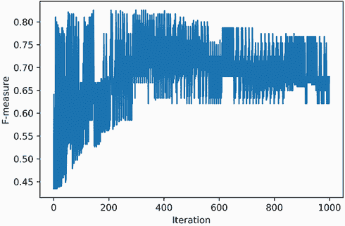

图 21.5：绘制迭代与模型 f 度量。在每次迭代中调整模型权重。f 度量在低和合理值之间广泛波动。这些波动需要消除。

最终的 f 度量是 0.68。我们的分类器训练得非常差。发生了什么？根据我们的图表，分类器在整个迭代过程中性能波动非常剧烈。有时 f 度量高达 0.80；有时，它下降到大约 0.60。大约 400 次迭代后，分类器在这两个值之间不断波动。这种快速波动是由一个始终过高的权重移动引起的。这类似于一架飞得太快的飞机。想象一下飞机起飞后以每小时 600 英里的速度飞行。飞机保持这种快速速度，使其在不到三小时内覆盖 1,500 英里。然而，当飞机接近目的地时，飞行员拒绝减速，所以飞机错过了目标机场，被迫掉头。如果飞行员不降低速度，飞机将再次错过着陆。这将导致一系列永无止境的空中 U 形转弯，类似于我们图表中的波动。对于飞行员来说，解决方案很简单：在整个飞行过程中减速。

我们面临一个类似的问题：我们应该在每次额外的迭代中逐渐降低权重变化。我们如何降低权重变化？一种方法是在每次*k*次迭代中将变化除以*k*。让我们执行这个策略。我们将权重重置为随机值，并遍历从 1 到 1,001 的*k*值。在每次迭代中，我们将权重变化设置为`bias_shift * M[i] / k`。然后我们重新生成我们的性能图（图 21.6）。

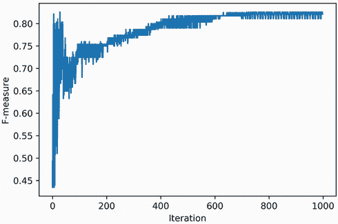

图 21.6 绘制了迭代次数与模型 f 度量之间的关系。在每个*k*次迭代中，模型权重按`1/k`的比例进行调整。通过将权重变化除以*k*来限制振荡。因此，f 度量收敛到一个合理的值。

列表 21.17 在多次迭代中减少权重变化

```
np.random.seed(0)
def train(X, y,                                              ❶
          predict=predict):                                  ❷
    M = np.column_stack([X, np.ones(X.shape[0])])
    weights = np.random.normal(size=X.shape[1] + 1)          ❸
    f_measures = []
    for k in range(1, 1000):
        y_pred = linear_classifier(X, weights)
        f_measures.append(f1_score(y_pred, y))

        for i, actual in enumerate(y):
            predicted = predict(M[i], weights)
            bias_shift = get_bias_shift(predicted, actual)
            weights -=  bias_shift * M[i] / k                ❹

    return weights, f_measures                               ❺

weights, f_measures = train(X, y)
print(f'The f-measure after 1000 iterations is {f_measures[-1]:.2f}')
plt.plot(range(len(f_measures)), f_measures)
plt.xlabel('Iteration')
plt.ylabel('F-measure')
plt.show()

The f-measure after 1000 iterations is 0.82
```

❶ 从特征 X 和标签 y 训练线性模型。该函数在本节的其他地方被重用。

❷ 预测函数通过允许我们比较预测和实际类别输出来驱动权重变化。在本节的后面部分，我们将修改预测以增加权重变化的细微差别。

❸ 具有 N 个特征的模型有 N + 1 个总权重，代表 N 个系数和一个偏差。

❹ 在每个*k*次迭代中，我们通过除以*k*来减弱权重变化，这减少了权重变化的振荡。

❺ 返回优化后的权重以及 1,000 次迭代中的跟踪性能

我们的逐步权重变化减少是成功的。f 度量收敛到一个稳定的 0.82 值。我们使用**感知机训练算法**实现了收敛。**感知机**是一种简单的线性分类器，它在 20 世纪 50 年代被发明。感知机很容易训练。我们只需要将以下步骤应用于训练集`(X, y)`：

1.  将一列 1 添加到特征矩阵`X`中，以创建一个填充矩阵`M`。

1.  创建一个包含`M.shape[1]`个随机值的`weights`向量。

1.  遍历`M`中的每一行*i*，并通过运行`M[i] @ weights > 0`来预测第*i*个类别。

1.  将第*i*个预测与实际类别标签`y[i]`进行比较。然后，通过运行`(predicted - actual) * lr`来计算偏差变化，其中`lr`是学习率。

1.  通过运行`weights -= bias_shift * M[i] / k`来调整权重。最初，常数`k`被设置为`1`。

1.  在多次迭代中重复步骤 3 到 5。在每次迭代中，将`k`增加`1`以限制振荡。

通过重复，感知机训练算法最终收敛到一个稳定的 f 度量。然而，这个 f 度量并不一定是最佳的。例如，我们的感知机收敛到一个 f 度量 0.82。这个性能水平是可以接受的，但它并不符合我们最初的 0.97 的性能。我们的训练决策边界并没有像初始决策边界那样很好地分离数据。

两个边界在视觉上如何比较？我们可以轻松地找出答案。通过代数操作，我们可以将权重向量 `[inches_coef, lbs_coef, bias]` 转换为等于 `lbs = -(inches_coef * inches + bias) / lbs_coef` 的线性决策边界。考虑到这一点，我们将绘制新旧决策边界以及我们的客户数据（图 21.7）。

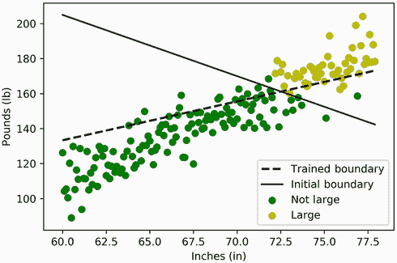

图 21.7 客户测量的图表：`英寸` 对 `磅`。两个线性边界将大型和非大型客户分开。训练得到的边界的分离效果相对于基线边界更差。

列表 21.18 比较新旧决策边界

```
inches_coef, lbs_coef, bias = weights
def new_boundary(inches):
    return -(inches_coef * inches + bias) / lbs_coef

plt.plot(X[:,0], new_boundary(X[:,0]), color='k', linestyle='--',
         label='Trained Boundary', linewidth=2)
plt.plot(X[:,0], boundary(X[:,0]), color='k', label='Initial Boundary')
plot_customers(X, y)
plt.legend()
plt.show()
```

我们训练得到的线性边界劣于我们最初的线性边界，但这并不是感知机算法的过错。相反，训练过程受到了矩阵 `X` 中大范围、波动性特征的限制。在下一小节中，我们将讨论为什么大的 `X` 值会阻碍性能。我们将通过一个称为 *标准化* 的过程来限制这种阻碍，在这个过程中，`X` 被调整为等于 `(X - X.mean(axis=0)) / X.std(axis=0)`。

### 21.2.1 通过标准化提高感知机性能

感知机训练受到 `X` 中大特征值的影响。这是由于系数移动和偏差移动之间的差异。正如我们讨论的那样，系数移动与相关的特征值成比例。此外，这些值可能相当高。例如，平均客户身高超过 60 英寸：`inches_coef` 移动幅度比偏差移动幅度高 60 倍以上，因此我们不可能只稍微调整偏差而不大幅调整系数。因此，通过调整偏差，我们可能会将 `inches_coef` 严重移向一个非最佳值。

我们的训练缺乏所有细微差别，因为系数的移动幅度过大。然而，我们可以通过减少矩阵 `X` 中的列均值来降低这些移动幅度。此外，我们还需要降低矩阵的分散度。否则，异常大的客户测量值可能导致系数移动幅度过大。因此，我们需要降低列均值和标准差。首先，让我们打印 `X.mean(axis=0)` 和 `X.std(axis=0)` 的当前值。

列表 21.19 打印特征均值和标准差

```
means = X.mean(axis=0)
stds = X.std(axis=0)
print(f"Mean values: {np.round(means, 2)}")
print(f"STD values: {np.round(stds, 2)}")

Mean values: [ 68.95 146.56]
STD values: [ 5.2  23.26]
```

特征均值和标准差相对较高。我们如何使它们变小？嗯，正如我们在第十四部分中学到的，将数据集的均值移向零是微不足道的：我们只需要从 `X` 中减去 `means`。调整标准差不太直接，但从数学上我们可以证明 `(X - means) / stds` 返回一个矩阵，其列分散度都等于 1.0。

注意 这里是证明。运行`X - means`返回一个矩阵，其每一列`v`的均值为 0.0。因此，每个`v`的方差等于`[e * e for e in v] / N`，其中`N`是列元素的数量。当然，这个操作可以表示为一个简单的点积，`v @ v / N`。标准差`std`等于方差的平方根，所以`std = sqrt(v @ v) / sqrt(N)`。注意`sqrt(v @ v)`等于`v`的模，我们可以表示为`norm(v)`。因此，`std = norm(v) / sqrt(N)`。假设我们将`v`除以`std`来生成一个新的向量`v2`。由于`v2 = v / std`，我们期望`v2`的模等于`norm(v) / std`。`v2`的标准差等于`norm(v2) / sqrt(N)`。通过代入`norm(v2)`，我们得到`norm(v) / (sqrt(N) * std)`。然而，`norm(v) / sqrt(N) = std`。所以`v2`的标准差减少到`std / std`，等于 1.0。

这个简单的过程被称为*标准化*。让我们通过运行`(X - means) / stds`来标准化我们的特征矩阵。得到的矩阵具有列均值为 0 和列标准差为 1.0。

列表 21.20 标准化特征矩阵

```
def standardize(X):              ❶
    return (X - means) / stds

X_s = standardize(X)
assert np.allclose(X_s.mean(axis=0), 0)
assert np.allclose(X_s.std(axis=0), 1)
```

❶ 标准化来自客户分布的测量。我们在本节的其它地方重用了这个函数。

我们现在检查在标准化的特征矩阵上训练是否提高了我们的结果。我们还绘制了相对于标准化数据的训练好的决策边界（图 21.8）。

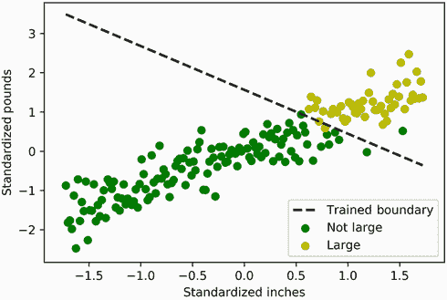

图 21.8 标准化客户测量的图表。训练好的决策边界将大型客户和非大型客户分开。训练边界的分离效果与图 21.2 中的基线决策边界相当。

列表 21.21 在标准化的特征矩阵上训练

```
np.random.seed(0)
weights, f_measures = train(X_s, y)
print(f'After standardization, the f-measure is {f_measures[-1]:.2f}')

def plot_boundary(weights):                        ❶
    a, b, c = weights
    new_boundary = lambda x: -(a * x + c) / b      ❷
    plt.plot(X_s[:,0], new_boundary(X_s[:,0]), color='k', linestyle='--',
         label='Trained Boundary', linewidth=2)
    plot_customers(X_s, y, xlabel='Standardized Inches',
                   ylabel='Standardized Pounds')
    plt.legend()
    plt.show()

plot_boundary(weights)

After standardization, the f-measure is 0.98
```

❶ 绘制由权重导出的线性决策边界，以及标准化后的数据

❷ 将权重转换为线性函数

成功！我们新的 f 度量等于 0.98。这个 f 度量高于我们的基线值 0.97。此外，我们新的决策边界角度与图 21.2 中的基线边界非常相似。我们通过标准化实现了性能的提升。

注意 标准化类似于归一化。这两种技术都会降低输入数据中的值并消除单位差异（例如英寸与厘米）。对于某些任务，如 PCA 分析，这两种技术可以互换使用。然而，当我们训练线性分类器时，标准化可以达到更好的效果。

我们应该注意，我们的训练好的分类器现在需要所有输入数据在分类之前进行标准化。因此，对于任何新的数据`d`，我们需要通过运行`linear_classifier(standardize(d), weights)`来对该数据进行分类。

列表 21.22 标准化新的分类器输入

```
new_data = np.array([[63, 110], [76, 199]])
predictions = linear_classifier(standardize(new_data), weights)
print(predictions)

[0 1]
```

我们已经标准化了我们的数据并实现了高水平的性能。不幸的是，这个最优的 f 度量仍然不能由训练算法保证。感知机训练质量可能会波动，即使算法在相同的训练集上重复运行。这是由于初始训练步骤中分配的随机权重：某些起始权重收敛到一个更差的决策边界。让我们通过五次训练感知机来展示模型的不一致性。每次训练运行后，我们检查得到的 f 度量是否低于我们最初的基线 0.97。

列表 21.23 检查感知机的训练一致性

```
np.random.seed(0)
poor_train_count = sum([train(X_s, y)[1][-1] < 0.97 for _ in range(5)])
print("The f-measure fell below our baseline of 0.97 in "
      f"{poor_train_count} out of 5 training instances")

The f-measure fell below our baseline of 0.97 in 4 out of 5
training instances
```

在 80%的情况下，训练模型的性能低于基线。我们基本感知机模型显然是有缺陷的。我们将在后续小节中讨论其缺陷。在这个过程中，我们推导出数据科学中最受欢迎的线性模型之一：逻辑回归。

## 21.3 使用逻辑回归改进线性分类

在类别预测过程中，我们的线性边界做出简单的二元决策。然而，正如我们在第二十部分中学到的，不是所有的预测都应该同等对待。有时我们对某些预测比其他预测更有信心。例如，如果一个 KNN 模型的所有邻居都一致投票给类别 1，我们对那个预测的信心是 100%。但如果只有九个邻居中的六个投票给类别 1，我们对那个预测的信心是 66%。这种信心度量在我们的感知机模型中是缺失的。该模型只有两个输出：0 和 1，基于数据是否位于决策边界之上或之下。

那么，如果一个数据点正好位于决策边界上呢？目前，我们的逻辑将类别 0 分配给那个点。

注意：如果`v`中的测量值位于决策边界上，那么`weights @ v == 0`。因此`int(weights @ v > 0)`返回`0`。

然而，这种分配是任意的。如果点不在决策边界之上或之下，我们无法决定哪个类别！因此，我们对两个类别的信心应该相等，都是 50%。如果我们把点向上移动 0.0001 个单位？我们对类别 1 的信心应该会增加，但不会太多。我们可以假设类别 1 的可能性增加到 50.001%，而类别 0 的可能性减少到 49.999%。只有当点远离边界时，我们的信心才会急剧上升，如图 21.9 所示。例如，如果点在边界上方 100 个单位，那么我们对类别 1 的信心应该达到 100%，而对类别 0 的信心应该下降到 0%。

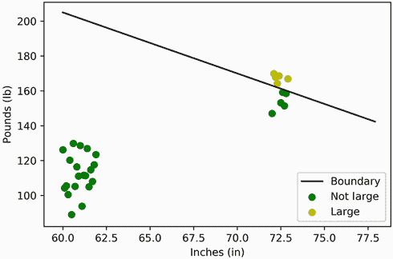

图 21.9 客户测量值的图表：`英寸`对`磅`。一条线性边界分隔了我们的两个客户类别。只有接近或远离边界的客户被显示出来。太靠近边界的客户更难分类。我们对远离决策边界的那些客户的类别标签更有信心。

类别置信度由边界距离和相对于边界的位置决定。如果一个点位于决策边界下方 100 个单位，其类别 1 和 0 的可能性应该颠倒。我们可以用*指向距离*来捕捉距离和位置。与常规距离不同，指向距离可以是负数。如果一个点低于决策边界，我们将为其分配一个负距离。

注意 因此，如果一个点位于边界下方 100 个单位，其到边界的指向距离等于-100。

让我们选择一个函数来计算基于边界指向距离的类别 1 置信度。当指向距离增加到无穷大时，该函数应增加到 1.0。相反，当指向距离减少到负无穷大时，它应减少到 0.0。最后，当指向距离等于零时，该函数应等于 0.5。在这本书中，我们遇到了一个符合这些标准的函数：在第七部分中，我们介绍了正态曲线的累积分布函数。这个 S 形曲线等于从正态分布中随机抽取一个小于或等于某个`z`值的概率。该函数从 0.0 开始增加至 1.0。当`z == 0`时，它也等于 0.5。作为提醒，累积分布可以通过运行`scipy.stats.norm.cdf(z)`来计算。在这里，我们绘制了从-10 到 10 的 z 值的累积分布函数（图 21.10）。


图 21.10 正态分布的累积分布函数。S 形曲线从 0.0 开始，向 1.0 增长。当输入为 0.0 时，它等于 0.5。这个图符合我们基于决策边界指向距离捕捉不确定性的标准。

列表 21.24 使用`stats.norm.cdf`测量不确定性

```
from scipy import stats
z = np.arange(-10, 10, 0.1)
assert stats.norm.cdf(0.0) == 0.5      ❶

plt.plot(z, stats.norm.cdf(z))
plt.xlabel('Directed Distance')
plt.ylabel('Confidence in Class 1')
plt.show()
```

❶ 当 z 直接位于 0.0 阈值时，确认曲线对两个类别的置信度相同

S 形累积正态分布曲线符合我们声明的置信度标准。它是一个计算分类器不确定性的充分函数。但在最近几十年里，这种曲线的使用已经不再受欢迎。有几个原因。最紧迫的问题是，没有精确的公式来计算`stats.norm.cdf`：相反，正态分布下的面积是通过近似计算的。因此，数据科学家转向了另一种 S 形曲线，其公式简单易记：对数逻辑曲线。`z`的对数逻辑函数是`1 / (1 - e ** z)`，其中`e`是一个约等于 2.72 的常数。与累积正态分布类似，对数逻辑函数的范围从 0 到 1，当`z == 0`时等于 0.5。让我们绘制对数逻辑曲线，以及`stats.norm.cdf`（图 21.11）。

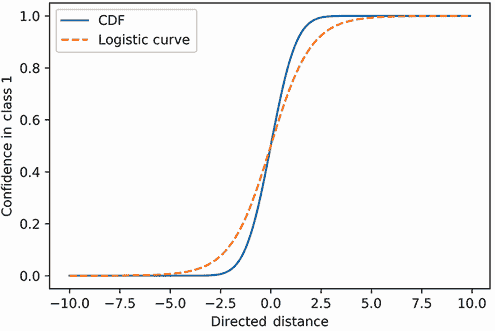

图 21.11 正态分布的累积分布函数与逻辑曲线一起绘制。两条 S 形曲线都从 0.0 开始，向 1.0 上升。当输入为 0.0 时，它们等于 0.5。两条曲线都符合我们基于决策边界有向距离捕捉不确定性的标准。

列表 21.25 使用逻辑曲线测量不确定性

```
from math import e
plt.plot(z, stats.norm.cdf(z), label='CDF')
plt.plot(z, 1 / (1 + e ** -z), label='Logistic Curve', linestyle='--')
plt.xlabel('Directed Distance')
plt.ylabel('Confidence in Class 1')
plt.legend()
plt.show()
```

这两条曲线并不完全重叠，但它们都

+   当 `z > 5` 时，约等于 `1`

+   当 `-z > 5` 时，约等于 `0`

+   当 `-5 < z < 5` 时，等于 `0` 和 `1` 之间的一个模糊值

+   当 `z == 0` 时，等于 `0.5`

因此，我们可以使用逻辑曲线作为我们不确定性的度量。让我们利用这条曲线为所有客户分配类别 1 的标签可能性。这需要我们计算每个客户测量值与边界的有向距离。计算这些距离非常简单：我们只需要执行 `M @ weights`，其中 `M` 是填充的特征矩阵。实际上，我们一直在计算这些距离——我们只是直到现在还没有充分利用它们！

注意：让我们快速证明 `M @ weights` 返回到决策边界的距离。为了清晰起见，我们将使用我们的初始权重 `[3.5, 1, -415]`，它代表决策边界 `lbs = -3.5 * inches - 415`。因此，我们正在计算测量值 `(inches, lbs)` 与决策边界点 `(inches, -3.5 * inches + 415)` 之间的距离。当然，x 轴坐标都等于 `inches`，所以我们正在计算 y 轴上的距离。这个距离等于 `lbs - (-3.5 * inches + 415)`。公式重新排列为 `3.5 * inches + lbs - 415`。这等于 `[3.5, 1, -415]` 和 `[inches, lbs, 1]` 的点积。第一个向量等于 `weights`，第二个向量代表 `M` 中的行。因此，`M @ weights` 返回一个有向距离数组。

如果 `M @ weights` 返回有向距离，那么 `1 / (1 + e ** -(M @ weights))` 返回类别 1 的可能性。列表 21.26 绘制了距离与可能性之间的关系。我们还添加了我们的二元感知机预测到图中：这些对应于 `M @ weights > 0`（图 21.12）。

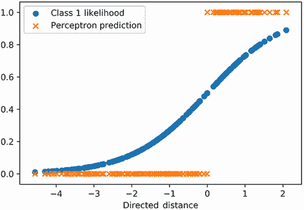

图 21.12 将逻辑曲线的类别 1 可能性与感知机预测一起绘制。可能性显示了细微差别，而感知机预测仅限于 0 或 1。

注意：作为提醒，我们通过在 `X_s` 中的标准化特征上训练来计算 `weights`。因此，我们必须向 `X_s` 添加一列 1 以填充特征矩阵。

列表 21.26 比较逻辑不确定性与感知机的预测

```
M = np.column_stack([X_s, np.ones(X_s.shape[0])])
distances = M @ weights                                          ❶
likelihoods = 1 / (1 + e ** -distances)
plt.scatter(distances, likelihoods, label='Class 1 Likelihood')
plt.scatter(distances, distances > 0,                             ❷
            label='Perceptron Prediction', marker='x')

plt.xlabel('Directed Distance')
plt.legend()
plt.show()
```

❶ 到边界的有向距离等于填充特征矩阵和权重的乘积。

❷ 感知机预测由大于 0 的距离决定。请注意，Python 自动将布尔值 True 和 False 转换为整数 1 和 0，因此我们可以直接将大于 0 的距离插入到 plt.scatter 中，而无需进行整数转换。

绘制的逻辑似然随着有向距离的增加而持续增加。相比之下，感知器的预测非常简单：感知器对类别 1 标签有 100%的信心或 0%的信心。有趣的是，当有向距离非常负时，逻辑曲线和感知器都是 0%的信心。然而，随着有向距离的增加，图表开始发散。逻辑图表更为保守：其信心缓慢增加，并且大部分低于 85%。同时，当`distances > 0`时，感知器模型的信心跳到 100%。这种跳跃是没有根据的。模型过于自信，就像一个没有经验的青少年——它注定会犯错误！幸运的是，我们可以通过结合逻辑曲线捕获的不确定性来教导模型谨慎行事。

我们可以通过更新我们的权重偏移计算来包含不确定性。目前，权重偏移与`predicted - actual`成比例，其中变量代表预测和实际类别标签。相反，我们可以使偏移与`confidence(predicted) - actual`成比例，其中`confidence(predicted)`捕捉我们对预测类别的信心。在感知器模型中，`confidence(predicted)`始终等于 0 或 1。相比之下，在细致的逻辑模型中，权重偏移采用更细粒度的值范围。

例如，考虑一个具有类别标签 1 且直接位于决策边界上的数据点。在训练期间，当感知器遇到这个数据时，它会计算 0 权重偏移，因此感知器不会调整其权重。它从观察中学习到的东西绝对为零。相比之下，逻辑模型返回的权重偏移与 0.5 – 1 等于-0.5 成比例。模型将调整其对类别标签不确定性的评估并相应地调整权重。与感知器不同，逻辑模型具有灵活的学习能力。

让我们更新我们的模型训练代码，以包含逻辑不确定性。我们只需将我们的`predict`函数输出从`int(weights @ v > 0)`更改为`1 / (1 + e ** -(weights @ v))`。在这里，我们使用两行代码进行替换。然后我们训练改进的模型以生成新的权重向量，并绘制新的决策边界以验证我们的结果（图 21.13）。

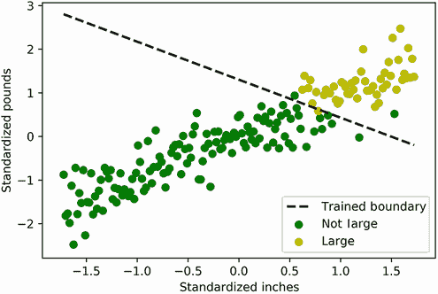

图 21.13 标准化客户测量的图表。逻辑训练的决策边界将大型客户和非大型客户分开。训练边界的分离与图 21.2 中的基线决策边界相当。

列表 21.27 将不确定性纳入训练

```
np.random.seed(0)
def logistic_predict(v, weights): return 1 / (1 + e ** -(weights @ v))
def train_logistic(X, y): return train(X, y, predict=logistic_predict)   ❶
logistic_weights = train_logistic(X_s, y)[0]
plot_boundary(logistic_weights)
```

❶ 我们的训练函数接受一个可选的行级类预测器，称为 predict。这个预测器默认返回`int(weights @ v > 0)`。在这里，我们将其替换为更细致的逻辑预测函数。

学习到的决策边界几乎与感知器输出相同。然而，我们的 `train_logistic` 函数有细微的差别：它产生的结果比感知器更一致。之前，我们展示了训练好的感知器模型在五次训练中有四次的表现低于我们的基线。这是否也适用于 `train_logistic`？让我们来看看。

列表 21.28 检查逻辑回归模型的训练一致性

```
np.random.seed(0)
poor_train_count = sum([train_logistic(X_s, y)[1][-1] < 0.97
                        for _ in range(5)])
print("The f-measure fell below our baseline of 0.97 in "
      f"{poor_train_count} out of 5 training instances")

The f-measure fell below our baseline of 0.97 in 0 out of 5
training instances
```

训练好的模型在所有运行中都没有低于基线，因此它优于感知器。这个优越的模型被称为 *逻辑回归分类器*。该模型的训练算法也通常被称为 *逻辑回归*。

注意：这个名称在语义上可能不正确。分类器预测分类变量，而回归模型预测数值。从技术上讲，逻辑回归分类器使用逻辑回归来预测数值不确定性，但它不是一个回归模型。但术语 *逻辑回归* 在机器学习社区中与 *逻辑回归分类器* 术语变得普遍。

逻辑回归分类器就像感知器一样进行训练，但有一个小的不同。权重偏移量不是与 `int(distance - y[i] > 0)` 成正比，其中 `distance = M[i] @ weights`。相反，它是与 `1 / (1 + e ** -distance) - y[i]` 成正比。这种差异导致在随机训练运行中具有更稳定的性能。

注意：如果权重偏移量直接与 `distance - y[i]` 成正比会发生什么？嗯，训练好的模型会学习最小化一条线与 `y` 中值的距离。对于分类目的来说，这并不是很有用；但对于回归来说，它非常有价值。例如，如果我们把 `y` 设置为等于 `lbs`，把 `X` 设置为等于 `inches`，我们就可以训练一条线来预测顾客的体重，使用顾客的身高。通过两行代码，我们利用 `train` 实现这种类型的线性回归算法。你能想出来吗？

### 21.3.1 在超过两个特征上运行逻辑回归

我们已经在两个客户测量值上训练了我们的逻辑回归模型：身高（`inches`）和体重（`lbs`）。然而，我们的 `train_logistic` 函数可以处理任意数量的输入特征。我们将通过添加第三个特征：客户腰围来证明这一点。平均而言，腰围等于个人身高的 45%。我们将利用这一事实来模拟客户的腰围测量值。然后我们将所有三个测量值输入到 `train_logistic` 中，并评估训练好的模型的表现。

列表 21.29 训练一个具有三个特征的逻辑回归模型

```
np.random.seed(0)
random_fluctuations = np.random.normal(size=X.shape[0], scale=0.1)
waist = 0.45 * X[:,0] + random_fluctuations                               ❶
X_w_waist =  np.column_stack([X_s, (waist - waist.mean()) / waist.std()]) ❷
weights, f_measures = train_logistic(X_w_waist, y)

print("Our trained model has the following weights:")
print(np.round(weights, 2))
print(f'\nThe f-measure is {f_measures[-1]:.2f}')
Our trained model has the following weights:
[ 1.65  2.91  1.26 -4.08]

The f-measure is 0.97
```

❶ 每个腰围测量值等于顾客身高的 45%，并带有随机波动。

❷ 在将数组附加到其他标准化客户测量值之前，我们需要标准化腰围。

训练好的三特征模型继续表现出色，f-measure 为 0.97。主要区别在于模型现在包含四个权重。前三个权重是对应于三个客户测量的系数，最后一个权重是偏差。从几何上看，四个权重代表一个更高维度的线性边界，其形式为三维线，称为 *平面*。该平面在 3D 空间中分隔我们的两个客户类别，如图 21.14 所示。

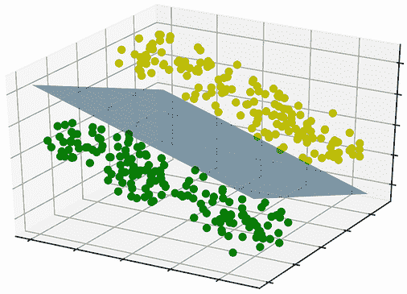

图 21.14 3D 空间中的线性分类。一个线性平面像刀一样穿过数据，将数据分成两个不同的类别。

同样，我们可以在任意数量的维度上优化线性分离。结果权重代表一个多维线性决策边界。不久，我们将在一个具有 13 个特征的数据集上运行逻辑回归。Scikit-learn 的逻辑回归分类器实现将证明对此目的很有用。

## 21.4 使用 scikit-learn 训练线性分类器

Scikit-learn 有一个用于逻辑回归分类的内建类。我们首先导入这个 `logisticRegression` 类。

注意：Scikit-learn 还包括一个 `perceptron` 类，可以从 `sklearn.linear_model` 中导入。

列表 21.30 导入 scikit-learn 的 `LogisticRegression` 类

```
from sklearn.linear_model import LogisticRegression
```

接下来，我们初始化分类器对象 `clf`。

列表 21.31 初始化 scikit-learn 的 `LogisticRegression` 分类器

```
clf = LogisticRegression()
```

如第二十部分所述，我们可以通过运行 `clf.fit(X, y)` 来训练任何 `clf`。让我们使用两个特征的标准化矩阵 `X_s` 来训练我们的逻辑分类器。

列表 21.32 训练 scikit-learn 的 `LogisticRegression` 分类器

```
clf.fit(X_s, y)
```

分类器已学习到权重向量 `[inches_coef, lbs_coef, bias]`。向量的系数存储在 `clf.coef_` 属性中。同时，偏差必须通过 `clf.intercept_` 属性单独访问。结合这些属性，我们得到完整的向量，这可以可视化为一个决策边界（图 21.15）。

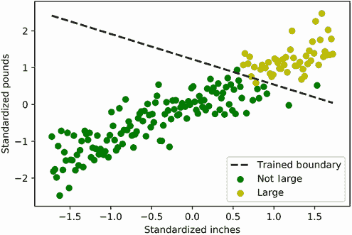

图 21.15 标准化客户测量的图表。使用 scikit-learn 得到的逻辑训练决策边界将大型客户和非大型客户分开。

列表 21.33 访问训练好的决策边界

```
coefficients = clf.coef_
bias = clf.intercept_
print(f"The coefficients equal {np.round(coefficients, 2)}")
print(f"The bias equals {np.round(bias, 2)}")
plot_boundary(np.hstack([clf.coef_[0], clf.intercept_]))

The coefficients equal [[2.22 3.22]]
The bias equals [-3.96]
```

我们可以通过执行 `clf.predict` 来对新数据进行预测。提醒一下，输入的数据必须标准化，以便我们的预测有意义。

列表 21.34 使用线性分类器预测类别

```
new_data = np.array([[63, 110], [76, 199]])
predictions = clf.predict(standardize(new_data))
print(predictions)

[0 1]
```

此外，我们可以通过运行 `clf.predict_proba` 来输出类标签概率。这些概率代表由逻辑曲线生成的类标签不确定性。

列表 21.35 输出每个类别的相关不确定性

```
probabilities = clf.predict_proba(standardize(new_data))
print(probabilities)

[[9.99990471e-01 9.52928118e-06]
 [1.80480919e-03 9.98195191e-01]]
```

在前两个代码列表中，我们依赖于自定义的 `standardize` 函数来标准化我们的输入数据。Scikit-learn 包含自己的标准化类，称为 `StandardScaler`。在这里，我们导入并初始化该类。

列表 21.36 初始化 scikit-learn 的标准化类

```
from sklearn.preprocessing import StandardScaler
standard_scaler = StandardScaler()
```

运行 `standard_scaler.fit_transform(X)` 返回一个标准化矩阵。矩阵列的均值等于 0，标准差等于 1。当然，矩阵与我们的现有标准化矩阵 `X_s` 相同。

列表 21.37 使用 scikit-learn 标准化训练数据

```
X_transformed = standard_scaler.fit_transform(X)
assert np.allclose(X_transformed.mean(axis=0), 0)
assert np.allclose(X_transformed.std(axis=0), 1)
assert np.allclose(X_transformed, X_s)
```

`standard_scaler` 对象已经学会了与我们的特征矩阵相关的均值和标准差，因此现在可以根据这些统计数据标准化数据。列表 21.38 通过运行 `standard_scaler.transform(new_data)` 标准化我们的 `new_data` 矩阵。我们将标准化后的数据传递给我们的分类器。预测输出应该等于我们之前看到的 `predictions` 数组。

列表 21.38 使用 scikit-learn 标准化新数据

```
data_transformed = standard_scaler.transform(new_data)
assert np.array_equal(clf.predict(data_transformed), predictions)
```

通过结合 `LogisticRegression` 和 `StandardScaler` 类，我们可以在复杂输入上训练逻辑模型。在下一小节中，我们将训练一个可以处理超过两个特征并预测超过两个类别标签的模型。

相关的 scikit-learn 线性分类器方法

+   `clf = LogisticRegression()`—初始化逻辑回归分类器

+   `scaler = StandardScaler()`—初始化一个标准缩放器

+   `clf.fit(scalar.fit_transform(X))`—在标准化数据上训练分类器

+   `clf.predict(scalar.transform(new_data))`—从标准化数据预测类别

+   `clf.predict_proba(scalar.transform(new_data))`—从标准化数据预测类别概率

### 21.4.1 训练多类别线性模型

我们已经展示了线性分类器如何找到将两类数据分开的决策边界。然而，许多问题需要我们区分超过两个类别。例如，考虑一下历史悠久的品酒实践。一些专家因其能够通过感官输入区分许多葡萄酒类别而闻名。假设我们尝试构建一个品酒机器。使用传感器，机器将检测一杯葡萄酒中的化学模式。这些测量值将被作为特征输入到线性分类器中。分类器将随后识别葡萄酒（以其精致和复杂度给我们留下深刻印象）。为了训练线性分类器，我们需要一个训练集。幸运的是，这样的数据集通过 scikit-learn 提供。让我们通过导入并运行 `load_wine` 函数来加载数据集，然后打印数据中的特征名称和类别标签。

列表 21.39 导入 scikit-learn 的葡萄酒数据集

```
from sklearn.datasets import load_wine
data = load_wine()
num_classes = len(data.target_names)
num_features = len(data.feature_names)
print(f"The wine dataset contains {num_classes} classes of wine:")
print(data.target_names)
print(f"\nIt contains the {num_features} features:")
print(data.feature_names)

The wine dataset contains 3 classes of wine:
['class_0' 'class_1' 'class_2']

It contains the 13 features:
['alcohol', 'malic_acid', 'ash', 'alcalinity_of_ash', 'magnesium',
'total_phenols', 'flavanoids', 'nonflavanoid_phenols', 'proanthocyanins', ❶
'color_intensity', 'hue', 'od280/od315_of_diluted_wines', 'proline']
```

❶ 数据集中“flavonoids”被误拼为“flavanoids。”

数据集包含 13 个测量特征，包括酒精含量（特征 0）、镁含量（特征 4）和色调（特征 10）。它还包含三种葡萄酒类别。

注意：这些酒的真正身份已经随着时间的流逝而丢失，尽管它们可能对应于不同的红葡萄酒类型，如赤霞珠、梅洛和黑皮诺。

我们如何训练逻辑回归模型来区分三种葡萄酒类型？嗯，我们最初可以训练一个简单的二分类器来检查葡萄酒是否属于类别 0。或者，我们可以训练一个不同的分类器来预测葡萄酒是否属于类别 1。最后，第三个分类器将确定葡萄酒是否属于类别 2。这实际上是 scikit-learn 内置的多类线性分类逻辑。给定三个类别类别，scikit-learn 学习三个决策边界，每个类别一个。然后模型对输入数据计算三个不同的预测，并选择置信度最高的预测。

注意：这是计算置信度对执行线性分类至关重要的另一个原因。

如果我们在三种类别的葡萄酒数据上训练我们的逻辑回归管道，我们将获得对应于类别 0、1 和 2 的三个决策边界。每个决策边界将有自己的权重向量。每个权重向量都将有一个偏差，因此训练好的模型将有三个偏差。这三个偏差将存储在一个三个元素的`clf.intercept_`数组中。访问`clf.intercept_[i]`将为我们提供类别*i*的偏差。让我们训练葡萄酒模型并打印出结果中的三个偏差。

列表 21.40 训练多类葡萄酒预测器

```
X, y = load_wine(return_X_y=True)
clf.fit(standard_scaler.fit_transform(X), y)
biases = clf.intercept_

print(f"We trained {biases.size} decision boundaries, corresponding to "
      f"the {num_classes} classes of wine.\n")

for i, bias in enumerate(biases):
    label = data.target_names[i]
    print(f"The {label} decision boundary has a bias of {bias:0.2f}")

We trained 3 decision boundaries, corresponding to the 3 classes of wine.

The class_0 decision boundary has a bias of 0.41
The class_1 decision boundary has a bias of 0.70
The class_2 decision boundary has a bias of -1.12
```

除了偏差之外，每个决策边界还必须有系数。系数用于分类时权衡输入的特征，因此系数与特征之间存在一一对应的关系。我们的数据集包含 13 个特征，代表葡萄酒的各种属性，因此每个决策边界必须有 13 个相应的系数。三个不同边界的系数可以存储在一个 3x13 的矩阵中。在 scikit-learn 中，该矩阵包含在`clf.coef_`中。矩阵的第*i*行对应于类别*i*的边界，第*j*列对应于第*j*个特征系数。例如，我们知道特征 0 等于葡萄酒的酒精含量，所以`clf_coeff_[2][0]`等于类别 2 边界的酒精系数。

让我们将系数矩阵可视化为热图（图 21.16）。这将使我们能够显示与行和列对应的特征名称和类别标签。注意，如果显示矩阵的转置，较长的特征名称更容易阅读。因此，我们将`clf.coeff_.T`输入到`sns.heatmap`中。

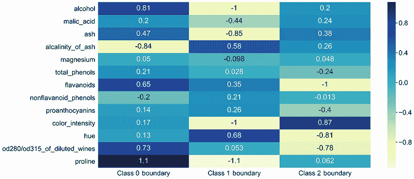

图 21.16 代表三个决策边界的 13 个特征系数的热图

列表 21.41 显示系数矩阵的转置

```
import seaborn as sns
plt.figure(figsize = (20, 10))                                     ❶
coefficients = clf.coef_

sns.heatmap(coefficients.T, cmap='YlGnBu', annot=True,             ❷
            xticklabels=[f"Class {i} Boundary" for i in range(3)],
            yticklabels=data.feature_names)
plt.yticks(rotation=0)
sns.set(font_scale=2)                                              ❸
plt.show()
```

❶ 调整绘制的热图宽度和高度分别为 20 英寸和 10 英寸

❷ 转置系数矩阵以便更容易显示系数名称

❸ 调整标签字体以提高可读性

在热图中，系数在边界之间变化。例如，对于类别边界 0、1 和 2，酒精系数分别为-0.81、-1 和 0.2。这种系数的差异非常有用；它们使我们能够更好地理解输入特征如何驱动预测。

相关 scikit-learn 线性分类器属性

+   `clf.coef_`—访问训练好的线性分类器的系数矩阵

+   `clf.intercept_`—访问训练好的线性分类器中的所有偏差值

## 21.5 使用系数测量特征重要性

在第二十部分中，我们讨论了 KNN 分类器不可解释的问题。使用 KNN，我们可以预测与输入特征相关的类别，但我们无法理解为什么这些特征属于该类别。幸运的是，逻辑回归分类器更容易解释。通过检查它们对应的系数，我们可以深入了解模型特征如何驱动预测。

线性分类是由特征和系数的加权求和驱动的。因此，如果一个模型采用三个特征 A、B 和 C 并依赖于三个系数[1, 0, 0.25]，那么预测部分由 A + 0.25 * C 的值决定。注意，在这个例子中，特征 B 被置零。将零系数乘以一个特征总是产生零值，因此该特征永远不会影响模型的预测输出。

现在，让我们考虑一个系数非常接近零的特征。该特征影响预测，但影响最小。或者，如果一个系数远离零，相关的特征将对模型预测产生更大的影响。基本上，绝对值更高的系数对模型的影响更大，因此它们相关的特征在评估模型性能时更为重要。例如，在我们的例子中，特征 A 是最有影响的，因为它的系数离零最远（图 21.17）。

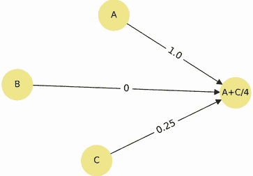

图 21.17 我们可以将特征[A, B, C]和系数[1, 0, 0.25]的加权求和可视化为一个有向图。在图中，最左边的节点代表特征，边权重代表系数。我们乘以每个节点对应的边权重并求和。这个和等于 A + C / 4，所以 A 比 C 影响大四倍。同时，B 被置零，对最终结果没有影响。

可以通过系数对特征进行评分，以评估其*特征重要性*：一个在分类过程中对特征有用性的评分。不同的分类器模型会产生不同的特征重要性评分。在线性分类器中，系数的绝对值作为粗略的重要性度量。

注意：第二十二部分中展示的模型具有更细致的特征重要性评分。

哪个特征对于正确检测 0 类葡萄酒最有用？我们可以通过根据 `clf.coef_[0]` 中 0 类系数的绝对值对特征进行排序来检查。

列表 21.42 按重要性排序 0 类特征

```
def rank_features(class_label):                        ❶
    absolute_values = np.abs(clf.coef_[class_label])   ❷
    for i in np.argsort(absolute_values)[::-1]:        ❸
        name = data.feature_names[i]
        coef = clf.coef_[class_label][i]
        print(f"{name}: {coef:.2f}")

rank_features(0)

proline: 1.08
alcalinity_of_ash: -0.84
alcohol: 0.81
od280/od315_of_diluted_wines: 0.73
flavanoids: 0.65
ash: 0.47
total_phenols: 0.21
malic_acid: 0.20
nonflavanoid_phenols: -0.20
color_intensity: 0.17
proanthocyanins: 0.14
hue: 0.13
magnesium: 0.05
```

❶ 根据 clf.coef_[class_label] 中系数的绝对值对特征进行排名

❷ 计算绝对值

❸ 按绝对值降序排列特征索引

脯氨酸在排名列表中位居首位；它是一种在葡萄酒中常见的化学物质，其浓度取决于葡萄类型。脯氨酸浓度是识别 0 类葡萄酒最重要的特征。现在，让我们检查哪个特征驱动 1 类葡萄酒的识别。

列表 21.43 按重要性排序 1 类特征

```
rank_features(1)

proline: -1.14
color_intensity: -1.04
alcohol: -1.01
ash: -0.85
hue: 0.68
alcalinity_of_ash: 0.58
malic_acid: -0.44
flavanoids: 0.35
proanthocyanins: 0.26
nonflavanoid_phenols: 0.21
magnesium: -0.10
od280/od315_of_diluted_wines: 0.05
total_phenols: 0.03
```

脯氨酸浓度是 0 类和 1 类葡萄酒最重要的特征。然而，该特征以不同的方式影响两个类别的预测：0 类的脯氨酸系数为正（1.08），而 1 类的系数为负（-1.14）。系数的符号非常重要。正系数会增加线性值的加权总和，而负值会减少这个总和。因此，脯氨酸在 1 类分类期间会减少加权总和。这种减少导致从决策边界到负的定向距离，因此 1 类的可能性降至零。同时，正的 0 类系数有完全相反的效果。因此，高脯氨酸浓度意味着以下：

+   葡萄酒不太可能是 1 类葡萄酒。

+   葡萄酒更有可能是 0 类葡萄酒。

我们可以通过绘制两种葡萄酒类别的脯氨酸浓度直方图来检验我们的假设（图 21.18）。

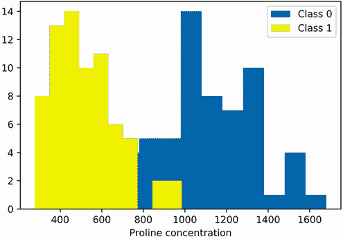

图 21.18 0 类和 1 类葡萄酒中脯氨酸浓度的直方图。0 类的浓度明显大于 1 类。我们的分类器通过将脯氨酸作为 0 类和 1 类的最高排名系数来捕捉到这个信号。

列表 21.44 绘制 0 类和 1 类葡萄酒的脯氨酸直方图

```
index = data.feature_names.index('proline')
plt.hist(X[y == 0][:, index], label='Class 0')
plt.hist(X[y == 1][:, index], label='Class 1', color='y')
plt.xlabel('Proline concentration')
plt.legend()
plt.show()
```

平均而言，0 类的脯氨酸浓度高于 1 类。这种差异是区分两种葡萄酒的信号。我们的分类器成功地学习了这个信号。通过探测分类器的系数，我们还了解到了不同葡萄酒的化学成分。

与 KNN 模型不同，逻辑回归分类器是可解释的。它们也易于训练和快速运行，因此线性分类器比 KNN 模型有所改进。不幸的是，线性分类器仍然存在一些非常严重的缺陷，限制了它们在某些情况下的实际应用。

## 21.6 线性分类器局限性

线性分类器在原始数据上表现不佳。正如我们所观察到的，标准化是获得最佳结果所必需的。同样，线性模型无法处理未经数据预处理的分类特征。假设我们正在构建一个模型来预测宠物是否会从收容所被领养。我们的模型可以在三个宠物类别上进行预测：猫、狗和兔子。表示这些类别的最简单方法是用数字：猫为 0，狗为 1，兔子为 2。然而，这种表示会导致线性模型失败。模型给兔子的关注是狗的两倍，并且完全忽略了猫。为了使模型对每种宠物给予同等关注，我们必须将类别转换为三个元素的二进制向量 `v`。如果一个宠物属于类别 `i`，则 `v[i]` 被设置为 `1`。否则，`v[i]` 等于 `0`。因此，我们用 `v = [1, 0, 0]` 表示猫，用 `v = [0, 1, 0]` 表示狗，用 `v = [0, 0, 1]` 表示兔子。这种向量化类似于第十三部分中看到的文本向量化。我们可以使用 scikit-learn 来执行这种转换。然而，这种转换可能很繁琐。下一节中介绍的模式可以在不进行额外预处理的情况下分析原始数据。

注意分类变量向量化通常被称为*独热编码*。Scikit-learn 包含一个 `OneHotEncoder` 转换器，可以从 `sklearn.preprocessing` 中导入。`OneHotEncoder` 类可以自动检测并向量化训练集中所有的分类特征。

线性分类器的最严重限制就在其名称中：线性分类器学习*线性*决策边界。更准确地说，需要一条线（或在更高维度的平面）来分离数据的类别。然而，有无数分类问题不是线性可分的。例如，考虑将城市家庭和非城市家庭进行分类的问题。假设预测是由距离城市中心的距离驱动的。所有距离中心小于两个距离单位的家庭都被归类为城市家庭；所有其他家庭被认为是郊外家庭。以下代码使用二维正态分布模拟这些家庭。我们还训练了一个逻辑回归分类器来区分家庭类别。最后，我们在二维空间中可视化模型的线性边界和实际的家庭（图 21.19）。

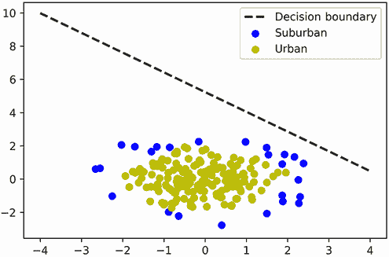

图 21.19 模拟的家庭相对于城市中心 `(0, 0)` 的位置。靠近中心的家庭被认为是城市家庭。城市家庭和郊外家庭之间不存在线性分离，因此训练的线性边界无法将它们区分开来。

列表 21.45 模拟非线性可分场景

```
np.random.seed(0)
X = np.array([[np.random.normal(), np.random.normal()]
              for _ in range(200)])                                       ❶
y = (np.linalg.norm(X, axis=1) < 2).astype(int)                           ❷

clf = LogisticRegression()
clf.fit(X, y)                                                             ❸
weights = np.hstack([clf.coef_[0], clf.intercept_])

a, b, c = weights
boundary = lambda x: -(a * x + c) / b
plt.plot(range(-4, 5), boundary(range(-4, 5)),  color='k', linestyle='--',
                                linewidth=2, label='Decision Boundary')   ❹
for i in [0, 1]:
    plt.scatter(X[y == i][:, 0], X[y == i][:, 1],
                label= ['Suburban', 'Urban'][i],
                color=['b', 'y'][i])

plt.legend()
plt.show()
```

❶ 每个家庭的 x 和 y 坐标来自两个标准正态分布。

❷ 城市中心位于坐标（0，0）。因此，一个家庭与中心的距离等于其范数。距离中心两个单位以内的家庭被标记为城市。

❸ 我们的数据来自均值为 0，标准差为 1 的分布。因此，对线性模型进行标准化不是必需的。

❹ 绘制训练好的决策边界与家庭坐标一起

线性边界无法分离类别。数据集的几何形状不允许进行这种分离。在数据科学术语中，数据是**非线性可分的**。因此，线性分类器无法得到充分的训练。我们需要运行非线性方法。在下一节中，我们将学习可以克服这一局限性的决策树技术。

## 摘要

+   在某些情况下，我们可以使用**线性决策边界**来分离数据类别。所有位于线性边界以下的数据点被分类为属于类别 0，所有位于线性边界以上的数据点被分类为属于类别 1。实际上，线性边界检查加权特征和一个常数相加是否大于零。这个常数值被称为**偏置**，其余的权重被称为**系数**。

+   通过代数操作，我们可以将线性分类转化为由 `M @ weights > 0` 定义的矩阵乘积不等式。这种由乘法驱动的分类定义了一个**线性分类器**。矩阵 `M` 是一个带有附加一列的**填充特征矩阵**，`weights` 是一个向量，最终向量的元素是偏置。其余的权重是系数。

+   为了获得一个好的决策边界，我们首先随机初始化 `weights`。然后，我们根据预测类别和实际类别之间的差异迭代调整权重。在最简单的线性分类器中，这种权重偏移与预测类别和实际类别之间的差异成正比。因此，权重偏移与三个值之一成比例：-1、0 或 1。

+   如果相关的特征等于零，我们绝不应该调整系数。我们可以通过将权重偏移乘以矩阵 `M` 中相应的特征值来确保这个约束。

+   迭代调整权重可能导致分类器在良好和较差的性能之间波动。为了限制波动，我们需要在每次后续迭代中降低权重偏移。这可以通过在每 *k* 次迭代中将权重偏移除以 `k` 来实现。

+   迭代权重调整可以收敛到一个不错的决策边界，但并不能保证找到最优的决策边界。我们可以通过减小数据的均值和标准差来改善边界。这种**标准化**可以通过减去均值然后除以标准差来实现。结果数据集的均值为 0，标准差为 1。

+   最简单的线性分类器被称为 **感知器**。感知器表现良好，但它们的输出可能不一致。感知器失败的部分原因是缺乏细微差别。靠近决策边界的点在分类上更加模糊。我们可以使用介于 0 和 1 之间的 S 形曲线来捕捉这种不确定性。累积正态分布函数可以作为不确定性的一个不错的度量，但更简单的 **逻辑曲线**更容易计算。逻辑曲线等于 `1 / (1 + e ** -z)`。

+   我们可以通过将权重偏移量按比例设置为 `实际 - 1 / (1 + e ** -distance)` 来将不确定性纳入模型训练。在这里，`distance` 代表到决策边界的有向距离。我们可以通过运行 `M @ weights` 来计算所有有向距离。

+   使用逻辑不确定性训练的分类器被称为 **逻辑回归分类器**。这种分类器比简单的感知器产生更一致的结果。

+   通过训练 **N** 个不同的线性决策边界，可以将线性分类器扩展到 **N** 个类别。

+   线性分类器中的系数作为 **特征重要性** 的度量。具有最大绝对值的系数映射到对模型预测有显著影响的特征。系数的符号决定了特征的存在与否表示类别的存在或不存在。

+   当数据不是 **线性可分** 且不存在良好的线性决策边界时，线性分类模型会失败。
