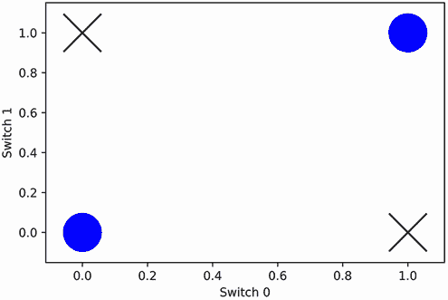
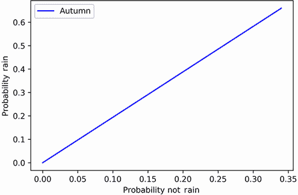
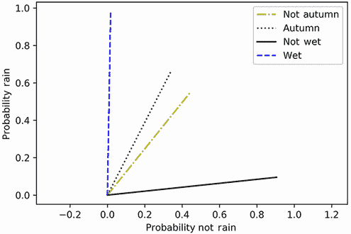
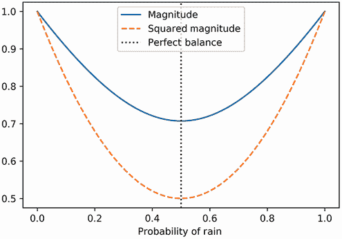
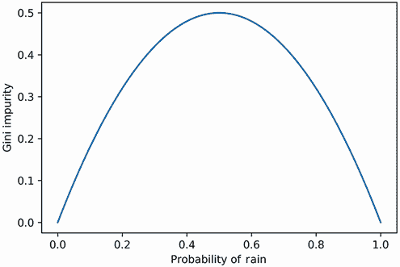
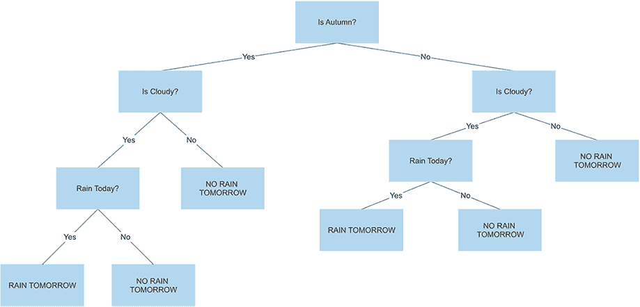
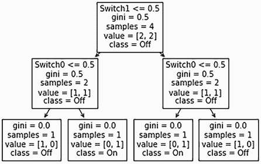
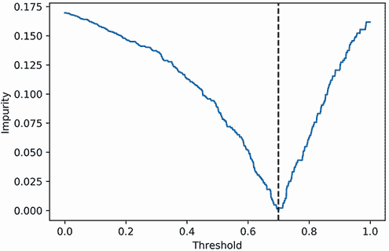
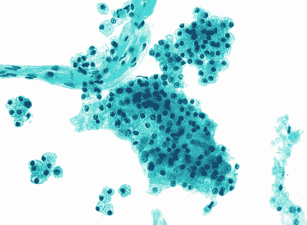
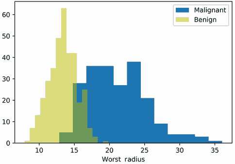

# 22 使用决策树技术训练非线性分类器

本节涵盖

+   对非线性可分的数据集进行分类

+   从训练数据自动生成`if`/`else`逻辑规则

+   什么是决策树？

+   什么是随机森林？

+   使用 scikit-learn 训练基于树的模型

到目前为止，我们已经研究了依赖于数据几何形状的监督学习技术。这种学习和几何之间的关联并不符合我们的日常经验。在认知层面上，人们不是通过抽象的空间分析来学习的；他们通过关于世界的逻辑推理来学习。这些推理可以与他人分享。一个蹒跚学步的孩子意识到，通过假装发脾气，他们有时可以得到额外的饼干。一个家长意识到，无意中纵容孩子会导致更多的坏行为。一个学生意识到，通过准备和学习，他们通常会在考试中做得很好。这样的认识并不特别新颖；它们是我们集体社会智慧的一部分。一旦做出有用的逻辑推理，就可以与他人分享，以供更广泛的使用。这种分享是现代科学的基础。一位科学家意识到某些病毒蛋白是药物的良好靶点。他们在期刊上发表他们的推理，这些知识在整个科学界传播。最终，基于科学发现，开发出了一种新的抗病毒药物。

在本节中，我们学习如何从我们的训练数据中算法性地推导出逻辑推理。这些简单的逻辑规则将为我们提供不受数据几何形状约束的预测模型。

## 22.1 自动学习逻辑规则

让我们分析一个看似简单的问题。假设一个灯泡悬挂在楼梯井上方。灯泡连接到楼梯顶部和底部的两个开关。当两个开关都关闭时，灯泡保持关闭状态。如果任一开关打开，灯泡就会亮起。然而，如果两个开关都打开，灯泡会熄灭。这种安排允许我们在楼梯底部激活灯光，然后在上升后将其关闭。

我们可以将开关的开启和关闭状态以及灯泡的状态表示为二进制数字 0 和 1。给定两个开关变量`switch0`和`switch1`，我们可以简单地表明，当`switch0 + switch1 == 1`时，灯泡是开启的。使用前两节的内容，我们能否训练一个分类器来学习这种简单的关系？我们将通过存储所有可能的光开关组合在一个两列的特征矩阵`X`中，然后我们将绘制矩阵的行在二维空间中，并标记每个点基于灯泡的对应开启/关闭状态（图 22.1）。这个图将给我们提供关于 KNN 和线性分类器如何处理这个分类问题的洞察。



图 22.1 绘制灯泡开关系统的所有状态。激活的灯泡用 X 表示，未激活的灯泡用 O 表示。每个 O 的最近邻是 X 标记（反之亦然）。因此，KNN 不能用于分类。此外，X 标记和 O 标记之间没有线性分离，所以不能应用线性分类。

列表 22.1 在二维空间绘制双开关问题

```
import numpy as np
import matplotlib.pyplot as plt
X = np.array([[0, 0], [1, 0], [0, 1], [1, 1]])
y = (X[:,0] + X[:,1] == 1).astype(int)

for i in [0, 1]:
    plt.scatter(X[y == i][:,0], X[y == i][:,1],
                marker=['o', 'x'][i], color=['b', 'k'][i],
                s=1000)
plt.xlabel('Switch 0')
plt.ylabel('Switch 1')
plt.show()
```

四个绘制的点位于正方形的四个角上。同一类中的每对点在该正方形上对角排列，所有相邻的点属于不同的类。每个开启开关组合的两个最近邻是关闭类成员（反之亦然）。因此，KNN 将无法正确分类数据。此外，标记的类之间也没有线性分离，所以我们不能在不穿过连接两个相同分类点的对角线的情况下绘制线性边界。因此，训练线性分类器也成问题。我们应该怎么办？一种方法是将两个嵌套的 `if`/`else` 语句定义为我们的预测模型。让我们编写并测试这个 `if`/`else` 分类器。

列表 22.2 使用嵌套 `if`/`else` 语句分类数据

```
def classify(features):
    switch0, switch1 = features

    if switch0 == 0:
        if switch1 == 0:
            prediction = 0
        else:
            prediction = 1
    else:
        if switch1 == 0:
            prediction = 1
        else:
            prediction = 0

    return prediction

for i in range(X.shape[0]):
    assert classify(X[i]) == y[i]
```

我们的 `if`/`else` 分类器是 100% 准确的，但我们没有对其进行训练。相反，我们亲自编程了分类器。手动模型构建不算作监督机器学习，因此我们需要找到一种方法，从训练数据中自动推导出准确的 `if`/`else` 语句。让我们弄清楚如何做到这一点。

我们从一个简单的训练示例开始。我们的训练集代表了一个单一开关和单一灯泡之间的一系列记录观察。每当开关开启时，灯泡也开启，反之亦然。我们随机地打开和关闭灯泡，并记录我们所看到的情况。灯泡的状态记录在 `y_simple` 数组中。我们对应开关的单个特征记录在一个单列的 `X_simple` 矩阵中。当然，`X_simple[i][0]` 将始终等于 `y[i]`。让我们生成这个基本训练集。

列表 22.3 生成单个开关训练集

```
np.random.seed(0)
y_simple = np.random.binomial(1, 0.5, size=10)    ❶
X_simple = np.array([[e] for e in y_simple])      ❷
print(f"features: {X_simple}")
print(f"\nlabels: {y_simple}")

features: [[1]
 [1]
 [1]
 [1]
 [0]
 [1]
 [0]
 [1]
 [1]
 [0]]

labels: [1 1 1 1 0 1 0 1 1 0]
```

❶ 灯泡的状态是通过随机抛硬币来模拟的。

❷ 开关的状态始终等于灯泡的状态。

接下来，我们计算所有开关关闭且灯泡关闭的观察结果。

列表 22.4 计算关闭状态共现次数

```
count = (X_simple[:,0][y_simple == 0] == 0).sum()
print(f"In {count} instances, both the switch and the light are off")
In 3 instances, both the switch and the light are off
```

现在，让我们计算开关和灯泡都开启的实例。

列表 22.5 计算开启状态共现次数

```
count = (X_simple[:,0][y_simple == 1] == 1).sum()
print(f"In {count} instances, both the switch and the light are on")

In 7 instances, both the switch and the light are on
```

这些共现将在分类器训练期间非常有用。让我们在一个共现矩阵 `M` 中更系统地跟踪计数。矩阵行跟踪开关的开启/关闭状态，矩阵列跟踪灯泡的状态。每个元素 `M[i][j]` 计算开关处于状态 `i` 且灯泡处于状态 `j` 的示例数量。因此，`M[0][0]` 应等于 7，`M[1][1]` 应等于 3。

我们现在定义一个`get_co_occurrence`函数来计算共现矩阵。该函数接受一个训练集`(X, y)`和一个列索引`col`作为输入。它返回`y`中所有类别与`X[:,col]`中所有特征状态之间的共现。

列表 22.6 计算共现矩阵

```
def get_co_occurrence(X, y, col=0):
    co_occurrence = []
    for i in [0, 1]:
        counts = [(X[:,col][y == i] == j).sum()
                  for j in [0, 1]]
        co_occurrence.append(counts)

    return np.array(co_occurrence)

M = get_co_occurrence(X_simple, y_simple)
assert M[0][0] == 3
assert M[1][1] == 7
print(M)

[[3 0]
 [0 7]]
```

使用`get_co_occurrence`，我们已经计算了矩阵`M`。所有的共现都位于矩阵的对角线上。当开关被翻转关闭时，灯泡永远不会开启，反之亦然。然而，假设开关切换有缺陷。我们关闭开关，但灯泡保持开启！让我们将这个异常观察结果添加到我们的数据中，然后重新计算矩阵`M`。

列表 22.7 向数据中添加一个有缺陷的不匹配

```
X_simple = np.vstack([X_simple, [1]])
y_simple = np.hstack([y_simple, [0]])
M = get_co_occurrence(X_simple, y_simple)
print(M)

[[3 1]
 [0 7]]
```

当我们关闭开关时，灯泡大多数时候会关闭，但并不是每次都会关闭。如果我们知道开关是关闭的，我们如何准确地预测灯泡的状态？为了找出答案，我们必须将`M[0]`除以`M[0].sum()`。这样做会产生一个概率分布，当开关状态设置为`0`时，它覆盖了可能的光泡状态。

列表 22.8 当开关关闭时计算灯泡概率

```
bulb_probs = M[0] / M[0].sum()
print("When the switch is set to 0, the bulb state probabilities are:")
print(bulb_probs)
prob_on, prob_off = bulb_probs
print(f"\nThere is a {100 * prob_on:.0f}% chance that the bulb is off.")
print(f"There is a {100 * prob_off:.0f}% chance that the bulb is on.")

When the switch is set to 0, the bulb state probabilities are:
[0.75 0.25]

There is a 75% chance that the bulb is off.
There is a 25% chance that the bulb is on.
```

当开关关闭时，我们应该假设灯泡是关闭的。我们的猜测将有 75%的时间是正确的。这个修正分数符合我们在第二十部分中定义的准确度，因此当开关关闭时，我们可以以 75%的准确度预测灯泡的状态。

现在我们来优化开关开启时的准确度。我们首先在`M[1]`上计算`bulb_probs`。接下来，我们选择对应最大概率的开关状态。基本上，我们推断灯泡状态等于`bulb_probs.argmax()`，准确度评分为`bulb_probs.max()`。

列表 22.9 预测开关开启时灯泡的状态

```
bulb_probs = M[1] / M[1].sum()
print("When the switch is set to 1, the bulb state probabilities are:")
print(bulb_probs)

prediction = ['off', 'on'][bulb_probs.argmax()]
accuracy = bulb_probs.max()
print(f"\nWe assume the bulb is {prediction} with "
      f"{100 * accuracy:.0f}% accuracy")

When the switch is set to 1, the bulb state probabilities are:
[0\. 1.]

We assume the bulb is on with 100% accuracy
```

当开关关闭时，我们以 75%的准确度假设灯泡是关闭的。当开关开启时，我们以 100%的准确度假设灯泡是开启的。我们如何将这些值组合成一个单一的准确度评分？天真地，我们可以简单地平均 0.75 和 1.0，但这种做法是错误的。这两个准确度不应该平均加权，因为开关开启的频率几乎是关闭的两倍。我们可以通过在共现矩阵`M`的列上求和来确认。运行`M.sum(axis=1)`返回开关的开启和关闭状态的计数。

列表 22.10 计算开关的开启和关闭状态

```
for i, count in enumerate(M.sum(axis=1)):
    state = ['off', 'on'][i]
    print(f"The switch is {state} in {count} observations.")

The switch is off in 4 observations.
The switch is on in 7 observations.
```

开关处于开启状态比关闭状态的频率更高。因此，为了得到一个有意义的准确度评分，我们需要对 0.75 和 1.0 进行加权平均。权重应与从`M`中获得的开启/关闭开关计数相对应。

列表 22.11 计算总准确度

```
accuracies = [0.75, 1.0]
total_accuracy = np.average(accuracies, weights=M.sum(axis=1))
print(f"Our total accuracy is {100 * total_accuracy:.0f}%")

Our total accuracy is 91%
```

如果开关关闭，我们预测灯泡是关闭的；否则，我们预测灯泡是开启的。这个模型准确率为 91%。此外，该模型可以用 Python 中的简单`if`/`else`语句表示。最重要的是，我们能够使用以下步骤从头开始训练模型：

1.  在我们的特征矩阵`X`中选择一个特征。

1.  计算两个可能的特征状态和两个类别类型之间的共现次数。这些共现次数存储在一个二乘二的矩阵`M`中。

1.  对于`M`中的行`i`，当特征处于状态`i`时，计算类别的概率分布。这个概率分布等于`M[i] / M[i].sum()`。`M`中只有两行，因此我们可以将分布存储在两个变量中：`probs0`和`probs1`。

1.  定义我们条件模型的`if`部分。如果特征等于 0，我们返回`probs0.argmax()`标签。这最大化了`if`语句的准确性。这个准确性等于`probs0.max()`。

1.  定义我们条件模型的`else`部分。当特征不等于 0 时，我们返回`probs1.argmax()`标签。这最大化了`else`语句的准确性。这个准确性等于`probs1.max()`。

1.  将`if`和`else`语句合并为一个单一的`if`/`else`条件语句。偶尔，，`probs0.argmax()`将等于`probs1.argmax()`。在这种情况下，使用`if`/`else`语句是多余的。相反，我们可以返回简单的规则`f"prediction = {probs0.argmax()}"`。

1.  结合的`if`/`else`语句的准确性等于`probs0.max()`和`probs1.max()`的加权平均值。权重对应于通过求和`M`的列获得的特征状态的数量。

让我们定义一个`train_if_else`函数来执行这七个步骤。该函数返回训练好的`if`/`else`语句及其相应的准确性。

列出 22.12 训练简单的`if`/`else`模型

```
def train_if_else(X, y, feature_col=0, feature_name='feature'):   ❶
    M = get_co_occurrence(X, y, col=feature_col)
    probs0, probs1 = [M[i] / M[i].sum() for i in [0, 1]]

    if_else = f"""if {feature_name} == 0:                         ❷
    prediction = {probs0.argmax()}
else:
    prediction = {probs1.argmax()}
    """.strip()

    if probs0.argmax() == probs1.argmax():                        ❸
        if_else = f"prediction = {probs0.argmax()}"

    accuracies = [probs0.max(), probs1.max()]
    total_accuracy = np.average(accuracies, weights=M.sum(axis=1))
    return if_else, total_accuracy

if_else, accuracy = train_if_else(X_simple, y_simple, feature_name='switch')
print(if_else)
print(f"\nThis statement is {100 * accuracy:.0f}% accurate.")

if switch == 0:
    prediction = 0
else:
    prediction = 1

This statement is 91% accurate.
```

❶ 在训练集（X, y）上训练 if/else 语句，并返回相应的语句及其准确性。该语句在 X[:,feature_col]中的特征上训练。相应的特征名称存储在 feature_name 中。

❷ 创建 if/else 语句

❸ 如果条件语句的两个部分都返回相同的预测，我们将语句简化为仅该预测。

我们能够使用单个特征训练一个简单的`if`/`else`模型。现在，让我们弄清楚如何使用两个特征训练嵌套的`if`/`else`模型。稍后，我们将扩展这个逻辑到超过两个特征。

### 22.1.1 使用两个特征训练嵌套的 if/else 模型

让我们回到我们的两个开关连接到单个楼梯灯泡的系统。作为提醒，这个系统的所有状态都由列表 22.1 生成的数据集 `(X, y)` 表示。我们的两个特征 `switch0` 和 `switch1` 对应于矩阵 `X` 的列 `0` 和 `1`。然而，`train_if_else` 函数一次只能训练一个列。让我们训练两个单独的模型：一个在 `switch0` 上，另一个在 `switch1` 上。每个模型的表现将如何？我们将通过输出它们的准确度来找出答案。

列表 22.13 在双开关系统中训练模型

```
feature_names = [f"switch{i}" for i in range(2)]
for i, name in enumerate(feature_names):
    _, accuracy = train_if_else(X, y, feature_col=i, feature_name=name)
    print(f"The model trained on {name} is {100 * accuracy:.0f}% "
           "accurate.")

The model trained on switch0 is 50% accurate.
The model trained on switch1 is 50% accurate.
```

两个模型都表现得很糟糕！一个单独的 `if`/`else` 语句不足以捕捉问题的复杂性。我们应该怎么办？一种方法是将问题分解成几个部分，通过训练两个单独的模型：模型 A 考虑 `switch0` 关闭的所有场景，模型 B 考虑 `switch0` 开启的所有剩余场景。稍后，我们将模型 A 和模型 B 结合成一个单一的、连贯的分类器。

让我们调查第一种情况，其中 `switch0` 是关闭的。当它关闭时，`X[:,0] == 0`。因此，我们首先隔离一个满足这个布尔要求的训练子集。我们将这个训练子集存储在变量 `X_switch0_off` 和 `y_switch0_off` 中。

列表 22.14 隔离 `switch0` 关闭的训练子集

```
is_off = X[:,0] == 0
X_switch0_off = X[is_off]
y_switch0_off = y[is_off]
print(f"Feature matrix when switch0 is off:\n{X_switch0_off}")
print(f"\nClass labels when switch0 is off:\n{y_switch0_off}")

Feature matrix when switch0 is off:
[[0 0]                              ❶
 [0 1]]

Class labels when switch0 is off:
[0 1]
```

❶ 列 0 的所有元素现在都等于 0。

在训练子集中，`switch0` 总是关闭的。因此，`X_switch0_off[:,0]` 总是等于零。现在这个零列是冗余的，我们可以使用 NumPy 的 `np.delete` 函数删除这个无用的列。

列表 22.15 删除冗余特征列

```
X_switch0_off = np.delete(X_switch0_off, 0, axis=1)   ❶
print(X_switch0_off)

[[0]                                                  ❷
 [1]]
```

❶ 运行 np.delete(X, r) 返回删除了第 r 行的 X 的副本，运行 np.delete(X, c, axis=1) 返回删除了第 c 列的 X 的副本。在这里，我们删除了冗余的列 0。

❷ 已删除 0 元素列。

接下来，我们在训练子集上训练一个 `if`/`else` 模型。该模型根据 `switch1` 的状态预测灯泡的激活。这些预测仅在 `switch0` 关闭时有效。我们将模型存储在 `switch0_off_model` 变量中，并将模型的准确度存储在相应的 `switch0_off_accuracy` 变量中。

列表 22.16 当 `switch0` 关闭时训练模型

```
results = train_if_else(X_switch0_off, y_switch0_off,
                        feature_name='switch1')
switch0_off_model, off_accuracy = results
print("If switch 0 is off, then the following if/else model is "
      f"{100 * off_accuracy:.0f}% accurate.\n\n{switch0_off_model}")

If switch 0 is off, then the following if/else model is 100% accurate.

if switch1 == 0:
    prediction = 0
else:
    prediction = 1
```

如果 `switch0` 关闭，那么我们训练的 `if`/`else` 模型可以以 100% 的准确度预测灯泡的状态。现在，让我们训练一个相应的模型来覆盖 `switch0` 开启的所有情况。我们首先根据条件 `X[:,0] == 1` 过滤我们的训练数据。

列表 22.17 隔离 `switch0` 开启的训练子集

```
def filter_X_y(X, y, feature_col=0, condition=0):              ❶
    inclusion_criteria = X[:,feature_col] == condition         ❷
    y_filtered = y[inclusion_criteria]
    X_filtered = X[inclusion_criteria]
    X_filtered = np.delete(X_filtered, feature_col, axis=1)    ❸
    return X_filtered, y_filtered

X_switch0_on, y_switch0_on = filter_X_y(X, y, condition=1)
```

❶ 根据矩阵 X 中特征列的特征过滤训练数据。返回一个子集，其中特征等于指定的条件值。

❷ 一个布尔数组，其中第 *i* 个元素为 True，如果 X[i][feature_col] 等于条件

❸ 由于所有过滤后的值都等于条件，列特征 feature_col 变得冗余。因此，这个列从训练数据中被过滤掉。

接下来，我们使用过滤后的训练集训练 `switch0_on_model`。

列表 22.18 当 `switch0` 开启时训练模型

```
results = train_if_else(X_switch0_on, y_switch0_on,
                        feature_name='switch1')
switch0_on_model, on_accuracy = results
print("If switch 0 is on, then the following if/else model is "
      f"{100 * on_accuracy:.0f}% accurate.\n\n{switch0_on_model}")

If switch 0 is on, then the following if/else model is 100% accurate.

if switch1 == 0:
    prediction = 1
else:
    prediction = 0
```

如果 `switch == 0`，则 `switch0_off_model` 以 100% 的准确率执行。在所有其他情况下，`switch1_on_model` 以 100% 的准确率执行。这两个模型可以很容易地合并成一个嵌套的 `if`/`else` 语句。在这里，我们定义了一个 `combine_if_else` 函数来合并两个单独的 `if`/`else` 语句；然后我们将该函数应用于我们的两个模型。

列表 22.19 合并单独的 `if`/`else` 模型

```
def combine_if_else(if_else_a, if_else_b, feature_name='feature'):   ❶
    return  f"""
if {feature_name} == 0:
{add_indent(if_else_a)}                                              ❷
else:
{add_indent(if_else_b)}
""".strip()

def add_indent(if_else):                                             ❸
    return '\n'.join([4 * ' ' + line for line in if_else.split('\n')])

nested_model = combine_if_else(switch0_off_model, switch0_on_model,
                               feature_name='switch0')
print(nested_model)

if switch0 == 0:
    if switch1 == 0:
        prediction = 0
    else:
        prediction = 1
else:
    if switch1 == 0:
        prediction = 1
    else:
        prediction = 0
```

❶ 将两个 if/else 语句 if_else_a 和 if_else_b 合并成一个嵌套语句

❷ 在嵌套过程中，每个语句都添加了标准的四个空格缩进。

❸ 这个辅助函数有助于在嵌套过程中缩进所有语句。

我们已经重现了列表 22.2 中的嵌套 `if`/`else` 模型。此模型准确率为 100%。我们可以通过取 `off_accuracy` 和 `on_accuracy` 的加权平均来确认。这些准确率对应于 `switch0` 的 `off`/`on` 状态，因此它们的权重应该对应于与 `switch0` 相关的 off/on 计数。这些计数等于 `y_switch0_off` 和 `y_switch0_on` 数组的长度。让我们取加权平均并确认总准确率等于 1.0。

列表 22.20 计算总嵌套准确率

```
accuracies = [off_accuracy, on_accuracy]
weights = [y_switch0_off.size, y_switch0_on.size]
total_accuracy = np.average(accuracies, weights=weights)
print(f"Our total accuracy is {100 * total_accuracy:.0f}%")

Our total accuracy is 100%
```

我们能够以自动化的方式生成嵌套的双特征模型。我们的策略依赖于创建单独的训练集。这种分离由一个特征的一个 `on`/`off` 状态决定。这种类型的分离称为 *二元分割*。通常，我们使用两个参数来分割训练集 `(X, y)`：

+   特征 `i` 对应于 `X` 的第 `i` 列。例如，`switch0` 在 `X` 的第 `0` 列。

+   条件 `c`，其中 `X[:,i] == c` 对于某些但不是所有数据点是 `True`。例如，条件 `0` 对应于 `off` 状态。

在特征 `i` 和条件 `c` 上进行分割可以按以下方式进行：

1.  获取一个训练子集 `(X_a, y_a)`，其中 `X_a[:,i] == c`。

1.  获取一个训练子集 `(X_b, y_b)`，其中 `X_b[:,i] != c`。

1.  从 `X_a` 和 `X_b` 中删除第 `i` 列。

1.  返回分离的子集 `(X_a, y_a)` 和 `(X_b, y_b)`。

注意：这些步骤不是为了在连续特征上运行而设计的。在本节稍后，我们将讨论如何将连续特征转换为二元变量以执行分割。

让我们定义一个 `split` 函数来执行这些步骤。然后我们将此函数集成到一个系统化的训练流程中。

列表 22.21 定义二元分割函数

```
def split(X, y, feature_col=0, condition=0):             ❶
    has_condition = X[:,feature_col] == condition
    X_a, y_a = [e[has_condition] for e in [X, y]]        ❷
    X_b, y_b = [e[~has_condition] for e in [X, y]        ❸
    X_a, X_b = [np.delete(e, feature_col, axis=1) for e in [X_a, X_b]]
    return [X_a, X_b, y_a, y_b]

X_a, X_b, y_a, y_b = split(X, y)
assert np.array_equal(X_a, X_switch0_off)
assert np.array_equal(X_b, X_switch0_on)
```

❶ 在特征矩阵 `X` 的第 `feature_col` 列的特征上进行二元分割

❷ 分割创建了两个训练集 (X_a, y_a) 和 (X_b, y_b)。在第一个训练集中，X_a[:,feature_col] 总是等于条件。

❸ 在第二个训练集中，X_a[:,feature_col] 从不等于条件。

通过在`switch0`上拆分，我们能够训练一个嵌套模型。在拆分之前，我们首先尝试训练简单的`if`/`else`模型。这些模型表现极差——我们别无选择，只能拆分训练数据。但是，训练好的嵌套模型应该与`train_if_else`返回的简单模型进行比较。如果简单模型表现出可比较的性能，则应返回该简单模型。

注意：嵌套的双特征模型永远不会比基于单个特征的简单模型表现得更差。然而，两个模型可能表现同样好。在这种情况下，最好遵循奥卡姆剃刀原则：当两个竞争的理论做出完全相同的预测时，更简单的理论是更好的理论。

让我们形式化训练双特征嵌套模型的过程。给定训练集`(X, y)`，我们执行以下步骤：

1.  选择一个用于拆分的特征`i`。最初，该特征由参数指定。稍后，我们将学习如何以自动化的方式选择该特征。

1.  尝试在特征`i`上训练一个简单的单特征模型。如果该模型以 100%的准确度运行，则将其作为我们的输出返回。

    理论上，我们可以使用`train_if_else`在列`0`和`1`上训练两个单特征模型。然后我们可以系统地比较所有单特征模型。然而，当我们从两个特征增加到*N*个特征时，这种方法不会扩展。

1.  使用`split`在特征`i`上拆分。该函数返回两个训练集`(X_a, y_a)`和`(X_b, y_b)`。

1.  使用`split`返回的训练集训练两个简单模型`if_else_a`和`if_else_b`。相应的准确度等于`accuracy_a`和`accuracy_b`。

1.  将`if_else_a`和`if_else_b`合并为一个嵌套的`if`/`else`条件模型。

1.  使用`accuracy_a`和`accuracy_b`的加权平均值来计算嵌套模型的准确度。权重等于`y_a.size`和`y_b.size`。

1.  如果嵌套模型在步骤 2 中计算出的简单模型上表现更好，则返回嵌套模型。否则，返回简单模型。

让我们定义一个`train_nested_if_else`函数来执行这些步骤。该函数返回训练好的模型及其准确度。

列表 22.22：训练嵌套的`if`/`else`模型

```
def train_nested_if_else(X, y, split_col=0,
                         feature_names=['feature1', 'feature1']):         ❶
    split_name = feature_names[split_col]
    simple_model, simple_accuracy = train_if_else(X, y, split_col,
                                                  split_name)             ❷
    if simple_accuracy == 1.0:
        return (simple_model, simple_accuracy)

    X_a, X_b, y_a, y_b = split(X, y, feature_col=split_col)
    in_name = feature_names[1 - split_col]                                ❸
    if_else_a, accuracy_a = train_if_else(X_a, y_a, feature_name=in_name) ❹
    if_else_b, accuracy_b = train_if_else(X_b, y_b, feature_name=in_name)
    nested_model = combine_if_else(if_else_a, if_else_b, split_name)      ❺
    accuracies = [accuracy_a, accuracy_b]
    nested_accuracy = np.average(accuracies, weights=[y_a.size, y_b.size])
    if nested_accuracy > simple_accuracy:
        return (nested_model, nested_accuracy)

    return (simple_model, simple_accuracy)

feature_names = ['switch0', 'switch1']
model, accuracy = train_nested_if_else(X, y, feature_names=feature_names)
print(model)
print(f"\nThis statement is {100 * accuracy:.0f}% accurate.")
if switch0 == 0:
    if switch1 == 0:
        prediction = 0
    else:
        prediction = 1
else:
    if switch1 == 0:
        prediction = 1
    else:
        prediction = 0

This statement is 100% accurate.
```

❶ 在双特征训练集`(X, y)`上训练嵌套的`if`/`else`语句，并返回相应的准确度。该语句通过在`X[:,split_col]`中的特征上拆分来训练。声明中的特征名称存储在`feature_names`数组中。

❷ 声明中的特征名称存储在`feature_names`数组中。

❸ 嵌套语句内部位置的特征名称

❹ 训练两个简单模型

❺ 合并简单模型

我们的功能训练了一个 100%准确的模型。鉴于我们当前的训练集，即使我们在`switch1`而不是`switch0`上拆分，该准确度也应保持不变。让我们验证一下。

列表 22.23：在`switch1`而不是`switch0`上拆分

```
model, accuracy = train_nested_if_else(X, y, split_col=1,
                                       feature_names=feature_names)
print(model)
print(f"\nThis statement is {100 * accuracy:.0f}% accurate.")

if switch1 == 0:
    if switch0 == 0:
        prediction = 0
    else:
        prediction = 1
else:
    if switch0 == 0:
        prediction = 1
    else:
        prediction = 0

This statement is 100% accurate.
```

分割任一特征都会得到相同的结果。这适用于我们的双开关系统，但对于许多现实世界的训练集来说并非如此。通常一个分割会优于另一个分割。在下一个小节中，我们将探讨如何在分割时优先考虑特征。

### 22.1.2 决定分割哪个特征

假设我们希望训练一个`if`/`else`模型来预测外面是否在下雨。如果正在下雨，模型返回`1`，否则返回`0`。该模型依赖于以下两个特征：

+   当前季节是秋季吗？是或否？

    我们假设秋季是当地的雨季，并且该特征预测降雨的概率为 60%。

+   目前外面是否潮湿？是或否？

    通常情况下，潮湿时就会下雨。偶尔，晴天时由喷水系统引起的潮湿；在森林中，如果树木阻挡了雨滴，细雨的早晨可能会出现干燥的条件。我们假设这个特征预测降雨的概率为 95%。

让我们通过随机抽样模拟特征和类别标签。我们在 100 次天气观测中抽样，并将输出存储在训练集`(X_rain, y_rain)`中。

列表 22.24 模拟雨天训练集

```
np.random.seed(1)
y_rain = np.random.binomial(1, 0.6, size=100)                            ❶
is_wet = [e if np.random.binomial(1, 0.95) else 1 - e for e in y_rain]   ❷
is_fall = [e if np.random.binomial(1, 0.6) else 1 - e for e in y_rain]   ❸
X_rain = np.array([is_fall, is_wet]).T
```

❶ 60%的时间会下雨。

❷ 95%的时间，潮湿状态等于降雨状态。

❸ 60%的时间，秋季状态等于降雨状态。

现在，让我们通过分割秋季特征来训练一个模型。

列表 22.25 使用秋季分割训练模型

```
feature_names = ['is_autumn', 'is_wet']
model, accuracy = train_nested_if_else(X_rain, y_rain,
                                       feature_names=feature_names)
print(model)
print(f"\nThis statement is {100 * accuracy:.0f}% accurate.")

if is_autumn == 0:
    if is_wet == 0:
        prediction = 0
    else:
        prediction = 1
else:
    if is_wet == 0:
        prediction = 0
    else:
        prediction = 1

This statement is 95% accurate.
```

我们训练了一个准确率达到 95%的嵌套模型。如果我们根据湿度特征来分割会怎样呢？

列表 22.26 使用湿度分割训练模型

```
model, accuracy = train_nested_if_else(X_rain, y_rain, split_col=1,
                                       feature_names=feature_names)
print(model)
print(f"\nThis statement is {100 * accuracy:.0f}% accurate.")

if is_wet == 0:
    prediction = 0
else:
    prediction = 1

This statement is 95% accurate.
```

根据湿度特征分割可以得到一个更简单（因此更好）的模型，同时保持之前看到的准确率。并非所有分割都是平等的：根据某些特征分割会导致更好的结果。我们应该如何选择最佳的分割特征？直观地，我们可以遍历`X`中的所有特征，通过每个特征分割来训练模型，并返回最简单且准确率最高的模型。当`X.size[1] == 2`时，这种暴力方法有效，但随着特征数量的增加，它将无法扩展。我们的目标是开发一种可以扩展到数千个特征的技巧，因此我们需要一个替代方法。

一种解决方案要求我们检查训练集中类别的分布。目前，我们的`y_rain`数组包含两个二进制类别：`0`和`1`。标签`1`对应于降雨观测。因此，数组的和等于降雨观测的数量。同时，数组的大小等于观测总数，所以`y_rain.sum() / y_rain.size`等于降雨的整体概率。让我们打印出这个概率。

列表 22.27 计算降雨概率

```
prob_rain = y_rain.sum() / y_rain.size
print(f"It rains in {100 * prob_rain:.0f}% of our observations.")

It rains in 61% of our observations
```

在所有观测中，有 61% 降雨。当我们根据秋天分割时，这个概率是如何改变的？嗯，分割返回两个训练集和两个类别标签数组。我们将这些数组称为 `y_fall_a` 和 `y_fall_b`。将 `y_fall_b.sum()` 除以数组大小返回秋天降雨的可能性。让我们打印出这个可能性和其他季节降雨的可能性。

列表 22.28 基于季节计算降雨概率

```
y_fall_a, y_fall_b = split(X_rain, y_rain, feature_col=0)[-2:]
for i, y_fall in enumerate([y_fall_a, y_fall_b]):
    prob_rain = y_fall.sum() / y_fall.size
    state = ['not autumn', 'autumn'][i]
    print(f"It rains {100 * prob_rain:.0f}% of the time when it is "
          f"{state}")

It rains 55% of the time when it is not autumn
It rains 66% of the time when it is autumn
```

如预期的那样，我们更有可能在秋天看到降雨，但这种可能性差异并不很大。在秋天，有 66% 的时间会下雨，而在其他季节有 55% 的时间会下雨。值得注意的是，这两个概率接近我们整体的降雨可能性 61%。如果我们知道现在是秋天，那么我们对降雨的信心会稍微增加。然而，与原始训练集相比，我们的信心增加并不非常显著，所以根据秋天分割并不是很有信息量。如果我们根据潮湿来分割呢？让我们检查这个分割是否改变了观察到的概率。

列表 22.29 基于潮湿计算降雨概率

```
y_wet_a, y_wet_b = split(X_rain, y_rain, feature_col=1)[-2:]
for i, y_wet in enumerate([y_wet_a, y_wet_b]):
    prob_rain = y_wet.sum() / y_wet.size
    state = ['not wet', 'wet'][i]
    print(f"It rains {100 * prob_rain:.0f}% of the time when it is "
          f"{state}")

It rains 10% of the time when it is not wet
It rains 98% of the time when it is wet
```

如果我们知道外面是湿的，那么我们对降雨的信心几乎是完美的。每当它是干燥的时候，降雨的可能性仍然是 10%。这个百分比很低，但对我们的分类器来说非常显著。我们知道干燥条件可以以 90% 的准确率预测没有降雨。

直觉上，潮湿是一个比秋天更有信息量的特征。我们该如何量化我们的直觉呢？嗯，潮湿分割返回两个类别标签数组，其对应的降雨概率要么非常低，要么非常高。这些极端概率是类别不平衡的指示。正如我们在第二十部分中学到的，不平衡的数据集中，某些类别 A 相对于另一个类别 B 的数量要多得多。这使得模型更容易在数据中隔离类别 A。相比之下，秋天分割返回两个数组，其可能性在 55% 到 66% 的适中范围内。`y_fall_a` 和 `y_fall_b` 中的类别更加平衡。因此，区分降雨/非降雨类别并不那么容易。

在选择两个分割点之间时，我们应该选择产生更多不平衡类别标签的分割点。让我们弄清楚如何量化类别不平衡。通常，不平衡与类别概率分布的形状有关。我们可以将这个分布视为一个向量 `v`，其中 `v[i]` 等于观察类别 *i* 的概率。`v.max()` 的值越高，表示类别不平衡越严重。在我们的二类数据集中，我们可以将 `v` 计算为 `[1 - prob_rain, prob_rain]`，其中 `prob_rain` 是降雨的概率。这个两元素向量可以像我们在第十二部分（图 22.2）中讨论的那样，在二维空间中可视化为一条线段。



图 22.2 `y_fall_a`（是否为秋季）的概率分布以 2D 线段可视化。y 轴表示降雨的概率（`0.66`），x 轴表示无降雨的概率（`1` `-` `0.66` `=` `0.36`）。

这样的可视化可以提供有价值的见解。我们现在将执行以下操作：

1.  使用数组`y_fall_a`和`y_fall_b`计算秋季分割的类别分布向量。

1.  使用数组`y_wet_a`和`y_wet_b`计算湿度分割的类别分布向量。

1.  将所有四个数组作为 2D 空间中的线段可视化。

该可视化将揭示如何有效地测量类别不平衡（图 22.3）。

列表 22.30 绘制类别分布向量

```
def get_class_distribution(y):                                 ❶
    prob_rain = y.sum() / y.size
    return np.array([1 - prob_rain, prob_rain])

def plot_vector(v, label, linestyle='-', color='b'):           ❷
    plt.plot([0, v[0]], [0, v[1]], label=label,
             linestyle=linestyle, c=color)

classes = [y_fall_a, y_fall_b, y_wet_a, y_wet_b]
distributions = [get_class_distribution(y) for y in classes]
labels = ['Not Autumn', 'Autumn', 'Not Wet', 'Wet']
colors = ['y', 'g', 'k', 'b']
linestyles = ['-.', ':', '-', '--']
for tup in zip(distributions, labels, colors, linestyles):     ❸
    vector, label, color, linestyle = tup
    plot_vector(vector, label, linestyle=linestyle, color=color)

plt.legend()
plt.xlabel('Probability Not Rain')
plt.ylabel('Probability Rain')
plt.axis('equal')
plt.show()
```

❶ 返回二元、两类系统中跨越类别标签的概率分布。该分布可以被视为 2D 向量。

❷ 将 2D 向量 v 绘制为从原点到 v 的线段

❸ 遍历由每个可能的分割产生的四个独特的分布向量，然后绘制这四个向量



图 22.3 每个特征分割的四个向量分布的图。湿度向量不平衡得更多，因此更靠近轴。更重要的是，湿度向量看起来比秋季向量更长。

在我们的图中，两个不平衡的湿度向量在 x 轴和 y 轴上严重倾斜。同时，两个平衡的秋季向量与两个轴的距离大致相等。然而，真正引人注目的是向量长度，而不是向量方向：平衡的秋季向量比与湿度相关的向量短得多。这不是巧合。不平衡的分布已被证明具有更大的向量幅度。此外，正如我们在第十三部分中所示，幅度等于`v @ v`的平方根。因此，如果一个向量越不平衡，那么与自身点积的分布向量就越大！

让我们为每个 2D 向量 `v = [1 - p, p]`（其中`p`是降雨的概率）演示这个属性。列表 22.31 绘制了`v`在从 0 到 1 的降雨可能性范围内的幅度。我们还绘制了幅度的平方，它等于`v @ v`。当`p`非常低或非常高时，绘制的值应该最大化；当`v`在`p = 0.5`时完全平衡时，值应该最小化（图 22.4）。



图 22.4 每个分布向量 `[1` `-` `p,` `p]` 的分布向量幅度和平方幅度的图。当向量在`p` `=` `0.5`时完全平衡时，绘制的值最小化。

列表 22.31 绘制分布向量幅度

```
prob_rain = np.arange(0, 1.001, 0.01)                  ❶
vectors = [np.array([1 - p, p]) for p in prob_rain]    ❷
magnitudes = [np.linalg.norm(v) for v in vectors]      ❸
square_magnitudes = [v @ v for v in vectors]           ❹
plt.plot(prob_rain, magnitudes, label='Magnitude')
plt.plot(prob_rain, square_magnitudes, label='Squared Magnitude',
         linestyle='--')
plt.xlabel('Probability of Rain')
plt.axvline(0.5, color='k', label='Perfect Balance', linestyle=':')
plt.legend()
plt.show()
```

❶ 降雨概率的范围从 0 到 1.0（包含）。

❷ 向量代表所有可能的两类分布，其中类别是降雨和非降雨。

❸ 使用 NumPy 计算向量幅度

❹ 计算向量幅度的平方作为简单的点积

当 `v` 在 `p = 0.0` 和 `p = 1.0` 时完全失衡时，平方范数在 1.0 处达到最大。当 `v` 平衡时，它也最小化到 0.5。因此，`v @ v` 作为类别不平衡的优秀指标，但数据科学家更喜欢 `1 - v @ v` 这个略有不同的指标。这个指标被称为 *基尼不纯度*，它实际上翻转了绘制的曲线：它在 0 处最小化，在 0.5 处最大化。让我们通过绘制 `p` 的所有值上的基尼不纯度来确认（图 22.5）。



图 22.5 每个分布向量 `[1` `-` `p,` `p]` 的基尼不纯度图。当向量在 `p` `=` `0.5` 时完全平衡时，基尼不纯度达到最大。

注意：基尼不纯度在概率论中有一个具体的解释。假设对于任何数据点，我们以概率 `v[i]` 随机分配一个类别 `i`，其中 `v` 是向量化的分布。选择属于类别 *i* 的点的概率也等于 `v[i]`。因此，选择属于类别 *i* 并正确标记该点的概率等于 `v[i] * v[i]`。由此可知，正确标记任何点的概率等于 `sum(v[i] * v[i] for i in range(len(v)))`。这简化为 `v @ v`。因此，`1 - v @ v` 等于我们数据被错误标记的概率。基尼不纯度等于错误概率，随着数据的失衡程度增加而降低。

列表 22.32 绘制基尼不纯度

```
gini_impurities = [1 - (v @ v) for v in vectors]
plt.plot(prob_rain, gini_impurities)
plt.xlabel('Probability of Rain')
plt.ylabel('Gini Impurity')
plt.show()
```

基尼不纯度是类别不平衡的标准度量。高度不平衡的数据集被认为是更“纯净”的，因为标签在所有其他类别中偏向一个类别。在训练嵌套模型时，我们应该在最小化整体不纯度的特征上进行拆分。对于任何具有类别标签 `y_a` 和 `y_b` 的拆分，我们可以像这样计算不纯度：

1.  计算标签 `y_a` 的不纯度。

    +   它等于 `1 - v_a @ v_a`，其中 `v_a` 是 `y_a` 上的类别分布。

1.  接下来，我们计算 `y_b` 的不纯度。

    +   它等于 `1 - v_b @ v_b`，其中 `v_b` 是 `y_b` 上的类别分布。

1.  最后，我们取两个不纯度的加权平均值。

    +   权重将与 `y_a.size` 和 `y_b.size` 相等，就像在我们的总准确度计算中一样。

让我们计算与秋季和潮湿相关的关联不纯度。

列表 22.33 计算每个特征的基尼不纯度

```
def compute_impurity(y_a, y_b):                       ❶
    v_a = get_class_distribution(y_a)                 ❷
    v_b = get_class_distribution(y_b)                 ❸
    impurities = [1 - v @ v for v in [v_a, v_b]]      ❹
    weights = [y.size, y_b.size]
    return np.average(impurities, weights=weights)    ❺

fall_impurity = compute_impurity(y_fall_a, y_fall_b)
wet_impurity = compute_impurity(y_wet_a, y_wet_b)
print(f"When we split on Autumn, the Impurity is {fall_impurity:0.2f}.")
print(f"When we split on Wetness, the Impurity is {wet_impurity:0.2f}.")

When we split on Autumn, the Impurity is 0.45.
When we split on Wetness, the Impurity is 0.04.
```

❶ 返回与存储在数组 `y_a` 和 `y_b` 中的类别标签相关的加权基尼不纯度

❷ `y_a` 的类别分布向量

❸ `y_b` 的类别分布向量

❹ 两个类别分布的基尼不纯度

❺ 返回两个基尼不纯度的加权平均值

如预期的那样，当我们根据湿度进行拆分时，杂质最小化。这种拆分导致训练数据不平衡，从而简化了分类器的训练。因此，我们将根据基尼杂质最小化的特征进行拆分。考虑到这一点，让我们定义一个 `sort_feature_indices` 函数。该函数接受一个训练集 `(X, y)` 作为输入，并返回一个基于每个特征拆分关联的杂质排序的特征索引列表。

列表 22.34 按基尼杂质排序特征

```
def sort_feature_indices(X, y):                                   ❶
    feature_indices = range(X.shape[1])
    impurities = []

    for i in feature_indices:
        y_a, y_b = split(X, y, feature_col=i)[-2:]                ❷
        impurities.append(compute_impurity(y_a, y_b))

    return sorted(feature_indices, key=lambda i: impurities[i])   ❸

indices = sort_feature_indices(X_rain, y_rain)
top_feature = feature_names[indices[0]]
print(f"The feature with the minimal impurity is: '{top_feature}'")

The feature with the minimal impurity is: 'is_wet'
```

❶ 按关联的基尼杂质从小到大对 X 中的特征索引进行排序

❷ 在第 i 列的特征上进行拆分，并计算拆分的杂质

❸ 返回 X 的排序列索引。第一列对应最小的杂质。

`sort_feature_indices` 函数在我们训练具有两个以上特征的嵌套 `if`/`else` 模型时将非常有价值。

### 22.1.3 使用两个以上特征训练 if/else 模型

训练一个模型来预测当前天气是一个相对简单的工作。现在我们将训练一个更复杂的模型，该模型预测明天是否会下雨。该模型依赖于以下三个特征：

+   今天有没有下雨？

    如果今天下雨，那么明天很可能也会下雨。

+   今天是多云的一天吗？是或否？

    在多云的日子里下雨的可能性更大。这增加了明天会下雨的概率。

+   今天是秋季的一天吗？是或否？

    我们假设秋季降雨和多云的概率更高。

我们进一步假设三个特征之间存在复杂但现实的相互关系，从而使问题变得更加有趣：

+   今天是秋季的概率是 25%。

+   秋季，70% 的时间是多云的。否则，30% 的时间是多云的。

+   如果今天是多云的，那么在一天中的某个时刻下雨的概率是 40%。否则，下雨的概率是 5%。

+   如果今天下雨，那么明天下雨的概率是 50%。

+   如果今天是干燥且晴朗的秋季，那么明天会下雨的概率是 15%。否则，在干燥且晴朗的春季、夏季和冬季，明天会下雨的概率下降到 5%。

以下代码基于特征之间的概率关系模拟了一个训练集 `(X_rain, y_rain)`。

列表 22.35 模拟三个特征的训练集

```
np.random.seed(0)
def simulate_weather():                                                ❶
    is_fall = np.random.binomial(1, 0.25)                              ❷
    is_cloudy = np.random.binomial(1, [0.3, 0.7][is_fall])             ❸
    rained_today = np.random.binomial(1, [0.05, 0.4][is_cloudy])       ❹
    if rained_today:
        rains_tomorrow = np.random.binomial(1, 0.5)                    ❺
    else:
        rains_tomorrow = np.random.binomial(1, [0.05, 0.15][is_fall])  ❻

    features = [rained_today, is_cloudy, is_fall]
    return features, rains_tomorrow                                    ❼

X_rain, y_rain = [], []
for _ in range(1000):                                                  ❽
    features, rains_tomorrow = simulate_weather()
    X_rain.append(features)
    y_rain.append(rains_tomorrow)

X_rain, y_rain = np.array(X_rain), np.array(y_rain)
```

❶ 模拟今天的特征以及明天的天气

❷ 25% 的时间是秋季。

❸ 秋季时，70% 的时间是多云的。否则，30% 的时间是多云的。

❹ 如果今天下雨，那么明天也下雨的概率是 50%。

❺ 在多云的日子里，有 40% 的可能性会下雨。否则，下雨的概率下降到 5%。

❻ 模拟干旱天气后降雨可能性降低

❷ 返回模拟的特征以及明天是否会下雨

❽ 模拟包含 1,000 个训练示例的数据集

`X_rain` 中的列对应于特征 `'is_fall'`、`'is_cloudy'` 和 `'rained_today'`。我们可以按基尼杂质对这些特征进行排序，以衡量它们分割数据的好坏。

列表 22.36 按基尼不纯度对三个特征进行排序

```
feature_names = ['rained_today', 'is_cloudy', 'is_fall']
indices = sort_feature_indices(X_rain, y_rain)
print(f"Features sorted by Gini Impurity:")
print([feature_names[i] for i in indices])

Features sorted by Gini Impurity:
['is_fall', 'is_cloudy', 'rained_today']
```

在秋季特征上进行分割产生最低的基尼不纯度，多云特征排名第二。雨天特征具有最高的基尼不纯度：它产生最平衡的数据集，不是一个好的分割候选。

注意：雨天特征的基尼不纯度可能看起来有些意外。毕竟，如果今天下雨，我们知道明天下雨的可能性要大得多。因此，当 `X_rain[:,0] == 1` 时，基尼不纯度低。但在干燥的日子里，我们对明天的天气几乎没有线索；因此，当 `X_rain[:,0] == 0` 时，基尼不纯度高。在一年中，干燥的日子比雨天多，所以平均基尼不纯度高。相比之下，秋季特征提供了更多的信息。它让我们在秋季和非秋季的日子里都能了解明天的天气。

给定我们的特征排名列表，我们应该如何训练我们的模型？毕竟，`trained_nested_if_else` 的目的是处理两个特征，而不是三个。一个直观的解决方案是在仅包含两个最高排名特征的模型上训练。这些特征导致训练集不平衡性更大，这使得区分雨天和非雨天类别标签更容易。

在这里，我们仅在秋季和多云特征上训练一个双特征模型。我们还设置了分割列为秋季，因为秋季具有最低的基尼不纯度。

列表 22.37 在两个最佳特征上训练模型

```
skip_index = indices[-1]                                              ❶
X_subset = np.delete(X_rain, skip_index, axis=1)                      ❷
name_subset = np.delete(feature_names, skip_index)
split_col = indices[0] if indices[0] < skip_index else indices[0] - 1 ❸
model, accuracy = train_nested_if_else(X_subset, y_rain,
                                       split_col=split_col,
                                       feature_names=name_subset)     ❹
print(model)
print(f"\nThis statement is {100 * accuracy:.0f}% accurate.")

prediction = 0

This statement is 74% accurate.
```

❶ 忽略最后一个特征，因为它具有最差的基尼不纯度

❷ 具有两个最佳特征的特征子集

❸ 调整最佳分割特征列相对于最差、已删除特征过滤索引的位置

❹ 在两个最佳特征上训练嵌套模型

我们训练的模型非常简单。它总是预测没有雨，无论什么情况！这个简单的模型只有 74%的准确率——这个准确率不是灾难性的，但我们肯定可以做得更好。忽略雨天特征限制了我们的预测能力。我们必须结合所有三个特征来提高准确率。我们可以这样结合所有三个特征：

1.  在具有最低基尼不纯度的特征上进行分割。当然，这是秋季。

1.  使用 `train_nested_if_else` 函数训练两个嵌套模型。模型 A 将考虑那些季节不是秋季的场景，而模型 B 将考虑所有剩余的季节是秋季的场景。

1.  将模型 A 和模型 B 合并成一个单一的连贯分类器。

注意：这些步骤几乎与 `nested_if_else` 函数背后的逻辑相同。主要区别在于现在我们将这个逻辑扩展到超过两个特征。

让我们从分割秋季特征开始，其索引存储在 `indices[0]`。

列表 22.38 在具有最低不纯度的特征上进行分割

```
X_a, X_b, y_a, y_b = split(X_rain, y_rain, feature_col=indices[0])
```

接下来，让我们在 `(X_a, y_a)` 上训练一个嵌套模型。这个训练集包含我们所有的非秋季观测数据。

列表 22.39 在季节不是秋季时训练模型

```
name_subset = np.delete(feature_names, indices[0])
split_col = sort_feature_indices(X_a, y_a)[0]                          ❶
model_a, accuracy_a = train_nested_if_else(X_a, y_a,
                                           split_col=split_col,
                                           feature_names=name_subset)  ❷
print("If it is not autumn, then the following nested model is "
      f"{100 * accuracy_a:.0f}% accurate.\n\n{model_a}")

If it is not autumn, then the following nested model is 88% accurate.

if is_cloudy == 0:
    prediction = 0
else:
    if rained_today == 0:
        prediction = 0
    else:
        prediction = 1
```

❶ 在 X_a 中拆分以产生最佳（最低）Gini 不纯度的特征

❷ 在 (X_a, y_a) 上训练嵌套的两个特征模型

我们训练的 `model_a` 准确性很高。现在我们将基于存储在 `(X_b, y_b)` 中的秋季观测结果训练第二个 `model_b`。

列表 22.40 在秋季训练模型

```
split_col = sort_feature_indices(X_b, y_b)[0]                          ❶
model_b, accuracy_b = train_nested_if_else(X_b, y_b,
                                           split_col=split_col,
                                           feature_names=name_subset)  ❷
print("If it is autumn, then the following nested model is "
      f"{100 * accuracy_b:.0f}% accurate.\n\n{model_b}")

If it is autumn, then the following nested model is 79% accurate.

if is_cloudy == 0:
    prediction = 0
else:
    if rained_today == 0:
        prediction = 0
    else:
        prediction = 1
```

❶ 在 X_b 中拆分以产生最佳（最低）Gini 不纯度的特征

❷ 在 (X_b, y_b) 上训练嵌套的两个特征模型

当是秋天时，`model_b` 的准确率为 79%。否则，`model_a` 的准确率为 88%。让我们将这些模型组合成一个单一的嵌套语句。我们使用之前为这个目的定义的 `combine_if_else` 函数。我们还计算了总准确率，它等于 `accuracy_a` 和 `accuracy_b` 的加权平均值。

列表 22.41 将模型组合成嵌套语句

```
nested_model = combine_if_else(model_a, model_b,
                               feature_names[indices[0]])
print(nested_model)
accuracies = [accuracy_a, accuracy_b]
accuracy = np.average(accuracies, weights=[y_a.size, y_b.size])
print(f"\nThis statement is {100 * accuracy:.0f}% accurate.")

if is_fall == 0:
    if is_cloudy == 0:
        prediction = 0
    else:
        if rained_today == 0:
            prediction = 0
        else:
            prediction = 1
else:
    if is_cloudy == 0:
        prediction = 0
    else:
        if rained_today == 0:
            prediction = 0
        else:
            prediction = 1

This statement is 85% accurate.
```

我们能够生成一个嵌套的 3 个特征模型。这个过程与我们训练嵌套的 2 个特征模型非常相似。以这种方式，我们可以扩展我们的逻辑来训练一个 4 个特征模型，或者一个 10 个特征模型，或者一个 100 个特征模型。事实上，我们的逻辑可以推广到训练任何嵌套 *N*-特征模型。假设我们被给定了包含 `X` 的训练集 `(X, y)`，其中 `X` 包含 *N* 列。我们应该能够通过执行以下步骤轻松地训练一个模型：

1.  如果 *N* 等于 `1`，则返回简单的非嵌套 `train_if_else(X, y)` 输出。否则，进入下一步。

1.  根据 Gini 不纯度从低到高对 *N* 个特征进行排序。

1.  尝试训练一个更简单的、*N* – 1 个特征模型（使用步骤 2 中的顶级特征）。如果该模型以 100% 的准确率运行，则将其作为我们的输出。否则，进入下一步。

1.  在具有最小 Gini 不纯度的特征上进行拆分。这个拆分返回两个训练集 `(X_a, y_a)` 和 `(X_b, y_b)`。每个训练集包含 *N* – 1 个特征。

1.  使用上一步中的训练集训练两个 *N* – 1 个特征模型：`model_a` 和 `model_b`，相应的准确率等于 `accuracy_a` 和 `accuracy_b`。

1.  将 `model_a` 和 `model_b` 结合成一个嵌套的 `if`/`else` 条件模型。

1.  使用 `accuracy_a` 和 `accuracy_b` 的加权平均值计算嵌套模型的准确率。权重等于 `y_a.size` 和 `y_b.size`。

1.  如果嵌套模型在步骤 3 中计算出的简单模型表现更好，则返回嵌套模型。否则，返回简单模型。

在这里，我们定义了一个递归的 `train` 函数，用于执行这些步骤。

列表 22.42 使用 *N* 个特征训练嵌套模型

```
def train(X, y, feature_names):                                               ❶
    if X.shape[1] == 1:
        return train_if_else(X, y, feature_name=feature_names[0])

    indices = sort_feature_indices(X, y)                                      ❷
    X_subset = np.delete(X, indices[-1], axis=1)
    name_subset = np.delete(feature_names, indices[-1])
    simple_model, simple_accuracy = train(X_subset, y, name_subset)           ❸
    if simple_accuracy == 1.0:
        return (simple_model, simple_accuracy)

    split_col = indices[0]                                                    ❹
    name_subset = np.delete(feature_names, split_col)
    X_a, X_b, y_a, y_b = split(X, y, feature_col=split_col)
    model_a, accuracy_a = train(X_a, y_a, name_subset)                        ❺
    model_b, accuracy_b = train(X_b, y_b, name_subset)
    accuracies = [accuracy_a, accuracy_b]
    total_accuracy = np.average(accuracies, weights=[y_a.size, y_b.size])
    nested_model = combine_if_else(model_a, model_b, feature_names[split_col])❻
    if total_accuracy > simple_accuracy:
        return (nested_model, total_accuracy)

    return (simple_model, simple_accuracy)

model, accuracy = train(X_rain, y_rain, feature_names)
print(model)
print(f"\nThis statement is {100 * accuracy:.0f}% accurate.")

if is_fall == 0:
    if is_cloudy == 0:
        prediction = 0
    else:
        if rained_today == 0:
            prediction = 0
        else:
            prediction = 1
else:
    if is_cloudy == 0:
        prediction = 0
    else:
        if rained_today == 0:
            prediction = 0
        else:
            prediction = 1

This statement is 85% accurate.
```

❶ 在 N 个特征训练集 (X, y) 上训练嵌套的 if/else 语句，并返回相应的语句及其准确率。语句中的特征名称存储在 feature_names 数组中。

❷ 按照 Gini 不纯度对特征索引进行排序

❸ 尝试训练一个更简单的 N – 1 个特征模型，以查看其是否以 100% 的准确率运行

❹ 在具有最低 Gini 不纯度的特征上进行拆分

❺ 在分割后的两个训练集上训练两个更简单的 N – 1 特征模型

❻ 合并更简单的模型

我们训练好的输出中的分支 `if`/`else` 语句类似于树的分支。我们可以通过将输出可视化为一个 *决策树图* 来使这种相似性更加明确。决策树是特殊的网络结构，用于表示 `if`/`else` 决策。特征是网络中的节点，条件是边。`if` 条件从特征节点右侧分支，而 `else` 条件从左侧分支。图 22.6 使用决策树图表示我们的降雨预测模型。

任何嵌套的 `if`/`else` 语句都可以被可视化为一个决策树，因此训练好的 `if`/`else` 条件分类器被称为 *决策树分类器*。自 1980 年代以来，训练好的决策树分类器已被广泛使用。存在许多训练这些分类器的策略，它们都具有以下共同特性：

+   *N* 个特征训练问题通过在一个特征上分割简化为多个 *N* – 1 个特征子问题。

+   分割是通过选择产生最高类别不平衡的特征来进行的。这通常使用基尼不纯度来完成，尽管也存在其他指标。

+   如果简单的语句同样有效，则应谨慎避免不必要的复杂 `if`/`else` 语句。这个过程被称为 *剪枝*，因为过多的 `if`/`else` 分支被剪除。



图 22.6 使用决策树图可视化降雨预测模型。该图是一个网络。网络节点代表模型的特征，例如“是否是秋季？”。边代表条件 `if`/`else` 语句。例如，如果是秋季，图中的 Yes 边向左分支；否则，No 边向右分支。

Scikit-learn 包含一个高度优化的决策树实现。我们将在下一小节中探讨它。

## 22.2 使用 scikit-learn 训练决策树分类器

在 scikit-learn 中，决策树分类是通过 `DecisionTreeClassifier` 类实现的。让我们从 `sklearn.tree` 中导入这个类。

列表 22.43 导入 scikit-learn 的 `DecisionTreeClassifier` 类

```
from sklearn.tree import DecisionTreeClassifier
```

接下来，我们将类初始化为 `clf`。然后，我们在本节开头介绍的二开关系统上训练 `clf`。该训练集存储在参数 `(X, y)` 中。

列表 22.44 初始化和训练决策树分类器

```
clf = DecisionTreeClassifier()
clf.fit(X, y)
```

我们可以使用决策树图来可视化训练好的分类器。Scikit-learn 包含一个 `plot_tree` 函数，它使用 Matplotlib 来执行可视化。调用 `plot_tree(clf)` 将绘制训练好的决策树图。在该图中，可以使用 `feature_names` 和 `class_names` 参数来控制特征名称和类名称。

让我们从`sklearn.tree`导入`plot_tree`并可视化`clf`（图 22.7）。在图中，特征名称等于 Switch0 和 Switch1，类别标签等于两个灯泡状态：`Off`和`On`。



图 22.7 两个开关系统的决策树图。每个顶层节点包含一个特征名称以及额外的统计数据，如基尼不纯度和主导类别。底层节点包含最终的预测灯泡分类。

列表 22.45 显示训练好的决策树分类器

```
from sklearn.tree import plot_tree
feature_names = ['Switch0', 'Switch1']
class_names = ['Off', 'On']
plot_tree(clf, feature_names=feature_names, class_names=class_names)
plt.show()
```

可视化图跟踪树中每个条件位置上的类别分布。它还跟踪相关的基尼不纯度和主导类别。这样的可视化可能很有用，但当特征总数很大时，这些树图可能会变得难以处理。这就是为什么 scikit-learn 提供了一个替代的可视化函数：`export_text`允许我们使用简化的基于文本的图来显示树。调用`export_text(clf)`返回一个字符串。打印这个字符串会揭示一个由`|`和`-`字符组成的树。该文本树中的特征名称可以用`feature_names`参数指定；但由于输出的限制性，我们无法打印类别名称。让我们从`sklearn.tree`导入`export_text`，然后以简单的字符串形式可视化我们的树。

列表 22.46 以字符串形式显示决策树分类器

```
from sklearn.tree import export_text
text_tree = export_text(clf, feature_names=feature_names)
print(text_tree)

|--- Switch0 <= 0.50
|   |--- Switch1 <= 0.50
|   |   |--- class: 0
|   |--- Switch1 >  0.50
|   |   |--- class: 1
|--- Switch0 >  0.50
|   |--- Switch1 <= 0.50
|   |   |--- class: 1
|   |--- Switch1 >  0.50
|   |   |--- class: 0
```

在文本中，我们可以清楚地看到分支逻辑。最初，数据使用`Switch0`进行分割。分支选择取决于`Switch0 <= 0.50`。当然，因为`Switch0`要么是 0 要么是 1，所以这个逻辑等同于`Switch0 == 0`。为什么树使用不等式，而简单的`Switch0 == 0`语句就足够了呢？答案与`DecisionTreeClassifier`处理连续特征的方式有关。到目前为止，我们所有的特征都是布尔值；但在大多数现实世界问题中，特征是数值的。幸运的是，任何数值特征都可以转换为布尔特征。我们只需要运行`feature >= thresh`，其中`thresh`是某个数值阈值。在 scikit-learn 中，决策树会自动扫描这个阈值。

我们应该如何选择分割数值特征的最佳阈值？这很简单；我们只需选择最小化 Gini 不纯度的阈值。假设我们正在检查一个由单个数值特征驱动的数据集。在该数据中，当特征值小于 0.7 时，类别始终等于 0，否则为 1。因此，`y = (v >= 0.7).astype(int)`，其中`v`是特征向量。通过应用 0.7 的阈值，我们可以完美地分离我们的类别标签。在该阈值上进行分割会导致 Gini 不纯度为 0.0，因此我们可以通过计算一系列可能的阈值值范围内的 Gini 不纯度来隔离该阈值。然后我们可以选择使不纯度最小化的值。列表 22.47 从一个正态分布中采样`feature`向量，将`y`设置为`(feature >= 0.7).astype(int)`，计算一系列阈值的不纯度，并绘制结果（图 22.8）。最小的不纯度出现在 0.7 的阈值处。

列表 22.47 通过最小化 Gini 不纯度选择阈值

```
np.random.seed(1)
feature = np.random.normal(size=1000)                         ❶
y = (feature >= 0.7).astype(int)                              ❷
thresholds = np.arange(0.0, 1, 0.001)                         ❸
gini_impurities = []
for thresh in thresholds:
    y_a = y[feature <= thresh]
    y_b = y[feature >= thresh]
    impurity = compute_impurity(y_a, y_b)                     ❹
    gini_impurities.append(impurity)

best_thresh = thresholds[np.argmin(gini_impurities)]          ❺
print(f"impurity is minimized at a threshold of {best_thresh:.02f}")
plt.plot(thresholds, gini_impurities)
plt.axvline(best_thresh, c='k', linestyle='--')
plt.xlabel('Threshold')
plt.ylabel('impurity')
plt.show()

Impurity is minimized at a threshold of 0.70
```

❶ 从正态分布中随机采样一个数值特征

❷ 当特征值低于 0.7 的阈值时，类别标签为 0，否则为 1。

❸ 遍历从 0 到 1.0 的范围内的阈值

❹ 在每个阈值处，我们进行一次分割并计算结果的不纯度。

❺ 选择使 Gini 不纯度最小化的阈值。该阈值应等于 0.7。



图 22.8 特征的每个可能阈值的 Gini 不纯度图。Gini 不纯度在 0.7 的阈值处最小化。因此，我们可以将数值特征`f`转换为二元特征`f >= 0.7`。

以这种方式，scikit-learn 获取了用于训练`DecisionTreeClassifier`的所有特征的不等式阈值，因此分类器可以从数值数据中推导出条件逻辑。现在，让我们在上一节中引入的数值葡萄酒数据上训练`clf`。训练后，我们可视化这棵树。

注意：提醒一下，葡萄酒数据集包含三种葡萄酒类别。到目前为止，我们只对双类别系统训练了决策树。然而，我们的分支`if`/`else`逻辑可以很容易地扩展到预测超过两个类别。例如，考虑以下语句`0 if x == 0 else 1 if y == 0 else 2`。如果`x == 0`，则该语句返回`0`。否则，如果`y == 0`，则返回`1`；如果`y != 0`，则返回`2`。将这种附加的条件逻辑纳入我们的分类器是直接的。

列表 22.48 在数值数据上训练决策树

```
np.random.seed(0)
from sklearn.datasets import load_wine
X, y = load_wine(return_X_y=True)
clf.fit(X, y)
feature_names = load_wine().feature_names
text_tree = export_text(clf, feature_names=feature_names)
print(text_tree)

|--- proline <= 755.00
|   |--- od280/od315_of_diluted_wines <= 2.11
|   |   |--- hue <= 0.94
|   |   |   |--- flavanoids <= 1.58
|   |   |   |   |--- class: 2
|   |   |   |--- flavanoids >  1.58
|   |   |   |   |--- class: 1
|   |   |--- hue >  0.94
|   |   |   |--- color_intensity <= 5.82
|   |   |   |   |--- class: 1
|   |   |   |--- color_intensity >  5.82
|   |   |   |   |--- class: 2
|   |--- od280/od315_of_diluted_wines >  2.11
|   |   |--- flavanoids <= 0.80
|   |   |   |--- class: 2
|   |   |--- flavanoids >  0.80
|   |   |   |--- alcohol <= 13.17
|   |   |   |   |--- class: 1
|   |   |   |--- alcohol >  13.17
|   |   |   |   |--- color_intensity <= 4.06
|   |   |   |   |   |--- class: 1
|   |   |   |   |--- color_intensity >  4.06
|   |   |   |   |   |--- class: 0
|--- proline >  755.00
|   |--- flavanoids <= 2.17
|   |   |--- malic_acid <= 2.08
|   |   |   |--- class: 1
|   |   |--- malic_acid >  2.08
|   |   |   |--- class: 2
|   |--- flavanoids >  2.17
|   |   |--- magnesium <= 135.50
|   |   |   |--- class: 0
|   |   |--- magnesium >  135.50
|   |   |   |--- class: 1
```

打印的树比迄今为止看到的任何树或条件语句都要大。树之所以大，是因为它很深。在机器学习中，树深度等于捕获树内逻辑所需的嵌套`if`/`else`语句的数量。例如，我们的单个开关示例需要一个`if`/`else`语句。因此，它有深度 1。同时，我们的双开关系统有深度 2。我们的三特征天气预测器有深度 3。我们的葡萄酒预测器甚至更深，这使得逻辑更难追踪。在 scikit-learn 中，我们可以使用`max_depth`超参数限制训练树的深度。例如，运行`DecisionTreeClassifier(max_depth=2)`将创建一个深度不能超过两个嵌套语句的分类器。让我们通过在我们的葡萄酒数据上训练一个有限深度的分类器来演示。

列表 22.49 训练有限深度的树

```
clf = DecisionTreeClassifier(max_depth=2)
clf.fit(X, y)
text_tree = tree.export_text(clf, feature_names=feature_names)
print(text_tree)

|--- proline <= 755.00
|   |--- od280/od315_of_diluted_wines <= 2.11
|   |   |--- class: 2
|   |--- od280/od315_of_diluted_wines >  2.11
|   |   |--- class: 1
|--- proline >  755.00
|   |--- flavanoids <= 2.17
|   |   |--- class: 2
|   |--- flavanoids >  2.17
|   |   |--- class: 0
```

打印的树是两个`if`/`else`语句深。外层语句由脯氨酸浓度决定：如果脯氨酸浓度大于 755，则使用黄酮类化合物来识别葡萄酒。

注意数据集中将*黄酮类化合物*误拼为*黄酮*。

否则，用于分类的稀释葡萄酒的`OD280` / `OD315`被利用。基于输出，我们可以完全理解模型中的工作逻辑。此外，我们可以推断出驱动类别预测的特征的相对重要性：

+   脯氨酸是最重要的特征。它出现在树的顶部，因此具有最低的基尼不纯度。因此，在该特征上分割必须导致最不平衡的数据。在不平衡的数据集中，相对于另一个类别更容易隔离一个类别，因此知道脯氨酸浓度使我们更容易区分不同的葡萄酒类别。

    这与我们在第二十一部分中训练的线性模型一致，其中脯氨酸系数产生了最明显的信号。

+   黄酮类化合物和`OD280` / `OD315`也是预测的重要驱动因素（尽管不如脯氨酸重要）。

+   剩余的 10 个特征的相关性较低。

一个特征在树中出现的深度是其相对重要性的指标。这个深度由基尼不纯度决定。因此，基尼不纯度可以用来计算重要性分数。所有特征的重要性分数存储在`clf.`的`feature_importances_`属性中。列表 22.50 打印了`clf.feature_importances_`。

注意更精确地说，scikit-learn 通过从先前分割的基尼不纯度中减去特征分割的基尼不纯度来计算特征重要性。例如，在葡萄酒树中，深度 2 处黄酮类化合物的杂质被从深度 1 处脯氨酸的杂质中减去。减去后，重要性通过在分割期间表示的训练样本的分数加权。

列表 22.50 打印特征重要性

```
print(clf.feature_importances_)

[0\.         0\.         0\.         0\.         0\.         0.
 0.117799   0\.         0\.         0\.         0\.         0.39637021
 0.48583079]
```

在打印的数组中，特征 `i` 的重要性等于 `feature_importances_[i]`。大多数特征得分都是 0，因为它们在训练的树中没有表示。让我们根据它们的重要性分数对剩余的特征进行排序。

列表 22.51 按重要性排序相关特征

```
for i in np.argsort(clf.feature_importances_)[::-1]:
    feature = feature_names[i]
    importance = clf.feature_importances_[i]
    if importance == 0:
        break

    print(f"'{feature}' has an importance score of {importance:0.2f}")

'proline' has an importance score of 0.49
'od280/od315_of_diluted_wines' has an importance score of 0.40
'flavanoids' has an importance score of 0.12
```

在我们的特征中，脯氨酸被列为最重要的。其次是 `OD280` / `OD315` 和类黄酮。

基于树的特性排序可以帮助我们从数据中提取有意义的见解。我们将通过探讨癌症诊断的严重问题来强调这一点。

### 22.2.1 使用特征重要性研究癌细胞

确定的肿瘤可能是恶性的。需要通过显微镜检查肿瘤以确定它是恶性的（癌症）还是良性的（非癌症）。放大肿瘤可以看到单个细胞。每个细胞都有许多可测量的特征，包括以下这些：

+   面积

+   周长

+   紧凑度（周长平方与面积的比率）

+   半径（由于细胞不是完美的圆形，因此半径被计算为从中心到周长的平均距离）

+   平滑度（从细胞中心到周长的距离变化）

+   凹点（周长上的内向曲线数量）

+   凹度（凹点的平均内向角度）

+   对称性（如果细胞的一侧与另一侧相似）

+   纹理（细胞图像中颜色阴影的标准差）

+   分形维度（周长的“曲折度”，基于测量曲折边界的单独直尺测量次数）

成像技术使我们能够为每个单个细胞计算这些特征。然而，肿瘤活检将在显微镜下揭示数十个细胞（图 22.9），因此必须以某种方式将这些单个特征聚合在一起。聚合特征的最简单方法就是计算它们的平均值和标准差。我们还可以存储每个细胞计算出的最极端值：例如，我们可以记录细胞间测量的最大凹度。非正式地，我们将这个统计量称为 *最严重的凹度*。



图 22.9 通过显微镜看到的数十个肿瘤细胞。每个细胞有 10 个不同的可测量特征。我们可以使用三种不同的统计方法来聚合这些特征，因此我们获得了总共 30 个特征，以确定肿瘤是恶性的还是良性的。

注意：通常，这些特征不是在细胞本身上计算的。相反，它们是在细胞的细胞核上计算的。细胞核是细胞中心的一个封闭的圆形结构，通过显微镜很容易看到。

在 10 个测量的不同聚合中，总共产生了 30 个特征。哪些特征对于确定癌细胞恶性程度最为重要？我们可以找到答案。Scikit-learn 包含一个癌细胞数据集：让我们从 `sklearn.datasets` 导入它，并打印特征名称和类别名称。

列表 22.52 导入 scikit-learn 的癌细胞数据集

```
from sklearn.datasets import load_breast_cancer

data = load_breast_cancer()
feature_names = data.feature_names
num_features = len(feature_names)
num_classes = len(data.target_names)
print(f"The cancer dataset contains the following {num_classes} classes:")
print(data.target_names)
print(f"\nIt contains these {num_features} features:")
print(feature_names)

The cancer dataset contains the following 2 classes:
['malignant' 'benign']

It contains these 30 features:
['mean radius' 'mean texture' 'mean perimeter' 'mean area'
 'mean smoothness' 'mean compactness' 'mean concavity'
 'mean concave points' 'mean symmetry' 'mean fractal dimension'
 'radius error' 'texture error' 'perimeter error' 'area error'
 'smoothness error' 'compactness error' 'concavity error'
 'concave points error' 'symmetry error' 'fractal dimension error'
 'worst radius' 'worst texture' 'worst perimeter' 'worst area'
 'worst smoothness' 'worst compactness' 'worst concavity'
 'worst concave points' 'worst symmetry' 'worst fractal dimension']
```

数据集包含 30 个不同的特征。让我们按重要性对它们进行排序，并输出排序后的特征及其重要性得分。我们忽略重要性得分接近零的特征。

列表 22.53 按重要性排序肿瘤特征

```
X, y = load_breast_cancer(return_X_y=True)
clf = DecisionTreeClassifier()
clf.fit(X, y)
for i in np.argsort(clf.feature_importances_)[::-1]:
    feature = feature_names[i]
    importance = clf.feature_importances_[i]
    if round(importance, 2) == 0:
        break
    print(f"'{feature}' has an importance score of {importance:0.2f}")

'worst radius' has an importance score of 0.70
'worst concave points' has an importance score of 0.14
'worst texture' has an importance score of 0.08
'worst smoothness' has an importance score of 0.01
'worst concavity' has an importance score of 0.01
'mean texture' has an importance score of 0.01
'worst area' has an importance score of 0.01
'mean concave points' has an importance score of 0.01
'worst fractal dimension' has an importance score of 0.01
'radius error' has an importance score of 0.01
'smoothness error' has an importance score of 0.01
'worst compactness' has an importance score of 0.01
```

排名前三的特征是**最坏半径**、**最坏凹点**和**最坏纹理**。既不是平均值也不是标准差推动了肿瘤的恶性；相反，是存在一些极端的异常值决定了癌症的诊断。甚至一个或两个不规则形状的细胞也可以表明恶性。在排名靠前的特征中，最坏半径尤其突出：它的重要性得分为 0.70。下一个最高的重要性得分为 0.14。这种差异表明，最大细胞的半径是癌症的一个极其重要的指标。我们可以通过绘制两个类别中最大半径测量的直方图来检验这个假设（图 22.10）。



图 22.10 恶性和非恶性肿瘤最坏半径测量的直方图。当肿瘤是恶性的而不是良性的时，该半径明显更大。

列表 22.54 绘制两个最坏半径直方图

```
index = clf.feature_importances_.argmax()
plt.hist(X[y == 0][:, index], label='Malignant', bins='auto')
plt.hist(X[y == 1][:, index], label='Benign', color='y', bins='auto',
         alpha=0.5)

plt.xlabel('Worst Radius')
plt.legend()
plt.show()
```

直方图揭示了恶性和良性最坏半径测量之间的巨大差异。事实上，任何大于 20 个单位的细胞半径的存在都是恶性的明确迹象。

通过训练决策树，我们获得了对医学和生物学的洞察。通常，决策树是理解复杂数据集中信号非常有用的工具。这些树非常易于解释；它们学习到的逻辑语句可以很容易地被数据科学探究。此外，决策树还提供了额外的优势：

+   决策树分类器训练非常快。它们的速度比 KNN 分类器快得多。此外，与线性分类器不同，它们不依赖于重复的训练迭代。

+   决策树分类器在训练前不依赖于数据操作。逻辑回归要求我们在训练前对数据进行标准化；决策树不需要标准化。此外，线性分类器无法处理未经预训练转换的类别特征，但决策树可以直接处理这些特征。

+   决策树不受训练数据几何形状的限制。相反，如图 22.1 所示，KNN 和线性分类器无法处理某些几何配置。

所有这些好处都需要付出代价：训练有素的决策树分类器在现实世界的数据上有时表现不佳。

## 22.3 决策树分类器限制

决策树能够很好地学习训练数据—有时过于完美。某些树只是简单地记住数据，而没有提供任何有用的现实世界见解。死记硬背有严重的局限性。想象一个大学生正在为物理期末考试做准备。去年的考试在网上有，包括所有问题的书面答案。学生记住了去年的考试。面对去年的问题，学生可以轻松地背诵答案。学生感到自信—但在期末考试的那天，灾难发生了！期末考试的问题略有不同。去年的考试要求计算从 20 英尺高的地方掉落的网球的速度，但这次考试要求计算从 50 英尺高的地方掉落的台球的速度。学生感到困惑。他们记住了答案，但没有记住驱动这些答案的一般模式；由于他们的知识不能推广，他们在考试中表现不佳。

过度记忆限制了我们的训练模型的有用性。在监督机器学习中，这种现象被称为 *过拟合*。过拟合的模型与训练数据过于接近，因此它可能在新的观察上无法准确预测。决策树分类器特别容易过拟合，因为它们可以记住训练数据。例如，我们的癌症检测器 `clf` 完美地记住了训练集 `(X, y)`。我们可以通过输出 `clf.predict(X)` 与 `y` 对应的准确率来确认这一点。

列表 22.55 检查癌细胞模型的准确性

```
from sklearn.metrics import accuracy_score
accuracy = accuracy_score(clf.predict(X), y)
print("Our classifier has memorized the training data with "
      f"{100 * accuracy:.0f}% accuracy.")

Our classifier has memorized the training data with 100% accuracy.
```

分类器可以以 100% 的准确率识别任何训练示例，但这并不意味着它可以将现实世界数据推广得同样好。我们可以通过交叉验证更好地衡量分类器的真实准确率。列表 22.56 将 `(X, y)` 分割为训练集 `(X_train, y_train)` 和验证集 `(X_test, y_test)`。我们训练 `clf` 完美地记住 `(X_train, y_train)`，然后检查模型在之前未遇到的数据上的泛化能力如何。我们通过计算模型在验证集上的准确率来完成这项工作。

列表 22.56 使用交叉验证检查模型准确性

```
np.random.seed(0)
from sklearn.model_selection import train_test_split
X_train, X_test, y_train, y_test = train_test_split(X, y, )
clf = DecisionTreeClassifier()
clf.fit(X_train, y_train)
accuracy = accuracy_score(clf.predict(X_test), y_test)
print(f"The classifier performs with {100 * accuracy:.0f}% accuracy on "
       "the validation set.")

The classifier performs with 90% accuracy on the validation set.
```

分类器的真实准确率为 90%。这个准确率还不错，但我们肯定可以做得更好。我们需要一种方法来通过限制树中的过拟合来提高性能。这可以通过使用称为 *随机森林分类* 的技术同时训练多个决策树来实现。

相关的 scikit-learn 决策树分类器方法

+   `clf = DecisionTreeClassifier()`—初始化一个决策树分类器

+   `clf = DecisionTreeClassifier(max_depth=x)`—初始化一个最大深度为 `x` 的决策树分类器

+   `clf.feature_importances_`—访问训练好的决策树分类器的特征重要性分数

+   `plot_tree(clf)`—绘制与树 `clf` 相关的决策树图

+   `plot_tree(clf, feature_names=x, class_names=y)`—使用自定义的特征名称和类标签绘制决策树图

+   `export_text(clf)`——将决策树图表示为一个简单的字符串

+   `export_text(clf, feature_names=x)`——将决策树图表示为一个带有自定义特征名称的简单字符串

## 22.4 使用随机森林分类提高性能

有时，在人类事务中，大众的聚合观点优于所有个体的预测。在 1906 年，一群人在普利茅斯乡村集市上猜测一头 1,198 磅的公牛的重量。在场的每个人写下他们最好的猜测，然后统计这些猜测的中位数。最终的估计中位数 1,207 磅与实际重量相差 1%。这种集体智慧的聚合胜利被称为 *大众智慧*。

现代民主机构建立在大众智慧的基础之上。在民主国家，人民聚集在一起，投票决定他们国家的未来。通常，选民拥有极其多样化的政治观点、意见和生活经验。但不知何故，他们的累积选择平均化成一个可以长期造福国家的决策。这个民主过程部分依赖于人口的多样性。如果每个人都持有相同的观点，那么每个人都容易犯相同的错误——但观点的多样性有助于限制这些错误。当成员们以不同的方式思考时，大众往往会做出最好的决策。

大众智慧是一种自然现象。它不仅存在于人类中，也存在于动物中。蝙蝠、鱼类、鸟类甚至苍蝇都可以在周围有其他物种成员的情况下优化它们的行为。这种现象也可以在机器学习中观察到。一群决策树有时可以超越一棵单独的树；然而，为了实现这一点，每棵树必须具有不同的输入。

让我们通过初始化 100 个决策树来探索大众智慧的奥秘。大量树木的集合（不出所料）被称为 *森林*。因此，我们将我们的树存储在 `forest` 列表中。

列表 22.57 初始化 100 树森林

```
forest = [DecisionTreeClassifier() for _ in range(100)]
```

我们应该如何训练森林中的树？天真地，我们可以在我们的癌症训练集 `(X_train, y_train)` 上训练每一棵单独的树。然而，我们最终会得到 100 棵记忆了完全相同数据的树。因此，这些树将做出相同的预测，从而使得森林中缺失了多样性的关键元素。没有多样性，大众智慧就无法应用。我们应该怎么做？

一种解决方案是对我们的训练数据进行随机化。在第七部分中，我们研究了一种称为带替换的 bootstrapping 的技术。在这种技术中，一个 *N*-元素数据集的内容被反复采样。元素被带替换地采样，这意味着允许重复元素。通过采样，我们可以生成一个新的 *N*-元素数据集，其内容与原始数据不同。让我们对训练数据进行 bootstrapping，以随机生成一个新的训练集 `(X_train_new, y_train_new)`。

列表 22.58 随机采样新的训练集

```
np.random.seed(1)
def bootstrap(X, y):                                            ❶
    num_rows = X.shape[0]
    indices = np.random.choice(range(num_rows), size=num_rows,
                               replace=True)                    ❷
    X_new, y_new = X[indices], y[indices]
    return X_new, y_new                                         ❸

X_train_new, y_train_new = bootstrap(X_train, y_train)
assert X_train.shape == X_train_new.shape                       ❹
assert y_train.size == y_train_new.size
assert not np.array_equal(X_train, X_train_new)                 ❺
assert not np.array_equal(y_train, y_train_new)
```

❶ 将 bootstrap 应用于训练集（X, y）以生成全新的训练集

❷ 在（X, y）中采样数据点的随机索引。采样是有放回的，因此某些索引可能会被采样两次。

❸ 根据采样索引返回随机训练集

❹ 通过 bootstrap 生成的训练集与原始训练集大小相同。

❺ 通过 bootstrap 生成的训练集不等于原始集。

现在，让我们运行我们的`bootstrap`函数 100 次，以生成 100 个不同的训练集。

列表 22.59 随机采样 100 个新的训练集

```
np.random.seed(1)
features_train, classes_train = [], []
for _ in range(100):
    X_train_new, y_train_new = bootstrap(X_train, y_train)
    features_train.append(X_train_new)
    classes_train.append(y_train_new)
```

在我们的 100 个训练集中，数据可能不同，但所有特征都是相同的。然而，我们可以通过在`features_train`中随机化特征来增加整体多样性。一般来说，当不同个体关注不同的特征时，群众的智慧效果最好。例如，在民主选举中，城市选民的最高优先事项可能不会与农村选民的重叠。城市选民可能关注住房政策和犯罪，而农村选民可能关注农产品关税和财产税。这些不同的优先事项可能导致一个长期有利于城市和农村选民的一致意见。

更具体地说，在监督机器学习中，特征多样性可以限制过拟合。例如，考虑我们的癌症数据集。正如我们所见，“最坏半径”是一个影响极大的特征。因此，包含该特征的任何训练模型都将依赖于半径作为支撑。但在某些罕见的情况下，即使半径较低，肿瘤也可能是癌性的。如果所有模型都依赖于相同的特征，那么守成模型可能会错误地标记该肿瘤。然而，想象一下，如果我们训练一些不包含半径在其特征集中的模型：这些模型将被迫寻找替代的、微妙的细胞恶性模式，并将对波动的现实世界观察更加有弹性。单个模型可能表现不佳，因为其特征集有限。但是，集体模型应该比单个树的表现更好。

我们的目标是在森林中的树上训练随机样本的`features_train`特征。目前，每个特征矩阵包含 30 个与癌症相关的测量值。我们需要将每个随机样本中的特征计数从 30 降低到更小的数字。合适的样本计数是多少？嗯，已经证明，总特征数的平方根通常是样本大小的良好选择。30 的平方根大约等于 5，所以我们将样本大小设置为 5。

让我们对`features_train`进行迭代，并对每个特征矩阵过滤出五个随机列。我们还会跟踪随机选择的特征索引，以便在验证时使用。

列表 22.60 随机采样训练特征

```
np.random.seed(1)
sample_size = int(X.shape[1] ** 0.5)                               ❶
assert sample_size == 5                                            ❷
feature_indices = [np.random.choice(range(30), 5, replace=False)
                   for _ in range(100)]                            ❸

for i, index_subset in enumerate(feature_indices):
    features_train[i] = features_train[i][:, index_subset]

for index in [0, 99]:                                              ❹
    index_subset = feature_indices[index]
    names = feature_names[index_subset]
    print(f"\nRandom features utilized by Tree {index}:")
    print(names)

Random features utilized by Tree 0:
['concave points error' 'worst texture' 'radius error'
 'fractal dimension error' 'smoothness error']                     ❺

Random features utilized by Tree 99:
['mean smoothness' 'worst radius' 'fractal dimension error'
 'worst concave points' 'mean concavity']                          ❻
```

❶ 特征样本大小大约等于总特征数的平方根。

❷ 给定总共 30 个特征，我们期望样本大小等于 5。

❸ 我们为每棵树随机采样 5 个 30 个特征列。抽样是不放回的，因为重复的特征在训练期间不会产生新的信号。

❹ 打印出非常第一个和最后一个特征子集中的随机采样特征名称

❺ 五个随机采样的特征不包括最坏半径测量。

❻ 五个随机采样的特征包括影响最大的最坏半径测量。

我们已经通过行（数据点）和列（特征）对每个 100 个特征矩阵进行了随机化。每棵树的训练数据都非常多样化。让我们在 `forest` 上的训练集 `(features_train[i], classes_train[i])` 上训练第 *i* 棵树。

列表 22.61 训练森林中的树

```
for i, clf_tree in enumerate(forest):
    clf_tree.fit(features_train[i], classes_train[i])
```

我们已经训练了森林中的每一棵树。现在，让我们让这些训练过的树木进行投票。`X_test[0]` 数据点的类别标签是什么？我们可以通过群众的智慧来检查。在这里，我们遍历森林中的每一个训练过的 `clf_tree`。对于每一次 *i* 次迭代，我们执行以下操作：

1.  使用树来预测 `X_test[0]` 处的类别标签。提醒一下，`forest` 中的每一棵 *i* 棵树依赖于一个随机特征子集。所选特征索引存储在 `feature_indices[i]` 中。因此，在做出预测之前，我们需要通过所选索引过滤 `X_test[0]`。

1.  将预测记录为索引 `i` 处树的 *投票*。

一旦所有树木都投票完毕，我们统计 100 票，并选择获得多数票的类别标签。

注意：此过程与我们在第二十部分中使用的 KNN 多数投票非常相似。

列表 22.62 使用树投票对数据点进行分类

```
from collections import Counter
feature_vector = X_test[0]
votes = []
for i, clf_tree in enumerate(forest):                    ❶
    index_subset = feature_indices[i]
    vector_subset = feature_vector[index_subset]         ❷
    prediction = clf_tree.predict([vector_subset])[0]    ❸
    votes.append(prediction)

class_to_votes = Counter(votes)                          ❹
for class_label, votes in class_to_votes.items():
    print(f"We counted {votes} votes for class {class_label}.")

top_class = max(class_to_votes.items(), key=lambda x: x[1])[0]
print(f"\nClass {top_class} has received the plurality of the votes.")

We counted 93 votes for class 0.
We counted 7 votes for class 1.

Class 0 has received the plurality of the votes.
```

❶ 遍历 100 棵训练过的树

❷ 调整 feature_vector 中的列以对应于每个树关联的五个随机特征索引

❸ 每棵树通过返回一个类别标签预测来进行投票。

❹ 计算所有投票

93% 的树木投票选择了类别 0。让我们检查这个多数投票是否正确。

列表 22.63 检查预测标签的真实类别

```
true_label = y_test[0]
print(f"The true class of the data-point is {true_label}.")

The true class of the data-point is 0.
```

森林已经成功识别了 `X_test[0]` 处的点。现在，我们将使用投票来识别 `X_test` 验证集中的所有点，并利用 `y_test` 来衡量我们的预测准确率。

列表 22.64 测量森林模型的准确率

```
predictions = []
for i, clf_tree in enumerate(forest):
    index_subset = feature_indices[i]
    prediction = clf_tree.predict(X_test[:,index_subset])
    predictions.append(prediction)

predictions = np.array(predictions)
y_pred = [Counter(predictions[:,i]).most_common()[0][0]
          for i in range(y_test.size)]
accuracy = accuracy_score(y_pred, y_test)
print("The forest has predicted the validation outputs with "
      f"{100 * accuracy:.0f}% accuracy")

The forest has predicted the validation outputs with 96% accuracy
```

我们随机生成的森林以 96% 的准确率预测了验证输出。它优于我们单独训练的决策树，其准确率徘徊在 90%。通过使用群众的智慧，我们已经提高了性能。在这个过程中，我们还训练了一个 *随机森林分类器*：一组树的训练输入是随机化的，以最大化多样性。随机森林分类器以以下方式训练：

1.  初始化 *N* 个决策树。树的数量是一个超参数。一般来说，更多的树会导致更高的准确率，但使用过多的树会增加分类器的运行时间。

1.  通过替换抽样生成 *N* 个随机训练集。

1.  为我们*N*个训练集中的每一个随机选择`N ** 0.5`个特征列。

1.  在*N*个随机训练集上训练所有的决策树。

训练后，森林中的每棵树都会对如何标记输入数据进行投票。这些投票被统计，并且具有最多投票的类别由分类器输出。

随机森林分类器非常灵活，并且不易过拟合。当然，scikit-learn 包括随机森林的实现。

## 22.5 使用 scikit-learn 训练随机森林分类器

在 scikit-learn 中，随机森林分类是通过`RandomForestClassifier`类实现的。让我们从`sklearn.ensemble`导入该类，初始化该类，并使用`(X_train, y_train)`进行训练。最后，我们使用验证集`(X_test, y_test)`来检查分类器的性能。

列表 22.65 训练一个随机森林分类器

```
np.random.seed(1)
from sklearn.ensemble import RandomForestClassifier
clf_forest = RandomForestClassifier()
clf_forest.fit(X_train, y_train)
y_pred = clf_forest.predict(X_test)
accuracy = accuracy_score(y_pred, y_test)
print("The forest has predicted the validation outputs with "
      f"{100 * accuracy:.0f}% accuracy")

The forest has predicted the validation outputs with 97% accuracy   ❶
```

❶ 这个结果略高于我们之前 96%的结果，这是由于随机波动以及 scikit-learn 提供的额外优化所导致的。

默认情况下，scikit-learn 的随机森林分类器使用 100 个决策树。然而，我们可以使用`n_estimators`参数指定一个较低或较高的数量。以下代码通过运行`RandomForestClassifier (n_estimators=10)`将树的数量减少到 10，然后我们重新计算准确率。

列表 22.66 训练一个 10 树随机森林分类器

```
np.random.seed(1)
clf_forest = RandomForestClassifier(n_estimators=10)
clf_forest.fit(X_train, y_train)
y_pred = clf_forest.predict(X_test)
accuracy = accuracy_score(y_pred, y_test)
print("The 10-tree forest has predicted the validation outputs with "
      f"{100 * accuracy:.0f}% accuracy")

The 10-tree forest has predicted the validation outputs with 97% accuracy
```

即使树的数量减少，总准确率仍然非常高。有时，10 棵树就足以训练一个非常准确的分类器。

`clf_forest`中的每个 10 棵树都被分配了一个包含五个特征的随机子集。子集中的每个特征都包含其自己的特征重要性分数。Scikit-learn 可以平均所有这些分数，并且可以通过调用`clf_forest.feature_importances_`来访问聚合的平均值。让我们利用`feature_importances_`属性来打印森林中的前三个特征。

列表 22.67 对随机森林特征进行排名

```
for i in np.argsort(clf_forest.feature_importances_)[::-1][:3]:
    feature = feature_names[i]
    importance = clf_forest.feature_importances_[i]
    print(f"'{feature}' has an importance score of {importance:0.2f}")

'worst perimeter' has an importance score of 0.20
'worst radius' has an importance score of 0.16
'worst area' has an importance score of 0.16
```

最坏半径特征继续排名很高，但其排名现在与最坏面积和最坏周长相当。与我们的决策树不同，随机森林不会过度依赖任何单个输入特征。这使随机森林在处理新数据中的波动信号时具有更大的灵活性。分类器的多功能性使其在训练中等规模数据集时成为流行的选择。

注意：随机森林分类器在具有数百或数千个点的多特征数据集上表现非常好。然而，一旦数据集大小达到数百万，该算法就无法扩展。在处理极其庞大的数据集时，需要更强大的深度学习技术。本书中的所有问题都不属于该要求范围。

相关的 scikit-learn 随机森林分类器方法

+   `clf = RandomForestClassifier()`—初始化一个随机森林分类器

+   `clf = RandomForestClassifier(n_estimators=x)`—初始化一个随机森林分类器，其中树的数量设置为`x`

+   `clf.feature_importances_`—访问训练好的随机森林分类器的特征重要性分数

## 摘要

+   某些分类问题可以使用嵌套的`if`/`else`语句处理，但不能使用 KNN 或逻辑回归分类器。

+   我们可以通过最大化每个特征状态和每个类别标签之间的共现计数来训练一个单特征`if`/`else`模型。

+   我们可以通过对一个特征进行**二分分割**来训练一个具有两个特征的嵌套`if`/`else`模型。对特征进行分割会返回两个不同的训练集。每个训练集都与一个独特的分割特征状态相关联。这些训练集可以用来计算两个单特征模型，然后我们可以将这些模型组合成一个嵌套的`if`/`else`语句。嵌套模型的准确率等于简单模型准确率的加权平均值。

+   二分分割的特征选择可能会影响模型的质量。一般来说，如果分割生成了不平衡的训练数据，则分割会产生更好的结果。可以使用其类别标签分布来捕获训练集的不平衡。更不平衡的训练集具有更高的分布向量幅度。因此，不平衡的数据集在`v @ v`（其中`v`是分布向量）中产生更高的值。此外，值`1 - v @ v`被称为**基尼不纯度**。最小化基尼不纯度可以最小化训练集的不平衡，因此我们应该始终在产生最小基尼不纯度的特征上进行分割。

+   我们可以将两个特征的模型训练扩展到处理**N**个特征。我们通过在具有最小基尼不纯度的特征上进行分割来训练一个**N**特征模型。然后我们训练两个更简单的模型，每个模型处理**N** - 1 个特征。这两个更简单的模型随后被组合成一个更复杂的嵌套模型，其准确率等于简单模型准确率的加权平均值。

+   训练的条件下模型的分支`if`/`else`语句类似于树的分支。我们可以通过将输出可视化为一个**决策树图**来使这种相似性更加明确。决策树是特殊的网络结构，用于表示`if`/`else`决策。任何嵌套的`if`/`else`语句都可以可视化为一个决策树，因此训练的`if`/`else`条件分类器被称为**决策树分类器**。

+   决策树的**深度**等于捕获树中逻辑所需的嵌套`if`/`else`语句的数量。限制深度可以产生更可解释的图表。

+   在树中出现特征的深度是该特征相对重要性的指标。这个深度由基尼不纯度决定，因此基尼不纯度可以用来计算一个重要性分数。

+   过度记忆限制了我们的训练模型的有用性。在监督机器学习中，这种现象被称为*过拟合*。过拟合的模型与训练数据过于接近，因此它可能无法准确预测新的观察结果。决策树分类器特别容易过拟合，因为它们可以记住训练数据。

+   我们可以通过并行训练多个决策树来限制过拟合。这些树的集合被称为*森林*。森林的集体智慧可以超越单个树，但这需要我们向森林中引入多样性。我们可以通过生成具有随机选择特征的随机训练集来增加多样性。然后森林中的每一棵树都在一个分叉的训练集上接受训练。训练完成后，森林中的每一棵树都会对如何标记输入数据进行投票。这种基于投票的集成模型被称为*随机森林分类器*。
