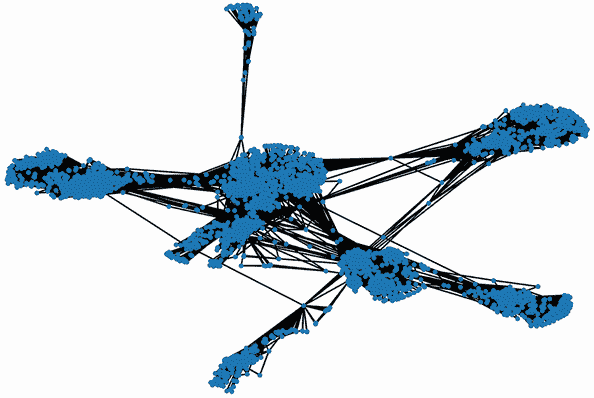
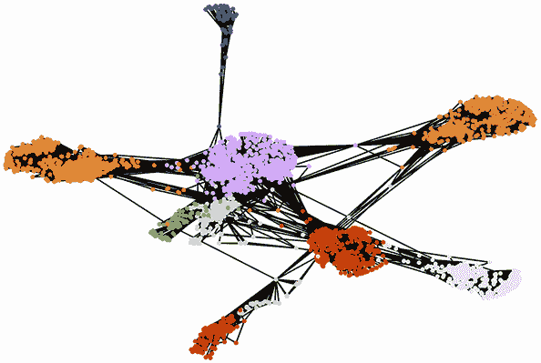

# 23 案例研究 5 解决方案

本节涵盖

+   数据清洗

+   探索网络

+   特征工程

+   优化机器学习模型

FriendHook 是一款流行的校园社交网络应用。学生可以在 FriendHook 网络中互加好友。推荐引擎每周向用户发送基于他们现有连接的新朋友建议；学生可以选择忽略这些建议，或者发送好友请求。我们提供了一周关于朋友建议和学生响应的数据。这些数据存储在 friendhook/Observations.csv 文件中。我们还提供了两个附加文件：friendhook/Profiles.csv 和 friendhook/Friendships.csv，分别包含用户配置文件信息和友谊图。用户配置文件已被加密以保护学生隐私。我们的目标是构建一个模型，预测用户对朋友建议的行为反应。我们将通过以下步骤来完成：

1.  加载包含观察结果、用户配置文件和友谊连接的三个数据集。

1.  训练并评估一个基于网络特征和配置文件特征的监督模型，以预测行为。我们可以选择将此任务分为两个子任务：使用网络特征训练模型，然后添加配置文件特征并评估模型性能的变化。

1.  检查以确保模型能够很好地推广到其他大学。

1.  探索我们模型的内部运作机制，以更好地了解学生行为。

警告 揭示警报！案例研究 5 的解决方案即将揭晓。我们强烈建议你在阅读解决方案之前尝试解决问题。原始问题陈述可在案例研究开头参考。

## 23.1 探索数据

让我们分别探索 `配置文件`、`观察结果` 和 `友谊` 表。如果需要，我们将对这些表中的数据进行清理和调整。

### 23.1.1 检查配置文件

我们首先将 `配置文件` 表加载到 Pandas 中，并总结表的内容。

列表 23.1 加载 `配置文件` 表

```
import pandas as pd

def summarize_table(df):            ❶
    n_rows, n_columns = df.shape
    summary = df.describe()
    print(f"The table contains {n_rows} rows and {n_columns} columns.")
    print("Table Summary:\n")
    print(summary.to_string())

df_profile = pd.read_csv('friendhook/Profiles.csv')
summarize_table(df_profile)

The table contains 4039 rows and 6 columns.
Table Summary:
```

❶ 我们将在数据集中的其他两个表上重用此汇总函数。

|  | 配置文件 _ID | 性别 | 关系状态 | 宿舍 | 专业 | 年级 |
| --- | --- | --- | --- | --- | --- | --- |
| **计数** | 4039 | 4039 | 3631 | 4039 | 4039 | 4039 |
| **唯一** | 4039 | 2 | 3 | 15 | 30 | 4 |
| **顶级** | b90a1222d2b2 | e807eb960650 | ac0b88e46e20 | a8e6e404d1b3 | 141d4cdd5aaf | c1a648750a4b |
| **频率** | 1 | 2020 | 1963 | 2739 | 1366 | 1796 |

表格包含 4,039 个不同的个人资料，分布在两个不同的性别中。最频繁提到的性别在 4,039 个个人资料中的 2,020 个中被提及，因此我们可以推断这些个人资料代表了男性和女性之间的平等分布。此外，这些个人资料捕捉到了一个分布在整个 30 个专业和 15 个宿舍的学生群体。令人怀疑的是，最频繁提到的宿舍包含超过 2,700 名学生。这个数字看起来很大，但快速谷歌搜索显示，大型校园学生综合体并不罕见。例如，威斯康星大学密尔沃基分校的 17 层桑德堡学生宿舍可以容纳 2,700 名学生。这些数字也可能代表了 *校外住宿* 类别的学生。这个计数可以通过多种假设来解释——但是向前看，我们应该考虑我们观察到的数字背后的各种驱动因素。而不是盲目地处理数字，我们应该记住，我们的数据来源于现实世界学生的行为和物理限制。

在表格摘要中，*关系状态* 列有一个异常。Pandas 在 4,039 行中的 3,631 行检测到了三个 *关系状态* 类别。剩余的约 400 行是空的——它们不包含任何分配的关系状态。让我们计算空行的数量。

列表 23.2 统计空 *关系状态* 个人资料

```
is_null = df_profile.Relationship_Status.isnull()
num_null = df_profile[is_null].shape[0]
print(f"{num_null} profiles are missing the Relationship Status field.")

408 profiles are missing the Relationship Status field.
```

408 个个人资料在 `Relationship_Status` 字段中缺失值。这是有道理的：正如问题陈述中所述，`Relationship_Status` 字段是可选的。看起来有十分之一的学生拒绝指定该字段。但是我们不能在数据中带有空值继续我们的分析；我们需要删除空行或者用其他值替换空字段。删除空行不是一个好选择——我们会丢弃其他列中可能有价值的信息。相反，我们可以将缺乏状态视为第四个 *未指定* 的关系状态类别。为此，我们应该为这些行分配一个类别 ID。我们应该选择什么 ID 值？在我们回答这个问题之前，让我们检查 *关系状态* 列中所有唯一的 ID。

列表 23.3 检查唯一的 *关系状态* 值

```
unique_ids = set(df_profile.Relationship_Status.values)
print(unique_ids)

{'9cea719429e9', nan, '188f9a32c360', 'ac0b88e46e20'}
```

如预期，*关系状态*值由三个哈希码和一个空的`nan`组成。这些哈希码是三种可能状态类别（*单身*、*恋爱中*和*复杂关系*）的加密版本。当然，我们无法知道哪个类别对应哪个。我们所能确定的是两个配置文件是否属于同一状态类别。我们的目标是最终使用这些信息在训练好的机器学习模型中。然而，scikit-learn 库无法处理哈希码或空值：它只能处理数字，因此我们需要将这些类别转换为数值。最简单的解决方案是为每个类别分配一个介于 0 到 4 之间的数字。让我们执行这个分配。我们首先生成一个将每个类别映射到数字的字典。

列表 23.4 将*关系状态*值映射到数字

```
import numpy as np
category_map = {'9cea719429e9': 0, np.nan: 1, '188f9a32c360': 2,
                'ac0b88e46e20': 3}                                  ❶

{'9cea719429e9': 0, nan: 1, '188f9a32c360': 2, 'ac0b88e46e20': 3}
```

❶ 通常，我们会通过执行`category_map = {id_: i for i, id_ in enumerate(unique_ids)}`来自动生成这个映射，但数值分配的顺序可能会根据 Python 版本而变化。因此，我们手动设置映射以确保本节所有读者的输出一致。

接下来，我们将“关系状态”列的内容替换为相应的数值。

列表 23.5 更新*关系状态*列

```
nums = [category_map[hash_code]
        for hash_code in df_profile.Relationship_Status.values]
df_profile['Relationship_Status'] = nums
print(df_profile.Relationship_Status)

0       0
1       3
2       3
3       3
4       0
       ..
4034    3
4035    0
4036    3
4037    3
4038    0
Name: Relationship_Status, Length: 4039, dtype: int64
```

我们已经将*关系状态*转换为一个数值变量，但表中的剩余五列仍然包含哈希码。我们也应该将这些哈希码替换为数字吗？是的！原因如下：

+   如前所述，scikit-learn 无法处理字符串或哈希值。它只接受数值作为输入。

+   对于人类来说，阅读哈希码比阅读数字更费脑力。因此，用较短的数字替换多字符代码将使我们更容易探索数据。

考虑到这一点，让我们在每个列中创建哈希码和数字之间的类别映射。我们使用`col_to_mapping`字典跟踪每个列中的类别映射。我们还使用这些映射将`df_profile`中的所有哈希码替换为数字。

列表 23.6 将所有*配置文件*哈希码替换为数值

```
col_to_mapping = {'Relationship_Status': category_map}

for column in df_profile.columns:
    if column in col_to_mapping:
        continue

    unique_ids = sorted(set(df_profile[column].values))           ❶
    category_map = {id_: i for i, id_ in enumerate(unique_ids)}
    col_to_mapping[column] = category_map
    nums = [category_map[hash_code]
            for hash_code in df_profile[column].values]
    df_profile[column] = nums

head = df_profile.head()
print(head.to_string(index=False))

Profile_ID  Sex  Relationship_Status  Dorm  Major  Year
       2899    0                    0     5     13     2
       1125    0                    3    12      6     1
       3799    0                    3    12     29     2
       3338    0                    3     4     25     0
       2007    1                    0    12      2     0
```

❶ 对 ID 进行排序有助于确保所有读者的输出一致，独立于他们的 Python 版本。请注意，我们只能在哈希码中没有`nan`值的情况下对哈希码 ID 进行排序；否则，排序将导致错误。

我们已经完成了对`df_profile`的调整。现在让我们将注意力转向实验观察结果表。

### 23.1.2 探索实验观察结果

我们首先将`Observations`表加载到 Pandas 中，并总结表的内容。

列表 23.7 加载`Observations`表

```
df_obs = pd.read_csv('friendhook/Observations.csv')
summarize_table(df_obs)

The table contains 4039 rows and 5 columns.
Table Summary:
```

|  | Profile_ID | Selected_Friend | Selected_Friend_of_Friend | Friend_Request_Sent | Friend_Request_Accepted |
| --- | --- | --- | --- | --- | --- |
| **count** | 4039 | 4039 | 4039 | 4039 | 4039 |
| **unique** | 4039 | 2219 | 2327 | 2 | 2 |
| **top** | b90a1222d2b2 | 89581f99fa1e | 6caa597f13cc | True | True |
| **freq** | 1 | 77 | 27 | 2519 | 2460 |

五个表格列都一致地显示了 4,039 个填充的行。表中没有空值。这是好的——但是列名很难读。这些名字非常描述性，但也非常长。我们应该考虑缩短一些名字以减轻我们的认知负担。让我们简要讨论各种列，并看看是否需要重命名：

+   *Profile_ID*—接收朋友推荐的用户的 ID。这个名字简短且直接。它也对应于`df_profile`中的*Profile_ID*列。我们应该保持这个名字不变。

+   *Selected_Friend*—在*Profile_ID*列中用户的一个现有朋友。我们可以简化这个列名为仅*Friend*。

+   *Selected_Friend_of_Friend*—随机选择的一个朋友，他是*Selected_Friend*，但还不是*Profile_ID*的朋友。在我们的分析中，这个随机的朋友推荐被作为用户的*朋友推荐*发送。我们可以将这个列重命名为*Recommended_Friend*或可能是*FoF*。让我们称这个列为*FoF*，因为这个缩写既容易记忆又简短。

+   *Friend_Requent_Sent*—这个布尔列如果是用户向建议的朋友发送了好友请求则为`True`，否则为`False`。让我们将列名缩短为仅*Sent*。

+   *Friend_Request_Accepted*—这个布尔列仅在用户发送了好友请求并且该请求被接受时为`True`。我们可以将列名缩短为*Accepted*。

根据我们的讨论，我们需要重命名五列中的四列。让我们重命名这些列并重新生成摘要。

列表 23.8 重命名观测列

```
new_names = {'Selected_Friend': 'Friend',
             'Selected_Friend_of_Friend': 'FoF',
             'Friend_Request_Sent': 'Sent',
             'Friend_Request_Accepted': 'Accepted'}
df_obs = df_obs.rename(columns=new_names)
summarize_table(df_obs)

The table contains 4039 rows and 5 columns.
Table Summary:
```

|  | Profile_ID | Friend | FoF | Sent | Accepted |
| --- | --- | --- | --- | --- | --- |
| **count** | 4039 | 4039 | 4039 | 4039 | 4039 |
| **unique** | 4039 | 2219 | 2327 | 2 | 2 |
| **top** | b90a1222d2b2 | 89581f99fa1e | 6caa597f13cc | True | True |
| **freq** | 1 | 77 | 27 | 2519 | 2460 |

在更新的表中，统计数据更清晰。在总共 4,039 个样本中，有 2,219 个独特的*Friend* ID 和 2,327 个独特的*FoF* ID。这意味着，平均每个*Friend*和*FoF* ID 大约被使用两次。没有单个配置文件 ID 主导我们的数据，这是令人欣慰的。这将使我们能够更容易地设计一个健壮的预测模型，而不是一个由单个配置文件信号驱动的模型，这样的模型更容易过拟合。

进一步检查发现，大约 62%（2,519）的友谊建议导致了发送好友请求。这非常令人鼓舞；朋友的朋友建议非常有效。此外，大约 60%（2,460）的样本实例导致了好友请求被接受；发送的好友请求被忽略或拒绝的比例仅为 2%（2519 – 2460 = 50）。当然，我们的数字假设没有观察到 *Sent* 为 `False` 且 *Accepted* 为 `True` 的情况。这种情况不可能发生，因为如果请求尚未发送，则无法接受请求。尽管如此，为了进行合理性检查，让我们通过确认该场景不会发生来测试数据的完整性。

列表 23.9 确保所有接受请求的 *Sent* 值为 `True`

```
condition = (df_obs.Sent == False) & (df_obs.Accepted == True)
assert not df_obs[condition].shape[0]
```

根据我们的观察，用户行为遵循三种可能的场景：

+   用户拒绝或忽略 *FoF* 列中列出的好友推荐。这种情况发生在 38% 的实例中。

+   用户根据推荐发送好友请求，并且该请求被接受。这种情况发生在 62% 的实例中。

+   用户根据推荐发送好友请求，但该请求被拒绝或忽略。这种情况很少见，仅占总实例的 1.2%。

这三种情况分别代表三类用户行为。因此，我们可以通过将行为模式 *a*、*b* 和 *c* 分配数字 0、1 和 2 来编码这种分类行为。在这里，我们执行分类分配并将它们存储在 *Behavior* 列中。

列表 23.10 将行为类别分配给用户观察结果

```
behaviors = []
for sent, accepted in df_obs[['Sent', 'Accepted']].values:
    behavior = 2 if (sent and not accepted) else int(sent) * int(accepted) ❶
    behaviors.append(behavior)
df_obs['Behavior'] = behaviors
```

❶ Python 将布尔值 True 和 False 分别作为简单的整数值 1 和 0 处理。因此，这个算术运算根据我们的行为定义返回 0、1 或 2。

此外，我们必须将前三个列中的配置文件 ID 从哈希码转换为与 `df_profile.Profile_ID` 一致的数值 ID。以下代码利用存储在 `col_to_mapping['Profile_ID']` 中的映射来完成此操作。

列表 23.11 将所有 *Observation* 哈希码替换为数值

```
for col in ['Profile_ID', 'Friend', 'FoF']:
    nums = [col_to_mapping['Profile_ID'][hash_code]
            for hash_code in df_obs[col]]
    df_obs[col] = nums

head = df_obs.head()
print(head.to_string(index=False))

Profile_ID  Friend   FoF   Sent  Accepted  Behavior
       2485    2899  2847  False     False         0
       2690    2899  3528  False     False         0
       3904    2899  3528  False     False         0
        709    2899  3403  False     False         0
        502    2899   345   True      True         1
```

`df_obs` 现在与 `df_profile` 对齐。只有一个数据表尚未分析。让我们探索 `Friendships` 表中的友谊链接。

### 23.1.3 探索友谊链接表

我们首先将 `Friendships` 表加载到 Pandas 中，并总结表的内容。

列表 23.12 加载 `Friendships` 表

```
df_friends = pd.read_csv('friendhook/Friendships.csv')
summarize_table(df_friends)

The table contains 88234 rows and 2 columns.
Table Summary:
```

|  | Friend_A | Friend_B |
| --- | --- | --- |
| **count** | 88234 | 88234 |
| **unique** | 3646 | 4037 |
| **top** | 89581f99fa1e | 97ba93d9b169 |
| **freq** | 1043 | 251 |

在这个社交网络中，有超过 88,000 个友谊链接。社交网络相当密集，平均每个 FriendHook 配置文件有大约 22 个朋友。网络中的社交达人（*89581f99fa1e*）有超过 1,000 个朋友。然而，由于网络中的两列不对称，无法准确衡量朋友数量。实际上，我们甚至无法验证是否所有 4,039 个配置文件都适当地在表中表示。

为了进行更详细的分析，我们应该将友谊数据加载到 NetworkX 图中。列表 23.13 计算了社交图。我们用列中的哈希码映射的数值表示节点 ID。计算完图后，我们在 `G.nodes` 中计算节点数量。

列表 23.13 将社交图加载到 NetworkX 中

```
import networkx as nx
G = nx.Graph()
for id1, id2 in df_friends.values:
    node1 = col_to_mapping['Profile_ID'][id1]
    node2 = col_to_mapping['Profile_ID'][id2]
    G.add_edge(node1, node2)

nodes = list(G.nodes)
num_nodes = len(nodes)
print(f"The social graph contains {num_nodes} nodes.")
The social graph contains 4039 nodes.
```

让我们尝试通过使用 `nx.draw` 可视化来深入了解图结构（图 23.1）。请注意，图相当大，所以可视化可能需要 10 到 30 秒的运行时间来完成。



图 23.1 大学的可视化社交图。紧密的社交群体聚类清晰可见；这些可以使用马尔可夫聚类提取。

列表 23.14 可视化社交图

```
import matplotlib.pyplot as plt
np.random.seed(0)
nx.draw(G, node_size=5)
plt.show()
```

紧密聚集的社交群体在网络中清晰可见。让我们使用马尔可夫聚类提取这些群体，然后计算聚类数量。

列表 23.15 使用马尔可夫聚类查找社交群体

```
import markov_clustering as mc
matrix = nx.toSciPysparse_matrix(G)
result = mc.run_mcl(matrix)
clusters = mc.get_clusters(result)
num_clusters = len(clusters)
print(f"{num_clusters} clusters were found in the social graph.")

10 clusters were found in the social graph.
```

在社交图中发现了 10 个聚类。让我们通过根据聚类 ID 着色每个节点来可视化这些聚类。首先，我们需要遍历 `clusters` 并将一个 `cluster_id` 属性分配给每个节点。

列表 23.16 将聚类属性分配给节点

```
for cluster_id, node_indices in enumerate(clusters):
    for i in node_indices:
        node = nodes[i]
        G.nodes[node]['cluster_id'] = cluster_id
```

接下来，我们根据节点的聚类属性分配来着色节点（图 23.2）。



图 23.2 大学的可视化社交图。使用马尔可夫聚类确定了紧密的社交群体聚类。图中的节点根据其聚类 ID 着色。

列表 23.17 根据聚类分配给节点着色

```
np.random.seed(0)
colors = [G.nodes[n]['cluster_id'] for n in G.nodes]
nx.draw(G, node_size=5, node_color=colors, cmap=plt.cm.tab20)
plt.show()
```

聚类颜色明显对应于紧密的社交群体。我们的聚类已经有效，因此分配的 `cluster_id` 属性在建模过程中应该是有帮助的。同样，将所有五个配置文件特征作为属性存储在学生节点中可能也很有用。让我们遍历 `df_profile` 中的行并将每个列值存储在其对应的节点中。

列表 23.18 将配置文件属性分配给节点

```
attribute_names = df_profile.columns
for attributes in df_profile.values:
    profile_id = attributes[0]
    for name, att in zip(attribute_names[1:], attributes[1:]):
        G.nodes[profile_id][name] = att

first_node = nodes[0]
print(f"Attributes of node {first_node}:")
print(G.nodes[first_node])
Attributes of node 2899:
{'cluster_id': 0, 'Sex': 0, 'Relationship_Status': 0, 'Dorm': 5,
 'Major': 13, 'Year': 2}
```

我们已经完成了对输入数据的探索。现在我们将训练一个预测用户行为的模型。我们将从一个只利用网络特征的简单模型开始。

## 23.2 使用网络特征训练预测模型

我们的目标是在我们的数据集上训练一个监督机器学习模型来预测用户行为。目前，所有可能的行为类别都存储在`df_obs`的`*Behavior*`列中。我们的三个行为类别标签是 0、1 和 2。提醒一下，类别 2 的标签只出现在 4,039 个样本中的 50 个实例中：相对于其他类别标签，类别 2 非常不平衡。有理由从我们的训练数据中移除这 50 个标记的示例。目前，我们先保留这些示例，看看会发生什么；稍后，如果需要，我们将移除它们。现在，我们将我们的训练类别标签数组赋值给`df_obs.Behavior`列。

列表 23.19 赋值类别标签数组`y`

```
y = df_obs.Behavior.values
print(y)

[0 0 0 ... 1 1 1]
```

现在我们有了类别标签，我们需要创建一个特征矩阵`X`。我们的目标是填充这个矩阵，使其包含来自社交图结构的特征。稍后，我们将添加来自学生档案的额外特征，所以我们不需要一次性组装特征矩阵。我们将逐步构建这个矩阵，分批添加新特征，以便更好地理解这些特征对模型性能的影响。考虑到这一点，让我们创建`X`的初始版本，并用一些非常基本的特征填充它。我们可以问任何 FriendHook 用户的简单问题就是：用户有多少个朋友？这个值等于用户在社交图中的节点的边数。换句话说，用户`n`的朋友数等于`G.degree(n)`。让我们把这个计数作为矩阵中的第一个特征。我们将遍历`df_obs`中的所有行，并为每行中引用的每个档案分配一个边数。提醒一下，每一行包含三个档案：*Profile_ID*、*Friend*和*FoF*。我们将计算每个档案的朋友数，创建特征*Profile_ID_ Edge_Count、Friend_Edge_Count*和*FoF_Edge_Count*。

注意：并不是总是容易想出一个好的一致的特征名称。我们本可以选择*FoF_Edge_Count*作为我们的名称，而不是*FoF_Friend_Count*。然而，保持一致性将迫使我们包括一个*Friend_Friend_Count*特征，这将导致一个非常尴尬的特征名称。或者，我们可以将我们的三个特征命名为*Profile_Degree*、*Friend_Degree*和*FoF_Degree*。这些名称既简短又富有信息量，但值得记住的是，我们的一个档案特征与大学专业有关。在大学的背景下，学位和专业几乎有相同的定义，所以基于学位的命名约定可能会引起混淆。这就是为什么我们坚持使用*Edge_Count*后缀。

让我们生成一个 3-by-4,039 的边数特征矩阵。我们需要一种方法来跟踪这些特征及其关联的特征名称。我们还需要一种方法来轻松地使用额外的输入更新特征及其名称。一个直接的方法是将特征存储在一个`df_features` Pandas 表中。该表将允许我们通过`df_features.values`访问特征矩阵。让我们计算`df_features`以创建特征矩阵的初始版本。

列表 23.20：从边数创建特征矩阵

```
cols = ['Profile_ID', 'Friend', 'FoF']
features = {f'{col}_Edge_Count': [] for col in cols}
for node_ids in df_obs[cols].values:
    for node, feature_name in zip(node_ids, features.keys()):
        degree = G.degree(node)                                ❶
        features[feature_name].append(degree)

df_features = pd.DataFrame(features)
X = df_features.values
```

❶ 作为提醒，节点的度数等于该节点的边数。因此，G.degree(n)返回与用户 n 关联的朋友数。

我们已经有一个初始训练集。让我们通过训练和测试一个简单的模型来检查该集中信号的质量。我们有多个可能的选择。一个合理的选项是决策树分类器；决策树可以处理非线性决策边界，并且易于解释。然而，它们容易过拟合，因此需要交叉验证来适当地衡量模型性能。列表 23.21 在`(X, y)`的一个子集上训练决策树，并在剩余数据上评估结果。在评估过程中，我们应该记住我们的类别 2 标签高度不平衡。因此，f 度量指标将比简单的准确率提供一个更合理的性能评估。

注意：在本节的剩余部分，我们将反复训练和测试我们的分类器模型。列表 23.21 定义了一个`evaluate`函数，用于此目的，它接受一个训练集`(X, y)`和一个预置为`DecisionTreeClassifier`的模型类型作为输入。该函数随后将`X, y`分割为训练集和测试集，训练分类器，并使用测试集计算 f 度量。最后，它返回 f 度量以及用于评估的分类器。

列表 23.21：训练和评估决策树分类器

```
from sklearn.tree import DecisionTreeClassifier
from sklearn.model_selection import train_test_split
from sklearn.metrics import f1_score

def evaluate(X, y, model_type=DecisionTreeClassifier, **kwargs):     ❶
    np.random.seed(0)                                                ❷
    X_train, X_test, y_train, y_test = train_test_split(X, y)        ❸
    clf = model_type(**kwargs)
    clf.fit(X_train, y_train)                                        ❹
    pred = clf.predict(X_test)
    f_measure = f1_score(pred, y_test, average='macro')              ❺
    return f_measure, clf

f_measure, clf = evaluate(X, y)
print(f"The f-measure is {f_measure:0.2f}")

The f-measure is 0.37
```

❶ 我们将在本节的剩余部分反复使用此函数。它在一个`(X, y)`数据子集上训练分类器。分类器类型通过`model_type`参数指定：在这里，参数预置为决策树分类器。可以使用**kwargs 指定额外的分类器超参数。训练后，使用保留的数据子集评估分类器的性能。

❷ 此随机种子值确保每次运行时`(X, y)`的分割是一致的。

❸ 将`(X, y)`分割为训练集和测试集

❹ 训练模型

❺ 计算 f 度量。由于训练数据中存在三个类别标签，因此需要`average='macro'`参数。

我们的 f 度量非常糟糕！显然，仅凭边数本身不足以预测用户行为。可能需要一个更复杂的节点中心性度量。之前，我们了解到 PageRank 中心性度量可以比边数提供更多信息。将 PageRank 值添加到我们的训练集中是否会提高模型性能？让我们找出答案。

列表 23.22 添加 PageRank 特征

```
node_to_pagerank = nx.pagerank(G)
features = {f'{col}_PageRank': [] for col in cols}
for node_ids in df_obs[cols].values:
    for node, feature_name in zip(node_ids, features.keys()):
        pagerank = node_to_pagerank[node]
        features[feature_name].append(pagerank)

def update_features(new_features):                    ❶
    for feature_name, values in new_features.items():
        df_features[feature_name] = values
    return df_features.values                         ❷

X = update_features(features)
f_measure, clf = evaluate(X, y)

print(f"The f-measure is {f_measure:0.2f}")

The f-measure is 0.38
```

❶ 此函数被反复使用。它通过新特征字典中的新特征更新 df_features Pandas 表。

❷ 返回修改后的特征矩阵

f 度量保持大致相同。基本中心性度量是不够的。我们需要将`X`扩展以包括由马尔可夫聚类揭示的社交群体。毕竟，属于同一个社交群体的人更有可能成为朋友。我们如何将这些社交群体纳入特征矩阵中？好吧，天真地，我们可以将每个引用节点的`cluster_id`属性作为我们的社交群体特征。然而，这种方法有一个严重的缺点：我们当前的聚类 ID 仅与`G`中的特定社交图相关。它们与任何其他大学网络完全不相关。换句话说，在`G`中的聚类 ID 上训练的模型不适用于`G_other`中的某些其他大学图。这不行！我们的目标之一是构建一个可以推广到其他学院的模型。因此，我们需要一个更细致的解决方案。

一种替代方法就是考虑以下二元问题：两个人是否属于同一个社交群体？如果是，那么他们最终在 FriendHook 上成为朋友的可能性可能更大。我们可以在观察数据的一行中，对每一对配置文件 ID 进行这种二元比较。更精确地说，我们可以提出以下问题：

+   在*Profile_ID*列中的用户是否与*Friend*列中的朋友属于同一个社交群体？我们将这个特征命名为*Shared_Cluster_id_f*。

+   在*Profile_ID*列中的用户是否与*FoF*列中的朋友的朋友属于同一个社交群体？我们将这个特征命名为*Shared_Cluster_id_fof*。

+   在*Friend*列中的朋友是否与*FoF*列中的朋友的朋友属于同一个社交群体？我们将这个特征命名为*Shared_Cluster_f_fof*。

让我们通过添加三个额外的特征来回答这三个问题。然后我们测试这些特征是否提高了模型性能。

列表 23.23 添加社交群体特征

```
features = {f'Shared_Cluster_{e}': []
            for e in ['id_f', 'id_fof', 'f_fof']}

i = 0
for node_ids in df_obs[cols].values:
    c_id, c_f, c_fof = [G.nodes[n]['cluster_id']
                        for n in node_ids]
    features['Shared_Cluster_id_f'].append(int(c_id == c_f))
    features['Shared_Cluster_id_fof'].append(int(c_id == c_fof))
    features['Shared_Cluster_f_fof'].append(int(c_f == c_fof))

X = update_features(features)
f_measure, clf = evaluate(X, y)
print(f"The f-measure is {f_measure:0.2f}")

The f-measure is 0.43
```

我们的特征度量从 0.38 提高到 0.43。性能仍然较差，但社交群体包含使得我们的模型略有改进。新的社交群体特征相对于模型当前性能的重要性如何？我们可以通过检查训练分类器的`feature_importance_`属性来验证。

列表 23.24 根据重要性分数对特征进行排名

```
def view_top_features(clf, feature_names):                 ❶
    for i in np.argsort(clf.feature_importances_)[::-1]:   ❷
        feature_name = feature_names[i]
        importance = clf.feature_importances_[i]
        if not round(importance, 2):                       ❸
            break

        print(f"{feature_name}: {importance:0.2f}")
feature_names = df_features.columns
view_top_features(clf, feature_names)

Shared_Cluster_id_fof: 0.18
FoF_PageRank: 0.17
Profile_ID_PageRank: 0.17
Friend_PageRank: 0.15
FoF_Edge_Count: 0.12
Profile_ID_Edge_Count: 0.11
Friend_Edge_Count: 0.10
```

❶ 打印出根据重要性顺序排列的顶级特征及其重要性分数

❷ 根据重要性得分对特征进行排序

❸ 重要性得分小于 0.01 的特征不会显示。

*Shared_Cluster_id_fof* 特征是模型中最重要的特征。换句话说，用户和朋友的社交群体重叠是未来在线友谊最重要的预测因素。然而，PageRank 特征也在列表中排名很高，这表明社交图中心性在友谊决定中起着一定作用。当然，我们模型的性能仍然很差，因此我们应该谨慎地推断特征如何驱动预测。相反，我们应该专注于提高模型性能。我们还能利用哪些基于图的特征？也许网络聚类大小会影响预测。我们可以找出，但我们应该小心尝试保持模型的可泛化性。聚类大小可以无解释地取代聚类 ID，使模型非常特定于大学。让我们探索这是如何发生的。

假设我们的数据集有两个社交聚类，A 和 B。这些聚类分别包含 110 和 115 名学生。因此，它们的大小几乎相同，不应该驱动预测。现在，让我们进一步假设 A 聚类的学生比 B 聚类的学生更有可能成为 FriendHook 朋友。我们的模型会在训练期间注意到这一点，并将 110 的大小与友谊倾向相关联。本质上，它将大小视为聚类 ID！这可能会在未来造成麻烦，如果模型遇到了一个全新的大小为 110 的聚类。

我们是否应该完全忽略聚类大小？不一定。我们是科学家，我们希望诚实地探索聚类大小对模型预测的影响。但我们应该非常谨慎：如果聚类大小对模型质量的影响很小，我们应该将其从特征中删除。然而，如果大小极大地提高了模型预测，我们将谨慎地重新评估我们的选择。让我们测试当我们将聚类大小添加到我们的特征列表中会发生什么。

列表 23.25 添加聚类大小特征

```
cluster_sizes = [len(cluster) for cluster in clusters]
features = {f'{col}_Cluster_Size': [] for col in cols}
for node_ids in df_obs[cols].values:
    for node, feature_name in zip(node_ids, features.keys()):
        c_id = G.nodes[node]['cluster_id']
        features[feature_name].append(cluster_sizes[c_id])

X = update_features(features)
f_measure, clf = evaluate(X, y)
print(f"The f-measure is {f_measure:0.2f}")

The f-measure is 0.43
```

聚类大小并没有提高模型。作为预防措施，让我们将其从我们的特征集中删除。

列表 23.26 删除聚类大小特征

```
import re
def delete_features(df_features, regex=r'Cluster_Size'):                 ❶

    df_features.drop(columns=[name for name in df_features.columns
                               if re.search(regex, name)], inplace=True)
    return df_features.values                                            ❷

X = delete_features(df_features)
```

❶ 删除 df_features 中所有匹配正则表达式的特征名称。它在本节的其他地方也被使用。

❷ 返回修改后的特征矩阵

f-measure 仍然保持在 0.43。我们还能做什么？也许我们应该尝试跳出思维框框。社会联系以何种方式可以驱动现实世界的行为？我们能否利用额外的、特定于问题的信号？是的！考虑以下场景。假设我们分析一个名为 Alex 的学生，他在网络 `G` 中的节点 ID 是 `n`。Alex 有 50 个 FriendHook 朋友，可以通过 `G[n]` 访问。我们从 `G[n]` 中随机抽取两个朋友。他们的节点 ID 是 `a` 和 `b`。然后我们检查 `a` 和 `b` 是否是朋友。他们是！这似乎表明 `a` 在 `list(G[n])` 中。然后我们重复这个过程 100 次。在 95% 的抽样实例中，`a` 是 `b` 的朋友。基本上，任何一对 Alex 的朋友之间相互成为朋友的可能性是 95%。我们将这个概率称为 *朋友分享可能性*。现在，Mary 是 FriendHook 的新成员。她刚刚加入并添加了 Alex 作为她的朋友。我们可以相当有信心地认为 Mary 也会与 Alex 的朋友建立联系——尽管当然这并不保证。但朋友分享可能性为 0.95 给我们比可能性为 0.10 更多的信心。

让我们尝试将这种可能性整合到我们的特征中。我们首先计算 `G` 中每个节点的可能性。我们将节点到可能性的映射存储在 `friend_sharing_likelihood` 字典中。

列表 23.27 计算朋友分享可能性

```
friend_sharing_likelihood = {}
for node in nodes:
    neighbors = list(G[node])
    friendship_count = 0                        ❶
    total_possible = 0                          ❷
    for i, node1 in enumerate(neighbors[:-1]):
        for node2 in neighbors[i + 1:]:
            if node1 in G[node2]:               ❸
                friendship_count += 1

            total_possible += 1

    prob = friendship_count / total_possible if total_possible else 0
    friend_sharing_likelihood[node] = prob
```

❶ 跟踪邻居之间共享友谊的数量

❷ 跟踪可能共享友谊的总数。请注意，通过一点图论，我们可以证明这个值总是等于 len(neighbors) * (len(neighbors - 1))。

❸ 检查两个邻居是否是朋友

接下来，我们为我们的三个个人资料 ID 中的每一个生成一个朋友分享可能性特征。在添加特征后，我们重新评估训练模型的性能。

列表 23.28 添加朋友分享可能性特征

```
features = {f'{col}_Friend_Sharing_Likelihood': [] for col in cols}
for node_ids in df_obs[cols].values:
    for node, feature_name in zip(node_ids, features.keys()):
        sharing_likelihood = friend_sharing_likelihood[node]
        features[feature_name].append(sharing_likelihood)

X = update_features(features)
f_measure, clf = evaluate(X, y)
print(f"The f-measure is {f_measure:0.2f}")

The f-measure is 0.49
```

性能已从 0.43 提高到 0.49！这仍然不是很好，但它是逐步变好的。朋友分享可能性与其他模型中的特征相比如何？让我们来看看。

列表 23.29 按重要性分数对特征进行排序

```
feature_names = df_features.columns
view_top_features(clf, feature_names)

Shared_Cluster_id_fof: 0.18
Friend_Friend_Sharing_Likelihood: 0.13
FoF_PageRank: 0.11
Profile_ID_PageRank: 0.11
Profile_ID_Friend_Sharing_Likelihood: 0.10
FoF_Friend_Sharing_Likelihood: 0.10
FoF_Edge_Count: 0.08
Friend_PageRank: 0.07
Profile_ID_Edge_Count: 0.07
Friend_Edge_Count: 0.06
```

我们的新朋友分享特征中有一个排名相当高：它在第二位，介于 `Shared_Cluster_id_fof` 和 `FoF_PageRank` 之间。我们的跳出思维框框的方法提高了模型的效果。但模型还不完整。f-measure 为 0.49 是不可接受的；我们需要做得更好。是时候超越网络结构了。我们需要将存储在 `df_profiles` 中的个人资料特征整合进来。

## 23.3 将个人资料特征添加到模型中

我们的目标是将个人资料属性 `Sex`、`Relationship_Status`、`Major`、`Dorm` 和 `Year` 整合到我们的特征矩阵中。根据我们对网络数据的经验，我们可以通过以下三种方式来实现：

+   *精确值提取*—我们可以在`df_obs`中的三个配置文件 ID 列中存储与每个配置文件特征相关的精确值。这类似于我们如何利用网络中边数和 PageRank 输出的精确值。

    示例特征：`df_obs`中朋友的朋友的关系状态。

+   *等价比较*—给定一个配置文件属性，我们可以在`df_obs`中的三个配置文件 ID 列之间进行成对比较。对于每次比较，我们返回一个布尔特征，表示该属性在两个列中是否相等。这类似于我们检查配置文件对是否属于同一社交群体。

    示例特征：特定的用户和他们的朋友是否住在同一个宿舍？是或否？

+   *大小*—给定一个配置文件属性，我们可以返回具有该属性配置文件的数量。这类似于我们尝试将社交群体大小纳入模型中。

    示例特征：特定宿舍居住的学生数量。

让我们利用精确值提取来扩展我们的特征矩阵。我们五个属性中哪些是这种技术的合适候选者？嗯，`Sex`、`Relationship_Status`和`Year`的类别值不依赖于大学；它们应该在整个大学和学院中保持一致。而`Dorm`的情况则不同——宿舍名称在其他大学网络中会发生变化。我们的目标是训练一个可以应用于其他社交图的模型，所以`Dorm`属性不是精确值提取的有效特征。

关于`Major`属性呢？在这里，情况更为复杂。某些专业，如生物学和经济学，在大多数大学和学院中都是共享的。其他专业，如土木工程，可能出现在更多技术导向的学校中，但不会出现在文科院校的课程中。还有一些罕见的专业，如风笛演奏或天体生物学，只属于少数特定学校。因此，我们可以在专业之间期望一定的连贯性，但不是完全一致。因此，利用专业精确值的模型将部分可重用；潜在地，这种部分信号可能会在某些学校提高预测能力，但这是以牺牲其他学校为代价的。这种权衡是否值得？也许吧。答案并不立即明朗。目前，让我们看看在不依赖添加的`Major`值这一额外支撑的情况下，我们能够训练出多好的模型。如果我们发现自己无法训练出一个合适的模型，我们将重新审视我们的决定。

现在我们将精确值提取应用于`Sex`、`Relationship_Status`和`Year`，然后检查模型是否有所改进。

列表 23.30 添加精确值配置文件特征

```
attributes = ['Sex', 'Relationship_Status', 'Year']
for attribute in attributes:
    features = {f'{col}_{attribute}_Value': [] for col in cols}
    for node_ids in df_obs[cols].values:
        for node, feature_name in zip(node_ids, features.keys()):
            att_value = G.nodes[node][attribute]
            features[feature_name].append(att_value)

    X = update_features(features)

f_measure, clf = evaluate(X, y)
print(f"The f-measure is {f_measure:0.2f}")

The f-measure is 0.74
```

哇！f-measure 从 0.49 戏剧性地增加到 0.74！配置文件特征已经提供了非常有价值的信号，但我们仍然可以做得更好。我们需要将`Major`和`Dorm`属性的信息纳入其中。等价比较是做这件事的一个极好方法。两个学生是否在同一个专业或宿舍是独立于他们的大学的。让我们将等价比较应用于`Major`和`Dorm`属性，然后重新计算 f-measure。

列表 23.31 添加等价比较配置文件特征

```
attributes = ['Major', 'Dorm']
for attribute in attributes:
    features = {f'Shared_{attribute}_{e}': []
            for e in ['id_f', 'id_fof', 'f_fof']}

    for node_ids in df_obs[cols].values:
        att_id, att_f, att_fof = [G.nodes[n][attribute]
                                  for n in node_ids]
        features[f'Shared_{attribute}_id_f'].append(int(att_id == att_f))
        features[f'Shared_{attribute}_id_fof'].append(int(att_id == att_fof))
        features[f'Shared_{attribute}_f_fof'].append(int(att_f == att_fof))

    X = update_features(features)

f_measure, clf = evaluate(X, y)
print(f"The f-measure is {f_measure:0.2f}")

The f-measure is 0.82
```

f-measure 已经上升到 0.82。引入`Major`和`Dorm`属性已经提高了模型性能。现在让我们考虑将`Major`和`Dorm`的大小也加入其中：我们可以计算与每个专业和宿舍相关联的学生数量，并将这个计数作为我们的一个特征。但我们需要小心；正如我们之前讨论的，我们的训练模型可以通过利用大小作为类别 ID 的替代品来作弊。例如，正如我们之前看到的，我们最大的宿舍有超过 2,700 名学生。因此，我们可以仅根据其大小轻松地识别出这个宿舍。我们必须谨慎行事。让我们看看当我们把`Major`和`Dorm`的大小加入我们的特征时会发生什么。如果对性能影响不大，我们将从我们的模型中删除这些特征。否则，我们将重新评估我们的选择。

列表 23.32 添加与大小相关的配置文件特征

```
from collections import Counter

for attribute in ['Major', 'Dorm']:
    counter = Counter(df_profile[attribute].values)
    att_to_size = {k: v
                      for k, v in counter.items()}              ❶
    features = {f'{col}_{attribute}_Size': [] for col in cols}
    for node_ids in df_obs[cols].values:
        for node, feature_name in zip(node_ids, features.keys()):
            size = att_to_size[G.nodes[node][attribute]]
            features[feature_name].append(size)

    X = update_features(features)

f_measure, clf = evaluate(X, y)
print(f"The f-measure is {f_measure:0.2f}")

The f-measure is 0.85
```

❶ 跟踪每个属性在我们数据集中出现的次数

性能从 0.82 提高到 0.85。大小的引入影响了我们的模型。让我们深入探讨这种影响。我们首先打印出特征重要性得分。

列表 23.33 按重要性得分对特征进行排序

```
feature_names = df_features.columns.values
view_top_features(clf, feature_names)

FoF_Dorm_Size: 0.25
Shared_Cluster_id_fof: 0.16
Shared_Dorm_id_fof: 0.05
FoF_PageRank: 0.04
Profile_ID_Major_Size: 0.04
FoF_Major_Size: 0.04
FoF_Edge_Count: 0.04
Profile_ID_PageRank: 0.03
Profile_ID_Friend_Sharing_Likelihood: 0.03
Friend_Friend_Sharing_Likelihood: 0.03
Friend_Edge_Count: 0.03
Shared_Major_id_fof: 0.03
FoF_Friend_Sharing_Likelihood: 0.02
Friend_PageRank: 0.02
Profile_ID_Dorm_Size: 0.02
Profile_ID_Edge_Count: 0.02
Profile_ID_Sex_Value: 0.02
Friend_Major_Size: 0.02
Profile_ID_Relationship_Status_Value: 0.02
FoF_Sex_Value: 0.01
Friend_Dorm_Size: 0.01
Profile_ID_Year_Value: 0.01
Friend_Sex_Value: 0.01
Shared_Major_id_f: 0.01
Friend_Relationship_Status_Value: 0.01
Friend_Year_Value: 0.01
```

特征重要性得分主要由两个特征主导：*FoF_Dorm_Size*和*Shared_Cluster_id_fof*。这两个特征的重要性得分分别为 0.25 和 0.16。所有其他特征得分都低于 0.01。

*FoF_Dorm_Size*的存在有点令人担忧。正如我们之前讨论的，一个宿舍主导了 50%的网络数据。我们的模型是否只是根据其大小来记忆这个宿舍？我们可以通过可视化训练好的决策树来找出答案。为了简单起见，我们将树限制在深度为 2，以限制我们的输出仅包括由两个最主导特征驱动的决策。

列表 23.34 显示树的顶级分支

```
from sklearn.tree import export_text

clf_depth2 = DecisionTreeClassifier(max_depth=2)
clf_depth2.fit(X, y)
text_tree = export_text(clf_depth2, feature_names=list(feature_names))   ❶
print(text_tree)

|--- FoF_Dorm_Size <= 278.50                                             ❷
|   |--- Shared_Cluster_id_fof <= 0.50
|   |   |--- class: 0
|   |--- Shared_Cluster_id_fof >  0.50
|   |   |--- class: 0
|--- FoF_Dorm_Size >  278.50                                             ❸
|   |--- Shared_Cluster_id_fof <= 0.50                                   ❹
|   |   |--- class: 0
|   |--- Shared_Cluster_id_fof >  0.50                                    ❺
|   |   |--- class: 1
```

❶ `export_text`函数在处理 NumPy 数组作为输入时存在问题，因此我们将 feature_names 转换为列表。

❷ 朋友的朋友宿舍大小小于 279。在这种情况下，最可能的类别标签是 0（忽略朋友建议）。

❸ 朋友的朋友宿舍大小大于等于 279。

❹ 朋友的朋友和用户不在同一个社交群体中。最可能的类别标签是 0。

❺ 朋友的朋友和用户属于同一个社交群体。最可能的类别标签是 1（FriendHook 连接建立）。

根据树形图，最重要的信号是*FoF_Dorm_Size*是否小于 279。如果朋友宿舍的学生人数少于 279，那么 FoF 和用户不太可能成为 FriendHook 朋友。否则，如果他们已经共享相同的社交群体（`Shared_Cluster_id_fof > 0.50`），他们更有可能建立联系。这引发了一个问题，有多少宿舍至少有 279 名学生？让我们检查一下。

列表 23.35 检查至少有 279 名学生的宿舍

```
counter = Counter(df_profile.Dorm.values)
for dorm, count in counter.items():
    if count < 279:
        continue

    print(f"Dorm {dorm} holds {count} students.")

Dorm 12 holds 2739 students.
Dorm 1 holds 413 students.
```

在 15 个宿舍中，只有两个宿舍有超过 279 名 FriendHook 注册的学生。本质上，我们的模型依赖于两个最拥挤的宿舍来做出决策。这让我们陷入了困境：一方面，观察到的信号非常有趣；FriendHook 连接在某些宿舍中比其他宿舍更有可能发生。宿舍大小在这些联系中起着作用。这个见解可能允许 FriendHook 开发者更好地理解用户行为，也许这种理解将导致更好的用户参与。我们已经获得了这种知识，但我们的当前模型有一个严重的缺点。

我们的模式主要关注数据中的两个最大的宿舍。这种关注可能无法推广到其他大学校园。例如，考虑一个宿舍较小，最多容纳 200 名学生的校园。在这种情况下，模型将完全无法预测用户行为。

注意理论上，如果我们把宿舍大小除以总学生数，就可以避免这种情况。这将确保宿舍大小特征始终介于 0 和 1 之间。

更令人担忧的是，我们面临着这样一个非常现实的可能性，即我们的模型只是捕捉到了仅在这两个特定宿舍中独有的行为。这正是我们在问题陈述中要求避免的场景。我们该怎么办？

不幸的是，没有明确的正确答案。有时数据科学家被迫做出艰难的决定，每个决定都伴随着风险和权衡。我们可以保持我们的特征列表不变以维持高模型性能，但我们也面临着无法推广到其他学校的风险。或者，我们可以移除与大小相关的特征，以牺牲整体性能为代价来保持模型的可推广性。

可能还有第三种选择：我们可以在调整我们的分类器选择的同时尝试删除与大小相关的特征。我们有微小的机会在不依赖宿舍大小的情况下实现可比的性能。这不太可能，但仍值得一试。让我们将当前特征矩阵的一个副本分配给变量`X_with_sizes`（以防我们以后需要它），然后从矩阵`X`中删除所有与大小相关的特征。然后我们将寻找其他方法来提高我们的 f 度量超过 0.82。

列表 23.36 删除所有与大小相关的特征

```
X_with_sizes = X.copy()
X = delete_features(df_features, regex=r'_Size')
```

## 23.4 在一组稳定的特征上优化性能

在第二十二部分中，我们学习了随机森林模型通常如何优于决策树。将模型类型从决策树切换到随机森林会提高性能吗？让我们来看看。

列表 23.37 训练和评估随机森林分类器

```
from sklearn.ensemble import RandomForestClassifier
f_measure, clf = evaluate(X, y, model_type=RandomForestClassifier)
print(f"The f-measure is {f_measure:0.2f}")

The f-measure is 0.75
```

哎呀！性能实际上变差了！这是怎么回事呢？好吧，这是一个公认的事实，随机森林通常优于决策树，但这并不能保证随机森林总是表现更好。在某些训练实例中，决策树优于随机森林。这似乎就是这样一种情况。对于我们的特定数据集，我们不能通过切换到随机森林模型来提高预测性能。

注意：在监督机器学习中，有一个被广泛认可的定理，称为**无免费午餐定理**。用通俗易懂的话来说，这个定理表明以下内容：没有任何一种训练算法能够始终优于所有其他算法。换句话说，我们不能依赖单一算法来解决所有类型的训练问题。一种在大多数情况下表现良好的算法并不意味着它在所有情况下都会表现良好。随机森林在大多数问题上表现良好，但并非在所有问题上都表现良好。特别是，当预测仅依赖于一个或两个输入特征时，随机森林的表现较差。随机特征采样可能会稀释该信号并降低预测的质量。

切换模型类型并没有帮助。也许我们可以通过优化超参数来提高性能。在这本书中，我们专注于单个决策树超参数：最大深度。目前，最大深度设置为`None`。这意味着树的深度不受限制。限制深度会改善我们的预测吗？让我们快速使用简单的网格搜索来检查。我们扫描从 1 到 100 的`max_depth`参数值，并确定优化性能的深度。

列表 23.38 使用网格搜索优化最大深度

```
from sklearn.model_selection import GridSearchCV
np.random.seed(0)

hyperparams = {'max_depth': list(range(1, 100)) + [None]}
clf_grid = GridSearchCV(DecisionTreeClassifier(), hyperparams,
                        scoring='f1_macro', cv=2)                ❶
clf_grid.fit(X, y)
best_f = clf_grid.best_score_
best_depth = clf_grid.best_params_['max_depth']
print(f"A maximized f-measure of {best_f:.2f} is achieved when "
      f"max_depth equals {best_depth}")

A maximized f-measure of 0.84 is achieved when max_depth equals 5
```

❶ 通过传递 cv=2，我们执行了两折交叉验证，以更一致地与当前将(X, y)分割为训练集和测试集的随机分割相匹配。请注意，网格搜索可能会以略微不同的方式分割我们的数据，导致 f 度量值波动。

将`max_depth`设置为 5 将 f 度量从 0.82 提高到 0.84。这种性能水平与我们的宿舍大小依赖模型相当。因此，我们没有依赖宿舍大小就实现了性能对等。当然，故事还没有结束：我们无法在没有首先在包含大小的`X_with_sizes`特征矩阵上运行网格搜索的情况下进行公平的比较。在`X_with_sizes`上优化会产生更好的分类器吗？让我们来看看。

注意：一个好奇的读者可能会想知道，通过在树的数量上运行网格搜索，我们的随机森林输出是否可以得到改善。在这个特定的情况下，答案是肯定的。将树的数量从 100 更改为其他数字不会显著提高性能。

列表 23.39 将网格搜索应用于大小相关的训练数据

```
np.random.seed(0)
clf_grid.fit(X_with_sizes, y)
best_f = clf_grid.best_score_
best_depth = clf_grid.best_params_['max_depth']
print(f"A maximized f-measure of {best_f:.2f} is achieved when "
      f"max_depth equals {best_depth}")

A maximized f-measure of 0.85 is achieved when max_depth equals 6
```

网格搜索在`X_with_sizes`上没有提高性能。因此，我们可以得出结论，在正确选择最大深度的情况下，大小相关和大小无关的模型以大约相同的质量表现，我们可以训练一个可泛化的、大小无关的模型，而不会牺牲性能。这是个好消息！让我们使用`max_depth`为 5 在`X`上训练一个决策树，然后探讨我们模型在现实世界中的影响。

列表 23.40 将`max_depth`设置为 5 的训练决策树

```
clf = DecisionTreeClassifier(max_depth=5)
clf.fit(X, y)
```

## 23.5 解释训练好的模型

让我们打印出我们模型的特征重要性得分。

列表 23.41 按重要性得分对特征进行排名

```
feature_names = df_features.columns
view_top_features(clf, feature_names)

Shared_Dorm_id_fof: 0.42
Shared_Cluster_id_fof: 0.29
Shared_Major_id_fof: 0.10
Shared_Dorm_f_fof: 0.06
Profile_ID_Relationship_Status_Value: 0.04
Profile_ID_Sex_Value: 0.04
Friend_Edge_Count: 0.02
Friend_PageRank: 0.01
Shared_Dorm_id_f: 0.01
```

仅剩下九个重要特征。前四个特征与共享宿舍、社交圈和专业相关。它们后面是标记用户*性别*和*婚姻状况*类别的特征。像边数和 PageRank 这样的简单网络特征出现在列表的底部。有趣的是，我们的朋友共享可能性特征甚至没有出现在列表上！这个被遗弃的特征需要努力和想象力来实现。当朋友共享可能性被添加后，f-measure 上升了 0.06 个单位，这令人满意。但最终，这些努力并不重要。有了足够多的附加特征，朋友共享可能性变得无关紧要。有时这样的经历可能会让人感到沮丧。不幸的是，特征选择仍然更像是一门艺术而不是科学；我们无法事先知道应该使用哪些特征以及应该避免哪些特征。我们无法知道一个特征将如何整体地整合到一个模型中，直到我们实际训练模型。这并不意味着我们不应该有创意——创意通常会有回报。作为科学家，我们应该进行实验！我们应该尝试使用我们所能利用的每一个可能的信号，直到达到足够的性能。

让我们回到我们的顶级特征。只有三个特征的重要性得分在或高于 0.10：*Shared_Dorm_id_fof*、*Shared_Cluster_id_fof*和*Shared_Major_id_fof*。因此，模型主要受以下三个问题的驱动：

+   用户和朋友的室友是否共享宿舍？是还是否？

+   用户和朋友的室友是否共享社交圈？是还是否？

+   用户和朋友的室友是否共享专业？是还是否？

直观地看，如果对这三个问题的回答都是肯定的，那么用户和朋友的室友更有可能在 FriendHook 上建立联系。让我们通过显示树来测试这个直觉。我们将限制树的深度为 3，以简化我们的输出，同时确保适当表示前三个特征。

列表 23.2 显示树的顶级分支

```
clf_depth3 = DecisionTreeClassifier(max_depth=3)
clf_depth3.fit(X, y)
text_tree = export_text(clf_depth3,
                        feature_names=list(feature_names))
print(text_tree)

|--- Shared_Dorm_id_fof <= 0.50               ❶
|   |--- Shared_Cluster_id_fof <= 0.50        ❷
|   |   |--- Shared_Major_id_fof <= 0.50
|   |   |   |--- class: 0
|   |   |--- Shared_Major_id_fof >  0.50
|   |   |   |--- class: 0
|   |--- Shared_Cluster_id_fof >  0.50
|   |   |--- Shared_Major_id_fof <= 0.50
|   |   |   |--- class: 0
|   |   |--- Shared_Major_id_fof >  0.50
|   |   |   |--- class: 1
|--- Shared_Dorm_id_fof >  0.50               ❸
|   |--- Shared_Cluster_id_fof <= 0.50
|   |   |--- Profile_ID_Sex_Value <= 0.50
|   |   |   |--- class: 0
|   |   |--- Profile_ID_Sex_Value >  0.50     ❹
|   |   |   |--- class: 2
|   |--- Shared_Cluster_id_fof >  0.50        ❺
|   |   |--- Shared_Dorm_f_fof <= 0.50
|   |   |   |--- class: 1
|   |   |--- Shared_Dorm_f_fof >  0.50
|   |   |   |--- class: 1
```

❶ 用户和朋友的室友不共享宿舍。

❷ 用户和朋友的室友不共享社交圈。在这种情况下，朋友建议被忽略（类别 0 占主导地位）。

❸ 用户和朋友的室友住在同一个宿舍。

❹ 在这个分支中，第 2 类占主导地位，性别特征驱动第 2 类预测。我们将很快调查这个意外结果。

❺ 用户和朋友的室友共享一个社交群体。在这种情况下，FriendHook 连接的可能性很大（第 1 类占主导地位）。

如预期的那样，宿舍和社交群体共享主要驱动了模型的预测。如果用户和朋友的室友既共享宿舍又共享社交群体，他们更有可能建立联系。如果他们既不共享宿舍也不共享社交群体，他们不太可能建立联系。此外，如果他们属于同一个社交群体并共享相同的学科，即使不是同一个宿舍，个人也可以建立联系。

注意：树文本表示缺少每个树分支的精确类别标签计数。正如我们在第二十二部分中讨论的，我们可以通过调用 `plot_tree(clf_depth3, feature_names=list(feature_names))` 来生成这些计数。为了简洁起见，我们没有生成树图，但鼓励您尝试这种可视化。在可视化的树统计中，您应该看到用户和 *FoF* 在 1,635 个实例中共享了同一个集群和宿舍；其中 93% 的实例代表第 1 类标签。您还会观察到，在 356 个实例中，用户和 *FoF* 既不共享集群也不共享宿舍；其中 97% 的实例代表第 0 类标签。因此，社交群体和宿舍共享是用户行为的强大预测因素。

我们几乎准备好向雇主交付一个基于社交群体、宿舍和专业的模型。模型的逻辑非常简单：共享社交群体和居住空间或学习计划的用户更有可能建立联系。这并不令人惊讶。令人惊讶的是，*性别*特征如何驱动第 2 类标签预测。作为提醒，第 2 类标签对应于被拒绝的 FriendHook 请求。根据我们的树模型，当以下情况发生时，拒绝的可能性更大：

+   用户住在同一个宿舍，但不在同一个社交群体中。

+   请求发送者具有某种特定的性别。

当然，我们知道在我们的数据中，第 2 类标签相对稀疏。它们只占 1.2% 的时间。也许模型的预测是由稀疏采样产生的随机噪声引起的。我们可以找出。让我们快速检查我们预测拒绝的能力。我们将对 `(X, y_reject)` 执行 `evaluate`，其中 `y_reject[i]` 等于 `2` 当 `y[i]` 等于 `2` 时，否则等于 `0`。换句话说，我们将评估一个只预测拒绝的模型。如果该模型的 f-measure 低，那么我们的预测主要是由随机噪声驱动的。

列表 23.43 评估拒绝分类器

```
y_reject = y *(y == 2)
f_measure, clf_reject = evaluate(X, y_reject, max_depth=5)
print(f"The f-measure is {f_measure:0.2f}")

The f-measure is 0.97
```

哇，f-measure 实际上非常高！尽管数据稀疏，我们仍然可以很好地预测拒绝。是什么特征驱动了拒绝？让我们通过打印新的特征重要性分数来检查一下。

列表 23.44 按重要性分数对特征进行排序

```
view_top_features(clf_reject, feature_names)

Profile_ID_Sex_Value: 0.40
Profile_ID_Relationship_Status_Value: 0.24
Shared_Major_id_fof: 0.21
Shared_Cluster_id_fof: 0.10
Shared_Dorm_id_fof: 0.05
```

真是令人惊讶！拒绝主要是由用户的 `性别` 和 `关系状态` 属性驱动的。让我们可视化训练树以了解更多信息。

列表 23.45 显示拒绝预测树

```
text_tree = export_text(clf_reject,
                        feature_names=list(feature_names))
print(text_tree)

|--- Shared_Cluster_id_fof <= 0.50                              ❶
|   |--- Shared_Major_id_fof <= 0.50
|   |   |--- Shared_Dorm_id_fof <= 0.50
|   |   |   |--- class: 0
|   |   |--- Shared_Dorm_id_fof >  0.50
|   |   |   |--- Profile_ID_Relationship_Status_Value <= 2.50
|   |   |   |   |--- class: 0
|   |   |   |--- Profile_ID_Relationship_Status_Value >  2.50   ❷
|   |   |   |   |--- Profile_ID_Sex_Value <= 0.50
|   |   |   |   |   |--- class: 0
|   |   |   |   |--- Profile_ID_Sex_Value >  0.50
|   |   |   |   |   |--- class: 2
|   |--- Shared_Major_id_fof >  0.50
|   |   |--- Profile_ID_Sex_Value <= 0.50
|   |   |   |--- class: 0
|   |   |--- Profile_ID_Sex_Value >  0.50
|   |   |   |--- Profile_ID_Relationship_Status_Value <= 2.50
|   |   |   |   |--- class: 0
|   |   |   |--- Profile_ID_Relationship_Status_Value >  2.50
|   |   |   |   |--- class: 2
|--- Shared_Cluster_id_fof >  0.50                              ❸
|   |--- class: 0
```

❶ 用户和朋友的社交圈不共享。

❷ 用户的关系状态等于 3。如果用户的性别等于 1，拒绝（类别 2）的可能性较大，因此拒绝取决于用户的性别和关系状态。

❸ 用户和朋友的社交圈共享。在这种情况下，拒绝的可能性不大。

根据树形图，以下情况下很可能会发生拒绝：

+   用户不属于同一个社交圈。

+   用户共享宿舍或专业。

+   发送者的性别属于类别 1。

+   发送者的关系状态属于类别 3。根据树形图，状态类别必须大于 2.5。然而，`df_Profile .Relationship_Status` 的最大值是 3。

实际上，属于 *性别* 类别 1 和 *关系状态* 类别 3 的人向社交圈外的人发送好友请求。这些好友请求很可能会被拒绝。当然，我们无法精确地识别导致拒绝的类别，但作为科学家，我们仍然可以推测。鉴于我们对人性的了解，如果这种行为是由单身男性驱动的，这并不令人惊讶。也许男性试图与社交圈外的女性建立联系以约会；如果是这样，他们的请求很可能会被拒绝。再次强调，所有这些都是推测，但这个假设值得与 FriendHook 的产品经理进行讨论。如果我们的假设是正确的，那么应该对产品进行某些更改。可以采取更多步骤来限制不受欢迎的约会请求。或者，可以添加新的产品更改，使单身人士更容易建立联系。

### 23.5.1 为什么可推广的模型如此重要？

在这个案例研究中，我们一直在努力保持模型的可推广性。一个不能推广到训练集之外的模型即使性能评分很高也是无价值的。不幸的是，直到在外部数据上测试，我们才知道模型是否可以推广。但我们可以尝试保持对那些不会很好地推广到其他数据集的隐藏偏差的意识。未能做到这一点可能会导致严重后果。考虑以下真实故事。

多年来，机器学习研究人员一直在尝试自动化放射学领域。在放射学中，经过培训的医生检查医学图像（如 X 光片）以诊断疾病。这可以被视为一个监督学习问题，其中图像是特征，诊断是类别标签。到 2016 年，科学文献中发表了多个放射学模型。每个发布的模型都基于内部评估被认为是高度准确的。那年，领先的机器学习研究人员公开宣布“我们应该停止培训放射科医生”，并且“放射科医生应该担心他们的工作。”四年后，负面宣传导致了全球放射科医生短缺——医学学生不愿意进入一个似乎注定要完全自动化的领域。但到了 2020 年，自动化的承诺未能实现。大多数发布的模型在新数据上的表现非常差。为什么？好吧，结果是，成像输出因医院而异。不同的医院使用不同的照明和成像机器上的不同设置。因此，在 A 医院训练的模型无法很好地推广到 B 医院。尽管这些模型似乎有很高的性能评分，但它们并不适合通用。机器学习研究人员过于乐观；他们未能考虑到他们数据中固有的偏差。这些失败无意中导致了医疗界的危机。更细致的泛化性评估本可以防止这种情况发生。

## 摘要

+   优秀的机器学习算法并不一定在每种情况下都有效。尽管随机森林在文献中被认为更优越，但我们的决策树模型的表现超过了随机森林模型。我们永远不应该盲目地假设一个模型在所有可能的场景中都会表现良好。相反，我们应该根据问题的具体情况进行智能地调整我们的模型选择。

+   正确的特征选择与其说是一门科学，不如说是一门艺术。我们并不能总是事先知道哪些特征会提升模型的表现。然而，将各种多样且有趣的特征常识性地整合到我们的模型中，最终应该会提高预测质量。

+   我们应该仔细关注我们输入到模型中的特征。否则，模型可能无法推广到其他数据集。

+   正确的超参数优化有时可以显著提高模型的表现。

+   有时，似乎什么都没起作用，我们的数据似乎也过于不足。然而，凭借毅力和坚持不懈，我们最终可以产生有意义的资源。记住，一个好的数据科学家应该在穷尽所有可能的分析途径之前永不放弃。
