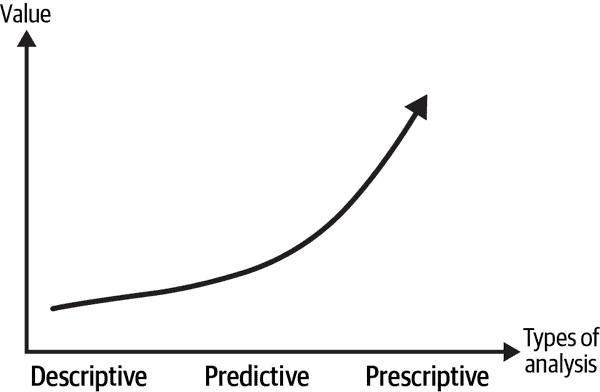

# 第一章：那又怎样？用数据科学创造价值

过去二十年来，数据科学（DS）已经取得了显著的增长，从最初只有硅谷顶尖科技公司才能负担得起的相对小众领域，发展到许多组织在许多行业和国家都使用的领域。尽管如此，许多团队仍然在为其公司创造可衡量的价值方面苦苦挣扎。

那么数据科学对一个组织的价值是什么？我发现各种资深数据科学家都在为这个问题苦苦挣扎，所以组织本身也难以理解。我在这第一章的目标是概述一些数据科学价值创造的基本原则。我相信理解和内化这些原则可以帮助你成为一名更好的数据科学家。

# 价值是什么？

公司存在是为了为股东、客户和员工（希望是整个社会）创造价值。股东自然期望获得与其他替代方案相比的投资回报。客户从产品的消费中获得价值，并期望这种价值至少与他们支付的价格相当。

原则上，所有团队和职能都应该以某种可衡量的方式为价值创造过程做出贡献，但在许多情况下，量化这一点显然并不容易。数据科学（DS）也不例外，存在这种缺乏可衡量性的问题。

在我的书籍《AI 与数据科学的分析技能》（O’Reilly）中，我介绍了这种通过数据创造价值的通用方法（Figure 1-1）。这个想法很简单：数据本身并不创造价值。价值来自于用数据做出的决策的质量。在第一层次上，你要描述公司的当前和过去状态。这通常是通过传统的商业智能（BI）工具如仪表板和报告来完成的。借助机器学习（ML），你可以对未来状态进行预测，并试图规避使决策过程变得更加困难的不确定性。如果你能自动化和优化决策过程的某些部分，那就达到了高峰。那本书就是要帮助从业者通过数据做出更好的决策，所以我这里不会重复。

###### 图 1-1。用数据创造价值

尽管这种描述可能很直观，但我发现这种描绘过于一般化和抽象，无法被数据科学家在实践中使用，因此随着时间的推移，我将其转化为一个框架，在我介绍叙述主题（第七章）时也会很方便使用。

归根结底是同一原则：增量价值来自于改进组织决策能力。为此，你真的需要理解手头的业务问题（*what*），认真考虑杠杆作用（*so what*），并对此积极主动行动（*now what*）。

# 什么：理解业务

我总是说，数据科学家应该像他们的利益相关者一样了解业务。而所谓的“业务”，我指的是“一切”，从操作层面的事务，比如理解和提出新的指标（第二章）和影响这些指标的杠杆，到支撑业务的经济和心理因素（例如，是什么驱使消费者购买你的产品）。

对于数据科学家来说，听起来需要学习的内容很多，尤其是因为你需要不断更新自己对不断发展的技术工具包的知识。你真的需要这样做吗？难道你不能只专注于算法、技术堆栈和数据的技术（和有趣的）部分，让利益相关者专注于他们（不那么有趣的）部分吗？

我的第一个观点是，“业务是”有趣的！但即使你不觉得这很令人兴奋，如果数据科学家希望让真正的决策者听到他们的声音，那么必须获得他们的利益相关者的尊重是绝对必要的。

在继续之前，让我强调一点，数据科学家很少是业务战略和战术上的真正决策者：决策者是利益相关者，不管是市场营销、财务、产品、销售还是公司中的其他任何团队。

如何做到这一点？以下是我发现有用的事项清单：

参加非技术会议。

没有教科书会教你业务的细枝末节；你真的必须在那里并从组织中的集体知识中学习。

获得与决策者共事的机会。

确保你参加制定决策的会议。我在那些明确定义了领域隔离的组织中为我的团队提出的理由是，如果他们在场，这对每个人都是最有利的。例如，如果你不了解业务的复杂性，你怎么能为你的模型提出优秀的特征？

学习关键绩效指标（KPI）。

数据科学家比组织中其他人有一个优势：他们“拥有”数据，并被不断要求计算和呈现团队的关键指标。所以你必须学会关键指标。听起来很显而易见，但许多数据科学家认为这很无聊，因为他们并不拥有指标——从他们很可能不负责达到目标的意义上来说——他们很乐意将这些任务委托给他们的利益相关者。此外，数据科学家应该是指标设计的专家（第二章）。

对此保持好奇心并持开放态度。

数据科学家应该拥抱好奇心。我的意思是，不要害羞地提出问题，质疑组织中被接受的事实集合。有趣的是，我发现许多数据科学家缺乏这种全面的好奇心。好消息是，这是可以学会的。我会在本章末分享一些资源。

分权结构。

这可能不在你的控制范围之内（或者你的经理，或者你经理的经理），但是在数据科学嵌入到团队的公司允许业务专业化（以及信任和其他积极外部性）。分散的数据科学结构组织拥有来自不同背景的团队成员（数据科学家、业务分析师、工程师、产品等），并且擅长使每个人成为他们所熟悉的专家。相比之下，集中式组织，其中一群“专家”作为整个公司的顾问也有优势，但获得必要的业务专业知识却不是其中之一。

# So What：数据科学中价值创造的要点

为什么你的项目对公司很重要？为什么任何人都应该关心你的分析或模型？更重要的是，它带来了哪些行动？这是本章讨论的核心问题，顺便说一句，我认为这是数据科学中那些决定职级的属性之一。在面试候选人时，经过技术方面的必要问题筛选后，我总是立刻进入*so what*部分。

我一再看到这个错误：数据科学家花大量时间运行他们的模型或分析，当到了做演示的时候，他们只是读取他们拥有的漂亮图表和数据可视化。真的是如此。

别误会，解释你的数据图表非常重要，因为利益相关者通常不是数据或数据可视化专家（尤其是对于更技术性的内容；当然，他们可以理解报告上的饼图）。但你不应止步于此。第七章将处理讲故事的实际问题，但我想提供一些关于如何培养这种技能的一般指导：

从一开始就考虑*so what*。

每当我决定启动一个新项目时，我总是从反向解决问题开始：决策者如何使用我的分析或模型的结果？他们有哪些杠杆？这是否可操作？在没有这些问题的答案之前，永远不要开始。

把它写下来。

一旦你弄清楚了*so what*，把它写下来是一个很好的实践。不要让它只在技术细节上起到次要作用。很多时候，你会深陷于技术琐事中而迷失方向。如果你把它写下来，*so what*将在绝望时充当你的北极星。

理解杠杆。

*So what*关乎可操作性。你关心的关键绩效指标通常不能直接行动，因此你或公司中的某人需要推动某些杠杆以影响这些指标（例如定价、营销活动、销售激励等）。你需要认真思考可能的行动方案。同时，也可以放手大胆地进行创新思维。

考虑你的观众。

他们是否关心你在预测模型中使用的复杂深度神经网络，还是关心他们如何利用你的模型来改进他们的指标？我猜想后者：如果你帮助他们成功，你也将成功。

# 现在怎么办：成为积极主动者

正如提到的，数据科学家通常不是决策者。数据科学家和他们的利益相关者之间存在共生关系：你需要他们将你的建议付诸实践，而他们需要你帮助改进业务。

我见过的最优秀的数据科学家是那些全面负责项目的积极主动者：他们确保每个团队都发挥自己的作用。他们发展必要的利益相关者管理和其他所谓的软技能，以确保这一切顺利进行。

不幸的是，许多数据科学家偏向于另一端。他们认为他们的工作只涉及技术部分。他们内化了应该避免的功能专业化。

###### 提示

当产品经理不同意你的产品建议，或者当你的营销利益相关者认为你越界时，也不要害怕提出替代的沟通策略。

话虽如此，要谦虚。如果你没有专业知识，在进入*现在怎么办*的领域之前，我的最佳建议是回到*什么*步骤，成为一个专家。

# 价值衡量

你的目标是创造可衡量的价值。你怎么做到这一点？这里有一个更普遍适用的小窍门。

数据科学家通过*X*来影响度量* M *，希望它将改进当前的基准。你可以把*M*看作*X*的函数：

<math alttext="Impact of upper X equals upper M left-parenthesis upper X right-parenthesis minus upper M left-parenthesis baseline right-parenthesis" display="block"><mrow><mtext>Impact</mtext> <mtext>of</mtext> <mi>X</mi> <mo>=</mo> <mi>M</mi> <mo>(</mo> <mi>X</mi> <mo>)</mo> <mo>-</mo> <mi>M</mi> <mo>(</mo> <mtext>baseline</mtext> <mo>)</mo></mrow></math>

让我们通过一个流失预测模型来实践这个原则：

X

流失预测模型

M

流失率，即在期*t*−1 中活跃用户中在期*t*中不活跃的百分比

基准

分割策略

注意，*M* 不是 *X* 的函数！即使没有预测模型，流失率也是相同的。只有当*你对模型的输出做出改变*时，度量指标才会改变。你看到价值是如何从行动中获得的，而不是从数据或模型中获得的吗？因此，让我们调整原则，以确保行动（*A*）影响度量指标：

<math alttext="Impact of upper X equals upper M left-parenthesis upper A left-parenthesis upper X right-parenthesis right-parenthesis minus upper M left-parenthesis upper A left-parenthesis baseline right-parenthesis right-parenthesis" display="block"><mrow><mtext>Impact</mtext> <mtext>of</mtext> <mi>X</mi> <mo>=</mo> <mi>M</mi> <mo>(</mo> <mi>A</mi> <mo>(</mo> <mi>X</mi> <mo>)</mo> <mo>)</mo> <mo>-</mo> <mi>M</mi> <mo>(</mo> <mi>A</mi> <mo>(</mo> <mtext>baseline</mtext> <mo>)</mo> <mo>)</mo></mrow></math>

你可以使用哪些杠杆？在典型情况下，你可以推出一个保留活动，只针对下个月可能变得不活跃的用户。例如，你可以提供折扣或推出沟通活动。

让我们也应用*什么*、*为什么*和*现在怎么办*的框架：

什么

在你的公司中如何衡量流失？这是最佳的衡量方式吗？拥有度量标准的团队在减少流失率（基准）方面做了什么？为什么用户变得不活跃？是什么导致了流失？对损益的影响如何？

那么

概率分数将如何使用？你能帮助他们找到可供测试的替代杠杆吗？有折扣可用吗？忠诚计划呢？

现在是什么

公司决策和运营过程中，你需要从任何参与者那里获取什么？你需要法律或财务部门的批准吗？产品团队对建议的变更满意吗？广告活动何时上线？市场团队准备好推出吗？

让我强调*为什么*和*现在怎么办*部分的重要性。你可能拥有一款预测能力强且希望可解释的优秀 ML 模型。但是，如果实际决策者采取的行动不能影响指标，你团队的价值将为零（*为什么*）。在积极的方法中，你实际上帮助他们提出替代方案（这是*什么*的重要性和成为问题专家的重要性）。但你需要确保这一点（*现在怎么办*）。使用我的标记，你必须拥有 <math alttext="upper M left-parenthesis upper A left-parenthesis upper X right-parenthesis right-parenthesis"><mrow><mi>M</mi> <mo>(</mo> <mi>A</mi> <mo>(</mo> <mi>X</mi> <mo>)</mo> <mo>)</mo></mrow></math> ，而不仅仅是 <math alttext="upper X"><mi>X</mi></math> 。

一旦你量化了模型的增量效应，就是时候将其转化为价值了。有些团队乐意声明客户流失减少了一些并停止在那里。但即使在这些情况下，我发现提出一个具体的金额也很有用。如果你能展示你的团队为公司带来了多少增量价值，获得更多资源将更容易。

在例子中，可以通过几种方式来完成。最简单的一种是直接描述价值。

假设每月每位用户的平均收入是 *R* ，公司有活跃用户的基础 *B* ：

<math alttext="Cost of Churn left-parenthesis upper A comma upper X right-parenthesis equals upper B times Churn left-parenthesis upper A left-parenthesis upper X right-parenthesis right-parenthesis times upper R" display="block"><mrow><mtext>Cost</mtext> <mtext>of</mtext> <mtext>Churn</mtext> <mo>(</mo> <mi>A</mi> <mo>,</mo> <mi>X</mi> <mo>)</mo> <mo>=</mo> <mi>B</mi> <mo>×</mo> <mtext>Churn</mtext> <mo>(</mo> <mi>A</mi> <mo>(</mo> <mi>X</mi> <mo>)</mo> <mo>)</mo> <mo>×</mo> <mi>R</mi></mrow></math>

如果你有 100 名用户，每名用户每月带来 7 美元，月流失率为 10％，公司每月损失 70 美元。

增量货币价值是有模型与无模型的成本差异。经过排除共同术语后，你得到：

<math alttext="normal upper Delta Cost of Churn left-parenthesis upper A comma baseline comma upper X right-parenthesis equals upper B times normal upper Delta Churn left-parenthesis upper A semicolon upper X comma baseline right-parenthesis times upper R" display="block"><mrow><mi>Δ</mi> <mtext>Cost</mtext> <mtext>of</mtext> <mtext>Churn</mtext> <mo>(</mo> <mi>A</mi> <mo>,</mo> <mtext>baseline</mtext> <mo>,</mo> <mi>X</mi> <mo>)</mo> <mo>=</mo> <mi>B</mi> <mo>×</mo> <mi>Δ</mi> <mtext>Churn</mtext> <mo>(</mo> <mi>A</mi> <mo>;</mo> <mi>X</mi> <mo>,</mo> <mtext>baseline</mtext> <mo>)</mo> <mo>×</mo> <mi>R</mi></mrow></math>

如果之前使用的分割策略每月节省 70 美元，而现在专注的 ML 模型创造了 90 美元的节省，那么对于组织来说的增量价值就是 20 美元。

更复杂的方法还包括其他产生价值的变更，例如假阳性和假阴性的成本：

假阳性

通常会针对那些使用成本高昂的杠杆的用户，但其中一些本来就不会流失。你可以衡量这些杠杆的成本。例如，如果你给 100 名用户价格 *P* 打 9 折，但其中只有 95 名实际会流失，那么你在假阳性方面损失了 <math alttext="5 times 0.1 times upper P"><mrow><mn>5</mn> <mo>×</mo> <mn>0</mn> <mo>.</mo> <mn>1</mn> <mo>×</mo> <mi>P</mi></mrow></math> 。

假阴性

由于糟糕预测带来的机会成本是那些最终流失但未被基线方法检测到的用户的收入。这些成本可以用我们刚刚讨论过的方程式来计算。

# 主要收获

我现在将总结本章的主要信息：

公司的存在是为了创造价值。因此，团队应该创造价值。

如果一个数据科学团队不能创造价值，对于公司来说就是一种奢侈。数据科学的炒作给你带来了一些余地，但要生存下去，你需要确保数据科学对公司的商业案例是正面的。

通过做出决策来创造价值。

数据科学的价值来自于通过你所熟知和热爱的数据驱动、证据支持的工具包，改进公司的决策能力。

价值创造的核心是“那又怎样”。

如果你的模型或分析无法产生可操作的见解，那么一开始就停下来。认真考虑杠杆，并成为业务的专家。

发展你的软技能。

一旦你有了你的模型或分析，并且已经提出可操作的建议，现在是确保全面交付的时候了。利益相关者管理至关重要，但受欢迎也很重要。如果你对自己的业务了如指掌，不要害羞于提出建议。

# 进一步阅读

我在我的书 *《AI 和数据科学的分析技能》*（O’Reilly 出版）中涉及了几个这样的主题。查看学习如何提出业务问题和找到解决业务问题的良好杠杆的章节。

在学习好奇心方面，请记住你天生好奇。孩子们总是在提问，但随着他们长大，他们忘记了这一点。这可能是因为他们变得自我意识或害怕被视为无知。你需要克服这些心理障碍。你可以阅读 *《更美丽的问题：探究问题的力量引发突破性思维》*（Waren Berger 著，Bloomsbury），或理查德·费曼的几本书（试试《The Pleasure of Finding Things Out》[Basic Books]）。

在发展必要的社交和沟通技能方面，有很多资源和很多事情可以继续学习。我发现 *《精英的生存法则：高诚信政治策略促进职业和公司成功》*（Rick Brandon 和 Marty Seldman 合著，Free Press）对于以非常实用的方式处理公司政治非常有用。

*《极限所有权：海豹突击队如何领导和取胜》*（Jocko Willink 和 Leif Babin 合著，St. Martin's Press）认为优秀的领导者行使全面（极限）所有权。

*《永不分手：如何进行有效的谈判》*（Chris Voss 和 Tahl Raz 合著，Harper Business）非常适合发展必要的谈判技巧，经典且经常被引用的 *《如何赢得朋友和影响人》*（Dale Carnegie 著，Pocket Books）应该会帮助你发展一些对成功至关重要的“软”技能。
