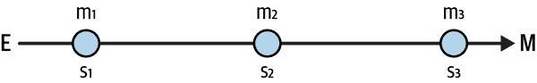

# 第二章：指标设计

让我提出，优秀的数据科学家也是优秀的指标设计师。什么是指标设计？简单地说，它是发现具有良好属性的指标的艺术和科学。我将很快讨论一些这些理想属性，但首先让我为为什么数据科学家应该擅长此项技能做出解释。

简单的答案是：因为如果不是我们，那么是谁？理想情况下，组织中的每个人都应该擅长指标设计。但数据从业者最适合这项任务。数据科学家一直在处理指标：他们计算、报告、分析，并且希望优化它们。以 A/B 测试为例：每个好测试的起点是拥有正确的输出指标。类似的理由也适用于机器学习（ML）：获取正确的预测结果指标至关重要。

# 指标应具备的理想属性

公司为什么需要指标？正如在第一章中所讨论的那样，良好的指标在于推动行动。有了这个成功标准，让我们逆向工程这个问题，并识别成功所需的必要条件。

## 可测量的

指标从定义上来说是可以衡量的。不幸的是，许多指标是不完美的，学会识别它们的缺陷将使你受益匪浅。所谓的*代理*指标通常与期望的结果相关，你需要理解与它们一起工作的利弊。¹

一个简单的例子是*意图性*。假设你想了解*早期流失*（新用户的流失）的驱动因素。其中一些人实际上并不打算使用产品，只是试用了一下。因此，测量意图性会极大地改进你的预测模型。意图性实际上是无法衡量的，因此你需要找到替代指标，比如在了解该应用程序后开始使用之间的时间间隔。我认为，你开始使用得越快，你的意图就越强烈。

另一个例子是成长从业者使用的*习惯*概念。应用程序的用户通常完成入门，试用产品（啊哈！时刻），并希望形成习惯。什么是用户达到这一阶段的良好证据？一个常见的替代指标是用户首次尝试后*X*天内的互动次数。对我来说，习惯就是*重复*，这对每个用户来说意味着什么。在这种情况下，替代指标最多只是重复的一个早期指标。

## 可操作的

为了推动决策，指标必须是可操作的。不幸的是，许多顶层指标并不能直接操作。想想*收入*：它依赖于用户购买产品，这是无法强制的。但是，如果你将指标分解为子指标，可能会出现一些有效的杠杆，我将在例子中展示。

## 相关性

这个度量对手头的问题有信息性吗？我称这种属性为*相关性*，因为它强调了一个度量只有在与特定业务问题相关时才是好的。我可以使用*信息性*，但所有的度量都是某事的信息。相关性是为正确的问题选择*正确*度量的属性。

## 及时性

好的度量在需要时推动行动。如果我发现自己有晚期癌症，我的医生无法做太多事情。但如果我定期检查，他们可能会发现早期症状，从而打开治疗的选择菜单。

用户流失是另一个例子。通常使用一个月的不活跃窗口进行测量和报告：一个月活跃、下一个月不活跃的用户比例。不幸的是，这个度量可能会产生误报：一些用户只是休息，并没有流失。

获得更强大的度量的一种方法是将不活跃窗口从一个月增加到三个月。时间窗口越长，用户只是休息的可能性就越小。但是，新的度量在及时性方面已经降低：您现在必须等待三个月才能标记一个流失客户，可能为时已晚启动保留活动。

# Metrics Decomposition

通过分解度量，您可以改进其中任何一个属性。现在我将详细介绍几个技巧，这些技巧将帮助您实现这一目标。

## 漏斗分析

漏斗是一系列按顺序进行的操作。例如，在前述习惯示例中，用户首先需要设置他们的账户，尝试产品，并定期使用它。每当您有漏斗时，您可以使用一个简单的技巧找到子度量。让我先在抽象中展示这个技巧，然后提供一些简明的例子。

图 2-1 显示了一个典型的漏斗：它是从入口点*E*到输出*M*的一系列阶段（滥用符号；这些符号也表示相应的度量）。我的目标是改进*M*。内部阶段表示为<math alttext="s 1 comma s 2 comma s 3"><mrow><msub><mi>s</mi> <mn>1</mn></msub> <mo>,</mo> <msub><mi>s</mi> <mn>2</mn></msub> <mo>,</mo> <msub><mi>s</mi> <mn>3</mn></msub></mrow></math>，每个阶段提供一个相应索引的度量<math alttext="m Subscript i"><msub><mi>m</mi> <mi>i</mi></msub></math>。

###### 图 2-1\. 一个典型的漏斗

分解的工作原理如下：您从右向左移动，乘以当前子度量，然后除以前一个子度量。为了确保您永远不会失去相等，最后乘以漏斗开头的度量（*E*）。请注意，在取消公共术语后，最终结果是<math alttext="upper M equals upper M"><mrow><mi>M</mi> <mo>=</mo> <mi>M</mi></mrow></math>，确保这确实是原始度量的分解。

<math alttext="upper M equals StartFraction upper M Over m 3 EndFraction times StartFraction m 3 Over m 2 EndFraction times StartFraction m 2 Over m 1 EndFraction times StartFraction m 1 Over upper E EndFraction times upper E" display="block"><mrow><mi>M</mi> <mo>=</mo> <mfrac><mi>M</mi> <msub><mi>m</mi> <mn>3</mn></msub></mfrac> <mo>×</mo> <mfrac><msub><mi>m</mi> <mn>3</mn></msub> <msub><mi>m</mi> <mn>2</mn></msub></mfrac> <mo>×</mo> <mfrac><msub><mi>m</mi> <mn>2</mn></msub> <msub><mi>m</mi> <mn>1</mn></msub></mfrac> <mo>×</mo> <mfrac><msub><mi>m</mi> <mn>1</mn></msub> <mi>E</mi></mfrac> <mo>×</mo> <mi>E</mi></mrow></math>

每个分数可以解释为转化率，即在前一阶段可用单位中到达当前阶段的百分比。通常其中一个或所有这些子指标比原始指标 *M* 更具有优越性质。现在您了解了这一技术，是时候付诸实践了。

典型的销售漏斗就是这样工作的。我的目标是增加销售，但这需要几个步骤。这里我将漏斗简化一下：

+   潜在客户生成（ <math alttext="upper L"><mi>L</mi></math> ：潜在客户数量）

+   第一次接触（ <math alttext="upper C 1"><msub><mi>C</mi> <mn>1</mn></msub></math> ：第一次接触的次数）

+   第二次接触（ <math alttext="upper C 2"><msub><mi>C</mi> <mn>2</mn></msub></math> ：第二次接触的次数）

+   提出报价（ <math alttext="upper O"><mi>O</mi></math> ：提出的报价数量）

+   完成销售（ <math alttext="upper S"><mi>S</mi></math> ：销售数量）

分解如下：

<math alttext="upper S equals StartFraction upper S Over upper O EndFraction times StartFraction upper O Over upper C 2 EndFraction times StartFraction upper C 2 Over upper C 1 EndFraction times StartFraction upper C 1 Over upper L EndFraction times upper L" display="block"><mrow><mi>S</mi> <mo>=</mo> <mfrac><mi>S</mi> <mi>O</mi></mfrac> <mo>×</mo> <mfrac><mi>O</mi> <msub><mi>C</mi> <mn>2</mn></msub></mfrac> <mo>×</mo> <mfrac><msub><mi>C</mi> <mn>2</mn></msub> <msub><mi>C</mi> <mn>1</mn></msub></mfrac> <mo>×</mo> <mfrac><msub><mi>C</mi> <mn>1</mn></msub> <mi>L</mi></mfrac> <mo>×</mo> <mi>L</mi></mrow></math>

要增加销售数量，您可以增加潜在客户的数量，或者增加各个阶段之间的转化率。有些行动与数据科学家相关（例如，提高潜在客户的质量），而其他行动则与销售团队相关（例如，是否有足够的第一次接触；如果没有，公司可能需要增加销售人员规模或雇佣不同的人）。也许他们应该改变谈判或定价策略以提高报价至销售的比率。甚至改进产品！您可以拥有最佳的潜在客户或最佳的销售团队，但仍然缺乏产品市场契合度。

## 存量流动分解

*存量-流动分解* 在您关心的累积度量时非常有用。让我们首先定义这些概念：*存量*变量是在特定时间累积的变量。*流动*变量不积累，而是在一段时间内测量的。一个有用的类比是浴缸：在时间 *t* 的水量等于时间 *t* - 1 的水量，加上这两个时刻之间通过水龙头流入的水量，减去通过排水口流出的水量。

最常见的情况是当您希望理解月活跃用户（*MAU*）。首先我将解释分解，然后再进行评论：

<math alttext="MAU Subscript t Baseline equals MAU Subscript t minus 1 Baseline plus Incoming Users Subscript t Baseline minus Churned Users Subscript t" display="block"><mrow><msub><mtext>MAU</mtext> <mi>t</mi></msub> <mo>=</mo> <msub><mtext>MAU</mtext> <mrow><mi>t</mi><mo>-</mo><mn>1</mn></mrow></msub> <mo>+</mo> <mtext>Incoming</mtext> <msub><mtext>Users</mtext> <mi>t</mi></msub> <mo>-</mo> <mtext>Churned</mtext> <msub><mtext>Users</mtext> <mi>t</mi></msub></mrow></math>

如果目标是增加公司的*MAU*，您可以增加客户获取或减少流失。*新用户*和*复苏用户*可能会成为*传入用户*，至少提供一个新的杠杆。

类似的分解也适用于任何存量变量（如银行账户中的余额）。

## P×Q 型分解

另一个常见情况是试图提高收入。这里的技巧是通过一个*合理的*度量标准进行乘法和除法运算，以得出最容易利用的子指标：

<math alttext="Revenue equals StartFraction Revenue Over Units Sold EndFraction times Units Sold equals Unit Price times Sales" display="block"><mrow><mrow><mtext>Revenue</mtext> <mo>=</mo> <mfrac><mtext>Revenue</mtext> <mrow><mtext>Units</mtext><mtext>Sold</mtext></mrow></mfrac> <mo>×</mo> <mtext>Units</mtext> <mtext>Sold</mtext></mrow> <mo>=</mo> <mtext>Unit</mtext> <mtext>Price</mtext> <mo>×</mo> <mtext>Sales</mtext></mrow></math>

这表明如何将收入分解为单位（平均）价格和销售量的乘积：<math alttext="upper R equals p times q"><mrow><mi>R</mi> <mo>=</mo> <mi>p</mi> <mo>×</mo> <mi>q</mi></mrow></math> 。要增加收入，你可以增加价格或销售量。有趣的是，销售量与价格呈负相关，因此这种关系是非线性的，使其成为收入优化的首选工具。

# 例如：另一种收入分解

从收入由活跃用户生成的事实出发，你可以尝试类似的分解，对某些问题和杠杆选择可能非常有价值：

<math alttext="Revenue equals StartFraction Revenue Over MAU EndFraction times MAU equals ARPU times MAU" display="block"><mrow><mrow><mtext>Revenue</mtext> <mo>=</mo> <mfrac><mtext>Revenue</mtext> <mtext>MAU</mtext></mfrac> <mo>×</mo> <mtext>MAU</mtext></mrow> <mo>=</mo> <mtext>ARPU</mtext> <mo>×</mo> <mtext>MAU</mtext></mrow></math>

我刚刚将收入表达为平均用户收入（ARPU）和活跃用户的函数。如果我想找到更多的杠杆，我可以插入 MAU 库存方程。同样，我也可以插入<math alttext="p times q"><mrow><mi>p</mi> <mo>×</mo> <mi>q</mi></mrow></math> 分解来扩展列表。

# 例如：市场

以市场为例，考虑一个两边平台，匹配买家（*B*）和卖家（*S*）。想象亚马逊、eBay、Uber、Airbnb 等。

让我们考虑一个简化的漏斗：

<math alttext="Sellers right-arrow Listed Items right-arrow Views right-arrow Purchases" display="block"><mrow><mtext>Sellers</mtext> <mo>→</mo> <mtext>Listed</mtext> <mtext>Items</mtext> <mo>→</mo> <mtext>Views</mtext> <mo>→</mo> <mtext>Purchases</mtext></mrow></math>

根据这一解释，公司首先吸引开始列出物品并最终被购买的卖家。你的目标是增加购买。

使用漏斗逻辑，这翻译成（大写字母表示每一步中的对应指标）：

<math alttext="upper P equals StartFraction upper P Over upper V EndFraction times StartFraction upper V Over upper L EndFraction times StartFraction upper L Over upper S EndFraction times upper S" display="block"><mrow><mi>P</mi> <mo>=</mo> <mfrac><mi>P</mi> <mi>V</mi></mfrac> <mo>×</mo> <mfrac><mi>V</mi> <mi>L</mi></mfrac> <mo>×</mo> <mfrac><mi>L</mi> <mi>S</mi></mfrac> <mo>×</mo> <mi>S</mi></mrow></math>

要包括市场的另一侧，让我们应用之前讨论过的另一个技巧，使总浏览商品数等于买家数量乘以每位买家的平均浏览次数：

<math alttext="upper V equals StartFraction upper V Over upper B EndFraction times upper B" display="block"><mrow><mi>V</mi> <mo>=</mo> <mfrac><mi>V</mi> <mi>B</mi></mfrac> <mo>×</mo> <mi>B</mi></mrow></math>

经过一些调整后，我得出：

<math alttext="upper P equals StartFraction upper P Over upper V EndFraction times StartFraction upper V Over upper B EndFraction times StartFraction upper L Over upper S EndFraction times StartFraction 1 Over upper L EndFraction times upper B times upper S" display="block"><mrow><mi>P</mi> <mo>=</mo> <mfrac><mi>P</mi> <mi>V</mi></mfrac> <mo>×</mo> <mfrac><mi>V</mi> <mi>B</mi></mfrac> <mo>×</mo> <mfrac><mi>L</mi> <mi>S</mi></mfrac> <mo>×</mo> <mfrac><mn>1</mn> <mi>L</mi></mfrac> <mo>×</mo> <mi>B</mi> <mo>×</mo> <mi>S</mi></mrow></math>

结果表明，要增加购买，你可以选择以下之一：

+   提高结账效率（ <math alttext="upper P slash upper V"><mrow><mi>P</mi> <mo>/</mo> <mi>V</mi></mrow></math> ）

+   增加买家的参与度（ <math alttext="upper V slash upper B"><mrow><mi>V</mi> <mo>/</mo> <mi>B</mi></mrow></math> ）

+   增加卖家的参与度（ <math alttext="upper L slash upper S"><mrow><mi>L</mi> <mo>/</mo> <mi>S</mi></mrow></math> ）

+   增加买家或卖家的数量

为了确保平等保持，我有一个额外项，缺乏明显解释（ <math alttext="1 slash upper L"><mrow><mn>1</mn> <mo>/</mo> <mi>L</mi></mrow></math> ）。我并不真正关心这个额外项，因为现在我有五个可以在不同方面利用的子指标。

# 关键要点

这些是本章的关键要点：

你需要好的指标来推动行动。

如果你的目标是找到能推动行动的杠杆，指标设计至关重要。我已经反向工程化这个问题，以得出一些指标设计的理想特性。

优良指标应具备的理想特性。

一个好的指标必须是可衡量的、可操作的、相关的和及时的。

将指标分解为子指标可帮助改善这些特性。

漏斗型分解易于使用，一旦您习惯了它们，您就会在各处看到漏斗。

一个简单的技巧是通过一个度量来乘以和除以一个度量，这可以带你走得很远。但选择这个度量远非明显，并且您需要对业务有很好的了解才能找到它。

度量设计是一个迭代过程。

从不完美的度量开始是可以的，但如果将其作为一个不断迭代的过程，那就更好了。

# 进一步阅读

如果您想了解一些补充信息，可以查阅我的书籍《AI 与数据科学的分析技能》，但本章节更全面地介绍了实际使用的技术。在那本书中，我还展示了如何使用<math alttext="upper R equals p times q"><mrow><mi>R</mi> <mo>=</mo> <mi>p</mi> <mo>×</mo> <mi>q</mi></mrow></math>分解进行收入优化。

《Hacking Growth: How Today’s Fastest-Growing Companies Drive Breakout Success》（[Sean Ellis and Morgan Brown](https://www.example.org/sean_ellis_and_morgan_brown) Currency）中可以找到关于增长爱好者的度量设计讨论。

虽然不是关于度量设计的书籍，而是关于 OKR 的，《衡量什么重要》（[John Doerr](https://www.example.org/john_doerr)出版社）绝对值得一读。我已经运用这里提出的技术找到了可以由特定团队具体针对的子度量。据我所知，从数据科学的角度来看，没有其他关于这些主题的出版资源。

¹ 例如，在线性回归中，特征的测量误差会导致参数估计的统计偏差。

² 如果浏览是从列出的项目集合中随机生成的，您可以给额外的项一个概率解释。但这实际上违背了分解的目的。
