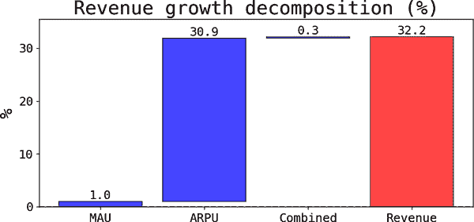

# 第三章：增长分解：理解顺风和逆风

第二章 描述了一些技术，以找到能够推动行动的更好指标。本章涉及一个完全不同的主题：如何分解指标以理解指标变化的原因。在公司行话中，这些变化通常与*顺风*或*逆风*有关，即对公司状态产生积极或消极影响的因素。

# 为什么要进行增长分解？

数据科学家经常被要求帮助理解指标变化的根本原因。为什么收入季度同比增长（QoQ）或月同比增长（MoM）？依我的经验，这些问题非常难以回答，不仅因为可能同时发生许多事情，而且因为一些潜在原因并不直接可测量或提供足够的变化来提供信息。¹ 典型的例子包括经济状况、监管环境以及竞争对手的决策。

尽管如此，我发现当结合以下技术时，可以利用其他来源的变化来提供一些线索。

# 加法分解

正如其名称所示，当你希望理解的指标（输出）可以表示为其他指标（输入）之和时，这种分解方法非常方便。在两个输入的情况下，可以表示为 <math alttext="y Subscript t Baseline equals y Subscript 1 comma t Baseline plus y Subscript 2 comma t"><mrow><msub><mi>y</mi> <mi>t</mi></msub> <mo>=</mo> <msub><mi>y</mi> <mrow><mn>1</mn><mo>,</mo><mi>t</mi></mrow></msub> <mo>+</mo> <msub><mi>y</mi> <mrow><mn>2</mn><mo>,</mo><mi>t</mi></mrow></msub></mrow></math> 。请注意，我使用了时间下标。

该分解表示从 <math alttext="t minus 1"><mrow><mi>t</mi> <mo>-</mo> <mn>1</mn></mrow></math> 到 <math alttext="t"><mi>t</mi></math> 的输出增长（ <math alttext="g Subscript y comma t"><msub><mi>g</mi> <mrow><mi>y</mi><mo>,</mo><mi>t</mi></mrow></msub></math> ）是输入增长率的加权平均：

<math alttext="g Subscript y comma t Baseline equals omega Subscript 1 comma t minus 1 Baseline g Subscript y 1 comma t Baseline plus omega Subscript 2 comma t minus 1 Baseline g Subscript y 2 comma t" display="block"><mrow><msub><mi>g</mi> <mrow><mi>y</mi><mo>,</mo><mi>t</mi></mrow></msub> <mo>=</mo> <msub><mi>ω</mi> <mrow><mn>1</mn><mo>,</mo><mi>t</mi><mo>-</mo><mn>1</mn></mrow></msub> <msub><mi>g</mi> <mrow><msub><mi>y</mi> <mn>1</mn></msub> <mo>,</mo><mi>t</mi></mrow></msub> <mo>+</mo> <msub><mi>ω</mi> <mrow><mn>2</mn><mo>,</mo><mi>t</mi><mo>-</mo><mn>1</mn></mrow></msub> <msub><mi>g</mi> <mrow><msub><mi>y</mi> <mn>2</mn></msub> <mo>,</mo><mi>t</mi></mrow></msub></mrow></math>

其中权重总和为一，<math alttext="omega Subscript 1 comma t minus 1 Baseline plus omega Subscript 2 comma t minus 1 Baseline equals 1"><mrow><msub><mi>ω</mi> <mrow><mn>1</mn><mo>,</mo><mi>t</mi><mo>-</mo><mn>1</mn></mrow></msub> <mo>+</mo> <msub><mi>ω</mi> <mrow><mn>2</mn><mo>,</mo><mi>t</mi><mo>-</mo><mn>1</mn></mrow></msub> <mo>=</mo> <mn>1</mn></mrow></math> 。

重要的是，权重是每个输入在*上一个周期*中的相对重要性。因此，在*t-1*中占较大份额的输入将被赋予更高的权重。

## 例子

在数据仓库中，加法设置非常常见，其中包括事实表和维度表。我发现语法类比有助于区分二者：事实反映动作或动词，而维度则是描述动作的副词。事实表通常存储与公司相关的度量标准，而维度表则存储帮助你理解度量标准的维度。

这是生成所需数据集的典型 SQL 查询：

```
SELECT DATE_TRUNC('MONTH', ft.fact_timestamp) AS month,
       dt.dimension1 AS dim_values,
       SUM(ft.my_metric) AS monthly_metric
FROM my_fact_table ft
LEFT JOIN my_dim_table dt ON ft.primary_key = dt.primary_key
GROUP BY 1,2
ORDER BY 1,2
```

例如，可能的指标是顾客购买量，你想按地理区域展开。由于总销售额必须是各个区域销售额的总和，这种分解方法非常方便。它将帮助你了解某个或多个区域的增长率是否是国家级加速或减速的主要驱动因素。

###### 注意

示例查询突显了如何轻松创建一个分组表，使用*不同*维度拆分指标。整个过程如下：

1.  创建一个定期更新不同维度的聚合表的管道。

1.  编写一个脚本，计算一个维度的分解并将结果输出为表格（参见[GitHub 仓库](https://oreil.ly/dshp-repo)）。

1.  使用该脚本循环遍历所有维度。

1.  最终结果是一个包含所有变化来源的表格。

此时，你需要了解业务知识以识别变化中的模式。这通常是最困难的部分，需要对业务有广泛的了解。

## 解释和用例

如前所述，通过加法分解，输出的增长率等于输入的增长率的加权平均值。尽管如此，我更倾向于思考每个段或维度值的增长贡献，其中每个贡献等于滞后权重与相应增长率的乘积。

当你同时拥有多个可以同时使用且可以共同提供有关潜在因素提示的维度时，分解特别有用。

回到销售例子，你可以应用分解方法使用地理区域、店铺附近的社会经济地位（SES）以及某种类型的顾客分段（例如，按照在职年限）。

结论可能类似于：国家销售额月降低了 7 个百分点（pp），主要原因是：

+   西南地区月减速率为 14 个百分点。

+   高 SES 地区的店铺减速得更快。

+   减速在各个在职年限中相对均匀。

正如之前提醒过的，要注意*实际上*并没有找到根本原因；最多只有足够的线索可以解释变化的驱动因素。西南地区经济是否正在减速？这些店铺的定价有变化吗？高 SES 顾客的客户满意度如何？

图 3-1 显示了一个模拟示例的瀑布图，展示了各个地区对国家水平下降的贡献。在这种情况下，主要是由于西北地区的强烈减速（降低了 5.8 个百分点），导致全国水平下降了 4.6%。西南和西部地区也有所减速，而南部则有一个强劲的季度。


###### 图 3-1\. 区域对增长的贡献

# 乘法分解

*乘法分解* 在输出指标可以表示为两个或多个输入的乘积时起作用。第二章展示了这些在许多设置中是如何自然产生的，例如在<math alttext="p times q"><mrow><mi>p</mi> <mo>×</mo> <mi>q</mi></mrow></math>情况下。

分解表明，每当<math alttext="y Subscript t Baseline equals y Subscript 1 comma t Baseline times y Subscript 2 comma t"><mrow><msub><mi>y</mi> <mi>t</mi></msub> <mo>=</mo> <msub><mi>y</mi> <mrow><mn>1</mn><mo>,</mo><mi>t</mi></mrow></msub> <mo>×</mo> <msub><mi>y</mi> <mrow><mn>2</mn><mo>,</mo><mi>t</mi></mrow></msub></mrow></math> ，那么：

<math alttext="g Subscript y comma t Baseline equals g Subscript 1 comma t Baseline plus g Subscript 2 comma t Baseline plus g Subscript 1 comma t Baseline times g Subscript 2 comma t" display="block"><mrow><msub><mi>g</mi> <mrow><mi>y</mi><mo>,</mo><mi>t</mi></mrow></msub> <mo>=</mo> <msub><mi>g</mi> <mrow><mn>1</mn><mo>,</mo><mi>t</mi></mrow></msub> <mo>+</mo> <msub><mi>g</mi> <mrow><mn>2</mn><mo>,</mo><mi>t</mi></mrow></msub> <mo>+</mo> <msub><mi>g</mi> <mrow><mn>1</mn><mo>,</mo><mi>t</mi></mrow></msub> <mo>×</mo> <msub><mi>g</mi> <mrow><mn>2</mn><mo>,</mo><mi>t</mi></mrow></msub></mrow></math>

简而言之，输出的增长率等于增长率的总和 *和* 一个组合效应。

## 例子

让我们使用来自第二章的收入分解，看看这些是用户平均收入（ARPU）和月活跃用户（MAU）的乘积：

<math alttext="Revenues equals ARPU times MAU" display="block"><mrow><mtext>Revenues</mtext> <mo>=</mo> <mtext>ARPU</mtext> <mo>×</mo> <mtext>MAU</mtext></mrow></math>

如果收入增长，可能是因为 ARPU 加速，MAU 增加，或者两者都朝着同一个方向变化。更重要的是，通过分解，你实际上可以*量化*每一个。

图 3-2 显示了一个模拟 ARPU 示例的分解可能可视化。在这种情况下，MoM 增长的主要驱动因素是用户平均收入的显著加速（贡献了约 31 个百分点或大约总收入增长的 96%）。请注意，组合效应非常小，因为它是输入增长率的乘积。许多时候，如果确实可以忽略不计，你可以直接去掉它。²



###### 图 3-2\. ARPU 的乘法分解

## 解释

在乘法设置中，输出的增长是输入增长的总和加上一个组合效应。当有超过两个输入时，这仍然成立，但你需要添加组合效应的总和。

# 混合比率分解

*混合比率分解* 从加法和乘法分解中各取一些。假设你的输出指标是其他指标的加权平均：

<math alttext="y Subscript t Baseline equals sigma-summation Underscript s Endscripts w Subscript s comma t Baseline x Subscript s comma t Baseline equals bold w Subscript bold t Baseline ModifyingAbove With bold dot bold x Subscript bold t" display="block"><mrow><msub><mi>y</mi> <mi>t</mi></msub> <mo>=</mo> <munder><mo>∑</mo> <mi>s</mi></munder> <msub><mi>w</mi> <mrow><mi>s</mi><mo>,</mo><mi>t</mi></mrow></msub> <msub><mi>x</mi> <mrow><mi>s</mi><mo>,</mo><mi>t</mi></mrow></msub> <mo>=</mo> <msub><mi>𝐰</mi> <mi>𝐭</mi></msub> <mover accent="true"><mo>˙</mo></mover> <msub><mi>𝐱</mi> <mi>𝐭</mi></msub></mrow></math>

其中最后一个等式只是将总和表达为相应向量的点或内积（粗体表示）。

让我详细说明分解，然后解释这些术语：

<math alttext="normal upper Delta y Subscript t Baseline equals normal upper Delta Subscript y Superscript x Baseline plus normal upper Delta Subscript y Superscript w Baseline plus normal upper Delta bold w dot bold upper Delta bold x" display="block"><mrow><mi>Δ</mi> <msub><mi>y</mi> <mi>t</mi></msub> <mo>=</mo> <msubsup><mi>Δ</mi> <mi>y</mi> <mi>x</mi></msubsup> <mo>+</mo> <msubsup><mi>Δ</mi> <mi>y</mi> <mi>w</mi></msubsup> <mo>+</mo> <mi>Δ</mi> <mi>𝐰</mi> <mo>·</mo> <mi>Δ</mi> <mi>𝐱</mi></mrow></math>

其中：

<math alttext="normal upper Delta y Subscript t"><mrow><mi>Δ</mi> <msub><mi>y</mi> <mi>t</mi></msub></mrow></math>

输出指标的第一差分。我发现保持一切都是差分——而不是增长率——通常就足够了，而且大大简化了符号。

<math alttext="normal upper Delta Subscript y Superscript x"><msubsup><mi>Δ</mi> <mi>y</mi> <mi>x</mi></msubsup></math>

如果权重保持在初始值不变，只有输入改变，输出会发生什么变化？符号表明只允许输入（上标）改变输出（下标）。

<math alttext="normal upper Delta Subscript y Superscript w"><msubsup><mi>Δ</mi> <mi>y</mi> <mi>w</mi></msubsup></math>

如果输入保持在初始值不变，只有权重改变，输出会发生什么变化？

<math alttext="normal upper Delta bold w dot bold upper Delta bold x"><mrow><mi>Δ</mi> <mi>𝐰</mi> <mo>·</mo> <mi>Δ</mi> <mi>𝐱</mi></mrow></math>

这是权重和输入变化的内积。

当我开始考虑这种分解时，我从第二和第三点的直觉开始，这些点是反事实的（即，你无法观察它们），对于讲故事目的非常有用。数学上讲不通，所以我不得不进行推导。我曾将此展示给利益相关者，他们称其为*mix-rate*；看起来这个术语在一段时间内曾被使用过，但在搜索网络后我没能找到太多相关信息，所以我对其起源或用法并不确定。不过这个术语很合适，因为存在两种潜在的变化来源：

+   权重（mix）的变化

+   输入（rate）的变化

## 例子

加权平均数随处可见。想想这个：你有一个度量和客户段。直觉上认为，该度量将是各段度量的加权平均值。对于比率度量，这种情况总是成立。让我们以两个段的每用户平均收入为例来试试：

<math alttext="StartLayout 1st Row 1st Column upper A upper R upper P upper U 2nd Column equals 3rd Column StartFraction upper R Over upper M upper A upper U EndFraction 2nd Row 1st Column Blank 2nd Column equals 3rd Column StartFraction upper R 1 plus upper R 2 Over MAU Subscript 1 Baseline plus MAU Subscript 2 Baseline EndFraction 3rd Row 1st Column Blank 2nd Column equals 3rd Column StartFraction upper R 1 Over MAU Subscript 1 Baseline EndFraction StartFraction MAU Subscript 1 Baseline Over MAU Subscript 1 Baseline plus MAU Subscript 2 Baseline EndFraction plus StartFraction upper R 2 Over MAU Subscript 2 Baseline EndFraction StartFraction MAU Subscript 2 Baseline Over MAU Subscript 1 Baseline plus MAU Subscript 2 Baseline EndFraction 4th Row 1st Column Blank 2nd Column equals 3rd Column omega 1 upper A upper R upper P upper U 1 plus omega 2 upper A upper R upper P upper U 2 EndLayout" display="block"><mtable displaystyle="true"><mtr><mtd columnalign="right"><mrow><mi>A</mi> <mi>R</mi> <mi>P</mi> <mi>U</mi></mrow></mtd> <mtd><mo>=</mo></mtd> <mtd columnalign="left"><mfrac><mi>R</mi> <mrow><mi>M</mi><mi>A</mi><mi>U</mi></mrow></mfrac></mtd></mtr> <mtr><mtd><mo>=</mo></mtd> <mtd columnalign="left"><mfrac><mrow><msub><mi>R</mi> <mn>1</mn></msub> <mo>+</mo><msub><mi>R</mi> <mn>2</mn></msub></mrow> <mrow><msub><mtext>MAU</mtext> <mn>1</mn></msub> <mo>+</mo><msub><mtext>MAU</mtext> <mn>2</mn></msub></mrow></mfrac></mtd></mtr> <mtr><mtd><mo>=</mo></mtd> <mtd columnalign="left"><mrow><mfrac><msub><mi>R</mi> <mn>1</mn></msub> <msub><mtext>MAU</mtext> <mn>1</mn></msub></mfrac> <mfrac><msub><mtext>MAU</mtext> <mn>1</mn></msub> <mrow><msub><mtext>MAU</mtext> <mn>1</mn></msub> <mo>+</mo><msub><mtext>MAU</mtext> <mn>2</mn></msub></mrow></mfrac> <mo>+</mo> <mfrac><msub><mi>R</mi> <mn>2</mn></msub> <msub><mtext>MAU</mtext> <mn>2</mn></msub></mfrac> <mfrac><msub><mtext>MAU</mtext> <mn>2</mn></msub> <mrow><msub><mtext>MAU</mtext> <mn>1</mn></msub> <mo>+</mo><msub><mtext>MAU</mtext> <mn>2</mn></msub></mrow></mfrac></mrow></mtd></mtr> <mtr><mtd><mo>=</mo></mtd> <mtd columnalign="left"><mrow><msub><mi>ω</mi> <mn>1</mn></msub> <mi>A</mi> <mi>R</mi> <mi>P</mi> <msub><mi>U</mi> <mn>1</mn></msub> <mo>+</mo> <msub><mi>ω</mi> <mn>2</mn></msub> <mi>A</mi> <mi>R</mi> <mi>P</mi> <msub><mi>U</mi> <mn>2</mn></msub></mrow></mtd></mtr></mtable></math>

注意，权重是每段月活跃用户在该期间的相对份额。通常情况下，权重必须加起来等于一。

图 3-3 展示了 ARPU 示例的模拟数据集的一种可能的可视化分解（包含三个段）。如果份额没有任何变化，ARPU 会增加$3.2（*rate*）；同样，如果每个段的 ARPU 没有任何变化，每用户平均收入将减少$1.6（*mix*）。


###### 图 3-3\. mix-rate 分解示例

## 解释

解释很简单：度量的变化等于分解部分的总和（即，在初始值下固定一个组件并允许另一个组件变化）以及两者变化的联合效果。

如前所述，我发现第一部分对讲故事目的非常有吸引力，因为你实际上在模拟如果只有权重或费率发生变化会发生什么。

# 数学推导

让我们深入数学；理解推导对于编码至关重要。我发现自己因为没有使用正确的权重或者时间下标错误而调试函数。

在接下来的内容中，我将简化为仅假设两个加法项（加法）、乘法项（乘法）或段（mix-rate）。可以很容易地检查这些是否推广到更多的输入或段（但你需要小心，如你可以在代码[repo](https://oreil.ly/dshp-repo)中看到的）。

此外，我将<math alttext="x"><mi>x</mi></math>的增长率表示为<math alttext="g Subscript t Baseline equals StartFraction normal upper Delta x Subscript t Baseline Over x Subscript t minus 1 Baseline EndFraction"><mrow><msub><mi>g</mi> <mi>t</mi></msub> <mo>=</mo> <mfrac><mrow><mi>Δ</mi><msub><mi>x</mi> <mi>t</mi></msub></mrow> <msub><mi>x</mi> <mrow><mi>t</mi><mo>-</mo><mn>1</mn></mrow></msub></mfrac></mrow></math>，其中<math alttext="normal upper Delta x Subscript t colon equals x Subscript t minus x Subscript t minus 1"><mrow><mi>Δ</mi> <msub><mi>x</mi> <mi>t</mi></msub> <mo>:</mo> <mo>=</mo> <msub><mi>x</mi> <mi>t</mi></msub> <mo>-</mo> <msub><mi>x</mi> <mrow><mi>t</mi><mo>-</mo><mn>1</mn></mrow></msub></mrow></math>是<math alttext="x"><mi>x</mi></math>的首次差异。

## 加法分解

由于<math alttext="y"><mi>y</mi></math>是加法的：

<math alttext="y Subscript t Baseline equals y Subscript 1 comma t Baseline plus y Subscript 2 comma t" display="block"><mrow><msub><mi>y</mi> <mi>t</mi></msub> <mo>=</mo> <msub><mi>y</mi> <mrow><mn>1</mn><mo>,</mo><mi>t</mi></mrow></msub> <mo>+</mo> <msub><mi>y</mi> <mrow><mn>2</mn><mo>,</mo><mi>t</mi></mrow></msub></mrow></math>

现在让我们首先进行差异运算以获得：

<math alttext="normal upper Delta y Subscript t Baseline equals normal upper Delta y Subscript 1 comma t Baseline plus normal upper Delta y Subscript 2 comma t" display="block"><mrow><mi>Δ</mi> <msub><mi>y</mi> <mi>t</mi></msub> <mo>=</mo> <mi>Δ</mi> <msub><mi>y</mi> <mrow><mn>1</mn><mo>,</mo><mi>t</mi></mrow></msub> <mo>+</mo> <mi>Δ</mi> <msub><mi>y</mi> <mrow><mn>2</mn><mo>,</mo><mi>t</mi></mrow></msub></mrow></math>

最后，为了获得增长率：

<math alttext="StartFraction normal upper Delta y Subscript t Baseline Over y Subscript t minus 1 Baseline EndFraction equals StartFraction normal upper Delta y Subscript 1 comma t Baseline Over y Subscript 1 comma t minus 1 Baseline EndFraction StartFraction y Subscript 1 comma t minus 1 Baseline Over y Subscript t minus 1 Baseline EndFraction plus StartFraction normal upper Delta y Subscript 2 comma t Baseline Over y Subscript 2 comma t minus 1 Baseline EndFraction StartFraction y Subscript 2 comma t minus 1 Baseline Over y Subscript t minus 1 Baseline EndFraction equals omega Subscript 1 comma t minus 1 Baseline StartFraction normal upper Delta y Subscript 1 comma t Baseline Over y Subscript 1 comma t minus 1 Baseline EndFraction plus omega Subscript 2 comma t minus 1 Baseline StartFraction normal upper Delta y Subscript 2 comma t Baseline Over y Subscript 2 comma t minus 1 Baseline EndFraction" display="block"><mrow><mfrac><mrow><mi>Δ</mi><msub><mi>y</mi> <mi>t</mi></msub></mrow> <msub><mi>y</mi> <mrow><mi>t</mi><mo>-</mo><mn>1</mn></mrow></msub></mfrac> <mo>=</mo> <mfrac><mrow><mi>Δ</mi><msub><mi>y</mi> <mrow><mn>1</mn><mo>,</mo><mi>t</mi></mrow></msub></mrow> <msub><mi>y</mi> <mrow><mn>1</mn><mo>,</mo><mi>t</mi><mo>-</mo><mn>1</mn></mrow></msub></mfrac> <mfrac><msub><mi>y</mi> <mrow><mn>1</mn><mo>,</mo><mi>t</mi><mo>-</mo><mn>1</mn></mrow></msub> <msub><mi>y</mi> <mrow><mi>t</mi><mo>-</mo><mn>1</mn></mrow></msub></mfrac> <mo>+</mo> <mfrac><mrow><mi>Δ</mi><msub><mi>y</mi> <mrow><mn>2</mn><mo>,</mo><mi>t</mi></mrow></msub></mrow> <msub><mi>y</mi> <mrow><mn>2</mn><mo>,</mo><mi>t</mi><mo>-</mo><mn>1</mn></mrow></msub></mfrac> <mfrac><msub><mi>y</mi> <mrow><mn>2</mn><mo>,</mo><mi>t</mi><mo>-</mo><mn>1</mn></mrow></msub> <msub><mi>y</mi> <mrow><mi>t</mi><mo>-</mo><mn>1</mn></mrow></msub></mfrac> <mo>=</mo> <msub><mi>ω</mi> <mrow><mn>1</mn><mo>,</mo><mi>t</mi><mo>-</mo><mn>1</mn></mrow></msub> <mfrac><mrow><mi>Δ</mi><msub><mi>y</mi> <mrow><mn>1</mn><mo>,</mo><mi>t</mi></mrow></msub></mrow> <msub><mi>y</mi> <mrow><mn>1</mn><mo>,</mo><mi>t</mi><mo>-</mo><mn>1</mn></mrow></msub></mfrac> <mo>+</mo> <msub><mi>ω</mi> <mrow><mn>2</mn><mo>,</mo><mi>t</mi><mo>-</mo><mn>1</mn></mrow></msub> <mfrac><mrow><mi>Δ</mi><msub><mi>y</mi> <mrow><mn>2</mn><mo>,</mo><mi>t</mi></mrow></msub></mrow> <msub><mi>y</mi> <mrow><mn>2</mn><mo>,</mo><mi>t</mi><mo>-</mo><mn>1</mn></mrow></msub></mfrac></mrow></math>

或

<math alttext="g Subscript y comma t Baseline equals omega Subscript 1 comma t minus 1 Baseline g Subscript 1 comma t Baseline plus omega Subscript 2 comma t minus 1 Baseline g Subscript 2 comma t" display="block"><mrow><msub><mi>g</mi> <mrow><mi>y</mi><mo>,</mo><mi>t</mi></mrow></msub> <mo>=</mo> <msub><mi>ω</mi> <mrow><mn>1</mn><mo>,</mo><mi>t</mi><mo>-</mo><mn>1</mn></mrow></msub> <msub><mi>g</mi> <mrow><mn>1</mn><mo>,</mo><mi>t</mi></mrow></msub> <mo>+</mo> <msub><mi>ω</mi> <mrow><mn>2</mn><mo>,</mo><mi>t</mi><mo>-</mo><mn>1</mn></mrow></msub> <msub><mi>g</mi> <mrow><mn>2</mn><mo>,</mo><mi>t</mi></mrow></msub></mrow></math>

## 乘法分解

由于<math alttext="y"><mi>y</mi></math>是乘法的：

<math alttext="y Subscript t Baseline equals y Subscript 1 comma t Baseline times y Subscript 2 comma t" display="block"><mrow><msub><mi>y</mi> <mi>t</mi></msub> <mo>=</mo> <msub><mi>y</mi> <mrow><mn>1</mn><mo>,</mo><mi>t</mi></mrow></msub> <mo>×</mo> <msub><mi>y</mi> <mrow><mn>2</mn><mo>,</mo><mi>t</mi></mrow></msub></mrow></math>

对输出进行首次差异，并添加和减去额外项（帮助因子化额外项）：

<math alttext="normal upper Delta y Subscript t Baseline equals y Subscript 1 comma t Baseline y Subscript 2 comma t Baseline minus y Subscript 1 comma t minus 1 Baseline y Subscript 2 comma t minus 1 Baseline plus y Subscript 1 comma t Baseline y Subscript 2 comma t minus 1 Baseline minus y Subscript 1 comma t Baseline y Subscript 2 comma t minus 1 Baseline equals y Subscript 1 comma t Baseline normal upper Delta y Subscript 2 comma t Baseline plus y Subscript 2 comma t minus 1 Baseline normal upper Delta y Subscript 1 comma t" display="block"><mrow><mi>Δ</mi> <msub><mi>y</mi> <mi>t</mi></msub> <mo>=</mo> <msub><mi>y</mi> <mrow><mn>1</mn><mo>,</mo><mi>t</mi></mrow></msub> <msub><mi>y</mi> <mrow><mn>2</mn><mo>,</mo><mi>t</mi></mrow></msub> <mo>-</mo> <msub><mi>y</mi> <mrow><mn>1</mn><mo>,</mo><mi>t</mi><mo>-</mo><mn>1</mn></mrow></msub> <msub><mi>y</mi> <mrow><mn>2</mn><mo>,</mo><mi>t</mi><mo>-</mo><mn>1</mn></mrow></msub> <mo>+</mo> <msub><mi>y</mi> <mrow><mn>1</mn><mo>,</mo><mi>t</mi></mrow></msub> <msub><mi>y</mi> <mrow><mn>2</mn><mo>,</mo><mi>t</mi><mo>-</mo><mn>1</mn></mrow></msub> <mo>-</mo> <msub><mi>y</mi> <mrow><mn>1</mn><mo>,</mo><mi>t</mi></mrow></msub> <msub><mi>y</mi> <mrow><mn>2</mn><mo>,</mo><mi>t</mi><mo>-</mo><mn>1</mn></mrow></msub> <mo>=</mo> <msub><mi>y</mi> <mrow><mn>1</mn><mo>,</mo><mi>t</mi></mrow></msub> <mi>Δ</mi> <msub><mi>y</mi> <mrow><mn>2</mn><mo>,</mo><mi>t</mi></mrow></msub> <mo>+</mo> <msub><mi>y</mi> <mrow><mn>2</mn><mo>,</mo><mi>t</mi><mo>-</mo><mn>1</mn></mrow></msub> <mi>Δ</mi> <msub><mi>y</mi> <mrow><mn>1</mn><mo>,</mo><mi>t</mi></mrow></msub></mrow></math>

要获得增长率，你只需要稍微小心，并记住所有时间段的输出都是乘法的：

<math alttext="StartFraction normal upper Delta y Subscript t Baseline Over y Subscript t minus 1 Baseline EndFraction equals StartFraction y Subscript 1 comma t Baseline Over y Subscript 1 comma t minus 1 Baseline EndFraction StartFraction normal upper Delta y Subscript 2 comma t Baseline Over y Subscript 2 comma t minus 1 Baseline EndFraction plus StartFraction y Subscript 2 comma t minus 1 Baseline Over y Subscript 2 comma t minus 1 Baseline EndFraction StartFraction normal upper Delta y Subscript 1 comma t Baseline Over y Subscript 1 comma t minus 1 Baseline EndFraction equals left-parenthesis 1 plus g Subscript 1 comma t Baseline right-parenthesis g Subscript 2 comma t Baseline plus g Subscript 1 comma t Baseline equals g Subscript 1 comma t Baseline plus g Subscript 2 comma t Baseline plus g Subscript 1 comma t Baseline g Subscript 2 comma t" display="block"><mrow><mfrac><mrow><mi>Δ</mi><msub><mi>y</mi> <mi>t</mi></msub></mrow> <msub><mi>y</mi> <mrow><mi>t</mi><mo>-</mo><mn>1</mn></mrow></msub></mfrac> <mo>=</mo> <mfrac><msub><mi>y</mi> <mrow><mn>1</mn><mo>,</mo><mi>t</mi></mrow></msub> <msub><mi>y</mi> <mrow><mn>1</mn><mo>,</mo><mi>t</mi><mo>-</mo><mn>1</mn></mrow></msub></mfrac> <mfrac><mrow><mi>Δ</mi><msub><mi>y</mi> <mrow><mn>2</mn><mo>,</mo><mi>t</mi></mrow></msub></mrow> <msub><mi>y</mi> <mrow><mn>2</mn><mo>,</mo><mi>t</mi><mo>-</mo><mn>1</mn></mrow></msub></mfrac> <mo>+</mo> <mfrac><msub><mi>y</mi> <mrow><mn>2</mn><mo>,</mo><mi>t</mi><mo>-</mo><mn>1</mn></mrow></msub> <msub><mi>y</mi> <mrow><mn>2</mn><mo>,</mo><mi>t</mi><mo>-</mo><mn>1</mn></mrow></msub></mfrac> <mfrac><mrow><mi>Δ</mi><msub><mi>y</mi> <mrow><mn>1</mn><mo>,</mo><mi>t</mi></mrow></msub></mrow> <msub><mi>y</mi> <mrow><mn>1</mn><mo>,</mo><mi>t</mi><mo>-</mo><mn>1</mn></mrow></msub></mfrac> <mo>=</mo> <mrow><mo>(</mo> <mn>1</mn> <mo>+</mo> <msub><mi>g</mi> <mrow><mn>1</mn><mo>,</mo><mi>t</mi></mrow></msub> <mo>)</mo></mrow> <msub><mi>g</mi> <mrow><mn>2</mn><mo>,</mo><mi>t</mi></mrow></msub> <mo>+</mo> <msub><mi>g</mi> <mrow><mn>1</mn><mo>,</mo><mi>t</mi></mrow></msub> <mo>=</mo> <msub><mi>g</mi> <mrow><mn>1</mn><mo>,</mo><mi>t</mi></mrow></msub> <mo>+</mo> <msub><mi>g</mi> <mrow><mn>2</mn><mo>,</mo><mi>t</mi></mrow></msub> <mo>+</mo> <msub><mi>g</mi> <mrow><mn>1</mn><mo>,</mo><mi>t</mi></mrow></msub> <msub><mi>g</mi> <mrow><mn>2</mn><mo>,</mo><mi>t</mi></mrow></msub></mrow></math>

请注意，如果您有超过两个输入，则需要总结*所有*产品的组合。

## 混合速率分解

请注意，对于混合速率情况，输出度量可以表示为段的度量的加权平均值：

<math alttext="y Subscript t Baseline equals bold w Subscript bold t Baseline dot bold x Subscript bold t" display="block"><mrow><msub><mi>y</mi> <mi>t</mi></msub> <mo>=</mo> <msub><mi>𝐰</mi> <mi>𝐭</mi></msub> <mo>·</mo> <msub><mi>𝐱</mi> <mi>𝐭</mi></msub></mrow></math>

其中权重加起来为一，粗体字母表示向量。

在这种情况下，我会反向操作，并展示经过一些简化后你将得到原始表达式。这不是最优雅的方式，但我宁愿这样做，而不是添加和减去你不知道其来历的项。

<math alttext="StartLayout 1st Row 1st Column normal upper Delta Subscript y Superscript x Baseline plus normal upper Delta Subscript y Superscript w Baseline plus normal upper Delta bold w dot bold upper Delta bold x 2nd Column equals 3rd Column ModifyingBelow bold w Subscript bold t minus bold 1 Baseline dot bold upper Delta bold x bold plus bold x Subscript bold t minus bold 1 Baseline dot bold upper Delta bold w bold plus bold upper Delta bold w dot bold upper Delta bold x With bottom-brace Underscript Replacing the definitions Endscripts 2nd Row 1st Column Blank 2nd Column equals 3rd Column ModifyingBelow normal upper Delta bold x dot bold left-parenthesis bold upper Delta bold w bold plus bold w Subscript bold t minus bold 1 Baseline bold right-parenthesis bold plus bold upper Delta bold w ModifyingAbove With bold dot bold x Subscript bold t minus bold 1 With bottom-brace Underscript Factoring out normal upper Delta bold x Endscripts 3rd Row 1st Column Blank 2nd Column equals 3rd Column ModifyingBelow bold x Subscript bold t Baseline bold w Subscript bold t minus bold x Subscript bold t minus bold 1 Baseline bold w Subscript bold t minus bold 1 With bottom-brace Underscript Simplifying Endscripts 4th Row 1st Column Blank 2nd Column equals 3rd Column normal upper Delta y Subscript t EndLayout" display="block"><mtable displaystyle="true"><mtr><mtd columnalign="right"><mrow><msubsup><mi>Δ</mi> <mi>y</mi> <mi>x</mi></msubsup> <mo>+</mo> <msubsup><mi>Δ</mi> <mi>y</mi> <mi>w</mi></msubsup> <mo>+</mo> <mi>Δ</mi> <mi>𝐰</mi> <mo>·</mo> <mi>Δ</mi> <mi>𝐱</mi></mrow></mtd> <mtd><mo>=</mo></mtd> <mtd columnalign="left"><munder><munder accentunder="true"><mrow><msub><mi>𝐰</mi> <mrow><mi>𝐭</mi><mo>-</mo><mn mathvariant="bold">1</mn></mrow></msub> <mo>·</mo><mi>Δ</mi><mi>𝐱</mi><mo>+</mo><msub><mi>𝐱</mi> <mrow><mi>𝐭</mi><mo>-</mo><mn mathvariant="bold">1</mn></mrow></msub> <mo>·</mo><mi>Δ</mi><mi>𝐰</mi><mo>+</mo><mi>Δ</mi><mi>𝐰</mi><mo>·</mo><mi>Δ</mi><mi>𝐱</mi></mrow> <mo>︸</mo></munder> <mrow><mtext>Replacing</mtext><mtext>the</mtext><mtext>definitions</mtext></mrow></munder></mtd></mtr> <mtr><mtd><mo>=</mo></mtd> <mtd columnalign="left"><munder><munder accentunder="true"><mrow><mi>Δ</mi><mi>𝐱</mi><mo>·</mo><mrow><mo>(</mo><mi>Δ</mi><mi>𝐰</mi><mo>+</mo><msub><mi>𝐰</mi> <mrow><mi>𝐭</mi><mo>-</mo><mn mathvariant="bold">1</mn></mrow></msub> <mo>)</mo></mrow><mo>+</mo><mi>Δ</mi><mi>𝐰</mi> <mover accent="true"><mo>˙</mo></mover><msub><mi>𝐱</mi> <mrow><mi>𝐭</mi><mo>-</mo><mn mathvariant="bold">1</mn></mrow></msub></mrow> <mo>︸</mo></munder> <mrow><mtext>Factoring</mtext><mtext>out</mtext><mi>Δ</mi><mi>𝐱</mi></mrow></munder></mtd></mtr> <mtr><mtd><mo>=</mo></mtd> <mtd columnalign="left"><munder><munder accentunder="true"><mrow><msub><mi>𝐱</mi> <mi>𝐭</mi></msub> <msub><mi>𝐰</mi> <mi>𝐭</mi></msub> <mo>-</mo><msub><mi>𝐱</mi> <mrow><mi>𝐭</mi><mo>-</mo><mn mathvariant="bold">1</mn></mrow></msub> <msub><mi>𝐰</mi> <mrow><mi>𝐭</mi><mo>-</mo><mn mathvariant="bold">1</mn></mrow></msub></mrow> <mo>︸</mo></munder> <mtext>Simplifying</mtext></munder></mtd></mtr> <mtr><mtd><mo>=</mo></mtd> <mtd columnalign="left"><mrow><mi>Δ</mi> <msub><mi>y</mi> <mi>t</mi></msub></mrow></mtd></mtr></mtable></math>

# 关键要点

这些是本章的关键要点：

寻找时间变化的根本原因通常非常困难。

你需要足够的驱动变化来估计影响。

增长分解对于获取有关潜在根本原因的提示非常有用。

通过利用这些额外的变化源（来自其他输入度量），你能够假设是什么驱动了变化。我展示了三种可能适用于你所面临问题的分解方法：加法、乘法和混合速率。

# 进一步阅读

就我所知，关于这个问题的已发表文献不多。我印象中，这些知识是在公司数据团队和文化中共享的，但从未传播到更广泛的公众中。我在以前的工作中了解了加法分解，并根据需要推导出了其他两种方法。

数学相对简单，所以没有必要进一步发展。如果你仍然感兴趣，我使用的方法可以在任何关于离散微积分的入门书籍或讲义中找到。

¹ 在第十章中，我讨论了为什么你需要输入变化来解释输出指标的变化。

² 如果你使用对数变换，可以使用泰勒展开得到同样的结果，即产品的增长率只是输入增长率的总和。
