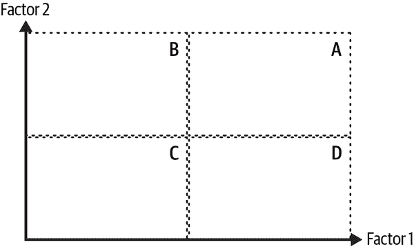
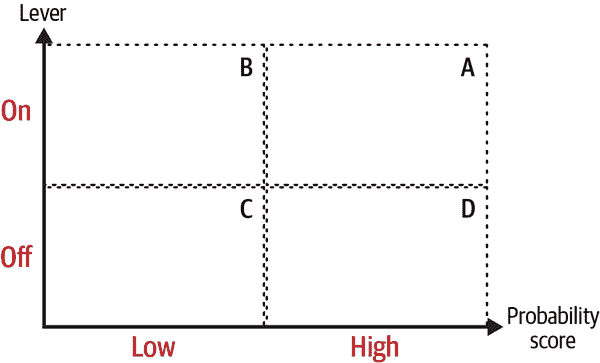
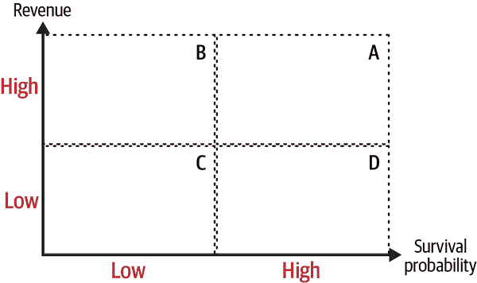
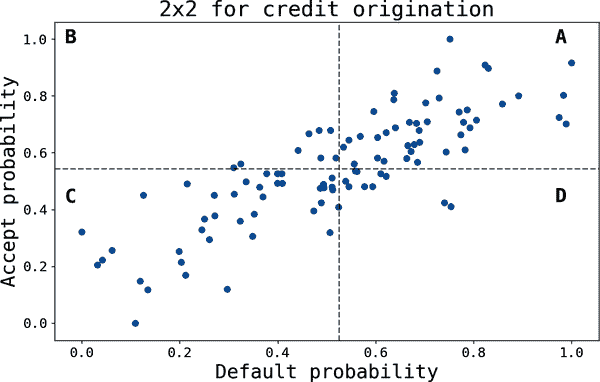
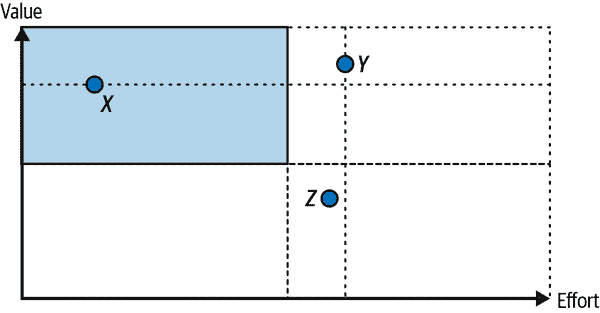

# 第四章：2×2 设计

几年前，当我刚开始我的数据科学职业生涯时，一家咨询公司来到办公室，开始勾勒我们业务的这些极度简化的视图。我当时的第一反应是把这些草图当作他们推销的把戏。今天，我接受它们作为沟通和讲故事的工具，以及简化复杂业务的有用辅助工具。

我相信在数据科学（DS）中的自然增长路径是从过度复杂到*智能*简化。所谓*智能*，我指的是爱因斯坦在说“应该尽可能地简单，但不要过于简单”时所表达的内容。这句话的美妙之处在于它显示了实现这一目标的难度。在本章中，我将提出使用一种旨在简化复杂世界的工具的理由。

# 简化的理由

你可能会觉得讽刺的是，在大数据、计算能力和复杂预测算法时代，我提出了简化的理由。这些工具使你能够处理日益增长的数据量，因此无疑提高了数据科学家的生产力，但它们并没有真正简化世界或业务。

让我们停顿一下这个最后的想法：*如果*更多数据意味着更多复杂性，那么数据科学家现在肯定能够理解更多复杂性。然而，你能够将高维数据投影到低维分数上，并不意味着你对事物如何运作有更好的理解。

有许多情况可以证明简化的必要性，从审美到更功能和实用的层面。对于数据科学家来说，简化有助于他们在开始项目时理解和框架化最重要的内容。此外，它是一个很好的沟通工具。正如理查德·费曼所说，“如果你不能用简单的语言解释某事，那么你就不理解它。”在技术方面，很常见应用奥卡姆剃刀原理来选择具有给定预测性能的最简单模型。

# 什么是 2×2 设计？

图 4-1 展示了一个典型的*设计*。正如这个词所示，你在决定集中注意力的特征时起着积极作用，这些特征当然因用例而异。

###### 图 4-1。一个典型的 2×2 设计

请注意，我通过只集中关注我认为对手头任务重要的两个因子或特征来简化世界。因子 1 和因子 2 在水平和垂直轴上变化。此外，我通过设置一些由虚线表示的阈值水平来离散化可能连续的世界，将世界划分为四个象限：

A

高因子 1 和因子 2 的用户

B

低因子 1 和高因子 2 的用户

C

低因子 1 和因子 2 的用户

D

高因子 1 和低因子 2 的用户

根据使用情况，我可以调整这些阈值。

在实验设计中，这些因素通常对应于测试中的不同处理，例如横幅中使用的颜色和消息，或价格和通信频率。第一个例子涉及离散因素，后者涉及连续特征。不用说，使用离散因素时，您会失去图表中显式顺序的意义。

理想情况下，其他相关因素应*保持不变*。这一更一般的科学原则使您能够单独研究这两个因素对感兴趣的指标的影响。在第十章中，我将回到这种推理线路，但现在请注意，这种*分部*对于简化世界至关重要：一次只改变一个因素，其他一切保持不变，您可以获得*一些*对每个因素作用的洞见。

在统计 2×2 设计中，这种分部由使用适当的随机化方案来保证，该方案使得每个处理和对照组的参与者在平均上*事前相等*。这种略显晦涩的表达意味着在测试之前，治疗组和对照组的差异不会太大。

统计从业者熟知这些设计，并且通常在学习方差分析（ANOVA）时讨论此主题。这里的目标是查看结果指标在组之间的平均差异。处理通常是离散的，但设计通过方便地设定阈值允许连续处理。

这种设置也可用于非实验场景。咨询公司常用的典型示例是仅使用可能是行为的两个特征来分割客户群体。当我可以将一个指标分解为乘法方式（如在第二章中看到的<math alttext="p times q"><mrow><mi>p</mi> <mo>×</mo> <mi>q</mi></mrow></math>分解）时，我通常会使用它。

例如，考虑单位价格和交易性。象限 A 代表愿意支付高单位价格并且频繁交易的客户（产生高用户平均收入）。请注意，这里我无法保证*其他一切保持不变*，就像实验设置中那样。尽管如此，它仍然允许我专注于，只关注我关心的两个特征。

现在我将展示一些例子。

# 例如：测试一个模型和一个新特征。

当我想同时测试新模型和杠杆效果的典型情况下，我使用 2×2 框架。测试杠杆通常不使用*此框架*，只需两个随机组：一个接收基准（对照组），另一个得到新杠杆（治疗组）。实验结束后，我对均值差异运行典型的统计检验套件。 2×2 设计扩展了这个想法，允许您同时测试模型的性能。

图 4-2 展示了 2×2 设计。在水平轴上是概率分数（例如，来自分类模型），垂直轴显示你是否已经打开或关闭考虑测试的杠杆：杠杆 *on* 意味着你向某些用户展示新的替代方案，而 *off* 意味着基准杠杆仍然有效。

###### 图 4-2。2×2 模型和杠杆测试

注意这里如何使用 2×2 设计：你将那些在图表中 A 和 B 组的用户视为测试对象，而对照组由 C 和 D 组成。在两个维度的变化中，可以对杠杆和模型进行一些测试。

要真正感受设计带来的好处，想象一下你想要进行一个交叉销售活动。为此，你训练了一个 ML 分类模型，该模型预测谁会接受提议。如果模型具有预测性，高概率分数应该具有较高的真正阳性率。

想要通过一个新的沟通活动来测试它，该活动突显购买新产品的好处（“使用智能手表上新心率监测功能的客户，其跑步表现提高了 15%”）。假设基准活动仅提供新功能的信息（“我们的新智能手表包含专为跑步者设计的最先进监测功能”）。成功的度量标准是转化率（CR），即 <math alttext="Purchases slash Users in the campaign"><mrow><mtext>Purchases</mtext> <mo>/</mo> <mtext>Users</mtext> <mtext>in</mtext> <mtext>the</mtext> <mtext>campaign</mtext></mrow></math>。

要测试的假设如下：

单调性

更高的概率分数具有更高的转化率：<math alttext="upper C upper R left-parenthesis upper A right-parenthesis greater-than upper C upper R left-parenthesis upper B right-parenthesis"><mrow><mi>C</mi> <mi>R</mi> <mo>(</mo> <mi>A</mi> <mo>)</mo> <mo>></mo> <mi>C</mi> <mi>R</mi> <mo>(</mo> <mi>B</mi> <mo>)</mo></mrow></math> 和 <math alttext="upper C upper R left-parenthesis upper D right-parenthesis greater-than upper C upper R left-parenthesis upper C right-parenthesis"><mrow><mi>C</mi> <mi>R</mi> <mo>(</mo> <mi>D</mi> <mo>)</mo> <mo>></mo> <mi>C</mi> <mi>R</mi> <mo>(</mo> <mi>C</mi> <mo>)</mo></mrow></math>

效果

新沟通杠杆比基准更有效： <math alttext="upper C upper R left-parenthesis upper B right-parenthesis equals upper C upper R left-parenthesis upper C right-parenthesis"><mrow><mi>C</mi> <mi>R</mi> <mo>(</mo> <mi>B</mi> <mo>)</mo> <mo>=</mo> <mi>C</mi> <mi>R</mi> <mo>(</mo> <mi>C</mi> <mo>)</mo></mrow></math> 和 <math alttext="upper C upper R left-parenthesis upper A right-parenthesis greater-than upper C upper R left-parenthesis upper D right-parenthesis"><mrow><mi>C</mi> <mi>R</mi> <mo>(</mo> <mi>A</mi> <mo>)</mo> <mo>></mo> <mi>C</mi> <mi>R</mi> <mo>(</mo> <mi>D</mi> <mo>)</mo></mrow></math>

我期待 <math alttext="upper C upper R left-parenthesis upper D right-parenthesis greater-than upper C upper R left-parenthesis upper C right-parenthesis"><mrow><mi>C</mi> <mi>R</mi> <mo>(</mo> <mi>D</mi> <mo>)</mo> <mo>></mo> <mi>C</mi> <mi>R</mi> <mo>(</mo> <mi>C</mi> <mo>)</mo></mrow></math> 是因为一些用户有机会购买产品，而不需要显示沟通。如果模型具有预测性（在真正的阳性意义上），那么转化率也应该随得分增加而增加。

类似地，我预计 <math alttext="upper C upper R left-parenthesis upper B right-parenthesis equals upper C upper R left-parenthesis upper C right-parenthesis"><mrow><mi>C</mi> <mi>R</mi> <mo>(</mo> <mi>B</mi> <mo>)</mo> <mo>=</mo> <mi>C</mi> <mi>R</mi> <mo>(</mo> <mi>C</mi> <mo>)</mo></mrow></math>，因为我在针对模型中购买可能性较低的用户。的确，出色的沟通活动可能会转化一些这些意图低的用户，但我不认为沟通杠杆的影响会在统计上显著。

要设置实验，您必须考虑统计大小和功效，其中样本量和最小可检测效应至关重要。通常情况下，您的样本量不够大，因此一个选择是为杠杆设计一个良好的实验设计（如经典的 A/B 测试框架），以及一个对模型而言次优的设计。在这种情况下，您可能只有模型性能的一些初步证据。在大多数情况下，我发现这已经足够了，但如果可以两者都有一个良好的设计，那就请尽量这样做。实验运行后，您可以测试这些假设，并获得一些关于模型在实际情况下表现和杠杆影响的证据。

# 例如：理解用户行为

我开始讨论 2×2 *统计* 设计，因为随机化的力量，你可以控制其他可能影响感兴趣指标的因素。其他 2×2 框架的使用情况通常缺乏这个非常好的特性。尽管如此，正如我希望这个例子展示的那样，它仍然可能是有用的。

不久前，我决定建立一个 2×2 框架来了解特定产品的产品市场适配度。为此，我选择了两个对适配至关重要的因素，并专注于象限 A，以区分那些在两个因素上表现出色的用户。然后，我建立了一个机器学习分类模型，其中象限 A 中的用户标记为一，其他所有用户标记为零。目标是*理解*这些用户是谁。在 第十三章 中，我将展示如何在实践中实现这一点，而不使用 2×2 框架。

在那个特定的用例中，我使用了客户参与度和单位价格。A 组由高度参与并愿意支付高票价的用户组成。参与度通常是产品市场适配性的良好代理，因此将其与收入的代理结合使用给了我可能被称为*盈利适配*的东西。

让我举一个应用相同逻辑的例子。回想一下，*客户生命周期价值*（LTV）是用户与公司终身关系的现值：

<math alttext="LTV equals sigma-summation Underscript t Endscripts StartFraction r Subscript t Baseline times s Subscript t Baseline Over left-parenthesis 1 plus d right-parenthesis Superscript t Baseline EndFraction" display="block"><mrow><mtext>LTV</mtext> <mo>=</mo> <munder><mo>∑</mo> <mi>t</mi></munder> <mfrac><mrow><msub><mi>r</mi> <mi>t</mi></msub> <mo>×</mo><msub><mi>s</mi> <mi>t</mi></msub></mrow> <msup><mrow><mo>(</mo><mn>1</mn><mo>+</mo><mi>d</mi><mo>)</mo></mrow> <mi>t</mi></msup></mfrac></mrow></math>

这里，<math alttext="r Subscript t"><msub><mi>r</mi> <mi>t</mi></msub></math> 是时间 t 的收入，<math alttext="s Subscript t"><msub><mi>s</mi> <mi>t</mi></msub></math> 是从 *t–1* 到 *t* 存活的概率，<math alttext="d"><mi>d</mi></math> 是折现率。有时，您可以使用考虑了某种形式成本的利润指标而不是收入，但在许多公司，特别是初创公司中，通常使用收入指标来计算 LTV 与客户获取成本（CAC）的比率（¹）。

正如您所见，LTV 可以表示为（折现的）收入和存活概率流的内积。假设您想了解哪些用户具有较高的 LTV。他们是谁？是什么让他们如此特别？最重要的是，是否有办法将一些用户移动到最高的 LTV 桶中？

图 4-3 显示了已经熟悉的设置。在水平轴上，我有一个代表存活概率的代理，垂直轴上是收入。由于 LTV 是不同时间段流的内积，您需要找到使这两者变成一维的方法。有几种方法可以做到这一点，但每种方法都有其自身的问题。

###### 图 4-3\. 2×2 框架中的 LTV

现在先不要考虑这些细节，您可以像我在前面的例子中那样继续进行：

1.  将 A 组中的用户标记为 1，其余人标记为 0，并训练一个预测成为 A 象限用户的分类模型。

1.  打开黑箱并尝试了解那些可能高概率处于 A 象限中的用户的一些信息（使用在第十三章中提出的方法）。

1.  对完整用户群进行评分，并使用某个阈值分数，您可以计算产品的机会规模。

从时间流到两个维度至少有两种方法：

聚合。

最简单的方法是使用平均或中位数存活率和收入的聚合统计数据。请注意，使用总和进行聚合可能会使收入较少的新群体处于不利地位（例如，一个交易了 20 个月的用户可以产生比新用户多 20 倍的收入）。

选择任意时期。

如果您发现过去的前六个月对于生存（或收入）至关重要，您可以简单地设置并在那个时间点使用相应的值。

# 例如：信用起源和接受

一个略有不同的例子是相关结果的情况。以信用产品（如信用卡）为例。这些产品有些问题，因为由于*逆向选择*（更风险的用户更有可能接受昂贵的贷款提供），因此有些问题。

图 4-4 显示了一个比较典型的情景。逆向选择导致正相关，因此更有可能接受贷款提议的用户也更有可能违约（A）。

2×2 设计简化了决策过程：你应该针对哪些客户？

提供在 B 象限中。

这些客户更有可能接受贷款并偿还贷款。这是最安全的选择。

调整门槛以获得更多的量。

你还可以调整违约的低风险或高风险的门槛定义。如果规模至关重要，这可能帮助你找到更多的量。信用发起人通常会根据他们的风险偏好进行这种类型的校准。2×2 设计让你专注于一个杠杆（风险门槛）。

###### 图 4-4\. 2×2 贷款起源示例

# 示例：优化你的工作流程

顾问经常使用的最后一个例子应该帮助你优先考虑项目。在这里，使用的两个维度是项目对公司的价值以及完成它所需的努力。

这个想法是，你应该根据这两个维度对竞争项目进行排序。在图 4-5 中，你可以看到，项目 *x* 和 *y* 在价值上几乎一样好，但由于完成所需的时间要短得多，因此更倾向于选择 *x*。类似地，排名活动 *y* 和 *z* 相对容易，因为两者需要的努力相当，但前者创造的价值显著更多。总的来说，左上象限是你希望大部分项目存在的地方。

尽管这种 2×2 视图可能非常丰富，但它也有其局限性。例如，你如何比较项目 *x* 和 *z*？在第五章中，我介绍了一种更普遍的替代方案，可以用来比较和排名任何一组项目。

###### 图 4-5\. 努力的优先级

# 关键要点

这些是本章的关键要点：

简化的案例

尽管你掌握的数据量有多少，但如果目标是改善对复杂世界和业务的理解，简化世界是必要的。此外，它有助于将技术结果传达给利益相关者，并允许你专注于显然是一级重要性的事务。

2×2 图表

这些工具将高维空间简化为二维图，允许你专注于对手头问题最相关的特征或因素。

应用案例 1：测试一个模型和一个杠杆

2×2 统计设计是一个常见的用例。例如，当您希望同时测试杠杆的有效性和 ML 模型的预测性能时，就是这样一个例子。您可以获得可以通过正式统计测试过程的明确假设。随机化保证其他所有事情平均保持不变。

用例 2：了解您的客户

通过挑选出两个具体特征，您可以将这个框架作为更复杂方法的起点。本章描述了如何使用这个框架来理解哪些用户具有较高的 LTV。

用例 3：相关特征

当特征相关时，2×2 框架允许您简化决策过程。我使用的例子是贷款发放，在这里，接受报价取决于违约概率，因为由于逆向选择的原因。

# 进一步阅读

在我的书 *Analytical Skills for AI and Data Science* 中，我认为学习简化是数据科学家的一项重要技能。讨论比本章更加一般化，并且我没有涵盖 2×2 设计。我还讨论了 LTV 和 A/B 测试的设计。

*简易法则* 由约翰·梅达（MIT 出版社）从设计师的角度探讨了如何实现简单。虽然听起来可能不相关，但我发现这种有些正交的观点总是加深了我对问题的理解。

2×2 统计设计可以在大多数涵盖 ANOVA 的统计教材中找到。*Statistical Methods in Online A/B Testing: Statistics for Data-Driven Business Decisions and Risk Management in E-Commerce* 由 Georgi Zdravkov Georgiev（独立出版）对使用多个变体进行测试及其他相关主题进行了良好的讨论。

在贷款发放示例中使用的逆向选择类型在任何讨论信息不对称的微观经济学教科书中都有涵盖。如果您没有经济背景，则技术上的细枝末节可能会有些超前。在我看来，记住的重要部分是用户通过决策者不知道的关于自己的信息进行自我选择，这造成了很多问题。

¹ 一些公司还报告“未打折”的 LTV，因此这个表达式简化为分子上的各项。
