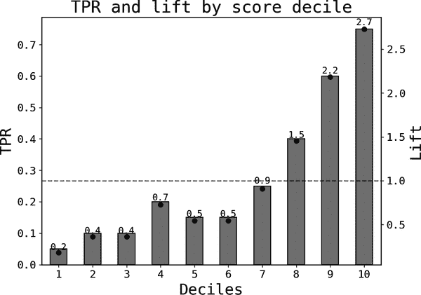

# 第六章：提升是什么？

有一些非常简单的技术可以帮助您完成许多不同的任务。提升是其中之一。不幸的是，许多数据科学家不理解提升或者没有看到它们的用处。本章将帮助您掌握它们。

# 提升定义

一般来说，*提升*是一个组的聚合指标与另一个组的比率。最常见的聚合方法是取平均值，因为这些是期望值的自然样本估计。本章中会给出一些例子。

<math alttext="Lift left-parenthesis metric comma upper A comma upper B right-parenthesis equals StartFraction Metric aggregate for group upper A Over Metric aggregate for group upper B EndFraction" display="block"><mrow><mtext>Lift</mtext> <mrow><mo>(</mo> <mtext>metric</mtext> <mo>,</mo> <mi>A</mi> <mo>,</mo> <mi>B</mi> <mo>)</mo></mrow> <mo>=</mo> <mfrac><mrow><mtext>Metric</mtext><mtext>aggregate</mtext><mtext>for</mtext><mtext>group</mtext><mi>A</mi></mrow> <mrow><mtext>Metric</mtext><mtext>aggregate</mtext><mtext>for</mtext><mtext>group</mtext><mi>B</mi></mrow></mfrac></mrow></math>

在更经典的数据挖掘文献中，*聚合*是频率或概率，而组*A*是组*B*的子集，通常是研究对象的总体。这里的目标是衡量选择算法（例如聚类或分类器）相对于人口平均水平的性能。

考虑将女性作为美国 CEO 的提升。在随机选择的基线下，女性 CEO 大约应占 50%。一项[研究](https://oreil.ly/27yD1)估计这一数字为 32%。当前工作市场选择机制的提升为*0.32/0.5 = 0.64*，因此相对于基线人口频率，女性*被低估*。

如其名，提升测量一个组的聚合相对于基线的增加或减少。比一大或小的比率被称为*提升*或*下降*。如果没有提升，则比率为一。

# 例子：分类器模型

假设您训练一个分类器来预测客户流失。您有一个数据集，其中流失用户标记为 1，仍然活跃用户标记为 0。基线流失率通过取结果的样本平均值获得。

跟踪测试样本中分数十分位的真正正率是一种常见的性能指标，例如在本例中是十分位的流失率。要计算它，您只需按分数对用户进行排序，并将测试样本分成 10 个大小相等的桶或十分位。对于每个桶，计算流失率。

这个指标很有用，因为它至少涉及三个重要方面：

提升

将每十分位的流失率除以测试样本中的流失率，计算相应的提升。这是模型相对于公司流失率识别流失者能力的估计。

单调性

分数是否具有信息性？如果概率分数具有信息性，从真正的积极意义上讲，较高的分数应该有较高的流失率。

最高十分位性能

在许多应用中，您只需要针对最高十分位的用户。在这个例子中，您可能只想给那些最有可能流失的用户提供留存激励。该十分位的真正正率是您对留存活动预期结果的第一估计。

图 6-1 展示了模拟示例中的*真正正类率*（TPRs）和 lift。分类器在前 10 分位标识流失者的速率是平均速率的 2.7 倍。如果你希望说服利益相关者使用模型输出，这是一个好发现。你还可以将此 lift 与通过他们当前的选择机制获得的 lift 进行基准比较。

###### 图 6-1\. 流失模型示例中的 TPR 和 lift

# 自我选择和生存偏差

*自我选择*是指个体*选择*加入某个群体。例如，可以是有正式入会程序的群体（如政党或团队），也可以是无正式入会程序的群体（例如产品购买者、功能使用者等）。重要的是，存在某种内在特征驱使个体成为成员。

*生存偏差*是自我选择的一种反向类型：某些用户因其某些特征而最终进入你的样本（“生存”）。统计学家亚伯拉罕·沃尔德分析的经典[案例](https://oreil.ly/0Y9oW)是二战战斗机。这个教训是，由于抽样过程的偏倚性质，你可能因此得出不正确的结论。

第十五章讨论了对数据科学家来说自我选择偏差的相关性；目前，展示 lift 如何帮助你快速识别此偏差已足够。

表 6-1 展示了典型的呈现方式：行包含你认为重要理解选择问题的某些特征或特性；列突出了群体成员以及 lift。这里我只包括了一个客户的四个变量：

+   公司产品的月度支出

+   满意度分数

+   月收入

+   任期

表 6-1\. 流失示例中的 lift

|  | 活跃 | 流失 | Lift |
| --- | --- | --- | --- |
| 月度支出 | 29.9 | 32.7 | 1.1 |
| 客户满意度分数 | 10.00 | 10.08 | 1.01 |
| 收入（千美元） | 46.52 | 54.80 | 1.18 |
| 任期（月） | 9.84 | 8.14 | 0.83 |

通常情况下，拥有的功能越多，你对选择机制的理解就越深刻。例如，为什么不包括地理或行业分段，或者客户已从公司购买的产品数量？

表中的每个单元格显示了活跃用户和流失用户对应特征的平均值，以及提升值。例如，活跃用户和流失用户的平均支出分别为$29.9 和$32.7。看看提升列，很容易识别出一个模式：流失用户有更高的收入（提升为 1.18，即增加 18%）、更多消费（1.1），并且是客户时间较短（0.83）。客户满意度得分不重要（提升微不足道）。这些发现的一个可能解释是相对较富裕的客户对产品有更高的期望；这似乎是一个面向较低社会经济地位细分市场的产品。

无论如何，您已经明白了：理解选择机制的一个快速且不太精确的方法是构建提升表。如果特征选择正确，您可以立即了解到潜在组的情况。

# 提升的其他用例

这项技术非常简单易用：确定一个指标和分组，然后计算比率。选择机制可以是您认为相关的任何内容。

例如，您可以使用第四章中呈现的 2×2 图表，并关注一个象限。提升非常简单易用，并可能帮助您理解驱动该组用户的因素。

另一个常见的用例是在分析营销活动中的自我选择时。在没有选择偏见的情况下，您可以使用对照组来衡量活动的影响。提升会非常快速地告诉您是否可以这样继续。

同样，由于不同组的响应率差异，许多调查最终会得出有偏见的结果。过去，我曾使用提升自动化地检查客户满意度调查的代表性。

# 关键要点

这些是本章的关键要点：

定义提升

提升是一个组的一个聚合指标与另一个组的比率。平均数是最常见的聚合方法之一。

机器学习中的提升

你可以通过展示模型相对于整体样本的预测性能来计算分类器模型的提升。我展示了一个流失预测的例子，并计算了真正阳性率在分数十分位上的提升。

自我选择

更广泛地说，提升可以应用于理解样本中自我选择或生存偏差的程度。通过计算那些自我选择进入某一组的用户中的指标提升，您可以轻松了解选择驱动因素。

# 进一步阅读

提升在许多经典数据挖掘书籍中都有涉及；例如，Ian Witten 等人的《数据挖掘：实用机器学习工具和技术》（Morgan Kaufmann）。

更多参考资料可以在学术文章和博客圈中找到。例如，Andy Goldschmidt 在[KDnuggets](https://oreil.ly/KfBaL)上的“提升分析——数据科学家的秘密武器”和 Miha Vuk 和 Tomaz Curk 在《方法论评论》第 3 卷第 1 期（2006 年：89–108）上的“ROC 曲线、提升图和校准图”。
