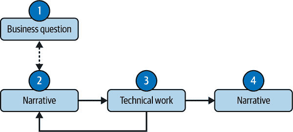
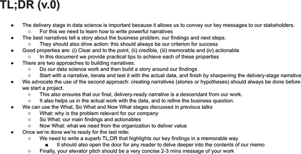
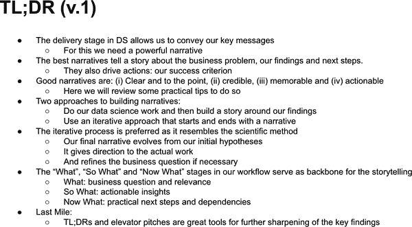
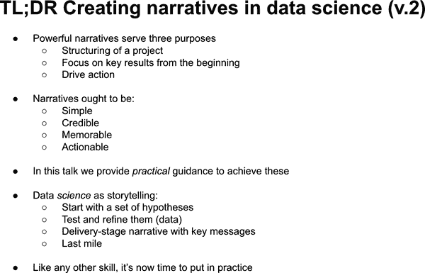

# 第七章：叙述

你花了几周时间在你的项目上工作，现在准备展示结果了。感觉几乎完成了，*只需*交付输出。

很多数据科学家都是这么想的，并且几乎不费力地去构建引人入胜的叙述。正如在第一章所述，为了拥有端到端的所有权，说服你的利益相关者采取行动对于取得成功至关重要。这种极端的拥有权利至关重要以创造价值；因此，你必须掌握讲故事的艺术。

关于学习讲故事的资源有很多（我会在本章末尾建议一些）。本章在这些知识的基础上进行了扩展，但我稍微偏离一下，以突显一些特定于数据科学的技能。

# 叙述的要素：如何用你的数据来讲述一个故事

使用标准的词典定义，一个*narrative*只是一系列相连的事件。这些连接构成了一个故事。我将丰富这个定义，说它还应该实现一个目标。

你想要达到的目标是什么？在一般的叙述中，它可能是说服或者引起兴趣。当然，这些也适用于数据科学（DS），但更重要的是，你希望创造价值，为此你需要*推动行动*。一个成功的故事应该帮助你实现这个目标。

让我们反向工程这个问题，识别有助于我们实现这一目标的条件：

+   -   清晰而简明扼要

+   可信任

+   -   记忆深刻

+   可操作的

## 清晰而简明扼要

清晰度是一个相对的概念，随着背景的不同而变化，并且在很大程度上取决于你的观众。你的机器学习（ML）实现的技术细节可能对你的数据科学团队非常清晰，但通常对你的业务利益相关者来说却晦涩难懂。识别你的观众是构建清晰叙述的第一个关键步骤。因此，选择适合不同观众的正确语言和语调至关重要。

DS 本质上是一个技术性的主题。因此，数据科学家经常会诱惑自己在演示中包含花哨的技术术语（如果还有伴随的方程更好）。但是，讲述一个故事不是关于你自己。如果你想包含技术材料，最好将所有技术内容放在技术附录部分。

一个常见的错误是认为技术术语会给你带来信任度（稍后详述）。有时这种情况表现为试图证明数据科学工具包对组织的必要性。我的建议是在实现你的目标的有效沟通与此愿望之间保持平衡。创造强大叙述关乎于后者。

在常规数据科学开发过程中，运行许多测试并创建多个可视化是非常正常的。当试图证明他们投入了大量工作时，一些人往往会诱惑性地在演示中包含他们能够的一切，从而分散并压倒观众的注意力。只专注于关键信息，并包含强化这些信息的结果。其他所有内容都应该被剔除。如果某些内容并不直接有助于你的传递，但可能仍然有用，将其放在附录中。但是尽量不要让附录杂乱无章；这部分也有特定的目的（如果没有，就抛弃它）。

达到适当的简洁程度需要大量的实践和努力；这本身就是一门技能。一个好的技巧是开始写下你认为是关键信息，然后从演示中开始剔除其他所有内容。迭代直至收敛：当你剔除了太多内容以至于信息不再清晰时停止。

这个建议也适用于句子和段落。尽可能使用少于 10 个单词的短句。长句和段落在视觉上很累人，因此可以假设它们不会被阅读。一旦我有了初稿，我会逐个检查每个句子和段落，并使它们尽可能简短和明确。

清晰度应该是通道独立的。很多时候，你为了现场演示做准备，却没有意识到部分观众——可能是高层管理人员——会在其他时间点*阅读*它。因此，你必须让它自解释。

这不仅适用于文本，还适用于数据可视化。确保标记所有相关轴并写下有意义的标题。如果在特定图中有想要突出的内容，你可以包括视觉辅助工具——如高亮、文本或方框——来帮助引导观众的注意力。

数据可视化是数据科学叙事交付的固有部分。这些原则适用于你准备的任何图表。在第八章中，我将介绍一些数据可视化的良好实践。

## 可信度

在商业环境中，引人入胜的叙述必须是可信的。不幸的是，这是一个非常微妙的特性：它需要时间去获得，但失去起来却异常容易。在数据展示中，有三个你应该关注的维度：

+   数据可信度

+   技术可信度

+   商业可信度

数据质量是第一维度的核心，你应该养成在数据源和开发周期中包含检查的习惯。数据科学家编写大量代码，这是一个容易出错的活动。最糟糕的情况是当你的代码实际运行时，但结果可能并不正确（逻辑错误）。依我之见，这种情况*经常发生*。最好的程序员已经将测试作为他们日常工作流程的固有部分。

此外，数据无法脱离其背景，因此您的结果必须从业务角度上讲得通。我见过很多数据科学家失去信任，因为他们没有检查他们的结果是否合理。至少，您应该了解您正在处理的关键指标的数量级。最好能够熟记这些指标。在呈现结果之前，不要忘记始终质疑自己的结果。

技术信誉通常是由利益相关者授予的。但是，伟大的力量伴随着伟大的责任。数据科学家需要学会为每个问题选择合适的工具，并掌握相关技术。拥有一个内部研讨会系列是一种良好的做法，您可以在其中受到同行的挑战。

如 第一章 描述的那样，向您的观众展示业务专业知识至关重要。您的技术交付可能是无懈可击的，但如果从业务角度来看事情没有意义，您将失去与利益相关者的信任。我见过许多数据科学家从错误的假设出发，以为产品或业务的运作方式是不正确的。另一个常见的错误是对客户行为做出不可思议的假设；永远问问自己，如果*你是顾客*，你会这样还是那样。

## 记忆深刻

在普通叙述中，通常通过注入某种形式的挣扎或悬念来实现，从而使叙述不那么线性。我从中吸取教训，这些通常不是数据科学叙述的好策略。

在数据科学中，记忆力通常通过一个*啊哈！时刻*来创造。这些时刻通常在您展示能创造价值的意外结果时出现。这最后一部分很重要：在商业环境中，只有智力好奇是短期记忆的。最好的啊哈！时刻是那些推动行动的时刻。

许多作者建议通过正确组合数据和情感来创建难忘的叙述，并确实有证据表明，人类大脑更容易记住触动情感的内容，而不是单纯的科学证据。我同意这个总体观点，但我认为不应该追求 TED 类型的叙述和表达方式。相反，您应该保持简单，并找到本身就非常值得记忆的可行的洞见。

###### 小贴士

通过行动性且略显意外的洞见形式，啊哈！时刻是实现记忆深刻的最佳途径。

## 行动性

如果您已经阅读了前几章，那么您应该不会感到惊讶，我认为这应该是您的北极星和您故事中的主角。

在开始叙述之前，请确保您的项目有可行的洞见。如果没有，请重新开始。我见过一些演示文稿展示了一些有趣的内容，但观众却左思右想*那又怎样*？

###### 小贴士

确定从您的分析中产生的杠杆作用。没有可行的见解的演示文稿无法有效地创造价值。

# 构建叙述

前一节介绍了一些创建成功叙事必需的特性，以及一些能帮助你确保这些特性在实践中得到满足的建议。现在我将介绍创建叙事的过程。

## 科学即叙事

许多数据科学家认为叙事是独立的事物，甚至与他们的技术专长正交，只在交付阶段才会进行。我认为数据科学家应该成为“科学家”，将其作为端到端工作流的内在部分。

有了这个想法，让我建议两种替代的建立叙事的过程：

+   首先，进行技术工作，然后创建叙事。

+   从一个初始叙事开始，发展它，进行迭代，当你准备好时，为交付做精炼的叙事。

第一个过程在数据科学中最常见：从业者首先进行艰苦的技术工作，然后为他们的结果“编造一个叙事”。通常情况下，这最终变成了一堆可能有趣或相关但缺乏故事性的发现。

相反，第二个过程使叙事成为数据科学工作流的一个组成部分（Figure 7-1）。在这种情况下，你从一个业务问题开始，努力理解问题并提出一些故事或假设，用数据验证它们，在一些迭代之后，最终准备好交付结果。这个过程甚至可能迫使你回过头重新定义业务问题。

###### 图 7-1. 迭代叙事

叙事出现在开始阶段（阶段 2），在你迭代和完善假设的过程中（阶段 3），以及最后（阶段 4）。这些叙事并不完全相同，但肯定是相互关联的。

你以及你对理解的需求是初始叙事的观众；你的业务利益相关者是最终叙事的观众。如前所述，语言和语调是不同的。但重要的是，最终的关键信息是前面信息的直接衍生物，经过中间迭代过程的精化。

你应该在项目开始时带着一组最初的关键信息候选人，你认为最终会传达的。这些可能不完全正确，但通常情况下——如果你有足够的业务专业知识——它们离最终结果并不太远。采用这种方法，为你的演示创建叙事的过程在甚至进入数据之前就开始了。它将指导你在这个阶段，并帮助你进行迭代。由于这个中间阶段，你能够捕捉错误并找到错误（数据质量、逻辑、编码甚至你对业务理解的理解）；这通常是 Aha！时刻产生的地方。交付阶段的叙事切换了受众，并传达了最终和精炼的信息。

## 什么，为什么，以及现在怎么办？

一旦达到交付阶段，你需要为你的叙述加上一些结构。有些人喜欢遵循标准的叙事方法，也被称为*叙事弧*，它包括三个阶段：设定、挣扎和解决。

尽管对一些人可能有效，但我更喜欢一种不同的顺序，这种顺序强调你驱动行动的关键目标：什么，因此什么，现在什么？毫不奇怪，这与第一章中描述的过程密切相关。

### 什么？

这一节是关于描述业务问题及其在当前时点对公司的重要性。它还应包括一些关于背景的定量信息，比如主要 KPI 的最近演变和机会的大小。

想象一下，你正在试图量化给予价格折扣的影响。在这一节中，你可以提供一些背景信息，比如最近价格变动的频率、范围或分布，以及对销售、保留或收入的一些高层次影响。如果有一些证据，即使是偶然的，你也可以突出其在当前竞争环境中的战略重要性。

### 那么呢？

这一节的关键在于专注于可操作性。主要的结果会在这里呈现，包括那些能引发“啊哈！”时刻的结果。

一般来说，“啊哈！”时刻有两种味道：

+   意外的结果

+   在某种程度上，结果是预期的（就方向而言），但是却有意外的转折，可以来自量化或可操作性。

我更喜欢第二种类型，因为你应该有一个行动的偏好。如果你有意外的结果*和*一个行动计划，那就完成了。

回到定价的例子，降低价格通常会提升销售。这是预期的行为，所以显示负相关性不会产生“啊哈！”时刻，观众可能会觉得你在重复发明轮子。

但是，如果你说用户对于高于 5.30 美元的价格相对不敏感，但是在这个价格以下，每降低 1.00 美元的折扣就能提高 1000 个单位的销量，你就吸引了他们的注意。信息类似，但是有一个来自量化的意外成分。此外，这是一个行动呼吁，需要成为最后一节的核心内容。

### 现在呢？

这一节是关于下一步的内容。你需要公司其他部门做什么来实现这个价值？谁需要参与？在这里，我喜欢提出具体的下一步建议。我见过数据科学家在这方面有所保留，因为他们通常不是实际的决策者。

对于定价的例子，你很可能依赖营销团队来设计和传达实际的折扣策略。财务部门可能还需要批准该计划。任何其他受影响的团队也应该被纳入考虑。

# 最后一英里

在她的书《软技能的残酷真相》（哈珀商业出版社）中，佩吉·克劳斯建议，长期成功 75%取决于软技能，其余取决于技术知识。我不确定这是否正确，但从方向上来说，我非常同意：数据科学家投入大量时间和精力来实现技术卓越，但他们的职业生涯更多依赖于那些被忽视的软技能。

在最后一英里，现在是时候从科学家转变为销售人员角色了。我从个人经验中学到，许多优秀的项目之所以失败，是因为在这个阶段缺乏准备工作。

## 编写 TL;DRs

TL;DR（太长了，没读）是一个检验你的叙述是否精炼的好工具。它们已经成为科技公司的标准，我已经养成了始终以此为开始的习惯。

许多高管不会花太多时间阅读你的工作，除非他们看到引起注意的东西。出色的 TL;DR 旨在实现这一目标。

## 编写记忆深刻的 TL;DR 的技巧

有些人喜欢在写下实际文档之前先草拟一个 TL;DR 的初稿。这是确保 TL;DR 与你的叙述一致，并确保内容与之对齐的好方法。完成后，他们会回过头来对 TL;DR 进行反复推敲。

我更喜欢的方法是先写下叙述（有些人用笔和纸真正画出了一个草图），然后处理内容，然后才回过头来写 TL;DR。对我来说，TL;DR 是你最后写的东西，我总是先勾勒出叙述。

这两种方法听起来可能相似，但 TL;DR 实际上是叙述的一个非常精炼的版本。叙述是将事件序列联系起来的故事的高层视角，而 TL;DR 是其聚焦的版本。

我倾向于按照叙述的方式构建 TL;DR：What，So What，Now What。与之前一样，What 部分为你的受众的注意力提供依据，So What 总结了主要发现和可行动性的行动点，而 Now What 则提出了建议的下一步。

###### 提示

一个好的提示是将你的文档视为新闻文章，并考虑替代标题。数据科学中的好标题必须具备我一直在谈论的这些特性：简单、可信、记忆深刻和可操作性。可信度阻止你过度推销。

最后，你 TL;DR 中的每一点都应该有一张详细展开的幻灯片。如果它足够重要进入 TL;DR，那么最好有一些相关的材料。

## 例子：为本章写一个 TL;DR

图 7-2 展示了你可能会遇到的一个典型 TL;DR。它很混乱，显然，我试图包含每一个工作的细节。它有非常长的句子，字体小到足以使其适应页面。它显然不易阅读。但它也是记忆深刻的，只不过是出于错误的原因。

###### 图 7-2\. TL;DR 版本 0

在 图 7-3 中，我应用了之前给出的一些技巧来减少混乱：简化并删减一些句子。如果我想的话，我还可以增加字体大小。我本可以做得更多，但我意识到最好的方法是回到起点，重新开始。

###### 图 7-3\. TL;DR 版本 1

图 7-4 展示了上一次迭代的结果。从零开始让我专注于关键信息。您可以看到我遵循了什么、为什么、现在怎么办的模式。在真实的数据科学 TL;DR 中，我会强调一些既有量化又可操作的关键结果。这里唯一的行动号召是练习。

###### 图 7-4\. TL;DR 版本 2

显然我正在使用项目符号风格。有很多人对这种方法持负面态度，但它和其他事物一样有其利弊。不利之处在于，它确实限制了你的创造力（想象一下你可以在一张空白纸上做的一切）。而利之处在于，它迫使你以简单、清晰和有序的方式写作。我可以快速看出我的句子是否过长（尽可能避免两行长的句子）。

正如我之前所说，我认为 TED 风格的演示在数据科学或商业环境中并不合适。尽管如此，如果你足够熟练，并且它符合公司的文化，那就大胆去做吧。但项目符号在商业环境中往往效果良好。

## 发表强有力的电梯演讲

这是我在向经理做演示时学到的一个诀窍：如果有人开始做演示，显然缺乏叙述性，那么打断他并要求他给你一个电梯演讲。很多时候，其实并没有电梯演讲。

电梯演讲应该是您在电梯里遇到 CEO 时会进行的 10 到 20 秒演示。你真的想要推销你的工作！但有个问题：你只有到达你的楼层之前的时间。那时，你失去了互动的机会。

这种情况只发生过一两次，所以我不会真的将电梯演讲看成是文字的字面意思。相反，我将其视为叙述创作工具包的一部分。好的叙述应该很容易以电梯演讲的形式进行总结。如果不能，很可能是您的故事出了问题，现在是时候迭代了。

###### 提示

下次在您的项目上工作时，试试在您认为完成之前和之后都进行电梯演讲。这是您的试金石测试。

## 呈现您的叙述

以下是交付阶段的一些好建议：

确保您有一个明确的叙述。

如果你遵循迭代方法，叙述总是存在的，你只需要自律。如果没有，请在开始制作幻灯片或备忘录之前勾勒出叙述。做完后，让别人浏览你的幻灯片，并请他们分享他们对叙述的看法。如果他们只关注每张幻灯片的关键信息，就应该能够找到叙述。如果找不到，你需要重新审视。此外，这些信息之间应该有明确而自然的过渡。

每张幻灯片应该有一个明确的信息。

如果一张幻灯片的信息与你的叙述不一致，就放弃它。

始终练习演讲。

这一点始终如此，但如果你的观众包括组织中的高级主管（你应该希望如此），这尤为重要。一个好的实践是录制自己：这不仅有助于你管理时间，还能帮助你发现可能存在的习惯和行为特征。

时间管理。

在演讲之前，你应该已经知道不被打断时需要多长时间，这样你就可以更好地规划额外时间。同时记住，你是演示的唯一所有者，因此有权（友好地）跳过让你远离关键信息的问题。

尽可能量化，但不要过度。

无需多言，数据科学是一个定量领域。然而，我经常看到数据科学家用*定性*或方向性的术语描述他们的结果。与其说“糟糕的用户体验增加了流失率”，不如在该声明中加入一些数字：“每次连接失败使得净推荐评分降低 3 个百分点。”话虽如此，不要过分夸大你的结果：如果你在估算中工作，很可能可以将结果四舍五入至最接近的整数。

# 主要观点

本章的关键要点如下：

数据科学中的有效叙述

有效的叙述是通过一个旨在推动行动的故事连接的事件序列。

优秀叙述的特性

要推动行动，叙述必须清晰而直截了当，可信，值得记忆，并且可操作。

科学如同讲故事

我建议采用迭代方法来创建叙述：从业务问题开始，创建解决问题的故事或假设，通过数据进行迭代测试和优化，并最终形成交付阶段的叙述。这最后的叙述自然地从最初的假设中演变而来。

叙事结构

你可能希望按照叙述弧线来进行：设定，斗争和解决。我发现按照简单而直接的故事情节更有效：是什么，为什么，现在怎么办。这些几乎是一一对应的，但在数据科学中，我看不出制造悬念或斗争感的价值。

简述和电梯演讲

这些都是实现适度简化和确保你确实拥有连贯叙事的好工具。TL;DR（总结摘要）可能作为高级管理人员的预告，他们只会花时间阅读材料，如果有什么令人难忘且可行的东西。

熟能生巧

投入足够的时间练习表达。如果可能，录制自己的声音。

# 进一步阅读

关于叙事和数据叙事有许多优秀的参考资料。Cole Nussbaumer Knaflic 的 *数据叙事*（Wiley）非常擅长改善你的数据可视化技巧，同时还有一个非常好的章节关于构建叙事。我在本章没有涵盖数据可视化，但对于创建故事的数据科学家来说，这是一项关键技能。第八章 讨论了其中的一些技巧。类似地，Brent Dykes 的 *有效的数据叙事：如何通过数据、叙事和视觉推动变革*（Wiley）充满了有益的见解。我发现他对数据、视觉和叙事之间相互作用的讨论非常有用。

*简而言之：在工作和其他场合更好地沟通* 一书由 Jay Sullivan（Wiley）强调了一般沟通中简单性的价值，无论是书面还是非书面的沟通。他关于写短句（少于 10 个词）的建议非常有力。

*最好的句子，最坏的句子：作家的指南，打造杀手级句子* 由 June Casagrande（Ten Speed Press）专门为作家设计，但提供了许多成为更好沟通者的建议。她强调考虑观众（“读者为王”）在构建叙事时应是北极星。

*共鸣：呈现改变受众的视觉故事* 由 Nancy Duarte（John Wiley and Sons）提供了一个从设计师角度学习讲故事艺术的绝佳资源。你还会在 Chip Heath 和 Dan Heath 的 *造成粘性的思想：为什么有些想法存活，有些想法消亡*（Random House）中找到许多本章涵盖的话题的详细信息。他们的六个原则会产生相当大的共鸣：简单性、意外性、具体性、可信度、情感和故事。

*软技能的残酷真相：职场智者希望早点学到的工作教训* 由 Peggy Klaus 提出了关注你的软技能的强烈理由。数据科学家早期专注于发展他们的技术专长，因此忽视了所谓的软技能。残酷的真相是，你的职业生涯极大地依赖于后者。

在科学方法中，David Grandy 和 Barry Bickmore 的文章 [“科学如何讲故事”](https://oreil.ly/3rn9-) 更详细地讨论了科学方法和讲故事之间的类比。
