# 第八章：Datavis：选择正确的图表传递信息

第七章介绍了在数据科学中构建和传递强大叙述的一些良好实践。数据可视化（datavis）是丰富叙述的强大工具，也是一个独立的研究领域。因此，它们需要被选择作为沟通设备。你应该始终问自己的问题是：*这个图表是否帮助我传达我想要的信息？* 如果答案是否定的，你应该重新考虑并找到*合适*的图表来传递你的信息。本章将介绍一些建议，帮助您提升可视化技能。

# 一些有用和不那么常用的数据可视化

过去几十年中，数据可视化领域已经有了很大发展。您可以找到在线参考资料、目录和分类，这些应该帮助您找到适合您问题的正确图表类型。您可以查看[Data Visualisation Catalogue](https://oreil.ly/BHQ1t)或[from Data to Viz](https://oreil.ly/m75Ww)。

不幸的是，许多从业者坚持使用默认的替代方案，如折线图和柱状图，它们经常可以互换使用。在本章中，我将回顾一些您可以使用的较少知名类型的图表，并讨论一些数据从业者常见的陷阱。这并不是详尽无遗，因此在本章末尾，我将指出一些优秀资源，这些资源将为您提供更完整的领域图景。

## 柱状图与折线图

让我们从最基本的问题开始：什么时候应该使用柱状图和折线图？一个常见的建议是对于*categorical*数据使用柱状图，对于*continuous*数据使用折线图。连续数据的最常见情况是当您拥有时间序列时，即通过时间下标索引的一系列观察（ <math alttext="y Subscript t"><msub><mi>y</mi> <mi>t</mi></msub></math> ）。让我们验证一下这个建议的有效性。

记住，图表应该帮助您传递信息。对于像客户分段中的每个用户的平均收入这样的 categorical 数据，您很可能想要突出*跨*段的差异。此外，类别没有明显的顺序：您可能希望对它们进行排序以帮助传达信息，或者您可能只是保持字母顺序。柱状图是很好的沟通工具，因为很容易看和比较柱子的高度。

对于时间序列数据，通常会突出显示数据的几个属性：

+   时间提供的顺序性排序

+   均值或平均水平

+   趋势或增长率

+   任何曲率

如果您关心以下任何信息，折线图是一个很好的选择。

图 8-1，8-2，和 8-3 展示了用于分类数据和两个时间序列（短和长）的柱状图和线图。从分类数据开始，柱状图使得跨段比较度量变得容易。另一方面，线图并不适合用于可视化跨段差异。这是因为线的连续性会给人错误的感觉，认为这些段是某种方式连接在一起的。观众需要额外的努力来理解你正在绘制的内容，这会危及你想传达的信息。

观察时间序列数据时，你可能会认为柱状图做得还行，至少在样本足够短的情况下是这样。一旦增加样本量，就会产生不必要的混乱，然后你必须对你的绘图选择产生怀疑。注意，线条可以清晰快速地告诉你一些关于趋势和水平的信息，而不需要额外的墨水。稍后我会讨论数据墨水比率时详细讨论这一点。

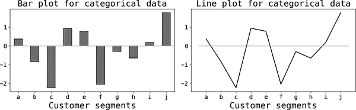

###### 图 8-1\. 客户分段的柱状图和线图

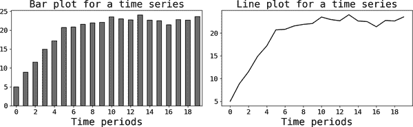

###### 图 8-2\. 时间序列的柱状图和线图

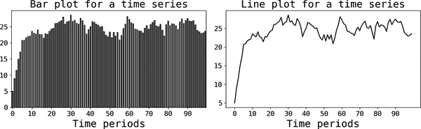

###### 图 8-3\. 长时间序列的柱状图和线图

## 斜坡图

我在阅读爱德华·图夫特的《量化信息的视觉展示》（Graphics Press）时了解了斜坡图，我花了一些时间才理解它们的用途。理解斜坡图的一种方式是，在你需要传达分类数据的趋势信息时，它们非常有用。在某种意义上，斜坡图结合了柱状图和线图的优点，因为它们允许你比较跨段的趋势。

图 8-4 展示了斜坡图的一个示例。你可以看到，线条能够轻松传达每个段的趋势，而且这种可视化方式使得跨段比较变得容易。在这个例子中，我只有五个段，所以正确标记它们很容易，但如果有更多的段，要得到一个可读的绘图可能会具有挑战性。尽管如此，还有其他工具可以帮助你，比如使用图例和不同的颜色或线条样式（如虚线、点线等）。

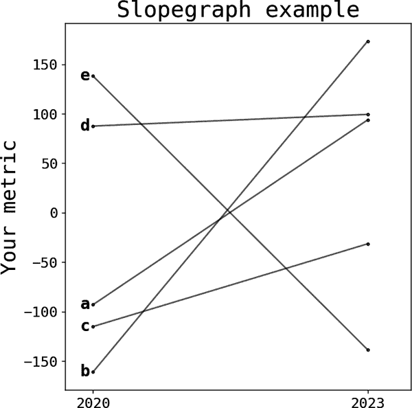

###### 图 8-4\. 用来突出趋势差异的斜坡图

## 瀑布图

瀑布图（图 8-5）经常被业务利益相关者使用，并且由麦肯锡广为流传。这里的想法是使用段或类别来*分解*指标的变化。我在 第三章 中使用瀑布图，因为它们非常擅长绘制这些分解的输出。

当其中一个段的规模显著不同时要小心，这通常发生在使用增长率时，某些类别的起始值非常小。此外，请记住，当信息传递的重点是分解时，这种类型的绘图非常有用。

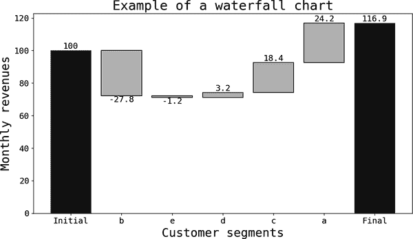

###### 图 8-5. 按客户细分的收入

## 散点图平滑器

当你想要传达两个变量*X*和*Y*之间的相关性时，散点图非常有效。不幸的是，对于大数据集来说，即使关系存在，也很难显示出来。

处理这个问题有几种替代方案。最简单的解决方案是创建一个包含数据随机样本的图表。通常情况下，这已经足够好，因为大多数时候你并不需要完整的数据集。另一种选择是使用[六边形箱线图](https://oreil.ly/sf_MH)，它通过给六边形区域上色来实现数据的降维。同样的原理也适用于[等高线图](https://oreil.ly/91Mtn)，不过这需要你进行一些预处理。

另一种解决方案是使用*散点图平滑器*，它在数据上拟合非线性平滑器。这个非线性函数足够一般化，可以帮助你找到变量间的关系。但是你必须小心。在数据可视化中一个很好的原则是尽量不改变数据的本质（或者正如 Tufte 所说的*图形完整性*），而平滑技术可能会改变观众对数据的理解。

图 8-6 展示了三个图表：第一个散点图使用了完整的 1000 万观测数据集。第二个则用原始数据的随机小样本重复了这个过程。第三个图表展示了原始数据和一个立方散点图平滑器。展示数据总是一个良好的实践：这样观众可以自行判断平滑器是否能够良好地代表关系。

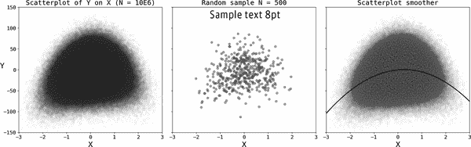

###### 图 8-6. 用二次生成过程模拟的大数据集的散点图

## 绘制数据分布图

数据分布对于数据科学家至关重要，通常在开始项目之前，绘制或打印某些度量的分位数是一个良好的实践。然而，向利益相关者展示数据分布则不那么明显，因为这些内容难以理解，可能会造成不必要的混淆。

直方图是绘制分布的标准方法：这些只是在度量域或柱中互斥的子集中的发生频率。[核密度估计](https://oreil.ly/29aJ3)（KDE）图提供了分布的平滑估计，依赖于两个关键参数：核函数或平滑函数以及带宽。图 8-7 展示了一个模拟的混合正态数据的直方图和高斯核密度估计图。

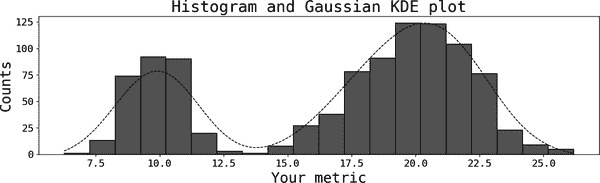

###### 图 8-7. 模拟数据的直方图和核密度估计图

###### 警告

在绘制核密度估计图（KDEs）时，要注意比例尺。KDEs 是对潜在分布的平滑估计，确保它们积分为一，因此比例尺没有实际意义。当我绘制 KDEs 时，我通常会删除垂直标签，因为它们可能会造成混淆。在图 8-7 中，我重新调整了坐标轴的比例，以便与直方图中的比较。

在与利益相关者交流时，我很少使用直方图或 KDEs，因为这些通常包含比传达信息所需更多的信息。大多数情况下，你只需要几个分位数，可以通过其他可视化手段呈现，比如标准的[*箱线图*](https://oreil.ly/mTEfe)。唯一的例外是当我想突出显示与我的信息相关的分布特征时；典型的用例是当我想表明度量领域中有异常行为时，比如在欺诈预防中。

如果你想突出*分布中的变化*，可以使用箱线图。一个典型的场景是当你想展示你的销售或客户的*质量*已经发生变化，比如因为平均票价随时间改善了。由于样本平均值对离群值敏感，你可能想展示是什么驱动了这种变化。

图 8-8 展示了两种绘制这些变化的替代方式。左边的图显示了标准箱线图，右边我决定仅绘制最小值和最大值以及 25%、50%和 75%的分位数，使用了线图。箱线图包含了比传达信息所需的更多信息，因此我决定做两个改变：

+   仅呈现绝对必要的数据（分位数）。

+   根据本章开头的建议使用线图。

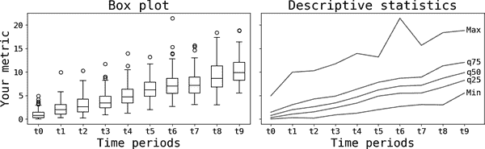

###### 图 8-8\. 分布变化的两种替代方案

# 一般建议

在经历了一些数据可视化中的常见陷阱之后，让我们直接进入一些关于良好设计和执行的一般建议。

## 找到适合你信息传达的数据可视化方式

你选择的绘图类型可能会改变观众对数据的感知，因此最好找到真正有助于传达信息的绘图类型。例如，你想要比较不同类别之间的数量？随时间的变化？比例？不确定性？根据你想传达的内容，你可以在网上找到多种资源来指导你。例如，[数据可视化目录](https://oreil.ly/_S7G-)展示了根据“你想展示什么”不同类型的绘图。

我再次强调重要的是*信息传达*。因此，我始终建议在决定最终输出之前尝试几种绘图。这会花费更多时间，但最后一步非常关键。图 8-9 展示了我在准备本章时舍弃的一个图。尝试同时使用箱线图和线图似乎是个好主意，但是这种方式并没有帮助我传达信息（信息过于杂乱）。

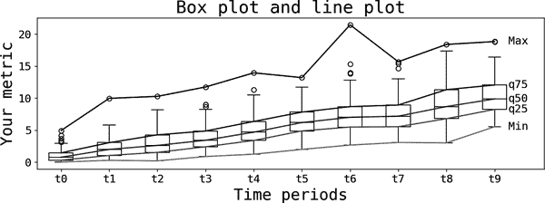

###### 图 8-9\. 未能帮助传递信息的绘图

## 谨慎选择您的颜色

一个常见的错误是将颜色视为绘图的装饰特征。在市场营销设置中可能是正确的，但在数据可视化中，必须明智地选择颜色以传达信息。

常见的情景是条形图：您在类别之间有一个度量标准，希望展示一个或多个分段的有趣见解。一个好的建议是为所有条形选择*一种且仅一种*颜色。我看过许多数据科学演示，演讲者认为如果每根条形的颜色都不同，图表看起来很棒。退一步想想你的观众：他们会认为你在组合颜色方面非常出色吗？这有可能，但许多人实际上认为不同的颜色代表您想突出显示的第三个变量。在这种情况下，颜色与水平轴上的标签传达完全相同的信息，最好选择一种颜色。

图 8-10 显示了三个示例：第一个图突出了您要*避免*的内容，因为您的段标签和颜色代表相同的维度。中间的图消除了这种冗余。第三幅图展示了一个例子，说明了着色帮助您传达信息的情况：您希望观众关注表现糟糕的* b *段。如果仅靠颜色不足以传达信息，您可以包含其他文本注释。

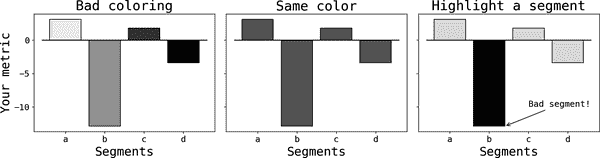

###### 图 8-10\. 带有着色的示例

## 绘图中的不同维度

前面的例子可以推广到其他类型的装饰性特征，例如不同的标记类型或线条样式。相同的原则适用：如果使用了多个这样的特征，可能会传达冗余信息，并可能会让观众感到困惑。

话虽如此，*如果*您有重要的附加信息要传达，您可以使用这些额外的特征。最好的例子是气泡图：这类似于散点图，您想说明两个变量*X*和*Y*之间的关系，并且还包括第三个变量*Z*，由圆形标记或气泡的直径表示。一个示例显示在图 8-11 中。

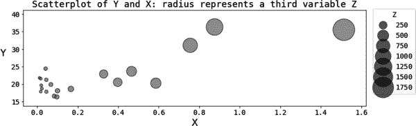

###### 图 8-11\. 用气泡图表示的第三维度

## 瞄准足够大的数据墨水比

在讨论在图 8-3 中使用条形图时，我提到您应该避免混乱；条形图本身只是提供了冗余信息。爱德华·图夫特通过*数据墨水比*的概念正式化了这种直觉。他将*数据墨水*定义为图形的“不可擦除的核心”。*数据墨水比*是数据墨水与图形总墨水量的比率。当您在绘图中包含非信息性特征时，这会降低该比率；或者，如果您确实只是代表数据而不添加其他内容，您将提高它。

虽然图夫特支持最大化数据墨水比的概念，但我把数据墨水比更多地看作是一个指导方针而不是铁板一块法律，实际上在视觉感知的研究中也有与图夫特建议相矛盾的研究。¹ 例如，在右侧的图表中包含额外的信息来突出你的观众的某些内容，会增加比率，因此是一个不好的做法。你可以自行判断，但我发现帮助观众将他们的注意力引导到帮助我表达观点的细节上是非常有用的。

## 定制与半自动化

在典型情景中，数据科学家使用可视化工具来帮助提高他们的生产力。这些半自动化工具能够缩短生成图表的时间，但通常提供的定制空间有限。应当选择灵活的工具，能够轻松定制你的图表。

###### 小贴士

我倾向于支持这个光谱的定制化一面。回归*基础*，使用像 Python 的 Matplotlib 这样通用且允许高度定制的工具，能够显著提升你创建正确图表的能力。起初的学习曲线可能会很陡峭，但过一段时间后，你将能够毫不费力地创建几乎任何你想象得到的图表。

## 从一开始就把字体大小搞对

这听起来可能很简单，但这是我在数据科学演示中经常看到的一个错误。为你的图表选择足够大的字体大小，并始终检查每个标签是否可读。并*总是*包括标题以及垂直和水平轴的标签。旨在设计自说明且可读的图表。

使用 Python 的 Matplotlib 的一个好习惯是[定制`rcParams`](https://oreil.ly/m4rz3)。例如，为了确保我始终拥有足够大的默认字体大小，我总是在导入必要模块后，在笔记本或脚本的顶部包含以下类似内容：

```
# set plotting parameters from the beginning
font = {'family' : 'monospace',
        'weight' : 'normal',
        'size'   : 14}
axes = { 'titlesize' : 22,
        'labelsize' : 20}
figure = {'figsize':(10,4),
         'autolayout':True}
matplotlib.rc('font', **font)
matplotlib.rc('axes', **axes)
matplotlib.rc('figure', **figure)
```

如果你认为这些新的默认参数对于特定的图表不起作用，只需在该图表上覆盖它们。

## 交互式还是非交互式

交互式图表已经相当流行，最初是通过 JavaScript 库（如[D3.js](https://d3js.org)）的开发，现在在 Python 和 R 中也可以找到这种功能。在 Python 中，你可以找到几种工具来使你的图表具有交互性；最受欢迎的包括[Plotly](https://plotly.com)，[Seaborn](https://oreil.ly/CsVh7)和[Altair](https://oreil.ly/zWKfz)等。

在静态图表中（比如本章中的图表），与观众的沟通是单向的（从创建者到观众）。在许多情况下，这并不是最佳选择，因为观众无法*自行检查数据*。交互式图表有助于弥合这一差距。

然而，对于大多数常见用例，它们只是一种过度。建议仅在您的受众需要检查数据时使用它们。否则，坚持使用具有清晰消息的静态图。

## 保持简单

在第七章中，我提出了创建简单叙述的案例，这对数据可视化尤其重要。您的目标是传递一条消息，复杂的图形使您的受众不必要地难以理解。此外，如果您正在进行现场演示，很可能会收到分散您注意力的问题。

## 从解释图开始

一个常见的错误是假设观众理解绘图并立即解释从中获得的主要见解。这就是为什么您应该从澄清绘图开始：明确说明垂直和水平轴上的内容，并选择解释绘图的一部分（如标记、线条或条形）。一旦确保绘图清晰，您可以传达您的消息。

# 主要观点

这些是本章的要点：

数据可视化的目的

可视化应帮助您传递消息。在呈现图表之前，请确保有一条要传递的“消息”；否则，请放弃使用图表。

绘图类型

选择最适合您的交付方式。条形图非常适合跨类别比较度量标准。折线图更适合连续度量标准或显示时间序列。理解其差异，明智选择。

一般建议

致力于简单的可视化，避免混乱。明智选择颜色，并始终确保图表可读性通过调整字体大小。确保轴标记，并使标签有意义。在不明显的情况下包括单位。除非绝对必要，否则避免交互式图。

# 进一步阅读

数据可视化中最常引用的参考之一是 Edward Tufte（Graphics Press）的《量化信息的视觉显示》。在许多主题中，他详细讨论了数据墨水比率。与 John Tukey 和 William Cleveland 一起，Tufte 被认为是该领域的基础专家之一。

数据可视化爱好者的另一个必读参考是 Leland Wilkinson（Springer）的《图形语法》。R 流行的 ggplot 库受到了 Wilkinson 观念的启发，对该行业以及其他广泛使用的可视化库和工具产生了深远影响。

数据可视化的历史可以在 Michael Friendly 的《数据可视化简史》中找到，发表在《数据可视化手册》（Springer）中。

在这个主题上有许多出色的现代参考资料。我强烈推荐 Claus Wilke 的《数据可视化基础：制作信息丰富和引人入胜的图表入门》（O'Reilly）。

Jake VanderPlas 的《Python 数据科学手册》（O’Reilly）提供了本文讨论的一些主题的出色示例，并将帮助您理解 Matplotlib 的一些复杂性。他的所有代码都在[GitHub](https://oreil.ly/Y698n)上。

Kennedy Elliott 的《[30 分钟内理解人类感知的 39 个研究](https://oreil.ly/aneqb)》回顾了一些关于如何不同情节改变物体感知以及它们传达不同信息效率的证据。

¹ 例如，McGurgan 等人在《图形设计：数据-墨水比率和专家用户》中，收录于*第 16 届国际联合计算机视觉、成像和计算机图形理论与应用会议*（VISIGRAPP）的论文集 3（2021 年）：188–194 页。
