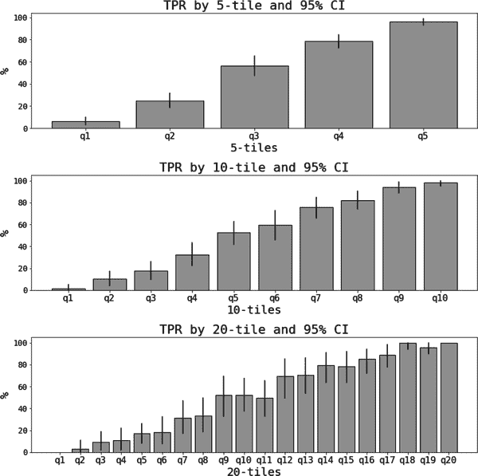

# 第九章：模拟和自举法

数据科学家工具包中不同技术的应用取决于您正在处理的数据的性质。*观察*数据源自于任何公司在日常业务中的正常互动，而*实验*数据则是在设计良好的实验条件下产生的，例如进行 A/B 测试。后者通常用于推断因果关系或估计杠杆的增量性（第十五章）。

第三种类型，即*模拟*或*合成*数据，在重新创建*数据生成过程*（DGP）时较为少见。这可以通过对其进行强假设或在数据集上训练生成模型来实现。本章仅讨论前一种类型，但如果您对后一种类型感兴趣，我会在本章末尾推荐相关资料。

对于数据科学家而言，模拟是一个重要的工具，其原因有以下几点：

理解算法

没有一种算法能够在所有数据集上表现良好。模拟允许您单独分析 DGP 的不同方面，并了解算法对变化的敏感性。蒙特卡洛（MC）模拟通常用于这种分析。

自举法

很多时候，您需要在不做出分布假设的情况下估计估计值的精确度。自举法是一种可以在这种情况下帮助您的模拟方法。

杠杆优化

有些情况下，您需要模拟一个系统以了解和优化某些杠杆的影响。本章不涉及此主题，但在章末提供了一些参考资料。

在深入讨论这些主题之前，让我们从模拟的基础知识开始。

# 模拟的基础知识

*数据生成过程*（DGP）清楚地说明了在模拟数据集中输入、噪声、输入和输出之间的关系。以这个 DGP 为例：

<math alttext="StartLayout 1st Row 1st Column y 2nd Column equals 3rd Column alpha 0 plus alpha 1 x 1 plus alpha 2 x 2 plus epsilon 2nd Row 1st Column x 1 comma x 2 2nd Column tilde 3rd Column upper N left-parenthesis bold 0 bold comma bold upper Sigma bold right-parenthesis 3rd Row 1st Column epsilon 2nd Column tilde 3rd Column upper N left-parenthesis 0 comma sigma squared right-parenthesis EndLayout" display="block"><mtable displaystyle="true"><mtr><mtd columnalign="right"><mi>y</mi></mtd> <mtd><mo>=</mo></mtd> <mtd columnalign="left"><mrow><msub><mi>α</mi> <mn>0</mn></msub> <mo>+</mo> <msub><mi>α</mi> <mn>1</mn></msub> <msub><mi>x</mi> <mn>1</mn></msub> <mo>+</mo> <msub><mi>α</mi> <mn>2</mn></msub> <msub><mi>x</mi> <mn>2</mn></msub> <mo>+</mo> <mi>ϵ</mi></mrow></mtd></mtr> <mtr><mtd columnalign="right"><mrow><msub><mi>x</mi> <mn>1</mn></msub> <mo>,</mo> <msub><mi>x</mi> <mn>2</mn></msub></mrow></mtd> <mtd><mo>∼</mo></mtd> <mtd columnalign="left"><mrow><mi>N</mi> <mo>(</mo> <mn mathvariant="bold">0</mn> <mo>,</mo> <mi>Σ</mi> <mo>)</mo></mrow></mtd></mtr> <mtr><mtd columnalign="right"><mi>ϵ</mi></mtd> <mtd><mo>∼</mo></mtd> <mtd columnalign="left"><mrow><mi>N</mi> <mo>(</mo> <mn>0</mn> <mo>,</mo> <msup><mi>σ</mi> <mn>2</mn></msup> <mo>)</mo></mrow></mtd></mtr></mtable></math>

数据集由一个结果（*y*）和两个特征（<math alttext="x 1 comma x 2"><mrow><msub><mi>x</mi> <mn>1</mn></msub> <mo>,</mo> <msub><mi>x</mi> <mn>2</mn></msub></mrow></math>）组成。结果是特征和噪声的线性函数。包括在内的所有模拟数据集所需信息均已包含，因此 DGP 已完全确定。

创建   创建数据的步骤如下：

1.  *设置一些参数*。选择<math alttext="alpha 0 comma alpha 1 comma alpha 2"><mrow><msub><mi>α</mi> <mn>0</mn></msub> <mo>,</mo> <msub><mi>α</mi> <mn>1</mn></msub> <mo>,</mo> <msub><mi>α</mi> <mn>2</mn></msub></mrow></</mrow></math> 的值，<math alttext="2 times 2"><mrow><mn>2</mn> <mo>×</mo> <mn>2</mn></mrow></math> 协方差矩阵 <math alttext="bold upper Sigma"><mi>Σ</mi></math> ，以及残差或纯噪声方差 <math alttext="sigma squared"><msup><mi>σ</mi> <mn>2</mn></msup></math>。

1.  *从分布中抽样*。在这里，我决定特征遵循均值为零的多元正态分布，残差则独立地从均值为零的正态分布中抽样。

1.  *计算结果*。一旦所有输入都被抽取，你可以计算结果 *y*。

第二步是模拟的核心，所以我们先来讨论这个。计算机无法模拟真正的随机数。但是有办法从具有纯随机性质的分布中生成*伪随机*抽样。在 Python 中，[random](https://oreil.ly/rDWrf)模块包含多个可以轻松使用的伪随机数生成器。

尽管如此，让我们退一步，试着理解这些伪随机数生成器的工作原理。现在我将描述*逆变换抽样*方法。

假设你能够抽取一个均匀分布的随机数 <math alttext="u tilde upper U left-parenthesis 0 comma 1 right-parenthesis"><mrow><mi>u</mi> <mo>∼</mo> <mi>U</mi> <mo>(</mo> <mn>0</mn> <mo>,</mo> <mn>1</mn> <mo>)</mo></mrow></math> ，并且你想要从已知累积分布函数（CDF）为 <math alttext="upper F left-parenthesis x right-parenthesis equals Prob left-parenthesis upper X less-than-or-equal-to x right-parenthesis"><mrow><mi>F</mi> <mo>(</mo> <mi>x</mi> <mo>)</mo> <mo>=</mo> <mtext>Prob</mtext> <mo>(</mo> <mi>X</mi> <mo>≤</mo> <mi>x</mi> <mo>)</mo></mrow></math> 的分布中抽样。重要的是，你还可以计算 CDF 的逆函数。步骤如下（图 9-1）：

1.  生成 *K* 个独立抽样 <math alttext="u Subscript k Baseline tilde upper U left-parenthesis 0 comma 1 right-parenthesis"><mrow><msub><mi>u</mi> <mi>k</mi></msub> <mo>∼</mo> <mi>U</mi> <mrow><mo>(</mo> <mn>0</mn> <mo>,</mo> <mn>1</mn> <mo>)</mo></mrow></mrow></math> 。

1.  对于每个 <math alttext="u Subscript k"><msub><mi>u</mi> <mi>k</mi></msub></math> 找到 <math alttext="x Subscript k Baseline equals upper F Superscript negative 1 Baseline left-parenthesis u Subscript k Baseline right-parenthesis"><mrow><msub><mi>x</mi> <mi>k</mi></msub> <mo>=</mo> <msup><mi>F</mi> <mrow><mo>-</mo><mn>1</mn></mrow></msup> <mrow><mo>(</mo> <msub><mi>u</mi> <mi>k</mi></msub> <mo>)</mo></mrow></mrow></math> ：后者是从所需分布中独立抽取的结果。


###### 图 9-1\. 逆变换抽样

以下代码片段展示了如何计算 logistic 随机变量的逆 CDF。每个[均匀随机数](https://oreil.ly/yPHM6)被作为参数传入，然后你只需计算 CDF 的逆，给定一些位置和尺度参数：

```
def logistic_cdf_inverse(y, mu, sigma):
    """
 Return the inverse of the CDF of a logistic random variable
 Inputs:
 y: float: number between 0 and 1
 mu: location parameter
 sigma: scale parameter
 Returns:
 x: the inverse of F(y;mu,sigma)
 """
    inverse_cdf = mu + sigma*np.log(y/(1-y))
    return inverse_cdf
```

图 9-2 展示了一个 Q-Q 图，比较了 Numpy 的 logistic 随机数 [生成器](https://oreil.ly/nnt5k) 和我自己使用刚刚描述的反转变换抽样实现的生成器，针对三种不同的样本大小。Q-Q 图非常适合直观地检查两个分布是否相似。通过比较水平和垂直轴上的对应分位数来完成此操作：相等的分布必须具有相同的分位数，从而创建一个位于 45 度对角线（虚线）上的图形，因此您要查找任何偏离这种理想情况的情况。您可以看到随着样本大小的增加，Numpy 的 logistic 随机数生成器和我的实现逐渐接近。


###### 图 9-2\. Numpy 和我自己的 logistic 随机变量生成器，适用于不同的样本大小

最后一个重要的信息与随机数生成器的 *种子* 有关。伪随机数是通过动态过程生成的，例如 <math alttext="x Subscript t Baseline equals f left-parenthesis x Subscript t minus 1 Baseline comma midline-horizontal-ellipsis comma x Subscript t minus k Baseline comma x 0 right-parenthesis"><mrow><msub><mi>x</mi> <mi>t</mi></msub> <mo>=</mo> <mi>f</mi> <mrow><mo>(</mo> <msub><mi>x</mi> <mrow><mi>t</mi><mo>-</mo><mn>1</mn></mrow></msub> <mo>,</mo> <mo>⋯</mo> <mo>,</mo> <msub><mi>x</mi> <mrow><mi>t</mi><mo>-</mo><mi>k</mi></mrow></msub> <mo>,</mo> <msub><mi>x</mi> <mn>0</mn></msub> <mo>)</mo></mrow></mrow></math> 。种子是序列的初始值，因此在给定过程（及其参数）的情况下，可以复制完整的序列。在实践中，种子用于 *复制* 的目的。在本章的代码中，您会看到我总是设置一个种子来确保再次运行代码时结果不会改变。

# 模拟线性模型和线性回归

在机器学习（ML）中仍然有用的最简单的模拟是线性模型的模拟。现在我将模拟以下模型：

<math alttext="StartLayout 1st Row 1st Column y 2nd Column equals 3rd Column 2 plus 3.5 x 1 minus 5 x 2 plus epsilon 2nd Row 1st Column x 1 comma x 2 2nd Column tilde 3rd Column upper N left-parenthesis bold 0 bold comma bold diag bold left-parenthesis bold 3 bold comma bold 10 bold right-parenthesis bold right-parenthesis 3rd Row 1st Column epsilon 2nd Column tilde 3rd Column upper N left-parenthesis 0 comma 1 right-parenthesis EndLayout" display="block"><mtable displaystyle="true"><mtr><mtd columnalign="right"><mi>y</mi></mtd> <mtd><mo>=</mo></mtd> <mtd columnalign="left"><mrow><mn>2</mn> <mo>+</mo> <mn>3</mn> <mo>.</mo> <mn>5</mn> <msub><mi>x</mi> <mn>1</mn></msub> <mo>-</mo> <mn>5</mn> <msub><mi>x</mi> <mn>2</mn></msub> <mo>+</mo> <mi>ϵ</mi></mrow></mtd></mtr> <mtr><mtd columnalign="right"><mrow><msub><mi>x</mi> <mn>1</mn></msub> <mo>,</mo> <msub><mi>x</mi> <mn>2</mn></msub></mrow></mtd> <mtd><mo>∼</mo></mtd> <mtd columnalign="left"><mrow><mi>N</mi> <mo>(</mo> <mn mathvariant="bold">0</mn> <mo>,</mo> <mrow><mtext mathvariant="bold">diag</mtext> <mo>(</mo> <mn mathvariant="bold">3</mn> <mo>,</mo> <mn mathvariant="bold">10</mn> <mo>)</mo></mrow> <mo>)</mo></mrow></mtd></mtr> <mtr><mtd columnalign="right"><mi>ϵ</mi></mtd> <mtd><mo>∼</mo></mtd> <mtd columnalign="left"><mrow><mi>N</mi> <mo>(</mo> <mn>0</mn> <mo>,</mo> <mn>1</mn> <mo>)</mo></mrow></mtd></mtr></mtable></math>

注意，特征是独立于正态分布的抽样（协方差矩阵是对角的，粗体表示向量或矩阵），残差遵循标准正态分布。

您现在可以准备运行 MC 模拟。典型的模拟包括以下步骤：

1.  *确定参数、种子和样本大小 (N)*。这确保可以执行单个 MC 实验。

1.  *定义您希望实现的目标*。通常，您希望测试 ML 算法相对于真实 DGP 的性能，例如通过计算偏差。

1.  *确定模拟的数量 ( <math alttext="upper M"><mi>M</mi></math> )，估计并保存参数*。对于每个实验，模拟并训练模型，并计算在上一步骤中定义的度量。对于偏差的情况，可能是这样的：

    <math alttext="Bias left-parenthesis theta comma ModifyingAbove theta With caret right-parenthesis equals upper E left-parenthesis ModifyingAbove theta With caret right-parenthesis minus theta" display="block"><mrow><mtext>Bias</mtext> <mrow><mo>(</mo> <mi>θ</mi> <mo>,</mo> <mover accent="true"><mi>θ</mi> <mo>^</mo></mover> <mo>)</mo></mrow> <mo>=</mo> <mi>E</mi> <mrow><mo>(</mo> <mover accent="true"><mi>θ</mi> <mo>^</mo></mover> <mo>)</mo></mrow> <mo>-</mo> <mi>θ</mi></mrow></math>

    其中<math alttext="theta"><mi>θ</mi></math>是感兴趣的*真实*参数（在第一步中设置），<math alttext="ModifyingAbove theta With caret"><mover accent="true"><mi>θ</mi> <mo>^</mo></mover></math>是来自 ML 模型的估计，期望通常用*M*次模拟中的样本均值替代。

图 9-3 展示了在早期定义和参数化的线性模型的三百次 MC 模拟实验结果。每次实验的估计参数都被保存，图中显示了样本均值和 95%置信区间，以及真实参数。置信区间直接从模拟结果计算得出，通过找到*M*次实验中的 2.5%和 97.5%分位数。

这是*普通的香草*模拟，其中所有普通最小二乘法（OLS）的假设都得到满足，因此线性回归在估计真实参数时表现出色并不足为奇。


###### 图 9-3\. 线性回归的 MC 实验结果

现在，我已经使用 MC 模拟验证了 OLS 估计是无偏的，我将尝试更有趣的事情。当信号与噪声比发生变化时会发生什么？

直觉上，*信号与噪声比*（SNR）衡量模型提供的信息量（信号）与模型未解释部分的信息量（噪声）之比。一般来说，你包含的信息特征越多，预测模型的 SNR 就*越高*。

使用第一次模拟作为基准，通过改变残差方差*σ*²并保持特征的方差不变，可以轻松地改变 SNR。图 9-4 展示了从新的 MC 模拟结果中绘制的结果，与之前相同的参数，唯一不同的是残差方差增大了一千倍。


###### 图 9-4\. 线性回归与 SNR 降低

你可以直观地验证 OLS 保持无偏性，即估计的平均值非常接近真实参数。但由于 SNR 较低，估计现在不那么精确（置信区间较大）。当你的 SNR 不够高时，这是一种典型的症状。

# 什么是偏依赖图？

尽管其预测性能不佳，但从*可解释性*的角度来看，线性回归仍然很出色。为了看清楚这一点，看看之前使用的简单线性模型：

<math alttext="y equals alpha 0 plus alpha 1 x 1 plus alpha 2 x 2 plus epsilon" display="block"><mrow><mi>y</mi> <mo>=</mo> <msub><mi>α</mi> <mn>0</mn></msub> <mo>+</mo> <msub><mi>α</mi> <mn>1</mn></msub> <msub><mi>x</mi> <mn>1</mn></msub> <mo>+</mo> <msub><mi>α</mi> <mn>2</mn></msub> <msub><mi>x</mi> <mn>2</mn></msub> <mo>+</mo> <mi>ϵ</mi></mrow></math>

由于残差根据假设平均为零，计算条件期望和偏导数，得到：

<math alttext="StartFraction partial-differential upper E left-parenthesis y vertical-bar bold upper X bold right-parenthesis Over partial-differential x Subscript k Baseline EndFraction equals alpha Subscript k" display="block"><mrow><mfrac><mrow><mi>∂</mi><mi>E</mi><mo>(</mo><mi>y</mi><mo>|</mo><mi>𝐗</mi><mo>)</mo></mrow> <mrow><mi>∂</mi><msub><mi>x</mi> <mi>k</mi></msub></mrow></mfrac> <mo>=</mo> <msub><mi>α</mi> <mi>k</mi></msub></mrow></math>

这表明每个参数可以解释为对期望结果的相应特征的*边际效应*（在其他条件下）。换句话说，在线性世界中，特征的单位变化与结果中 <math alttext="alpha Subscript k"><msub><mi>α</mi> <mi>k</mi></msub></math> 单位的变化相关联。这使 OLS 在叙事视角上具有潜力。

*局部依赖图*（PDPs）是非线性模型（例如随机森林或梯度提升回归）的对应物：

<math alttext="y equals f left-parenthesis x 1 comma x 2 right-parenthesis" display="block"><mrow><mi>y</mi> <mo>=</mo> <mi>f</mi> <mo>(</mo> <msub><mi>x</mi> <mn>1</mn></msub> <mo>,</mo> <msub><mi>x</mi> <mn>2</mn></msub> <mo>)</mo></mrow></math>

这里*f*代表您想学习的可能是非线性函数。

通过以下步骤可以轻松计算特征 *j* 的 PDP：¹

1.  *训练模型*。使用训练样本训练模型，并保存模型对象。

1.  *计算特征的均值*。计算*K*个特征 <math alttext="bold x overbar equals left-parenthesis x overbar Subscript 1 Baseline comma midline-horizontal-ellipsis comma x overbar Subscript upper K Baseline right-parenthesis"><mrow><mover><mi>𝐱</mi> <mo>¯</mo></mover> <mo>=</mo> <mrow><mo>(</mo> <msub><mover><mi>x</mi> <mo>¯</mo></mover> <mn>1</mn></msub> <mo>,</mo> <mo>⋯</mo> <mo>,</mo> <msub><mover><mi>x</mi> <mo>¯</mo></mover> <mi>K</mi></msub> <mo>)</mo></mrow></mrow></math> 。由于随机抽样，使用测试样本或训练样本应该没有区别。

1.  *为第 j 个特征创建线性网格 <math alttext="x Subscript j"><msub><mi>x</mi> <mi>j</mi></msub></math>* 。固定网格大小 *G* 并创建网格为 <math alttext="grid left-parenthesis x Subscript j Baseline right-parenthesis equals left-parenthesis x Subscript 0 j Baseline comma x Subscript 1 j Baseline comma midline-horizontal-ellipsis comma x Subscript upper G j Baseline right-parenthesis"><mrow><mtext>grid</mtext> <mrow><mo>(</mo> <msub><mi>x</mi> <mi>j</mi></msub> <mo>)</mo></mrow> <mo>=</mo> <mrow><mo>(</mo> <msub><mi>x</mi> <mrow><mn>0</mn><mi>j</mi></mrow></msub> <mo>,</mo> <msub><mi>x</mi> <mrow><mn>1</mn><mi>j</mi></mrow></msub> <mo>,</mo> <mo>⋯</mo> <mo>,</mo> <msub><mi>x</mi> <mrow><mi>G</mi><mi>j</mi></mrow></msub> <mo>)</mo></mrow></mrow></math> ，其中索引 0 和 G 用于表示样本中特征的最小值和最大值。²

1.  *计算均值-网格矩阵*。矩阵 <math alttext="bold upper X overbar Subscript bold j"><msub><mover><mi>𝐗</mi> <mo>¯</mo></mover> <mi>𝐣</mi></msub></math> 在相应列中具有<math alttext="x Subscript j"><msub><mi>x</mi> <mi>j</mi></msub></math>的线性网格，其他特征的均值位于其他地方：

    <math alttext="bold upper X overbar Subscript bold j Baseline equals Start 4 By 6 Matrix 1st Row 1st Column x overbar Subscript 1 2nd Column x overbar Subscript 2 3rd Column midline-horizontal-ellipsis 4th Column x Subscript 0 j 5th Column midline-horizontal-ellipsis 6th Column x overbar Subscript upper K 2nd Row 1st Column x overbar Subscript 1 2nd Column x overbar Subscript 2 3rd Column midline-horizontal-ellipsis 4th Column x Subscript 1 j 5th Column midline-horizontal-ellipsis 6th Column x overbar Subscript upper K 3rd Row 1st Column vertical-ellipsis 2nd Column vertical-ellipsis 3rd Column down-right-diagonal-ellipsis 4th Column vertical-ellipsis 5th Column vertical-ellipsis 4th Row 1st Column x overbar Subscript 1 2nd Column x overbar Subscript 2 3rd Column midline-horizontal-ellipsis 4th Column x Subscript upper G j 5th Column midline-horizontal-ellipsis 6th Column x overbar Subscript upper K EndMatrix Subscript upper G times upper K" display="block"><mrow><msub><mover><mi>𝐗</mi> <mo>¯</mo></mover> <mi>𝐣</mi></msub> <mo>=</mo> <msub><mfenced close=")" open="("><mtable><mtr><mtd><msub><mover><mi>x</mi> <mo>¯</mo></mover> <mn>1</mn></msub></mtd> <mtd><msub><mover><mi>x</mi> <mo>¯</mo></mover> <mn>2</mn></msub></mtd> <mtd><mo>⋯</mo></mtd><mtd><msub><mi>x</mi> <mrow><mn>0</mn><mi>j</mi></mrow></msub></mtd> <mtd><mo>⋯</mo></mtd><mtd><msub><mover><mi>x</mi> <mo>¯</mo></mover> <mi>K</mi></msub></mtd></mtr> <mtr><mtd><msub><mover><mi>x</mi> <mo>¯</mo></mover> <mn>1</mn></msub></mtd> <mtd><msub><mover><mi>x</mi> <mo>¯</mo></mover> <mn>2</mn></msub></mtd> <mtd><mo>⋯</mo></mtd><mtd><msub><mi>x</mi> <mrow><mn>1</mn><mi>j</mi></mrow></msub></mtd> <mtd><mo>⋯</mo></mtd><mtd><msub><mover><mi>x</mi> <mo>¯</mo></mover> <mi>K</mi></msub></mtd></mtr> <mtr><mtd><mo>⋮</mo></mtd><mtd><mo>⋮</mo></mtd><mtd><mo>⋱</mo></mtd><mtd><mo>⋮</mo></mtd><mtd><mo>⋮</mo></mtd></mtr><mtr><mtd><msub><mover><mi>x</mi> <mo>¯</mo></mover> <mn>1</mn></msub></mtd> <mtd><msub><mover><mi>x</mi> <mo>¯</mo></mover> <mn>2</mn></msub></mtd> <mtd><mo>⋯</mo></mtd><mtd><msub><mi>x</mi> <mrow><mi>G</mi><mi>j</mi></mrow></msub></mtd> <mtd><mo>⋯</mo></mtd><mtd><msub><mover><mi>x</mi> <mo>¯</mo></mover> <mi>K</mi></msub></mtd></mtr></mtable></mfenced> <mrow><mi>G</mi><mo>×</mo><mi>K</mi></mrow></msub></mrow></math>

1.  *进行预测*。使用训练好的模型，使用均值-网格矩阵进行预测。这给出了特征 *j* 的 PDP：

    <math alttext="PDP left-parenthesis x Subscript j Baseline right-parenthesis equals ModifyingAbove f With caret left-parenthesis bold upper X Subscript bold j Baseline overbar right-parenthesis" display="block"><mrow><mtext>PDP</mtext> <mrow><mo>(</mo> <msub><mi>x</mi> <mi>j</mi></msub> <mo>)</mo></mrow> <mo>=</mo> <mover accent="true"><mi>f</mi> <mo>^</mo></mover> <mrow><mo>(</mo> <mover><msub><mi>𝐗</mi> <mi>𝐣</mi></msub> <mo>¯</mo></mover> <mo>)</mo></mrow></mrow></math>

注意，*偏导数*和*偏依赖图*回答了一个非常类似的问题：当只允许一个特征变化时，预测结果的变化是多少？对于非线性函数，你需要将其他所有值固定在某个值上（标准做法是样本均值，但你也可以选择其他值）。偏导数关注*变化*，而偏依赖图则显示了在允许一个特征变化时的整体预测结果。

我给你展示的伪代码对于连续特征效果很好。对于分类特征，你需要在“网格”上小心处理：不是创建线性网格，而是创建可能值的数组，例如*{0,1}*作为虚拟变量。其余部分保持不变，但在这里使用条形图更合理，正如第八章中所解释的那样。

现在我将使用我模拟的第一个模型来比较线性回归和 scikit-learn 的[梯度提升回归](https://oreil.ly/UNDoi)（GBR）以及[随机森林回归](https://oreil.ly/fFCoh)（RFR）的结果。这是一个有用的基准：非线性算法预计在识别非线性方面更强大，但当真实的基础模型是线性时，它们是否同样有效呢？

图 9-5 绘制了真实斜率以及使用*最大深度 = 1*参数估计的 GBR 和 RFR 的 PDP，该参数控制了两种算法中每棵树的最大高度。这里选择这个参数并不不合理，因为模型在参数和特征上是线性的；单棵树无法学习 DGP，但对于集成来说，这个限制就不那么重要了。所有其他元参数都保持在 scikit-learn 的默认值。

有趣的是，直接使用 GBR 能够很好地恢复两个特征的真实参数。RFR 对<math alttext="x 2"><msub><mi>x</mi> <mn>2</mn></msub></math>表现得还可以，但对<math alttext="x 1"><msub><mi>x</mi> <mn>1</mn></msub></math>表现不佳。


###### 图 9-5\. GBR 和 RFR 回归的 PDP（最大深度 = 1）

图 9-6 展示了当*最大深度 = 7*时的结果，其余部分与之前设置的默认值相同。GBR 再次表现出色，而且在允许更多非线性的情况下，RFR 也能够估计出真实的参数。有趣的是，当<math alttext="maximum depth greater-than-or-equal-to 3"><mrow><mtext>最大深度</mtext> <mo>≥</mo> <mn>3</mn></mrow></math>时，开始恢复<math alttext="x 1"><msub><mi>x</mi> <mn>1</mn></msub></math>的正确 PDP 形状（详细结果请见本章的[repo](https://oreil.ly/dshp-repo)）。这里发生了什么？


###### 图 9-6\. GBR 和 RF 回归的 PDP（最大深度 = 7）

这个模拟有两个参数，同时给予第二个特征 <math alttext="x 2"><msub><mi>x</mi> <mn>2</mn></msub></math> 更多的权重：它是从一个具有更高方差的正态分布中抽取的（ <math alttext="sigma 22 equals 10 greater-than 3 equals sigma 11"><mrow><msub><mi>σ</mi> <mn>22</mn></msub> <mo>=</mo> <mn>10</mn> <mo>></mo> <mn>3</mn> <mo>=</mo> <msub><mi>σ</mi> <mn>11</mn></msub></mrow></math> ），相应的参数在绝对值上也更大。这意味着 <math alttext="x 2"><msub><mi>x</mi> <mn>2</mn></msub></math> 的一个标准差变化对 *y* 的影响大于对 <math alttext="x 1"><msub><mi>x</mi> <mn>1</mn></msub></math> 的相应变化。结果是，随机森林回归往往在每棵树的第一个和唯一的分割点上更频繁地选择第二个特征。

图 9-7 展示了在我切换模拟特征的方差而其他一切保持不变时的结果。你可以看到，现在随机森林回归能更好地估计第一个特征的真实效果，并且对第二个特征有一个相对较差的估计（但不像之前那样糟糕）。由于参数没有改变，只是从抽取的分布中改变了方差，所以 <math alttext="x 2"><msub><mi>x</mi> <mn>2</mn></msub></math> 仍然在集成树的第一个分裂点处获得足够的权重，因此算法能够捕捉到部分真实效果。


###### 图 9-7\. 变量特征值切换时的偏导数图（最大深度为 1）

也许你会想知道是否有其他元参数可以优化，以减少这个随机森林回归估计中的偏差。正如前面提到的，问题似乎在于 <math alttext="x 2"><msub><mi>x</mi> <mn>2</mn></msub></math> 被赋予更大的权重，因此它最终被选为树的第一个分割点（如果增加最大深度，则还会被选为任何进一步分割的点）。一种解决方法是改变默认参数 `max_features`，它设置每次分割允许竞争的*随机*选择特征的数量。默认值是总特征数（本例中为两个），因此 <math alttext="x 1"><msub><mi>x</mi> <mn>1</mn></msub></math> 总是失败。但是，如果将其更改为一个特征，由于选择的随机性，有时会强制集成系统放它一马。图 9-8 展示了这种改变的结果。


###### 图 9-8\. 随机森林偏导数图（最大深度为 1，最大特征数为 1）

# 遗漏变量偏差

在线性回归中，[*遗漏变量偏差*](https://oreil.ly/IqzUA) 发生在数据科学家未包括*必须包括*并与任何其他包括的特征相关的一个特征时，这会导致偏误的参数估计，从而导致次优的预测性能。

要解释偏差如何工作，让我们回到本章开头介绍的简单二特征线性模型，但现在假设数据科学家仅包括第一个特征并估计：

<math alttext="y equals beta 0 plus beta 1 x 1 plus eta" display="block"><mrow><mi>y</mi> <mo>=</mo> <msub><mi>β</mi> <mn>0</mn></msub> <mo>+</mo> <msub><mi>β</mi> <mn>1</mn></msub> <msub><mi>x</mi> <mn>1</mn></msub> <mo>+</mo> <mi>η</mi></mrow></math>

包含变量的真实未观察系数是 <math alttext="alpha 1"><msub><mi>α</mi> <mn>1</mn></msub></math> ，因此将其与误指定模型的系数（ <math alttext="beta 1"><msub><mi>β</mi> <mn>1</mn></msub></math> ）进行比较，可以显示：

<math alttext="beta 1 equals alpha 1 plus ModifyingBelow alpha 2 StartFraction upper C o v left-parenthesis x 1 comma x 2 right-parenthesis Over upper V a r left-parenthesis x 1 right-parenthesis EndFraction With bottom-brace Underscript Bias Endscripts" display="block"><mrow><msub><mi>β</mi> <mn>1</mn></msub> <mo>=</mo> <msub><mi>α</mi> <mn>1</mn></msub> <mo>+</mo> <munder><munder accentunder="true"><mrow><msub><mi>α</mi> <mn>2</mn></msub> <mfrac><mrow><mi>C</mi><mi>o</mi><mi>v</mi><mo>(</mo><msub><mi>x</mi> <mn>1</mn></msub> <mo>,</mo><msub><mi>x</mi> <mn>2</mn></msub> <mo>)</mo></mrow> <mrow><mi>V</mi><mi>a</mi><mi>r</mi><mo>(</mo><msub><mi>x</mi> <mn>1</mn></msub> <mo>)</mo></mrow></mfrac></mrow> <mo>︸</mo></munder> <mtext>Bias</mtext></munder></mrow></math>

结果是当两个特征无关联时存在偏差。此外，偏差的符号取决于 <math alttext="alpha 2 times upper C o v left-parenthesis x 1 comma x 2 right-parenthesis"><mrow><msub><mi>α</mi> <mn>2</mn></msub> <mo>×</mo> <mi>C</mi> <mi>o</mi> <mi>v</mi> <mrow><mo>(</mo> <msub><mi>x</mi> <mn>1</mn></msub> <mo>,</mo> <msub><mi>x</mi> <mn>2</mn></msub> <mo>)</mo></mrow></mrow></math> 。

让我们从模拟与之前相同的 DGP 开始，但排除 *x*[2]。我将对相关系数的网格进行模拟，因为这些系数限制在 [−1,1] 区间内，因此更容易处理。请记住，真实参数是 *α*[2] = −5，因此偏差的符号将是相关系数的负号：

<math alttext="Sgn left-parenthesis upper B i a s right-parenthesis equals minus Sgn left-parenthesis upper C o v left-parenthesis x 1 comma x 2 right-parenthesis right-parenthesis" display="block"><mrow><mtext>Sgn</mtext> <mrow><mo>(</mo> <mi>B</mi> <mi>i</mi> <mi>a</mi> <mi>s</mi> <mo>)</mo></mrow> <mo>=</mo> <mo>-</mo> <mtext>Sgn</mtext> <mo>(</mo> <mi>C</mi> <mi>o</mi> <mi>v</mi> <mrow><mo>(</mo> <msub><mi>x</mi> <mn>1</mn></msub> <mo>,</mo> <msub><mi>x</mi> <mn>2</mn></msub> <mo>)</mo></mrow> <mo>)</mo></mrow></math>

要模拟 <math alttext="x 1 comma x 2 tilde upper N left-parenthesis bold 0 bold comma bold upper Sigma bold left-parenthesis rho bold right-parenthesis bold right-parenthesis"><mrow><msub><mi>x</mi> <mn>1</mn></msub> <mo>,</mo> <msub><mi>x</mi> <mn>2</mn></msub> <mo>∼</mo> <mi>N</mi> <mrow><mo>(</mo> <mn mathvariant="bold">0</mn> <mo>,</mo> <mi>Σ</mi> <mrow><mo>(</mo> <mi>ρ</mi> <mo>)</mo></mrow> <mo>)</mo></mrow></mrow></math> ，您可以通过具有单位方差来简化参数化，以便：

<math alttext="normal upper Sigma left-parenthesis rho right-parenthesis equals Start 2 By 2 Matrix 1st Row 1st Column 1 2nd Column rho 2nd Row 1st Column rho 2nd Column 1 EndMatrix" display="block"><mrow><mi>Σ</mi> <mrow><mo>(</mo> <mi>ρ</mi> <mo>)</mo></mrow> <mo>=</mo> <mfenced close=")" open="("><mtable><mtr><mtd><mn>1</mn></mtd> <mtd><mi>ρ</mi></mtd></mtr> <mtr><mtd><mi>ρ</mi></mtd> <mtd><mn>1</mn></mtd></mtr></mtable></mfenced></mrow></math>

运行模拟的步骤如下：

1.  从网格中确定一个相关参数 <math alttext="rho"><mi>ρ</mi></math> 。

1.  给定此相关参数模拟 DGP。

1.  对于每个 MC 实验，估计排除第二个特征的参数。

1.  计算所有 MC 实验中的偏差。

1.  对网格中的所有其他元素重复。

图 9-9 显示了具有不同相关参数的 MC 模拟的结果。有四个结果值得注意：

+   当特征无关联时，偏差为零。

+   偏差的符号为相关参数的负号。

+   在单位相关系数下，偏差等于被排除特征的参数。

+   截距没有偏差（根据定义，与被排除变量无关）。


###### 图 9-9\. 偏差作为相关参数的函数

让我们总结这一最后的发现：*如果你要使用线性回归，务必认真考虑你需要包含的特征！* 这就是为什么即使对于底层因果机制只有弱假设的情况下（例如，包含地理虚拟变量可能有助于减轻省略变量偏差的程度），也建议始终包含一些控制变量。

这样说，现在几乎没有人使用 OLS，除了入门课程或教科书，或者在估计因果效应时（第十五章）。一个自然的问题是更具预测性能的算法是否也会遭受这个问题。

要回答这个问题，让我们进行一个 MC 实验并计算 OLS 和 GBR 的偏差。但我首先需要找到一种方法来估计与线性 DGP 中可比的 GBR 参数。检查 PDP（图 9-5）建议了一个简单的方法：

1.  构建 <math alttext="x 1"><msub><mi>x</mi> <mn>1</mn></msub></math> 的偏依赖图。

1.  运行线性回归 <math alttext="p d p equals gamma 0 plus gamma 1 Grid left-parenthesis x 1 right-parenthesis plus zeta"><mrow><mi>p</mi> <mi>d</mi> <mi>p</mi> <mo>=</mo> <msub><mi>γ</mi> <mn>0</mn></msub> <mo>+</mo> <msub><mi>γ</mi> <mn>1</mn></msub> <mtext>Grid</mtext> <mrow><mo>(</mo> <msub><mi>x</mi> <mn>1</mn></msub> <mo>)</mo></mrow> <mo>+</mo> <mi>ζ</mi></mrow></math> 。

1.  使用估计的斜率参数 <math alttext="gamma 1"><msub><mi>γ</mi> <mn>1</mn></msub></math> 计算偏差。

图 9-10 绘制了 OLS 和 GBR 在独立（左图）和相关（右图）特征情况下的模拟偏差，*未经超参数优化*。如预期的那样，对于独立特征，偏差与零无异（参见置信区间）。对于正相关特征，偏差为负且在统计上与零显著不同，这对于*OLS 和 GBR 都是如此*。结果令人沮丧和令人警醒：你不能用算法修复数据问题。


###### 图 9-10\. OLS 和 GBR 对独立和相关特征的偏差

###### 提示

作为一般规则，不要期望你的算法能解决数据问题。虽然有*健壮*算法，但没有一个是万无一失的。

# 模拟分类问题

正如您可能记得的那样，在分类问题中，结果变量是分类的而不是连续的。这些问题在数据科学（DS）中经常出现，典型用例包括预测客户流失（两类别：用户流失或未流失），需要客户接受或拒绝提供的情况，如跨销售和提升销售或任何其他营销活动，预测欺诈等。

## 潜变量模型

模拟二项分类模型的一种标准方法是使用潜变量。³ 变量如果不能直接观察但影响可观察结果，则称为*潜变量*。查看以下生成数据过程后，这个定义将变得更加清晰：

<math alttext="StartLayout 1st Row 1st Column z 2nd Column equals 3rd Column alpha 0 plus alpha 1 x 1 plus alpha 2 x 2 plus epsilon 2nd Row 1st Column y 2nd Column equals 3rd Column StartLayout Enlarged left-brace 1st Row 1st Column 0 2nd Column if 3rd Column z less-than 0 2nd Row 1st Column 1 2nd Column if 3rd Column z greater-than-or-equal-to 0 EndLayout 3rd Row 1st Column epsilon 2nd Column tilde 3rd Column Logistic left-parenthesis mu comma s right-parenthesis 4th Row 1st Column x 1 comma x 2 2nd Column tilde 3rd Column upper N left-parenthesis bold 0 bold comma bold upper Sigma bold right-parenthesis EndLayout" display="block"><mtable displaystyle="true"><mtr><mtd columnalign="right"><mi>z</mi></mtd> <mtd><mo>=</mo></mtd> <mtd columnalign="left"><mrow><msub><mi>α</mi> <mn>0</mn></msub> <mo>+</mo> <msub><mi>α</mi> <mn>1</mn></msub> <msub><mi>x</mi> <mn>1</mn></msub> <mo>+</mo> <msub><mi>α</mi> <mn>2</mn></msub> <msub><mi>x</mi> <mn>2</mn></msub> <mo>+</mo> <mi>ϵ</mi></mrow></mtd></mtr> <mtr><mtd columnalign="right"><mi>y</mi></mtd> <mtd><mo>=</mo></mtd> <mtd columnalign="left"><mfenced close="" open="{" separators=""><mtable><mtr><mtd columnalign="left"><mn>0</mn></mtd> <mtd columnalign="left"><mtext>if</mtext></mtd> <mtd><mrow><mi>z</mi> <mo><</mo> <mn>0</mn></mrow></mtd></mtr> <mtr><mtd columnalign="left"><mn>1</mn></mtd> <mtd columnalign="left"><mtext>if</mtext></mtd> <mtd><mrow><mi>z</mi> <mo>≥</mo> <mn>0</mn></mrow></mtd></mtr></mtable></mfenced></mtd></mtr> <mtr><mtd columnalign="right"><mi>ϵ</mi></mtd> <mtd><mo>∼</mo></mtd> <mtd columnalign="left"><mrow><mtext>Logistic</mtext> <mo>(</mo> <mi>μ</mi> <mo>,</mo> <mi>s</mi> <mo>)</mo></mrow></mtd></mtr> <mtr><mtd columnalign="right"><mrow><msub><mi>x</mi> <mn>1</mn></msub> <mo>,</mo> <msub><mi>x</mi> <mn>2</mn></msub></mrow></mtd> <mtd><mo>∼</mo></mtd> <mtd columnalign="left"><mrow><mi>N</mi> <mo>(</mo> <mn mathvariant="bold">0</mn> <mo>,</mo> <mi>Σ</mi> <mo>)</mo></mrow></mtd></mtr></mtable></math>

潜变量为 <math alttext="z"><mi>z</mi></math> ，它遵循具有逻辑扰动的简单线性模型。您只观察到依赖于潜变量符号的二项变量 <math alttext="y"><mi>y</mi></math>。

扰动分布的选择可以帮助您模拟具有更多或更少*平衡*结果的模型。像高斯或逻辑分布这样的对称分布会生成平衡的结果，但如果您想将模拟集中在数据的“不平衡性”上，可以选择非对称分布（您还可以手动选择不同的阈值而不改变分布，从而达到相同的结果）。

与线性回归模型的一个重要区别是，潜变量 DGP 中的参数通常是不可*识别*的，这意味着它们不能直接估计；只能估计参数的*归一化*版本。请注意：

<math alttext="StartLayout 1st Row 1st Column Prob left-parenthesis y equals 1 right-parenthesis 2nd Column equals 3rd Column Prob left-parenthesis bold x prime alpha plus epsilon greater-than-or-equal-to 0 right-parenthesis 2nd Row 1st Column Blank 2nd Column equals 3rd Column Prob left-parenthesis negative epsilon less-than-or-equal-to bold x prime alpha bold right-parenthesis 3rd Row 1st Column Blank 2nd Column equals 3rd Column Prob left-parenthesis minus StartFraction epsilon Over sigma Subscript epsilon Baseline EndFraction less-than-or-equal-to StartFraction bold x prime alpha Over sigma Subscript epsilon Baseline EndFraction right-parenthesis 4th Row 1st Column Blank 2nd Column equals 3rd Column upper F left-parenthesis bold x prime alpha bold slash sigma Subscript epsilon Baseline bold right-parenthesis EndLayout" display="block"><mtable displaystyle="true"><mtr><mtd columnalign="right"><mrow><mtext>Prob</mtext> <mo>(</mo> <mi>y</mi> <mo>=</mo> <mn>1</mn> <mo>)</mo></mrow></mtd> <mtd><mo>=</mo></mtd> <mtd columnalign="left"><mrow><mtext>Prob</mtext> <mo>(</mo> <mrow><msup><mrow><mi>𝐱</mi></mrow> <mo>'</mo></msup> <mi>α</mi></mrow> <mo>+</mo> <mi>ϵ</mi> <mo>≥</mo> <mn>0</mn> <mo>)</mo></mrow></mtd></mtr> <mtr><mtd><mo>=</mo></mtd> <mtd columnalign="left"><mrow><mtext>Prob</mtext> <mo>(</mo> <mo>-</mo> <mi>ϵ</mi> <mo>≤</mo> <msup><mrow><mi>𝐱</mi></mrow> <mo>'</mo></msup> <mi>α</mi> <mo>)</mo></mrow></mtd></mtr> <mtr><mtd><mo>=</mo></mtd> <mtd columnalign="left"><mrow><mtext>Prob</mtext> <mo>(</mo> <mo>-</mo> <mfrac><mi>ϵ</mi> <msub><mi>σ</mi> <mi>ϵ</mi></msub></mfrac> <mo>≤</mo> <mfrac><mrow><msup><mrow><mi>𝐱</mi></mrow> <mo>'</mo></msup> <mi>α</mi></mrow> <msub><mi>σ</mi> <mi>ϵ</mi></msub></mfrac> <mo>)</mo></mrow></mtd></mtr> <mtr><mtd><mo>=</mo></mtd> <mtd columnalign="left"><mrow><mi>F</mi> <mo>(</mo> <msup><mrow><mi>𝐱</mi></mrow> <mo>'</mo></msup> <mi>α</mi> <mo>/</mo> <msub><mi>σ</mi> <mi>ϵ</mi></msub> <mo>)</mo></mrow></mtd></mtr></mtable></math>

其中*F*是逻辑分布的 CDF，我使用了逻辑 PDF 是对称的事实。最后一个方程显示真实参数与归一化参数 <math alttext="alpha bold slash sigma Subscript epsilon"><mrow><mi>α</mi> <mo>/</mo> <msub><mi>σ</mi> <mi>ϵ</mi></msub></mrow></math> 不可区分。在模拟中，我将报告这两组参数，以突显这一点。

分类模型中的*边际效应*衡量了一个特征微小变化对*感兴趣的概率*的影响。在线性回归中，这只是对应于每个特征的系数，但由于 CDF 在参数上是非线性的，对分类模型来说计算并不那么简单。由于 CDF 的导数是 PDF，在应用链式法则进行微分后，你会得到：

<math alttext="StartLayout 1st Row 1st Column StartFraction partial-differential Prob left-parenthesis y equals 1 right-parenthesis Over partial-differential x Subscript k Baseline EndFraction 2nd Column equals 3rd Column f left-parenthesis bold x prime alpha bold right-parenthesis alpha Subscript bold k 2nd Row 1st Column Blank 2nd Column equals 3rd Column StartFraction e Superscript bold x prime alpha Baseline Over left-parenthesis 1 plus e Superscript bold x prime alpha Baseline right-parenthesis squared EndFraction alpha Subscript k EndLayout" display="block"><mtable displaystyle="true"><mtr><mtd columnalign="right"><mfrac><mrow><mi>∂</mi><mtext>Prob</mtext><mo>(</mo><mi>y</mi><mo>=</mo><mn>1</mn><mo>)</mo></mrow> <mrow><mi>∂</mi><msub><mi>x</mi> <mi>k</mi></msub></mrow></mfrac></mtd> <mtd><mo>=</mo></mtd> <mtd columnalign="left"><mrow><mi>f</mi> <mrow><mo>(</mo> <msup><mrow><mi>𝐱</mi></mrow> <mo>'</mo></msup> <mi>α</mi> <mo>)</mo></mrow> <msub><mi>α</mi> <mi>𝐤</mi></msub></mrow></mtd></mtr> <mtr><mtd><mo>=</mo></mtd> <mtd columnalign="left"><mrow><mfrac><msup><mi>e</mi> <mrow><msup><mrow><mi>𝐱</mi></mrow> <mo>'</mo></msup> <mi>α</mi></mrow></msup> <msup><mrow><mo>(</mo><mn>1</mn><mo>+</mo><msup><mi>e</mi> <mrow><msup><mrow><mi>𝐱</mi></mrow> <mo>'</mo></msup> <mi>α</mi></mrow></msup> <mo>)</mo></mrow> <mn>2</mn></msup></mfrac> <msub><mi>α</mi> <mi>k</mi></msub></mrow></mtd></mtr></mtable></math>

注意非线性的表现：为了计算一个特征的边际效应，您需要评估 <math alttext="f left-parenthesis bold x prime alpha bold right-parenthesis"><mrow><mi>f</mi> <mo>(</mo> <msup><mrow><mi>𝐱</mi></mrow> <mo>'</mo></msup> <mi>α</mi> <mo>)</mo></mrow></math> 。与 PDPs 一样，标准做法是使用特征的样本均值来计算与估计参数的内积。边际效应的符号仅取决于真实参数的符号，这总是一个理想的特性。

## 比较不同算法

现在我将运行蒙特卡洛模拟，以比较三种不同模型的结果：

线性概率模型

运行 OLS 回归，观察二元结果和特征。我不使用加权最小二乘法来校正异方差，这是报告置信区间的标准做法（但它不会影响偏差）。⁴

逻辑模型

标准[逻辑回归](https://oreil.ly/rfsei)。我展示了从最后一个方程得到的估计参数和边际效应。

梯度提升分类器

来自[scikit-learn 库](https://oreil.ly/H3JkU)。为了可比性，我计算了 PDP 的斜率。

模拟的参数如下：

<math mode="display"><mtable displaystyle="true"><mtr><mtd columnalign="right"><mrow><mo>(</mo> <msub><mi>α</mi> <mn>0</mn></msub> <mo>,</mo> <msub><mi>α</mi> <mn>1</mn></msub> <mo>,</mo> <msub><mi>α</mi> <mn>2</mn></msub> <mo>)</mo></mrow></mtd> <mtd><mo>=</mo></mtd> <mtd columnalign="left"><mrow><mo>(</mo> <mn>2</mn> <mo>,</mo> <mrow><mn>3.5</mn></mrow> <mo>,</mo> <mrow><mn>-5</mn></mrow> <mo>)</mo></mrow></mtd></mtr> <mtr><mtd columnalign="right"><mrow><msub><mi>σ</mi> <mn>11</mn></msub> <mo>=</mo> <msub><mi>σ</mi> <mn>22</mn></msub> <mo>=</mo> <mi>s</mi></mrow></mtd> <mtd><mo>=</mo></mtd> <mtd columnalign="left"><mn>1</mn></mtd></mtr> <mtr><mtd columnalign="right"><mrow><msub><mi>σ</mi> <mn>12</mn></msub> <mo>=</mo> <msub><mi>σ</mi> <mn>21</mn></msub> <mo>=</mo> <mi>μ</mi></mrow></mtd> <mtd><mo>=</mo></mtd> <mtd columnalign="left"><mn>0</mn></mtd></mtr> <mtr><mtd columnalign="right"><mrow><msubsup><mi>σ</mi> <mi>ϵ</mi> <mn>2</mn></msubsup> <mo>=</mo> <mrow><mo>(</mo> <msup><mi>s</mi> <mn>2</mn></msup> <msup><mi>π</mi> <mn>2</mn></msup> <mo>)</mo></mrow> <mo>/</mo> <mn>3</mn></mrow></mtd> <mtd><mo>≈</mo></mtd> <mtd columnalign="left"><mrow><mn>3.28</mn></mrow></mtd></mtr> <mtr><mtd columnalign="right"><mrow><mo>(</mo> <msub><mi>α</mi> <mn>0</mn></msub> <mo>/</mo> <msub><mi>σ</mi> <mi>ϵ</mi></msub> <mo>,</mo> <msub><mi>α</mi> <mn>1</mn></msub> <mo>/</mo> <msub><mi>σ</mi> <mi>ϵ</mi></msub> <mo>,</mo> <msub><mi>α</mi> <mn>2</mn></msub> <mo>/</mo> <msub><mi>σ</mi> <mi>ϵ</mi></msub> <mo>)</mo></mrow></mtd> <mtd><mo>≈</mo></mtd> <mtd columnalign="left"><mrow><mo>(</mo> <mn>1.1</mn> <mo>,</mo> <mn>1.9</mn> <mo>,</mo> <mn>-2.8</mn> <mo>)</mo></mrow></mtd></mtr></mtable></math>

最后一行显示了作为基准的真实归一化参数。

结果可以在 Figure 9-11 中找到。这次模拟的两个主要教训是：

真实参数无法识别。

与 DGP 中的真实参数相比，逻辑回归的估计参数偏离，因为它们不可识别。尽管如此，估计值非常接近*归一化参数*，正如预期的那样：与之前的真实归一化参数估计值（1.0, 1.8, −2.6）进行比较。

这三种方法估计了正确的边际效应。

逻辑回归的理论边际效应（PDF 乘以系数）、线性概率模型的系数以及 GBR 中的 PDP 斜率达成一致。


###### 图 9-11。分类模拟：估计的比较

# 自助法

蒙特卡罗模拟主要是通过指定 DGP 来生成数据集。相比之下，*自助法*是从当前数据集中生成样本，主要用于量化估计的方差。在数据科学中，依赖于手头的样本，比如 PDP（偏导数图）和边际效应、精度和召回率等的估计，总会存在一定的抽样变异性，你可能希望量化它。

要描述自助法的工作原理，假设你的样本中观测值的数量为 <math alttext="upper N"><mi>N</mi></math> 。你的估计是基于样本数据的函数，因此：

<math alttext="ModifyingAbove theta With caret equals ModifyingAbove theta With caret left-parenthesis StartSet y Subscript i Baseline comma bold x Subscript bold i Baseline EndSet Subscript i equals 1 Superscript upper N Baseline right-parenthesis" display="block"><mrow><mover accent="true"><mi>θ</mi> <mo>^</mo></mover> <mo>=</mo> <mover accent="true"><mi>θ</mi> <mo>^</mo></mover> <mrow><mo>(</mo> <msubsup><mrow><mo>{</mo><msub><mi>y</mi> <mi>i</mi></msub> <mo>,</mo><msub><mi>𝐱</mi> <mi>𝐢</mi></msub> <mo>}</mo></mrow> <mrow><mi>i</mi><mo>=</mo><mn>1</mn></mrow> <mi>N</mi></msubsup> <mo>)</mo></mrow></mrow></math>

自助法的伪代码如下：

1.  设置自助法样本的数量（ <math alttext="upper B"><mi>B</mi></math> ）。

1.  对于每个样本 <math alttext="b equals 1 comma ellipsis comma upper B"><mrow><mi>b</mi> <mo>=</mo> <mn>1</mn> <mo>,</mo> <mo>...</mo> <mo>,</mo> <mi>B</mi></mrow></math> :

    1.  随机选择，*带放回地*，从你的数据集中选择 <math alttext="upper N"><mi>N</mi></math> 行。

    1.  给定这个自助法样本，计算并保存你的估计：

        <math alttext="ModifyingAbove theta With caret Superscript b Baseline equals ModifyingAbove theta With caret left-parenthesis StartSet y Subscript i Superscript b Baseline comma bold x Subscript bold i Superscript bold b Baseline EndSet Subscript bold i bold equals bold 1 Superscript bold upper N Baseline bold right-parenthesis"><mrow><msup><mover accent="true"><mi>θ</mi> <mo>^</mo></mover> <mi>b</mi></msup> <mo>=</mo> <mover accent="true"><mi>θ</mi> <mo>^</mo></mover> <mrow><mo>(</mo> <msubsup><mrow><mo>{</mo><msubsup><mi>y</mi> <mi>i</mi> <mi>b</mi></msubsup> <mo>,</mo><msubsup><mi>𝐱</mi> <mi>𝐢</mi> <mi>𝐛</mi></msubsup> <mo>}</mo></mrow> <mrow><mi>𝐢</mi><mo>=</mo><mn mathvariant="bold">1</mn></mrow> <mi>𝐍</mi></msubsup> <mo>)</mo></mrow></mrow></math>

1.  使用 *B* 个估计值计算方差或置信区间。例如，你可以这样计算标准差：

    <math alttext="upper S upper D left-parenthesis ModifyingAbove theta With caret right-parenthesis equals StartRoot StartFraction sigma-summation Underscript b equals 1 Overscript upper B Endscripts left-parenthesis ModifyingAbove theta With caret Superscript b Baseline minus upper A upper V upper G left-parenthesis ModifyingAbove theta With caret Superscript b Baseline right-parenthesis right-parenthesis squared Over upper B minus 1 EndFraction EndRoot" display="block"><mrow><mi>S</mi> <mi>D</mi> <mrow><mo>(</mo> <mover accent="true"><mi>θ</mi> <mo>^</mo></mover> <mo>)</mo></mrow> <mo>=</mo> <msqrt><mfrac><mrow><msubsup><mo>∑</mo> <mrow><mi>b</mi><mo>=</mo><mn>1</mn></mrow> <mi>B</mi></msubsup> <msup><mrow><mo>(</mo><msup><mover accent="true"><mi>θ</mi> <mo>^</mo></mover> <mi>b</mi></msup> <mo>-</mo><mi>A</mi><mi>V</mi><mi>G</mi><mrow><mo>(</mo><msup><mover accent="true"><mi>θ</mi> <mo>^</mo></mover> <mi>b</mi></msup> <mo>)</mo></mrow><mo>)</mo></mrow> <mn>2</mn></msup></mrow> <mrow><mi>B</mi><mo>-</mo><mn>1</mn></mrow></mfrac></msqrt></mrow></math>

典型用例是当您决定绘制真正的正例率（TPR），将样本分成等距的桶，例如十分位数（参见第六章）。在分类模型中，预期得分能够有效地预测事件的实际发生，这意味着 TPR 应该是得分的非递减函数（得分越高，发生率越高）。

举个具体例子，假设你训练了一个预测客户是否在下个月停止购买的流失模型。你为两位客户预测得分 *ŝ*[1] = 0.8 和 *ŝ*[2] = 0.5\. 理想情况下，这些应该代表实际概率，但在大多数情况下，得分和概率并不是一一对应的，因此需要进行一些校准。但即使得分不能被解释为概率，如果它们至少在方向上是正确的，也是非常好的，意味着第一个客户更有可能流失。

通过桶绘制 TPR 允许您查看您的模型是否在这个意义上是信息丰富的。但是有个陷阱！由于抽样变异性，单调性实际上取决于所需的粒度。为了看到这个原理的实际效果，图 9-12 展示了五分位数、十分位数和 20 等距桶（20-分位数），以及自举法 95% 置信区间。您可以看到，当我使用五分位数和十分位数时，单调性成立。当您决定将粒度增加到 20 个等距桶时会发生什么？如果您没有绘制置信区间，您可能会得出结论，您的模型有问题（请参见桶 11、15 和 19）。但这都是由于抽样变异性造成的：一旦考虑到这一点，您可以安全地得出结论，这些桶与其邻居之间没有统计学上的差异。



###### 图 9-12\. 从分类模型中引导 TPR 的自举

如果您有统计背景，您可能会认为在这个例子中，引导法是不必要复杂的，因为您只需计算每个桶中 TPR 的参数方差，这遵循二项分布（因此对于十分位数，方差可以计算为 <math alttext="upper N slash 10 times upper T upper P upper R Subscript d times left-parenthesis 1 minus upper T upper P upper R Subscript d Baseline right-parenthesis"><mrow><mi>N</mi> <mo>/</mo> <mn>10</mn> <mo>×</mo> <mi>T</mi> <mi>P</mi> <msub><mi>R</mi> <mi>d</mi></msub> <mo>×</mo> <mrow><mo>(</mo> <mn>1</mn> <mo>-</mo> <mi>T</mi> <mi>P</mi> <msub><mi>R</mi> <mi>d</mi></msub> <mo>)</mo></mrow></mrow></math> ). 通过这种方式，您可以计算参数置信区间。您是对的；引导法在以下情况下最有用：

+   您希望在不做分布假设（即非参数估计）的情况下计算方差。

+   分析计算方差是困难或计算成本高昂的。

# 主要收获

这些是本章的要点：

没有一种算法能在所有数据集上普遍表现良好。

由于真实世界的数据并非完美，你可能希望检查算法在模拟示例中是否能正确执行。

算法无法解决数据问题。

知道每个训练算法的局限性是至关重要的。此外，如果你的数据存在问题，不要期望算法能够解决它们。

模拟作为理解算法局限性的工具。

在本章中，我展示了几个例子，展示了模拟如何提供对不同算法优缺点的洞察。其他例子可以在本章的[存储库](https://oreil.ly/dshp-repo)中找到（异常值和缺失值）。

局部依赖图是揭示许多机器学习算法黑盒的重要工具。

展示模拟的强大之处，我计算了 PDP，并将其与线性回归和分类的参数进行了比较。

自助法可以帮助你量化估计的精度。

自助法类似于蒙特卡洛模拟，因为你不是从模拟的数据生成过程中抽取重复样本，而是从你的数据集中抽取，并使用这些信息推断一些统计属性。

# 进一步阅读

模拟领域广泛，本章仅浅尝其基本原理。模拟在贝叶斯统计和生成式机器学习模型中是一个重要工具。关于前者，你可以查阅 Andrew Gelman 等人的《贝叶斯数据分析》第 3 版（Chapman and Hall/CRC Press）。关于后者的一个很好的参考书籍是 Kevin Murphy 的《机器学习：概率透视》（MIT Press）。他还有两个更新版本，我还没有审查，但应该也很棒。

Christian Robert 和 George Casella 的《蒙特卡洛统计方法》（Springer）是蒙特卡洛模拟广阔且复杂领域的经典参考书。请注意，这本书适合技术倾向的读者。

你可以在 Trevor Hastie 等人的《统计学习要素：数据挖掘、推断与预测》第 2 版中找到更多关于自助法的信息（Springer 出版，并且作者网页上[在线提供](https://oreil.ly/QvSUb)）。你也可以找到关于线性和逻辑回归使用的一些方法的信息。

Khaled El Emam 等人的《实用合成数据生成》（O’Reilly）提供了有关模拟合成数据的一些有用信息。正如我在本章开头提到的，你可以通过对数据生成过程做出假设来模拟数据，或者你可以训练一个模型，该模型可用于生成合成数据集。这本书提供了一些关于如何实现这一点的实用指导。

在逻辑回归中，被遗漏的变量偏差和缺乏鉴定性是非常标准的结果，可以在任何计量经济学教材中找到。例如，参见 William Greene 的《计量经济分析》第 8 版（Pearson 出版）。

在《AI 与数据科学的分析技能》中，我讨论了利用模拟进行杠杆优化。如果你想深入探讨这个主题，斯科特·佩奇的《模型思维者：让数据为你工作的必备知识》（基础图书）是一个很好的参考。同时，还可以参考布赖恩·里普利的《随机模拟》（Wiley）。

¹ 尽管我发现这种方法直观，但这并非计算 PDP 的标准方式。在第十三章中，我将深入讨论这个问题。

² 或者，你可以修剪异常值，并将极端值设定为某些选择的分位数。代码库中的代码允许进行这种设置，这在应用中非常有帮助。

³ 要模拟多项逻辑回归模型，需要使用[不同的技术](https://oreil.ly/K5d8i)，考虑到逻辑多项模型的一些特性。

⁴ OLS 中的一个关键假设是扰动具有相同的方差（*同方差*）。相反，*异方差*扰动具有不同的方差参数，OLS 在非常精确的意义上不再是*最优*的。加权最小二乘是一种替代 OLS 的方法，当异方差性质可以估计时。
