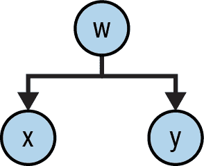
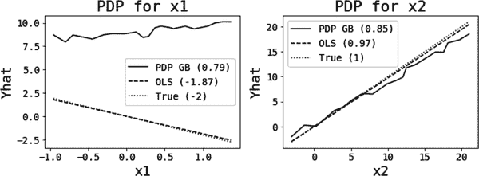
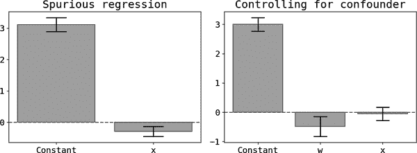
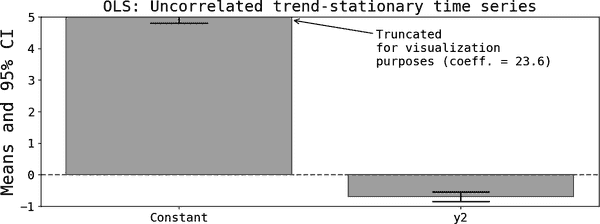
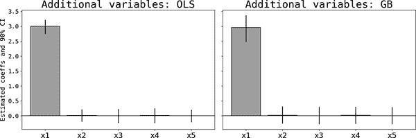
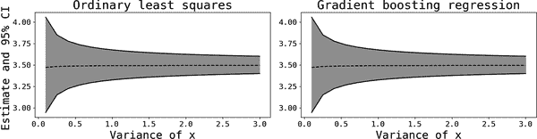
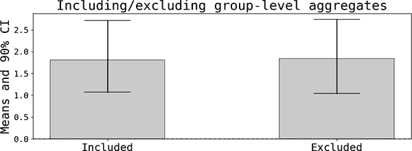

# 第十章：线性回归：回归基础

线性回归（OLS¹）是大多数数据科学家学习的第一个机器学习算法，但随着更强大的非线性替代方法（如梯度提升回归）的出现，它已经成为一种知识上的好奇心。因此，许多实践者不了解 OLS 的许多对于理解学习算法非常有帮助的属性。本章节介绍了其中一些重要属性，并强调了它们的重要性。

# 系数中包含了什么？

让我们从只有一个特征的最简单设置开始：

<math alttext="y equals alpha 0 plus alpha 1 x 1 plus epsilon" display="block"><mrow><mi>y</mi> <mo>=</mo> <msub><mi>α</mi> <mn>0</mn></msub> <mo>+</mo> <msub><mi>α</mi> <mn>1</mn></msub> <msub><mi>x</mi> <mn>1</mn></msub> <mo>+</mo> <mi>ϵ</mi></mrow></math>

第一个参数是*常数*或*截距*，第二个参数是*斜率*，正如您可能从线性方程的典型函数形式中记得的那样。

由于残差的均值为零，通过偏导数可以看出：

<math alttext="StartLayout 1st Row 1st Column alpha 1 2nd Column equals 3rd Column StartFraction partial-differential upper E left-parenthesis y right-parenthesis Over partial-differential x 1 EndFraction 2nd Row 1st Column alpha 0 2nd Column equals 3rd Column upper E left-parenthesis y right-parenthesis minus alpha 1 upper E left-parenthesis x 1 right-parenthesis EndLayout" display="block"><mtable displaystyle="true"><mtr><mtd columnalign="right"><msub><mi>α</mi> <mn>1</mn></msub></mtd> <mtd><mo>=</mo></mtd> <mtd columnalign="left"><mfrac><mrow><mi>∂</mi><mi>E</mi><mo>(</mo><mi>y</mi><mo>)</mo></mrow> <mrow><mi>∂</mi><msub><mi>x</mi> <mn>1</mn></msub></mrow></mfrac></mtd></mtr> <mtr><mtd columnalign="right"><msub><mi>α</mi> <mn>0</mn></msub></mtd> <mtd><mo>=</mo></mtd> <mtd columnalign="left"><mrow><mi>E</mi> <mrow><mo>(</mo> <mi>y</mi> <mo>)</mo></mrow> <mo>-</mo> <msub><mi>α</mi> <mn>1</mn></msub> <mi>E</mi> <mrow><mo>(</mo> <msub><mi>x</mi> <mn>1</mn></msub> <mo>)</mo></mrow></mrow></mtd></mtr></mtable></math>

正如在第九章中讨论的那样，第一个方程对于可解释性来说非常有用，因为它表明特征的单位变化与结果的单位变化，平均而言，相关联。然而，正如我将要展示的，您必须小心，不要给它一个*因果*解释。

通过将结果的定义代入协方差中，您还可以显示：

<math alttext="StartLayout 1st Row 1st Column alpha 1 2nd Column equals 3rd Column StartFraction upper C o v left-parenthesis y comma x 1 right-parenthesis Over upper V a r left-parenthesis x 1 right-parenthesis EndFraction EndLayout" display="block"><mtable displaystyle="true"><mtr><mtd columnalign="right"><msub><mi>α</mi> <mn>1</mn></msub></mtd> <mtd><mo>=</mo></mtd> <mtd columnalign="left"><mfrac><mrow><mi>C</mi><mi>o</mi><mi>v</mi><mo>(</mo><mi>y</mi><mo>,</mo><msub><mi>x</mi> <mn>1</mn></msub> <mo>)</mo></mrow> <mrow><mi>V</mi><mi>a</mi><mi>r</mi><mo>(</mo><msub><mi>x</mi> <mn>1</mn></msub> <mo>)</mo></mrow></mfrac></mtd></mtr></mtable></math>

在双变量设置中，斜率取决于结果和特征之间的协方差，以及特征的方差。由于相关性并非因果关系，您必须谨慎不要将这些*因果*解释为因果关系。非零协方差可能源自不同的因素：

直接因果关系

如您希望解释的那样（ <math alttext="x 1 right-arrow y"><mrow><msub><mi>x</mi> <mn>1</mn></msub> <mo>→</mo> <mi>y</mi></mrow></math>）。

逆因果关系

<math alttext="x 1 left-arrow y"><mrow><msub><mi>x</mi> <mn>1</mn></msub> <mo>←</mo> <mi>y</mi></mrow></math>，因为协方差在参数上是对称的。

混杂因素

混杂因素是任何第三个同时影响*x*和*y*的变量，但它们在其他方面无关（图 10-1）。



###### 图 10-1 混杂因素

###### 警告

线性回归的估计提供了关于特征和结果之间相关程度的信息，只能在非常特定的情况下*因果*解释（参见第十五章）。这个警告同样适用于其他机器学习算法，如梯度提升或随机森林。

对于多重回归，一个更一般的结果适用（即具有多个协变量的回归）：

<math alttext="StartLayout 1st Row 1st Column alpha Subscript k 2nd Column equals 3rd Column StartFraction upper C o v left-parenthesis y comma x overTilde Subscript k Baseline right-parenthesis Over upper V a r left-parenthesis x overTilde Subscript k Baseline right-parenthesis EndFraction EndLayout" display="block"><mtable displaystyle="true"><mtr><mtd columnalign="right"><msub><mi>α</mi> <mi>k</mi></msub></mtd> <mtd><mo>=</mo></mtd> <mtd columnalign="left"><mfrac><mrow><mi>C</mi><mi>o</mi><mi>v</mi><mo>(</mo><mi>y</mi><mo>,</mo><msub><mover accent="true"><mi>x</mi> <mo>˜</mo></mover> <mi>k</mi></msub> <mo>)</mo></mrow> <mrow><mi>V</mi><mi>a</mi><mi>r</mi><mo>(</mo><msub><mover accent="true"><mi>x</mi> <mo>˜</mo></mover> <mi>k</mi></msub> <mo>)</mo></mrow></mfrac></mtd></mtr></mtable></math>

其中<math alttext="x overTilde Subscript k"><msub><mover accent="true"><mi>x</mi> <mo>˜</mo></mover> <mi>k</mi></msub></math>是从在所有*其他*特征（*-k*）上运行回归的残差中获得的*k*特征的残差：

<math alttext="x overTilde Subscript k Baseline equals x Subscript k Baseline minus bold upper X Subscript negative bold k Baseline theta Subscript negative bold k" display="block"><mrow><msub><mover accent="true"><mi>x</mi> <mo>˜</mo></mover> <mi>k</mi></msub> <mo>=</mo> <msub><mi>x</mi> <mi>k</mi></msub> <mo>-</mo> <msub><mi>𝐗</mi> <mrow><mo>-</mo><mi>𝐤</mi></mrow></msub> <msub><mi>θ</mi> <mrow><mo>-</mo><mi>𝐤</mi></mrow></msub></mrow></math>

对于双变量线性模型，示例 10-1 中的片段显示，线性回归和简化协方差公式在数值上是一致的。

##### 示例 10-1\. 验证 OLS 和双变量协方差公式的一致性

```
def compute_alpha_1feat(ydf, xdf):
    """Compute alpha using var-cov formula and linear regression
 for the simple case of y = a + b x
 Inputs:
 ydf, xdf: dataframes with outcome and feature
 Outputs:
 Estimated coefficients from two methods: Cov() formula and
 linear regression
 """
    # Using covariance formula
    cat_mat = ydf.copy()
    cat_mat['x'] = xdf['x1']  # concatenate [y|x] so I can use the .cov() method
    vcv = cat_mat.cov()
    cov_xy = vcv['y'].loc['x']
    var_x  = vcv['x'].loc['x']
    beta_vcv = cov_xy/var_x
    # using linear regression
    reg = LinearRegression(fit_intercept=True).fit(xdf, ydf.values.flatten())
    beta_reg = reg.coef_[0]

    return beta_vcv, beta_reg

# compute and print
b_vcv, b_reg = compute_alpha_1feat(ydf=ydf, xdf=Xdf[['x1']])
decimals = 10
print(f'Alpha vcv formula = {b_vcv.round(decimals=decimals)}')
print(f'Alpha OLS = {b_reg.round(decimals=decimals)}')
```

```
Alpha vcv formula = 3.531180168,
Alpha OLS = 3.531180168
```

对于多个特征的情况，可以使用以下函数验证更一般的协方差公式是否与 OLS 一致。注意，我首先计算对所有其他特征进行回归后的残差：

```
def compute_alpha_n_feats(ydf, xdf, name_var):
    """
 Compute linear regression coefficients by:
 1\. Orthogonalization (Cov formula)
 2\. OLS
 Inputs:
 ydf, xdf: dataframes with outcome and features
 name_var: string: name of feature you want to compute
 Outputs:
 Coefficient for name_var using both methods

 """
    # Run regression of name_var on all other features and save residuals
    cols_exc_x = np.array(list(set(xdf.columns) - set([name_var])))
    new_x = xdf[cols_exc_x]
    new_y = xdf[name_var]
    reg_x = LinearRegression().fit(new_x, new_y.values.flatten())
    resids_x = new_y - reg_x.predict(new_x)
    # Pass residuals to Cov formula
    cat_mat = ydf.copy()
    cat_mat['x'] = resids_x
    vcv = cat_mat.cov()
    cov_xy = vcv['y'].loc['x']
    var_x  = vcv['x'].loc['x']
    beta_vcv = cov_xy/var_x
    # using linear regression
    reg = LinearRegression().fit(xdf, ydf.values.flatten())
    all_betas = reg.coef_
    ix_var = np.where(xdf.columns == name_var)
    beta_reg = all_betas[ix_var][0]

    return beta_vcv, beta_reg
```

更一般的协方差公式导致了一个重要结果，称为*弗里施-瓦夫-洛维尔定理*。

# 弗里施-瓦夫-洛维尔定理

弗里施-瓦夫-洛维尔定理（FWL）是一个有力的结果，帮助理解线性回归的内在工作原理。它基本上表明，您可以将 OLS 估计解释为*控制后*的效应，即除去任何特征之间的其他依赖效应。

假设您正在运行一个关于每位客户销售量对其支付价格和状态虚拟变量的回归。如果利益相关者询问您价格系数是否可以解释为不同州定价差异的影响，您可以使用 FWL 定理确切地说这些是*净效应*。价格效应已经从跨州定价的任何差异中清除（您已经*控制*了州间的差异）。

为了展示定理，我将再次使用更简单的两特征线性模型，但定理适用于任意数量的回归变量：

<math alttext="y equals alpha 0 plus alpha 1 x 1 plus alpha 2 x 2 plus epsilon" display="block"><mrow><mi>y</mi> <mo>=</mo> <msub><mi>α</mi> <mn>0</mn></msub> <mo>+</mo> <msub><mi>α</mi> <mn>1</mn></msub> <msub><mi>x</mi> <mn>1</mn></msub> <mo>+</mo> <msub><mi>α</mi> <mn>2</mn></msub> <msub><mi>x</mi> <mn>2</mn></msub> <mo>+</mo> <mi>ϵ</mi></mrow></math>

FWL 指出，您可以通过两步过程来估计特定系数，比如说<math alttext="alpha 1"><msub><mi>α</mi> <mn>1</mn></msub></math>：

1.  *对<math alttext="x 2"><msub><mi>x</mi> <mn>2</mn></msub></math>进行偏离*：

    1.  对<math alttext="y"><mi>y</mi></math>在<math alttext="x 2"><msub><mi>x</mi> <mn>2</mn></msub></math>上进行回归，并保存残差：<math alttext="y overTilde Subscript 1"><msub><mover accent="true"><mi>y</mi> <mo>˜</mo></mover> <mn>1</mn></msub></math> 。

    1.  对<math alttext="x 1"><msub><mi>x</mi> <mn>1</mn></msub></math>在<math alttext="x 2"><msub><mi>x</mi> <mn>2</mn></msub></math>上进行回归，并保存残差：<math alttext="x overTilde Subscript 1"><msub><mover accent="true"><mi>x</mi> <mo>˜</mo></mover> <mn>1</mn></msub></math>。

1.  *残差回归*：

    1.  对<math alttext="y overTilde Subscript 1"><msub><mover accent="true"><mi>y</mi> <mo>˜</mo></mover> <mn>1</mn></msub></math>在<math alttext="x overTilde Subscript 1"><msub><mover accent="true"><mi>x</mi> <mo>˜</mo></mover> <mn>1</mn></msub></math>上进行回归。斜率是<math alttext="alpha 1"><msub><mi>α</mi> <mn>1</mn></msub></math>的估计量。

偏离步骤去除了其他回归变量对结果和感兴趣特征的影响。第二步在这些残差上运行双变量回归。由于我们已经去除了*x*[2]的效应，因此只剩下感兴趣的效应。

示例 10-2 展示了我使用三个特征模拟线性模型的结果，并使用 FWL 的*partialling-out*方法和普通线性回归估计每个系数。我使用示例 10-2 中的代码片段进行比较。

##### 示例 10-2\. 检验 FWL 的有效性

```
def check_fw(ydf, xdf, var_name, version = 'residuals'):
    """
 Check the Frisch-Waugh theorem:
 Method 1: two-step regressions on partialled-out regressions
 Method 2: one-step regression
 Inputs:
 ydf, xdf: dataframes with Y and X respectively
 var_name: string: name of feature we want to apply the FW for
 version: string: ['residuals','direct'] can be used to test
 both covariance formulas presented in the chapter
 'residuals': Cov(tilde{y}, tilde{x})
 'direct': Cov(y, tilde{x})
 """
    # METHOD 1: two-step regressions
    nobs = ydf.shape[0]
    cols_exc_k = np.array(list(set(xdf.columns) - set([var_name])))
    x_k = xdf[cols_exc_k]
    # reg 1:
    reg_y = LinearRegression().fit(x_k, ydf.values.flatten())
    res_yk = ydf.values.flatten() - reg_y.predict(x_k)
    # reg 2:
    new_y = xdf[var_name]
    reg_x = LinearRegression().fit(x_k, new_y.values.flatten())
    res_xk = new_y.values.flatten() - reg_x.predict(x_k)
    res_xk = res_xk.reshape((nobs,1))
    # reg 3:
    if version=='residuals':
        reg_res = LinearRegression().fit(res_xk, res_yk)
    else:
        reg_res = LinearRegression().fit(res_xk, ydf.values.flatten())
    coef_fw = reg_res.coef_[0]
    # METHOD 2: OLS directly
    reg = LinearRegression().fit(xdf, ydf.values.flatten())
    coef_all = reg.coef_
    ix_var = np.where(xdf.columns == var_name)[0][0]
    coef_ols = coef_all[ix_var]

    return coef_fw, coef_ols

cols_to_include = set(Xdf.columns)-set(['x0'])
decimals= 5
print('Printing the results from OLS and FW two-step methods \nVersion = residuals')
for col in ['x1', 'x2', 'x3']:
    a, b = check_fw(ydf, xdf=Xdf[cols_to_include], var_name=col, version='residuals')
    print(f'{col}: FW two-steps = {a.round(decimals=decimals)},
       OLS = {b.round(decimals=decimals)}')
```

```
Printing the results from OLS and FW two-step methods
Version = residuals
x1: FW two-steps = 3.66436, OLS = 3.66436
x2: FW two-steps = -1.8564, OLS = -1.8564
x3: FW two-steps = 2.95345, OLS = 2.95345
```

回到先前提出的协方差公式，FWL 暗示着

<math alttext="StartLayout 1st Row 1st Column alpha Subscript k 2nd Column equals 3rd Column StartFraction upper C o v left-parenthesis y overTilde Subscript k Baseline comma x overTilde Subscript k Baseline right-parenthesis Over upper V a r left-parenthesis x overTilde Subscript k Baseline right-parenthesis EndFraction EndLayout" display="block"><mtable displaystyle="true"><mtr><mtd columnalign="right"><msub><mi>α</mi> <mi>k</mi></msub></mtd> <mtd><mo>=</mo></mtd> <mtd columnalign="left"><mfrac><mrow><mi>C</mi><mi>o</mi><mi>v</mi><mo>(</mo><msub><mover accent="true"><mi>y</mi> <mo>˜</mo></mover> <mi>k</mi></msub> <mo>,</mo><msub><mover accent="true"><mi>x</mi> <mo>˜</mo></mover> <mi>k</mi></msub> <mo>)</mo></mrow> <mrow><mi>V</mi><mi>a</mi><mi>r</mi><mo>(</mo><msub><mover accent="true"><mi>x</mi> <mo>˜</mo></mover> <mi>k</mi></msub> <mo>)</mo></mrow></mfrac></mtd></mtr></mtable></math>

其中，<math alttext="x overTilde Subscript k"><msub><mover accent="true"><mi>x</mi> <mo>˜</mo></mover> <mi>k</mi></msub></math>表示特征*k*在所有其他特征上回归后的残差，而<math alttext="y overTilde Subscript k"><msub><mover accent="true"><mi>y</mi> <mo>˜</mo></mover> <mi>k</mi></msub></math>表示因变量在相同特征集上的回归残差。Python 脚本允许您测试通用协方差公式的两个版本是否给出相同结果（使用`version`参数）。

OLS 的一个重要特性是估计残差与回归变量（或回归变量的任何函数）正交，这个过程也被称为*正交化*。您可以利用这个事实来表明两个协方差公式是等价的。

重要的是，正交化*总是*必须在感兴趣的特征上进行。如果只对因变量*y*进行正交化，那么协方差公式将不再有效，*除非*特征已经相互正交，因此一般而言：

<math alttext="StartLayout 1st Row 1st Column alpha Subscript k 2nd Column not-equals 3rd Column StartFraction upper C o v left-parenthesis y overTilde Subscript k Baseline comma x Subscript k Baseline right-parenthesis Over upper V a r left-parenthesis x Subscript k Baseline right-parenthesis EndFraction EndLayout" display="block"><mtable displaystyle="true"><mtr><mtd columnalign="right"><msub><mi>α</mi> <mi>k</mi></msub></mtd> <mtd><mo>≠</mo></mtd> <mtd columnalign="left"><mfrac><mrow><mi>C</mi><mi>o</mi><mi>v</mi><mo>(</mo><msub><mover accent="true"><mi>y</mi> <mo>˜</mo></mover> <mi>k</mi></msub> <mo>,</mo><msub><mi>x</mi> <mi>k</mi></msub> <mo>)</mo></mrow> <mrow><mi>V</mi><mi>a</mi><mi>r</mi><mo>(</mo><msub><mi>x</mi> <mi>k</mi></msub> <mo>)</mo></mrow></mfrac></mtd></mtr></mtable></math>

# 为什么您应该关心 FWL？

我已经呈现了几个正交化结果的版本，所以您应该期望它是相关的。主要的要点是：

> 您可以将线性回归中的每个系数解释为在清理掉其他任何特征的影响之后的每个特征的净效应。

这里是一个典型的情景，解释起来非常重要：

<math alttext="StartLayout 1st Row 1st Column x 1 2nd Column tilde 3rd Column upper N left-parenthesis 0 comma sigma 1 squared right-parenthesis 2nd Row 1st Column x 2 2nd Column equals 3rd Column beta 0 plus beta 1 x 1 plus epsilon 3rd Row 1st Column y 2nd Column equals 3rd Column alpha 0 plus alpha 1 x 1 plus alpha 2 x 2 plus eta EndLayout" display="block"><mtable displaystyle="true"><mtr><mtd columnalign="right"><msub><mi>x</mi> <mn>1</mn></msub></mtd> <mtd><mo>∼</mo></mtd> <mtd columnalign="left"><mrow><mi>N</mi> <mo>(</mo> <mn>0</mn> <mo>,</mo> <msubsup><mi>σ</mi> <mn>1</mn> <mn>2</mn></msubsup> <mo>)</mo></mrow></mtd></mtr> <mtr><mtd columnalign="right"><msub><mi>x</mi> <mn>2</mn></msub></mtd> <mtd><mo>=</mo></mtd> <mtd columnalign="left"><mrow><msub><mi>β</mi> <mn>0</mn></msub> <mo>+</mo> <msub><mi>β</mi> <mn>1</mn></msub> <msub><mi>x</mi> <mn>1</mn></msub> <mo>+</mo> <mi>ϵ</mi></mrow></mtd></mtr> <mtr><mtd columnalign="right"><mi>y</mi></mtd> <mtd><mo>=</mo></mtd> <mtd columnalign="left"><mrow><msub><mi>α</mi> <mn>0</mn></msub> <mo>+</mo> <msub><mi>α</mi> <mn>1</mn></msub> <msub><mi>x</mi> <mn>1</mn></msub> <mo>+</mo> <msub><mi>α</mi> <mn>2</mn></msub> <msub><mi>x</mi> <mn>2</mn></msub> <mo>+</mo> <mi>η</mi></mrow></mtd></mtr></mtable></math>

在这种情况下，<math alttext="x 1"><msub><mi>x</mi> <mn>1</mn></msub></math>对结果*y*有直接和间接效应。一个例子可能是您的州或地理虚拟变量。这些往往具有直接和间接效应。当您解释<math alttext="x 2"><msub><mi>x</mi> <mn>2</mn></msub></math>的系数时，如果您可以说这是在已经*控制*了该变量的情况下的*净*效应，那将非常有帮助。

图 10-2 展示了前述数据生成过程的真实参数、OLS 估计和梯度提升回归（GBR）的部分依赖图（PDP）的模拟结果。由于 FWL，您知道 OLS 将正确捕捉净效应。GBR 在<math alttext="x 2"><msub><mi>x</mi> <mn>2</mn></msub></math>方面做得很好，但在<math alttext="x 1"><msub><mi>x</mi> <mn>1</mn></msub></math>方面则不佳。

要理解正在发生的事情，回想一下如何计算 PDP：将一个特征固定在样本均值，为你关心的特征创建一个网格，并进行预测。当你固定 <math alttext="x 2"><msub><mi>x</mi> <mn>2</mn></msub></math> 时，<math alttext="x 1"><msub><mi>x</mi> <mn>1</mn></msub></math> 显示出直接和间接效应的组合，算法不知道如何分离它们。这只是加强了 OLS 在可解释性方面的优势，但需要相当大的努力才能达到即使相对于非线性模型也能很容易得到的性能。



###### 图 10-2\. OLS 和具有直接和间接效应的梯度提升

# 混杂因素

现在我已经描述了 FWL 定理，我想回到混杂因素的问题（Figure 10-1）。假设一个混杂因素（ <math alttext="w"><mi>w</mi></math> ）影响了两个本来不相关的变量：

<math alttext="StartLayout 1st Row 1st Column x 2nd Column equals 3rd Column alpha Subscript x Baseline plus beta Subscript x Baseline w plus epsilon Subscript x 2nd Row 1st Column y 2nd Column equals 3rd Column alpha Subscript y Baseline plus beta Subscript y Baseline w plus epsilon Subscript y 3rd Row 1st Column epsilon Subscript x 2nd Column up-tack up-tack 3rd Column epsilon Subscript y 4th Row 1st Column epsilon Subscript x Baseline comma epsilon Subscript y Baseline 2nd Column up-tack up-tack 3rd Column w EndLayout" display="block"><mtable displaystyle="true"><mtr><mtd columnalign="right"><mi>x</mi></mtd> <mtd><mo>=</mo></mtd> <mtd columnalign="left"><mrow><msub><mi>α</mi> <mi>x</mi></msub> <mo>+</mo> <msub><mi>β</mi> <mi>x</mi></msub> <mi>w</mi> <mo>+</mo> <msub><mi>ϵ</mi> <mi>x</mi></msub></mrow></mtd></mtr> <mtr><mtd columnalign="right"><mi>y</mi></mtd> <mtd><mo>=</mo></mtd> <mtd columnalign="left"><mrow><msub><mi>α</mi> <mi>y</mi></msub> <mo>+</mo> <msub><mi>β</mi> <mi>y</mi></msub> <mi>w</mi> <mo>+</mo> <msub><mi>ϵ</mi> <mi>y</mi></msub></mrow></mtd></mtr> <mtr><mtd columnalign="right"><msub><mi>ϵ</mi> <mi>x</mi></msub></mtd> <mtd><mrow><mo>⊥</mo> <mo>⊥</mo></mrow></mtd> <mtd columnalign="left"><msub><mi>ϵ</mi> <mi>y</mi></msub></mtd></mtr> <mtr><mtd columnalign="right"><mrow><msub><mi>ϵ</mi> <mi>x</mi></msub> <mo>,</mo> <msub><mi>ϵ</mi> <mi>y</mi></msub></mrow></mtd> <mtd><mrow><mo>⊥</mo> <mo>⊥</mo></mrow></mtd> <mtd columnalign="left"><mi>w</mi></mtd></mtr></mtable></math>

其中符号 <math alttext="up-tack up-tack"><mrow><mo>⊥</mo> <mo>⊥</mo></mrow></math> 表示统计独立性。使用回归中*y*对*x*的斜率系数的协方差公式，就可以明显看出为什么 OLS 显示出虚假结果：

<math alttext="StartFraction upper C o v left-parenthesis y comma x right-parenthesis Over upper V a r left-parenthesis x right-parenthesis EndFraction equals StartFraction beta Subscript x Baseline beta Subscript y Baseline upper V a r left-parenthesis w right-parenthesis Over beta Subscript x Superscript 2 Baseline upper V a r left-parenthesis w right-parenthesis plus upper V a r left-parenthesis epsilon Subscript x Baseline right-parenthesis EndFraction" display="block"><mrow><mfrac><mrow><mi>C</mi><mi>o</mi><mi>v</mi><mo>(</mo><mi>y</mi><mo>,</mo><mi>x</mi><mo>)</mo></mrow> <mrow><mi>V</mi><mi>a</mi><mi>r</mi><mo>(</mo><mi>x</mi><mo>)</mo></mrow></mfrac> <mo>=</mo> <mfrac><mrow><msub><mi>β</mi> <mi>x</mi></msub> <msub><mi>β</mi> <mi>y</mi></msub> <mi>V</mi><mi>a</mi><mi>r</mi><mrow><mo>(</mo><mi>w</mi><mo>)</mo></mrow></mrow> <mrow><msubsup><mi>β</mi> <mi>x</mi> <mn>2</mn></msubsup> <mi>V</mi><mi>a</mi><mi>r</mi><mrow><mo>(</mo><mi>w</mi><mo>)</mo></mrow><mo>+</mo><mi>V</mi><mi>a</mi><mi>r</mi><mrow><mo>(</mo><msub><mi>ϵ</mi> <mi>x</mi></msub> <mo>)</mo></mrow></mrow></mfrac></mrow></math>

如果你先*清理*掉那个共同因素呢？这正是 FWL 告诉你线性回归所做的事情，所以你可以安全地运行以下形式的回归：

<math alttext="y equals alpha 0 plus alpha 1 x 1 plus alpha 2 w plus epsilon" display="block"><mrow><mi>y</mi> <mo>=</mo> <msub><mi>α</mi> <mn>0</mn></msub> <mo>+</mo> <msub><mi>α</mi> <mn>1</mn></msub> <msub><mi>x</mi> <mn>1</mn></msub> <mo>+</mo> <msub><mi>α</mi> <mn>2</mn></msub> <mi>w</mi> <mo>+</mo> <mi>ϵ</mi></mrow></math>

通过同时包括共同因素*w*，OLS 将有效地将其效果分离出来。Figure 10-3 展示了估计的双变量和虚假回归结果（左图）以及当你像前述方程式中一样包括第三个因素时的分离版本（右图）。我还包括了 95%置信区间。

如果不控制混杂因素，你会得出*x*和*y*确实相关的结论（置信区间远离零），但一旦你控制*w*，这就成为唯一相关的（统计显著）因素。



###### 图 10-3\. FW 和混杂因素的控制（估计值和 95% CI）

这个结果在许多应用中非常有用。例如，在时间序列分析中，拥有[*趋势稳定*](https://oreil.ly/ewcVV) 的变量经常可以这样建模：

<math alttext="StartLayout 1st Row  y Subscript 1 t Baseline equals alpha 1 plus beta 1 t plus epsilon Subscript 1 t Baseline 2nd Row  y Subscript 2 t Baseline equals alpha 2 plus beta 2 t plus epsilon Subscript 2 t EndLayout" display="block"><mtable displaystyle="true"><mtr><mtd columnalign="right"><mrow><msub><mi>y</mi> <mrow><mn>1</mn><mi>t</mi></mrow></msub> <mo>=</mo> <msub><mi>α</mi> <mn>1</mn></msub> <mo>+</mo> <msub><mi>β</mi> <mn>1</mn></msub> <mi>t</mi> <mo>+</mo> <msub><mi>ϵ</mi> <mrow><mn>1</mn><mi>t</mi></mrow></msub></mrow></mtd></mtr> <mtr><mtd columnalign="right"><mrow><msub><mi>y</mi> <mrow><mn>2</mn><mi>t</mi></mrow></msub> <mo>=</mo> <msub><mi>α</mi> <mn>2</mn></msub> <mo>+</mo> <msub><mi>β</mi> <mn>2</mn></msub> <mi>t</mi> <mo>+</mo> <msub><mi>ϵ</mi> <mrow><mn>2</mn><mi>t</mi></mrow></msub></mrow></mtd></mtr></mtable></math>

多亏了 FWL，你已经知道为什么这些被称为*趋势稳定*：一旦你控制了时间趋势（*t*以上），从而清理了它们的这种影响，你就得到了一个稳定的时间序列。²

假设你对一个变量进行回归：

<math alttext="y Subscript 2 t Baseline equals theta 0 plus theta 1 y Subscript 1 t Baseline plus zeta Subscript t" display="block"><mrow><msub><mi>y</mi> <mrow><mn>2</mn><mi>t</mi></mrow></msub> <mo>=</mo> <msub><mi>θ</mi> <mn>0</mn></msub> <mo>+</mo> <msub><mi>θ</mi> <mn>1</mn></msub> <msub><mi>y</mi> <mrow><mn>1</mn><mi>t</mi></mrow></msub> <mo>+</mo> <msub><mi>ζ</mi> <mi>t</mi></msub></mrow></math>

由于你没有控制共同趋势，你最终会错误地得出它们相关的结论。Figure 10-4 展示了两个趋势稳定的 AR(1)过程的模拟回归结果，设计上它们是无关的。³ 图显示了第二个变量（*y2*）的估计截距（*常数*）和斜率，以及 95%置信区间。



###### 图 10-4\. OLS 在虚假时间序列回归上的表现

###### 提示

时间序列常常出现与时间相关的虚假相关性，因为它们通常显示时间趋势。由于它可能作为混杂因素，建议始终包括线性时间趋势作为控制变量。这样你可以*清除*由此潜在混杂因素引起的任何噪音。

# 额外变量

第九章 描述了*遗漏变量偏差*，表明*排除*本应包含的变量会导致 OLS 估计偏差，从而降低预测性能；这一点同样适用于其他机器学习（ML）算法。

如果不是省略重要变量而是包含额外无关特征会发生什么？OLS 的一个优点是包含无信息特征不会引入偏差，只会影响估计的方差。Figure 10-5 报告了从蒙特卡洛模拟中估计的每个参数的均值和 90%置信区间，其中：

+   只有一个特征是有信息的（ <math alttext="x 1"><msub><mi>x</mi> <mn>1</mn></msub></math> ，其真实系数 <math alttext="alpha 1 equals 3"><mrow><msub><mi>α</mi> <mn>1</mn></msub> <mo>=</mo> <mn>3</mn></mrow></math> ）。

+   当模型训练时包括了四个更多的无信息控制。

+   训练了两个模型：OLS 和开箱即用的梯度提升回归。

两种算法在两个方面表现正确：它们能够正确估计真实参数，并排除无信息变量。



###### 图 10-5\. 包含无信息控制的影响

然而，对于集成学习算法，你必须小心，因为它们在包含高度相关于真实潜在变量的无信息特征时通常非常敏感。你通常可以通过*虚拟变量陷阱*来看到这一点。这种典型的情况出现在像下面这样有虚拟变量的模型中：

<math alttext="StartLayout 1st Row 1st Column y 2nd Column equals 3rd Column alpha 0 plus alpha 1 x plus alpha 2 upper D Subscript l plus epsilon 2nd Row 1st Column upper D Subscript l 2nd Column equals 3rd Column StartLayout Enlarged left-brace 1st Row 1st Column 1 2nd Column if 3rd Column customer is left hyphen handed 2nd Row 1st Column 0 2nd Column if 3rd Column customer is right hyphen handed EndLayout EndLayout" display="block"><mtable displaystyle="true"><mtr><mtd columnalign="right"><mi>y</mi></mtd> <mtd><mo>=</mo></mtd> <mtd columnalign="left"><mrow><msub><mi>α</mi> <mn>0</mn></msub> <mo>+</mo> <msub><mi>α</mi> <mn>1</mn></msub> <mi>x</mi> <mo>+</mo> <msub><mi>α</mi> <mn>2</mn></msub> <msub><mi>D</mi> <mi>l</mi></msub> <mo>+</mo> <mi>ϵ</mi></mrow></mtd></mtr> <mtr><mtd columnalign="right"><msub><mi>D</mi> <mi>l</mi></msub></mtd> <mtd><mo>=</mo></mtd> <mtd columnalign="left"><mfenced close="" open="{" separators=""><mtable><mtr><mtd columnalign="left"><mn>1</mn></mtd> <mtd columnalign="left"><mtext>if</mtext></mtd> <mtd><mrow><mtext>customer</mtext> <mtext>is</mtext> <mtext>left-handed</mtext></mrow></mtd></mtr> <mtr><mtd columnalign="left"><mn>0</mn></mtd> <mtd columnalign="left"><mtext>if</mtext></mtd> <mtd><mrow><mtext>customer</mtext> <mtext>is</mtext> <mtext>right-handed</mtext></mrow></mtd></mtr></mtable></mfenced></mtd></mtr></mtable></math>

在 OLS 中，当你包括一个截距 *和* 所有可用类别的虚拟变量时，就会出现虚拟变量陷阱。在这个例子中，你只能为左右利手中的 *一个* 虚拟变量进行包含，而不能同时包含两者，因为交叉乘积矩阵 <math alttext="upper X prime upper X"><mrow><mi>X</mi> <mi>â</mi> <mi>€</mi> <mi>™</mi> <mi>X</mi></mrow></math> 是不可逆的（因此 OLS 估计不存在）。⁴ 解决方法是始终省略参考类别的虚拟变量，例如在本例中是右利手类别。

与随机森林或梯度提升回归等集成算法不同，这种计算限制不存在，但由于像*D[l]*和*D[r]* = 1 − *D[l]*这样的虚拟变量完全相关，很正常会发现它们在特征重要性方面排名都很高。因为它们提供*完全相同的信息*，所以通过包括两者来提升算法的性能是无效的。这是一条有用的直观事实，通过理解 OLS 方法自然产生。

# 机器学习中方差的中心作用

机器学习中的一个核心原则是，你需要在特征和结果中有变化，这样你的算法才能*识别*参数，或者换句话说，学习相关性。你可以直接在开头呈现的协方差公式中看到这一点：如果*x*或*y*是常数，协方差就为零，因此 OLS 无法学习参数。此外，如果*x*是常数，分母为零，因此参数不存在，这与虚拟变量陷阱密切相关的结果。

###### 提示

如果你想解释输出的变化，你需要输入中的变化。这对任何机器学习算法都是真实的。

你可能记得在 OLS 中，系数和协方差矩阵的估计值为：

<math alttext="StartLayout 1st Row 1st Column ModifyingAbove beta With bold caret 2nd Column equals 3rd Column left-parenthesis upper X prime upper X right-parenthesis Superscript negative 1 Baseline upper X prime upper Y 2nd Row 1st Column Var left-parenthesis ModifyingAbove beta With bold caret bold right-parenthesis 2nd Column equals 3rd Column s squared left-parenthesis upper X prime upper X right-parenthesis Superscript negative 1 EndLayout" display="block"><mtable displaystyle="true"><mtr><mtd columnalign="right"><mover accent="true"><mi>β</mi> <mo>^</mo></mover></mtd> <mtd><mo>=</mo></mtd> <mtd columnalign="left"><mrow><msup><mrow><mo>(</mo><mi>X</mi><mi>â</mi><mi>€</mi><mi>™</mi><mi>X</mi><mo>)</mo></mrow> <mrow><mo>-</mo><mn>1</mn></mrow></msup> <mi>X</mi> <mi>â</mi> <mi>€</mi> <mi>™</mi> <mi>Y</mi></mrow></mtd></mtr> <mtr><mtd columnalign="right"><mrow><mtext>Var</mtext> <mo>(</mo> <mover accent="true"><mi>β</mi> <mo>^</mo></mover> <mo>)</mo></mrow></mtd> <mtd><mo>=</mo></mtd> <mtd columnalign="left"><mrow><msup><mi>s</mi> <mn>2</mn></msup> <msup><mrow><mo>(</mo><mi>X</mi><mi>â</mi><mi>€</mi><mi>™</mi><mi>X</mi><mo>)</mo></mrow> <mrow><mo>-</mo><mn>1</mn></mrow></msup></mrow></mtd></mtr></mtable></math>

其中<math alttext="s squared"><msup><mi>s</mi> <mn>2</mn></msup></math>是残差方差的样本估计，<math alttext="upper X Subscript upper N times upper P"><msub><mi>X</mi> <mrow><mi>N</mi><mo>×</mo><mi>P</mi></mrow></msub></math>是包括对应于截距的一向量的特征矩阵。

从这些方程中可以得出两个结果：

识别条件

特征之间不能有完全相关（完全多重共线性），以使交叉乘积矩阵<math alttext="left-parenthesis upper X prime upper X right-parenthesis"><mrow><mo>(</mo> <mi>X</mi> <mi>â</mi> <mi>€</mi> <mi>™</mi> <mi>X</mi> <mo>)</mo></mrow></math>是正定（满秩或可逆）。

估计的方差

特征相关性越高，估计的方差越大。

虽然第一部分应该很简单，但第二部分需要进行一些数学处理，以展示多元回归的一般情况。在这一章节的[repo](https://oreil.ly/dshp-repo)中，我包含了一个模拟，验证了在多元回归情况下这个条件。对于简单的双变量回归，很容易展示估计的方差与特征的样本方差呈*负相关*，因此具有更多变化的协变量提供更多信息，从而提高估计的精度。⁵

图 10-6 展示了模拟双变量线性 DGP 后 OLS 和梯度提升回归估计的平均值和 95%置信区间，其中 Var(*x*[1])在一个网格上增加。正如讨论的那样，对于 OLS 来说，估计的方差随着协变量显示更多变化而*减少*。值得注意的是，对于 GBR 也是如此。



###### 图 10-6\. OLS 和 GBR 估计的方差

这个原理在数据科学家中并不罕见的实践中发挥作用。想象一下，您正在运行以下回归：

<math alttext="StartLayout 1st Row 1st Column y Subscript i 2nd Column equals 3rd Column alpha plus sigma-summation Underscript s Endscripts theta Subscript s Baseline upper D Subscript i s plus gamma z overbar Subscript s left-parenthesis i right-parenthesis plus epsilon Subscript i 2nd Row 1st Column upper D Subscript i s 2nd Column equals 3rd Column StartLayout Enlarged left-brace 1st Row 1st Column 1 2nd Column if 3rd Column customer i lives in state s 2nd Row 1st Column 0 2nd Column Blank 3rd Column otherwise EndLayout 3rd Row 1st Column z overbar Subscript s left-parenthesis i right-parenthesis 2nd Column equals 3rd Column state sample average of z given the state where i lives EndLayout" display="block"><mtable displaystyle="true"><mtr><mtd columnalign="right"><msub><mi>y</mi> <mi>i</mi></msub></mtd> <mtd><mo>=</mo></mtd> <mtd columnalign="left"><mrow><mi>α</mi> <mo>+</mo> <munder><mo>∑</mo> <mi>s</mi></munder> <msub><mi>θ</mi> <mi>s</mi></msub> <msub><mi>D</mi> <mrow><mi>i</mi><mi>s</mi></mrow></msub> <mo>+</mo> <mi>γ</mi> <msub><mover><mi>z</mi> <mo>¯</mo></mover> <mrow><mi>s</mi><mo>(</mo><mi>i</mi><mo>)</mo></mrow></msub> <mo>+</mo> <msub><mi>ϵ</mi> <mi>i</mi></msub></mrow></mtd></mtr> <mtr><mtd columnalign="right"><msub><mi>D</mi> <mrow><mi>i</mi><mi>s</mi></mrow></msub></mtd> <mtd><mo>=</mo></mtd> <mtd columnalign="left"><mfenced close="" open="{" separators=""><mtable><mtr><mtd columnalign="left"><mn>1</mn></mtd> <mtd columnalign="left"><mtext>if</mtext></mtd> <mtd><mrow><mtext>customer</mtext> <mi>i</mi> <mtext>lives</mtext> <mtext>in</mtext> <mtext>state</mtext> <mi>s</mi></mrow></mtd></mtr> <mtr><mtd columnalign="left"><mn>0</mn></mtd> <mtd><mtext>otherwise</mtext></mtd></mtr></mtable></mfenced></mtd></mtr> <mtr><mtd columnalign="right"><msub><mover><mi>z</mi> <mo>¯</mo></mover> <mrow><mi>s</mi><mo>(</mo><mi>i</mi><mo>)</mo></mrow></msub></mtd> <mtd><mo>=</mo></mtd> <mtd columnalign="left"><mrow><mtext>state</mtext> <mtext>sample</mtext> <mtext>average</mtext> <mtext>of</mtext> <mi>z</mi> <mtext>given</mtext> <mtext>the</mtext> <mtext>state</mtext> <mtext>where</mtext> <mi>i</mi> <mtext>lives</mtext></mrow></mtd></mtr></mtable></math>

如果*y*表示每位顾客的销售额，*z*表示家庭收入，该模型表明销售额在各州（虚拟变量）之间变化，并且富裕的州也有独立的效应，富裕州购买更多（用每个州的平均家庭收入来代表）。

虽然您的直觉可能是正确的，但由于存在完全多重共线性，您无法用 OLS 训练这个模型。换句话说，州虚拟变量和任何您能想到的州平均值*提供相同的信息*。对于任何机器学习算法都是如此！

为了验证这一点，我使用刚才讨论的数据生成过程模拟了一个简单的模型，其中包括三个州（因此，为避免虚拟变量陷阱，有两个虚拟变量），这些州从多项分布中抽取（代码可以在[repo](https://oreil.ly/dshp-repo)中找到）。示例 10-3 表明特征矩阵确实是低秩的，意味着存在完全多重共线性。

##### 示例 10-3\. 状态虚拟变量：删除状态平均值的影响

```
# Show that X is not full column rank (and thus, won't be invertible)
print(f'Columns of X = {Xdf.columns.values}')
rank_x = LA.matrix_rank(Xdf)
nvars = Xdf.shape[1]
print(f'X: Rank = {rank_x}, total columns = {nvars}')
# what happens if we drop the means?
X_nm = Xdf[[col for col in Xdf.columns if col != 'mean_z']]
rank_xnm = LA.matrix_rank(X_nm)
nvars_nm = X_nm.shape[1]
print(f'X_[-meanz]: Rank = {rank_xnm}, total columns = {nvars_nm}')
```

```
Columns of X = ['x0' 'x1' 'D1' 'D2' 'mean_z']
X: Rank = 4, total columns = 5
X_[-meanz]: Rank = 4, total columns = 4
```

为了验证更一般非线性算法也具有同样的观点，我对这个同样的模型进行了蒙特卡罗（MC）模拟，用梯度提升回归（没有元参数优化）进行训练，并计算了测试样本的均方误差（MSE），使用完整特征集和去掉多余均值特征后的情况。图 10-7 展示了 MSE 的平均值和 90%置信区间。您可以验证预测性能几乎相同，这是您期望的，因为额外变量未提供额外信息。



###### 图 10-7\. 梯度提升 MC 模拟结果

# 要点

这些是本章的要点：

为什么学习线性回归？

理解线性回归应该帮助您建立一些重要的直觉，这些直觉更普遍适用于其他非线性算法，如随机森林或提升技术。

相关性不等于因果关系。

通常，机器学习算法只提供关于特征与结果相关性的信息。线性回归结果明确，因此在思考其他学习算法时，这应作为您的基准。

Frisch-Waugh-Lovell 定理。

这是线性回归中的一个重要结果，指出估计量可以被解释为在控制剩余协变量之后的净效应。

FWL 和混杂因素。

由于 FWL，你可以通过将其包含在特征集中来控制混杂因素。一个常见的例子是在时间序列分析中，总是良好的做法是控制确定性趋势。这可以防止当结果和特征显示某些趋势时产生虚假结果。

无关变量。

在线性回归中，包含无信息的控制变量是安全的。如果这些变量与信息性特征足够相关，集成学习算法可能对无关变量敏感。你不会偏置你的估计，但这可能导致你得出某个变量具有预测能力的结论，而实际上并非如此。

虚拟变量陷阱。

在线性回归中，始终包括一个截距或常数项是一个良好的实践。如果你包括虚拟变量，必须始终排除一个类别作为参考或基准。例如，如果你包括一个女性虚拟变量，则男性类别作为解释目的的参考。

集成学习中的虚拟变量陷阱。

没有任何规定阻止你为随机森林或梯度提升机中的所有类别包括虚拟变量。但你也不会从中获得*任何*好处：这些变量提供的信息并不能提高模型的预测性能。

方差对机器学习至关重要。

如果你的特征缺乏足够的方差，你的算法将无法学习到底层数据生成过程。这对于线性回归和一般的机器学习算法都是适用的。

# 进一步阅读

线性回归在大多数统计学、机器学习和计量经济学教科书中都有涉及。Trevor Hastie 等人的《统计学习的要素：数据挖掘、推断与预测》第二版（Springer）中的处理非常出色。它讨论了*逐步正交化回归*，这与 FWL 定理密切相关。

Joshua Angrist 和 Jörn-Steffen Pischke 的《大多数无害的计量经济学：经验主义者的伴侣》第三章（普林斯顿大学出版社）提供了关于线性回归基础的深入讨论，以及该章节中所呈现的协方差公式的推导。如果你想加强对回归的直觉，这本书非常适合。

大多数计量经济学教科书都涵盖了 FWL 定理。你可以查阅 William Greene 的《计量经济分析》第八版（Pearson）。

¹ OLS 指的是普通最小二乘法，这是用于训练线性回归的标准方法。为方便起见，我把它们视为等效的，但请记住还有其他可以使用的损失函数。

² 在高层次上，时间序列在其概率分布随时间不变时是*平稳*的。弱平稳性仅涉及前两个时刻，而强平稳性要求联合分布恒定。趋势变量的均值变化，因此它不能是平稳的（除非是*趋势平稳*）。

³ *AR(1)* 表示一阶自回归过程。

⁴ 请记住，OLS 估计量是 <math alttext="left-parenthesis upper X prime upper X right-parenthesis Superscript negative 1 Baseline upper X prime upper Y"><mrow><msup><mrow><mo>(</mo><mi>X</mi><mo>'</mo><mi>X</mi><mo>)</mo></mrow><mrow><mo>-1</mo></mrow></msup><mi>X</mi><mo>'</mo><mi>Y</mi></mrow></math> 。

⁵ 在双变量设置中，<math alttext="Var left-parenthesis beta 1 right-parenthesis equals Var left-parenthesis r e s i d u a l right-parenthesis slash Var left-parenthesis x right-parenthesis"><mrow><mtext>Var</mtext> <mrow><mo>(</mo> <msub><mi>β</mi> <mn>1</mn></msub> <mo>)</mo></mrow> <mo>=</mo> <mtext>Var</mtext> <mrow><mo>(</mo> <mi>r</mi> <mi>e</mi> <mi>s</mi> <mi>i</mi> <mi>d</mi> <mi>u</mi> <mi>a</mi> <mi>l</mi> <mo>)</mo></mrow> <mo>/</mo> <mtext>Var</mtext> <mrow><mo>(</mo> <mi>x</mi> <mo>)</mo></mrow></mrow></math> 。
