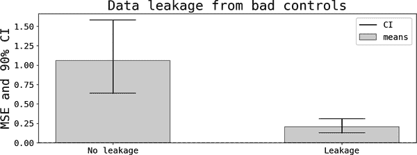
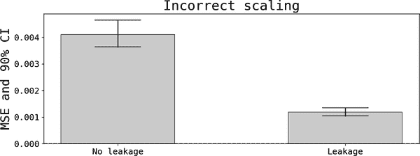
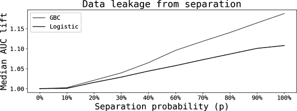
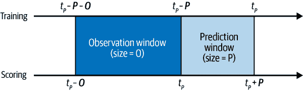

# 第十一章：数据泄露

在《数据挖掘中的泄漏：公式化、检测和避免》一书中，沙哈尔·考夫曼等人（2012）将数据泄露识别为数据科学中十大常见问题之一。根据我的经验，它应该排名更高：如果你已经训练了足够多的现实生活模型，那么你几乎不可能没有遇到它。

本章专注于讨论数据泄露，一些症状以及可采取的措施。

# 什么是数据泄露？

正如名称所示，*数据泄露*发生在你用于训练模型的一些数据在你将模型部署到生产环境时不可用，从而导致后者阶段的预测性能不佳。这通常发生在你训练一个模型时：

+   使用在预测阶段不可用的数据或元数据

+   与你想要预测的结果相关

+   这会造成*过高*的测试样本预测性能

最后一条说明了为什么数据泄露对数据科学家是一种担忧和沮丧的源头：当你训练一个模型时，在没有数据和模型漂移的情况下，你期望测试样本上的预测性能能够在你将模型投入生产后外推到真实世界。如果存在数据泄露，情况就不会如此，你（以及你的利益相关者和公司）将遭受重大失望。

让我们通过几个例子来澄清这个定义。

## 结果也是一个特征

这是一个简单的例子，但有助于作为更现实例子的基准。如果你像这样训练一个模型：

<math alttext="y equals f left-parenthesis y right-parenthesis" display="block"><mrow><mi>y</mi> <mo>=</mo> <mi>f</mi> <mo>(</mo> <mi>y</mi> <mo>)</mo></mrow></math>

在训练阶段，你会得到完美的性能，但不用说，当你的模型部署到生产环境时，你将无法进行预测（因为结果在预测时是不可用的）。

## 结果本身就是一个特征

更为现实的例子是，当一个特征是结果的函数时。假设你想要预测下个月的收入，并且使用在第二章描述的上 P 乘以上 Q 分解包括单位价格（<math alttext="Revenue slash Sales"><mrow><mtext>Revenue</mtext> <mo>/</mo> <mtext>Sales</mtext></mrow></math>）作为一个特征。许多时候，单位价格的计算是在上游完成的，因此你最终只是使用一个包含价格的表，而不真正了解它们是如何计算的。

## 不良控制

如第十章所述，最好包括一些你认为有助于控制变异源的特征，即使你对底层因果机制没有强烈的假设。一般来说，这是正确的，除非你包括*不良控制*，这些控制本身受特征影响。

以这些数据生成过程（DGPs）为例：

<math alttext="StartLayout 1st Row 1st Column y Subscript t 2nd Column equals 3rd Column f left-parenthesis bold x Subscript t minus 1 Baseline right-parenthesis plus epsilon Subscript t 2nd Row 1st Column z Subscript t 2nd Column equals 3rd Column g left-parenthesis y Subscript t Baseline right-parenthesis plus zeta Subscript t EndLayout" display="block"><mtable displaystyle="true"><mtr><mtd columnalign="right"><msub><mi>y</mi> <mi>t</mi></msub></mtd> <mtd><mo>=</mo></mtd> <mtd columnalign="left"><mrow><mi>f</mi> <mrow><mo>(</mo> <msub><mi>𝐱</mi> <mrow><mi>t</mi><mo>-</mo><mn>1</mn></mrow></msub> <mo>)</mo></mrow> <mo>+</mo> <msub><mi>ϵ</mi> <mi>t</mi></msub></mrow></mtd></mtr> <mtr><mtd columnalign="right"><msub><mi>z</mi> <mi>t</mi></msub></mtd> <mtd><mo>=</mo></mtd> <mtd columnalign="left"><mrow><mi>g</mi> <mrow><mo>(</mo> <msub><mi>y</mi> <mi>t</mi></msub> <mo>)</mo></mrow> <mo>+</mo> <msub><mi>ζ</mi> <mi>t</mi></msub></mrow></mtd></mtr></mtable></math>

当训练模型预测*y*时，你可能会认为控制*z*可以帮助你清除一些影响。不幸的是，由于在预测时*z*不可用，并且与*y*相关，你最终得到一个数据泄漏的非平凡示例。

注意，这里的泄漏是因为使用了预测时不可用的信息，以及包括了错误的控制。如果*z*在时间上显示足够的自相关性，即使你控制了它的滞后值（<math alttext="z Subscript t minus 1"><msub><mi>z</mi> <mrow><mi>t</mi><mo>-</mo><mn>1</mn></mrow></msub></math>），你仍然会有不合理高的预测性能。

## 时间戳的误标

假设你想测量给定月份的月活跃用户数。一个典型的查询，将产生所需的指标如下所示：

```
SELECT DATE_TRUNC('month', purchase_ts) AS month_p,
   COUNT(DISTINCT customer_id) AS mau
FROM my_fact_table
GROUP BY 1
ORDER BY 1;
```

在这里，你有效地使用了月初时间戳来标记这些客户，对许多目的来说可能是有意义的。或者，你也可以使用周期结束时间戳来标记它们，这在不同的用例中也可能是合适的。

关键是，如果你错误地认为指标是在你的时间戳建议的时间之前测量的（因此，在实践中，你会使用*未来*的信息来预测*过去*），那么标签选择可能会导致数据泄漏。这是实践中经常遇到的问题。

## 多个数据集具有松散的时间聚合

假设你想使用这样的模型来预测客户流失：

<math alttext="Prob left-parenthesis c h u r n Subscript t Baseline right-parenthesis equals f left-parenthesis normal upper Delta sales Subscript t minus 1 Superscript t Baseline comma num period products Subscript t Baseline right-parenthesis" display="block"><mrow><mtext>Prob</mtext> <mrow><mo>(</mo> <mi>c</mi> <mi>h</mi> <mi>u</mi> <mi>r</mi> <msub><mi>n</mi> <mi>t</mi></msub> <mo>)</mo></mrow> <mo>=</mo> <mi>f</mi> <mrow><mo>(</mo> <mi>Δ</mi> <msubsup><mtext>sales</mtext> <mrow><mi>t</mi><mo>-</mo><mn>1</mn></mrow> <mi>t</mi></msubsup> <mo>,</mo> <mtext>num.</mtext> <msub><mtext>products</mtext> <mi>t</mi></msub> <mo>)</mo></mrow></mrow></math>

这里有两个假设在起作用：

+   在前一期中减少销售额的客户更有可能流失（他们实际上正在表明他们的参与度下降）。

+   与公司有更深入关系的客户（通过当前使用的其他产品数量衡量）更不容易流失。

泄漏的一个可能原因是当第二个特征包含来自未来信息时，显然下个月与某一产品活跃的客户*不可能*已经流失。这可能是因为你最终查询数据时使用了如下代码：

```
WITH sales AS (
-- subquery with info for each customer, sales and delta sales,
-- using time window 1
  ),
prods AS (
 -- subquery with number of products per customer using time window 2
 )
SELECT sales.*, prods.*
FROM sales
LEFT JOIN prods ON sales.customer_id = prods.customer_id
AND sales.month = prods.month
```

问题出在数据科学家在每个子查询中过滤日期时处理得不精细。

## 其他信息的泄漏

前面的例子处理了数据泄漏，要么是来自特征，要么是来自结果本身。在定义中，我还允许*元数据*泄漏。下一个例子将帮助澄清这是什么意思。在许多 ML 应用中，将数据标准化的方法如下：

<math alttext="y Subscript s t d Baseline equals StartFraction y minus mean left-parenthesis y right-parenthesis Over std left-parenthesis y right-parenthesis EndFraction" display="block"><mrow><msub><mi>y</mi> <mrow><mi>s</mi><mi>t</mi><mi>d</mi></mrow></msub> <mo>=</mo> <mfrac><mrow><mi>y</mi><mo>-</mo><mtext>mean</mtext><mo>(</mo><mi>y</mi><mo>)</mo></mrow> <mrow><mtext>std</mtext><mo>(</mo><mi>y</mi><mo>)</mo></mrow></mfrac></mrow></math>

假设你使用来自*完整*数据集的时刻标准化*训练*样本，当然包括*测试*样本。有些情况下，这些泄漏的时刻提供了额外的信息，这些信息在生产中将不可用。在本章的后面我将提供一个示例，展示这种类型的泄漏。

# 检测数据泄漏

如果您的模型具有*过于优越的*预测性能，您应怀疑存在数据泄露。不久前，我的团队中的一位数据科学家展示了一个分类模型的结果，其曲线下面积（AUC）为 1！您可能还记得，AUC 的范围在 0 到 1 之间，其中<math alttext="AUC equals 1"><mrow><mtext>AUC</mtext> <mo>=</mo> <mn>1</mn></mrow></math>表示完美预测。这显然是非常可疑的，至少可以这么说。

这些完美预测的极端情况非常罕见。在分类设置中，当我获得 AUC > 0.8 时，我会感到怀疑，但您不应将其视为铁板一块的法律。对于我在职业生涯中遇到的问题类别，我发现这种个人启发式方法非常有用和信息性。¹ 在回归设置中，要提出类似的启发法则要困难得多，因为最常见的性能指标，均方误差，从下方受到限制，但它确实取决于您结果的规模。²

最终，检测泄露的最佳方法是将生产模型的实际性能与测试样本性能进行比较。如果后者显著较大，并且您可以排除模型或数据漂移，则应寻找数据泄露的来源。

###### 提示

利用您和组织对手头建模问题的知识来决定何为异常优越的预测性能水平。许多时候，只有在将模型部署到生产环境并获得低于测试样本的性能时，才能检测到数据泄露。

为了展示由数据泄露带来的性能改善，我对前述两个示例运行了蒙特卡罗（MC）模拟。图 11-1 显示了包含不良控制的影响：我分别训练了带有和不带数据泄露的模型，并且图中显示了在 MC 模拟中的均值和 90%置信区间。在不良控制独立于结果时，MSE 约为不包括不良控制时的四分之一。通过[存储库中的代码](https://oreil.ly/hi693)，您可以检查，即使滞后的不良控制也会造成泄露。



###### 图 11-1\. 不良控制下的数据泄露

在第二个示例中，我将展示标准化不良和泄露时刻如何影响性能。图 11-2 展示了使用以下 DGP 进行的 MC 模拟的均方误差（MSE）以及 90% 置信区间：³

<math alttext="StartLayout 1st Row 1st Column x Subscript t 2nd Column tilde 3rd Column upper A upper R left-parenthesis 1 right-parenthesis with a trend 2nd Row 1st Column y Subscript t 2nd Column equals 3rd Column f left-parenthesis x Subscript t Baseline right-parenthesis plus epsilon Subscript t EndLayout" display="block"><mtable displaystyle="true"><mtr><mtd columnalign="right"><msub><mi>x</mi> <mi>t</mi></msub></mtd> <mtd><mo>∼</mo></mtd> <mtd columnalign="left"><mrow><mi>A</mi> <mi>R</mi> <mo>(</mo> <mn>1</mn> <mo>)</mo> <mtext>with</mtext> <mtext>a</mtext> <mtext>trend</mtext></mrow></mtd></mtr> <mtr><mtd columnalign="right"><msub><mi>y</mi> <mi>t</mi></msub></mtd> <mtd><mo>=</mo></mtd> <mtd columnalign="left"><mrow><mi>f</mi> <mrow><mo>(</mo> <msub><mi>x</mi> <mi>t</mi></msub> <mo>)</mo></mrow> <mo>+</mo> <msub><mi>ϵ</mi> <mi>t</mi></msub></mrow></mtd></mtr></mtable></math>

我使用样本的前半部分进行训练，后半部分用于测试模型。对于*泄露*条件，我使用完整数据集的均值和标准差对特征和结果进行标准化；对于*无泄露*条件，我使用每个相应样本（训练和测试）的瞬时。正如以前一样，数据泄露如何人为地提高了性能是非常明显的。



###### 图 11-2\. 由于不正确的缩放导致的数据泄露（MSE）

这种类型泄露问题背后的逻辑是什么？我决定加入一个时间趋势，以便在训练时，完整数据集的均值和标准差通知算法结果和特征正在增加，从而提供额外信息，这在模型部署时将不可用。如果没有趋势组件，泄露就会消失，您可以通过[仓库中的代码](https://oreil.ly/hi693)进行检查。

# 完全分离

在继续之前，我想讨论*完全或准完全分离*的话题。在分类模型中，由于这种现象，您可能会得到异常高的 AUC 值，这可能会或可能不会表明数据泄露。

*完全分离*出现在线性分类的背景下（考虑逻辑回归），当特征的线性组合完美预测结果*y*时。在这种情况下，最小损失函数（许多情况下是对数似然函数的负数）不存在。这通常发生在数据集较小、工作于不平衡数据或者使用连续变量和阈值创建分类结果*并*将变量作为特征时。在后一种情况下，存在数据泄露。

*准完全分离*是指特征的线性组合完美预测观察结果的*子集*。这种情况更为常见，可能是由于包含一个或多个虚拟变量，这些变量组合在一起会创建一个完美预测的观察子集。在这种情况下，您可能需要检查是否存在数据泄露。例如，可能存在一项业务规则，规定只有居住在特定州且有最低任职期的客户才能提供交叉销售。如果包括了任职期和州的虚拟变量，将会出现准完全分离和数据泄露的情况。

让我们通过使用潜变量方法来模拟这种情况，如第九章所述。数据生成过程如下：

<math alttext="StartLayout 1st Row 1st Column x 1 comma x 2 2nd Column tilde 3rd Column upper N left-parenthesis 0 comma 1 right-parenthesis 2nd Row 1st Column z 2nd Column equals 3rd Column alpha 0 plus alpha 1 x 1 plus alpha 2 x 2 plus epsilon 3rd Row 1st Column y 2nd Column equals 3rd Column bold 1 Subscript z greater-than-or-equal-to 0 4th Row 1st Column x Subscript 3 i 2nd Column equals 3rd Column StartLayout Enlarged left-brace 1st Row 1st Column 1 2nd Column Blank 3rd Column for i rand period selected from StartSet j colon y Subscript j Baseline equals 1 EndSet with probability p 2nd Row 1st Column 0 2nd Column Blank 3rd Column otherwise EndLayout EndLayout" display="block"><mtable displaystyle="true"><mtr><mtd columnalign="right"><mrow><msub><mi>x</mi> <mn>1</mn></msub> <mo>,</mo> <msub><mi>x</mi> <mn>2</mn></msub></mrow></mtd> <mtd><mo>∼</mo></mtd> <mtd columnalign="left"><mrow><mi>N</mi> <mo>(</mo> <mn>0</mn> <mo>,</mo> <mn>1</mn> <mo>)</mo></mrow></mtd></mtr> <mtr><mtd columnalign="right"><mi>z</mi></mtd> <mtd><mo>=</mo></mtd> <mtd columnalign="left"><mrow><msub><mi>α</mi> <mn>0</mn></msub> <mo>+</mo> <msub><mi>α</mi> <mn>1</mn></msub> <msub><mi>x</mi> <mn>1</mn></msub> <mo>+</mo> <msub><mi>α</mi> <mn>2</mn></msub> <msub><mi>x</mi> <mn>2</mn></msub> <mo>+</mo> <mi>ϵ</mi></mrow></mtd></mtr> <mtr><mtd columnalign="right"><mi>y</mi></mtd> <mtd><mo>=</mo></mtd> <mtd columnalign="left"><mrow><msub><mn mathvariant="bold">1</mn> <mrow><mi>z</mi><mo>≥</mo><mn>0</mn></mrow></msub></mrow></mtd></mtr> <mtr><mtd columnalign="right"><msub><mi>x</mi> <mrow><mn>3</mn><mi>i</mi></mrow></msub></mtd> <mtd><mo>=</mo></mtd> <mtd columnalign="left"><mfenced close="" open="{" separators=""><mtable><mtr><mtd columnalign="left"><mn>1</mn></mtd> <mtd><mrow><mtext>for</mtext> <mi>i</mi> <mtext>rand.</mtext> <mtext>selected</mtext> <mtext>from</mtext> <mrow><mo>{</mo> <mi>j</mi> <mo>:</mo> <msub><mi>y</mi> <mi>j</mi></msub> <mo>=</mo> <mn>1</mn> <mo>}</mo></mrow> <mtext>with</mtext> <mtext>probability</mtext> <mi>p</mi></mrow></mtd></mtr> <mtr><mtd columnalign="left"><mn>0</mn></mtd> <mtd><mrow><mtext>otherwise</mtext></mrow></mtd></mtr></mtable></mfenced></mtd></mtr></mtable></math>

其中<math alttext="bold 1 Subscript z greater-than-or-equal-to 0"><msub><mn mathvariant="bold">1</mn> <mrow><mi>z</mi><mo>≥</mo><mn>0</mn></mrow></msub></math>是一个指示变量，当下标条件适用时取值为 1，否则为 0。

思路很简单：真实的 DGP 是一个具有两个协变量的二项潜变量模型，但我在训练时创建了第三个特征，通过从*y[i]* = 1 的观测中无替换随机选择。这样我可以模拟不同程度的分离，包括完全分离和无分离的情况（ <math alttext="p equals 1"><mrow><mi>p</mi> <mo>=</mo> <mn>1</mn></mrow></math> 和 <math alttext="p equals 0"><mrow><mi>p</mi> <mo>=</mo> <mn>0</mn></mrow></math> ，分别）。通常，我训练一个逻辑回归和一个梯度提升分类器（GBC），而不进行元参数优化。

我进行了一次 MC 模拟，图 11-3 展示了在所有实验中测试样本上的中位数 AUC 提升，我将所有情况与无分离情况进行了基准测试。您可以看到，相对于基线情况，分离可以使 AUC 增加 10%至 15%，具体取决于是否使用逻辑回归或 GBC。



###### 图 11-3\. 准完全分离的 AUC 提升

这里的教训是，在分类设置中，分离增加了 AUC，这可能表明需要进一步检查的数据泄露。

# 窗口方法

现在我将描述一种窗口方法，可以帮助减少模型中数据泄露的可能性。如前所述，数据泄漏可能出现有许多不同的原因，因此这绝不是一种万无一失的技术。尽管如此，我发现它有助于规范训练模型的过程，并减少一些明显的泄露风险。

起始点是，我将学习过程分成两个阶段：

训练阶段

这是您将样本分成训练和测试等的阶段。

评分阶段

一旦您训练好模型并将其部署到生产环境中，您可以用它来对样本进行评分。可以是逐个预测，比如在线实时评分，或者对较大样本进行评分。

很容易忘记，在机器学习（ML）中，*评分阶段至关重要*。这么重要以至于我专门在第十二章讨论了需要设置的一些必要属性和流程，以确保该阶段达到最佳状态。现在，只需记住，这个阶段是创造最大价值的地方，因此应被赋予贵族般的地位。

###### 小贴士

在机器学习中，评分阶段起着主导作用，其他所有事情都应设置为最大化该阶段预测质量和及时性。

图 11-4 展示了窗口方法的工作原理。起始点是评分阶段（最底部时间轴）。假设您想在时间 <math alttext="t Subscript p"><msub><mi>t</mi> <mi>p</mi></msub></math> 进行预测。这个时间段用来将世界分为两个窗口：

预测窗口

通常你对事件或与事件相关的随机变量感兴趣。为此，您需要设置一个预测窗口，以便事件发生（ <math alttext="t Subscript p Baseline comma t Subscript p Baseline plus upper P"><mrow><msub><mi>t</mi> <mi>p</mi></msub> <mo>,</mo> <msub><mi>t</mi> <mi>p</mi></msub> <mo>+</mo> <mi>P</mi></mrow></math> ）。例如，您想预测客户是否会*在接下来的 30 天内流失*。或者您想预测公司在*年初的第一季度的收入*。或者您可能想预测客户*在阅读或观看书籍或电影后的接下来两周内*会对其进行评分。

观察窗口

一旦您定义了评估预测的时间范围，您需要定义要包含多少历史信息以支持您的预测 [ <math alttext="t Subscript p Baseline minus upper O comma t Subscript p Baseline"><mrow><msub><mi>t</mi> <mi>p</mi></msub> <mo>-</mo> <mi>O</mi> <mo>,</mo> <msub><mi>t</mi> <mi>p</mi></msub></mrow></math> ]。其名称源自于这一点，因为这是我们在评分时*观察*到的唯一信息。

注意，预测窗口在左侧是*开放*的设计：这有助于防止数据泄漏，因为它明确分离了您在预测时所观察到的内容。



###### 图 11-4\. 窗口方法论

让我们通过一个示例来确保这些概念清楚。我想要训练一个流失模型，预测每个客户在下个月内流失的可能性。由于评分阶段至上，假设我希望*今天*评分所有活跃用户（ <math alttext="t Subscript p"><msub><mi>t</mi> <mi>p</mi></msub></math> ）。按照定义，预测窗口从明天开始，到明天后一个月结束。在那时，我必须能够评估客户是否有流失。为了进行这种预测，我将使用最近三个月的信息，这是我的观察窗口。任何特征的转换都限制在这个时间范围内。例如，我可能认为最近的过去很重要，因此我可以计算四周前的每周互动与上周的比率（如果比率大于一，则表示上个月的参与度增加）。

## 选择窗口长度

您可能想知道是谁选择观察和预测窗口的长度，并考虑了哪些因素。表 11-1 总结了在确定这两个窗口长度时的一些主要考虑因素。

表 11-1\. 选择窗口长度时的考虑因素

|  | 预测 (*P*) | 观察 (*O*) |
| --- | --- | --- |
| 拥有者 | 业务 - 数据科学家 | 数据科学家 |
| 预测表现 | 短期与长期预测的可行性 | 远期过去的相对权重 |
| 数据 | 您可以使用的历史数据 | 您可以使用的历史数据 |

观察窗口的长度由数据科学家选择，主要基于模型的预测性能。例如，最近的过去更具预测性吗？预测窗口主要是通过考虑业务决策的及时性而选择的，因此它应该主要由业务利益相关者拥有。

重要的是要认识到，较长的预测窗口通常风险较小，因为更难出错（例如，在接下来的一千年内预测人工智能的存在与在接下来的两年内）。但在当前数据粒度下，真正短的时间视野可能是不可行的（例如，当您只有每日数据时，预测客户在接下来的 10 分钟内是否会流失）。

最后，预测窗口的长度会影响观察窗口的必要长度。如果首席财务官要求我预测未来五年的收入，我可以使用较短的观察窗口和动态预测（其中连续使用预测作为特征），或者我可以使用足够长的观察窗口来进行这样的英雄般预测。

## 训练阶段镜像评分阶段

一旦这些窗口在评分阶段被定义，您现在可以准备设置和定义训练阶段。正如您可能从图 11-4 中推测到的那样，训练阶段应该始终与稍后评分阶段的情况相一致：训练阶段的观察和预测窗口与评分阶段的窗口一一映射，并因此受其约束。

例如，通常情况下，您希望使用手头最新的数据来训练模型。由于您需要<math alttext="upper P"><mi>P</mi></math>个时间段来评估您的预测，以及<math alttext="upper O"><mi>O</mi></math>个时间段来创建特征，这意味着您需要将[ <math alttext="t Subscript p Baseline minus upper P minus upper O comma t Subscript p Baseline minus upper P"><mrow><msub><mi>t</mi> <mi>p</mi></msub> <mo>-</mo> <mi>P</mi> <mo>-</mo> <mi>O</mi> <mo>,</mo> <msub><mi>t</mi> <mi>p</mi></msub> <mo>-</mo> <mi>P</mi></mrow></math> ]设为您的训练观察窗口，以及 ( <math alttext="t Subscript p Baseline minus upper P comma t Subscript p Baseline"><mrow><msub><mi>t</mi> <mi>p</mi></msub> <mo>-</mo> <mi>P</mi> <mo>,</mo> <msub><mi>t</mi> <mi>p</mi></msub></mrow></math> ] 作为您的训练预测窗口。

正式定义这些窗口有助于您约束和限制模型的预期成果。一方面，它确保只使用历史数据进行未来预测，避免常见的泄漏问题。您可以在以下方程中更直接地看到这一点：

<math alttext="StartLayout 1st Row 1st Column Scoring 2nd Column colon 3rd Column y Subscript left-parenthesis t Sub Subscript p Subscript comma t Sub Subscript p Subscript plus upper P right-bracket Baseline equals f left-parenthesis upper X Subscript left-bracket t Sub Subscript p Subscript minus upper O comma t Sub Subscript p Subscript right-bracket Baseline right-parenthesis 2nd Row 1st Column Training 2nd Column colon 3rd Column y Subscript left-parenthesis t Sub Subscript p Subscript minus upper P comma t Sub Subscript p Subscript right-bracket Baseline equals f left-parenthesis upper X Subscript left-bracket t Sub Subscript p Subscript minus upper P minus upper O comma t Sub Subscript p Subscript minus upper P right-bracket Baseline right-parenthesis EndLayout" display="block"><mtable displaystyle="true"><mtr><mtd columnalign="right"><mrow><mtext>Scoring</mtext></mrow></mtd> <mtd><mo>:</mo></mtd> <mtd columnalign="left"><mrow><msub><mi>y</mi> <mrow><mo>(</mo><msub><mi>t</mi> <mi>p</mi></msub> <mo>,</mo><msub><mi>t</mi> <mi>p</mi></msub> <mo>+</mo><mi>P</mi><mo>]</mo></mrow></msub> <mo>=</mo> <mi>f</mi> <mrow><mo>(</mo> <msub><mi>X</mi> <mrow><mo>[</mo><msub><mi>t</mi> <mi>p</mi></msub> <mo>-</mo><mi>O</mi><mo>,</mo><msub><mi>t</mi> <mi>p</mi></msub> <mo>]</mo></mrow></msub> <mo>)</mo></mrow></mrow></mtd></mtr> <mtr><mtd columnalign="right"><mrow><mtext>Training</mtext></mrow></mtd> <mtd><mo>:</mo></mtd> <mtd columnalign="left"><mrow><msub><mi>y</mi> <mrow><mo>(</mo><msub><mi>t</mi> <mi>p</mi></msub> <mo>-</mo><mi>P</mi><mo>,</mo><msub><mi>t</mi> <mi>p</mi></msub> <mo>]</mo></mrow></msub> <mo>=</mo> <mi>f</mi> <mrow><mo>(</mo> <msub><mi>X</mi> <mrow><mo>[</mo><msub><mi>t</mi> <mi>p</mi></msub> <mo>-</mo><mi>P</mi><mo>-</mo><mi>O</mi><mo>,</mo><msub><mi>t</mi> <mi>p</mi></msub> <mo>-</mo><mi>P</mi><mo>]</mo></mrow></msub> <mo>)</mo></mrow></mrow></mtd></mtr></mtable></math>

## 实施窗口化方法

一旦定义了这些窗口，您可以通过以下代码段在代码中加以实施：

```
import datetime
from dateutil.relativedelta import relativedelta
def query_data(len_obs: int, len_pre: int):
    """
 Function to query the data enforcing the chosen time windows.
 Requires a connection to the company's database

 Args:
 len_obs (int): Length in months for observation window (O).
 len_pre (int): Length in months for prediction window (P).

 Returns:
 df: Pandas DataFrame with data for training the model.
 """
    # set the time variables
    today = datetime.datetime.today()
    base_time = today - relativedelta(months = len_pre)  # t_p - P
    init_time = base_time - relativedelta(months = len_obs)
    end_time = base_time + relativedelta(months = len_pre)

    init_str = init_time.strftime('%Y-%m-%d')
    base_str = base_time.strftime('%Y-%m-%d')
    end_str = end_time.strftime('%Y-%m-%d')

    # print to check that things make sense
    print(f'Observation window (O={len_obs}): [{init_str}, {base_str})')
    print(f'Prediction window (P={len_pre}): [{base_str}, {end_str}]')
    # create query
    my_query = f"""
 SELECT
 SUM(CASE WHEN date >= '{init_str}' AND date < '{base_str}'
 THEN x_metric ELSE 0 END) AS my_feature,
 SUM(CASE WHEN date >= '{base_str}' AND date <= '{end_str}'
 THEN y_metric ELSE 0 END) AS my_outcome
 FROM my_table
 """
    print(my_query)
    # connect to database and bring in the data
    # will throw an error since the method doesn't exist
    df = connect_to_database(my_query, conn_parameters)
    return df
```

总结一下，窗口方法帮助你强制执行一个最小要求，即你只能使用过去来预测未来。数据泄漏的其他原因可能仍然存在。

# 我有泄漏现象：现在怎么办？

一旦检测到泄漏源，解决方法是将其删除并重新训练模型。在某些情况下，这很明显，但在其他情况下可能需要大量时间和精力。以下是你可以尝试的一些事项来确定泄漏源：

检查时间窗口。

确保你始终使用过去的信息来预测未来。这可以通过执行严格的时间窗口处理过程来实现，例如刚刚描述的方法。

检查已执行的任何数据转换，并实施最佳实践。

一个好的做法是使用[scikit-learn pipelines](https://oreil.ly/iOEs1)或类似工具，以确保转换是使用正确的数据集进行的，并且没有泄漏时刻或元数据。

确保你对数据创建背后的业务流程有深入的了解。

对于数据创建过程背后的流程了解得越多，就越容易识别潜在的泄漏源或在分类模型的情况下几乎完全分离的情况。

逐步删除特征。

定期进行诊断检查，以识别最具预测性的特征（在某些算法中，可以通过[特征重要性](https://oreil.ly/uW6PY)进行此操作）。结合你对业务的了解，这应该有助于确定是否有什么异常。你也可以尝试逐步删除最重要的特征，看看在任何迭代中预测性能是否会显著变化。

# 关键要点

这些是本章的关键要点：

为什么要关注数据泄漏？

当模型在生产中部署时，数据泄露会导致预测性能不佳，相对于你在测试样本中期望的表现。它会造成组织上的挫败感，甚至可能危及你可能已经获得的任何利益相关者的支持。

识别泄漏。

泄漏的典型症状是在测试样本上具有*异常高*的预测性能。你必须依靠你对问题的了解以及公司对这些模型的经验。向更有经验的数据科学家展示你的结果并与业务利益相关者讨论总是一个良好的做法。如果你怀疑存在数据泄漏，你必须开始审计你的模型。

如果你怀疑存在数据泄漏，需要检查的事项。

检查是否已经执行了严格的时间窗口处理过程，确保你总是用过去来预测未来，而不是反过来。同时，检查是否存在任何可能泄露时刻或元数据的数据转换。

在机器学习中，得分至关重要。

机器学习模型的试金石是其在生产中的表现。你应该投入所有时间和精力来确保这一点。

# 进一步阅读

在我看来，大多数关于数据泄露的已发表账户中并没有深入探讨（许多只是顺带提及）。你可以在网络上找到几篇有用的博客文章：例如，Christopher Hefele 在[ICML 2013 鲸鱼挑战赛](https://oreil.ly/j7B4l)中对数据泄露的评论，或者 Prerna Singh 的文章[“机器学习中的数据泄露：如何检测和减少风险”](https://oreil.ly/G92H-)。

Kaufman 等人的“数据挖掘中的泄露：制定、检测和避免”（《ACM 数据挖掘知识发现交易》，2012 年第 6 卷第 4 期）是任何对理解泄露感兴趣的人必读的。他们将数据泄露分类为来自特征和来自训练样本的两种类型。我决定在这个分类上做些偏离。

在完全分离和准完全分离问题上，经典参考文献是 A. Albert 和 J.A. Anderson 的“关于逻辑回归模型中最大似然估计的存在性”（《生物统计学》1984 年第 71 卷第 1 期）。在 Russell Davison 和 James MacKinnon 的《计量经济学理论与方法》（牛津大学出版社）第十一章中可以找到教科书式的阐述。

在因果推断和因果机器学习的文献中，坏控制问题是众所周知的。据我所知，安格里斯特和皮斯克在《大部分无害计量经济学》（普林斯顿大学出版社）中首次将其称为这样。关于更近期和系统的研究，可以参考 Carlos Cinelli 等人的“好控制和坏控制速成课程”（《社会学方法与研究》，2022 年）。在这一章节中，我对坏控制的定义使用了一个相对宽松的版本。

¹ 此外，请记住 AUC 对于不平衡的结果很敏感，因此我的启发式方法确实必须谨慎对待，至少可以这么说。

² 另一个选择是使用决定系数或*R2*，它也被限制在单位间隔内。

³ *AR(1)*过程是一个具有一阶自回归分量的时间序列。您可以查看第十章获取更多信息。
