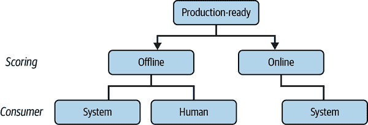
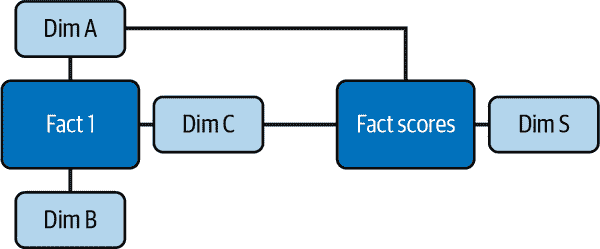
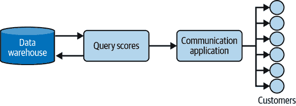
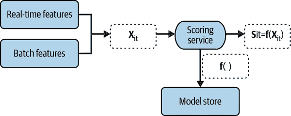
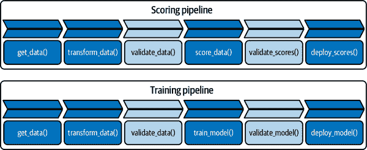

# 第十二章：模型的产品化

正如在 第 11 章 中所讨论的，评分阶段在机器学习（ML）中至关重要，因为这是创造所有价值的部分。它如此重要，以至于新的专门角色——如 ML 工程师和 MLOps——已被创造出来来处理所有涉及的复杂性。然而，许多公司仍然缺乏专门的人才，这项工作最终成为数据科学家职责的一部分。

本章提供了一个面向数据科学家的生产就绪模型的全局视图。在章节末尾，我将提供一些参考资料，带您深入了解这个相对较新的主题。

# “生产就绪”意味着什么？

在她的书 *设计机器学习系统：用于生产就绪应用的迭代过程*（O'Reilly）中，Chip Huyen 指出 *产品化* 或 *运营化* ML 的过程涉及“部署、监控和维护（模型）”。因此，对于已产品化的模型的工作定义是，它已经被部署、监控和维护。

更直接的定义是，模型在被最终用户（无论是人类还是系统）使用前称为*生产就绪*。通过*使用*，我指的是利用预测分数，这可以是离线或在线完成，可以由人类或其他系统或服务完成（图 12-1）。

###### 图 12-1。生产就绪模型的分类

## 批量评分（离线）

典型情况下，*批量评分* 涉及为表中的一组行（无论是客户、用户、产品还是任何其他实体）创建预测，给定一组列或特征。这些分数保存在表中以供后续使用。

当……时，批量评分是非常常见的：

+   预测性能并没有因为拥有最新的信息而得到极大的提升。

+   您不必使用最新的信息做出决策。

+   您没有工程、基础设施或人才将模型部署到实时消费。

例如，如果您想要预测下个月客户的流失情况，那么在过去一分钟内详细了解他们的互动可能不会显著提高预测的质量，因此批量评分是生产化模型的合适方法。

表 12-1 展示了这些分数保存在表中的示例。请注意，表的粒度是 `customer_id` `x` `timestamp`，因此您有效地保存了所有客户的预测历史。

表 12-1。具有批量评分的表格示例

| Customer_id | Score | Timestamp |
| --- | --- | --- |
| `1` | `0.72` | `*2022-10-01*` |
| `1` | `0.79` | `*2022-11-01*` |
| `2` | `0.28` | `*2022-10-01*` |
| `2` | `0.22` | `*2022-11-01*` |
| `…​` | `…​` | `…​` |

这种设计对于人类的消费可能效果很好，因为可以在分析数据库上使用简单的 SQL 查询来检索数据；而且，如果将其作为数据模型的一部分（例如您的数据仓库），还可以用来创建可能需要的更复杂的查询。图 12-2 展示了如何简化地实现这一点的示例。它展示了两个[事实表](https://oreil.ly/k05Co)，一个包含来自一个特定 ML 模型的分数，另一个来自业务（如*销售*），以及几个[维度表](https://oreil.ly/5e3uH)。事实表与维度表之间的链接表示可以使用主键或外键进行连接。将评分层设计为数据仓库的一部分可以促进其消费，因为它允许轻松进行连接和过滤。

###### 图 12-2\. 您的 ML 分数作为数据仓库的一部分

这种设计在系统或服务消费时也可以使用，当延迟不是主要考虑因素时。典型的用例是评分触发与客户的通信（例如保留或交叉销售活动）。管道首先查询数据库，可能会过滤出最近的顶级评分，并将这些客户 ID 发送到一个通信应用程序，该应用程序发送电子邮件或短信（图 12-3）。

###### 图 12-3\. 系统消费分数的管道

## 实时模型对象

实时模型通常不以表格形式存储，而是作为序列化对象，可以在新数据到达时在线消费。图 12-4 展示了这个过程的工作原理：您的模型存储在一个*模型存储*中，可以是一个 S3 存储桶，也可以是更专业的工具，如[MLflow](https://mlflow.org)或[AWS SageMaker](https://oreil.ly/yzExy)。

重要的是，这些对象可以被另一个服务消费，该服务为一个特定示例（如客户或交易）提取最新数据以创建单个预测分数。如图所示，一个示例的特征向量通常包括实时数据和批处理数据。*特别重要的是，向量必须与训练模型时使用的完全匹配*。

###### 图 12-4\. 在线评分示例

从这张图表中，您已经可以看到在线评分中出现的复杂性：

数据架构

您的数据模型应允许查询实时和批处理数据，因此您可能需要类似[lambda 或 kappa](https://oreil.ly/BTYlN)架构的东西。

函数即服务（Function as a Service，FaaS）

你的设计还应该能够即时处理数据和模型对象，这通常通过云计算提供商的 FaaS 和微服务架构实现。一旦生成分数，这很可能会被另一个服务消耗，例如根据分数和业务规则做出决策。

# 数据和模型漂移

一种理解机器学习的方式是，你试图学习给定一些数据的结果的数据生成过程（DGP）。当这样做正确时，你可以从类似的数据进行预测：

<math alttext="StartLayout 1st Row 1st Column True DGP 2nd Column colon 3rd Column y equals f left-parenthesis upper W right-parenthesis 2nd Row 1st Column Learning the DGP 2nd Column colon 3rd Column StartSet y comma upper X EndSet Subscript t Baseline long right double arrow ModifyingAbove f With caret left-parenthesis right-parenthesis EndLayout" display="block"><mtable displaystyle="true"><mtr><mtd columnalign="right"><mrow><mtext>True</mtext> <mtext>DGP</mtext></mrow></mtd> <mtd><mo>:</mo></mtd> <mtd columnalign="left"><mrow><mi>y</mi> <mo>=</mo> <mi>f</mi> <mo>(</mo> <mi>W</mi> <mo>)</mo></mrow></mtd></mtr> <mtr><mtd columnalign="right"><mrow><mtext>Learning</mtext> <mtext>the</mtext> <mtext>DGP</mtext></mrow></mtd> <mtd><mo>:</mo></mtd> <mtd columnalign="left"><mrow><msub><mrow><mo>{</mo><mi>y</mi><mo>,</mo><mi>X</mi><mo>}</mo></mrow> <mi>t</mi></msub> <mo>⟹</mo> <mover accent="true"><mi>f</mi> <mo>^</mo></mover> <mrow><mo>(</mo> <mo>)</mo></mrow></mrow></mtd></mtr></mtable></math>

第一个方程表示将结果变量与一组真实的潜在协变量(*W*)联系起来的真实数据生成过程（DGP）。第二个方程显示了使用给定时点可用的数据学习这个 DGP 的过程，包括结果(*y*)和特征(*X*)。请注意，特征集合不必与真实的潜在协变量完全重合。

由于评分居首位，你在*每次进行预测*时都应该真正关心预测质量。模型的表现会因为两个主要原因而随时间而变化：数据漂移或模型漂移。当你的数据联合分布随时间改变时，会出现*数据漂移*。当底层数据生成过程（DGP）发生变化时，则会出现*模型漂移*。如果你不定期重新训练模型，数据或模型漂移将导致预测性能下降。因此，你应确保在生产流程中包含适当的监控以及定期重新训练。

许多人最初难以理解模型漂移，所以让我用两个例子来解释这个概念。假设你想尝试 [伽利略的倾斜塔实验](https://oreil.ly/k0Apk) 的一个版本，其中你从选定的高度释放静止的网球，并测量它击中地面所需的时间。你收集高度和时间的测量值 <math alttext="StartSet x Subscript t Baseline comma t EndSet"><mrow><mo>{</mo> <msub><mi>x</mi> <mi>t</mi></msub> <mo>,</mo> <mi>t</mi> <mo>}</mo></mrow></math> ，并估计一个线性回归模型，如下所示：

<math alttext="x Subscript t Baseline equals alpha 0 plus alpha 1 t plus alpha 2 t squared plus epsilon" display="block"><mrow><msub><mi>x</mi> <mi>t</mi></msub> <mo>=</mo> <msub><mi>α</mi> <mn>0</mn></msub> <mo>+</mo> <msub><mi>α</mi> <mn>1</mn></msub> <mi>t</mi> <mo>+</mo> <msub><mi>α</mi> <mn>2</mn></msub> <msup><mi>t</mi> <mn>2</mn></msup> <mo>+</mo> <mi>ϵ</mi></mrow></math>

真实的数据生成过程由物理定律决定，具体取决于重力的表面力量，因此如果你在火星或地球上进行实验，这个过程将有所不同。¹

另一个更接近业务的例子涉及趋势和影响因素。冒着过度简化的风险，让我假设某个客户 *i* 购买你的产品的概率取决于其价格和其他*东西*：

<math alttext="Prob left-parenthesis purchase Subscript i Baseline equals True right-parenthesis equals g Subscript i Baseline left-parenthesis p comma stuff right-parenthesis" display="block"><mrow><mrow><mtext>Prob</mtext> <mo>(</mo> <msub><mtext>purchase</mtext> <mi>i</mi></msub> <mo>=</mo> <mtext>True</mtext> <mo>)</mo></mrow> <mo>=</mo> <msub><mi>g</mi> <mi>i</mi></msub> <mrow><mo>(</mo> <mi>p</mi> <mo>,</mo> <mtext>stuff</mtext> <mo>)</mo></mrow></mrow></math>

这是客户*i*的 DGP，我不知道，但我敢打赌，如果突然之间[Jungkook](https://oreil.ly/oFkaY)开始在社交媒体上推广它，可能会发生变化。特别是，我预计喜欢韩国流行音乐并追随他的客户群体在该段落中对价格的敏感性将会降低。旧的 DGP <math alttext="g Subscript i Baseline left-parenthesis right-parenthesis"><mrow><msub><mi>g</mi> <mi>i</mi></msub> <mrow><mo>(</mo> <mo>)</mo></mrow></mrow></math> 已漂移到类似于 <math alttext="ModifyingAbove g With tilde Subscript i Baseline left-parenthesis right-parenthesis"><mrow><msub><mover accent="true"><mi>g</mi> <mo>˜</mo></mover> <mi>i</mi></msub> <mrow><mo>(</mo> <mo>)</mo></mrow></mrow></math> 。

# 任何生产流水线中的基本步骤

Figure 12-5 展示了大多数 ML 流水线应包括的最少步骤。根据第十一章的建议，我为评分和训练阶段设置了单独的任务，但它们共享了几个阶段。我还使用较浅的灰色来表示用于监视目的的元数据存储阶段。现在我将更详细地描述每个阶段。

###### 图 12-5\. 通用生产流水线

## 获取和转换数据

如名称所示，`get_data()`阶段创建连接并查询数据源；在获得原始数据后，`transform_data()`步骤对表格的一个或所有列应用预定义的内存转换。第一个方法通常基于 SQL，而后者可以使用 Python（或 Spark）运行。

虽然我已经将两个阶段分开，但根据问题的性质，将它们合并为一个唯一的阶段可能是明智的选择。让我们考虑建立这种模块化分离的利弊。

尽管模块化通常是一种良好的做法——可以实现更清洁、更快速的调试和数据以及模型治理——但它可能会带来计算成本或限制，这些问题可以通过将*推动*这两个操作到查询引擎中更好地解决。这一点尤为重要，因为查询引擎通常经过优化和配置以处理大型数据集，而你可能最终只能拿到较少的资源来转换实际所需的小数据子集。

另一方面，SQL 很适合查询表格数据，但可能无法提供足够的灵活性来创建复杂的转换，这些转换使用 Python 或 Spark 更容易实现。

此外，分离允许进行全面集中和独立的转换阶段。这很重要，因为[特征工程](https://oreil.ly/R6dhb)在开发性能优越的 ML 模型中扮演了至关重要的角色。因此，模块化允许更全面地记录和审查模型的主要转换过程。

最后，将每个阶段分解为独立模块非常有利于加快代码审查进程，从而缩短部署周期。

###### 提示

如果您的内存受限以进行某些转换，但查询引擎可以执行高内存计算，有时推送一些或全部转换到查询阶段是明智的选择。

您可能会合理怀疑这些阶段被训练和评分流水线共享，解释了我为什么决定使用类似函数的符号。如果您使用窗口化方法，例如在第 11 章中描述的方法，`get_data()`方法可以轻松地参数化以查询给定时间窗口的数据。

在训练流水线的`transform_data()`阶段的输出是训练模型所需的最终数组；对于监督学习，它可能是这样的：

> `transform_data(get_data(Data))` ⇒ <math alttext="y comma upper X"><mrow><mi>y</mi> <mo>,</mo> <mi>X</mi></mrow></math>

对于评分数据，它只是特征数组 <math alttext="upper X"><mi>X</mi></math> 。

## 验证数据

这是每个流水线的首个监控阶段，用于存储元数据并在数据漂移出现时发出警报。此阶段可分解为两个子阶段：

1.  *计算并保存统计信息。* 为输出和特征的分布计算一组预定义的统计信息，并保存在表中。

1.  *检查数据漂移。* 鉴于刚刚保存的当前和历史统计信息，运行测试以查看变化是否纯粹是噪声还是信号。输出应该是创建警报或不创建。

表 12-2 展示了一个存储公司所有模型分布元数据的表格示例。此表可用于存储所有模型的结果和特征的十分位数，并且适用于训练和评分阶段，通过应用筛选器进行报告、测试和监控非常方便。

表 12-2\. 带有十分位数的表格示例

| Model | Stage | Metric | Decile | Value | Timestamp |
| --- | --- | --- | --- | --- | --- |
| `churn` | `training` | `outcome` | `d1` | `100` | `*2022-10-01*` |
| `…​` | `…​` | `outcome` | `…​` | `…​` | `…​` |
| `…​` | `…​` | `outcome` | `d10` | `1850` | `*2022-10-01*` |
| `churn` | `training` | `feature1` | `d1` | `-0.5` | `*2022-10-01*` |
| `…​` | `…​` | `feature1` | `…​` | `…​` | `…​` |
| `…​` | `…​` | `feature1` | `d10` | `1.9` | `*2022-10-01*` |
| `…​` | `…​` | `…​` | `…​` | `…​` | `…​` |

在这个示例中，我选择保存数据集中每个变量的十分位数，因为它们捕捉了相应分布中的大量信息。

对于测试，有许多替代方案。如果您有足够的历史记录，并希望遵循传统的假设检验路线，您可以对每个指标和十分位数（ <math alttext="d Subscript m comma t"><msub><mi>d</mi> <mrow><mi>m</mi><mo>,</mo><mi>t</mi></mrow></msub></math> ）运行回归测试，例如：

<math alttext="d Subscript m comma t Baseline equals alpha Subscript m Baseline plus beta Subscript m Baseline t plus epsilon Subscript m comma t" display="block"><mrow><msub><mi>d</mi> <mrow><mi>m</mi><mo>,</mo><mi>t</mi></mrow></msub> <mo>=</mo> <msub><mi>α</mi> <mi>m</mi></msub> <mo>+</mo> <msub><mi>β</mi> <mi>m</mi></msub> <mi>t</mi> <mo>+</mo> <msub><mi>ϵ</mi> <mrow><mi>m</mi><mo>,</mo><mi>t</mi></mrow></msub></mrow></math>

其中，作为特征的*t*表示时间趋势：如果<math alttext="beta Subscript m"><msub><mi>β</mi> <mi>m</mi></msub></math>的*p*值低于所需的阈值（10%，5%，1%），则可以拒绝参数为 0 的原假设，因此您有指标*m*漂移的证据。

或者，您可以使用类似于在第九章中使用的非参数检验，在历史分布中计算上下分位数，并检查新观察是否落在该置信区间内（例如，计算 95%置信区间，您计算<math alttext="q Subscript 2.5 percent-sign Baseline comma q Subscript 97.5 percent-sign Baseline"><mrow><msub><mi>q</mi> <mrow><mn>2</mn><mo>.</mo><mn>5</mn><mo>%</mo></mrow></msub> <mo>,</mo> <msub><mi>q</mi> <mrow><mn>97</mn><mo>.</mo><mn>5</mn><mo>%</mo></mrow></msub></mrow></math>）。

有些人更喜欢运行[Kolmogorov-Smirnov](https://oreil.ly/4j73f)测试，因此您可能需要保存不同的元数据集，但逻辑相同。

###### 提示

无论您决定使用什么，我的建议是*保持简单*。通常，您只需要一个绘制这些元数据的仪表板，这样您就可以设置简单的警报，以便在发生变化时收到通知。

当您将模型投入生产时，通常简单就是更好的选择。

## 训练和评分阶段

一旦您的训练数据准备好，您可以继续正式的训练过程，通常会执行以下操作：

1.  将样本分为训练、测试和验证子样本。

1.  优化元参数并最小化损失函数。

`train_model()`阶段的输出是一个可以用于预测目的的模型对象：

> `train_model(transform_data(get_data(Data)))` ⇒ <math alttext="f left-parenthesis right-parenthesis"><mrow><mi>f</mi> <mo>(</mo> <mo>)</mo></mrow></math>

同样，`score_data()`方法使用一些特征*X*来创建预测或分数：

> `score_data(transform_data(get_data(Data)), f())` ⇒ <math alttext="ModifyingAbove s With caret"><mover accent="true"><mi>s</mi> <mo>^</mo></mover></math>

如前所述，这个分数可以保存在表格中供离线使用，或传递给另一个服务进行在线使用。

## 验证模型和分数

在继续之前，最好再次保存一些元数据，以帮助创建模型或数据漂移的警报。在这个阶段，我喜欢在`validate_data()`中创建相同的元数据，但只传递测试样本分数（`validate_model()`）或实际分数（`validate_scores()`）。如果您沿着这条路走，您实际上*复用*了之前的方法，只是在不同的阶段和管道中传递了不同的数据集；其他所有工作都已经处理好了（例如更新元数据表和发送警报）。

请注意，对于在线使用，您需要收集足够的验证数据，但逻辑本质上是相同的。

## 部署模型和分数

正如名称所示，这些阶段的目标是保存模型和分数。对于训练管道，您需要序列化模型对象，并使用某种持久存储（如磁盘、S3 存储桶等）保存它。采用良好的 [命名](https://oreil.ly/r8tzX) 和 [版本控制](https://semver.org) 约定有助于对模型进行目录管理。

模型序列化的主题非常重要且技术性强，因此我会在本章末提供更多参考资料。

分数的部署取决于消费是线下还是线上的。在线下评分中，您只需将分数写入表中以便消费。在线上评分中，您不仅应该使分数可供其他服务消费，还应该将其存储在表中。

# 关键要点

以下是本章的关键要点：

分数至关重要。将您的模型投入生产应该是您的首要任务，因为只有有效的模型才能为组织创造价值。

什么是生产就绪？

模型在可消费时才能产生生产力。由于模型通常会在不同的时间段内被消费，您必须创建一个过程来确保模型具有持久的预测性能。

模型和数据漂移。

当您的结果生成过程发生变化时，就会出现模型漂移。数据漂移是指结果或特征分布发生变化。如果不加处理，数据和模型漂移将导致模型的预测性能逐渐下降。避免漂移的最佳方法是定期重新训练您的模型。

生产管道。

为您的生产管道设置一个最小结构是很有好处的。在这里，我建议拥有模块化和独立的训练与评分管道，它们共享一些方法或阶段。至关重要的是，您应包含创建和存储元数据的阶段，这些元数据将在模型或数据漂移时向您发出警报。

保持简单。

将生产部署的复杂步骤简化是推荐的做法，因为不必要的复杂性可能会逐渐增加，使得在出现问题时（而问题肯定会出现）很难找到问题的根源。

# 进一步阅读

Chip Huyen 的 *Designing Machine Learning Systems* 由行业专家编写，非常出色，提供了本章未涵盖的许多关键技术细节。我强烈推荐这本书。

我发现 Valliappa Lakshmanan 等人的《Machine Learning Design Patterns: Solutions to Common Challenges in Data Preparation, Model Building, and MLOps》（O’Reilly）非常有用。其目的是综合一套可以在各个领域使用的机器学习设计实践。由于这本书是由三位 Google 工程师撰写的，你会发现他们的例子大量依赖于 Google 的基础设施，因此有时不太明显如何将其转换为其他云服务提供商的环境。但如果你能抽象出这些细节，你会发现这本书非常值得一读，是一本很好的资源。

Kurtis Pykes 的博客文章["5 种保存机器学习模型的不同方法"](https://oreil.ly/2Lsuq)讨论了不同的序列化机器学习模型的方法。

Lu 等人的文章"Learning under Concept Drift: A Review")，全面回顾了*概念漂移*，有时包括数据漂移和模型漂移的情况。

关于 Zillow Offers 模型漂移案例，你可以阅读 Jon Swartz（2021 年 11 月）的*MarketWatch*文章，["Zillow 将停止房屋翻转业务，预计将亏损超过 5.5 亿美元，裁员四分之一"](https://oreil.ly/J-lWA)，或 Anupam Datta（2021 年 12 月）的["AI 模型漂移的危险：从 Zillow Offers 案例中学到的教训"](https://oreil.ly/NMo5A)（*The AI Journal*）。

¹ 请回忆在恒定速度和加速度下 <math alttext="x equals x 0 plus v 0 t plus StartFraction g Over 2 EndFraction t squared"><mrow><mi>x</mi> <mo>=</mo> <msub><mi>x</mi> <mn>0</mn></msub> <mo>+</mo> <msub><mi>v</mi> <mn>0</mn></msub> <mi>t</mi> <mo>+</mo> <mfrac><mi>g</mi> <mn>2</mn></mfrac> <msup><mi>t</mi> <mn>2</mn></msup></mrow></math> ，其中 <math alttext="g"><mi>g</mi></math> 是地表重力。在[Mars](https://oreil.ly/LmYrT)，重力的力量是地球的约 38%。
