# 第十三章：机器学习中的讲故事

在第七章 中，我主张数据科学家们应该成为更好的讲故事者。这在一般情况下是正确的，但在机器学习领域尤为重要。

本章将带你深入了解机器学习中讲故事的主要方面，从特征工程开始，到可解释性问题结束。

# 机器学习中讲故事的整体视角

讲故事在机器学习中扮演着两个相关但不同的角色（图 13-1）。较为熟知的是销售人员的角色，在这个角色中，你需要与观众互动，可能是为了获得或维护利益相关者的支持，这个过程通常是在你开发模型之后进行的。较少人知的是科学家的角色，在这个角色中，你需要找到假设，这些假设将指导你在开发模型过程中的全程。

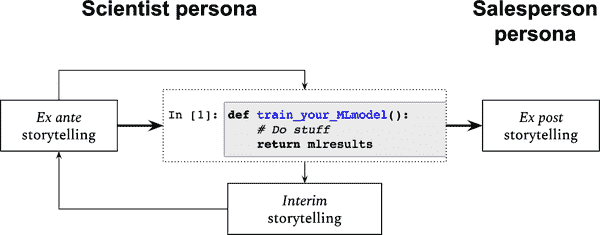

###### 图 13-1\. 机器学习中的讲故事

因为前者是在你开发模型之后进行的 *ex post* 讲故事，我称之为销售人员角色；而科学家角色主要是在训练模型过程中的 *ex ante* 和 *interim* 阶段。

# *Ex Ante* 和 *Interim* 讲故事

*Ex ante* 讲故事有四个主要步骤：定义问题、创建假设、特征工程和训练模型（图 13-2）。虽然它们通常按照这个顺序进行，但在它们之间存在反馈循环，因此在训练第一个模型后，经常需要对特征、假设甚至问题本身进行迭代。

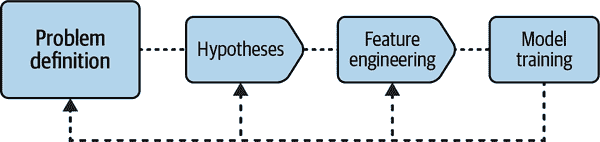

###### 图 13-2\. *Ex ante* 讲故事

第一步始终是问题定义：*你想预测什么*，*为什么*？最好早期与利益相关者合作完成这个过程，确保他们支持，因为很多有前景的机器学习项目因此而失败。

请回想第十二章 中提到的，只有在模型部署到生产环境中时，它才能算是一个好模型。将模型部署到生产环境是一项昂贵的工作，不仅在时间和精力上，还有机会成本上。因此，时常自问：*我真的需要为这个项目实施机器学习吗*？不要陷入只因为它很吸引人或者有趣而做机器学习的陷阱中：你的目标始终是创造最大的价值，而机器学习只是你工具箱中的一种工具。

最后，在问题定义阶段，不要忘记对以下问题有清晰的答案：

+   这个模型将如何被使用？

+   从模型预测中可以拉动的杠杆是什么？

+   它如何提升公司的决策能力？

对这些问题有明确的答案将有助于开发机器学习模型的商业案例，从而增加成功的可能性。

###### 提示

作为一般建议，尽早让利益相关者参与问题的定义是有益的。这有助于从一开始就获得利益相关者的支持。还要确保 ML 是解决手头问题的合适工具：部署、监控和维护模型成本高昂，因此您应该有一个良好的业务案例支持它。

## 创建假设

有了一个明确定义的问题，您现在可以切换到科学家的角色，并开始为手头的问题创建假设。每个假设都是关于您预测驱动因素的故事；正是在这种特定意义上，科学家也是讲故事者。成功的故事可以提高您模型的预测性能。

此时的关键问题是：*我在预测什么，以及什么驱动了这一预测*？图 13-3 展示了预测问题类型的高级概述，以及它们与您可以操作的杠杆的关系。了解这些杠杆对于确保 ML 模型创造价值至关重要（第一章）。

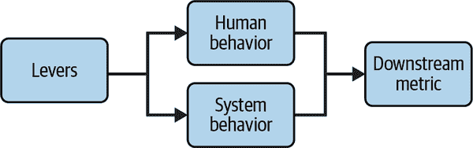

###### 图 13-3\. 杠杆-行为-指标流程

因此，从这里可以得出结论，大多数预测问题可以归为以下几类：

人类行为产生的指标

许多时候，您关心的指标取决于客户以某种特定方式行动。例如，我的用户会点击横幅吗？他们会以参考价格购买产品吗？他们会在下个月流失吗？他们会在市场上花费多少时间？

系统行为产生的指标

指标还取决于系统的表现。其中最为人熟知的一个例子是数据中心优化，尤其是解决[空气冷却问题](https://oreil.ly/5guWh)。另一个例子是预测您的网页加载时间，已经发现直接影响流失指标。

下游指标

许多时候，您只关心汇总的下游指标，比如收入。这在直接从事财务规划与分析（FP&A）的数据科学家中最为常见。

###### 提示

许多数据科学家在创建和设计有预测性的特征的过程中感到困难。一个通用的建议是始终首先写下并与他人讨论预测问题的假设列表。只有在此之后，您才应该继续进行特征工程的过程。不要忘记写下您认为假设可能正确的原因。只有有了这样的理由，您才能挑战自己的逻辑，并改进给定的故事。

为了为您的问题提出假设，有一些高层次的建议：

很好地了解您的问题。

构建出色的 ML 模型的不太秘密的关键是具有深厚的领域专业知识。

要保持好奇心。

这是使数据科学家成为科学家的一个定义性特征。

挑战现状。

不要害怕挑战现状。这包括挑战你自己的假设，并在需要时进行迭代（请注意你是否有任何确认偏见的迹象）。

话虽如此，让我们进一步具体推荐如何进行你的假设发现和制定。

### 预测人类行为

对于预测人类行为，始终记住人们做他们*想做*和*能做*的事情。你可能想去意大利，但如果你负担不起（无论是金钱还是时间），你就不会去。口味和资源的可用性在你想预测人类行为时是至关重要的一级重要因素，这可以帮助你解决问题的假设。

思考动机也会迫使你非常认真地思考你的产品。例如，为什么有人会想购买它？价值主张是什么？哪些顾客愿意为此付费？

另一个技巧是利用你与顾客的共情能力；问问自己如果你是他们会做什么？当然，能够轻松置身于他们的角色中的情况越容易越好（对我来说，很难置身于意见领袖或职业拳击手的角色）。这个技巧可以带你走得更远，但请记住，你可能不是你典型的顾客，这就引出了下一个技巧。

起初，你至少要力求理解并模拟*普通*顾客。首先，你应该正确获取一阶效应，也就是说，对分析单元的平均建模将为你带来相当多的预测性能。我见过许多数据科学家开始假设边角案例，这些案例定义上对整体预测性能几乎没有影响。边角案例很有趣也很重要，但对于预测来说，从平均案例开始几乎总是更好的选择。

### 预测系统行为

一些先前的评论也适用于预测一个系统。主要区别在于，由于系统缺乏目的或知觉，你可以限制自己理解技术瓶颈。

显然，你必须掌握系统的技术细节，你对物理约束了解得越多，制定假设就会越容易。

### 预测下游指标

下游指标的预测比预测由人类或系统行为产生的单个指标更难也更容易。它更难是因为指标与基础驱动因素的距离越远，你的假设就越弱和更加扩散。此外，它还继承了关于这些驱动因素故事的困难，其中一些可能会复合并创建更高层次的复杂性。

尽管如此，许多时候你可以做些手势，利用时间和空间的相关性创建一些特征。在某种意义上，你接受任何你提出的故事都会被时间序列和空间自回归模型中常见的简单自回归结构击败。

## 特征工程

一般来说，特征工程的过程涉及将假设转化为可测量变量，这些变量具有足够的信号来帮助你的算法学习数据生成过程。将这个过程拆分为几个阶段是一个好的做法，如图 13-4 所示。

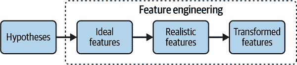

###### 图 13-4\. 特征工程流程

特征工程的阶段包括：

创建一组理想特征。

第一步是将你的假设转化为*理想*特征，如果你能够精确地测量所有内容的话。这一步非常重要，因为它可以为第二阶段奠定基础。

一个例子是*意图性*对*早期流失*的影响，定义为那些只试用产品一次就离开的顾客。一个假设是这些顾客实际上并不打算使用该产品（因为他们只是试用，或者销售是[强制性的](https://oreil.ly/HDGj-)，或者存在销售欺诈等）。如果你能问他们并得到真实回答那该多好啊？不幸的是，这不现实也不可实现。

用现实特征来近似理想特征。

如果你意识到理想的特征集不可用，你需要找到良好的代理特征，即与理想特征相关的特征。许多时候，相关程度可能非常低，你需要接受包含与原始假设之间联系非常弱的控制变量。

后者的一个例子是文化如何影响你的口味，从而影响你购买产品的可能性。例如，可能有文化差异解释为什么来自不同国家的用户决定接受或拒绝其浏览器中的 cookie（一些国家的人可能更加敏感于分享这些信息）。不用说，测量文化是困难的。但如果你怀疑国家层面的变化会捕捉到文化假设变化的大部分，你只需要包含国家虚拟变量即可。这是一个相对弱的特征集，因为这些将代理这一级别的任何特征，而不仅仅是文化（例如，法规环境的差异）。

转换特征。

这是通过对特征应用一系列变换来从中提取最大信号量的过程。请注意，我与文献稍有不同，因为大多数有关特征工程的教材只专注于这一阶段。

这个阶段涉及转换，比如 [缩放](https://oreil.ly/Hak0v)、[二值化和独热编码](https://oreil.ly/ralbT)、[缺失值的填补](https://oreil.ly/MhGuK)、[特征交互](https://oreil.ly/bT-1q) 等等。我在本章的末尾提供了几个参考文献，您可以查阅其中丰富的变换方法。

重要的是，变换取决于你的数据 *和* 所选算法。例如，使用分类和回归树时，你可能不需要自己处理异常值，因为算法会替你处理。同样地，对于通常的非线性算法，比如树和基于树的集成，你不需要包括乘法交互。

# 事后叙事：打开黑匣子

事后叙事的问题主要在于理解为什么你的模型做出这样的预测，什么是最具预测性的特征，以及这些特征如何与预测相关。你想向观众传达的两个主要观点是：

+   模型是逐步预测的，也就是说，预测误差低于基准替代方案。

+   模型 *有意义*。一个好的做法是开始讨论假设，它们是如何被建模的，以及它们如何与结果一致。

一般来说，一个模型是 *可解释的*，如果你能理解驱动其预测的因素。*局部* 可解释性旨在理解特定预测，比如为什么一个客户被认为极有可能在信用上违约。*全局* 可解释性旨在提供对特征如何影响结果的总体理解。这个主题值得一本书的详细介绍，但在本章中，我只能深入探讨更实际的问题，具体来说，我只会介绍实现全局可解释性的方法，因为我发现这些方法对叙述目的最有用。

###### 警告

在打开黑匣子之前，请确保你的模型具有足够的预测性能，并且没有数据泄漏。你需要投入足够的时间和精力进行事后叙述，所以最好从一个良好的预测模型开始。

此外，当展示性能指标时，尽量使其与你的观众尽可能相关。常见的指标，如均方根误差（RMSE）或曲线下面积（AUC），对于你的业务利益相关者来说可能是神秘的。通常值得努力将它们转化为精确的业务结果。例如，如果你的 RMSE 降低了 5%，业务会变得更好吗？

## 解释性与性能的权衡

可以说，理想的机器学习算法既高效又可解释。不幸的是，通常在解释性和预测性能之间存在一种权衡，因此如果你希望达到更低的预测误差，你必须放弃对算法内部发生的事情的部分理解（图 13-5）。

在光谱的一端，通常被认为具有高可解释性但预测性能不佳的线性模型。这一集合包括线性回归和逻辑回归，以及非线性学习算法，如分类和回归树。在光谱的另一端是更灵活、通常高度非线性的模型，如深度神经网络、基于树的集成和支持向量机。这些算法通常被称为*黑匣子*学习器。目标是打开黑匣子，更好地理解发生的情况。

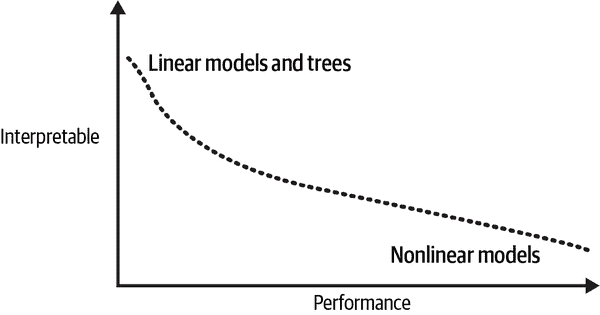

###### 图 13-5\. 解释性与性能的权衡

在继续之前，并不明显您需要解释结果，所以让我们简要讨论为什么您可能希望这样做：

采用和认同

许多人需要了解为什么做出预测，以便将其接受为有效，从而采用它。这在不习惯机器学习方法的组织中最为常见，决策通常是基于准数据驱动方法，其中包括大量直觉。如果您能够为他们打开黑匣子，可能会更容易让您的利益相关者接受您的结果并赞助您的项目。

低现实世界预测性能

打开黑匣子是检测和纠正数据泄漏等问题的最有效方法之一（见第十一章）。

道德和法规要求

在某些行业中，公司确实需要解释为什么会做出某些预测。例如，在美国，平等机会法授权任何人询问为何拒绝授信。欧洲的一般数据保护条例（GDPR）也有类似的标准。即使您没有这样的要求，您可能希望通过打开黑匣子来验证预测和后续决策是否符合最低道德标准。

## 线性回归：设定一个基准

线性回归为理解可解释性提供了一个有用的基准（另见第十章）。考虑以下简单模型：

<math alttext="y equals alpha 0 plus alpha 1 x 1 plus alpha 2 x 2 plus epsilon" display="block"><mrow><mi>y</mi> <mo>=</mo> <msub><mi>α</mi> <mn>0</mn></msub> <mo>+</mo> <msub><mi>α</mi> <mn>1</mn></msub> <msub><mi>x</mi> <mn>1</mn></msub> <mo>+</mo> <msub><mi>α</mi> <mn>2</mn></msub> <msub><mi>x</mi> <mn>2</mn></msub> <mo>+</mo> <mi>ϵ</mi></mrow></math>

通过对底层数据生成过程做出强线性假设，您将立即得到：

效果方向性

每个系数的符号告诉您特征在控制所有其他特征后与结果正相关还是负相关。

效果大小

每个系数被解释为每个特征变化一个单位时结果变化的大小，其他特征保持不变。重要的是，在没有进一步假设的情况下不能给出因果解释。

本地可解释性

通过前两个项目，您可以断定为什么会做出任何个别预测。

一些数据科学家犯了一个错误，他们对系数的绝对大小给予了相对*重要性*的解释。要看出这种方法不起作用的原因，请考虑以下模型，其中收入被表达为销售团队规模和付费营销支出（搜索引擎营销或 SEM）的函数：

<math alttext="revenue equals 100 plus 1000 times Num period sales execs plus 0.5 times SEM spend" display="block"><mrow><mtext>revenue</mtext> <mo>=</mo> <mn>100</mn> <mo>+</mo> <mn>1000</mn> <mo>×</mo> <mtext>Num.</mtext> <mtext>sales</mtext> <mtext>execs</mtext> <mo>+</mo> <mn>0</mn> <mo>.</mo> <mn>5</mn> <mo>×</mo> <mtext>SEM</mtext> <mtext>spend</mtext></mrow></math>

这意味着，平均而言，保持其他因素不变，每额外：

+   销售执行人员与收入增加 $1,000 相关。

+   每花费一美元在搜索引擎营销（例如在谷歌、必应或 Facebook 广告上的出价）上，与收入增加 50 美分相关。

你可能会倾向于认为增加销售人员比增加付费营销支出*更重要*，对你的收入更有利。不幸的是，这是一个不同单位的比较，就像是苹果和橙子。一个将所有特征标准化的技巧是在标准化特征上进行回归分析：

<math alttext="StartLayout 1st Row 1st Column y 2nd Column equals 3rd Column beta 0 plus beta 1 x overTilde Subscript 1 plus beta 2 x overTilde Subscript 2 plus eta 2nd Row 1st Column where 2nd Column Blank 3rd Column z overTilde equals StartFraction z minus m e a n left-parenthesis z right-parenthesis Over s t d left-parenthesis z right-parenthesis EndFraction for any variable z EndLayout" display="block"><mtable displaystyle="true"><mtr><mtd columnalign="right"><mi>y</mi></mtd> <mtd><mo>=</mo></mtd> <mtd columnalign="left"><mrow><msub><mi>β</mi> <mn>0</mn></msub> <mo>+</mo> <msub><mi>β</mi> <mn>1</mn></msub> <msub><mover accent="true"><mi>x</mi> <mo>˜</mo></mover> <mn>1</mn></msub> <mo>+</mo> <msub><mi>β</mi> <mn>2</mn></msub> <msub><mover accent="true"><mi>x</mi> <mo>˜</mo></mover> <mn>2</mn></msub> <mo>+</mo> <mi>η</mi></mrow></mtd></mtr> <mtr><mtd columnalign="right"><mtext>where</mtext></mtd> <mtd columnalign="left"><mrow><mover accent="true"><mi>z</mi> <mo>˜</mo></mover> <mo>=</mo> <mfrac><mrow><mi>z</mi><mo>-</mo><mi>m</mi><mi>e</mi><mi>a</mi><mi>n</mi><mo>(</mo><mi>z</mi><mo>)</mo></mrow> <mrow><mi>s</mi><mi>t</mi><mi>d</mi><mo>(</mo><mi>z</mi><mo>)</mo></mrow></mfrac> <mtext>for</mtext> <mtext>any</mtext> <mtext>variable</mtext> <mi>z</mi></mrow></mtd></mtr></mtable></math>

请注意，标准化变量的回归系数通常与原始模型中的系数不同（因此希腊字母不同），因此具有不同的解释：通过标准化所有特征，你用标准偏差的单位（*无单位* 是更好的术语）来衡量所有事物，确保你在进行苹果对苹果的比较。然后，你可以说类似于：<math alttext="x 1"><msub><mi>x</mi> <mn>1</mn></msub></math> 比 <math alttext="x 2"><msub><mi>x</mi> <mn>2</mn></msub></math> 更重要，因为在 <math alttext="x 1"><msub><mi>x</mi> <mn>1</mn></msub></math> 的一个额外标准偏差增加比在 <math alttext="x 2"><msub><mi>x</mi> <mn>2</mn></msub></math> 的相应增加带来更多的收入*。

这里的诀窍是找到一种方法将原始单位转换为一个通用单位（在本例中是标准偏差）。但任何其他通用单位也可以起作用。例如，假设每增加一个销售执行人员平均每月成本为 5,000 美元。由于营销支出已经以美元计量，你最终得出结论，平均每额外花费一美元在：

+   销售执行人员与收入增加 20 美分相关。

+   付费营销与收入增加 50 美分相关。

尽管最后这种方法也有效，但标准化是一种更常见的方法，用于找到所有特征的通用单位。需要记住的重要事情是，现在你能够*排名*各个特征，有意义地进行比较。

图 13-6 绘制了一个带有两个零均值、正态分布特征（ <math alttext="x 1 comma x 2"><mrow><msub><mi>x</mi> <mn>1</mn></msub> <mo>,</mo> <msub><mi>x</mi> <mn>2</mn></msub></mrow></math> ）的模拟线性模型的估计系数，以及 95% 置信区间，与前述方程式相同。特征 <math alttext="z 1 comma z 2 comma z 3"><mrow><msub><mi>z</mi> <mn>1</mn></msub> <mo>,</mo> <msub><mi>z</mi> <mn>2</mn></msub> <mo>,</mo> <msub><mi>z</mi> <mn>3</mn></msub></mrow></math> 是与 <math alttext="x 2"><msub><mi>x</mi> <mn>2</mn></msub></math> 相关但与结果无关的附加变量。重要的是，我将真实参数设置为 <math alttext="alpha 1 equals alpha 2 equals 1"><mrow><msub><mi>α</mi> <mn>1</mn></msub> <mo>=</mo> <msub><mi>α</mi> <mn>2</mn></msub> <mo>=</mo> <mn>1</mn></mrow></math> 和 <math alttext="upper V a r left-parenthesis x 1 right-parenthesis equals 1 comma upper V a r left-parenthesis x 2 right-parenthesis equals 5"><mrow><mi>V</mi> <mi>a</mi> <mi>r</mi> <mrow><mo>(</mo> <msub><mi>x</mi> <mn>1</mn></msub> <mo>)</mo></mrow> <mo>=</mo> <mn>1</mn> <mo>,</mo> <mi>V</mi> <mi>a</mi> <mi>r</mi> <mrow><mo>(</mo> <msub><mi>x</mi> <mn>2</mn></msub> <mo>)</mo></mrow> <mo>=</mo> <mn>5</mn></mrow></math> 。这样做有两个效果：

+   它增加了第二特征的信噪比，从而使其更具信息性。

+   它增加了真实系数：¹ <math alttext="beta 2 equals StartRoot 5 EndRoot alpha 2"><mrow><msub><mi>β</mi> <mn>2</mn></msub> <mo>=</mo> <msqrt><mn>5</mn></msqrt> <msub><mi>α</mi> <mn>2</mn></msub></mrow></math> 。

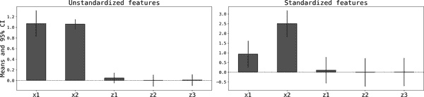

###### 图 13-6\. 线性与标准化特征的回归

通过标准化这两个特征，显然第二个特征在重要性上排名较高，正如之前定义的那样。由于置信区间的存在，你还可以得出结论，最后三个特征并不具有信息性。在统计方法之外的另一种选择是使用*正则化*，例如 Lasso 回归。

## 特征重要性

许多时候，你希望根据某种客观的重要性度量对特征进行排名。这对前瞻性和事后叙事目的都很有用。从事后的角度来看，你可以说：“我们发现交易时间是欺诈的最重要预测因子”，这可能有助于你销售模型的结果，并为你和你的听众带来潜在的顿悟时刻（也见 第 7 章）。

从前瞻角度来看，通过一种按重要性对特征进行排名的方法可以帮助你对假设或特征工程进行迭代，或者提高你对问题的理解。如果你有深思熟虑的假设，但结果看起来可疑，那么更有可能是在特征工程方面出现了编程错误，或者有数据泄漏。

早些时候，我在线性回归中使用标准化特征得出了一个可能的重要性排名：

线性回归中的标准化特征重要性

如果*x*的一个标准差增加与结果的绝对值变化更大相关，那么特征*x*就比特征*z*更重要。

或者，*重要性*可以根据每个特征对手头预测问题的信息量来定义。直观上，特征的信息量越高（针对给定结果），如果包含该特征，则预测误差就越低。存在两种常用的按此途径的度量标准：

基于不纯度的特征重要性

从节点不纯度的角度来看，如果选择*x*作为分割变量的节点导致的预测误差相对改进大于*z*的相应增加，则特征*x*比特征*z*更重要。

排列重要性

如果对*x*值进行排列时性能损失的相对大小大于*z*的话，那么特征*x*比特征*z*更重要，从排列的角度看。

请注意，[基于不纯度的特征重要性](https://oreil.ly/acJDH) 仅适用于基于树的机器学习算法。每次使用一个特征分割节点时，性能改进都会被保存，因此最终你可以计算各个特征的改进占总体改进的比例。在集成模型中，这是所有生成树的平均值。

另一方面，[排列重要性](https://oreil.ly/84XXY) 适用于任何机器学习算法，因为你只需对每个特征的值进行洗牌（多次，就像启发法样本集程序中一样），然后计算性能损失。直觉是真实顺序对*重要*特征更重要，因此值的排列应该会导致性能损失更大。

图 13-7 显示了使用与之前相同的模拟数据集训练的梯度提升回归（不进行元参数优化）得出的排列和基于不纯度的特征重要性，以及 95% 置信区间。排列重要性的置信区间是使用 scikit-learn 提供的均值和标准差进行参数计算（假设正态分布）。我使用自助法获得了基于不纯度特征的类似区间（参见第九章）。

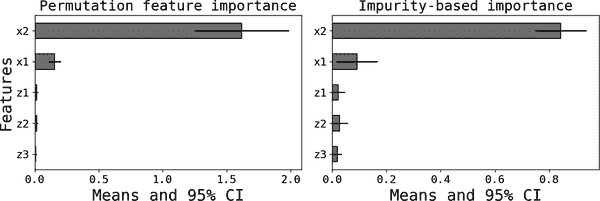

###### 图 13-7\. 使用梯度提升回归的模拟模型的特征重要性

## 热图

热图非常易于计算，通常在直观显示每个特征与预测结果之间的相关性方面表现良好。这对于说出诸如 *当 x 增加时，y 会下降* 这样的假设非常方便。许多假设在方向上陈述，因此快速测试它们在实践中是否成立非常有用。计算它们的过程如下：

1.  将预测结果（回归）或概率（分类）分成十分位数或其他任何分位数。

1.  对于每个特征 *<math alttext="x Subscript j"><msub><mi>x</mi> <mi>j</mi></msub></math>* 和分位数 *d*，计算该桶中所有单位的平均值： <math alttext="x overbar Subscript j comma d"><msub><mover><mi>x</mi> <mo>¯</mo></mover> <mrow><mi>j</mi><mo>,</mo><mi>d</mi></mrow></msub></math> 。

这些可以按照列中的十分位数和行中的特征进行表格排列。通常最好使用某种重要性度量来排序特征，这样可以首先关注最相关的特征。

图 13-8 展示了在之前的模拟示例上训练的线性回归的热图，特征已按重要性排序。仅通过检查每个特征（行）的相对色调，你可以轻松识别任何模式或其缺失。

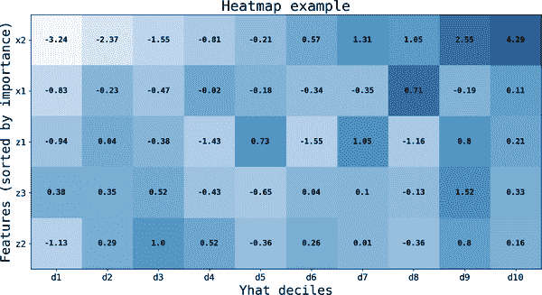

###### 图 13-8\. 上一个模拟示例的特征热图

例如，如预期的那样，<math alttext="x 2"><msub><mi>x</mi> <mn>2</mn></msub></math> 与结果呈正相关，因为模拟中的真实系数等于一。低分位数的单位平均减少了 -3.58 个单位，而这在最高分位数中逐渐增加到平均值为 4.23 个单位。

检查 <math alttext="x 1"><msub><mi>x</mi> <mn>1</mn></msub></math> 的行显示了热图存在的主要问题：它们仅呈现双变量相关性。真实的相关性是正的（ <math alttext="alpha 1 equals 1"><mrow><msub><mi>α</mi> <mn>1</mn></msub> <mo>=</mo> <mn>1</mn></mrow></math> ），但热图未能捕捉到这种单调性。要理解原因，请注意 <math alttext="x 1"><msub><mi>x</mi> <mn>1</mn></msub></math> 和 <math alttext="x 2"><msub><mi>x</mi> <mn>2</mn></msub></math> 是 *负相关* 的（图 13-9）。然而，第二个特征具有更大的方差，因此在最终预测结果（和十分位数）的排序中具有更多的预测能力。这两个事实破坏了对第二个特征预期的单调性。

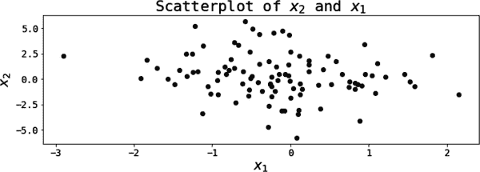

###### 图 13-9\. x[2] 和 x[1] 是负相关的

## 部分依赖图

使用部分依赖图（PDPs），你可以逐个更改一个特征而固定其他所有内容来预测结果或概率。由于与线性回归中的偏导数相似，这一方法非常吸引人。

在第九章中，我使用了以下方法计算 PDPs，非常接近捕捉这种直觉。首先计算所有特征的均值，然后为要模拟的特征创建大小为*G*的线性网格，并将所有内容组合成以下形式的矩阵：

<math alttext="bold upper X overbar Subscript bold j Baseline equals Start 4 By 6 Matrix 1st Row 1st Column x overbar Subscript 1 2nd Column x overbar Subscript 2 3rd Column midline-horizontal-ellipsis 4th Column x Subscript 0 j 5th Column midline-horizontal-ellipsis 6th Column x overbar Subscript upper K 2nd Row 1st Column x overbar Subscript 1 2nd Column x overbar Subscript 2 3rd Column midline-horizontal-ellipsis 4th Column x Subscript 1 j 5th Column midline-horizontal-ellipsis 6th Column x overbar Subscript upper K 3rd Row 1st Column vertical-ellipsis 2nd Column vertical-ellipsis 3rd Column down-right-diagonal-ellipsis 4th Column vertical-ellipsis 5th Column vertical-ellipsis 4th Row 1st Column x overbar Subscript 1 2nd Column x overbar Subscript 2 3rd Column midline-horizontal-ellipsis 4th Column x Subscript upper G j 5th Column midline-horizontal-ellipsis 6th Column x overbar Subscript upper K EndMatrix Subscript upper G times upper K" display="block"><mrow><msub><mover><mi>𝐗</mi> <mo>¯</mo></mover> <mi>𝐣</mi></msub> <mo>=</mo> <msub><mfenced close=")" open="("><mtable><mtr><mtd><msub><mover><mi>x</mi> <mo>¯</mo></mover> <mn>1</mn></msub></mtd> <mtd><msub><mover><mi>x</mi> <mo>¯</mo></mover> <mn>2</mn></msub></mtd> <mtd><mo>⋯</mo></mtd><mtd><msub><mi>x</mi> <mrow><mn>0</mn><mi>j</mi></mrow></msub></mtd> <mtd><mo>⋯</mo></mtd><mtd><msub><mover><mi>x</mi> <mo>¯</mo></mover> <mi>K</mi></msub></mtd></mtr> <mtr><mtd><msub><mover><mi>x</mi> <mo>¯</mo></mover> <mn>1</mn></msub></mtd> <mtd><msub><mover><mi>x</mi> <mo>¯</mo></mover> <mn>2</mn></msub></mtd> <mtd><mo>⋯</mo></mtd><mtd><msub><mi>x</mi> <mrow><mn>1</mn><mi>j</mi></mrow></msub></mtd> <mtd><mo>⋯</mo></mtd><mtd><msub><mover><mi>x</mi> <mo>¯</mo></mover> <mi>K</mi></msub></mtd></mtr> <mtr><mtd><mo>⋮</mo></mtd><mtd><mo>⋮</mo></mtd><mtd><mo>⋱</mo></mtd><mtd><mo>⋮</mo></mtd><mtd><mo>⋮</mo></mtd></mtr><mtr><mtd><msub><mover><mi>x</mi> <mo>¯</mo></mover> <mn>1</mn></msub></mtd> <mtd><msub><mover><mi>x</mi> <mo>¯</mo></mover> <mn>2</mn></msub></mtd> <mtd><mo>⋯</mo></mtd><mtd><msub><mi>x</mi> <mrow><mi>G</mi><mi>j</mi></mrow></msub></mtd> <mtd><mo>⋯</mo></mtd><mtd><msub><mover><mi>x</mi> <mo>¯</mo></mover> <mi>K</mi></msub></mtd></mtr></mtable></mfenced> <mrow><mi>G</mi><mo>×</mo><mi>K</mi></mrow></msub></mrow></math>

然后，你可以使用这个矩阵来使用你的训练模型进行预测：

<math alttext="PDP Superscript left-parenthesis 1 right-parenthesis Baseline left-parenthesis x Subscript j Baseline right-parenthesis equals ModifyingAbove f With caret left-parenthesis bold upper X overbar Subscript j Baseline right-parenthesis" display="block"><mrow><msup><mtext>PDP</mtext> <mrow><mo>(</mo><mn>1</mn><mo>)</mo></mrow></msup> <mrow><mo>(</mo> <msub><mi>x</mi> <mi>j</mi></msub> <mo>)</mo></mrow> <mo>=</mo> <mover accent="true"><mi>f</mi> <mo>^</mo></mover> <mrow><mo>(</mo> <msub><mover><mi>𝐗</mi> <mo>¯</mo></mover> <mi>j</mi></msub> <mo>)</mo></mrow></mrow></math>

这种方法快速且直观吸引人，同时还允许你快速模拟特征之间的相互作用的影响。但是从统计学角度来看，它并不完全正确，因为函数的平均值通常与在输入的平均值上评估的函数不同（除非你的模型是线性的）。其主要优势在于只需要评估一次训练模型。

正确的方法——以及[scikit-learn](https://oreil.ly/waddK)用于计算 PDPs 的方法——对于网格中每个值*g*需要*N*（样本大小）次训练模型的评估。然后对这些评估结果进行平均，得到：

<math alttext="PDP Superscript left-parenthesis 2 right-parenthesis Baseline left-parenthesis x Subscript j Baseline equals g right-parenthesis equals StartFraction 1 Over upper N EndFraction sigma-summation Underscript i equals 1 Overscript upper N Endscripts ModifyingAbove f With caret left-parenthesis x Subscript 1 comma i Baseline comma midline-horizontal-ellipsis comma x Subscript j minus 1 comma i Baseline comma g comma x Subscript j plus 1 comma i Baseline comma midline-horizontal-ellipsis comma x Subscript upper K comma i Baseline right-parenthesis" display="block"><mrow><msup><mtext>PDP</mtext> <mrow><mo>(</mo><mn>2</mn><mo>)</mo></mrow></msup> <mrow><mo>(</mo> <msub><mi>x</mi> <mi>j</mi></msub> <mo>=</mo> <mi>g</mi> <mo>)</mo></mrow> <mo>=</mo> <mfrac><mn>1</mn> <mi>N</mi></mfrac> <munderover><mo>∑</mo> <mrow><mi>i</mi><mo>=</mo><mn>1</mn></mrow> <mi>N</mi></munderover> <mover accent="true"><mi>f</mi> <mo>^</mo></mover> <mrow><mo>(</mo> <msub><mi>x</mi> <mrow><mn>1</mn><mo>,</mo><mi>i</mi></mrow></msub> <mo>,</mo> <mo>⋯</mo> <mo>,</mo> <msub><mi>x</mi> <mrow><mi>j</mi><mo>-</mo><mn>1</mn><mo>,</mo><mi>i</mi></mrow></msub> <mo>,</mo> <mi>g</mi> <mo>,</mo> <msub><mi>x</mi> <mrow><mi>j</mi><mo>+</mo><mn>1</mn><mo>,</mo><mi>i</mi></mrow></msub> <mo>,</mo> <mo>⋯</mo> <mo>,</mo> <msub><mi>x</mi> <mrow><mi>K</mi><mo>,</mo><mi>i</mi></mrow></msub> <mo>)</mo></mrow></mrow></math>

通过同时更改多个特征可以轻松模拟交互作用。实际上，通常两种方法提供类似的结果，但这实际上取决于特征的分布和真实的未观察到的数据生成过程。

在继续之前，请注意，在这最后的计算中，你必须为数据集中的每一行计算预测。使用*个体条件期望（ICE）图*，你可以在单位之间视觉显示这些效果，使其成为局部可解释性方法，与 PDPs 不同。²

让我们模拟一个非线性模型，以查看这两种方法的效果，使用以下数据生成过程：

<math alttext="StartLayout 1st Row 1st Column y 2nd Column equals 3rd Column x 1 plus 2 x 1 squared minus 2 x 1 x 2 minus x 2 squared plus epsilon 2nd Row 1st Column x 1 2nd Column tilde 3rd Column upper G a m m a left-parenthesis shape equals 1 comma scale equals 1 right-parenthesis 3rd Row 1st Column x 2 2nd Column tilde 3rd Column upper N left-parenthesis 0 comma 1 right-parenthesis 4th Row 1st Column epsilon 2nd Column tilde 3rd Column upper N left-parenthesis 0 comma 5 right-parenthesis EndLayout" display="block"><mtable displaystyle="true"><mtr><mtd columnalign="right"><mi>y</mi></mtd> <mtd><mo>=</mo></mtd> <mtd columnalign="left"><mrow><msub><mi>x</mi> <mn>1</mn></msub> <mo>+</mo> <mn>2</mn> <msubsup><mi>x</mi> <mn>1</mn> <mn>2</mn></msubsup> <mo>-</mo> <mn>2</mn> <msub><mi>x</mi> <mn>1</mn></msub> <msub><mi>x</mi> <mn>2</mn></msub> <mo>-</mo> <msubsup><mi>x</mi> <mn>2</mn> <mn>2</mn></msubsup> <mo>+</mo> <mi>ϵ</mi></mrow></mtd></mtr> <mtr><mtd columnalign="right"><msub><mi>x</mi> <mn>1</mn></msub></mtd> <mtd><mo>∼</mo></mtd> <mtd columnalign="left"><mrow><mi>G</mi> <mi>a</mi> <mi>m</mi> <mi>m</mi> <mi>a</mi> <mo>(</mo> <mtext>shape</mtext> <mo>=</mo> <mn>1</mn> <mo>,</mo> <mtext>scale</mtext> <mo>=</mo> <mn>1</mn> <mo>)</mo></mrow></mtd></mtr> <mtr><mtd columnalign="right"><msub><mi>x</mi> <mn>2</mn></msub></mtd> <mtd><mo>∼</mo></mtd> <mtd columnalign="left"><mrow><mi>N</mi> <mo>(</mo> <mn>0</mn> <mo>,</mo> <mn>1</mn> <mo>)</mo></mrow></mtd></mtr> <mtr><mtd columnalign="right"><mi>ϵ</mi></mtd> <mtd><mo>∼</mo></mtd> <mtd columnalign="left"><mrow><mi>N</mi> <mo>(</mo> <mn>0</mn> <mo>,</mo> <mn>5</mn> <mo>)</mo></mrow></mtd></mtr></mtable></math>

我使用伽马分布为第一个特征，以突出使用任一方法时可能出现的异常值的影响。

图 13-10 展示了使用两种方法估计的和真实的 PDPs。对于第一个特征，PDPs 很好地捕捉了真实关系的形状，但是随着<math alttext="x 1"><msub><mi>x</mi> <mn>1</mn></msub></math>的值变大，这两种方法开始出现分歧。这是预期的，因为样本均值对异常值很敏感，所以使用第一种方法时，你最终会使用具有相对较大第一个特征的平均单元。而第二种方法中，这种情况没有那么明显，因为个别预测被平均掉了，而且在这个特定示例中，函数形式平滑了异常值的影响。

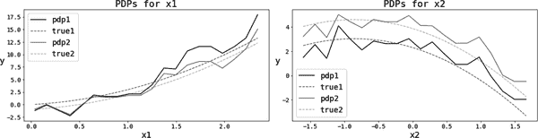

###### 图 13-10\. 使用两种方法在模拟数据中的 PDPs

尽管 PDPs 很棒，但它们受到相关特征偏差的影响。例如，如果<math alttext="x 1"><msub><mi>x</mi> <mn>1</mn></msub></math>和<math alttext="x 2"><msub><mi>x</mi> <mn>2</mn></msub></math>呈正相关，它们会同时具有较小或较大的值。但是使用 PDP 时，可能会在第二个特征对应的值较大时，对<math alttext="x 1"><msub><mi>x</mi> <mn>1</mn></msub></math>施加不现实的小值（从网格中取）。

要在实践中看到这一点，我模拟了上一个非线性模型的修改版本：

<math alttext="StartLayout 1st Row 1st Column y 2nd Column equals 3rd Column x 1 plus 2 x 1 squared minus 2 x 1 x 2 minus x 2 squared plus epsilon 2nd Row 1st Column x 1 comma x 2 2nd Column tilde 3rd Column upper N left-parenthesis bold 0 comma bold upper Sigma left-parenthesis rho right-parenthesis right-parenthesis 3rd Row 1st Column epsilon 2nd Column tilde 3rd Column upper N left-parenthesis 0 comma 5 right-parenthesis EndLayout" display="block"><mtable displaystyle="true"><mtr><mtd columnalign="right"><mi>y</mi></mtd> <mtd><mo>=</mo></mtd> <mtd columnalign="left"><mrow><msub><mi>x</mi> <mn>1</mn></msub> <mo>+</mo> <mn>2</mn> <msubsup><mi>x</mi> <mn>1</mn> <mn>2</mn></msubsup> <mo>-</mo> <mn>2</mn> <msub><mi>x</mi> <mn>1</mn></msub> <msub><mi>x</mi> <mn>2</mn></msub> <mo>-</mo> <msubsup><mi>x</mi> <mn>2</mn> <mn>2</mn></msubsup> <mo>+</mo> <mi>ϵ</mi></mrow></mtd></mtr> <mtr><mtd columnalign="right"><mrow><msub><mi>x</mi> <mn>1</mn></msub> <mo>,</mo> <msub><mi>x</mi> <mn>2</mn></msub></mrow></mtd> <mtd><mo>∼</mo></mtd> <mtd columnalign="left"><mrow><mi>N</mi> <mo>(</mo> <mn mathvariant="bold">0</mn> <mo>,</mo> <mi>Σ</mi> <mo>(</mo> <mi>ρ</mi> <mo>)</mo> <mo>)</mo></mrow></mtd></mtr> <mtr><mtd columnalign="right"><mi>ϵ</mi></mtd> <mtd><mo>∼</mo></mtd> <mtd columnalign="left"><mrow><mi>N</mi> <mo>(</mo> <mn>0</mn> <mo>,</mo> <mn>5</mn> <mo>)</mo></mrow></mtd></mtr></mtable></math>

现在，特征是从具有由相关参数索引的协方差矩阵的多元正态分布中绘制的。图 13-11 绘制了不相关（ <math alttext="rho equals 0"><mrow><mi>ρ</mi> <mo>=</mo> <mn>0</mn></mrow></math> ）和（ <math alttext="rho equals 0.9"><mrow><mi>ρ</mi> <mo>=</mo> <mn>0</mn> <mo>.</mo> <mn>9</mn></mrow></math> ）相关特征的估计和真实 PDPs，您可以轻松验证在特征相关时 PDPs 存在偏差。

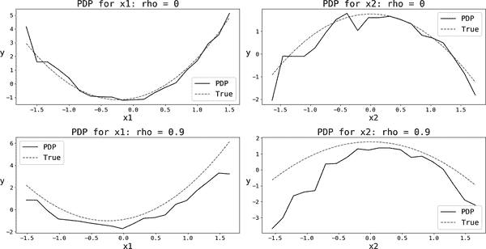

###### 图 13-11. 具有相关和不相关特征的 PDPs

## 累积本地效应

累积本地效应（ALE）是一种相对较新的方法，解决了处理相关特征时 PDPs 的缺陷。由于训练函数的评估次数较少，它也不那么计算密集。³

如前所述，PDP 的问题在于，在给定其与其他特征的相关性时，施加了特征的不现实值，从而偏倚了估计值。与以前一样，您首先为正在检查的任何特征*k*创建一个网格。ALE 通过以下三个步骤处理此问题：

关注本地效应

对于网格*g*中的给定值，仅选择数据中特征值落在该点邻域内的那些单位*i*（ <math alttext="StartSet i colon g minus delta less-than-or-equal-to x Subscript i k Baseline less-than-or-equal-to g plus delta EndSet"><mrow><mo>{</mo> <mi>i</mi> <mo>:</mo> <mi>g</mi> <mo>-</mo> <mi>δ</mi> <mo>≤</mo> <msub><mi>x</mi> <mrow><mi>i</mi><mi>k</mi></mrow></msub> <mo>≤</mo> <mi>g</mi> <mo>+</mo> <mi>δ</mi> <mo>}</mo></mrow></math> ）。对于相关特征，所有这些单位的所有其他变量的值应相对一致。

计算函数的斜率

在该邻域内，您计算每个单位的斜率，然后将这些斜率平均。

积累这些效应

出于可视化目的，所有这些效应都是累积的：这使您可以从网格中的邻域级别移动到特征的全局范围。

第二步非常重要：不仅要在网格的一个点上评估函数，而是在区间内计算函数的斜率。否则，你可能会把感兴趣特征的效果与其他高度相关的特征混淆。

图 13-12 显示了同一模拟数据集的 ALE，以及自举法得出的 90%置信区间。对于不相关的特征（第一行），ALE 在恢复真实效果方面表现出色。对于相关的特征（第二行），第二个特征的真实效果被正确地恢复，但第一个特征的某些部分仍显示出一些偏差；尽管如此，ALE 仍然比 PDP 做得更好。

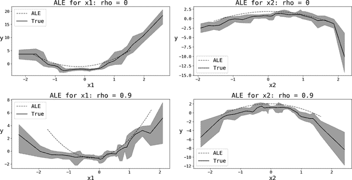

###### 图 13-12\. 同一模拟数据的 ALE（90% CI）

# 关键要点

这些是本章的关键要点：

机器学习中的整体叙事

在其最常见的用法中，ML 中的叙事行为发生在你开发模型并面对利益相关者之后。本章提出的整体方法支持一个视觉，即你的科学家角色创造并迭代通过故事帮助你创建一个良好预测模型，然后切换到更传统的销售人员角色。

Ex ante 叙事

Ex ante 叙事从创建关于你想预测的结果驱动因素的故事或假设开始。然后通过多步特征工程阶段将它们转化为特征。

Ex post 叙事

Ex post 叙事帮助你理解和解释模型预测的结果。像热图、偏依赖图和累积局部效应这样的技术应该帮助你讲述关于不同特征在结果中的作用的故事。特征重要性提供了一种排名它们的方式。

将叙事结构化为步骤

至少在开始阶段，从前瞻和事后叙事的角度来看，为你的叙事工具箱设置一些结构是很有益的。

# 进一步阅读

我在*《AI 和数据科学的分析技能》*中讨论了一阶和二阶效应。

Rolf Dobelli 的*《清晰思考的艺术》*（Harper）非常适合希望了解人类行为中存在的许多偏见和启发式的人。这些可以极大丰富你特定问题的假设集。

关于特征工程的问题，从数据转换的角度来看，有几本全面的参考书。你可以查看 Alice Zheng 和 Amanda Casari 的*《机器学习特征工程》*（O’Reilly），Sinan Ozdemir 的*《特征工程训练营》*（Manning），Soledad Galli 的*《Python 特征工程食谱》*，第二版（Packt Publishing），或者 Wing Poon 的[“机器学习特征工程”](https://oreil.ly/Zg3EI) 系列博文。

我从 Gareth James 等人的《统计学习导论及其在 R 中的应用》第二版（Springer）中的图 2.7 改编了图 13-5，并且作者[在线提供](https://oreil.ly/LZPDX)。如果您更感兴趣于获得直觉而非理解更多技术细节，强烈推荐这本书。

在机器学习可解释性方面，我强烈推荐 Christoph Molnar 的《可解释机器学习：使黑盒模型可解释的指南》（[在线获取](https://oreil.ly/FujJr)，独立出版，2023 年）。Trevor Hastie 等人的《统计学习基础：数据挖掘、推断与预测》第二版（Springer）在不同算法的特征重要性和可解释性方面有出色的讨论（特别是第 10.13 节和第 15.13.2 节）。最后，Michael Munn 和 David Pitman 在《面向实践者的可解释 AI：设计和实施可解释的 ML 解决方案》（O’Reilly）中对不同技术提供了非常全面和最新的概述。

关于 ALEs，您可以查阅 Daniel W. Apley 和 Jingyu Zhu 的原始文章“Visualizing the Effects of Predictor Variables in Black Box Supervised Learning Models”（2019 年 8 月，从[arXiv](https://oreil.ly/gbZlu)检索得到）。Molnar 在 ALE 方面的描述非常好，但这篇文章可以提供一些更少直觉算法的详细信息。

¹ 很容易证明在线性回归中，将特征<math alttext="x"><mi>x</mi></math>重新缩放到<math alttext="k x"><mrow><mi>k</mi> <mi>x</mi></mrow></math>会将真实系数从<math alttext="alpha"><mi>α</mi></math>改变为<math alttext="alpha slash k"><mrow><mi>α</mi> <mo>/</mo> <mi>k</mi></mrow></math>。

² 代码[仓库](https://oreil.ly/dshp-repo)上的实现提供了 ICE 和 PDP。

³ 在写作时，有两个 Python 包可用于计算 ALEs：[ALEPython](https://oreil.ly/znDHe)和[alibi](https://oreil.ly/QIZkS)。您可以在代码[仓库](https://oreil.ly/dshp-repo)中找到我对连续特征和无交互作用情况的实现。
