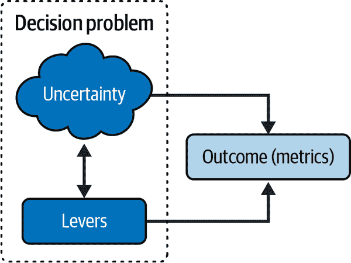
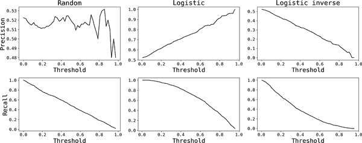
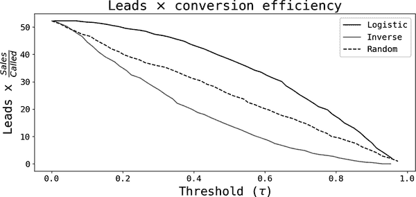
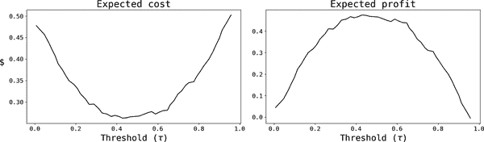
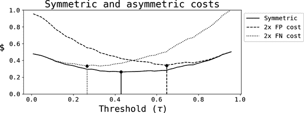

# 第十四章：从预测到决策

根据麦肯锡进行的[调查](https://oreil.ly/Kl_7y)，他们的受访组织中有 50%在 2022 年采用了人工智能（AI）或机器学习（ML），相较于 2017 年增长了 2.5 倍，但仍低于 2019 年的峰值（58%）。如果 AI 是[新的电力](https://oreil.ly/O_tsb)，而数据是[新的石油](https://oreil.ly/bU0xd)，那么在大语言模型（LLM）如 ChatGPT 和 Bard 出现之前为什么采用率会停滞呢？¹

尽管根本原因各不相同，但最直接的原因是大多数组织尚未找到积极的[投资回报率](https://oreil.ly/Stpro)（ROI）。在[“扩展组织学习中的 AI 影响”](https://oreil.ly/izJb7)中，Sam Ransbotham 及其合作者认为“只有 10%的公司从人工智能技术中获得显著的财务利益”。

这种投资回报率从何而来？在其核心，机器学习算法是预测性过程，因此我们自然期望大多数价值是通过改善决策能力来创造的。本章探讨了一些预测如何改善决策的方法。在此过程中，我将介绍一些实用方法，帮助您从预测转向改进决策。

# 分解决策制定

预测算法试图规避不确定性，在提高我们的决策能力方面非常重要。例如，我可以试图预测我家乡明天的天气，仅仅出于乐趣。但预测本身促进并改善了我们在面对这种不确定性时做出更好决策的能力。我们可以轻易找到许多使用案例，不同的人和组织愿意为这些信息付费（例如农民、派对策划者、电信行业、NASA 等政府机构）。

图 14-1 图示了不确定性在决策制定中的角色。从右侧开始，一旦不确定性被解决，就会有影响您关心的某些度量指标的结果。这一结果取决于您可以操作的杠杆（行动）集合及其与基础不确定性的相互作用。例如，您不知道今天是否会下雨（不确定性），而您关心的是保持舒适和干燥（结果）。您可以决定是否带伞（操作）。自然地，如果下雨了，带伞是最好的选择（保持干燥），但如果没有下雨，最佳决策是不带伞（因为您无需带着它更舒适）。

###### 图 14-1 不确定情况下的决策

在 Table 14-1 中，我整理了一些常见的 ML 用例，其中强调了决策和不确定性的角色以及一些可能的结果。 让我们来看看第一行，即健康保险的案例[理赔处理](https://oreil.ly/4V5Du)。 针对新的理赔，你必须决定是手动审查还是批准付款，因为理赔可能是不合法的。 不合法的理赔会不必要地增加保险公司的成本，但审查过程通常相当复杂，需要大量时间和精力。 如果你能正确预测，你可以降低预测误差和成本，同时提高客户满意度。

表 14-1\. ML 用例示例

| 类别 | 使用案例 | 决策 | 不确定性 | 结果 |
| --- | --- | --- | --- | --- |
| 服务运营 | 理赔处理 | 自动支付与审查 | 合法或不合法 | 减少手动流程（成本），提高客户满意度，减少欺诈 |
| 服务运营 | 人员配置 | 招聘或重新安置 | 员工规模依赖于需求 | 提高客户满意度，减少未使用资源（成本） |
| 服务运营 | 主动客户支持 | 是否联系客户 | 是否会有问题需要我解决 | 提高满意度和减少流失率 |
| 供应链优化 | 需求预测 | 管理库存 | 库存依赖于需求 | 提高销售并降低折旧成本 |
| 欺诈检测 | 反向支付预防 | 批准或拒绝交易 | 合法或不合法 | 减少与欺诈相关的成本，提高客户满意度 |
| 营销 | 潜在客户生成 | 是否联系潜在客户 | 是否购买 | 销售效率更高 |
| 基于 ML 的产品 | 推荐系统 | 推荐 A 还是 B | 是否购买 | 提高参与度，减少流失率 |

首先思考决策和结果，然后再考虑 ML 应用，可以帮助您在组织中发展强大的数据科学实践。

###### 提示

思考决策和杠杆是发现工作场所新 ML 用例的一个好方法。 过程如下：

1.  确定利益相关者所做的*关键*决策（以及相关的指标和杠杆）。

1.  理解不确定性的角色。

1.  为建立 ML 解决方案做商业案例。

# 智能阈值设定的简单决策规则

与回归相对，简单的决策规则在分类模型中以*阈值设定*的形式自然产生。 我将描述一个二项模型（两种结果）的情况，但这个原则同样适用于更一般的多项情况。 典型场景如下：

<math alttext="StartLayout 1st Row  Do left-parenthesis tau right-parenthesis equals StartLayout Enlarged left-brace 1st Row 1st Column upper A 2nd Column if 3rd Column ModifyingAbove p With caret Subscript i Baseline greater-than-or-equal-to tau 2nd Row 1st Column upper B 2nd Column if 3rd Column ModifyingAbove p With caret Subscript i Baseline less-than tau EndLayout EndLayout" display="block"><mtable displaystyle="true"><mtr><mtd columnalign="right"><mrow><mtext>Do</mtext> <mrow><mo>(</mo> <mi>τ</mi> <mo>)</mo></mrow> <mo>=</mo> <mfenced close="" open="{" separators=""><mtable><mtr><mtd columnalign="left"><mi>A</mi></mtd> <mtd columnalign="left"><mtext>if</mtext></mtd> <mtd><mrow><msub><mover accent="true"><mi>p</mi> <mo>^</mo></mover> <mi>i</mi></msub> <mo>≥</mo> <mi>τ</mi></mrow></mtd></mtr> <mtr><mtd columnalign="left"><mi>B</mi></mtd> <mtd columnalign="left"><mtext>if</mtext></mtd> <mtd><mrow><msub><mover accent="true"><mi>p</mi> <mo>^</mo></mover> <mi>i</mi></msub> <mo><</mo> <mi>τ</mi></mrow></mtd></mtr></mtable></mfenced></mrow></mtd></mtr></mtable></math>

这里 <math alttext="ModifyingAbove p With caret Subscript i"><msub><mover accent="true"><mi>p</mi> <mo>^</mo></mover> <mi>i</mi></msub></math> 是单位 *i* 的预测概率分数，<math alttext="tau"><mi>τ</mi></math> 是您选择的阈值。如果分数足够高，则规则激活动作 *A*，否则激活动作 *B*。请注意，如果用预测的连续结果替换预测概率，则类似的理由也适用。然而，在分类设置中固有的简化结构允许您在决策过程中考虑不同预测错误的成本。

简言之，一切归结为对假阳性和假阴性的深入理解。在二项模型中，结果通常标记为正（1）或负（0）。一旦您有了预测的概率分数和阈值，概率较高（较低）的单位被预测为正例（负例）。参见表 Table 14-2 中的混淆矩阵。

表 14-2\. 典型的混淆矩阵

| 实际/预测 | <math alttext="ModifyingAbove upper N With caret left-parenthesis tau right-parenthesis"><mrow><mover accent="true"><mi>N</mi> <mo>^</mo></mover> <mrow><mo>(</mo> <mi>τ</mi> <mo>)</mo></mrow></mrow></math> | <math alttext="ModifyingAbove upper P With caret left-parenthesis tau right-parenthesis"><mrow><mover accent="true"><mi>P</mi> <mo>^</mo></mover> <mrow><mo>(</mo> <mi>τ</mi> <mo>)</mo></mrow></mrow></math> |
| --- | --- | --- |
| N | TN | FP |
| P | FN | TP |

混淆矩阵中的行和列分别表示实际标签和预测标签。如前所述，预测的结果取决于选择的阈值（ <math alttext="tau"><mi>τ</mi></math> ）。因此，您可以将样本中的每个实例分类为真负例（*TN*）、真正例（*TP*）、假负例（*FN*）或假正例（*FP*），具体取决于预测标签是否与真实标签匹配。矩阵中的单元格表示每个类别的案例数。

## 精确度和召回率

分类问题中的两个常见性能指标是精确度和召回率：

<math alttext="StartLayout 1st Row 1st Column Precision 2nd Column equals 3rd Column StartFraction upper T upper P Over upper T upper P plus upper F upper P EndFraction 2nd Row 1st Column Recall 2nd Column equals 3rd Column StartFraction upper T upper P Over upper T upper P plus upper F upper N EndFraction EndLayout" display="block"><mtable displaystyle="true"><mtr><mtd columnalign="right"><mtext>Precision</mtext></mtd> <mtd><mo>=</mo></mtd> <mtd columnalign="left"><mfrac><mrow><mi>T</mi><mi>P</mi></mrow> <mrow><mi>T</mi><mi>P</mi><mo>+</mo><mi>F</mi><mi>P</mi></mrow></mfrac></mtd></mtr> <mtr><mtd columnalign="right"><mtext>Recall</mtext></mtd> <mtd><mo>=</mo></mtd> <mtd columnalign="left"><mfrac><mrow><mi>T</mi><mi>P</mi></mrow> <mrow><mi>T</mi><mi>P</mi><mo>+</mo><mi>F</mi><mi>N</mi></mrow></mfrac></mtd></mtr></mtable></math>

这两个指标都可以看作是真正例率，但每个指标考虑不同的情况。² 精确度回答的问题是：*在我说的所有正例中，实际上有多少是正的？* 另一方面，召回率回答的问题是：*在所有实际上是正例的情况下，我预测正确的百分比是多少？* 当您使用精确度作为您的考虑因素时，您实际上在考虑假阳性的成本；而对于召回率来说，重要的是假阴性的成本。

图 14-2 展示了针对模拟的潜在变量线性模型训练的三种替代模型的精确度和召回率曲线，用于平衡结果。第一列显示了一个分类器，通过在单位间隔内绘制随机均匀数来分配概率分数；这个*随机*分类器将作为基线。中间列绘制了从逻辑回归中获得的精确度和召回率。最后一列切换了预测的类别，故意创建了一个反向概率分数，其中更高的分数与更低的发病率相关联。

你可以轻松地看到几种模式：精确度始终从样本中的阳性案例的分数开始，可以是相对直的（随机分类器），增加或减少。大多数情况下，你会得到一个增加的精确度，因为大多数模型倾向于优于随机分类器，并且至少在某种程度上是对你想要预测的结果信息化的。尽管在理论上可能，但负斜率的精确度非常不可能。

精确度表现更好，在一个意义上，它始终从一个开始，然后降低到零，只有曲率会改变。一个漂亮的凹函数（中间图）通常可以预期，并且与模型健康分类的事实相关，得分通常是对所要预测事件的概率信息化的。

###### 图 14-2\. 不同模型的精确度和召回率

## 例子：潜在客户生成

以潜在客户生成活动为例，你对潜在客户进行评分，以预测哪些会以销售结束。你的数据包括历史上电话营销团队使用过的潜在客户样本的成功（销售）和失败（未销售）联系。

考虑一个简单的决策规则，即当预测的概率高于一个阈值时联系客户。FN 是一个如果被发送给营销团队会成为销售的潜在客户，而 FP 则是错误地发送给联系人，因此没有最终成交。误报负成本是由于销售损失而产生的未实现收入，误报正的成本是用于处理潜在客户的任何资源（例如，如果一个电话营销执行的小时薪水为$*X*，每个潜在客户的处理时间为*k*分钟，那么每个误报正的成本为$*kX/60*）。

简单的*量*阈值规则工作原理如下：销售团队告诉你每个周期（天或周）他们可以处理多少销量（*V*），然后你根据估计的概率分数发送给他们排名前*V*的潜在客户。显然，通过固定销量，你也隐含地设置了你的决策规则的阈值。

让我们来看一个简化的潜在客户生成漏斗（参见 第二章），以理解这种规则的影响：³

<math alttext="StartLayout 1st Row 1st Column Sales 2nd Column equals 3rd Column ModifyingBelow StartFraction Sales Over Called EndFraction With bottom-brace Underscript left-parenthesis 1 right-parenthesis Endscripts times ModifyingBelow StartFraction Called Over Leads EndFraction With bottom-brace Underscript left-parenthesis 2 right-parenthesis Endscripts times ModifyingBelow Leads With bottom-brace Underscript left-parenthesis 3 right-parenthesis Endscripts 2nd Row 1st Column Blank 2nd Column equals 3rd Column ModifyingBelow Conv period Eff left-parenthesis tau right-parenthesis With bottom-brace Underscript Precision Endscripts times Call Rate left-parenthesis FTE right-parenthesis times Leads left-parenthesis tau right-parenthesis EndLayout" display="block"><mtable displaystyle="true"><mtr><mtd columnalign="right"><mtext>Sales</mtext></mtd> <mtd><mo>=</mo></mtd> <mtd columnalign="left"><mrow><munder><munder accentunder="true"><mfrac><mtext>Sales</mtext> <mtext>Called</mtext></mfrac> <mo>︸</mo></munder> <mrow><mo>(</mo><mn>1</mn><mo>)</mo></mrow></munder> <mo>×</mo> <munder><munder accentunder="true"><mfrac><mtext>Called</mtext> <mtext>Leads</mtext></mfrac> <mo>︸</mo></munder> <mrow><mo>(</mo><mn>2</mn><mo>)</mo></mrow></munder> <mo>×</mo> <munder><munder accentunder="true"><mtext>Leads</mtext> <mo>︸</mo></munder> <mrow><mo>(</mo><mn>3</mn><mo>)</mo></mrow></munder></mrow></mtd></mtr> <mtr><mtd><mo>=</mo></mtd> <mtd columnalign="left"><mrow><munder><munder accentunder="true"><mrow><mtext>Conv.</mtext><mtext>Eff</mtext><mo>(</mo><mi>τ</mi><mo>)</mo></mrow> <mo>︸</mo></munder> <mtext>Precision</mtext></munder> <mo>×</mo> <mtext>Call</mtext> <mtext>Rate</mtext> <mrow><mo>(</mo> <mtext>FTE</mtext> <mo>)</mo></mrow> <mo>×</mo> <mtext>Leads</mtext> <mrow><mo>(</mo> <mi>τ</mi> <mo>)</mo></mrow></mrow></mtd></mtr></mtable></math>

总销售额取决于转化效率（1）、通话率（2）和潜在客户量（3）。请注意，转化效率和潜在客户量取决于您选择的阈值：在理想情况下，转化效率等于您模型的*精度*，而潜在客户数量则取决于分数分布。另一方面，通话率取决于销售团队的全职等效人数（FTE）或总人数：足够大的销售团队将能够拨打样本中的每一个潜在客户。

通过这个您可以看到量规则何时何地可能起作用。通过按照预测分数按降序对潜在客户进行排序，并仅联系排名前*V*的客户，您可以优化转化效率（因为精度是预测分类模型中的一个增函数）。您还可以照顾电话营销团队中的空闲资源：如果您发送超过他们能够处理的数量，当前时间窗口内评分较低的潜在客户将不会被联系；如果您发送得少，将会有闲置的销售代理人。

图表 14-3 绘制了作为相同模拟样本和之前使用的三个模型之一设置的阈值的函数的（1）和（3）的乘积。从右向左移动，您可以看到降低阈值总是从总销售额的角度来看更好，解释了为什么量规则通常对电话营销团队效果良好。

###### 图 14-3\. 优化总销售额

由于该图可能暗示您应将阈值设置为零（拨打每个评分潜在客户）而不仅仅是遵循量规则，这可能导致一些混淆。换句话说，销售团队是否应雇佣确保通话率最大化并联系所有潜在客户的确切 FTE 数量？答案是否定的：如果分数具有信息性，那么预测得分较低的潜在客户也更不可能转化，因此额外 FTE 的成本（确定的）将大于（不确定的）额外销售收益。量规则假设团队规模固定，并且然后根据此团队规模最大化精度和销售。

# 混淆矩阵优化

潜在客户生成的情况有些特殊，因为您实际上对假阴性置零，并且只专注于优化精度。但对于大多数问题来说这并不适用（即使是在潜在客户生成方面，也有理由在阈值选择中考虑假阳性）。要看到这一点，请考虑欺诈案例，对于任何进入的交易，您需要预测其是否会存在欺诈行为。

典型的决策规则会针对足够大的概率分数阻止交易。假阳性通常会导致愤怒的客户（降低客户满意度和增加流失率）。另一方面，假阴性会直接产生欺诈成本。这种紧张关系引发了阈值选择的有趣优化问题。

总体思路是找到*最小化*由于错误预测而产生的预期成本的阈值；或者，如果您认为还应包括正确预测的价值，您可以选择*最大化*预期利润的阈值。这可以表示为：

<math alttext="StartLayout 1st Row 1st Column upper E left-parenthesis Cost right-parenthesis left-parenthesis tau right-parenthesis 2nd Column equals 3rd Column upper P Subscript upper F upper P Baseline left-parenthesis tau right-parenthesis c Subscript upper F upper P plus upper P Subscript upper F upper N Baseline left-parenthesis tau right-parenthesis c Subscript upper F upper N 2nd Row 1st Column upper E left-parenthesis Profit right-parenthesis left-parenthesis tau right-parenthesis 2nd Column equals 3rd Column upper P Subscript upper T upper P Baseline left-parenthesis tau right-parenthesis b Subscript upper T upper P plus upper P Subscript upper T upper N Baseline left-parenthesis tau right-parenthesis b Subscript upper T upper N minus left-parenthesis upper P Subscript upper F upper P Baseline left-parenthesis tau right-parenthesis c Subscript upper F upper P Baseline plus upper P Subscript upper F upper N Baseline left-parenthesis tau right-parenthesis c Subscript upper F upper N Baseline right-parenthesis EndLayout" display="block"><mtable displaystyle="true"><mtr><mtd columnalign="right"><mrow><mi>E</mi> <mo>(</mo> <mtext>Cost</mtext> <mo>)</mo> <mo>(</mo> <mi>τ</mi> <mo>)</mo></mrow></mtd> <mtd><mo>=</mo></mtd> <mtd columnalign="left"><mrow><msub><mi>P</mi> <mrow><mi>F</mi><mi>P</mi></mrow></msub> <mrow><mo>(</mo> <mi>τ</mi> <mo>)</mo></mrow> <msub><mi>c</mi> <mrow><mi>F</mi><mi>P</mi></mrow></msub> <mo>+</mo> <msub><mi>P</mi> <mrow><mi>F</mi><mi>N</mi></mrow></msub> <mrow><mo>(</mo> <mi>τ</mi> <mo>)</mo></mrow> <msub><mi>c</mi> <mrow><mi>F</mi><mi>N</mi></mrow></msub></mrow></mtd></mtr> <mtr><mtd columnalign="right"><mrow><mi>E</mi> <mo>(</mo> <mtext>Profit</mtext> <mo>)</mo> <mo>(</mo> <mi>τ</mi> <mo>)</mo></mrow></mtd> <mtd><mo>=</mo></mtd> <mtd columnalign="left"><mrow><msub><mi>P</mi> <mrow><mi>T</mi><mi>P</mi></mrow></msub> <mrow><mo>(</mo> <mi>τ</mi> <mo>)</mo></mrow> <msub><mi>b</mi> <mrow><mi>T</mi><mi>P</mi></mrow></msub> <mo>+</mo> <msub><mi>P</mi> <mrow><mi>T</mi><mi>N</mi></mrow></msub> <mrow><mo>(</mo> <mi>τ</mi> <mo>)</mo></mrow> <msub><mi>b</mi> <mrow><mi>T</mi><mi>N</mi></mrow></msub> <mo>-</mo> <mrow><mo>(</mo> <msub><mi>P</mi> <mrow><mi>F</mi><mi>P</mi></mrow></msub> <mrow><mo>(</mo> <mi>τ</mi> <mo>)</mo></mrow> <msub><mi>c</mi> <mrow><mi>F</mi><mi>P</mi></mrow></msub> <mo>+</mo> <msub><mi>P</mi> <mrow><mi>F</mi><mi>N</mi></mrow></msub> <mrow><mo>(</mo> <mi>τ</mi> <mo>)</mo></mrow> <msub><mi>c</mi> <mrow><mi>F</mi><mi>N</mi></mrow></msub> <mo>)</mo></mrow></mrow></mtd></mtr></mtable></math>

其中 <math alttext="upper P Subscript x Baseline comma c Subscript x Baseline comma b Subscript x Baseline"><mrow><msub><mi>P</mi> <mi>x</mi></msub> <mo>,</mo> <msub><mi>c</mi> <mi>x</mi></msub> <mo>,</mo> <msub><mi>b</mi> <mi>x</mi></msub></mrow></math> 表示真阳性或假阳性或假阴性（*x*）的概率及其相关成本或利益。概率是使用混淆矩阵中的频率来估算的，如 <math alttext="upper P Subscript x Baseline equals n Subscript x Baseline slash sigma-summation Underscript y Endscripts n Subscript y"><mrow><msub><mi>P</mi> <mi>x</mi></msub> <mo>=</mo> <msub><mi>n</mi> <mi>x</mi></msub> <mo>/</mo> <msub><mo>∑</mo> <mi>y</mi></msub> <msub><mi>n</mi> <mi>y</mi></msub></mrow></math> ，并依赖于选择的阈值。⁵

图 14-4 显示了使用与之前相同的模拟数据集的样本估计；重要的是，我假设所有成本和收益都具有相同的值（归一化为一）。您可以看到，对于成本（左侧）和利润优化（右侧），最优阈值约为 0.5，这在具有平衡结果和对称成本/收益结构的模型中是预期的。

###### 图 14-4\. 对称预期成本和利润

图 14-5 显示了将假阳性和假阴性成本加倍对最优阈值的影响。从方向上讲，您可以预期增加假阳性的成本会增加阈值，因为您更加关注模型的精确性。相反，增加假阴性的成本会降低最优阈值，因为您更加关注召回率。

###### 图 14-5\. 非对称预期成本

您可以使用此方法找到适当的阈值，将您的分类模型转换为决策规则。该过程涉及以下步骤：

1.  使用具有良好预测性能的分类器进行训练。

1.  为了成本最小化，设置适当的预测错误成本。由于问题的结构，您只需有相对成本（例如，*假阴性的成本是假阳性的 3 倍*；也就是说，您可以相对于一个结果来归一化一切）。

1.  利润最大化也适用类似的考虑。

1.  这些可以针对不同的阈值进行计算和优化。

# 主要要点

这些是本章的要点：

如果您希望为您的数据科学实践找到正面的投资回报率，从预测转向决策至关重要。

机器学习是一组预测算法，首先可以极大地提升您组织的决策能力。

机器学习中充斥着阈值决策规则。

许多回归和分类模型产生简单的决策规则，如果预测结果大于、等于或低于预定阈值，则触发动作。

分类模型中的决策规则。

由于简化的结果结构，分类模型产生易于优化的决策规则。这种优化路径考虑了不同预测结果（真阳性或假阳性或真阴性或假阴性）的成本和效益。我展示了当您只关心模型精度时如何产生简单的体积阈值规则，以及更全面的情况，其中假阳性和假阴性问题。

# 进一步阅读

我的书 *Analytical Skills for AI and Data Science* 深入探讨了本章许多主题。重要的是，我没有涵盖这里描述的阈值优化实际问题。

Ajay Agrawal 等人的 *Power and Prediction: The Disruptive Economics of Artificial Intelligence*（哈佛商业评论出版社）强调 AI 和 ML 改善我们决策能力的潜力将如何影响经济。

¹ 甚至可以质疑 LLMs 是否真的会显著改变采纳趋势。我认为基础原理至少在机器达到人工智能通用性之前*尚未*真正改变。但我将在第十七章讨论这个话题。

² 请注意，在机器学习文献中，召回率通常被视为*真阳性率*。

³ 我假设联系比率为 1，因此每通电话都以联系结束。在实际应用中通常并非如此，因此不仅需要扩展销售漏斗，还可能需要调整您的模型。

⁴ 样本大小已标准化为 100，结果平衡，因此只有约 50 个真阳性案例。

⁵ 尽管这对于利润计算是正确的，但在成本计算中，您可能希望使用条件概率，考虑到预测误差。所选阈值不变，因为这相当于目标函数的重新缩放。
