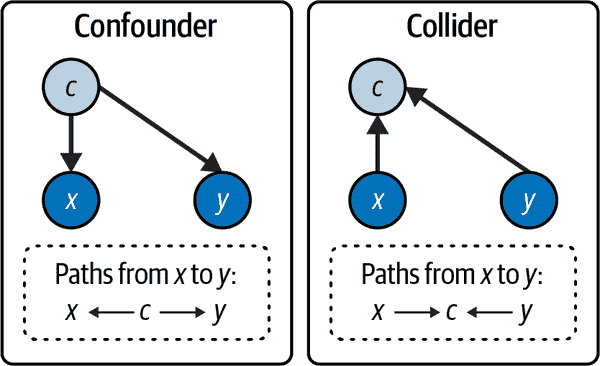
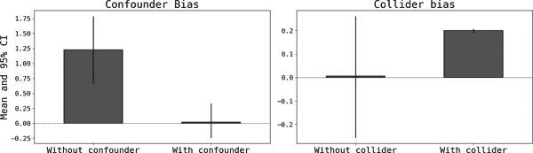
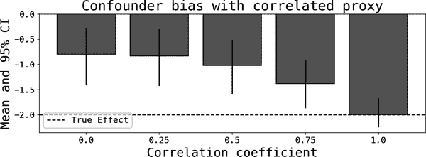
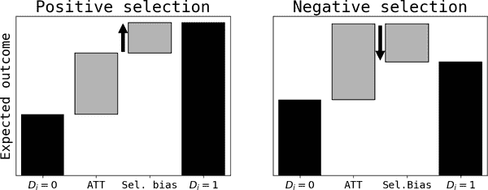
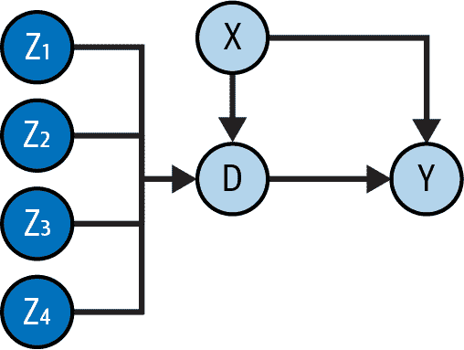
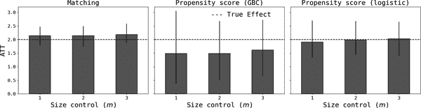
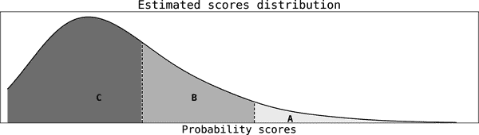

# 第十五章：增量性：数据科学的圣杯？

在[过去](https://oreil.ly/or6gY) 中，我曾经争论过*增量性是数据科学的圣杯* 。 这一声明在很大程度上依赖于我一直维持的假设：即数据科学通过提升公司的决策能力来创造价值。 本章扩展了这个主题，但更重要的是，我将介绍一些技术，这些技术应该建立一些基本的直觉，如果您决定更深入地研究时将会很有用。 通常情况下，这个主题值得一本书来详细阐述，因此我会在本章末尾提供几个参考资料。

# 定义增量性

*增量性* 只是应用于决策分析的*因果推断* 的另一个名称。 如果您还记得图 14-1，一个典型的决策包括一个行动或杠杆，以及依赖于潜在不确定性的结果。 如果杠杆*改善* 结果，并且您能够分离可能解释变化的任何其他因素，那么您可以（以某种程度的信心）说这是增量的。 供日后参考，行动也被称为*治疗*，遵循更经典的医学文献中控制实验的做法，其中一些患者接受治疗，其余的*对照组* 接受安慰剂。

因果关系通常通过使用*反事实* 来定义。 与事实（我们观察到的东西）相对，反事实试图回答这个问题：*如果我采取了不同的行动，会怎样？* 然后，您可以说一个行动对结果有因果影响，如果结果在所有可能的反事实中是唯一的。

例如，想象一下，您可以拉动一个二元杠杆，只有两种可能的行动，*A* 和 *B*（例如提供价格折扣或不提供），并观察到一个结果 *Y*（收入）。 您最终给所有客户打折，并发现收入增加了。 折扣对收入是增量的吗？ 或者，这种效果是*因果*的吗？ 要回答这些问题，您需要估算反事实收入，其中其他所有因素保持不变，唯一变化的是您不给折扣。 这些*潜在结果* 的差异就是折扣的因果效应。¹

通过量化增量性，您能够识别并选择使公司走向改善路径的行动。 这通常与*指导性* 分析相关联，与其描述性和预测性的对应项相对。 大多数从事机器学习（ML）的数据科学家严格专注于预测，并几乎不花时间思考因果关系，因此您可能会想知道这是否真的是一个需要学习的关键技能。 在转向更实际的事务之前，我将辩称它确实如此。

## 用因果推理来改进预测

即使你将自己的角色限制为数据科学家仅仅进行预测，你也应该从非常广义的角度关注因果关系。正如在第十三章中所论述的，要设计出良好的预测特征，你需要对你想预测的结果有一些基本的因果直觉。这可以从监督学习的定义中看出：

<math alttext="y equals f left-parenthesis x 1 comma x 2 comma midline-horizontal-ellipsis right-parenthesis" display="block"><mrow><mi>y</mi> <mo>=</mo> <mi>f</mi> <mo>(</mo> <msub><mi>x</mi> <mn>1</mn></msub> <mo>,</mo> <msub><mi>x</mi> <mn>2</mn></msub> <mo>,</mo> <mo>⋯</mo> <mo>)</mo></mrow></math>

鉴于你的特征和结果<math alttext="StartSet x Subscript k Baseline comma y EndSet"><mrow><mo>{</mo> <msub><mi>x</mi> <mi>k</mi></msub> <mo>,</mo> <mi>y</mi> <mo>}</mo></mrow></math>的变化，任务是学习数据生成过程（<math alttext="f left-parenthesis right-parenthesis"><mrow><mi>f</mi> <mo>(</mo> <mo>)</mo></mrow></math>）。但这隐含地假设了从特征到结果的因果关系。特征工程的过程始于对类型为“高于特征<math alttext="k"><mi>k</mi></math>值增加结果”的因果假设的阐述。此外，如果你包括与结果虚假相关的特征，你的模型的预测性能可能会受到负面影响，正如在第十章中所解释的那样。

## 因果推理作为一个区分因素

在撰写本书时，GPT-4 和类似的大型语言模型（LLMs）正在让我们重新思考人类在许多领域中的角色。数据科学家在[自动化机器学习的出现](https://oreil.ly/afagR)之前已经听说过这些风险。

但是，如果你让机器处理一切可以自动化的事情，并且把你独特的人类能力放在它们的顶部，这些技术可以使你变得更加高效。即使有了最新的进展，看起来可以安全地预测，目前人类唯一适合通过反事实推理和建立世界工作模型来进行因果推理。第十七章详细讨论了这个主题。

## 提升决策能力

还有一个问题，即如何为你的组织创造价值。正如我在整本书中所论述的，数据科学家具备提升公司决策能力的技能。如果你选择这条路，增量性*是*圣杯，你无法逃避思考因果关系。

但这条路也要求你重新思考你作为数据科学家的角色，将其从仅仅预测增强到决策制定（其中预测起着重要但次要的角色）。

典型场景是推出新功能或新产品。推出新功能时，最好有一个你试图优化的结果或指标。例如，你可能关心客户参与度，如活动时间或页面访问频率来衡量。如果你能够表明该功能对这一指标有增量影响，你可以建议扩展其使用或增强它。另外，如果你发现它并没有带来增量，甚至更糟的是，该指标恶化了，最好的做法是撤销这个功能。

推出新产品还增加了更有趣的*蚕食*概念。例如，当[Apple](https://oreil.ly/QarTm)决定推出 iPhone 时，iPod 的销售显著下降，因此被蚕食。类似地，[Netflix](https://oreil.ly/Zu5jM)的流媒体业务最终取代并蚕食了最初的在线 DVD 租赁业务。稍有不同的最后一个例子是[Starbucks](https://oreil.ly/BCgCA)开设一家新店可能会蚕食周围店铺的销售。在所有这些情况下，估算新产品或店铺的增量对公司的损益表和决策能力都有深远的影响。

# 混淆因素和碰撞因素

第十章提到混淆因素和糟糕的控制是线性回归中可能出错的示例。掌握这些概念在处理因果关系时再次具有关键的实际意义。我现在将回顾这些概念，并突出一些你在考虑增量时应该注意的地方。

一个非常有用的思考因果关系的工具是有向无环图（DAGs）。*图* 是一组节点和节点之间的链接。在这种设置中，节点代表变量，链接表示因果关系。当链接被定向解释时，图变成*有向* 的。例如，如果 *x* 导致 *y*，那么会有一个有向链接 <math alttext="x right-arrow y"><mrow><mi>x</mi> <mo>→</mo> <mi>y</mi></mrow></math> 。*无环* 一词排除了循环的存在；如果 <math alttext="x right-arrow y"><mrow><mi>x</mi> <mo>→</mo> <mi>y</mi></mrow></math>，那么不可能有 <math alttext="x left-arrow y"><mrow><mi>x</mi> <mo>←</mo> <mi>y</mi></mrow></math>，因此因果关系是单向的。计算机科学家和图灵奖获得者朱迪亚·珀尔（Judea Pearl）开发并推广了使用 DAGs 进行因果分析的方法。根据你的数据和 DAG，问题是你能否*识别*特定的因果效应。识别与*估计*不同，估计使用统计技术计算样本估计量。²

图 15-1 展示了混杂因素和碰撞器的最简单情况的 DAG 图，这里没有从 *x* 到 *y* 的因果效应。左边的 DAG 显示了两个因果关系（ <math alttext="c right-arrow x comma c right-arrow y"><mrow><mi>c</mi> <mo>→</mo> <mi>x</mi> <mo>,</mo> <mi>c</mi> <mo>→</mo> <mi>y</mi></mrow></math> ），因此 *c* 是 *x* 和 *y* 的共同原因。右边也有两个因果关系（ <math alttext="c left-arrow x comma c left-arrow y"><mrow><mi>c</mi> <mo>←</mo> <mi>x</mi> <mo>,</mo> <mi>c</mi> <mo>←</mo> <mi>y</mi></mrow></math> ），因此 *c* 是 *x* 和 *y* 的共同结果。



###### 图 15-1\. 有混杂因素和碰撞器的 DAG 图：没有因果效应

当两个可能无关的变量（ <math alttext="x comma y"><mrow><mi>x</mi> <mo>,</mo> <mi>y</mi></mrow></math> ）有一个共同的原因（ <math alttext="c"><mi>c</mi></math> ）时，会出现混杂因素偏差。如果你在 *y* 对 *x* 的回归中运行，*不控制 <math alttext="c"><mi>c</mi></math>* ，你会发现它们是虚假相关的。如果混杂因素是可观察的，你只需要对混杂因素进行条件处理，如果有因果关系，它将被确定。问题出现在 *未观察到* 的混杂因素上，因为根据定义，你无法控制它们。在这种情况下，你将无法确定因果效应是否存在。

碰撞器（*collider*）是两个变量的常见效应，是糟糕控制的典型例子，这意味着将其包含在回归中会偏离你的估计。如果你在 *y* 对 *x* 的回归中控制了 *c*，你会发现一个不存在的虚假关系。

为了了解发生的情况，我模拟了以下数据生成过程，涉及到混杂因素（请注意，从 *x* 到 *y* 没有因果效应）：

<math alttext="StartLayout 1st Row 1st Column c 2nd Column tilde 3rd Column upper N left-parenthesis 0 comma 1 right-parenthesis 2nd Row 1st Column epsilon Subscript x 2nd Column tilde 3rd Column upper N left-parenthesis 0 comma 1 right-parenthesis 3rd Row 1st Column epsilon Subscript y 2nd Column tilde 3rd Column upper N left-parenthesis 0 comma 2 right-parenthesis 4th Row 1st Column x 2nd Column equals 3rd Column 10 plus 0.5 c plus epsilon Subscript x 5th Row 1st Column y 2nd Column equals 3rd Column negative 2 plus 3 c plus epsilon Subscript y EndLayout" display="block"><mtable displaystyle="true"><mtr><mtd columnalign="right"><mi>c</mi></mtd> <mtd><mo>∼</mo></mtd> <mtd columnalign="left"><mrow><mi>N</mi> <mo>(</mo> <mn>0</mn> <mo>,</mo> <mn>1</mn> <mo>)</mo></mrow></mtd></mtr> <mtr><mtd columnalign="right"><msub><mi>ϵ</mi> <mi>x</mi></msub></mtd> <mtd><mo>∼</mo></mtd> <mtd columnalign="left"><mrow><mi>N</mi> <mo>(</mo> <mn>0</mn> <mo>,</mo> <mn>1</mn> <mo>)</mo></mrow></mtd></mtr> <mtr><mtd columnalign="right"><msub><mi>ϵ</mi> <mi>y</mi></msub></mtd> <mtd><mo>∼</mo></mtd> <mtd columnalign="left"><mrow><mi>N</mi> <mo>(</mo> <mn>0</mn> <mo>,</mo> <mn>2</mn> <mo>)</mo></mrow></mtd></mtr> <mtr><mtd columnalign="right"><mi>x</mi></mtd> <mtd><mo>=</mo></mtd> <mtd columnalign="left"><mrow><mn>10</mn> <mo>+</mo> <mn>0</mn> <mo>.</mo> <mn>5</mn> <mi>c</mi> <mo>+</mo> <msub><mi>ϵ</mi> <mi>x</mi></msub></mrow></mtd></mtr> <mtr><mtd columnalign="right"><mi>y</mi></mtd> <mtd><mo>=</mo></mtd> <mtd columnalign="left"><mrow><mo>-</mo> <mn>2</mn> <mo>+</mo> <mn>3</mn> <mi>c</mi> <mo>+</mo> <msub><mi>ϵ</mi> <mi>y</mi></msub></mrow></mtd></mtr></mtable></math>

类似地，碰撞器的数据生成过程如下（同样，从 *x* 到 *y* 没有因果效应）：

<math alttext="StartLayout 1st Row 1st Column epsilon Subscript x 2nd Column tilde 3rd Column upper N left-parenthesis 0 comma 1 right-parenthesis 2nd Row 1st Column epsilon Subscript y 2nd Column tilde 3rd Column upper N left-parenthesis 0 comma 2 right-parenthesis 3rd Row 1st Column epsilon Subscript c 2nd Column tilde 3rd Column upper N left-parenthesis 0 comma 0.1 right-parenthesis 4th Row 1st Column x 2nd Column equals 3rd Column 10 plus epsilon Subscript x 5th Row 1st Column y 2nd Column equals 3rd Column negative 2 plus epsilon Subscript y 6th Row 1st Column c 2nd Column equals 3rd Column 5 minus 2 x plus 10 y plus epsilon Subscript c EndLayout" display="block"><mtable displaystyle="true"><mtr><mtd columnalign="right"><msub><mi>ϵ</mi> <mi>x</mi></msub></mtd> <mtd><mo>∼</mo></mtd> <mtd columnalign="left"><mrow><mi>N</mi> <mo>(</mo> <mn>0</mn> <mo>,</mo> <mn>1</mn> <mo>)</mo></mrow></mtd></mtr> <mtr><mtd columnalign="right"><msub><mi>ϵ</mi> <mi>y</mi></msub></mtd> <mtd><mo>∼</mo></mtd> <mtd columnalign="left"><mrow><mi>N</mi> <mo>(</mo> <mn>0</mn> <mo>,</mo> <mn>2</mn> <mo>)</mo></mrow></mtd></mtr> <mtr><mtd columnalign="right"><msub><mi>ϵ</mi> <mi>c</mi></msub></mtd> <mtd><mo>∼</mo></mtd> <mtd columnalign="left"><mrow><mi>N</mi> <mo>(</mo> <mn>0</mn> <mo>,</mo> <mn>0</mn> <mo>.</mo> <mn>1</mn> <mo>)</mo></mrow></mtd></mtr> <mtr><mtd columnalign="right"><mi>x</mi></mtd> <mtd><mo>=</mo></mtd> <mtd columnalign="left"><mrow><mn>10</mn> <mo>+</mo> <msub><mi>ϵ</mi> <mi>x</mi></msub></mrow></mtd></mtr> <mtr><mtd columnalign="right"><mi>y</mi></mtd> <mtd><mo>=</mo></mtd> <mtd columnalign="left"><mrow><mo>-</mo> <mn>2</mn> <mo>+</mo> <msub><mi>ϵ</mi> <mi>y</mi></msub></mrow></mtd></mtr> <mtr><mtd columnalign="right"><mi>c</mi></mtd> <mtd><mo>=</mo></mtd> <mtd columnalign="left"><mrow><mn>5</mn> <mo>-</mo> <mn>2</mn> <mi>x</mi> <mo>+</mo> <mn>10</mn> <mi>y</mi> <mo>+</mo> <msub><mi>ϵ</mi> <mi>c</mi></msub></mrow></mtd></mtr></mtable></math>

然后我进行了一个蒙特卡洛（MC）模拟，在这里我估计了在是否控制 *c* 的情况下，*y* 对 *x* 的线性回归。我报告了特征 *x* 的估计系数和 95% 置信区间在 图 15-2。



###### 图 15-2\. 混杂因素和碰撞器偏差（参数估计和 95% 置信区间）

对于混杂因素的情况，如果不控制 *c*，会产生一个统计显著的虚假相关，错误地表明 *x* 和 *y* 有关联（更糟糕的是，你可能会得出 *x* 导致 *y* 的结论）。显著的是，一旦在回归中包含混杂因素，这种相关性就会消失，从而对不存在的关系做出正确推断。

对于碰撞者，情况恰恰相反：由于它是一个不好的控制变量，从回归中*排除*它可以让你估计到*x*对*y*的统计上不显著的影响。如果你错误地认为*c*应该作为一个特征包含进来，最终会得出在实际不存在因果效应的结论。

这两种偏倚在应用中普遍存在，不幸的是，它们在很大程度上取决于你对结果的因果模型。换句话说，在尝试估计因果效应之前，你必须提出一个（DAG）模型来描述你的结果。只有这样，你才能决定你的可用数据是否足以识别给定因果效应。具体来说，你必须控制任何混淆因素，并确保你不控制碰撞者（有时这两个考虑会互相冲突，因为一个变量可能既是混淆因素又是碰撞者）。

这个过程通常被称为*反门标准*：对于混淆因素，你必须通过控制它们关闭任何反门，而对于碰撞者则相反；否则，你会打开这些反门，无法确定因果效应。³

另一个经常出现的实际问题与代理混淆因素有关。如前所述，未观察到的混淆因素阻止了因果效应的识别，因此你可能会倾向于使用与混淆因素有一定相关性的代理变量。希望仍能使用这些不太理想的替代品来估计因果效应。不幸的是，答案并不乐观：偏倚的程度在很大程度上取决于相关性的强度。图 15-3 展示了这一点，这是一个关于混淆因素和*x*对*y*真实因果效应的 MC 模拟案例。⁴



###### 图 15-3\. 具有相关代理的混淆偏倚

# 选择偏倚

*选择偏倚* 是因果分析中非常重要的概念，但它对不同学派有[不同的含义](https://oreil.ly/TGxkr)。对于统计学家和经济学家来说，它与进入治疗的选择相关，对于计算机科学家来说，则指的是改变受访者样本的治疗后选择；前者是一种混淆偏倚，后者产生完全不同的 DAG（更好地与生存偏倚相关，如第 6 章 中讨论的）。在本节中，我将引用前者（选择进入治疗），这通常与潜在结果文献相关。现在我将介绍这种标记法。⁵

潜在结果的概念与反事实情形密切相关。考虑二进制处理（<math alttext="upper D"><mi>D</mi></math> ），其中每个单元 *i* 要么获得它（<math alttext="upper D Subscript i Baseline equals 1"><mrow><msub><mi>D</mi> <mi>i</mi></msub> <mo>=</mo> <mn>1</mn></mrow></math> ），要么不获得它（<math alttext="upper D Subscript i Baseline equals 0"><mrow><msub><mi>D</mi> <mi>i</mi></msub> <mo>=</mo> <mn>0</mn></mrow></math> ）。每种处理水平都有一个独特的潜在结果，分别表示获得或未获得处理，分别标记为 <math alttext="upper Y Subscript 1 i"><msub><mi>Y</mi> <mrow><mn>1</mn><mi>i</mi></mrow></msub></math> 或 <math alttext="upper Y Subscript 0 i"><msub><mi>Y</mi> <mrow><mn>0</mn><mi>i</mi></mrow></msub></math> 。对于每个单元，我们观察到其中一个且仅有一个潜在结果，标记为 <math alttext="upper Y Subscript i"><msub><mi>Y</mi> <mi>i</mi></msub></math> ；另一个潜在结果是反事实的，因此无法观察到。观察结果与潜在结果之间的关系可以总结为：

<math alttext="StartLayout 1st Row 1st Column upper Y Subscript i 2nd Column equals 3rd Column StartLayout Enlarged left-brace 1st Row  upper Y Subscript 1 i Baseline if upper D Subscript i Baseline equals 1 2nd Row  upper Y Subscript 0 i Baseline if upper D Subscript i Baseline equals 0 EndLayout EndLayout" display="block"><mtable displaystyle="true"><mtr><mtd columnalign="right"><msub><mi>Y</mi> <mi>i</mi></msub></mtd> <mtd><mo>=</mo></mtd> <mtd columnalign="left"><mfenced close="" open="{" separators=""><mtable><mtr><mtd columnalign="left"><mrow><msub><mi>Y</mi> <mrow><mn>1</mn><mi>i</mi></mrow></msub> <mtext>if</mtext> <msub><mi>D</mi> <mi>i</mi></msub> <mo>=</mo> <mn>1</mn></mrow></mtd></mtr> <mtr><mtd columnalign="left"><mrow><msub><mi>Y</mi> <mrow><mn>0</mn><mi>i</mi></mrow></msub> <mtext>if</mtext> <msub><mi>D</mi> <mi>i</mi></msub> <mo>=</mo> <mn>0</mn></mrow></mtd></mtr></mtable></mfenced></mtd></mtr></mtable></math>

或者，<math alttext="upper Y Subscript i Baseline equals upper Y Subscript 0 i Baseline plus left-parenthesis upper Y Subscript 1 i Baseline minus upper Y Subscript 0 i Baseline right-parenthesis upper D Subscript i"><mrow><msub><mi>Y</mi> <mi>i</mi></msub> <mo>=</mo> <msub><mi>Y</mi> <mrow><mn>0</mn><mi>i</mi></mrow></msub> <mo>+</mo> <mrow><mo>(</mo> <msub><mi>Y</mi> <mrow><mn>1</mn><mi>i</mi></mrow></msub> <mo>-</mo> <msub><mi>Y</mi> <mrow><mn>0</mn><mi>i</mi></mrow></msub> <mo>)</mo></mrow> <msub><mi>D</mi> <mi>i</mi></msub></mrow></math> ，这与对结果在处理虚拟变量和截距上进行线性回归的结构非常吻合。

用潜在结果来思考因果关系的一个优势是问题本质上是缺失数据问题。表 15-1 展示了一个例子，其中每行代表一个客户。您只观察到 *Y* 和 *D*，根据上述逻辑，您可以立即填写潜在结果。如果我们能够观察到每个反事实结果，我们就能够估计因果效应。

表 15-1\. 潜在结果和缺失数值

|  | Y | Y0 | Y1 | D |
| --- | --- | --- | --- | --- |
| 1 | 6.28 | 6.28 | NaN | 0 |
| 2 | 8.05 | 8.05 | NaN | 0 |
| 18 | 8.70 | NaN | 8.70 | 1 |
| 7 | 8.90 | NaN | 8.90 | 1 |
| 0 | 9.23 | 9.23 | NaN | 0 |
| 16 | 9.44 | NaN | 9.44 | 1 |

举例来说，假设我想估计为书籍提供伴随代码的 GitHub 仓库是否增加了书籍的销量。我的直觉是，知道有可用的代码会增加购买的可能性，可能是因为潜在客户认为这本书质量更高，或者因为他们知道有代码可以更轻松地学习路径，我希望量化这种影响，因为创建代码仓库是昂贵的。我会与我的网页访客样本进行沟通并提供（ <math alttext="上标 D 下标 i 基线 等于 1"><mrow><msub><mi>D</mi> <mi>i</mi></msub> <mo>=</mo> <mn>1</mn></mrow></math> ）；对于其余访客，我不会提供（ <math alttext="上标 D 下标 i 基线 等于 0"><mrow><msub><mi>D</mi> <mi>i</mi></msub> <mo>=</mo> <mn>0</mn></mrow></math> ）。结果是一个二进制变量，表示销售（ <math alttext="上标 Y 下标 i 基线 等于 1"><mrow><msub><mi>Y</mi> <mi>i</mi></msub> <mo>=</mo> <mn>1</mn></mrow></math> ）或无销售（ <math alttext="上标 Y 下标 i 基线 等于 0"><mrow><msub><mi>Y</mi> <mi>i</mi></msub> <mo>=</mo> <mn>0</mn></mrow></math> ）。

对于每个单元 *i*，<math alttext="上标 Y 下标 1 i 减去 上标 Y 下标 0 i"><mrow><msub><mi>Y</mi> <mrow><mn>1</mn><mi>i</mi></mrow></msub> <mo>-</mo> <msub><mi>Y</mi> <mrow><mn>0</mn><mi>i</mi></mrow></msub></mrow></math> 是提供代码的因果效应。由于每个单元只观察到其中一个，我们需要使用接受和未接受治疗的样本来估计它。估计它的一种自然方式是*均值差的观察值*：<math alttext="上标 E 左括号 上标 Y 下标 i 基线 竖线 上标 D 下标 i 基线 等于 1 右括号 减去 上标 E 左括号 上标 Y 下标 i 基线 竖线 上标 D 下标 i 基线 等于 0 右括号"><mrow><mi>E</mi> <mrow><mo>(</mo> <msub><mi>Y</mi> <mi>i</mi></msub> <mo>|</mo> <msub><mi>D</mi> <mi>i</mi></msub> <mo>=</mo> <mn>1</mn> <mo>)</mo></mrow> <mo>-</mo> <mi>E</mi> <mrow><mo>(</mo> <msub><mi>Y</mi> <mi>i</mi></msub> <mo>|</mo> <msub><mi>D</mi> <mi>i</mi></msub> <mo>=</mo> <mn>0</mn> <mo>)</mo></mrow></mrow></math> 。在实践中，您可以用样本矩代替期望得到<math alttext="上标 Y 横线 上标 D 下标 i 下标 等于 1 基线 减去 上标 Y 横线 上标 D 下标 i 下标 等于 0"><mrow><msub><mover><mi>Y</mi> <mo>¯</mo></mover> <mrow><msub><mi>D</mi> <mi>i</mi></msub> <mo>=</mo><mn>1</mn></mrow></msub> <mo>-</mo> <msub><mover><mi>Y</mi> <mo>¯</mo></mover> <mrow><msub><mi>D</mi> <mi>i</mi></msub> <mo>=</mo><mn>0</mn></mrow></msub></mrow></math> ，这解释了为什么我说它是*观察到的*。

不幸的是，观察到的差异在存在选择偏差时无法估计因果效应。

<math alttext="ModifyingBelow upper E left-parenthesis upper Y Subscript i Baseline vertical-bar upper D Subscript i Baseline equals 1 right-parenthesis minus upper E left-parenthesis upper Y Subscript i Baseline vertical-bar upper D Subscript i Baseline equals 0 right-parenthesis With bottom-brace Underscript Observed Difference in Means Endscripts equals ModifyingBelow upper E left-parenthesis upper Y Subscript 1 i Baseline minus upper Y Subscript 0 i Baseline vertical-bar upper D Subscript i Baseline equals 1 right-parenthesis With bottom-brace Underscript ATT left-parenthesis casual effect right-parenthesis Endscripts plus ModifyingBelow upper E left-parenthesis upper Y Subscript 0 i Baseline vertical-bar upper D Subscript i Baseline equals 1 right-parenthesis minus upper E left-parenthesis upper Y Subscript 0 i Baseline vertical-bar upper D Subscript i Baseline equals 0 right-parenthesis With bottom-brace Underscript Selection Bias Endscripts" display="block"><mrow><munder><munder accentunder="true"><mrow><mi>E</mi><mrow><mo>(</mo><msub><mi>Y</mi> <mi>i</mi></msub> <mo>|</mo><msub><mi>D</mi> <mi>i</mi></msub> <mo>=</mo><mn>1</mn><mo>)</mo></mrow><mo>-</mo><mi>E</mi><mrow><mo>(</mo><msub><mi>Y</mi> <mi>i</mi></msub> <mo>|</mo><msub><mi>D</mi> <mi>i</mi></msub> <mo>=</mo><mn>0</mn><mo>)</mo></mrow></mrow> <mo>︸</mo></munder> <mrow><mtext>Observed</mtext><mtext>Difference</mtext><mtext>in</mtext><mtext>Means</mtext></mrow></munder> <mo>=</mo> <munder><munder accentunder="true"><mrow><mi>E</mi><mo>(</mo><msub><mi>Y</mi> <mrow><mn>1</mn><mi>i</mi></mrow></msub> <mo>-</mo><msub><mi>Y</mi> <mrow><mn>0</mn><mi>i</mi></mrow></msub> <mo>|</mo><msub><mi>D</mi> <mi>i</mi></msub> <mo>=</mo><mn>1</mn><mo>)</mo></mrow> <mo>︸</mo></munder> <mrow><mtext>ATT</mtext><mtext>(casual</mtext><mtext>effect)</mtext></mrow></munder> <mo>+</mo> <munder><munder accentunder="true"><mrow><mi>E</mi><mrow><mo>(</mo><msub><mi>Y</mi> <mrow><mn>0</mn><mi>i</mi></mrow></msub> <mo>|</mo><msub><mi>D</mi> <mi>i</mi></msub> <mo>=</mo><mn>1</mn><mo>)</mo></mrow><mo>-</mo><mi>E</mi><mrow><mo>(</mo><msub><mi>Y</mi> <mrow><mn>0</mn><mi>i</mi></mrow></msub> <mo>|</mo><msub><mi>D</mi> <mi>i</mi></msub> <mo>=</mo><mn>0</mn><mo>)</mo></mrow></mrow> <mo>︸</mo></munder> <mrow><mtext>Selection</mtext><mtext>Bias</mtext></mrow></munder></mrow></math>

这种分解非常方便，因为它显示出在存在选择偏差的情况下，观察到的均值差异将偏离感兴趣的因果效应，通常用*接受治疗对象的平均处理效应*（ATT）表示。ATT 回答以下问题：仅看接受治疗的人群，其结果与如果他们没有接受治疗时的预期结果有什么不同？第二个结果是反事实的，因此差异提供了对其的因果效应。⁶

第三项表示选择偏差，并显示为什么观察到的均值差异可能偏离因果效应。为了解释这意味着什么，我现在将使用以下符号：

<math alttext="Selection Bias equals ModifyingBelow upper E left-parenthesis upper Y Subscript 0 i Baseline vertical-bar upper D Subscript i Baseline equals 1 right-parenthesis With bottom-brace Underscript upper A Endscripts minus ModifyingBelow upper E left-parenthesis upper Y Subscript 0 i Baseline vertical-bar upper D Subscript i Baseline equals 0 right-parenthesis With bottom-brace Underscript upper B Endscripts" display="block"><mrow><mtext>Selection</mtext> <mtext>Bias</mtext> <mo>=</mo> <munder><munder accentunder="true"><mrow><mi>E</mi><mo>(</mo><msub><mi>Y</mi> <mrow><mn>0</mn><mi>i</mi></mrow></msub> <mo>|</mo><msub><mi>D</mi> <mi>i</mi></msub> <mo>=</mo><mn>1</mn><mo>)</mo></mrow> <mo>︸</mo></munder> <mi>A</mi></munder> <mo>-</mo> <munder><munder accentunder="true"><mrow><mi>E</mi><mo>(</mo><msub><mi>Y</mi> <mrow><mn>0</mn><mi>i</mi></mrow></msub> <mo>|</mo><msub><mi>D</mi> <mi>i</mi></msub> <mo>=</mo><mn>0</mn><mo>)</mo></mrow> <mo>︸</mo></munder> <mi>B</mi></munder></mrow></math>

回到例子，你可以把代码库看作是一种昂贵的杠杆，公司（在这种情况下是我）可以分配给每个人，或者有选择性地分配。图 15-4 展示了两种类型的选择偏差。当存在正向（负向）选择时，因果效应往往被高估（低估）。



###### 图 15-4\. 正向和负向选择

让我们从正向选择开始，如果我将治疗方法给予那些已经*更有可能*购买这本书的人。或者，销售概率对于获得代码库的人来说更高，独立于杠杆的增量性。这意味着 <math alttext="upper A greater-than-or-equal-to upper B"><mrow><mi>A</mi> <mo>≥</mo> <mi>B</mi></mrow></math> ，从而高估了因果效应。类似的论点表明，负向选择下 <math alttext="upper A less-than-or-equal-to upper B"><mrow><mi>A</mi> <mo>≤</mo> <mi>B</mi></mrow></math> ，因果效应被低估。

在观察数据中，选择偏差普遍存在。要么你（或者公司的某人）选择了治疗的参与者，要么客户自行选择参与。代码库示例是公司选择的典型例子，但自我选择也非常常见。在第四章中，我介绍了*逆向选择*的概念，即那些在无法偿还贷款方面最危险的客户也更愿意接受提议。逆向选择是自我选择的常见示例。

###### 小贴士

深入理解你特定用例中的选择偏差，能在理解和估计因果关系的过程中帮助你取得很大进展。每当你关注增量性时，要问自己是否可能存在任何类型的选择偏差。这意味着你必须认真考虑进入你分析的治疗方法的选择机制。

幸运的是，检查选择偏倚在概念上是直观的：取一组*治疗前*变量*X*，并计算治疗组和对照组的差异。治疗前变量是可能影响选择进入治疗的变量。第六章展示了如何使用提升度，但基于统计原因，更常见的是使用均值差异而不是比率（因为这会导致标准*t*检验）。



###### 图 15-5\. 选择偏倚和混杂因素

图 15-5 显示了一个可以用来建模选择偏倚的 DAG 示例。有两组治疗前变量（ <math alttext="upper Z 1 comma midline-horizontal-ellipsis comma upper Z 4 comma upper X"><mrow><msub><mi>Z</mi> <mn>1</mn></msub> <mo>,</mo> <mo>⋯</mo> <mo>,</mo> <msub><mi>Z</mi> <mn>4</mn></msub> <mo>,</mo> <mi>X</mi></mrow></math> ），都会影响选择进入治疗（ <math alttext="upper D"><mi>D</mi></math> ）。结果（ <math alttext="upper Y"><mi>Y</mi></math> ）取决于治疗和 <math alttext="upper X"><mi>X</mi></math> 。注意*X*是一个混杂变量，变量 <math alttext="upper Z Subscript k"><msub><mi>Z</mi> <mi>k</mi></msub></math> 如果你控制治疗就不会产生偏倚。这些其他治疗前变量可能在治疗和对照组之间有所不同，但这些差异不会造成选择偏倚。

# 无混杂假设

有了这个理解，现在是时候介绍用于识别因果效应的主要假设了。这个假设有不同的名称，比如*无混杂性*、*可忽略性*、*条件交换性*、*可观察选择*和*条件独立性*。

该假设意味着潜在结果和选择进入治疗在一组观察到的控制条件下是统计独立的：

<math alttext="upper Y 0 comma upper Y 1 up-tack up-tack upper D vertical-bar upper X" display="block"><mrow><msub><mi>Y</mi> <mn>0</mn></msub> <mo>,</mo> <msub><mi>Y</mi> <mn>1</mn></msub> <mrow><mo>⊥</mo> <mo>⊥</mo> <mi>D</mi> <mo>|</mo> <mi>X</mi></mrow></mrow></math>

这一关键假设有两种不同的解释，一种是从决策者（选择机制的所有者）的角度，另一种是从数据科学家的角度。

从决策者开始，记住选择进入治疗的方法可以由客户（自我选择）或治疗的所有者（你，或者你公司的某人）完成。该假设禁止决策者考虑潜在结果。

例如，在讨论正向和负向选择时，我是选择机制的所有者，这明确取决于我是否希望激励更有可能有机购买的潜在客户。这等同于说选择**取决于潜在结果**：如果 <math alttext="upper Y Subscript 0 i Baseline equals 0"><mrow><msub><mi>Y</mi> <mrow><mn>0</mn><mi>i</mi></mrow></msub> <mo>=</mo> <mn>0</mn></mrow></math> ，客户没有获取存储库的权限，则我可能希望激励他们（负向选择）。正向选择也有类似的理由。这两种情况都可能导致无混杂性的违反。

从数据科学家的角度来看，您需要提前了解可能影响选择机制的所有相关变量（然后您可以控制它们并实现条件独立性）。希望您能明白因果推断之所以如此困难的原因：您不仅需要了解结果的正确模型（DAG），还需要观察所有相关变量。后者解释了为什么这个假设也被称为*可观测选择*。任何未观察到的混杂因素都会导致选择偏倚。对于观察数据，这两个条件都非常难以达到，这让我们进入了 A/B 测试。

# 打破选择偏倚：随机化

随机对照试验（RCT）或者企业术语中更为人熟知的 A/B 测试，是估计因果效应的典型方法。原因在于，通过设计，无混杂性假设得到了保证：进入治疗组的选择仅依赖于伪随机抽取的结果，使得其独立于潜在结果。

让我们看看这在实践中是如何工作的。您需要首先定义样本中的受试者比例（*p*），在大多数常见的 A/B 测试设计中，通常将其设为一半。然后，您从均匀分布（*u*）中抽取，并定义选择为：

<math alttext="StartLayout 1st Row  upper D Subscript i Baseline equals StartLayout Enlarged left-brace 1st Row 1st Column 1 2nd Column if 3rd Column u greater-than-or-equal-to p 2nd Row 1st Column 0 2nd Column if 3rd Column u less-than p EndLayout EndLayout" display="block"><mtable displaystyle="true"><mtr><mtd columnalign="right"><mrow><msub><mi>D</mi> <mi>i</mi></msub> <mo>=</mo> <mfenced close="" open="{" separators=""><mtable><mtr><mtd columnalign="left"><mn>1</mn></mtd> <mtd columnalign="left"><mtext>if</mtext></mtd> <mtd><mrow><mi>u</mi> <mo>≥</mo> <mi>p</mi></mrow></mtd></mtr> <mtr><mtd columnalign="left"><mn>0</mn></mtd> <mtd columnalign="left"><mtext>if</mtext></mtd> <mtd><mrow><mi>u</mi> <mo><</mo> <mi>p</mi></mrow></mtd></mtr></mtable></mfenced></mrow></mtd></mtr></mtable></math>

以下代码片段实现了这种随机选择机制。用户提供总样本大小（`n_total`）、受试者比例（`frac_treated`）和随机数生成器的种子，以便以后进行复制。结果是一个布尔数组，指示样本中每个单位是否被选择（`True`表示选择，`False`表示不选择）。

```
def randomize_sample(n_total, frac_treated, seed):
    "Function to find a randomized sample"
    np.random.seed(seed)
    unif_draw = np.random.rand(n_total)
    bool_treat = unif_draw >= frac_treated

    return bool_treat
```

正如前面提到的，无混杂性也被称为（条件）*可交换性*。在这个例子中，如果我随机选择进入治疗组，由于可交换性，我期望那些有机购买书籍的人在治疗组和对照组中的比例相同。任何一组中的增量销售必须**仅**依赖于我提供的杠杆。这就是 A/B 测试的美妙之处。

###### 警告

在随机化时，必须确保满足*稳定单元处理值假设*（SUTVA）。SUTVA 有两个要求：（i）所有接受处理的个体都接受相同的处理（例如，在药物试验中，所有患者必须接受相同的等效剂量），以及（ii）单位之间没有干扰，因此单位的潜在结果不会因为其他单位的处理分配而变化。

后一种情况在在线市场经常会违反，例如 Uber，[Lyft](https://oreil.ly/Y3hWH)，或 Airbnb。假设你想测试需求端价格折扣是否提高了收入。⁷ 处理（折扣）可能会减少对照组的供应，造成影响其潜在结果的外部性。在这些情况下，最好使用分块随机化，其中样本首先分成互斥的集群，然后在集群之间而不是单元之间随机分配处理。

# 匹配

尽管 A/B 测试很棒，但并非始终可以使用，特别是当处理成本足够高时。例如，假设你在一家电信公司工作，公司想知道安装天线（包括所有必需的组件）是否对其收入有增量影响。你可以设计一个 A/B 测试方案，随机在地理位置上安装新天线。通过足够大的样本量，这种设置将允许你估计它们的增量性。毋庸置疑，这种测试成本太高，无法执行。

有几种技术可以用来估计观察数据的因果效应，但它们都依赖于满足关键的非混杂性假设。在这里，我只想提到匹配（和倾向得分匹配），因为它很好地捕捉了可观察变量选择的直觉，以及如何通过找到一组合适的单位来尝试复制随机化。

思考随机化的一种方式是处理组和对照组在*前*是相等的，这意味着如果你随机选择每组中的一个单位并比较它们关于任何一组变量（ <math alttext="upper X"><mi>X</mi></math> ），它们应该是相似的。一个自然的问题是我们是否可以*事后*创建一个有效的对照组，以便适用可观察变量的选择。这就是*匹配*试图做的事情。

匹配算法工作如下：

1.  *为你的结果建议一个 DAG，并确保可观察变量选择有效*。在实践中，这意味着你对选择机制有一个合理的因果模型，并且你可以观察*所有*前处理特征* X *。

1.  *遍历所有处理单元*：

    1.  *寻找合适的个体对照组*。 对于每个单位 *i*，找到在 *X* 方面与 *i* 最接近的 <math alttext="m"><mi>m</mi></math> 个单位的群体。用 <math alttext="upper C left-parenthesis i right-parenthesis"><mrow><mi>C</mi> <mo>(</mo> <mi>i</mi> <mo>)</mo></mrow></math> 表示。 <math alttext="m"><mi>m</mi></math> 是一个控制偏差与方差折衷的元参数：大多数人使用 <math alttext="m equals 1"><mrow><mi>m</mi> <mo>=</mo> <mn>1</mn></mrow></math> ，可能导致低偏差但大方差。您可以增加数字并调整此折衷。

    1.  *计算对照组的平均结果*。 一旦您为单位 *i* 有了对照组，您可以计算平均结果 <math alttext="y overbar Subscript 0 i Baseline equals left-parenthesis 1 slash m right-parenthesis sigma-summation Underscript j element-of upper C left-parenthesis i right-parenthesis Endscripts y Subscript j"><mrow><msub><mover><mi>y</mi> <mo>¯</mo></mover> <mrow><mn>0</mn><mi>i</mi></mrow></msub> <mo>=</mo> <mrow><mo>(</mo> <mn>1</mn> <mo>/</mo> <mi>m</mi> <mo>)</mo></mrow> <msub><mo>∑</mo> <mrow><mi>j</mi><mo>∈</mo><mi>C</mi><mo>(</mo><mi>i</mi><mo>)</mo></mrow></msub> <msub><mi>y</mi> <mi>j</mi></mrow></math> 。

    1.  *计算单位 i 的平均处理效应*。 计算差值 <math alttext="ModifyingAbove delta Subscript i Baseline With caret equals y Subscript i Baseline minus y overbar Subscript 0 i"><mrow><mover accent="true"><msub><mi>δ</mi> <mi>i</mi></msub> <mo>^</mo></mover> <mo>=</mo> <msub><mi>y</mi> <mi>i</mi></msub> <mo>-</mo> <msub><mover><mi>y</mi> <mo>¯</mo></mover> <mrow><mn>0</mn><mi>i</mi></mrow></msub></mrow></math> 。

1.  *计算被处理单位的平均处理效应*。 ATT 是处理组中单位的所有 <math alttext="n Subscript t"><msub><mi>n</mi> <mi>t</mi></msub></math> 个体处理效应的平均值（ <math alttext="upper N Subscript upper T"><msub><mi>N</mi> <mi>T</mi></msub></math> ）：

    <math alttext="upper A upper T upper T equals StartFraction 1 Over n Subscript t Baseline EndFraction sigma-summation Underscript i element-of upper N Subscript upper T Baseline Endscripts ModifyingAbove delta Subscript i Baseline With caret Subscript i" display="block"><mrow><mi>A</mi> <mi>T</mi> <mi>T</mi> <mo>=</mo> <mfrac><mn>1</mn> <msub><mi>n</mi> <mi>t</mi></msub></mfrac> <munder><mo>∑</mo> <mrow><mi>i</mi><mo>∈</mo><msub><mi>N</mi> <mi>T</mi></msub></mrow></munder> <msub><mover accent="true"><msub><mi>δ</mi> <mi>i</mi></msub> <mo>^</mo></mover> <mi>i</mi></msub></mrow></math>

希望您喜欢匹配算法的简单性和直观性。关键的洞察是每个被处理的单位都与一个控制组匹配，这个控制组在任何混杂因素方面最*相似*。对于连续特征，您所需做的就是计算 *i* 与所有未处理单位 *j* 之间的欧几里得距离：

<math alttext="d Subscript i j Baseline equals StartRoot sigma-summation Underscript k Endscripts left-parenthesis x Subscript i k Baseline minus x Subscript j k Baseline right-parenthesis squared EndRoot" display="block"><mrow><msub><mi>d</mi> <mrow><mi>i</mi><mi>j</mi></mrow></msub> <mo>=</mo> <msqrt><mrow><msub><mo>∑</mo> <mi>k</mi></msub> <msup><mrow><mo>(</mo><msub><mi>x</mi> <mrow><mi>i</mi><mi>k</mi></mrow></msub> <mo>-</mo><msub><mi>x</mi> <mrow><mi>j</mi><mi>k</mi></mrow></msub> <mo>)</mo></mrow> <mn>2</mn></msup></mrow></msqrt></mrow></math>

如果您有混合数据，其中您的特征可以是连续的或分类的，会发生什么？原则上，您可以应用足够通用的距离函数。⁸ 但是有一个另外并且非常重要的结果被称为*倾向得分定理*（PST），我现在将介绍它。

*倾向得分* 是一个单位获得处理的概率，条件是一些协变量或控制变量：

<math alttext="p left-parenthesis upper X Subscript i Baseline right-parenthesis equals Prob left-parenthesis upper D Subscript i Baseline equals 1 vertical-bar upper X Subscript i Baseline right-parenthesis" display="block"><mrow><mi>p</mi> <mrow><mo>(</mo> <msub><mi>X</mi> <mi>i</mi></msub> <mo>)</mo></mrow> <mo>=</mo> <mtext>Prob</mtext> <mrow><mo>(</mo> <msub><mi>D</mi> <mi>i</mi></msub> <mo>=</mo> <mn>1</mn> <mo>|</mo> <msub><mi>X</mi> <mi>i</mi></msub> <mo>)</mo></mrow></mrow></math>

PST 说，如果在特征 <math alttext="upper X"><mi>X</mi></math> 条件下不受干扰性的约束，那么如果你条件于 <math alttext="p left-parenthesis upper X right-parenthesis"><mrow><mi>p</mi> <mo>(</mo> <mi>X</mi> <mo>)</mo></mrow></math> ，也会保持不受干扰性。这一结果的重要性主要是计算方面的：如果你已经通过*假设*使用 *X* 建立了条件独立性，那么你可以使用倾向得分将接受治疗的单位与未接受治疗的单位匹配。倾向得分可以用你喜欢的分类算法来估计，比如梯度提升、随机森林或逻辑分类器，这些算法自然地处理混合数据。

###### 提示

记住，不受干扰性是一个*不能*用任何给定数据集测试的假设。你从一个捕捉你对治疗、结果和任何其他相关控制变量假设的 DAG 开始。接下来的一切都取决于这一关键假设。

因此，讨论和记录你的识别假设（你的 DAG）与你的同事、数据科学家或其他人是一个好主意。许多时候，你的业务利益相关者可以提供有价值的见解，说明是什么驱动了选择机制。

现在我将总结倾向得分匹配算法，跳过常见的步骤：

1.  *训练分类算法来估计接受治疗的概率*。使用已处理和未处理单位的样本，估计 <math alttext="p left-parenthesis upper X Subscript i Baseline right-parenthesis"><mrow><mi>p</mi> <mo>(</mo> <msub><mi>X</mi> <mi>i</mi></msub> <mo>)</mo></mrow></math> 。

1.  *使用倾向得分匹配法匹配接受治疗的单位*。对于每个接受治疗的单位 *i*，计算所有未接受治疗单位的倾向得分的绝对差：

    <math alttext="d Subscript i j Baseline equals bar ModifyingAbove p With caret left-parenthesis upper X Subscript i Baseline right-parenthesis minus ModifyingAbove p With caret left-parenthesis upper X Subscript j Baseline right-parenthesis bar" display="block"><mrow><msub><mi>d</mi> <mrow><mi>i</mi><mi>j</mi></mrow></msub> <mo>=</mo> <mo>∣</mo> <mover accent="true"><mi>p</mi> <mo>^</mo></mover> <mrow><mo>(</mo> <msub><mi>X</mi> <mi>i</mi></msub> <mo>)</mo></mrow> <mo>-</mo> <mover accent="true"><mi>p</mi> <mo>^</mo></mover> <mrow><mo>(</mo> <msub><mi>X</mi> <mi>j</mi></msub> <mo>)</mo></mrow> <mo>∣</mo></mrow></math>

1.  *使用排序后的差异选择对照组*。以递增方式排序所有差异，并将前 <math alttext="m"><mi>m</mi></math> 个分配给控制组 <math alttext="upper C left-parenthesis i right-parenthesis"><mrow><mi>C</mi> <mo>(</mo> <mi>i</mi> <mo>)</mo></mrow></math> 。

尽管匹配（以及倾向得分匹配）直觉上是直观的，但它在计算上是昂贵的，因为你必须遍历每个接受治疗的单位，并且对于每一个这样的单位，你还必须遍历每个未接受治疗的单位和每个特征，因此你最终会得到一个复杂度为 <math alttext="upper O left-parenthesis n Subscript t Baseline times n Subscript c Baseline times k right-parenthesis"><mrow><mi>O</mi> <mo>(</mo> <msub><mi>n</mi> <mi>t</mi></msub> <mo>×</mo> <msub><mi>n</mi> <mi>c</mi></msub> <mo>×</mo> <mi>k</mi> <mo>)</mo></mrow></math> 的*大 O*符号表示。在代码 [repo](https://oreil.ly/dshp-repo) 中，你会发现算法的两个版本，一个使用循环，另一个使用 Numpy 和 Pandas 的广播功能，这大大减少了执行时间。

为了看到这两者在实践中的效果，我模拟了一个类似于先前描述的模型，其中有两个混杂变量影响选择概率和结果，真实治疗效应等于两个。⁹对于倾向得分，我使用两种替代算法：开箱即用的梯度提升分类器（GBC）和逻辑回归。我为每个估计器引导 95%置信区间。图 15-6 显示了结果，其中每个图的水平轴显示了当您改变控制组大小（*m*）时发生的情况。



###### 图 15-6。匹配和倾向得分匹配的结果

所有方法都可以正确估计真实因果效应，但倾向得分匹配与 GBC 略微低估它（真实估计仍在 95%置信区间内）。增加个体对照组的大小似乎对平凡匹配和倾向得分匹配与逻辑回归的偏差和方差没有影响，但略微缩小了 GBC 的置信区间。

# 机器学习和因果推断

尽管机器学习在过去几年取得了令人印象深刻的增长，可以肯定的是，除了在许多组织中定期进行的 A/B 测试之外，因果推断仍然相当小众。在本节中，我将尝试总结将这两个研究领域联系起来的一些最新发展。

## 开源代码库

就像 ML 的开源库的可用性为从业者消除了一些进入障碍一样，几个新的倡议试图为因果推断做同样的事情。

Microsoft 的因果推断研究团队推出了几个项目，包括[EconML](https://oreil.ly/8QMHp)、[Azua](https://oreil.ly/rowav)和[DoWhy](https://oreil.ly/Ber5G)。

正如 DoWhy 的贡献者们在[解释](https://oreil.ly/jaTr2)的那样，他们的目标是：

+   提供通过因果图（DAGs）建模框架

+   结合 DAG 和潜在结果方法的最佳实践

+   “如果可能，自动地[测试]假设的有效性和[评估]估计的健壮性”

对从[Judea Pearl](https://oreil.ly/JmYKa)和计算机科学界带头的研究项目，通过提供治疗、结果、其他数据和因果模型，可以获得关于是否具有识别和一系列合理估计的足够信息，这可能是最吸引从业者的最后目标。

EconML 是一个旨在利用最先进的机器学习技术来估计因果效应的 Python 库。正如其名称所示，提供的方法处于“计量经济学与[ML]的交集”。你可以找到一些非常新的方法，这些方法在未混杂假设下工作，比如双机器学习、双重稳健学习和基于森林的估计器。稍后我会详细介绍这些内容。

Azua 是一个旨在利用最先进的机器学习方法来改进决策的库。问题被分为两个独立阶段，称为“下一个最佳问题”和“下一个最佳行动”。前者关注于需要收集哪些数据以做出更好的决策，并包括缺失值填补中的问题，以及对于给定问题来说不同变量的信息性如何。后者使用因果推断为定义明确的目标函数提供最优行动。

[CausalML](https://oreil.ly/W2Vn8) 是由 Uber 创建的另一个 Python 库。它包括几个基于机器学习的因果推断估计器，用于提升建模，例如树和元学习器。类似的库还有[pylift](https://oreil.ly/Akxdj)。

要理解[提升建模](https://oreil.ly/3LMlX)，想象一下你训练了一个交叉销售分类器，预测哪些客户会在你的公司购买特定产品。训练完成后，你可以绘制得分分布，如图 15-7，我将所有得分客户分为三组。A 组是购买可能性高的客户。B 组的客户可能性较小，而 C 组被认为购买可能性极低。

在你的营销活动中应该瞄准哪些客户？许多人决定瞄准 A 组，但这些客户最有可能进行有机购买，所以你可以使用这种昂贵的激励来瞄准其他客户。另一方面，C 组的可能性太小，激励成本太高。基于这种理由，B 组更适合作为目标候选。



###### 图 15-7\. 交叉销售概率分数分布

提升建模的目标是利用治疗组和对照组的信息，形式化这种直觉讨论，以估计治疗的增量效果。

## 双机器学习

当目标是学习类似<math alttext="y equals f left-parenthesis upper X right-parenthesis"><mrow><mi>y</mi> <mo>=</mo> <mi>f</mi> <mo>(</mo> <mi>X</mi> <mo>)</mo></mrow></math>的一般数据生成过程时，ML 算法非常有效。当使用 DAGs 描述因果模型时，不提及链接的功能形式，只提及它们的存在。传统上，因果效应使用线性回归来估计，因为其简单和透明性。双机器学习（DML）和类似技术旨在利用非线性学习器增强的预测能力和灵活性来估计因果效应。

要了解机器学习如何改进因果效应的估计，考虑以下部分线性模型：

<math alttext="StartLayout 1st Row 1st Column y 2nd Column equals 3rd Column theta upper D plus g left-parenthesis upper X right-parenthesis plus u 2nd Row 1st Column upper D 2nd Column equals 3rd Column h left-parenthesis upper X right-parenthesis plus v EndLayout" display="block"><mtable displaystyle="true"><mtr><mtd columnalign="right"><mi>y</mi></mtd> <mtd><mo>=</mo></mtd> <mtd columnalign="left"><mrow><mi>θ</mi> <mi>D</mi> <mo>+</mo> <mi>g</mi> <mo>(</mo> <mi>X</mi> <mo>)</mo> <mo>+</mo> <mi>u</mi></mrow></mtd></mtr> <mtr><mtd columnalign="right"><mi>D</mi></mtd> <mtd><mo>=</mo></mtd> <mtd columnalign="left"><mrow><mi>h</mi> <mo>(</mo> <mi>X</mi> <mo>)</mo> <mo>+</mo> <mi>v</mi></mrow></mtd></mtr></mtable></math>

和往常一样，结果取决于处理和一些特征，并且处理也取决于特征集（以创建混杂因素或选择偏差）。函数 <math alttext="g"><mi>g</mi></math> 和 <math alttext="h"><mi>h</mi></math> 可能是非线性的，治疗效应由 <math alttext="theta"><mi>θ</mi></math> 给出，而 <math alttext="u comma v"><mrow><mi>u</mi> <mo>,</mo> <mi>v</mi></mrow></math> 是独立的噪声项。注意，非线性可能仅在混杂因素中出现，但不允许这些因素与处理交互。

DML 估计器的思想是利用非线性学习器（如随机森林或梯度提升）学习每个函数并估计治疗效应。不深入细节，这个过程涉及两个关键概念：

正交化

如 第十章 中所述，正交化包括部分剔除协变量 *X* 对结果和处理的影响。您使用期望的灵活学习器并对残差进行回归，以获取因果效应。

样本分割

样本随机分成两半，一半用于训练，另一半用于估计和评估。这是为了避免过拟合的偏差，并提供一些理想的大样本特性。

算法的工作原理如下：

1.  随机将样本分为两半：<math alttext="upper S Subscript k Baseline comma k equals 1 comma 2"><mrow><msub><mi>S</mi> <mi>k</mi></msub> <mo>,</mo> <mi>k</mi> <mo>=</mo> <mn>1</mn> <mo>,</mo> <mn>2</mn></mrow></math> 。

1.  使用样本 *l* ，对 *g()* 和 *h()* 在 <math alttext="upper S Subscript l"><msub><mi>S</mi> <mi>l</mi></msub></math> 上进行训练。

1.  使用单位 *i* 在样本 <math alttext="m not-equals l"><mrow><mi>m</mi> <mo>≠</mo> <mi>l</mi></mrow></math> ，估计残差：

    <math alttext="StartLayout 1st Row 1st Column ModifyingAbove u With caret Subscript i 2nd Column equals 3rd Column y Subscript i Baseline minus ModifyingAbove g With caret left-parenthesis upper X Subscript i Baseline right-parenthesis 2nd Row 1st Column ModifyingAbove v With caret Subscript i 2nd Column equals 3rd Column upper D Subscript i Baseline minus ModifyingAbove h With caret left-parenthesis upper X Subscript i Baseline right-parenthesis EndLayout" display="block"><mtable displaystyle="true"><mtr><mtd columnalign="right"><msub><mover accent="true"><mi>u</mi> <mo>^</mo></mover> <mi>i</mi></msub></mtd> <mtd><mo>=</mo></mtd> <mtd columnalign="left"><mrow><msub><mi>y</mi> <mi>i</mi></msub> <mo>-</mo> <mover accent="true"><mi>g</mi> <mo>^</mo></mover> <mrow><mo>(</mo> <msub><mi>X</mi> <mi>i</mi></msub> <mo>)</mo></mrow></mrow></mtd></mtr> <mtr><mtd columnalign="right"><msub><mover accent="true"><mi>v</mi> <mo>^</mo></mover> <mi>i</mi></msub></mtd> <mtd><mo>=</mo></mtd> <mtd columnalign="left"><mrow><msub><mi>D</mi> <mi>i</mi></msub> <mo>-</mo> <mover accent="true"><mi>h</mi> <mo>^</mo></mover> <mrow><mo>(</mo> <msub><mi>X</mi> <mi>i</mi></msub> <mo>)</mo></mrow></mrow></mtd></mtr></mtable></math>

1.  计算估计器：¹⁰

    <math alttext="StartLayout 1st Row  ModifyingAbove theta With caret left-parenthesis upper S Subscript l Baseline comma upper S Subscript m Baseline right-parenthesis equals left-parenthesis StartFraction 1 Over n Subscript m Baseline EndFraction sigma-summation Underscript i element-of upper S Subscript m Baseline Endscripts ModifyingAbove v With caret Subscript i Baseline upper D Subscript i Baseline right-parenthesis Superscript negative 1 Baseline left-parenthesis StartFraction 1 Over n Subscript m Baseline EndFraction sigma-summation Underscript i element-of upper S Subscript m Baseline Endscripts ModifyingAbove v With caret Subscript i Baseline ModifyingAbove u With caret Subscript i Baseline right-parenthesis EndLayout" display="block"><mtable displaystyle="true"><mtr><mtd columnalign="right"><mrow><mover accent="true"><mi>θ</mi> <mo>^</mo></mover> <mrow><mo>(</mo> <msub><mi>S</mi> <mi>l</mi></msub> <mo>,</mo> <msub><mi>S</mi> <mi>m</mi></msub> <mo>)</mo></mrow> <mo>=</mo> <msup><mfenced close=")" open="(" separators=""><mfrac><mn>1</mn> <msub><mi>n</mi> <mi>m</mi></msub></mfrac> <munder><mo>∑</mo> <mrow><mi>i</mi><mo>∈</mo><msub><mi>S</mi> <mi>m</mi></msub></mrow></munder> <msub><mover accent="true"><mi>v</mi> <mo>^</mo></mover> <mi>i</mi></msub> <msub><mi>D</mi> <mi>i</mi></msub></mfenced> <mrow><mo>-</mo><mn>1</mn></mrow></msup> <mfenced close=")" open="(" separators=""><mfrac><mn>1</mn> <msub><mi>n</mi> <mi>m</mi></msub></mfrac> <munder><mo>∑</mo> <mrow><mi>i</mi><mo>∈</mo><msub><mi>S</mi> <mi>m</mi></msub></mrow></munder> <msub><mover accent="true"><mi>v</mi> <mo>^</mo></mover> <mi>i</mi></msub> <msub><mover accent="true"><mi>u</mi> <mo>^</mo></mover> <mi>i</mi></msub></mfenced></mrow></mtd></mtr></mtable></math>

1.  对每个子样本的估计值取平均：

    <math alttext="StartLayout 1st Row  ModifyingAbove theta With caret equals 0.5 times left-parenthesis ModifyingAbove theta With caret left-parenthesis upper S Subscript l Baseline comma upper S Subscript m Baseline right-parenthesis plus ModifyingAbove theta With caret left-parenthesis upper S Subscript m Baseline comma upper S Subscript l Baseline right-parenthesis right-parenthesis EndLayout" display="block"><mtable displaystyle="true"><mtr><mtd columnalign="right"><mrow><mover accent="true"><mi>θ</mi> <mo>^</mo></mover> <mo>=</mo> <mn>0</mn> <mo>.</mo> <mn>5</mn> <mo>×</mo> <mrow><mo>(</mo> <mover accent="true"><mi>θ</mi> <mo>^</mo></mover> <mrow><mo>(</mo> <msub><mi>S</mi> <mi>l</mi></msub> <mo>,</mo> <msub><mi>S</mi> <mi>m</mi></msub> <mo>)</mo></mrow> <mo>+</mo> <mover accent="true"><mi>θ</mi> <mo>^</mo></mover> <mrow><mo>(</mo> <msub><mi>S</mi> <mi>m</mi></msub> <mo>,</mo> <msub><mi>S</mi> <mi>l</mi></msub> <mo>)</mo></mrow> <mo>)</mo></mrow></mrow></mtd></mtr></mtable></math>

在代码 [repo](https://oreil.ly/dshp-repo) 中，您可以找到使用线性和非线性数据生成过程进行模拟的实现和结果。这里我只想展示一个 ML 通过提供更强大和通用的预测算法影响因果推断的途径。

# 关键要点

这些是本章的关键要点：

什么是增量性？

增量性是应用于估计某个杠杆变动是否改善了业务结果的因果推断。

为什么关注增量性（v.0）？

基于数据科学通过提高我们的决策能力创造价值的假设，增量性对于理解哪些决策值得扩展，哪些应该回滚至关重要。

为什么关注增量性（v.1）？

即使对您或您的团队来说，改善决策并非头等大事，对因果性有广泛的理解也应有助于提高您的机器学习模型的预测性能。

因果推断的方法

通常来说，有两种替代（及互补）方法可以识别和估计因果效应：DAG 和潜在结果方法论。前者利用图表（及因果推断）找到识别的条件。后者将问题转化为缺失数据和选择机制，因为在任何给定时间，每个单位只能观察到一个潜在结果。

Confounders and colliders

混淆因素是治疗和结果的共同原因，而碰撞体是治疗和结果的共同效应。不考虑混淆因素会“打开一扇后门”，导致偏倚的因果估计结果。相反，碰撞体是一个坏的控制的例子，因为在您的模型中包含它（或更普遍地，在它上面进行条件处理）也会打开一扇后门，并造成偏倚。

选择偏倚

对于统计学家和经济学家来说，选择偏倚是应用于选择“进入”治疗的混淆偏倚的一种类型。对于流行病学家和计算机科学家来说，它指的是在治疗后选择进入样本的选择偏倚。随机化，以随机对照试验（RCTs）或 A/B 测试的形式，解决了前者，但未解决后者。

随机化和匹配

通过将选择随机化到治疗中，您有效地打破了选择（进入治疗）偏倚。这解释了为什么 A/B 测试在可行时已成为行业标准。使用观察数据时，有许多技术可以用来估计因果效应，但它们都依赖于无混杂假设的有效性。这里我仅讨论匹配和倾向得分匹配。

# 进一步阅读

在我的书《AI 与数据科学的分析技能》中，我深入讨论了关于处方数据科学的增量性和因果性的相关性。阿贾伊·阿格拉瓦尔等人的《预测机器：人工智能的简单经济学》（哈佛商业评论出版社）和更近期的《权力与预测：人工智能的颠覆性经济学》（哈佛商业评论出版社）中也有类似的观点。

可以在《使用回归和多级/层次模型进行数据分析》（剑桥大学出版社）的第九章中找到关于因果推断的入门论述。

如果你对 DAG 方法对因果性的方法感兴趣，可以在 Judea Pearl 和 Dana Mackenzie 的《为什么之书：因果关系的新科学》（基础图书）中找到简介。更技术性的处理可以在 Pearl 的《因果性：模型、推理和推断》，第二版（剑桥大学出版社）中找到。前者更适合如果你想先获得一些直觉，而后者提供了 DAGS 和 do-calculus 的深入介绍。识别的关键是背门和前门标准。

潜在结果方法一直受到经济学家和统计学家的支持。Joshua Angrist 和 Jorn-Steffen Pischke 的《大部分无害计量经济学：实证主义者的同伴》（普林斯顿大学出版社）是一个很好的参考书，如果你对理解选择偏差及线性回归的多个方面感兴趣，比如在章节中讨论的匹配估计器。你也可以找到仪器变量的完整处理，该项在 DML 估计器的脚注中讨论。

统计学、社会科学和生物医学领域的因果推断：引言由 Guido Imbens 和 Donald Rubin（剑桥大学出版社）提供了从潜在结果视角全面介绍该主题，也被称为 Rubin 的因果模型（Donald Rubin 最初正式化和发展了该理论）。如果你想了解选择机制在其中扮演的角色，这是一个很好的参考书。SUTVA 也被详细讨论。

近年来，一些作者试图兼顾两种方法的优势。在经济学家方面，Scott Cunningham 的《因果推断：混音磁带》（耶鲁大学出版社）和 Nick Huntington-Klein 的《影响：研究设计和因果性介绍》（查普曼与霍尔/CRC 出版社）讨论了几种识别和估计方法，并清晰介绍了 DAGs。

Miguel Hernan 和 James Robins 在 DAG 文献中非常受尊重，他们的书《因果推断：假如》（CRC 出版社）使用潜在结果来介绍因果关系和反事实情况，并使用 DAGs 推导了许多重要结果。

Guido Imbens 与 David Card 和 Joshua Angrist 共同获得了 2021 年经济学诺贝尔奖，并与 Judea Pearl 就两种方法的相对有用性进行了几次讨论。你可以在“潜在结果和有向无环图因果方法：对经济学中实证实践的相关性”的工作论文（2020）中找到他的观点和评论（[工作论文](https://oreil.ly/OcAm8)）。你可能也会对 Judea Pearl 的[回应](https://oreil.ly/tz8Hl)感兴趣。

此外，如果你对这些不同的思想流派的发展及其观点感兴趣，可以查阅*观察研究*8 卷 2 号（2022 年）的[非门户专题](https://oreil.ly/MXYlp)。该期刊对朱迪亚·珀尔、詹姆斯·赫克曼（另一位经济学诺贝尔奖获得者）和詹姆斯·罗宾斯（一位通过结构建模引领因果推断研究的流行病学家）关于这一主题及不同方法的观点进行了采访。

Carlos Cinelli 等人在“好与坏控制的速成课程”（*社会方法与研究*，2022 年，可以在线查阅[此处](https://oreil.ly/TqTkX)）中系统讨论了坏控制的问题。

Elias Bareinboim 等人在“消除因果推断和统计推断中的选择偏差”（*人工智能 AAAI 会议论文集* 28 卷 1 号，2014 年，也可以在线查阅[此处](https://oreil.ly/ZCxGS)）中讨论了从治疗后样本选择的角度看选择偏差的问题。关于这个话题，你还可以阅读米格尔·埃尔南对不同[偏倚类型](https://oreil.ly/B6rey)的讨论，以及 Louisa H. Smith 的论文“选择机制及其后果：理解和解决选择偏差”（*当前流行病学报告* 7 卷，2020 年，也可以在线查阅[此处](https://oreil.ly/uqNR4)）。

*可信的在线控制实验*由 Ron Kohavi 等人（剑桥大学出版社）讨论了 A/B 测试设计中的许多重要主题，包括干扰或 SUTVA 违规问题。你还可以查阅 Peter Aronow 等人在 J. Druckman 和 D. Green 编辑的《实验政治科学进展》（剑桥大学出版社，[arXiv](https://oreil.ly/ZrQQa)）中的“实验数据中的溢出效应”一文。

Matheus Facure 的《Python 中的因果推断》（O'Reilly）在书中全面介绍了本文讨论的许多主题。你还可以在线查阅他的[《为勇者和真实者的因果推断》](https://oreil.ly/IgsQE)。

关于提升建模，你可以查看 Shelby Temple 的[《提升建模：快速介绍》](https://oreil.ly/uqdHd)文章（*Towards Data Science*，2020 年 6 月）。Eric Siegel 的《预测分析：预测谁将点击、购买、撒谎或死亡的力量》（Wiley）第七章向普通公众介绍了这个主题。

Jean Kaddour 等人在“因果机器学习：调查与开放问题”（2022 年，[arXiv](https://oreil.ly/OBIUu)）中提供了除了机器学习和因果性之外的许多重要主题的最新总结，这些主题在本章没有讨论。

如果您想了解双机器学习，请参考 Victor Chernozhukov 及其合著者在《计量经济学期刊》2018 年发表的原始文章“Double/Debiased Machine Learning for Treatment and Structural Parameters”。Chris Felton 的[讲义](https://oreil.ly/3ZkfG)和 Arthur Turrell 的“Python 中的计量经济学第一部分——双机器学习”[文章](https://oreil.ly/89gBR)也很有用。有[Python 和 R 包](https://oreil.ly/3M6bU)可以使用。[EconML](https://oreil.ly/Ks5RT)包还提供了估计 DML 的方法。

¹ 顺便提一下，在这个例子中，有几个替代的反事实故事可以解释更高的收入。一个非常常见的情况是高峰季节销售，客户更愿意在您的产品上花费更多。

² DAG 方法在计算机科学家和流行病学家中很受欢迎，而*潜在结果方法*在统计学家和经济学家中最受欢迎。接下来我会更多地讨论后者。

³ 请注意，反门后准则还包括一个条件，即不控制治疗的后代（导致结果的变量）。

⁴ DGP 基本上与之前相同，但我引入了两个变化：我画出 <math alttext="c comma proxy tilde upper N left-parenthesis 0 comma normal upper Sigma left-parenthesis rho right-parenthesis right-parenthesis"><mrow><mi>c</mi> <mo>,</mo> <mtext>proxy</mtext> <mo>∼</mo> <mi>N</mi> <mo>(</mo> <mn>0</mn> <mo>,</mo> <mi>Σ</mi> <mo>(</mo> <mi>ρ</mi> <mo>)</mo> <mo>)</mo></mrow></math> 来允许真实未观察到的混杂因子（*c*）与观察到的代理之间有不同的相关系数，并且我将结果建模为 <math alttext="y equals en-dash 2 plus 3 c minus 2 x plus epsilon Subscript y Baseline"><mrow><mi>y</mi> <mo>=</mo> <mi>â</mi> <mi>€</mi> <mi>“</mi> <mn>2</mn> <mo>+</mo> <mn>3</mn> <mi>c</mi> <mo>-</mo> <mn>2</mn> <mi>x</mi> <mo>+</mo> <msub><mi>ϵ</mi> <mi>y</mi></msub></mrow></math>，以便从*x*到*y*存在因果效应。

⁵ 区分不同类型的选择偏差很重要。正如我后面将展示的那样，随机化可以防止进入治疗，但不能解决治疗后选择的问题。

⁶ 请注意，您可以估计的替代因果效应包括平均治疗效应（ATE）或未治疗的平均治疗效应（ATU）。本章末尾提供了参考文献。

⁷ 市场有需求和供给两个方面。例如，乘车共享的乘客或者 Airbnb 的客人就是需求的例子。

⁸ 例如，查看卡普尔·库巴拉的文章，“[处理混合类型数据的正确方法。最先进的距离度量](https://oreil.ly/gEn5R)”。

⁹ 详细信息可以在代码[存储库](https://oreil.ly/dshp-repo)中找到。

¹⁰ 请注意，这个表达式并不完全等同于用弗里施-沃夫-洛维尔程序回归部分化残差所得的结果。这个表达式实际上更接近于*工具变量*估计量（见本章末尾的参考文献）。双重机器学习的创建者提出了另一个更符合 FWL 逻辑的估计量（见他们的第四部分）。
