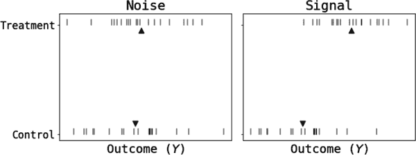
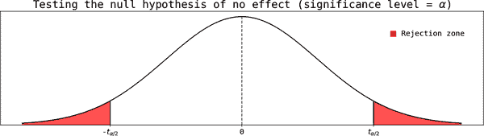
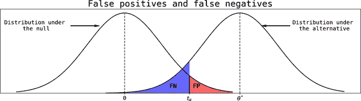
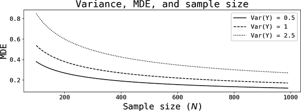
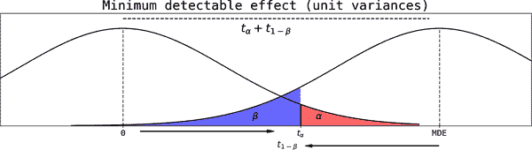
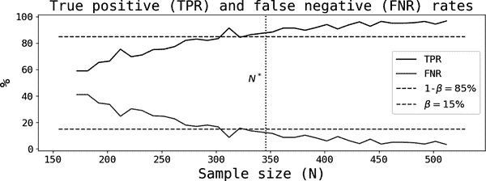
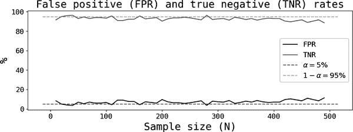
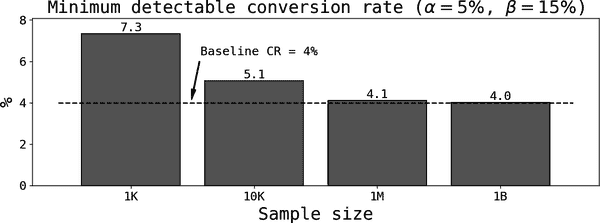

# 第十六章：A/B 测试

第十五章描述了随机化在估计因果效应中的重要性，当这种选项实际上可以提供给数据科学家时。A/B 测试利用这一力量来提高组织的决策能力，这个过程类似于*本地优化*。

本章描述了 A/B 测试，并应帮助您了解一个相对简单的程序的许多复杂性，以改善决策过程。

# 什么是 A/B 测试？

在其最简单的形式中，*A/B 测试*是一种评估两个替代方案在给定指标上哪一个更好的方法。*A*表示默认或基线替代方案，*B*是竞争对手。更复杂的测试可以同时提供多个替代方案以找出最佳的一个。使用第十五章中的术语，得到*A*或*B*的单位也被称为*控制*和*处理*组。

从这个描述中可以看出，每个 A/B 测试中都有几个关键要素：

指标

作为改进决策的核心，A/B 测试的设计应始于选择合适的指标。第二章中描述的技术应该帮助您找到要实施的测试的合适指标。我将用<math alttext="upper Y"><mi>Y</mi></math>表示这个结果指标。

杠杆或替代方案

一旦定义了一个指标，您可以回过头来考虑对其影响最直接的杠杆。一个常见的错误是从一个替代方案开始（比如，您网页或应用中按钮的背景颜色）并试图反向工程某个指标。我在实践中多次看到过这种情况，几乎总是导致浪费时间、团队挫折和无法得出结论的结果。

随机选择

您必须始终定义谁可以访问每个替代方案。A/B 测试也被称为*随机对照试验*，因为按设计，对治疗的选择是随机的，从而消除可能出现的混杂因素或选择偏倚。

# 决策标准

参与实验的每个单位*i*都有一个关联的结果，用<math alttext="upper Y Subscript i"><msub><mi>Y</mi> <mi>i</mi></msub></math>表示。实验结束时，您已经收集了这些指标的两组单位的数据，您的任务是决定新替代方案是否胜过默认方案。

解决这个问题有几种方法，但最常见的是比较两组的样本平均值。关键难点在于需要从噪声中分离信号。

图 16-1 展示了两种典型情景。每张图显示了处理组和对照组每个单位的结果测量（垂直线），以及样本均值（三角形）。在左侧，您有一个*纯噪声*情景，处理组和对照组的结果分布相同，但如果仅比较均值，您可能会得出杠杆*B*更优的结论。在右侧，处理使分布向右移动，创建了平均结果之间的真实差异。



###### 图 16-1\. 解开噪声与信号

统计检验允许您形式化这些直觉。通常，零假设与替代假设相对比，您计算出具有已知分布的检验统计量。用<math alttext="upper Y overbar Subscript k Baseline comma k element-of StartSet upper A comma upper B EndSet"><mrow><msub><mover><mi>Y</mi> <mo>¯</mo></mover> <mi>k</mi></msub> <mo>,</mo> <mi>k</mi> <mo>∈</mo> <mrow><mo>{</mo> <mi>A</mi> <mo>,</mo> <mi>B</mi> <mo>}</mo></mrow></mrow></math>表示组<math alttext="upper G Subscript k"><msub><mi>G</mi> <mi>k</mi></msub></math>中单位的样本平均值：

<math alttext="upper Y overbar Subscript k Baseline equals StartFraction 1 Over upper N Subscript k Baseline EndFraction sigma-summation Underscript i element-of upper G Subscript k Baseline Endscripts upper Y Subscript i" display="block"><mrow><msub><mover><mi>Y</mi> <mo>¯</mo></mover> <mi>k</mi></msub> <mo>=</mo> <mfrac><mn>1</mn> <msub><mi>N</mi> <mi>k</mi></msub></mfrac> <munder><mo>∑</mo> <mrow><mi>i</mi><mo>∈</mo><msub><mi>G</mi> <mi>k</mi></msub></mrow></munder> <msub><mi>Y</mi> <mi>i</mi></msub></mrow></math>

在 A/B 测试中最常用的标准如下：

<math alttext="StartLayout 1st Row 1st Column Keep lever k 2nd Column if 3rd Column upper Y overbar Subscript k Baseline minus upper Y overbar Subscript j Baseline greater-than 0 and the difference is statistically significant EndLayout" display="block"><mtable displaystyle="true"><mtr><mtd columnalign="right"><mrow><mtext>Keep</mtext> <mtext>lever</mtext> <mi>k</mi></mrow></mtd> <mtd><mtext>if</mtext></mtd> <mtd columnalign="left"><mrow><msub><mover><mi>Y</mi> <mo>¯</mo></mover> <mi>k</mi></msub> <mo>-</mo> <msub><mover><mi>Y</mi> <mo>¯</mo></mover> <mi>j</mi></msub> <mo>></mo> <mn>0</mn> <mtext>and</mtext> <mtext>the</mtext> <mtext>difference</mtext> <mtext>is</mtext> <mtext>statistically</mtext> <mtext>significant</mtext></mrow></mtd></mtr></mtable></math>

按照此标准，您只需运行标准*t*检验，对比无效果的空假设与替代假设。用<math alttext="ModifyingAbove theta With caret equals upper Y overbar Subscript upper B Baseline minus upper Y overbar Subscript upper A"><mrow><mover accent="true"><mi>θ</mi> <mo>^</mo></mover> <mo>=</mo> <msub><mover><mi>Y</mi> <mo>¯</mo></mover> <mi>B</mi></msub> <mo>-</mo> <msub><mover><mi>Y</mi> <mo>¯</mo></mover> <mi>A</mi></msub></mrow></math>表示平均结果的差异。双边统计检验是：

<math alttext="StartLayout 1st Row 1st Column upper H 0 2nd Column colon 3rd Column ModifyingAbove theta With caret equals 0 2nd Row 1st Column upper H 1 2nd Column colon 3rd Column ModifyingAbove theta With caret not-equals 0 EndLayout" display="block"><mtable displaystyle="true"><mtr><mtd columnalign="right"><msub><mi>H</mi> <mn>0</mn></msub></mtd> <mtd><mo>:</mo></mtd> <mtd columnalign="left"><mrow><mover accent="true"><mi>θ</mi> <mo>^</mo></mover> <mo>=</mo> <mn>0</mn></mrow></mtd></mtr> <mtr><mtd columnalign="right"><msub><mi>H</mi> <mn>1</mn></msub></mtd> <mtd><mo>:</mo></mtd> <mtd columnalign="left"><mrow><mover accent="true"><mi>θ</mi> <mo>^</mo></mover> <mo>≠</mo> <mn>0</mn></mrow></mtd></mtr></mtable></math>

<math alttext="upper H 0"><msub><mi>H</mi> <mn>0</mn></msub></math>表示没有结果差异的空假设。您的目标是以一定的信心*拒绝*这一假设；如果不能，您将保留默认杠杆*A*（或不保留，因为它们在此特定度量视角下无法区分）。

图 16-2 展示了这在实践中是如何进行的。该图显示了在*零效应空假设*下的理论分布（请注意它在 0 处中心对称），通常被视为学生*t*分布。你计算出*t*统计量，如果落在阴影区域（拒绝区域），则可以在<math alttext="alpha"><mi>α</mi></math>显著水平下拒绝空假设，通常设定为 5%或 1%。这是绘图中阴影区域的面积，选取得足够小。



###### 图 16-2\. 决定是否保留替代治疗方案

我想在这里停下来解释刚才的做法。通过选择足够小的显著性水平，你基本上是在说：*如果零假设成立，看到如此大的检验统计量的概率是如此之小，以至于也许我的零假设是错误的*。换句话说，在零假设下高度不太可能的事件被视为拒绝零假设的证据。例如，如果你选择了 1%的显著性水平，你应该观察到一个落在拒绝区域的检验统计量中的 1/100。但你在实验中得到了它！要么你非常不走运，要么你的零假设是错误的。你选择了后者，放弃了运气，拒绝了零假设。

让我们通过一个示例来运行，只使用左侧面板数据集中的 10 个观测值，参见图 16-1 中的表 16-1。

表 16-1\. 前 10 个单位的结果

| IDs | 控制组 | 处理组 |
| --- | --- | --- |
| 0 | 0.62 | 0.82 |
| 1 | 1.07 | 0.23 |
| 2 | 0.56 | 2.47 |
| 3 | −0.61 | 0.54 |
| 4 | 2.63 | 1.12 |
| 5 | 0.17 | −0.40 |
| 6 | 0.94 | −1.12 |
| 7 | 1.44 | 2.60 |
| 8 | 2.25 | 1.39 |
| 9 | 1.42 | 0.76 |
| 平均值 | 1.05 | 0.84 |

对于这 10 个单位，平均结果的差异为<math alttext="ModifyingAbove theta With caret"><mover accent="true"><mi>θ</mi> <mo>^</mo></mover></math> = 0.84 − 1.05 = −0.21\. 要计算*t*统计量，我们首先需要差异的方差：

<math alttext="StartLayout 1st Row 1st Column s Subscript k Superscript 2 2nd Column equals 3rd Column sigma-summation Underscript i element-of upper G Subscript k Endscripts left-parenthesis upper Y Subscript i Baseline minus upper Y overbar Subscript k Baseline right-parenthesis squared slash left-parenthesis upper N Subscript k Baseline minus 1 right-parenthesis 2nd Row 1st Column upper V a r left-parenthesis ModifyingAbove theta With caret right-parenthesis 2nd Column equals 3rd Column upper V a r left-parenthesis upper Y overbar Subscript upper B Baseline right-parenthesis plus upper V a r left-parenthesis upper Y overbar Subscript upper A Baseline right-parenthesis equals StartFraction s Subscript upper B Superscript 2 Baseline Over upper N Subscript upper B Baseline EndFraction plus StartFraction s Subscript upper A Superscript 2 Baseline Over upper N Subscript upper A Baseline EndFraction equals 0.224 3rd Row 1st Column t hyphen stat 2nd Column equals 3rd Column StartFraction ModifyingAbove theta With caret Over StartRoot upper V a r left-parenthesis ModifyingAbove theta With caret right-parenthesis EndRoot EndFraction equals negative 0.44 EndLayout" display="block"><mtable displaystyle="true"><mtr><mtd columnalign="right"><msubsup><mi>s</mi> <mi>k</mi> <mn>2</mn></msubsup></mtd> <mtd><mo>=</mo></mtd> <mtd columnalign="left"><mrow><munder><mo>∑</mo> <mrow><mi>i</mi><mo>∈</mo><msub><mi>G</mi> <mi>k</mi></msub></mrow></munder> <msup><mrow><mo>(</mo><msub><mi>Y</mi> <mi>i</mi></msub> <mo>-</mo><msub><mover><mi>Y</mi> <mo>¯</mo></mover> <mi>k</mi></msub> <mo>)</mo></mrow> <mn>2</mn></msup> <mo>/</mo> <mrow><mo>(</mo> <msub><mi>N</mi> <mi>k</mi></msub> <mo>-</mo> <mn>1</mn> <mo>)</mo></mrow></mrow></mtd></mtr> <mtr><mtd columnalign="right"><mrow><mi>V</mi> <mi>a</mi> <mi>r</mi> <mo>(</mo> <mover accent="true"><mi>θ</mi> <mo>^</mo></mover> <mo>)</mo></mrow></mtd> <mtd><mo>=</mo></mtd> <mtd columnalign="left"><mrow><mi>V</mi> <mi>a</mi> <mi>r</mi> <mrow><mo>(</mo> <msub><mover><mi>Y</mi> <mo>¯</mo></mover> <mi>B</mi></msub> <mo>)</mo></mrow> <mo>+</mo> <mi>V</mi> <mi>a</mi> <mi>r</mi> <mrow><mo>(</mo> <msub><mover><mi>Y</mi> <mo>¯</mo></mover> <mi>A</mi></msub> <mo>)</mo></mrow> <mo>=</mo> <mfrac><msubsup><mi>s</mi> <mi>B</mi> <mn>2</mn></msubsup> <msub><mi>N</mi> <mi>B</mi></msub></mfrac> <mo>+</mo> <mfrac><msubsup><mi>s</mi> <mi>A</mi> <mn>2</mn></msubsup> <msub><mi>N</mi> <mi>A</mi></msub></mfrac> <mo>=</mo> <mn>0.224</mn></mrow></mtd></mtr> <mtr><mtd columnalign="right"><mtext>t-stat</mtext></mtd> <mtd><mo>=</mo></mtd> <mtd columnalign="left"><mrow><mfrac><mover accent="true"><mi>θ</mi> <mo>^</mo></mover> <msqrt><mrow><mi>V</mi><mi>a</mi><mi>r</mi><mo>(</mo><mover accent="true"><mi>θ</mi> <mo>^</mo></mover><mo>)</mo></mrow></msqrt></mfrac> <mo>=</mo> <mo>-</mo> <mn>0.44</mn></mrow></mtd></mtr></mtable></math>

这个*t*统计量足够大吗以拒绝无效的零假设？我们可以使用临界值表，或者直接计算*p*值（自由度数是<math alttext="upper N Subscript upper B Baseline plus upper N Subscript upper A minus 2"><mrow><msub><mi>N</mi> <mi>B</mi></msub> <mo>+</mo> <msub><mi>N</mi> <mi>A</mi></msub> <mo>-</mo> <mn>2</mn></mrow></math> ):¹

<math alttext="p hyphen value equals 2 left-parenthesis 1 minus upper F left-parenthesis bar t hyphen stat bar right-parenthesis right-parenthesis equals 0.67" display="block"><mrow><mtext>p value</mtext> <mo>=</mo> <mn>2</mn> <mo>(</mo> <mn>1</mn> <mo>-</mo> <mi>F</mi> <mo>(</mo> <mo>∣</mo> <mtext>t-stat</mtext> <mo>∣</mo> <mo>)</mo> <mo>)</mo> <mo>=</mo> <mn>0.67</mn></mrow></math>

在零假设下，看到至少与加/减 0.44 相当极端的值的概率为 67%。由于这个值不够*小*（通常小于 5%），你无法拒绝零假设，即这只是纯粹的噪音。从决策角度来看，你会选择默认的备择方案。

###### 注意

你也可以使用线性回归得出*完全相同*的结果。为此，请运行回归：

<math alttext="StartLayout 1st Row  upper Y equals alpha plus theta upper D plus epsilon EndLayout" display="block"><mtable displaystyle="true"><mtr><mtd columnalign="right"><mrow><mi>Y</mi> <mo>=</mo> <mi>α</mi> <mo>+</mo> <mi>θ</mi> <mi>D</mi> <mo>+</mo> <mi>ϵ</mi></mrow></mtd></mtr></mtable></math>

一旦计算出<math alttext="ModifyingAbove theta With caret Superscript o l s"><msup><mover accent="true"><mi>θ</mi> <mo>^</mo></mover> <mrow><mi>o</mi><mi>l</mi><mi>s</mi></mrow></msup></math>，你可以使用许多软件包预先计算的*p*值。注意，[scikit-learn](https://oreil.ly/nOe0Y) *不*计算*p*值，但你可以使用[statsmodels](https://oreil.ly/hRZKC)来计算。在[代码仓库](https://oreil.ly/dshp-repo)中，我将展示如何手动实现，使用 statsmodel 和[SciPy 的*t*检验方法](https://oreil.ly/apotw)。

除了简单性外，线性回归还允许你包括其他控制变量（特征），这可能提供更小的置信区间。本章末将提供参考文献。

# 最小可检测效应

希望我已经说服您，这个决策标准很容易实现，使用以下三步骤过程： 

1.  设定一个显著性水平（例如 5%）。

1.  计算检验统计量和*p*值。

1.  如果*p*值低于显著性水平，则拒绝零效应的假设。

我在第十四章中讨论了类似基于阈值的决策，假阳性和假阴性自然发生。事实证明，假阳性和假阴性在 A/B 测试设计中也起到了重要作用。

在这种情况下，如果您错误地得出实验有影响的结论，则会出现假阳性；如果您错误地得出实验没有影响的结论，则会出现假阴性。

如前所述，显著性水平控制着假阳性的概率。当您拒绝零假设（一个*积极*因为您说有影响时），您犯错误的概率由显著性水平（ <math alttext="alpha"><mi>α</mi></math> ）给出。另一方面，*统计功效* 允许您控制假阴性的概率，对实验设计至关重要。

图 16-3 显示了两个分布：左侧分布以 0 为中心，假设没有效应（ <math alttext="theta equals 0"><mrow><mi>θ</mi> <mo>=</mo> <mn>0</mn></mrow></math> ）。右侧，我绘制了另一个分布，假设*有*正面效应（ <math alttext="theta Superscript asterisk Baseline greater-than 0"><mrow><msup><mi>θ</mi> <mo>*</mo></msup> <mo>></mo> <mn>0</mn></mrow></math> ）。这第二个分布将用于讨论假阴性。

对于给定的显著性水平，阴影区域*FP*表示假阳性的概率，即错误地拒绝零假设，从而得出实际上没有效应的结论。现在假设您得出*没有*效应的结论。只要您的*t*统计量落在临界值 <math alttext="t Subscript alpha"><msub><mi>t</mi> <mi>α</mi></msub></math> 的左侧。²为了成为*假阴性*，必须是右侧分布类似于真实分布，并且阴影区域*FN*表示该分布的假阴性概率。



###### 图 16-3\. 理解假阳性和假阴性

*最小可检测效应*（MDE）是实验中你能够检测到的最小效应，其给定显著水平和统计功效。它由以下公式给出，其中 <math alttext="upper N equals upper N Subscript upper A Baseline plus upper N Subscript upper B"><mrow><mi>N</mi> <mo>=</mo> <msub><mi>N</mi> <mi>A</mi></msub> <mo>+</mo> <msub><mi>N</mi> <mi>B</mi></msub></mrow></math> 是实验的总样本量， <math alttext="upper P equals upper N Subscript upper B Baseline slash upper N"><mrow><mi>P</mi> <mo>=</mo> <msub><mi>N</mi> <mi>B</mi></msub> <mo>/</mo> <mi>N</mi></mrow></math> 是受试单位的比例，而 <math alttext="t Subscript k"><msub><mi>t</mi> <mi>k</mi></msub></math> 仍是来自 *t* 分布的临界值：³

<math alttext="upper M upper D upper E equals left-parenthesis t Subscript alpha Baseline plus t Subscript 1 minus beta Baseline right-parenthesis StartRoot StartFraction upper V a r left-parenthesis upper Y right-parenthesis Over upper N upper P left-parenthesis 1 minus upper P right-parenthesis EndFraction EndRoot" display="block"><mrow><mi>M</mi> <mi>D</mi> <mi>E</mi> <mo>=</mo> <mrow><mo>(</mo> <msub><mi>t</mi> <mi>α</mi></msub> <mo>+</mo> <msub><mi>t</mi> <mrow><mn>1</mn><mo>-</mo><mi>β</mi></mrow></msub> <mo>)</mo></mrow> <msqrt><mfrac><mrow><mi>V</mi><mi>a</mi><mi>r</mi><mo>(</mo><mi>Y</mi><mo>)</mo></mrow> <mrow><mi>N</mi><mi>P</mi><mo>(</mo><mn>1</mn><mo>-</mo><mi>P</mi><mo>)</mo></mrow></mfrac></msqrt></mrow></math>

MDE 对你来说为什么如此重要呢？*即使真实效应存在*，当它小于 MDE 时，你可以估计到它，*但*它看起来在统计上不显著。实际上，这意味着你进行了测试，并得出结论称治疗没有增量效应。问题是这是真实还是假阴性。在*功效不足的测试*中，你无法确定是哪一种情况。

如本讨论所述，设计 A/B 测试时的目标是实现*最低* MDE。小的 MDE 可以保证你能在所有嘈杂数据中找到同样小的信号（真实效应）。

图 16-4 展示了 MDE、样本量和结果方差之间的关系。对于固定的方差，增加实验中的样本量可以降低 MDE。或者说：*实验越大，估计小效应的能力越好*。

现在，固定一个样本量，并在图中不同曲线上画一条垂直线。数据越嘈杂（方差越高），MDE 就越高。教训是，对于嘈杂的数据，你需要更大的样本量才能获得可比较的 MDE。



###### 图 16-4\. MDE、方差和样本量之间的关系

###### 警告

总结本节的要点：

+   你希望设计具有较小 MDE 的测试。

+   为了达到这个目标，你需要增加实验的样本量。

尽管听起来很简单，但请记住，设计更大的实验可能会影响你组织的运作。许多时候，你需要冻结参与者的任何通信几个月，所以大型实验也有其不利面。稍后我会在讨论实验治理时详细探讨这一点。

示例 16-1 展示了如何在 Python 中计算 MDE。要找到 *t* 分布的临界值，用户必须提供统计显著性和功效（或使用默认值）。自由度通常是样本量的函数；这里我设置为 *n* − 1，但对于足够大的样本量，修正是不必要的。

要找到临界值，你可以使用累积分布函数（CDF）的反函数。在 [SciPy](https://oreil.ly/Wusn7) 中，你可以使用 `scipy.stats.t.ppf()` 方法。因为我想要分布右尾部分的 <math alttext="t Subscript alpha"><msub><mi>t</mi> <mi>α</mi></msub></math> 的临界值，我需要从一中减去显著性水平。类似的论点适用于第二个临界值（ <math alttext="t Subscript 1 minus beta"><msub><mi>t</mi> <mrow><mn>1</mn><mo>-</mo><mi>β</mi></mrow></msub></math> ），但现在要集中在分布的左尾部分。

##### 示例 16-1\. 一个计算 MDE 的 Python 脚本

```
def compute_mde(sample_size, var_outcome, size=0.05, power = 0.85):
    # degrees of freedom: usually a function of sample size
    dof = sample_size - 1
    t_alpha = stats.t.ppf(1-size, dof)
    t_ombeta = stats.t.ppf(power, dof)
    p = 0.5
    den = sample_size*p*(1-p)
    MDE = (t_alpha + t_ombeta)*np.sqrt(var_outcome/den)
    return MDE
```

许多情况下，你不需要 MDE，而是需要与所需 MDE 一致的最小样本量，以帮助你选择实验的正确规模。幸运的是，你可以反转函数并解出样本量作为其他所有因素的函数；请注意，现在你需要提供一个 MDE。示例 16-2 展示了如何实现这一点。

##### 示例 16-2\. 一个计算最小样本量的 Python 脚本

```
def compute_sample_size(mde, var_outcome, data_size, size=0.05, power = 0.85):
    # data_size is the number of subjects used to compute the variance of the outcome
    # (var_outcome)
    dof = data_size - 1
    t_alpha = stats.t.ppf(1-size, dof)
    t_ombeta = stats.t.ppf(power, dof)
    sum_t = t_alpha + t_ombeta
    p = 0.5
    sample_size = var_outcome/(p*(1-p))*(sum_t**2/mde**2)
    return sample_size
```

我现在将讨论剩余参数的选择。

## 选择统计功效、水平和 P

通常惯例是选择 *α* = 0.05 和 *β* = 0.15\. 虽然你希望两者尽可能小，但对于固定的 MDE，你需要在它们之间做出权衡，实际上就是权衡假阳性和假阴性的概率（见图 16-5）。在设计实验时，你可以考虑这一点，并确定对你最重要的因素。只需记住正确解释这些值：5% 是零假设下假阴性的概率，15% 是备择假设下假阳性的概率。



###### 图 16-5\. MDE、显著性水平和功效

要设置受治疗单位的比例 (*P*)，请注意，其他条件相等时，当 *P* = 0.5 时，MDE 最小化，因此这是一个合理的选择。实际上，这意味着治疗组和对照组的大小相等。

## 估算结果的方差

你需要的最后一个参数是你结果的方差（ <math alttext="upper V a r left-parenthesis upper Y right-parenthesis"><mrow><mi>V</mi> <mi>a</mi> <mi>r</mi> <mo>(</mo> <mi>Y</mi> <mo>)</mo></mrow></math> ）。许多情况下，你可以从现有数据中估计这一点。例如，如果你的结果是每个用户的平均收入，你可以从数据库中随机抽取一些客户并估计这些单位的方差。

当结果是二元变量时，例如转化率，还有另一个技巧。例如，如果你的实验旨在看新功能是否提高了转化率，每个单独的结果都是 <math alttext="upper Y Subscript i Baseline element-of StartSet 0 comma 1 EndSet"><mrow><msub><mi>Y</mi> <mi>i</mi></msub> <mo>∈</mo> <mrow><mo>{</mo> <mn>0</mn> <mo>,</mo> <mn>1</mn> <mo>}</mo></mrow></mrow></math> ，取决于是否产生销售。你可以将其建模为伯努利试验，成功的概率为 *q*，其方差为 <math alttext="upper V a r left-parenthesis upper Y right-parenthesis equals q left-parenthesis 1 minus q right-parenthesis"><mrow><mi>V</mi> <mi>a</mi> <mi>r</mi> <mo>(</mo> <mi>Y</mi> <mo>)</mo> <mo>=</mo> <mi>q</mi> <mo>(</mo> <mn>1</mn> <mo>-</mo> <mi>q</mi> <mo>)</mo></mrow></math> 。你可以使用先前活动的平均转化率代替方程中的 *q* 来进行估算。

最后，你总是可以先进行 A/A 测试。顾名思义，两组单位都被呈现默认的替代方案 *A*。然后，你可以使用此实验的结果来估计结果的方差。

## 模拟

让我们运行一些模拟以确保所有这些概念都清楚。我将为两个模拟使用以下简单的数据生成过程：

<math alttext="StartLayout 1st Row 1st Column epsilon 2nd Column tilde 3rd Column upper N left-parenthesis 0 comma sigma squared right-parenthesis 2nd Row 1st Column upper D 2nd Column tilde 3rd Column upper B e r n o u l l i left-parenthesis p equals 0.5 right-parenthesis 3rd Row 1st Column y 2nd Column equals 3rd Column 10 plus theta upper D plus epsilon EndLayout" display="block"><mtable displaystyle="true"><mtr><mtd columnalign="right"><mi>ϵ</mi></mtd> <mtd><mo>∼</mo></mtd> <mtd columnalign="left"><mrow><mi>N</mi> <mo>(</mo> <mn>0</mn> <mo>,</mo> <msup><mi>σ</mi> <mn>2</mn></msup> <mo>)</mo></mrow></mtd></mtr> <mtr><mtd columnalign="right"><mi>D</mi></mtd> <mtd><mo>∼</mo></mtd> <mtd columnalign="left"><mrow><mi>Bernoulli</mi> <mo>(</mo> <mi>p</mi> <mo>=</mo> <mn>0.5</mn> <mo>)</mo></mrow></mtd></mtr> <mtr><mtd columnalign="right"><mi>y</mi></mtd> <mtd><mo>=</mo></mtd> <mtd columnalign="left"><mrow><mn>10</mn> <mo>+</mo> <mi>θ</mi> <mi>D</mi> <mo>+</mo> <mi>ϵ</mi></mrow></mtd></mtr></mtable></math>

我的第一个模拟使用 *θ* = 0.5，*σ*² = 3，因此有一个小的真实效应（相对于嘈杂的数据）。第二个模拟保持残差方差不变，但现在没有真实效应（*θ* = 0，*σ*² = 3）。每个模拟的样本大小为 500。

对于第一个模拟，我计算了允许我检测真实效应的最小样本大小（*N*(*MDE* = 0.5) = *N** = 346）。然后，我创建了一个从此大小的总样本中抽取的 300 个子样本的网格。对于每个样本大小，我进行有放回抽样，并估算包括截距和虚拟变量的线性回归，当虚拟变量的 *p* 值低于（高于）5%显著性水平时，标记为正（负），就像实验是真实的一样。最后，通过平均标志来计算真正例率和假负例率。

图 16-6 描绘了第一个模拟的真正例率（TPR）和假负例率（FNR），以及用于计算最小样本大小的功率。正如你所期望的那样，TPR 随样本大小增加而增加，而 FNR 随之减少：较大的实验具有更低的预测错误率。



###### 图 16-6\. 真正例率和假负例率：θ = 0.5

最重要的发现是，当样本量至少达到使用 MDE 公式得到的最小大小时，两条线都会穿过各自的阈值 <math alttext="beta equals 15 percent-sign"><mrow><mi>β</mi> <mo>=</mo> <mn>15</mn> <mo>%</mo></mrow></math> 。重申一遍，这意味着*即使你的实验有效果，除非你有足够大的样本量，否则你会将其视为统计上不显著*。在模拟中，“足够大”的样本量是让我能够检测到真实效果的样本量。这展示了 MDE 公式的美妙之处，希望它也能帮助你掌握其背后的直觉。

图 16-7 显示了第二次模拟的结果，其中没有效果 <math alttext="theta equals 0"><mrow><mi>θ</mi> <mo>=</mo> <mn>0</mn></mrow></math> 。使用相同的决策标准，如果*p*值小于（大于）5%，我将一个结果标记为假阳性（真阴性）。这张图应该有助于加强你对显著性水平和*p*值的理解。在这种情况下，大约有 5%的时间你会错误地得出实验有效果的结论。



###### 图 16-7\. 假阳性和真阴性率：<math alttext="theta equals 0"><mrow><mi>θ</mi> <mo>=</mo> <mn>0</mn></mrow></math>

## 示例：转化率

让我们通过一个更实际的例子来检验每一个概念是否清晰。你想设计一个 A/B 测试，看看是否可以通过不同的自动邮件通信措辞来改善公司当前的 4%基线转化率。

图 16-8 显示了如果你使用一千、一百万或十亿的样本量，你将能够检测到的转化率（基线 + MDE）。在测试中有 1K 顾客时，你只能检测到至少 3.3 个百分点的增量变化。例如，你无法检测到新消息创建了 5.5%的高成功率测试！如果你只能访问 1K 大小的样本，建议不要运行测试，因为你只能检测到不切实际的高增量效果。

如果你只有 1000 个顾客，那么 MDE 现在是 0.003，因此任何大于 4.1%的转化率都可以被检测出来。现在听起来非常有希望，但是实验的样本量可能会非常大，难以运行。最后，如果你有 10 亿个顾客可用，你能够检测到的最小转化率是 4.003%（MDE = 3.3e − 5）。通过扩大样本量，你可以真正区分噪音和信号。



###### 图 16-8\. 转化率和 MDE

###### 警告

别忘了，MDE 是指由于治疗而引起的度量的*增量*变化，这是从您正在推理的随机变量的定义中得出的：<math alttext="ModifyingAbove theta With caret equals upper Y overbar Subscript upper B Baseline minus upper Y overbar Subscript upper A"><mrow><mover accent="true"><mi>θ</mi> <mo>^</mo></mover> <mo>=</mo> <msub><mover><mi>Y</mi> <mo>¯</mo></mover> <mi>B</mi></msub> <mo>-</mo> <msub><mover><mi>Y</mi> <mo>¯</mo></mover> <mi>A</mi></msub></mrow></math>。

正如示例所示，一旦您修正了 MDE，您就可以找到相应的治疗下最小可检测度量，这将是：

> <math alttext="StartLayout 1st Row 1st Column Minimum Detectable Metric 2nd Column equals 3rd Column ModifyingBelow upper Y overbar Subscript upper A Baseline With bottom-brace Underscript Baseline Endscripts plus upper M upper D upper E EndLayout" display="block"><mtable displaystyle="true"><mtr><mtd columnalign="right"><mrow><mtext>Minimum</mtext> <mtext>Detectable</mtext> <mtext>Metric</mtext></mrow></mtd> <mtd><mo>=</mo></mtd> <mtd columnalign="left"><mrow><munder><munder accentunder="true"><msub><mover><mi>Y</mi> <mo>¯</mo></mover> <mi>A</mi></msub> <mo>︸</mo></munder> <mtext>Baseline</mtext></munder> <mo>+</mo> <mi>M</mi> <mi>D</mi> <mi>E</mi></mrow></mtd></mtr></mtable></math>

## 设置 MDE

在这一点上，我希望我已经说服您：

+   设计实验必须包括影响样本大小的统计功效和显著性考虑因素。

+   在功率不足的实验中，您可能会得出一个结论，即某种治疗没有效果，而问题实际上可能是您没有使用足够大的样本。

+   您需要首先设置一个 MDE 来找到实验的最小样本大小。

那么，首先如何设置 MDE？一个重要的考虑因素是*统计*显著性与*业务*显著性是不同的。

回到前面的例子，即使您有 10 亿客户参与实验（一半接受控制，一半接受治疗），是否有商业意义来运行这个测试？能够检测到 3.3e − 5 的增量变化对业务的影响是什么？对于大多数公司来说，没有什么影响，因此即使统计属性得到满足，从业务角度来看，继续进行实验也没有意义。⁴

您可以利用这种推理与您的利益相关者一起设置一个可行的 MDE。例如，对于他们来说，找到任何超过 4.1%的转化率是有意义的，因此您必须准备为 100 万客户设计测试。如果您只有 10,000 个可用客户，您必须与他们讨论，您只能检测到超过 5%的转化率（MDE = 0.01）。如果每个人对这样的估计（相对于基线的增加 25%）感到满意，那么进行实验是有意义的。

许多时候，您的利益相关者可能无法提出答案。如果您可以访问以前的经验，使用那些增量变化（或平均值）作为您的 MDE 来逆向工程您的样本大小。否则，利用您的业务知识提出一些合理的东西。

# 假设待办事项

A/B 测试只有与所测试的假设一样好和丰富。我曾在一家公司工作过，那里的产品团队经常发布设计不良的实验。然而，缺乏统计的健壮性并不是最令人担忧的方面。大多数这些实验缺乏良好的假设基础。

拥有一个假设积压是公司内部培养实验文化的一个关键方面。理想情况下，这应该包括一个*排序*的假设列表，团队希望测试的假设，受影响的测量标准和支持效果的论据。我现在将讨论这些内容。

## Metric

你不会惊讶地看到我从测量标准开始。拥有一个明确的测量标准是进行实验成功的一个重要部分。如第二章所讨论的，好的测量标准是可衡量的、相关的、及时的和可操作的。

在 A/B 测试中，测量标准离杠杆越近越好，这通常发生在测量标准既可操作又相关的时候。我的意思是，杠杆直接影响测量标准，而不是一系列的效应链，最终影响所选的测量标准。因此，顶级的关键绩效指标（KPIs）在设计测试时并不是很好的测量标准。正如你所想象的，测量标准的分解可以帮助你找到适合你 A/B 测试的正确测量标准。

## 假设

至少，好的假设应该在*因果*的意义上明确陈述如何以及为什么杠杆影响所选的测量标准。

*如何*是指效应的方向性；例如，假设*“如果我们降低价格 1%，客户更有可能购买”*清楚地说明了价格折扣会增加转换率。这个假设仍然缺乏*为什么*，也就是对效应背后机制的理解。*为什么*对于评估假设的可信度至关重要，也将用于排名目的。

伟大的假设也*具有风险*，这不仅从公司角度考虑，而是从测试设计者的角度。请比较以下两个可以轻松跟随价格折扣假设的陈述：*“测试很重要，因为转换率会增加”*，和*“测试很重要，因为转换率会增加 1.2 个百分点”*。前者只是提供了方向性的指导，后者则量化了预期的影响。量化提供了重要的信息，可以用来对替代假设进行排名。

## 排名

了解进行实验对任何组织来说都是昂贵的。 一方面，有直接成本，比如所使用的时间、精力和其他资源。但每次与客户互动时，他们对公司的看法可能会改变，可能导致客户流失或至少降低未来的效果（想想客户将你标记为垃圾邮件，从而变得无法接触）。另一方面，还有推出具有更大潜在影响的测试的机会成本。

###### 小贴士

一旦考虑了测试启动的成本，排列不同假设以指导其优先级变得至关重要。一个好的做法是在整个组织中共享假设的后续备份，以便不同团队可以参与和讨论排名及其他相关信息。

# 实验的治理

如果您将测试作为数据驱动策略的重要组成部分，那么会有一个需要实施和正式化的治理框架的时刻。与数据治理一样，我倾向于站在更务实的一边，而不是试图完成详尽的任务，而是力求满足一组可实施的最低目标。

您的组织可能重要的一些目标是：

责任

实验应有明确定义的所有者（通常是一个团队），负责测试产生的预期或非预期结果。

业务安全

应实施合理的防护措施，以确保没有一个团队的实验能对业务产生重大影响。这些防护措施应在某些预定义的阈值超过时关闭实验。

客户和人类中心性

影响人类、客户或非客户行为的实验应遵循一些与公司价值观高度一致的最低伦理标准。

全局与局部效果

当多个实验同时进行时，有必要确保不同测试的处理组和对照组不重叠。还可能需要制定隔离或休息期的政策，以避免影响业务运营的整体效果和其他测试。

知识增量

作为改进决策的关键因素，来自 A/B 测试的结果应帮助建立和培养一个具有正面和负面结果的知识库。

可复制性和可重复性

用于设计和分析实验结果的任何文档和代码应保存在公司范围的存储库中，以便日后可重现性。

安全性

用于大规模运行实验的技术堆栈应符合公司的数据安全和数据隐私政策。

透明度和监控

结果应尽可能广泛和及时地提供。

# 主要收获

这些是本章的主要要点：

A/B 测试是改善组织决策能力的强大方法。

您可以将 A/B 测试视为执行组织主要指标的局部优化。

测试应设计以实现期望的统计功效。

A/B 测试应该考虑假阳性或假阴性的概率。统计显著性控制前者，而功效控制后者。功效不足的实验可能会因样本量不足而错误地忽视实验对真实效果的影响。

量化实验的最小可检测效应（MDE）有助于您设计具有良好统计功效的测试。

计算 MDE 很简单，它告诉您对于给定的显著水平、功效、样本大小和考虑中的结果方差，您可以希望估计的最小增量效应。对于给定的 MDE，您可以使用相同的公式解出最小样本大小。

实验治理。

当您的组织越来越成熟并且同时进行的测试数量扩展时，您将需要建立一个治理框架，以实现一些最小的期望目标。我提出了几个可能适合您组织的建议。

# 进一步阅读

Howard Bloom 在《The SAGE Handbook of Social Research Methods》（2008 年）中的“Randomized Experiments for Social Research”的核心分析，可以在线获取（[在线链接](https://oreil.ly/ZYG15)），或者他在《Evaluation Review》19(5)中的“Minimum Detectable Effects: A Simple Way to Report the Statistical Power of Experimental Designs”的相关内容也可以在线查阅（[在线链接](https://oreil.ly/QCxlC)）。你还可以参考《Analytical Skills for AI and Data Science》附录中的我的笔记（[附录链接](https://oreil.ly/1S0Es)）。

Guido Imbens 和 Donald Rubin 的 *Causal Inference for Statistics, Social, and Biomedical Sciences: An Introduction*（剑桥大学出版社，2015 年版）第二部分详细讨论了许多与随机化（A/B 测试）相关的统计推断方面，如基于模型的（贝叶斯）推断、Fisher 的精确*p*值以及 Neyman 的重复抽样。但请注意，他们没有讨论设计问题。

Ron Kohavi、Diane Tang 和 Ya Xu 的《Trustworthy Online Controlled Experiments. A Practical Guide to A/B Testing》（剑桥大学出版社，2020 年版）详细讨论了在规模化设计和运行在线测试时可能遇到的许多实际困难。你还可以在 Ron Kohavi 和 Roger Longbotham 编辑的《Encyclopedia of Machine Learning and Data Science》中找到其显著简短和压缩版本（[在线链接](https://oreil.ly/DDRZd)）。

Nicholas Larsen 等人的“Statistical Challenges in Online Controlled Experiments: A Review of A/B Testing Methodology”（[arXiv](https://oreil.ly/R0uiR)，2022 年）提供了对类似主题的最新调查。例如，我没有讨论异质性处理效应或 SUTVA 违规行为。

我发现 Sean Ellis 和 Morgan Brown 的《Hacking Growth: How Today’s Fastest-Growing Companies Drive Breakout Success》（Currency，2017 年）对设计和实施成功的假设积压非常有用。尽管他们专注于与增长相关的主题，但这种方法可以很容易地推广应用。

¹ *F* 表示*t*分布的累积分布函数。

² 现在下标是<math alttext="alpha"><mi>α</mi></math>而不是<math alttext="alpha slash 2"><mrow><mi>α</mi> <mo>/</mo> <mn>2</mn></mrow></math>，因为我现在考虑的是单侧检验。

³ 你可以在[这里](https://oreil.ly/C-rt9)找到推导过程。

⁴ 当然，如果你的公司有十亿客户*可以使用*，这样微小的转化率增加可能会产生可观的收入，但请允许我在这个例子中继续说明。
