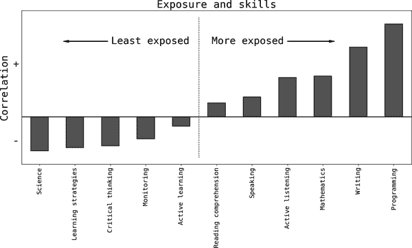

# 第十七章：大语言模型与数据科学实践

据一项[估计](https://oreil.ly/2CoQ6)，2023 年 5 月在美国由于 AI 进展而失去了近 4000 个工作岗位，占当月失业总数的近 5%。另一份来自全球投资银行的[报告](https://oreil.ly/xCO5d)估计，AI 可能会替代 25%的所有工作，而 OpenAI 作为该领域的主要参与者之一，[估计](https://oreil.ly/IhhLZ)几乎 19%的所有职业存在显著风险，这是通过 AI 可能影响的任务比例来衡量的。一些[分析师](https://oreil.ly/sq6AE)声称数据科学本身*易受*影响。

大语言模型（LLMs）如 GPT-4、PaLM2 或 Llama 2 将如何改变数据科学的实践？这本书或其他地方提出的*困难部分*是否仍然对您的职业发展和职业进步至关重要？

与前几章不同，本章不会讨论任何技术，而是*推测*AI 对数据科学实践的短期和中期影响。我还将讨论本书的内容在当前 AI 领域的变革中是否经得起时间的考验。

# AI 的当前状态

AI 是一个广泛的领域，涵盖了许多不同的技术、方法和方法，但通常与使用非常大的神经网络和数据集相关联。在过去几年中，图像识别和自然语言处理领域的进展速度显著加快，但后者，特别是基于 transformer 的 LLMs 最新发布，如[OpenAI 的 GPT4](https://oreil.ly/tGzAm)和[Google 的 Bard](https://oreil.ly/ZWSZ4)，引发了当前关于它们对劳动市场影响的不安和担忧。

普遍认为 LLMs 在执行自然语言任务方面表现出色，包括文本理解和生成、摘要、翻译、分类和代码生成。有趣的是，随着模型规模达到一定阈值，出现了意外行为。这包括*少样本学习*，使模型能够从少量观察中学习新任务，以及*思维链推理*，模型通过将论点分解为步骤来解决问题。

在一篇广泛讨论的关于 LLM 对就业市场影响的论文中，Tyna Eloundou 等人（2023 年）研究了不同职业执行的具体任务，并根据其对 AI 提升生产力的曝光程度将其分类为三组（无曝光、直接曝光或通过 LLM 驱动的应用程序间接曝光）。¹ 除其他有趣的发现外，他们表明某些技能与其曝光度测量相关联。图 17-1 展示了他们分析的基本技能与曝光度之间的相关性。² 如你所见，*编程*与曝光之间的正相关性最强，*科学*则是最负相关的；这表明那些严重依赖这些技能的职业或多或少地受到影响。

对于数据科学意味着什么？仅从基本技能来看，你可以假设一些部分是高度曝光的—​尤其是编程—​而其他部分则不那么曝光（特别是科学和批判性思维）。但这实际上取决于你认为数据科学家做什么。事实是，数据科学家在公司内执行各种各样的任务，不仅仅是机器学习（ML）和编程。

###### 图 17-1\. 与曝光影响相关的技能（来自 Eloundou 等人（2023 年）表 5 的平均值）

# 数据科学家做什么？

为了更好地了解数据科学在当前 AI 中的曝光程度，我将查看实践者在工作场所执行的具体任务。为了本次练习的目的，我将使用在[O*Net](https://oreil.ly/fCcZO)上呈现的任务列表，这在类似分析中常用；虽然它并不完美，当然也不完整，但它仍然提供了一个有用的基准。

每个任务将根据数据科学中使用的四种主要基本技能进行评估：业务知识、ML 和统计学、编程以及软技能。我的唯一目的是提供一个方向正确的评估，因此我将使用三个可能的级别（*低*、*中*和*高*），分别用数字编码为 0、1 和 3，并在下面用*x*表示。

例如，我将任务*使用统计软件分析、处理或处理大量数据集*在业务、ML、编程和软技能方面分别评定为*高*、*低*、*高*和*低*。对我来说，深入了解业务对*分析*至关重要，但除此之外，这个任务主要依赖于*编程*。我为所有任务重复这个过程。³

为了获得曝光估算，我使用以下过程：

1.  根据每种基本技能评估每个任务。

1.  使用以下方程计算每个任务的曝光：

<math alttext="Exposure equals ModifyingAbove 0.2 dot x Subscript upper B Baseline plus 0.8 dot x Subscript ML Baseline plus 1 dot x Subscript upper P Baseline minus 0.2 dot x Subscript upper S Baseline With top-brace Overscript Basic Skills Endscripts minus ModifyingBelow left-parenthesis 0.2 dot x Subscript upper B Baseline dot x Subscript ML Baseline plus 0.2 dot x Subscript upper B Baseline dot x Subscript upper P Baseline right-parenthesis With bottom-brace Underscript Analytical Skills Endscripts" display="block"><mrow><mtext>Exposure</mtext> <mo>=</mo> <mrow><mover><mover><mrow><mn>0.2</mn> <mo>⋅</mo> <msub><mtext>x</mtext> <mtext>B</mtext></msub> <mo>+</mo> <mn>0.8</mn> <mo>⋅</mo> <msub><mtext>x</mtext> <mtext>ML</mtext></msub> <mo>+</mo> <mn>1</mn> <mo>⋅</mo> <msub><mtext>x</mtext> <mtext>P</mtext></msub> <mo>−</mo> <mn>0.2</mn> <mo>⋅</mo> <msub><mtext>x</mtext> <mtext>S</mtext></msub></mrow> <mo stretchy="true">⏞</mo></mover> <mtext>Basic skills</mtext></mover></mrow> <mo>−</mo> <mrow><munder><munder><mrow><mo form="prefix" stretchy="false">(</mo> <mn>0.2</mn> <mo>⋅</mo> <msub><mtext>x</mtext> <mtext>B</mtext></msub> <mo>⋅</mo> <msub><mtext>x</mtext> <mtext>ML</mtext></msub> <mo>+</mo> <mn>0.2</mn> <mo>⋅</mo> <msub><mtext>x</mtext> <mtext>B</mtext></msub> <mo>⋅</mo> <msub><mtext>x</mtext> <mtext>P</mtext></msub> <mo form="postfix" stretchy="false">)</mo></mrow> <mo stretchy="true">⏟</mo></munder> <mtext>Analytical skills</mtext></munder></mrow></mrow></math>

下面是我在这个公式背后的逻辑和假设：

+   所有基本技能至少可以由 LLMs 学习到一定程度。在曝光方面，我将它们排列为<math alttext="Soft less-than Business less-than ML less-than Programming"><mrow><mtext>软技能</mtext> <mo><</mo> <mtext>业务知识</mtext> <mo><</mo> <mtext>ML</mtext> <mo><</mo> <mtext>编程</mtext></mrow></math>，因此在线性部分上的权重。这种顺序捕捉到了至少在短期内编程比 ML 更加暴露，进而比业务知识更加暴露，而业务知识又比软技能更加暴露的直觉。

+   我认为涉及业务知识的 ML 和编程任务需要*分析技能*和批判性思维，这些技能在没有人类水平或人工通用智能（AGI）之前将更难发展。因此，我包括降低曝光度指标的交互项。

软技能的重要性值得进一步讨论：我认为软技能在人与人之间的互动中仍然非常重要。但尽管听起来有些牵强，但不难想象在未来的某个状态中，AI 完全取代了互动中的一个人，软技能可能会变得无关紧要。

结果见表 17-1。在 O*Net 网站列出的 15 项任务中，40%被分类为具有高曝光率的技能，20%具有中等曝光率，40%具有低曝光率。从具体任务的曝光度指标来看，它在我看来大体正确，并且如预期的那样，编程和 ML 任务更加暴露，但对分析技能的需求降低了它们的整体曝光度。

六项具有低曝光度指标的任务中，每一项都严重依赖于业务知识、分析技能或软技能。在所有数据科学家*识别或提出*解决方案的低曝光评估中，分析技能起着重要作用。

在光谱的另一端，我评估为*高度曝光*的任务在当前 AI 技术的最新水平下更容易自动化。在当前时点上，其中一些仍然需要专家人员的参与，但在不久的将来可能不再需要。

表 17-1\. 数据科学任务和曝光度

| 任务 | 曝光度 |
| --- | --- |
| 将数学建模和数据分析的结果以口头或书面形式呈现给管理层或其他最终用户。 | 低 |
| 向主要利益相关方推荐数据驱动的解决方案。 | 低 |
| 确定可以通过数据分析解决的业务问题或管理目标。 | 低 |
| 使用数据分析的结果确定解决业务问题（如预算编制、人员配置和营销决策）的解决方案。 | 低 |
| 使用数学理论和技术提出工程、科学和其他领域的解决方案。 | 低 |
| 阅读科学文章、会议论文或其他研究来源，以识别新兴的分析趋势和技术。 | 低 |
| 应用特征选择算法于预测销售、流失和医疗使用等感兴趣结果的模型。 | 中等 |
| 使用统计软件分析、操作或处理大数据集。 | 中等 |
| 设计调查、民意测验或其他收集数据的工具。 | 中等 |
| 使用统计软件清理和操作原始数据。 | 高 |
| 确定研究结果可能受到影响的关系和趋势或任何因素。 | 高 |
| 测试、验证和重新制定模型，以确保准确预测感兴趣的结果。 | 高 |
| 应用抽样技术确定要调查的群体或使用完整枚举方法。 | 高 |
| 使用统计性能指标比较模型，如损失函数或解释方差的比例。 | 高 |
| 使用编程语言编写新的函数或应用程序进行分析。 | 高 |

# 数据科学家职位描述的演变

将数据科学家通常执行的 15 项任务列表作为基准职位描述，并假设关于曝光的预测至少在方向上是正确的，显然随着更强大的人工智能在公司中的部署，数据科学的实践将需要进化。

至少在编程方面，似乎存在一致的看法，即当前的 AI 状态显著提高了开发者的生产力。像[GitHub Copilot](https://oreil.ly/wFQg7)和[Bard](https://oreil.ly/a4RD9)这样的工具正在成为标准，有充分的理由相信数据科学家和数据工程师也在接受这些工具。一些评论员甚至谈到了[10 倍的生产力增长](https://oreil.ly/n-2WO)，而[最近的调查](https://oreil.ly/4k_AR)发现，超过 90%的开发者已经在使用 AI 作为生产力工具。

然而，目前可以明确的是，当前的 LLM 状态需要有人类专家参与，既可以促使和引导 AI 得出期望的答案，又可以调试可能出现的一些错误并处理任何可能的[幻觉](https://oreil.ly/ZlGRN)。此外，与纯软件开发中的许多工作相反，使用数据进行编程要求输出在商业角度上是有意义的，而目前这项任务需要一个有经验的人类。

但是，值得问的是，在不久的将来，业务利益相关者是否能够直接与人工智能进行交互，完全使数据科学家的工作变得多余。

例如，在许多公司中，数据从业者接收来自利益相关者的业务需求，并编写必要的 SQL 查询以生成报告或仪表板。我认为这是一个高度暴露于 AI 的任务，因此很可能从未来的数据科学家职位描述中消失。

那么未来的数据科学工作描述会是什么样子呢？再次假设未达到 AGI（否则，每个职业都必须重新定义），在我看来有两种替代的长期（较长期）情景：⁴

+   非技术业务利益相关者变得*数据驱动*，并学会从数据中提出问题，并对其业务问题进行分析和科学思考。

+   数据科学家变得精通业务和分析，并学会根据证据做出业务决策。

在第一个情景中，数据科学职业消失了，非技术业务人员接受广泛的再培训，以获取与 AI 交互并以数据驱动方式回答业务问题所需的技能（类似于早期的 SQL 示例）。在这种情况下，AI 增强了业务精明人员的能力。

在第二种情景中，业务利益相关者变得多余，数据科学家使用 AI 执行技术任务，并利用其独特的分析技能和对业务的了解。

如果有的话，哪种情景最有可能出现？我猜这取决于哪种技能更难获取，是变得数据驱动（并在业务问题上进行科学思考）还是变得业务精明。根据我在过去十年唯一的经验和观察，在关注数据驱动方面，非技术业务人员在数据驱动的前沿上并未取得实质性进展。但数据科学家在业务精明方面也没有。也许当生存受到威胁时，变化终将发生。

## 案例研究：A/B 测试

我将使用 A/B 测试的案例来解释其中一些预测和推测。在其核心，A/B 测试需要两套技能：

业务

定义和优先考虑待测试的假设积压以及评估实验结果的指标。

技术

设计实验，随机化并确保达到因果效应识别的假设，并测量影响。

我猜想，在大多数公司中，目前在这些领域内数据科学家和业务利益相关者几乎完全功能分离。但撇开需要高度专业化、前沿知识设计和评估实验的 1%个案外，我猜大部分技术细节目前可以在当前技术下实现自动化（LLMs 可能只是作为中介）。在我看来，（非前沿）A/B 测试真正困难的部分是提出好的度量标准和良好的假设来测试。

通过 AI 增强的人类应该能够处理公司运行的绝大部分测试。由于用于训练 LLM 的大量数据语料库，我还可以看到人类在构思假设过程中使用 AI，但是如果没有对世界和业务如何运作以及潜在的因果机制的深入了解，我认为 AI 在这个领域并不关键。

要确定，我并不认为 AI 完全可以独立运行技术方面。一个知识渊博的人类将引导这个过程。问题是，那个人会是谁，他们的角色将被称为什么。

## 案例研究：数据清洗

数据科学家花费大量时间清理和转换数据，使其适合更有价值的目的。同样，我会假设数据清洗过程的*简单部分*是实际执行，使用 SQL 或任何其他像 Python 或 R 这样的编程语言，这是今天普遍执行的。

确实困难的部分在于做出依赖于关键业务知识的决策。典型的例子是，你是否应该将空值转换为零。答案是，在某些情况下，这确实有意义，但在其他情况下则不然。而这取决于业务环境。另一个例子是数据质量，你最终会知道事物是正确的，因为从业务角度来看*它们是有意义的*。

一个非技术的业务利益相关者可以负责这些决策吗，由 AI 增强了处理*简单*部分的部分帮助？我认为答案是肯定的，但这可能需要一些再培训，或至少一些充分记录的流程。当然，可以想象，在未来，这些内部手册可以用于培训公司的 AI 代理。

## 案例研究：机器学习

ML 使用案例怎么样？作为一个起点，数据科学家决定应该为特定的用例使用哪种技术。我猜想，随着当前 LLM 的状态，AI 可以轻松地帮助非技术的业务利益相关者做出这一决定（因为网络上有很多关于什么时候做什么的讨论，这也是用于训练当前 LLM 系列的语料库的一部分）。换句话说，我认为人类在做出这个决定时没有比较优势：再次搁置 1%左右的需要高度专业化人才的用例，今天数据科学家学习的就是这样一本指南。然而，一个关键的方面是理解*为什么*一个工具比另一个更好，显然，LLM 远未达到这种智能水平。

当今最优秀的数据科学家确实专注于每种预测算法的技术细节，并利用这些知识来优化模型，使其性能更出色。例如，训练一个开箱即用的梯度提升分类器非常容易，但要知道优化哪些元参数以提高预测性能则较为困难。但事实上，已经存在自动化 ML 框架来处理这些问题。这就是为什么我不再认为这是一项能让数据科学家在与 AI 的竞争中获得比较优势的关键技能。此外，LLMs 可以或将被用来在需要时建议替代行动方案（再次因为训练数据的记忆/信息检索）。

ML 中的难点在哪里，人类在与 LLMs 的比较中明显具有比较优势？我认为这在于提出关于为何一组特征预测给定结果的潜在因果机制假设。在这里，工作描述中的科学部分至关重要，并且可能在未来使数据科学家比非技术业务人员具有一定优势。

# LLMs 和本书

这本书提供了一些技术，旨在帮助您成为更有生产力的数据科学家。自然地，这些技术中有些更多或更少地暴露于 AI，这取决于执行它们所需的基本基础技能的组合。

在 表 17-2 中，我展示了我对每章暴露度的主观评估，使用了与之前完全相同的方法论。再次强调，我的目的只是指导性地正确，而结果对我来说看起来合理：第一部分的章节更多依赖于业务知识和软技能，而不是编程技能和 ML 或统计知识，因此暴露度较低。第二部分涉及更多 ML 和统计内容，因此暴露度更高。

表 17-2\. 按暴露度排序的书籍章节

| 章节 | 主要教训 | 暴露度 |
| --- | --- | --- |
| 1\. 那么 | 如何衡量您团队的影响 | 低 |
| 7\. 叙事 | 如何在创建项目前后构建叙事 | 低 |
| 6\. 提升 | 查看群体间差异的技术 | 低 |
| 2\. 指标设计 | 找到更好的行动指标 | 低 |
| 3\. 增长分解 | 理解业务发展 | 低 |
| 4\. 2×2 设计 | 简化理解复杂问题 | 低 |
| 5\. 商业案例 | 如何衡量特定项目的影响 | 低 |
| 8\. 数据可视化 | 提取知识并传达关键信息 | 中等 |
| 15\. 增量性 | 理解因果关系的基础 | 中等 |
| 16\. A/B 测试 | 实验设计 | 中等 |
| 10\. 线性回归 | 增强您对 ML 算法如何工作的直觉 | 中等 |
| 13\. ML 叙事 | 叙事以创建特征和解释结果 | 高 |
| 14\. 从预测到决策 | 从 ML 中做决策 | 高 |
| 9\. 模拟和启动 | 深入理解 ML 算法的工具 | 高 |
| 11\. 数据泄露 | 识别和纠正数据泄露 | 高 |
| 12\. 模型产品化 | 部署生产的最小框架 | 高 |

这意味着什么？让我们想象一下，任务要么*不受影响*，要么*完全受到影响*；前者意味着 LLMs 毫无价值，而后者意味着 AI 可以自行完成任务。事实上，大多数职业中的任务都处于中间位置，但暂且不去考虑这些。在这个极端的世界中，你应该投资于前一类技能，因为它们使你在 LLMs 面前显得特别。

这个练习的主要目的是，书中学到的某些技能，鉴于 LLMs 当前的能力，更值得你投入时间和精力去发展。请注意，我并不是说你不应该投资成为一个优秀的程序员或者 ML 或统计学专家。至于编程，LLMs 的崛起已经使这项技能对你作为数据科学家的价值降低。对于 ML 和统计学来说，现在仍然为时过早。

当然，我的预测应该持保留态度，但我确信数据科学实践的未来可能会沿着这样一条道路发展：短期内，数据科学家的生产力将通过 LLMs 单独生成高质量代码的能力得到增强，辅以知识渊博的人类。长期来看更加不确定，数据科学实践可能会完全重新设计，甚至可能停止存在，正如先前所讨论的。

# 关键要点

这些是本章的关键要点：

LLMs 正在改变职场。

2023 年很可能会被记住，因为这是人工智能开始对劳动力市场产生可衡量影响的第一年。

数据科学正在受到影响。

类似于软件开发人员，人工智能对数据科学实践的即时影响体现在编程生产力上。

但许多数据科学家通常执行的其他任务也面临人工智能的曝光。

我分析了 O*Net 列出的 15 项任务，并发现大约 40%的任务面临高度曝光，20%的任务面临中等曝光。自然更依赖编程的任务更容易受到影响，但我认为机器学习和统计学也可能会在中期受到影响。业务知识和软技能被认为受到的曝光较少。

数据科学职位描述的变化。

我的最佳猜测是，数据科学的实践在不久的将来将发生变化，对编程和机器学习技能的重视减少，更加强调分析能力、因果关系和业务知识。

# 进一步阅读

鉴于领域进展的速度，关于这个主题的建议性阅读很可能会很快过时。也就是说，以下是一些指导我对该领域现状理解的文章。

Tyna Eloundou 等，“GPT 是 GPT：大语言模型对劳动市场影响潜力的早期探讨”，2023 年 3 月，从[arXiv](https://oreil.ly/lDoUs)检索。该论文提供了关于各种职业中 AI 影响估计的曝光。我没有使用相同的方法来量化数据科学的曝光水平，因此如果您想提出实践的替代方案，这篇论文绝对值得一读。

Sebastien Bubeck 等，“人工通用智能的火花：GPT-4 的早期实验”，2023 年 4 月，从[arXiv](https://oreil.ly/aN_xl)检索。这篇论文引发了一个有趣的讨论，探讨我们是否接近实现 AGI。他们认为在未来，这类 LLM 很可能会被标记为原型 AGI。请注意，许多领先的研究人员，特别是[Yann LeCun](https://oreil.ly/rj8tu)（还请参见[此处](https://oreil.ly/2x2KQ)），认为自回归模型不能导致 AGI。

Ali Borji，“ChatGPT 失败的分类档案”，2023 年 4 月，从[arXiv](https://oreil.ly/Q9K0V)检索。该论文不断更新，展示了当前 AI 状态下事物如何可能出错。

Grégoire Mialon 等，“增强语言模型：一项调查”，2023 年 2 月，从[arXiv](https://oreil.ly/o_WWd)检索。即使 LLM 尚未达到人类普遍智能的水平，也有办法提高它们推理或使用外部工具的能力，覆盖更广泛的用例。

下面两篇论文讨论了随着 LLM 规模的增加而出现的新能力：

Jason Wei 等，“大语言模型的新兴能力”，2022 年 10 月，从[arXiv](https://oreil.ly/ZcWNn)检索。

Rylan Schaeffer 等，“大语言模型的新兴能力是幻觉吗？”，2023 年 5 月，从[arXiv](https://oreil.ly/CEqdI)检索。

¹ 他们将“曝光”定义为衡量 LLM 或 LLM 驱动系统是否能够将人类执行特定（详细工作活动）或完成任务所需的时间减少至少 50%的指标。

² 在图表中，我平均了他们在表 5 中报告的三个估计值，因此从方向上来说，我捕捉到了他们希望传达的直觉，即某些技能更容易受到 LLM 的影响。

³ 您可以在[repo](https://oreil.ly/dshp-repo)中找到实际的排名。

⁴ 老实说，快速发展的步伐使得真的很难预测*什么时候*事情可能会发生。
