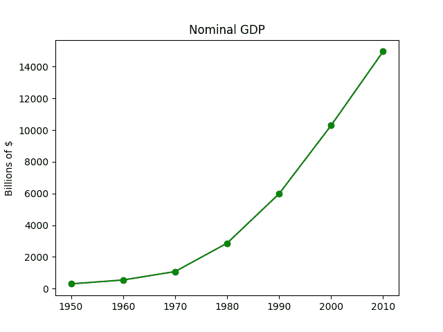
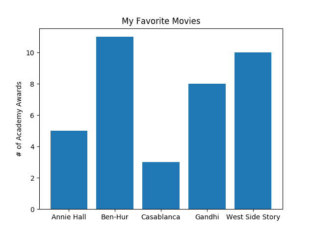
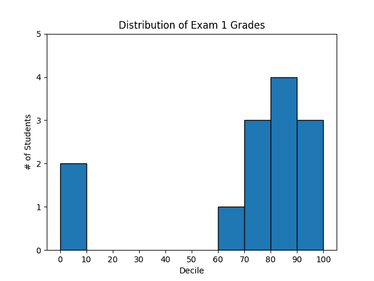
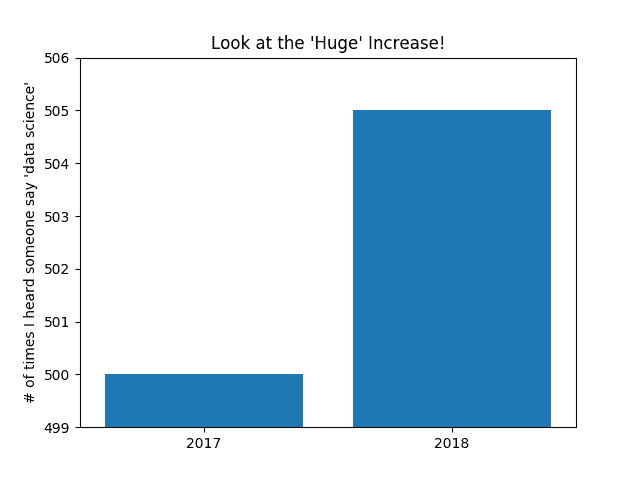
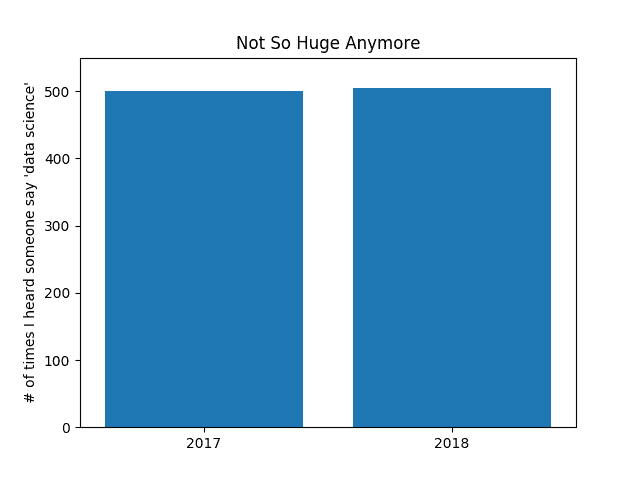
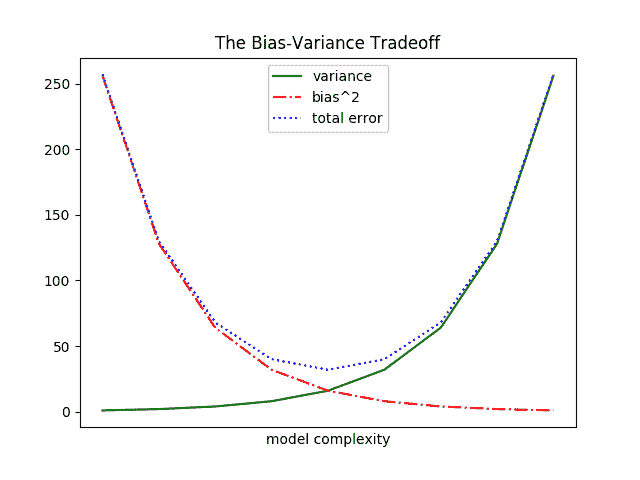
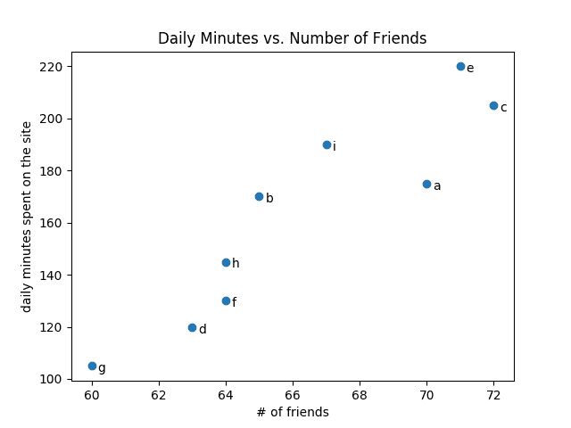
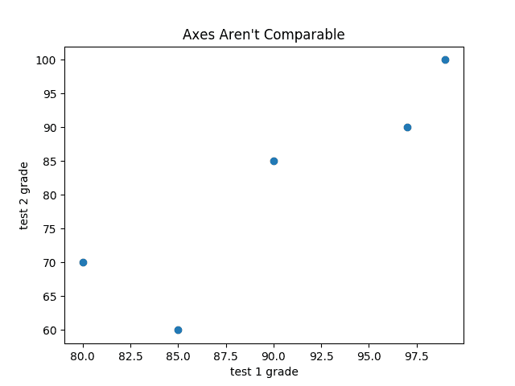
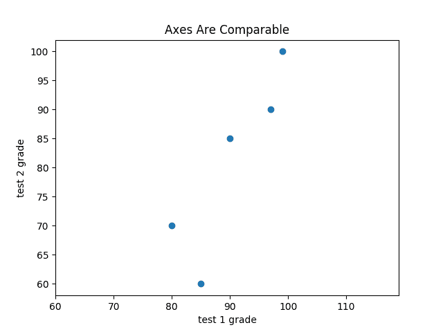

# 第三章：数据可视化

> 我相信可视化是实现个人目标最强大的手段之一。
> 
> Harvey Mackay

数据科学家工具包的基本组成部分是数据可视化。虽然创建可视化非常容易，但要生成*优质*的可视化要困难得多。

数据可视化有两个主要用途：

+   *探索*数据

+   *传达*数据

在本章中，我们将集中于构建您开始探索自己数据所需的技能，并生成我们在本书其余部分中将使用的可视化内容。与大多数章节主题一样，数据可视化是一个值得拥有自己书籍的丰富领域。尽管如此，我将尝试给您一些关于好的可视化和不好的可视化的认识。

# matplotlib

存在各种工具用于数据可视化。我们将使用广泛使用的[matplotlib 库](http://matplotlib.org/)，尽管它有些显得老旧，但仍被广泛使用。如果您有兴趣生成精致的互动可视化内容，那么它可能不是正确的选择，但对于简单的柱状图、折线图和散点图，它运行得相当不错。

正如前面提到的，matplotlib 不是 Python 核心库的一部分。在激活虚拟环境后（要设置一个，请返回到“虚拟环境”并按照说明操作），使用以下命令安装它：

```py
python -m pip install matplotlib
```

我们将使用`matplotlib.pyplot`模块。在最简单的用法中，`pyplot`保持一个内部状态，您可以逐步构建可视化内容。完成后，您可以使用`savefig`保存它，或者使用`show`显示它。

例如，制作简单的图表（如图 3-1）非常简单：

```py
from matplotlib import pyplot as plt

years = [1950, 1960, 1970, 1980, 1990, 2000, 2010]
gdp = [300.2, 543.3, 1075.9, 2862.5, 5979.6, 10289.7, 14958.3]

# create a line chart, years on x-axis, gdp on y-axis
plt.plot(years, gdp, color='green', marker='o', linestyle='solid')

# add a title
plt.title("Nominal GDP")

# add a label to the y-axis
plt.ylabel("Billions of $")
plt.show()
```



###### 图 3-1\. 一个简单的折线图

制作看起来像出版物质量的图表更为复杂，超出了本章的范围。您可以通过诸如轴标签、线条样式和点标记等方式自定义图表的许多方面。与其尝试全面处理这些选项，我们将在示例中简单使用（并强调）其中一些。

###### 注

尽管我们不会使用这种功能的大部分，但 matplotlib 能够在图形中生成复杂的细节图、高级格式化和交互式可视化内容。如果您希望比我们在本书中更深入地了解，请查阅[其文档](https://matplotlib.org)。

# 柱状图

当您想展示某些数量在一些*离散*项目中如何变化时，柱状图是一个不错的选择。例如，图 3-2 显示了各种电影赢得的学院奖数量：

```py
movies = ["Annie Hall", "Ben-Hur", "Casablanca", "Gandhi", "West Side Story"]
num_oscars = [5, 11, 3, 8, 10]

# plot bars with left x-coordinates [0, 1, 2, 3, 4], heights [num_oscars]
plt.bar(range(len(movies)), num_oscars)

plt.title("My Favorite Movies")     # add a title
plt.ylabel("# of Academy Awards")   # label the y-axis

# label x-axis with movie names at bar centers
plt.xticks(range(len(movies)), movies)

plt.show()
```



###### 图 3-2\. 一个简单的柱状图

柱状图也可以是绘制分桶数值直方图的好选择，如图 3-3，以便直观地探索数值的*分布*：

```py
from collections import Counter
grades = [83, 95, 91, 87, 70, 0, 85, 82, 100, 67, 73, 77, 0]

# Bucket grades by decile, but put 100 in with the 90s
histogram = Counter(min(grade // 10 * 10, 90) for grade in grades)

plt.bar([x + 5 for x in histogram.keys()],  # Shift bars right by 5
        histogram.values(),                 # Give each bar its correct height
        10,                                 # Give each bar a width of 10
        edgecolor=(0, 0, 0))                # Black edges for each bar

plt.axis([-5, 105, 0, 5])                  # x-axis from -5 to 105,
                                           # y-axis from 0 to 5

plt.xticks([10 * i for i in range(11)])    # x-axis labels at 0, 10, ..., 100
plt.xlabel("Decile")
plt.ylabel("# of Students")
plt.title("Distribution of Exam 1 Grades")
plt.show()
```



###### 图 3-3\. 使用条形图制作直方图

对 `plt.bar` 的第三个参数指定了条形宽度。在这里，我们选择宽度为 10，以填满整个十分位。我们还将条形向右移动了 5，因此，例如，“10” 条形（对应于十分位 10-20）其中心在 15 处，因此占据了正确的范围。我们还为每个条形添加了黑色边缘，使它们在视觉上更加突出。

对 `plt.axis` 的调用指示我们希望 x 轴范围从 -5 到 105（仅留出一点左右的空间），y 轴应该从 0 到 5。对 `plt.xticks` 的调用在 0、10、20、…、100 处放置 x 轴标签。

使用 `plt.axis` 时要慎重。在创建条形图时，如果你的 y 轴不从 0 开始，这被认为是一种特别糟糕的做法，因为这很容易误导人（图 3-4）：

```py
mentions = [500, 505]
years = [2017, 2018]

plt.bar(years, mentions, 0.8)
plt.xticks(years)
plt.ylabel("# of times I heard someone say 'data science'")

# if you don't do this, matplotlib will label the x-axis 0, 1
# and then add a +2.013e3 off in the corner (bad matplotlib!)
plt.ticklabel_format(useOffset=False)

# misleading y-axis only shows the part above 500
plt.axis([2016.5, 2018.5, 499, 506])
plt.title("Look at the 'Huge' Increase!")
plt.show()
```



###### 图 3-4\. 具有误导性 y 轴的图表

在 图 3-5 中，我们使用更合理的轴，效果看起来不那么令人印象深刻：

```py
plt.axis([2016.5, 2018.5, 0, 550])
plt.title("Not So Huge Anymore")
plt.show()
```



###### 图 3-5\. 具有非误导性 y 轴的相同图表

# 折线图

正如我们已经看到的，我们可以使用 `plt.plot` 制作折线图。这些图表适合展示*趋势*，如 图 3-6 所示：

```py
variance     = [1, 2, 4, 8, 16, 32, 64, 128, 256]
bias_squared = [256, 128, 64, 32, 16, 8, 4, 2, 1]
total_error  = [x + y for x, y in zip(variance, bias_squared)]
xs = [i for i, _ in enumerate(variance)]

# We can make multiple calls to plt.plot
# to show multiple series on the same chart
plt.plot(xs, variance,     'g-',  label='variance')    # green solid line
plt.plot(xs, bias_squared, 'r-.', label='bias²')      # red dot-dashed line
plt.plot(xs, total_error,  'b:',  label='total error') # blue dotted line

# Because we've assigned labels to each series,
# we can get a legend for free (loc=9 means "top center")
plt.legend(loc=9)
plt.xlabel("model complexity")
plt.xticks([])
plt.title("The Bias-Variance Tradeoff")
plt.show()
```



###### 图 3-6\. 带有图例的多条线图

# 散点图

散点图是可视化两组配对数据之间关系的正确选择。例如，图 3-7 描述了用户拥有的朋友数量与他们每天在网站上花费的时间之间的关系：

```py
friends = [ 70,  65,  72,  63,  71,  64,  60,  64,  67]
minutes = [175, 170, 205, 120, 220, 130, 105, 145, 190]
labels =  ['a', 'b', 'c', 'd', 'e', 'f', 'g', 'h', 'i']

plt.scatter(friends, minutes)

# label each point
for label, friend_count, minute_count in zip(labels, friends, minutes):
    plt.annotate(label,
        xy=(friend_count, minute_count), # Put the label with its point
        xytext=(5, -5),                  # but slightly offset
        textcoords='offset points')

plt.title("Daily Minutes vs. Number of Friends")
plt.xlabel("# of friends")
plt.ylabel("daily minutes spent on the site")
plt.show()
```



###### 图 3-7\. 朋友和网站上时间的散点图

如果你散布可比较的变量，如果让 matplotlib 自行选择比例，可能会得到一个误导性的图像，如 图 3-8 所示。



###### 图 3-8\. 具有不可比较轴的散点图

```py
test_1_grades = [ 99, 90, 85, 97, 80]
test_2_grades = [100, 85, 60, 90, 70]

plt.scatter(test_1_grades, test_2_grades)
plt.title("Axes Aren't Comparable")
plt.xlabel("test 1 grade")
plt.ylabel("test 2 grade")
plt.show()
```

如果我们包含对 `plt.axis("equal")` 的调用，则绘图（图 3-9）更准确地显示了大部分变化发生在测试 2 上。

这已足够让你开始进行可视化了。我们会在本书中更多地学习可视化。



###### 图 3-9\. 具有相等轴的相同散点图

# 进一步探索

+   [matplotlib Gallery](https://matplotlib.org/gallery.html) 将为你展示使用 matplotlib 可以做的各种事情（以及如何做）。

+   [seaborn](https://seaborn.pydata.org/) 建立在 matplotlib 之上，使你能够轻松生成更漂亮（和更复杂）的可视化。

+   [Altair](https://altair-viz.github.io/) 是一个较新的 Python 库，用于创建声明式可视化。

+   [D3.js](http://d3js.org) 是用于在 Web 上生成复杂交互式可视化的 JavaScript 库。虽然它不是 Python 的库，但它被广泛使用，你值得熟悉它。

+   [Bokeh](http://bokeh.pydata.org) 是一个将 D3 风格的可视化引入 Python 的库。
