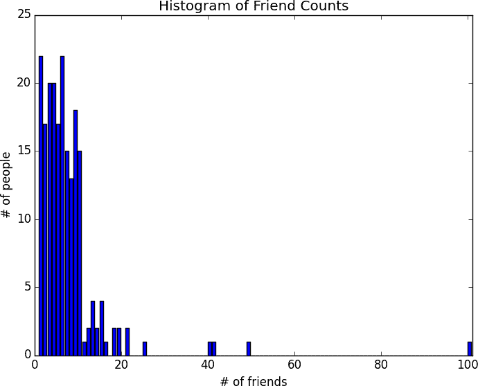
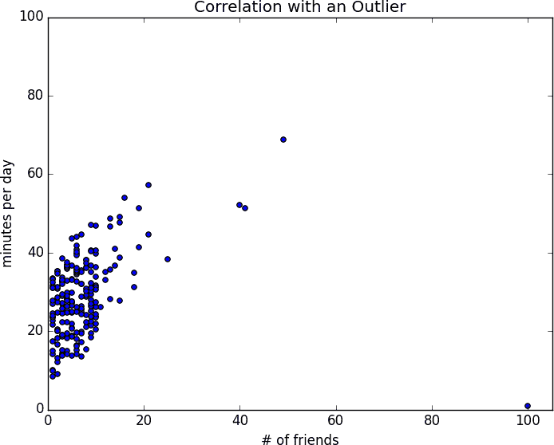
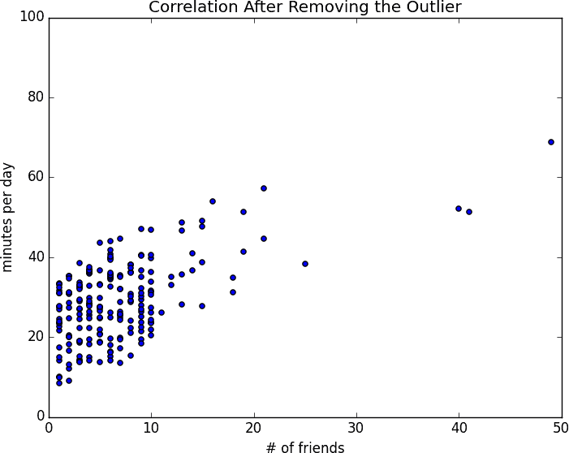

# 第五章：统计学

> 事实是倔强的，但统计数据更加灵活。
> 
> 马克·吐温

*统计学*是指我们理解数据的数学和技术。这是一个丰富而庞大的领域，更适合放在图书馆的书架（或房间）上，而不是书中的一章，因此我们的讨论必然不会很深入。相反，我会尽量教你足够的知识，让你有点危险，并激起你的兴趣，让你去学更多的东西。

# 描述单一数据集

通过口口相传和一点运气，DataSciencester 已经发展成了数十个成员，筹款副总裁要求你提供一些关于你的成员拥有多少朋友的描述，以便他可以在提出自己的想法时加入其中。

使用第一章中的技术，你很容易就能产生这些数据。但现在你面临着如何*描述*它的问题。

任何数据集的一个明显描述就是数据本身：

```py
num_friends = [100, 49, 41, 40, 25,
               # ... and lots more
              ]
```

对于足够小的数据集，这甚至可能是最好的描述。但对于较大的数据集来说，这是笨重且可能晦涩的。（想象一下盯着一百万个数字的列表。）因此，我们使用统计数据来提炼和传达我们数据的相关特征。

作为第一步，你可以使用 `Counter` 和 `plt.bar` 将朋友数量制作成直方图（参见图 5-1）：

```py
from collections import Counter
import matplotlib.pyplot as plt

friend_counts = Counter(num_friends)
xs = range(101)                         # largest value is 100
ys = [friend_counts[x] for x in xs]     # height is just # of friends
plt.bar(xs, ys)
plt.axis([0, 101, 0, 25])
plt.title("Histogram of Friend Counts")
plt.xlabel("# of friends")
plt.ylabel("# of people")
plt.show()
```



###### 图 5-1 朋友数量直方图

不幸的是，这张图表仍然太难以插入对话中。所以你开始生成一些统计数据。可能最简单的统计数据是数据点的数量：

```py
num_points = len(num_friends)               # 204
```

你可能也对最大值和最小值感兴趣：

```py
largest_value = max(num_friends)            # 100
smallest_value = min(num_friends)           # 1
```

这些只是想要知道特定位置的值的特例：

```py
sorted_values = sorted(num_friends)
smallest_value = sorted_values[0]           # 1
second_smallest_value = sorted_values[1]    # 1
second_largest_value = sorted_values[-2]    # 49
```

但我们只是刚刚开始。

## 中心趋势

通常，我们会想知道我们的数据位于何处。最常见的是我们会使用*均值*（或平均值），它只是数据之和除以其计数：

```py
def mean(xs: List[float]) -> float:
    return sum(xs) / len(xs)

mean(num_friends)   # 7.333333
```

如果你有两个数据点，平均值就是它们之间的中点。随着你增加更多的点，平均值会移动，但它总是依赖于每个点的值。例如，如果你有 10 个数据点，而你增加其中任何一个的值 1，你就会增加平均值 0.1。

我们有时也会对*中位数*感兴趣，它是中间最值（如果数据点数量为奇数）或两个中间最值的平均值（如果数据点数量为偶数）。

例如，如果我们在一个排序好的向量 `x` 中有五个数据点，中位数是 `x[5 // 2]` 或 `x[2]`。如果我们有六个数据点，我们想要 `x[2]`（第三个点）和 `x[3]`（第四个点）的平均值。

注意——与平均值不同——中位数并不完全依赖于你的数据中的每个值。例如，如果你使最大值变大（或最小值变小），中间值保持不变，这意味着中位数也保持不变。

我们将为偶数和奇数情况编写不同的函数并将它们结合起来：

```py
# The underscores indicate that these are "private" functions, as they're
# intended to be called by our median function but not by other people
# using our statistics library.
def _median_odd(xs: List[float]) -> float:
    """If len(xs) is odd, the median is the middle element"""
    return sorted(xs)[len(xs) // 2]

def _median_even(xs: List[float]) -> float:
    """If len(xs) is even, it's the average of the middle two elements"""
    sorted_xs = sorted(xs)
    hi_midpoint = len(xs) // 2  # e.g. length 4 => hi_midpoint 2
    return (sorted_xs[hi_midpoint - 1] + sorted_xs[hi_midpoint]) / 2

def median(v: List[float]) -> float:
    """Finds the 'middle-most' value of v"""
    return _median_even(v) if len(v) % 2 == 0 else _median_odd(v)

assert median([1, 10, 2, 9, 5]) == 5
assert median([1, 9, 2, 10]) == (2 + 9) / 2
```

现在我们可以计算朋友的中位数了：

```py
print(median(num_friends))  # 6
```

显然，计算均值更简单，并且随着数据的变化而平稳变化。如果我们有*n*个数据点，其中一个增加了一小部分*e*，那么均值将增加*e* / *n*。（这使得均值适合各种微积分技巧。）然而，为了找到中位数，我们必须对数据进行排序。并且改变数据点中的一个小量*e*可能会使中位数增加*e*，少于*e*的某个数字，或者根本不增加（这取决于其他数据）。

###### 注意

实际上，有一些不明显的技巧可以高效地[计算中位数](http://en.wikipedia.org/wiki/Quickselect)，而无需对数据进行排序。然而，这超出了本书的范围，所以*我们*必须对数据进行排序。

同时，均值对我们数据中的异常值非常敏感。如果我们最友好的用户有 200 个朋友（而不是 100 个），那么均值将上升到 7.82，而中位数将保持不变。如果异常值可能是不良数据（或者在其他方面不代表我们试图理解的现象），那么均值有时可能会给我们提供错误的图片。例如，通常会讲述这样一个故事：上世纪 80 年代中期，北卡罗来纳大学的起薪最高的专业是地理学，主要是因为 NBA 球星（及异常值）迈克尔·乔丹。

中位数的一种推广是*分位数*，它表示数据中位于某个百分位以下的值（中位数表示 50%的数据位于其以下）：

```py
def quantile(xs: List[float], p: float) -> float:
    """Returns the pth-percentile value in x"""
    p_index = int(p * len(xs))
    return sorted(xs)[p_index]

assert quantile(num_friends, 0.10) == 1
assert quantile(num_friends, 0.25) == 3
assert quantile(num_friends, 0.75) == 9
assert quantile(num_friends, 0.90) == 13
```

更少见的是，您可能希望查看*模式*，或者最常见的值：

```py
def mode(x: List[float]) -> List[float]:
    """Returns a list, since there might be more than one mode"""
    counts = Counter(x)
    max_count = max(counts.values())
    return [x_i for x_i, count in counts.items()
            if count == max_count]

assert set(mode(num_friends)) == {1, 6}
```

但是大多数情况下，我们会使用平均值。

## 离散度

*分散*是指我们的数据分散程度的度量。通常，这些统计量的值接近零表示*完全不分散*，而大值（无论其含义如何）则表示*非常分散*。例如，一个非常简单的度量是*范围*，它只是最大和最小元素之间的差异：

```py
# "range" already means something in Python, so we'll use a different name
def data_range(xs: List[float]) -> float:
    return max(xs) - min(xs)

assert data_range(num_friends) == 99
```

当`max`和`min`相等时，范围恰好为零，这只可能发生在`x`的元素全部相同的情况下，这意味着数据尽可能不分散。相反，如果范围很大，则`max`远远大于`min`，数据更加分散。

像中位数一样，范围实际上并不依赖于整个数据集。一个数据集，其数据点全部为 0 或 100，其范围与一个数据集相同，其中数值为 0、100 和大量 50。但是第一个数据集看起来“应该”更加分散。

分散度的更复杂的测量是*方差*，其计算如下：

```py
from scratch.linear_algebra import sum_of_squares

def de_mean(xs: List[float]) -> List[float]:
    """Translate xs by subtracting its mean (so the result has mean 0)"""
    x_bar = mean(xs)
    return [x - x_bar for x in xs]

def variance(xs: List[float]) -> float:
    """Almost the average squared deviation from the mean"""
    assert len(xs) >= 2, "variance requires at least two elements"

    n = len(xs)
    deviations = de_mean(xs)
    return sum_of_squares(deviations) / (n - 1)

assert 81.54 < variance(num_friends) < 81.55
```

###### 注意

这看起来几乎是平均平方偏差，不过我们除以的是`n - 1`而不是`n`。事实上，当我们处理来自更大总体的样本时，`x_bar`只是实际均值的*估计值*，这意味着平均而言`(x_i - x_bar) ** 2`是`x_i`偏离均值的平方偏差的一个低估值，这就是为什么我们除以`n - 1`而不是`n`。参见[Wikipedia](https://en.wikipedia.org/wiki/Unbiased_estimation_of_standard_deviation)。

现在，无论我们的数据以什么单位表示（例如，“朋友”），我们所有的集中趋势度量都是以相同的单位表示的。范围也将以相同的单位表示。另一方面，方差的单位是原始单位的*平方*（例如，“朋友的平方”）。由于这些单位可能难以理解，我们通常转而查看*标准差*：

```py
import math

def standard_deviation(xs: List[float]) -> float:
    """The standard deviation is the square root of the variance"""
    return math.sqrt(variance(xs))

assert 9.02 < standard_deviation(num_friends) < 9.04
```

范围和标准差都有与我们之前对均值所看到的相同的异常值问题。以相同的例子，如果我们最友好的用户反而有 200 个朋友，标准差将为 14.89——高出 60%以上！

一种更加稳健的替代方法是计算第 75 百分位数值和第 25 百分位数值之间的差异：

```py
def interquartile_range(xs: List[float]) -> float:
    """Returns the difference between the 75%-ile and the 25%-ile"""
    return quantile(xs, 0.75) - quantile(xs, 0.25)

assert interquartile_range(num_friends) == 6
```

这是一个显然不受少数异常值影响的数字。

# 相关性

DataSciencester 的增长副总裁有一个理论，即人们在网站上花费的时间与他们在网站上拥有的朋友数量有关（她不是无缘无故的副总裁），她请求您验证这一理论。

在分析了流量日志后，您得到了一个名为`daily_minutes`的列表，显示每个用户每天在 DataSciencester 上花费的分钟数，并且您已经按照前面的`num_friends`列表的顺序对其进行了排序。我们想要调查这两个指标之间的关系。

我们首先来看看*协方差*，它是方差的配对模拟。而方差衡量的是单个变量偏离其均值的程度，协方差衡量的是两个变量如何联动地偏离各自的均值：

```py
from scratch.linear_algebra import dot

def covariance(xs: List[float], ys: List[float]) -> float:
    assert len(xs) == len(ys), "xs and ys must have same number of elements"

    return dot(de_mean(xs), de_mean(ys)) / (len(xs) - 1)

assert 22.42 < covariance(num_friends, daily_minutes) < 22.43
assert 22.42 / 60 < covariance(num_friends, daily_hours) < 22.43 / 60
```

请记住，`dot`求和了对应元素对的乘积。当`x`和`y`的对应元素都高于它们的均值或者都低于它们的均值时，一个正数进入总和。当一个高于其均值而另一个低于其均值时，一个负数进入总和。因此，“大”正协方差意味着`x`在`y`大时也大，在`y`小时也小。 “大”负协方差意味着相反的情况，即`x`在`y`大时较小，在`y`小时较大。接近零的协方差意味着没有这种关系存在。

尽管如此，由于一些原因，这个数字可能难以解释：

+   其单位是输入单位的乘积（例如，每天的朋友分钟），这可能难以理解。（“每天的朋友分钟”是什么意思？）

+   如果每个用户的朋友数量增加一倍（但花费的时间相同），协方差将增加一倍。但在某种意义上，变量之间的关联性将是一样的。换句话说，很难说什么才算是“大”协方差。

因此，更常见的是看*相关性*，它将两个变量的标准差除出：

```py
def correlation(xs: List[float], ys: List[float]) -> float:
    """Measures how much xs and ys vary in tandem about their means"""
    stdev_x = standard_deviation(xs)
    stdev_y = standard_deviation(ys)
    if stdev_x > 0 and stdev_y > 0:
        return covariance(xs, ys) / stdev_x / stdev_y
    else:
        return 0    # if no variation, correlation is zero

assert 0.24 < correlation(num_friends, daily_minutes) < 0.25
assert 0.24 < correlation(num_friends, daily_hours) < 0.25
```

`相关性`是无单位的，并且总是介于–1（完全反相关）和 1（完全相关）之间。像 0.25 这样的数字代表相对较弱的正相关。

然而，我们忽略的一件事是检查我们的数据。查看图 5-2。



###### 图 5-2\. 含有离群值的相关性

拥有 100 个朋友（每天只在网站上花 1 分钟）的人是一个巨大的离群值，而相关性对离群值非常敏感。如果我们忽略他会发生什么？

```py
outlier = num_friends.index(100)    # index of outlier

num_friends_good = [x
                    for i, x in enumerate(num_friends)
                    if i != outlier]

daily_minutes_good = [x
                      for i, x in enumerate(daily_minutes)
                      if i != outlier]

daily_hours_good = [dm / 60 for dm in daily_minutes_good]

assert 0.57 < correlation(num_friends_good, daily_minutes_good) < 0.58
assert 0.57 < correlation(num_friends_good, daily_hours_good) < 0.58
```

如果没有这个离群值，相关性会更加显著（图 5-3）。



###### 图 5-3\. 移除离群值后的相关性

你进一步调查并发现，这个离群值实际上是一个从未被删除的内部*测试*账户。因此，你认为排除它是合理的。

# Simpson 悖论

在分析数据时，一个不常见的惊喜是*Simpson 悖论*，其中当忽略*混淆*变量时，相关性可能会误导。

例如，假设你可以将所有成员标识为东海岸数据科学家或西海岸数据科学家。你决定检查哪个海岸的数据科学家更友好：

| 海岸 | 成员数 | 平均朋友数 |
| --- | --- | --- |
| 西海岸 | 101 | 8.2 |
| 东海岸 | 103 | 6.5 |

确实看起来西海岸的数据科学家比东海岸的数据科学家更友好。你的同事们对此提出了各种理论：也许是阳光、咖啡、有机农产品或者太平洋的悠闲氛围？

但在处理数据时，你发现了一些非常奇怪的事情。如果你只看有博士学位的人，东海岸的数据科学家平均有更多的朋友。如果你只看没有博士学位的人，东海岸的数据科学家平均也有更多的朋友！

| 海岸 | 学位 | 成员数 | 平均朋友数 |
| --- | --- | --- | --- |
| 西海岸 | 博士学位 | 35 | 3.1 |
| 东海岸 | 博士学位 | 70 | 3.2 |
| 西海岸 | 无博士学位 | 66 | 10.9 |
| 东海岸 | 无博士学位 | 33 | 13.4 |

一旦考虑到用户的学位，相关性的方向就会相反！将数据分桶为东海岸/西海岸掩盖了东海岸数据科学家更倾向于博士类型的事实。

这种现象在现实世界中经常发生。关键问题在于，相关性是在“其他一切相等”的情况下衡量你两个变量之间的关系。如果你的数据分类是随机分配的，如在一个设计良好的实验中可能发生的那样，“其他一切相等”可能不是一个糟糕的假设。但是，当类别分配有更深层次的模式时，“其他一切相等”可能是一个糟糕的假设。

避免这种情况的唯一真正方法是*了解你的数据*，并尽力确保你已经检查了可能的混淆因素。显然，这并不总是可能的。如果你没有这 200 名数据科学家的教育背景数据，你可能会简单地得出结论，西海岸有一些与社交性相关的因素。

# 其他一些相关性警告

相关系数为零表明两个变量之间没有线性关系。然而，可能存在其他类型的关系。例如，如果：

```py
x = [-2, -1, 0, 1, 2]
y = [ 2,  1, 0, 1, 2]
```

那么`x`和`y`的相关性为零。但它们肯定有一种关系——`y`的每个元素等于`x`对应元素的绝对值。它们没有的是一种关系，即知道`x_i`与`mean(x)`的比较信息无法提供有关`y_i`与`mean(y)`的信息。这是相关性寻找的关系类型。

此外，相关性并不能告诉你关系的大小。以下变量：

```py
x = [-2, -1, 0, 1, 2]
y = [99.98, 99.99, 100, 100.01, 100.02]
```

完全相关，但（根据你测量的内容）很可能这种关系并不那么有趣。

# 相关性与因果关系

你可能曾经听说过“相关不等于因果”，很可能是从某人那里听来的，他看到的数据挑战了他不愿质疑的世界观的某些部分。尽管如此，这是一个重要的观点——如果`x`和`y`强相关，这可能意味着`x`导致`y`，`y`导致`x`，彼此相互导致，第三个因素导致两者，或者根本不导致。

考虑`num_friends`和`daily_minutes`之间的关系。可能在这个网站上拥有更多的朋友*导致*DataSciencester 用户花更多时间在网站上。如果每个朋友每天发布一定数量的内容，这可能是情况，这意味着你拥有的朋友越多，就需要花费更多时间来了解他们的更新。

但是，在 DataSciencester 论坛上花费更多时间可能会导致用户遇到和结识志同道合的人。也就是说，花费更多时间在这个网站上*导致*用户拥有更多的朋友。

第三种可能性是，对数据科学最热衷的用户在网站上花费更多时间（因为他们觉得更有趣），并且更积极地收集数据科学朋友（因为他们不想与其他人交往）。

一种增强因果关系信心的方法是进行随机试验。如果你能随机将用户分为两组，这两组具有相似的人口统计学特征，并给其中一组提供稍有不同的体验，那么你通常可以相当确信不同的体验导致了不同的结果。

例如，如果你不介意被指责[*https://www.nytimes.com/2014/06/30/technology/facebook-tinkers-with-users-emotions-in-news-feed-experiment-stirring-outcry.html?*](https://www.nytimes.com/2014/06/30/technology/facebook-tinkers-with-users-emotions-in-news-feed-experiment-stirring-outcry.html?)*r=0[对用户进行实验]，你可以随机选择你的一部分用户，并仅向他们展示部分朋友的内容。如果这部分用户随后在网站上花费的时间较少，那么这将使你相信拥有更多朋友 _ 会导致*更多的时间花费在该网站上。

# 进一步探索

+   [SciPy](https://www.scipy.org/)，[pandas](http://pandas.pydata.org)，和[StatsModels](http://www.statsmodels.org/)都提供各种各样的统计函数。

+   统计学是*重要*的。（或许统计*是*重要的？）如果你想成为更好的数据科学家，阅读统计学教材是个好主意。许多在线免费教材可供选择，包括：

    +   [*Introductory Statistics*](https://open.umn.edu/opentextbooks/textbooks/introductory-statistics)，由道格拉斯·莎弗和张志义（Saylor Foundation）编写。

    +   [*OnlineStatBook*](http://onlinestatbook.com/)，由大卫·莱恩（莱斯大学）编写。

    +   [*Introductory Statistics*](https://openstax.org/details/introductory-statistics)，由 OpenStax（OpenStax College）编写。
