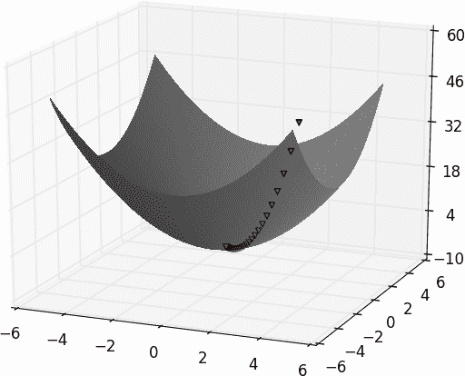
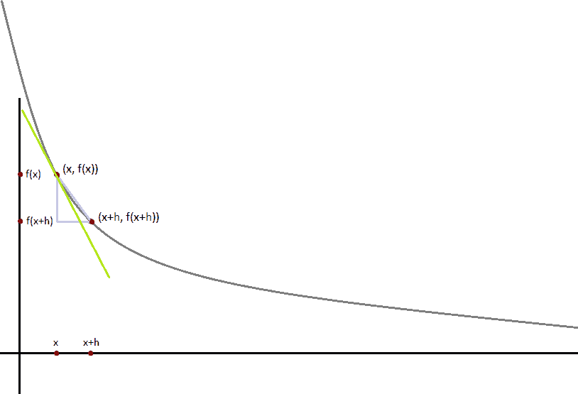
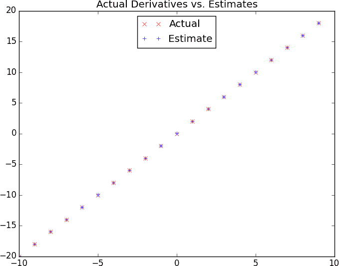

# 第八章：梯度下降

> 那些夸口自己的衰退的人，吹嘘他们欠别人的东西。
> 
> 塞内加

在做数据科学时，我们经常会试图找到某种情况下的最佳模型。通常，“最佳”意味着“最小化预测误差”或“最大化数据的可能性”。换句话说，它将代表某种优化问题的解决方案。

这意味着我们需要解决许多优化问题。特别是，我们需要从头开始解决它们。我们的方法将是一种称为*梯度下降*的技术，它非常适合从头开始的处理。你可能不会觉得它本身特别令人兴奋，但它将使我们能够在整本书中做一些令人兴奋的事情，所以请忍耐一下。

# 梯度下降背后的思想

假设我们有一个函数`f`，它以一个实数向量作为输入并输出一个实数。一个简单的这样的函数是：

```py
from scratch.linear_algebra import Vector, dot

def sum_of_squares(v: Vector) -> float:
    """Computes the sum of squared elements in v"""
    return dot(v, v)
```

我们经常需要最大化或最小化这样的函数。也就是说，我们需要找到产生最大（或最小）可能值的输入`v`。

对于像我们这样的函数，*梯度*（如果你记得你的微积分，这是偏导数的向量）给出了函数增加最快的输入方向。（如果你不记得你的微积分，相信我或者去互联网上查一查。）

相应地，最大化一个函数的一种方法是选择一个随机起点，计算梯度，沿着梯度的方向迈出一小步（即导致函数增加最多的方向），然后用新的起点重复这个过程。类似地，你可以尝试通过向*相反*方向迈小步来最小化一个函数，如图 8-1 所示。



###### 图 8-1\. 使用梯度下降找到最小值

###### 注意

如果一个函数有一个唯一的全局最小值，这个过程很可能会找到它。如果一个函数有多个（局部）最小值，这个过程可能会“找到”它们中的错误之一，这种情况下你可能需要从不同的起点重新运行该过程。如果一个函数没有最小值，那么可能这个过程会永远进行下去。

# 估计梯度

如果`f`是一个关于一个变量的函数，在点`x`处的导数测量了当我们对`x`做一个非常小的变化时`f(x)`如何改变。导数被定义为差商的极限：

```py
from typing import Callable

def difference_quotient(f: Callable[[float], float],
                        x: float,
                        h: float) -> float:
    return (f(x + h) - f(x)) / h
```

当`h`趋近于零时。

（许多想要学习微积分的人都被极限的数学定义所困扰，这是美丽的但可能看起来有些令人生畏的。在这里，我们将作弊并简单地说，“极限”意味着你认为的意思。）

导数是切线在 <math><mrow><mo>(</mo> <mi>x</mi> <mo>,</mo> <mi>f</mi> <mo>(</mo> <mi>x</mi> <mo>)</mo> <mo>)</mo></mrow></math> 处的斜率，而差商是穿过 <math><mrow><mo>(</mo> <mi>x</mi> <mo>+</mo> <mi>h</mi> <mo>,</mo> <mi>f</mi> <mo>(</mo> <mi>x</mi> <mo>+</mo> <mi>h</mi> <mo>)</mo> <mo>)</mo></mrow></math> 的不完全切线的斜率。随着 *h* 变得越来越小，这个不完全切线越来越接近切线 (图 8-2)。



###### 图 8-2\. 使用差商近似导数

对于许多函数来说，精确计算导数是很容易的。例如，`square` 函数：

```py
def square(x: float) -> float:
    return x * x
```

具有导数：

```py
def derivative(x: float) -> float:
    return 2 * x
```

对于我们来说很容易检查的是，通过明确计算差商并取极限。(这只需要高中代数就可以做到。)

如果你不能（或不想）找到梯度怎么办？尽管我们不能在 Python 中取极限，但我们可以通过评估一个非常小的 `e` 的差商来估计导数。图 8-3 显示了这样一个估计的结果：

```py
xs = range(-10, 11)
actuals = [derivative(x) for x in xs]
estimates = [difference_quotient(square, x, h=0.001) for x in xs]

# plot to show they're basically the same
import matplotlib.pyplot as plt
plt.title("Actual Derivatives vs. Estimates")
plt.plot(xs, actuals, 'rx', label='Actual')       # red  x
plt.plot(xs, estimates, 'b+', label='Estimate')   # blue +
plt.legend(loc=9)
plt.show()
```



###### 图 8-3\. 差商近似的好处

当 `f` 是多变量函数时，它具有多个 *偏导数*，每个偏导数指示当我们只对其中一个输入变量进行微小变化时 `f` 如何变化。

我们通过将其视为仅其第 *i* 个变量的函数，并固定其他变量来计算其 *i*th 偏导数：

```py
def partial_difference_quotient(f: Callable[[Vector], float],
                                v: Vector,
                                i: int,
                                h: float) -> float:
    """Returns the i-th partial difference quotient of f at v"""
    w = [v_j + (h if j == i else 0)    # add h to just the ith element of v
         for j, v_j in enumerate(v)]

    return (f(w) - f(v)) / h
```

然后我们可以以同样的方式估计梯度：

```py
def estimate_gradient(f: Callable[[Vector], float],
                      v: Vector,
                      h: float = 0.0001):
    return [partial_difference_quotient(f, v, i, h)
            for i in range(len(v))]
```

###### 注意

这种“使用差商估计”的方法的一个主要缺点是计算成本高昂。如果 `v` 的长度为 *n*，`estimate_gradient` 必须在 2*n* 个不同的输入上评估 `f`。如果你反复估计梯度，那么你需要做大量额外的工作。在我们所做的一切中，我们将使用数学来显式计算我们的梯度函数。

# 使用梯度

很容易看出，当其输入 `v` 是一个零向量时，`sum_of_squares` 函数最小。但想象一下，如果我们不知道这一点。让我们使用梯度来找到所有三维向量中的最小值。我们只需选择一个随机起点，然后沿着梯度的相反方向迈出微小的步骤，直到我们到达梯度非常小的点：

```py
import random
from scratch.linear_algebra import distance, add, scalar_multiply

def gradient_step(v: Vector, gradient: Vector, step_size: float) -> Vector:
    """Moves `step_size` in the `gradient` direction from `v`"""
    assert len(v) == len(gradient)
    step = scalar_multiply(step_size, gradient)
    return add(v, step)

def sum_of_squares_gradient(v: Vector) -> Vector:
    return [2 * v_i for v_i in v]
```

```py
# pick a random starting point
v = [random.uniform(-10, 10) for i in range(3)]

for epoch in range(1000):
    grad = sum_of_squares_gradient(v)    # compute the gradient at v
    v = gradient_step(v, grad, -0.01)    # take a negative gradient step
    print(epoch, v)

assert distance(v, [0, 0, 0]) < 0.001    # v should be close to 0
```

如果你运行这个程序，你会发现它总是最终得到一个非常接近 `[0,0,0]` 的 `v`。你运行的周期越多，它就会越接近。

# 选择合适的步长

尽管反对梯度的理由很明确，但移动多远并不清楚。事实上，选择正确的步长更多地是一门艺术而不是一门科学。流行的选择包括：

+   使用固定步长

+   随着时间逐渐缩小步长

+   在每一步中，选择使目标函数值最小化的步长。

最后一种方法听起来很好，但在实践中是一种昂贵的计算。为了保持简单，我们将主要使用固定步长。“有效”的步长取决于问题——太小，你的梯度下降将永远不会结束；太大，你将采取巨大的步骤，可能会使你关心的函数变得更大甚至未定义。因此，我们需要进行实验。

# 使用梯度下降拟合模型

在这本书中，我们将使用梯度下降来拟合数据的参数化模型。通常情况下，我们会有一些数据集和一些（假设的）依赖于一个或多个参数的数据模型（以可微分的方式）。我们还会有一个*损失*函数，用于衡量模型拟合数据的好坏程度（越小越好）。

如果我们将数据视为固定的，那么我们的损失函数告诉我们任何特定模型参数的好坏程度。这意味着我们可以使用梯度下降找到使损失尽可能小的模型参数。让我们看一个简单的例子：

```py
# x ranges from -50 to 49, y is always 20 * x + 5
inputs = [(x, 20 * x + 5) for x in range(-50, 50)]
```

在这种情况下，我们*知道*线性关系的参数`x`和`y`，但想象一下我们希望从数据中学习这些参数。我们将使用梯度下降来找到最小化平均平方误差的斜率和截距。

我们将以一个基于单个数据点误差的梯度确定梯度的函数开始：

```py
def linear_gradient(x: float, y: float, theta: Vector) -> Vector:
    slope, intercept = theta
    predicted = slope * x + intercept    # The prediction of the model.
    error = (predicted - y)              # error is (predicted - actual).
    squared_error = error ** 2           # We'll minimize squared error
    grad = [2 * error * x, 2 * error]    # using its gradient.
    return grad
```

让我们考虑一下梯度的含义。假设对于某个`x`，我们的预测值过大。在这种情况下，`error`是正的。第二个梯度项，`2 * error`，是正的，这反映了截距的小增加会使（已经过大的）预测值变得更大，进而导致该`x`的平方误差变得更大。

第一个梯度项`2 * error * x`与`x`的符号相同。确实，如果`x`为正，那么斜率的小增加会再次使预测（因此误差）变大。但是如果`x`为负，斜率的小增加会使预测（因此误差）变小。

现在，这个计算是针对单个数据点的。对于整个数据集，我们将看*均方误差*。均方误差的梯度就是单个梯度的均值。

所以，我们要做的是：

1.  从一个随机值`theta`开始。

1.  计算梯度的均值。

1.  在那个方向上调整`theta`。

1.  重复。

经过许多*epochs*（我们称每次通过数据集的迭代），我们应该学到一些正确的参数：

```py
from scratch.linear_algebra import vector_mean

# Start with random values for slope and intercept
theta = [random.uniform(-1, 1), random.uniform(-1, 1)]

learning_rate = 0.001

for epoch in range(5000):
    # Compute the mean of the gradients
    grad = vector_mean([linear_gradient(x, y, theta) for x, y in inputs])
    # Take a step in that direction
    theta = gradient_step(theta, grad, -learning_rate)
    print(epoch, theta)

slope, intercept = theta
assert 19.9 < slope < 20.1,   "slope should be about 20"
assert 4.9 < intercept < 5.1, "intercept should be about 5"
```

# 小批量和随机梯度下降

前述方法的一个缺点是，我们必须在可以采取梯度步骤并更新参数之前对整个数据集进行梯度评估。在这种情况下，这是可以接受的，因为我们的数据集只有 100 对，梯度计算是廉价的。

然而，您的模型通常会有大型数据集和昂贵的梯度计算。在这种情况下，您会希望更频繁地进行梯度步骤。

我们可以使用一种称为*小批量梯度下降*的技术来实现这一点，通过从更大的数据集中抽取“小批量”来计算梯度（并执行梯度步骤）：

```py
from typing import TypeVar, List, Iterator

T = TypeVar('T')  # this allows us to type "generic" functions

def minibatches(dataset: List[T],
                batch_size: int,
                shuffle: bool = True) -> Iterator[List[T]]:
    """Generates `batch_size`-sized minibatches from the dataset"""
    # start indexes 0, batch_size, 2 * batch_size, ...
    batch_starts = [start for start in range(0, len(dataset), batch_size)]

    if shuffle: random.shuffle(batch_starts)  # shuffle the batches

    for start in batch_starts:
        end = start + batch_size
        yield dataset[start:end]
```

###### 注意

`TypeVar(T)`允许我们创建一个“泛型”函数。它表示我们的`dataset`可以是任何一种类型的列表——`str`、`int`、`list`等等——但无论是哪种类型，输出都将是它们的批次。

现在我们可以再次使用小批量来解决我们的问题：

```py
theta = [random.uniform(-1, 1), random.uniform(-1, 1)]

for epoch in range(1000):
    for batch in minibatches(inputs, batch_size=20):
        grad = vector_mean([linear_gradient(x, y, theta) for x, y in batch])
        theta = gradient_step(theta, grad, -learning_rate)
    print(epoch, theta)

slope, intercept = theta
assert 19.9 < slope < 20.1,   "slope should be about 20"
assert 4.9 < intercept < 5.1, "intercept should be about 5"
```

另一种变体是*随机梯度下降*，在这种方法中，您基于一个训练样本一次进行梯度步骤：

```py
theta = [random.uniform(-1, 1), random.uniform(-1, 1)]

for epoch in range(100):
    for x, y in inputs:
        grad = linear_gradient(x, y, theta)
        theta = gradient_step(theta, grad, -learning_rate)
    print(epoch, theta)

slope, intercept = theta
assert 19.9 < slope < 20.1,   "slope should be about 20"
assert 4.9 < intercept < 5.1, "intercept should be about 5"
```

在这个问题上，随机梯度下降在更少的迭代次数内找到了最优参数。但总是存在权衡。基于小型小批量（或单个数据点）进行梯度步骤可以让您执行更多次梯度步骤，但单个点的梯度可能与整个数据集的梯度方向差异很大。

此外，如果我们不是从头开始进行线性代数运算，通过“向量化”我们在批次中的计算而不是逐点计算梯度，会有性能提升。

在整本书中，我们将尝试找到最佳的批量大小和步长。

###### 注意

关于各种梯度下降方法的术语并不统一。通常称为*批量梯度下降*的方法是“对整个数据集计算梯度”，有些人在提到小批量版本时称为*随机梯度下降*（其中逐点版本是一种特例）。

# 进一步探索

+   继续阅读！我们将在本书的其余部分使用梯度下降来解决问题。

+   此时，您无疑对我建议您阅读教科书感到厌倦。如果能稍微安慰一下的话，[*Active Calculus 1.0*](https://scholarworks.gvsu.edu/books/10/)，由 Matthew Boelkins、David Austin 和 Steven Schlicker（Grand Valley State University Libraries）编写的书，似乎比我学习的微积分教科书更好。

+   Sebastian Ruder 在他的 [epic 博客文章](http://ruder.io/optimizing-gradient-descent/index.html) 中比较了梯度下降及其许多变体。
