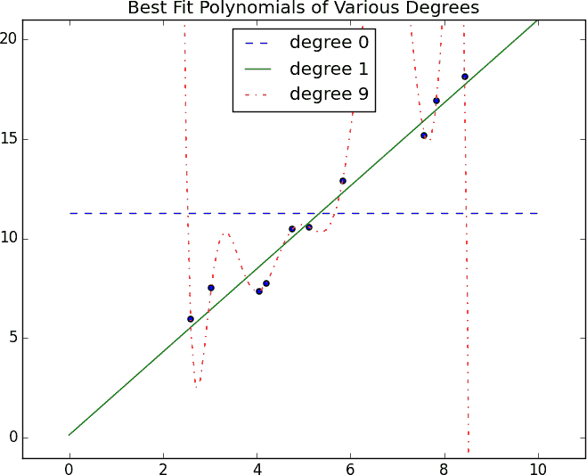
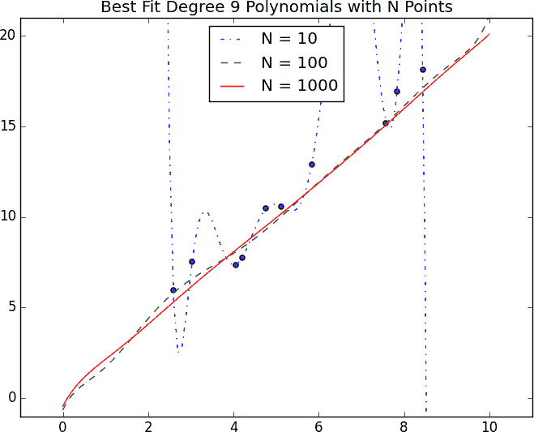

# 第十一章：机器学习

> 我总是乐意学习，尽管我并不总是喜欢被教导。
> 
> 温斯顿·丘吉尔

许多人想象数据科学主要是机器学习，认为数据科学家整天都在构建、训练和调整机器学习模型。（不过，很多这样想的人其实并不知道机器学习是什么。）事实上，数据科学主要是将业务问题转化为数据问题，收集数据、理解数据、清理数据和格式化数据，而机器学习几乎成了事后的事情。尽管如此，它是一个有趣且必不可少的事后步骤，你基本上必须了解它才能从事数据科学工作。

# 建模

在我们讨论机器学习之前，我们需要谈谈*模型*。

什么是模型？简单来说，它是描述不同变量之间数学（或概率）关系的规范。

例如，如果你正在为你的社交网络站点筹集资金，你可能会建立一个*商业模型*（通常在电子表格中），该模型接受“用户数量”、“每用户广告收入”和“员工数量”等输入，并输出未来几年的年度利润。烹饪食谱涉及一个模型，将“用餐者数量”和“饥饿程度”等输入与所需的食材量联系起来。如果你曾经在电视上观看扑克比赛，你会知道每位玩家的“获胜概率”是根据模型实时估算的，该模型考虑了到目前为止已经公开的牌和牌堆中牌的分布。

商业模型可能基于简单的数学关系：利润等于收入减去支出，收入等于销售单位数乘以平均价格，等等。食谱模型可能基于试错法——有人在厨房尝试不同的配料组合，直到找到自己喜欢的那一种。而扑克模型则基于概率论、扑克规则以及关于发牌随机过程的一些合理假设。

# 什么是机器学习？

每个人都有自己的确切定义，但我们将使用*机器学习*来指代从数据中创建和使用模型的过程。在其他情境下，这可能被称为*预测建模*或*数据挖掘*，但我们将坚持使用机器学习。通常，我们的目标是利用现有数据开发模型，用于预测新数据的各种结果，比如：

+   是否是垃圾邮件

+   信用卡交易是否属于欺诈

+   哪个广告最有可能被购物者点击

+   哪支橄榄球队会赢得超级碗

我们将讨论*监督*模型（其中有一组带有正确答案标签的数据可供学习）和*无监督*模型（其中没有这些标签）两种模型。还有其他各种类型，比如*半监督*（其中只有部分数据被标记）、*在线*（模型需要持续调整以适应新到达的数据）和*强化*（在做出一系列预测后，模型会收到一个指示其表现如何的信号），这些我们在本书中不会涉及。

现在，即使在最简单的情况下，也有可能有整个宇宙的模型可以描述我们感兴趣的关系。在大多数情况下，我们会自己选择一个*参数化*的模型家族，然后使用数据来学习某种方式上最优的参数。

例如，我们可能假设一个人的身高（大致上）是他的体重的线性函数，然后使用数据来学习这个线性函数是什么。或者我们可能认为决策树是诊断我们的患者患有哪些疾病的好方法，然后使用数据来学习“最优”这样的树。在本书的其余部分，我们将研究我们可以学习的不同模型家族。

但在此之前，我们需要更好地理解机器学习的基本原理。在本章的其余部分，我们将讨论一些基本概念，然后再讨论模型本身。

# 过拟合和欠拟合

在机器学习中一个常见的危险是*过拟合*——生成一个在您训练它的数据上表现良好但泛化性能差的模型。这可能涉及学习数据中的*噪音*。或者可能涉及学习识别特定输入，而不是实际上对所需输出有预测能力的因素。

这种情况的另一面是*拟合不足*——产生一个即使在训练数据上表现也不好的模型，尽管通常在这种情况下，您会认为您的模型还不够好，继续寻找更好的模型。

在图 11-1 中，我拟合了三个多项式到一组数据样本中。（不用担心具体方法；我们会在后面的章节中介绍。）



###### 图 11-1\. 过拟合和欠拟合

水平线显示了最佳拟合度为 0（即常数）的多项式。它严重*拟合不足*训练数据。最佳拟合度为 9（即 10 参数）的多项式恰好通过每个训练数据点，但它非常严重*过拟合*；如果我们再选几个数据点，它很可能会严重偏离。而一次拟合度的线条达到了很好的平衡；它非常接近每个点，如果这些数据是代表性的，那么这条线也很可能接近新数据点。

显然，过于复杂的模型会导致过拟合，并且在训练数据之外不能很好地泛化。那么，我们如何确保我们的模型不会太复杂呢？最基本的方法涉及使用不同的数据来训练模型和测试模型。

这样做的最简单方法是将数据集分割，例如，将其的三分之二用于训练模型，之后我们可以在剩余的三分之一上测量模型的性能：

```py
import random
from typing import TypeVar, List, Tuple
X = TypeVar('X')  # generic type to represent a data point

def split_data(data: List[X], prob: float) -> Tuple[List[X], List[X]]:
    """Split data into fractions [prob, 1 - prob]"""
    data = data[:]                    # Make a shallow copy
    random.shuffle(data)              # because shuffle modifies the list.
    cut = int(len(data) * prob)       # Use prob to find a cutoff
    return data[:cut], data[cut:]     # and split the shuffled list there.

data = [n for n in range(1000)]
train, test = split_data(data, 0.75)

# The proportions should be correct
assert len(train) == 750
assert len(test) == 250

# And the original data should be preserved (in some order)
assert sorted(train + test) == data
```

通常情况下，我们会有成对的输入变量和输出变量。在这种情况下，我们需要确保将对应的值放在训练数据或测试数据中：

```py
Y = TypeVar('Y')  # generic type to represent output variables

def train_test_split(xs: List[X],
                     ys: List[Y],
                     test_pct: float) -> Tuple[List[X], List[X], List[Y],
                                                                 List[Y]]:
    # Generate the indices and split them
    idxs = [i for i in range(len(xs))]
    train_idxs, test_idxs = split_data(idxs, 1 - test_pct)

    return ([xs[i] for i in train_idxs],  # x_train
            [xs[i] for i in test_idxs],   # x_test
            [ys[i] for i in train_idxs],  # y_train
            [ys[i] for i in test_idxs])   # y_test
```

如常，我们要确保我们的代码能够正常工作：

```py
xs = [x for x in range(1000)]  # xs are 1 ... 1000
ys = [2 * x for x in xs]       # each y_i is twice x_i
x_train, x_test, y_train, y_test = train_test_split(xs, ys, 0.25)

# Check that the proportions are correct
assert len(x_train) == len(y_train) == 750
assert len(x_test) == len(y_test) == 250

# Check that the corresponding data points are paired correctly
assert all(y == 2 * x for x, y in zip(x_train, y_train))
assert all(y == 2 * x for x, y in zip(x_test, y_test))
```

之后，您可以做一些像这样的事情：

```py
model = SomeKindOfModel()
x_train, x_test, y_train, y_test = train_test_split(xs, ys, 0.33)
model.train(x_train, y_train)
performance = model.test(x_test, y_test)
```

如果模型对训练数据过拟合，那么它在（完全分开的）测试数据上的表现希望会非常差。换句话说，如果它在测试数据上表现良好，那么您可以更有信心它是在*适应*而不是*过拟合*。

然而，有几种情况可能会出错。

第一种情况是测试数据和训练数据中存在的常见模式不会推广到更大的数据集中。

例如，想象一下，您的数据集包含用户活动，每个用户每周一行。在这种情况下，大多数用户会出现在训练数据和测试数据中，并且某些模型可能会学习*识别*用户而不是发现涉及*属性*的关系。这并不是一个很大的担忧，尽管我曾经遇到过一次。

更大的问题是，如果您不仅用于评估模型而且用于*选择*多个模型。在这种情况下，尽管每个单独的模型可能不会过拟合，“选择在测试集上表现最佳的模型”是一个元训练，使得测试集充当第二个训练集。（当然，在测试集上表现最佳的模型在测试集上表现良好。）

在这种情况下，您应该将数据分为三部分：用于构建模型的训练集，用于在训练后的模型中进行选择的*验证*集，以及用于评估最终模型的测试集。

# 正确性

当我不从事数据科学时，我涉足医学。在业余时间里，我想出了一种廉价的、无创的测试方法，可以给新生儿做，预测——准确率超过 98%——新生儿是否会患白血病。我的律师说服我这个测试方法无法申请专利，所以我会在这里和大家分享详细信息：只有当宝宝被命名为卢克（听起来有点像“白血病”）时，预测白血病。

如我们所见，这个测试确实有超过 98%的准确率。然而，这是一个非常愚蠢的测试，很好地说明了为什么我们通常不使用“准确性”来衡量（二元分类）模型的好坏。

想象构建一个用于进行*二进制*判断的模型。这封邮件是垃圾邮件吗？我们应该雇佣这位候选人吗？这位空中旅客是不是秘密的恐怖分子？

针对一组标记数据和这样一个预测模型，每个数据点都属于四个类别之一：

真阳性

“此消息是垃圾邮件，我们正确预测了垃圾邮件。”

假阳性（第一类错误）

“此消息不是垃圾邮件，但我们预测了垃圾邮件。”

假阴性（第二类错误）

“此消息是垃圾邮件，但我们预测了非垃圾邮件。”

真阴性

“此消息不是垃圾邮件，我们正确预测了非垃圾邮件。”

我们通常将这些表示为*混淆矩阵*中的计数：

|  | 垃圾邮件 | 非垃圾邮件 |
| --- | --- | --- |
| 预测“垃圾邮件” | 真阳性 | 假阳性 |
| 预测“非垃圾邮件” | 假阴性 | 真阴性 |

让我们看看我的白血病测试如何符合这个框架。 近年来，大约[每 1,000 名婴儿中有 5 名被命名为卢克](https://www.babycenter.com/baby-names-luke-2918.htm)。 白血病的终身患病率约为 1.4%，或[每 1,000 人中有 14 人](https://seer.cancer.gov/statfacts/html/leuks.html)。

如果我们相信这两个因素是独立的，并将我的“卢克是用于白血病检测”的测试应用于 1 百万人，我们预计会看到一个混淆矩阵，如下所示：

|  | 白血病 | 无白血病 | 总计 |
| --- | --- | --- | --- |
| “卢克” | 70 | 4,930 | 5,000 |
| 非“卢克” | 13,930 | 981,070 | 995,000 |
| 总计 | 14,000 | 986,000 | 1,000,000 |

我们可以使用这些来计算有关模型性能的各种统计信息。 例如，*准确度* 定义为正确预测的分数的比例：

```py
def accuracy(tp: int, fp: int, fn: int, tn: int) -> float:
    correct = tp + tn
    total = tp + fp + fn + tn
    return correct / total

assert accuracy(70, 4930, 13930, 981070) == 0.98114
```

这似乎是一个相当令人印象深刻的数字。 但显然这不是一个好的测试，这意味着我们可能不应该对原始准确性赋予很高的信任。

通常会查看*精确度*和*召回率*的组合。 精确度衡量我们的*阳性*预测的准确性：

```py
def precision(tp: int, fp: int, fn: int, tn: int) -> float:
    return tp / (tp + fp)

assert precision(70, 4930, 13930, 981070) == 0.014
```

召回率衡量了我们的模型识别出的阳性的分数：

```py
def recall(tp: int, fp: int, fn: int, tn: int) -> float:
    return tp / (tp + fn)

assert recall(70, 4930, 13930, 981070) == 0.005
```

这两个数字都很糟糕，反映出这是一个糟糕的模型。

有时精确度和召回率会结合成*F1 分数*，其定义为：

```py
def f1_score(tp: int, fp: int, fn: int, tn: int) -> float:
    p = precision(tp, fp, fn, tn)
    r = recall(tp, fp, fn, tn)

    return 2 * p * r / (p + r)
```

这是[*调和平均*](http://en.wikipedia.org/wiki/Harmonic_mean) 精度和召回率，必然位于它们之间。

通常，模型的选择涉及精确度和召回率之间的权衡。 当模型在稍微有信心时预测“是”可能会具有很高的召回率但较低的精确度； 仅当模型极度自信时才预测“是”可能会具有较低的召回率和较高的精确度。

或者，您可以将其视为假阳性和假阴性之间的权衡。 说“是”的次数太多会产生大量的假阳性； 说“不”太多会产生大量的假阴性。

想象一下，白血病有 10 个风险因素，而且你拥有的风险因素越多，患白血病的可能性就越大。在这种情况下，你可以想象一系列测试：“如果至少有一个风险因素则预测患白血病”，“如果至少有两个风险因素则预测患白血病”，依此类推。随着阈值的提高，测试的准确性增加（因为拥有更多风险因素的人更有可能患病），而召回率降低（因为越来越少最终患病者将满足阈值）。在这种情况下，选择正确的阈值是找到正确权衡的问题。

# 偏差-方差权衡

另一种思考过拟合问题的方式是将其视为偏差和方差之间的权衡。

这两者都是在假设你会在来自同一较大总体的不同训练数据集上多次重新训练模型时会发生的情况的度量。

例如，“过拟合和欠拟合”中的零阶模型在几乎任何训练集上都会犯很多错误（从同一总体中抽取），这意味着它有很高的*偏差*。然而，任意选择的两个训练集应该产生相似的模型（因为任意选择的两个训练集应该具有相似的平均值）。所以我们说它的*方差*很低。高偏差和低方差通常对应欠拟合。

另一方面，九阶模型完美地适应了训练集。它的偏差非常低，但方差非常高（因为任意两个训练集可能会产生非常不同的模型）。这对应于过拟合。

以这种方式思考模型问题可以帮助你弄清楚当你的模型效果不佳时该怎么做。

如果你的模型存在高偏差（即使在训练数据上表现也很差），可以尝试的一种方法是添加更多特征。从“过拟合和欠拟合”中的零阶模型转换为一阶模型是一个很大的改进。

如果你的模型方差很高，你可以类似地*删除*特征。但另一个解决方案是获取更多数据（如果可能的话）。

在图 11-2 中，我们将一个九阶多项式拟合到不同大小的样本上。基于 10 个数据点进行的模型拟合到处都是，正如我们之前看到的。如果我们改为在 100 个数据点上训练，过拟合就会减少很多。而在 1,000 个数据点上训练的模型看起来与一阶模型非常相似。保持模型复杂性恒定，拥有的数据越多，过拟合就越困难。另一方面，更多的数据对偏差没有帮助。如果你的模型没有使用足够的特征来捕获数据的规律，那么扔更多数据进去是没有帮助的。



###### 图 11-2\. 通过增加数据减少方差

# 特征提取和选择

正如前面提到的，当你的数据没有足够的特征时，你的模型很可能会欠拟合。而当你的数据有太多特征时，很容易过拟合。但特征是什么，它们从哪里来呢？

*特征*就是我们向模型提供的任何输入。

在最简单的情况下，特征只是简单地给出。如果你想根据某人的工作经验预测她的薪水，那么工作经验就是你唯一拥有的特征。（尽管正如我们在“过拟合和欠拟合”中看到的那样，如果这有助于构建更好的模型，你可能还会考虑添加工作经验的平方、立方等。）

随着数据变得更加复杂，事情变得更加有趣。想象一下试图构建一个垃圾邮件过滤器来预测邮件是否是垃圾的情况。大多数模型不知道如何处理原始邮件，因为它只是一堆文本。你需要提取特征。例如：

+   邮件中是否包含*Viagra*一词？

+   字母*d*出现了多少次？

+   发件人的域名是什么？

对于像这里第一个问题的答案，答案很简单，是一个是或否的问题，我们通常将其编码为 1 或 0。第二个问题是一个数字。第三个问题是从一组离散选项中选择的一个选项。

几乎总是，我们会从数据中提取属于这三类之一的特征。此外，我们拥有的特征类型限制了我们可以使用的模型类型。

+   我们将在第十三章中构建的朴素贝叶斯分类器适用于像前面列表中的第一个这样的是或否特征。

+   我们将在第 14 和第十六章中学习的回归模型需要数值特征（可能包括虚拟变量，即 0 和 1）。

+   我们将在第十七章中探讨的决策树可以处理数值或分类数据。

虽然在垃圾邮件过滤器示例中我们寻找创建特征的方法，但有时我们会寻找删除特征的方法。

例如，你的输入可能是几百个数字的向量。根据情况，将这些特征简化为几个重要的维度可能是合适的（正如在“降维”中所示），然后仅使用这少量的特征。或者可能适合使用一种技术（如我们将在“正则化”中看到的那样），该技术惩罚使用更多特征的模型。

我们如何选择特征？这就是经验和领域专业知识结合起来发挥作用的地方。如果你收到了大量的邮件，那么你可能会意识到某些词语的出现可能是垃圾邮件的良好指标。而你可能还会觉得字母*d*的数量可能不是衡量邮件是否是垃圾的好指标。但总的来说，你必须尝试不同的方法，这也是乐趣的一部分。

# 进一步探索

+   继续阅读！接下来的几章讲述不同类型的机器学习模型。

+   Coursera 的[机器学习课程](https://www.coursera.org/course/ml)是最早的大规模在线开放课程（MOOC），是深入了解机器学习基础知识的好地方。

+   *统计学习的要素*，作者是 Jerome H. Friedman、Robert Tibshirani 和 Trevor Hastie（Springer），是一本可以[免费在线下载](http://stanford.io/1ycOXbo)的经典教材。但请注意：它非常数学化。
