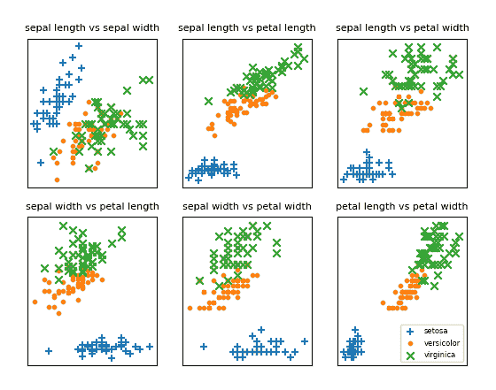
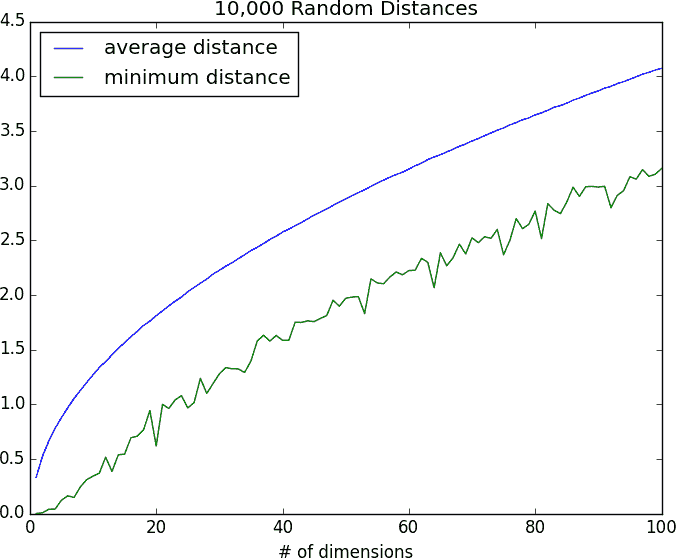
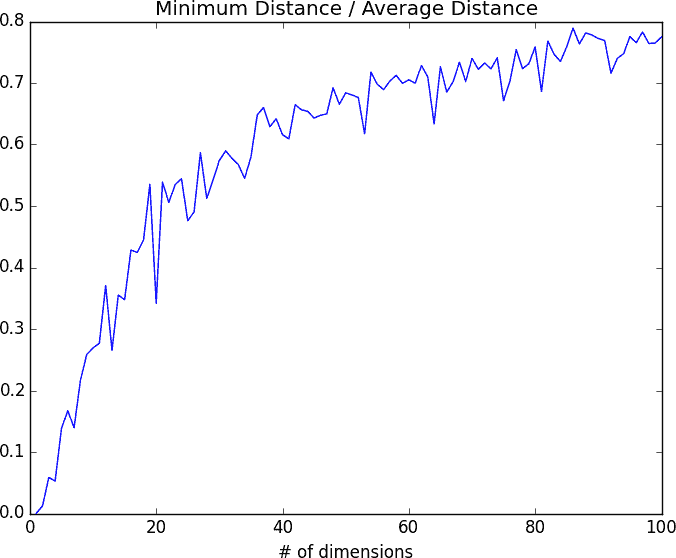
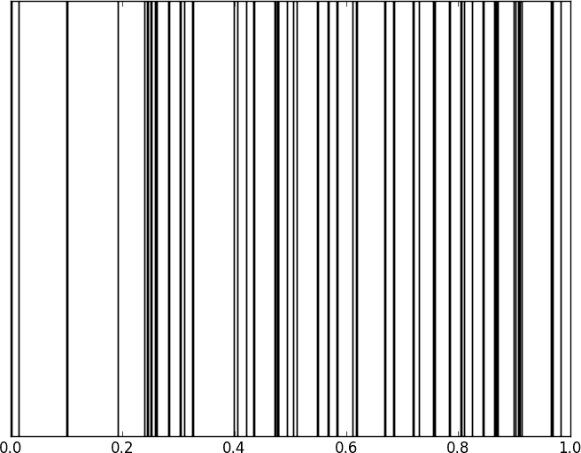
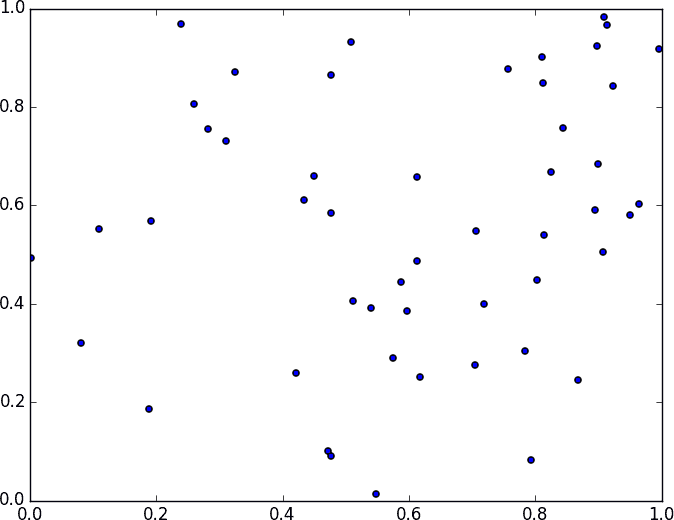

# 第十二章：k-最近邻

> 如果你想要惹恼你的邻居，就告诉他们关于他们的真相。
> 
> 皮耶特罗·阿雷蒂诺

想象一下，你试图预测我在下次总统选举中的投票方式。如果你对我一无所知（并且如果你有数据的话），一个明智的方法是看看我的*邻居*打算如何投票。像我一样住在西雅图，我的邻居们无一例外地计划投票给民主党候选人，这表明“民主党候选人”对我来说也是一个不错的猜测。

现在想象一下，你不仅了解我的地理位置，还知道我的年龄、收入、有几个孩子等等。在我行为受这些因素影响（或者说特征化）的程度上，只看那些在所有这些维度中与我接近的邻居，似乎比看所有邻居更有可能是一个更好的预测器。这就是*最近邻分类*背后的思想。

# 模型

最近邻是最简单的预测模型之一。它不做任何数学假设，也不需要任何重型设备。它唯一需要的是：

+   某种距离的概念

+   一个假设是相互接近的点是相似的。

在本书中，我们将看到的大多数技术都是整体看待数据集以便学习数据中的模式。而最近邻则故意忽略了很多信息，因为对于每个新点的预测仅依赖于最接近它的少数几个点。

此外，最近邻可能不会帮助你理解你正在研究的现象的驱动因素。根据我的邻居的投票预测我的投票并不能告诉你关于我为什么投票的原因，而一些基于（比如）我的收入和婚姻状况预测我的投票的替代模型可能会很好地做到这一点。

在一般情况下，我们有一些数据点和相应的标签集合。标签可以是`True`和`False`，表示每个输入是否满足某些条件，比如“是垃圾邮件？”或“有毒？”或“看起来有趣吗？”或者它们可以是类别，比如电影评级（G，PG，PG-13，R，NC-17）。或者它们可以是总统候选人的名字。或者它们可以是喜欢的编程语言。

在我们的情况下，数据点将是向量，这意味着我们可以使用第四章中的`distance`函数。

假设我们选择了一个像 3 或 5 这样的数字*k*。那么，当我们想要对一些新的数据点进行分类时，我们找到*k*个最近的带标签点，并让它们对新的输出进行投票。

为此，我们需要一个计票的函数。一种可能性是：

```py
from typing import List
from collections import Counter

def raw_majority_vote(labels: List[str]) -> str:
    votes = Counter(labels)
    winner, _ = votes.most_common(1)[0]
    return winner

assert raw_majority_vote(['a', 'b', 'c', 'b']) == 'b'
```

但这并不会处理带有智能的平局情况。例如，想象我们正在评分电影，而最近的五部电影分别被评为 G、G、PG、PG 和 R。那么 G 有两票，PG 也有两票。在这种情况下，我们有几个选项：

+   随机挑选一个赢家。

+   通过距离加权投票并选择加权赢家。

+   减少*k*直到找到唯一的赢家。

我们将实现第三种方法：

```py
def majority_vote(labels: List[str]) -> str:
    """Assumes that labels are ordered from nearest to farthest."""
    vote_counts = Counter(labels)
    winner, winner_count = vote_counts.most_common(1)[0]
    num_winners = len([count
                       for count in vote_counts.values()
                       if count == winner_count])

    if num_winners == 1:
        return winner                     # unique winner, so return it
    else:
        return majority_vote(labels[:-1]) # try again without the farthest

# Tie, so look at first 4, then 'b'
assert majority_vote(['a', 'b', 'c', 'b', 'a']) == 'b'
```

这种方法肯定最终会奏效，因为在最坏的情况下，我们最终只需一个标签，此时那个标签会获胜。

使用这个函数很容易创建一个分类器：

```py
from typing import NamedTuple
from scratch.linear_algebra import Vector, distance

class LabeledPoint(NamedTuple):
    point: Vector
    label: str

def knn_classify(k: int,
                 labeled_points: List[LabeledPoint],
                 new_point: Vector) -> str:

    # Order the labeled points from nearest to farthest.
    by_distance = sorted(labeled_points,
                         key=lambda lp: distance(lp.point, new_point))

    # Find the labels for the k closest
    k_nearest_labels = [lp.label for lp in by_distance[:k]]

    # and let them vote.
    return majority_vote(k_nearest_labels)
```

让我们看看这是如何工作的。

# 示例：鸢尾花数据集

*Iris* 数据集是机器学习的重要数据集。它包含了 150 朵花的测量数据，代表三种鸢尾花物种。对于每朵花，我们有它的花瓣长度、花瓣宽度、萼片长度和萼片宽度，以及它的物种。你可以从[*https://archive.ics.uci.edu/ml/datasets/iris*](https://archive.ics.uci.edu/ml/datasets/iris)下载：

```py
import requests

data = requests.get(
  "https://archive.ics.uci.edu/ml/machine-learning-databases/iris/iris.data"
)

with open('iris.dat', 'w') as f:
    f.write(data.text)
```

数据是逗号分隔的，包含字段：

```py
sepal_length, sepal_width, petal_length, petal_width, class
```

例如，第一行看起来像：

```py
5.1,3.5,1.4,0.2,Iris-setosa
```

在这一节中，我们将尝试构建一个模型，可以从前四个测量值预测类别（即物种）。

首先，让我们加载并探索数据。我们的最近邻函数期望一个`LabeledPoint`，所以让我们用这种方式表示我们的数据：

```py
from typing import Dict
import csv
from collections import defaultdict

def parse_iris_row(row: List[str]) -> LabeledPoint:
    """
 sepal_length, sepal_width, petal_length, petal_width, class
 """
    measurements = [float(value) for value in row[:-1]]
    # class is e.g. "Iris-virginica"; we just want "virginica"
    label = row[-1].split("-")[-1]

    return LabeledPoint(measurements, label)

with open('iris.data') as f:
    reader = csv.reader(f)
    iris_data = [parse_iris_row(row) for row in reader]

# We'll also group just the points by species/label so we can plot them
points_by_species: Dict[str, List[Vector]] = defaultdict(list)
for iris in iris_data:
    points_by_species[iris.label].append(iris.point)
```

我们希望绘制测量结果，以便查看它们按物种的变化。不幸的是，它们是四维的，这使得绘图变得棘手。我们可以做的一件事是查看每一对测量的散点图（图 12-1）。我不会解释所有的细节，但这是对 matplotlib 更复杂用法的很好示例，所以值得学习：

```py
from matplotlib import pyplot as plt
metrics = ['sepal length', 'sepal width', 'petal length', 'petal width']
pairs = [(i, j) for i in range(4) for j in range(4) if i < j]
marks = ['+', '.', 'x']  # we have 3 classes, so 3 markers

fig, ax = plt.subplots(2, 3)

for row in range(2):
    for col in range(3):
        i, j = pairs[3 * row + col]
        ax[row][col].set_title(f"{metrics[i]} vs {metrics[j]}", fontsize=8)
        ax[row][col].set_xticks([])
        ax[row][col].set_yticks([])

        for mark, (species, points) in zip(marks, points_by_species.items()):
            xs = [point[i] for point in points]
            ys = [point[j] for point in points]
            ax[row][col].scatter(xs, ys, marker=mark, label=species)

ax[-1][-1].legend(loc='lower right', prop={'size': 6})
plt.show()
```



###### 图 12-1\. 鸢尾花散点图

如果你看这些图，看起来测量结果确实按物种聚类。例如，仅看萼片长度和萼片宽度，你可能无法区分*鸢尾花*和*维吉尼亚*。但一旦加入花瓣长度和宽度，似乎你应该能够根据最近邻来预测物种。

首先，让我们将数据分成测试集和训练集：

```py
import random
from scratch.machine_learning import split_data

random.seed(12)
iris_train, iris_test = split_data(iris_data, 0.70)
assert len(iris_train) == 0.7 * 150
assert len(iris_test) == 0.3 * 150
```

训练集将是我们用来分类测试集中点的“邻居”。我们只需选择一个*k*值，即获得投票权的邻居数。如果太小（考虑*k* = 1），我们让离群值影响过大；如果太大（考虑*k* = 105），我们只是预测数据集中最常见的类别。

在真实的应用中（和更多数据），我们可能会创建一个单独的验证集，并用它来选择*k*。在这里我们只使用*k* = 5：

```py
from typing import Tuple

# track how many times we see (predicted, actual)
confusion_matrix: Dict[Tuple[str, str], int] = defaultdict(int)
num_correct = 0

for iris in iris_test:
    predicted = knn_classify(5, iris_train, iris.point)
    actual = iris.label

    if predicted == actual:
        num_correct += 1

    confusion_matrix[(predicted, actual)] += 1

pct_correct = num_correct / len(iris_test)
print(pct_correct, confusion_matrix)
```

在这个简单的数据集上，模型几乎完美地预测了。有一个*鸢尾花*，它预测为*维吉尼亚*，但除此之外其他都是完全正确的。

# 维度灾难

在高维空间中，“k”最近邻算法在处理高维数据时遇到麻烦，这要归因于“维度的诅咒”，其核心问题在于高维空间是*广阔的*。高维空间中的点往往彼此之间并不接近。通过在各种维度中随机生成“d”维“单位立方体”中的点对，并计算它们之间的距离，可以看出这一点。 

生成随机点现在应该是驾轻就熟了：

```py
def random_point(dim: int) -> Vector:
    return [random.random() for _ in range(dim)]
```

编写一个生成距离的函数也是一样的：

```py
def random_distances(dim: int, num_pairs: int) -> List[float]:
    return [distance(random_point(dim), random_point(dim))
            for _ in range(num_pairs)]
```

对于从 1 到 100 的每个维度，我们将计算 10,000 个距离，并使用这些距离计算点之间的平均距离以及每个维度中点之间的最小距离（参见图 12-2）：

```py
import tqdm
dimensions = range(1, 101)

avg_distances = []
min_distances = []

random.seed(0)
for dim in tqdm.tqdm(dimensions, desc="Curse of Dimensionality"):
    distances = random_distances(dim, 10000)      # 10,000 random pairs
    avg_distances.append(sum(distances) / 10000)  # track the average
    min_distances.append(min(distances))          # track the minimum
```



###### 图 12-2。维度的诅咒

随着维度的增加，点之间的平均距离也增加。但更为问题的是最近距离与平均距离之间的比率（参见图 12-3）：

```py
min_avg_ratio = [min_dist / avg_dist
                 for min_dist, avg_dist in zip(min_distances, avg_distances)]
```



###### 图 12-3。再谈维度的诅咒

在低维数据集中，最近的点往往比平均距离要接近得多。但是只有当两个点在每个维度上都接近时，这两个点才是接近的，而每增加一个维度——即使只是噪音——都是使每个点与其他每个点的距离更远的机会。当你有很多维度时，最接近的点可能并不比平均距离要接近，所以两个点接近并不意味着太多（除非你的数据具有使其表现得像低维度的大量结构）。

对问题的另一种思考方式涉及到更高维度空间的稀疏性。

如果你在 0 和 1 之间随机选择 50 个数字，你可能会得到单位区间的一个相当好的样本（参见图 12-4）。



###### 图 12-4。一维空间中的 50 个随机点

如果你在单位正方形中随机选择 50 个点，你将得到更少的覆盖（参见图 12-5）。



###### 图 12-5。二维空间中的 50 个随机点

在三维空间中，覆盖更少（参见图 12-6）。

matplotlib 对于四维图表的呈现并不好，所以这是我们所能达到的最远的地方，但你已经可以看到开始出现大量空白区域，没有点靠近它们。在更多维度中——除非你得到指数级更多的数据——这些大量空白区域代表了远离所有你想要用于预测的点的区域。

因此，如果你尝试在更高维度中使用最近邻方法，最好先进行某种降维处理。


###### 图 12-6。三维空间中的 50 个随机点

# 进一步探索

scikit-learn 有许多[最近邻](https://scikit-learn.org/stable/modules/neighbors.html)模型。
