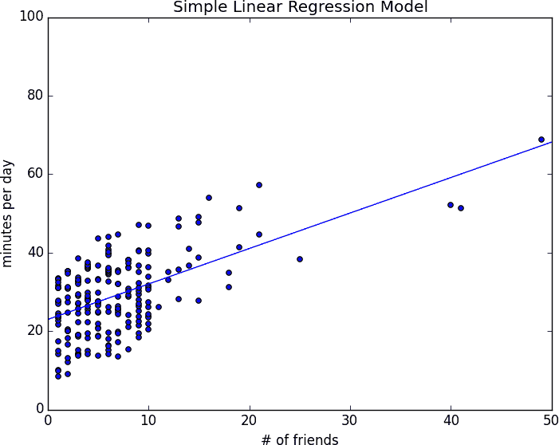

# 第十四章：简单线性回归

> 艺术，如道德，就在于在某处划出界限。
> 
> G. K. Chesterton

在第五章中，我们使用`correlation`函数来衡量两个变量之间线性关系的强度。对于大多数应用程序，知道存在这样一个线性关系是不够的。我们需要理解关系的本质。这就是我们将使用简单线性回归的地方。

# 模型

回想一下，我们正在研究 DataSciencester 用户的朋友数量和每天在网站上花费的时间之间的关系。假设您已经确信，拥有更多朋友*导致*人们在网站上花费更多时间，而不是我们讨论过的其他解释之一。

参与用户参与部长要求您建立描述这种关系的模型。由于您找到了一个相当强的线性关系，线性模型是一个自然的起点。

特别是，您假设存在常数*α*（alpha）和*β*（beta），使得：

<math alttext="y Subscript i Baseline equals beta x Subscript i Baseline plus alpha plus epsilon Subscript i" display="block"><mrow><msub><mi>y</mi> <mi>i</mi></msub> <mo>=</mo> <mi>β</mi> <msub><mi>x</mi> <mi>i</mi></msub> <mo>+</mo> <mi>α</mi> <mo>+</mo> <msub><mi>ε</mi> <mi>i</mi></msub></mrow></math>

其中<math><msub><mi>y</mi> <mi>i</mi></msub></math>是用户*i*每天在网站上花费的分钟数，<math><msub><mi>x</mi> <mi>i</mi></msub></math>是用户*i*的朋友数，*ε*是一个（希望很小的）误差项，表示这个简单模型未考虑到的其他因素。

假设我们已经确定了这样的`alpha`和`beta`，那么我们可以简单地进行预测：

```py
def predict(alpha: float, beta: float, x_i: float) -> float:
    return beta * x_i + alpha
```

如何选择`alpha`和`beta`？嗯，任何`alpha`和`beta`的选择都会给我们每个输入`x_i`预测输出。由于我们知道实际输出`y_i`，我们可以计算每对的误差：

```py
def error(alpha: float, beta: float, x_i: float, y_i: float) -> float:
    """
 The error from predicting beta * x_i + alpha
 when the actual value is y_i
 """
    return predict(alpha, beta, x_i) - y_i
```

我们真正想知道的是整个数据集的总误差。但我们不只是想把误差加起来——如果`x_1`的预测值过高，而`x_2`的预测值过低，误差可能会抵消掉。

因此，我们将平方误差加起来：

```py
from scratch.linear_algebra import Vector

def sum_of_sqerrors(alpha: float, beta: float, x: Vector, y: Vector) -> float:
    return sum(error(alpha, beta, x_i, y_i) ** 2
               for x_i, y_i in zip(x, y))
```

*最小二乘解*是选择使`sum_of_sqerrors`尽可能小的`alpha`和`beta`。

使用微积分（或繁琐的代数），最小化误差的`alpha`和`beta`由以下公式给出：

```py
from typing import Tuple
from scratch.linear_algebra import Vector
from scratch.statistics import correlation, standard_deviation, mean

def least_squares_fit(x: Vector, y: Vector) -> Tuple[float, float]:
    """
 Given two vectors x and y,
 find the least-squares values of alpha and beta
 """
    beta = correlation(x, y) * standard_deviation(y) / standard_deviation(x)
    alpha = mean(y) - beta * mean(x)
    return alpha, beta
```

不需要详细进行数学推导，让我们思考为什么这可能是一个合理的解决方案。选择`alpha`简单地表示，当我们看到自变量`x`的平均值时，我们预测因变量`y`的平均值。

选择`beta`的意义在于，当输入值增加了`standard_deviation(x)`时，预测值就会增加`correlation(x, y) * standard_deviation(y)`。如果`x`和`y`完全正相关，`x`增加一个标准差会导致预测值增加一个`y`的标准差。当它们完全负相关时，`x`的增加会导致预测值的*减少*。当相关性为 0 时，`beta`为 0，这意味着`x`的变化对预测没有任何影响。

通常情况下，我们来快速测试一下：

```py
x = [i for i in range(-100, 110, 10)]
y = [3 * i - 5 for i in x]

# Should find that y = 3x - 5
assert least_squares_fit(x, y) == (-5, 3)
```

现在很容易将其应用于第五章中去除异常值的数据：

```py
from scratch.statistics import num_friends_good, daily_minutes_good

alpha, beta = least_squares_fit(num_friends_good, daily_minutes_good)
assert 22.9 < alpha < 23.0
assert 0.9 < beta < 0.905
```

这给出了`alpha` = 22.95 和`beta` = 0.903 的值。因此，我们的模型表明，我们预计一个没有朋友的用户每天在 DataSciencester 上花费大约 23 分钟。对于每个额外的朋友，我们预计用户每天在网站上多花大约一分钟。

在图 14-1 中，我们绘制预测线，以了解模型拟合观察数据的程度。



###### 图 14-1\. 我们的简单线性模型

当然，我们需要一种比盯着图表更好的方法来确定我们对数据的拟合程度。一个常见的度量是*决定系数*（或*R 平方*），它衡量因变量的总变异中模型所捕获的比例：

```py
from scratch.statistics import de_mean

def total_sum_of_squares(y: Vector) -> float:
    """the total squared variation of y_i's from their mean"""
    return sum(v ** 2 for v in de_mean(y))

def r_squared(alpha: float, beta: float, x: Vector, y: Vector) -> float:
    """
 the fraction of variation in y captured by the model, which equals
 1 - the fraction of variation in y not captured by the model
 """
    return 1.0 - (sum_of_sqerrors(alpha, beta, x, y) /
                  total_sum_of_squares(y))

rsq = r_squared(alpha, beta, num_friends_good, daily_minutes_good)
assert 0.328 < rsq < 0.330
```

记住，我们选择了使预测误差平方和最小化的`alpha`和`beta`。我们可以选择一个线性模型“始终预测`mean(y)`”（对应于`alpha` = mean(y)和`beta` = 0），其预测误差平方和恰好等于总平方和。这意味着 R 平方为 0，表明该模型（在这种情况下显然）的表现不比简单预测均值好。

显然，最小二乘模型至少要与此一样好，这意味着预测误差平方和最多等于总平方和，这意味着 R 平方至少为 0。而预测误差平方和至少为 0，这意味着 R 平方最多为 1。

数字越高，我们的模型拟合数据越好。这里我们计算了一个 R 平方为 0.329，表明我们的模型在拟合数据方面只算是可以接受，显然还有其他因素在起作用。

# 使用梯度下降法

如果我们写`theta = [alpha, beta]`，我们也可以用梯度下降法解决这个问题：

```py
import random
import tqdm
from scratch.gradient_descent import gradient_step

num_epochs = 10000
random.seed(0)

guess = [random.random(), random.random()]  # choose random value to start

learning_rate = 0.00001

with tqdm.trange(num_epochs) as t:
    for _ in t:
        alpha, beta = guess

        # Partial derivative of loss with respect to alpha
        grad_a = sum(2 * error(alpha, beta, x_i, y_i)
                     for x_i, y_i in zip(num_friends_good,
                                         daily_minutes_good))

        # Partial derivative of loss with respect to beta
        grad_b = sum(2 * error(alpha, beta, x_i, y_i) * x_i
                     for x_i, y_i in zip(num_friends_good,
                                         daily_minutes_good))

        # Compute loss to stick in the tqdm description
        loss = sum_of_sqerrors(alpha, beta,
                               num_friends_good, daily_minutes_good)
        t.set_description(f"loss: {loss:.3f}")

        # Finally, update the guess
        guess = gradient_step(guess, [grad_a, grad_b], -learning_rate)

# We should get pretty much the same results:
alpha, beta = guess
assert 22.9 < alpha < 23.0
assert 0.9 < beta < 0.905
```

如果您运行此操作，您将得到与我们使用精确公式相同的`alpha`和`beta`值。

# 最大似然估计

为什么选择最小二乘法？其中一个理由涉及*最大似然估计*。想象一下，我们有来自依赖于某些未知参数*θ*（theta）的分布的数据样本<math><mrow><msub><mi>v</mi> <mn>1</mn></msub> <mo>,</mo> <mo>...</mo> <mo>,</mo> <msub><mi>v</mi> <mi>n</mi></msub></mrow></math>：

<math alttext="p left-parenthesis v 1 comma ellipsis comma v Subscript n Baseline vertical-bar theta right-parenthesis" display="block"><mrow><mi>p</mi> <mo>(</mo> <msub><mi>v</mi> <mn>1</mn></msub> <mo>,</mo> <mo>...</mo> <mo>,</mo> <msub><mi>v</mi> <mi>n</mi></msub> <mo>|</mo> <mi>θ</mi> <mo>)</mo></mrow></math>

如果我们不知道*θ*，我们可以反过来将这个数量视为给定样本的*θ*的*似然*：

<math alttext="upper L left-parenthesis theta vertical-bar v 1 comma ellipsis comma v Subscript n Baseline right-parenthesis" display="block"><mrow><mi>L</mi> <mo>(</mo> <mi>θ</mi> <mo>|</mo> <msub><mi>v</mi> <mn>1</mn></msub> <mo>,</mo> <mo>...</mo> <mo>,</mo> <msub><mi>v</mi> <mi>n</mi></msub> <mo>)</mo></mrow></math>

在这种方法下，最可能的*θ*是能够最大化这个似然函数的值——即使得观察数据最有可能出现的值。对于连续分布的情况，我们有一个概率分布函数而不是概率质量函数，我们也可以做同样的事情。

回到回归。关于简单回归模型经常做的一个假设是回归误差服从均值为 0、某个（已知）标准差*σ*的正态分布。如果是这种情况，那么基于观察到一对`(x_i, y_i)`的似然是：

<math alttext="upper L left-parenthesis alpha comma beta vertical-bar x Subscript i Baseline comma y Subscript i Baseline comma sigma right-parenthesis equals StartFraction 1 Over StartRoot 2 pi EndRoot sigma EndFraction exp left-parenthesis minus left-parenthesis y Subscript i Baseline minus alpha minus beta x Subscript i Baseline right-parenthesis squared slash 2 sigma squared right-parenthesis" display="block"><mrow><mi>L</mi> <mrow><mo>(</mo> <mi>α</mi> <mo>,</mo> <mi>β</mi> <mo>|</mo> <msub><mi>x</mi> <mi>i</mi></msub> <mo>,</mo> <msub><mi>y</mi> <mi>i</mi></msub> <mo>,</mo> <mi>σ</mi> <mo>)</mo></mrow> <mo>=</mo> <mfrac><mn>1</mn> <mrow><msqrt><mrow><mn>2</mn><mi>π</mi></mrow></msqrt><mi>σ</mi></mrow></mfrac> <mo form="prefix">exp</mo> <mrow><mo>(</mo> <mo>-</mo> <msup><mrow><mo>(</mo><msub><mi>y</mi> <mi>i</mi></msub> <mo>-</mo><mi>α</mi><mo>-</mo><mi>β</mi><msub><mi>x</mi> <mi>i</mi></msub> <mo>)</mo></mrow> <mn>2</mn></msup> <mo>/</mo> <mn>2</mn> <msup><mi>σ</mi> <mn>2</mn></msup> <mo>)</mo></mrow></mrow></math>

基于整个数据集的似然是每个个体似然的乘积，在`alpha`和`beta`被选择以最小化平方误差时最大。也就是说，在这种情况下（在这些假设下），最小化平方误差等价于最大化观察数据的似然。

# 进一步探索

继续阅读关于多元回归的内容在第十五章！
