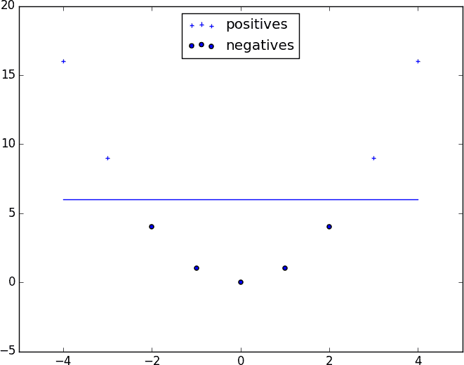

# 第十六章：logistic 回归

> 很多人说天才和疯狂之间只有一条细微的界限。我认为这不是细微的界限，实际上是一个巨大的鸿沟。
> 
> Bill Bailey

在第一章中，我们简要讨论了试图预测哪些 DataSciencester 用户购买高级帐户的问题。在这里，我们将重新讨论这个问题。

# 问题

我们有一个约 200 个用户的匿名数据集，包含每个用户的工资、作为数据科学家的经验年数，以及她是否为高级帐户支付费用（图 16-1）。像典型的分类变量一样，我们将依赖变量表示为 0（没有高级帐户）或 1（高级帐户）。

像往常一样，我们的数据是一列行 `[experience, salary, paid_account]`。让我们把它转换成我们需要的格式：

```py
xs = [[1.0] + row[:2] for row in data]  # [1, experience, salary]
ys = [row[2] for row in data]           # paid_account
```

显而易见的第一次尝试是使用线性回归找到最佳模型：

<math alttext="paid account equals beta 0 plus beta 1 experience plus beta 2 salary plus epsilon" display="block"><mrow><mtext>paid</mtext> <mtext>account</mtext> <mo>=</mo> <msub><mi>β</mi> <mn>0</mn></msub> <mo>+</mo> <msub><mi>β</mi> <mn>1</mn></msub> <mtext>experience</mtext> <mo>+</mo> <msub><mi>β</mi> <mn>2</mn></msub> <mtext>salary</mtext> <mo>+</mo> <mi>ε</mi></mrow></math>

###### 图 16-1 付费和非付费用户

当然，我们完全可以用这种方式对问题建模。结果显示在图 16-2 中：

```py
from matplotlib import pyplot as plt
from scratch.working_with_data import rescale
from scratch.multiple_regression import least_squares_fit, predict
from scratch.gradient_descent import gradient_step

learning_rate = 0.001
rescaled_xs = rescale(xs)
beta = least_squares_fit(rescaled_xs, ys, learning_rate, 1000, 1)
# [0.26, 0.43, -0.43]
predictions = [predict(x_i, beta) for x_i in rescaled_xs]

plt.scatter(predictions, ys)
plt.xlabel("predicted")
plt.ylabel("actual")
plt.show()
```


###### 图 16-2 使用线性回归预测高级账户

但是这种方法会导致一些即时问题：

+   我们希望我们预测的输出是 0 或 1，以表示类别成员资格。如果它们在 0 和 1 之间，我们可以将其解释为概率，例如 0.25 的输出可能表示成为付费会员的 25%的机会。但是线性模型的输出可以是非常大的正数甚至是负数，这样不清楚如何解释。实际上，这里很多我们的预测是负数。

+   线性回归模型假设误差与*x*的列无关。但是在这里，`experience`的回归系数为 0.43，表明经验越多，付费会员的可能性越大。这意味着我们的模型对于经验丰富的人输出非常大的值。但是我们知道实际值最多只能是 1，这意味着非常大的输出（因此非常大的`experience`值）对应于误差项非常大的负值。由于这种情况，我们对`beta`的估计是有偏的。

我们希望`dot(x_i, beta)`的大正值对应接近 1 的概率，大负值对应接近 0 的概率。我们可以通过对结果应用另一个函数来实现这一点。

# 逻辑函数

在逻辑回归中，我们使用*逻辑函数*，如图 16-3 所示：

```py
def logistic(x: float) -> float:
    return 1.0 / (1 + math.exp(-x))
```


###### 图 16-3. 逻辑函数

当其输入变得很大且为正时，它逐渐接近 1。当其输入变得很大且为负时，它逐渐接近 0。此外，它具有一个方便的性质，即其导数为：

```py
def logistic_prime(x: float) -> float:
    y = logistic(x)
    return y * (1 - y)
```

稍后我们将利用这一点。我们将使用这个来拟合一个模型：

<math alttext="y Subscript i Baseline equals f left-parenthesis x Subscript i Baseline beta right-parenthesis plus epsilon Subscript i" display="block"><mrow><msub><mi>y</mi> <mi>i</mi></msub> <mo>=</mo> <mi>f</mi> <mrow><mo>(</mo> <msub><mi>x</mi> <mi>i</mi></msub> <mi>β</mi> <mo>)</mo></mrow> <mo>+</mo> <msub><mi>ε</mi> <mi>i</mi></msub></mrow></math>

其中*f*是`logistic`函数。

回想一下，对于线性回归，我们通过最小化平方误差来拟合模型，这最终选择了最大化数据的似然的*β*。

在这里两者并不等价，因此我们将使用梯度下降直接最大化似然。这意味着我们需要计算似然函数及其梯度。

给定一些*β*，我们的模型表明每个<math><msub><mi>y</mi> <mi>i</mi></msub></math>应该等于 1 的概率为<math><mrow><mi>f</mi> <mo>(</mo> <msub><mi>x</mi> <mi>i</mi></msub> <mi>β</mi> <mo>)</mo></mrow></math>，等于 0 的概率为<math><mrow><mn>1</mn> <mo>-</mo> <mi>f</mi> <mo>(</mo> <msub><mi>x</mi> <mi>i</mi></msub> <mi>β</mi> <mo>)</mo></mrow></math>。

特别地，<math><msub><mi>y</mi> <mi>i</mi></msub></math>的概率密度函数可以写成：

<math alttext="p left-parenthesis y Subscript i Baseline vertical-bar x Subscript i Baseline comma beta right-parenthesis equals f left-parenthesis x Subscript i Baseline beta right-parenthesis Superscript y Super Subscript i Baseline left-parenthesis 1 minus f left-parenthesis x Subscript i Baseline beta right-parenthesis right-parenthesis Superscript 1 minus y Super Subscript i" display="block"><mrow><mi>p</mi> <mrow><mo>(</mo> <msub><mi>y</mi> <mi>i</mi></msub> <mo>|</mo> <msub><mi>x</mi> <mi>i</mi></msub> <mo>,</mo> <mi>β</mi> <mo>)</mo></mrow> <mo>=</mo> <mi>f</mi> <msup><mrow><mo>(</mo><msub><mi>x</mi> <mi>i</mi></msub> <mi>β</mi><mo>)</mo></mrow> <msub><mi>y</mi> <mi>i</mi></msub></msup> <msup><mrow><mo>(</mo><mn>1</mn><mo>-</mo><mi>f</mi><mrow><mo>(</mo><msub><mi>x</mi> <mi>i</mi></msub> <mi>β</mi><mo>)</mo></mrow><mo>)</mo></mrow> <mrow><mn>1</mn><mo>-</mo><msub><mi>y</mi> <mi>i</mi></msub></mrow></msup></mrow></math>

因为如果<math><msub><mi>y</mi> <mi>i</mi></msub></math>为 0，则此等于：

<math alttext="1 minus f left-parenthesis x Subscript i Baseline beta right-parenthesis" display="block"><mrow><mn>1</mn> <mo>-</mo> <mi>f</mi> <mo>(</mo> <msub><mi>x</mi> <mi>i</mi></msub> <mi>β</mi> <mo>)</mo></mrow></math>

如果<math><msub><mi>y</mi> <mi>i</mi></msub></math>为 1，则它等于：

<math alttext="f left-parenthesis x Subscript i Baseline beta right-parenthesis" display="block"><mrow><mi>f</mi> <mo>(</mo> <msub><mi>x</mi> <mi>i</mi></msub> <mi>β</mi> <mo>)</mo></mrow></math>

结果表明，最大化*对数似然*实际上更简单：

<math alttext="log upper L left-parenthesis beta vertical-bar x Subscript i Baseline comma y Subscript i Baseline right-parenthesis equals y Subscript i Baseline log f left-parenthesis x Subscript i Baseline beta right-parenthesis plus left-parenthesis 1 minus y Subscript i Baseline right-parenthesis log left-parenthesis 1 minus f left-parenthesis x Subscript i Baseline beta right-parenthesis right-parenthesis" display="block"><mrow><mo form="prefix">log</mo> <mi>L</mi> <mrow><mo>(</mo> <mi>β</mi> <mo>|</mo> <msub><mi>x</mi> <mi>i</mi></msub> <mo>,</mo> <msub><mi>y</mi> <mi>i</mi></msub> <mo>)</mo></mrow> <mo>=</mo> <msub><mi>y</mi> <mi>i</mi></msub> <mo form="prefix">log</mo> <mi>f</mi> <mrow><mo>(</mo> <msub><mi>x</mi> <mi>i</mi></msub> <mi>β</mi> <mo>)</mo></mrow> <mo>+</mo> <mrow><mo>(</mo> <mn>1</mn> <mo>-</mo> <msub><mi>y</mi> <mi>i</mi></msub> <mo>)</mo></mrow> <mo form="prefix">log</mo> <mrow><mo>(</mo> <mn>1</mn> <mo>-</mo> <mi>f</mi> <mrow><mo>(</mo> <msub><mi>x</mi> <mi>i</mi></msub> <mi>β</mi> <mo>)</mo></mrow> <mo>)</mo></mrow></mrow></math>

因为对数是一个严格递增的函数，任何使对数似然最大化的`beta`也将最大化似然，反之亦然。因为梯度下降是最小化的，所以我们实际上会处理*负*对数似然，因为最大化似然等同于最小化其负值：

```py
import math
from scratch.linear_algebra import Vector, dot

def _negative_log_likelihood(x: Vector, y: float, beta: Vector) -> float:
    """The negative log likelihood for one data point"""
    if y == 1:
        return -math.log(logistic(dot(x, beta)))
    else:
        return -math.log(1 - logistic(dot(x, beta)))
```

如果我们假设不同数据点彼此独立，则总体似然仅为各个似然的乘积。这意味着总体对数似然是各个对数似然的和：

```py
from typing import List

def negative_log_likelihood(xs: List[Vector],
                            ys: List[float],
                            beta: Vector) -> float:
    return sum(_negative_log_likelihood(x, y, beta)
               for x, y in zip(xs, ys))
```

一点微积分给了我们梯度：

```py
from scratch.linear_algebra import vector_sum

def _negative_log_partial_j(x: Vector, y: float, beta: Vector, j: int) -> float:
    """
 The jth partial derivative for one data point.
 Here i is the index of the data point.
 """
    return -(y - logistic(dot(x, beta))) * x[j]

def _negative_log_gradient(x: Vector, y: float, beta: Vector) -> Vector:
    """
 The gradient for one data point.
 """
    return [_negative_log_partial_j(x, y, beta, j)
            for j in range(len(beta))]

def negative_log_gradient(xs: List[Vector],
                          ys: List[float],
                          beta: Vector) -> Vector:
    return vector_sum([_negative_log_gradient(x, y, beta)
                       for x, y in zip(xs, ys)])
```

到这一点我们已经拥有所有需要的部分。

# 应用模型

我们将要将数据分成训练集和测试集：

```py
from scratch.machine_learning import train_test_split
import random
import tqdm

random.seed(0)
x_train, x_test, y_train, y_test = train_test_split(rescaled_xs, ys, 0.33)

learning_rate = 0.01

# pick a random starting point
beta = [random.random() for _ in range(3)]

with tqdm.trange(5000) as t:
    for epoch in t:
        gradient = negative_log_gradient(x_train, y_train, beta)
        beta = gradient_step(beta, gradient, -learning_rate)
        loss = negative_log_likelihood(x_train, y_train, beta)
        t.set_description(f"loss: {loss:.3f} beta: {beta}")
```

之后我们发现`beta`大约是：

```py
[-2.0, 4.7, -4.5]
```

这些是`rescale`d 数据的系数，但我们也可以将它们转换回原始数据：

```py
from scratch.working_with_data import scale

means, stdevs = scale(xs)
beta_unscaled = [(beta[0]
                  - beta[1] * means[1] / stdevs[1]
                  - beta[2] * means[2] / stdevs[2]),
                 beta[1] / stdevs[1],
                 beta[2] / stdevs[2]]
# [8.9, 1.6, -0.000288]
```

不幸的是，这些并不像线性回归系数那样容易解释。其他条件相同，一年额外的经验将在`logistic`的输入上增加 1.6。其他条件相同，额外的 10,000 美元薪水将在`logistic`的输入上减少 2.88。

然而，输出的影响也取决于其他输入。如果`dot(beta, x_i)`已经很大（对应概率接近 1），即使大幅增加它也不能太大影响概率。如果接近 0，稍微增加可能会大幅增加概率。

我们可以说的是，其他条件相同的情况下，经验丰富的人更有可能支付账户。而其他条件相同的情况下，收入较高的人支付账户的可能性较低。（这在我们绘制数据时也有些明显。）

# 拟合度

我们还没有使用我们留出的测试数据。让我们看看如果我们在概率超过 0.5 时预测*付费账户*会发生什么：

```py
true_positives = false_positives = true_negatives = false_negatives = 0

for x_i, y_i in zip(x_test, y_test):
    prediction = logistic(dot(beta, x_i))

    if y_i == 1 and prediction >= 0.5:  # TP: paid and we predict paid
        true_positives += 1
    elif y_i == 1:                      # FN: paid and we predict unpaid
        false_negatives += 1
    elif prediction >= 0.5:             # FP: unpaid and we predict paid
        false_positives += 1
    else:                               # TN: unpaid and we predict unpaid
        true_negatives += 1

precision = true_positives / (true_positives + false_positives)
recall = true_positives / (true_positives + false_negatives)
```

这给出了 75%的精度（“当我们预测*付费账户*时，我们有 75%的准确率”）和 80%的召回率（“当用户有付费账户时，我们 80%的时间预测为*付费账户*”），考虑到我们拥有的数据很少，这并不算糟糕。

我们还可以绘制预测与实际情况对比图（见图 16-4，#logistic_prediction_vs_actual），这也显示出模型表现良好：

```py
predictions = [logistic(dot(beta, x_i)) for x_i in x_test]
plt.scatter(predictions, y_test, marker='+')
plt.xlabel("predicted probability")
plt.ylabel("actual outcome")
plt.title("Logistic Regression Predicted vs. Actual")
plt.show()
```


###### 图 16-4。逻辑回归预测与实际

# 支持向量机

`dot(beta, x_i)`等于 0 的点集是我们类之间的边界。我们可以绘制这个图来精确了解我们的模型在做什么（见图 16-5，#logit_image_part_two）。


###### 图 16-5。付费和未付费用户与决策边界

这个边界是一个*超平面*，将参数空间分成两个半空间，对应*预测付费*和*预测未付费*。我们发现它是在找到最可能的逻辑模型的副作用中发现的。

分类的另一种方法是只需寻找在训练数据中“最佳”分离类别的超平面。这是支持向量机背后的思想，它找到最大化每个类别最近点到超平面距离的超平面（见图 16-6，#separating_hyperplane）。


###### 图 16-6。一个分离超平面

寻找这样的超平面是一个涉及我们过于高级的技术的优化问题。另一个问题是，一个分离超平面可能根本不存在。在我们的“谁付费？”数据集中，简单地没有一条线完全分离付费用户和未付费用户。

我们有时可以通过将数据转换为更高维空间来绕过这个问题。例如，考虑到简单的一维数据集，如图 16-7 所示。


###### 图 16-7。一个不可分离的一维数据集

从明显的来看，没有一个超平面可以将正例和负例分开。然而，当我们通过将点`x`映射到`(x, x**2)`的方式将这个数据集映射到二维空间时，看看会发生什么。突然间，可以找到一个可以分割数据的超平面（见图 16-8）。



###### 图 16-8\. 数据集在更高维度中变得可分离

这通常被称为*核技巧*，因为我们不是实际将点映射到更高维度的空间（如果有很多点并且映射很复杂的话，这可能会很昂贵），而是可以使用一个“核”函数来计算在更高维度空间中的点积，并使用这些来找到超平面。

使用支持向量机而不依赖于由具有适当专业知识的人编写的专业优化软件是困难的（也可能不是一个好主意），因此我们将不得不在这里结束我们的讨论。

# 进一步调查

+   scikit-learn 既有[逻辑回归](https://scikit-learn.org/stable/modules/linear_model.html#logistic-regression)模块，也有[支持向量机](https://scikit-learn.org/stable/modules/svm.html)模块。

+   [LIBSVM](https://www.csie.ntu.edu.tw/~cjlin/libsvm/)是 scikit-learn 背后使用的支持向量机实现。其网站上有大量关于支持向量机的有用文档。
