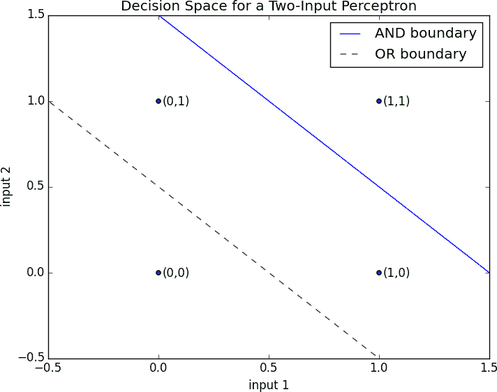
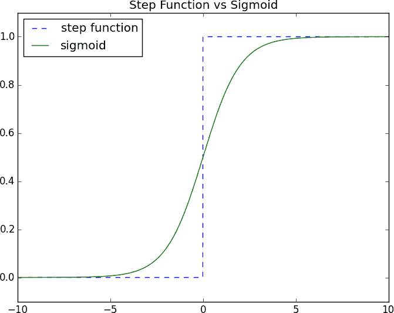
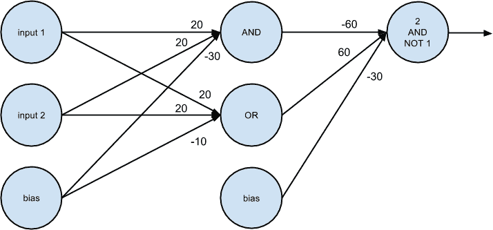

# 第十八章：神经网络

> 我喜欢胡说八道；它唤醒了大脑细胞。
> 
> 博士苏斯

*人工神经网络*（或简称神经网络）是一种受大脑运作方式启发的预测模型。将大脑视为一组互相连接的神经元。每个神经元查看输入到它的其他神经元的输出，进行计算，然后根据计算结果是否超过某个阈值来“激活”或不激活。

因此，人工神经网络由人工神经元组成，它们对其输入执行类似的计算。神经网络可以解决各种问题，如手写识别和面部检测，在深度学习中广泛使用，这是数据科学中最流行的子领域之一。然而，大多数神经网络是“黑箱”—检查它们的细节并不能让你理解它们如何解决问题。而且，大型神经网络可能难以训练。对于大多数初涉数据科学的问题，它们可能不是正确的选择。当你试图构建一个引发“奇点”的人工智能时，它们可能非常合适。

# 感知器

最简单的神经网络就是*感知器*，它模拟了一个具有*n*个二进制输入的单个神经元。它计算其输入的加权和，如果该加权和大于等于 0，则“激活”：

```py
from scratch.linear_algebra import Vector, dot

def step_function(x: float) -> float:
    return 1.0 if x >= 0 else 0.0

def perceptron_output(weights: Vector, bias: float, x: Vector) -> float:
    """Returns 1 if the perceptron 'fires', 0 if not"""
    calculation = dot(weights, x) + bias
    return step_function(calculation)
```

感知器只是区分了由点`x`组成的超平面分隔的半空间：

```py
dot(weights, x) + bias == 0
```

通过适当选择的权重，感知器可以解决许多简单的问题（图 18-1）。例如，我们可以创建一个*AND 门*（如果其输入都是 1 则返回 1，但如果其中一个输入是 0 则返回 0）：

```py
and_weights = [2., 2]
and_bias = -3.

assert perceptron_output(and_weights, and_bias, [1, 1]) == 1
assert perceptron_output(and_weights, and_bias, [0, 1]) == 0
assert perceptron_output(and_weights, and_bias, [1, 0]) == 0
assert perceptron_output(and_weights, and_bias, [0, 0]) == 0
```

如果两个输入都是 1，`计算`等于 2 + 2 – 3 = 1，并且输出为 1。如果只有一个输入是 1，`计算`等于 2 + 0 – 3 = –1，并且输出为 0。如果两个输入都是 0，`计算`等于–3，并且输出为 0。

使用类似的推理，我们可以用以下方式构建一个*OR 门*：

```py
or_weights = [2., 2]
or_bias = -1.

assert perceptron_output(or_weights, or_bias, [1, 1]) == 1
assert perceptron_output(or_weights, or_bias, [0, 1]) == 1
assert perceptron_output(or_weights, or_bias, [1, 0]) == 1
assert perceptron_output(or_weights, or_bias, [0, 0]) == 0
```



###### 图 18-1\. 二输入感知器的决策空间

我们也可以用以下方式构建一个*NOT 门*（其只有一个输入，并将 1 转换为 0，将 0 转换为 1）：

```py
not_weights = [-2.]
not_bias = 1.

assert perceptron_output(not_weights, not_bias, [0]) == 1
assert perceptron_output(not_weights, not_bias, [1]) == 0
```

然而，有一些问题简单地无法通过单个感知器解决。例如，无论你多么努力，你都不能使用一个感知器来构建一个*异或门*，即当其输入中只有一个是 1 时输出为 1，否则为 0。这时我们需要更复杂的神经网络。

当然，你不需要模拟神经元来构建逻辑门：

```py
and_gate = min
or_gate = max
xor_gate = lambda x, y: 0 if x == y else 1
```

像真实的神经元一样，人工神经元开始在连接起来时变得更加有趣。

# 前馈神经网络

大脑的拓扑结构极其复杂，因此常常用由离散的*层*组成的理想化*前馈*神经网络来近似它，每个层都与下一层相连接。通常包括一个输入层（接收并不改变输入并向前传递），一个或多个“隐藏层”（每个都由神经元组成，接收前一层的输出，执行某些计算，并将结果传递到下一层），和一个输出层（生成最终的输出）。

就像在感知机中一样，每个（非输入）神经元都有与其每个输入对应的权重和偏置。为了简化我们的表示，我们将偏置添加到权重向量的末尾，并给每个神经元一个*偏置输入*，其值始终为 1。

与感知机类似，对于每个神经元，我们将计算其输入和权重的乘积之和。但在这里，我们不会输出应用于该乘积的`step_function`，而是输出其平滑的近似。这里我们将使用`sigmoid`函数（图 18-2）：

```py
import math

def sigmoid(t: float) -> float:
    return 1 / (1 + math.exp(-t))
```



###### 图 18-2\. sigmoid 函数

为什么使用`sigmoid`而不是更简单的`step_function`？为了训练神经网络，我们需要使用微积分，而要使用微积分，我们需要*平滑*的函数。`step_function`甚至不连续，而`sigmoid`是它的一个很好的平滑近似。

###### 注意

你可能还记得`sigmoid`函数，它在第十六章中称为`logistic`。技术上，`sigmoid`指的是函数的形状，`logistic`指的是特定的函数，尽管人们经常将这些术语互换使用。

然后我们计算输出为：

```py
def neuron_output(weights: Vector, inputs: Vector) -> float:
    # weights includes the bias term, inputs includes a 1
    return sigmoid(dot(weights, inputs))
```

有了这个函数，我们可以简单地将神经元表示为一个权重向量，其长度比该神经元的输入数量多一个（因为有偏置权重）。然后我们可以将神经网络表示为（非输入）*层*的列表，其中每一层只是该层中神经元的列表。

那就是，我们将神经网络表示为向量的列表（层），其中每个向量（神经元）是向量（权重）的列表。

给定这样的表示法，使用神经网络非常简单：

```py
from typing import List

def feed_forward(neural_network: List[List[Vector]],
                 input_vector: Vector) -> List[Vector]:
    """
 Feeds the input vector through the neural network.
 Returns the outputs of all layers (not just the last one).
 """
    outputs: List[Vector] = []

    for layer in neural_network:
        input_with_bias = input_vector + [1]              # Add a constant.
        output = [neuron_output(neuron, input_with_bias)  # Compute the output
                  for neuron in layer]                    # for each neuron.
        outputs.append(output)                            # Add to results.

        # Then the input to the next layer is the output of this one
        input_vector = output

    return outputs
```

现在很容易构建我们无法用单个感知机构建的 XOR 门。我们只需扩展权重，使得`neuron_output`要么非常接近 0，要么非常接近 1：

```py
xor_network = [# hidden layer
               [[20., 20, -30],      # 'and' neuron
                [20., 20, -10]],     # 'or'  neuron
               # output layer
               [[-60., 60, -30]]]    # '2nd input but not 1st input' neuron

# feed_forward returns the outputs of all layers, so the [-1] gets the
# final output, and the [0] gets the value out of the resulting vector
assert 0.000 < feed_forward(xor_network, [0, 0])[-1][0] < 0.001
assert 0.999 < feed_forward(xor_network, [1, 0])[-1][0] < 1.000
assert 0.999 < feed_forward(xor_network, [0, 1])[-1][0] < 1.000
assert 0.000 < feed_forward(xor_network, [1, 1])[-1][0] < 0.001
```

对于给定的输入（一个二维向量），隐藏层生成一个二维向量，包含两个输入值的“与”和两个输入值的“或”。

输出层接收一个二维向量，并计算“第二个元素但不是第一个元素”。结果是一个执行“或但不是与”的网络，这正是 XOR（图 18-3）。



###### 图 18-3\. 一个用于 XOR 的神经网络

一个有启发性的思考方式是，隐藏层正在计算输入数据的*特征*（在本例中是“and”和“or”），输出层将这些特征组合起来以生成所需的输出。

# 反向传播

通常我们不会手工构建神经网络。部分原因是因为我们使用它们来解决更大的问题——例如图像识别问题可能涉及数百或数千个神经元。另一部分原因是通常我们无法“推理出”神经元应该是什么。

相反（通常情况下），我们使用数据来*训练*神经网络。典型的方法是一种称为*反向传播*的算法，它使用梯度下降或其变种之一。

假设我们有一个训练集，由输入向量和相应的目标输出向量组成。例如，在我们之前的`xor_network`示例中，输入向量`[1, 0]`对应于目标输出`[1]`。假设我们的网络有一些权重。然后，我们使用以下算法调整权重：

1.  对输入向量运行`feed_forward`以产生网络中所有神经元的输出。

1.  我们知道目标输出，所以我们可以计算一个*损失*，即平方误差的总和。

1.  计算这种损失作为输出神经元权重的函数的梯度。

1.  “传播”梯度和误差向后计算与隐藏神经元权重相关的梯度。

1.  进行梯度下降步骤。

通常我们会对整个训练集运行这个算法多次，直到网络收敛。

首先，让我们编写计算梯度的函数：

```py
def sqerror_gradients(network: List[List[Vector]],
                      input_vector: Vector,
                      target_vector: Vector) -> List[List[Vector]]:
    """
 Given a neural network, an input vector, and a target vector,
 make a prediction and compute the gradient of the squared error
 loss with respect to the neuron weights.
 """
    # forward pass
    hidden_outputs, outputs = feed_forward(network, input_vector)

    # gradients with respect to output neuron pre-activation outputs
    output_deltas = [output * (1 - output) * (output - target)
                     for output, target in zip(outputs, target_vector)]

    # gradients with respect to output neuron weights
    output_grads = [[output_deltas[i] * hidden_output
                     for hidden_output in hidden_outputs + [1]]
                    for i, output_neuron in enumerate(network[-1])]

    # gradients with respect to hidden neuron pre-activation outputs
    hidden_deltas = [hidden_output * (1 - hidden_output) *
                         dot(output_deltas, [n[i] for n in network[-1]])
                     for i, hidden_output in enumerate(hidden_outputs)]

    # gradients with respect to hidden neuron weights
    hidden_grads = [[hidden_deltas[i] * input for input in input_vector + [1]]
                    for i, hidden_neuron in enumerate(network[0])]

    return [hidden_grads, output_grads]
```

前述计算背后的数学并不是非常困难，但涉及一些繁琐的微积分和仔细的注意细节，所以我会留给你作为练习。

有了计算梯度的能力，我们现在可以训练神经网络。让我们试着通过手工设计的 XOR 网络来学习它。

我们将从生成训练数据开始，并使用随机权重初始化我们的神经网络：

```py
import random
random.seed(0)

# training data
xs = [[0., 0], [0., 1], [1., 0], [1., 1]]
ys = [[0.], [1.], [1.], [0.]]

# start with random weights
network = [ # hidden layer: 2 inputs -> 2 outputs
            [[random.random() for _ in range(2 + 1)],   # 1st hidden neuron
             [random.random() for _ in range(2 + 1)]],  # 2nd hidden neuron
            # output layer: 2 inputs -> 1 output
            [[random.random() for _ in range(2 + 1)]]   # 1st output neuron
          ]
```

通常情况下，我们可以使用梯度下降来训练它。与我们之前的例子不同之处在于，这里我们有几个参数向量，每个向量都有自己的梯度，这意味着我们需要为每个向量调用`gradient_step`。

```py
from scratch.gradient_descent import gradient_step
import tqdm

learning_rate = 1.0

for epoch in tqdm.trange(20000, desc="neural net for xor"):
    for x, y in zip(xs, ys):
        gradients = sqerror_gradients(network, x, y)

        # Take a gradient step for each neuron in each layer
        network = [[gradient_step(neuron, grad, -learning_rate)
                    for neuron, grad in zip(layer, layer_grad)]
                   for layer, layer_grad in zip(network, gradients)]

# check that it learned XOR
assert feed_forward(network, [0, 0])[-1][0] < 0.01
assert feed_forward(network, [0, 1])[-1][0] > 0.99
assert feed_forward(network, [1, 0])[-1][0] > 0.99
assert feed_forward(network, [1, 1])[-1][0] < 0.01
```

对我来说，得到的网络具有如下权重：

```py
[   # hidden layer
    [[7, 7, -3],     # computes OR
     [5, 5, -8]],    # computes AND
    # output layer
    [[11, -12, -5]]  # computes "first but not second"
]
```

从概念上讲，这与我们之前的定制网络非常相似。

# 示例：Fizz Buzz

工程副总裁希望通过让技术候选人解决“Fizz Buzz”，来面试技术候选人，这是一个广为人知的编程挑战：

```py
Print the numbers 1 to 100, except that if the number is divisible
by 3, print "fizz"; if the number is divisible by 5, print "buzz";
and if the number is divisible by 15, print "fizzbuzz".
```

他认为解决这个问题表明了极限编程技能。你认为这个问题如此简单，以至于一个神经网络可以解决它。

神经网络将向量作为输入，并产生向量作为输出。正如所述，编程问题是将整数转换为字符串。因此，第一个挑战是想出一种将其重新定义为向量问题的方法。

对于输出来说并不困难：基本上有四类输出，所以我们可以将输出编码为一个包含四个 0 和 1 的向量：

```py
def fizz_buzz_encode(x: int) -> Vector:
    if x % 15 == 0:
        return [0, 0, 0, 1]
    elif x % 5 == 0:
        return [0, 0, 1, 0]
    elif x % 3 == 0:
        return [0, 1, 0, 0]
    else:
        return [1, 0, 0, 0]

assert fizz_buzz_encode(2) == [1, 0, 0, 0]
assert fizz_buzz_encode(6) == [0, 1, 0, 0]
assert fizz_buzz_encode(10) == [0, 0, 1, 0]
assert fizz_buzz_encode(30) == [0, 0, 0, 1]
```

我们将用这个来生成我们的目标向量。输入向量则不那么明显。你不应该只使用一个包含输入数字的一维向量，因为有几个原因。一个单一的输入捕捉到了“强度”，但是 2 是 1 的两倍，4 又是两倍，对这个问题并不感兴趣。此外，只有一个输入，隐藏层将无法计算非常有趣的特征，这意味着它可能无法解决问题。

原来，一个相对有效的方法是将每个数字转换为其*二进制*表示，由 1 和 0 组成。（别担心，这不明显——至少对我来说不是。）

```py
def binary_encode(x: int) -> Vector:
    binary: List[float] = []

    for i in range(10):
        binary.append(x % 2)
        x = x // 2

    return binary

#                             1  2  4  8 16 32 64 128 256 512
assert binary_encode(0)   == [0, 0, 0, 0, 0, 0, 0, 0,  0,  0]
assert binary_encode(1)   == [1, 0, 0, 0, 0, 0, 0, 0,  0,  0]
assert binary_encode(10)  == [0, 1, 0, 1, 0, 0, 0, 0,  0,  0]
assert binary_encode(101) == [1, 0, 1, 0, 0, 1, 1, 0,  0,  0]
assert binary_encode(999) == [1, 1, 1, 0, 0, 1, 1, 1,  1,  1]
```

因为目标是构建 1 到 100 的输出，所以在这些数字上进行训练是作弊的。因此，我们将在数字 101 到 1,023 上进行训练（这是我们可以用 10 位二进制表示的最大数字）：

```py
xs = [binary_encode(n) for n in range(101, 1024)]
ys = [fizz_buzz_encode(n) for n in range(101, 1024)]
```

接下来，让我们创建一个具有随机初始权重的神经网络。它将有 10 个输入神经元（因为我们将我们的输入表示为 10 维向量）和 4 个输出神经元（因为我们将我们的目标表示为 4 维向量）。我们将给它 25 个隐藏单元，但我们将使用一个变量，所以这样很容易改变：

```py
NUM_HIDDEN = 25

network = [
    # hidden layer: 10 inputs -> NUM_HIDDEN outputs
    [[random.random() for _ in range(10 + 1)] for _ in range(NUM_HIDDEN)],

    # output_layer: NUM_HIDDEN inputs -> 4 outputs
    [[random.random() for _ in range(NUM_HIDDEN + 1)] for _ in range(4)]
]
```

那就是了。现在我们准备好训练了。因为这是一个更复杂的问题（而且有很多事情可能会出错），我们希望密切监控训练过程。特别是，对于每个时期，我们将跟踪平方误差的总和并将其打印出来。我们希望确保它们会减少：

```py
from scratch.linear_algebra import squared_distance

learning_rate = 1.0

with tqdm.trange(500) as t:
    for epoch in t:
        epoch_loss = 0.0

        for x, y in zip(xs, ys):
            predicted = feed_forward(network, x)[-1]
            epoch_loss += squared_distance(predicted, y)
            gradients = sqerror_gradients(network, x, y)

            # Take a gradient step for each neuron in each layer
            network = [[gradient_step(neuron, grad, -learning_rate)
                        for neuron, grad in zip(layer, layer_grad)]
                    for layer, layer_grad in zip(network, gradients)]

        t.set_description(f"fizz buzz (loss: {epoch_loss:.2f})")
```

这将需要一段时间来训练，但最终损失应该开始稳定下来。

最后，我们准备解决我们最初的问题。我们还有一个问题。我们的网络将生成一个四维向量的数字，但我们想要一个单一的预测。我们将通过取`argmax`来做到这一点，这是最大值的索引：

```py
def argmax(xs: list) -> int:
    """Returns the index of the largest value"""
    return max(range(len(xs)), key=lambda i: xs[i])

assert argmax([0, -1]) == 0               # items[0] is largest
assert argmax([-1, 0]) == 1               # items[1] is largest
assert argmax([-1, 10, 5, 20, -3]) == 3   # items[3] is largest
```

现在我们终于可以解决“FizzBuzz”了：

```py
num_correct = 0

for n in range(1, 101):
    x = binary_encode(n)
    predicted = argmax(feed_forward(network, x)[-1])
    actual = argmax(fizz_buzz_encode(n))
    labels = [str(n), "fizz", "buzz", "fizzbuzz"]
    print(n, labels[predicted], labels[actual])

    if predicted == actual:
        num_correct += 1

print(num_correct, "/", 100)
```

对我来说，训练后的网络获得了 96/100 的正确率，远高于工程副总裁的招聘门槛。面对这些证据，他屈服了并将面试挑战改为“反转二叉树”。

# 进一步探索

+   继续阅读：第十九章将更详细地探讨这些主题。

+   我关于[“Tensorflow 中的 Fizz Buzz”](http://joelgrus.com/2016/05/23/fizz-buzz-in-tensorflow/)的博客帖子相当不错。
