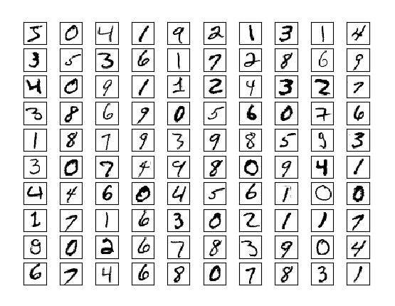

# 第十九章：深度学习

> 略知一二是危险的；要么深入探索，要么不要触碰那泊里亚之泉。
> 
> 亚历山大·蒲柏

*深度学习*最初是指“深度”神经网络的应用（即具有多个隐藏层的网络），尽管实际上这个术语现在包含了各种各样的神经网络架构（包括我们在第十八章中开发的“简单”神经网络）。

在本章中，我们将在之前的工作基础上继续，并查看更广泛的神经网络。为此，我们将介绍一些允许我们以更一般方式思考神经网络的抽象概念。

# 张量

之前，我们区分了向量（一维数组）和矩阵（二维数组）。当我们开始处理更复杂的神经网络时，我们还需要使用更高维度的数组。

在许多神经网络库中，*n*维数组被称为*张量*，这也是我们将它们称为的方式。（有一些学术严谨的数学原因不将*n*维数组称为张量；如果你是这样的学究，我们注意到你的反对。）

如果我要写一本关于深度学习的整本书，我会实现一个功能齐全的`Tensor`类，重载 Python 的算术运算符，并能处理各种其他操作。这样的实现将需要一个完整的章节。在这里，我们将简单处理，并说一个`Tensor`只是一个`list`。在某种意义上是正确的——我们所有的向量、矩阵和更高维度的模拟 *都* 是列表。但在另一方面则不正确——大多数 Python 的`list`不是我们所说的*n*维数组。

###### 注意

理想情况下，你想做这样的事情：

```py
# A Tensor is either a float, or a List of Tensors
Tensor = Union[float, List[Tensor]]
```

然而，Python 不允许你定义这样的递归类型。即使它允许，那个定义仍然是错误的，因为它允许像这样的坏“张量”：

```py
[[1.0, 2.0],
 [3.0]]
```

其行具有不同的大小，这使得它不是一个*n*维数组。

所以，正如我所说的，我们将简单地作弊：

```py
Tensor = list
```

而且，我们将编写一个辅助函数来找到张量的*形状*：

```py
from typing import List

def shape(tensor: Tensor) -> List[int]:
    sizes: List[int] = []
    while isinstance(tensor, list):
        sizes.append(len(tensor))
        tensor = tensor[0]
    return sizes

assert shape([1, 2, 3]) == [3]
assert shape([[1, 2], [3, 4], [5, 6]]) == [3, 2]
```

因为张量可以具有任意数量的维度，我们通常需要递归地处理它们。在一维情况下我们会做一件事，在更高维情况下我们会递归处理：

```py
def is_1d(tensor: Tensor) -> bool:
    """
 If tensor[0] is a list, it's a higher-order tensor.
 Otherwise, tensor is 1-dimensional (that is, a vector).
 """
    return not isinstance(tensor[0], list)

assert is_1d([1, 2, 3])
assert not is_1d([[1, 2], [3, 4]])
```

我们可以利用这一点编写一个递归的`tensor_sum`函数：

```py
def tensor_sum(tensor: Tensor) -> float:
    """Sums up all the values in the tensor"""
    if is_1d(tensor):
        return sum(tensor)  # just a list of floats, use Python sum
    else:
        return sum(tensor_sum(tensor_i)      # Call tensor_sum on each row
                   for tensor_i in tensor)   # and sum up those results.

assert tensor_sum([1, 2, 3]) == 6
assert tensor_sum([[1, 2], [3, 4]]) == 10
```

如果你不习惯递归思维，你应该思考直到理解为止，因为我们将在本章中始终使用相同的逻辑。但是，我们将创建几个辅助函数，这样我们就不必在每个地方重写这个逻辑。首先，将一个函数逐元素地应用于单个张量：

```py
from typing import Callable

def tensor_apply(f: Callable[[float], float], tensor: Tensor) -> Tensor:
    """Applies f elementwise"""
    if is_1d(tensor):
        return [f(x) for x in tensor]
    else:
        return [tensor_apply(f, tensor_i) for tensor_i in tensor]

assert tensor_apply(lambda x: x + 1, [1, 2, 3]) == [2, 3, 4]
assert tensor_apply(lambda x: 2 * x, [[1, 2], [3, 4]]) == [[2, 4], [6, 8]]
```

我们可以用它来编写一个函数，创建一个与给定张量形状相同的零张量：

```py
def zeros_like(tensor: Tensor) -> Tensor:
    return tensor_apply(lambda _: 0.0, tensor)

assert zeros_like([1, 2, 3]) == [0, 0, 0]
assert zeros_like([[1, 2], [3, 4]]) == [[0, 0], [0, 0]]
```

我们还需要将函数应用于两个张量对应的元素（它们最好具有完全相同的形状，尽管我们不会检查这一点）：

```py
def tensor_combine(f: Callable[[float, float], float],
                   t1: Tensor,
                   t2: Tensor) -> Tensor:
    """Applies f to corresponding elements of t1 and t2"""
    if is_1d(t1):
        return [f(x, y) for x, y in zip(t1, t2)]
    else:
        return [tensor_combine(f, t1_i, t2_i)
                for t1_i, t2_i in zip(t1, t2)]

import operator
assert tensor_combine(operator.add, [1, 2, 3], [4, 5, 6]) == [5, 7, 9]
assert tensor_combine(operator.mul, [1, 2, 3], [4, 5, 6]) == [4, 10, 18]
```

# 层的抽象

在上一章中，我们构建了一个简单的神经网络，允许我们堆叠两层神经元，每层计算 `sigmoid(dot(weights, inputs))`。

虽然这可能是对实际神经元功能的理想化表示，但实际上，我们希望允许更多种类的操作。也许我们希望神经元记住它们以前的输入。也许我们想使用不同的激活函数而不是 `sigmoid`。而且通常情况下，我们希望使用超过两层的网络。（我们的 `feed_forward` 函数实际上可以处理任意数量的层，但我们的梯度计算不能。）

在本章中，我们将构建用于实现各种神经网络的机制。我们的基本抽象将是 `Layer`，它知道如何将某个函数应用到其输入上，并知道如何反向传播梯度。

我们在第十八章构建的神经网络可以理解为一个“线性”层，后跟一个“sigmoid”层，然后是另一个线性层和另一个 sigmoid 层。在这些术语中没有区分它们，但这样做将允许我们尝试更通用的结构：

```py
from typing import Iterable, Tuple

class Layer:
    """
 Our neural networks will be composed of Layers, each of which
 knows how to do some computation on its inputs in the "forward"
 direction and propagate gradients in the "backward" direction.
 """
    def forward(self, input):
        """
 Note the lack of types. We're not going to be prescriptive
 about what kinds of inputs layers can take and what kinds
 of outputs they can return.
 """
        raise NotImplementedError

    def backward(self, gradient):
        """
 Similarly, we're not going to be prescriptive about what the
 gradient looks like. It's up to you the user to make sure
 that you're doing things sensibly.
 """
        raise NotImplementedError

    def params(self) -> Iterable[Tensor]:
        """
 Returns the parameters of this layer. The default implementation
 returns nothing, so that if you have a layer with no parameters
 you don't have to implement this.
 """
        return ()

    def grads(self) -> Iterable[Tensor]:
        """
 Returns the gradients, in the same order as params().
 """
        return ()
```

`forward` 和 `backward` 方法需要在我们的具体子类中实现。一旦我们建立了神经网络，我们将希望使用梯度下降来训练它，这意味着我们希望使用其梯度更新网络中的每个参数。因此，我们要求每一层能够告诉我们它的参数和梯度。

一些层（例如，将 `sigmoid` 应用于每个输入的层）没有需要更新的参数，因此我们提供了一个处理这种情况的默认实现。

让我们看看那层：

```py
from scratch.neural_networks import sigmoid

class Sigmoid(Layer):
    def forward(self, input: Tensor) -> Tensor:
        """
 Apply sigmoid to each element of the input tensor,
 and save the results to use in backpropagation.
 """
        self.sigmoids = tensor_apply(sigmoid, input)
        return self.sigmoids

    def backward(self, gradient: Tensor) -> Tensor:
        return tensor_combine(lambda sig, grad: sig * (1 - sig) * grad,
                              self.sigmoids,
                              gradient)
```

这里有几件事情需要注意。一是在前向传播期间，我们保存了计算出的 sigmoid 值，以便稍后在反向传播中使用。我们的层通常需要执行这种操作。

其次，您可能想知道 `sig * (1 - sig) * grad` 是从哪里来的。这只是微积分中的链式法则，对应于我们先前神经网络中的 `output * (1 - output) * (output - target)` 项。

最后，您可以看到我们如何使用 `tensor_apply` 和 `tensor_combine` 函数。我们的大多数层将类似地使用这些函数。

# 线性层

我们还需要从第十八章复制神经网络所需的“线性”层，该层代表神经元中的 `dot(weights, inputs)` 部分。

这个层将有参数，我们希望用随机值初始化它们。

结果表明，初始参数值可能极大地影响网络的训练速度（有时甚至影响网络是否能训练）。如果权重过大，它们可能会在激活函数梯度接近零的范围内产生大的输出。具有零梯度部分的网络必然无法通过梯度下降学习任何内容。

因此，我们将实现三种不同的方案来随机生成我们的权重张量。第一种是从[0, 1]上的随机均匀分布中选择每个值，即使用`random.random()`。第二种（默认）是从标准正态分布中随机选择每个值。第三种是使用*Xavier 初始化*，其中每个权重都从均值为 0、方差为 2 / (`num_inputs` + `num_outputs`)的正态分布中随机抽取。事实证明，这通常对神经网络权重效果很好。我们将使用`random_uniform`函数和`random_normal`函数来实现这些：

```py
import random

from scratch.probability import inverse_normal_cdf

def random_uniform(*dims: int) -> Tensor:
    if len(dims) == 1:
        return [random.random() for _ in range(dims[0])]
    else:
        return [random_uniform(*dims[1:]) for _ in range(dims[0])]

def random_normal(*dims: int,
                  mean: float = 0.0,
                  variance: float = 1.0) -> Tensor:
    if len(dims) == 1:
        return [mean + variance * inverse_normal_cdf(random.random())
                for _ in range(dims[0])]
    else:
        return [random_normal(*dims[1:], mean=mean, variance=variance)
                for _ in range(dims[0])]

assert shape(random_uniform(2, 3, 4)) == [2, 3, 4]
assert shape(random_normal(5, 6, mean=10)) == [5, 6]
```

然后将它们全部包装在一个`random_tensor`函数中：

```py
def random_tensor(*dims: int, init: str = 'normal') -> Tensor:
    if init == 'normal':
        return random_normal(*dims)
    elif init == 'uniform':
        return random_uniform(*dims)
    elif init == 'xavier':
        variance = len(dims) / sum(dims)
        return random_normal(*dims, variance=variance)
    else:
        raise ValueError(f"unknown init: {init}")
```

现在我们可以定义我们的线性层了。我们需要用输入的维度来初始化它（这告诉我们每个神经元需要多少个权重），输出的维度（这告诉我们应该有多少个神经元），以及我们想要的初始化方案：

```py
from scratch.linear_algebra import dot

class Linear(Layer):
    def __init__(self,
                 input_dim: int,
                 output_dim: int,
                 init: str = 'xavier') -> None:
        """
 A layer of output_dim neurons, each with input_dim weights
 (and a bias).
 """
        self.input_dim = input_dim
        self.output_dim = output_dim

        # self.w[o] is the weights for the oth neuron
        self.w = random_tensor(output_dim, input_dim, init=init)

        # self.b[o] is the bias term for the oth neuron
        self.b = random_tensor(output_dim, init=init)
```

###### 注意

如果你想知道初始化方案有多重要，这一章中一些网络如果使用与我使用的不同初始化方法，我根本无法训练它们。

`forward`方法很容易实现。我们将得到每个神经元的一个输出，将其放入一个向量中。每个神经元的输出只是其权重与输入的`dot`积，加上偏置：

```py
    def forward(self, input: Tensor) -> Tensor:
        # Save the input to use in the backward pass.
        self.input = input

        # Return the vector of neuron outputs.
        return [dot(input, self.w[o]) + self.b[o]
                for o in range(self.output_dim)]
```

`backward`方法更复杂一些，但如果你懂微积分，它并不难：

```py
    def backward(self, gradient: Tensor) -> Tensor:
        # Each b[o] gets added to output[o], which means
        # the gradient of b is the same as the output gradient.
        self.b_grad = gradient

        # Each w[o][i] multiplies input[i] and gets added to output[o].
        # So its gradient is input[i] * gradient[o].
        self.w_grad = [[self.input[i] * gradient[o]
                        for i in range(self.input_dim)]
                       for o in range(self.output_dim)]

        # Each input[i] multiplies every w[o][i] and gets added to every
        # output[o]. So its gradient is the sum of w[o][i] * gradient[o]
        # across all the outputs.
        return [sum(self.w[o][i] * gradient[o] for o in range(self.output_dim))
                for i in range(self.input_dim)]
```

###### 注意

在一个“真正”的张量库中，这些（以及许多其他）操作将被表示为矩阵或张量乘法，这些库被设计成能够非常快速地执行。我们的库*非常*慢。

最后，我们确实需要实现`params`和`grads`。我们有两个参数和两个相应的梯度：

```py
    def params(self) -> Iterable[Tensor]:
        return [self.w, self.b]

    def grads(self) -> Iterable[Tensor]:
        return [self.w_grad, self.b_grad]
```

# 神经网络作为层序列

我们希望将神经网络视为层序列，因此让我们想出一种将多个层组合成一个的方法。得到的神经网络本身就是一个层，它以明显的方式实现了`Layer`方法：

```py
from typing import List

class Sequential(Layer):
    """
 A layer consisting of a sequence of other layers.
 It's up to you to make sure that the output of each layer
 makes sense as the input to the next layer.
 """
    def __init__(self, layers: List[Layer]) -> None:
        self.layers = layers

    def forward(self, input):
        """Just forward the input through the layers in order."""
        for layer in self.layers:
            input = layer.forward(input)
        return input

    def backward(self, gradient):
        """Just backpropagate the gradient through the layers in reverse."""
        for layer in reversed(self.layers):
            gradient = layer.backward(gradient)
        return gradient

    def params(self) -> Iterable[Tensor]:
        """Just return the params from each layer."""
        return (param for layer in self.layers for param in layer.params())

    def grads(self) -> Iterable[Tensor]:
        """Just return the grads from each layer."""
        return (grad for layer in self.layers for grad in layer.grads())
```

因此，我们可以将用于 XOR 的神经网络表示为：

```py
xor_net = Sequential([
    Linear(input_dim=2, output_dim=2),
    Sigmoid(),
    Linear(input_dim=2, output_dim=1),
    Sigmoid()
])
```

但我们仍然需要一些更多的机制来训练它。

# 损失和优化

之前，我们为我们的模型编写了单独的损失函数和梯度函数。在这里，我们将想要尝试不同的损失函数，所以（像往常一样）我们将引入一个新的`Loss`抽象，它封装了损失计算和梯度计算：

```py
class Loss:
    def loss(self, predicted: Tensor, actual: Tensor) -> float:
        """How good are our predictions? (Larger numbers are worse.)"""
        raise NotImplementedError

    def gradient(self, predicted: Tensor, actual: Tensor) -> Tensor:
        """How does the loss change as the predictions change?"""
        raise NotImplementedError
```

我们已经多次使用过损失函数，即平方误差的和，所以实现它应该很容易。唯一的技巧是我们需要使用`tensor_combine`：

```py
class SSE(Loss):
    """Loss function that computes the sum of the squared errors."""
    def loss(self, predicted: Tensor, actual: Tensor) -> float:
        # Compute the tensor of squared differences
        squared_errors = tensor_combine(
            lambda predicted, actual: (predicted - actual) ** 2,
            predicted,
            actual)

        # And just add them up
        return tensor_sum(squared_errors)

    def gradient(self, predicted: Tensor, actual: Tensor) -> Tensor:
        return tensor_combine(
            lambda predicted, actual: 2 * (predicted - actual),
            predicted,
            actual)
```

（稍后我们将看一个不同的损失函数。）

最后需要弄清楚的是梯度下降。在整本书中，我们通过一个训练循环手动进行所有的梯度下降，类似于以下操作：

```py
theta = gradient_step(theta, grad, -learning_rate)
```

这对我们来说不太适用，原因有几个。首先是我们的神经网络将有很多参数，我们需要更新所有这些参数。其次是我们希望能够使用更聪明的梯度下降的变体，而不想每次都重新编写它们。

因此，我们将引入一个（你猜对了）`Optimizer` 抽象，梯度下降将是一个具体的实例：

```py
class Optimizer:
    """
 An optimizer updates the weights of a layer (in place) using information
 known by either the layer or the optimizer (or by both).
 """
    def step(self, layer: Layer) -> None:
        raise NotImplementedError
```

之后，使用 `tensor_combine` 再次实现梯度下降就很容易了：

```py
class GradientDescent(Optimizer):
    def __init__(self, learning_rate: float = 0.1) -> None:
        self.lr = learning_rate

    def step(self, layer: Layer) -> None:
        for param, grad in zip(layer.params(), layer.grads()):
            # Update param using a gradient step
            param[:] = tensor_combine(
                lambda param, grad: param - grad * self.lr,
                param,
                grad)
```

可能令人惊讶的唯一一件事是“切片赋值”，这反映了重新分配列表不会改变其原始值的事实。也就是说，如果你只是做了 `param = tensor_combine(. . .)`，你会重新定义局部变量 `param`，但你不会影响存储在层中的原始参数张量。然而，如果你分配给切片 `[:]`，它实际上会改变列表内的值。

这里有一个简单的示例来演示：

```py
tensor = [[1, 2], [3, 4]]

for row in tensor:
    row = [0, 0]
assert tensor == [[1, 2], [3, 4]], "assignment doesn't update a list"

for row in tensor:
    row[:] = [0, 0]
assert tensor == [[0, 0], [0, 0]], "but slice assignment does"
```

如果你在 Python 方面有些经验不足，这种行为可能会让你感到惊讶，所以要沉思一下，并尝试自己的例子，直到它变得清晰为止。

为了展示这种抽象的价值，让我们实现另一个使用 *动量* 的优化器。其思想是我们不希望对每一个新的梯度过于反应，因此我们保持已看到的梯度的运行平均，每次新的梯度更新它，并朝平均梯度的方向迈出一步：

```py
class Momentum(Optimizer):
    def __init__(self,
                 learning_rate: float,
                 momentum: float = 0.9) -> None:
        self.lr = learning_rate
        self.mo = momentum
        self.updates: List[Tensor] = []  # running average

    def step(self, layer: Layer) -> None:
        # If we have no previous updates, start with all zeros
        if not self.updates:
            self.updates = [zeros_like(grad) for grad in layer.grads()]

        for update, param, grad in zip(self.updates,
                                       layer.params(),
                                       layer.grads()):
            # Apply momentum
            update[:] = tensor_combine(
                lambda u, g: self.mo * u + (1 - self.mo) * g,
                update,
                grad)

            # Then take a gradient step
            param[:] = tensor_combine(
                lambda p, u: p - self.lr * u,
                param,
                update)
```

因为我们使用了 `Optimizer` 抽象，我们可以轻松地在不同的优化器之间切换。

# 示例：重新思考 XOR

让我们看看使用我们的新框架来训练一个能计算 XOR 的网络有多容易。我们首先重新创建训练数据：

```py
# training data
xs = [[0., 0], [0., 1], [1., 0], [1., 1]]
ys = [[0.], [1.], [1.], [0.]]
```

然后我们定义网络，尽管现在我们可以省略最后的 sigmoid 层：

```py
random.seed(0)

net = Sequential([
    Linear(input_dim=2, output_dim=2),
    Sigmoid(),
    Linear(input_dim=2, output_dim=1)
])
```

现在我们可以编写一个简单的训练循环，除了现在我们可以使用 `Optimizer` 和 `Loss` 的抽象。这使得我们可以轻松尝试不同的优化方法：

```py
import tqdm

optimizer = GradientDescent(learning_rate=0.1)
loss = SSE()

with tqdm.trange(3000) as t:
    for epoch in t:
        epoch_loss = 0.0

        for x, y in zip(xs, ys):
            predicted = net.forward(x)
            epoch_loss += loss.loss(predicted, y)
            gradient = loss.gradient(predicted, y)
            net.backward(gradient)

            optimizer.step(net)

        t.set_description(f"xor loss {epoch_loss:.3f}")
```

这应该会快速训练，并且你应该会看到损失下降。现在我们可以检查权重了：

```py
for param in net.params():
    print(param)
```

对于我的网络，我发现大致上：

```py
hidden1 = -2.6 * x1 + -2.7 * x2 + 0.2  # NOR
hidden2 =  2.1 * x1 +  2.1 * x2 - 3.4  # AND
output =  -3.1 * h1 + -2.6 * h2 + 1.8  # NOR
```

因此，如果 `hidden1` 激活，那么没有一个输入是 1。如果 `hidden2` 激活，那么两个输入都是 1。如果 `output` 激活，那么既不是 `hidden` 输出是 1，也不是两个输入都是 1。确实，这正是 XOR 的逻辑。

注意，这个网络学习了不同于我们在 第十八章 中训练的网络的特征，但它仍然能够执行相同的操作。

# 其他激活函数

`sigmoid` 函数因为几个原因已经不再流行。其中一个原因是 `sigmoid(0)` 等于 1/2，这意味着输入总和为 0 的神经元具有正的输出。另一个原因是对于非常大和非常小的输入，它的梯度非常接近 0，这意味着它的梯度可能会“饱和”，它的权重可能会被困住。

一个流行的替代方案是`tanh`（“双曲正切”），这是一个不同的 S 型函数，范围从–1 到 1，并且如果其输入为 0，则输出为 0。`tanh(x)`的导数就是`1 - tanh(x) ** 2`，这样写起来很容易：

```py
import math

def tanh(x: float) -> float:
    # If x is very large or very small, tanh is (essentially) 1 or -1.
    # We check for this because, e.g., math.exp(1000) raises an error.
    if x < -100:  return -1
    elif x > 100: return 1

    em2x = math.exp(-2 * x)
    return (1 - em2x) / (1 + em2x)

class Tanh(Layer):
    def forward(self, input: Tensor) -> Tensor:
        # Save tanh output to use in backward pass.
        self.tanh = tensor_apply(tanh, input)
        return self.tanh

    def backward(self, gradient: Tensor) -> Tensor:
        return tensor_combine(
            lambda tanh, grad: (1 - tanh ** 2) * grad,
            self.tanh,
            gradient)
```

在更大的网络中，另一个流行的替代方案是`Relu`，对于负输入为 0，对于正输入为恒等：

```py
class Relu(Layer):
    def forward(self, input: Tensor) -> Tensor:
        self.input = input
        return tensor_apply(lambda x: max(x, 0), input)

    def backward(self, gradient: Tensor) -> Tensor:
        return tensor_combine(lambda x, grad: grad if x > 0 else 0,
                              self.input,
                              gradient)
```

还有许多其他的函数。我鼓励你在你的网络中尝试它们。

# 示例：FizzBuzz 再探讨

现在，我们可以使用我们的“深度学习”框架来重新生成我们在“示例：Fizz Buzz”中的解决方案。让我们设置数据：

```py
from scratch.neural_networks import binary_encode, fizz_buzz_encode, argmax

xs = [binary_encode(n) for n in range(101, 1024)]
ys = [fizz_buzz_encode(n) for n in range(101, 1024)]
```

并创建网络：

```py
NUM_HIDDEN = 25

random.seed(0)

net = Sequential([
    Linear(input_dim=10, output_dim=NUM_HIDDEN, init='uniform'),
    Tanh(),
    Linear(input_dim=NUM_HIDDEN, output_dim=4, init='uniform'),
    Sigmoid()
])
```

当我们训练时，让我们也跟踪一下训练集上的准确率：

```py
def fizzbuzz_accuracy(low: int, hi: int, net: Layer) -> float:
    num_correct = 0
    for n in range(low, hi):
        x = binary_encode(n)
        predicted = argmax(net.forward(x))
        actual = argmax(fizz_buzz_encode(n))
        if predicted == actual:
            num_correct += 1

    return num_correct / (hi - low)
```

```py
optimizer = Momentum(learning_rate=0.1, momentum=0.9)
loss = SSE()

with tqdm.trange(1000) as t:
    for epoch in t:
        epoch_loss = 0.0

        for x, y in zip(xs, ys):
            predicted = net.forward(x)
            epoch_loss += loss.loss(predicted, y)
            gradient = loss.gradient(predicted, y)
            net.backward(gradient)

            optimizer.step(net)

        accuracy = fizzbuzz_accuracy(101, 1024, net)
        t.set_description(f"fb loss: {epoch_loss:.2f} acc: {accuracy:.2f}")

# Now check results on the test set
print("test results", fizzbuzz_accuracy(1, 101, net))
```

经过 1000 次训练迭代后，模型在测试集上达到了 90%的准确率；如果你继续训练，它应该能表现得更好。（我认为只用 25 个隐藏单元不可能训练到 100%的准确率，但如果增加到 50 个隐藏单元，这是可能的。）

# Softmax 函数和交叉熵

我们在前面章节使用的神经网络以`Sigmoid`层结束，这意味着其输出是介于 0 和 1 之间的向量。特别是，它可以输出一个完全是 0 的向量，或者一个完全是 1 的向量。然而，在分类问题中，我们希望输出一个 1 代表正确类别，0 代表所有不正确的类别。通常我们的预测不会那么完美，但我们至少希望预测一个实际的类别概率分布。

例如，如果我们有两个类别，而我们的模型输出`[0, 0]`，很难理解这意味着什么。它不认为输出属于任何类别？

但是如果我们的模型输出`[0.4, 0.6]`，我们可以将其解释为预测我们的输入属于第一类的概率为 0.4，属于第二类的概率为 0.6。

为了实现这一点，我们通常放弃最后的`Sigmoid`层，而是使用`softmax`函数，将实数向量转换为概率向量。我们对向量中的每个数计算`exp(x)`，得到一组正数。然后，我们将这些正数除以它们的和，得到一组加起来为 1 的正数——即概率向量。

如果我们试图计算，比如`exp(1000)`，我们会得到一个 Python 错误，所以在计算`exp`之前，我们要减去最大值。这样做结果是相同的概率；在 Python 中这样计算更安全：

```py
def softmax(tensor: Tensor) -> Tensor:
    """Softmax along the last dimension"""
    if is_1d(tensor):
        # Subtract largest value for numerical stability.
        largest = max(tensor)
        exps = [math.exp(x - largest) for x in tensor]

        sum_of_exps = sum(exps)                 # This is the total "weight."
        return [exp_i / sum_of_exps             # Probability is the fraction
                for exp_i in exps]              # of the total weight.
    else:
        return [softmax(tensor_i) for tensor_i in tensor]
```

一旦我们的网络产生了概率，我们通常使用另一种称为*交叉熵*（有时称为“负对数似然”）的损失函数。

你可能记得，在“最大似然估计”中，我们通过引用最小二乘在线性回归中的使用来证明（在某些假设下）最小二乘系数最大化了观察数据的似然。

在这里我们可以做类似的事情：如果我们的网络输出是概率，交叉熵损失表示观察数据的负对数似然，这意味着最小化该损失等同于最大化（因而最大化）训练数据的似然。

通常情况下，我们不会将`softmax`函数作为神经网络本身的一部分。这是因为事实证明，如果`softmax`是你的损失函数的一部分，但不是网络本身的一部分，那么损失关于网络输出的梯度计算非常容易。

```py
class SoftmaxCrossEntropy(Loss):
    """
 This is the negative-log-likelihood of the observed values, given the
 neural net model. So if we choose weights to minimize it, our model will
 be maximizing the likelihood of the observed data.
 """
    def loss(self, predicted: Tensor, actual: Tensor) -> float:
        # Apply softmax to get probabilities
        probabilities = softmax(predicted)

        # This will be log p_i for the actual class i and 0 for the other
        # classes. We add a tiny amount to p to avoid taking log(0).
        likelihoods = tensor_combine(lambda p, act: math.log(p + 1e-30) * act,
                                     probabilities,
                                     actual)

        # And then we just sum up the negatives.
        return -tensor_sum(likelihoods)

    def gradient(self, predicted: Tensor, actual: Tensor) -> Tensor:
        probabilities = softmax(predicted)

        # Isn't this a pleasant equation?
        return tensor_combine(lambda p, actual: p - actual,
                              probabilities,
                              actual)
```

如果现在我使用`SoftmaxCrossEntropy`损失训练相同的 Fizz Buzz 网络，我发现它通常训练速度快得多（即在更少的周期内）。这可能是因为找到使`softmax`到给定分布的权重比找到使`sigmoid`到给定分布的权重更容易。

换句话说，如果我需要预测类别 0（一个向量，第一个位置为 1，其余位置为 0），在`linear` + `sigmoid`的情况下，我需要第一个输出为一个较大的正数，其余的输出为较大的负数。然而，在`softmax`的情况下，我只需要第一个输出比其余的输出*大*。显然，第二种情况发生的方式更多，这表明找到使其成为可能的权重应该更容易：

```py
random.seed(0)

net = Sequential([
    Linear(input_dim=10, output_dim=NUM_HIDDEN, init='uniform'),
    Tanh(),
    Linear(input_dim=NUM_HIDDEN, output_dim=4, init='uniform')
    # No final sigmoid layer now
])

optimizer = Momentum(learning_rate=0.1, momentum=0.9)
loss = SoftmaxCrossEntropy()

with tqdm.trange(100) as t:
    for epoch in t:
        epoch_loss = 0.0

        for x, y in zip(xs, ys):
            predicted = net.forward(x)
            epoch_loss += loss.loss(predicted, y)
            gradient = loss.gradient(predicted, y)
            net.backward(gradient)

            optimizer.step(net)

        accuracy = fizzbuzz_accuracy(101, 1024, net)
        t.set_description(f"fb loss: {epoch_loss:.3f} acc: {accuracy:.2f}")

# Again check results on the test set
print("test results", fizzbuzz_accuracy(1, 101, net))
```

# Dropout

像大多数机器学习模型一样，神经网络容易过拟合其训练数据。我们之前已经看到了一些缓解这种情况的方法；例如，在“正则化”中，我们对大的权重进行了惩罚，这有助于防止过拟合。

常见的神经网络正则化方法之一是使用*dropout*。在训练时，我们随机关闭每个神经元（即将其输出替换为 0），关闭的概率固定。这意味着网络不能学会依赖任何单个神经元，这似乎有助于防止过拟合。

在评估时，我们不希望关闭任何神经元，因此`Dropout`层需要知道它是在训练还是不训练。此外，在训练时，`Dropout`层仅传递其输入的一些随机部分。为了在评估期间使其输出可比较，我们将使用相同的比例缩减输出（均匀地）：

```py
class Dropout(Layer):
    def __init__(self, p: float) -> None:
        self.p = p
        self.train = True

    def forward(self, input: Tensor) -> Tensor:
        if self.train:
            # Create a mask of 0s and 1s shaped like the input
            # using the specified probability.
            self.mask = tensor_apply(
                lambda _: 0 if random.random() < self.p else 1,
                input)
            # Multiply by the mask to dropout inputs.
            return tensor_combine(operator.mul, input, self.mask)
        else:
            # During evaluation just scale down the outputs uniformly.
            return tensor_apply(lambda x: x * (1 - self.p), input)

    def backward(self, gradient: Tensor) -> Tensor:
        if self.train:
            # Only propagate the gradients where mask == 1.
            return tensor_combine(operator.mul, gradient, self.mask)
        else:
            raise RuntimeError("don't call backward when not in train mode")
```

我们将使用这个来帮助防止我们的深度学习模型过拟合。

# 示例：MNIST

[MNIST](http://yann.lecun.com/exdb/mnist/) 是一个手写数字数据集，每个人都用它来学习深度学习。

这种数据以一种有些棘手的二进制格式提供，因此我们将安装`mnist`库来处理它。（是的，这部分从技术上讲并非“从头开始”。）

```py
python -m pip install mnist
```

然后我们可以加载数据：

```py
import mnist

# This will download the data; change this to where you want it.
# (Yes, it's a 0-argument function, that's what the library expects.)
# (Yes, I'm assigning a lambda to a variable, like I said never to do.)
mnist.temporary_dir = lambda: '/tmp'

# Each of these functions first downloads the data and returns a numpy array.
# We call .tolist() because our "tensors" are just lists.
train_images = mnist.train_images().tolist()
train_labels = mnist.train_labels().tolist()

assert shape(train_images) == [60000, 28, 28]
assert shape(train_labels) == [60000]
```

让我们绘制前 100 张训练图像，看看它们的样子（图 19-1）：

```py
import matplotlib.pyplot as plt

fig, ax = plt.subplots(10, 10)

for i in range(10):
    for j in range(10):
        # Plot each image in black and white and hide the axes.
        ax[i][j].imshow(train_images[10 * i + j], cmap='Greys')
        ax[i][j].xaxis.set_visible(False)
        ax[i][j].yaxis.set_visible(False)

plt.show()
```



###### 图 19-1\. MNIST 图像

您可以看到它们确实看起来像手写数字。

###### 注意

我第一次尝试显示图像时，结果是黄色数字在黑色背景上。我既不聪明也不够细心，不知道我需要添加 `cmap=*Greys*` 才能获得黑白图像；我在 Stack Overflow 上搜索找到了解决方案。作为一名数据科学家，你将变得非常擅长这种工作流程。

我们还需要加载测试图像：

```py
test_images = mnist.test_images().tolist()
test_labels = mnist.test_labels().tolist()

assert shape(test_images) == [10000, 28, 28]
assert shape(test_labels) == [10000]
```

每个图像是 28 × 28 像素，但我们的线性层只能处理一维输入，因此我们将它们展平（同时除以 256 以使它们在 0 到 1 之间）。此外，如果我们的输入平均值为 0，我们的神经网络将更好地训练，因此我们将减去平均值：

```py
# Compute the average pixel value
avg = tensor_sum(train_images) / 60000 / 28 / 28

# Recenter, rescale, and flatten
train_images = [[(pixel - avg) / 256 for row in image for pixel in row]
                for image in train_images]
test_images = [[(pixel - avg) / 256 for row in image for pixel in row]
               for image in test_images]

assert shape(train_images) == [60000, 784], "images should be flattened"
assert shape(test_images) == [10000, 784], "images should be flattened"

# After centering, average pixel should be very close to 0
assert -0.0001 < tensor_sum(train_images) < 0.0001
```

我们还希望对目标进行独热编码，因为我们有 10 个输出。首先让我们编写一个 `one_hot_encode` 函数：

```py
def one_hot_encode(i: int, num_labels: int = 10) -> List[float]:
    return [1.0 if j == i else 0.0 for j in range(num_labels)]

assert one_hot_encode(3) == [0, 0, 0, 1, 0, 0, 0, 0, 0, 0]
assert one_hot_encode(2, num_labels=5) == [0, 0, 1, 0, 0]
```

然后将其应用到我们的数据中：

```py
train_labels = [one_hot_encode(label) for label in train_labels]
test_labels = [one_hot_encode(label) for label in test_labels]

assert shape(train_labels) == [60000, 10]
assert shape(test_labels) == [10000, 10]
```

我们抽象化的一个优势是，我们可以用多种模型来使用相同的训练/评估循环。因此，让我们首先编写它。我们会传入我们的模型、数据、损失函数和（如果我们在训练）一个优化器。

它将遍历我们的数据，跟踪性能，并且（如果我们传入了优化器）更新我们的参数：

```py
import tqdm

def loop(model: Layer,
         images: List[Tensor],
         labels: List[Tensor],
         loss: Loss,
         optimizer: Optimizer = None) -> None:
    correct = 0         # Track number of correct predictions.
    total_loss = 0.0    # Track total loss.

    with tqdm.trange(len(images)) as t:
        for i in t:
            predicted = model.forward(images[i])             # Predict.
            if argmax(predicted) == argmax(labels[i]):       # Check for
                correct += 1                                 # correctness.
            total_loss += loss.loss(predicted, labels[i])    # Compute loss.

            # If we're training, backpropagate gradient and update weights.
            if optimizer is not None:
                gradient = loss.gradient(predicted, labels[i])
                model.backward(gradient)
                optimizer.step(model)

            # And update our metrics in the progress bar.
            avg_loss = total_loss / (i + 1)
            acc = correct / (i + 1)
            t.set_description(f"mnist loss: {avg_loss:.3f} acc: {acc:.3f}")
```

作为基准，我们可以使用我们的深度学习库训练（多类别）逻辑回归模型，这只是一个单一线性层，后跟一个 softmax。该模型（实质上）只是寻找 10 个线性函数，如果输入代表，比如说，一个 5，那么第 5 个线性函数将产生最大的输出。

通过我们的 60,000 个训练样本的一次遍历应该足以学习模型：

```py
random.seed(0)

# Logistic regression is just a linear layer followed by softmax
model = Linear(784, 10)
loss = SoftmaxCrossEntropy()

# This optimizer seems to work
optimizer = Momentum(learning_rate=0.01, momentum=0.99)

# Train on the training data
loop(model, train_images, train_labels, loss, optimizer)

# Test on the test data (no optimizer means just evaluate)
loop(model, test_images, test_labels, loss)
```

这个准确率约为 89%。让我们看看是否可以通过深度神经网络做得更好。我们将使用两个隐藏层，第一个有 30 个神经元，第二个有 10 个神经元。我们将使用我们的 `Tanh` 激活函数：

```py
random.seed(0)

# Name them so we can turn train on and off
dropout1 = Dropout(0.1)
dropout2 = Dropout(0.1)

model = Sequential([
    Linear(784, 30),  # Hidden layer 1: size 30
    dropout1,
    Tanh(),
    Linear(30, 10),   # Hidden layer 2: size 10
    dropout2,
    Tanh(),
    Linear(10, 10)    # Output layer: size 10
])
```

我们可以只使用相同的训练循环！

```py
optimizer = Momentum(learning_rate=0.01, momentum=0.99)
loss = SoftmaxCrossEntropy()

# Enable dropout and train (takes > 20 minutes on my laptop!)
dropout1.train = dropout2.train = True
loop(model, train_images, train_labels, loss, optimizer)

# Disable dropout and evaluate
dropout1.train = dropout2.train = False
loop(model, test_images, test_labels, loss)
```

我们的深度模型在测试集上的准确率超过了 92%，这比简单的逻辑回归模型有了显著提升。

[MNIST 网站](http://yann.lecun.com/exdb/mnist/) 描述了多种优于这些模型的模型。其中许多模型可以使用我们迄今为止开发的机制实现，但在我们的列表作为张量的框架中训练时间将非常长。一些最佳模型涉及到 *卷积* 层，这很重要，但不幸的是对于数据科学入门书籍来说有些超出范围。

# 保存和加载模型

这些模型需要很长时间来训练，因此如果我们能保存它们以免每次都重新训练就太好了。幸运的是，我们可以使用 `json` 模块轻松地将模型权重序列化到文件中。

对于保存，我们可以使用 `Layer.params` 收集权重，将它们放入列表中，并使用 `json.dump` 将该列表保存到文件中：

```py
import json

def save_weights(model: Layer, filename: str) -> None:
    weights = list(model.params())
    with open(filename, 'w') as f:
        json.dump(weights, f)
```

将权重加载回来只需要多做一点工作。我们只需使用`json.load`从文件中获取权重列表，然后使用切片赋值将权重设置到我们的模型中。

(具体来说，这意味着我们必须自己实例化模型，*然后*加载权重。另一种方法是保存模型架构的某种表示，并使用它来实例化模型。这并不是一个糟糕的想法，但这将需要大量的代码和对所有我们的`Layer`进行更改，所以我们将坚持使用更简单的方法。)

在加载权重之前，我们希望检查它们与我们加载到其中的模型参数具有相同的形状。（这是为了防止例如将保存的深度网络的权重加载到浅网络中，或类似的问题。）

```py
def load_weights(model: Layer, filename: str) -> None:
    with open(filename) as f:
        weights = json.load(f)

    # Check for consistency
    assert all(shape(param) == shape(weight)
               for param, weight in zip(model.params(), weights))

    # Then load using slice assignment
    for param, weight in zip(model.params(), weights):
        param[:] = weight
```

###### 注意

JSON 将数据存储为文本，这使其成为极其低效的表示形式。在实际应用中，您可能会使用`pickle`序列化库，它将事物序列化为更有效的二进制格式。在这里，我决定保持简单和人类可读性。

您可以从[该书的 GitHub 存储库](https://github.com/joelgrus/data-science-from-scratch)下载我们训练的各种网络的权重。

# 深入探索

现在深度学习非常火热，在本章中我们只是简单介绍了一下。关于几乎任何您想了解的深度学习方面，都有许多好书和博客文章（以及很多很多糟糕的博客文章）。

+   [*深度学习*](https://www.deeplearningbook.org/) 这本经典教材，作者是 Ian Goodfellow、Yoshua Bengio 和 Aaron Courville（MIT Press），可以在线免费获取。这本书非常好，但涉及到相当多的数学。

+   Francois Chollet 的[*Python 深度学习*](https://www.manning.com/books/deep-learning-with-python)（Manning）是了解 Keras 库的绝佳入门书籍，我们的深度学习库就是基于这种模式设计的。

+   我自己大多使用[PyTorch](https://pytorch.org/)进行深度学习。它的网站有大量的文档和教程。
