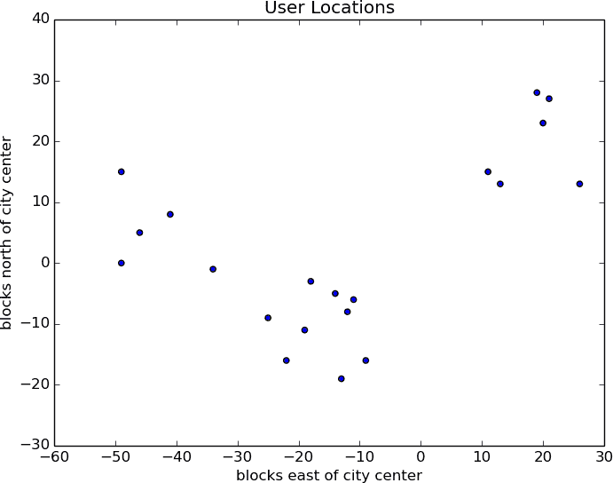
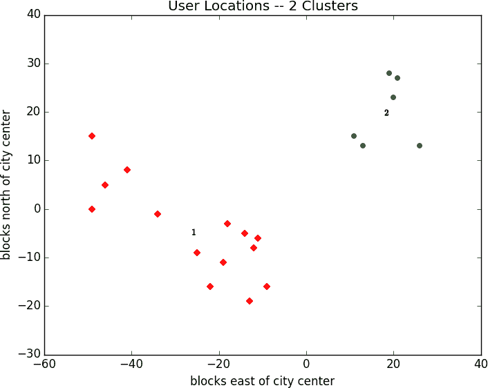
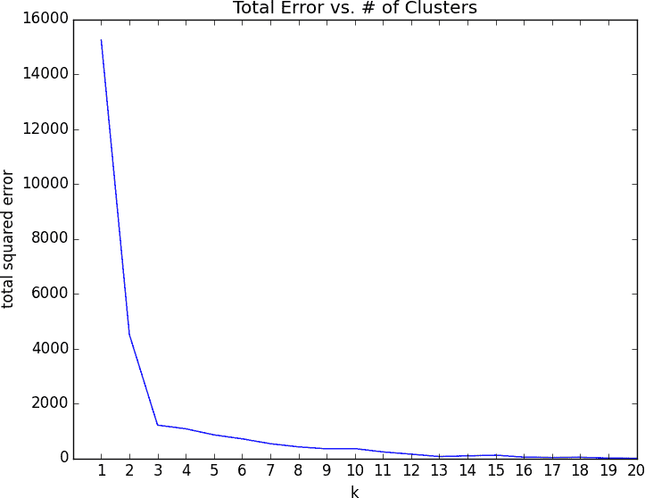
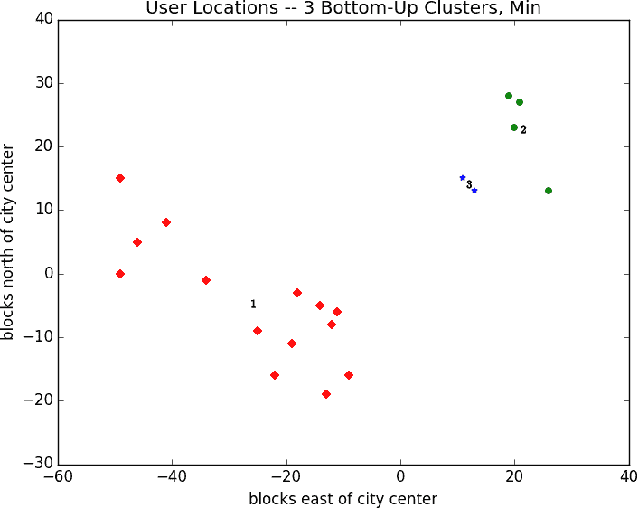
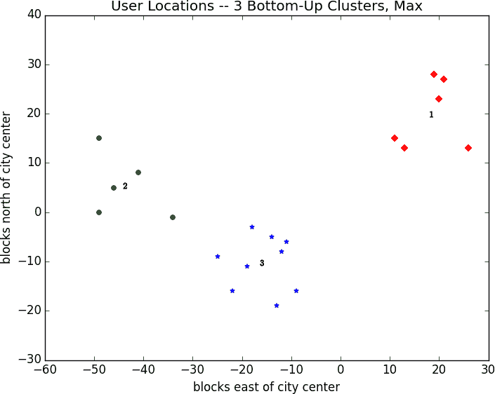

# 第二十章：聚类

> 当我们有这样的聚类时
> 
> 使我们变得高尚而不是疯狂
> 
> 罗伯特·赫里克

本书中的大多数算法都属于*监督学习*算法，即它们从一组带标签的数据开始，并将其用作对新的未标记数据进行预测的基础。然而，聚类是*无监督学习*的一个例子，我们在其中使用完全未标记的数据（或者我们的数据具有标签但我们忽略它们）。

# 思路

每当您查看某些数据源时，很可能数据会以某种方式形成*聚类*。显示百万富翁住在哪里的数据集可能在比佛利山庄和曼哈顿等地形成聚类。显示人们每周工作多少小时的数据集可能在周围形成一个大约为 40 的聚类（如果它来自于一项法律规定每周至少工作 20 小时的州，那么它可能还有另一个大约在 19 左右的聚类）。登记选民的人口统计数据集可能形成各种各样的聚类（例如，“足球妈妈”，“无聊的退休者”，“失业的千禧一代”），这些聚类被民意调查员和政治顾问认为是相关的。

与我们已经研究过的一些问题不同，通常没有“正确”的聚类。另一种聚类方案可能会将一些“失业的千禧一代”与“研究生”分组，而将其他一些与“父母的地下室居民”分组。这两种方案都不一定更正确——而是每一种都可能更优，关于自身的“聚类有多好？”度量标准而言。

此外，这些簇不会自行标记。您需要通过查看每个簇下面的数据来完成。

# 模型

对我们来说，每个`input`将是*d*维空间中的一个向量，通常我们将其表示为数字列表。我们的目标将是识别相似输入的簇，并（有时）为每个簇找到一个代表值。

例如，每个输入可以是表示博客文章标题的数值向量，此时目标可能是找到相似帖子的簇，也许是为了理解我们的用户正在博客的内容。或者想象一下，我们有一张包含数千个`(红色，绿色，蓝色)`颜色的图片，并且我们需要丝网印刷它的 10 种颜色版本。聚类可以帮助我们选择最小化总“颜色误差”的 10 种颜色。

最简单的聚类方法之一是*k*-means，在其中聚类数*k*是预先选择的，然后目标是以最小化每个点到其分配的簇的平均值的距离的总平方和的方式将输入分区到集合<math><mrow><msub><mi>S</mi> <mn>1</mn></msub> <mo>,</mo> <mo>...</mo> <mo>,</mo> <msub><mi>S</mi> <mi>k</mi></msub></mrow></math>。

有很多方法可以将*n*个点分配到*k*个簇中，这意味着找到最佳聚类是一个非常困难的问题。我们将采用一个通常能找到良好聚类的迭代算法：

1.  以一组*k*-means 开始，这些点位于*d*维空间中。

1.  将每个点分配给最接近它的均值。

1.  如果没有点的分配发生变化，请停止并保留这些簇。

1.  如果某些点的分配发生了变化，请重新计算均值并返回到步骤 2。

使用来自第四章的`vector_mean`函数，创建一个执行此操作的类非常简单。

首先，我们将创建一个辅助函数，用于衡量两个向量在多少坐标上不同。我们将使用这个函数来跟踪我们的训练进度：

```py
from scratch.linear_algebra import Vector

def num_differences(v1: Vector, v2: Vector) -> int:
    assert len(v1) == len(v2)
    return len([x1 for x1, x2 in zip(v1, v2) if x1 != x2])

assert num_differences([1, 2, 3], [2, 1, 3]) == 2
assert num_differences([1, 2], [1, 2]) == 0
```

我们还需要一个函数，它根据一些向量及其对簇的分配计算簇的均值。有可能某个簇没有分配到任何点。我们不能对空集合取平均值，因此在这种情况下，我们将随机选择一个点作为该簇的“均值”：

```py
from typing import List
from scratch.linear_algebra import vector_mean

def cluster_means(k: int,
                  inputs: List[Vector],
                  assignments: List[int]) -> List[Vector]:
    # clusters[i] contains the inputs whose assignment is i
    clusters = [[] for i in range(k)]
    for input, assignment in zip(inputs, assignments):
        clusters[assignment].append(input)

    # if a cluster is empty, just use a random point
    return [vector_mean(cluster) if cluster else random.choice(inputs)
            for cluster in clusters]
```

现在我们可以编写我们的聚类器代码了。像往常一样，我们将使用`tqdm`来跟踪我们的进度，但在这里，我们不知道需要多少次迭代，因此我们使用`itertools.count`，它创建一个无限迭代器，当完成时我们会从中`return`出来：

```py
import itertools
import random
import tqdm
from scratch.linear_algebra import squared_distance

class KMeans:
    def __init__(self, k: int) -> None:
        self.k = k                      # number of clusters
        self.means = None

    def classify(self, input: Vector) -> int:
        """return the index of the cluster closest to the input"""
        return min(range(self.k),
                   key=lambda i: squared_distance(input, self.means[i]))

    def train(self, inputs: List[Vector]) -> None:
        # Start with random assignments
        assignments = [random.randrange(self.k) for _ in inputs]

        with tqdm.tqdm(itertools.count()) as t:
            for _ in t:
                # Compute means and find new assignments
                self.means = cluster_means(self.k, inputs, assignments)
                new_assignments = [self.classify(input) for input in inputs]

                # Check how many assignments changed and if we're done
                num_changed = num_differences(assignments, new_assignments)
                if num_changed == 0:
                    return

                # Otherwise keep the new assignments, and compute new means
                assignments = new_assignments
                self.means = cluster_means(self.k, inputs, assignments)
                t.set_description(f"changed: {num_changed} / {len(inputs)}")
```

让我们看看这是如何工作的。

# 例子：见面会

为了庆祝 DataSciencester 的增长，您的用户奖励副总裁希望为您的本地用户组织几次面对面见面会，提供啤酒、披萨和 DataSciencester T 恤。您知道所有本地用户的位置（见图 20-1），她希望您选择方便每个人参加的见面地点。



###### 图 20-1. 您的本地用户位置

根据你的视角不同，你可能看到两个或三个簇。（从视觉上很容易，因为数据只有二维。如果是更多维度，只凭眼睛判断会更难。）

想象一下，她预算足够举办三次见面会。你去电脑上尝试这个：

```py
random.seed(12)                   # so you get the same results as me
clusterer = KMeans(k=3)
clusterer.train(inputs)
means = sorted(clusterer.means)   # sort for the unit test

assert len(means) == 3

# Check that the means are close to what we expect
assert squared_distance(means[0], [-44, 5]) < 1
assert squared_distance(means[1], [-16, -10]) < 1
assert squared_distance(means[2], [18, 20]) < 1
```

你会找到三个以[-44, 5]，[-16, -10]和[18, 20]为中心的簇，并且寻找靠近这些位置的见面场所（见图 20-2）。


###### 图 20-2. 用户位置分为三个簇

您将结果展示给副总裁，她通知您现在只有预算足够举办*两次*见面会。

“没问题”，你说：

```py
random.seed(0)
clusterer = KMeans(k=2)
clusterer.train(inputs)
means = sorted(clusterer.means)

assert len(means) == 2
assert squared_distance(means[0], [-26, -5]) < 1
assert squared_distance(means[1], [18, 20]) < 1
```

如图 20-3 所示，一个见面会仍应接近[18, 20]，但另一个现在应该接近[-26, -5]。



###### 图 20-3. 用户位置分为两个簇

# 选择*k*

在上一个示例中，*k*的选择受到我们控制之外的因素的驱动。一般情况下，这不会发生。有各种选择*k*的方法。其中一个相对容易理解的方法涉及绘制作为*k*的平方误差和（每个点与其簇的平均值之间的平方误差）的函数，并查看图表“弯曲”的位置：

```py
from matplotlib import pyplot as plt

def squared_clustering_errors(inputs: List[Vector], k: int) -> float:
    """finds the total squared error from k-means clustering the inputs"""
    clusterer = KMeans(k)
    clusterer.train(inputs)
    means = clusterer.means
    assignments = [clusterer.classify(input) for input in inputs]

    return sum(squared_distance(input, means[cluster])
               for input, cluster in zip(inputs, assignments))
```

这可以应用到我们之前的例子中：

```py
# now plot from 1 up to len(inputs) clusters

ks = range(1, len(inputs) + 1)
errors = [squared_clustering_errors(inputs, k) for k in ks]

plt.plot(ks, errors)
plt.xticks(ks)
plt.xlabel("k")
plt.ylabel("total squared error")
plt.title("Total Error vs. # of Clusters")
plt.show()
```

查看图 20-4，这种方法与我们最初的直觉观察相符，认为三是“正确”的聚类数目。



###### 图 20-4\. 选择一个*k*

# 示例：聚类颜色

Swag 的副总裁设计了引人注目的 DataSciencester 贴纸，他希望你在聚会上分发。不幸的是，你的贴纸打印机每张最多只能打印五种颜色。由于艺术副总裁正在休假，Swag 的副总裁问你是否有办法修改他的设计，使其只包含五种颜色。

计算机图像可以表示为像素的二维数组，其中每个像素本身是一个三维向量`(red, green, blue)`，表示其颜色。

创建图片的五种颜色版本，因此，涉及：

1.  选择五种颜色。

1.  为每个像素分配其中的一种颜色。

原来这是*k*-means 聚类的一个很好的任务，它可以将像素在红-绿-蓝色彩空间中分成五个聚类。然后，如果我们将每个聚类中的像素重新着色为平均颜色，我们就完成了。

首先，我们需要一种方法将图像加载到 Python 中。我们可以通过 matplotlib 来实现这一点，前提是我们首先安装 pillow 库：

```py
python -m pip install pillow
```

然后我们只需使用`matplotlib.image.imread`：

```py
image_path = r"girl_with_book.jpg"    # wherever your image is
import matplotlib.image as mpimg
img = mpimg.imread(image_path) / 256  # rescale to between 0 and 1
```

在幕后，`img`是一个 NumPy 数组，但是对于我们的目的，我们可以将其视为列表的列表的列表。

`img[i][j]`是第*i*行第*j*列的像素，每个像素是一个列表`[red, green, blue]`，数字介于 0 和 1 之间，表示[该像素的颜色](http://en.wikipedia.org/wiki/RGB_color_model)：

```py
top_row = img[0]
top_left_pixel = top_row[0]
red, green, blue = top_left_pixel
```

特别是，我们可以获得所有像素的扁平化列表，如下所示：

```py
# .tolist() converts a NumPy array to a Python list
pixels = [pixel.tolist() for row in img for pixel in row]
```

然后将它们提供给我们的聚类器：

```py
clusterer = KMeans(5)
clusterer.train(pixels)   # this might take a while
```

完成后，我们只需构造一个新的具有相同格式的图像：

```py
def recolor(pixel: Vector) -> Vector:
    cluster = clusterer.classify(pixel)        # index of the closest cluster
    return clusterer.means[cluster]            # mean of the closest cluster

new_img = [[recolor(pixel) for pixel in row]   # recolor this row of pixels
           for row in img]                     # for each row in the image
```

并显示它，使用`plt.imshow`：

```py
plt.imshow(new_img)
plt.axis('off')
plt.show()
```

在黑白书籍中展示彩色结果很困难，但图 20-5 显示了将全彩色图片转换为灰度版本以及使用此过程减少至五种颜色的输出。


###### 图 20-5\. 原始图片及其 5-means 去色化结果

# 自底向上的分层聚类

聚类的另一种方法是从底部向上“增长”聚类。我们可以这样做：

1.  使每个输入成为自己的一个簇。

1.  只要还有多个剩余的聚类，就找到最接近的两个聚类并将它们合并。

最后，我们将拥有一个包含所有输入的巨大聚类。如果我们跟踪合并顺序，我们可以通过取消合并来重新创建任意数量的聚类。例如，如果我们想要三个聚类，我们可以撤销最后两个合并。

我们将使用聚类的一个非常简单的表示。我们的值将存储在*leaf*簇中，并将其表示为`NamedTuple`：

```py
from typing import NamedTuple, Union

class Leaf(NamedTuple):
    value: Vector

leaf1 = Leaf([10,  20])
leaf2 = Leaf([30, -15])
```

我们将使用这些来增长*merged*聚类，我们也将其表示为`NamedTuple`：

```py
class Merged(NamedTuple):
    children: tuple
    order: int

merged = Merged((leaf1, leaf2), order=1)

Cluster = Union[Leaf, Merged]
```

###### 注意

这是另一种情况，Python 的类型注解让我们感到失望。你想用`Tuple[Cluster, Cluster]`作为`Merged.children`的类型提示，但`mypy`不允许这样的递归类型。

我们稍后会讨论合并顺序，但首先让我们创建一个递归返回所有值的帮助函数，这些值包含在（可能已合并的）簇中：

```py
def get_values(cluster: Cluster) -> List[Vector]:
    if isinstance(cluster, Leaf):
        return [cluster.value]
    else:
        return [value
                for child in cluster.children
                for value in get_values(child)]

assert get_values(merged) == [[10, 20], [30, -15]]
```

为了合并最接近的簇，我们需要一些关于簇之间距离的概念。我们将使用两个簇中元素之间的*最小*距离，这将合并最接近接触的两个簇（但有时会产生不太紧密的链式簇）。如果我们想要紧凑的球状簇，我们可能会改用*最大*距离，因为它会合并适合最小球中的两个簇。这两种选择都很常见，同样常见的是*平均*距离：

```py
from typing import Callable
from scratch.linear_algebra import distance

def cluster_distance(cluster1: Cluster,
                     cluster2: Cluster,
                     distance_agg: Callable = min) -> float:
    """
 compute all the pairwise distances between cluster1 and cluster2
 and apply the aggregation function _distance_agg_ to the resulting list
 """
    return distance_agg([distance(v1, v2)
                         for v1 in get_values(cluster1)
                         for v2 in get_values(cluster2)])
```

我们将使用合并顺序插槽来跟踪我们执行合并的顺序。较小的数字将表示*较晚*的合并。这意味着当我们想要拆分簇时，我们会从最低的合并顺序到最高的顺序进行。由于`Leaf`簇从未合并过，我们将给它们分配无穷大，即最大可能的值。由于它们没有`.order`属性，因此我们将创建一个辅助函数：

```py
def get_merge_order(cluster: Cluster) -> float:
    if isinstance(cluster, Leaf):
        return float('inf')  # was never merged
    else:
        return cluster.order
```

类似地，由于`Leaf`簇没有子节点，因此我们将为此创建并添加一个辅助函数：

```py
from typing import Tuple

def get_children(cluster: Cluster):
    if isinstance(cluster, Leaf):
        raise TypeError("Leaf has no children")
    else:
        return cluster.children
```

现在我们准备创建聚类算法：

```py
def bottom_up_cluster(inputs: List[Vector],
                      distance_agg: Callable = min) -> Cluster:
    # Start with all leaves
    clusters: List[Cluster] = [Leaf(input) for input in inputs]

    def pair_distance(pair: Tuple[Cluster, Cluster]) -> float:
        return cluster_distance(pair[0], pair[1], distance_agg)

    # as long as we have more than one cluster left...
    while len(clusters) > 1:
        # find the two closest clusters
        c1, c2 = min(((cluster1, cluster2)
                      for i, cluster1 in enumerate(clusters)
                      for cluster2 in clusters[:i]),
                      key=pair_distance)

        # remove them from the list of clusters
        clusters = [c for c in clusters if c != c1 and c != c2]

        # merge them, using merge_order = # of clusters left
        merged_cluster = Merged((c1, c2), order=len(clusters))

        # and add their merge
        clusters.append(merged_cluster)

    # when there's only one cluster left, return it
    return clusters[0]
```

它的使用非常简单：

```py
base_cluster = bottom_up_cluster(inputs)
```

这将生成一个如下所示的聚类：

```py
  0  1  2  3  4  5  6  7  8  9  10 11 12 13 14 15 16 17 18
──┬──┬─────┬────────────────────────────────┬───────────┬─ [19, 28]
  │  │     │                                │           └─ [21, 27]
  │  │     │                                └─ [20, 23]
  │  │     └─ [26, 13]
  │  └────────────────────────────────────────────┬─ [11, 15]
  │                                               └─ [13, 13]
  └─────┬─────┬──┬───────────┬─────┬─ [-49, 0]
        │     │  │           │     └─ [-46, 5]
        │     │  │           └─ [-41, 8]
        │     │  └─ [-49, 15]
        │     └─ [-34, 1]
        └───────────┬──┬──┬─────┬─ [-22, -16]
                    │  │  │     └─ [-19, -11]
                    │  │  └─ [-25, -9]
                    │  └─────────────────┬─────┬─────┬─ [-11, -6]
                    │                    │     │     └─ [-12, -8]
                    │                    │     └─ [-14, 5]
                    │                    └─ [-18, -3]
                    └─────────────────┬─ [-13, -19]
                                      └─ [-9, -16]
```

顶部的数字表示“合并顺序”。因为我们有 20 个输入，所以需要 19 次合并才能得到这一个簇。第一次合并通过组合叶子[19, 28]和[21, 27]创建了簇 18。最后一次合并创建了簇 0。

如果你只想要两个簇，你可以在第一个分叉点“0”处分割，创建一个包含六个点的簇和另一个包含剩余点的簇。对于三个簇，你将继续到第二个分叉点“1”，它指示要将第一个簇拆分为包含([19, 28], [21, 27], [20, 23], [26, 13])的簇和包含([11, 15], [13, 13])的簇。依此类推。

尽管如此，我们通常不想看到像这样的难看文本表示。相反，让我们编写一个函数，通过执行适当数量的拆分来生成任意数量的簇：

```py
def generate_clusters(base_cluster: Cluster,
                      num_clusters: int) -> List[Cluster]:
    # start with a list with just the base cluster
    clusters = [base_cluster]

    # as long as we don't have enough clusters yet...
    while len(clusters) < num_clusters:
        # choose the last-merged of our clusters
        next_cluster = min(clusters, key=get_merge_order)
        # remove it from the list
        clusters = [c for c in clusters if c != next_cluster]

        # and add its children to the list (i.e., unmerge it)
        clusters.extend(get_children(next_cluster))

    # once we have enough clusters...
    return clusters
```

例如，如果我们想生成三个簇，我们只需执行以下操作：

```py
three_clusters = [get_values(cluster)
                  for cluster in generate_clusters(base_cluster, 3)]
```

可以轻松绘制的部分：

```py
for i, cluster, marker, color in zip([1, 2, 3],
                                     three_clusters,
                                     ['D','o','*'],
                                     ['r','g','b']):
    xs, ys = zip(*cluster)  # magic unzipping trick
    plt.scatter(xs, ys, color=color, marker=marker)

    # put a number at the mean of the cluster
    x, y = vector_mean(cluster)
    plt.plot(x, y, marker='$' + str(i) + '$', color='black')

plt.title("User Locations -- 3 Bottom-Up Clusters, Min")
plt.xlabel("blocks east of city center")
plt.ylabel("blocks north of city center")
plt.show()
```

这与*k*-means 产生了非常不同的结果，如图 20-6 所示。



###### 图 20-6\. 使用最小距离生成的三个自下而上的簇

如前所述，这是因为在`cluster_distance`中使用`min`倾向于生成链式簇。如果我们改用`max`（生成紧密簇），它将与 3-means 结果相同（见图 20-7）。

###### 注意

先前的`bottom_up_clustering`实现相对简单，但效率惊人地低下。特别是，它在每一步重新计算每对输入之间的距离。更高效的实现可能会预先计算每对输入之间的距离，然后在`cluster_distance`内执行查找。*真正*高效的实现可能还会记住前一步骤的`cluster_distance`。



###### 图 20-7\. 使用最大距离的三个自底向上聚类

# 进一步探索

+   scikit-learn 有一个完整的模块，[`sklearn.cluster`](http://scikit-learn.org/stable/modules/clustering.html)，其中包含几种聚类算法，包括`KMeans`和`Ward`层次聚类算法（其合并集群的标准与我们的不同）。

+   [SciPy](http://www.scipy.org/) 提供了两种聚类模型：`scipy.cluster.vq`，实现*k*-均值；以及`scipy.cluster.hierarchy`，提供多种层次聚类算法。
