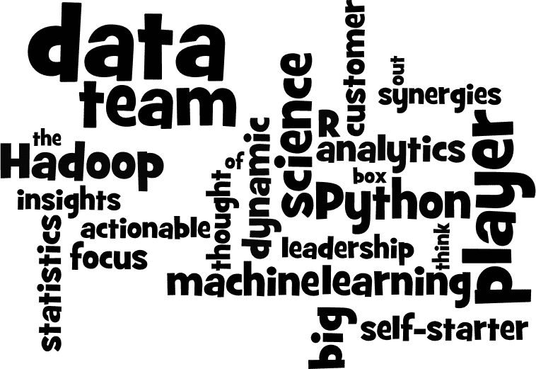
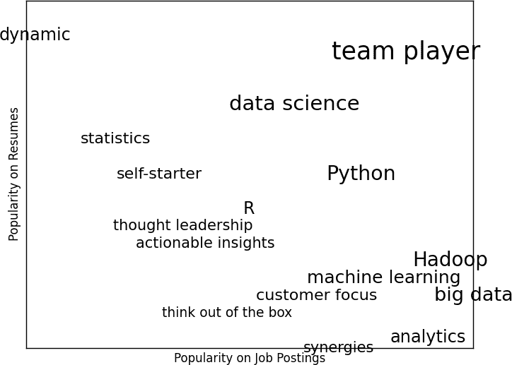
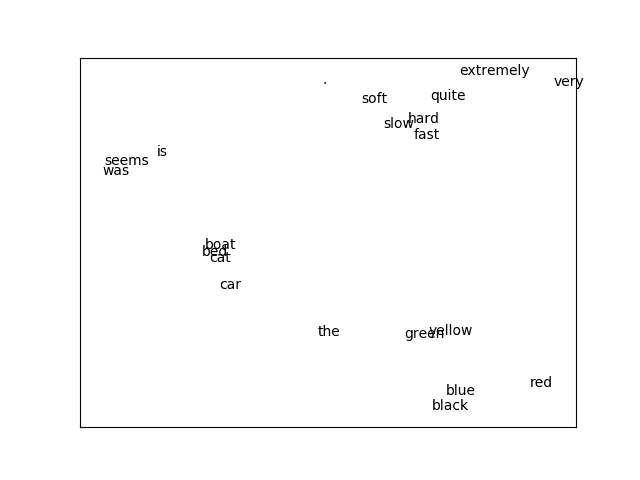

# 第二十一章：自然语言处理

> 他们已经在语言的盛宴中大快朵颐，窃取了残羹剩饭。
> 
> 威廉·莎士比亚

*自然语言处理*（NLP）指的是涉及语言的计算技术。这是一个广泛的领域，但我们将看几种简单和复杂的技术。

# 词云

在 第 1 章，我们计算了用户兴趣的单词计数。一个可视化单词和计数的方法是 *词云*，它以比例大小艺术化地呈现单词。

通常，数据科学家们对词云并不看重，主要是因为单词的排列除了“这里是我能放置一个词的空间”之外没有其他意义。

如果你不得不创建一个词云，考虑一下是否可以让坐标轴传达某种信息。例如，想象一下，对于某些数据科学相关的流行术语，你有两个在 0 到 100 之间的数字——第一个表示它在职位发布中出现的频率，第二个表示它在简历中出现的频率：

```py
data = [ ("big data", 100, 15), ("Hadoop", 95, 25), ("Python", 75, 50),
         ("R", 50, 40), ("machine learning", 80, 20), ("statistics", 20, 60),
         ("data science", 60, 70), ("analytics", 90, 3),
         ("team player", 85, 85), ("dynamic", 2, 90), ("synergies", 70, 0),
         ("actionable insights", 40, 30), ("think out of the box", 45, 10),
         ("self-starter", 30, 50), ("customer focus", 65, 15),
         ("thought leadership", 35, 35)]
```

词云的方法就是在页面上以酷炫的字体排列这些词（图 21-1）。



###### 图 21-1 术语词云

这看起来很整齐，但实际上并没有告诉我们什么。一个更有趣的方法可能是将它们散布开来，使得水平位置表示发布的流行度，垂直位置表示简历的流行度，这将产生一个传达几个见解的可视化效果（图 21-2）：

```py
from matplotlib import pyplot as plt

def text_size(total: int) -> float:
    """equals 8 if total is 0, 28 if total is 200"""
    return 8 + total / 200 * 20

for word, job_popularity, resume_popularity in data:
    plt.text(job_popularity, resume_popularity, word,
             ha='center', va='center',
             size=text_size(job_popularity + resume_popularity))
plt.xlabel("Popularity on Job Postings")
plt.ylabel("Popularity on Resumes")
plt.axis([0, 100, 0, 100])
plt.xticks([])
plt.yticks([])
plt.show()
```



###### 图 21-2 更有意义（虽然不够吸引人）的词云

# n-Gram 语言模型

DataSciencester 搜索引擎市场副总裁希望创建成千上万个关于数据科学的网页，以便您的网站在与数据科学相关的搜索结果中排名更高。（你试图向她解释搜索引擎算法已经足够聪明，这实际上不会起作用，但她拒绝听取。）

当然，她不想写成千上万个网页，也不想支付一大群“内容战略师”来完成。相反，她问你是否可以以某种程序化的方式生成这些网页。为此，我们需要某种语言建模的方法。

一种方法是从一组文档语料库开始，并学习语言的统计模型。在我们的案例中，我们将从迈克·劳凯德斯的文章[《什么是数据科学？》](http://oreil.ly/1Cd6ykN)开始。

如同 第 9 章，我们将使用 Requests 和 Beautiful Soup 库来获取数据。这里有几个值得注意的问题。

首先，文本中的撇号实际上是 Unicode 字符 `u"\u2019"`。我们将创建一个辅助函数来将其替换为正常的撇号：

```py
def fix_unicode(text: str) -> str:
    return text.replace(u"\u2019", "'")
```

第二个问题是，一旦我们获取了网页的文本，我们将希望将其拆分为一系列的单词和句号（以便我们可以知道句子的结束位置）。我们可以使用`re.findall`来实现这一点：

```py
import re
from bs4 import BeautifulSoup
import requests

url = "https://www.oreilly.com/ideas/what-is-data-science"
html = requests.get(url).text
soup = BeautifulSoup(html, 'html5lib')

content = soup.find("div", "article-body")   # find article-body div
regex = r"[\w']+|[\.]"                       # matches a word or a period

document = []

for paragraph in content("p"):
    words = re.findall(regex, fix_unicode(paragraph.text))
    document.extend(words)
```

我们当然可以（而且很可能应该）进一步清理这些数据。文档中仍然有一些多余的文本（例如，第一个单词是*Section*），我们已经在中间句点上分割了（例如，在*Web 2.0*中），还有一些标题和列表散布在其中。话虽如此，我们将按照文档的样子进行处理。

现在我们将文本作为一系列单词，我们可以按以下方式对语言进行建模：给定一些起始词（比如*book*），我们查看源文档中跟随它的所有单词。我们随机选择其中一个作为下一个单词，并重复这个过程，直到我们遇到一个句号，这表示句子的结束。我们称之为*bigram 模型*，因为它完全由原始数据中 bigram（单词对）的频率决定。

起始词呢？我们可以随机从跟在句号后面的单词中选择一个。首先，让我们预先计算可能的单词转换。记住`zip`在其输入的任何一个完成时停止，因此`zip(document, document[1:])`给出了`document`中连续元素的精确配对：

```py
from collections import defaultdict

transitions = defaultdict(list)
for prev, current in zip(document, document[1:]):
    transitions[prev].append(current)
```

现在我们准备好生成句子了：

```py
def generate_using_bigrams() -> str:
    current = "."   # this means the next word will start a sentence
    result = []
    while True:
        next_word_candidates = transitions[current]    # bigrams (current, _)
        current = random.choice(next_word_candidates)  # choose one at random
        result.append(current)                         # append it to results
        if current == ".": return " ".join(result)     # if "." we're done
```

它生成的句子是胡言乱语，但如果你试图听起来像数据科学，它们就是你可能会放在你的网站上的那种胡言乱语。例如：

> 如果你知道你想要对数据进行排序的数据源网页友好的人在热门话题上作为 Hadoop 中的数据，那么数据科学需要一本书来演示为什么可视化是数据的可视化是但我们在 Python 语言中使用许多商业磁盘驱动器上的大量相关性，并创建更可管理的形式进行连接，然后使用它来解决数据的问题。
> 
> Bigram 模型

通过查看三元组，连续三个单词的三元组，我们可以使句子不那么胡言乱语。 （更一般地说，你可以查看由*n*个连续单词组成的*n-gram*，但对于我们来说，三个就足够了。）现在的转换将取决于前两个单词：

```py
trigram_transitions = defaultdict(list)
starts = []

for prev, current, next in zip(document, document[1:], document[2:]):

    if prev == ".":              # if the previous "word" was a period
        starts.append(current)   # then this is a start word

    trigram_transitions[(prev, current)].append(next)
```

现在注意，我们现在必须单独跟踪起始词。我们几乎可以以相同的方式生成句子：

```py
def generate_using_trigrams() -> str:
    current = random.choice(starts)   # choose a random starting word
    prev = "."                        # and precede it with a '.'
    result = [current]
    while True:
        next_word_candidates = trigram_transitions[(prev, current)]
        next_word = random.choice(next_word_candidates)

        prev, current = current, next_word
        result.append(current)

        if current == ".":
            return " ".join(result)
```

这样产生的句子更好，比如：

> 事后看来 MapReduce 看起来像是一场流行病，如果是这样，那么这是否给我们提供了新的见解，即经济如何运作这不是一个我们几年前甚至可以问的问题已经被工具化。
> 
> 三元模型

当然，它们听起来更好，因为在每一步生成过程中的选择更少，而在许多步骤中只有一个选择。这意味着我们经常生成句子（或至少是长短语），这些句子在原始数据中原封不动地出现过。拥有更多的数据会有所帮助；如果我们收集了关于数据科学的多篇文章中的*n*-gram，它也会更有效。

# 语法

一种不同的语言建模方法是使用*语法*，即生成可接受句子的规则。在小学时，你可能学过词性及其如何组合。例如，如果你有一个非常糟糕的英语老师，你可能会说一个句子必然由*名词*后跟一个*动词*。如果你有名词和动词的列表，你可以根据这个规则生成句子。

我们将定义一个稍微复杂的语法：

```py
from typing import List, Dict

# Type alias to refer to grammars later
Grammar = Dict[str, List[str]]

grammar = {
    "_S"  : ["_NP _VP"],
    "_NP" : ["_N",
             "_A _NP _P _A _N"],
    "_VP" : ["_V",
             "_V _NP"],
    "_N"  : ["data science", "Python", "regression"],
    "_A"  : ["big", "linear", "logistic"],
    "_P"  : ["about", "near"],
    "_V"  : ["learns", "trains", "tests", "is"]
}
```

我编制了以下约定：以下划线开头的名称指的是*需要进一步扩展的规则*，而其他名称是*不需要进一步处理的终端*。

因此，例如，`"_S"`是“句子”规则，它生成一个`"_NP"`（“名词短语”）规则后跟一个`"_VP"`（“动词短语”）规则。

动词短语规则可以生成`"_V"`（“动词”）规则，或者动词规则后跟名词短语规则。

注意`"_NP"`规则包含在其一个产生中。语法可以是递归的，这使得像这样的有限语法可以生成无限多个不同的句子。

我们如何从这个语法生成句子？我们将从包含句子规则`["_S"]`的列表开始。然后，我们将通过用其产生之一随机替换每个规则来重复扩展每个规则。当我们有一个完全由终端组成的列表时，我们停止。

例如，这样的进展可能看起来像：

```py
['_S']
['_NP','_VP']
['_N','_VP']
['Python','_VP']
['Python','_V','_NP']
['Python','trains','_NP']
['Python','trains','_A','_NP','_P','_A','_N']
['Python','trains','logistic','_NP','_P','_A','_N']
['Python','trains','logistic','_N','_P','_A','_N']
['Python','trains','logistic','data science','_P','_A','_N']
['Python','trains','logistic','data science','about','_A', '_N']
['Python','trains','logistic','data science','about','logistic','_N']
['Python','trains','logistic','data science','about','logistic','Python']
```

我们如何实现这一点？嗯，首先，我们将创建一个简单的辅助函数来识别终端：

```py
def is_terminal(token: str) -> bool:
    return token[0] != "_"
```

接下来，我们需要编写一个函数，将标记列表转换为句子。我们将寻找第一个非终结符标记。如果找不到一个，那意味着我们有一个完成的句子，我们就完成了。

如果我们找到一个非终结符，然后我们随机选择它的一个产生式。如果该产生式是一个终端（即一个词），我们只需用它替换标记。否则，它是一系列以空格分隔的非终结符标记，我们需要`split`然后在当前标记中插入。无论哪种方式，我们都会在新的标记集上重复这个过程。

将所有这些放在一起，我们得到：

```py
def expand(grammar: Grammar, tokens: List[str]) -> List[str]:
    for i, token in enumerate(tokens):
        # If this is a terminal token, skip it.
        if is_terminal(token): continue

        # Otherwise, it's a nonterminal token,
        # so we need to choose a replacement at random.
        replacement = random.choice(grammar[token])

        if is_terminal(replacement):
            tokens[i] = replacement
        else:
            # Replacement could be, e.g., "_NP _VP", so we need to
            # split it on spaces and splice it in.
            tokens = tokens[:i] + replacement.split() + tokens[(i+1):]

        # Now call expand on the new list of tokens.
        return expand(grammar, tokens)

    # If we get here, we had all terminals and are done.
    return tokens
```

现在我们可以开始生成句子了：

```py
def generate_sentence(grammar: Grammar) -> List[str]:
    return expand(grammar, ["_S"])
```

尝试改变语法——添加更多单词，添加更多规则，添加你自己的词性——直到你准备生成公司所需的多个网页为止。

当语法反向使用时，语法实际上更有趣。给定一个句子，我们可以使用语法*解析*句子。这然后允许我们识别主语和动词，并帮助我们理解句子的意义。

使用数据科学生成文本是一个很棒的技巧；使用它来*理解*文本更加神奇。（参见“进一步探索”可以用于此目的的库。）

# 一个旁注：吉布斯采样

从一些分布生成样本很容易。我们可以得到均匀随机变量：

```py
random.random()
```

和正常的随机变量一样：

```py
inverse_normal_cdf(random.random())
```

但是一些分布很难进行抽样。*吉布斯抽样* 是一种从多维分布生成样本的技术，当我们只知道一些条件分布时使用。

例如，想象掷两个骰子。让 *x* 是第一个骰子的值，*y* 是两个骰子的和，想象你想生成大量 (*x*, *y*) 对。在这种情况下，直接生成样本是很容易的：

```py
from typing import Tuple
import random

def roll_a_die() -> int:
    return random.choice([1, 2, 3, 4, 5, 6])

def direct_sample() -> Tuple[int, int]:
    d1 = roll_a_die()
    d2 = roll_a_die()
    return d1, d1 + d2
```

但是假设你只知道条件分布。知道 *x* 的值时，*y* 的分布很简单——如果你知道 *x* 的值，*y* 同样可能是 *x* + 1、*x* + 2、*x* + 3、*x* + 4、*x* + 5 或 *x* + 6：

```py
def random_y_given_x(x: int) -> int:
    """equally likely to be x + 1, x + 2, ... , x + 6"""
    return x + roll_a_die()
```

另一个方向更为复杂。例如，如果你知道 *y* 是 2，则必然 *x* 是 1（因为使两个骰子的和为 2 的唯一方法是它们都是 1）。如果你知道 *y* 是 3，则 *x* 等可能是 1 或 2。同样，如果 *y* 是 11，则 *x* 必须是 5 或 6：

```py
def random_x_given_y(y: int) -> int:
    if y <= 7:
        # if the total is 7 or less, the first die is equally likely to be
        # 1, 2, ..., (total - 1)
        return random.randrange(1, y)
    else:
        # if the total is 7 or more, the first die is equally likely to be
        # (total - 6), (total - 5), ..., 6
        return random.randrange(y - 6, 7)
```

吉布斯抽样的工作原理是我们从任意（有效的）*x* 和 *y* 的值开始，然后反复替换，用在*y* 条件下随机选择的值替换 *x*，并在 *x* 条件下随机选择的值替换 *y*。经过若干次迭代，*x* 和 *y* 的结果值将代表无条件联合分布的一个样本：

```py
def gibbs_sample(num_iters: int = 100) -> Tuple[int, int]:
    x, y = 1, 2 # doesn't really matter
    for _ in range(num_iters):
        x = random_x_given_y(y)
        y = random_y_given_x(x)
    return x, y
```

你可以检查这是否给出与直接样本相似的结果：

```py
def compare_distributions(num_samples: int = 1000) -> Dict[int, List[int]]:
    counts = defaultdict(lambda: [0, 0])
    for _ in range(num_samples):
        counts[gibbs_sample()][0] += 1
        counts[direct_sample()][1] += 1
    return counts
```

我们将在下一节中使用这种技术。

# 主题建模

当我们在第一章中构建“您可能认识的数据科学家”推荐系统时，我们简单地查找人们声明的兴趣的完全匹配。

更复杂的方法是尝试理解用户兴趣的*主题*。一种称为*潜在狄利克雷分配*（LDA）的技术通常用于识别一组文档中的常见主题。我们将其应用于由每个用户兴趣组成的文档。

LDA 与我们在第十三章中构建的朴素贝叶斯分类器有一些相似之处，因为它假设文档的概率模型。对于我们的目的，该模型假设以下内容，我们将略过更复杂的数学细节：

+   有一些固定数量 *K* 的主题。

+   有一个随机变量为每个主题分配与之相关联的单词概率分布。你应该将这个分布看作是给定主题 *k* 下看到单词 *w* 的概率。

+   还有一个随机变量为每个文档分配一个主题的概率分布。你应该将这个分布看作是文档 *d* 中主题的混合。

+   文档中的每个单词是通过首先随机选择一个主题（从文档的主题分布中）然后随机选择一个单词（从主题的单词分布中）生成的。

特别是，我们有一个`documents`的集合，每个文档都是一个单词的`list`。并且我们有一个相应的`document_topics`集合，它为每个文档中的每个单词分配一个主题（这里是 0 到*K*-1 之间的数字）。

因此，第四个文档中的第五个单词是：

```py
documents[3][4]
```

选择该单词的主题是：

```py
document_topics[3][4]
```

这非常明确地定义了每个文档在主题上的分布，并且隐含地定义了每个主题在单词上的分布。

通过比较主题 1 生成该单词的次数与主题 1 生成*任何*单词的次数，我们可以估计主题 1 生成某个单词的可能性。（类似地，在第十三章中建立垃圾邮件过滤器时，我们比较了每个单词在垃圾邮件中出现的次数与垃圾邮件中出现的总字数。）

虽然这些主题只是数字，但我们可以通过查看它们赋予最高权重的单词来为它们命名描述性名称。我们只需以某种方式生成`document_topics`。这就是吉布斯抽样发挥作用的地方。

我们首先随机地为每个文档中的每个单词分配一个主题。现在我们逐个单词地遍历每个文档。对于该单词和文档，我们为每个主题构造依赖于该文档中主题的（当前）分布和该主题中单词的（当前）分布的权重。然后我们使用这些权重来对该单词抽样一个新的主题。如果我们多次迭代这个过程，我们最终会得到从主题-单词分布和文档-主题分布的联合样本。

起步，我们需要一个函数根据任意一组权重随机选择一个索引：

```py
def sample_from(weights: List[float]) -> int:
    """returns i with probability weights[i] / sum(weights)"""
    total = sum(weights)
    rnd = total * random.random()      # uniform between 0 and total
    for i, w in enumerate(weights):
        rnd -= w                       # return the smallest i such that
        if rnd <= 0: return i          # weights[0] + ... + weights[i] >= rnd
```

例如，如果给定权重 `[1, 1, 3]`，那么它将返回 0 的概率为五分之一，返回 1 的概率为五分之一，返回 2 的概率为三分之五。让我们编写一个测试：

```py
from collections import Counter

# Draw 1000 times and count
draws = Counter(sample_from([0.1, 0.1, 0.8]) for _ in range(1000))
assert 10 < draws[0] < 190   # should be ~10%, this is a really loose test
assert 10 < draws[1] < 190   # should be ~10%, this is a really loose test
assert 650 < draws[2] < 950  # should be ~80%, this is a really loose test
assert draws[0] + draws[1] + draws[2] == 1000
```

我们的文档是我们用户的兴趣，看起来像：

```py
documents = [
    ["Hadoop", "Big Data", "HBase", "Java", "Spark", "Storm", "Cassandra"],
    ["NoSQL", "MongoDB", "Cassandra", "HBase", "Postgres"],
    ["Python", "scikit-learn", "scipy", "numpy", "statsmodels", "pandas"],
    ["R", "Python", "statistics", "regression", "probability"],
    ["machine learning", "regression", "decision trees", "libsvm"],
    ["Python", "R", "Java", "C++", "Haskell", "programming languages"],
    ["statistics", "probability", "mathematics", "theory"],
    ["machine learning", "scikit-learn", "Mahout", "neural networks"],
    ["neural networks", "deep learning", "Big Data", "artificial intelligence"],
    ["Hadoop", "Java", "MapReduce", "Big Data"],
    ["statistics", "R", "statsmodels"],
    ["C++", "deep learning", "artificial intelligence", "probability"],
    ["pandas", "R", "Python"],
    ["databases", "HBase", "Postgres", "MySQL", "MongoDB"],
    ["libsvm", "regression", "support vector machines"]
]
```

我们将尝试找到：

```py
K = 4
```

主题。为了计算抽样权重，我们需要跟踪几个计数。让我们首先为它们创建数据结构。

+   每个主题分配给每个文档的次数是：

    ```py
    # a list of Counters, one for each document
    document_topic_counts = [Counter() for _ in documents]
    ```

+   每个单词分配到每个主题的次数是：

    ```py
    # a list of Counters, one for each topic
    topic_word_counts = [Counter() for _ in range(K)]
    ```

+   分配给每个主题的总字数是：

    ```py
    # a list of numbers, one for each topic
    topic_counts = [0 for _ in range(K)]
    ```

+   每个文档包含的总字数是：

    ```py
    # a list of numbers, one for each document
    document_lengths = [len(document) for document in documents]
    ```

+   不同单词的数量是：

    ```py
    distinct_words = set(word for document in documents for word in document)
    W = len(distinct_words)
    ```

+   以及文档的数量：

    ```py
    D = len(documents)
    ```

一旦我们填充了这些数据，我们可以如下找到例如与主题 1 相关联的`documents[3]`中的单词数：

```py
document_topic_counts[3][1]
```

并且我们可以找到*nlp*与主题 2 相关联的次数如下：

```py
topic_word_counts[2]["nlp"]
```

现在我们准备定义我们的条件概率函数。就像第十三章中那样，每个函数都有一个平滑项，确保每个主题在任何文档中被选择的概率都不为零，并且每个单词在任何主题中被选择的概率也不为零：

```py
def p_topic_given_document(topic: int, d: int, alpha: float = 0.1) -> float:
    """
 The fraction of words in document 'd'
 that are assigned to 'topic' (plus some smoothing)
 """
    return ((document_topic_counts[d][topic] + alpha) /
            (document_lengths[d] + K * alpha))

def p_word_given_topic(word: str, topic: int, beta: float = 0.1) -> float:
    """
 The fraction of words assigned to 'topic'
 that equal 'word' (plus some smoothing)
 """
    return ((topic_word_counts[topic][word] + beta) /
            (topic_counts[topic] + W * beta))
```

我们将使用这些函数来创建更新主题的权重：

```py
def topic_weight(d: int, word: str, k: int) -> float:
    """
 Given a document and a word in that document,
 return the weight for the kth topic
 """
    return p_word_given_topic(word, k) * p_topic_given_document(k, d)

def choose_new_topic(d: int, word: str) -> int:
    return sample_from([topic_weight(d, word, k)
                        for k in range(K)])
```

有坚实的数学原因解释为什么 `topic_weight` 被定义为它的方式，但是它们的细节会让我们走得太远。希望至少直观地理解，鉴于一个词和它的文档，选择任何主题的可能性取决于该主题对文档的可能性以及该词对该主题的可能性。

这就是我们需要的所有机制。我们从将每个单词分配给一个随机主题开始，并相应地填充我们的计数器：

```py
random.seed(0)
document_topics = [[random.randrange(K) for word in document]
                   for document in documents]

for d in range(D):
    for word, topic in zip(documents[d], document_topics[d]):
        document_topic_counts[d][topic] += 1
        topic_word_counts[topic][word] += 1
        topic_counts[topic] += 1
```

我们的目标是获取主题-词分布和文档-主题分布的联合样本。我们使用一种基于吉布斯抽样的形式来完成这一过程，该过程使用之前定义的条件概率：

```py
import tqdm

for iter in tqdm.trange(1000):
    for d in range(D):
        for i, (word, topic) in enumerate(zip(documents[d],
                                              document_topics[d])):

            # remove this word / topic from the counts
            # so that it doesn't influence the weights
            document_topic_counts[d][topic] -= 1
            topic_word_counts[topic][word] -= 1
            topic_counts[topic] -= 1
            document_lengths[d] -= 1

            # choose a new topic based on the weights
            new_topic = choose_new_topic(d, word)
            document_topics[d][i] = new_topic

            # and now add it back to the counts
            document_topic_counts[d][new_topic] += 1
            topic_word_counts[new_topic][word] += 1
            topic_counts[new_topic] += 1
            document_lengths[d] += 1
```

主题是什么？它们只是数字 0、1、2 和 3。如果我们想要它们的名称，我们必须自己添加。让我们看看每个主题的五个权重最高的词汇（表 21-1）：

```py
for k, word_counts in enumerate(topic_word_counts):
    for word, count in word_counts.most_common():
        if count > 0:
            print(k, word, count)
```

表 21-1\. 每个主题的最常见词汇

| 主题 0 | 主题 1 | 主题 2 | 主题 3 |
| --- | --- | --- | --- |
| Java | R | HBase | 回归分析 |
| 大数据 | 统计 | Postgres | libsvm |
| Hadoop | Python | MongoDB | scikit-learn |
| 深度学习 | 概率 | 卡桑德拉 | 机器学习 |
| 人工智能 | 熊猫 | NoSQL | 神经网络 |

基于这些，我可能会分配主题名称：

```py
topic_names = ["Big Data and programming languages",
               "Python and statistics",
               "databases",
               "machine learning"]
```

在这一点上，我们可以看到模型如何将主题分配给每个用户的兴趣：

```py
for document, topic_counts in zip(documents, document_topic_counts):
    print(document)
    for topic, count in topic_counts.most_common():
        if count > 0:
            print(topic_names[topic], count)
    print()
```

这给出了：

```py
['Hadoop', 'Big Data', 'HBase', 'Java', 'Spark', 'Storm', 'Cassandra']
Big Data and programming languages 4 databases 3
['NoSQL', 'MongoDB', 'Cassandra', 'HBase', 'Postgres']
databases 5
['Python', 'scikit-learn', 'scipy', 'numpy', 'statsmodels', 'pandas']
Python and statistics 5 machine learning 1
```

等等。考虑到我们在一些主题名称中需要使用的“和”，可能我们应该使用更多的主题，尽管最可能我们没有足够的数据成功学习它们。

# 单词向量

最近自然语言处理的许多进展涉及深度学习。在本章的其余部分中，我们将使用我们在第十九章中开发的机制来看一些这样的进展。

一个重要的创新涉及将单词表示为低维向量。这些向量可以进行比较、相加、输入到机器学习模型中，或者任何你想做的事情。它们通常具有良好的特性；例如，相似的单词倾向于有相似的向量。也就是说，通常单词 *big* 的向量与单词 *large* 的向量非常接近，因此一个操作单词向量的模型可以（在某种程度上）免费处理类似的词语。

经常向量也会展示出令人愉悦的算术特性。例如，在某些模型中，如果你取 *king* 的向量，减去 *man* 的向量，再加上 *woman* 的向量，你将得到一个非常接近 *queen* 向量的向量。思考这对于单词向量实际上“学到”了什么，可能会很有趣，尽管我们在这里不会花时间讨论这一点。

对于一个庞大的词汇表来说，设计这样的向量是一项困难的任务，所以通常我们会从文本语料库中 *学习* 它们。有几种不同的方案，但在高层次上，任务通常看起来像这样：

1.  获取一堆文本。

1.  创建一个数据集，目标是预测给定附近单词的单词（或者，预测给定单词的附近单词）。

1.  训练一个神经网络在这个任务上表现良好。

1.  将训练好的神经网络的内部状态作为单词向量。

特别是，由于任务是根据附近的单词预测单词，出现在类似上下文中的单词（因此具有类似的附近单词）应该具有类似的内部状态，因此也应该具有相似的单词向量。

我们将使用 *余弦相似度*（cosine similarity）来衡量“相似性”，它是一个介于-1 和 1 之间的数值，用于衡量两个向量指向相同方向的程度：

```py
from scratch.linear_algebra import dot, Vector
import math

def cosine_similarity(v1: Vector, v2: Vector) -> float:
    return dot(v1, v2) / math.sqrt(dot(v1, v1) * dot(v2, v2))

assert cosine_similarity([1., 1, 1], [2., 2, 2]) == 1, "same direction"
assert cosine_similarity([-1., -1], [2., 2]) == -1,    "opposite direction"
assert cosine_similarity([1., 0], [0., 1]) == 0,       "orthogonal"
```

让我们学习一些词向量，看看它是如何工作的。

首先，我们需要一个玩具数据集。通常使用的单词向量通常是通过在数百万甚至数十亿个单词上训练而来的。由于我们的玩具库无法处理那么多数据，我们将创建一个具有某些结构的人工数据集：

```py
colors = ["red", "green", "blue", "yellow", "black", ""]
nouns = ["bed", "car", "boat", "cat"]
verbs = ["is", "was", "seems"]
adverbs = ["very", "quite", "extremely", ""]
adjectives = ["slow", "fast", "soft", "hard"]

def make_sentence() -> str:
    return " ".join([
        "The",
        random.choice(colors),
        random.choice(nouns),
        random.choice(verbs),
        random.choice(adverbs),
        random.choice(adjectives),
        "."
    ])

NUM_SENTENCES = 50

random.seed(0)
sentences = [make_sentence() for _ in range(NUM_SENTENCES)]
```

这将生成许多具有类似结构但不同单词的句子；例如，“绿色的船似乎相当慢。” 在这种设置下，颜色将主要出现在“相似”的上下文中，名词也是如此，依此类推。因此，如果我们成功地分配了单词向量，颜色应该会得到相似的向量，依此类推。

###### 注意

在实际使用中，您可能会有数百万个句子的语料库，在这种情况下，您将从句子中获得“足够的”上下文。在这里，我们只有 50 个句子，我们必须使它们有些人为的。

如前所述，我们将需要对我们的单词进行一位有效编码，这意味着我们需要将它们转换为 ID。我们将引入一个`Vocabulary`类来跟踪这个映射：

```py
from scratch.deep_learning import Tensor

class Vocabulary:
    def __init__(self, words: List[str] = None) -> None:
        self.w2i: Dict[str, int] = {}  # mapping word -> word_id
        self.i2w: Dict[int, str] = {}  # mapping word_id -> word

        for word in (words or []):     # If words were provided,
            self.add(word)             # add them.

    @property
    def size(self) -> int:
        """how many words are in the vocabulary"""
        return len(self.w2i)

    def add(self, word: str) -> None:
        if word not in self.w2i:        # If the word is new to us:
            word_id = len(self.w2i)     # Find the next id.
            self.w2i[word] = word_id    # Add to the word -> word_id map.
            self.i2w[word_id] = word    # Add to the word_id -> word map.

    def get_id(self, word: str) -> int:
        """return the id of the word (or None)"""
        return self.w2i.get(word)

    def get_word(self, word_id: int) -> str:
        """return the word with the given id (or None)"""
        return self.i2w.get(word_id)

    def one_hot_encode(self, word: str) -> Tensor:
        word_id = self.get_id(word)
        assert word_id is not None, f"unknown word {word}"

        return [1.0 if i == word_id else 0.0 for i in range(self.size)]
```

这些都是我们可以手动完成的事情，但将它们放在一个类中很方便。我们可能应该测试它：

```py
vocab = Vocabulary(["a", "b", "c"])
assert vocab.size == 3,              "there are 3 words in the vocab"
assert vocab.get_id("b") == 1,       "b should have word_id 1"
assert vocab.one_hot_encode("b") == [0, 1, 0]
assert vocab.get_id("z") is None,    "z is not in the vocab"
assert vocab.get_word(2) == "c",     "word_id 2 should be c"
vocab.add("z")
assert vocab.size == 4,              "now there are 4 words in the vocab"
assert vocab.get_id("z") == 3,       "now z should have id 3"
assert vocab.one_hot_encode("z") == [0, 0, 0, 1]
```

我们还应该编写简单的辅助函数来保存和加载词汇表，就像我们为深度学习模型所做的那样：

```py
import json

def save_vocab(vocab: Vocabulary, filename: str) -> None:
    with open(filename, 'w') as f:
        json.dump(vocab.w2i, f)       # Only need to save w2i

def load_vocab(filename: str) -> Vocabulary:
    vocab = Vocabulary()
    with open(filename) as f:
        # Load w2i and generate i2w from it
        vocab.w2i = json.load(f)
        vocab.i2w = {id: word for word, id in vocab.w2i.items()}
    return vocab
```

我们将使用一个称为 *skip-gram* 的词向量模型，它以单词作为输入，并生成可能性，表明哪些单词可能会在附近出现。我们将向其提供训练对 `(单词, 附近单词)` 并尝试最小化 `SoftmaxCrossEntropy` 损失。

###### 注意

另一个常见的模型，*连续词袋*（continuous bag-of-words，CBOW），将附近的单词作为输入，并尝试预测原始单词。

让我们设计我们的神经网络。在其核心将是一个 *嵌入*（embedding）层，它以单词 ID 作为输入并返回一个单词向量。在内部，我们可以简单地使用查找表来实现这一点。

然后，我们将单词向量传递给一个具有与我们词汇表中单词数量相同的输出的 `Linear` 层。与以前一样，我们将使用 `softmax` 将这些输出转换为附近单词的概率。当我们使用梯度下降训练模型时，我们将更新查找表中的向量。训练完成后，该查找表为我们提供了单词向量。

让我们创建那个嵌入层。实际上，我们可能希望嵌入除单词之外的其他内容，因此我们将构建一个更通用的`Embedding`层。（稍后我们将编写一个`TextEmbedding`子类，专门用于词向量。）

在其构造函数中，我们将提供我们嵌入向量的数量和维度，因此它可以创建嵌入（最初将是标准的随机正态分布）：

```py
from typing import Iterable
from scratch.deep_learning import Layer, Tensor, random_tensor, zeros_like

class Embedding(Layer):
    def __init__(self, num_embeddings: int, embedding_dim: int) -> None:
        self.num_embeddings = num_embeddings
        self.embedding_dim = embedding_dim

        # One vector of size embedding_dim for each desired embedding
        self.embeddings = random_tensor(num_embeddings, embedding_dim)
        self.grad = zeros_like(self.embeddings)

        # Save last input id
        self.last_input_id = None
```

在我们的情况下，我们一次只嵌入一个词。然而，在其他模型中，我们可能希望嵌入一个词序列并返回一个词向量序列。（例如，如果我们想要训练前面描述的 CBOW 模型。）因此，另一种设计将采用单词 ID 序列。我们将坚持一次只处理一个，以简化事务。

```py
    def forward(self, input_id: int) -> Tensor:
        """Just select the embedding vector corresponding to the input id"""
        self.input_id = input_id    # remember for use in backpropagation

        return self.embeddings[input_id]
```

对于反向传播，我们将获得对应于所选嵌入向量的梯度，并且我们需要为`self.embeddings`构建相应的梯度，对于除所选之外的每个嵌入，其梯度都为零：

```py
    def backward(self, gradient: Tensor) -> None:
        # Zero out the gradient corresponding to the last input.
        # This is way cheaper than creating a new all-zero tensor each time.
        if self.last_input_id is not None:
            zero_row = [0 for _ in range(self.embedding_dim)]
            self.grad[self.last_input_id] = zero_row

        self.last_input_id = self.input_id
        self.grad[self.input_id] = gradient
```

因为我们有参数和梯度，我们需要重写那些方法：

```py
    def params(self) -> Iterable[Tensor]:
        return [self.embeddings]

    def grads(self) -> Iterable[Tensor]:
        return [self.grad]
```

如前所述，我们需要一个专门用于词向量的子类。在这种情况下，我们的嵌入数量由我们的词汇决定，所以让我们直接传入它：

```py
class TextEmbedding(Embedding):
    def __init__(self, vocab: Vocabulary, embedding_dim: int) -> None:
        # Call the superclass constructor
        super().__init__(vocab.size, embedding_dim)

        # And hang onto the vocab
        self.vocab = vocab
```

所有其他内置方法都可以原样工作，但我们将添加一些特定于文本处理的方法。例如，我们希望能够检索给定单词的向量。（这不是`Layer`接口的一部分，但我们始终可以根据需要向特定层添加额外的方法。）

```py
    def __getitem__(self, word: str) -> Tensor:
        word_id = self.vocab.get_id(word)
        if word_id is not None:
            return self.embeddings[word_id]
        else:
            return None
```

这个 dunder 方法将允许我们使用索引检索单词向量：

```py
word_vector = embedding["black"]
```

我们还希望嵌入层告诉我们给定单词的最接近的单词：

```py
    def closest(self, word: str, n: int = 5) -> List[Tuple[float, str]]:
        """Returns the n closest words based on cosine similarity"""
        vector = self[word]

        # Compute pairs (similarity, other_word), and sort most similar first
        scores = [(cosine_similarity(vector, self.embeddings[i]), other_word)
                  for other_word, i in self.vocab.w2i.items()]
        scores.sort(reverse=True)

        return scores[:n]
```

我们的嵌入层只输出向量，我们可以将其馈送到`Linear`层中。

现在我们准备好组装我们的训练数据。对于每个输入单词，我们将选择其左边的两个单词和右边的两个单词作为目标单词。

让我们从将句子转换为小写并拆分为单词开始：

```py
import re

# This is not a great regex, but it works on our data.
tokenized_sentences = [re.findall("[a-z]+|[.]", sentence.lower())
                       for sentence in sentences]
```

在此之后，我们可以构建一个词汇表：

```py
# Create a vocabulary (that is, a mapping word -> word_id) based on our text.
vocab = Vocabulary(word
                   for sentence_words in tokenized_sentences
                   for word in sentence_words)
```

现在我们可以创建训练数据：

```py
from scratch.deep_learning import Tensor, one_hot_encode

inputs: List[int] = []
targets: List[Tensor] = []

for sentence in tokenized_sentences:
    for i, word in enumerate(sentence):          # For each word
        for j in [i - 2, i - 1, i + 1, i + 2]:   # take the nearby locations
            if 0 <= j < len(sentence):           # that aren't out of bounds
                nearby_word = sentence[j]        # and get those words.

                # Add an input that's the original word_id
                inputs.append(vocab.get_id(word))

                # Add a target that's the one-hot-encoded nearby word
                targets.append(vocab.one_hot_encode(nearby_word))
```

利用我们建立的机制，现在很容易创建我们的模型：

```py
from scratch.deep_learning import Sequential, Linear

random.seed(0)
EMBEDDING_DIM = 5  # seems like a good size

# Define the embedding layer separately, so we can reference it.
embedding = TextEmbedding(vocab=vocab, embedding_dim=EMBEDDING_DIM)

model = Sequential([
    # Given a word (as a vector of word_ids), look up its embedding.
    embedding,
    # And use a linear layer to compute scores for "nearby words."
    Linear(input_dim=EMBEDDING_DIM, output_dim=vocab.size)
])
```

使用来自第十九章的工具，训练我们的模型非常容易：

```py
from scratch.deep_learning import SoftmaxCrossEntropy, Momentum, GradientDescent

loss = SoftmaxCrossEntropy()
optimizer = GradientDescent(learning_rate=0.01)

for epoch in range(100):
    epoch_loss = 0.0
    for input, target in zip(inputs, targets):
        predicted = model.forward(input)
        epoch_loss += loss.loss(predicted, target)
        gradient = loss.gradient(predicted, target)
        model.backward(gradient)
        optimizer.step(model)
    print(epoch, epoch_loss)            # Print the loss
    print(embedding.closest("black"))   # and also a few nearest words
    print(embedding.closest("slow"))    # so we can see what's being
    print(embedding.closest("car"))     # learned.
```

当你看着这个训练过程时，你会看到颜色变得越来越接近，形容词变得越来越接近，名词也变得越来越接近。

模型训练完成后，探索最相似的单词是件有趣的事情：

```py
pairs = [(cosine_similarity(embedding[w1], embedding[w2]), w1, w2)
         for w1 in vocab.w2i
         for w2 in vocab.w2i
         if w1 < w2]
pairs.sort(reverse=True)
print(pairs[:5])
```

这对我来说结果如下：

```py
[(0.9980283554864815, 'boat', 'car'),
 (0.9975147744587706, 'bed', 'cat'),
 (0.9953153441218054, 'seems', 'was'),
 (0.9927107440377975, 'extremely', 'quite'),
 (0.9836183658415987, 'bed', 'car')]
```

（显然*bed*和*cat*并不真正相似，但在我们的训练句子中它们似乎相似，并且模型捕捉到了这一点。）

我们还可以提取前两个主成分并将它们绘制出来：

```py
from scratch.working_with_data import pca, transform
import matplotlib.pyplot as plt

# Extract the first two principal components and transform the word vectors
components = pca(embedding.embeddings, 2)
transformed = transform(embedding.embeddings, components)

# Scatter the points (and make them white so they're "invisible")
fig, ax = plt.subplots()
ax.scatter(*zip(*transformed), marker='.', color='w')

# Add annotations for each word at its transformed location
for word, idx in vocab.w2i.items():
    ax.annotate(word, transformed[idx])

# And hide the axes
ax.get_xaxis().set_visible(False)
ax.get_yaxis().set_visible(False)

plt.show()
```

这表明相似的单词确实聚集在一起（参见图 21-3）：



###### 图 21-3. 单词向量

如果你感兴趣，训练 CBOW 词向量并不难。你需要做一些工作。首先，你需要修改`Embedding`层，使其接受一个*ID 列表*作为输入，并输出一个*嵌入向量列表*。然后你需要创建一个新的层（`Sum`？），它接受一个向量列表并返回它们的总和。

每个单词表示一个训练示例，其中输入是周围单词的单词 ID，目标是单词本身的独热编码。

修改后的`Embedding`层将周围的单词转换为向量列表，新的`Sum`层将向量列表合并为单个向量，然后`Linear`层可以生成分数，这些分数可以经过`softmax`处理，得到表示“在这个上下文中最可能的单词”的分布。

我发现 CBOW 模型比跳字模型更难训练，但我鼓励你去尝试一下。

# 循环神经网络

我们在前一节中开发的单词向量通常用作神经网络的输入。做这件事的一个挑战是句子的长度不同：你可以将一个三个单词的句子想象为一个`[3, embedding_dim]`张量，而一个十个单词的句子想象为一个`[10, embedding_dim]`张量。为了，比如，将它们传递给`Linear`层，我们首先需要处理第一个可变长度维度。

一个选择是使用`Sum`层（或者一个接受平均值的变体）；然而，句子中单词的*顺序*通常对其含义很重要。以一个常见的例子来说，“狗咬人”和“人咬狗”是两个非常不同的故事！

处理这个问题的另一种方法是使用*循环神经网络*（RNNs），它们具有它们在输入之间保持的*隐藏状态*。在最简单的情况下，每个输入与当前隐藏状态结合以产生输出，然后将其用作新的隐藏状态。这允许这些网络在某种意义上“记住”它们看到的输入，并建立到依赖于所有输入及其顺序的最终输出。

我们将创建一个非常简单的 RNN 层，它将接受单个输入（例如句子中的一个单词或一个单词中的一个字符），并在调用之间保持其隐藏状态。

回想一下，我们的`Linear`层有一些权重，`w`，和一个偏置，`b`。它接受一个向量`input`并使用逻辑生成不同的向量作为`output`：

```py
output[o] = dot(w[o], input) + b[o]
```

这里我们将要整合我们的隐藏状态，因此我们将有*两组*权重——一组用于应用于`input`，另一组用于前一个`hidden`状态：

```py
output[o] = dot(w[o], input) + dot(u[o], hidden) + b[o]
```

接下来，我们将使用`output`向量作为新的`hidden`值。这并不是一个巨大的改变，但它将使我们的网络能够做出奇妙的事情。

```py
from scratch.deep_learning import tensor_apply, tanh

class SimpleRnn(Layer):
    """Just about the simplest possible recurrent layer."""
    def __init__(self, input_dim: int, hidden_dim: int) -> None:
        self.input_dim = input_dim
        self.hidden_dim = hidden_dim

        self.w = random_tensor(hidden_dim, input_dim, init='xavier')
        self.u = random_tensor(hidden_dim, hidden_dim, init='xavier')
        self.b = random_tensor(hidden_dim)

        self.reset_hidden_state()

    def reset_hidden_state(self) -> None:
        self.hidden = [0 for _ in range(self.hidden_dim)]
```

你可以看到，我们将隐藏状态初始为一个 0 向量，并提供一个函数，供使用网络的人调用以重置隐藏状态。

在这种设置下，`forward`函数相对直接（至少，如果你记得并理解我们的`Linear`层是如何工作的话）：

```py
    def forward(self, input: Tensor) -> Tensor:
        self.input = input              # Save both input and previous
        self.prev_hidden = self.hidden  # hidden state to use in backprop.

        a = [(dot(self.w[h], input) +           # weights @ input
              dot(self.u[h], self.hidden) +     # weights @ hidden
              self.b[h])                        # bias
             for h in range(self.hidden_dim)]

        self.hidden = tensor_apply(tanh, a)  # Apply tanh activation
        return self.hidden                   # and return the result.
```

`backward`传递类似于我们`Linear`层中的传递，只是需要计算额外的`u`权重的梯度：

```py
    def backward(self, gradient: Tensor):
        # Backpropagate through the tanh
        a_grad = [gradient[h] * (1 - self.hidden[h] ** 2)
                  for h in range(self.hidden_dim)]

        # b has the same gradient as a
        self.b_grad = a_grad

        # Each w[h][i] is multiplied by input[i] and added to a[h],
        # so each w_grad[h][i] = a_grad[h] * input[i]
        self.w_grad = [[a_grad[h] * self.input[i]
                        for i in range(self.input_dim)]
                       for h in range(self.hidden_dim)]

        # Each u[h][h2] is multiplied by hidden[h2] and added to a[h],
        # so each u_grad[h][h2] = a_grad[h] * prev_hidden[h2]
        self.u_grad = [[a_grad[h] * self.prev_hidden[h2]
                        for h2 in range(self.hidden_dim)]
                       for h in range(self.hidden_dim)]

        # Each input[i] is multiplied by every w[h][i] and added to a[h],
        # so each input_grad[i] = sum(a_grad[h] * w[h][i] for h in ...)
        return [sum(a_grad[h] * self.w[h][i] for h in range(self.hidden_dim))
                for i in range(self.input_dim)]
```

最后，我们需要重写`params`和`grads`方法：

```py
    def params(self) -> Iterable[Tensor]:
        return [self.w, self.u, self.b]

    def grads(self) -> Iterable[Tensor]:
        return [self.w_grad, self.u_grad, self.b_grad]
```

###### 警告

这个“简单”的 RNN 实在太简单了，你可能不应该在实践中使用它。

我们的`SimpleRnn`有几个不理想的特性。其中一个是每次调用它时，它的整个隐藏状态都用来更新输入。另一个是每次调用它时，整个隐藏状态都会被覆盖。这两点使得训练变得困难；特别是，它使模型难以学习长期依赖性。

因此，几乎没有人使用这种简单的 RNN。相反，他们使用更复杂的变体，如 LSTM（“长短期记忆”）或 GRU（“门控循环单元”），这些变体有更多的参数，并使用参数化的“门”来允许每个时间步只更新一部分状态（并且只使用一部分状态）。

这些变体并没有什么特别的*困难*；然而，它们涉及更多的代码，我认为阅读起来并不会相应更具有教育性。本章的代码可以在[GitHub](https://github.com/joelgrus/data-science-from-scratch)找到，其中包括了 LSTM 的实现。我鼓励你去看看，但这有点乏味，所以我们在这里不再详细讨论。

我们实现的另一个怪癖是，它每次只处理一个“步骤”，并且需要我们手动重置隐藏状态。一个更实用的 RNN 实现可以接受输入序列，将其隐藏状态在每个序列开始时设为 0，并生成输出序列。我们的实现肯定可以修改成这种方式；同样地，这将需要更多的代码和复杂性，而对理解的帮助不大。

# 示例：使用字符级别的循环神经网络

新任品牌副总裁并不是亲自想出*DataSciencester*这个名字的，因此他怀疑，换一个更好的名字可能会更有利于公司的成功。他请你使用数据科学来提出替换的候选名。

RNN 的一个“可爱”的应用包括使用*字符*（而不是单词）作为它们的输入，训练它们学习某个数据集中微妙的语言模式，然后使用它们生成该数据集的虚构实例。

例如，你可以训练一个 RNN 来学习另类乐队的名称，使用训练好的模型来生成新的假另类乐队的名称，然后手动选择最有趣的名称并分享在 Twitter 上。太有趣了！

见过这个技巧很多次后，你不再认为它很聪明，但你决定试试看。

经过一番调查，你发现创业加速器 Y Combinator 发布了其[最成功的 100（实际上是 101）家初创企业的列表](https://www.ycombinator.com/topcompanies/)，这看起来是一个很好的起点。检查页面后，你发现公司名称都位于`<b class="h4">`标签内，这意味着你可以轻松使用你的网络爬虫技能来获取它们：

```py
from bs4 import BeautifulSoup
import requests

url = "https://www.ycombinator.com/topcompanies/"
soup = BeautifulSoup(requests.get(url).text, 'html5lib')

# We get the companies twice, so use a set comprehension to deduplicate.
companies = list({b.text
                  for b in soup("b")
                  if "h4" in b.get("class", ())})
assert len(companies) == 101
```

和往常一样，页面可能会发生变化（或消失），这种情况下这段代码就不起作用了。如果是这样，你可以使用你新学到的数据科学技能来修复它，或者直接从书的 GitHub 站点获取列表。

那么我们的计划是什么呢？我们将训练一个模型来预测名称的下一个字符，给定当前字符和表示到目前为止所有字符的隐藏状态。

和往常一样，我们将预测字符的概率分布，并训练我们的模型以最小化`SoftmaxCrossEntropy`损失。

一旦我们的模型训练好了，我们可以使用它生成一些概率，根据这些概率随机抽取一个字符，然后将该字符作为下一个输入。这将允许我们使用学到的权重*生成*公司名称。

要开始，我们应该从名称中构建一个`Vocabulary`：

```py
vocab = Vocabulary([c for company in companies for c in company])
```

此外，我们将使用特殊的标记来表示公司名称的开始和结束。这允许模型学习哪些字符应该*开始*一个公司名称，以及何时一个公司名称*结束*。

我们将只使用正则表达式字符来表示开始和结束，这些字符（幸运的是）不会出现在我们的公司名称列表中：

```py
START = "^"
STOP = "$"

# We need to add them to the vocabulary too.
vocab.add(START)
vocab.add(STOP)
```

对于我们的模型，我们将对每个字符进行独热编码，通过两个`SimpleRnn`传递它们，然后使用`Linear`层生成每个可能的下一个字符的分数：

```py
HIDDEN_DIM = 32  # You should experiment with different sizes!

rnn1 =  SimpleRnn(input_dim=vocab.size, hidden_dim=HIDDEN_DIM)
rnn2 =  SimpleRnn(input_dim=HIDDEN_DIM, hidden_dim=HIDDEN_DIM)
linear = Linear(input_dim=HIDDEN_DIM, output_dim=vocab.size)

model = Sequential([
    rnn1,
    rnn2,
    linear
])
```

假设我们已经训练好了这个模型。让我们编写一个函数，使用来自“主题建模”的`sample_from`函数来生成新的公司名称：

```py
from scratch.deep_learning import softmax

def generate(seed: str = START, max_len: int = 50) -> str:
    rnn1.reset_hidden_state()  # Reset both hidden states
    rnn2.reset_hidden_state()
    output = [seed]            # Start the output with the specified seed

    # Keep going until we produce the STOP character or reach the max length
    while output[-1] != STOP and len(output) < max_len:
        # Use the last character as the input
        input = vocab.one_hot_encode(output[-1])

        # Generate scores using the model
        predicted = model.forward(input)

        # Convert them to probabilities and draw a random char_id
        probabilities = softmax(predicted)
        next_char_id = sample_from(probabilities)

        # Add the corresponding char to our output
        output.append(vocab.get_word(next_char_id))

    # Get rid of START and END characters and return the word
    return ''.join(output[1:-1])
```

终于，我们准备好训练我们的字符级 RNN。这会花费一些时间！

```py
loss = SoftmaxCrossEntropy()
optimizer = Momentum(learning_rate=0.01, momentum=0.9)

for epoch in range(300):
    random.shuffle(companies)  # Train in a different order each epoch.
    epoch_loss = 0             # Track the loss.
    for company in tqdm.tqdm(companies):
        rnn1.reset_hidden_state()  # Reset both hidden states.
        rnn2.reset_hidden_state()
        company = START + company + STOP   # Add START and STOP characters.

        # The rest is just our usual training loop, except that the inputs
        # and target are the one-hot-encoded previous and next characters.
        for prev, next in zip(company, company[1:]):
            input = vocab.one_hot_encode(prev)
            target = vocab.one_hot_encode(next)
            predicted = model.forward(input)
            epoch_loss += loss.loss(predicted, target)
            gradient = loss.gradient(predicted, target)
            model.backward(gradient)
            optimizer.step(model)

    # Each epoch, print the loss and also generate a name.
    print(epoch, epoch_loss, generate())

    # Turn down the learning rate for the last 100 epochs.
    # There's no principled reason for this, but it seems to work.
    if epoch == 200:
        optimizer.lr *= 0.1
```

训练后，模型生成了一些实际的名称（这并不奇怪，因为模型具有相当的容量，但训练数据并不多），以及与训练名称略有不同的名称（Scripe, Loinbare, Pozium），看起来确实创意十足的名称（Benuus, Cletpo, Equite, Vivest），以及类似单词但是有点垃圾的名称（SFitreasy, Sint ocanelp, GliyOx, Doorboronelhav）。

不幸的是，像大多数字符级 RNN 输出一样，这些名称只是略有创意，品牌副总裁最终无法使用它们。

如果我将隐藏维度提升到 64，我将从列表中获得更多名称的原样；如果我将其降至 8，我将得到大多数垃圾名称。所有这些模型尺寸的词汇表和最终权重都可以在[书的 GitHub 站点](https://github.com/joelgrus/data-science-from-scratch)上找到，并且你可以使用`load_weights`和`load_vocab`来自己使用它们。

正如前面提到的，本章的 GitHub 代码还包含了 LSTM 的实现，你可以自由地将其替换为我们公司名称模型中的 `SimpleRnn`。

# 进一步探索

+   [NLTK](http://www.nltk.org/) 是一个流行的 Python 自然语言处理工具库。它有自己的整本 [书籍](http://www.nltk.org/book/)，可以在线阅读。

+   [gensim](http://radimrehurek.com/gensim/) 是一个用于主题建模的 Python 库，比我们从头开始的模型更可靠。

+   [spaCy](https://spacy.io/) 是一个用于“Python 中的工业级自然语言处理”库，也非常受欢迎。

+   Andrej Karpathy 有一篇著名的博文，[“递归神经网络的非理性有效性”](http://karpathy.github.io/2015/05/21/rnn-effectiveness/)，非常值得一读。

+   我的日常工作涉及构建 [AllenNLP](https://allennlp.org/)，一个用于进行自然语言处理研究的 Python 库。（至少在本书付印时是这样。）该库超出了本书的范围，但你可能会觉得它很有趣，而且还有一个很酷的交互式演示展示了许多最先进的 NLP 模型。
