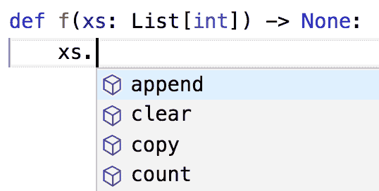

# 第二章：Python 速成课程

> 二十五年过去了，人们仍然对 Python 着迷，这让我难以置信。
> 
> 迈克尔·帕林

在 DataSciencester 的所有新员工都必须通过新员工入职培训，其中最有趣的部分是 Python 的速成课程。

这不是一篇全面的 Python 教程，而是旨在突出我们最关心的语言部分的部分（其中一些通常不是 Python 教程的重点）。如果你以前从未使用过 Python，你可能想要补充一些初学者教程。

# Python 之禅

Python 有一种有点禅意的[设计原则描述](http://legacy.python.org/dev/peps/pep-0020/)，你也可以在 Python 解释器内部通过输入“import this”来找到它。

其中最受讨论的之一是：

> 应该有一种——最好只有一种——明显的方法来做到这一点。

根据这种“显而易见”的方式编写的代码（这对于新手来说可能根本不明显）通常被描述为“Pythonic”。尽管这不是一本关于 Python 的书，我们偶尔会对比 Pythonic 和非 Pythonic 的解决方案，并且我们通常会倾向于使用 Pythonic 的解决方案来解决问题。

还有几个触及美学的：

> 美丽比丑陋好。显式优于隐式。简单优于复杂。

并代表我们在代码中努力追求的理想。

# 获取 Python

###### 注

由于安装说明可能会更改，而印刷书籍不能，因此关于如何安装 Python 的最新说明可以在[该书的 GitHub 仓库](https://github.com/joelgrus/data-science-from-scratch/blob/master/INSTALL.md)中找到。

如果这里打印的方法对你不起作用，请检查那些方法。

你可以从[Python.org](https://www.python.org/)下载 Python。但如果你还没有 Python，我建议你安装[Anaconda](https://www.anaconda.com/download/)发行版，它已经包含了你做数据科学所需的大多数库。

当我写《从零开始的数据科学》的第一版时，Python 2.7 仍然是大多数数据科学家首选的版本。因此，该书的第一版是基于 Python 2.7 的。

然而，在过去的几年里，几乎所有有份量的人都已经迁移到 Python 3。Python 的最新版本具有许多功能，使得编写清晰的代码更容易，并且我们将充分利用仅在 Python 3.6 或更高版本中可用的功能。这意味着你应该获得 Python 3.6 或更高版本。（此外，许多有用的库正在终止对 Python 2.7 的支持，这是切换的另一个原因。）

# 虚拟环境

从下一章开始，我们将使用 matplotlib 库生成图表和图形。这个库不是 Python 的核心部分；你必须自己安装它。每个数据科学项目都需要某些外部库的组合，有时候具体版本可能与你用于其他项目的版本不同。如果你只有一个 Python 安装，这些库可能会冲突并引起各种问题。

标准解决方案是使用*虚拟环境*，它们是沙箱化的 Python 环境，维护其自己版本的 Python 库（根据环境设置，还可能包括 Python 本身的版本）。

我建议你安装 Anaconda Python 发行版，因此在本节中我将解释 Anaconda 环境的工作原理。如果你不使用 Anaconda，可以使用内置的[`venv`](https://docs.python.org/3/library/venv.html)模块或安装[`virtualenv`](https://virtualenv.pypa.io/en/latest/)。在这种情况下，应遵循它们的说明。

要创建（Anaconda）虚拟环境，只需执行以下操作：

```py
# create a Python 3.6 environment named "dsfs"
conda create -n dsfs python=3.6
```

按照提示操作，你将拥有一个名为“dsfs”的虚拟环境，带有以下指令：

```py
#
# To activate this environment, use:
# > source activate dsfs
#
# To deactivate an active environment, use:
# > source deactivate
#
```

如指示的那样，你可以使用以下命令激活环境：

```py
source activate dsfs
```

此时，你的命令提示符应该更改以指示活动环境。在我的 MacBook 上，提示现在看起来像：

```py
(dsfs) ip-10-0-0-198:~ joelg$
```

只要此环境处于活动状态，你安装的任何库都将仅安装在 dsfs 环境中。完成本书后，继续进行自己的项目时，应为它们创建自己的环境。

现在你已经有了自己的环境，值得安装[IPython](http://ipython.org/)，这是一个功能齐全的 Python shell：

```py
python -m pip install ipython
```

###### 注意

Anaconda 带有自己的包管理器`conda`，但你也可以使用标准的 Python 包管理器`pip`，这是我们将要做的事情。

本书的其余部分假设你已经创建并激活了这样一个 Python 3.6 的虚拟环境（尽管你可以将其命名为任何你想要的名称），后续章节可能会依赖于我在早期章节中要求你安装的库。

作为良好纪律的一部分，你应该始终在虚拟环境中工作，而不是使用“基础”Python 安装。

# 空白格式化

许多语言使用大括号来界定代码块。Python 使用缩进：

```py
# The pound sign marks the start of a comment. Python itself
# ignores the comments, but they're helpful for anyone reading the code.
for i in [1, 2, 3, 4, 5]:
    print(i)                    # first line in "for i" block
    for j in [1, 2, 3, 4, 5]:
        print(j)                # first line in "for j" block
        print(i + j)            # last line in "for j" block
    print(i)                    # last line in "for i" block
print("done looping")
```

这使得 Python 代码非常易读，但这也意味着你必须非常注意你的格式。

###### 警告

程序员经常争论是否应该使用制表符（tabs）还是空格（spaces）进行缩进。对于许多语言来说，这并不是太重要；然而，Python 认为制表符和空格是不同的缩进方式，如果混合使用两者，你的代码将无法正常运行。在编写 Python 代码时，应始终使用空格，而不是制表符。（如果你在编辑器中编写代码，可以配置 Tab 键插入空格。）

圆括号和方括号内的空白会被忽略，这对于冗长的计算很有帮助：

```py
long_winded_computation = (1 + 2 + 3 + 4 + 5 + 6 + 7 + 8 + 9 + 10 + 11 + 12 +
                           13 + 14 + 15 + 16 + 17 + 18 + 19 + 20)
```

以及为了使代码更易于阅读：

```py
list_of_lists = [[1, 2, 3], [4, 5, 6], [7, 8, 9]]

easier_to_read_list_of_lists = [[1, 2, 3],
                                [4, 5, 6],
                                [7, 8, 9]]
```

你也可以使用反斜杠来指示语句在下一行继续，尽管我们很少这样做：

```py
two_plus_three = 2 + \
                 3
```

空白格式化的一个后果是，很难将代码复制粘贴到 Python shell 中。例如，如果你试图粘贴以下代码：

```py
for i in [1, 2, 3, 4, 5]:

    # notice the blank line
    print(i)
```

到普通的 Python shell 中，你会得到以下投诉：

```py
IndentationError: expected an indented block
```

因为解释器认为空白行表示`for`循环块的结束。

IPython 有一个名为 `%paste` 的魔法函数，它可以正确地粘贴你剪贴板上的任何内容，包括空白等。这已经是使用 IPython 的一个很好的理由。

# 模块

Python 的某些特性不会默认加载。这些特性既包括作为语言的一部分的功能，也包括你自己下载的第三方功能。为了使用这些特性，你需要`import`包含它们的模块。

一个方法是简单地`import`模块本身：

```py
import re
my_regex = re.compile("[0-9]+", re.I)
```

在这里，`re` 是包含用于处理正则表达式的函数和常量的模块。在这种类型的`import`之后，你必须使用`re.`前缀来访问这些函数。

如果你的代码中已经有了不同的`re`，你可以使用别名：

```py
import re as regex
my_regex = regex.compile("[0-9]+", regex.I)
```

如果你的模块名称过长或者你需要频繁输入它，你也可以这样做。例如，在使用 matplotlib 可视化数据时的标准约定是：

```py
import matplotlib.pyplot as plt

plt.plot(...)
```

如果你需要从一个模块中获取几个特定的值，你可以显式导入它们并在不需要限定的情况下使用它们：

```py
from collections import defaultdict, Counter
lookup = defaultdict(int)
my_counter = Counter()
```

如果你是个坏人，你可以将模块的整个内容导入到你的命名空间中，这可能会无意中覆盖你已定义的变量：

```py
match = 10
from re import *    # uh oh, re has a match function
print(match)        # "<function match at 0x10281e6a8>"
```

然而，由于你不是个坏人，你永远不会这样做。

# 函数

函数是一个规则，用于接收零个或多个输入，并返回相应的输出。在 Python 中，我们通常使用 `def` 来定义函数：

```py
def double(x):
    """
 This is where you put an optional docstring that explains what the
 function does. For example, this function multiplies its input by 2.
 """
    return x * 2
```

Python 函数是*一等公民*，这意味着我们可以将它们赋值给变量，并像任何其他参数一样传递给函数：

```py
def apply_to_one(f):
    """Calls the function f with 1 as its argument"""
    return f(1)

my_double = double             # refers to the previously defined function
x = apply_to_one(my_double)    # equals 2
```

创建短匿名函数或*lambda*也很容易：

```py
y = apply_to_one(lambda x: x + 4)      # equals 5
```

你可以将 lambda 表达式赋值给变量，尽管大多数人会告诉你应该使用`def`代替：

```py
another_double = lambda x: 2 * x       # don't do this

def another_double(x):
    """Do this instead"""
    return 2 * x
```

函数参数也可以给定默认参数，只有在需要其他值时才需要指定：

```py
def my_print(message = "my default message"):
    print(message)

my_print("hello")   # prints 'hello'
my_print()          # prints 'my default message'
```

有时候通过名称指定参数也是很有用的：

```py
def full_name(first = "What's-his-name", last = "Something"):
    return first + " " + last

full_name("Joel", "Grus")     # "Joel Grus"
full_name("Joel")             # "Joel Something"
full_name(last="Grus")        # "What's-his-name Grus"
```

我们将创建很多很多函数。

# 字符串

字符串可以用单引号或双引号括起来（但引号必须匹配）：

```py
single_quoted_string = 'data science'
double_quoted_string = "data science"
```

Python 使用反斜杠来编码特殊字符。例如：

```py
tab_string = "\t"       # represents the tab character
len(tab_string)         # is 1
```

如果你需要保留反斜杠作为反斜杠（例如在 Windows 目录名或正则表达式中），可以使用 `r""` 创建*原始*字符串：

```py
not_tab_string = r"\t"  # represents the characters '\' and 't'
len(not_tab_string)     # is 2
```

你可以使用三个双引号创建多行字符串：

```py
multi_line_string = """This is the first line.
and this is the second line
and this is the third line"""
```

Python 3.6 中的一个新特性是*f-string*，它提供了一种简单的方法来将值替换到字符串中。例如，如果我们有单独给出的名字和姓氏：

```py
first_name = "Joel"
last_name = "Grus"
```

我们可能希望将它们组合成一个完整的名字。有多种方法可以构建这样一个`full_name`字符串：

```py
full_name1 = first_name + " " + last_name             # string addition
full_name2 = "{0} {1}".format(first_name, last_name)  # string.format
```

但是*f-string*的方式要简单得多：

```py
full_name3 = f"{first_name} {last_name}"
```

并且我们将在整本书中更喜欢它。

# 异常

当出现问题时，Python 会引发一个*异常*。如果不加处理，异常会导致程序崩溃。你可以使用`try`和`except`来处理它们：

```py
try:
    print(0 / 0)
except ZeroDivisionError:
    print("cannot divide by zero")
```

尽管在许多语言中异常被认为是不好的，但在 Python 中使用它们来使代码更清晰是无可厚非的，有时我们会这样做。

# 列表

可能是 Python 中最基本的数据结构是*列表*，它只是一个有序集合（它类似于其他语言中可能被称为*数组*，但具有一些附加功能）：

```py
integer_list = [1, 2, 3]
heterogeneous_list = ["string", 0.1, True]
list_of_lists = [integer_list, heterogeneous_list, []]

list_length = len(integer_list)     # equals 3
list_sum    = sum(integer_list)     # equals 6
```

你可以使用方括号获取或设置列表的第*n*个元素：

```py
x = [0, 1, 2, 3, 4, 5, 6, 7, 8, 9]

zero = x[0]          # equals 0, lists are 0-indexed
one = x[1]           # equals 1
nine = x[-1]         # equals 9, 'Pythonic' for last element
eight = x[-2]        # equals 8, 'Pythonic' for next-to-last element
x[0] = -1            # now x is [-1, 1, 2, 3, ..., 9]
```

你还可以使用方括号*切片*列表。切片`i:j`表示从`i`（包含）到`j`（不包含）的所有元素。如果省略切片的开始，你将从列表的开头切片，如果省略切片的结尾，你将切片直到列表的末尾：

```py
first_three = x[:3]                 # [-1, 1, 2]
three_to_end = x[3:]                # [3, 4, ..., 9]
one_to_four = x[1:5]                # [1, 2, 3, 4]
last_three = x[-3:]                 # [7, 8, 9]
without_first_and_last = x[1:-1]    # [1, 2, ..., 8]
copy_of_x = x[:]                    # [-1, 1, 2, ..., 9]
```

你可以类似地切片字符串和其他“顺序”类型。

切片可以使用第三个参数来指示其*步长*，步长可以是负数：

```py
every_third = x[::3]                 # [-1, 3, 6, 9]
five_to_three = x[5:2:-1]            # [5, 4, 3]
```

Python 有一个`in`运算符来检查列表成员资格：

```py
1 in [1, 2, 3]    # True
0 in [1, 2, 3]    # False
```

这个检查涉及逐个检查列表的元素，这意味着除非你知道你的列表相当小（或者你不关心检查要花多长时间），否则你可能不应该使用它。

将列表连接在一起很容易。如果你想原地修改一个列表，你可以使用`extend`从另一个集合中添加项目：

```py
x = [1, 2, 3]
x.extend([4, 5, 6])     # x is now [1, 2, 3, 4, 5, 6]
```

如果你不想修改`x`，你可以使用列表加法：

```py
x = [1, 2, 3]
y = x + [4, 5, 6]       # y is [1, 2, 3, 4, 5, 6]; x is unchanged
```

更频繁地，我们将逐个项目附加到列表中：

```py
x = [1, 2, 3]
x.append(0)      # x is now [1, 2, 3, 0]
y = x[-1]        # equals 0
z = len(x)       # equals 4
```

当你知道列表包含多少元素时，*解包*列表通常很方便：

```py
x, y = [1, 2]    # now x is 1, y is 2
```

虽然如果两边的元素数量不相同，你将会得到一个`ValueError`。

一个常见的习惯用法是使用下划线表示你要丢弃的值：

```py
_, y = [1, 2]    # now y == 2, didn't care about the first element
```

# 元组

元组是列表的不可变表亲。几乎你可以对列表做的任何事情，只要不涉及修改它，你都可以对元组做。你可以使用圆括号（或什么都不使用）而不是方括号来指定一个元组：

```py
my_list = [1, 2]
my_tuple = (1, 2)
other_tuple = 3, 4
my_list[1] = 3      # my_list is now [1, 3]

try:
    my_tuple[1] = 3
except TypeError:
    print("cannot modify a tuple")
```

元组是从函数中返回多个值的一种便捷方式：

```py
def sum_and_product(x, y):
    return (x + y), (x * y)

sp = sum_and_product(2, 3)     # sp is (5, 6)
s, p = sum_and_product(5, 10)  # s is 15, p is 50
```

元组（和列表）也可以用于*多重赋值*：

```py
x, y = 1, 2     # now x is 1, y is 2
x, y = y, x     # Pythonic way to swap variables; now x is 2, y is 1
```

# 字典

另一个基本的数据结构是字典，它将*值*与*键*关联起来，并允许您快速检索与给定键对应的值：

```py
empty_dict = {}                     # Pythonic
empty_dict2 = dict()                # less Pythonic
grades = {"Joel": 80, "Tim": 95}    # dictionary literal
```

你可以使用方括号查找键的值：

```py
joels_grade = grades["Joel"]        # equals 80
```

但是如果你要求一个字典中不存在的键，你将得到一个`KeyError`：

```py
try:
    kates_grade = grades["Kate"]
except KeyError:
    print("no grade for Kate!")
```

你可以使用`in`来检查键的存在：

```py
joel_has_grade = "Joel" in grades     # True
kate_has_grade = "Kate" in grades     # False
```

即使对于大字典来说，这种成员检查也很快。

字典有一个 `get` 方法，在查找不在字典中的键时返回默认值（而不是引发异常）：

```py
joels_grade = grades.get("Joel", 0)   # equals 80
kates_grade = grades.get("Kate", 0)   # equals 0
no_ones_grade = grades.get("No One")  # default is None
```

你可以使用相同的方括号分配键/值对：

```py
grades["Tim"] = 99                    # replaces the old value
grades["Kate"] = 100                  # adds a third entry
num_students = len(grades)            # equals 3
```

正如你在第一章看到的，你可以使用字典来表示结构化数据：

```py
tweet = {
    "user" : "joelgrus",
    "text" : "Data Science is Awesome",
    "retweet_count" : 100,
    "hashtags" : ["#data", "#science", "#datascience", "#awesome", "#yolo"]
}
```

虽然我们很快会看到一种更好的方法。

除了查找特定键外，我们还可以查看所有键：

```py
tweet_keys   = tweet.keys()     # iterable for the keys
tweet_values = tweet.values()   # iterable for the values
tweet_items  = tweet.items()    # iterable for the (key, value) tuples

"user" in tweet_keys            # True, but not Pythonic
"user" in tweet                 # Pythonic way of checking for keys
"joelgrus" in tweet_values      # True (slow but the only way to check)
```

字典的键必须是“可哈希的”；特别是，你不能使用列表作为键。如果你需要一个多部分键，你可能应该使用元组或想出一种方法将键转换为字符串。

## defaultdict

想象一下，你正在尝试计算文档中的单词数。一个明显的方法是创建一个字典，其中键是单词，值是计数。当你检查每个单词时，如果它已经在字典中，你可以增加它的计数，如果它不在字典中，你可以将其添加到字典中：

```py
word_counts = {}
for word in document:
    if word in word_counts:
        word_counts[word] += 1
    else:
        word_counts[word] = 1
```

你也可以采用“宁可原谅，也不要求许可”的方法，只需处理尝试查找缺失键时引发的异常：

```py
word_counts = {}
for word in document:
    try:
        word_counts[word] += 1
    except KeyError:
        word_counts[word] = 1
```

第三种方法是使用 `get`，它对于缺失的键行为优雅：

```py
word_counts = {}
for word in document:
    previous_count = word_counts.get(word, 0)
    word_counts[word] = previous_count + 1
```

每一个这些都稍微笨拙，这就是为什么 `defaultdict` 是有用的。`defaultdict` 类似于普通字典，但是当你尝试查找它不包含的键时，它会首先使用你创建时提供的零参数函数为其添加一个值。为了使用 `defaultdict`，你必须从 `collections` 导入它们：

```py
from collections import defaultdict

word_counts = defaultdict(int)          # int() produces 0
for word in document:
    word_counts[word] += 1
```

它们在处理 `list` 或 `dict` 甚至是你自己的函数时也很有用：

```py
dd_list = defaultdict(list)             # list() produces an empty list
dd_list[2].append(1)                    # now dd_list contains {2: [1]}

dd_dict = defaultdict(dict)             # dict() produces an empty dict
dd_dict["Joel"]["City"] = "Seattle"     # {"Joel" : {"City": Seattle"}}

dd_pair = defaultdict(lambda: [0, 0])
dd_pair[2][1] = 1                       # now dd_pair contains {2: [0, 1]}
```

当我们使用字典以某个键“收集”结果时，并且不想每次都检查键是否已存在时，这些方法将非常有用。

# 计数器

一个 `Counter` 将一系列值转换为类似于 `defaultdict(int)` 的对象，将键映射到计数：

```py
from collections import Counter
c = Counter([0, 1, 2, 0])          # c is (basically) {0: 2, 1: 1, 2: 1}
```

这为我们提供了一个解决 `word_counts` 问题的非常简单的方法：

```py
# recall, document is a list of words
word_counts = Counter(document)
```

`Counter` 实例有一个经常有用的 `most_common` 方法：

```py
# print the 10 most common words and their counts
for word, count in word_counts.most_common(10):
    print(word, count)
```

# 集合（sets）

另一个有用的数据结构是集合，它表示一组 *不同* 的元素。你可以通过在大括号之间列出其元素来定义一个集合：

```py
primes_below_10 = {2, 3, 5, 7}
```

然而，对于空的 `set`，这并不适用，因为 `{}` 已经表示“空 `dict`”。在这种情况下，你需要使用 `set()` 本身：

```py
s = set()
s.add(1)       # s is now {1}
s.add(2)       # s is now {1, 2}
s.add(2)       # s is still {1, 2}
x = len(s)     # equals 2
y = 2 in s     # equals True
z = 3 in s     # equals False
```

我们会出于两个主要原因使用集合。首先，`in` 在集合上是一个非常快的操作。如果我们有一个大量项目的集合，我们想用于成员测试，那么集合比列表更合适：

```py
stopwords_list = ["a", "an", "at"] + hundreds_of_other_words + ["yet", "you"]

"zip" in stopwords_list     # False, but have to check every element

stopwords_set = set(stopwords_list)
"zip" in stopwords_set      # very fast to check
```

第二个原因是在集合中找到 *不同* 的项：

```py
item_list = [1, 2, 3, 1, 2, 3]
num_items = len(item_list)                # 6
item_set = set(item_list)                 # {1, 2, 3}
num_distinct_items = len(item_set)        # 3
distinct_item_list = list(item_set)       # [1, 2, 3]
```

我们会比较少使用集合（sets），相对于字典和列表来说。

# 控制流程

就像大多数编程语言一样，你可以使用 `if` 有条件地执行一个操作：

```py
if 1 > 2:
    message = "if only 1 were greater than two..."
elif 1 > 3:
    message = "elif stands for 'else if'"
else:
    message = "when all else fails use else (if you want to)"
```

你也可以在一行上写一个 *三元* if-then-else，我们偶尔会这样做：

```py
parity = "even" if x % 2 == 0 else "odd"
```

Python 有一个 `while` 循环：

```py
x = 0
while x < 10:
    print(f"{x} is less than 10")
    x += 1
```

虽然更多时我们会使用 `for` 和 `in`：

```py
# range(10) is the numbers 0, 1, ..., 9
for x in range(10):
    print(f"{x} is less than 10")
```

如果你需要更复杂的逻辑，可以使用 `continue` 和 `break`：

```py
for x in range(10):
    if x == 3:
        continue  # go immediately to the next iteration
    if x == 5:
        break     # quit the loop entirely
    print(x)
```

这将打印`0`、`1`、`2`和`4`。

# 真值

Python 中的布尔值与大多数其他语言的工作方式相同，只是它们大写了起来。

```py
one_is_less_than_two = 1 < 2          # equals True
true_equals_false = True == False     # equals False
```

Python 使用值`None`来表示不存在的值。它类似于其他语言的`null`：

```py
x = None
assert x == None, "this is the not the Pythonic way to check for None"
assert x is None, "this is the Pythonic way to check for None"
```

Python 允许你在期望布尔值的地方使用任何值。以下值都是“假”的：

+   `False`

+   `None`

+   `[]`（一个空的`list`）

+   `{}`（一个空的`dict`）

+   `""`

+   `set()`

+   `0`

+   `0.0`

几乎任何其他东西都会被视为“真”。这使你可以轻松地使用`if`语句来测试空列表、空字符串、空字典等。但如果你没有预料到这种行为，有时会导致棘手的错误：

```py
s = some_function_that_returns_a_string()
if s:
    first_char = s[0]
else:
    first_char = ""
```

这样做的一种更简短（但可能更令人困惑）的方法是：

```py
first_char = s and s[0]
```

因为`and`在第一个值为“真”时返回第二个值，在第一个值不为“真”时返回第一个值。类似地，如果`x`是一个数字或可能是`None`：

```py
safe_x = x or 0
```

显然是一个数字，尽管：

```py
safe_x = x if x is not None else 0
```

可能更易读。

Python 有一个`all`函数，它接受一个可迭代对象，在每个元素都为真时返回`True`，还有一个`any`函数，当至少一个元素为真时返回`True`：

```py
all([True, 1, {3}])   # True, all are truthy
all([True, 1, {}])    # False, {} is falsy
any([True, 1, {}])    # True, True is truthy
all([])               # True, no falsy elements in the list
any([])               # False, no truthy elements in the list
```

# 排序

每个 Python 列表都有一个`sort`方法，它会原地对列表进行排序。如果你不想改变你的列表，可以使用`sorted`函数，它会返回一个新的列表：

```py
x = [4, 1, 2, 3]
y = sorted(x)     # y is [1, 2, 3, 4], x is unchanged
x.sort()          # now x is [1, 2, 3, 4]
```

默认情况下，`sort`（和`sorted`）根据简单地比较元素之间的结果将列表从最小到最大排序。

如果你想要将元素按从大到小的顺序排序，可以指定一个`reverse=True`参数。而且你可以使用`key`指定的函数的结果来比较元素本身而不是比较元素本身：

```py
# sort the list by absolute value from largest to smallest
x = sorted([-4, 1, -2, 3], key=abs, reverse=True)  # is [-4, 3, -2, 1]

# sort the words and counts from highest count to lowest
wc = sorted(word_counts.items(),
            key=lambda word_and_count: word_and_count[1],
            reverse=True)
```

# 列表推导

经常情况下，你可能希望通过选择特定的元素、转换元素或两者兼而有之来将一个列表转换为另一个列表。在 Python 中，实现这一点的方式是使用*列表推导*：

```py
even_numbers = [x for x in range(5) if x % 2 == 0]  # [0, 2, 4]
squares      = [x * x for x in range(5)]            # [0, 1, 4, 9, 16]
even_squares = [x * x for x in even_numbers]        # [0, 4, 16]
```

你可以类似地将列表转换为字典或集合：

```py
square_dict = {x: x * x for x in range(5)}  # {0: 0, 1: 1, 2: 4, 3: 9, 4: 16}
square_set  = {x * x for x in [1, -1]}      # {1}
```

如果你不需要列表中的值，使用下划线作为变量名是很常见的：

```py
zeros = [0 for _ in even_numbers]      # has the same length as even_numbers
```

列表推导可以包含多个`for`：

```py
pairs = [(x, y)
         for x in range(10)
         for y in range(10)]   # 100 pairs (0,0) (0,1) ... (9,8), (9,9)
```

以后的`for`循环可以使用先前的结果：

```py
increasing_pairs = [(x, y)                       # only pairs with x < y,
                    for x in range(10)           # range(lo, hi) equals
                    for y in range(x + 1, 10)]   # [lo, lo + 1, ..., hi - 1]
```

我们会经常使用列表推导。

# 自动化测试和断言

作为数据科学家，我们会写很多代码。我们如何确保我们的代码是正确的？一种方法是使用*类型*（稍后讨论），另一种方法是使用*自动化测试*。

有复杂的框架用于编写和运行测试，但在本书中，我们将限制使用`assert`语句，如果指定的条件不为真，将导致你的代码引发`AssertionError`：

```py
assert 1 + 1 == 2
assert 1 + 1 == 2, "1 + 1 should equal 2 but didn't"
```

正如你在第二种情况中看到的那样，你可以选择添加一条消息，如果断言失败，该消息将被打印。

断言 1 + 1 = 2 并不特别有趣。更有趣的是断言你编写的函数是否符合你的预期：

```py
def smallest_item(xs):
    return min(xs)

assert smallest_item([10, 20, 5, 40]) == 5
assert smallest_item([1, 0, -1, 2]) == -1
```

在整本书中，我们会这样使用`assert`。这是一个良好的实践，我强烈鼓励你在自己的代码中大量使用它。（如果你在 GitHub 上查看书中的代码，你会发现它包含比书中打印出来的更多`assert`语句。这有助于*我*确信我为你编写的代码是正确的。）

另一个不太常见的用法是对函数的输入进行断言：

```py
def smallest_item(xs):
    assert xs, "empty list has no smallest item"
    return min(xs)
```

我们偶尔会这样做，但更常见的是我们会使用`assert`来检查我们的代码是否正确。

# 面向对象编程

像许多语言一样，Python 允许您定义*类*，封装数据和操作数据的函数。我们有时会使用它们来使我们的代码更清晰简单。最简单的方法可能是通过构造一个带有详细注释的示例来解释它们。

在这里，我们将构造一个代表“计数点击器”的类，这种点击器用于跟踪参加“数据科学高级主题”聚会的人数。

它维护一个`count`，可以通过`click`增加计数，允许您`read_count`，并可以通过`reset`重置为零。（在现实生活中，其中一个从 9999 滚动到 0000，但我们不会费心去处理。）

要定义一个类，您使用`class`关键字和 PascalCase 名称：

```py
class CountingClicker:
    """A class can/should have a docstring, just like a function"""
```

类包含零个或多个*成员*函数。按照惯例，每个函数都有一个名为`self`的第一个参数，它引用特定的类实例。

通常，类具有一个名为`__init__`的构造函数。它接受构造类实例所需的任何参数，并执行你需要的任何设置：

```py
    def __init__(self, count = 0):
        self.count = count
```

尽管构造函数有一个有趣的名字，我们只使用类名来构造点击器的实例：

```py
clicker1 = CountingClicker()           # initialized to 0
clicker2 = CountingClicker(100)        # starts with count=100
clicker3 = CountingClicker(count=100)  # more explicit way of doing the same
```

注意，`__init__`方法名称以双下划线开头和结尾。这些“魔术”方法有时被称为“dunder”方法（double-UNDERscore，明白了吗？）并代表“特殊”行为。

###### 注意

方法名以下划线开头的类方法，按照惯例被认为是“私有”的，类的用户不应直接调用它们。然而，Python 不会*阻止*用户调用它们。

另一个这样的方法是`__repr__`，它生成类实例的字符串表示：

```py
    def __repr__(self):
        return f"CountingClicker(count={self.count})"
```

最后，我们需要实现类的*公共 API*：

```py
    def click(self, num_times = 1):
        """Click the clicker some number of times."""
        self.count += num_times

    def read(self):
        return self.count

    def reset(self):
        self.count = 0
```

定义好后，让我们使用`assert`为我们的点击器编写一些测试案例：

```py
clicker = CountingClicker()
assert clicker.read() == 0, "clicker should start with count 0"
clicker.click()
clicker.click()
assert clicker.read() == 2, "after two clicks, clicker should have count 2"
clicker.reset()
assert clicker.read() == 0, "after reset, clicker should be back to 0"
```

像这样编写测试有助于我们确信我们的代码按设计方式运行，并且在我们对其进行更改时仍然保持如此。

我们偶尔会创建*子类*，从父类继承一些功能。例如，我们可以通过使用`CountingClicker`作为基类，并重写`reset`方法什么也不做，来创建一个不可重置的点击器：

```py
# A subclass inherits all the behavior of its parent class.
class NoResetClicker(CountingClicker):
    # This class has all the same methods as CountingClicker

    # Except that it has a reset method that does nothing.
    def reset(self):
        pass

clicker2 = NoResetClicker()
assert clicker2.read() == 0
clicker2.click()
assert clicker2.read() == 1
clicker2.reset()
assert clicker2.read() == 1, "reset shouldn't do anything"
```

# 可迭代对象和生成器

列表的一个好处是你可以通过它们的索引检索特定元素。但你并不总是需要这样做！一个包含十亿个数字的列表会占用大量内存。如果你只想逐个获取元素，那么没有必要将它们全部保存下来。如果你最终只需要前几个元素，生成整个十亿个元素是极其浪费的。

通常我们只需要使用 `for` 和 `in` 迭代集合。在这种情况下，我们可以创建*生成器*，它们可以像列表一样被迭代，但是在需要时会惰性地生成它们的值。

创建生成器的一种方式是使用函数和 `yield` 运算符：

```py
def generate_range(n):
    i = 0
    while i < n:
        yield i   # every call to yield produces a value of the generator
        i += 1
```

以下循环将逐个消耗 `yield` 出的值，直到没有剩余值为止：

```py
for i in generate_range(10):
    print(f"i: {i}")
```

（事实上，`range` 本身也是惰性的，所以这样做没有意义。）

使用生成器，甚至可以创建一个无限序列：

```py
def natural_numbers():
    """returns 1, 2, 3, ..."""
    n = 1
    while True:
        yield n
        n += 1
```

尽管你可能不应该在没有使用某种 `break` 逻辑的情况下迭代它。

###### 提示

惰性的另一面是，你只能对生成器进行一次迭代。如果你需要多次迭代某个东西，你需要每次重新创建生成器，或者使用一个列表。如果生成值很昂贵，那么使用列表可能是个好理由。

创建生成器的第二种方式是使用 `for` 推导式，用括号括起来：

```py
evens_below_20 = (i for i in generate_range(20) if i % 2 == 0)
```

这样的“生成器推导式”在你迭代它（使用`for`或`next`）之前不会执行任何操作。我们可以利用这一点构建复杂的数据处理流水线：

```py
# None of these computations *does* anything until we iterate
data = natural_numbers()
evens = (x for x in data if x % 2 == 0)
even_squares = (x ** 2 for x in evens)
even_squares_ending_in_six = (x for x in even_squares if x % 10 == 6)
# and so on
```

在我们迭代列表或生成器时，经常会需要不仅值而且它们的索引。为了这种常见情况，Python 提供了一个 `enumerate` 函数，它将值转换为 `(index, value)` 对：

```py
names = ["Alice", "Bob", "Charlie", "Debbie"]

# not Pythonic
for i in range(len(names)):
    print(f"name {i} is {names[i]}")

# also not Pythonic
i = 0
for name in names:
    print(f"name {i} is {names[i]}")
    i += 1

# Pythonic
for i, name in enumerate(names):
    print(f"name {i} is {name}")
```

我们会经常使用到这个。

# 随机性

当我们学习数据科学时，我们经常需要生成随机数，这可以通过 `random` 模块来实现：

```py
import random
random.seed(10)  # this ensures we get the same results every time

four_uniform_randoms = [random.random() for _ in range(4)]

# [0.5714025946899135,       # random.random() produces numbers
#  0.4288890546751146,       # uniformly between 0 and 1.
#  0.5780913011344704,       # It's the random function we'll use
#  0.20609823213950174]      # most often.
```

`random` 模块实际上产生*伪随机*（即确定性）数，其基于一个你可以用 `random.seed` 设置的内部状态，如果你想要可重复的结果：

```py
random.seed(10)         # set the seed to 10
print(random.random())  # 0.57140259469
random.seed(10)         # reset the seed to 10
print(random.random())  # 0.57140259469 again
```

我们有时会使用 `random.randrange`，它接受一个或两个参数，并从相应的`range`中随机选择一个元素：

```py
random.randrange(10)    # choose randomly from range(10) = [0, 1, ..., 9]
random.randrange(3, 6)  # choose randomly from range(3, 6) = [3, 4, 5]
```

还有一些方法，我们有时会发现很方便。例如，`random.shuffle` 随机重新排列列表的元素：

```py
up_to_ten = [1, 2, 3, 4, 5, 6, 7, 8, 9, 10]
random.shuffle(up_to_ten)
print(up_to_ten)
# [7, 2, 6, 8, 9, 4, 10, 1, 3, 5]   (your results will probably be different)
```

如果你需要从列表中随机选择一个元素，你可以使用 `random.choice`：

```py
my_best_friend = random.choice(["Alice", "Bob", "Charlie"])     # "Bob" for me
```

如果你需要无重复地随机选择一组元素（即，没有重复），你可以使用 `random.sample`：

```py
lottery_numbers = range(60)
winning_numbers = random.sample(lottery_numbers, 6)  # [16, 36, 10, 6, 25, 9]
```

要选择一个带有*替换*（即允许重复）的元素样本，你可以多次调用 `random.choice`：

```py
four_with_replacement = [random.choice(range(10)) for _ in range(4)]
print(four_with_replacement)  # [9, 4, 4, 2]
```

# 正则表达式

正则表达式提供了一种搜索文本的方式。它们非常有用，但也相当复杂——以至于整本书都可以写关于它们的详细内容。我们会在遇到它们的几次机会中深入了解它们的细节；以下是如何在 Python 中使用它们的几个示例：

```py
import re

re_examples = [                        # All of these are True, because
    not re.match("a", "cat"),              #  'cat' doesn't start with 'a'
    re.search("a", "cat"),                 #  'cat' has an 'a' in it
    not re.search("c", "dog"),             #  'dog' doesn't have a 'c' in it.
    3 == len(re.split("[ab]", "carbs")),   #  Split on a or b to ['c','r','s'].
    "R-D-" == re.sub("[0-9]", "-", "R2D2") #  Replace digits with dashes.
    ]

assert all(re_examples), "all the regex examples should be True"
```

重要的一点是，`re.match` 检查字符串的 *开头* 是否与正则表达式匹配，而 `re.search` 则检查字符串的 *任何部分* 是否与正则表达式匹配。你迟早会搞混它们，并因此而苦恼。

官方文档提供了更详细的信息，可以参考 [official documentation](https://docs.python.org/3/library/re.html)。

# 函数式编程

###### 注意

本书的第一版在此处介绍了 Python 函数 `partial`、`map`、`reduce` 和 `filter`。在我追求真理的过程中，我意识到最好避免使用这些函数，并且书中它们的用法已被列表推导式、`for` 循环和其他更具 Python 风格的结构所取代。

# zip 和 参数解包

我们经常需要将两个或更多的可迭代对象 *zip* 在一起。`zip` 函数将多个可迭代对象转换为一个由相应函数的元组组成的单一可迭代对象：

```py
list1 = ['a', 'b', 'c']
list2 = [1, 2, 3]

# zip is lazy, so you have to do something like the following
[pair for pair in zip(list1, list2)]    # is [('a', 1), ('b', 2), ('c', 3)]
```

如果列表长度不同，`zip` 会在第一个列表结束时停止。

你也可以使用一个奇怪的技巧来“解压缩”列表：

```py
pairs = [('a', 1), ('b', 2), ('c', 3)]
letters, numbers = zip(*pairs)
```

星号 (`*`) 执行 *参数解包*，它使用 `pairs` 的元素作为 `zip` 的单独参数。最终效果与你直接调用时一样：

```py
letters, numbers = zip(('a', 1), ('b', 2), ('c', 3))
```

您可以将参数解包与任何函数一起使用：

```py
def add(a, b): return a + b

add(1, 2)      # returns 3
try:
    add([1, 2])
except TypeError:
    print("add expects two inputs")
add(*[1, 2])   # returns 3
```

很少会发现这很有用，但当我们需要时，这是一个很好的技巧。

# args 和 kwargs

假设我们想创建一个接受某些函数 `f` 作为输入并返回一个新函数的高阶函数，对于任何输入，它返回 `f` 的值的两倍：

```py
def doubler(f):
    # Here we define a new function that keeps a reference to f
    def g(x):
        return 2 * f(x)

    # And return that new function
    return g
```

这在某些情况下有效：

```py
def f1(x):
    return x + 1

g = doubler(f1)
assert g(3) == 8,  "(3 + 1) * 2 should equal 8"
assert g(-1) == 0, "(-1 + 1) * 2 should equal 0"
```

但是，它不能与接受多个参数的函数一起工作：

```py
def f2(x, y):
    return x + y

g = doubler(f2)
try:
    g(1, 2)
except TypeError:
    print("as defined, g only takes one argument")
```

我们需要一种方法来指定一个接受任意参数的函数。我们可以通过参数解包和一点点魔法来实现这一点：

```py
def magic(*args, **kwargs):
    print("unnamed args:", args)
    print("keyword args:", kwargs)

magic(1, 2, key="word", key2="word2")

# prints
#  unnamed args: (1, 2)
#  keyword args: {'key': 'word', 'key2': 'word2'}
```

换句话说，当我们像这样定义一个函数时，`args` 是它的未命名参数的元组，而 `kwargs` 是它的命名参数的字典。它也可以反过来使用，如果您想使用一个列表（或元组）和字典来 *提供* 函数的参数：

```py
def other_way_magic(x, y, z):
    return x + y + z

x_y_list = [1, 2]
z_dict = {"z": 3}
assert other_way_magic(*x_y_list, **z_dict) == 6, "1 + 2 + 3 should be 6"
```

使用这个，您可以做各种奇怪的技巧；我们只会用它来生成接受任意参数的高阶函数：

```py
def doubler_correct(f):
    """works no matter what kind of inputs f expects"""
    def g(*args, **kwargs):
        """whatever arguments g is supplied, pass them through to f"""
        return 2 * f(*args, **kwargs)
    return g

g = doubler_correct(f2)
assert g(1, 2) == 6, "doubler should work now"
```

作为一般规则，如果你明确说明函数需要什么样的参数，你的代码将更加正确和可读；因此，只有在没有其他选择时我们才会使用 `args` 和 `kwargs`。

# 类型注解

Python 是一种 *动态类型* 语言。这意味着它一般不关心我们使用的对象的类型，只要我们以有效的方式使用它们即可：

```py
def add(a, b):
    return a + b

assert add(10, 5) == 15,                  "+ is valid for numbers"
assert add([1, 2], [3]) == [1, 2, 3],     "+ is valid for lists"
assert add("hi ", "there") == "hi there", "+ is valid for strings"

try:
    add(10, "five")
except TypeError:
    print("cannot add an int to a string")
```

而在 *静态类型* 语言中，我们的函数和对象会有特定的类型：

```py
def add(a: int, b: int) -> int:
    return a + b

add(10, 5)           # you'd like this to be OK
add("hi ", "there")  # you'd like this to be not OK
```

实际上，最近的 Python 版本确实（某种程度上）具有这种功能。带有 `int` 类型注释的前一版本在 Python 3.6 中是有效的！

然而，这些类型注释实际上并不会*执行*任何操作。您仍然可以使用带有注释的 `add` 函数来添加字符串，调用 `add(10, "five")` 仍然会引发完全相同的 `TypeError`。

尽管如此，在您的 Python 代码中仍然有（至少）四个好理由使用类型注释：

+   类型是重要的文档形式。在这本书中，代码用于教授您理论和数学概念，这一点尤为重要。比较以下两个函数桩代码：

    ```py
    def dot_product(x, y): ...

    # we have not yet defined Vector, but imagine we had
    def dot_product(x: Vector, y: Vector) -> float: ...
    ```

    我发现第二种方法更加信息丰富；希望您也这样认为。（到此为止，我已经习惯了类型提示，现在发现未经类型标注的 Python 代码难以阅读。）

+   有一些外部工具（最流行的是 `mypy`）可以读取您的代码，检查类型注释，并在您运行代码之前通知您有关类型错误。例如，如果您运行 `mypy` 并包含 `add("hi ", "there")` 的文件，它会警告您：

    ```py
    error: Argument 1 to "add" has incompatible type "str"; expected "int"
    ```

    类似于 `assert` 测试，这是发现代码错误的好方法，而不需要运行它。本书的叙述不涉及这样的类型检查器；然而，在幕后，我将运行一个，这将有助于确保书本身是正确的。

+   不得不考虑代码中的类型强制您设计更清晰的函数和接口：

    ```py
    from typing import Union

    def secretly_ugly_function(value, operation): ...

    def ugly_function(value: int,
                      operation: Union[str, int, float, bool]) -> int:
        ...
    ```

    这里我们有一个函数，其 `operation` 参数可以是 `string`、`int`、`float` 或 `bool`。很可能这个函数很脆弱且难以使用，但是当类型明确时，它变得更加清晰。这样做将迫使我们以更少的笨拙方式进行设计，用户会因此受益。

+   使用类型允许您的编辑器帮助您完成诸如自动完成（图 2-1）之类的事情，并且可以在类型错误时发出警告。



###### 图 2-1\. VSCode，但可能您的编辑器也是如此。

有时候人们坚持认为类型提示可能对大型项目有价值，但对于小型项目来说不值得花费时间。然而，由于类型提示几乎不需要额外的输入时间，并且允许您的编辑器节省时间，因此我认为它们实际上可以让您更快地编写代码，即使是对于小型项目也是如此。

出于所有这些原因，本书其余部分的所有代码都将使用类型注释。我预计一些读者可能对使用类型注释感到不满意；然而，我认为到本书结束时，他们的想法会改变。

## 如何编写类型注释

正如我们所见，对于像 `int`、`bool` 和 `float` 这样的内置类型，您只需使用类型本身作为注释。如果您有（比如）一个 `list` 呢？

```py
def total(xs: list) -> float:
    return sum(total)
```

这不是错误，但类型不够具体。显然我们真正想要的是 `xs` 是 `floats` 的 `list`，而不是（比如）字符串的 `list`。

`typing` 模块提供了许多参数化类型，我们可以使用它们来做这件事：

```py
from typing import List  # note capital L

def total(xs: List[float]) -> float:
    return sum(total)
```

到目前为止，我们只为函数参数和返回类型指定了注解。对于变量本身来说，通常很明显它们的类型是什么：

```py
# This is how to type-annotate variables when you define them.
# But this is unnecessary; it's "obvious" x is an int.
x: int = 5
```

但有时候并不明显：

```py
values = []         # what's my type?
best_so_far = None  # what's my type?
```

在这种情况下，我们将提供内联类型提示：

```py
from typing import Optional

values: List[int] = []
best_so_far: Optional[float] = None  # allowed to be either a float or None
```

`typing` 模块包含许多其他类型，我们可能只会用到其中的几种：

```py
# the type annotations in this snippet are all unnecessary
from typing import Dict, Iterable, Tuple

# keys are strings, values are ints
counts: Dict[str, int] = {'data': 1, 'science': 2}

# lists and generators are both iterable
if lazy:
    evens: Iterable[int] = (x for x in range(10) if x % 2 == 0)
else:
    evens = [0, 2, 4, 6, 8]

# tuples specify a type for each element
triple: Tuple[int, float, int] = (10, 2.3, 5)
```

最后，由于 Python 拥有头等函数，我们需要一个类型来表示这些。这里有一个相当牵强的例子：

```py
from typing import Callable

# The type hint says that repeater is a function that takes
# two arguments, a string and an int, and returns a string.
def twice(repeater: Callable[[str, int], str], s: str) -> str:
    return repeater(s, 2)

def comma_repeater(s: str, n: int) -> str:
    n_copies = [s for _ in range(n)]
    return ', '.join(n_copies)

assert twice(comma_repeater, "type hints") == "type hints, type hints"
```

由于类型注解只是 Python 对象，我们可以将它们分配给变量，以便更容易引用它们：

```py
Number = int
Numbers = List[Number]

def total(xs: Numbers) -> Number:
    return sum(xs)
```

当你读完本书时，你将非常熟悉读写类型注解，希望你会在自己的代码中使用它们。

# 欢迎来到 DataSciencester！

这就结束了新员工的入职培训。哦，还有：尽量不要贪污任何东西。

# 进一步探索

+   世界上没有缺少 Python 教程。[官方教程](https://docs.python.org/3/tutorial/) 不是一个坏的起点。

+   [官方 IPython 教程](http://ipython.readthedocs.io/en/stable/interactive/index.html) 将帮助您开始使用 IPython，如果您决定使用它。请使用它。

+   [`mypy` 文档](https://mypy.readthedocs.io/en/stable/) 将告诉你关于 Python 类型注解和类型检查的一切，甚至超出了你想知道的范围。
