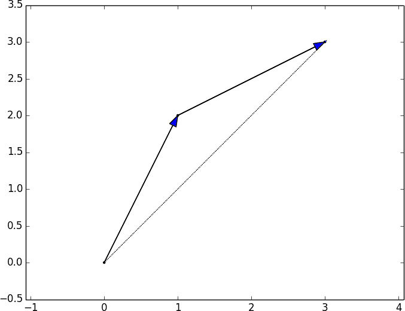
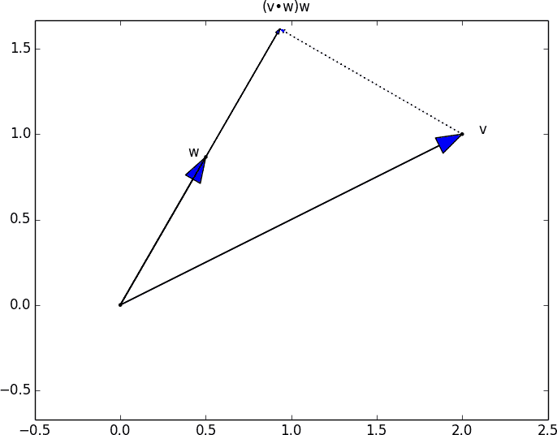

# 第四章：线性代数

> 还有比代数更无用或更少有用的东西吗？
> 
> 比利·康诺利

线性代数是处理*向量空间*的数学分支。虽然我不能指望在简短的章节中教给您线性代数，但它是许多数据科学概念和技术的基础，这意味着我至少应该尝试一下。我们在本章学到的内容将在本书的其余部分中广泛使用。

# 向量

抽象地说，*向量*是可以相加以形成新向量的对象，并且可以乘以*标量*（即数字），也可以形成新向量。

具体来说（对于我们而言），向量是某个有限维空间中的点。尽管您可能不认为自己的数据是向量，但它们通常是表示数值数据的有用方式。

例如，如果您有许多人的身高、体重和年龄数据，您可以将您的数据视为三维向量`[height, weight, age]`。如果您正在教授一个有四次考试的班级，您可以将学生的成绩视为四维向量`[exam1, exam2, exam3, exam4]`。

从头开始的最简单方法是将向量表示为数字列表。三个数字的列表对应于三维空间中的一个向量，反之亦然。

我们将通过一个类型别名来实现，即 `Vector` 只是 `float` 的 `list`：

```py
from typing import List

Vector = List[float]

height_weight_age = [70,  # inches,
                     170, # pounds,
                     40 ] # years

grades = [95,   # exam1
          80,   # exam2
          75,   # exam3
          62 ]  # exam4
```

我们还希望在向量上执行*算术运算*。因为 Python 的 `list` 不是向量（因此不提供向量算术的工具），我们需要自己构建这些算术工具。所以让我们从这里开始。

首先，我们经常需要添加两个向量。向量是*分量相加*的。这意味着如果两个向量`v`和`w`长度相同，则它们的和就是一个向量，其第一个元素是`v[0] + w[0]`，第二个元素是`v[1] + w[1]`，依此类推。（如果它们长度不同，则不允许将它们相加。）

例如，将向量 `[1, 2]` 和 `[2, 1]` 相加的结果是 `[1 + 2, 2 + 1]` 或 `[3, 3]`，如图 4-1 所示。



###### 图 4-1\. 添加两个向量

我们可以通过使用 `zip` 将向量一起并使用列表推导来添加相应元素来轻松实现这一点：

```py
def add(v: Vector, w: Vector) -> Vector:
    """Adds corresponding elements"""
    assert len(v) == len(w), "vectors must be the same length"

    return [v_i + w_i for v_i, w_i in zip(v, w)]

assert add([1, 2, 3], [4, 5, 6]) == [5, 7, 9]
```

类似地，要减去两个向量，我们只需减去相应的元素：

```py
def subtract(v: Vector, w: Vector) -> Vector:
    """Subtracts corresponding elements"""
    assert len(v) == len(w), "vectors must be the same length"

    return [v_i - w_i for v_i, w_i in zip(v, w)]

assert subtract([5, 7, 9], [4, 5, 6]) == [1, 2, 3]
```

我们有时还希望对向量列表进行分量求和，即创建一个新向量，其第一个元素是所有第一个元素的和，第二个元素是所有第二个元素的和，依此类推：

```py
def vector_sum(vectors: List[Vector]) -> Vector:
    """Sums all corresponding elements"""
    # Check that vectors is not empty
    assert vectors, "no vectors provided!"

    # Check the vectors are all the same size
    num_elements = len(vectors[0])
    assert all(len(v) == num_elements for v in vectors), "different sizes!"

    # the i-th element of the result is the sum of every vector[i]
    return [sum(vector[i] for vector in vectors)
            for i in range(num_elements)]

assert vector_sum([[1, 2], [3, 4], [5, 6], [7, 8]]) == [16, 20]
```

我们还需要能够将向量乘以标量，这可以通过将向量的每个元素乘以该数来简单实现：

```py
def scalar_multiply(c: float, v: Vector) -> Vector:
    """Multiplies every element by c"""
    return [c * v_i for v_i in v]

assert scalar_multiply(2, [1, 2, 3]) == [2, 4, 6]
```

这使我们能够计算（相同大小的）向量列表的分量均值：

```py
def vector_mean(vectors: List[Vector]) -> Vector:
    """Computes the element-wise average"""
    n = len(vectors)
    return scalar_multiply(1/n, vector_sum(vectors))

assert vector_mean([[1, 2], [3, 4], [5, 6]]) == [3, 4]
```

一个不那么明显的工具是*点积*。两个向量的点积是它们各分量的乘积之和：

```py
def dot(v: Vector, w: Vector) -> float:
    """Computes v_1 * w_1 + ... + v_n * w_n"""
    assert len(v) == len(w), "vectors must be same length"

    return sum(v_i * w_i for v_i, w_i in zip(v, w))

assert dot([1, 2, 3], [4, 5, 6]) == 32  # 1 * 4 + 2 * 5 + 3 * 6
```

如果`w`的大小为 1，则点积测量向量`v`在`w`方向延伸的距离。例如，如果`w = [1, 0]`，那么`dot(v, w)`就是`v`的第一个分量。另一种说法是，这是您在*将 v 投影到 w*上时获得的向量的长度（图 4-2）。



###### 图 4-2。向量投影的点积

使用这个方法，计算一个向量的*平方和*很容易：

```py
def sum_of_squares(v: Vector) -> float:
    """Returns v_1 * v_1 + ... + v_n * v_n"""
    return dot(v, v)

assert sum_of_squares([1, 2, 3]) == 14  # 1 * 1 + 2 * 2 + 3 * 3
```

我们可以用它来计算其*大小*（或长度）：

```py
import math

def magnitude(v: Vector) -> float:
    """Returns the magnitude (or length) of v"""
    return math.sqrt(sum_of_squares(v))   # math.sqrt is square root function

assert magnitude([3, 4]) == 5
```

我们现在已经有了计算两个向量之间距离的所有要素，定义为：

<math alttext="StartRoot left-parenthesis v 1 minus w 1 right-parenthesis squared plus ellipsis plus left-parenthesis v Subscript n Baseline minus w Subscript n Baseline right-parenthesis squared EndRoot" display="block"><msqrt><mrow><msup><mrow><mo>(</mo><msub><mi>v</mi> <mn>1</mn></msub> <mo>-</mo><msub><mi>w</mi> <mn>1</mn></msub> <mo>)</mo></mrow> <mn>2</mn></msup> <mo>+</mo> <mo>...</mo> <mo>+</mo> <msup><mrow><mo>(</mo><msub><mi>v</mi> <mi>n</mi></msub> <mo>-</mo><msub><mi>w</mi> <mi>n</mi></msub> <mo>)</mo></mrow> <mn>2</mn></msup></mrow></msqrt></math>

在代码中：

```py
def squared_distance(v: Vector, w: Vector) -> float:
    """Computes (v_1 - w_1) ** 2 + ... + (v_n - w_n) ** 2"""
    return sum_of_squares(subtract(v, w))

def distance(v: Vector, w: Vector) -> float:
    """Computes the distance between v and w"""
    return math.sqrt(squared_distance(v, w))
```

如果我们将其写为（等价的）形式，则可能更清楚：

```py
def distance(v: Vector, w: Vector) -> float:
    return magnitude(subtract(v, w))
```

这应该足以让我们开始了。我们将在整本书中大量使用这些函数。

###### 注意

将列表用作向量在阐述上很好，但在性能上很差。

在生产代码中，您会希望使用 NumPy 库，该库包括一个高性能的数组类，其中包括各种算术运算。

# 矩阵

*矩阵*是一种二维数字集合。我们将矩阵表示为列表的列表，每个内部列表具有相同的大小，并表示矩阵的一行。如果`A`是一个矩阵，那么`A[i][j]`是矩阵的第*i*行和第*j*列的元素。按照数学约定，我们经常使用大写字母表示矩阵。例如：

```py
# Another type alias
Matrix = List[List[float]]

A = [[1, 2, 3],  # A has 2 rows and 3 columns
     [4, 5, 6]]

B = [[1, 2],     # B has 3 rows and 2 columns
     [3, 4],
     [5, 6]]
```

###### 注意

在数学上，您通常会将矩阵的第一行命名为“第 1 行”，第一列命名为“第 1 列”。因为我们用 Python `list`表示矩阵，而 Python 中的列表是从零开始索引的，所以我们将矩阵的第一行称为“第 0 行”，第一列称为“第 0 列”。

给定这个列表的列表表示，矩阵`A`有`len(A)`行和`len(A[0])`列，我们将其称为其`形状`：

```py
from typing import Tuple

def shape(A: Matrix) -> Tuple[int, int]:
    """Returns (# of rows of A, # of columns of A)"""
    num_rows = len(A)
    num_cols = len(A[0]) if A else 0   # number of elements in first row
    return num_rows, num_cols

assert shape([[1, 2, 3], [4, 5, 6]]) == (2, 3)  # 2 rows, 3 columns
```

如果一个矩阵有*n*行和*k*列，我们将其称为*n × k 矩阵*。我们可以（有时会）将*n × k*矩阵的每一行视为长度为*k*的向量，将每一列视为长度为*n*的向量：

```py
def get_row(A: Matrix, i: int) -> Vector:
    """Returns the i-th row of A (as a Vector)"""
    return A[i]             # A[i] is already the ith row

def get_column(A: Matrix, j: int) -> Vector:
    """Returns the j-th column of A (as a Vector)"""
    return [A_i[j]          # jth element of row A_i
            for A_i in A]   # for each row A_i
```

我们还希望能够根据其形状和生成其元素的函数创建一个矩阵。我们可以使用嵌套列表推导来实现这一点：

```py
from typing import Callable

def make_matrix(num_rows: int,
                num_cols: int,
                entry_fn: Callable[[int, int], float]) -> Matrix:
    """
 Returns a num_rows x num_cols matrix
 whose (i,j)-th entry is entry_fn(i, j)
 """
    return [[entry_fn(i, j)             # given i, create a list
             for j in range(num_cols)]  #   [entry_fn(i, 0), ... ]
            for i in range(num_rows)]   # create one list for each i
```

给定此函数，您可以制作一个 5 × 5 *单位矩阵*（对角线上为 1，其他位置为 0），如下所示：

```py
def identity_matrix(n: int) -> Matrix:
    """Returns the n x n identity matrix"""
    return make_matrix(n, n, lambda i, j: 1 if i == j else 0)

assert identity_matrix(5) == [[1, 0, 0, 0, 0],
                              [0, 1, 0, 0, 0],
                              [0, 0, 1, 0, 0],
                              [0, 0, 0, 1, 0],
                              [0, 0, 0, 0, 1]]
```

矩阵对我们来说将是重要的，有几个原因。

首先，我们可以使用矩阵来表示由多个向量组成的数据集，简单地将每个向量视为矩阵的一行。例如，如果您有 1,000 人的身高、体重和年龄，您可以将它们放在一个 1,000 × 3 矩阵中：

```py
data = [[70, 170, 40],
        [65, 120, 26],
        [77, 250, 19],
        # ....
       ]
```

其次，正如我们后面将看到的，我们可以使用*n × k*矩阵来表示将*k*维向量映射到*n*维向量的线性函数。我们的许多技术和概念都涉及这样的函数。

第三，矩阵可用于表示二元关系。在 第一章 中，我们将网络的边表示为一组对 `(i, j)`。另一种表示方法是创建一个矩阵 `A`，使得如果节点 `i` 和 `j` 连接，则 `A[i][j]` 为 1，否则为 0。

请记住，在此之前我们有：

```py
friendships = [(0, 1), (0, 2), (1, 2), (1, 3), (2, 3), (3, 4),
               (4, 5), (5, 6), (5, 7), (6, 8), (7, 8), (8, 9)]
```

我们也可以将这表示为：

```py
#            user 0  1  2  3  4  5  6  7  8  9
#
friend_matrix = [[0, 1, 1, 0, 0, 0, 0, 0, 0, 0],  # user 0
                 [1, 0, 1, 1, 0, 0, 0, 0, 0, 0],  # user 1
                 [1, 1, 0, 1, 0, 0, 0, 0, 0, 0],  # user 2
                 [0, 1, 1, 0, 1, 0, 0, 0, 0, 0],  # user 3
                 [0, 0, 0, 1, 0, 1, 0, 0, 0, 0],  # user 4
                 [0, 0, 0, 0, 1, 0, 1, 1, 0, 0],  # user 5
                 [0, 0, 0, 0, 0, 1, 0, 0, 1, 0],  # user 6
                 [0, 0, 0, 0, 0, 1, 0, 0, 1, 0],  # user 7
                 [0, 0, 0, 0, 0, 0, 1, 1, 0, 1],  # user 8
                 [0, 0, 0, 0, 0, 0, 0, 0, 1, 0]]  # user 9
```

如果连接很少，这种表示方法会更加低效，因为你最终需要存储很多个零。然而，使用矩阵表示法可以更快地检查两个节点是否连接——你只需要进行矩阵查找，而不是（可能）检查每条边：

```py
assert friend_matrix[0][2] == 1, "0 and 2 are friends"
assert friend_matrix[0][8] == 0, "0 and 8 are not friends"
```

同样，要找到一个节点的连接，你只需要检查对应节点的列（或行）：

```py
# only need to look at one row
friends_of_five = [i
                   for i, is_friend in enumerate(friend_matrix[5])
                   if is_friend]
```

对于一个小图，你可以简单地为每个节点对象添加一个连接列表以加速这个过程；但对于一个大型、不断演化的图，这可能会太昂贵和难以维护。

我们将在本书中多次涉及矩阵。

# 进一步探索

+   线性代数被数据科学家广泛使用（通常是隐式地使用，并且经常被不理解它的人使用）。阅读一本教材并不是一个坏主意。你可以在网上找到几本免费的教材：

    +   [*线性代数*](http://joshua.smcvt.edu/linearalgebra/)，作者 Jim Hefferon（圣迈克尔学院）

    +   [*线性代数*](https://www.math.ucdavis.edu/~linear/linear-guest.pdf)，作者 David Cherney、Tom Denton、Rohit Thomas 和 Andrew Waldron（加州大学戴维斯分校）

    +   如果你感觉有冒险精神，[*线性代数错误方法*](https://www.math.brown.edu/~treil/papers/LADW/LADW_2017-09-04.pdf)，作者 Sergei Treil（布朗大学），是一个更高级的入门教程。

+   如果你使用 [NumPy](http://www.numpy.org)，那么我们在本章中构建的所有机制都是免费的。（你还会得到更多，包括更好的性能。）
