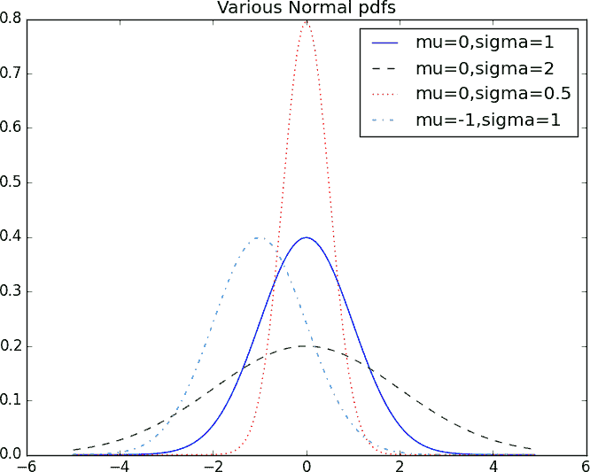

# 第六章：概率

> 概率定律，在一般情况下正确，在特定情况下谬误。
> 
> 爱德华·吉本

没有对*概率*及其数学的某种理解，数据科学是很难做的。就像我们在第五章中处理统计学一样，我们将在很多地方简化和省略技术细节。

对于我们的目的，你应该把概率看作是对从某个*事件宇宙*中选择的*事件*的不确定性进行量化的一种方式。与其深究这些术语的技术含义，不如想象掷骰子。事件宇宙包含所有可能的结果。而这些结果的任何子集就是一个事件；例如，“骰子掷出 1”或“骰子掷出偶数”。

在符号上，我们写 *P*(*E*) 来表示“事件 *E* 发生的概率”。

我们将使用概率理论来建立模型。我们将使用概率理论来评估模型。我们将在很多地方使用概率理论。

如果愿意，可以深入探讨概率论的哲学含义。（最好在喝啤酒时进行。）我们不会做这件事。

# 依赖性与独立性

简而言之，如果知道 *E* 发生与否能够提供 *F* 发生与否的信息（反之亦然），我们称事件 *E* 和 *F* 是*依赖*的。否则，它们是*独立*的。

例如，如果我们抛一枚公平的硬币两次，知道第一次抛硬币是正面并不能提供关于第二次抛硬币是否正面的信息。这两个事件是独立的。另一方面，知道第一次抛硬币是正面肯定会影响到第二次抛硬币是否都是反面。（如果第一次抛硬币是正面，那么肯定不会是两次抛硬币都是反面。）这两个事件是依赖的。

数学上，我们说事件 *E* 和 *F* 是独立的，如果它们同时发生的概率等于它们各自发生的概率的乘积：

<math alttext="upper P left-parenthesis upper E comma upper F right-parenthesis equals upper P left-parenthesis upper E right-parenthesis upper P left-parenthesis upper F right-parenthesis" display="block"><mrow><mi>P</mi> <mo>(</mo> <mi>E</mi> <mo>,</mo> <mi>F</mi> <mo>)</mo> <mo>=</mo> <mi>P</mi> <mo>(</mo> <mi>E</mi> <mo>)</mo> <mi>P</mi> <mo>(</mo> <mi>F</mi> <mo>)</mo></mrow></math>

在例子中，“第一次抛硬币为正面”的概率是 1/2，“两次抛硬币都为反面”的概率是 1/4，但“第一次抛硬币为正面*且*两次抛硬币都为反面”的概率是 0。

# 条件概率

当两个事件 *E* 和 *F* 是独立的时候，根据定义我们有：

<math alttext="upper P left-parenthesis upper E comma upper F right-parenthesis equals upper P left-parenthesis upper E right-parenthesis upper P left-parenthesis upper F right-parenthesis" display="block"><mrow><mi>P</mi> <mo>(</mo> <mi>E</mi> <mo>,</mo> <mi>F</mi> <mo>)</mo> <mo>=</mo> <mi>P</mi> <mo>(</mo> <mi>E</mi> <mo>)</mo> <mi>P</mi> <mo>(</mo> <mi>F</mi> <mo>)</mo></mrow></math>

如果它们不一定是独立的（如果 *F* 的概率不为零），那么我们定义 *E* 在给定 *F* 的条件下的概率为：

<math alttext="upper P left-parenthesis upper E vertical-bar upper F right-parenthesis equals upper P left-parenthesis upper E comma upper F right-parenthesis slash upper P left-parenthesis upper F right-parenthesis" display="block"><mrow><mi>P</mi> <mo>(</mo> <mi>E</mi> <mo>|</mo> <mi>F</mi> <mo>)</mo> <mo>=</mo> <mi>P</mi> <mo>(</mo> <mi>E</mi> <mo>,</mo> <mi>F</mi> <mo>)</mo> <mo>/</mo> <mi>P</mi> <mo>(</mo> <mi>F</mi> <mo>)</mo></mrow></math>

你应该把这看作是在我们知道 *F* 发生的情况下，*E* 发生的概率。

我们经常将其重写为：

<math alttext="upper P left-parenthesis upper E comma upper F right-parenthesis equals upper P left-parenthesis upper E vertical-bar upper F right-parenthesis upper P left-parenthesis upper F right-parenthesis" display="block"><mrow><mi>P</mi> <mo>(</mo> <mi>E</mi> <mo>,</mo> <mi>F</mi> <mo>)</mo> <mo>=</mo> <mi>P</mi> <mo>(</mo> <mi>E</mi> <mo>|</mo> <mi>F</mi> <mo>)</mo> <mi>P</mi> <mo>(</mo> <mi>F</mi> <mo>)</mo></mrow></math>

当 *E* 和 *F* 是独立的时候，你可以检查这是否成立：

<math alttext="upper P left-parenthesis upper E vertical-bar upper F right-parenthesis equals upper P left-parenthesis upper E right-parenthesis" display="block"><mrow><mi>P</mi> <mo>(</mo> <mi>E</mi> <mo>|</mo> <mi>F</mi> <mo>)</mo> <mo>=</mo> <mi>P</mi> <mo>(</mo> <mi>E</mi> <mo>)</mo></mrow></math>

这是数学上表达，即知道 *F* 发生了并不能给我们关于 *E* 是否发生额外的信息。

一个常见的棘手例子涉及一对（未知的）孩子的家庭。如果我们假设：

+   每个孩子都同等可能是男孩或女孩。

+   第二个孩子的性别与第一个孩子的性别是独立的。

那么事件“没有女孩”的概率为 1/4，事件“一个女孩一个男孩”的概率为 1/2，事件“两个女孩”的概率为 1/4。

现在我们可以问事件“两个孩子都是女孩”(*B*)在事件“老大是女孩”(*G*)条件下的概率是多少？使用条件概率的定义：

<math alttext="upper P left-parenthesis upper B vertical-bar upper G right-parenthesis equals upper P left-parenthesis upper B comma upper G right-parenthesis slash upper P left-parenthesis upper G right-parenthesis equals upper P left-parenthesis upper B right-parenthesis slash upper P left-parenthesis upper G right-parenthesis equals 1 slash 2" display="block"><mrow><mi>P</mi> <mo>(</mo> <mi>B</mi> <mo>|</mo> <mi>G</mi> <mo>)</mo> <mo>=</mo> <mi>P</mi> <mo>(</mo> <mi>B</mi> <mo>,</mo> <mi>G</mi> <mo>)</mo> <mo>/</mo> <mi>P</mi> <mo>(</mo> <mi>G</mi> <mo>)</mo> <mo>=</mo> <mi>P</mi> <mo>(</mo> <mi>B</mi> <mo>)</mo> <mo>/</mo> <mi>P</mi> <mo>(</mo> <mi>G</mi> <mo>)</mo> <mo>=</mo> <mn>1</mn> <mo>/</mo> <mn>2</mn></mrow></math>

因为事件*B*和*G*（“两个孩子都是女孩*且*老大是女孩”）就是事件*B*。（一旦知道两个孩子都是女孩，老大是女孩就是必然的。）

大多数情况下，这个结果符合您的直觉。

我们还可以询问事件“两个孩子都是女孩”在事件“至少一个孩子是女孩”(*L*)条件下的概率。令人惊讶的是，答案与之前不同！

与之前一样，事件*B*和*L*（“两个孩子都是女孩*且*至少一个孩子是女孩”）就是事件*B*。这意味着我们有：

<math alttext="upper P left-parenthesis upper B vertical-bar upper L right-parenthesis equals upper P left-parenthesis upper B comma upper L right-parenthesis slash upper P left-parenthesis upper L right-parenthesis equals upper P left-parenthesis upper B right-parenthesis slash upper P left-parenthesis upper L right-parenthesis equals 1 slash 3" display="block"><mrow><mi>P</mi> <mo>(</mo> <mi>B</mi> <mo>|</mo> <mi>L</mi> <mo>)</mo> <mo>=</mo> <mi>P</mi> <mo>(</mo> <mi>B</mi> <mo>,</mo> <mi>L</mi> <mo>)</mo> <mo>/</mo> <mi>P</mi> <mo>(</mo> <mi>L</mi> <mo>)</mo> <mo>=</mo> <mi>P</mi> <mo>(</mo> <mi>B</mi> <mo>)</mo> <mo>/</mo> <mi>P</mi> <mo>(</mo> <mi>L</mi> <mo>)</mo> <mo>=</mo> <mn>1</mn> <mo>/</mo> <mn>3</mn></mrow></math>

这是怎么回事？嗯，如果您所知道的是至少有一个孩子是女孩，那么这个家庭有一个男孩和一个女孩的可能性是有两倍多于两个女孩的可能性的。

我们可以通过“生成”许多家庭来验证这一点：

```py
import enum, random

# An Enum is a typed set of enumerated values. We can use them
# to make our code more descriptive and readable.
class Kid(enum.Enum):
    BOY = 0
    GIRL = 1

def random_kid() -> Kid:
    return random.choice([Kid.BOY, Kid.GIRL])

both_girls = 0
older_girl = 0
either_girl = 0

random.seed(0)

for _ in range(10000):
    younger = random_kid()
    older = random_kid()
    if older == Kid.GIRL:
        older_girl += 1
    if older == Kid.GIRL and younger == Kid.GIRL:
        both_girls += 1
    if older == Kid.GIRL or younger == Kid.GIRL:
        either_girl += 1

print("P(both | older):", both_girls / older_girl)     # 0.514 ~ 1/2
print("P(both | either): ", both_girls / either_girl)  # 0.342 ~ 1/3
```

# 贝叶斯定理

数据科学家的最佳朋友之一是贝叶斯定理，这是一种“反转”条件概率的方法。假设我们需要知道某事件*E*在另一事件*F*发生条件下的概率。但我们只有关于*E*发生条件下*F*的概率信息。使用条件概率的定义两次告诉我们：

<math alttext="upper P left-parenthesis upper E vertical-bar upper F right-parenthesis equals upper P left-parenthesis upper E comma upper F right-parenthesis slash upper P left-parenthesis upper F right-parenthesis equals upper P left-parenthesis upper F vertical-bar upper E right-parenthesis upper P left-parenthesis upper E right-parenthesis slash upper P left-parenthesis upper F right-parenthesis" display="block"><mrow><mi>P</mi> <mo>(</mo> <mi>E</mi> <mo>|</mo> <mi>F</mi> <mo>)</mo> <mo>=</mo> <mi>P</mi> <mo>(</mo> <mi>E</mi> <mo>,</mo> <mi>F</mi> <mo>)</mo> <mo>/</mo> <mi>P</mi> <mo>(</mo> <mi>F</mi> <mo>)</mo> <mo>=</mo> <mi>P</mi> <mo>(</mo> <mi>F</mi> <mo>|</mo> <mi>E</mi> <mo>)</mo> <mi>P</mi> <mo>(</mo> <mi>E</mi> <mo>)</mo> <mo>/</mo> <mi>P</mi> <mo>(</mo> <mi>F</mi> <mo>)</mo></mrow></math>

事件*F*可以分为两个互斥事件：“*F*和*E*”以及“*F*和非*E*”。如果我们用<math><mrow><mo>¬</mo> <mi>E</mi></mrow></math>表示“非*E*”（即“*E*不发生”），那么：

<math alttext="upper P left-parenthesis upper F right-parenthesis equals upper P left-parenthesis upper F comma upper E right-parenthesis plus upper P left-parenthesis upper F comma normal not-sign upper E right-parenthesis" display="block"><mrow><mi>P</mi> <mo>(</mo> <mi>F</mi> <mo>)</mo> <mo>=</mo> <mi>P</mi> <mo>(</mo> <mi>F</mi> <mo>,</mo> <mi>E</mi> <mo>)</mo> <mo>+</mo> <mi>P</mi> <mo>(</mo> <mi>F</mi> <mo>,</mo> <mo>¬</mo> <mi>E</mi> <mo>)</mo></mrow></math>

所以：

<math alttext="upper P left-parenthesis upper E vertical-bar upper F right-parenthesis equals upper P left-parenthesis upper F vertical-bar upper E right-parenthesis upper P left-parenthesis upper E right-parenthesis slash left-bracket upper P left-parenthesis upper F vertical-bar upper E right-parenthesis upper P left-parenthesis upper E right-parenthesis plus upper P left-parenthesis upper F vertical-bar normal not-sign upper E right-parenthesis upper P left-parenthesis normal not-sign upper E right-parenthesis right-bracket" display="block"><mrow><mi>P</mi> <mo>(</mo> <mi>E</mi> <mo>|</mo> <mi>F</mi> <mo>)</mo> <mo>=</mo> <mi>P</mi> <mo>(</mo> <mi>F</mi> <mo>|</mo> <mi>E</mi> <mo>)</mo> <mi>P</mi> <mo>(</mo> <mi>E</mi> <mo>)</mo> <mo>/</mo> <mo>[</mo> <mi>P</mi> <mo>(</mo> <mi>F</mi> <mo>|</mo> <mi>E</mi> <mo>)</mo> <mi>P</mi> <mo>(</mo> <mi>E</mi> <mo>)</mo> <mo>+</mo> <mi>P</mi> <mo>(</mo> <mi>F</mi> <mo>|</mo> <mo>¬</mo> <mi>E</mi> <mo>)</mo> <mi>P</mi> <mo>(</mo> <mo>¬</mo> <mi>E</mi> <mo>)</mo> <mo>]</mo></mrow></math>

这通常是贝叶斯定理的陈述方式。

这个定理经常被用来展示为什么数据科学家比医生更聪明。想象一种影响每 10,000 人中 1 人的特定疾病。再想象一种测试这种疾病的方法，它在 99%的情况下给出正确结果（如果您有疾病则为“患病”，如果您没有则为“未患病”）。

正测试意味着什么？让我们用*T*表示“您的测试呈阳性”事件，*D*表示“您患有疾病”事件。那么贝叶斯定理表明，在测试呈阳性的条件下，您患有疾病的概率是：

<math alttext="upper P left-parenthesis upper D vertical-bar upper T right-parenthesis equals upper P left-parenthesis upper T vertical-bar upper D right-parenthesis upper P left-parenthesis upper D right-parenthesis slash left-bracket upper P left-parenthesis upper T vertical-bar upper D right-parenthesis upper P left-parenthesis upper D right-parenthesis plus upper P left-parenthesis upper T vertical-bar normal not-sign upper D right-parenthesis upper P left-parenthesis normal not-sign upper D right-parenthesis right-bracket" display="block"><mrow><mi>P</mi> <mo>(</mo> <mi>D</mi> <mo>|</mo> <mi>T</mi> <mo>)</mo> <mo>=</mo> <mi>P</mi> <mo>(</mo> <mi>T</mi> <mo>|</mo> <mi>D</mi> <mo>)</mo> <mi>P</mi> <mo>(</mo> <mi>D</mi> <mo>)</mo> <mo>/</mo> <mo>[</mo> <mi>P</mi> <mo>(</mo> <mi>T</mi> <mo>|</mo> <mi>D</mi> <mo>)</mo> <mi>P</mi> <mo>(</mo> <mi>D</mi> <mo>)</mo> <mo>+</mo> <mi>P</mi> <mo>(</mo> <mi>T</mi> <mo>|</mo> <mo>¬</mo> <mi>D</mi> <mo>)</mo> <mi>P</mi> <mo>(</mo> <mo>¬</mo> <mi>D</mi> <mo>)</mo> <mo>]</mo></mrow></math>

在这里我们知道，<math><mrow><mi>P</mi> <mo>(</mo> <mi>T</mi> <mo>|</mo> <mi>D</mi> <mo>)</mo></mrow></math>，即染病者测试阳性的概率，为 0.99。*P*(*D*)，即任何给定人患病的概率，为 1/10,000 = 0.0001。 <math><mrow><mi>P</mi> <mo>(</mo> <mi>T</mi> <mo>|</mo> <mo>¬</mo> <mi>D</mi> <mo>)</mo></mrow></math>，即没有患病者测试阳性的概率，为 0.01。而 <math><mrow><mi>P</mi> <mo>(</mo> <mo>¬</mo> <mi>D</mi> <mo>)</mo></mrow></math>，即任何给定人没有患病的概率，为 0.9999。如果你把这些数字代入贝叶斯定理，你会发现：

<math alttext="upper P left-parenthesis upper D vertical-bar upper T right-parenthesis equals 0.98 percent-sign" display="block"><mrow><mi>P</mi> <mo>(</mo> <mi>D</mi> <mo>|</mo> <mi>T</mi> <mo>)</mo> <mo>=</mo> <mn>0</mn> <mo>.</mo> <mn>98</mn> <mo>%</mo></mrow></math>

也就是说，只有不到 1%的阳性测试者实际上患有这种疾病。

###### 注

这假设人们更多或更少是随机参加测试的。如果只有具有某些症状的人参加测试，我们将需要在“阳性测试 *和* 症状”事件上进行条件判断，而阳性测试的人数可能会高得多。

更直观地看待这个问题的方法是想象一种 100 万人口的人群。你会预期其中有 100 人患有这种疾病，其中有 99 人测试结果呈阳性。另一方面，你会预期这中间有 999,900 人没有患有这种疾病，其中有 9,999 人测试结果呈阳性。这意味着你只会预期(99 + 9999)个阳性测试者中有 99 人实际上患有这种疾病。

# 随机变量

*随机变量*是具有相关概率分布的可能值的变量。一个非常简单的随机变量，如果抛硬币正面朝上则值为 1，如果反面朝上则值为 0。一个更复杂的随机变量可能会测量你在抛硬币 10 次时观察到的头像数量，或者从`range(10)`中选取的值，其中每个数字都是同样可能的。

相关的分布给出了变量实现其可能值的概率。抛硬币变量等于 0 的概率为 0.5，等于 1 的概率为 0.5。`range(10)`变量具有分布，将 0 到 9 中的每个数字分配概率 0.1。

有时我们会谈论一个随机变量的*期望值*，这是其值按其概率加权的平均值。抛硬币变量的期望值为 1/2（= 0 * 1/2 + 1 * 1/2），而`range(10)`变量的期望值为 4.5。

随机变量可以像其他事件一样被条件化。回到“条件概率”中的两个孩子示例，如果*X*是表示女孩数量的随机变量，那么*X*等于 0 的概率为 1/4，等于 1 的概率为 1/2，等于 2 的概率为 1/4。

我们可以定义一个新的随机变量*Y*，条件是至少有一个孩子是女孩。然后*Y*以 2/3 的概率等于 1，以 1/3 的概率等于 2。还有一个变量*Z*，条件是较大的孩子是女孩，则以 1/2 的概率等于 1，以 1/2 的概率等于 2。

大多数情况下，在我们进行的操作中，我们将隐含地使用随机变量，而不特别关注它们。但是如果你深入研究，你会发现它们。

# 连续分布

抛硬币对应于*离散分布*——它将离散结果与正概率关联起来。通常我们希望模拟跨越连续结果的分布。（对我们而言，这些结果将始终是实数，尽管在现实生活中并非总是如此。）例如，*均匀分布*将在 0 到 1 之间所有数字上赋予*相等的权重*。

因为在 0 和 1 之间有无穷多个数，这意味着它分配给单个点的权重必然为零。因此，我们用*概率密度函数*（PDF）表示连续分布，使得在某个区间内看到一个值的概率等于该区间上密度函数的积分。

###### 注意

如果你的积分微积分有点生疏，一个更简单的理解方式是，如果一个分布有密度函数*f*，那么在*x*和*x + h*之间看到一个值的概率大约是*h * f(x)*，如果*h*很小的话。

均匀分布的密度函数就是：

```py
def uniform_pdf(x: float) -> float:
    return 1 if 0 <= x < 1 else 0
```

按照该分布，随机变量落在 0.2 到 0.3 之间的概率是 1/10，正如你所期望的那样。Python 的`random.random`是一个均匀密度的（伪）随机变量。

我们通常更感兴趣的是*累积分布函数*（CDF），它给出随机变量小于或等于某个值的概率。对于均匀分布，创建 CDF 并不困难（见图 6-1）：

```py
def uniform_cdf(x: float) -> float:
    """Returns the probability that a uniform random variable is <= x"""
    if x < 0:   return 0    # uniform random is never less than 0
    elif x < 1: return x    # e.g. P(X <= 0.4) = 0.4
    else:       return 1    # uniform random is always less than 1
```


###### 图 6-1\. 均匀分布的累积分布函数

# 正态分布

正态分布是经典的钟形曲线分布，完全由两个参数确定：其均值*μ*（mu）和标准差*σ*（sigma）。均值表示钟形曲线的中心位置，标准差表示其“宽度”。

它的 PDF 是：

<math alttext="f left-parenthesis x vertical-bar mu comma sigma right-parenthesis equals StartFraction 1 Over StartRoot 2 pi EndRoot sigma EndFraction exp left-parenthesis minus StartFraction left-parenthesis x minus mu right-parenthesis squared Over 2 sigma squared EndFraction right-parenthesis" display="block"><mrow><mi>f</mi> <mrow><mo>(</mo> <mi>x</mi> <mo>|</mo> <mi>μ</mi> <mo>,</mo> <mi>σ</mi> <mo>)</mo></mrow> <mo>=</mo> <mfrac><mn>1</mn> <mrow><msqrt><mrow><mn>2</mn><mi>π</mi></mrow></msqrt><mi>σ</mi></mrow></mfrac> <mo form="prefix">exp</mo> <mo>(</mo> <mrow><mo>-</mo> <mfrac><msup><mrow><mo>(</mo><mi>x</mi><mo>-</mo><mi>μ</mi><mo>)</mo></mrow> <mn>2</mn></msup> <mrow><mn>2</mn><msup><mi>σ</mi> <mn>2</mn></msup></mrow></mfrac> <mrow><mo>)</mo></mrow></mrow></mrow></math>

我们可以这样实现它：

```py
import math
SQRT_TWO_PI = math.sqrt(2 * math.pi)

def normal_pdf(x: float, mu: float = 0, sigma: float = 1) -> float:
    return (math.exp(-(x-mu) ** 2 / 2 / sigma ** 2) / (SQRT_TWO_PI * sigma))
```

在图 6-2 中，我们绘制了一些这些 PDF，看看它们的样子：

```py
import matplotlib.pyplot as plt
xs = [x / 10.0 for x in range(-50, 50)]
plt.plot(xs,[normal_pdf(x,sigma=1) for x in xs],'-',label='mu=0,sigma=1')
plt.plot(xs,[normal_pdf(x,sigma=2) for x in xs],'--',label='mu=0,sigma=2')
plt.plot(xs,[normal_pdf(x,sigma=0.5) for x in xs],':',label='mu=0,sigma=0.5')
plt.plot(xs,[normal_pdf(x,mu=-1)   for x in xs],'-.',label='mu=-1,sigma=1')
plt.legend()
plt.title("Various Normal pdfs")
plt.show()
```



###### 图 6-2\. 各种正态分布的 PDF

当*μ* = 0 且*σ* = 1 时，称为*标准正态分布*。如果*Z*是一个标准正态随机变量，则有：

<math alttext="upper X equals sigma upper Z plus mu" display="block"><mrow><mi>X</mi> <mo>=</mo> <mi>σ</mi> <mi>Z</mi> <mo>+</mo> <mi>μ</mi></mrow></math>

也服从正态分布，但其均值为<math alttext="mu"><mi>μ</mi></math>，标准差为<math alttext="sigma"><mi>σ</mi></math> 。反之，如果*X*是均值为<math alttext="mu"><mi>μ</mi></math>，标准差为<math alttext="sigma"><mi>σ</mi></math>的正态随机变量，

<math alttext="upper Z equals left-parenthesis upper X minus mu right-parenthesis slash sigma" display="block"><mrow><mi>Z</mi> <mo>=</mo> <mo>(</mo> <mi>X</mi> <mo>-</mo> <mi>μ</mi> <mo>)</mo> <mo>/</mo> <mi>σ</mi></mrow></math>

是一个标准正态变量。

正态分布的累积分布函数不能用“基本”的方式写出，但我们可以使用 Python 的`math.erf` [误差函数](http://en.wikipedia.org/wiki/Error_function)来表示它：

```py
def normal_cdf(x: float, mu: float = 0, sigma: float = 1) -> float:
    return (1 + math.erf((x - mu) / math.sqrt(2) / sigma)) / 2
```

再次，在图 6-3 中，我们绘制了几个累积分布函数（CDF）：

```py
xs = [x / 10.0 for x in range(-50, 50)]
plt.plot(xs,[normal_cdf(x,sigma=1) for x in xs],'-',label='mu=0,sigma=1')
plt.plot(xs,[normal_cdf(x,sigma=2) for x in xs],'--',label='mu=0,sigma=2')
plt.plot(xs,[normal_cdf(x,sigma=0.5) for x in xs],':',label='mu=0,sigma=0.5')
plt.plot(xs,[normal_cdf(x,mu=-1) for x in xs],'-.',label='mu=-1,sigma=1')
plt.legend(loc=4) # bottom right
plt.title("Various Normal cdfs")
plt.show()
```


###### 图 6-3\. 各种正态分布的累积分布函数

有时我们需要求逆`normal_cdf`以找到对应于指定概率的值。虽然没有简单的方法来计算其逆，但`normal_cdf`是连续且严格递增的，因此我们可以使用[*二分查找*](http://en.wikipedia.org/wiki/Binary_search_algorithm)：

```py
def inverse_normal_cdf(p: float,
                       mu: float = 0,
                       sigma: float = 1,
                       tolerance: float = 0.00001) -> float:
    """Find approximate inverse using binary search"""

    # if not standard, compute standard and rescale
    if mu != 0 or sigma != 1:
        return mu + sigma * inverse_normal_cdf(p, tolerance=tolerance)

    low_z = -10.0                      # normal_cdf(-10) is (very close to) 0
    hi_z  =  10.0                      # normal_cdf(10)  is (very close to) 1
    while hi_z - low_z > tolerance:
        mid_z = (low_z + hi_z) / 2     # Consider the midpoint
        mid_p = normal_cdf(mid_z)      # and the CDF's value there
        if mid_p < p:
            low_z = mid_z              # Midpoint too low, search above it
        else:
            hi_z = mid_z               # Midpoint too high, search below it

    return mid_z
```

该函数重复地将区间二分，直到找到接近所需概率的*Z*。

# 中心极限定理

正态分布如此有用的一个原因是*中心极限定理*，它（本质上）表明大量独立同分布的随机变量的平均值本身近似服从正态分布。

特别是，如果<math><mrow><msub><mi>x</mi> <mn>1</mn></msub> <mo>,</mo> <mo>...</mo> <mo>,</mo> <msub><mi>x</mi> <mi>n</mi></msub></mrow></math>是均值为*μ*，标准差为*σ*的随机变量，并且*n*很大，则

<math display="block"><mrow><mfrac><mn>1</mn> <mi>n</mi></mfrac> <mrow><mo>(</mo> <msub><mi>x</mi> <mn>1</mn></msub> <mo>+</mo> <mo>...</mo> <mo>+</mo> <msub><mi>x</mi> <mi>n</mi></msub> <mo>)</mo></mrow></mrow></math>

大致上符合正态分布，均值为*μ*，标准差为<math alttext="sigma slash StartRoot n EndRoot"><mrow><mi>σ</mi> <mo>/</mo> <msqrt><mi>n</mi></msqrt></mrow></math> 。同样（但通常更有用），

<math alttext="StartFraction left-parenthesis x 1 plus ellipsis plus x Subscript n Baseline right-parenthesis minus mu n Over sigma StartRoot n EndRoot EndFraction" display="block"><mfrac><mrow><mo>(</mo><msub><mi>x</mi> <mn>1</mn></msub> <mo>+</mo><mo>...</mo><mo>+</mo><msub><mi>x</mi> <mi>n</mi></msub> <mo>)</mo><mo>-</mo><mi>μ</mi><mi>n</mi></mrow> <mrow><mi>σ</mi><msqrt><mi>n</mi></msqrt></mrow></mfrac></math>

大致上符合均值为 0，标准差为 1 的正态分布。

一个易于说明这一点的方法是看*二项式*随机变量，它具有两个参数*n*和*p*。一个二项式(*n*,*p*)随机变量简单地是*n*个独立的伯努利(*p*)随机变量的和，其中每个随机变量以概率*p*等于 1，以概率 1 - *p*等于 0：

```py
def bernoulli_trial(p: float) -> int:
    """Returns 1 with probability p and 0 with probability 1-p"""
    return 1 if random.random() < p else 0

def binomial(n: int, p: float) -> int:
    """Returns the sum of n bernoulli(p) trials"""
    return sum(bernoulli_trial(p) for _ in range(n))
```

伯努利变量（Bernoulli(*p*)）的均值是 *p*，标准差是 <math alttext="StartRoot p left-parenthesis 1 minus p right-parenthesis EndRoot"><msqrt><mrow><mi>p</mi> <mo>(</mo> <mn>1</mn> <mo>-</mo> <mi>p</mi> <mo>)</mo></mrow></msqrt></math> 。 中心极限定理表明，当 *n* 变大时，二项分布（Binomial(*n*,*p*)）变量近似于均值 <math alttext="mu equals n p"><mrow><mi>μ</mi> <mo>=</mo> <mi>n</mi> <mi>p</mi></mrow></math> 和标准差 <math alttext="sigma equals StartRoot n p left-parenthesis 1 minus p right-parenthesis EndRoot"><mrow><mi>σ</mi> <mo>=</mo> <msqrt><mrow><mi>n</mi> <mi>p</mi> <mo>(</mo> <mn>1</mn> <mo>-</mo> <mi>p</mi> <mo>)</mo></mrow></msqrt></mrow></math> 的正态随机变量。 如果我们同时绘制它们，你可以很容易地看到它们的相似之处：

```py
from collections import Counter

def binomial_histogram(p: float, n: int, num_points: int) -> None:
    """Picks points from a Binomial(n, p) and plots their histogram"""
    data = [binomial(n, p) for _ in range(num_points)]

    # use a bar chart to show the actual binomial samples
    histogram = Counter(data)
    plt.bar([x - 0.4 for x in histogram.keys()],
            [v / num_points for v in histogram.values()],
            0.8,
            color='0.75')

    mu = p * n
    sigma = math.sqrt(n * p * (1 - p))

    # use a line chart to show the normal approximation
    xs = range(min(data), max(data) + 1)
    ys = [normal_cdf(i + 0.5, mu, sigma) - normal_cdf(i - 0.5, mu, sigma)
          for i in xs]
    plt.plot(xs,ys)
    plt.title("Binomial Distribution vs. Normal Approximation")
    plt.show()
```

例如，当你调用 `make_hist(0.75, 100, 10000)` 时，你会得到图 6-4 中的图表。


###### 图 6-4\. 调用 binomial_histogram 的输出

这个近似的道理是，如果你想知道（比如说）在 100 次投掷中，一个公平硬币出现超过 60 次正面的概率，你可以估计为一个正态分布（Normal(50,5)）大于 60 的概率，这比计算二项分布（Binomial(100,0.5)）的累积分布函数要简单。 （尽管在大多数应用中，你可能会使用愿意计算任何你想要的概率的统计软件。）

# 进一步探索

+   [scipy.stats](https://docs.scipy.org/doc/scipy/reference/stats.html) 包含大多数流行概率分布的概率密度函数（PDF）和累积分布函数（CDF）。

+   还记得在第 5 章的结尾处我说过，学习一本统计学教材是个好主意吗？学习一本概率论教材也是个好主意。我知道的最好的在线教材是 [*Introduction to Probability*](http://www.dartmouth.edu/~chance/teaching_aids/books_articles/probability_book/book.html)，由 Charles M. Grinstead 和 J. Laurie Snell（美国数学学会）编写。
