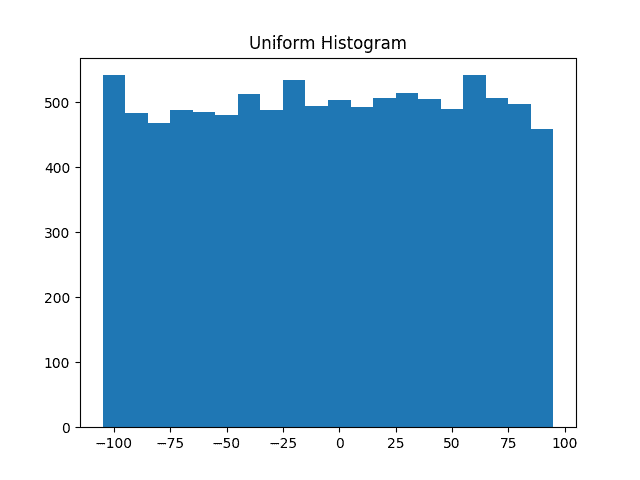
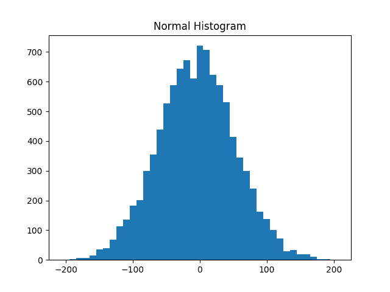
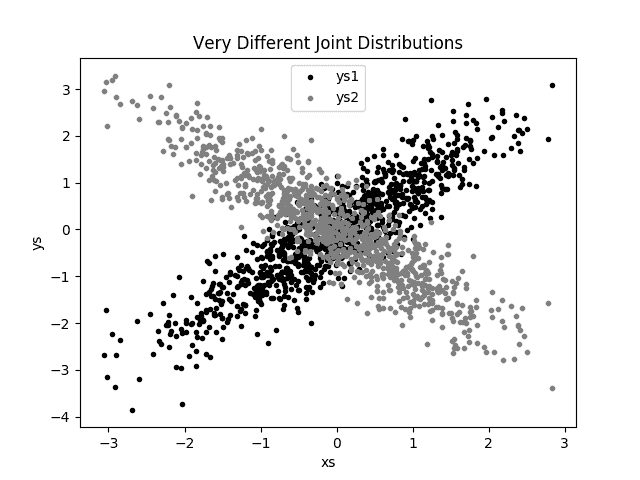
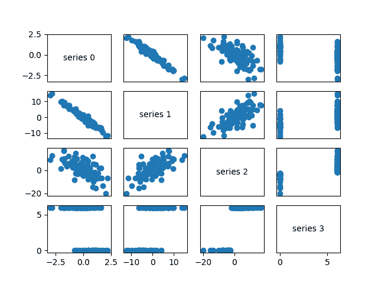
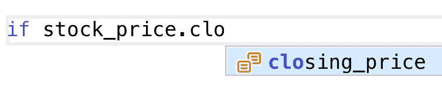
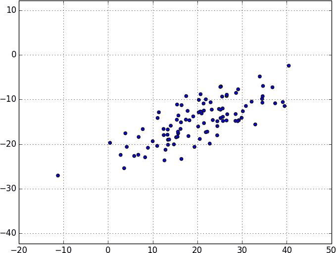
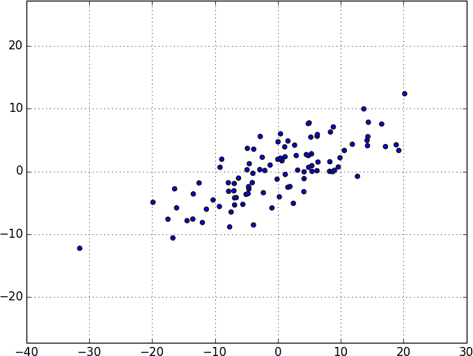
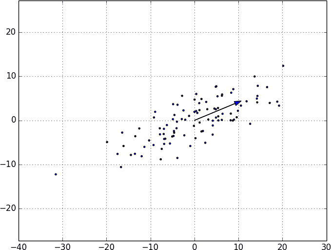
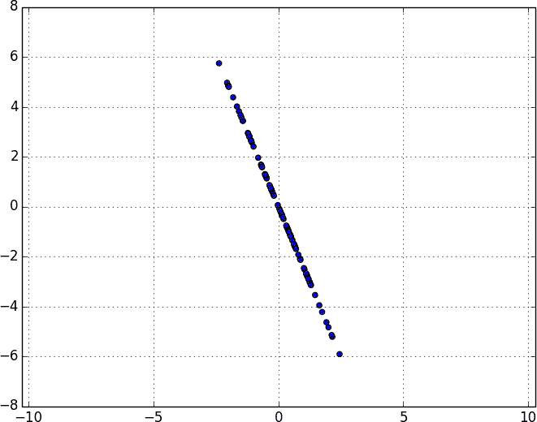
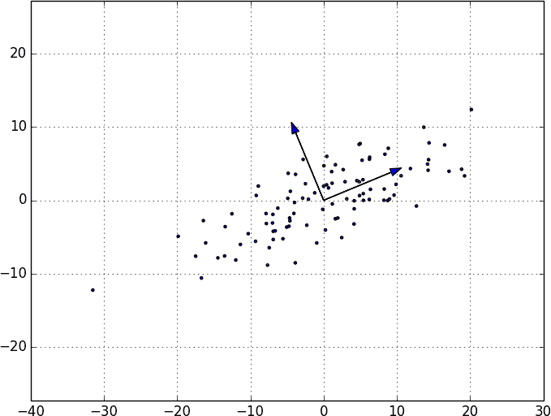

# 第十章：处理数据

> 专家往往拥有比判断更多的数据。
> 
> 科林·鲍威尔

处理数据既是一门艺术，也是一门科学。我们主要讨论科学部分，但在本章中我们将探讨一些艺术方面。

# 探索您的数据

在确定您要回答的问题并获取到数据之后，您可能会有冲动立即开始构建模型和获取答案。但您应该抑制这种冲动。您的第一步应该是 *探索* 您的数据。

## 探索一维数据

最简单的情况是您有一个一维数据集，它只是一组数字。例如，这些可能是每个用户每天在您的网站上花费的平均分钟数，一系列数据科学教程视频的观看次数，或者您的数据科学图书馆中每本数据科学书籍的页数。

显而易见的第一步是计算一些摘要统计信息。您想知道有多少数据点，最小值，最大值，均值和标准差。

但即使这些也不一定能给您带来很好的理解。一个很好的下一步是创建直方图，将数据分组为离散的 *桶* 并计算落入每个桶中的点数：

```py
from typing import List, Dict
from collections import Counter
import math

import matplotlib.pyplot as plt

def bucketize(point: float, bucket_size: float) -> float:
    """Floor the point to the next lower multiple of bucket_size"""
    return bucket_size * math.floor(point / bucket_size)

def make_histogram(points: List[float], bucket_size: float) -> Dict[float, int]:
    """Buckets the points and counts how many in each bucket"""
    return Counter(bucketize(point, bucket_size) for point in points)

def plot_histogram(points: List[float], bucket_size: float, title: str = ""):
    histogram = make_histogram(points, bucket_size)
    plt.bar(histogram.keys(), histogram.values(), width=bucket_size)
    plt.title(title)
```

例如，考虑以下两组数据：

```py
import random
from scratch.probability import inverse_normal_cdf

random.seed(0)

# uniform between -100 and 100
uniform = [200 * random.random() - 100 for _ in range(10000)]

# normal distribution with mean 0, standard deviation 57
normal = [57 * inverse_normal_cdf(random.random())
          for _ in range(10000)]
```

两者的均值接近 0，标准差接近 58。然而，它们的分布却非常不同。 第 10-1 图 显示了 `uniform` 的分布：

```py
plot_histogram(uniform, 10, "Uniform Histogram")
```

而 第 10-2 图 显示了 `normal` 的分布：

```py
plot_histogram(normal, 10, "Normal Histogram")
```



###### 第 10-1 图。均匀分布直方图

在这种情况下，两个分布的 `max` 和 `min` 相差很大，但即使知道这一点也不足以理解它们的 *差异*。

## 两个维度

现在想象一下，您有一个具有两个维度的数据集。除了每天的分钟数，您可能还有数据科学经验的年数。当然，您希望单独了解每个维度。但您可能还想散点数据。

例如，考虑另一个虚构数据集：

```py
def random_normal() -> float:
    """Returns a random draw from a standard normal distribution"""
    return inverse_normal_cdf(random.random())

xs = [random_normal() for _ in range(1000)]
ys1 = [ x + random_normal() / 2 for x in xs]
ys2 = [-x + random_normal() / 2 for x in xs]
```

如果你对 `ys1` 和 `ys2` 运行 `plot_histogram`，你会得到类似的图表（实际上，两者均为具有相同均值和标准差的正态分布）。



###### 第 10-2 图。正态分布直方图

但每个维度与 `xs` 的联合分布非常不同，如 第 10-3 图 所示：

```py
plt.scatter(xs, ys1, marker='.', color='black', label='ys1')
plt.scatter(xs, ys2, marker='.', color='gray',  label='ys2')
plt.xlabel('xs')
plt.ylabel('ys')
plt.legend(loc=9)
plt.title("Very Different Joint Distributions")
plt.show()
```



###### 第 10-3 图。散射两个不同的 ys

如果你查看相关性，这种差异也会显现：

```py
from scratch.statistics import correlation

print(correlation(xs, ys1))      # about 0.9
print(correlation(xs, ys2))      # about -0.9
```

## 多维度

对于许多维度，您可能想了解所有维度之间的关系。一个简单的方法是查看 *相关矩阵*，其中第 *i* 行和第 *j* 列的条目是数据的第 *i* 维和第 *j* 维之间的相关性：

```py
from scratch.linear_algebra import Matrix, Vector, make_matrix

def correlation_matrix(data: List[Vector]) -> Matrix:
    """
 Returns the len(data) x len(data) matrix whose (i, j)-th entry
 is the correlation between data[i] and data[j]
 """
    def correlation_ij(i: int, j: int) -> float:
        return correlation(data[i], data[j])

    return make_matrix(len(data), len(data), correlation_ij)
```

一种更直观的方法（如果维度不多）是制作一个*散点图矩阵*（参见图 10-4），显示所有成对的散点图。为此，我们将使用`plt.subplots`，它允许我们创建图表的子图。我们给它行数和列数，它返回一个`figure`对象（我们将不使用它）和一个二维数组的`axes`对象（我们将每个都绘制）：

```py
# corr_data is a list of four 100-d vectors
num_vectors = len(corr_data)
fig, ax = plt.subplots(num_vectors, num_vectors)

for i in range(num_vectors):
    for j in range(num_vectors):

        # Scatter column_j on the x-axis vs. column_i on the y-axis
        if i != j: ax[i][j].scatter(corr_data[j], corr_data[i])

        # unless i == j, in which case show the series name
        else: ax[i][j].annotate("series " + str(i), (0.5, 0.5),
                                xycoords='axes fraction',
                                ha="center", va="center")

        # Then hide axis labels except left and bottom charts
        if i < num_vectors - 1: ax[i][j].xaxis.set_visible(False)
        if j > 0: ax[i][j].yaxis.set_visible(False)

# Fix the bottom-right and top-left axis labels, which are wrong because
# their charts only have text in them
ax[-1][-1].set_xlim(ax[0][-1].get_xlim())
ax[0][0].set_ylim(ax[0][1].get_ylim())

plt.show()
```



###### 图 10-4\. 散点图矩阵

从散点图中可以看出，系列 1 与系列 0 之间存在非常负相关的关系，系列 2 与系列 1 之间存在正相关的关系，而系列 3 只取值 0 和 6，其中 0 对应于系列 2 的小值，6 对应于系列 2 的大值。

这是快速了解哪些变量相关的一种粗略方法（除非你花费数小时调整 matplotlib 以完全按照你想要的方式显示，否则这不是一个快速方法）。

# 使用 NamedTuples

表示数据的一种常见方式是使用`dict`s：

```py
import datetime

stock_price = {'closing_price': 102.06,
               'date': datetime.date(2014, 8, 29),
               'symbol': 'AAPL'}
```

然而，这不太理想的几个原因。这是一种略微低效的表示形式（一个`dict`涉及一些开销），因此如果你有很多股价，它们将占用比它们应该占用的更多内存。在大多数情况下，这只是一个小考虑。

一个更大的问题是通过`dict`键访问事物容易出错。以下代码将不会报错，但会执行错误的操作：

```py
# oops, typo
stock_price['cosing_price'] = 103.06
```

最后，虽然我们可以为统一的字典进行类型注释：

```py
prices: Dict[datetime.date, float] = {}
```

没有一种有用的方法来注释具有许多不同值类型的字典数据。因此，我们也失去了类型提示的力量。

作为一种替代方案，Python 包含一个`namedtuple`类，它类似于一个`tuple`，但具有命名的槽位：

```py
from collections import namedtuple

StockPrice = namedtuple('StockPrice', ['symbol', 'date', 'closing_price'])
price = StockPrice('MSFT', datetime.date(2018, 12, 14), 106.03)

assert price.symbol == 'MSFT'
assert price.closing_price == 106.03
```

像常规的`tuples`一样，`namedtuple`s 是不可变的，这意味着一旦创建就无法修改它们的值。偶尔这会成为我们的障碍，但大多数情况下这是件好事。

你会注意到我们还没有解决类型注解的问题。我们可以通过使用类型化的变体`NamedTuple`来解决：

```py
from typing import NamedTuple

class StockPrice(NamedTuple):
    symbol: str
    date: datetime.date
    closing_price: float

    def is_high_tech(self) -> bool:
        """It's a class, so we can add methods too"""
        return self.symbol in ['MSFT', 'GOOG', 'FB', 'AMZN', 'AAPL']

price = StockPrice('MSFT', datetime.date(2018, 12, 14), 106.03)

assert price.symbol == 'MSFT'
assert price.closing_price == 106.03
assert price.is_high_tech()
```

现在你的编辑器可以帮助你，就像在图 10-5 中显示的那样。



###### 图 10-5\. 有用的编辑器

###### 注意

很少有人以这种方式使用`NamedTuple`。但他们应该！

# Dataclasses

Dataclasses 是`NamedTuple`的一种（某种程度上）可变版本。（我说“某种程度上”，因为`NamedTuple`s 将它们的数据紧凑地表示为元组，而 dataclasses 是常规的 Python 类，只是为您自动生成了一些方法。）

###### 注意

Dataclasses 在 Python 3.7 中是新功能。如果你使用的是旧版本，则本节对你无效。

语法与`NamedTuple`非常相似。但是，我们使用装饰器而不是从基类继承：

```py
from dataclasses import dataclass

@dataclass
class StockPrice2:
    symbol: str
    date: datetime.date
    closing_price: float

    def is_high_tech(self) -> bool:
        """It's a class, so we can add methods too"""
        return self.symbol in ['MSFT', 'GOOG', 'FB', 'AMZN', 'AAPL']

price2 = StockPrice2('MSFT', datetime.date(2018, 12, 14), 106.03)

assert price2.symbol == 'MSFT'
assert price2.closing_price == 106.03
assert price2.is_high_tech()
```

正如前面提到的，最大的区别在于我们可以修改 dataclass 实例的值：

```py
# stock split
price2.closing_price /= 2
assert price2.closing_price == 51.03
```

如果我们尝试修改`NamedTuple`版本的字段，我们会得到一个`AttributeError`。

这也使我们容易受到我们希望通过不使用`dict`来避免的错误的影响：

```py
# It's a regular class, so add new fields however you like!
price2.cosing_price = 75  # oops
```

我们不会使用 dataclasses，但你可能会在野外遇到它们。

# 清洁和操纵

现实世界的数据*脏*。通常你需要在使用之前对其进行一些处理。我们在第九章中看到了这方面的例子。在使用之前，我们必须将字符串转换为`float`或`int`。我们必须检查缺失值、异常值和错误数据。

以前，我们在使用数据之前就这样做了：

```py
closing_price = float(row[2])
```

但是在一个我们可以测试的函数中进行解析可能更少出错：

```py
from dateutil.parser import parse

def parse_row(row: List[str]) -> StockPrice:
    symbol, date, closing_price = row
    return StockPrice(symbol=symbol,
                      date=parse(date).date(),
                      closing_price=float(closing_price))

# Now test our function
stock = parse_row(["MSFT", "2018-12-14", "106.03"])

assert stock.symbol == "MSFT"
assert stock.date == datetime.date(2018, 12, 14)
assert stock.closing_price == 106.03
```

如果有错误数据怎么办？一个不实际代表数字的“浮点”值？也许你宁愿得到一个`None`而不是使程序崩溃？

```py
from typing import Optional
import re

def try_parse_row(row: List[str]) -> Optional[StockPrice]:
    symbol, date_, closing_price_ = row

    # Stock symbol should be all capital letters
    if not re.match(r"^[A-Z]+$", symbol):
        return None

    try:
        date = parse(date_).date()
    except ValueError:
        return None

    try:
        closing_price = float(closing_price_)
    except ValueError:
        return None

    return StockPrice(symbol, date, closing_price)

# Should return None for errors
assert try_parse_row(["MSFT0", "2018-12-14", "106.03"]) is None
assert try_parse_row(["MSFT", "2018-12--14", "106.03"]) is None
assert try_parse_row(["MSFT", "2018-12-14", "x"]) is None

# But should return same as before if data is good
assert try_parse_row(["MSFT", "2018-12-14", "106.03"]) == stock
```

举个例子，如果我们有用逗号分隔的股票价格数据有错误：

```py
AAPL,6/20/2014,90.91
MSFT,6/20/2014,41.68
FB,6/20/3014,64.5
AAPL,6/19/2014,91.86
MSFT,6/19/2014,n/a
FB,6/19/2014,64.34
```

现在我们可以只读取并返回有效的行了：

```py
import csv

data: List[StockPrice] = []

with open("comma_delimited_stock_prices.csv") as f:
    reader = csv.reader(f)
    for row in reader:
        maybe_stock = try_parse_row(row)
        if maybe_stock is None:
            print(f"skipping invalid row: {row}")
        else:
            data.append(maybe_stock)
```

并决定我们想要如何处理无效数据。一般来说，三个选择是摆脱它们，返回到源头并尝试修复错误/丢失的数据，或者什么也不做，只是交叉手指。如果数百万行中有一行错误的数据，那么忽略它可能没问题。但是如果一半的行都有错误数据，那就是你需要解决的问题。

下一个好的步骤是检查异常值，使用“探索您的数据”中的技术或通过临时调查来进行。例如，你是否注意到股票文件中的一个日期的年份是 3014 年？这不会（必然）给你一个错误，但很明显是错误的，如果你不注意到它，你会得到混乱的结果。现实世界的数据集有缺失的小数点、额外的零、排版错误以及无数其他问题，你需要解决。（也许官方上不是你的工作，但还有谁会做呢？）

# 数据操作

数据科学家最重要的技能之一是*数据操作*。这更像是一种通用方法而不是特定的技术，所以我们只需通过几个示例来让你了解一下。

想象我们有一堆股票价格数据，看起来像这样：

```py
data = [
    StockPrice(symbol='MSFT',
               date=datetime.date(2018, 12, 24),
               closing_price=106.03),
    # ...
]
```

让我们开始对这些数据提出问题。在此过程中，我们将尝试注意到我们正在做的事情，并抽象出一些工具，使操纵更容易。

例如，假设我们想知道 AAPL 的最高收盘价。让我们将这个问题分解成具体的步骤：

1.  限制自己只看 AAPL 的行。

1.  从每行中获取`closing_price`。

1.  获取那些价格的最大值。

我们可以一次完成所有三个任务使用推导：

```py
max_aapl_price = max(stock_price.closing_price
                     for stock_price in data
                     if stock_price.symbol == "AAPL")
```

更一般地，我们可能想知道数据集中每支股票的最高收盘价。做到这一点的一种方法是：

1.  创建一个`dict`来跟踪最高价格（我们将使用一个`defaultdict`，对于缺失值返回负无穷大，因为任何价格都将大于它）。

1.  迭代我们的数据，更新它。

这是代码：

```py
from collections import defaultdict

max_prices: Dict[str, float] = defaultdict(lambda: float('-inf'))

for sp in data:
    symbol, closing_price = sp.symbol, sp.closing_price
    if closing_price > max_prices[symbol]:
        max_prices[symbol] = closing_price
```

现在我们可以开始询问更复杂的问题，比如数据集中最大和最小的单日百分比变化是多少。百分比变化是`price_today / price_yesterday - 1`，这意味着我们需要一种将今天价格和昨天价格关联起来的方法。一种方法是按符号分组价格，然后在每个组内：

1.  按日期排序价格。

1.  使用`zip`获取（前一个，当前）对。

1.  将这些对转换为新的“百分比变化”行。

让我们从按符号分组的价格开始：

```py
from typing import List
from collections import defaultdict

# Collect the prices by symbol
prices: Dict[str, List[StockPrice]] = defaultdict(list)

for sp in data:
    prices[sp.symbol].append(sp)
```

由于价格是元组，它们将按字段顺序排序：首先按符号，然后按日期，最后按价格。这意味着如果我们有一些价格具有相同的符号，`sort`将按日期排序（然后按价格排序，但由于每个日期只有一个价格，所以这没有什么效果），这正是我们想要的。

```py
# Order the prices by date
prices = {symbol: sorted(symbol_prices)
          for symbol, symbol_prices in prices.items()}
```

我们可以用它来计算一系列日对日的变化：

```py
def pct_change(yesterday: StockPrice, today: StockPrice) -> float:
    return today.closing_price / yesterday.closing_price - 1

class DailyChange(NamedTuple):
    symbol: str
    date: datetime.date
    pct_change: float

def day_over_day_changes(prices: List[StockPrice]) -> List[DailyChange]:
    """
 Assumes prices are for one stock and are in order
 """
    return [DailyChange(symbol=today.symbol,
                        date=today.date,
                        pct_change=pct_change(yesterday, today))
            for yesterday, today in zip(prices, prices[1:])]
```

然后收集它们全部：

```py
all_changes = [change
               for symbol_prices in prices.values()
               for change in day_over_day_changes(symbol_prices)]
```

在这一点上，找到最大值和最小值很容易：

```py
max_change = max(all_changes, key=lambda change: change.pct_change)
# see e.g. http://news.cnet.com/2100-1001-202143.html
assert max_change.symbol == 'AAPL'
assert max_change.date == datetime.date(1997, 8, 6)
assert 0.33 < max_change.pct_change < 0.34

min_change = min(all_changes, key=lambda change: change.pct_change)
# see e.g. http://money.cnn.com/2000/09/29/markets/techwrap/
assert min_change.symbol == 'AAPL'
assert min_change.date == datetime.date(2000, 9, 29)
assert -0.52 < min_change.pct_change < -0.51
```

现在我们可以使用这个新的`all_changes`数据集来找出哪个月份最适合投资科技股。我们只需查看每月的平均每日变化：

```py
changes_by_month: List[DailyChange] = {month: [] for month in range(1, 13)}

for change in all_changes:
    changes_by_month[change.date.month].append(change)

avg_daily_change = {
    month: sum(change.pct_change for change in changes) / len(changes)
    for month, changes in changes_by_month.items()
}

# October is the best month
assert avg_daily_change[10] == max(avg_daily_change.values())
```

在整本书中，我们将会进行这些操作，通常不会过多显式地提及它们。

# 重新缩放

许多技术对您数据的*尺度*很敏感。例如，想象一下，您有一个由数百名数据科学家的身高和体重组成的数据集，您试图识别体型的*聚类*。

直觉上，我们希望聚类表示彼此附近的点，这意味着我们需要某种点之间距离的概念。我们已经有了欧氏`distance`函数，因此一个自然的方法可能是将（身高，体重）对视为二维空间中的点。考虑表 10-1 中列出的人员。

表 10-1\. 身高和体重

| 人员 | 身高（英寸） | 身高（厘米） | 体重（磅） |
| --- | --- | --- | --- |
| A | 63 | 160 | 150 |
| B | 67 | 170.2 | 160 |
| C | 70 | 177.8 | 171 |

如果我们用英寸测量身高，那么 B 的最近邻是 A：

```py
from scratch.linear_algebra import distance

a_to_b = distance([63, 150], [67, 160])        # 10.77
a_to_c = distance([63, 150], [70, 171])        # 22.14
b_to_c = distance([67, 160], [70, 171])        # 11.40
```

然而，如果我们用厘米测量身高，那么 B 的最近邻将变为 C：

```py
a_to_b = distance([160, 150], [170.2, 160])    # 14.28
a_to_c = distance([160, 150], [177.8, 171])    # 27.53
b_to_c = distance([170.2, 160], [177.8, 171])  # 13.37
```

显然，如果改变单位会导致结果发生变化，这是一个问题。因此，当维度不可比较时，我们有时会*重新缩放*我们的数据，使得每个维度的均值为 0，标准差为 1。这实际上消除了单位，将每个维度转换为“均值的标准偏差数”。

首先，我们需要计算每个位置的`mean`和`standard_deviation`：

```py
from typing import Tuple

from scratch.linear_algebra import vector_mean
from scratch.statistics import standard_deviation

def scale(data: List[Vector]) -> Tuple[Vector, Vector]:
    """returns the mean and standard deviation for each position"""
    dim = len(data[0])

    means = vector_mean(data)
    stdevs = [standard_deviation([vector[i] for vector in data])
              for i in range(dim)]

    return means, stdevs

vectors = [[-3, -1, 1], [-1, 0, 1], [1, 1, 1]]
means, stdevs = scale(vectors)
assert means == [-1, 0, 1]
assert stdevs == [2, 1, 0]
```

然后我们可以用它们创建一个新的数据集：

```py
def rescale(data: List[Vector]) -> List[Vector]:
    """
 Rescales the input data so that each position has
 mean 0 and standard deviation 1\. (Leaves a position
 as is if its standard deviation is 0.)
 """
    dim = len(data[0])
    means, stdevs = scale(data)

    # Make a copy of each vector
    rescaled = [v[:] for v in data]

    for v in rescaled:
        for i in range(dim):
            if stdevs[i] > 0:
                v[i] = (v[i] - means[i]) / stdevs[i]

    return rescaled
```

当然，让我们写一个测试来确认`rescale`是否按我们想的那样工作：

```py
means, stdevs = scale(rescale(vectors))
assert means == [0, 0, 1]
assert stdevs == [1, 1, 0]
```

如常，您需要根据自己的判断。例如，如果您将一个大量的身高和体重数据集筛选为只有身高在 69.5 英寸和 70.5 英寸之间的人，剩下的变化很可能（取决于您试图回答的问题）只是*噪声*，您可能不希望将其标准差与其他维度的偏差平等看待。

# 旁注：tqdm

经常我们会进行需要很长时间的计算。当您进行这样的工作时，您希望知道自己在取得进展并且预计需要等待多长时间。

一种方法是使用 `tqdm` 库，它生成自定义进度条。我们将在本书的其他部分中多次使用它，所以现在让我们学习一下它是如何工作的。

要开始使用，您需要安装它：

```py
python -m pip install tqdm
```

你只需要知道几个特性。首先是，在 `tqdm.tqdm` 中包装的可迭代对象会生成一个进度条：

```py
import tqdm

for i in tqdm.tqdm(range(100)):
    # do something slow
    _ = [random.random() for _ in range(1000000)]
```

这会生成一个类似于以下输出的结果：

```py
 56%|████████████████████              | 56/100 [00:08<00:06,  6.49it/s]
```

特别地，它会显示循环的完成部分百分比（尽管如果您使用生成器，它无法这样做），已运行时间以及预计的剩余运行时间。

在这种情况下（我们只是包装了对 `range` 的调用），您可以直接使用 `tqdm.trange`。

在其运行时，您还可以设置进度条的描述。要做到这一点，您需要在 `with` 语句中捕获 `tqdm` 迭代器：

```py
from typing import List

def primes_up_to(n: int) -> List[int]:
    primes = [2]

    with tqdm.trange(3, n) as t:
        for i in t:
            # i is prime if no smaller prime divides it
            i_is_prime = not any(i % p == 0 for p in primes)
            if i_is_prime:
                primes.append(i)

            t.set_description(f"{len(primes)} primes")

    return primes

my_primes = primes_up_to(100_000)
```

这会添加一个如下描述，其中计数器会随着新的质数被发现而更新：

```py
5116 primes:  50%|████████        | 49529/99997 [00:03<00:03, 15905.90it/s]
```

使用 `tqdm` 有时会使您的代码变得不稳定——有时屏幕重绘不良，有时循环会简单地挂起。如果您意外地将 `tqdm` 循环包装在另一个 `tqdm` 循环中，可能会发生奇怪的事情。尽管如此，通常它的好处超过这些缺点，因此在我们有运行缓慢的计算时，我们将尝试使用它。

# 降维

有时数据的“实际”（或有用）维度可能与我们拥有的维度不对应。例如，请考虑图示的数据集 Figure 10-6。



###### 图 10-6\. 带有“错误”轴的数据

数据中的大部分变化似乎沿着一个不对应于 x 轴或 y 轴的单一维度发生。

当情况如此时，我们可以使用一种称为*主成分分析*（PCA）的技术来提取尽可能多地捕获数据变化的一个或多个维度。

###### 注意

在实践中，您不会在这样低维度的数据集上使用此技术。当您的数据集具有大量维度并且您希望找到捕获大部分变化的小子集时，降维大多数时候非常有用。不幸的是，在二维书籍格式中很难说明这种情况。

作为第一步，我们需要转换数据，使得每个维度的均值为 0：

```py
from scratch.linear_algebra import subtract

def de_mean(data: List[Vector]) -> List[Vector]:
    """Recenters the data to have mean 0 in every dimension"""
    mean = vector_mean(data)
    return [subtract(vector, mean) for vector in data]
```

（如果我们不这样做，我们的技术可能会识别出均值本身，而不是数据中的变化。）

图 10-7 显示了去均值后的示例数据。



###### 图 10-7\. 去均值后的数据

现在，给定一个去均值的矩阵 *X*，我们可以问哪个方向捕捉了数据中的最大方差。

具体来说，给定一个方向 `d`（一个大小为 1 的向量），矩阵中的每一行 `x` 在 `d` 方向上延伸 `dot(x, d)`。并且每个非零向量 `w` 确定一个方向，如果我们重新缩放它使其大小为 1：

```py
from scratch.linear_algebra import magnitude

def direction(w: Vector) -> Vector:
    mag = magnitude(w)
    return [w_i / mag for w_i in w]
```

因此，给定一个非零向量 `w`，我们可以计算由 `w` 确定的数据集在方向上的方差：

```py
from scratch.linear_algebra import dot

def directional_variance(data: List[Vector], w: Vector) -> float:
    """
 Returns the variance of x in the direction of w
 """
    w_dir = direction(w)
    return sum(dot(v, w_dir) ** 2 for v in data)
```

我们希望找到最大化这种方差的方向。我们可以使用梯度下降来实现这一点，只要我们有梯度函数：

```py
def directional_variance_gradient(data: List[Vector], w: Vector) -> Vector:
    """
 The gradient of directional variance with respect to w
 """
    w_dir = direction(w)
    return [sum(2 * dot(v, w_dir) * v[i] for v in data)
            for i in range(len(w))]
```

现在，我们拥有的第一个主成分就是最大化`directional_variance`函数的方向：

```py
from scratch.gradient_descent import gradient_step

def first_principal_component(data: List[Vector],
                              n: int = 100,
                              step_size: float = 0.1) -> Vector:
    # Start with a random guess
    guess = [1.0 for _ in data[0]]

    with tqdm.trange(n) as t:
        for _ in t:
            dv = directional_variance(data, guess)
            gradient = directional_variance_gradient(data, guess)
            guess = gradient_step(guess, gradient, step_size)
            t.set_description(f"dv: {dv:.3f}")

    return direction(guess)
```

在去均值的数据集上，这将返回方向 `[0.924, 0.383]`，看起来捕捉了数据变化的主轴（图 10-8）。



###### 图 10-8\. 第一个主成分

一旦找到了第一个主成分的方向，我们可以将数据投影到这个方向上，以找到该成分的值：

```py
from scratch.linear_algebra import scalar_multiply

def project(v: Vector, w: Vector) -> Vector:
    """return the projection of v onto the direction w"""
    projection_length = dot(v, w)
    return scalar_multiply(projection_length, w)
```

如果我们想找到更多的成分，我们首先要从数据中移除投影：

```py
from scratch.linear_algebra import subtract

def remove_projection_from_vector(v: Vector, w: Vector) -> Vector:
    """projects v onto w and subtracts the result from v"""
    return subtract(v, project(v, w))

def remove_projection(data: List[Vector], w: Vector) -> List[Vector]:
    return [remove_projection_from_vector(v, w) for v in data]
```

因为这个示例数据集仅有二维，在移除第一个成分后，剩下的有效是一维的（图 10-9）。



###### 图 10-9\. 移除第一个主成分后的数据

在那一点上，通过在 `remove_projection` 的结果上重复这个过程，我们可以找到下一个主成分（图 10-10）。

在一个高维数据集上，我们可以迭代地找到我们想要的许多成分：

```py
def pca(data: List[Vector], num_components: int) -> List[Vector]:
    components: List[Vector] = []
    for _ in range(num_components):
        component = first_principal_component(data)
        components.append(component)
        data = remove_projection(data, component)

    return components
```

然后我们可以将我们的数据*转换*到由这些成分张成的低维空间中：

```py
def transform_vector(v: Vector, components: List[Vector]) -> Vector:
    return [dot(v, w) for w in components]

def transform(data: List[Vector], components: List[Vector]) -> List[Vector]:
    return [transform_vector(v, components) for v in data]
```

这种技术有几个原因很有价值。首先，它可以通过消除噪声维度和整合高度相关的维度来帮助我们清理数据。



###### 图 10-10\. 前两个主成分

第二，当我们提取出数据的低维表示后，我们可以使用多种在高维数据上效果不佳的技术。本书中将展示此类技术的示例。

同时，尽管这种技术可以帮助你建立更好的模型，但也可能使这些模型更难以解释。理解“每增加一年经验，平均增加 1 万美元的薪水”这样的结论很容易。但“第三主成分每增加 0.1，平均薪水增加 1 万美元”则更难理解。

# 进一步探索

+   正如在 第九章 结尾提到的，[pandas](http://pandas.pydata.org/) 可能是清洗、处理和操作数据的主要 Python 工具。本章我们手动完成的所有示例，使用 pandas 都可以更简单地实现。《*Python 数据分析*》(O’Reilly) 由 Wes McKinney 编写，可能是学习 pandas 最好的方式。

+   scikit-learn 提供了各种[矩阵分解](https://scikit-learn.org/stable/modules/classes.html#module-sklearn.decomposition)函数，包括 PCA。
