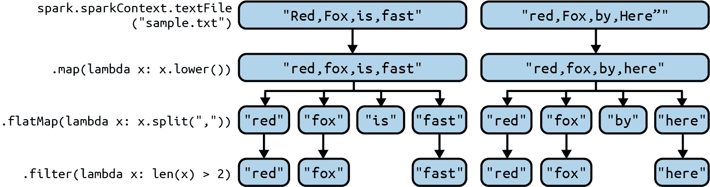

# 第一章：Spark 和 PySpark 简介

Spark 是一个强大的大数据分析引擎，旨在实现速度、易用性和大数据应用的可扩展性。它是被许多每天处理大数据的公司广泛采用的验证技术。尽管 Spark 的“原生”语言是 Scala（大部分 Spark 是用 Scala 开发的），它也提供了 Java、Python 和 R 的高级 API。

在本书中，我们将使用 PySpark，它是一个将 Spark 编程模型暴露给 Python 的 API。由于 Python 是最易于访问的编程语言，加上 Spark 强大而表达力强的 API，PySpark 的简洁性使其成为我们的最佳选择。PySpark 是 Spark 在 Python 编程语言中的接口，提供以下两个重要功能：

+   允许我们使用 Python API 编写 Spark 应用程序。

+   它提供了 *PySpark shell*，用于在分布式环境中交互式分析数据。

本章的目的是介绍 PySpark 作为 Spark 生态系统的主要组件，并展示它可以有效用于大数据任务，如 ETL 操作、索引数十亿个文档、摄入数百万基因组、机器学习、图数据分析、DNA 数据分析等。我将首先回顾 Spark 和 PySpark 的架构，并提供示例展示 PySpark 的表达能力。我将概述 Spark 的核心功能（转换和动作）和概念，以便您可以立即开始使用 Spark 和 PySpark。Spark 的主要数据抽象包括弹性分布式数据集（RDDs）、DataFrame 和 Dataset。正如您将看到的，您可以在任何 RDDs 和 DataFrame 的组合中表示您的数据（存储为 Hadoop 文件、Amazon S3 对象、Linux 文件、集合数据结构、关系数据库表等）。

一旦您的数据被表示为 Spark 数据抽象，您可以对其进行转换，并创建新的数据抽象，直到数据处于您所需的最终形式。Spark 的转换操作（如 `map()` 和 `reduceByKey()`）可用于将数据从一种形式转换为另一种形式，直到您获得所需的结果。稍后我将简要解释这些数据抽象，但首先，让我们深入探讨一下为什么 Spark 是进行数据分析的最佳选择。

# 为什么选择 Spark 进行数据分析

Spark 是一个强大的分析引擎，可用于大规模数据处理。使用 Spark 的最重要原因包括：

+   Spark 简单、强大且快速。

+   Spark 是自由开源的。

+   Spark 可在各处运行（Hadoop、Mesos、Kubernetes、独立模式或云中）。

+   Spark 可读取/写入来自/到任何数据源的数据（Amazon S3、Hadoop HDFS、关系数据库等）。

+   Spark 可以与几乎任何数据应用集成。

+   Spark 可以读取/写入行格式（例如 Avro）和列格式（例如 Parquet 和 ORC）的数据。

+   Spark 提供了丰富而简单的 API，用于各种 ETL 过程。

在过去五年中，Spark 已经发展到我认为可以用来解决任何大数据问题的程度。这一观点得到了支持，因为所有的大数据公司，如 Facebook、Illumina、IBM 和 Google，每天都在生产系统中使用 Spark。

Spark 是处理大规模数据和解决 MapReduce 问题及其他问题的最佳选择之一，因为它通过强大的 API 和速度处理大数据，释放数据的力量。使用 MapReduce/Hadoop 解决大数据问题很复杂，即使是解决原始问题，你也必须编写大量的低级代码 — 这就是 Spark 的强大和简单之处。Apache [Spark](http://spark.apache.org)比 Apache [Hadoop](http://hadoop.apache.org)快得多，因为它使用内存缓存和优化执行来提供快速性能，并支持通用批处理、流式分析、机器学习、图算法和 SQL 查询。

对于 PySpark，Spark 有两种基本的数据抽象：RDD 和 DataFrame。我将教你如何读取数据并将其表示为 RDD（相同类型元素的集合）或 DataFrame（带有命名列的行表），这使你可以在分布式数据集合上施加结构，实现更高级别的抽象。一旦数据被表示为 RDD 或 DataFrame，你可以对其应用转换函数（如映射器、过滤器和减少器），将数据转换为所需的形式。我将呈现许多用于 ETL 过程、分析和数据密集型计算的 Spark 转换。

一些简单的 RDD 转换在图 1-1 中表示。



###### 图 1-1\. 简单的 RDD 转换

本图显示了以下转换：

1.  首先，我们使用`SparkSession`的实例读取我们的输入数据（表示为文本文件，*sample.txt* — 这里只显示了输入数据的前两行/记录）。`SparkSession`是编程 Spark 的入口点。`SparkSession`实例表示为`spark`对象。读取输入会创建一个新的 RDD，类型为`RDD[String]`：每个输入记录被转换为`String`类型的 RDD 元素（如果您的输入路径有*N*条记录，则 RDD 元素的数量为*N*）。这是通过以下代码实现的：

    ```
    # Create an instance of SparkSession
    spark = SparkSession.builder.getOrCreate()
    # Create an RDD[String], which represents all input
    # records; each record becomes an RDD element
    records = spark.sparkContext.textFile("sample.txt")
    ```

1.  接下来，我们将所有字符转换为小写字母。这通过`map()`转换来实现，它是一种 1 对 1 的转换：

    ```
    # Convert each element of the RDD to lowercase
    # x denotes a single element of the RDD
    # records: source RDD[String]
    # records_lowercase: target RDD[String]
    records_lowercase = records.map(lambda x: x.lower())
    ```

1.  然后，我们使用`flatMap()`转换，这是一种 1 对多的转换，将每个元素（表示单个记录）转换为目标元素序列（每个单词表示一个元素）。`flatMap()`转换通过首先将函数（此处为`split(",")`）应用于源 RDD 的所有元素，然后展平结果，返回一个新的 RDD：

    ```
    # Split each record into a list of words
    # records_lowercase: source RDD[String]
    # words: target RDD[String]
    words = records_lowercase.flatMap(lambda x: x.split(","))
    ```

1.  最后，我们删除长度小于或等于 2 的单词元素。以下`filter()`转换将删除不需要的单词，仅保留长度大于 2 的单词：

    ```
    # Keep words with a length greater than 2
    # x denotes a word
    # words: source RDD[String]
    # filtered: target RDD[String]
    filtered = words.filter(lambda x: len(x) > 2)
    ```

正如你所观察到的，Spark 的转换是高级别的、强大的和简单的。Spark 天生具有分布式和并行的特性：你的输入数据被分区，并且可以在集群环境中并行地被转换（如 mappers、filters 和 reducers）。简而言之，要在 PySpark 中解决数据分析问题，你需要读取数据并将其表示为 RDD 或 DataFrame（取决于数据格式的特性），然后编写一系列转换来将数据转换为所需的输出。Spark 会自动分区你的 DataFrame 和 RDD，并将这些分区分发到不同的集群节点上。分区是 Spark 中并行性的基本单位。并行性使开发者能够在集群中的数百台计算机服务器上并行且独立地执行任务。在 Spark 中，分区是存储在集群节点上的数据的逻辑分割（块）。DataFrame 和 RDD 是分区的集合。Spark 为 RDD 和 DataFrame 提供了默认的数据分区器，但你也可以使用自定义编程来覆盖该分区。

接下来，让我们深入了解一下 Spark 的生态系统和架构。

## Spark 生态系统

Spark 的生态系统显示在图 1-2 中。它有三个主要组成部分：

环境

Spark 可以在任何地方运行，并且与其他环境集成良好。

应用

Spark 与各种大数据平台和应用程序集成良好。

数据源

Spark 可以从许多数据源读取和写入数据。


###### 图 1-2。Spark 生态系统（来源：Databricks）

Spark 广泛的生态系统使得 PySpark 成为 ETL、数据分析等多种任务的强大工具。使用 PySpark，你可以从许多不同的数据源（如 Linux 文件系统、Amazon S3、Hadoop 分布式文件系统、关系表、MongoDB、Elasticsearch、Parquet 文件等）读取数据，并将其表示为 Spark 数据抽象，如 RDD 或 DataFrame。一旦你的数据处于这种形式，你可以使用一系列简单而强大的 Spark 转换将数据转换为所需的形状和格式。例如，你可以使用`filter()`转换来删除不需要的记录，使用`groupByKey()`按你需要的键对数据进行分组，最后使用`mapValues()`转换来对分组数据进行最终聚合（如找到数字的平均值、中位数和标准偏差）。所有这些转换都可以通过简单但强大的 PySpark API 实现。

## Spark 架构

当你有少量数据时，可以在合理的时间内用单台计算机进行分析。当你有大量数据时，使用单台计算机进行数据分析、处理和存储可能会非常慢，甚至不可能。这就是为什么我们要使用 Spark。

Spark 包括核心库和一组内置库（SQL、GraphX、Streaming、MLlib），如图 1-3 所示。可以通过其 DataSource API 与多个数据源进行交互，如 Hadoop、HBase、Amazon S3、Elasticsearch 和 MySQL 等。


###### 图 1-3\. Spark 库

此图展示了 Spark 的真正威力：你可以使用多种不同的语言编写你的 Spark 应用程序，然后使用丰富的库来解决各种大数据问题。同时，你可以从各种数据源读取/写入数据。

### 关键术语

要理解 Spark 的架构，你需要了解一些关键术语：

`SparkSession`

定义在 `pyspark.sql` 包中的 `SparkSession` 类是使用 Dataset 和 DataFrame API 编程 Spark 的入口点。要在 Spark 集群上执行任何有用的操作，首先需要创建该类的实例，该实例提供了对 `SparkContext` 的访问。

###### 注意

[PySpark](https://oreil.ly/fSTe9) 提供了一个全面的 API（由包、模块、类和方法组成），用于访问 Spark API。需要注意的是，本书讨论的所有 Spark API、包、模块、类和方法都是特定于 PySpark 的。例如，当提到 `SparkContext` 类时，指的是 `pyspark.SparkContext` Python 类，定义在 `pyspark` 包中；提到 `SparkSession` 类时，指的是 `pyspark.sql.SparkSession` Python 类，定义在 `pyspark.sql` 模块中。

`SparkContext`

定义在 `pyspark` 包中的 `SparkContext` 类是 Spark 功能的主要入口点。`SparkContext` 保存与 Spark 集群管理器的连接，并可用于在集群中创建 RDD 和广播变量。创建 `SparkSession` 实例后，`SparkContext` 作为 `SparkSession.sparkContext` 属性在会话中可用。

驱动程序

所有 Spark 应用程序（包括 PySpark shell 和独立的 Python 程序）都作为独立的一组进程运行。这些进程由驱动程序中的 `SparkContext` 协调。要将独立的 Python 程序提交给 Spark，你需要使用 PySpark API（或 Java 或 Scala）编写驱动程序。该程序负责运行应用程序的 `main()` 函数并创建 `SparkContext`，还可以用于创建 RDD 和 DataFrame。

Worker

在 Spark 集群环境中，存在两种类型的节点：一个（或两个，用于高可用性）主节点和一组工作节点。工作节点是可以在集群中运行程序的任何节点。如果为应用程序启动了一个进程，则此应用程序在工作节点获取执行器，这些执行器负责执行 Spark 任务。

集群管理器

“主”节点称为集群管理器。此节点的主要功能是管理集群环境和 Spark 将利用其执行任务的服务器。集群管理器为每个应用程序分配资源。Spark 支持五种类型的集群管理器，具体取决于其运行位置：

1.  独立模式（Spark 内置的集群环境）

1.  [Mesos](http://mesos.apache.org)（一个分布式系统内核）

1.  [Hadoop YARN](https://oreil.ly/SICSG)

1.  [Kubernetes](https://kubernetes.io)

1.  [Amazon EC2](https://aws.amazon.com/ec2)

###### 注意

虽然在许多软件环境中，主/工作术语的使用已过时并正在被淘汰，但它仍然是 Apache Spark 功能的一部分，这也是为什么我在本书中使用这些术语的原因。

### Spark 架构概述

Spark 架构的高级视图显示在图 1-4 中。简而言之，一个 Spark 集群由一个主节点（“集群管理器”）组成，负责管理 Spark 应用程序，以及一组“工作”（执行器）节点，负责执行 Spark 应用程序提交的任务（您希望在 Spark 集群上运行的应用程序）。


###### 图 1-4\. Spark 架构

根据 Spark 运行的环境不同，管理此服务器集群的集群管理器可能是 Spark 的独立集群管理器、Kubernetes、Hadoop YARN 或 Mesos。当 Spark 集群运行时，您可以向集群管理器提交 Spark 应用程序，后者将为您的应用程序分配资源，以便您完成数据分析。

您的集群可能拥有一个、几十个、上百个，甚至上千个工作节点，具体取决于您业务和项目需求。您可以在独立服务器上（如 MacBook、Linux 或 Windows PC）上运行 Spark，但通常情况下，生产环境中 Spark 会在一组 Linux 服务器的集群上运行。要运行 Spark 程序，您需要访问一个 Spark 集群，并拥有一个驱动程序，该程序声明了对 RDD 数据的转换和操作，并将这些请求提交给集群管理器。在本书中，所有的驱动程序都将使用 PySpark 编写。

当您启动 PySpark shell（通过执行`*<spark-installed-dir>*/bin/pyspark`）时，您将自动获得定义的两个变量/对象：

`spark`

一个`SparkSession`的实例，非常适合创建 DataFrames

`sc`

一个`SparkContext`的实例，非常适合创建 RDDs

如果您编写一个独立的 PySpark 应用程序（使用 PySpark API 的 Python 驱动程序），那么您必须显式地自行创建`SparkSession`的实例。`SparkSession`可用于：

+   创建 DataFrames

+   将 DataFrames 注册为表

+   在表上执行 SQL 并缓存表

+   读取/写入文本、CSV、JSON、Parquet 和其他文件格式

+   读取/写入关系型数据库表

PySpark 将`SparkSession`定义为：

```
pyspark.sql.SparkSession (Python class, in pyspark.sql module)
class pyspark.sql.SparkSession(sparkContext,jsparkSession=None)
```

```
SparkSession: the entry point to programming Spark with the RDD
and DataFrame API.
```

要在 Python 中创建`SparkSession`，请使用此处显示的构建器模式：

```
# import required Spark class
from pyspark.sql import SparkSession 

# create an instance of SparkSession as spark
spark = SparkSession.builder \ 
  .master("local") \
  .appName("my-application-name") \
  .config("spark.some.config.option", "some-value") \ 
  .getOrCreate() 

# to debug the SparkSession
print(spark.version) 

# create a reference to SparkContext as sc
# SparkContext is used to create new RDDs
sc = spark.sparkContext 

# to debug the SparkContext
print(sc)
```


从`pyspark.sql`模块导入`SparkSession`类。


提供用于构建`SparkSession`实例的 Builder API 的访问。


设置一个`config`选项。使用此方法设置的选项会自动传播到`SparkConf`和`SparkSession`自身的配置中。创建`SparkSession`对象时，可以定义任意数量的`config(*<key>*, *<value>*)`选项。


获取现有的`SparkSession`或者如果没有，则根据此处设置的选项创建一个新的。


仅用于调试目的。


`SparkContext`可以从`SparkSession`的实例中引用。

PySpark 将`SparkContext`定义为：

```
class pyspark.SparkContext(master=None, appName=None, ...)
```

```
SparkContext: the main entry point for Spark functionality.
A SparkContext represents the connection to a Spark cluster,
and can be used to create RDD (the main data abstraction for
Spark) and broadcast variables (such as collections and data
structures) on that cluster.
```

`SparkContext`是 Spark 功能的主要入口点。Shell（例如 PySpark shell）或 PySpark 驱动程序不能创建多个`SparkContext`实例。`SparkContext`表示与 Spark 集群的连接，并可用于在该集群上创建新的 RDD 和广播变量（共享数据结构和集合—一种只读全局变量）。图 1-5 显示了如何使用`SparkContext`从输入文本文件（标记为`records_rdd`）创建新的 RDD，然后使用`flatMap()`转换将其转换为另一个 RDD（标记为`words_rdd`）。正如您所见，`RDD.flatMap(*f*)`通过首先将函数（*`f`*）应用于源 RDD 的所有元素，然后展平结果，返回一个新的 RDD。


###### 图 1-5\. 由`SparkContext`创建 RDDs

要创建`SparkSession`和`SparkContext`对象，请使用以下模式：

```
    # create an instance of SparkSession
    spark_session = SparkSession.builder.getOrCreate()

    # use the SparkSession to access the SparkContext
    spark_context = spark_session.sparkContext
```

如果您只会处理 RDDs，可以按以下方式创建`SparkContext`的实例：

```
    from pyspark import SparkContext
    spark_context = SparkContext("local", "myapp");
```

现在您已经了解了 Spark 的基础知识，让我们深入了解一下 PySpark。

# PySpark 的强大之处

PySpark 是 Apache Spark 的 Python API，旨在支持 Spark 与 Python 编程语言之间的协作。大多数数据科学家已经了解 Python，PySpark 使他们能够使用 Spark 编写简短、简洁的分布式计算代码变得更加容易。简而言之，它是一个全能生态系统，可以通过支持 RDDs、DataFrames、GraphFrames、MLlib、SQL 等复杂数据要求来处理数据。

我将向您展示 PySpark 的惊人功能，以一个简单的例子。假设我们有大量记录，这些记录包含用户访问 URL 的数据（由搜索引擎从许多 Web 服务器收集），格式如下：

```
<url_address><,><frequency>

```

下面是这些记录的几个示例：

```
http://mapreduce4hackers.com,19779
http://mapreduce4hackers.com,31230
http://mapreduce4hackers.com,15708
...
https://www.illumina.com,87000
https://www.illumina.com,58086
...
```

假设我们想要查找每个键（即`url_address`）的访问次数的平均值、中位数和标准偏差。另一个要求是，我们希望丢弃长度小于 5 的记录（因为这些可能是格式错误的 URL）。可以轻松地在 PySpark 中表达一个优雅的解决方案，正如图 1-6 所示。


###### 图 1-6\. 计算平均值、中位数和标准偏差的简单工作流程

首先，让我们创建一些基本的 Python 函数，这些函数将帮助我们解决简单的问题。第一个函数`create_pair()`接受形式为`<url_address><,><frequency>`的单个记录，并返回一个（键，值）对（这将使我们能够稍后在键字段上执行`GROUP BY`），其中键是`url_address`，值是关联的`frequency`：

```
 # Create a pair of (url_address, frequency)
 # where url_address is a key and frequency is a value
 # record denotes a single element of RDD[String]
 # record: <url_address><,><frequency>
 def create_pair(record): 
     tokens = record.split(',') 
     url_address = tokens[0]
     frequency = tokens[1]
     return (url_address, frequency) 
 #end-def
```


接受形式为`<url_address><,><frequency>`的记录。


使用`url_address`作为键（`tokens[0]`）和`frequency`作为值（`tokens[1]`）对输入记录进行标记化。


返回一对`（url_address，frequency）`。

下一个函数`compute_stats()`接受频率列表（作为数字）并计算三个值，平均值、中位数和标准偏差：

```
 # Compute average, median, and standard
 # deviation for a given set of numbers
 import statistics 
 # frequencies = [number1, number2, ...]
 def compute_stats(frequencies): 
 	average = statistics.mean(frequencies) 
 	median = statistics.median(frequencies) 
 	standard_deviation = statistics.stdev(frequencies) 
 	return (average, median, standard_deviation) 
 #end-def
```


该模块提供了用于计算数值数据的数学统计函数。


接受频率列表。


计算频率的平均值。


计算频率的中位数。


计算频率的标准偏差。


返回三元组作为结果。

接下来，我将在几行代码中展示 PySpark 的强大功能，使用 Spark 转换和我们的自定义 Python 函数：

```
# input_path = "s3://<bucket>/key"
input_path = "/tmp/myinput.txt"
results = spark 
        .sparkContext 
        .textFile(input_path) 
        .filter(lambda record: len(record) > 5) 
        .map(create_pair) 
        .groupByKey() 
        .mapValues(compute_stats) 
```


`spark` 表示 `SparkSession` 的一个实例，这是编程 Spark 的入口点。


`sparkContext`（`SparkSession` 的一个属性）是 Spark 功能的主要入口点。


将数据作为分布式 `String` 记录集合读取（创建 `RDD[String]`）。


删除长度小于或等于 5 的记录（保留长度大于 5 的记录）。


从输入记录中创建 `(url_address, frequency)` 对。


按键分组数据——每个键（一个 `url_address`）将与一个频率列表关联。


将 `compute_stats()` 函数应用于频率列表。

结果将是一组形如 `(key, value)` 的键值对：

```
(url_address, (average, median, standard_deviation))
```

其中 `url-address` 是键，`(average, median, standard_deviation)` 是值。

###### 注意

Spark 最重要的特点是通过数据分区最大化函数和操作的并发性。考虑一个例子：

如果您的输入数据有 6000 亿行，并且您使用了 10 个节点的集群，则您的输入数据将被分成 *`N`* (> 1) 个块，这些块将独立并行处理。如果 `*N*=20,000`（块或分区的数量），那么每个块大约会有 3 千万条记录/元素（600,000,000,000 / 20,000 = 30,000,000）。如果您有一个大型集群，那么这 20,000 个块可能会一次性处理完毕。如果您有一个较小的集群，可能只有每隔 100 个块可以独立并行处理。这个过程会一直持续，直到所有 20,000 个块都处理完毕。

## PySpark 架构

PySpark 是建立在 Spark 的 Java API 之上的。数据在 Python 中处理，并在 Java 虚拟机（JVM）中进行缓存/洗牌（我将在 第二章 中讨论洗牌的概念）。PySpark 架构的高层视图如 图 1-7 所示。


###### 图 1-7\. PySpark 架构

PySpark 的数据流程如 图 1-8 所示。


###### 图 1-8\. PySpark 数据流

在 Python 驱动程序（即 Python 中的 Spark 应用程序）中，`SparkContext` 使用 [Py4J](https://www.py4j.org) 来启动 JVM，创建 `JavaSparkContext`。Py4J 仅用于驱动程序，用于 Python 和 Java `SparkContext` 对象之间的本地通信；大数据传输通过其他机制进行。Python 中的 RDD 转换映射到 Java 中的 `PythonRDD` 对象上。在远程工作节点上，`PythonRDD` 对象启动 Python 子进程，并通过管道与其通信，发送用户的代码和要处理的数据。

###### 注意

Py4J 允许运行在 Python 解释器中的 Python 程序动态访问 JVM 中的 Java 对象。方法调用就像 Java 对象驻留在 Python 解释器中一样，并且可以通过标准 Python 集合方法访问 Java 集合。Py4J 还使 Java 程序能够回调 Python 对象。

# Spark 数据抽象

在 Python 编程语言中操作数据时，您使用整数、字符串、列表和字典。在 Spark 中操作和分析数据时，您必须将其表示为 Spark 数据集。Spark 支持三种类型的数据集抽象：

+   RDD（弹性分布式数据集）：

    +   低级 API

    +   用 `RDD[T]` 表示（每个元素类型为 `T`）

+   数据框（类似于关系表）：

    +   高级 API

    +   由 `表(column_name_1, column_name_2, ...)` 表示

+   数据集（类似于关系表）：

    +   高级 API（在 PySpark 中不可用）

数据集数据抽象用于强类型语言，如 Java，并不支持 PySpark。RDD 和 DataFrame 将在后续章节详细讨论，但我会在这里简要介绍。

## RDD 示例

实质上，RDD 将数据表示为元素的集合。它是类型 `T` 的不可变分布式元素集合，表示为 `RDD[T]`。

表 1-1 展示了三种简单类型的 RDD 示例：

`RDD[整数]`

每个元素都是一个 `整数`。

`RDD[字符串]`

每个元素都是一个 `字符串`。

`RDD[(字符串, 整数)]`

每个元素都是一个 `(字符串, 整数)` 对。

表 1-1\. 简单的 RDDs

| RDD[整数] | RDD[字符串] | RDD[(字符串, 整数)] |
| --- | --- | --- |
| `2` | `"abc"` | `('A', 4)` |
| `-730` | `"fox is red"` | `('B', 7)` |
| `320` | `"Python is cool"` | `('ZZ', 9)` |
| … | … | … |

表 1-2 是复杂 RDD 的示例。每个元素都是一个 (键, 值) 对，其中键是一个 `字符串`，值是一个三元组 `(整数, 整数, 浮点数)`。

表 1-2\. 复杂的 RDD

| `RDD[(字符串, (整数, 整数, 浮点数))]` |
| --- |
| `("cat", (20, 40, 1.8))` |
| `("cat", (30, 10, 3.9))` |
| `("lion king", (27, 32, 4.5))` |
| `("python is fun", (2, 3, 0.6))` |
| … |

## Spark RDD 操作

Spark RDD 是只读的、不可变的和分布式的。一旦创建，它们就无法更改：不能向 RDD 添加记录、删除记录或更新记录。但是可以对其进行转换。RDD 支持两种类型的操作：转换操作（将源 RDD（们）转换为一个或多个新 RDD）和动作操作（将源 RDD（们）转换为非 RDD 对象，如字典或数组）。RDD、转换和动作之间的关系如图 1-9 所示。


###### 图 1-9\. RDD、转换和动作

我们将在接下来的章节中详细讨论 Spark 的转换，并通过工作示例帮助您理解它们，但我将在此简要介绍。

### 转换

A transformation in Spark is a function that takes an existing RDD (the source RDD), applies a transformation to it, and creates a new RDD (the target RDD). Examples include: `map()`, `flatMap()`, `groupByKey()`, `reduceByKey()`, and `filter()`.

Informally, we can express a transformation as:

```
transformation: source_RDD[V] --> target_RDD[T] 
```


将类型为 `V` 的 `source_RDD` 转换为类型为 `T` 的 `target_RDD`。

RDD 在执行动作操作之前不会被评估：这意味着转换操作是延迟评估的。如果在转换过程中出现 RDD 失败，转换的数据血统会重建 RDD。

大多数 Spark 转换都会创建一个单独的 RDD，但也可能会创建多个目标 RDD。目标 RDD 可能比源 RDD 更小、更大或者大小相同。

下面的例子展示了一系列的转换：

```
tuples = [('A', 7), ('A', 8), ('A', -4),
          ('B', 3), ('B', 9), ('B', -1),
          ('C', 1), ('C', 5)]
rdd = spark.sparkContext.parallelize(tuples)

# drop negative values
positives = rdd.filter(lambda x: x[1] > 0)
positives.collect()
[('A', 7), ('A', 8), ('B', 3), ('B', 9), ('C', 1), ('C', 5)]

# find sum and average per key using groupByKey()
sum_and_avg = positives.groupByKey()
    .mapValues(lambda v: (sum(v), float(sum(v))/len(v)))

# find sum and average per key using reduceByKey()
# 1\. create (sum, count) per key
sum_count = positives.mapValues(lambda v: (v, 1))
# 2\. aggregate (sum, count) per key
sum_count_agg = sum_count.reduceByKey(lambda x, y:
     (x[0]+y[0], x[1]+y[1]))
# 3\. finalize sum and average per key
sum_and_avg = sum_count_agg.mapValues(
    lambda v: (v[0], float(v[0])/v[1]))
```

###### 提示

`groupByKey()` 转换会将 RDD 中每个键的值分组为一个单一的序列，类似于 SQL 的 `GROUP BY` 语句。当每个键的值数量达到数千或数百万时，这种转换可能会导致内存不足（OOM）错误，因为数据会通过 Spark 服务器的网络发送，并在 reducer/workers 上收集。

但是，使用 `reduceByKey()` 转换时，数据在每个分区中进行合并，因此每个键在每个分区中只有一个输出需要发送到 Spark 服务器的网络上。这使得它比 `groupByKey()` 更具可扩展性。`reduceByKey()` 使用关联和可交换的 reduce 函数将每个键的值合并。它将所有值（每个键）合并为具有相同数据类型的另一个值（这是一个限制，可以通过使用 `combineByKey()` 转换来克服）。总体而言，`reduceByKey()` 比 `groupByKey()` 更具可伸缩性。我们将在第四章更详细地讨论这些问题。

### 动作

Spark actions are RDD operations or functions that produce non-RDD values. Informally, we can express an action as:

```
action: RDD => non-RDD value
```

操作可能触发 RDD 的评估（你会记得，RDD 是惰性评估的）。然而，操作的输出是一个具体的值：一个保存的文件，如整数值，元素数量，值列表，字典等。

下面是一些操作示例：

`reduce()`

应用函数以生成单个值，例如为给定的`RDD[Integer]`添加值

`collect()`

将`RDD[T]`转换为类型为`T`的列表

`count()`

查找给定 RDD 中元素的数量

`saveAsTextFile()`

将 RDD 元素保存到磁盘

`saveAsMap()`

将`RDD[(K, V)]`元素保存到磁盘作为`dict[K, V]`

## DataFrame 示例

与 RDD 类似，Spark 中的 DataFrame 是一个不可变的分布式数据集合。但不同于 RDD 的是，数据被组织成了命名列，类似于关系数据库中的表。这旨在使大数据集的处理更加简单。DataFrames 允许程序员对分布式数据集合施加结构，提供了更高级别的抽象。它们还比 RDD 更容易处理 CSV 和 JSON 文件。

下面的 DataFrame 示例有三列：

```
DataFrame[name, age, salary]
name: String, age: Integer, salary: Integer

+-----+----+---------+
| name| age|   salary|
+-----+----+---------+
|  bob|  33|    45000|
| jeff|  44|    78000|
| mary|  40|    67000|
|  ...| ...|      ...|
+-----+----+---------+
```

DataFrame 可以从许多不同的源创建，如 Hive 表、结构化数据文件（SDF）、外部数据库或现有的 RDD。DataFrames API 专为现代大数据和数据科学应用程序设计，灵感来自 R 中的 DataFrames 和 Python 中的 pandas。正如我们将在后面的章节中看到的，我们可以对 DataFrames 执行 SQL 查询。

Spark SQL 提供了一套强大的 DataFrame 操作，包括：

+   聚合函数（最小值、最大值、总和、平均值等）

+   集合函数

+   数学函数

+   排序函数

+   字符串函数

+   用户定义的函数（UDFs）

例如，你可以轻松地读取 CSV 文件，并从中创建一个 DataFrame：

```
# define input path
virus_input_path = "s3://mybucket/projects/cases/case.csv"

# read CSV file and create a DataFrame
cases_dataframe = spark.read.load(virus_input_path,format="csv",
   sep=",", inferSchema="true", header="true")

# show the first 3 rows of created DataFrame
cases_dataframe.show(3)
+-------+-------+-----------+--------------+---------+
|case_id|country|       city|infection_case|confirmed|
+-------+-------+-----------+--------------+---------+
|  C0001|    USA|   New York|       contact|      175|
+-------+-------+-----------+--------------+---------+
|  C0008|    USA| New Jersey|       unknown|       25|
+-------+-------+-----------+--------------+---------+
|  C0009|    USA|  Cupertino|       contact|      100|
+-------+-------+-----------+--------------+---------+
```

要按病例数量降序排序结果，我们可以使用`sort()`函数：

```
# We can do this using the F.desc function:
from pyspark.sql import functions as F
cases_dataframe.sort(F.desc("confirmed")).show()
+-------+-------+-----------+--------------+---------+
|case_id|country|       city|infection_case|confirmed|
+-------+-------+-----------+--------------+---------+
|  C0001|    USA|   New York|       contact|      175|
+-------+-------+-----------+--------------+---------+
|  C0009|    USA|  Cupertino|       contact|      100|
+-------+-------+-----------+--------------+---------+
|  C0008|    USA| New Jersey|       unknown|       25|
+-------+-------+-----------+--------------+---------+
```

我们也可以轻松地过滤行：

```
cases_dataframe.filter((cases_dataframe.confirmed > 100) &
                       (cases_dataframe.country == 'USA')).show()

+-------+-------+-----------+--------------+---------+
|case_id|country|       city|infection_case|confirmed|
+-------+-------+-----------+--------------+---------+
|  C0001|    USA|   New York|       contact|      175|
+-------+-------+-----------+--------------+---------+
...
```

为了让你更好地理解 Spark 的 DataFrames 的强大，让我们通过一个例子来详细说明。我们将创建一个 DataFrame，并查找每个部门员工工作小时数的平均值和总和：

```
# Import required libraries
from pyspark.sql import SparkSession
from pyspark.sql.functions import avg, sum

# Create a DataFrame using SparkSession
spark = SparkSession.builder.appName("demo").getOrCreate()
dept_emps = [("Sales", "Barb", 40), ("Sales", "Dan", 20),
             ("IT", "Alex", 22), ("IT", "Jane", 24),
             ("HR", "Alex", 20), ("HR", "Mary", 30)]
df = spark.createDataFrame(dept_emps, ["dept", "name", "hours"])

# Group the same depts together, aggregate their hours, and compute an average
averages = df.groupBy("dept")
   .agg(avg("hours").alias('average'),
        sum("hours").alias('total'))

# Show the results of the final execution
averages.show()
+-----+--------+------+
| dept| average| total|
+-----+--------+------+
|Sales|    30.0|  60.0|
|   IT|    23.0|  46.0|
|   HR|    25.0|  50.0|
+-----+--------+------+
```

正如你所见，Spark 的 DataFrames 足以使用简单但强大的函数操作数十亿行数据。

# 使用 PySpark Shell

你可以使用 PySpark 的两种主要方式：

+   使用 PySpark shell（用于测试和交互式编程）。

+   在独立应用程序中使用 PySpark。在这种情况下，你会使用 PySpark API 编写一个 Python 驱动程序（比如*my_pyspark_program.py*），然后使用`spark-submit`命令运行它：

    ```
    export SUBMIT=$SPARK_HOME/bin/spark-submit
    $SUBMIT [options] my_pyspark_program.py *<parameters>*
    ```

    这里*`<parameters>`*是你的 PySpark 程序（*my_pyspark_program.py*）消耗的参数列表。

###### 注意

有关使用`spark-submit`命令的详细信息，请参阅 Spark 文档中的[“提交应用程序”](https://spark.apache.org/docs/latest/submitting-applications.html)。

在本节中，我们将专注于 Python 用户的 Spark 交互式 shell，这是一个强大的工具，可以用于交互式分析数据并立即查看结果（Spark 还提供 Scala shell）。PySpark shell 可以在单机安装和集群安装的 Spark 上运行。您可以使用以下命令启动 shell，其中`SPARK_HOME`表示您系统上 Spark 的安装目录：

```
export SPARK_HOME=*<spark-installation-directory>*
$SPARK_HOME/bin/pyspark
```

例如：

```
export SPARK_HOME="/home/spark" 
$SPARK_HOME/bin/pyspark 
Python 3.7.2

Welcome to Spark version 3.1.2
Using Python version 3.7.2
SparkSession available as *spark*.
SparkContext available as *sc*
>>>
```


定义 Spark 安装目录。


调用 PySpark shell。

当您启动 shell 时，PySpark 会显示一些有用的信息，包括正在使用的 Python 和 Spark 版本（请注意，此处的输出已经被缩短）。`>>>`符号用作 PySpark shell 提示符。此提示符表示您现在可以编写 Python 或 PySpark 命令并查看结果。

为了让您熟悉 PySpark shell，接下来的几节将引导您完成一些基本使用示例。

## 启动 PySpark Shell。

要进入 PySpark shell，我们执行以下命令：`pyspark`。

```
$SPARK_HOME/bin/pyspark  
```

```
Welcome to
      ____              __
     / __/__  ___ _____/ /__
    _\ \/ _ \/ _ `/ __/  '_/
   /__ / .__/\_,_/_/ /_/\_\   version 3.1.2
      /_/

SparkSession available as 'spark'.
SparkContext available as 'sc'.
```

```
>>> sc.version 
'3.1.2'
>>> spark.version 
'3.1.2'
```


执行`pyspark`将创建一个新的 shell。这里的输出已经被缩短。


确认`SparkContext`已创建为`sc`。


确认`SparkSession`已创建为`spark`。

一旦进入 PySpark shell，将创建`SparkSession`实例作为`spark`变量，并创建`SparkContext`实例作为`sc`变量。如您在本章早些时候学到的，`SparkSession`是使用 Dataset 和 DataFrame API 编程 Spark 的入口点；`SparkSession`可用于创建 DataFrame，将 DataFrame 注册为表，对表执行 SQL，缓存表，并读取 CSV、JSON 和 Parquet 文件。如果要在独立应用程序中使用 PySpark，则必须使用生成器模式显式创建`SparkSession`，如"Spark architecture in a nutshell"所示。`SparkContext`是 Spark 功能的主要入口点；它可用于从文本文件和 Python 集合创建 RDD。接下来我们会详细讨论这一点。

## 从集合创建 RDD。

Spark 使我们能够从文件和集合（如数组和列表等数据结构）创建新的 RDD。在这里，我们使用`SparkContext.parallelize()`从集合（表示为`data`）创建一个新的 RDD：

```
>>> data =  ![1
    ("fox", 6), ("dog", 5), ("fox", 3), ("dog", 8),
    ("cat", 1), ("cat", 2), ("cat", 3), ("cat", 4)
]

>>># use SparkContext (sc) as given by the PySpark shell
>>># create an RDD as rdd
>>> rdd = sc.parallelize(data) 
>>> rdd.collect() 
[
 ('fox', 6), ('dog', 5), ('fox', 3), ('dog', 8),
 ('cat', 1), ('cat', 2), ('cat', 3), ('cat', 4)
]
>>> rdd.count() 
8
```


定义您的 Python 集合。


从 Python 集合创建新的 RDD。


显示新 RDD 的内容。


计算 RDD 中元素的数量。

## 聚合和合并键的值

`reduceByKey()`转换用于使用可结合和可交换的减少函数合并和聚合值。在此示例中，`x`和`y`指的是同一键的值：

```
>>> sum_per_key = rdd.reduceByKey(lambda x, y : x+y) 
>>> sum_per_key.collect() 
[
 ('fox', 9),
 ('dog', 13),
 ('cat', 10)
]
```


合并和聚合相同键的值。


收集 RDD 的元素。

此转换的源 RDD 必须由（键，值）对组成。`reduceByKey()`使用可结合和可交换的减少函数为每个键合并值。这也会在每个 mapper 上本地执行合并，然后将结果发送到 reducer，类似于 MapReduce 中的“combiner”。输出将使用`numPartitions`分区或未指定`numPartitions`时的默认并行级别进行分区。默认分区器是`HashPartitioner`。

如果`T`是（键，值）对值的类型，则可以将`reduceByKey()`的`func()`定义为：

```
# source_rdd : RDD[(K, T)]
# target_rdd : RDD[(K, T)]
target_rdd = source_rdd.reduceByKey(lambda x, y: func(x, y))
# OR you may write it by passing the function name
# target_rdd = source_rdd.reduceByKey(func)
# where
#      func(T, T) -> T
# Then you may define `func()` in Python as:
# x: type of T
# y: type of T
def func(x, y):
  result = *`<``aggregation` `of` `x` `and` `y``:` `return` `a` `result` `of` `type` `T``>`*
  return result
#end-def
```

这意味着：

+   函数`func()`有两个相同类型的输入参数`T`。

+   `func()`的返回类型必须与输入类型`T`相同（如果使用`combineByKey()`转换，则可以避免此限制）。

+   Reducer `func()`必须是可结合的。非正式地说，集合`T`上的二元操作`f()`称为可结合的，如果它满足结合律，即分组数字的顺序不改变操作的结果。

    # 结合律

    ```
    f(f(x, y), z) = f(x, f(y, z))
    ```

    注意，加法（+）和乘法（*）遵循结合律，但减法（-）或除法（/）不遵循。

+   Reducer `func()`必须是可交换的：非正式地说，对于所有值`x`和`y`，函数`f()`满足`f(x, y) = f(y, x)`。也就是说，数字的顺序变化不应影响操作的结果。

    # 交换律

    ```
    f(x, y) = f(y, x)
    ```

    加法和乘法也遵循交换律，但减法或除法不遵循。例如：

    5 + 3 = 3 + 5，但是 5 - 3 ≠ 3 - 5

因此，在`reduceByKey()`转换中不得使用减法或除法操作。

## 过滤 RDD 的元素

接下来，我们将使用`filter()`转换返回一个新的 RDD，其中仅包含满足谓词的元素：

```
>>> sum_filtered = sum_per_key.filter(lambda x : x[1] > 9) 
>>> sum_filtered.collect() 
[
 ('cat', 10),
 ('dog', 13)
]
```


如果值大于 9，则保留（键，值）对。


收集 RDD 的元素。

## 分组相似键

我们可以使用`groupByKey()`转换将 RDD 中每个键的值分组为单个序列：

```
>>> grouped = rdd.groupByKey() 
>>> grouped.collect() 

 ('fox', <ResultIterable object at 0x10f45c790>), ![3
 ('dog', <ResultIterable object at 0x10f45c810>),
 ('cat', <ResultIterable object at 0x10f45cd90>)
]
>>>
>>># list(v) converts v as a ResultIterable into a list
>>> grouped.map(lambda (k,v) : (k, list(v))).collect()  
[
 ('fox', [6, 3]),
 ('dog', [5, 8]),
 ('cat', [1, 2, 3, 4])
]
```


将相同键的元素分组成元素序列。


查看结果。


`ResultIterable` 的全名是 `pyspark.resultiterable.ResultIterable`。


先应用 `map()` 然后是 `collect()`，它返回一个包含结果 RDD 中所有元素的列表。`list()` 函数将 `ResultIterable` 转换为对象列表。

此转换的源 RDD 必须由（键，值）对组成。`groupByKey()` 将 RDD 中每个键的值分组为单个序列，并使用 `numPartitions` 分区进行哈希分区生成结果 RDD，或者如果未指定 `numPartitions`，则使用默认并行度。请注意，如果您正在分组（使用 `groupByKey()` 转换）以执行诸如求和或平均值之类的聚合操作，使用 `reduceByKey()` 或 `aggregateByKey()` 将提供更好的性能。

## 聚合相似键的值

要对每个键的值进行聚合和求和，我们可以使用 `mapValues()` 转换和 `sum()` 函数：

```
>>> aggregated = grouped.mapValues(lambda values : sum(values)) 
>>> aggregated.collect() 
[
 ('fox', 9),
 ('dog', 13),
 ('cat', 10)
]
```


`values` 是每个键的值序列。我们通过映射函数将每个（键，值）对 RDD 中的所有值相加（使用 `sum(values)`），而不改变键。


为了调试，我们返回一个包含此 RDD 中所有元素的列表。

我们有几种选择来聚合和汇总值：`reduceByKey()` 和 `groupByKey()`，仅举几例。一般而言，`reduceByKey()` 转换比 `groupByKey()` 转换更有效率。有关更多详细信息，请参阅第四章。

正如您将在接下来的章节中看到的，Spark 还有许多其他强大的转换功能，可以将一个 RDD 转换为新的 RDD。正如前面提到的，RDD 是只读的、不可变的，并且是分布式的。RDD 转换返回一个指向新 RDD 的指针，并允许您在 RDD 之间创建依赖关系。依赖链中的每个 RDD（或依赖链的字符串）都有一个用于计算其数据的函数和指向其父 RDD 的指针（依赖）。

# PySpark 的数据分析工具

[Jupyter](http://jupyter.org)

Jupyter 是一个测试和原型化程序的好工具。PySpark 也可以从 Jupyter 笔记本中使用；它非常适合探索性数据分析。

[Apache Zeppelin](https://zeppelin.apache.org)

Zeppelin 是一个基于 Web 的笔记本，支持使用 SQL、Python、Scala 等进行数据驱动的交互式数据分析和协作文档。

# 使用数据框架的 ETL 示例

在数据分析和计算中，ETL 是从一个或多个源复制数据到一个目标系统的一般过程，该系统以与源数据不同的方式或在不同的上下文中表示数据。在这里我将展示 Spark 如何实现 ETL 并使其变得简单。

对于这个 ETL 示例，我将使用 JSON 格式的 2010 年人口普查数据（*census_2010.json*）：

```
$ wc -l census_2010.json
101 census_2010.json

$ head -5 census_2010.json
{"females": 1994141, "males": 2085528, "age": 0, "year": 2010}
{"females": 1997991, "males": 2087350, "age": 1, "year": 2010}
{"females": 2000746, "males": 2088549, "age": 2, "year": 2010}
{"females": 2002756, "males": 2089465, "age": 3, "year": 2010}
{"females": 2004366, "males": 2090436, "age": 4, "year": 2010}
```

###### 注意

这些数据是从美国人口调查局数据中提取的，该数据在编写本书时仅提供男性和女性的二元选项。我们努力尽可能包容，并希望在未来，诸如此类的国家数据集将提供更多包容性选项。

让我们定义我们的 ETL 过程：

提取

首先，我们从给定的 JSON 文档创建一个 DataFrame。

转换

然后，我们过滤数据并保留老年人（`age > 54`）的记录。接下来，我们添加一个新列，`total`，即男性和女性的总数。

加载

最后，我们将修订后的 DataFrame 写入 MySQL 数据库并验证加载过程。

让我们更深入地了解这个过程。

## 提取

要进行正确的提取，我们首先需要创建一个`SparkSession`类的实例：

```
from pyspark.sql import SparkSession
spark = SparkSession.builder \
    .master("local") \
    .appName("ETL") \
    .getOrCreate()
```

接下来，我们读取 JSON 并创建一个 DataFrame：

```
>>> input_path = "census_2010.json"
>>> census_df = spark.read.json(input_path)
>>> census_df.count()
101
>>> census_df.show(200)
+---+-------+-------+----+
|age|females|  males|year|
+---+-------+-------+----+
|  0|1994141|2085528|2010|
|  1|1997991|2087350|2010|
|  2|2000746|2088549|2010|
...
| 54|2221350|2121536|2010|
| 55|2167706|2059204|2010|
| 56|2106460|1989505|2010|
...
| 98|  35778|   8321|2010|
| 99|  25673|   4612|2010|
+---+-------+-------+----+
only showing top 100 rows
```

## 转换

转换可能涉及许多过程，其目的是根据您的要求清理、格式化或对数据执行计算。例如，您可以删除缺失或重复的数据，连接列以创建新列，或过滤某些行或列。一旦通过提取过程创建了 DataFrame，我们就可以执行许多有用的转换，比如仅选择老年人：

```
>>> seniors = census_df[census_df['age'] > 54]
>>> seniors.count()
46
>>> seniors.show(200)
+---+-------+-------+----+
|age|females|  males|year|
+---+-------+-------+----+
| 55|2167706|2059204|2010|
| 56|2106460|1989505|2010|
| 57|2048896|1924113|2010|
...
| 98|  35778|   8321|2010|
| 99|  25673|   4612|2010|
|100|  51007|   9506|2010|
+---+-------+-------+----+
```

接下来，我们创建一个名为`total`的新聚合列，它将男性和女性的数量相加：

```
>>> from pyspark.sql.functions import lit
>>> seniors_final = seniors.withColumn('total',
  lit(seniors.males + seniors.females))
>>> seniors_final.show(200)
+---+-------+-------+----+-------+
|age|females|  males|year|  total|
+---+-------+-------+----+-------+
| 55|2167706|2059204|2010|4226910|
| 56|2106460|1989505|2010|4095965|
| 57|2048896|1924113|2010|3973009|
...
| 98|  35778|   8321|2010|  44099|
| 99|  25673|   4612|2010|  30285|
|100|  51007|   9506|2010|  60513|
+---+-------+-------+----+-------+
```

## 加载

加载过程涉及保存或写入转换步骤的最终输出。在这里，我们将`seniors_final` DataFrame 写入一个 MySQL 表中：

```
seniors_final\
  .write\
  .format("jdbc")\
  .option("driver", "com.mysql.jdbc.Driver")\
  .mode("overwrite")\
  .option("url", "jdbc:mysql://localhost/testdb")\
  .option("dbtable", "seniors")\
  .option("user", "root")\
  .option("password", "root_password")\
  .save()
```

加载的最后一步是验证加载过程：

```
$ `mysql` `-uroot` `-p`
Enter password: *`<``password>`*
Your MySQL connection id is 9
Server version: 5.7.30 MySQL Community Server (GPL)

mysql> use testdb;
Database changed
mysql> select * from seniors;
+------+---------+---------+------+---------+
| age  | females | males   | year | total   |
+------+---------+---------+------+---------+
|   55 | 2167706 | 2059204 | 2010 | 4226910 |
|   56 | 2106460 | 1989505 | 2010 | 4095965 |
|   57 | 2048896 | 1924113 | 2010 | 3973009 |
...
|   98 |   35778 |    8321 | 2010 |   44099 |
|   99 |   25673 |    4612 | 2010 |   30285 |
|  100 |   51007 |    9506 | 2010 |   60513 |
+------+---------+---------+------+---------+
46 rows in set (0.00 sec)
```

# 摘要

让我们回顾一下本章的一些关键点：

+   Spark 是一个快速而强大的统一分析引擎（比传统的 Hadoop MapReduce 快高达一百倍），由于其内存操作，并且它提供了健壮、分布式、容错的数据抽象（称为 RDDs 和 DataFrames）。Spark 通过 MLlib（机器学习库）和 GraphX（图库）包集成到机器学习和图分析领域。

+   您可以在四种编程语言（Java、Scala、R 和 Python）中使用 Spark 的转换和操作。PySpark（Spark 的 Python API）可用于解决大数据问题，有效地将您的数据转换为所需的结果和格式。

+   大数据可以使用 Spark 的数据抽象（RDDs、DataFrames 和 Datasets——所有这些都是分布式数据集）来表示。

+   您可以从 PySpark shell 运行 PySpark（使用命令行的`pyspark`命令进行交互式 Spark 编程）。使用 PySpark shell，您可以创建和操作 RDDs 和 DataFrames。

+   您可以使用`spark-submit`命令将独立的 PySpark 应用程序提交到 Spark 集群；使用 PySpark 开发的自包含应用程序可部署到生产环境。

+   Spark 提供了许多转换和操作，用于解决大数据问题，它们的性能有所不同（例如，`reduceByKey()` 和 `groupByKey()` 以及 `combineByKey()` 和 `groupByKey()`）。

下一章将深入介绍一些重要的 Spark 转换。
