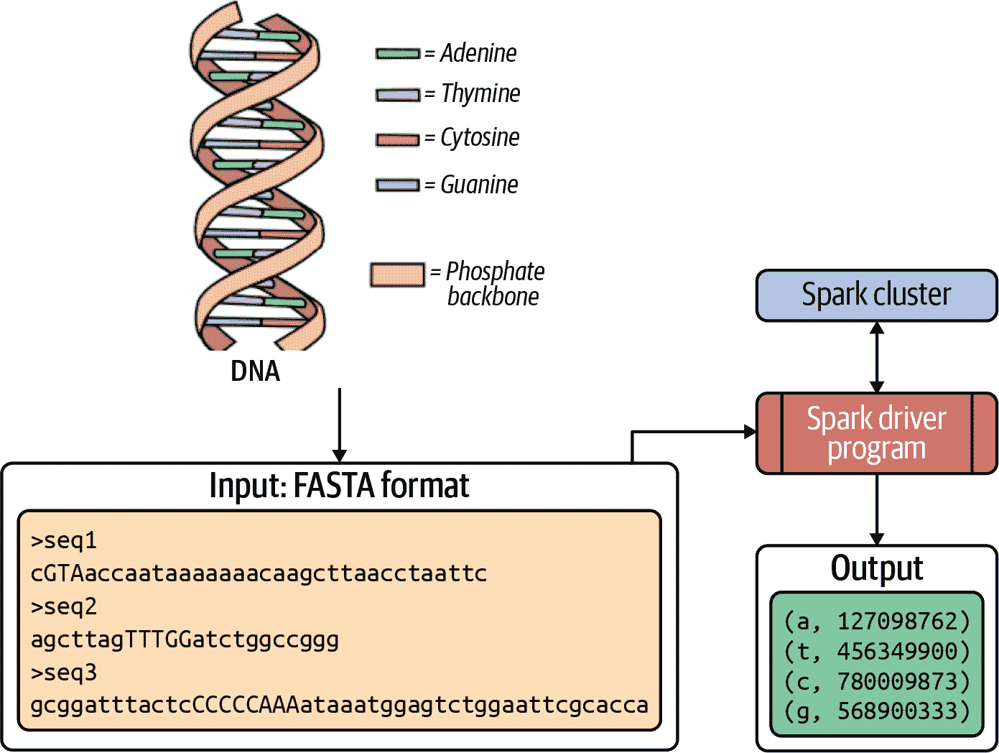
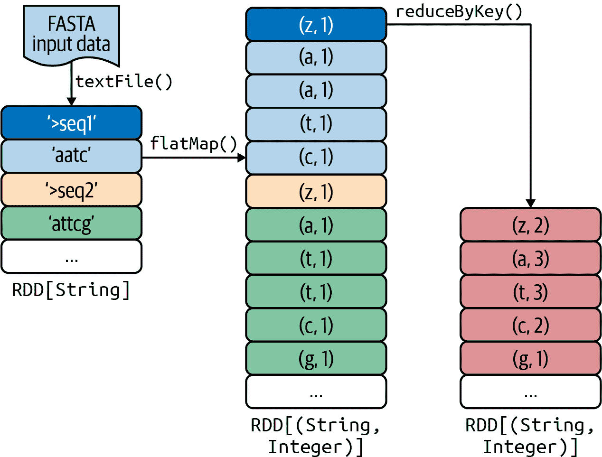
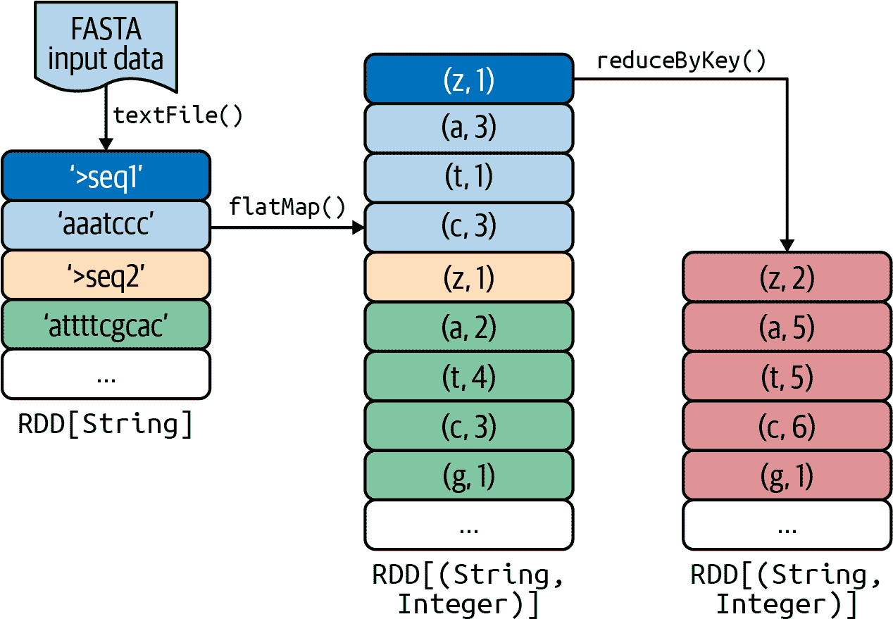
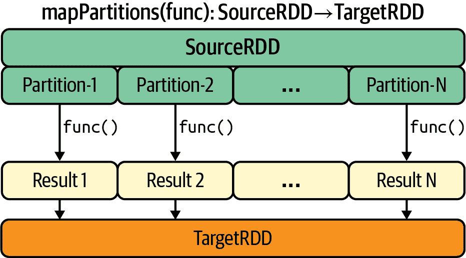
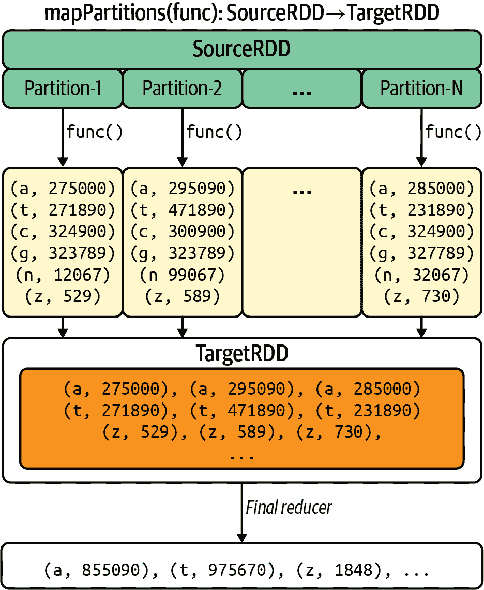
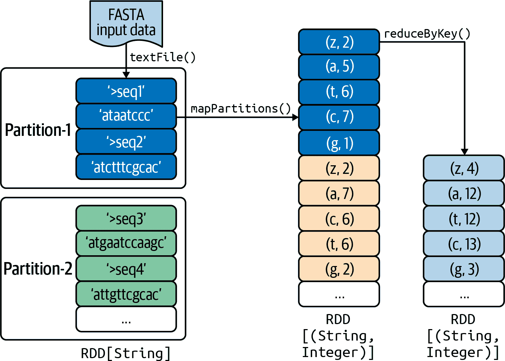

# 第二章：转换实战

在本章中，我们将探讨最重要的 Spark 转换（映射器和减少器），在数据总结设计模式的背景下，并分析如何选择特定的转换来解决目标问题。

正如您将看到的，对于给定的问题（我们将在这里使用 DNA 碱基计数问题），可以使用不同的 Spark 转换来实现多种可能的 PySpark 解决方案，但这些转换的效率因其实现和洗牌过程（键的分组发生时）而异。DNA 碱基计数问题与经典的单词计数问题非常相似（在一组文件/文档中找到唯一单词的频率），其区别在于在 DNA 碱基计数中，您会找到 DNA 字母（`A`，`T`，`C`，`G`）的频率。

我选择这个问题是因为在解决它时，我们将了解数据总结，将大量信息（这里是 DNA 数据字符串/序列）压缩成更小的一组有用信息（DNA 字母的频率）。

本章提供了三种完整的 PySpark 端到端解决方案，使用不同的映射器和减少器来解决 DNA 碱基计数问题。我们将讨论它们之间的性能差异，并探讨数据总结设计模式。

# DNA 碱基计数示例

本章节中我们的示例目的是计算一组 DNA 字符串/序列中的 DNA 碱基数。不用担心，您不需要成为 DNA、生物学或基因组学的专家来理解这个例子。我会涵盖基础知识，这应该足以让您理解。

人类 DNA 由大约 30 亿个碱基组成，超过 99%的碱基在所有人中都是相同的。要理解 DNA 碱基计数，我们首先需要理解 DNA 字符串。DNA 字符串由字母 `{A, C, G, T}` 组成，其符号代表腺嘌呤（`A`）、胞嘧啶（`C`）、鸟嘌呤（`G`）和胸腺嘧啶（`T`）的碱基。我们的 DNA 由一组 DNA 字符串组成。我们想要回答的问题是在一组 DNA 字符串中每个碱基字母出现的次数。例如，如果我们有 DNA 字符串 `"AAATGGCATTA"` 并询问在这个字符串中碱基 `A` 出现的次数，答案是 5；如果我们询问在这个字符串中碱基 `T` 出现的次数，答案是 3。因此，我们要计算每个碱基字母的出现次数，忽略大小写。由于 DNA 机器可能产生大写和小写字母，我们将把它们全部转换为小写。

对于这个问题，我将提供三种不同的解决方案，使用不同组合的强大和高效的 Spark 转换。尽管所有解决方案都生成相同的结果，但由于使用的转换不同，它们的性能将有所不同。

图 2-1 说明了使用 Spark 解决 DNA 碱基计数问题的过程。对于每个解决方案，我们将使用 PySpark API 编写一个驱动程序（一系列 Spark 转换和操作），并将程序提交到一个 Spark 集群。所有的解决方案都将读取输入（FASTA 文件格式，稍后定义）并生成一个字典，其中键是 DNA 字母，值是相关的频率。

这三种解决方案将展示我们在选择解决此问题的 Spark 转换时（以及你尝试解决的任何数据问题时）有多种选择，并且不同转换的性能也会有所不同。关于三种 PySpark 解决方案的摘要在表 2-1 中提供。



###### 图 2-1\. 解决 DNA 碱基计数问题

表 2-1\. DNA 碱基计数问题的解决方案

|  | 解决方案 1 | 解决方案 2 | 解决方案 3 |
| --- | --- | --- | --- |
| **程序** | *dna_bc_ver_1.py* | *dna_bc_ver_2.py* | *dna_bc_ver_3.py* |
| **设计模式** | *基本 MapReduce* | *In-mapper combiner* | *Mapping partitions* |
| **转换** | `textFile()` | `textFile()` | `textFile()` |
|  | `flatMap()` | `flatMap()` | `mapPartitions()` |
|  | `reduceByKey()` | `reduceByKey()` | `reduceByKey()` |

如表 2-2 所示，这三个程序在我的机器上表现非常不同（一台配备 16 GB RAM、2.3 GHz 英特尔处理器和 500 GB 硬盘的 MacBook）。注意，我对所有解决方案使用了`$SPARK_HOME/bin/spark-submit`命令的默认参数；对任何解决方案都没有进行优化。

表 2-2\. 三种解决方案的性能

| 输入数据（以字节为单位） | 版本 1 | 版本 2 | 版本 3 |
| --- | --- | --- | --- |
| 253,935,557 | 72 秒 | 27 秒 | 18 秒 |
| 1,095,573,358 | 258 秒 | 79 秒 | 57 秒 |

这个基本性能表告诉你什么？当你编写 PySpark 应用程序时，你有很多选择。没有硬性规则适用于使用哪些转换或操作；这取决于你的数据和程序的具体情况。一般来说，当你编写 PySpark 应用程序时，你可以从各种转换和操作的排列中选择，它们会产生相同的结果。然而，并不是所有这些排列都会导致相同的性能：避免常见的陷阱并选择正确的组合可以在应用程序的性能上产生天壤之别。

例如，对于一个大型的(key, value)对集合，通常使用`reduceByKey()`或`combineByKey()`比使用`groupByKey()`和`mapValues()`的组合更高效，因为它们减少了洗牌时间。如果你的 RDD（由变量`rdd`表示）是一个`RDD[(String, Integer)]`（每个元素都是一个`(key-as-String, value-as-Integer)`对），那么这样做：

```
# rdd: RDD[(String, Integer)]
rdd.groupByKey().mapValues(lambda values : sum(values))
```

将产生与此相同的结果：

```
# rdd: RDD[(String, Integer)]
rdd.reduceByKey(lambda x,y: x+y)
```

然而，`groupByKey()` 操作将整个数据集传输到集群网络上（导致性能损失很大），而 `reduceByKey()` 操作将在每个分区中计算每个键的本地总和，并在洗牌后将这些本地总和组合成较大的总和。因此，在大多数情况下，`reduceByKey()` 将比 `groupByKey()` 和 `mapValues()` 的组合传输更少的数据到集群网络上，这意味着 `reduceByKey()` 在性能上将表现更好。

现在，让我们更详细地讨论一下我们的 DNA 碱基计数问题。

## DNA 碱基计数问题

本示例的目标是找出给定一组 DNA 序列中字母 `A`、`T`、`C`、`G` 和 `N`（字母 `N` 表示除了 `A`、`T`、`C` 或 `G` 之外的任何字母——即一个错误）的频率（或百分比）。正如我之前提到的，`{'A', 'T', 'C', 'G'}` 代表与 DNA 相关的四个含氮碱基。

DNA 序列可能非常庞大——例如，人类基因组由三十亿个 DNA 碱基对组成，而二倍体基因组（存在于体细胞中）则具有两倍的 DNA 含量——并且可以包含大小写字母。为了保持一致性，我们将所有字母转换为小写。我们示例中 DNA 碱基计数的目标是为每个 DNA 碱基生成频率。表 2-3 展示了示例序列 `"ACGGGTACGAAT"` 的结果。注意，我正在使用键 `z` 来找出处理的 DNA 序列的总数。

表 2-3\. DNA 碱基计数示例

| Base | Count |
| --- | --- |
| `a` | 4 |
| `t` | 2 |
| `c` | 2 |
| `g` | 4 |
| `n` | 0 |
| `z` | 1（DNA 序列的总数） |

## FASTA 格式

DNA 序列可以用许多不同的格式表示，包括[FASTA](https://oreil.ly/wF0fe)和 FASTQ。这些是流行的基于文本的格式，其中输入是作为文本文件提供的。我们的解决方案仅处理 FASTA 格式，因为读取 FASTA 文件要容易得多。FASTA 和 FASTQ 格式都存储序列数据和序列元数据。通过对呈现的解决方案进行一些小修改，您可以将其用于 FASTQ 格式的输入；有一个 FASTQ 解决方案在[GitHub](https://oreil.ly/ogZEA)上提供。

FASTA 格式的序列文件可以包含许多 DNA 序列。每个序列都以单行描述开始，后跟一个或多个序列数据行。根据 FASTA 格式规范，描述行必须以大于号（>）开头的第一列开始。请注意，描述行可用于计算序列的数量，而不包含任何 DNA 序列数据。

## 样本数据

我们将使用书籍的[GitHub 存储库](https://oreil.ly/qQLCq)中的*sample.fasta*文件作为我们 PySpark 程序的测试案例。这个小的 FASTA 文件包含四个样本 DNA 序列（请记住，字符的大小写是无关紧要的）：

```
$ cat sample.fasta
>seq1
cGTAaccaataaaaaaacaagcttaacctaattc
>seq2
agcttagTTTGGatctggccgggg
>seq3
gcggatttactcCCCCCAAAAANNaggggagagcccagataaatggagtctgtgcgtccaca
gaattcgcacca
AATAAAACCTCACCCAT
agagcccagaatttactcCCC
>seq4
gcggatttactcaggggagagcccagGGataaatggagtctgtgcgtccaca
gaattcgcacca
```

要测试本章提供的 DNA 碱基计数程序与更大文件，请从 [加州大学圣塔克鲁兹分校网站](https://oreil.ly/sv3fs) 下载 FASTA 数据。

接下来，我们将介绍三种不同的 PySpark 解决方案，用于 DNA 碱基计数问题，使用不同的 Spark 转换。请记住，尽管所有解决方案的结果相同（它们产生相同的结果），但由于数据的性质和使用的转换方式不同，每个解决方案的性能也会有所不同。

# DNA 碱基计数解决方案 1

我将首先介绍的版本是 DNA 碱基计数问题的非常基本的解决方案。高级工作流程显示在 图 2-2 中。



###### 图 2-2\. DNA 碱基计数解决方案

它由三个简单步骤组成：

1.  读取 FASTA 输入数据并创建一个 `RDD[String]`，其中每个 RDD 元素都是一个 FASTA 记录（可以是注释行或实际的 DNA 序列）。

1.  定义一个映射函数：对于 FASTA 记录中的每个 DNA 字母，发出一对 `(dna_letter, 1)`，其中 `dna_letter` 在 `{A, T, C, G}` 中，`1` 是频率（类似于单词计数解决方案）。

1.  汇总所有 DNA 字母的频率（这是一个归约步骤）。对于每个唯一的 `dna_letter`，分组并添加所有频率。

要测试这个解决方案，我将使用前面提到的 *sample.fasta* 文件。

## 第 1 步：从输入创建一个 RDD[String]

使用 `SparkContext.textFile()` 函数创建一个输入格式为 FASTA 文本的 `RDD[String]`。`textFile()` 可以用于从 HDFS、Amazon S3、本地文件系统（所有 Spark 节点都可用）或任何支持 Hadoop 文件系统 URI 的文件中读取文本文件，并将其作为 `RDD[String]` 返回。如果 `spark` 是 `SparkSession` 类的实例，则要创建一个 FASTA 记录的 RDD（如 `records_rdd` 所示），我们至少有两个选项。我们可以使用 `SparkSession`：

```
>>># spark: instance of SparkSession
>>> input_path = "./code/chap02/sample.fasta" 
>>> records_rdd = spark.read
                       .text(input_path)
                       .rdd.map(lambda r: r[0]) 
```


定义输入路径。


使用 `DataFrameReader` 接口（通过 `spark.read` 访问）创建一个 DataFrame，然后将其转换为 `RDD[String]`。

# DataFrameReader 和 DataFrameWriter

`DataFrameReader` 类是一个接口，用于从外部数据源（如文本、CSV 和 JSON 文件、Parquet 和 ORC 文件、Hive 表或符合 Java 数据库连接（JDBC）的数据库表）读取数据到 DataFrame 中。其 `DataFrameWriter` 类是一个接口，用于将 DataFrame 写入外部数据源。

或者我们可以使用 `SparkContext`：

```
>>> input_path = "./code/chap02/sample.fasta" 
>>># Let 'spark' be an instance of SparkSession
>>> sc = spark.sparkContext 
>>> records_rdd = sc.textFile(input_path) 
```


定义输入路径。


创建 `SparkContext` 的一个实例（作为 `sc`）。


使用 `SparkContext` 读取输入并创建 `RDD[String]`。

第二个选项更可取，因为它简单且高效。第一个选项也可以使用，但效率较低，因为它首先创建一个 DataFrame，然后将其转换为 RDD，最后执行另一个映射器转换。

接下来，我们将检查创建的 RDD 的内容。每个 RDD 元素（作为`String`）由`u'*<element>*'`表示：

```
>>> records_rdd.collect()
[
 u'>seq1',
 u'cGTAaccaataaaaaaacaagcttaacctaattc',
 u'>seq2',
 u'agcttagTTTGGatctggccgggg',
 u'>seq3',
 u'gcggatttactcCCCCCAAAAANNaggggagagcccagataaatggagtctgtgcgtccaca',
 u'gaattcgcacca',
 u'AATAAAACCTCACCCAT',
 u'agagcccagaatttactcCCC',
 u'>seq4',
 u'gcggatttactcaggggagagcccagGGataaatggagtctgtgcgtccaca',
 u'gaattcgcacca'
]
```

###### 提示

此处使用`RDD.collect()`方法获取内容作为`String`对象列表并显示它。如第一章所述，对于大型 RDD，不应使用`collect()`，这可能导致 OOM 错误，并带来性能损失。要仅查看 RDD 的前*N*个元素，可以使用`RDD.take(*N*)`。

## 步骤 2：定义映射函数

要将 RDD 元素映射为一组`(dna_letter, 1)`对，我们需要定义一个 Python 函数，该函数将传递给`flatMap()`转换。`flatMap()`是一种一对多的转换方式；它通过首先对源 RDD 的所有元素应用函数，然后展平结果来返回一个新的 RDD。例如，如果我们传递给`flatMap()`转换的 Python 函数返回一个列表，如`[V[1], V[2], V[3]]`，那么这将被展平为三个目标 RDD 元素，`V[1]`、`V[2]`和`V[3]`。非正式地说，我们可以将其写成：

1.  创建一个可迭代列表：

    ```
    single_RDD_element() -> [V1, V2, V3]
    ```

1.  将列表展平为多个元素（此处为三个目标元素）：

    ```
    [V1, V2, V3] -> V1, V2, V3
    ```

对于此解决方案，我们将定义一个名为`process_FASTA_record()`的函数，该函数接受一个 RDD 元素（FASTA 文件的单个记录作为`String`）并返回一个`(dna_letter, 1)`对的列表。例如，给定输入记录`"AATTG"`，它将发出以下`(key, value)`对（请记住，我们将所有 DNA 字母转换为小写）：

```
(a, 1)
(a, 1)
(t, 1)
(t, 1)
(g, 1)
```

如果输入是描述记录（不包含序列数据并以`>seq`开头），则我们发出`(z, 1)`。这将使我们能够找到序列的数量。如果输入是 DNA 序列，我们首先按字符令牌化它，然后对每个 DNA 字母（由`dna_letter`表示）发出`(dna_letter, 1)`。最后，我们返回这些对的列表。函数定义如下。请注意，我包含了一些用于调试目的的`print`语句，但在生产环境中，这些应该删除，因为它们会导致性能损失：

```
# Parameter: fasta_record: String (a single FASTA record)
#
# Output: a list of (key, value) pairs, where key
#         is a dna_letter and value is a frequency
#
def process_FASTA_record(fasta_record):
    key_value_list = [] 

    if (fasta_record.startswith(">")):
        # z counts the number of FASTA sequences
        key_value_list.append((z, 1)) 
    else:
        chars = fasta_record.lower()
        for c in chars:
            key_value_list.append((c, 1)) 

    print(key_value_list) 
    return key_value_list 
#end-def
```


创建一个空列表，我们将向其添加`(key, value)`对（这是此函数的输出）。


将`(z, 1)`添加到列表中。


将`(c, 1)`添加到列表中，其中`c`是一个 DNA 字母。


仅供调试目的。


返回一个`(key, value)`对的列表，这将由`flatMap()`转换展平。

现在，我们将使用此函数将`flatMap()`转换应用于刚刚创建的`records_rdd`（`RDD[String]`）。

```
>>># rec refers to an element of records_rdd
>>># Lambda is a notation that defines input and output
>>>#   input: "rec" as a records_rdd element 
>>>#   output: result of process_FASTA_record(rec)
>>> pairs_rdd = records_rdd.flatMap(lambda rec: process_FASTA_record(rec)) 
```


源 RDD（`records_rdd`）是一个`RDD[String]`。


我们使用 lambda 表达式，其中`rec`表示`records_rdd`的单个元素。目标 RDD（`pairs_rdd`）是一个`RDD[(String, Integer)]`。

或者，我们可以按以下方式编写（不使用 lambda 表达式）：

```
>>> pairs_rdd = records_rdd.flatMap(process_FASTA_record)
```

例如，如果`records_rdd`的元素包含 DNA 序列`"gaattcg"`，那么它将被展开为以下的（键，值）对：

```
(g, 1)
(a, 1)
(a, 1)
(t, 1)
(t, 1)
(c, 1)
(g, 1)
```

如果`records_rdd`的元素包含`>seq`，那么它将被展开为以下的（键，值）对（请记住我们使用键`z`来找到给定输入的 DNA 序列的总数）：

```
(z, 1)
```

## 步骤 3：查找 DNA 字母的频率

`pairs_rdd`现在包含一组（键，值）对，其中键是 DNA 字母，值是其频率（`1`）。接下来，我们将`reduceByKey()`转换应用于`pairs_rdd`以找到所有 DNA 字母的聚合频率。

`reduceByKey()`转换使用可结合和可交换的减少函数合并每个唯一键的值。因此，我们现在可以看到，我们只是为给定键获取了一个累积值，并将其与该键的下一个值相加。换句话说，如果键`K`在 RDD 中有五对，`(K, 2)`，`(K, 3)`，`(K, 6)`，`(K, 7)`和`(K, 8)`，那么`reduceByKey()`转换将这五对转换为一对，`(K, 26)`（因为 2 + 3 + 6 + 7 + 8 = 26）。如果这五对存储在两个分区上，则每个分区将并行和独立地处理：

```
Partition-1: {
               (K, 2),
               (K, 3)
             }

   (K, 2), (K, 3) => (K, 2+3) = (K, 5)
   Result of Partition-1: (K, 5)
```

```
Partition-2: {
               (K, 6),
               (K, 7),
               (K, 8)
             }

   (K, 6), (K, 7)  => (K, 6+7) = (K, 13)
   (K, 8), (K, 13) => (K, 8+13) = (K, 21)
   Result of Partition-2: (K, 21)
```

然后将合并分区：

```
Merge Partitions:
  => Partition-1, Partition-2
  => (K,5), (K, 21)
  => (K, 5+21) = (K, 26)

  Final result: (K, 26)
```

要生成最终结果，我们使用`reduceByKey()`转换：

```
# x and y refer to the frequencies of the same key
# source: pairs_rdd: RDD[(String, Integer)]
# target: frequencies_rdd: RDD[(String, Integer)]
frequencies_rdd = pairs_rdd.reduceByKey(lambda x, y: x+y)
```

请注意，`reduceByKey()`的源和目标数据类型是相同的。也就是说，如果源 RDD 是`RDD[(K, V)]`，那么目标 RDD 也将是`RDD[(K, V)]`。Spark 的`combineByKey()`转换对`reduceByKey()`所强加的值的数据类型限制并不适用。

您可以通过使用`RDD.collect()`函数将最终 RDD 的元素作为一组对获取最终输出的几种方法：

```
frequencies_rdd.collect()
[
  (u'a', 73),
  (u'c', 61),
  (u't', 45),
  (u'g', 53),
  (u'n', 2),
  (u'z', 4)
]
```

或者，您可以使用`RDD.collectAsMap()`操作将结果作为哈希映射返回：

```
>>> frequencies_rdd.collectAsMap()
{
  u'a': 73,
  u'c': 61,
  u't': 45,
  u'g': 53,
  u'n': 2,
  u'z': 4
}
```

您还可以使用其他 Spark 转换来聚合 DNA 字母的频率。例如，您可以通过 DNA 字母对其频率进行分组（使用`groupByKey()`）然后将所有频率相加。但是，这种解决方案比使用`reduceByKey()`转换效率低：

```
grouped_rdd = pairs_rdd.groupByKey() 
frequencies_rdd = grouped_rdd.mapValues(lambda values : sum(values)) 
frequencies_rdd.collect()
```


`grouped_rdd`是一个`RDD[(String, [Integer])]`，其中键是一个`String`，值是一个整数列表/可迭代对象（作为频率）。


`frequencies_rdd` 是一个 `RDD[(String, Integer)]`。

例如，如果 `pairs_rdd` 包含四对 `('z', 1)`，那么 `grouped_rdd` 将有一个单一的对 `('z', [1, 1, 1, 1])`。即，它会对相同的键进行值的分组。虽然 `reduceByKey()` 和 `groupByKey()` 这两种转换都能产生正确的答案，但在大型 FASTA 数据集上，`reduceByKey()` 的效果要好得多。这是因为 Spark 知道可以在每个分区上在数据洗牌之前将具有相同键（DNA 字母）的输出进行组合。Spark 专家建议我们尽可能避免使用 `groupByKey()`，而是在可能的情况下使用 `reduceByKey()` 和 `combineByKey()`，因为它们比 `groupByKey()` 更适合扩展。

如果你想将创建的 RDD 保存到磁盘，可以使用 `RDD.saveAsTextFile(*path*)`，其中 *`path`* 是你的输出目录名称。

## 解决方案 1 的优缺点

让我们看看这个解决方案的一些优缺点：

优点

+   提供的解决方案可行且简单。它使用最少的代码来完成任务，使用了 Spark 的 `map()` 和 `reduceByKey()` 转换。

+   使用 `reduceByKey()` 来减少所有 (key, value) 对，不存在可扩展性问题。此转换将自动在所有工作节点上执行 `combine()` 优化（局部聚合）。

缺点

+   这个解决方案会产生大量的 (key, value) 对（每个输入字母一个）。这可能会导致内存问题。如果因为产生了太多 (key, value) 对而出现错误，请尝试调整 RDD 的 `StorageLevel`。默认情况下，Spark 使用 `MEMORY_ONLY`，但你可以为这个 RDD 设置 `StorageLevel` 为 `MEMORY_AND_DISK`。

+   性能并不理想，因为发出大量的 (key, value) 对会对网络造成高负载并延长洗牌时间。当扩展此解决方案时，网络将成为瓶颈。

接下来，我将为 DNA 基数计数问题提出第二个解决方案。

# DNA 基数计数 解决方案 2

解决方案 2 是解决方案 1 的改进版。在解决方案 1 中，我们对输入的 DNA 序列中的每个 DNA 字母发出了 `(dna_letter, 1)` 对。FASTA 序列可能非常长，每个 DNA 字母可能有多个 `(dna_letter, 1)` 对。因此，在这个版本中，我们将执行一种内部映射器组合优化（在第十章中详细讨论的设计模式），以减少映射器发出的中间 (key, value) 对的数量。我们将把 `(dna_letter, 1)` 对聚合到一个哈希映射（存储在哈希表中的无序 (key, value) 对集合，其中键是唯一的），然后将哈希映射扁平化为一个列表，并最终聚合频率。例如，给定 FASTA 序列记录 `"aaatttcggggaa"`，表 2-4 的第 2 列中的值将被发出，而不是第 1 列中的值（就像解决方案 1 中一样）。

表 2-4\. 序列 "aaatttcggggaa" 的发出的 (key, value) 对

| 解决方案 1 | 解决方案 2 |
| --- | --- |
| `(a, 1)` | `(a, 5)` |
| `(a, 1)` | `(t, 3)` |
| `(a, 1)` | `(c, 1)` |
| `(t, 1)` | `(g, 4)` |
| `(t, 1)` |  |
| `(t, 1)` |  |
| `(c, 1)` |  |
| `(g, 1)` |  |
| `(g, 1)` |  |
| `(g, 1)` |  |
| `(g, 1)` |  |
| `(a, 1)` |  |
| `(a, 1)` |  |

此解决方案的优点在于它将发出较少的`(key, value)`对，从而减少集群网络流量，提高程序的整体性能。

解决方案 2 可以总结如下：

1.  读取 FASTA 输入数据并创建一个`RDD[String]`，其中每个 RDD 元素都是一个 FASTA 记录。此步骤与解决方案 1 中的步骤相同。

1.  对于每个 FASTA 记录，创建一个`HashMap[Key, Value]`（字典或哈希表），其中`key`是一个 DNA 字母，`value`是该字母的聚合频率。然后，展开哈希映射（使用 Spark 的`flatMap()`）为`(key, value)`对的列表。此步骤与解决方案 1 不同，并且使我们能够发出较少的`(key, value)`对。

1.  对于每个 DNA 字母，聚合并求出所有频率的总和。这是一个归约步骤，与解决方案 1 中的步骤相同。

工作流程在图 2-3 中以图像方式呈现。



###### 图 2-3. DNA 碱基计数解决方案 2

让我们深入了解每个步骤的详细信息。

## 第 1 步：从输入创建 RDD[String]。

`SparkContext.textFile()`函数用于创建基于 FASTA 文本格式的输入的 RDD。让`spark`成为一个`SparkSession`对象：

```
>>># spark: an instance of SparkSession
>>> input_path = "./code/chap02/sample.fasta"
>>> records_rdd = spark.sparkContext.textFile(input_path) 
```


`records_rdd`是一个`RDD[String]`。

## 第 2 步：定义一个映射函数

接下来，我们将每个 RDD 元素（代表单个 FASTA 记录的字符串）映射为`(key, value)`对的列表，其中 key 是唯一的 DNA 字母，value 是整个记录的聚合频率。

我们定义了一个 Python 函数，该函数传递给`flatMap()`转换，以返回一个新的 RDD，首先将函数应用于该 RDD 的所有元素，然后展开结果。

为了处理 RDD 元素，我们将定义一个 Python 函数，`p⁠r⁠o⁠c⁠e⁠s⁠s​_⁠F⁠A⁠S⁠T⁠A⁠_as_hashmap`，它接受一个 RDD 元素作为`String`并返回`(dna_letter, frequency)`的列表。请注意，我在这里包含了一些用于调试和教学目的的`print`语句，这些语句应在生产环境中删除：

```
# Parameter: fasta_record: String, a single FASTA record
# output: a list of (dna_letter, frequency)
#
def process_FASTA_as_hashmap(fasta_record):
    if (fasta_record.startswith(">")): 
        return [("z", 1)]

    hashmap = defaultdict(int) 
    chars = fasta_record.lower()
    for c in chars: 
        hashmap[c] += 1
    #end-for
    print("hashmap=", hashmap)

    key_value_list = [(k, v) for k, v in hashmap.iteritems()] 
    print("key_value_list=", key_value_list)
    return key_value_list 
#end-def
```


`>`表示 DNA 序列中的注释行。


创建一个`dict[String, Integer]`。


聚合 DNA 字母。


将字典展平为`(dna_letter, frequency)`对的列表。


返回展平的`(dna_letter, frequency)`对列表。

现在，我们将使用这个 Python 函数，对之前创建的`records_rdd`（一个`RDD[String]`）应用`flatMap()`转换：

```
>>># source: records_rdd (RDD[String])
>>># target: pairs_rdd (RDD[(String, Integer)])
>>> pairs_rdd = records_rdd.flatMap(lambda rec: process_FASTA_as_hashmap(rec))
```

或者，我们可以这样写，而不使用 lambda 表达式：

```
>>># source: records_rdd (as RDD[String])
>>># target: pairs_rdd (as RDD[(String, Integer)])
>>> pairs_rdd = records_rdd.flatMap(process_FASTA_as_hashmap)
```

例如，如果`records_rdd`元素包含`'gggggaaattccccg'`，则它将被展开为以下的（键，值）对：

```
    (g, 6)
    (a, 3)
    (t, 2)
    (c, 4)
```

为了使我们能够计算 DNA 序列的总数，任何以`">seq"`开头的`records_rdd`元素将被展开为以下的（键，值）对：

```
    (z, 1)
```

## 步骤 3：查找 DNA 字母的频率

现在，`pairs_rdd`包含了（键，值）对，其中键是`dna_letter`，值是该字母的频率。接下来，我们对`pairs_rdd`应用`reduceByKey()`转换，以找到所有 DNA 字母的聚合频率。请记住，`'n'`是用来表示除了`a`、`t`、`c`或`g`之外的任何字母的键：

```
# x and y refer to the frequencies of the same key
frequencies_rdd = pairs_rdd.reduceByKey(lambda x, y: x+y) 
frequencies_rdd.collect() 
[
  (u'a', 73),
  (u'c', 61),
  (u't', 45),
  (u'g', 53),
  (u'n', 2),
  (u'z', 4)
]
```


`pairs_rdd`是一个`RDD[(String, Integer)]`。


`frequencies_rdd`是一个`RDD[(String, Integer)]`。

或者，我们可以使用`collectAsMap()`操作将结果返回为一个哈希映射：

```
>>> frequencies_rdd.collectAsMap()
{
  u'a': 73,
  u'c': 61,
  u't': 45,
  u'g': 53,
  u'n': 2,
  u'z': 4
}
```

## 解决方案 2 的优缺点

让我们来分析这种解决方案的优缺点：

优点

+   提供的解决方案有效且简单，半高效。它通过发射的（键，值）对数量大大减少——每个 DNA 序列最多只有六个，因为我们为每个输入记录创建一个字典，然后将其展开为（键，值）对列表，其中键是 DNA 字母，值是该字母的聚合频率。

+   由于发出的（键，值）对数量减少，网络流量需求较低。

+   由于我们使用`reduceByKey()`来减少所有（键，值）对，因此不存在可扩展性问题。

缺点

+   性能不佳，因为我们仍然会发出每个 DNA 字符串最多六个（键，值）对。

+   对于大型数据集或资源有限的情况，这种解决方案可能仍然会因为每个 DNA 序列创建一个字典而占用过多内存。

# DNA 碱基计数解决方案 3

这个最终解决方案改进了版本 1 和 2，并且是一个没有任何可扩展性问题的最佳解决方案。在这里，我们将使用一种名为`mapPartitions()`的强大且高效的 Spark 转换来解决 DNA 碱基计数问题。在我介绍解决方案本身之前，让我们更仔细地看看这个转换。

## mapPartitions() 转换

如果源 RDD 是`RDD[T]`，目标 RDD 是`RDD[U]`，则`mapPartitions()`转换定义如下：

```
pyspark.RDD.mapPartitions(f, preservesPartitioning=False)

mapPartitions() is a method in the pyspark.RDD class.

Description:

    Return a new RDD (called target RDD) by applying a
    function f() to each partition of the source RDD.

    Input to f() is an iterator (of type T), which
    represents a single partition of the source RDD.
    Function f() returns an object of type U.

    f: Iterator<T> --> U 

    mapPartitions : RDD[T]--f()--> RDD[U] 
```


函数`f()`接受一个指向单个分区的指针（作为`iterator`类型的`T`）并返回一个类型为`U`的对象；`T`和`U`可以是任何数据类型，它们不必相同。


将`RDD[T]`转换为`RDD[U]`。

要理解 `mapPartitions()` 转换的语义，首先必须理解 Spark 中分区和分区的概念。简单地说，使用 Spark 的术语，输入数据（在本例中为 FASTA 格式的 DNA 序列）表示为 RDD。Spark 自动分区 RDD，并将分区分布在节点上。例如，假设我们有 60 亿条记录，并且 Spark 的分区器将输入数据分为 3,000 个块/分区。每个分区将大约有 2 百万条记录，并且将由单个 `mapPartitions()` 转换处理。因此，用于 `mapPartitions()` 转换中的函数 `f()` 将接受一个迭代器（作为参数），以处理一个分区。

在第三种解决方案中，我们将为每个分区创建一个字典，而不是每个 FASTA 记录创建一个字典，以聚合 DNA 字母及其关联的频率。这比解决方案 1 和 2 要好得多，因为在集群中创建 3,000 个哈希表几乎不会使用任何内存，与为每个输入记录创建字典相比。由于集群中所有分区的并行和独立处理，此解决方案具有高度的可扩展性和速度。

用于解决 DNA 碱基计数问题的 `mapPartitions()` 转换语义在 图 2-4 中进行了说明。



###### 图 2-4\. `mapPartitions()` 转换

让我们来看看 图 2-4：

+   源 RDD 表示所有输入作为 `RDD[String]`，因为 FASTA 文件的每条记录都是 `String` 对象。

+   整个输入被分割成 *`N`* 个块或分区（其中 *`N`* 可以是 `100`，`200`，`1000`，…，根据数据大小和集群资源的情况），每个分区可能包含数千或数百万条 DNA 序列（每个 DNA 序列都是 `String` 类型的记录）。源 RDD 的分区类似于 Linux 的 `split` 命令，该命令将文件分割成片段。

+   每个分区都会被发送到一个 `mapPartitions()` 的映射器/工作者/执行器中，以便由您提供的 `func()` 处理。您的 `func()` 接受一个分区（作为 `String` 类型的迭代器），并返回最多六对（键，值）对，其中键是 DNA 字母，值是该分区中该字母的总频率。请注意，分区是并行和独立处理的。

+   一旦所有分区的处理完成，结果将合并到目标 RDD 中，该 RDD 是一个 `RDD[(String, Integer)]`，其中键是 DNA 字母，值是该 DNA 字母的频率。

详细的 `mapPartitions()` 转换语义用于解决 DNA 碱基计数问题，如 图 2-5 所示。



###### 图 2-5\. 使用 `mapPartitions()` 解决 DNA 碱基计数问题

正如本图所示，我们的输入（FASTA 格式数据）已经被分割成*N*个块/分区，每个块可以由一个独立的 mapper/worker/executor 并行处理。例如，如果我们的输入总共有 50 亿条记录，*N* = 50,000，则每个分区将包含约 100,000 个 FASTA 记录（50 亿 = 50,000 × 100,000）。因此，每个`func()`将处理（通过迭代）约 100,000 个 FASTA 记录。每个分区最多会生成六个（键，值）对，其中键将是`{"a", "t", "c", "g", "n", "z"}`（四个字母，`"n"`作为非 DNA 字母的键，`"z"`作为处理过的 DNA 字符串/序列的数量的键）。

因为`mapPartitions(func)`变换在 RDD 的每个分区（块）上分别运行，所以`func()`必须是`iterator`类型：

```
source: RDD[T] 

# Parameter p: iterator<T> 
def func(p): 
   u = *`<``create` `object` `of` `type` `U` `by` `iterating` `all`
         `elements` `of` `a` `single` `partition` `denoted` `by` `p``>`*
   return u 
#end-def

target = source.mapPartitions(func) 

target:  RDD[U] 
```


源 RDD 的每个元素的类型为`T`。


参数`p`是一个`iterator<T>`，表示一个单独的分区。


每次迭代将返回一个类型为`T`的对象。


定义一个`func()`，接受一个单独的分区作为`iterator<T>`（一个类型为`T`的迭代器，用于遍历源`RDD[T]`的单个分区），并返回一个类型为`U`的对象。


应用变换。


结果是一个`RDD[U]`，其中每个分区已经被转换（使用`func()`）为单个类型为`U`的对象。

假设我们有一个源`RDD[T]`。因此，对于我们的示例，`T`表示`String`类型（DNA 序列记录），而`U`表示哈希表（Python 中的字典）作为`HashMap[String, Integer]`，其中键是 DNA 字母（作为`String`对象），值是关联的频率（作为`Integer`）。

我们可以在 Python 中定义`func()`（作为通用模板），如下所示：

```
# Parameter: iterator, which represents a single partition
#
# Note that iterator is a parameter from the mapPartitions()
# transformation, through which we can iterate through all
# the elements in a single partition.
#
# source is an RDD[T]
# target is an RDD[U]

def func(iterator): 
   # 1\. Make sure that iterator is not empty. If it is empty,
   #    then handle it properly; you cannot ignore empty partitions.

   # 2\. Initialize your desired data structures
   #    (such as dictionaries and lists).

   # 3\. Iterate through all records in a given partition.
    for record in iterator: 
       # 3.1 Process the record
       # 3.2 Update your data structures
   #end-for

   # 4\. If required, post-process your data structures (DS).
    result_for_single_partition = post_process(DS) 

   # 5\. Return result_for_single_partition.
#end-def
```


`iterator`是指向单个分区的指针，可用于遍历分区的元素。


`record`的类型为`T`。


`result_for_single_partition`的类型为`U`。

# 摘要设计模式

Spark 的`mapPartitions()`变换可用于实现摘要设计模式，当处理大数据并希望获取汇总视图以获取不仅限于查看局部记录的洞察时，这是非常有用的。此设计模式涉及将相似的数据组合在一起，然后执行操作，如计算统计量、构建索引或简单计数。

当应该使用`mapPartitions()`转换时呢？当你想从每个分区中提取一些简化或最小数量的信息时，这个转换非常有用，每个分区都是一个大数据集。例如，如果你想找出输入中所有数字的最小值和最大值，使用`map()`会相当低效，因为你会生成大量的中间（键，值）对，但实际上你只想找到两个数字。如果你想要找出输入中的前 10 个（或后 10 个）值，那么`mapPartitions()`就非常有用了：它可以高效地实现这个目标，首先找到每个分区的前（或后）10 个值，然后再找到所有分区的前（或后）10 个值。这样一来，你就避免了生成过多的中间（键，值）对。

对于计数 DNA 碱基来说，`mapPartitions()`转换是一个理想的解决方案，即使分区数目非常高（高达数千个），也能很好地扩展。假设你将输入分成 100,000 个块（这是一个非常高的分区数目——通常情况下分区数目不会这么高）。聚合这 100,000 个字典（哈希映射）的结果是一个简单的任务，可以在几秒钟内完成，不会出现 OOM 错误或可扩展性问题。

在展示使用这种强大转换完成的完整 DNA 碱基计数解决方案之前，我将提及关于使用`mapPartitions()`的另一个技巧。假设你将要访问数据库来进行一些数据转换，因此需要连接到数据库。正如你所知，创建连接对象是昂贵的，可能需要一两秒钟的时间来创建这个对象。如果你为每个源 RDD 元素创建一个连接对象，那么你的解决方案将无法扩展：你很快就会用完连接和资源。每当需要执行重量级初始化（比如创建数据库连接对象）时，最好是为许多 RDD 元素而不是每个 RDD 元素执行一次。如果这种初始化无法序列化（以便 Spark 可以将其传输到工作节点上），例如从外部库创建对象的情况，那么应该使用`mapPartitions()`而不是`map()`。`mapPartitions()`转换允许一次在工作任务/分区中初始化而不是每个 RDD 数据元素一次。

这种按分区/工作器初始化的概念通过以下示例来展示：

```
# source_rdd: RDD[T]
# target_rdd: RDD[U]
target_rdd = source_rdd.mapPartitions(func)

def func(partition): 
   # create a heavyweight connection object
   connection = *`<``create` `a` `db` `connection` `per` `partition``>`* 

   data_structures = *`<``create` `and` `initialize` `your` `data` `structure``>`* 

   # iterate all partition elements
   for rdd_element in partition: 
      # Use connection and rdd_element to
      # make a query to your database
      # Update your data_structures
   #end-for

   connection.close() # close db connection here 

   u = *`<``prepare` `object` `of` `type` `U` `from` `data_structures``>`* 
   return u 
#end-def
```


`partition`参数是一个`iterator<T>`，表示`source_rdd`的一个分区；`func()`返回一个类型为`U`的对象。


创建一个单一的`connection`对象，供给给定分区中的所有元素使用。


`data_structures`可以是列表、字典或任何你想要的数据结构。


`rdd_element`是类型为`T`的单个元素。


关闭`connection`对象（释放分配的资源）。


从创建的`data_structures`创建类型为`U`的对象。


每个分区返回一个类型为`U`的单个对象。

现在您已经了解了摘要设计模式的基础（由 Spark 的`mapPartitions()`实现），让我们深入使用它来解决我们的 DNA 碱基计数问题的具体细节。

解决方案 3 的高级工作流程在图 2-6 中展示。我们将再次使用*sample.fasta*文件来测试这个解决方案。



###### 图 2-6\. DNA 碱基计数解决方案 3

在这里有几个重要点需要记住：

+   在本图中，每个分区仅显示四条记录（两个 FASTA 序列），但实际上，每个分区可能包含数千或数百万条记录。如果您的总输入为*`N`*条记录，并且有*`P`*个分区，则每个分区将包含约`(*N*/*P*)`条记录。

+   如果您的 Spark 集群有足够的资源，那么每个分区可以并行和独立地处理。

+   作为一般规则，如果您有大量数据，但只需从该数据中提取少量信息，则`mapPartitions()`很可能是一个很好的选择，并且会优于`map()`和`flatMap()`转换。

说了这么多，让我们来看看解决方案 3 的主要步骤。

## 第 1 步：从输入创建一个 RDD[String]

`SparkContext.textFile()`函数用于创建以 FASTA 文本格式输入的 RDD。此步骤与先前解决方案的第 1 步相同：

```
input_path = ".../code/chap02/sample.fasta"
>>> records = spark.sparkContext.textFile(input_path) 
```


将记录创建为`RDD[String]`。

## 第 2 步：定义处理分区的函数

让您的 RDD 成为`RDD[T]`（在我们的例子中，`T`是`String`）。Spark 将我们的输入数据分割成分区（其中每个分区是类型为`T`的元素集合——在我们的例子中，`T`是`String`），然后在分区上独立并并行执行计算。这称为分而治之模型。使用`mapPartitions()`转换，源 RDD 被分割为*`N`*个分区（分区的数量由 Spark 集群中可用的资源大小和数量决定），每个分区被传递给一个函数（这可以是用户定义的函数）。您可以使用`coalesce()`来控制分区的数量：

```
RDD.coalesce(numOfPartitions, shuffle=False)
```

将源 RDD 分区为`numOfPartitions`个分区。例如，在这里我们创建了一个 RDD 并将其分区为三个分区：

```
>>> numbers = [1, 2, 3, 4, 5, 6, 7, 8, 9, 10]
>>> numOfPartitions = 3
>>> rdd = sc.parallelize(numbers, numOfPartitions) 

>>> rdd.collect()
[1, 2, 3, 4, 5, 6, 7, 8, 9, 10]

>>> rdd.getNumPartitions() 
3
```


创建一个 RDD 并将分区数设置为 3。


检查 RDD 的分区数。

接下来，我将在 Python 中定义一个`scan()`函数来迭代给定的迭代器——您可以使用此函数调试小的 RDD 并检查分区：

```
>>> def scan(iterator): 
... print(list(iterator))
>>>#end-def
>>> rdd.foreachPartition(scan) 
1 2 3
===
7 8 9 10
===
4 5 6
===
```


迭代分区的元素。


将`scan()`函数应用于给定分区。从输出中，我们可以看到这里有三个分区。

###### 警告

不要在生产环境中使用`scan()`；这仅用于教学目的。

现在让我们看看如果在 Python 中定义一个`adder()`函数来对每个分区中的值进行加法操作的结果：

```
>>> def adder(iterator):
...     yield sum(iterator) 
...
>>> rdd.mapPartitions(adder).collect()
[6, 34, 15]
```


`yield`是一个关键字，类似于`return`，但函数将返回一个可以迭代的生成器。

对于 DNA 碱基计数问题，为了处理（即处理 RDD 分区中的所有元素），我们将定义一个名为`process_FASTA_partition()`的函数，它接受一个分区（表示为`iterator`）。然后，我们在给定分区上进行迭代以处理所有给定分区中的元素。这将生成一个字典，我们将其映射为`(dna_letter, frequency)`对的列表：

```
#-------------------------------------
# Parameter: iterator
# We get an iterator that represents a single
# partition of the source RDD, through which we can
# iterate to process all the elements in the partition.
#
# This function creates a hash map (dictionary) of DNA
# letters and then flattens it into (key, value) pairs.
#--------------------------------------
from collections import defaultdict

def process_FASTA_partition(iterator): 
    hashmap = defaultdict(int) 

    for fasta_record in iterator:
        if (fasta_record.startswith(">")): 
            hashmap["z"] += 1
        else: 
            chars = fasta_record.lower()
            for c in chars:
                hashmap[c] += 1 
    #end-for

    print("hashmap=", hashmap)
    key_value_list = [(k, v) for k, v in hashmap.iteritems()] 
    print("key_value_list=", key_value_list)
    return  key_value_list 
```


输入参数`iterator`是单个分区的句柄/指针。


创建一个`[String, Integer]`的哈希表。


处理输入数据的注释。


处理 DNA 序列。


填充哈希表。


将哈希表展平为`(dna_letter, frequency)`对的列表。


返回`(dna_letter, frequency)`对的列表。

在定义`process_FASTA_partition()`函数时，我们使用了`defaultdict(int)`，它的工作原理与普通字典完全相同（作为关联数组），但初始化时使用了一个函数（“默认工厂”），该函数不带参数并提供不存在键的默认值。在我们的情况下，`defaultdict`用于计数 DNA 碱基，其默认工厂是`int`（即整数数据类型），默认值为零。对于列表中的每个字符，相应键（DNA 碱基）的值将增加一。我们无需确保 DNA 碱基已经是一个键；如果不是，它将使用默认值零。

## 第三步：将自定义函数应用于每个分区

在这一步中，我们将`process_FASTA_partition()`函数应用于每个分区。我已经格式化了输出，并添加了一些注释以显示每个分区的输出（我们有两个分区）：

```
>>> records_rdd.getNumPartitions()
2
>>> pairs_rdd = records_rdd.mapPartitions(process_FASTA_partition)

>>># output for partition 1
hashmap= defaultdict(<type 'int'>,
{
 'a': 38, 'c': 28, 'g': 28,
 'n': 2, 't': 24, 'z': 3
})
key_value_list= [
  ('a', 38), ('c', 28), ('g', 28),
  ('n', 2), ('t', 24), ('z', 3)]

>>># output for partition 2
hashmap= defaultdict(<type 'int'>,
{
 'a': 35, 'c': 33,
 't': 21, 'g': 25, 'z': 1,
})
key_value_list= [
 ('a', 35), ('c', 33),
 ('t', 21), ('g', 25), ('z', 1),
]
```

请注意，对于此解决方案，每个分区最多返回六个`(key, value)`对：

```
('a', count-of-a)
('t', count-of-t)
('c', count-of-c)
('g', count-of-g)
('n', count-of-non-atcg)
('z', count-of-DNA-sequences)
```

对于我们的示例数据，所有分区的最终集合将是：

```
>>> pairs_rdd.collect()
[
 ('a', 38), ('c', 28), ('t', 24), ('z', 3),
 ('g', 28), ('n', 2), ('a', 35), ('c', 33),
 ('t', 21), ('g', 25), ('z', 1)
]
```

最后，我们聚合并汇总（由`mapPartitions()`生成的）所有分区的输出：

```
>>> frequencies_rdd = pairs_rdd.reduceByKey(lambda a, b: a+b)
>>> frequencies_rdd.collect()
[
 ('a', 73),
 ('c', 61),
 ('g', 53),
 ('t', 45),
 ('n', 2),
 ('z', 4),
]
```

## 解决方案 3 的优缺点

让我们来分析一下解决方案 3 的优缺点：

优点

+   这是 DNA 碱基计数问题的最佳解决方案。提供的解决方案有效且简单高效。它通过每个分区创建字典（而不是每条记录）并将其展平为（键，值）对列表，从而改进了解决方案 1 和 2，减少了发出的（键，值）对数量。

+   由于我们使用`mapPartitions()`处理每个分区和`reduceByKey()`来减少所有分区发出的（键，值）对，因此不存在可伸缩性问题。

+   我们最多会创建`*N*`个字典，其中`*N*`是所有输入数据的分区总数（可能达到数百或数千个）。这不会对可伸缩性构成威胁，也不会使用过多内存。

缺点

+   此解决方案需要自定义代码。

# 摘要

总结一下：

+   解决大数据问题通常有多种方法，使用各种操作和转换。尽管它们都能达到相同的结果，但它们的性能可能不同。在选择解决特定数据问题的转换时，请确保使用“真实”大数据进行测试，而不是玩具数据。

+   对于大量的（键，值）对，总体上，由于不同的洗牌算法，`reduceByKey()`转换比`groupByKey()`表现更好。

+   当您拥有大数据并希望提取、聚合或派生少量信息（例如，查找最小值和最大值或前 10 个值，或计数 DNA 碱基问题中的值）时，`mapPartitions()`转换通常是一个不错的选择。

+   减少（键，值）对数量可提高数据解决方案的性能。这减少了 Spark 应用程序排序和洗牌阶段所需的时间。

接下来，我们将深入探讨映射器转换。
