# 第三章：映射器转换

本章将通过简单的工作示例介绍最常见的 Spark 映射器转换。如果不清楚转换的含义，很难正确有效地解决任何数据问题。我们将在 RDD 数据抽象的背景下检查映射器转换。映射器是一个用于处理源 RDD 的所有元素并生成目标 RDD 的函数。例如，映射器可以将`String`记录转换为元组（key, value）对或其他您希望的输出形式。非正式地说，映射器将源`RDD[V]`转换为目标`RDD[T]`，其中`V`和`T`分别是源和目标 RDD 的数据类型。您也可以通过将 DataFrame（行和列的表）转换为 RDD，然后使用 Spark 的映射器转换，或者直接应用 DataFrame 函数（使用`select()`和 UDF）来对所有行应用映射器转换。

# 数据抽象和映射器

Spark 有许多转换和操作，但本章专注于解释在构建 Spark 应用程序中最常用的那些。Spark 简单而强大的映射器转换使我们能够以简单的方式执行 ETL 操作。

正如我之前提到的，RDD 是 Spark 中的一个重要数据抽象，适用于非结构化和半结构化数据：它是一个不可变的、分区的元素集合，可以并行操作。RDD 是比 Spark 的另一个主要数据抽象 DataFrame 更低级的 API（参见图 3-1）。在 RDD 中，每个元素可能具有数据类型`T`，用`RDD[T]`表示。

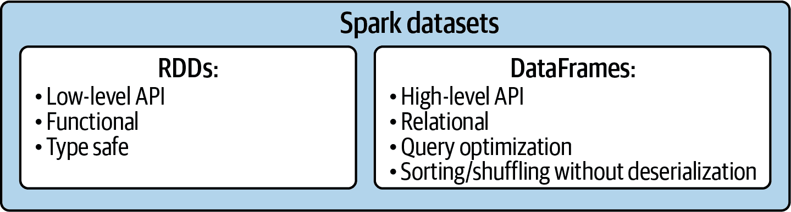

###### 图 3-1 Spark 的数据抽象

在每个数据解决方案中，我们使用映射器转换将一种形式的数据转换为另一种期望的数据形式（例如，将记录（作为`String`）转换为（key, value）形式）。Spark 提供了五种重要的映射器转换，在 RDD 转换中被广泛使用，这些转换在表格 3-1 中进行了总结。

表格 3-1 映射器转换

| 转换 | 关系类型 | 描述 |
| --- | --- | --- |
| `map(f)` | 1-to-1 | 通过将函数（`f()`）应用于该 RDD 的每个元素，返回一个新的 RDD。源 RDD 和目标 RDD 将具有相同数量的元素（将源`RDD[V]`的每个元素转换为结果目标`RDD[T]`的一个元素）。 |
| `mapValues(f)` | 1-to-1 | 将键值对 RDD 中的每个值通过`map(f)`函数进行处理，但不改变键；同时保留原始 RDD 的分区。源 RDD 和目标 RDD 将具有相同数量的元素（将源`RDD[K, V]`的每个元素转换为结果目标`RDD[K, T]`的一个元素）。 |
| `flatMap(f)` | 一对多 | 通过首先将函数(`f()`)应用于此 RDD 的所有元素，然后展开结果，返回一个新的 RDD。源 RDD 和目标 RDD 的元素数量可能不相同（将源`RDD[V]`的每个元素转换为目标`RDD[T]`的零个或多个元素）。 |
| `flatMapValues(f)` | 一对多 | 将（键，值）对 RDD 中的每个值通过`flatMap(f)`函数处理而不更改键；这也保留了原始 RDD 的分区。源 RDD 和目标 RDD 的元素数量可能不相同。 |
| `mapPartitions(f)` | 多对一 | 通过将函数(`f()`)应用于源 RDD 的每个分区来返回一个新的 RDD。源 RDD 和目标 RDD 的元素数量可能不相同（将源`RDD[V]`的每个分区（可能由数百、数千或数百万个元素组成）转换为结果目标`RDD[T]`的一个元素）。 |

我们将在本章稍后通过实际示例深入探讨每个内容的使用，但首先让我们进一步讨论转换的实际含义。

# 转换是什么？

转换被定义为“形式或外观上的彻底或显著变化”。这与 Spark 转换的语义完全匹配，它将数据从一种形式转换为另一种形式。例如，`map()`转换可以将电影信息记录（作为`String`对象的`<user_id><,><username><,><movie_name><,><movie_id><,><rating><,><timestamp><,>​<director>​<,>`…）转换为三元组`(user_id, movie_id, rating)`。另一个转换的例子可能是将染色体“chr7:890766:T”转换为`(chr7, 890766, T, 47)`的元组，其中 47（作为派生的分区号）是 890766 除以 101 的余数。

正如我们在第一章中学到的，Spark 支持对 RDD 的两种操作：转换和行动。作为提醒：

+   大多数 RDD 转换接受单个源 RDD 并创建单个目标 RDD。

+   一些 Spark 转换会创建多个目标 RDD。

+   Actions 创建非 RDD 元素（如整数、字符串、列表、元组、字典和文件）。

至少有三种方法可以创建全新的 RDD：

1.  RDD 可以从数据文件创建。您可以使用`SparkContext.textFile()`或`SparkSession.spark.read.text()`从 Amazon S3、HDFS、Linux 文件系统和许多其他数据源读取数据文件，如在第一章中讨论的。

1.  RDD 可以从集合（例如列表数据结构，例如数字列表、字符串列表或对列表）创建，使用`SparkContext.parallelize()`。

1.  给定一个源 RDD，您可以应用转换（例如`filter()`或`map()`）来创建一个新的 RDD。

Spark 提供了许多有用的转换，这是本章的主题。图 3-2 说明了这些选项。

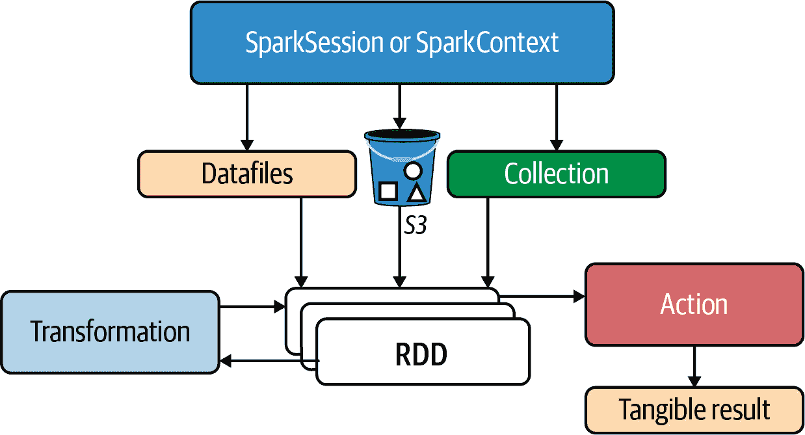

###### 图 3-2 不同创建 RDD 的选项

简言之，`textFile()` 和 `parallelize()` 操作可以表述为：

```
parallelize : collection --> RDD[T]
# where T is the type of collection elements

textFile : file(s) --> RDD[String]
# reading text files always creates an RDD[String]
```

在源 RDD 上的转换（具有元素类型 `U`，例如 `map()` 或 `filter()`）会创建一个新的 RDD（目标 RDD 元素类型为 `V`）：

```
transformation : RDD[U] --> RDD[V] where
U: data type of source RDD elements
V: data type of target RDD elements
```

在源 RDD 上执行的行动（例如 `collectAsMap()` 或 `count()`）会创建一个具体的结果（非 RDD），例如整数、字符串、列表、文件或字典：

```
acton : RDD[U] --> non-RDD
```

一些基本的 Spark 操作（转换和行动）如 图 3-3 所示。

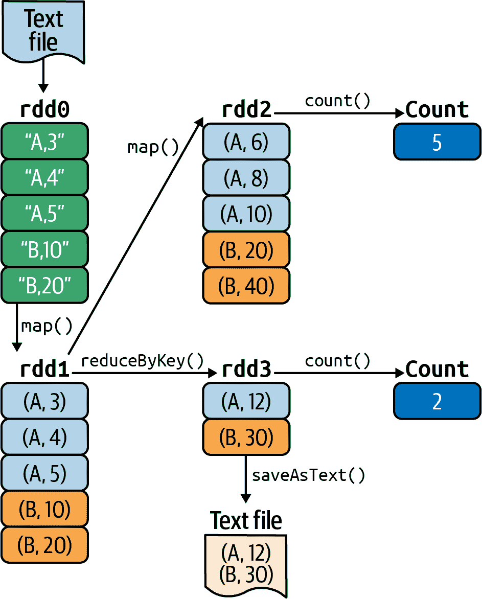

###### 图 3-3\. Spark 转换和行动

让我们看看 图 3-3 中发生了什么。通过以下转换创建了四个 RDDs：`rdd0`、`rdd1`、`rdd2` 和 `rdd3`：

转换 1

`SparkSession.sparkContext.textFile()` 从文本文件读取输入并创建第一个 RDD `rdd0`：

```
input_path = "sample_5_records.txt"
rdd0 = spark.sparkContext.textFile(input_path)
```

`rdd0` 被标记为 `RDD[String]`，表示 `rdd0` 的每个元素是一个 `String` 对象。

转换 2

`rdd1`（一个 `RDD[(String, Integer)]`）通过 `rdd0.map()` 转换创建，将 `rdd0` 的每个元素映射为 (key, value) 对：

```
def create_pair(record):
    tokens = record.split(",")
    return (tokens[0], int(tokens[1]))
#end-def

rdd1 = rdd0.map(create_pair)
```

转换 3

`rdd2`（一个 `RDD[(String, Integer)]`）通过 `rdd1.map()` 创建，其中 mapper 将 (key, value) 对的值部分加倍：

```
rdd2 = rdd1.map(lambda x: (x[0], x[1]+x[1]))

-- OR --

rdd2 = rdd1.mapValues(lambda v: v+v)
```

转换 4

`rdd3`（一个 `RDD[(String, Integer)]`）通过 `rdd1.reduceByKey()` 创建，其中 reducer 对相同键的值进行求和：

```
rdd3 = rdd1.reduceByKey(lambda x, y: x+y)
```

然后，使用以下行动创建了三个额外的非 RDD 输出：

行动 1

调用 `rdd2.count()` 来计算 `rdd2` 中元素的数量（结果为整数）：

```
rdd2_count = rdd2.count()
```

行动 2

调用 `rdd3.count()` 来计算 `rdd3` 中元素的数量（结果为整数）：

```
rdd3_count = rdd3.count()
```

行动 3

调用 `rdd3.saveAsText()` 将 `rdd3` 的内容持久化到文件系统中（结果为文本文件）：

```
rdd3.saveAsText("/tmp/rdd3_output")
```

让我们看另一个例子，图示于 图 3-4。您可以将此转换和操作序列视为有向无环图（DAG），其中节点或顶点表示 RDDs，边表示要应用于 RDDs 的操作。稍后您会看到，Spark 使用 DAG 优化操作。

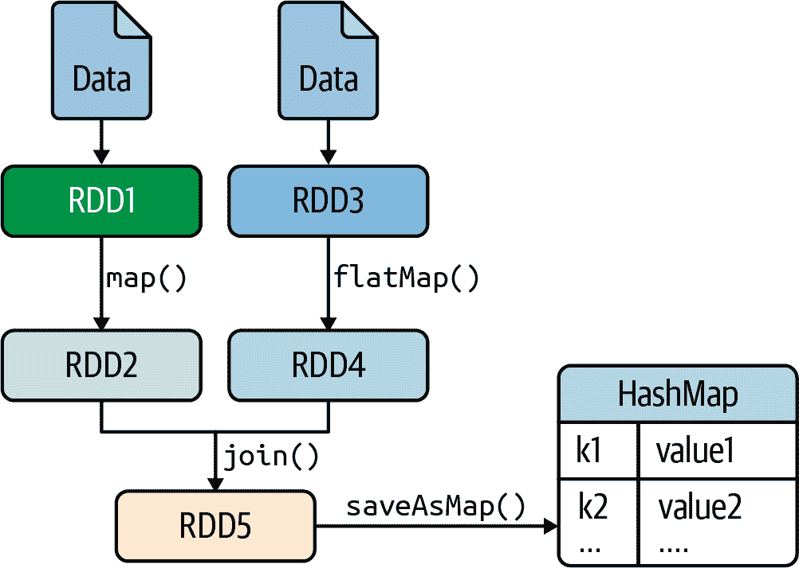

###### 图 3-4\. Spark 操作

让我们看看 图 3-4 中发生了什么：

1.  RDD1 和 RDD3 是从文本文件创建的。

1.  RDD2 由 `map()` 转换创建：

    ```
    # source RDD: RDD1[U]
    # target RDD: RDD2[V]
    RDD2 = RDD1.map(func1)
    ```

1.  RDD4 通过 `flatMap()` 转换创建：

    ```
    # source RDD: RDD3[C]
    # target RDD: RDD4[D]
    RDD4 = RDD3.flatMap(func2)
    ```

1.  RDD5 通过连接两个 RDDs（RDD2 和 RDD4）创建。此转换的结果是一个包含所有具有匹配键的元素对的 RDD：

    ```
    # source RDDs: RDD2, RDD4
    # target RDD: RDD5
    # join RDD2 and RDD4 on a common key
    RDD5 = RDD2.join(RDD4)
    ```

1.  最后，RDD5 的元素被保存为哈希映射：

    ```
    # source RDD: RDD5
    # action: saveAsMap()
    # target: hashmap : dictionary
    hashmap = RDD5.saveAsMap()
    ```

在执行 `saveAsMap()` 行动之前，不会评估或执行任何转换：这称为*延迟评估*。

## 懒加载转换

让我们深入了解一下 Spark 的惰性转换。当运行 Spark 应用程序（无论是 Python、Java 还是 Scala）时，Spark 创建一个 DAG 和该图。由于 Spark 的转换是惰性评估的，直到触发某个动作（如 `collect()` 或 `count()`）才会开始执行 DAG。这意味着 Spark 引擎可以在查看整个 DAG 之后做出优化决策，而不是仅仅查看单个转换和动作。例如，可以编写一个 Spark 程序，创建 10 个 RDD，其中有 3 个从不被使用（这些被称为 *不可达 RDD*）。Spark 引擎不需要计算这三个 RDD，通过避免这样做可以减少总执行时间。

正如前面提到的，在 Apache Spark 中，DAG 是一组顶点和边，其中顶点表示 RDD，边表示要在 RDD 上应用的操作（转换或动作）。在 Spark DAG 中，每条边从序列中较早的 RDD 指向较晚的 RDD。在调用动作（如 `saveAsMap()`、`count()`、`collect()` 或 `collectAsMap()`）时，创建的 DAG 被提交给 Spark 的 `DAG Scheduler`，后者进一步将图分割为任务的阶段，如 图 3-5 所示。

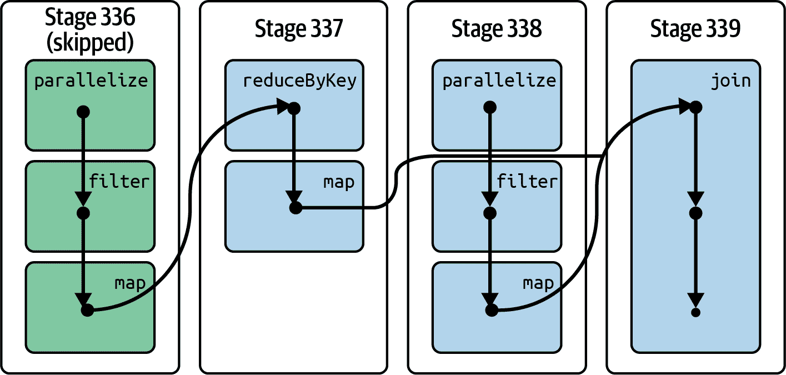

###### 图 3-5\. Spark 的 DAG

###### 提示

每个 `SparkContext` 启动一个 Web UI（默认端口为 4040，具有多个 `SparkContext` 绑定到连续端口），显示有关应用程序的有用信息，包括 DAG 的可视化。您可以通过访问 *http://<master>/4040* 查看 DAG。

在 Spark 中的惰性评估有多个优点。它增加了事务的可管理性，并使 Spark 引擎能够执行各种优化。这降低了复杂性，节省了计算资源，并提高了速度。减少 RDD 操作的执行时间可以提高性能，而血统图（DAG）通过记录在 RDD 上执行的操作来帮助 Spark 实现容错。

现在您对转换有了更多了解，我们将更详细地介绍 Spark 中最常见的映射器转换。我们将从 `map()` 转换开始，这是任何 Spark 应用程序中最常用的转换。

## map() 转换

`map()` 转换是 Spark 和 MapReduce 范式中最常见的转换。该转换可以应用于 RDD 和 Dataframe。

### RDD 映射器

`RDD.map()` 的目标是通过将函数 `f()` 应用于源 `RDD[V]` 的每个元素，将其转换为目标 `RDD[T]` 的映射元素。这个函数可以是预定义的，也可以是自定义的。`map()` 转换定义如下：

```
pyspark.RDD.map (Python method)
map(f, preservesPartitioning=False)

f: V --> T 
map: RDD[V] --> RDD[T] 
```


函数 `f()` 接受 `V` 类型的元素并返回 `T` 类型的元素。


使用函数 `f()`，`map()` 转换将 `RDD[V]` 转换为 `RDD[T]`。

这是一个一对一的转换：如果您的源 RDD 有 *`N`* 个元素，则结果/目标 RDD 也将有完全相同的 *`N`* 个元素。请记住，`map()` 转换不是一个顺序函数。您的源 RDD 被分区成 *`P`* 个分区，然后独立并发地处理这些分区。例如，如果您的源 RDD 有 400 亿个元素，并且 *`P`* `=` `20,000`，那么每个分区大约会有 200 万个元素（400 亿 = 20,000 x 2 百万）。如果可用的映射器数量为 80（这个数字取决于集群中的可用资源），则可以同时独立并发地映射 80 个分区。

`map()` 转换的函数 `f()` 可以定义为：

```
# v : a data type of V
# return an object of type T
def convert_V_to_T(v):
   t = *`<``convert` `v` `to` `an` `object` `of` `data` `type` `T``>`*
   return t
#end-def

# source RDD: source_rdd : RDD[V]
# target RDD: target_rdd : RDD[T]
target_rdd = source_rdd.map(convert_V_to_T)
```

或者您可以使用 lambda 表达式创建目标 RDD (`rdd_v`)，如下所示：

```
target_rdd = source_rdd.map(lambda v : convert_V_to_T(v))
```

Figure 3-6 说明了 `map()` 转换的语义。

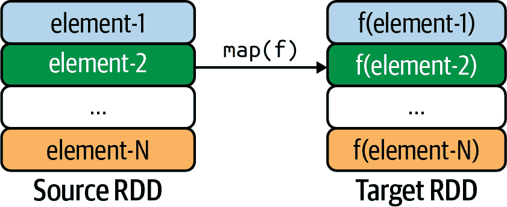

###### 图 3-6\. `map()` 转换

以下示例展示了如何在 PySpark shell 中使用 `map()` 转换。该示例将源 `RDD[Integer]` 映射到目标 `RDD[Integer]`：它将包含数字列表的 RDD 转换为新的 RDD，其中每个正数元素的值增加了 5，而所有其他元素都被更改为 0。

首先，让我们将我们的映射函数定义为 `mapper_func()`：

```
>>># define a simple mapper function
>>> def mapper_func(x):
...     if (x > 0):
...             return x+5
...     else:
...             return 0
>>>#end-def
```

接下来，我们将应用 `map()` 转换，并看看它是如何工作的：

```
>>># spark : SparkSession
>>> data = [1, -1, -2, 3, 4]
>>> rdd = spark.sparkContext.parallelize(data) 
>>> rdd.collect()
[1, -1, -2, 3, 4]
>>># use lambda expression
>>> rdd2 = rdd.map(lambda x : mapper_func(x)) 
>>> rdd2.collect()
[6, 0, 0, 8, 9]
>>># use a function instead
>>> rdd3 = rdd.map(mapper_func) 
>>> rdd3.collect()
[6, 0, 0, 8, 9]
>>>
>>> rdd4 = rdd.map(lambda x : (x, mapper_func(x))) 
>>> rdd4.collect()
[(1, 6), (-1, 0), (-2, 0), (3, 8), (4, 9)]
>>> rdd4.count()
5
```


`rdd` 是一个 `RDD[Integer]`。


`rdd2` 是一个 `RDD[Integer]`。


`rdd3` 是一个 `RDD[Integer]`。


`rdd4` 是一个 `RDD[(Integer, Integer)]`。

这里是另一个例子，将 `RDD[(String, Integer)]` 映射到 `RDD[(String, Integer, String)]`。该例子将形式为 (key, value) 对的元素转换为 (key, value, value+100) 三元组：

```
>>> pairs = [('a', 2), ('b', -1), ('d', -2), ('e', 3)]
>>> rdd = spark.sparkContext.parallelize(pairs) 
>>> rdd.collect()
[('a', 2), ('b', -1), ('d', -2), ('e', 3)]
>>> rdd2 = rdd.map(lambda (k, v) : (k, v, v+100)) 
>>> rdd2.collect()
[
 ('a', 2, 102),
 ('b', -1, 99),
 ('d', -2, 98),
 ('e', 3, 103)
]
```


`rdd` 是一个 `RDD[(String, Integer)]`。


`rdd2` 是一个 `RDD[(String, Integer, Integer)]`。

从 `String` 对象创建 (key, value) 对也很简单：

```
>>> def create_key_value(string):
>>>   tokens = string.split(",")
>>>   return (tokens[0], (tokens[1], tokens[2]))
>>>
>>> strings = ['a,10,11', 'b,8,19', 'c,20,21', 'c,2,8']
>>> rdd = spark.sparkContext.parallelize(strings) 
>>> rdd.collect()
['a,10,11', 'b,8,9', 'c,20,21', 'c,2,8']
>>> pairs = rdd.map(create_key_value) 
>>> rdd2.collect()
[
 ('a', (10, 11)),
 ('b', (8, 19)),
 ('c', (20, 21)),
 ('c', (2, 8))
]
```


`rdd` 是一个 `RDD[String]`。


`rdd2` 是一个 `RDD[(String, (Integer, Integer))]`。

接下来，我将讨论自定义映射函数。

### 自定义映射函数

在使用 Spark 的转换时，您可以使用自定义的 Python 函数来解析记录，执行计算，最终创建您想要的输出。

假设我们有一个样本数据集，每条记录的格式如下：

```
<id><,><name><,><age><,><number-of-friends>
```

我们的数据看起来像这样：

```
$ cat /tmp/users.txt
1,Alex,30,124
2,Bert,32,234
3,Curt,28,312
4,Don,32,180
5,Mary,30,100
6,Jane,28,212
7,Joe,28,128
8,Al,40,600
```

对于每个年龄类别，我们想要得到朋友平均数。我们可以编写自己的自定义映射器函数：

```
# record=<id><,><name><,><age><,><number-of-friends>
# parse record and return a pair as (age, number_of_friends)
def parse_record(record):
    # split record into a list at comma positions
    tokens = record.split(",")
    # extract and typecast relevant fields
    age = int(tokens[2])
    number_of_friends = int(tokens[3])
    return (age, number_of_friends)
#end-def
```

然后读取我们的数据并使用自定义函数：

```
users_path = '/tmp/users.txt'
users = spark.sparkContext.textFile(users_path) 
pairs = users.map(parse_record) 
```


`users`是一个`RDD[String]`。


`pairs`是一个`RDD[(Integer, Integer)]`，其中每条记录都会通过`parse_record()`处理。

对于我们的样本数据，`pairs`将是：

```
(30, 124), (32, 234), (28, 312), (32, 180),
(30, 100), (28, 212), (28, 128), (40, 600)
```

要获得每个年龄类别的平均数，我们首先获取每个年龄的总和和条目数：

```
totals_by_age = pairs \ 
  .mapValues(lambda x: (x, 1)) \ 
  .reduceByKey(lambda x, y: (x[0] + y[0], x[1] + y[1]))  
```


`pairs`是一个`RDD[(Integer, Integer)]`。


将`number_of_friends`字段转换为`(number_of_friends, 1)`对。


在年龄上执行减少以找到每个年龄的`(sum_of_friends, frequecy_count)`。


`totals_by_age`是`RDD[(Integer, (Integer, Integer))]`

对于我们的数据，`totals_by_age`将是：

```
(30, (124+100, 1+1))       --> (30, (224, 2))
(32, (234+180, 1+1))       --> (32, (414, 2))
(28, (312+212+128, 1+1+1)) --> (28, (652, 3))
(40, (600, 1))             --> (40, (600, 1))
```

现在，要计算每个年龄段的平均朋友数，我们需要进行另一个转换，将总和除以频率计数以获得平均值：

```
# x = (sum_of_friends, frequency_count)
# x[0] = sum_of_friends
# x[1] = frequency_count
averages_by_age = totals_by_age.mapValues(lambda x: float(x[0]) / float(x[1]))
averages_by_age.collect()
```

对于我们的数据，`averages_by_age`（一个`RDD[(Integer, Integer)]`）将是：

```
(30, (224 / 2)) = (30, 112)
(32, (414 / 2)) = (32, 207)
(28, (652 / 3)) = (28, 217)
(40, (600 / 1)) = (40, 600)
```

## DataFrame 映射器

Spark 的 DataFrame 没有`map()`函数，但我们可以通过多种方式实现`map()`的等效操作：可以通过`DataFrame.withColumn()`添加新列，并使用`DataFrame.drop()`删除现有列。新列的值可以根据现有行值或其他要求计算得出。

### 映射到单个 DataFrame 列

考虑以下 DataFrame：

```
tuples3 = [ ('alex', 440, 'PHD'), ('jane', 420, 'PHD'),
            ('bob', 280, 'MS'), ('betty', 200, 'MS'),
            ('ted', 180, 'BS'), ('mary', 100, 'BS') ]

df = spark.createDataFrame(tuples3, ["name", "amount", "education"])
>>> df.show()
+-----+------+---------+
| name|amount|education|
+-----+------+---------+
| alex|   440|      PHD|
| jane|   420|      PHD|
|  bob|   280|       MS|
|betty|   200|       MS|
|  ted|   180|       BS|
| mary|   100|       BS|
+-----+------+---------+
```

假设我们想要对“amount”列计算 10%的奖金并创建一个新的“bonus”列。有多种方法可以完成这个映射任务。

要保留所有列，请执行以下操作：

```
df2 = df.rdd\
    .map(lambda x: (x["name"], x["amount"],
                    x["education"], int(x["amount"])/10))
    .toDF(["name", "amount", "education", "bonus"])

>>> df2 = df.rdd.map(lambda x: (x["name"], x["amount"],
    x["education"], x["amount"]/10))
    .toDF(["name", "amount", "education", "bonus"])
>>> df2.show()
+-----+------+---------+-----+
| name|amount|education|bonus|
+-----+------+---------+-----+
| alex|   440|      PHD| 44.0|
| jane|   420|      PHD| 42.0|
|  bob|   280|       MS| 28.0|
|betty|   200|       MS| 20.0|
|  ted|   180|       BS| 18.0|
| mary|   100|       BS| 10.0|
+-----+------+---------+-----+
```

您必须将行映射到包含所有现有列的元组，然后添加新列。

如果您有太多列要列举，也可以将一个元组添加到现有行。

```
>>> df3 = df.rdd.map(lambda x: x + \
   (str(x["amount"]/10),)).toDF(df.columns + ["bonus"])
>>> df3.show()
+-----+------+---------+-----+
| name|amount|education|bonus|
+-----+------+---------+-----+
| alex|   440|      PHD| 44.0|
| jane|   420|      PHD| 42.0|
|  bob|   280|       MS| 28.0|
|betty|   200|       MS| 20.0|
|  ted|   180|       BS| 18.0|
| mary|   100|       BS| 10.0|
+-----+------+---------+-----+
```

还有另一种方法可以使用`DataFrame.withColumn()`添加`bonus`列：

```
>>> df4 = df.withColumn("bonus", F.lit(df.amount/10))
>>> df4.show()
+-----+------+---------+-----+
| name|amount|education|bonus|
+-----+------+---------+-----+
| alex|   440|      PHD| 44.0|
| jane|   420|      PHD| 42.0|
|  bob|   280|       MS| 28.0|
|betty|   200|       MS| 20.0|
|  ted|   180|       BS| 18.0|
| mary|   100|       BS| 10.0|
+-----+------+---------+-----+
```

### 映射到多个 DataFrame 列

现在，假设您要添加一个依赖于两个列“amount”和“education”的`bonus`列：`bonus`列计算如下：

```
	bonus = amount * 30% if education = PHD
	bonus = amount * 20% if education = MS
	bonus = amount * 10% all other cases
```

最简单的方法是使用用户定义的函数（UDF）：定义一个 Python 函数，然后将其注册为 UDF：

```
def compute_bonus(amount, education):
    if education == "PHD": return int(amount * 0.30)
    if education == "MS": return int(amount * 0.20)
    return int(amount * 0.10)
#end-def
```

现在，将您的 Python 函数注册为 UDF：

```
>>> from org.apache.spark.sql.functions import udf
>>> compute_bonus_udf = udf(lambda amount, education:
   compute_bonus(amount, education), IntegerType())
```

一旦您的 UDF 准备就绪，那么您就可以应用它：

```
>>> df5 = df.withColumn("bonus",
   compute_bonus_udf(df.amount, df.education))
>>> df5.show()
+-----+------+---------+-----+
| name|amount|education|bonus|
+-----+------+---------+-----+
| alex|   440|      PHD|  132|
| jane|   420|      PHD|  126|
|  bob|   280|       MS|   56|
|betty|   200|       MS|   40|
|  ted|   180|       BS|   18|
| mary|   100|       BS|   10|
+-----+------+---------+-----+
```

接下来，我们将看一下`flatMap()`转换。

# flatMap()转换

`flatMap()`转换通过将函数应用于源 RDD 的每个元素，然后展平结果来返回新的 RDD。这是一种一对多的转换：源 RDD 的每个元素可以映射为目标 RDD 的 0、1、2 或多个元素。换句话说，`flatMap()`将长度为`N`的源`RDD[U]`转换为长度为`M`的目标`RDD[V]`（`M`和`N`可以不同）。使用`flatMap()`时，您需要确保源 RDD 的元素是可迭代的（例如，一个包含项目列表的列表）。

例如，如果源 RDD 的元素是`[10, 20, 30]`（包含三个数字的可迭代列表），那么它将被映射为目标 RDD 的三个元素（`10`，`20`和`30`）；如果源 RDD 的元素是`[]`（空列表，可迭代），那么它将被丢弃，并且根本不会映射到目标 RDD。如果源 RDD 的任何元素不可迭代，则会引发异常。

注意，`map()`将长度为`N`的 RDD 转换为另一个长度为`N`的 RDD（长度相同），而`flatMap()`将长度为`N`的 RDD 转换为一组`N`个可迭代集合，然后展平这些集合为单个结果 RDD。因此，源 RDD 和目标 RDD 可能具有不同的大小。

`flatMap()`转换定义如下：

```
pyspark.RDD.flatMap (Python method)
flatMap(f, preservesPartitioning=False)

U: iterable collection of V
source RDD: RDD[U]
target RDD: RDD[V]

f: U --> [V] 
flatMap: RDD[U] --> RDD[V]
```


函数`f()`接受类型为`U`的元素，并将其转换为类型为`V`的元素列表（此列表可以包含 0、1、2 或多个元素），然后展平。注意，空列表将被丢弃。函数`f()`必须创建一个可迭代对象。

图 3-7 展示了`flatMap()`转换的示例。

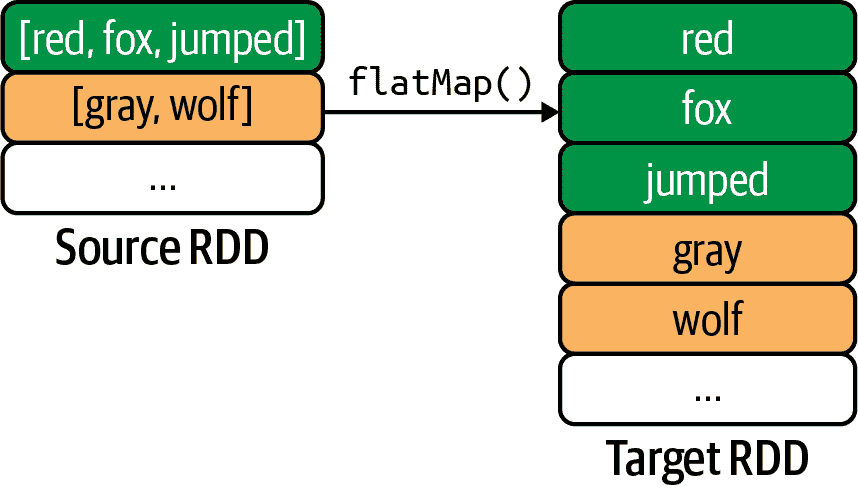

###### 图 3-7。`flatMap()`转换

在图 3-7 中，源 RDD 的每个元素（一个`String`）被分词为一个`Strings`列表，然后展平为一个`String`对象。例如，第一个元素`"[red fox jumped]"`被转换为`Strings`列表`["red", "fox", "jumped"]`，然后该列表被展平为三个`String`对象`"red"`，`"fox"`和`"jumped"`。因此，第一个源元素被映射为三个目标元素。

以下示例展示了如何使用`flatMap()`转换：

```
>>> numbers = [1, 2, 3, 4, 5]
>>> rdd = spark.sparkContext.parallelize(numbers)
>>> rdd.collect()
[1, 2, 3, 4, 5]
>>> rdd2 = rdd.flatMap(lambda x: range(1, x))
>>> rdd2.collect()
[1, 1, 2, 1, 2, 3, 1, 2, 3, 4]
>>> rdd3 = rdd.flatMap(lambda x: [(x, x+1), (x+1, x)])
>>> rdd3.collect()
[
 (1, 2), (2, 1),
 (2, 3), (3, 2),
 (3, 4), (4, 3),
 (4, 5), (5, 4),
 (5, 6), (6, 5)
]
>>> rdd3.count()
10
```

让我们来看看如何创建`rdd2`：

```
Element 1: --maps--> range(1, 1) --flattens--> []
           --> dropped since empty

Element 2: --maps--> range(1, 2) --flattens--> [1]
           --> maps into one element as 1

Element 3: --maps--> range(1, 3) --flattens--> [1, 2]
           --> maps into two elements as 1, 2

Element 4: --maps--> range(1, 4) --flattens--> [1, 2, 3]
           --> maps into three elements as 1, 2, 3

Element 5: --maps--> range(1, 5) --flattens--> [1, 2, 3, 4]
           --> maps into four elements as 1, 2, 3, 4
```

您也可以使用函数，而不是 lambda 表达式：

```
>>> numbers = [1, 2, 3, 4, 5]
>>> rdd = spark.sparkContext.parallelize(numbers) 
>>> rdd.collect()
[1, 2, 3, 4, 5]
>>> def create_list(x):
...     return [(x, x+1), (x, x+2)]
>>>#end-def
...
>>> rdd4 = rdd.flatMap(create_list) 
>>> rdd4.collect()
[
 (1, 2), (1, 3),
 (2, 3), (2, 4),
 (3, 4), (3, 5),
 (4, 5), (4, 6),
 (5, 6), (5, 7)
]
>>> rdd4.count()
10
```


`rdd`是一个包含五个元素的`RDD[Integer]`。


`rdd4`是一个包含十个元素的`RDD[(Integer, Integer)]`。

`flatMap()`函数示例说明了如何在目标 RDD 中，针对源 RDD 中的每个元素返回零个或多个元素：

```
>>> words = ["a", "red", "of", "fox", "jumped"]
>>> rdd = spark.sparkContext.parallelize(words)
>>> rdd.count() 
5
>>> rdd.collect()
['a', 'red', 'of', 'fox', 'jumped']
>>> def my_flatmap_func(x):
...     if len(x) < 3:
...         return [] 
...     else:
...         return [x, x, x] 
...
>>> flattened = rdd.flatMap(my_flatmap_func)
>>> flattened.count() 
9
>>> flattened.collect()
['red', 'red', 'red', 'fox', 'fox', 'fox', 'jumped', 'jumped', 'jumped']
```


`rdd`是一个包含五个元素的`RDD[String]`。


空列表将被丢弃。


这将映射到三个目标元素。


`flattened` 是一个具有九个元素的 `RDD[String]`。

下面的例子清楚地展示了 `map()` 和 `flatMap()` 之间的区别。如您从输出中看到的那样，`flatMap()` 将其输出展平，而 `map()` 转换是一对一映射，不会展平其输出：

```
def to_list(x): return [x, x+x, x*x]

# rdd1: RDD[Integer] (element type is Integer)
rdd1 = spark.sparkContext.parallelize([3,4,5]) 
            .map(to_list) 
rdd1.collect()
# output: notice non-flattened list
[[3, 6, 9], [4, 8, 16], [5, 10, 25]]
rdd1.count()
3

# rdd2 : RDD[[Integer]] (element type is [Integer])
rdd2 = spark.sparkContext.parallelize([3,4,5]) 
                         .flatMap(to_list) 
rdd2.collect()
# output: notice flattened list
[3, 6, 9, 4, 8, 16, 5, 10, 25]
rdd2.count()
9
```


创建一个 `RDD[Integer]`。


`rdd1` 的每个元素都是整数列表（作为 `RDD[[Integer]]`）。


创建一个 `RDD[[Integer]]`。


`rdd2` 的每个元素都是整数（作为 `RDD[Integer]`）。

图 3-8 中呈现了 `flatMap()` 转换的视觉表示。

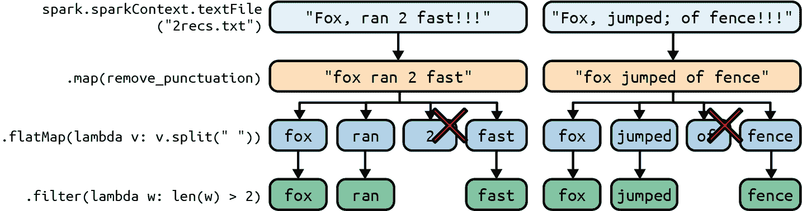

###### 图 3-8\. 一个 `flatMap()` 转换

让我们逐步分析这里发生的情况。我们将从检查输入文件 *2recs.txt* 的内容开始：

```
$ cat 2recs.txt
Fox, ran  2 fast!!!
Fox, jumped; of fence!!!
```

下面是步骤：

1.  首先，我们创建一个仅包含两条记录/元素的 `RDD[String]`：

    ```
    rdd = spark.sparkCintext.textFile("2recs.txt")
    rdd.collect()
    [
     "Fox, ran  2 fast!!!",
     "Fox, jumped; of fence!!!"
    ]
    ```

1.  接下来，我们对此 RDD 的所有元素应用 `map()` 转换，删除所有标点符号，将多个空格缩减为单个空格，并将所有字母转换为小写。这是通过一个简单的 Python 函数实现的：

    ```
    import string, re
    def no_punctuation(record_str):
        exclude = set(string.punctuation)
        t = ''.join(ch for ch in record_str if ch not in exclude)
        trimmed = re.sub('\s+',' ', t)
        return trimmed
    #end-def

    rdd_cleaned = rdd.map(no_punctuation)
    rdd_cleaned.collect()
    [
     "fox ran 2 fast",
     "fox jumped of fence"
    ]
    ```

1.  然后我们对 `rdd_cleaned` 应用 `flatMap()` 转换，首先对此 RDD 的元素进行标记化，然后展开它：

    ```
    flattened = rdd_cleaned.flatMap(lambda v: v.split(" "))
    flattened.collect()
    ['fox', 'ran', '2', 'fast', 'fox', 'jumped', 'of', 'fence']
    ```

1.  最后，`filter()` 转换将丢弃 `flattened` RDD 的元素，仅保留长度大于 2 的元素。

    ```
    final_rdd = flattened.filter(lambda w: len(w) > 2)
    final_rdd.collect()
    ['fox', 'ran', 'fast', 'fox', 'jumped', 'fence']
    ```

在 图 3-8 中用 X 标出的筛选出的元素。

## `map()` 与 `flatMap()` 对比

您现在已经看到了一些 `map()` 和 `flatMap()` 转换的例子，但重要的是要理解它们之间的区别。总结一下：

`map()`

这是一个一对一的转换。它通过将给定函数应用于 RDD 的每个元素来返回一个新的 RDD。`map()` 中的函数只返回一个项。

`flatMap()`

这是一个一对多的转换。它还通过对源 RDD 的每个元素应用函数来返回一个新的 RDD，但函数可以针对每个源元素返回 0、1、2 或多个元素，并且输出被展平。

图 3-9 中阐明了 `map()` 和 `flatMap()` 的区别。

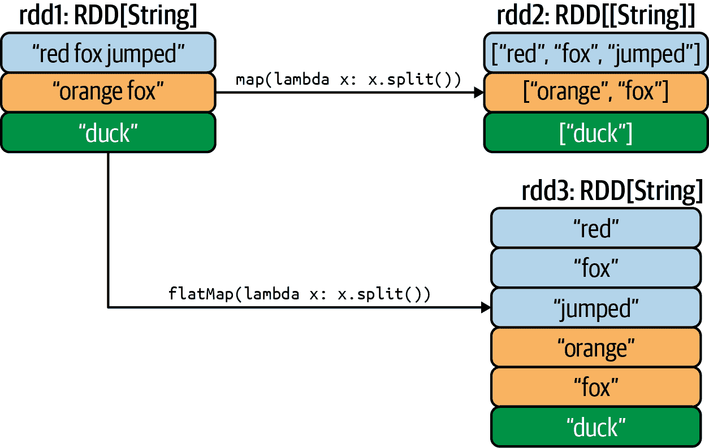

###### 图 3-9\. `map()` 和 `flatMap()` 的区别

## 应用 `flatMap()` 到 DataFrame

`RDD.flatMap()`是一对多的转换：它接收源 RDD 的一个元素并将其转换为多个（0、1、2、3 或更多）目标元素。PySpark 的 DataFrame 没有`flatMap()`转换，但是 DataFrame 具有函数`pyspark.sql.functions.explode(col)`，用于展平列。`explode(column)`为给定的`column`（表示为列表或字典）中的每个元素返回一行，并使用默认列名`col`来表示数组中的元素，以及用键和值来表示字典中的元素，除非另有指定。

下面是一个完整的示例，展示了如何使用`explode()`函数作为`RDD.flatMap()`转换的等价物。

让我们首先创建一个 DataFrame，其中一个列是一个列表（将由`explode()`函数展开）。

```
some_data = [
    ('alex', ['Java','Scala', 'Python']),
    ('jane', ['Cobol','Snobol']),
    ('bob', ['C++',]),
    ('ted', []),
    ('max', [])
]

>>> df = spark.createDataFrame(
    data=some_data, schema = ['name', 'known_languages'])

>>> df.show(truncate=False)
+----+----------------------+
|name| known_languages      |
+----+----------------------+
|alex| [Java, Scala, Python]|
|jane| [Cobol, Snobol]      |
|bob | [C++]                |
|ted | []                   |
|max | []                   |
+----+----------------------+
```

接下来，我们将展开`known_languages`列：

```
>>> exploded = df.select(df.name,
    explode(df.known_languages).alias('language'))
>>> exploded.show(truncate=False)
+----+--------+
|name|language|
+----+--------+
|alex|  Java  |
|alex|  Scala |
|alex|  Python|
|jane|  Cobol |
|jane|  Snobol|
|bob |  C++   |
+----+--------+
```

如您所见，当展开列时，如果列是空列表，则从展开结果中删除该列（`tex`和`max`被删除，因为它们关联的是空列表）。

接下来，我们将看一下如何对给定的 DataFrame 展开多列。请注意，每个`select`子句只允许一个生成器：这意味着您不能同时展开两列（但可以逐个迭代展开它们）。以下示例显示了如何展开两列：

```
>>> some_data = [
...     ('alex', ['Java','Scala', 'Python'], ['MS', 'PHD']),
...     ('jane', ['Cobol','Snobol'], ['BS', 'MS']),
...     ('bob', ['C++'], ['BS', 'MS', 'PHD']),
...     ('ted', [], ['BS', 'MS']),
...     ('max', ['FORTRAN'], []),
...     ('dan', [], [])
... ]
>>>
>>> df = spark.createDataFrame(data=some_data,
   schema = ['name', 'languages', 'education'])
>>> df.show(truncate=False)
+----+---------------------+-------------+
|name|languages            |education    |
+----+---------------------+-------------+
|alex|[Java, Scala, Python]|[MS, PHD]    |
|jane|[Cobol, Snobol]      |[BS, MS]     |
|bob |[C++]                |[BS, MS, PHD]|
|ted |[]                   |[BS, MS]     |
|max |[FORTRAN]            |[]           |
|dan |[]                   |[]           |
+----+---------------------+-------------+
```

接下来我们展开`languages`列，它是一个数组：

```
>>> exploded_1 = df.select(df.name,
   explode(df.languages).alias('language'), df.education)
>>> exploded_1.show(truncate=False)
+----+--------+-------------+
|name|language|education    |
+----+--------+-------------+
|alex|Java    |[MS, PHD]    |
|alex|Scala   |[MS, PHD]    |
|alex|Python  |[MS, PHD]    |
|jane|Cobol   |[BS, MS]     |
|jane|Snobol  |[BS, MS]     |
|bob |C++     |[BS, MS, PHD]|
|max |FORTRAN |[]           |
+----+--------+-------------+
```

注意，由于爆炸列值为空列表，名称`ted`和`dan`被丢弃。

接下来，我们展开`education`列：

```
>>> exploded_2 = exploded_1.select(exploded_1.name, exploded_1.language,
   explode(exploded_1.education).alias('degree'))
>>> exploded_2.show(truncate=False)
+----+--------+------+
|name|language|degree|
+----+--------+------+
|alex|Java    |    MS|
|alex|Java    |   PHD|
|alex|Scala   |    MS|
|alex|Scala   |   PHD|
|alex|Python  |    MS|
|alex|Python  |   PHD|
|jane|Cobol   |    BS|
|jane|Cobol   |    MS|
|jane|Snobol  |    BS|
|jane|Snobol  |    MS|
|bob |C++     |    BS|
|bob |C++     |    MS|
|bob |C++     |   PHD|
+----+--------+------+
```

注意，由于爆炸列值为空列表，名称`max`被丢弃。

下面我们将讨论一种仅适用于其元素为(key, value)对的 RDD 的转换。

# `mapValues()`转换

`mapValues()`转换仅适用于键值对 RDD（`RDD[(K, V)]`，其中`K`是键，`V`是值）。它仅对值(`V`)操作，保持键不变，与`map()`转换不同，后者操作整个 RDD 元素。

从非正式的角度来看，给定源 RDD `RDD[(K, V)]` 和函数 `f: V -> T`，我们可以说 `rdd.mapValues(f)` 等价于以下 `map()`：

```
# source rdd: RDD[(K, V)]
# target result: RDD[(K, T)]
result = rdd.map( lambda (k, v): (k, f(v)) )
```

`mapValues()`转换定义如下：

```
pyspark.RDD.mapValues (Python method)
mapValues(f)

f: V --> U 
mapValues: RDD[(K, V)] --> RDD[(K, f(V))]
```


函数`f()`可以将数据类型`V`转换为任何所需的数据类型`T`。`V`和`T`可以相同也可以不同。

`mapValues()`转换将键值对 RDD 中的每个值通过`map()`函数传递，而不改变键；这也保留了原始 RDD 的分区（更改是在原地完成的，分区的结构和数量不变）。

下面是`mapValues()`转换的示例：

```
>>> pairs = [
    ("A", []), ("Z", [40]),
    ("C", [10, 20, 30]), ("D", [60, 70])
  ]
>>> rdd = spark.sparkContext.parallelize(pairs) 
>>> rdd.collect()
[('A', []), ('Z', [40]), ('C', [10, 20, 30]), ('D', [60, 70])]
>>>
>>> def f(x):
>>>    if len(x) == 0: return 0
>>>    else: return len(x)+1
>>>
>>> rdd2 = rdd.mapValues(f) 
>>> rdd2.collect()
[('A', 0), ('Z', 2), ('C', 4), ('D', 3)]
```


`rdd`是一个`RDD[(String, [Integer])]`。


`rdd2`是一个`RDD[(String, Integer)]`。

`mapValues()` 是一个一对一的转换，如图 3-10 所示。

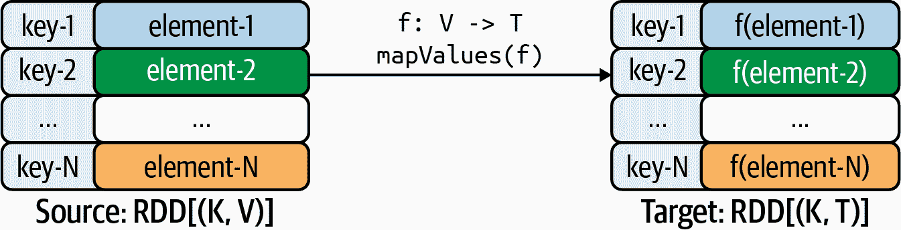

###### 图 3-10\. `mapValues()` 转换

# `flatMapValues()` 转换

`flatMapValues()` 转换是 `flatMap()` 和 `m⁠a⁠p​V⁠a⁠l⁠u⁠e⁠s⁠(⁠)` 的组合。它类似于 `mapValues()`，但 `flatMapValues()` 在 `RDD[(K, V)]`（即 (键, 值) 对的 RDD）的值上运行 `flatMap()` 函数，而不是 `map()` 函数。它在不改变键的情况下保留了原始 RDD 的分区。以下是一个例子：

```
>>> rdd = spark.sparkContext.parallelize([
  ('S', []), 
  ('Z', [7]),
  ('A', [1, 2, 3]),
  ('B',[4, 5])
]) 

>>># function is applied to entire
>>># value, and then result is flattened
>>> rdd2 = rdd.flatMapValues(lambda v: [i*3 for i in v]) 
>>> rdd2.collect()
[('Z', 21),
 ('A', 3), ('A', 6), ('A', 9),
 ('B', 12), ('B', 15)]
```


此元素将被丢弃，因为其值为空。


`rdd` 是一个 `RDD[(String, [Integer])]`。


`rdd2` 是一个 `RDD[(String, Integer)]`；注意，由于键 `S` 的值是空列表，所以该键被丢弃了。

这里是另一个例子：

```
>>> rdd = spark.sparkContext.parallelize([
  ("A", ["x", "y", "z"]),
  ("B", ["p", "r"]),
  ("C", ["q"]),
  ("D", [])
]) 

>>> def f(x): return x
>>> rdd2 = rdd.flatMapValues(f) 
>>> rdd2.collect()
[
 ('A', 'x'), ('A', 'y'), ('A', 'z'),
 ('B', 'p'), ('B', 'r'),
 ('C', 'q')
]
```


`rdd` 是一个 `RDD[(String, [String])]`。


`rdd2` 是一个 `RDD[(String, String)]`。

同样地，如果某个键的值为空`([])`，那么不会生成输出值（该键也会被丢弃）。因此，对于 `D` 键，不会生成任何元素。

接下来我们将看看 `mapPartitions()` 转换，这在我看来是 Spark 中最重要的映射器转换之一。

# `mapPartitions()` 转换

`mapPartitions()` 是一个强大的分布式映射器转换，它一次处理一个分区（而不是一个元素）。它实现了汇总设计模式，将源 RDD 的每个分区汇总为目标 RDD 的单个元素。该转换的目标是一次处理一个分区（虽然许多分区可以独立并发地处理），遍历分区的所有元素，并将结果汇总到紧凑的数据结构中，例如字典、元素列表、元组或元组列表。

`mapPartitions()` 转换的签名如下：

```
mapPartitions(f, preservesPartitioning=False)
# Returns a new RDD by applying a function, f(), to each partition
# of this RDD. If source RDD has N partitions, then your function
# will be called N times, independently and concurrently.
```

假设您的源 RDD 有*`N`*个分区。`mapPartitions()` 转换将源 RDD 的单个分区映射为所需的数据类型 `T`（例如，可以是单个值、元组、列表或字典）。因此，目标 RDD 将是长度为*`N`*的 `RDD[T]`。当您想要将由源 RDD 元素集合组成的每个分区减少（或聚合）为类型 `T` 的紧凑数据结构时，这是一个理想的转换：它将单个分区映射到目标 RDD 的单个元素中。

在图 3-11 中提供了一个高级概述。

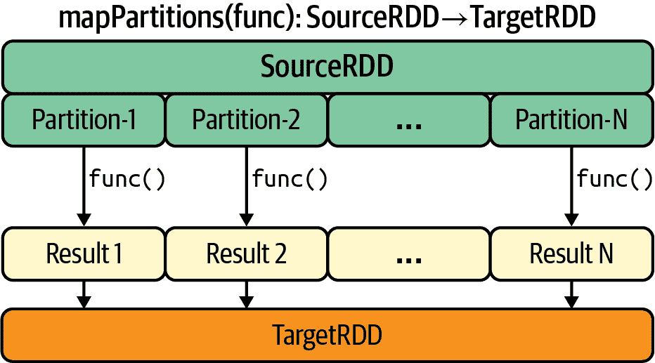

###### 图 3-11\. `mapPartition()` 转换

为了帮助您理解`mapPartitions()`转换的逻辑，我将呈现一个简单具体的例子。假设您有一个包含 100,000,000,000 个元素的源`RDD[Integer]`，并且您的 RDD 被分成了 10,000 个块或分区。因此，每个分区将有大约 10,000,000 个元素。如果您有足够的集群资源可以并行运行 10,000 个映射器，那么每个映射器将接收一个分区。由于您将一次处理一个分区，您有机会过滤元素并将每个分区汇总到单个期望的数据结构中（如元组、列表或字典）。

假设您想要找到数字源 RDD 的`(minimum, maximum, count)`。每个映射器将为每个分区找到本地的`(minimum, maximum, count)`，最终您可以找到所有分区的最终`(minimum, maximum, count)`。这里，目标数据类型是三元组：

```
T = (int, int, int) = (minimum, maximum, count)
```

`mapPartitions()`是一种理想的转换，当您想将每个分区映射为少量紧凑或减少的信息时。您可以过滤源 RDD 中不需要的元素，然后在您选择的数据结构中总结剩余的元素。

让我们来详细了解`mapPartitions()`转换的主要流程：

1.  首先，定义一个接受源 RDD 的单个分区（`RDD[Integer]`）并返回数据类型`T`的函数，其中：

    ```
    T = (int, int, int) = (minimum, maximum, count)
    ```

    让 *`N`* 是您源 RDD 的分区数。给定一个分区`p`（其中`p`在`{1, 2, …, *N*}`中），`mapPartitions()`将计算每个分区`p`的(`minimum[p], maximum[p], count[p]`)：

    ```
    def find_min_max_count(single_partition):
      # find (minimum, maximum, count) by iterating single_partition
      return [(minimum, maximum, count)]
    #end-def
    ```

1.  接下来，应用`mapPartitions()`转换：

    ```
    # source RDD: source_rdd = RDD[Integer]
    # target RDD: min_max_count_rdd = RDD(int, int, int)
    min_max_count_rdd = source_rdd.mapPartitions(find_min_max_count)
    min_max_count_list = min_max_count_rdd.collect()
    print(min_max_count_list)
    [
     (min1, max1, count1),
     (min2, max2, count2),
     ...
     (minN, maxN, countN)
    ]
    ```

1.  最后，我们需要收集`min_max_count_rdd`的内容，并找到最终的`(minimum, maximum, count)`：

    ```
    # minimum = min(min1, min2, ..., minN)
    minimum = min(min_max_count_list)[0]
    # maximum = max(max1, max2, ..., maxN)
    maximum = max(min_max_count_list)[1]
    # count = (count1+count2+...+countN)
    count = sum(min_max_count_list)[2]
    ```

我们可以定义我们的函数如下。请注意，通过使用布尔标志`first_time`，我们避免对数字值范围做出任何假设：

```
def find_min_max_count(single_partition_iterator):
	first_time = True
	for n in single_partition_iterator:
		if (first_time):
			minimum = n;
			maximum = n;
			count = 1
			first_time = True
		else:
			maximum = max(n, maximum)
			minimum = min(n, minimum)
			count += 1
	#end-for
	return [(minimum, maximum, count)]
#end-def
```

接下来，让我们创建一个`RDD[Integer]`，然后应用`mapPartitions()`转换：

```
integers = [1, 2, 3, 1, 2, 3, 70, 4, 3, 2, 1]
# spark : SparkSession
source_rdd = spark.sparkContext.parallelize(integers)
# source RDD: source_rdd = RDD[Integer]
# target RDD: min_max_count_rdd = RDD(int, int, int)
min_max_count_rdd = source_rdd.mapPartitions(find_min_max_count)

min_max_count_list = min_max_count_rdd.collect() 
# compute the final values:
minimum = min(min_max_count_list)[0]
maximum = max(min_max_count_list)[1]
count = sum(min_max_count_list)[2]
```


这里的`collect()`是可扩展的，因为分区数将在千级而不是百万级。

总之，如果您有大量数据要减少到更少的信息量（汇总任务），则`mapPartitions()`转换是一个可能的选择。例如，它非常适用于查找数据集中的最小值和最大值或前 10 个值。`mapPartitions()`转换：

+   实现了汇总设计模式，将源 RDD 中所有元素组合成目标 RDD 的单个紧凑元素（如字典、元组或对象或元组的列表）。

+   可以用作`map()`和`foreach()`的替代方案，但是每个分区只调用一次，而不是每个元素调用一次。

+   使程序员可以在每个分区而不是每个元素的基础上进行初始化。

接下来，我将讨论一个非常重要的话题：在使用`mapPartitions()`转换时如何处理和处理空分区。

## 处理空分区

在我们先前的解决方案中，我们使用了`mapPartitions(func)`转换，它将输入数据分成许多分区，然后并行地对每个分区应用程序员提供的函数`func()`。但如果其中一个或多个分区为空怎么办？在这种情况下，将没有数据（该分区中没有元素）进行迭代。我们需要编写我们自己的自定义函数`func()`（分区处理程序），以便正确和优雅地处理空分区。我们不能只是忽略它们。

空分区可能由于各种原因而发生。如果 Spark 分区器在分区数据时出现异常（例如，在网络传输中途由于损坏的记录导致），则某些分区可能为空。另一个原因可能是分区器没有足够的数据放入某个分区中。无论这些分区为何存在，我们都需要主动处理它们。

为了说明空分区的概念，我首先定义一个函数`debug_partition()`来显示每个分区的内容：

```
def debug_partition(iterator):
    #print("type(iterator)=", type(iterator))
    print("elements = ", list(elements))
#end-def
```

###### 警告

请记住，在生产环境中，显示或调试分区内容可能会很昂贵，并且应尽量避免。我仅包含了用于教学和调试目的的`print`语句。

现在让我们创建一个 RDD，并以一种方式对其进行分区，以强制创建空分区。我们通过将分区数设置为大于 RDD 元素数来实现这一点：

```
>>> sc
<SparkContext master=local[*] appName=PySparkShell>
>>> numbers = [1, 2, 3, 4, 5]
>>> rdd = sc.parallelize(numbers, 7) 
>>> rdd.collect()
[1, 2, 3, 4, 5]
>>> rdd.getNumPartitions()
7
```


强制创建空分区。

我们可以使用`debug_partition()`函数检查每个分区：

```
>>> rdd.foreachPartition(debug_partition)
elements =  [4]
elements =  [3]
elements =  [2]
elements =  [] 
elements =  [] 
elements =  [5]
elements =  [1]
```


一个空分区

从这个测试程序中，我们可以观察到以下内容：

+   一个分区可能为空（没有 RDD 元素）。您的自定义函数必须主动和优雅地处理空分区，即必须返回一个合适的值。不能只是忽略空分区。

+   `iterator`数据类型（代表单个分区，并作为参数传递给`mapPartitions()`）是`itertools.chain`。`itertools.chain`是一个迭代器，它从第一个可迭代对象返回元素，直到耗尽，然后继续到下一个可迭代对象，直到所有可迭代对象都耗尽。它用于将连续的序列视为单个序列。

现在的问题是，我们如何处理 PySpark 中的空分区？以下模式可用于处理空分区。基本思想是使用 Python 的`try-except`组合，其中`try`块允许您测试一段代码的错误，并且`except`块让您处理错误：

```
# This is the template function
# to handle a single partition.
#
# source RDD: RDD[T]
#
# parameter: iterator

def func(iterator): 
    print("type(iterator)=", type(iterator))
    #   ('type(iterator)=', <type 'itertools.chain'>)

    try:
        first_element = next(iterator) 
        # if you are here it means that
        # the partition is NOT empty;
        # iterate/process the partition
        # and return a proper result

    except StopIteration: 
        # if you are here it means that this
        # partition is empty; now, you need
        # to handle it and return a proper result
#end-def
```


`iterator`表示类型为`T`的单个分区元素。


尝试获取给定分区的第一个元素（作为类型为`T`的`first_element`）。如果失败（抛出异常），控制将转移到`except`（发生异常）块。


当给定分区为空时，您不能简单地忽略空分区，必须处理错误并返回适当的值。

# 处理空分区。

通常情况下，对于空分区，您应该返回一些特殊值，这些值可以通过`filter()`转换轻松过滤掉。例如，在 DNA 碱基计数问题中，您可以返回一个`null`值（而不是实际的字典），然后在`mapPartitions()`转换完成后过滤掉`null`值。

当寻找`(min, max, count)`时，为了处理空分区，我们将重写分区处理函数如下：

```
def find_min_max_count_revised(single_partition_iterator):
    try:
        first_element = next(single_partition_iterator)
        # if you are here it means that
        # the partition is NOT empty;
        # process the partition and return a proper result
		minimum = first_element;
		maximum = first_element;
		count = 1

	    for n in single_partition_iterator:
			maximum = max(n, maximum)
			minimum = min(n, minimum)
			count += 1
	    #end-for
	    return [(minimum, maximum, count)]
    except StopIteration:
        # if you are here it means that this
        # partition is empty; now, you need
        # to handle it gracefully and return
        # a proper result
        # return a value that we can filter out later 
	    return [None]
#end-def
```


我们返回`[None]`以便我们可以将其过滤掉。

下面的代码展示了如何过滤掉空分区：

```
integers = [1, 2, 3, 1, 2, 3, 70, 4, 3, 2, 1]
# spark: SparkSession
source_rdd = spark.sparkContext.parallelize(integers, 4)
# source RDD: source_rdd = RDD[Integer]
# target RDD: min_max_count_rdd = RDD(int, int, int)
min_max_count_rdd = source_rdd.mapPartitions(find_min_max_count_revised)

# filter out fake values returned from empty partitions
min_max_count_rdd_filtered = min_max_count_rdd.filter(lambda x: x is not None) 

# compute the final triplet (minimum, maximum, count)
final_triplet = min_max_count_rdd_filtered.reduce(
  lambda x, y: (min(x[0], y[0]), max(x[1], y[1]), x[2]+y[2]))
print(final_triplet)
(1, 70, 11)
```


放弃空分区的结果。

## 优缺点。

Spark 的`mapPartitions()`是一种效率高、好处多的转换，总结如下：

低处理开销。

Mapper 函数仅对 RDD 分区应用一次，而不是对 RDD 元素应用一次，这限制了函数调用次数，使其等于分区数，而不是元素数。请注意，对于某些转换操作（如`map()`和`flatMap()`），为所有分区的每个元素调用函数的开销可能很大。

高效的本地聚合。

由于`mapPartitions()`在分区级别上工作，它使用户有机会在该级别执行过滤和聚合。这种本地聚合极大地减少了被洗牌的数据量。通过`mapPartitions()`，我们将一个分区减少为一个小而完整的数据结构。减少排序和洗牌操作的数量，提高了减少操作的效率和可靠性。

避免显式过滤步骤。

此转换使我们能够在迭代分区（可能包含数千或数百万个元素）期间插入`filter()`步骤，有效地将`map()`/`flatMap()`操作与`filter()`操作结合起来。当您迭代分区元素时，可以丢弃不需要的元素，然后将剩余元素映射和聚合成所需的数据类型（例如列表、元组、字典或自定义数据类型）。甚至可以同时应用多个过滤器。这样可以提高效率，避免设置和管理多个数据转换步骤的开销。

避免重复的繁重初始化。

使用`mapPartitions()`，您可以使用广播变量（在所有集群节点之间共享）来初始化聚合分区元素所需的数据结构。如果需要进行大量的初始化操作，那么代价并不高，因为初始化的次数限于分区的数量。在使用`map()`和`flatMap()`等窄转换时，由于重复的初始化和反初始化，这些数据结构的创建可能非常低效。而使用`mapPartitions()`，初始化仅在函数开始时执行一次，对给定分区中的所有数据记录生效。一个重初始化的例子可能是初始化数据库（关系型或 HBase）连接以读取/更新/插入记录。

使用`mapPartitions()`转换也存在一些潜在的缺点：

+   由于我们将函数应用于整个分区，调试可能比其他映射器转换更困难。

+   适当的数据分区对于`mapPartitions()`非常重要。你希望最大化集群对这种转换的利用，分区的数量应该大于可用的映射器/执行器数量，这样就不会有任何空闲的映射器/执行器。

## 数据框架和 mapPartitions()转换

给定一个 DataFrame，你可以使用 SQL 转换轻松总结你的数据：

```
# step-1: create your desired DataFrame
df = <a-dataframe-with-some-columns>

# step-2: register your Dataframe as a table
df.registerTempTable("my_table")

# step-3: apply summarization by a SQL transformation
df2 = spark.sql("select min(col1), max(col1), ... from my_table")
```

Spark 的 DataFrame 并不直接支持 mapPartitions()，但很容易将 mapPartitions()的等效操作应用于 DataFrame。以下示例查找一组物品的最低价格：

```
>>> tuples3 = [
  ('clothing', 'shirt', 20), ('clothing', 'tshirt', 10), ('clothing', 'pants', 30),
  ('fruit', 'banana', 3), ('fruit', 'apple', 4), ('fruit', 'orange', 5),
  ('veggie', 'carrot', 7),  ('veggie', 'tomato', 8), ('veggie', 'potato', 9)]
>>>
>>> df = spark.createDataFrame(tuples3, ["group_id", "item", "price"])
>>> df.show(truncate=False)
+--------+------+-----+
|group_id|item  |price|
+--------+------+-----+
|clothing|shirt |20   |
|clothing|tshirt|10   |
|clothing|pants |30   |
|fruit   |banana|3    |
|fruit   |apple |4    |
|fruit   |orange|5    |
|veggie  |carrot|7    |
|veggie  |tomato|8    |
|veggie  |potato|9    |
+--------+------+-----+

# Find minimum price for all items
>>> df.agg({'price': 'min'}).show()
+----------+
|min(price)|
+----------+
|         3|
+----------+

# Find minimum price for each group of items
>>> df.groupby('group_id').agg({'price': 'min'}).show()
+--------+----------+
|group_id|min(price)|
+--------+----------+
|clothing|        10|
|   fruit|         3|
|  veggie|         7|
+--------+----------+
```

您可以对 DataFrame 应用多个聚合函数：

```
>>> import pyspark.sql.functions as F

>>> df.groupby('group_id')
      .agg(F.min("price").alias("minimum"), F.max("price").alias("maximum"))
      .show()
+--------+-------+-------+
|group_id|minimum|maximum|
+--------+-------+-------+
|clothing|     10|     30|
|   fruit|      3|      5|
|  veggie|      7|      9|
+--------+-------+-------+
```

PySpark 的 DataFrame 数据抽象并不直接支持`mapPartitions()`转换，但如果你希望使用它，你可以将你的 DataFrame 转换为 RDD（通过应用`DataFrame.rdd`），然后对 RDD 应用`mapPartitions()`转换：

```
# SparkSession available as 'spark'.
>>> tuples3 = [ ('alex', 440, 'PHD'), ('jane', 420, 'PHD'),
...             ('bob', 280, 'MS'), ('betty', 200, 'MS')]
>>>
>>> df = spark.createDataFrame(tuples3, ["name", "amount", "education"])
>>> df.show()
+-----+------+---------+
| name|amount|education|
+-----+------+---------+
| alex|   440|      PHD|
| jane|   420|      PHD|
|  bob|   280|       MS|
|betty|   200|       MS|
+-----+------+---------+

>>> df
DataFrame[name: string, amount: bigint, education: string]
>>>
>>> my_rdd = df.rdd
>>> my_rdd.collect()
[Row(name='alex', amount=440, education='PHD'),
Row(name='jane', amount=420, education='PHD'),
Row(name='bob', amount=280, education='MS'),
Row(name='betty', amount=200, education='MS')]
```

现在我们可以将`mapPartitions()`应用于`my_rdd`：

```
def my_custom_function(partition): 
    ... initialize your data structures
    for single_row in partition:
       ...
    #end-for
    return <summary-of-single-partition>
#end-def

result = my_rdd.mapPartitions(my_custom_function)
```


请注意，在迭代分区时，每个元素（single_row）将是一个 Row 对象。

# 总结

总结一下：

+   Spark 提供了许多简单而强大的转换（如`map()`、`flatMap()`、`filter()`和`mapPartitions()`），可以用来将一种形式的数据转换为另一种形式。Spark 转换使我们能够以简单的方式执行 ETL 操作。

+   如果你的数据需要将一个元素（如一个`String`）映射到另一个元素（如元组、键值对或列表），你可以使用`map()`或`flatMap()`转换。

+   当你想将大量数据总结为少量有意义的信息时（总结设计模式），`mapPartitions()`是一个不错的选择。

+   `mapPartitions()` 转换允许你在每个分区中进行一次重量级初始化（例如，设置数据库连接），而不是针对每个 RDD 元素都初始化一次。在处理大型数据集上的重量级初始化时，这有助于提高数据分析的性能。

+   一些 Spark 转换在性能上有差异，因此你需要根据数据和性能需求选择合适的转换方式。例如，对于数据汇总，`mapPartitions()` 通常比 `map()` 的性能和扩展性更好。

接下来的章节将专注于 Spark 中的减少操作。
