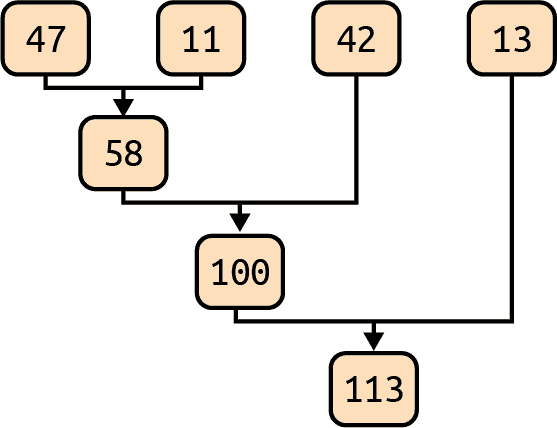
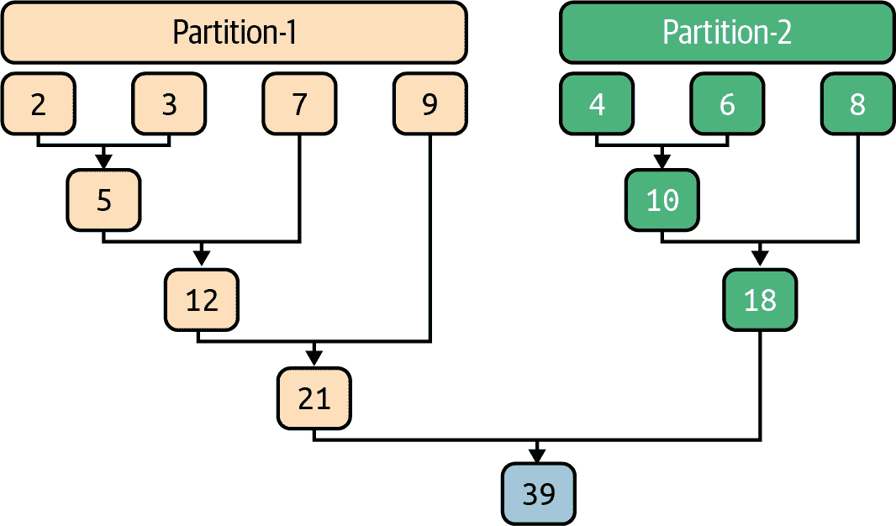
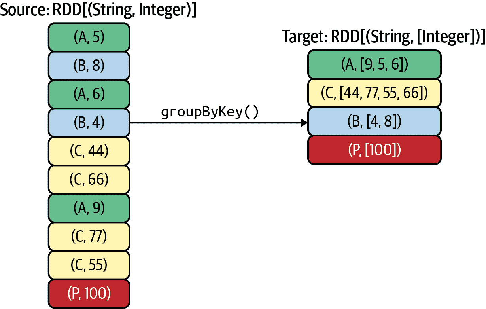
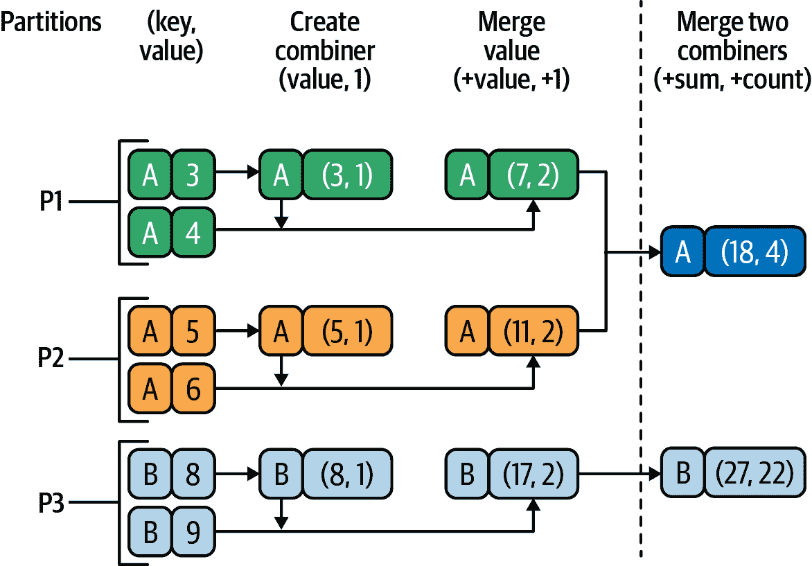
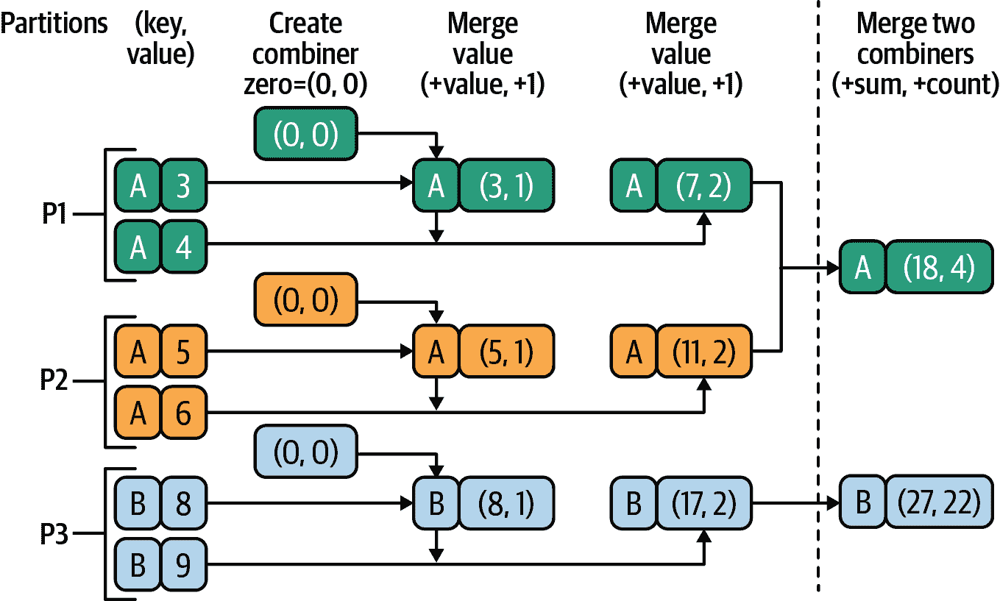
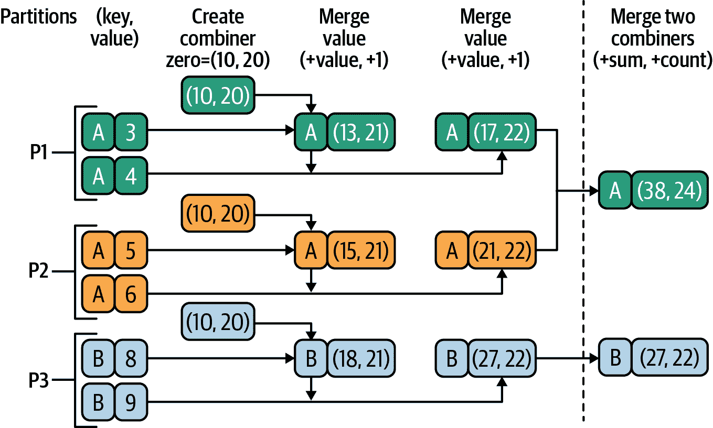
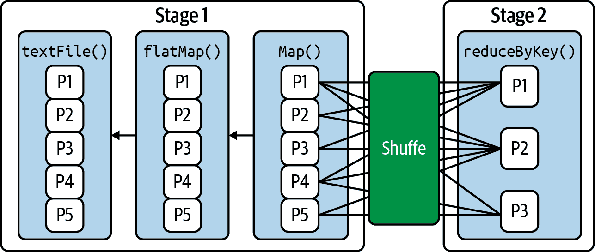
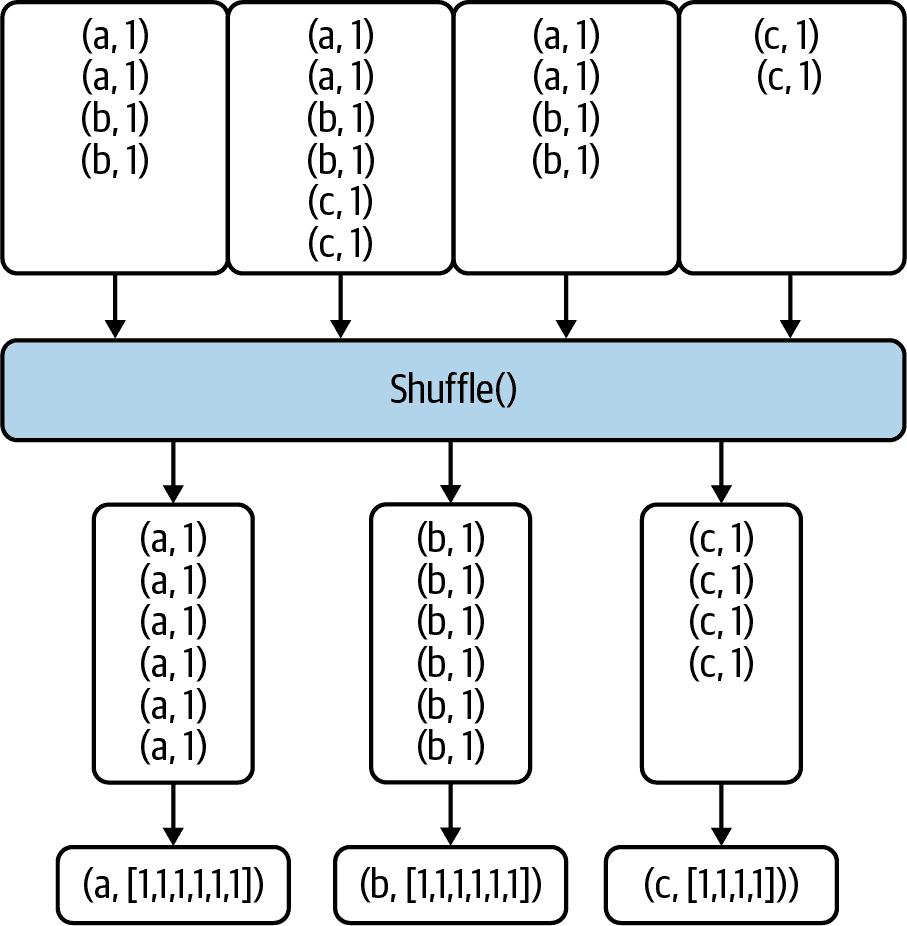
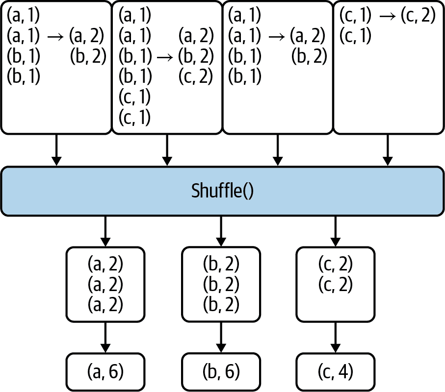

# 第四章：Spark 中的 Reductions

本章重点介绍了 Spark 中 RDD 的 Reduction 转换。特别是，我们将使用（键，值）对的 RDD，这是 Spark 中许多操作所需的常见数据抽象。可能需要进行一些初始的 ETL 操作来将数据转换为（键，值）形式，但是使用 Pair RDDs，你可以对一组值执行任何所需的聚合。

Spark 支持几种强大的 Reduction 转换和操作。最重要的 Reduction 转换包括：

+   `reduceByKey()`

+   `combineByKey()`

+   `groupByKey()`

+   `aggregateByKey()`

所有的 `*ByKey()` 转换接受一个源 `RDD[(K, V)]` 并创建一个目标 `RDD[(K, C)]`（对于某些转换，如 `reduceByKey()`，`V` 和 `C` 是相同的）。这些转换的功能是通过查找给定键的所有值（所有唯一键）来减少所有值，例如：

+   所有值的平均数

+   所有值的总和和计数

+   所有值的模式和中位数

+   所有值的标准偏差

# 选择 Reduction 转换

与 Mapper 转换类似，选择适合任务的正确工具非常重要。对于某些减少操作（如找到中位数），减少器需要同时访问所有值。对于其他操作，如找到所有值的总和或计数，这并不需要。如果你想要找到每个键的值的中位数，那么 `groupByKey()` 将是一个不错的选择，但是如果一个键有大量的值（可能会导致内存溢出问题），这种转换就不太适合。另一方面，如果你想要找到所有值的总和或计数，那么 `reduceByKey()` 可能是一个不错的选择：它使用可结合和交换的减少函数合并每个键的值。

本章将通过简单的 PySpark 示例向你展示如何使用最重要的 Spark Reduction 转换。我们将重点讨论在 Spark 应用中最常用的转换。我还将讨论减少的一般概念，以及作为高效减少算法设计原则的幺半群。我们将从学习如何创建 Pair RDDs 开始，这是 Spark Reduction 转换所必需的。

# 创建 Pair RDDs

给定一组键及其关联的值，减少转换使用算法（值的总和、值的中位数等）减少每个键的值。因此，本章介绍的减少转换适用于（键，值）对，这意味着 RDD 元素必须符合此格式。在 Spark 中有几种创建 Pair RDDs 的方法。例如，你还可以在集合（如元组列表和字典）上使用 `parallelize()`，如下所示：

```
>>> key_value = [('A', 2), ('A', 4), ('B', 5), ('B', 7)]
>>> pair_rdd = spark.sparkContext.parallelize(key_value)
>>> pair_rdd.collect() 
[('A', 2), ('A', 4), ('B', 5), ('B', 7)]
>>> pair_rdd.count()
4
>>> hashmap = pair_rdd.collectAsMap()
>>> hashmap
{'A': 4, 'B': 7}
```


`pair_rdd` 有两个键，`{'A', 'B'}`。

接下来，假设你有与天气相关的数据，你想要创建 `(city_id, temperature)` 的对。你可以使用 `map()` 转换来完成这个任务。假设你的输入具有以下格式：

```
<city_id><,><latitude><,><longitude><,><temperature>
```

首先，定义一个函数来创建所需的（键，值）对：

```
def create_key_value(rec):
  tokens = rec.split(",")
  city_id = tokens[0]
  temperature = tokens[3]
  return (city_id, temperature) 
```


键是 `city_id`，值是 `temperature`。

然后使用 `map()` 创建你的键值对 RDD：

```
input_path = *`<``your``-``temperature``-``data``-``path``>`*
rdd = spark.sparkContext.textFile(input_path)
pair_rdd = rdd.map(create_key_value)
# or you can write this using a lambda expression as:
# pair_rdd = rdd.map(lambda rec: create_key_value(rec))
```

有许多其他创建（键，值）对 RDD 的方法：`reduceByKey()` 例如，接受一个源 `RDD[(K, V)]` 并生成一个目标 `RDD[(K, V)]`，`combineByKey()` 则接受一个源 `RDD[(K, V)]` 并生成一个目标 `RDD[(K, C)]`。

# 缩减转换

通常，缩减转换会将数据大小从大批量值（如数字列表）减小到较小值。缩减的示例包括：

+   找到所有值的和与平均值

+   找到所有值的平均值、众数和中位数

+   计算所有值的平均值和标准差

+   找到所有值的 `(最小值、最大值、计数)`

+   找到所有值的前 10 个

简而言之，缩减转换大致对应于函数式编程中的 fold 操作（也称为 reduce、accumulate 或 aggregate）。该转换可以应用于所有数据元素（例如找到所有元素的总和）或每个键的所有元素（例如找到每个键的所有元素的总和）。

对于单个分区的一组数字 `{47, 11, 42, 13}` 进行的简单加法缩减在 图 4-1 中有所说明。



###### 图 4-1\. 单个分区中的加法缩减

图 4-2 展示了对两个分区元素求和的缩减操作。Partition-1 和 Partition-2 的最终缩减值分别为 `21` 和 `18`。每个分区执行本地缩减，最终来自两个分区的结果被缩减。



###### 图 4-2\. 两个分区上的加法缩减

Reducer 是函数式编程中的核心概念，用于将一组对象（如数字、字符串或列表）转换为单个值（如数字的总和或字符串对象的连接）。Spark 和 MapReduce 范式使用该概念将一组值聚合为每个键的单个值。考虑以下（键，值）对，其中键是一个 `String`，值是一个 `Integer` 列表：

```
(key1, [1, 2, 3])
(key2, [40, 50, 60, 70, 80])
(key3, [8])
```

最简单的 reducer 将是一个针对每个键的数值集合的加法函数。应用该函数后，结果将是：

```
(key1, 6)
(key2, 300)
(key3, 8)
```

或者你可以将每个（键，值）缩减为（键，对），其中对是 `(值的总和，值的数量)`：

```
(key1, (6, 3))
(key2, (300, 5))
(key3, (8, 1))
```

Reducer 被设计为并行和独立操作，这意味着没有 reducer 之间的同步。Spark 集群的资源越多，缩减操作就可以越快。在最坏的情况下，如果只有一个 reducer，那么缩减将作为队列操作进行。一般来说，集群将提供许多 reducer（取决于资源可用性）用于缩减转换。

在 MapReduce 和分布式算法中，减少是解决问题所需的操作。在 MapReduce 编程范式中，程序员定义了一个 mapper 和一个 reducer，具有以下`map()`和`reduce()`签名（注意[]表示可迭代）：

`map()`

`(K[1], V[1]) → [(K[2], V[2])]`

`reduce()`

`(K[2], [V[2]]) → [(K[3], V[3])]`

`map()`函数将一个（键[1]，值[1]）对映射到一组（键[2]，值[2]）对。完成所有映射操作后，自动执行排序和洗牌（此功能由 MapReduce 范式提供，不由程序员实现）。MapReduce 的排序和洗牌阶段与 Spark 的`groupByKey()`转换非常相似。

`reduce()`函数将一个（键[2]，[值[2]]）对减少为一组（键[3]，值[3]）对。约定用于表示对象的列表（或可迭代对象的列表）。因此，我们可以说，减少转换将值列表减少为具体结果（例如值的总和、值的平均值或所需的数据结构）。

# Spark 的减少操作

Spark 提供了一组丰富且易于使用的减少转换。正如本章开头所述，我们的重点将放在对成对 RDD 的减少上。因此，我们将假设每个 RDD 都有一组键，并且对于每个键（如 `K`），我们有一组值：

```
{ (K, V1), (K, V2), ..., (K, Vn) }
```

表格 4-1 列出了 Spark 中可用的减少转换。

表格 4-1\. Spark 的减少转换

| 变换 | 描述 |
| --- | --- |
| `aggregateByKey()` | 使用给定的组合函数和中性“零值”聚合每个键的值 |
| `combineByKey()` | 使用自定义的聚合函数集合组合每个键的元素的通用函数 |
| `countByKey()` | 计算每个键的元素数量，并将结果作为字典返回给主节点 |
| `foldByKey()` | 使用关联函数和中性“零值”合并每个键的值 |
| `groupByKey()` | 将 RDD 中每个键的值分组为单个序列 |
| `reduceByKey()` | 使用关联和交换的减少函数合并每个键的值 |
| `sampleByKey()` | 返回通过键变量采样率指定的不同键的 RDD 子集 |
| `sortByKey()` | 按键对 RDD 进行排序，使得每个分区包含按升序排列的元素范围 |

这些转换函数都作用于由 RDD 表示的（键，值）对。在本章中，我们将仅关注在给定的唯一键集上的数据减少。例如，给定键 `K` 的以下（键，值）对：

```
{ (K, V1), (K, V2), ..., (K, Vn) }
```

我们假设 `K` 有一个长度为 `n (> 0)` 的值列表：

```
[ V1, V2, ..., Vn ]
```

为了简化问题，减少的目标是生成以下的配对（或一组配对）：

```
(K, R)
```

其中：

```
f(V1, V2, ..., Vn) -> R
```

函数`f()`被称为*减少器*或*减少*函数。Spark 的减少转换将此函数应用于值列表以找到减少的值`R`。请注意，Spark 不对要减少的值（`[V[1], V[2], ..., V[n]]`）施加任何排序。

本章将包括解决方案的实际示例，演示了 Spark 最常见的减少转换的使用：`reduceByKey()`、`groupByKey()`、`aggregateByKey()`和`combineByKey()`。为了帮助你入门，让我们看一个非常简单的`groupByKey()`转换的例子。如图 4-3 中的例子所示，它的工作方式类似于 SQL 的`GROUP BY`语句。在这个例子中，我们有四个键， `{A, B, C, P}`，它们的相关值被分组为整数列表。源 RDD 是一个`RDD[(String, Integer)]`，其中每个元素是一个`(String, Integer)`对。目标 RDD 是一个`RDD[(String, [Integer])]`，其中每个元素是一个`(String, [Integer])`对；值是一个整数可迭代列表。



###### 图 4-3\. `groupByKey()`转换

###### 注意

默认情况下，Spark 的减少操作不会对减少的值进行排序。例如，在图 4-3 中，键`B`的减少值可以是`[4, 8]`或`[8, 4]`。如果需要，可以在最终减少之前对值进行排序。如果您的减少算法需要排序，必须显式排序值。

现在你已经对减少器的工作原理有了一般的了解，让我们继续看一个实际的例子，展示如何使用不同的 Spark 减少转换来解决一个数据问题。

# 简单的热身示例

假设我们有一对列表`(K, V)`，其中`K`（键）是一个`String`，`V`（值）是一个`Integer`：

```
[
 ('alex', 2), ('alex', 4), ('alex', 8),
 ('jane', 3), ('jane', 7),
 ('rafa', 1), ('rafa', 3), ('rafa', 5), ('rafa', 6),
 ('clint', 9)
]
```

在这个例子中，我们有四个唯一的键：

```
{ 'alex', 'jane', 'rafa', 'clint' }
```

假设我们想要按键（sum）合并值。这种减少的结果将是：

```
[
 ('alex', 14),
 ('jane', 10),
 ('rafa', 15),
 ('clint', 9)
]
```

其中：

```
key: alex =>    14 = 2+4+8
key: jane =>    10 = 3+7
key: rafa =>    15 = 1+3+5+6
key: clint =>    9 (single value, no operation is done)
```

有许多方法可以添加这些数字以获得所需的结果。我们如何得到这些减少的（键，值）对？在这个例子中，我们可以使用任何常见的 Spark 转换。按键聚合或组合值是减少的一种类型——在经典的 MapReduce 范式中，这被称为*按键减少*（或简称为*减少*）函数。MapReduce 框架对每个唯一键调用应用程序（用户定义的）减少函数一次。该函数迭代与该键关联的值，并产生零个或多个输出作为（键，值）对，解决了将每个唯一键的元素组合为单个值的问题。（请注意，在某些应用程序中，结果可能不止一个值。）

这里我介绍了使用 Spark 转换的四种不同解决方案。对于所有解决方案，我们将使用以下 Python `data`和`key_value_pairs` RDD：

```
>>> data = 
[
 ('alex', 2), ('alex', 4), ('alex', 8),
 ('jane', 3), ('jane', 7),
 ('rafa', 1), ('rafa', 3), ('rafa', 5), ('rafa', 6),
 ('clint', 9)
]
>>> key_value_pairs = spark.SparkContext.parallelize(data) 
>>> key_value_pairs.collect()
[
 ('alex', 2), ('alex', 4), ('alex', 8),
 ('jane', 3), ('jane', 7),
 ('rafa', 1), ('rafa', 3), ('rafa', 5), ('rafa', 6),
 ('clint', 9)
]
```


`data` 是一个 Python 集合 —— 一个 (key, value) 对的列表。


`key_value_pairs` 是一个 `RDD[(String, Integer)]`。

## 使用 `reduceByKey()` 解决问题

对于给定键的值求和非常直接：添加前两个值，然后添加下一个，依此类推。Spark 的 `reduceByKey()` 转换使用可结合且可交换的 reduce 函数合并每个键的值。在所有集群节点上在合并每个分区的值之前使用组合器（优化的小型 reducer）。

对于 `reduceByKey()` 转换，源 RDD 是一个 `RDD[(K, V)]`，目标 RDD 是一个 `RDD[(K, V)]`。请注意，RDD 值 (`V`) 的源和目标数据类型相同。这是 `reduceByKey()` 的一个限制，可以通过使用 `combineByKey()` 或 `aggregateByKey()` 避免。

我们可以使用 lambda 表达式（匿名函数）应用 `reduceByKey()` 转换：

```
# a is (an accumulated) value for key=K
# b is a value for key=K
sum_per_key = key_value_pairs.reduceByKey(lambda a, b: a+b)
sum_per_key.collect()
[('jane', 10), ('rafa', 15), ('alex', 14), ('clint', 9)]
```

或者，我们可以使用定义的函数，例如 `add`：

```
from operator import add
sum_per_key = key_value_pairs.reduceByKey(add)
sum_per_key.collect()
[('jane', 10), ('rafa', 15), ('alex', 14), ('clint', 9)]
```

通过 `reduceByKey()` 按键添加值是一种优化的解决方案，因为聚合发生在最终聚合所有分区之前的分区级别。

## 使用 `groupByKey()` 解决问题

我们也可以通过使用 `groupByKey()` 转换来解决这个问题，但这种解决方案性能不佳，因为涉及将大量数据移动到 reducer 节点（在本章后面讨论 shuffle 步骤时，您将了解更多原因）。

对于 `reduceByKey()` 转换，源 RDD 是一个 `RDD[(K, V)]`，目标 RDD 是一个 `RDD[(K, [V])]`。请注意，源和目标数据类型不同：源 RDD 的值数据类型是 `V`，而目标 RDD 的值数据类型是 `[V]`（一个 `V` 的可迭代列表）。

下面的例子演示了如何使用带有 lambda 表达式的 `groupByKey()` 来按键汇总值：

```
sum_per_key = key_value_pairs
                 .grouByKey() 
                 .mapValues(lambda values: sum(values)) 
sum_per_key.collect()
[('jane', 10), ('rafa', 15), ('alex', 14), ('clint', 9)]
```


按键分组值（类似于 SQL 的 `GROUP BY`）。现在每个键将有一组 `Integer` 值；例如，三对 `{('alex', 2), ('alex', 4), ('alex', 8)}` 将被减少为单个对 `('alex', [2, 4, 8])`。


使用 Python 的 `sum()` 函数添加每个键的值。

## 使用 `aggregateByKey()` 解决问题

在最简单的情况下，`aggregateByKey()` 转换被定义为：

```
aggregateByKey(zero_value, seq_func, comb_func)

source RDD: RDD[(K, V)]
target RDD: RDD(K, C))
```

它将源 RDD 中每个键的值聚合到目标 RDD 中，使用给定的合并函数和中立的“零值”（用于每个分区的初始值）。这个函数可以返回一个不同的结果类型 (`C`)，而不是源 RDD 中值的类型 (`V`)，尽管在此示例中两者都是 `Integer` 数据类型。因此，我们需要一个操作来在单个分区内合并值（将类型为 `V` 的值合并为类型为 `C` 的值），以及一个操作来在分区之间合并值（从多个分区中合并类型为 `C` 的值）。为了避免不必要的内存分配，这两个函数都允许修改并返回它们的第一个参数，而不是创建新的 `C`。

以下示例演示了 `aggregateByKey()` 转换的使用：

```
# zero_value -> C
# seq_func: (C, V) -> C
# comb_func: (C, C) -> C

>>> sum_per_key = key_value_pairs.aggregateByKey(
... 0, 
... (lambda C1, C2: C1+C2) 
... )
>>> sum_per_key.collect()
[('jane', 10), ('rafa', 15), ('alex', 14), ('clint', 9)]
```


应用于每个分区的 `zero_value` 是 `0`。


`seq_func` 在单个分区上使用。


`comb_func` 用于合并分区的值。

## 使用 `combineByKey()` 解决问题

`combineByKey()` 转换是 Spark 中最通用和强大的减少转换。在其最简单的形式下，它定义为：

```
combineByKey(create_combiner, merge_value, merge_combiners)

source RDD: RDD[(K, V)]
target RDD: RDD[(K, C))
```

类似于 `aggregateByKey()`，`combineByKey()` 转换将源 `RDD[(K, V)]` 转换为目标 `RDD[(K, C)]`。再次强调，`V` 和 `C` 可以是不同的数据类型（这是 `combineByKey()` 的强大之处之一——例如，`V` 可以是 `String` 或 `Integer`，而 `C` 可以是列表、元组或字典），但在此示例中，两者都是 `Integer` 数据类型。

`combineByKey()` 接口允许我们自定义减少和合并行为以及数据类型。因此，为了使用此转换，我们必须提供三个函数：

`create_combiner`

此函数将单个 `V` 转换为 `C`（例如，创建一个单元素列表）。它在单个分区内用于初始化 `C`。

`merge_value`

此函数将 `V` 合并到 `C` 中（例如，将其添加到列表的末尾）。这在单个分区内用于将值聚合到 `C` 中。

`merge_combiners`

此函数将两个 `C` 合并为一个 `C`（例如，合并列表）。这在合并来自两个分区的值时使用。

我们使用 `combineByKey()` 的解决方案如下：

```
>>> sum_per_key = key_value_pairs.combineByKey(
...           (lambda v: v), 
...           (lambda C,v: C+v), 
...           (lambda C1,C2: C1+C2) 
... )
>>> sum_per_key.collect()
[('jane', 10), ('rafa', 15), ('alex', 14), ('clint', 9)]
```


`create_combiner` 在每个分区中创建初始值。


`merge_value` 合并分区中的值。


`merge_combiners` 将来自不同分区的值合并到最终结果中。

为了更好地理解 `combineByKey()` 转换的功能，让我们看另一个例子。假设我们想找到每个键的值的平均值。为了解决这个问题，我们可以创建一个组合数据类型 (`C`)，如 `(sum, count)`，它将保存值的总和及其相关的计数：

```
# C = combined type as (sum, count)
>>> sum_count_per_key = key_value_pairs.combineByKey(
...           (lambda v: (v, 1)),
...           (lambda C,v: (C[0]+v, C[1]+1),
...           (lambda C1,C2: (C1[0]+C2[0], C1[1]+C2[1]))
... )
>>> mean_per_key = sum_count_per_key.mapValues(lambda C: C[0]/C[1])
```

给定名为 `{P1, P2, P3}` 的三个分区，图 4-4 显示如何创建一个组合器（数据类型 `C`），如何将一个值合并到组合器中，最后如何合并两个组合器。



###### 图 4-4\. `combineByKey()` 转换示例

接下来，我将讨论单子群的概念，这将帮助您理解在减少转换中组合器的功能。

# 什么是单子群？

单子群是编写高效的 MapReduce 算法的有用设计原则。¹ 如果您不理解单子群，您可能会编写不产生语义正确结果的减少器算法。如果您的减少器是单子群，那么您可以确信它在分布式环境中会产生正确的输出。

由于 Spark 的减少是基于分区的执行（即，您的减少函数是分布式的而不是顺序函数），为了获得正确的输出，您需要确保您的减少函数在语义上是正确的。我们稍后将看一些使用单子群的示例，但首先让我们检查底层的数学概念。

在代数中，单子群是一种具有单一关联二元操作和单位元素（也称为零元素）的代数结构。

对于我们的目的，我们可以非正式地定义单子群为 `M = (T, f, Zero)`，其中：

+   `T` 是一个数据类型。

+   `f()` 是一个二元操作：`f: (T, T) -> T`。

+   `Zero` 是 `T` 类型的一个实例。

###### 注意

`Zero` 是类型 `T` 的身份（中性）元素；这不一定是数字零。

如果 `a`、`b`、`c` 和 `Zero` 是类型 `T` 的，对于三元组 `(T, f, Zero)` 来说，必须满足以下属性：

+   二元操作

    ```
    f: (T, T) -> T
    ```

+   中性元素

    ```
    for all a in T:

    f(Zero, a) = a
    f(a, Zero) = a
    ```

+   结合性

    ```
    for all a, b, c in T:

    f(f(a, b), c) = f(a, f(b, c))
    ```

并非每个二元操作都是单子群。例如，整数集合上的 `mean()` 函数不是一个关联函数，因此不是一个单子群，如下面的证明所示：

```
mean(10, mean(30, 50)) != mean(mean(10, 30), 50)

where

   mean(10, mean(30, 50))
      = mean (10, 40)
      = 25

   mean(mean(10, 30), 50)
      = mean (20, 50)
      = 35

   25 != 35
```

这是什么意思？给定一个 `RDD[(String, Integer)]`，我们可能会试图编写以下转换以找到每个键的平均值：

```
# rdd: RDD[(String, Integer)]
# WRONG REDUCTION to find average by key
avg_by_key = rdd.reduceByKey(lambda x, y: (x+y)/2)
```

但这不会产生正确的结果，因为平均值的平均值不是平均值—换句话说，这里使用的平均/平均函数不是幺半群。假设这个`rdd`有三个元素：`{("A", 1), ("A", 2), ("A", 3)}`；`{("A", 1), ("A", 2)}`在分区 1 中，`{("A", 3)}`在分区 2 中。使用上述解决方案将导致分区 1 的聚合值为`("A", 1.5)`，分区 2 的聚合值为`("A", 3.0)`。然后，将这两个分区的结果结合起来，得到最终平均值为(1.5 + 3.0) / 2 = 2.25，这不是正确的结果（三个值的平均值为 2.0）。如果您的缩小器是幺半群，它保证能够正确运行并产生正确的结果。

## 幺半群和非幺半群示例

为了帮助您理解和识别幺半群，让我们看一些幺半群和非幺半群的例子。以下是幺半群的示例：

+   具有加法的整数：

    ```
    ((a + b ) + c) = (a + (b + c))
    0 + n = n
    n + 0 = n
    The zero element for addition is the number 0.
    ```

+   具有乘法的整数：

    ```
    ((a * b) * c) = (a * (b * c))
    1 * n = n
    n * 1 = n
    The zero element for multiplication is the number 1.
    ```

+   具有连接的字符串：

    ```
    (a + (b + c)) = ((a + b) + c)
    "" + s = s
    s + "" = s
    The zero element for concatenation is an empty string of size 0.
    ```

+   具有连接的列表：

    ```
    List(a, b) + List(c, d) = List(a,b,c,d)
    ```

+   具有它们的联合集：

    ```
    Set(1,2,3) + Set(2,4,5)
       = Set(1,2,3,2,4,5)
       = Set(1,2,3,4,5)

    S + {} = S
    {} + S = S
    The zero element is an empty set {}.
    ```

这里还有一些非幺半群示例：

+   具有均值函数的整数：

    ```
    mean(mean(a,b),c) != mean(a, mean(b,c))
    ```

+   具有减法的整数：

    ```
    ((a - b) -c) != (a - (b - c))
    ```

+   具有除法的整数：

    ```
    ((a / b) / c) != (a / (b / c))
    ```

+   具有模函数的整数：

    ```
    mode(mode(a, b), c) != mode(a, mode(b, c))
    ```

+   具有中位数函数的整数：

    ```
    median(median(a, b), c) != median(a, median(b, c))
    ```

在某些情况下，可以将非幺半群转换为幺半群。例如，通过对我们的数据结构进行简单更改，我们可以找到一组数字的正确平均值。但是，没有算法可以自动将非幺半群结构转换为幺半群。

在 Spark 中编写分布式算法与在单个服务器上编写顺序算法大不相同，因为算法在分区数据上并行运行。因此，在编写缩小器时，您需要确保您的缩小函数是一个幺半群。现在您理解了这个重要概念，让我们继续看一些实际的例子。

# 电影问题

第一个例子的目标是提出一个基本问题，然后通过 PySpark 的不同 Spark 减少转换提供解决方案。对于所有减少转换，我都精心选择了数据类型，使它们形成一个幺半群。

电影问题可以陈述如下：给定一组用户、电影和评分（在 1 到 5 的范围内），我们想找出用户对所有电影的平均评分。因此，如果用户`userID=100`评价了四部电影：

```
(100, "Lion King", 4.0)
(100, "Crash", 3.0)
(100, "Dead Man Walking", 3.5)
(100, "The Godfather", 4.5)
```

我们想生成以下输出：

```
(100, 3.75)
```

其中：

```
3.75 = mean(4.0, 3.0, 3.5, 4.5)
     = (4.0 + 3.0 + 3.5 + 4.5) / 4
     = 15.0 / 4
```

对于这个例子，请注意，对一组评分进行`reduceByKey()`转换不会总是产生正确的输出，因为平均（或均值）不是一组浮点数/整数的代数幺半群。换句话说，如前面的部分所讨论的，平均值的平均值不等于所有输入数字的平均值。这里有一个简单的证明。假设我们想找出六个值（数字 1-6）的平均值，存储在单个分区中。我们可以使用`mean()`函数来完成：

```
mean(1, 2, 3, 4, 5, 6)
   = (1 + 2 + 3 + 4 + 5 + 6) / 6
   = 21 / 6
   = 3.5 [correct result]
```

现在，让我们把`mean()`函数作为一个分布式函数。假设值存储在三个分区中：

```
Partition-1: (1, 2, 3)
Partition-2: (4, 5)
Partition-3: (6)
```

首先，我们计算每个分区的平均值：

```
mean(1, 2, 3, 4, 5, 6)
  =  mean (
           mean(Partition-1),
           mean(Partition-2),
           mean(Partition-3)
          )

mean(Partition-1)
  = mean(1, 2, 3)
  = mean( mean(1,2), 3)
  = mean( (1+2)/2, 3)
  = mean(1.5, 3)
  = (1.5+3)/2
  = 2.25

mean(Partition-2)
  = mean(4,5)
  = (4+5)/2
  = 4.5

mean(Partition-3)
  = mean(6)
  = 6
```

然后我们找到这些值的平均值。一旦所有分区都被处理，因此，我们得到：

```
mean(1, 2, 3, 4, 5, 6)
  =  mean (
           mean(Partition-1),
           mean(Partition-2),
           mean(Partition-3)
          )
  = mean(2.25, 4.5, 6)
  = mean(mean(2.25, 4.5), 6)
  = mean((2.25 + 4.5)/2, 6)
  = mean(3.375, 6)
  = (3.375 + 6)/2
  = 9.375 / 2
  = 4.6875  [incorrect result]
```

为了避免这个问题，我们可以使用一个支持结合性和交换性的幺半群数据结构，例如一对`(sum, count)`，其中`sum`是到目前为止（每个分区）所有数字的总和，`count`是到目前为止我们看到的评分数量。如果我们定义我们的`mean()`函数如下：

```
mean(pair(sum, count)) = sum / count
```

我们得到：

```
mean(1,2,3,4,5,6)
  = mean(mean(1,2,3), mean(4,5), mean(6))
  = mean(pair(1+2+3, 1+1+1), pair(4+5, 1+1), pair(6,1))
  = mean(pair(6, 3), pair(9, 2), pair(6,1))
  = mean(mean(pair(6, 3), pair(9, 2)), pair(6,1))
  = mean(pair(6+9, 3+2), pair(6,1))
  = mean(pair(15, 5), pair(6,1))
  = mean(pair(15+6, 5+1))
  = mean(pair(21, 6))
  = 21 / 6 = 3.5 [correct result]
```

正如这个例子所显示的，通过使用幺半群，我们可以实现结合性。因此，当您的函数`f()`是可交换和可结合的时候，您可以应用`reduceByKey()`转换：

```
# a = (sum1, count1)
# b = (sum2, count2)
# f(a, b) = a + b
#         = (sum1+sum2, count1+count2)
#
reduceByKey(lambda a, b: f(a, b))
```

例如，加法（`+`）操作是可交换和可结合的，但均值/平均函数不满足这些属性。

###### 注意

正如我们在第一章中看到的，一个可交换的函数确保聚合的 RDD 元素顺序无关紧要：

```
f(A, B) = f(B, A)
```

一个结合函数确保在聚合过程中分组元素的顺序不影响最终结果：

```
f(f(A, B), C) = f(A, f(B, C))
```

## 输入要分析的数据集

我们将为这个问题使用的样本数据集是来自[MovieLens](https://oreil.ly/KOyq4)的数据集。为简单起见，我假设您已经下载并解压缩了文件到*/tmp/movielens/*目录中。请注意，不需要将文件放置在建议的位置；您可以将文件放置在您喜欢的目录中，并相应地更新输入路径。

###### 提示

完整的 MovieLens 数据集（*ml-latest.zip*）为 265 MB。如果您想要使用一个更小的数据集来运行、测试和调试这里列出的程序，您可以下载[小型 MovieLens 数据集](https://oreil.ly/hAfIQ)，这是一个 1 MB 的文件，包含了由 600 名用户对 9,000 部电影进行的 100,000 次评分和 3,600 次标签应用。

所有的评分都包含在文件*ratings.csv*中。该文件中的每一行在标题行之后表示一个用户对一部电影的一次评分，格式如下：

```
<userId><,><movieId><,><rating><,><timestamp>
```

在这个文件中：

+   这些行首先按`userId`排序，然后对于每个用户，按`movieId`排序。

+   评分是在 5 星级的基础上进行的，增量为半星（从 0.5 星到 5.0 星）。

+   时间戳表示自 1970 年 1 月 1 日协调世界时（UTC）午夜以来的秒数（此字段在我们的分析中被忽略）。

解压下载的文件后，您应该有以下文件：

```
$ ls -l /tmp/movielens/
       8,305  README.txt
     725,770  links.csv
   1,729,811  movies.csv
 620,204,630  ratings.csv
  21,094,823  tags.csv
```

首先，检查记录数（根据您下载文件的时间，您看到的记录数可能会有所不同）：

```
$ wc -l /tmp/movielens/ratings.csv
22,884,378 /tmp/movielens/ratings.csv
```

接下来，看一下前几条记录：

```
$ head -6 /tmp/movielens/ratings.csv
userId,movieId,rating,timestamp
1,169,2.5,1204927694
1,2471,3.0,1204927438
1,48516,5.0,1204927435
2,2571,3.5,1436165433
2,109487,4.0,1436165496
```

由于我们使用 RDDs，我们不需要与数据相关联的元数据。因此，我们可以从*ratings.csv*文件中删除第一行（标题行）：

```
$ tail -n +2 ratings.csv > ratings.csv.no.header
$ wc -l ratings.csv ratings.csv.no.header
22,884,378 ratings.csv
22,884,377 ratings.csv.no.header
```

现在我们已经获取了样本数据，我们可以解决这个问题的几个方案。第一个解决方案将使用`aggregateByKey()`，但在此之前，我将介绍此转换背后的逻辑。

## `aggregateByKey()`转换

Spark 的`aggregateByKey()`转换会初始化每个键在每个分区上的零值，这是一个初始组合数据类型（`C`）；这是一个中性值，通常为`(0, 0)`，如果组合数据类型是`(sum, count)`。这个零值与分区中的第一个值合并以创建一个新的`C`，然后与第二个值合并。这个过程继续，直到我们合并了该键的所有值。最后，如果同一个键存在于多个分区中，则这些值将组合在一起以生成最终的`C`。

图 4-5 和 4-6 展示了`aggregateByKey()`如何使用不同的零值工作。零值是按键、每个分区应用的。这意味着如果一个键 *`X`* 在 *`N`* 个分区中，零值将应用 *`N`* 次（这 *`N`* 个分区的每个都将为键 *`X`* 初始化为零值）。因此，选择此值非常重要。

图 4-5 演示了`aggregateByKey()`如何与`zero-value=(0, 0)`一起工作。



###### 图 4-5\. `aggregateByKey()`与`zero-value=(0, 0)`

通常，您会使用`(0, 0)`，但图 4-6 展示了如何使用零值为`(10, 20)`的相同转换工作。



###### 图 4-6\. `aggregateByKey()`与`zero-value=(10, 20)`

## 第一个解决方案使用`aggregateByKey()`：

要找到每个用户的平均评分，第一步是将每条记录映射为形式为（键，值）对：

```
(userID-as-key, rating-as-value)
```

使用`reduceByKey()`转换来按键累加值的最简单方法，但是我们不能用`reduceByKey()`来计算每个用户的平均评分，因为如我们所见，平均函数对评分集（作为浮点数）不是一个幺半群。为了使其成为幺半群操作，我们使用一对数据结构（一个包含两个元素的元组），来保存一对值，`(sum, count)`，其中`sum`是评分的累计总和，`count`是我们迄今已添加（累加）的评分数，我们使用`aggregateByKey()`转换。

让我们证明，对一组数字使用加法运算符的配对结构`(sum, count)`是一个幺半群。

如果我们使用`(0.0, 0)`作为我们的零元素，它是中性的：

```
f(A, Zero) = A
f(Zero, A) = A

A = (sum, count)

f(A, Zero)
  = (sum+0.0, count+0)
  = (sum, count)
  = A

f(Zero, A)
  = (0.0+sum, 0+count)
  = (sum, count)
  = A
```

此操作是可交换的（即，聚合的 RDD 元素顺序不影响结果）：

```
f(A, B) = f(B, A)

A = (sum1, count1)
B = (sum2, count2)

f(A, B)
  = (sum1+sum2, count1+count2)
  = (sum2+sum1, count2+count1)
  = f(B, A)
```

它还是可结合的（聚合元素的顺序不影响最终结果）。

```
f(f(A, B), C) = f(A, f(B, C))

A = (sum1, count1)
B = (sum2, count2)
C = (sum3, count3)

f(f(A, B), C)
  = f((sum1+sum2, count1+count2), (sum3, count3))
  = (sum1+sum2+sum3, count1+count2+count3)
  = (sum1+(sum2+sum3), count1+(count2+count3))
  = f(A, f(B, C))
```

为了简化事务，我们将定义一个非常基本的 Python 函数，`create_pair()`，它接受电影评分数据的记录并返回`(userID, rating)`对：

```
# Define a function that accepts a CSV record
# and returns a pair of (userID, rating)
# Parameters: rating_record (as CSV String)
# rating_record = "userID,movieID,rating,timestamp"
def create_pair(rating_record):
	tokens = rating_record.split(",")
	userID = tokens[0]
	rating = float(tokens[2])
	return (userID, rating)
#end-def
```

接下来，我们测试该函数：

```
key_value_1 = create_pair("3,2394,4.0,920586920")
print key_value_1
('3', 4.0)

key_value_2 = create_pair("1,169,2.5,1204927694")
print key_value_2
('1', 2.5)
```

这是一个使用`aggregateByKey()`和我们的`create_pair()`函数的 PySpark 解决方案。组合类型(`C`)用于表示`aggregateByKey()`操作的值是一对`(sum-of-ratings, count-of-ratings)`。

```
# spark: an instance of SparkSession
ratings_path = "/tmp/movielens/ratings.csv.no.header"
rdd = spark.sparkContext.textFile(ratings_path)
# load user-defined Python function
ratings = rdd.map(lambda rec : create_pair(rec)) 
ratings.count()
#
# C = (C[0], C[1]) = (sum-of-ratings, count-of-ratings)
# zero_value -> C = (0.0, 0)
# seq_func: (C, V) -> C
# comb_func: (C, C) -> C
sum_count = ratings.aggregateByKey( 
    (0.0, 0), 
    (lambda C, V: (C[0]+V, C[1]+1)), 
    (lambda C1, C2: (C1[0]+C2[0], C1[1]+C2[1])) 
)
```


源 RDD `ratings`是一个`RDD[(String, Float)]`，其中键是`userID`，值是`rating`。


目标 RDD `sum_count` 是一个`RDD[(String, (Float, Integer))]`，其中键是`userID`，值是一对`(sum-of-ratings, count-of-ratings)`。


`C`在每个分区中被初始化为此值。


这用于在单个分区内合并值。


这用于合并来自不同分区的结果。

让我们分解一下这里发生了什么。首先，我们使用`aggregateByKey()`函数并创建一个结果集“模板”，其中包含初始值。我们将数据起始为`(0.0, 0)`，因此评分总和初始值为`0.0`，记录计数初始值为`0`。对于每一行数据，我们将执行一些加法操作。`C`是新的模板，因此`C[0]`是指我们的“总和”元素（`sum-of-ratings`），而`C[1]`是“计数”元素（`count-of-ratings`）。最后，我们根据我们制作的模板，将不同分区的`C1`值添加到`C2`值中。

`sum_count` RDD 中的数据将看起来像下面这样：

```
sum_count
  = [(userID, (sum-of-ratings, count-of-ratings)), ...]
  = RDD[(String, (Float, Integer))]

[
  (100, (40.0, 10)),
  (200, (51.0, 13)),
  (300, (340.0, 90)),
  ...
]
```

这告诉我们用户`100`评价了 10 部电影，他们所有评分的总和为 40.0；用户`200`评价了 13 部电影，他们所有评分的总和为 51.0。

现在，为了获得每个用户的实际平均评分，我们需要使用`mapValues()`转换，并将第一个条目（`sum-of-ratings`）除以第二个条目（`count-of-ratings`）：

```
# x =  (sum-of-ratings, count-of-ratings)
# x[0] = sum-of-ratings
# x[1] = count-of-ratings
# avg = sum-of-ratings / count-of-ratings
average_rating = sum_count.mapValues(lambda x: (x[0]/x[1])) 
```


`average_rating`是一个`RDD[(String, Float)]`，其中键是`userID`，值是`average-rating`。

此 RDD 的内容如下，给出了我们正在寻找的结果：

```
average_rating
[
  (100, 4.00),
  (200, 3.92),
  (300, 3.77),
  ...
]
```

## 第二种使用`aggregateByKey()`解决方案

这里，我将展示另一种使用`aggregateByKey()`转换的解决方案。请注意，为了节省空间，我已经修剪了 PySpark shell 生成的输出。

第一步是读取数据并创建（键，值）对，其中键是`userID`，值是`rating`：

```
# ./bin/pyspark
SparkSession available as 'spark'.
>>># create_pair() returns a pair (userID, rating)
>>># rating_record = "userID,movieID,rating,timestamp"
>>> def create_pair(rating_record):
...     tokens = rating_record.split(",")
...     return (tokens[0], float(tokens[2]))
...
>>> key_value_test = create_pair("3,2394,4.0,920586920")
>>> print key_value_test
('3', 4.0)
>>> ratings_path = "/tmp/movielens/ratings.csv.no.header"
>>> rdd = spark.sparkContext.textFile(ratings_path)
>>> rdd.count()
22884377
>>> ratings = rdd.map(lambda rec : create_pair(rec))
>>> ratings.count()
22884377
>>> ratings.take(3)
[(u'1', 2.5), (u'1', 3.0), (u'1', 5.0)]
```

一旦我们创建了（键，值）对，我们可以对评分进行汇总应用`aggregateByKey()`转换。每个分区的初始值`(0.0, 0)`用于此操作，其中`0.0`是评分的总和，`0`是评分的数量：

```
>>># C is a combined data structure, (sum, count)
>>> sum_count = ratings.aggregateByKey( 
...     (0.0, 0), 
...     (lambda C, V: (C[0]+V, C[1]+1)), 
...     (lambda C1, C2: (C1[0]+C2[0], C1[1]+C2[1]))) 

>>> sum_count.count()
247753

>>> sum_count.take(3)
[
 (u'145757', (148.0, 50)),
 (u'244330', (36.0, 17)),
 (u'180162', (1882.0, 489))
]
```


目标 RDD 是一个 `RDD[(String, (Float, Integer))]`。


`C` 在每个分区中初始化为 `(0.0, 0)`。


此 Lambda 表达式将单个 `V` 的值添加到 `C` 中（在单个分区中使用）。


此 Lambda 表达式将跨分区的值组合起来（将两个 `C` 相加以创建一个单独的 `C`）。

我们可以使用 Python 函数替代 Lambda 表达式。为此，我们需要编写以下函数：

```
# C = (sum, count)
# V is a single value of type Float
def seq_func(C, V):
    return (C[0]+V, C[1]+1)
#end-def

# C1 = (sum1, count1)
# C2 = (sum2, count2)
def comb_func(C1, C2):
    return (C1[0]+C2[0], C1[1]+C2[1])
#end-def
```

现在，我们可以使用定义的函数计算 `sum_count`：

```
sum_count = ratings.aggregateByKey(
    (0.0, 0),
    seq_func,
    comb_func
)
```

前一步创建了以下类型的 RDD 元素：

```
(userID, (sum-of-ratings, number-of-ratings))
```

接下来，我们进行最终计算，找到每个用户的平均评分：

```
>>># x refers to a pair of (sum-of-ratings, number-of-ratings)
>>># where
>>>#      x[0] denotes sum-of-ratings
>>>#      x[1] denotes number-of-ratings
>>>
>>> average_rating = sum_count.mapValues(lambda x:(x[0]/x[1]))
>>> average_rating.count()
247753

>>> average_rating.take(3)
[
 (u'145757', 2.96),
 (u'244330', 2.1176470588235294),
 (u'180162', 3.8486707566462166)
]
```

接下来，我将使用 `groupByKey()` 解决电影问题。

## 使用 `groupByKey()` 的完整 PySpark 解决方案

对于给定的 `(K, V)` 对集合，`groupByKey()` 具有以下签名：

```
groupByKey(numPartitions=None, partitionFunc=<function portable_hash>)
groupByKey : RDD[(K, V)] --> RDD[(K, [V])]
```

如果源 RDD 是 `RDD[(K, V)]`，`groupByKey()` 转换会将 RDD 中每个键（`K`）的值分组为一个 `V` 的列表/可迭代对象。然后，它会使用现有的分区器/并行级别对生成的 RDD 进行哈希分区。每个组内元素的顺序不保证，甚至每次评估结果的 RDD 时顺序可能都不同。

###### 提示

您可以自定义分区数 (`numPartitions`) 和分区函数 (`partitionFunc`)。

在这里，我使用 `groupByKey()` 转换提供了一个完整的解决方案。

第一步是读取数据并创建 `(key, value)` 对，其中键是 `userID`，值是 `rating`：

```
>>># spark: SparkSession
>>> def create_pair(rating_record):
...     tokens = rating_record.split(",")
...     return (tokens[0], float(tokens[2]))
...
>>> key_value_test = create_pair("3,2394,4.0,920586920")
>>> print key_value_test
('3', 4.0)

>>> ratings_path = "/tmp/movielens/ratings.csv.no.header"
>>> rdd = spark.sparkContext.textFile(ratings_path)
>>> rdd.count()
22884377
>>> ratings = rdd.map(lambda rec : create_pair(rec)) 
>>> ratings.count()
22884377
>>> ratings.take(3)
[
 (u'1', 2.5),
 (u'1', 3.0),
 (u'1', 5.0)
]
```


`ratings` 是一个 `RDD[(String, Float)]`

一旦我们创建了 `(key, value)` 对，我们就可以应用 `groupByKey()` 转换来将所有用户的评分分组起来。此步骤创建了 `(userID, [R[1], ..., R[n]])` 对，其中 `R[1]`，…，`R[n]` 是唯一 `userID` 的所有评分。

正如您所注意到的，`groupByKey()` 转换的工作方式与 SQL 的 `GROUP BY` 完全相同。它将相同键的值分组为一个值的可迭代对象：

```
>>> ratings_grouped = ratings.groupByKey() 
>>> ratings_grouped.count()
247753
>>> ratings_grouped.take(3)

 (u'145757', <ResultIterable object at 0x111e42e50>), ![2
 (u'244330', <ResultIterable object at 0x111e42dd0>),
 (u'180162', <ResultIterable object at 0x111e42e10>)
]
>>> ratings_grouped.mapValues(lambda x: list(x)).take(3) 
[
 (u'145757', [2.0, 3.5, ..., 3.5, 1.0]),
 (u'244330', [3.5, 1.5, ..., 4.0, 2.0]),
 (u'180162', [5.0, 4.0, ..., 4.0, 5.0])
]
```


`ratings_grouped` 是一个 `RDD[(String, [Float])]`，其中键是 `userID`，值是一个 `rating` 列表。


`ResultIterable` 的完整名称是 `pyspark.resultiterable.ResultIterable`。


为了调试，将 `ResultIterable` 对象转换为 `Integer` 列表。

要找到每个用户的平均评分，我们需要将每个 `userID` 的所有评分求和，然后计算平均值：

```
>>># x refers to all ratings for a user as [R1, ..., Rn]
>>># x: ResultIterable object
>>> average_rating = ratings_grouped.mapValues(lambda x: sum(x)/len(x)) 
>>> average_rating.count()
247753
>>> average_rating.take(3)
[
 (u'145757', 2.96),
 (u'244330', 2.12),
 (u'180162', 3.85)
]
```


`average_rating` 是一个 `RDD[(String, Float)]`，其中键是 `userID`，值是 `average-rating`。

## 使用 `reduceByKey()` 的完整 PySpark 解决方案

在其最简单的形式中，`reduceByKey()`具有以下签名（源和目标数据类型`V`必须相同）：

```
reduceByKey(func, numPartitions=None, partitionFunc)
reduceByKey: RDD[(K, V)] --> RDD[(K, V)]
```

`reduceByKey()`转换使用关联和交换的减少函数合并每个键的值。这也会在每个 mapper 上本地执行合并，然后将结果发送给 reducer，类似于 MapReduce 中的 combiner。输出将使用`numPartitions`分区进行分区，或者如果未指定`numPartitions`，则使用默认的并行级别。默认的分区器是`HashPartitioner`。

由于我们想要找到每个用户评分的平均值，并且我们知道均值不是均值（均值函数不是幺半群），我们需要添加每个用户的所有评分并跟踪他们评分的电影数量。然后，`(总评分, 评分数量)`是加法函数上的幺半群，但最后我们需要执行一次`mapValues()`转换来通过`评分数量`除以`总评分`找到实际的平均评分。这里给出使用`reduceByKey()`的完整解决方案。请注意，`reduceByKey()`比`groupByKey()`转换更高效和可扩展，因为合并和组合在发送数据进行最终缩减之前在本地完成。

### 第一步：读取数据并创建对

第一步是读取数据并创建(key, value)对，其中 key 是`userID`，value 是`(rating, 1)`对。为了使用`reduceByKey()`找到平均值，我们需要找到`(总评分, 评分数量)`。我们首先读取输入数据并创建一个`RDD[String]`：

```
>>># spark: SparkSession
>>> ratings_path = "/tmp/movielens/ratings.csv.no.header"
>>># rdd: RDD[String]
>>> rdd = spark.sparkContext.textFile(ratings_path)
>>> rdd.take(3)
[
 u'1,169,2.5,1204927694',
 u'1,2471,3.0,1204927438',
 u'1,48516,5.0,1204927435'
]
```

然后我们将`RDD[String]`转换为`RDD[(String, (Float, Integer))]`：

```
>>> def create_combined_pair(rating_record):
...     tokens = rating_record.split(",")
...     userID = tokens[0]
...     rating = float(tokens[2])
...     return (userID, (rating, 1))
...
>>># ratings: RDD[(String, (Float, Integer))]
>>> ratings = rdd.map(lambda rec : create_combined_pair(rec)) 
>>> ratings.count()
22884377
>>> ratings.take(3)
[
 (u'1', (2.5, 1)),
 (u'1', (3.0, 1)),
 (u'1', (5.0, 1))
]
```


创建成对的 RDD。

### 第二步：使用 reduceByKey()汇总评分

一旦我们创建了`(userID, (rating, 1))`对，我们可以应用`reduceByKey()`转换来总结给定用户的所有评分和评分数量。这一步的输出将是`(userID,` `(总评分,` `评分数量))`的元组：

```
>>># x refers to (rating1, frequency1)
>>># y refers to (rating2, frequency2)
>>># x = (x[0] = rating1, x[1] = frequency1)
>>># y = (y[0] = rating2, y[1] = frequency2)
>>># x + y = (rating1+rating2, frequency1+frequency2)
>>># ratings is the source RDD 
>>> sum_and_count = ratings.reduceByKey(lambda x, y: (x[0]+y[0],x[1]+y[1])) 
>>> sum_and_count.count()
247753
>>> sum_and_count.take(3)
[
 (u'145757', (148.0, 50)),
 (u'244330', (36.0, 17)),
 (u'180162', (1882.0, 489))
]
```


源 RDD(`ratings`)是`RDD[(String, (Float, Integer))]`。


目标 RDD(`sum_and_count`)是`RDD[(String, (Float, Integer))]`。注意源和目标的数据类型相同。

### 第三步：找到平均评分

通过`评分数量`除以`总评分`找到每个用户的平均评分：

```
>>># x refers to (sum_of_ratings, number_of_ratings)
>>># x = (x[0] = sum_of_ratings, x[1] = number_of_ratings)
>>># avg = sum_of_ratings / number_of_ratings = x[0] / x[1]
>>> avgRating = sum_and_count.mapValues(lambda x : x[0] / x[1])
>>> avgRating.take(3)
[
 (u'145757', 2.96),
 (u'244330', 2.1176470588235294),
 (u'180162', 3.8486707566462166)
]
```

## 使用`combineByKey()`的完整 PySpark 解决方案

`combineByKey()`是`reduceByKey()`的更一般和扩展版本，其中结果类型可以与聚合的值的类型不同。这是`reduceByKey()`的一个限制；这意味着，鉴于以下情况：

```
# let rdd represent (key, value) pairs
# where value is of type T
rdd2 = rdd.reduceByKey(lambda x, y: func(x,y))
```

`func(x,y)`必须创建类型为`T`的值。

`combineByKey()` 转换是一种优化，它在将聚合分区值发送到指定的 reducer 之前，为给定的键聚合值。此聚合在每个分区中执行，然后将所有分区的值合并为一个单一的值。因此，就像 `reduceByKey()` 一样，每个分区最多为每个键输出一个值以发送到网络，这加速了 shuffle 步骤。然而，与 `reduceByKey()` 不同的是，组合（结果）值的类型不必与原始值的类型匹配。

-   对于给定的 `(K, V)` 对集合，`combineByKey()` 具有以下签名（此转换有许多不同版本；这是最简单的形式）：

```
combineByKey(create_combiner, merge_value, merge_combiners)
combineByKey : RDD[(K, V)] --> RDD[(K, C)]

V and C can be different data types.
```

-   这是一个通用函数，使用自定义的聚合函数组合每个键的元素。它将 `RDD[(K, V)]` 转换为类型为 `RDD[(K, C)]` 的结果，其中 `C` 是一个组合类型。它可以是简单的数据类型，如 `Integer` 或 `String`，也可以是复合数据结构，如 (key, value) 对，三元组 `(x, y, z)` 或其他任何你想要的。这种灵活性使得 `combineByKey()` 成为一个非常强大的 reducer。

-   正如本章前面讨论的，给定一个源 RDD `RDD[(K, V)]`，我们必须提供三个基本函数：

```
create_combiner: (V) -> C
merge_value: (C, V) -> C
merge_combiners: (C, C) -> C
```

-   为避免内存分配，`merge_value` 和 `merge_combiners` 都允许修改并返回它们的第一个参数，而不是创建新的 `C`（这避免了创建新对象，如果数据量很大，这可能是昂贵的）。

-   此外，用户可以通过提供额外的参数来控制输出 RDD 的分区、用于 shuffle 的序列化程序，以及是否执行 map-side 聚合（即如果 mapper 可以生成具有相同键的多个项目）。因此，`combineByKey()` 转换提供了相当多的灵活性，但比一些其他缩减转换更复杂。

-   让我们看看如何使用 `combineByKey()` 来解决电影问题。

### -   步骤 1：读取数据并创建对

-   就像以前的解决方案一样，第一步是读取数据并创建 (key, value) 对，其中 key 是 `userID`，value 是 `rating`：

```
>>># spark: SparkSession
>>># create and return a pair of (userID, rating)
>>> def create_pair(rating_record):
...     tokens = rating_record.split(",")
...     return (tokens[0], float(tokens[2]))
...
>>> key_value_test = create_pair("3,2394,4.0,920586920")
>>> print key_value_test
('3', 4.0)

>>> ratings_path = "/tmp/movielens/ratings.csv.no.header"
>>> rdd = spark.sparkContext.textFile(ratings_path) 
>>> rdd.count()
22884377
>>> ratings = rdd.map(lambda rec : create_pair(rec)) 
>>> ratings.count()
22884377
>>> ratings.take(3)
[
 (u'1', 2.5),
 (u'1', 3.0),
 (u'1', 5.0)
]
```

-   

-   `rdd` 是一个 `RDD[String]`。

-   

-   `ratings` 是一个 `RDD[(String, Float)]`。

### -   使用 `combineByKey()` 对评级进行求和

-   一旦我们创建了 `(userID, rating)` 对，我们可以应用 `combineByKey()` 转换来总结每个用户的所有评级和评级数。这一步的输出将是 `(userID, (sum_of_ratings, number_of_ratings))` 对：

```
>>># v is a rating from (userID, rating)
>>># C represents (sum_of_ratings, number_of_ratings)
>>># C[0] denotes sum_of_ratings
>>># C[1] denotes number_of_ratings
>>># ratings: source RDD 
>>> sum_count = ratings.combineByKey( 
          (lambda v: (v, 1)), 
          (lambda C,v: (C[0]+v, C[1]+1)), 
          (lambda C1,C2: (C1[0]+C2[0], C1[1]+C2[1])) 
    )
>>> sum_count.count()
247753
>>> sum_count.take(3)
[
 (u'145757', (148.0, 50)),
 (u'244330', (36.0, 17)),
 (u'180162', (1882.0, 489))
]
```

-   

-   源 RDD 是一个 `RDD[(String, Float)]`。

-   

-   目标 RDD 是一个 `RDD[(String, (Float, Integer))]`。

-   

-   这将一个 `V`（单个值）转换为 `(V, 1)`。


将`V`（评分）合并为`C`（总和，计数）。


这将两个`C`合并为一个`C`。

### 步骤 3：找到平均评分

将`sum_of_ratings`除以`number_of_ratings`以找到每个用户的平均评分：

```
>>># x = (sum_of_ratings, number_of_ratings)
>>># x[0] = sum_of_ratings
>>># x[1] = number_of_ratings
>>># avg = sum_of_ratings / number_of_ratings
>>> average_rating = sum_count.mapValues(lambda x:(x[0] / x[1]))
>>> average_rating.take(3)
[
 (u'145757', 2.96),
 (u'244330', 2.1176470588235294),
 (u'180162', 3.8486707566462166)
]
```

接下来，我们将详细讨论 Spark 缩减转换中的洗牌步骤。

# 缩减操作中的洗牌步骤

一旦所有的映射器完成了（键，值）对的发射，MapReduce 的魔法发生了：排序和洗牌步骤。该步骤通过键分组（排序）映射阶段的输出，并将结果发送到减少器。从效率和可伸缩性的角度来看，不同的转换操作有所不同。

现在应该很熟悉按键排序的概念了，所以我将专注于洗牌过程。简言之，洗牌是重新分配数据到分区的过程。它可能会导致数据移动到不同的 JVM 进程，甚至通过网络（在分布式服务器的执行器之间）。

我将通过一个例子解释洗牌的概念。假设您有一个 100 节点的 Spark 集群。每个节点都包含有关 URL 访问频率的记录，并且您想计算每个 URL 的总频率。正如您现在所知，您可以通过读取数据并创建（键，值）对来实现，其中键是`URL`，值是`频率`，然后对每个 URL 的频率求和。但是如果数据分布在集群中，如何将存储在不同服务器上的相同键的值求和？唯一的方法是将同一键的所有值获取到同一台服务器上，然后可以轻松地对其进行求和。这个过程称为洗牌。

有许多转换操作（例如`reduceByKey()`和`join()`）需要在集群中对数据进行洗牌，但这可能是一项昂贵的操作。对于`groupByKey()`的数据洗牌与`reduceByKey()`的数据洗牌不同，这种差异影响每种转换的性能。因此，正确选择和使用缩减转换非常重要。

考虑以下 PySpark 解决简单词频统计问题的方案：

```
# spark: SparkSession
# We use 5 partitions for textFile(), flatMap(), and map()
# We use 3 partitions for the reduceByKey() reduction
rdd = spark.sparkContext.textFile("input.txt", 5)\
   .flatMap(lambda line: line.split(" "))\
   .map(lambda word: (word, 1))\
   .reduceByKey(lambda a, b: a + b, 3)\ 
   .collect()
```


`3`是分区的数量。

由于我们指定了`reduceByKey()`转换创建三个分区，因此生成的 RDD 将被分成三个块，如图 Figure 4-7 所示。RDD 操作被编译成 RDD 对象的有向无环图（DAG），每个 RDD 都维护指向其依赖父级的指针。正如本图所示，在洗牌边界处，DAG 被分割成*阶段*（Stage 1，Stage 2 等），按顺序执行。



###### 图 4-7\. Spark 的洗牌概念

由于洗牌涉及在执行器和服务器之间复制数据，这是一个复杂且昂贵的操作。让我们更详细地看看它如何适用于两个 Spark 的归约转换，`groupByKey()`和`reduceByKey()`。这将帮助说明选择适当的归约的重要性。

## `groupByKey()`的洗牌步骤

`groupByKey()`的洗牌步骤非常直接。它不会合并每个键的值；相反，洗牌直接发生。这意味着大量数据会发送到每个分区，因为初始数据值没有减少。每个键的值合并发生在洗牌步骤之后。使用`groupByKey()`时，大量数据需要存储在最终的工作节点（减少器）上，这意味着如果每个键有大量数据，则可能会遇到 OOM 错误。图 4-8 说明了这个过程。请注意，在`groupByKey()`之后，您需要调用`mapValues()`来生成最终期望的输出。



###### 图 4-8\. `groupByKey()`的洗牌步骤

因为`groupByKey()`不会合并或组合值，所以它是一种昂贵的操作，需要在网络上移动大量数据。

## `reduceByKey()`的洗牌步骤

使用`reduceByKey()`时，每个分区中的数据被组合，以便每个分区中每个键最多只有一个值。然后发生洗牌，将这些数据发送到减少器，如图 4-9 所示。请注意，使用`reduceByKey()`时，您不需要调用`mapValues()`来生成最终期望的输出。一般来说，它相当于使用`groupByKey()`和`mapValues()`，但由于减少了通过网络发送的数据量，这是一种更高效和更有效的解决方案。



###### 图 4-9\. `reduceByKey()`的洗牌步骤

# 摘要

本章介绍了 Spark 的归约转换，并提供了多个解决实际数据问题的解决方案，其中最常用的是`reduceByKey()`、`aggregateByKey()`、`combineByKey()`和`groupByKey()`。正如您所见，解决相同数据问题的方法有很多种，但它们的性能并不相同。

表 4-2 总结了这四个归约转换执行的转换类型（请注意，`V`和`C`可以是不同的数据类型）。

表 4-2\. Spark 归约的比较

| 归约 | 源 RDD | 目标 RDD |
| --- | --- | --- |
| `reduceByKey()` | `RDD[(K, V)]` | `RDD[(K, V)]` |
| `groupByKey()` | `RDD[(K, V)]` | `RDD[(K, [V])]` |
| `aggregateByKey()` | `RDD[(K, V)]` | `RDD[(K, C)]` |
| `combineByKey()` | `RDD[(K, V)]` | `RDD[(K, C)]` |

我们了解到一些减少转换（例如 `reduceByKey()` 和 `combineByKey()`）比 `groupByKey()` 更可取，因为 `groupByKey()` 的洗牌步骤更昂贵。在可能的情况下，您应该使用 `reduceByKey()` 而不是 `groupByKey()`，或者在您需要组合元素但返回类型与输入值类型不同时，使用 `combineByKey()`。总体而言，对于大量数据，`reduceByKey()` 和 `combineByKey()` 的性能和扩展性会更好。

`aggregateByKey()` 转换更适合需要涉及计算的按键聚合，例如求和、平均值、方差等。这里的重要考虑是，为了减少发送到其他工作节点和驱动程序的数据量，地图端合并所花费的额外计算可以起到作用。

在下一章中，我们将继续讨论数据分区。

¹ 更多细节，请参阅由 Jimmy Lin 撰写的[“Monoidify! Monoids as a Design Principle for Efficient MapReduce Algorithms”](https://oreil.ly/X0Yg8)。
