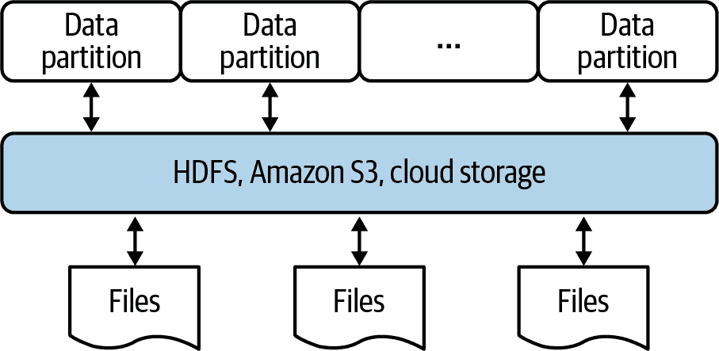
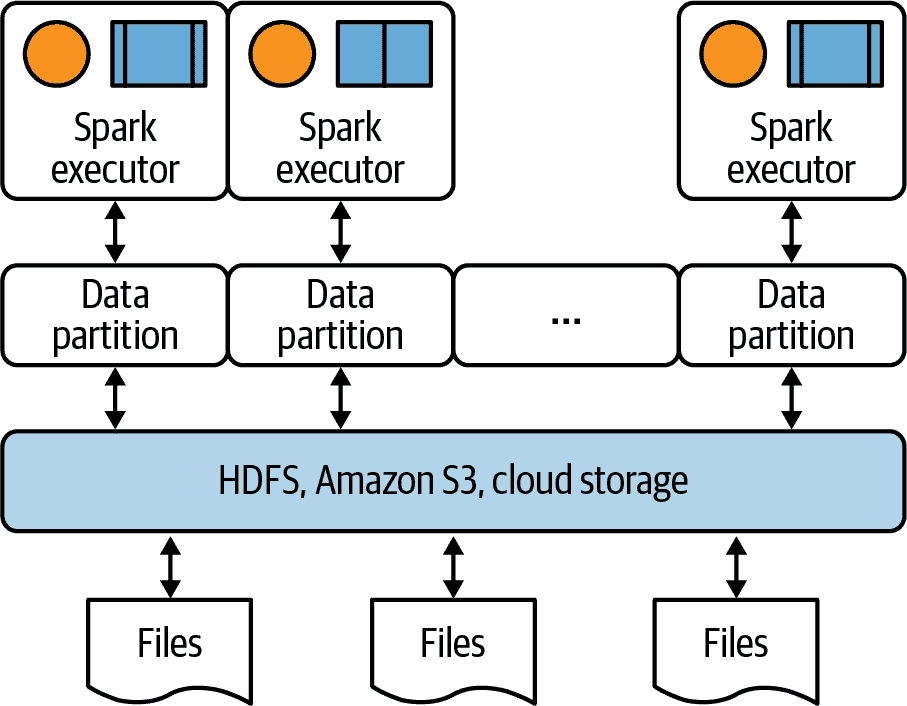
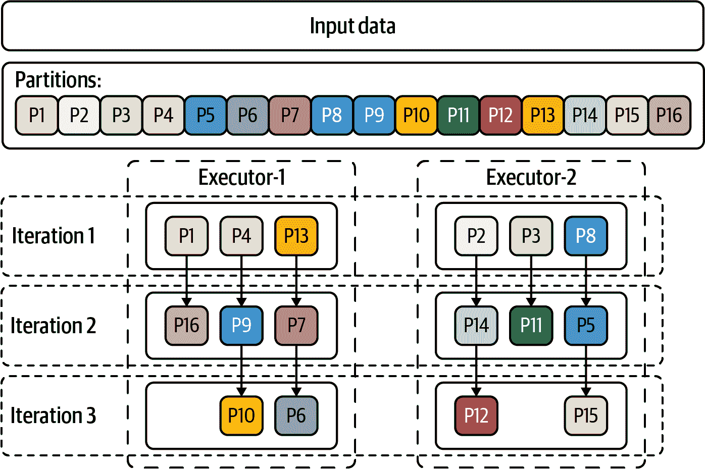
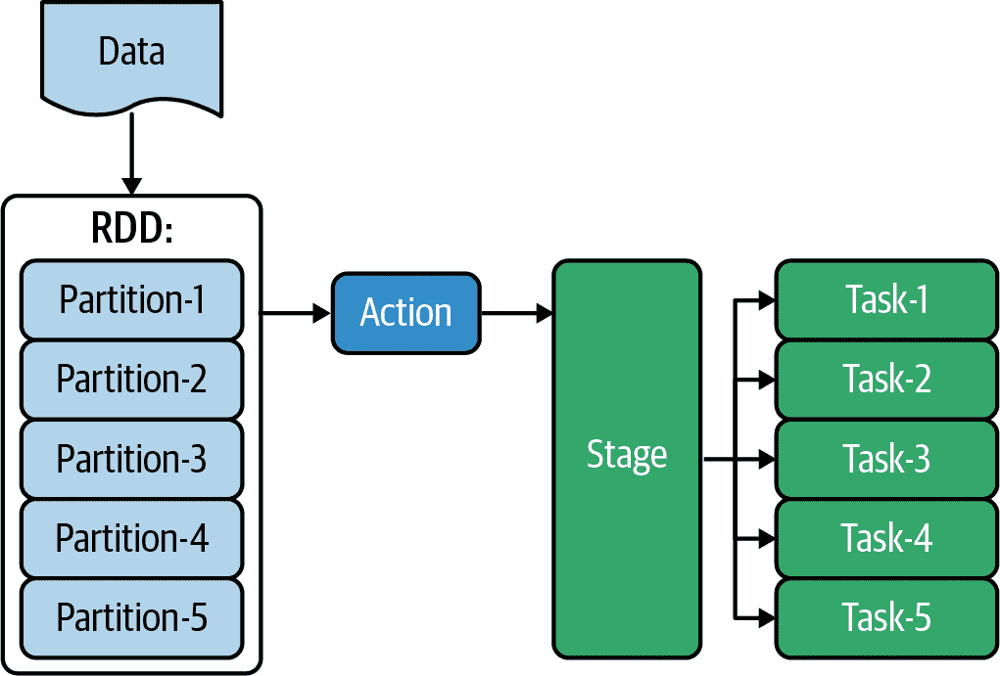
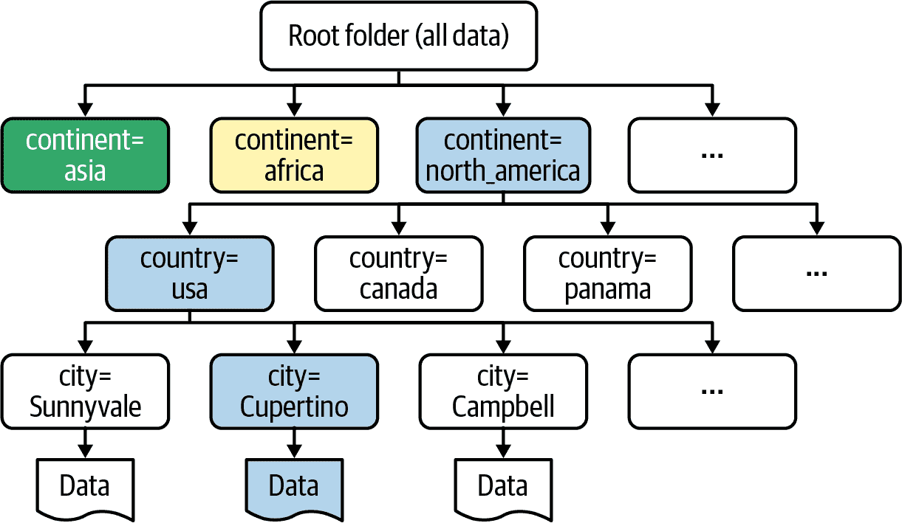
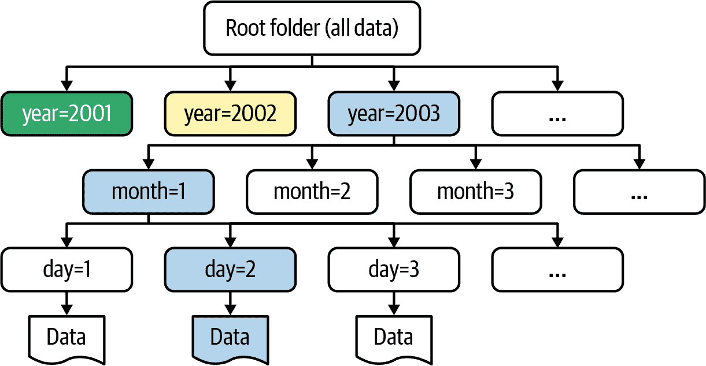

# 第五章：数据分区

分区被定义为“划分的行为；通过创建分隔或保持分开的边界而进行的分离”。数据分区在像 Spark、Amazon Athena 和 Google BigQuery 这样的工具中用于改善查询执行性能。为了扩展大数据解决方案，数据被分割成可以单独管理、访问和并行执行的分区。

正如本书前几章所讨论的，Spark 将数据分割成称为*分区*的较小块，然后并行处理这些分区（可以同时处理多个分区），使用工作节点上的执行器。例如，如果您的输入有 1000 亿条记录，那么 Spark 可能将其分成 10,000 个分区，每个分区大约有 1,000 万个元素：

+   总记录数：100,000,000,000

+   分区数量：10,000

+   每个分区的元素数量：10,000,000

+   最大可能的并行性：10,000

###### 注意

默认情况下，Spark 使用 `HashPartitioner` 实现基于哈希的分区，该分区使用 Java 的 `Object.hashCode()` 函数。

数据分区可以改善可管理性和可扩展性，减少争用，并优化性能。假设您有全球所有国家（7 大洲和 195 个国家）的城市的每小时温度数据，并且目标是查询和分析给定大洲、国家或一组国家的数据。如果您不按相应的方式对数据进行分区，对于每个查询，您将不得不加载、读取并应用您的映射器和减速器到整个数据集，以获得您所需要的结果。这不是非常高效的，因为对于大多数查询，您实际上只需要数据的子集。一个更快的方法是只加载您需要的数据。

Spark 中的数据分区主要是为了并行处理任务而进行的，但在 Amazon Athena 和 Google BigQuery 等查询工具中，其目的是允许您分析数据的一部分而不是整个数据集。PySpark 使按列名物理分区 DataFrame 变得非常容易，以便这些工具可以高效执行查询。

# 分区介绍

通过对数据进行分区，您可以限制每个查询扫描的数据量，从而提高性能并降低成本。例如，Amazon Athena 利用 Spark 和 Hive 进行分区，让您可以按任意键对数据进行分区（BigQuery 提供了相同的功能）。因此，对于我们之前的天气数据示例，您只需选择并使用特定的文件夹进行查询，而不是对所有国家的整个数据集进行使用。

如果您的数据以表格形式表示，比如 Spark DataFrame，分区是根据特定列的值将该表格划分为相关部分的一种方式。分区可以基于一个或多个列（这些列称为分区键）。分区列中的值用于确定每行应存储在哪个分区中。使用分区可以轻松地在数据片段上执行查询，而不是加载整个数据集进行分析。例如，基因组数据记录包括总共 25 条染色体，这些染色体标记为 `{chr1, chr2, ..., chr22, chrX, chrY, chrMT}`。由于在大多数基因组分析中，不会混合使用染色体数据，因此按染色体 ID 分区数据是有意义的。这可以通过仅加载所需染色体的数据来减少分析时间。

## Spark 中的分区

假设您正在使用像 HDFS 或 Amazon S3 这样的分布式存储系统，其中您的数据分布在许多集群节点之间。您的 Spark 分区如何工作？当物理数据在物理集群中的分区中分布时，Spark 将每个分区视为内存中（如果内存不足则在磁盘上）的高级逻辑数据抽象（RDD 或 DataFrame），如 图 5-1 所示。Spark 集群将优化分区访问，并读取网络中最接近它的分区，观察数据的局部性。



###### 图 5-1\. Spark 分区的逻辑模型

在 Spark 中，分区数据的主要目的是通过使集群节点上的执行器同时执行多个任务来实现最大并行性。Spark 执行器在 Spark 应用程序启动时与 Spark 集群管理器协调启动。它们是负责在给定 Spark 作业/应用程序中运行单个任务的工作节点进程。将数据分割为分区允许执行器并行和独立地处理这些分区，每个执行器分配其自己的数据分区来处理（参见 图 5-2）。不需要同步。



###### 图 5-2\. Spark 分区的实际应用

要理解分区如何使我们在 Spark 中实现最大性能和吞吐量，可以想象我们有一个包含 100 亿元素的 RDD，有 10,000 个分区（每个分区大约有 100 万个元素），我们希望在这个 RDD 上执行`map()`转换。进一步想象我们有一个由 51 个节点组成的集群（1 个主节点和 50 个工作节点），其中主节点充当集群管理器且没有执行器，每个工作节点可以同时执行 5 个 mapper 函数。这意味着任何时候会有 5 × 50 = 250 个 mapper 并行和独立地执行，直到所有 10,000 个分区被用完。每个 mapper 完成时，集群管理器将分配一个新的 mapper。因此，平均每个工作节点将处理 10,000 / 250 = 40 个分区。这种情况保证了所有工作节点都得到利用，这应该是分区以实现最大优化时的目标。在这种情况下，如果分区数为 100（而不是 10,000），则每个分区将大约有 1 亿个元素，并且只有 100 / 5 = 20 个工作节点会被利用。其余的 30 个工作节点可能处于空闲状态（低效利用表明资源浪费）。

图 5-3 展示了 Spark 执行器如何处理分区。



###### 图 5-3\. Spark 中数据分区的示例

在这个图中，输入数据被分成了 16 个块。假设有两个执行器，`Executor-1` 和 `Executor-2`，每个执行器最多可以同时处理三个分区，因此需要三次迭代来处理（例如通过映射转换）所有分区。

Spark 中分区的另一个原因是数据集通常非常大，无法存储在单个节点上。正如前面的例子所示，分区的方式很重要，因为它决定了在执行任何作业时如何利用集群的硬件资源。最优的分区应通过数据转换的最大并行性来最大化硬件资源的利用。

以下因素影响数据分区选择：

可用资源

任务可以运行的核心数

外部数据源

本地集合的大小，使用的输入文件系统（如 HDFS，S3 等）。

用于派生 RDD 和 DataFrame 的转换。

当 RDD/DataFrame 从另一个 RDD/DataFrame 派生时影响分区使用的规则。

让我们看看分区在 Spark 计算环境中是如何工作的。当 Spark 将数据文件读入 RDD（或 DataFrame）时，它会自动将该 RDD 分成多个较小的块，而不管 RDD 的大小如何。然后，在我们对 RDD 应用转换（如 `map()`、`reduceByKey()` 等）时，该转换将应用于每个分区。Spark 为每个分区生成一个任务，在执行器的 JVM 中运行（每个工作节点一次只能处理一个任务）。每个阶段包含与 RDD 分区数相同的任务，并将在所有分区上并行执行请求的转换。这个过程由 图 5-4 所示。



###### 图 5-4\. 在 Spark 中操作分区数据

###### 注意

Spark 中的分区不跨多台机器。这意味着每个分区被发送到单个工作机器，并且同一分区中的元组保证位于同一台机器上。

就像适当的分区可以提高数据分析的性能一样，不恰当的分区可能会损害数据分析的性能。例如，假设您有一个拥有 501 个节点（1 个主节点和 500 个工作节点）的 Spark 集群。对于一个包含 100 亿个元素的 RDD，适当的分区数量应该超过 500（比如说，1,000），以确保所有集群节点同时被利用。如果您只有 100 个分区，并且每个工作节点最多只能接受 2 个任务，那么大多数工作节点（大约 400 个）将处于空闲和无用状态。充分利用工作节点，您的查询将运行得更快。

接下来，我们将更深入地探讨 Spark 中的分区方式。

# 管理分区

Spark 同时具有默认和自定义的分区器。这意味着当您创建一个 RDD 时，您可以让 Spark 设置分区数，也可以显式地设置它。在默认情况下，分区数取决于数据源、集群大小和可用资源。大多数情况下，默认分区将工作得很好，但如果您是经验丰富的 Spark 程序员，您可能更喜欢使用 `RDD.repartition`、`RDD.coalesce()` 或 `DataFrame.coalesce()` 函数显式设置分区数。

Spark 提供了几个函数来管理分区。您可以使用 `RDD.repartition(numPartitions)` 返回一个具有确切 `numPartitions` 分区数的新 RDD。该函数可以增加或减少 RDD 中的并行级别，如下例所示：

```
>>> rdd = sc.parallelize([1,2,3,4,5,6,7,8,9,10], 3)
>>> rdd.getNumPartitions()
3
>>> sorted(rdd.glom().collect()) 
[[1, 2, 3], [4, 5, 6], [7, 8, 9, 10]]
>>> len(rdd.repartition(2).glom().collect())
2
>>> len(rdd.repartition(5).glom().collect())
5
```


`RDD.glom()` 返回一个由将每个分区中的所有元素合并成列表而创建的 RDD。

内部，`RDD.repartition()`函数使用洗牌来重新分发数据。如果您减少 RDD 中的分区数，请考虑使用`RDD.coalesce()`，它可以避免执行洗牌。`RDD.coalesce(numPartitions, shuffle=False)` 返回一个新的 RDD，将其减少到`numPartitions`个分区（默认情况下避免洗牌，您不需要提供第二个参数）。以下示例演示了这个概念：

```
>>> nums = [1, 2, 3, 4, 5, 6, 7, 8, 9, 10]
>>> sc.parallelize(nums, 3).glom().collect()
[[1, 2, 3], [4, 5, 6], [7, 8, 9, 10]]
>>> sc.parallelize(nums, 3).coalesce(2).glom().collect()
[[1, 2, 3], [4, 5, 6, 7, 8, 9, 10]]
```

## 默认分区

当程序员未显式设置分区数时，默认情况下 RDD 或 DataFrame 的分区。在这种情况下，分区的数量取决于集群中可用的数据和资源。

# 默认分区数

对于生产环境，大多数情况下默认的分区器效果良好。它确保所有集群节点都被利用，没有集群节点/执行器处于空闲状态。

当您创建 RDD 或 DataFrame 时，可以选择设置分区数。例如，当从 Python 集合创建 RDD 时，可以使用以下 API 设置分区数（其中`numSlices`表示要创建的分区或切片数）：

```
SparkContext.parallelize(collection, numSlices=None)
```

类似地，当您使用`textfile()`从文件系统（如 HDFS 或 S3）中读取文本文件并将其作为`RDD[String]`返回时，可以设置`minPartitions`参数：

```
SparkContext.textFile(name, minPartitions=None, use_unicode=True)
```

在这两种情况下，如果未设置可选参数，则 Spark 将其设置为默认的分区数（基于数据大小和集群中可用的资源）。在这里，我将演示从集合创建 RDD 而不设置分区数。首先，我将介绍一个简单的调试器函数来显示每个分区的元素：

```
>>> def debug(iterator):
...   print("elements=", list(elements))
```

然后我可以创建一个 RDD，并使用它来显示分区的内容：

```
>>> numbers = [1, 2, 3, 4, 5, 6, 7, 8, 9, 10, 11, 12]
>>> rdd = sc.parallelize(numbers)
>>> num_partitions = rdd.getNumPartitions()
>>> num_partitions
8
>>> rdd.foreachPartition(debug)
elements= [1]
elements= [11, 12]
elements= [4]
elements= [2, 3]
elements= [10]
elements= [8, 9]
elements= [7]
elements= [5, 6]
```

###### 警告

注意，此函数仅用于测试和教学目的，并且不应在生产环境中使用，因为每个分区可能包含数百万个元素。

## 显式分区

如前所述，程序员在创建 RDD 时还可以显式设置分区数。

# 设置分区数

在生产环境中显式设置分区数之前，您需要了解您的数据和集群。确保没有集群节点/执行器处于空闲状态。

在这里，我从相同的集合创建一个 RDD，但在创建时指定了分区数：

```
>>> numbers = [1, 2, 3, 4, 5, 6, 7, 8, 9, 10, 11, 12]
>>> rdd = sc.parallelize(numbers, 3) 
>>> rdd.getNumPartitions()
3
```


分区数量为 3。

接下来，让我们调试创建的 RDD 并查看分区的内容：

```
>>> rdd.foreachPartition(debug)
elements= [5, 6, 7, 8]
elements= [1, 2, 3, 4]
elements= [9, 10, 11, 12]
```

然后我们可以在这个 RDD 上应用`mapPartitions()`转换：

```
>>> def adder(iterator):
...   yield sum(iterator)
...
>>> rdd.mapPartitions(adder).collect()
[10, 26, 42]
```

# SQL 查询的物理分区

在本节中，我们关注的是数据的物理分区，而不是 RDD 和 DataFrame 的分区。物理分区是一种技术，用于提高类似 Hive、Amazon Athena 和 Google BigQuery 等查询工具对数据执行查询的性能。Athena 和 BigQuery 是使用 SQL 查询数据的无服务器服务。通过适当的字段级物理数据分区，可以使我们能够读取、扫描和查询数据集的一个或多个片段，而不是读取和分析整个数据集，极大地提高了查询性能。Spark 也允许我们在磁盘上实现物理数据分区，您将在下一节中看到。

###### 注意

将数据按特定字段（在 SQL 的`WHERE`子句中使用的字段）分区在使用 Athena 或 BigQuery 查询数据时起着关键作用。通过限制扫描的数据量，显著加快查询执行速度并降低成本，因为成本是基于扫描的数据量计算的。

考虑我们早期关于世界各地城市温度数据的例子。通过查看数据，您可以看到每个大洲都有一组国家，每个国家都有一组城市。如果您要按大洲、国家和城市查询此数据，那么按这三个字段`(continent, country, city)`分区数据就非常有意义。简单的分区解决方案是为每个大洲创建一个文件夹，然后按国家分区每个大洲，最后按城市分区每个国家。然后，而不是扫描*<root-dir>/*下的整个目录结构，以下查询：

```
SELECT <some-fields-from-my_table>
    FROM my_table
       WHERE continent = 'north_america'
         AND country = 'usa'
         AND city = 'Cupertino'
```

只会扩展这个：

```
<root-dir>/continent=north_america/country=usa/city=Cupertino
```

正如这个例子所示，分区可以使我们扫描数据的一个非常有限的部分，而不是整个数据集。例如，如果您有一个涉及美国的查询，您只需要扫描一个文件夹，而不是扫描所有 195 个文件夹。在大数据分析中，按目录分区数据非常有效，因为我们没有像关系表那样的索引机制。事实上，您可以将分区视为非常简单的索引机制。分区允许您限制每个查询扫描的数据量，从而提高性能并降低成本。

让我们看另一个例子。给定一个世界温度数据集，您可以在 Amazon Athena 中按以下方式创建这个分区表：

```
   CREATE EXTERNAL TABLE world_temperature(
    day_month_year DATE,
    temperature DOUBLE
   )
   PARTITIONED BY (
     continent STRING, 
     country STRING, 
     city STRING   
   )
   STORED AS PARQUET
   LOCATION *`s3``:``/``/``<``bucket``-``name``>``/``dev``/``world_temperature``/`*
   tblproperties ("parquet.compress"="SNAPPY");
```


首先按`continent`分区。


然后按`country`分区。


最后，按`city`分区。

如果您然后查询此表并在`WHERE`子句中指定一个分区，Amazon Athena 将只从该分区扫描数据。



###### 图 5-5\. 查询分区数据

请注意，如果您打算按 `year`、`month` 和 `day` 查询此数据，可以将同一数据分区到另一种形式，其中分区字段为 `year`、`month` 和 `day`。在这种情况下，您的模式将变成以下形式：

```
CREATE EXTERNAL TABLE world_temperature_by_date(
  day_month_year DATE,
  continent STRING,
  country STRING,
  city STRING,
  temperature DOUBLE
)
PARTITIONED BY (
  year INTEGER,  
  month INTEGER, 
  day, INTEGER   
)
STORED AS PARQUET
LOCATION *`s3``:``/``/``<``bucket``-``name``>``/``dev``/``world_temperature_by_date``/`*
tblproperties ("parquet.compress"="SNAPPY");
```


首先按 `year` 进行分区。


然后按 `month` 进行分区。


最后，按 `day` 进行分区。

使用这种新模式，您可以像下面这样发出 SQL 查询：

```
SELECT <some-fields>
    FROM world_temperature_by_date
       WHERE year = 2020
         AND month = 8
         AND day = 16
```

正如这个例子所说明的，为了有效地对数据进行分区，您需要理解将针对表执行的查询（即将数据表达为表）。

举个例子，假设您有客户数据，每条记录格式如下：

```
<customer_id><,><date><,><transaction_id><,><item><,><transaction_value>
<date>=DAY/MONTH/YEAR>
```

另外，假设您的目标是按年分析数据，或者按年和月的组合分析数据。分区数据是一个好主意，因为它允许您通过选择特定文件夹（按年或按年和月）来限制扫描的数据量。Figure 5-6 展示了可能的效果。



###### Figure 5-6\. 按年/月/日分区查询数据

现在，让我们深入了解如何在 Spark 中对数据进行分区。

# Spark 中数据的物理分区

Spark 提供了一个简单的 DataFrame API 用于数据的物理分区。让 `df` 表示我们示例数据的 DataFrame，其记录形式如下：

```
<customer_id><,><date><,><transaction_id><,><amount>
<date> = <day></><month></><year>
```

我们可以使用 `DataFrameWriter.partitionBy()` 方法对数据进行物理分区，可以是文本格式（基于行）或 Parquet 等二进制格式（基于列）。以下各小节展示了具体方法。

## 按文本格式分区

下面的代码片段显示了如何将数据（表示为 DataFrame）按年和月分区到文本格式中。首先，我们创建一个具有四列的 DataFrame：

```
# df: a DataFrame with four columns:
#   <customer_id>
#   <date> (as DAY/MONTH/YEAR)
#   <transaction_id>
#   <amount>
df = spark.read.option("inferSchema", "true")\
          .csv(input_path)\
          .toDF('customer_id', 'date', 'transaction_id', 'amount')
```

接下来，我们添加两个新列（`year` 和 `month`）：

```
df2 = df.withColumn("year", get_year(df.date))\ 
        .withColumn("month", get_month(df.date)) 
```


添加一个 `year` 列。


添加一个 `month` 列。

最后，我们按 `year` 和 `month` 进行分区，然后写入并保存我们的 DataFrame：

```
df2.write 
  .partitionBy("year", "month")\ 
  .text(output_path) 
```


获取一个 `DataFrameWriter` 对象。


按所需列对数据进行分区。


将每个分区保存为文本文件。

数据按年和月分区的完整解决方案可在该书的 GitHub 存储库中找到，文件名为 *partition_data_as_text_by_year_month.py*。还提供了包含详细输出的示例运行日志，文件名为 *partition_data_as_text_by_year_month.log*。

## 按 Parquet 格式分区

将数据分区为[Parquet 格式](http://parquet.apache.org)具有几个优点：与文本数据相比，数据聚合可以更快完成，因为 Parquet 以列格式存储数据，并且 Parquet 还存储元数据。该过程相同，只是不再使用`DataFrameWriter`类的`text()`函数，而是使用`parquet()`函数：

```
# partition data
df2.write.partitionBy('year', 'month')\
  .parquet(output_path)
```

如果需要，您可以按其他列格式分区数据，例如[ORC](http://orc.apache.org)或[CarbonData](http://carbondata.apache.org)。如果您只想为每个分区创建单个分区文件，您可以在分区之前重新分区数据。Spark 的`repartition(numPartitions, *cols)`函数返回一个新的 DataFrame，其分区由给定的分区表达式进行哈希分区。例如，这将为每个`('year', 'month')`分区创建一个单独的输出文件：

```
# partition data
df2.repartition('year', 'month')\
  .write.partitionBy('year', 'month')\
  .parquet(output_path)
```

我们可以通过检查输出路径来查看数据的物理分区：

```
$ ls -lR /tmp/output
-rw-r--r--  ...    0 Feb 11 21:04 _SUCCESS
drwxr-xr-x  ...  192 Feb 11 21:04 year=2018
drwxr-xr-x  ...  160 Feb 11 21:04 year=2019
/tmp/output/year=2018:
drwxr-xr-x  ...  128 Feb 11 21:04 month=10
drwxr-xr-x  ...  128 Feb 11 21:04 month=12
drwxr-xr-x  ...  128 Feb 11 21:04 month=3
drwxr-xr-x  ...  128 Feb 11 21:04 month=9
/tmp/output/year=2018/month=10:
-rw-r--r--  ...  1239 Feb 11 21:04 part-00000...snappy.parquet
/tmp/output/year=2018/month=12:
total 8
-rw-r--r--  ...  1372 Feb 11 21:04 part-00000...snappy.parquet
...
```

# 如何查询分区数据

为了优化查询性能，您应该在 SQL `WHERE`子句中包含物理分区列。例如，如果您按`("year", "month", "day")`分区数据，则以下查询将被优化：

```
-- Query data for year = 2012
   SELECT <some-columns>
      FROM <table-name>
         WHERE year = 2012

-- Query data for year = 2012 and month = 7
   SELECT <some-columns>
      FROM <table-name>
         WHERE year = 2012
           AND month = 7
```

`WHERE`子句将指导查询引擎分析数据的片段，而不是整个数据集，如果查询非分区列，则会这样做。让我们看一个使用 Amazon Athena 的示例。

## Amazon Athena 示例

要使用 SQL 在 Athena 中访问和查询您的数据，您需要执行以下简单步骤：

1.  考虑您将发出的查询类型，然后相应地分区数据。例如，如果您正在处理基因组数据，并且您的 SQL 查询看起来像这样：

    ```
    SELECT *
       FROM genome_table
          WHERE chromosome = 'chr7' AND ....
    ```

    然后，您应该按`chromosome`列分区数据。将数据加载到 DataFrame 中（其中包括`chromosome`列），然后按染色体分区并以 Parquet 格式保存到 S3 中：

    ```
    # create a DataFrame
    df = <dataframe-includes-chromosome-column>

    # define your output location
    s3_output_path = 's3://genomics_bucket01:/samples/'

    # partition data by chromosome column
    # and save it as Parquet format
    df.repartition("chromosome")\
      .write.mode("append")\
      .partitionBy("chromosome")\
      .parquet(s3_output_path)
    ```

1.  接下来，定义您的架构，指定与前面步骤中定义的相同的 S3 位置：

    ```
    CREATE EXTERNAL TABLE `genome_table`(
      `sample_barcode` string,
      `allelecount` int,
      ...
    )
    PARTITIONED BY (
      `chromosome`
    )
    STORED AS PARQUET
    LOCATION 's3://genomics_bucket01:/samples/'
    tblproperties ("parquet.compress"="SNAPPY");
    ```

    请注意，`chromosome`列是在`PARTITIONED BY`部分中定义的数据字段。

1.  现在您的架构准备就绪，您可以执行/运行它（这将创建 Amazon Athena 使用的元数据）。

1.  加载您的分区：

    ```
    MSCK REPAIR TABLE genome_table;
    ```

1.  一旦您的分区准备就绪，您可以开始执行像这样的 SQL 查询：

    ```
    SELECT sum(allelecount)
       FROM genome_table
           WHERE chromosome = 'chr7';
    ```

由于您已按`chromosome`列分区数据，因此仅会读取/扫描一个名为`chromosome=chr7`的目录，用于此 SQL 查询。

# 总结

Spark 中的分区是将数据（表示为 RDD 或 DataFrame）分割为多个分区的过程，您可以并行执行转换，从而更快地完成数据分析任务。您还可以将分区数据写入文件系统中的多个子目录，以便下游系统更快地读取。回顾一下：

+   物理数据分区涉及按数据字段/列将数据（表达为 RDD 或 DataFrame）分割成较小的片段（块），以便以更精细的级别管理和访问数据。

+   数据分区使我们能够减少存储大量数据的成本，同时加快大数据集的处理速度。

+   当使用像 Amazon Athena 和 Google BigQuery 这样的无服务器服务时，需要按字段/列对数据进行分区，主要用于 SQL 查询的`WHERE`子句。了解将要执行的查询类型并相应地分区数据非常重要。

+   简言之，数据分区给我们带来以下优势：

    +   它提高了查询性能和可管理性。对于给定的查询，你只需分析基于查询子句的相关数据片段。

    +   它减少了查询数据的成本，这是基于扫描的数据量。

    +   它简化了常见的 ETL 任务，因为你可以基于分区浏览和查看数据。

    +   它使得临时查询更加简单和快速，因为你可以分析数据的片段而不是整个数据集。

    +   它使我们能够模拟关系数据库表的部分索引。

接下来，我们将看一下图算法。
