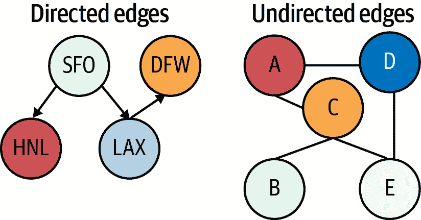
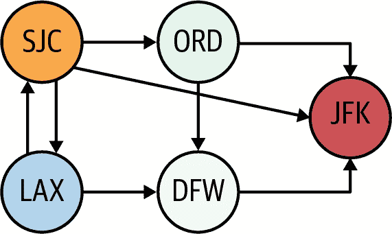
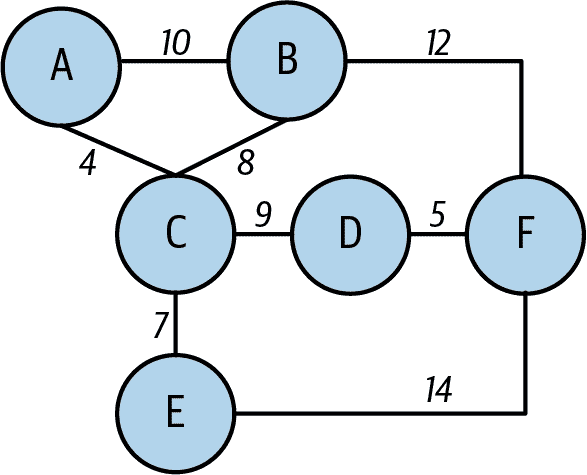
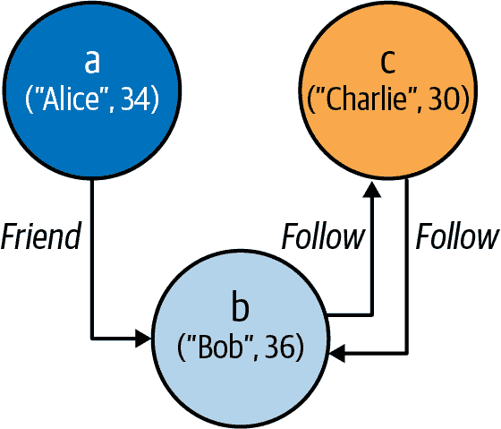
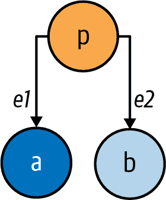
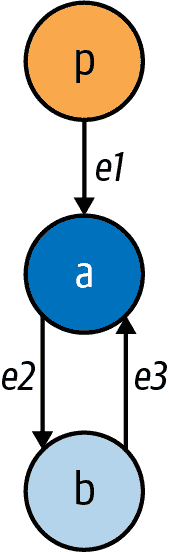
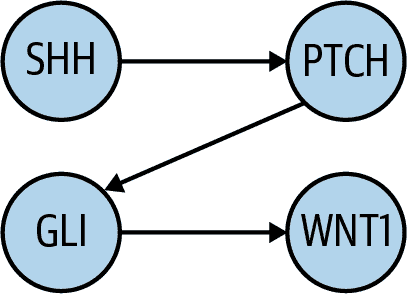
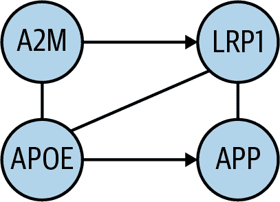
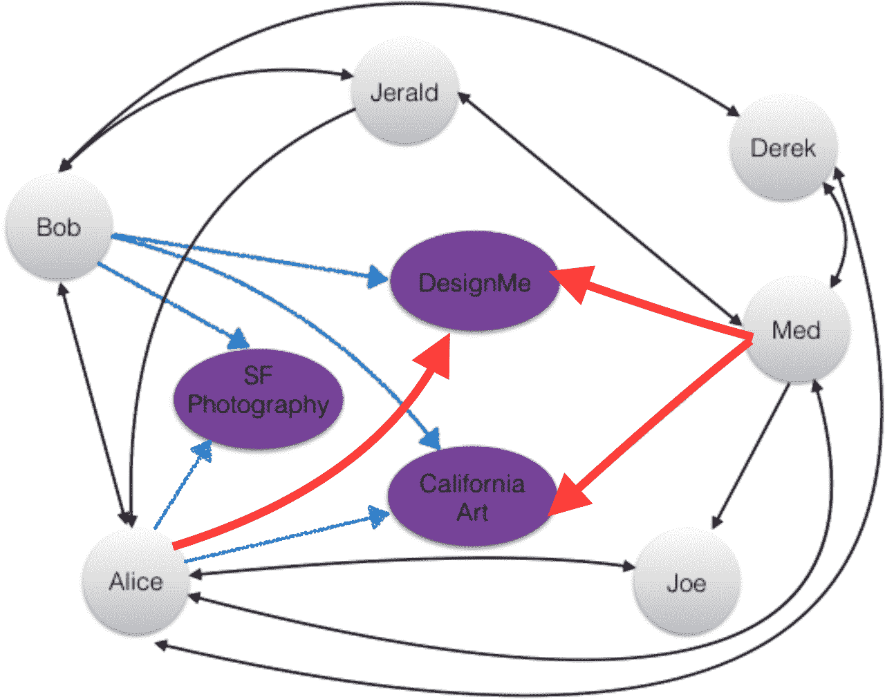
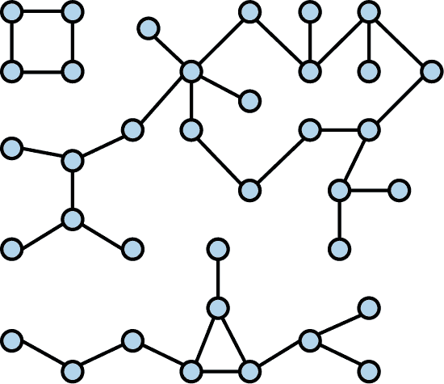

# 第六章：图算法

到目前为止，我们主要关注的是记录数据，通常存储在平面文件或关系数据库中，并且可以表示为矩阵（一组带有命名列的行）。现在我们将注意力转向基于图的数据，它描述了两个或多个数据点之间的关系。一个常见的例子是社交网络数据：例如，如果“Alex”是“Jane”的“朋友”，而“Jane”是“Bob”的“朋友”，这些关系形成了一个图。航空公司/航班数据是图数据的另一个常见例子；我们将在本章中探索这两个（及其他）例子。

数据结构是计算机中有效组织和存储数据的特定方式。除了线性数据结构（如我们在前几章中主要使用的数组、列表、元组等）外，还包括非线性结构，如树、哈希映射和图。

本章介绍了 GraphFrames，这是一个强大的 Spark 外部包，提供 API 用于表示有向和无向图，查询和分析图，并在图上运行算法。我们将首先探讨图及其用途，然后看看如何在 PySpark 中使用 GraphFrames API 构建和查询图。我们将深入了解 GraphFrames 支持的一些算法，例如查找三角形和模式查找，然后讨论一些实际的现实应用。

# 图的介绍

图是非线性数据结构，用于直观地展示数据中的关系。非正式地说，图是一对 `(V, E)`，其中：

+   `V` 是一组称为顶点的节点。

+   `E` 是一组称为边的顶点对集合。

+   `V`（顶点）和 `E`（边）是位置，并存储元素。

一般情况下，每个节点通过唯一标识符和一组关联属性来标识。边由两个节点标识符（源节点和目标节点）和一组关联属性标识。路径表示两个顶点之间的一系列边。例如，在航空网络中：

+   顶点代表机场，并存储三字母机场代码及其他重要信息（城市、州等）。

+   边代表两个机场之间的航班路线，并存储路线的里程数。

边可以是*有向*或*无向*的，如图 6-1 所示。有向边由有序顶点对`(u, v)`组成，其中第一个顶点(`u`)是源，第二个顶点(`v`)是目的地。无向边由无序顶点对`(u, v)`组成。



###### 图 6-1\. 有向和无向边

类似地，图可以是有向的（由有向边组成）或无向的（由无向边组成）。图 6-2 展示了一个有向图的例子。它表示了一小组机场作为顶点（通过机场代码标识，如 SJC、LAX 等），并显示了始发机场和飞行目的地之间的关系。



###### 图 6-2\. 有向图示例

图 6-3 展示了一个具有六个节点的无向图，标记为`{A, B, C, D, E, F}`，节点之间用边连接。在这个例子中，节点可能表示城市，边可能表示城市之间的距离。在无向图中，所有的边都是双向的。



###### 图 6-3\. 无向图示例

###### 提示

要将有向图转换为无向图，您需要为每条有向边添加一条额外的边。也就是说，如果有一条有向边 `(u, v)`，那么您需要添加一条边 `(v, u)`。

某些类型的数据特别适合使用图来表示。例如，在网络分析中，数据通常被建模为一个图或一组图。图和矩阵通常用于表示和分析社会参与者（用户、朋友、追随者）和对象（如产品、故事、基因等）之间联系模式的信息。我们将在本章后面看一些实际的例子，展示图如何用于解决数据问题，但首先让我们深入了解 GraphFrames API。

# GraphFrames API

Spark 提供了两种不同且强大的 API 来实现图算法，如 PageRank、最短路径、连通组件和三角形计数：GraphX 和 GraphFrames。GraphX 是基于 RDD 的 Spark 核心组件，而 GraphFrames（一个开源的外部库）则基于 DataFrames。

我们将集中讨论 GraphFrames，因为在撰写本文时，GraphX（一种面向快速分布式计算优化的通用图处理库）仅支持 Scala 和 Java 的 API，而不支持 Python。GraphFrames 在这三种语言中提供了高级 API，因此我们可以在 PySpark 中使用它，并在底层选择性地使用部分 GraphX 函数。

除了 GraphX 的功能外，GraphFrames 提供了利用 Spark DataFrames 的扩展功能。它利用 DataFrames 提供的可扩展性和高性能，并为图处理提供了统一的 API。GraphFrames 为我们提供了运行图查询和算法的强大工具；除此之外，它简化了交互式图查询，并支持图案发现，也称为图模式匹配。

表 6-1 总结了这两个库之间的关键差异。

表 6-1\. GraphFrames 与 GraphX 比较

| 特性 | GraphFrames | GraphX |
| --- | --- | --- |
| 基于 | DataFrames | RDDs |
| 支持的语言 | Scala, Java, Python | Scala, Java |
| 使用案例 | 算法和查询 | 算法 |
| 顶点/边属性 | 任意数量的 DataFrame 列 | 任意顶点 (`VD`) 或边 (`ED`) 类型 |
| 返回类型 | `GraphFrame` 或 DataFrame | `Graph<VD,ED>` 或 RDD |
| 支持模式查找 | 是 | 不支持直接 |

GraphFrames 库中的主要类是 `graphframes.GraphFrame`，它使用 GraphFrames API 构建图。`GraphFrame` 类定义如下：

```
class GraphFrame {
  def vertices: DataFrame 
  def edges: DataFrame 
  def find(pattern: String): DataFrame 
  def degrees(): DataFrame 
  def pageRank(): GraphFrame 
  def connectedComponents(): GraphFrame 
  ...
}
```


`vertices` 是一个 DataFrame。


`edges` 是一个 DataFrame。


在图中搜索结构模式（motif finding）。


返回图中每个顶点的度作为 DataFrame。


在图上运行 PageRank 算法。


计算图的连通分量。

## 如何使用 GraphFrames

让我们深入使用 GraphFrames API 来构建一些图。由于 GraphFrames 是一个外部包（不是 Spark API 的主要组件），在 PySpark shell 中使用它需要显式地使其可用。第一步是下载并安装它。GraphFrames 是加州大学伯克利分校（UC Berkeley）、麻省理工学院（MIT）和 Databricks 的合作成果。你可以在 [Spark Packages](https://oreil.ly/w3neM) 找到最新的 GraphFrames 包分发版，并且文档可以在 [GitHub](https://oreil.ly/T1ZBY) 上获取。

你可以在 PySpark shell 中使用 `--packages` 参数自动下载 GraphFrames 包及其所有依赖项。这里，我指定了一个特定版本的包（`0.8.2-spark3.2-s_2.12`）。要使用不同的版本，只需更改 `--packages` 参数的最后一部分。从操作系统命令提示符下，你可以使用以下命令导入该库（注意这里的输出已经被修整）：

```
export SPARK_HOME=/Users/mparsian/spark-3.2.0
export GF="graphframes:graphframes:0.8.2-spark3.2-s_2.12"
$SPARK_HOME/bin/pyspark --packages $GF
...
graphframes#graphframes added as a dependency
found graphframes#graphframes;0.8.2-spark3.2-s_2.12 in spark-packages
...
Spark context available as 'sc'
SparkSession available as 'spark'.
```

```
>>> from graphframes import GraphFrame

```

如果导入成功，你就可以开始使用 GraphFrames API 了。以下示例展示了如何创建一个 `GraphFrame`，对其进行查询，并在图上运行 PageRank 算法。我们将在 第八章 中详细介绍 PageRank；现在你只需要知道它是用于对网页搜索结果进行排名的算法。

在 GraphFrames API 中，图表示为 `GraphFrame(v, e)` 的实例，其中 `v` 表示顶点（作为 DataFrame），`e` 表示边（作为 DataFrame）。考虑 图 6-4 中的简单图。



###### 图 6-4\. 一个简单的图

在接下来的步骤中，我们将使用 GraphFrames API 构建这个图，并对其应用一些简单的图查询和算法。

1.  创建一个带有唯一 ID 列`id`的顶点 DataFrame。GraphFrames API 需要`id`列；它唯一标识要构建的图中的所有顶点。您还可以根据节点属性包括其他列。在这里，我们创建`vertices`作为一个有三列的 DataFrame（`DataFrame["id", "name", "age"]`）：

    ```
    >>># spark is an instance of SparkSession
    >>> vertices = [("a", "Alice", 34), \
                    ("b", "Bob", 36), \
                    ("c", "Charlie", 30)] 
    >>> column_names = ["id", "name", "age"]
    >>> v = spark.createDataFrame(vertices, column_names) 
    >>> v.show()
    +---+-------+---+
    | id|   name|age|
    +---+-------+---+
    |  a|  Alice| 34|
    |  b|    Bob| 36|
    |  c|Charlie| 30|
    +---+-------+---+
    ```

    

    代表顶点的 Python 集合。

    

    `v` 表示顶点作为一个 DataFrame。

1.  使用`src`和`dst`列创建边 DataFrame。除了这些必需的列外，它们代表源和目标顶点 ID，您还可以根据需要包括其他属性。我们希望存储图中节点之间关系类型的信息，因此我们将包括一个`relationship`列。在这里，我们创建`edges`作为一个有三列的 DataFrame（`DataFrame["src", "dst", "relationship"]`）：

    ```
    >>> edges = [("a", "b", "friend"), \
                 ("b", "c", "follow"), \
                 ("c", "b", "follow")] 
    >>> column_names = ["src", "dst", "relationship"]
    >>> e = sqlContext.createDataFrame(edges, column_names) 
    >>> e.show()
    +---+---+------------+
    |src|dst|relationship|
    +---+---+------------+
    |  a|  b|      friend|
    |  b|  c|      follow|
    |  c|  b|      follow|
    +---+---+------------+
    ```

    

    代表边的 Python 集合。

    

    `e` 表示边作为一个 DataFrame。

1.  下一步是创建我们的图。使用 GraphFrames API，图被构建为一个`GraphFrame`实例，其中包括顶点（作为`v`）和边（作为`e`）的一对：

    ```
    >>> from graphframes import GraphFrame 
    >>> graph = GraphFrame(v, e) 
    >>> graph 
    GraphFrame(v:[id: string, name: string ... 1 more field],
               e:[src: string, dst: string ... 1 more field])
    ```

    

    导入所需的`GraphFrame`类。

    

    使用`v`（顶点）和`e`（边）构建一个`GraphFrame`的实例来构建图。

    

    检查构建的图。

1.  一旦图被构建，我们可以开始发出查询和应用算法。例如，我们可以发出以下查询来获取图中每个顶点的“入度”（即终止于该顶点的边的数量）：

    ```
    >>> graph.inDegrees.show()
    +---+--------+
    | id|inDegree|
    +---+--------+
    |  c|       1|
    |  b|       2|
    +---+--------+
    ```

    结果是一个有两列的 DataFrame：`id`（顶点的 ID）和`inDegree`，存储顶点的入度作为整数。注意，没有入边的顶点不会在结果中返回。

1.  接下来，让我们计算图中“follow”连接的数量：

    ```
    >>> graph.edges.filter("relationship = 'follow'").count()
    2
    ```

1.  最后，我们可以在图上运行 PageRank 算法并展示结果：

    ```
    >>> pageranks = graph.pageRank(resetProbability=0.01, maxIter=20) 
    >>> pageranks.vertices.select("id", "pagerank").show() 
    +---+------------------+
    | id|          pagerank|
    +---+------------------+
    |  b|1.0905890109440908|
    |  a|              0.01|
    |  c|1.8994109890559092|
    +---+------------------+
    ```

    

    对给定的图运行 PageRank 算法 20 次迭代。

    

    展示给定图中每个节点的 PageRank 值。

## GraphFrames 函数和属性

如前面的例子所示，GraphFrames 函数（也称为图操作或 GraphOps）使您可以访问有关图的许多细节。除了各种图算法实现（我们将在下一节中更详细地讨论）外，API 还公开了一些属性，使您能够轻松获取有关图的顶点、边和度数（`degrees`、`inDegrees`和`outDegrees`）的信息。

例如，如果`graph`是`GraphFrame`的一个实例，您可以按以下方式将顶点和边作为 DataFrame 获取：

```
vertices_as_dataframes = graph.vertices 
edges_as_dataframes = graph.edges 
```


`Graphframe.vertices`属性将图的顶点返回为一个 DataFrame。


`Graphframe.edges`属性将图的边返回为一个 DataFrame。

[API 文档](https://oreil.ly/6JMVO)提供了所有可用属性和函数的完整列表，但请注意，并非所有这些函数都适用于 DataFrames。如果您了解如何操作 DataFrames，则还可以对这些函数的输出应用`sort()`、`groupBy()`和`filter()`操作，以获取更多信息，就像我们在示例图中统计“关注”连接的数量一样（您将在后续章节中更多了解如何处理 DataFrames）。

# GraphFrames 算法

GraphFrames API 提供了一组算法，用于在图中查找特定模式或子图（也称为“motif”），这通常是一项昂贵的操作。由于 Spark 使用 MapReduce 和分布式算法，它可以相对快速地运行这些操作，但它们仍然是耗时的过程。除了查找模式（使用`find()`）之外，支持的算法还包括：

+   查找模式

+   广度优先搜索（BFS）

+   连通分量

+   强连通分量

+   标签传播

+   PageRank

+   最短路径

+   三角形计数

让我们更详细地研究其中的一些算法。

## 查找三角形

本节提供了使用 GraphFrames API 查找、计数和列出给定图形或一组图形中所有三角形的高效解决方案。在我们查看示例之前，我们需要定义三元组和三角形。设 `T = (a, b, c)` 是由 `G` 标识的图中的三个不同节点集合。如果这些节点中的两个是连接的 `({(a, b), (a, c)})`，那么 `T` 是一个三元组；如果所有三个节点都连接 `({(a, b), (a, c), (b, c)})`，则它是一个三角形。

在图分析中，有三个重要的度量指标：

1.  全局聚类系数

1.  传递率，定义为 *T* = 3 × *m* / *n*，其中 *m* 是图中的三角形数量，*n* 是顶点的连接三元组数量

1.  局部聚类系数

三角形计数（计算图中每个节点的三角形数量）是社交网络分析中的常见任务，用于检测和衡量社区的凝聚力。它也经常用于计算网络指标，如[聚类系数](https://oreil.ly/iTkRj)。这项任务需要高效的算法，因为在某些情况下，图可能包含数亿个节点（例如社交网络中的用户）和边（这些用户之间的关系）。

# 使用 MapReduce 进行三角形计数

我的书[*Data Algorithms*](https://www.oreilly.com/library/view/data-algorithms/9781491906170)（O'Reilly）的第十六章提供了两种 MapReduce 解决方案，用于查找、计数和列出给定图形或一组图形中的所有三角形。解决方案以 Java、MapReduce 和 Spark 提供。

GraphFrames 包提供了一个方便的方法，`GraphFrame.triangleCount()`，用于计算通过每个顶点的三角形数量。让我们通过一个示例来展示如何从节点和边构建图，然后找到通过每个节点的三角形数量。

### 步骤 1：构建图

首先，我们将定义顶点：

```
>>># SparkSession available as 'spark'.
>>># Display the vertex and edge DataFrames
>>> vertices = [('a', 'Alice',34), \
                ('b', 'Bob', 36), \
                ('c', 'Charlie',30), \
                ('d', 'David',29), \
                ('e', 'Esther',32), \
                ('f', 'Fanny',36), \
                ('g', 'Gabby',60)]
```

接下来，我们定义节点之间的边：

```
>>> edges = [('a', 'b', 'friend'),
             ('b', 'c', 'follow'), \
             ('c', 'b', 'follow'), \
             ('f', 'c', 'follow'), \
             ('e', 'f', 'follow'), \
             ('e', 'd', 'friend'), \
             ('d', 'a', 'friend'), \
             ('a', 'e', 'friend')]
```

一旦我们有了顶点和边，我们可以构建一个图：

```
>>> v = spark.createDataFrame(vertices, ["id", "name", "age"]) 
>>> e = spark.createDataFrame(edges, ["src", "dst", "relationship"]) 
>>> from graphframes import GraphFrame
>>> graph = GraphFrame(v, e) 
```


顶点 DataFrame 需要`id`列。


边 DataFrame 需要`src`和`dst`列。


图被构建为一个`GraphFrame`对象。

现在让我们检查图及其顶点和边：

```
>>> graph
GraphFrame(v:[id: string, name: string ... 1 more field],
           e:[src: string, dst: string ... 1 more field])

>>> graph.vertices.show()
+---+-------+---+
| id|   name|age|
+---+-------+---+
|  a|  Alice| 34|
|  b|    Bob| 36|
|  c|Charlie| 30|
|  d|  David| 29|
|  e| Esther| 32|
|  f|  Fanny| 36|
|  g|  Gabby| 60|
+---+-------+---+

>>> graph.edges.show()
+---+---+------------+
|src|dst|relationship|
+---+---+------------+
|  a|  b|      friend|
|  b|  c|      follow|
|  c|  b|      follow|
|  f|  c|      follow|
|  e|  f|      follow|
|  e|  d|      friend|
|  d|  a|      friend|
|  a|  e|      friend|
+---+---+------------+
```

### 步骤 2：计算三角形

接下来，我们将使用`GraphFrame.triangleCount()`方法计算该图中通过每个顶点的三角形数量：

```
>>> results = g.triangleCount()
>>> results.show()
+-----+---+-------+---+
|count| id|   name|age|
+-----+---+-------+---+
|    0|  g|  Gabby| 60|
|    0|  f|  Fanny| 36|
|    1|  e| Esther| 32|
|    1|  d|  David| 29|
|    0|  c|Charlie| 30|
|    0|  b|    Bob| 36|
|    1|  a|  Alice| 34|
+-----+---+-------+---+
```

为了仅显示顶点 ID 和通过每个顶点的三角形数量，我们可以编写：

```
>>> results.select("id", "count").show()
+---+-----+
| id|count|
+---+-----+
|  g|    0|
|  f|    0|
|  e|    1|
|  d|    1|
|  c|    0|
|  b|    0|
|  a|    1|
+---+-----+
```

结果表明我们的图中有三个三角形。然而，这些实际上是同一个三角形，具有不同的根：

```
Triangle rooted by e:  e -> d -> a -> e
Triangle rooted by d:  d -> a -> e -> d
Triangle rooted by a:  a -> e -> d -> a
```

在下一节中，我将向您展示如何使用 GraphFrames API 的模式查找算法来消除重复的三角形。

## 查找模式

图中的模式是顶点之间的交互模式，例如三角形和其他子图。例如，由于 Twitter 数据不是双向的（如果 Alex 关注 Bob，并不意味着 Bob 会关注 Alex），我们可以使用模式查找来查找所有双向用户关系。模式查找使我们能够执行查询，以发现图中各种结构模式，而 GraphFrames API 为此提供了强大的支持。

GraphFrames 使用一种简单的领域特定语言（DSL）来表达结构查询。例如，以下查询：

```
graph.find("(a)-[e1]->(b); (b)-[e2]->(a)")
```

将在图中搜索由边双向连接的顶点对`{a, b}`。它将返回一个 DataFrame，其中包含图中所有这种结构，列分别为模式中每个命名元素（顶点或边）。在本例中，返回的列将是"`a, b, e1, e2`"（其中`e1`表示从`a`到`b`的边，`e2`表示从`b`到`a`的边）。

在 GraphFrames 框架中，表达结构模式的 DSL 定义如下：

+   模式的基本单位是边。一条边连接一个节点到另一个节点；例如，`"(a)-[e]->(b)"`表示从顶点`a`到顶点`b`的边`e`。请注意，顶点由圆括号表示（`(a)`和`(b)`），而边由方括号表示（`[e]`）。

+   模式被表达为边的并集。边模式可以用分号连接（`;`）。例如，模式`"(a)-[e1]->(b); (b)-[e2]->(c)"`指定了两条边（`e1`和`e2`），从`a`到`b`和从`b`到`c`。

+   在模式中，名称可以分配给顶点和边缘。例如，`"(a)-[e]->(b)"`有三个命名元素：顶点`{a, b}`和边缘`e`。这些名称有两个作用：

    +   名称可以识别边缘之间的共同元素。例如，`"(a)-[e1]->(b); (b)-[e2]->(c)"`指定了相同的顶点`b`是边缘`e1`的目的地和边缘`e2`的源。

    +   这些名称被用作结果 DataFrame 中的列名。例如，如果模式包含命名的顶点`a`，则结果 DataFrame 将包含一个名为`a`的列，其`StructType`子字段等效于`GraphFrame.vertices`的模式（列）。类似地，模式中的边缘`e`将在结果 DataFrame 中产生一个名为`e`的列，其子字段等效于`GraphFrame.edges`的模式（列）。

+   当不需要时，可以省略模式中顶点或边缘的名称。例如，模式`"(a)-[]->(b)"`表示顶点`a`到`b`之间的边缘，但不为该边缘分配名称。在结果 DataFrame 中将没有匿名边缘的列。类似地，模式`"(a)-[e]->()"`表示顶点`a`的出边缘，但不命名目标顶点，而`"()-[e]->(b)"`表示顶点`b`的入边缘，但不命名源顶点。

+   可以通过使用感叹号（`!`）来否定边缘，以表示图中不应存在的边缘。例如，模式`(a)-[]->(b); !(b)-[]->(a)`找到从`a`到`b`的边缘，但从`b`到`a`没有边缘（`a`跟随`b`，但`b`不跟随`a`）。

### 使用模式进行三角形计数

在 GraphFrames API 中的模式查找算法使我们能够通过定义模式轻松地在图中找到结构模式（如三角形）。例如，如果`"{a, b, c}"`表示图中的三个节点，则我们可以将三角形的模式定义为：

```
a -> b -> c -> a
```

这个定义包括三个顶点（`a`、`b`和`c`），使得：

```
a is connected to b (as an edge a -> b)
b is connected to c (as an edge b -> c)
c is connected to a (as an edge c -> a)
```

您还可以使用模式构建涉及边缘和顶点的更复杂的关系。

```
(a)-[e]->(b)
```

为了帮助你理解模式查找的概念，让我们看另一个例子。给定一个`GraphFrame`对象`g`，我们将通过几个试验来找到识别三角形的最佳方法。假设我们的图是无向的：如果我们有一个边缘`[a -> b]`，那么我们将有另一个边缘`[b -> a]`。

#### 试验 1

我们的第一种方法是将三角形视为`"a -> b -> c -> a"`：

```
>>> triangles = g.find("(a)-[e1]->(b);
                    (b)-[e2]->(c);
                    (c)-[e3]->(a)")
>>> triangles.show()
+-----+------+-----+------+-----+------+
|    a|    e1|    b|    e2|    c|    e3|
+-----+------+-----+------+-----+------+
|[1,1]|[1,2,]|[2,2]|[2,4,]|[4,4]|[4,1,]|
|[2,2]|[2,1,]|[1,1]|[1,4,]|[4,4]|[4,2,]|
|[1,1]|[1,4,]|[4,4]|[4,2,]|[2,2]|[2,1,]|
|[4,4]|[4,1,]|[1,1]|[1,2,]|[2,2]|[2,4,]|
|[2,2]|[2,4,]|[4,4]|[4,3,]|[3,3]|[3,2,]|
|[2,2]|[2,4,]|[4,4]|[4,1,]|[1,1]|[1,2,]|
|[4,4]|[4,2,]|[2,2]|[2,3,]|[3,3]|[3,4,]|
|[4,4]|[4,2,]|[2,2]|[2,1,]|[1,1]|[1,4,]|
|[2,2]|[2,3,]|[3,3]|[3,4,]|[4,4]|[4,2,]|
|[3,3]|[3,2,]|[2,2]|[2,4,]|[4,4]|[4,3,]|
|[3,3]|[3,4,]|[4,4]|[4,2,]|[2,2]|[2,3,]|
|[4,4]|[4,3,]|[3,3]|[3,2,]|[2,2]|[2,4,]|
|[5,5]|[5,6,]|[6,6]|[6,7,]|[7,7]|[7,5,]|
|[6,6]|[6,5,]|[5,5]|[5,7,]|[7,7]|[7,6,]|
|[5,5]|[5,7,]|[7,7]|[7,6,]|[6,6]|[6,5,]|
|[7,7]|[7,5,]|[5,5]|[5,6,]|[6,6]|[6,7,]|
|[6,6]|[6,7,]|[7,7]|[7,5,]|[5,5]|[5,6,]|
|[7,7]|[7,6,]|[6,6]|[6,5,]|[5,5]|[5,7,]|
+-----+------+-----+------+-----+------+
```

这个试验找到了三角形，但由于我们的图是无向的，存在重复输出的问题。

#### 试验 2

让我们再试一次，这次添加一个过滤器来去除重复的三角形。这个过滤器确保了`e1.src`和`e1.dst`不相同：

```
>>> triangles = g.find("(a)-[e1]->(b);
                    (b)-[e2]->(c);
                    (c)-[e3]->(a)")
             .filter("e1.src < e1.dst")
>>> triangles.show()
+-----+------+-----+------+-----+------+
|    a|    e1|    b|    e2|    c|    e3|
+-----+------+-----+------+-----+------+
|[1,1]|[1,2,]|[2,2]|[2,4,]|[4,4]|[4,1,]|
|[1,1]|[1,4,]|[4,4]|[4,2,]|[2,2]|[2,1,]|
|[2,2]|[2,4,]|[4,4]|[4,3,]|[3,3]|[3,2,]|
|[2,2]|[2,4,]|[4,4]|[4,1,]|[1,1]|[1,2,]|
|[2,2]|[2,3,]|[3,3]|[3,4,]|[4,4]|[4,2,]|
|[3,3]|[3,4,]|[4,4]|[4,2,]|[2,2]|[2,3,]|
|[5,5]|[5,6,]|[6,6]|[6,7,]|[7,7]|[7,5,]|
|[5,5]|[5,7,]|[7,7]|[7,6,]|[6,6]|[6,5,]|
|[6,6]|[6,7,]|[7,7]|[7,5,]|[5,5]|[5,6,]|
+-----+------+-----+------+-----+------+
```

这个方法更好，但我们的结果中仍然有一些重复。

#### 试验 3

在我们的最终试验中，我们将添加另一个过滤器，可以确保我们唯一地识别所有的三角形而没有重复：

```
>>> triangles = g.find("(a)-[e1]->(b);
                    (b)-[e2]->(c);
                    (c)-[e3]->(a)") 
             .filter("e1.src < e1.dst") 
             .filter("e2.src < e2.dst") 
>>> triangles.show()
+-----+------+-----+------+-----+------+
|    a|    e1|    b|    e2|    c|    e3|
+-----+------+-----+------+-----+------+
|[1,1]|[1,2,]|[2,2]|[2,4,]|[4,4]|[4,1,]|
|[2,2]|[2,3,]|[3,3]|[3,4,]|[4,4]|[4,2,]|
|[5,5]|[5,6,]|[6,6]|[6,7,]|[7,7]|[7,5,]|
+-----+------+-----+------+-----+------+
```


找到三角形`{a -> b -> c -> a}`。


确保 `e1.src` 和 `e1.dst` 不相同。


确保 `e2.src` 和 `e2.dst` 不相同。

### 使用模式查找唯一的三角形

在本节中，我将向您展示如何从一组顶点和边构建 `GraphFrame`，然后在图中找到唯一的三角形。

#### 输入

构建图所需的组件（使用 GraphFrames）是顶点和边。假设我们的顶点和边在两个文件中定义：

+   *sample_graph_vertices.txt*

+   *sample_graph_edges.txt*

让我们检查这些输入文件：

```
$ head -4 sample_graph_vertices.txt
vertex_id
0
1
2

$ head -4 sample_graph_edges.txt
edge_weight,from_id,to_id
0,5,15
1,18,8
2,6,1
```

为了符合 GraphFrames API，我们将执行以下清理和过滤任务：

1.  将 `vertex_id` 重命名为 `id`。

1.  删除 `edge_weight` 列。

1.  将 `from_id` 重命名为 `src`。

1.  将 `to_id` 重命名为 `dst`。

#### 输出

预期的输出将是构建图中唯一的三角形。请注意，给定三个顶点 `{a, b, c}` 的三角形可以以以下六种方式的任何一种表示：

```
a -> b -> c -> a
a -> c -> b -> a
b -> a -> c -> b
b -> c -> a -> b
c -> a -> b -> c
c -> b -> a -> c
```

目标是仅输出其中一种表示方式。

#### 算法

完整的 PySpark 解决方案被称为 *unique_triangles_finder.py*。利用 GraphFrames 模式发现算法和 DataFrames，解决方案非常简单：

1.  为顶点创建一个 DataFrame：`vertices_df`。

1.  为边创建一个 DataFrame：`edges_df`。

1.  作为 `GraphFrame` 构建图。

1.  应用一个三角形模式。

1.  过滤掉重复的三角形。

构建 `vertices_df` 很简单。在构建 `edges_df` 时，为了确保我们的图是无向的，如果有一个连接从 `src` 顶点到 `dst` 顶点，那么我们会添加一个额外的边从 `dst` 到 `src`。这样我们就能找到所有的三角形。

我们将从找到所有三角形开始，包括潜在的重复：

```
>>> graph = GraphFrame(vertices_df, edges_df)
>>># find all triangles, which might have duplicates
>>> motifs = graph.find("(a)-[]->(b);
                         (b)-[]->(c);
                         (c)-[]->(a)")
>>> print("motifs.count()=", motifs.count())
42
```

接下来，我们将使用 DataFrame 强大的过滤机制来移除重复的三角形，仅保留 `{a, b, c}` 中 `a > b > c` 的一种表示：

```
>>> unique_triangles = motifs[(motifs.a > motifs.b) &
                              (motifs.b > motifs.c)] 
>>> unique_triangles.count()
7
>>> unique_triangles.show(truncate=False)
+----+----+----+
|a   |b   |c   |
+----+----+----+
|[42]|[32]|[30]|
|[5] |[31]|[15]|
|[8] |[22]|[18]|
|[8] |[22]|[17]|
|[7] |[39]|[28]|
|[52]|[51]|[50]|
|[73]|[72]|[71]|
+----+----+----+
```


移除重复的三角形。

注意，`motifs.count()` 返回了 `42`（因为三角形可以有六种不同的表示方式，如前所示），而 `unique_triangles.count()` 返回了 `7`（6 × 7 = 42）。

### 其他模式查找示例

GraphFrames 和 DataFrames 的组合是解决与图相关问题及其他问题的强大工具。我展示了如何使用模式来查找三角形，但还有许多其他应用。我们将在这里看几个例子。

#### 查找双向顶点

使用模式，您可以构建涉及图的边和顶点更复杂的关系。以下示例找到具有两个方向上的边的顶点对。结果是一个 DataFrame，其中列名是模式键。假设 `graph` 是一个 `GraphFrame` 的实例。然后，找到双向顶点可以表示为：

```
# search for pairs of vertices with edges
# in both directions between them
bidirectional = graph.find("(a)-[e1]->(b);
                            (b)-[e2]->(a)") 
```


`bidirectional` 将具有列 `a`、`e1`、`b` 和 `e2`。

由于结果是一个 DataFrame，更复杂的查询可以建立在这种主题之上。例如，我们可以找到所有逆向关系，其中一个人年龄超过 30 岁，如下所示：

```
older_than_30 = bidirectional.filter("b.age > 30 or a.age > 30")
```

#### 查找子图

子图是图的顶点和边是另一个图的子集。您可以通过过滤顶点和边的子集来构建子图。例如，我们可以构建一个仅包含关注者比被关注用户年轻的关系的子图：

```
# graph is an instance of GraphFrame
paths = graph.find("(a)-[e]->(b)")\
  .filter("e.relationship = 'follow'")\
  .filter("a.age < b.age")

# The `paths` variable contains the vertex
# information, which we can extract:
selected_edges = paths.select("e.src", "e.dst", "e.relationship")

# Construct the subgraph
sample_subgraph = GraphFrame(g.vertices, selected_edges)
```

#### 朋友推荐

GraphFrames motif 查找算法使得在社交网络中另一个常见任务变得简单，即进行朋友推荐。例如，为了推荐用户可能喜欢关注的人，我们可能搜索用户三元组`(A, B, C)`，其中"`A`关注`B`"且"`B`关注`C`"，但"`A`不关注`C`"。这可以表示为：

```
# g is an instance of GraphFrame
# Motif: "A -> B", "B -> C", but not "A -> C"
results = g.find("(A)-[]->(B);
                  (B)-[]->(C);
                  !(A)-[]->(C)")

# Filter out loops (with DataFrame operation)
results_filtered = results.filter("A.id != C.id")

# Select recommendations for A to follow C
recommendations = results_filtered.select("A", "C")
```

#### 产品推荐

最后一个例子，我们将看一下产品推荐。考虑一个情况，一个购买了产品`p`的客户还购买了另外两个产品，`a`和`b`。这种关系显示在图 6-6 中。



###### 图 6-6\. 购买产品之间的关系

有两条单独的边，从产品`p`到`a`和`b`。因此，这个 motif 可以表示为：

```
graph = GraphFrame(vertices, edges)
motifs = graph.find("(p)-[e1]->(a);
                     (p)-[e2]->(b)")
              .filter("(a != b)")
```

我们还可以对 motif 查找的结果应用过滤器。例如，在这里我们指定顶点`p`的值为`1200`（表示具有该`id`的产品）：

```
motifs.filter("p.id == 1200").show()
```

以下示例显示如何查找两个产品之间的强关系（即经常一起购买的产品）。在这个例子中，我们指定从`p`到`a`和`a`到`b`的边，以及从`b`到`a`的另一条边。这种模式通常表示当客户购买产品`p`时，他们可能还会购买`a`，然后继续购买`b`。这可能表明正在购买的项目的一些优先级（参见图 6-7）。



###### 图 6-7\. 产品关系

找到具有这种类型关系的产品的主题可以表示为：

```
graph = GraphFrame(vertices, edges)
strong_motifs = graph.find("(p)-[]->(a);
                            (a)-[]->(b);
                            (b)-[]->(a)")
strong_motifs.show()
```

请记住，在 motif 定义中，符号`[e]`表示标记为`e`的边，而`[]`表示没有名称的边。

接下来，我们将深入探讨一些实际世界中使用 GraphFrames 的例子。

# 实际应用

本节的目的是介绍使用 GraphFrames API 的 motif 查找功能的一些实际应用。

## 基因分析

让我们通过一个示例来演示如何使用 GraphFrames 和 motifs 进行基因分析。基因是从父代传递给后代并据以确定后代某些特征的遗传单位。基因关系已经分析过与[标记过渡图](https://oreil.ly/mc3Ip)相关的唐氏综合征的基因互动数据（顶点表示基因，边表示基因之间的关系的有向图）。例如，三个顶点（XAB2、ERCC8 和 POLR2A，表示三个基因）和两条边（表示它们之间的互动）可以用以下原始数据表示：

```
XAB2,ERCC8,Reconstituted Complex
XAB2,POLR2A,Affinity Capture-Western
```

一个重要的分析是找到特定顶点之间的 motif，这有助于检测类似于唐氏综合征或阿尔茨海默病的情况。例如，刺猬信号通路（HSP），在图 6-8 中说明，以及基因调控网络显示在图 6-9 中。



###### 图 6-8。刺猬信号通路关系



###### 图 6-9。与阿尔茨海默病相关的基因调控网络

这些模式和关系可以通过 GraphFrames API 的 motif 查找功能轻松检测到。我们还可以使用 PageRank 算法找到最重要的基因，或者通过运行标签传播算法多次迭代来找到基因社群。

让我们逐步构建图表。输入的格式如下：

```
<source-gene><,><destination-gene><,><type-of-relationship>
```

这里有一些输入记录的示例：

```
BRCA1,BRCA1,Biochemical Activity
SET,TREX1,Co-purification
SET,TREX1,Reconstituted Complex
PLAGL1,EP300,Reconstituted Complex
```

由于我们只有边的输入，我们将从边中推导顶点。

### 为基因查找 motif

之前，我展示了两种结构模式。为了表达 HSP 作为一个主题，我们会写：

```
hsp = graph.find(
            "(shh)-[e1]->(ptch); " +
            "(ptch)-[e2]->(gli); " +
            "(gli)-[e3]->(wnt1)")
           .filter("shh.id = 'SHH'")
           .filter("ptch.id = 'PTCH'")
           .filter("gli.id = 'GLI'")
           .filter("wnt1.id = 'WNT1'")
```

这非常强大且直接：搜索彼此连接的三个节点，并进一步限制它们到特定节点。

## 社会推荐

推荐系统在当今应用非常广泛，如社交网络（例如 Twitter 和 Facebook）和购物网站（例如 Amazon）。在本节中，基于 Hamed Firooz 的博客文章[“使用 Graphframes 进行社交推荐”](https://oreil.ly/SDNka)，我将向您展示如何使用 Spark 的 GraphFrames 包构建一个简单的社交推荐系统。

假设我们有两种对象：用户和表格，它们包含用户之间发送的消息。这些对象将作为图中的顶点表示，并且它们之间的关系将作为边表示。用户可以互相关注，这是单向连接（不像 Facebook 上的“朋友”关系是双向的）。表格包含两种类型的数据：公共和私有。用户可以选择“关注”表格，这样他们就可以访问公共消息，或者成为表的“成员”，这样他们可以访问所有消息，还可以向表的成员和关注者发送消息。

我们将基于图 6-10 的示例图进行分析，该图显示了六个用户和三个表的数据。



###### 图 6-10\. 示例社交图（来源：[“使用 Graphframes 进行社交推荐”](https://oreil.ly/SDNka)）

鉴于这个图，假设我们希望推荐 B 关注 A，如果满足以下四个条件：

1.  A 和 B 没有连接。A 不关注 B，B 也不关注 A。

1.  A 和 B 至少有四个共同的节点。这意味着它们各自连接至少四个节点。

1.  至少有两个那四个节点是表格。

1.  A 是这两个表格的成员。

我们可以通过 GraphFrames 模式查找算法来表达这一点，如下所示（从“模式查找”中回忆，`!`字符表示否定；即，该边不应存在于图中）：

请记住，GraphFrame 模式查找使用领域特定语言（DSL）来表示结构模式和查询。例如，以下模式使用`find()`函数查找三角形：

```
graph.find("(a)-[e1]->(b);
            (b)-[e2]->(c);
            (c)-[e3]->(a)")
```

将搜索三角形作为“a、b 和 c”顶点对。

```
{ (a, b), (b, c), (c, a) }
```

它将返回图中所有这样的结构的 DataFrame，每个命名元素（顶点或边）在模式中都有对应的列。在这种情况下，返回的列将是`"a, b, c, e1, e2, e3"`。在模式查找中表达否定时，使用感叹号（“!”）字符；边可以被否定，以指示图中不应存在该边。例如，以下模式：

```
"(a)-[]->(b); !(b)-[]->(a)"
```

查找从“a 到 b”的边，其中没有从“b 到 a”的边。

我们的社交推荐可以通过 GraphFrames 的“模式查找”实现：

```
one_hub_connection = graph.find(
    "(a)-[ac1]->(c1); (b)-[bc1]->(c1); " +
    "(a)-[ac2]->(c2); (b)-[bc2]->(c2); " +
    "(a)-[ac3]->(c3); (b)-[bc3]->(c3); " +
    "(a)-[ac4]->(c4); (b)-[bc4]->(c4); " +
    "!(a)-[]->(b); !(b)-[]->(a)") 
            .filter("c1.type = 'table'") 
            .filter("c2.type = 'table'")
            .filter("a.id != b.id") 
            .filter("c1.id != c2.id") 
            .filter("c2.id != c3.id")
            .filter("c3.id != c4.id")

recommendations = one_hub_connection
                    .select("a", "b")
                    .distinct()
recommendations.show()
recommendations.printSchema()
```


确保`a`和`b`没有连接。


确保至少有两个那四个节点，`a`和`b`都连接的节点类型为`'table'`。


确保`a`不同于`b`。


确保四个节点不相同。

输出将是：

```
+--------------+--------------+
|             a|             b|
+--------------+--------------+
|[3,Med,person]|[1,Bob,person]|
|[1,Bob,person]|[3,Med,person]|
+--------------+--------------+

root
|-- a: struct (nullable = false)
|    |-- id: string (nullable = false)
|    |-- name: string (nullable = false)
|    |-- type: string (nullable = false)
|-- b: struct (nullable = false)
|    |-- id: string (nullable = false)
|    |-- name: string (nullable = false)
|    |-- type: string (nullable = false)
```

这是在 GraphFrames 中使用 Motif 查找的一个很好的例子。我们有兴趣找到两个节点 `{a, b}`，它们都连接到另外四个节点 `{c1, c2, c3, c4}`。这可以表示为：

```
(a)-[ac1]->(c1);
(b)-[bc1]->(c1);
(a)-[ac2]->(c2);
(b)-[bc2]->(c2);
(a)-[ac3]->(c3);
(b)-[bc3]->(c3);
(a)-[ac4]->(c4);
(b)-[bc4]->(c4);
```

Motif 表达了以下规则：

+   `a` 和 `b` 之间没有连接。这可以表示为：

    ```
    !(a)-[]->(b);
    !(b)-[]->(a)
    ```

+   这四个节点中至少有两个是表。这可以使用两个过滤器来表示：

    ```
    filter("c1.type = 'table'")
    filter("c2.type = 'table'")
    ```

+   `a` 和 `b` 不是同一个用户。这可以表示为：

    ```
    filter("a.id != b.id")
    ```

+   `a` 和 `b` 连接到四个唯一的节点。这可以表示为：

    ```
    .filter("c1.id != c2.id")
    .filter("c2.id != c3.id")
    .filter("c3.id != c4.id")
    ```

最后，由于在给定的 Motif 下遍历图的方式有很多种，我们希望确保消除重复的条目。我们可以这样做：

```
recommendation = one_hub_connection
    .select("a", "b")
    .distinct()
```

## Facebook 圈子

在本节中，我们将使用 Motif 查找来分析 Facebook 关系。

### 输入

对于输入，我们将使用来自 [Stanford Network Analysis Project (SNAP)](https://oreil.ly/j9ZJA) 的数据，这些数据包括来自 Facebook 的“圈子”（或“朋友列表”）。该数据是通过使用 Facebook 应用程序对调查参与者进行匿名化收集的。数据集包括节点特征（配置文件）、圈子和自我网络。

让我们看看下载的数据：

```
$ `wc` `-l`  `stanford_fb_edges.csv`  `stanford_fb_vertices.csv`
   88,235  stanford_fb_edges.csv
    4,039  stanford_fb_vertices.csv
```

这告诉我们有 4,039 个顶点和 88,235 条边。接下来，我们将检查每个文件的前几行。正如您所见，这些文件有我们在创建 DataFrames 时可以用作列名的标头（我已经按照 GraphFrames 的指南重命名了列）：

```
$ `head` `-5` `stanford_fb_edges.csv`
src,dst
0,1
0,2
0,3
0,4

$ `head` `-5` `stanford_fb_vertices.csv`
id,birthday,hometown_id,work_employer_id,education_school_id,education_year_id
1098,None,None,None,None,None
1142,None,None,None,None,None
1304,None,None,None,None,None
1593,None,None,None,None,None
```

### 构建图

由于我们有顶点和边作为带有标头的 CSV 文件，我们的第一步是为这些文件构建 DataFrames。我们将从 `vertices` DataFrame 开始：

```
>>> vertices_path = 'file:///tmp/stanford_fb_vertices.csv'
>>> vertices = spark 
          .read 
          .format("csv") 
          .option("header", "true") 
          .option("inferSchema", "true") 
          .load(vertices_path) 

>>> vertices.count()
4039

>>> vertices.printSchema()
root
 |-- id: integer (nullable = true)
 |-- birthday: string (nullable = true)
 |-- hometown_id: string (nullable = true)
 |-- work_employer_id: string (nullable = true)
 |-- education_school_id: string (nullable = true)
 |-- education_year_id: string (nullable = true)

>>> vertices.show(3, truncate=False)
+----+--------+--------+-----------+----------+---------+
|id  |birthday|hometown|work_      |education_|education|
|    |        |_id     |employer_id|school_id |_year_id |
+----+--------+--------+-----------+----------+---------+
|1098|None    |None    |None       |None      |None     |
|1142|None    |None    |None       |None      |None     |
|1917|None    |None    |None       |None      |72       |
+----+--------+--------+-----------+----------+---------+
```


`spark` 是 `SparkSession` 的一个实例。


返回一个 `DataFrameReader` 以读取输入文件。


指定要读取的文件类型。


指示输入的 CSV 文件有一个标头。


从输入文件推断 DataFrame 的模式；该选项需要对数据进行额外的一次传递，默认为 `false`。


提供 CSV 文件的路径。

然后构建并检查我们的 `edges` DataFrame：

```
>>> edges_path = 'file:///tmp/stanford_fb_edges.csv'
>>> edges = spark 
          .read 
          .format("csv") 
          .option("header","true") 
          .option("inferSchema", "true") 
          .load(edges_path) 

>>> edges.count()
88234

>>> edges.printSchema()
root
 |-- src: integer (nullable = true)
 |-- dst: integer (nullable = true)

>>> edges.show(4, truncate=False)
+---+---+
|src|dst|
+---+-- +
|0  |1  |
|0  |2  |
|0  |3  |
|0  |4  |
+---+---+
```


`spark` 是 `SparkSession` 的一个实例。


返回一个 `DataFrameReader` 以读取输入文件。


指定要读取的文件类型。


指示输入的 CSV 文件有一个标头。


从输入文件推断 DataFrame 的模式。


提供 CSV 文件的路径。

一旦我们有了两个 DataFrames，我们可以创建 `GraphFrame` 对象：

```
>>> from graphframes import GraphFrame
>>> graph = GraphFrame(vertices, edges)
>>> graph
GraphFrame(v:[id: int, birthday: string ... 4 more fields],
e:[src: int, dst: int])
>>> graph.triplets.show(3, truncate=False)
+---------------------------------+-------+----------------------------------+
|src                              |edge   |dst                               |
+---------------------------------+-------+----------------------------------+
|[0, None, None, None, None, None]|[0, 1] |[1, None, None, None, None, None] |
|[0, None, None, None, None, None]|[0, 2] |[2, None, None, None, None, None] |
|[0, None, None, None, None, None]|[0, 3] |[3, 7, None, None, None, None]    |
+---------------------------------+-------+----------------------------------+
```

### Motif 查找

现在我们建立了图表，可以进行一些分析。首先，我们将找到所有具有相同生日的连接顶点：

```
same_birthday = graph.find("(a)-[]->(b)")
                     .filter("a.birthday = b.birthday")
print "count: %d" % same_birthday.count()
selected = same_birthday.select("a.id", "b.id", "b.birthday")
```

接下来，我们将统计通过每个顶点的三角形数：

```
>>> triangle_counts = graph.triangleCount()
>>> triangle_counts.show(5, truncate=False)
+-----+---+--------+-----------+----------------+----------+---------+
|count|id |birthday|hometown_id|work_employer_id|education |education|
|     |   |        |           |                |_school_id|_year_id |
+-----+---+--------+-----------+----------------+----------+---------+
|80   |148|None    |None       |None            |None      |None     |
|361  |463|None    |None       |None            |None      |None     |
|312  |471|None    |None       |None            |52        |None     |
|399  |496|None    |None       |None            |52        |None     |
|38   |833|None    |None       |None            |None      |None     |
+-----+---+--------+-----------+----------------+----------+---------+
```

下面的图查询找到了“朋友的朋友”，他们彼此之间没有连接，但是他们从同一所学校的同一年毕业：

```
>>> from pyspark.sql.functions import col

>>> friends_of_friends = graph.find("(a)-[]->(b);
                                     (b)-[]->(c);
                                     !(a)-[]->(c)") \
 .filter("a.education_school_id = c.education_school_id")
       .filter("a.education_year_id = c.education_year_id")

>>> filtered = friends_of_friends
       .filter("a.id != c.id") \
       .select(col("a.id").alias("source"), "a.education_school_id", \
           "a.education_year_id", col("c.id").alias("target"), \
           "c.education_school_id", "c.education_year_id")

>>> filtered.show(5)
+------+----------+---------+------+----------+---------+
|source|education |education|target|education |education|
|source|_school_id|_year_id |      |_school_id|_year_id |
+------+----------+---------+------+----------+---------+
|     3|      None|     None|   246|      None|     None|
|     3|      None|     None|    79|      None|     None|
|     3|      None|     None|   290|      None|     None|
|     5|      None|     None|   302|      None|     None|
|     9|      None|     None|   265|      None|     None|
+------+----------+---------+------+----------+---------+
```

最后，我们在图上运行 PageRank 算法：

```
>>> page_rank =
     graph.pageRank(resetProbability=0.15, tol=0.01)
          .vertices
          .sort('pagerank', ascending=False)

>>> page_rank.select("id", "pagerank")
             .show(5, truncate=False)
+----+------------------+
|id  |pagerank          |
+----+------------------+
|1911|37.59716511250488 |
|3434|37.555460465662755|
|2655|36.34549422981058 |
|1902|35.816887526732344|
|1888|27.459048061380063|
+----+------------------+
```

## 连接组件

给定数百万个 DNA 样本和样本间基因组关系数据，如何找出连接的家族？给定社交网络（如 Facebook 或 Twitter），如何识别连接的社区？为了解决这些问题，可以使用连接组件算法。

此算法的目标是识别独立的、不相连的子图。在我介绍算法本身之前，让我们定义连接组件的概念。让 `G` 是一个图，定义为顶点集 `V` 和边集 `E`，其中每条边都是一对顶点：

```
G = (V, E)
```

从 `V` 中的 `x` 到 `V` 中的 `y` 的路径可以通过顶点序列描述：

```
x = u0, u1, u2, ..., un = y
```

其中我们从 `u[i]` 到 `u[{i+1}]` 每个 `0 <= i <= n-1` 有一条边。请注意，顶点可以重复，允许路径交叉或折叠到自身。现在，我们可以定义一个连接组件。我们说一个图 `G` 是连通的，如果每对顶点之间存在路径。因此，我们可以说图的一个连接组件是一个子图，在这个子图中，任意两个顶点通过路径连接，并且它与超图中的其他顶点不连接。最小的连接组件可以是一个单一的顶点，它不连接到任何其他顶点。例如，图 6-11 的图有三个连接组件。



###### 图 6-11\. 连接组件示例

在许多图应用程序的核心是找到并识别连接的组件。例如，考虑在一组 DNA 样本中识别家庭群集的问题。我们可以用一个顶点表示每个 DNA 样本，并在被视为“连接”的每对样本之间添加一条边（父子、兄弟姐妹、二度亲戚、三度亲戚等）。这个图的连接组件对应于不同的家族群体。

给定一个图，如何识别它的连接组件？算法涉及广度优先或深度优先搜索，从某个顶点 `v` 开始，逐节点向外遍历，直到找到包含 `v` 的整个连接组件。要找出图的所有连接组件，我们循环遍历其顶点，每当循环到达一个先前未包含在先前找到的连接组件中的顶点时，就开始新的搜索。

### Spark 中的连接组件

连通组件算法将图的每个连通组件标记为其最低编号顶点的 ID。要使用此算法，我们首先像往常一样构建一个`GraphFrame`的图实例，然后调用`connectedComponents()`方法来计算图的连通组件。此方法具有以下签名：

```
connectedComponents(
    algorithm='graphframes',
    checkpointInterval=2,
    broadcastThreshold=1000000
)

Parameters:
   algorithm – connected components algorithm
      to use  (default: "graphframes"); supported
      algorithms are "graphframes" and "graphx".

   checkpointInterval – checkpoint interval in
      terms of number of iterations (default: 2)

   broadcastThreshold – broadcast threshold
      in propagating component assignments
      (default: 1000000)

Returns:
   DataFrame with new vertices column "component"
```

它的使用看起来像以下内容：

```
vertices = *`<``DataFrame``-``representing``-``vertices``>`*
edges = *`<``DataFrame``-``representing``-``edges``>`*

graph = GraphFrame(vertices, edges)
connected_components = graph.connectedComponents()
connected_components.explain(extended=True)

connected_components
        .groupBy('component')
        .count()
        .orderBy('count', ascending=False)
        .show()

connected_components.select("id", "component")
                    .orderBy("component")
                    .show()
```

## 分析航班数据

本节的目的是展示如何构建和执行图查询。此处提供的示例灵感来源于 Carol McDonald 的博客文章[“使用 Apache Spark GraphFrames 和 MapR 数据库分析航班延误”](https://oreil.ly/nI3CD)，该文章提供了一个使用 GraphFrames 在 Scala 中进行航班数据分析的解决方案。这里提供的解决方案是 PySpark 中的等效解决方案。

### 输入

顶点（机场）和边（航班）的数据以 JSON 格式提供。我们将读取这些数据文件，并为顶点和边创建两个 DataFrame。然后我们将使用这些数据创建一个图，表示为`GraphFrame`的实例。

#### 顶点

顶点的数据以文件[*airports.json*](https://oreil.ly/WrNCf)提供。让我们查看该文件的前两条记录：

```
{"id":"ORD","City":"Chicago","State":"IL","Country":"USA"}
{"id":"LGA","City":"New York","State":"NY","Country":"USA"}
```

#### 边

边（航班数据）的数据以 JSON 文件[*flightdata2018.json*](https://oreil.ly/VTJlj)提供。第一条记录如下：

```
{
"id":"ATL_BOS_2018-01-01_DL_104",
"fldate":"2018-01-01",
"month":1,
"dofW":1,
"carrier":"DL",
"src":"ATL",
"dst":"BOS",
"crsdephour":9,
"crsdeptime":850,
"depdelay":0.0,
"crsarrtime":1116,
"arrdelay":0.0,
"crselapsedtime":146.0,
"dist":946.0
}
```

### 构建图

要作为`GraphFrame`的图实例构建图，我们必须创建两个 DataFrame。我们将从文件*airports.json*开始构建顶点 DataFrame：

```
>>> airports_path = '/book/code/chap06/airports.json'
>>> vertices = spark.read.json(airports_path)
>>> vertices.show(3)
+-------------+-------+-----+---+
|         City|Country|State| id|
+-------------+-------+-----+---+
|      Chicago|    USA|   IL|ORD|
|     New York|    USA|   NY|LGA|
|       Boston|    USA|   MA|BOS|
+-------------+-------+-----+---+

>>> vertices.count()
13
```

然后我们将从*flightdata2018.json*构建边的 DataFrame：

```
>>> flights_path = '/book/code/chap06/flightdata2018.json'
>>> edges = spark.read.json(flights_path)
>>> edges.select("src", "dst", "dist", "depdelay")
     .show(3)
+---+---+-----+--------+
|src|dst| dist|depdelay|
+---+---+-----+--------+
|ATL|BOS|946.0|     0.0|
|ATL|BOS|946.0|     8.0|
|ATL|BOS|946.0|     9.0|
+---+---+-----+--------+

>>> edges.count()
282628
```

现在我们可以使用这两个 DataFrame 构建我们的图：

```
>>> from graphframes import GraphFrame
>>> graph = GraphFrame(vertices, edges)
>>> graph
GraphFrame(
v:[id: string, City: string ... 2 more fields],
e:[src: string, dst: string ... 12 more fields]
)
>>> graph.vertices.count()
13
>>> graph.edges.count()
282628
```

### 航班分析

现在我们已经创建了一个图，我们可以在其上执行查询。例如，我们现在可以查询`GraphFrame`以回答以下问题：

+   有多少个机场？

    ```
    >>> num_of_airports = graph.vertices.count()
    >>> num_of_airports
    13
    ```

+   有多少个航班？

    ```
    >>> num_of_flights = graph.edges.count()
    >>> num_of_flights
    282628
    ```

+   哪些航班路线距离最长？

    ```
    >>> from pyspark.sql.functions import col
    >>> graph.edges
         .groupBy("src", "dst")
         .max("dist")
         .sort(col("max(dist)").desc())
         .show(4)
    +---+---+---------+
    |src|dst|max(dist)|
    +---+---+---------+
    |MIA|SEA|   2724.0|
    |SEA|MIA|   2724.0|
    |BOS|SFO|   2704.0|
    |SFO|BOS|   2704.0|
    +---+---+---------+
    ```

+   哪些航班路线有最高的平均延误？

    ```
    >>> graph.edges
         .groupBy("src", "dst")
         .avg("depdelay")
         .sort(col("avg(depdelay)").desc())
         .show(5)
    +---+---+------------------+
    |src|dst|     avg(depdelay)|
    +---+---+------------------+
    |ATL|EWR|25.520159946684437|
    |DEN|EWR|25.232164449818622|
    |MIA|SFO|24.785953177257525|
    |MIA|EWR|22.464104423495286|
    |IAH|EWR| 22.38344914718888|
    +---+---+------------------+
    ```

+   哪些航班起飞时间有最高的平均延误？

    ```
    >>> graph.edges
          .groupBy("crsdephour")
          .avg("depdelay")
          .sort(col("avg(depdelay)").desc())
          .show(5)
    +----------+------------------+
    |crsdephour|     avg(depdelay)|
    +----------+------------------+
    |        19|22.915831356645498|
    |        20|22.187089292616932|
    |        18|22.183962000558815|
    |        17|20.553385253108907|
    |        21| 19.89884280327656|
    +----------+------------------+
    ```

+   针对超过 1,500 英里距离的航班，哪些航班的延误时间最长？请注意，这里的输出已被修剪以适应页面。

    ```
    >>> graph.edges
          .filter("dist > 1500")
          .orderBy(col("depdelay").desc())
          .show(3)
    +-------+--------+------+----+---+----------+----------+-----+---+
    |carrier|depdelay|  dist|dofW|dst|    fldate|        id|month|src|
    +-------+--------+------+----+---+----------+----------+-----+---+
    |     AA|  1345.0|1562.0|   4|DFW|2018-06-28|BOS_DFW...|    6|BOS|
    |     AA|  1283.0|2342.0|   1|MIA|2018-07-09|LAX_MIA...|    7|LAX|
    |     AA|  1242.0|2611.0|   3|LAX|2018-03-28|BOS_LAX...|    3|BOS|
    +-------+--------+------+----+---+----------+----------+-----+---+
    ```

+   延误航班从亚特兰大（ATL）出发的平均延误时间是多少？

    ```
    >>> graph.edges
         .filter("src = 'ATL' and depdelay > 1")
         .groupBy("src", "dst")
         .avg("depdelay")
         .sort(col("avg(depdelay)").desc())
         .show(3)
    +---+---+------------------+
    |src|dst|     avg(depdelay)|
    +---+---+------------------+
    |ATL|EWR|  58.1085801063022|
    |ATL|ORD| 46.42393736017897|
    |ATL|DFW|39.454460966542754|
    +---+---+------------------+
    ```

    # 查看执行计划

    要查看 DataFrame 执行的 Spark 逻辑和物理计划，您可以使用`DataFrame.explain()`：

    ```
    explain(extended=False)

    Description:
         Prints the (logical and physical) plans
         to the console for debugging purpose.

         For extended plan view, set extended=True
    ```

    例如，对于前面的查询，您可以如下查看执行计划：

    ```
    graph.edges
         .filter("src = 'ATL' and depdelay > 1")
         .groupBy("src", "dst")
         .avg("depdelay")
         .sort(col("avg(depdelay)").desc())
         .explain()
    ```

    请注意，在应用昂贵的转换之前，您应始终过滤您的 RDD/DataFrame。这将从 RDD/DataFrame 中删除非必需的元素/行，从而减少传递给未来转换的数据量，从而提高性能。

+   从亚特兰大出发的延误航班的最差起飞时间是什么？

    ```
    >>> graph.edges
         .filter("src = 'ATL' and depdelay > 1")
         .groupBy("crsdephour")
         .avg("depdelay")
         .sort(col("avg(depdelay)").desc())
         .show(4)
    +----------+------------------+
    |crsdephour|     avg(depdelay)|
    +----------+------------------+
    |        23|52.833333333333336|
    |        18| 51.57142857142857|
    |        19| 48.93338815789474|
    |        17|48.383354350567465|
    +----------+------------------+
    ```

+   数据集中哪四条航班路线最频繁？

    ```
    >>> flight_route_count = graph.edges
         .groupBy("src", "dst")
         .count()
         .orderBy(col("count").desc())
         .show(4)
    +---+---+-----+
    |src|dst|count|
    +---+---+-----+
    |LGA|ORD| 4442|
    |ORD|LGA| 4426|
    |LAX|SFO| 4406|
    |SFO|LAX| 4354|
    +---+---+-----+
    ```

    ###### 提示

    要找到这些信息，我们获取所有可能航班路线的航班计数，并按降序排序。稍后，我们将使用生成的 DataFrame 来查找没有直接连接的航班路线。

+   哪些机场有最多的进出航班？

    ```
    >>> graph.degrees
         .orderBy(col("degree").desc())
         .show(3)
    +---+------+
    | id|degree|
    +---+------+
    |ORD| 64386|
    |ATL| 60382|
    |LAX| 53733|
    +---+------+
    ```

    为了回答这个问题，我们使用 GraphFrames 的`degrees`操作，该操作返回图中每个顶点的所有边（入边和出边）的计数。

+   根据 PageRank 算法，哪些机场最重要？

    ```
    # Run PageRank until convergence to tolerance "tol"
    >>> ranks = graph.pageRank(resetProbability=0.15, tol=0.01)
    >>> ranks
    GraphFrame(
    v:[id: string, City: string ... 3 more fields],
    e:[src: string, dst: string ... 13 more fields]
    )
    >>> ranks.vertices.orderBy(col("pagerank").desc()).show(3)
    +-------------+-------+-----+---+------------------+
    |         City|Country|State| id|          pagerank|
    +-------------+-------+-----+---+------------------+
    |      Chicago|    USA|   IL|ORD|1.4151923966632058|
    |      Atlanta|    USA|   GA|ATL|1.3342533126163776|
    |  Los Angeles|    USA|   CA|LAX| 1.197905124144182|
    +-------------+-------+-----+---+------------------+
    ```

    GraphFrames API 提供的 PageRank 算法基于 Google 的 PageRank。它是一种通过确定哪些顶点与其他顶点（即具有最多边的顶点）连接最多来衡量图中每个顶点重要性的迭代算法。这个输出表明，芝加哥市的机场是所有检查的机场中最重要的（因为它具有最高的 PageRank 分数）。

    您也可以对 PageRank 算法进行固定次数的迭代，而不是使用收敛容差级别，如下所示：

    ```
    # Run PageRank for a fixed number of iterations
    results = graph.pageRank(resetProbability=0.15, maxIter=10)
    ```

    关于使用 PageRank 算法的更多细节，请参考第八章。

接下来，我们将考虑一个稍微复杂的查询：哪些航班路线没有直接连接？为了回答这个问题，我们将使用 GraphFrames API 的模式查找算法。首先，我们将从之前创建的`flight_route_count` DataFrame 创建一个子图，这给我们一个包含所有可能航班路线的子图。然后，我们将使用`find()`来搜索从`a`到`b`和从`b`到`c`的航班，其中没有从`a`到`c`的航班。最后，我们将使用 DataFrame 的过滤器来删除重复项。这个示例展示了如何将图查询与`filter()`等 DataFrame 操作轻松结合。

使用我们的`flight_route_count` DataFrame，我们可以使用以下模式来搜索从`a`到`b`和从`b`到`c`的航班，其中没有从`a`到`c`的直达航班：

```
>>> sub_graph = GraphFrame(graph.vertices, flight_route_count)
>>> sub_graph
GraphFrame(
v:[id: string, City: string ... 2 more fields],
e:[src: string, dst: string ... 1 more field]
)
>>> results = sub_graph.find(
                             "(a)-[]->(b);
                             (b)-[]->(c);
                             !(a)-[]->(c)"
                           )
                      .filter("c.id != a.id")
```

这产生了以下结果：

```
>>> results.show(5)
+--------------------+--------------------+--------------------+
|                   a|                   b|                   c|
+--------------------+--------------------+--------------------+
|[New York, USA, N...|[Denver, USA, CO,...|[San Francisco, U...|
|[Los Angeles, USA...|[Miami, USA, FL, ...|[New York, USA, N...|
|[New York, USA, N...|[Denver, USA, CO,...|[Newark, USA, NJ,...|
|[New York, USA, N...|[Miami, USA, FL, ...|[Newark, USA, NJ,...|
|[Newark, USA, NJ,...|[Atlanta, USA, GA...|[New York, USA, N...|
+--------------------+--------------------+--------------------+
```

假设我们想要找出哪些城市没有直达航班到某个特定机场。为了回答这个问题，我们可以使用最短路径算法计算从每个顶点（机场）到一个或多个“地标”顶点（机场）的最短路径。在这里，我们搜索从每个机场到 LGA 的最短路径。结果（距离大于 1）显示，从 IAH、CLT、LAX、DEN 或 DFW 到 LGA 没有直达航班：

```
>>> results = graph.shortestPaths(landmarks=["LGA"])
>>> results.show(5)
+-------------+-------+-----+---+----------+
|         City|Country|State| id| distances|
+-------------+-------+-----+---+----------+
|      Houston|    USA|   TX|IAH|[LGA -> 1]|
|    Charlotte|    USA|   NC|CLT|[LGA -> 1]|
|  Los Angeles|    USA|   CA|LAX|[LGA -> 2]|
|       Denver|    USA|   CO|DEN|[LGA -> 1]|
|       Dallas|    USA|   TX|DFW|[LGA -> 1]|
+-------------+-------+-----+---+----------+
```

现在假设我们想要找出两个特定机场之间是否有直达航班。广度优先搜索（BFS）算法找到从起始顶点到结束顶点的最短路径。起始和结束顶点被指定为 DataFrame 表达式，`maxPathLength`设置路径长度的限制。在这里，我们看到 LAX 和 LGA 之间没有直达航班，尽管有连接航班（请注意，输出已截断以适应页面）：

```
# bfs() signature:
# bfs(fromExpr, toExpr, edgeFilter=None, maxPathLength=10)
# Returns a DataFrame with one row for each shortest
# path between matching vertices.
>>> paths = graph.bfs("id = 'LAX'", "id = 'LGA'", maxPathLength=1)
>>> paths.show()
+----+-------+-----+---+
|City|Country|State| id|
+----+-------+-----+---+
+----+-------+-----+---+

>>> paths = graph.bfs("id = 'LAX'", "id = 'LGA'", maxPathLength=2)
>>> paths.show(4)
+--------+-----------------+--------+-----------------+---------+
|    from|               e0|      v1|               e1|       to|
+--------+-----------------+--------+-----------------+---------+
|[Los Ang|[0.0, UA, 1333, 8|[Houston|[0.0, UA, 1655, 1|[New York|
|[Los Ang|[0.0, UA, 1333, 8|[Houston|[22.0, UA, 2233, |[New York|
|[Los Ang|[0.0, UA, 1333, 8|[Houston|[6.0, UA, 1912, 1|[New York|
|[Los Ang|[0.0, UA, 1333, 8|[Houston|[0.0, UA, 2321, 1|[New York|
+--------+-----------------+--------+-----------------+---------+
```

我们还可以使用图案发现来识别两个机场之间的联程航班。在这里，我们将使用一个图案查询来搜索`a`到`c`通过`b`的模式，然后在结果上应用一个 DataFrame 过滤器，以`a = LAX`和`c = LGA`。结果显示了一些从 LAX 到 LGA 经由 IAH 联程的航班：

```
>>> graph.find("(a)-[ab]->(b);
                (b)-[bc]->(c)"
              ).filter("a.id = 'LAX'")
               .filter("c.id = 'LGA'")
               .limit(4)
               .select("a", "b", "c")
               .show()
+--------------------+--------------------+--------------------+
|                   a|                   b|                   c|
+--------------------+--------------------+--------------------+
|[Los Angeles, USA...|[Houston, USA, TX...|[New York, USA, N...|
|[Los Angeles, USA...|[Houston, USA, TX...|[New York, USA, N...|
|[Los Angeles, USA...|[Houston, USA, TX...|[New York, USA, N...|
|[Los Angeles, USA...|[Houston, USA, TX...|[New York, USA, N...|
+--------------------+--------------------+--------------------+
```

通过将图案发现与 DataFrame 操作结合，我们甚至可以进一步缩小这些结果，例如排除到达时间早于初始出发航班时间的航班，并/或者识别特定航空公司的航班。

# 概要

总结如下：

+   Spark 提供两个图库，GraphX（基于 RDD）和 GraphFrames（基于 DataFrames）。GraphX 是 Spark 的内部图 API，用于图和图并行计算，仅支持 Java 和 Scala。GraphFrames 是 Spark 的外部包，为 Python、Scala 和 Java 提供高级 API。它在 PySpark 中可用，而 GraphX 则不可用。

+   GraphFrames 提供：

    +   Python、Java 和 Scala API

    +   通过使用“图案发现”进行表达性图查询

    +   来自 Spark SQL 的查询计划优化器

    +   图算法

接下来，我们将介绍 Spark 如何与外部数据源交互。
