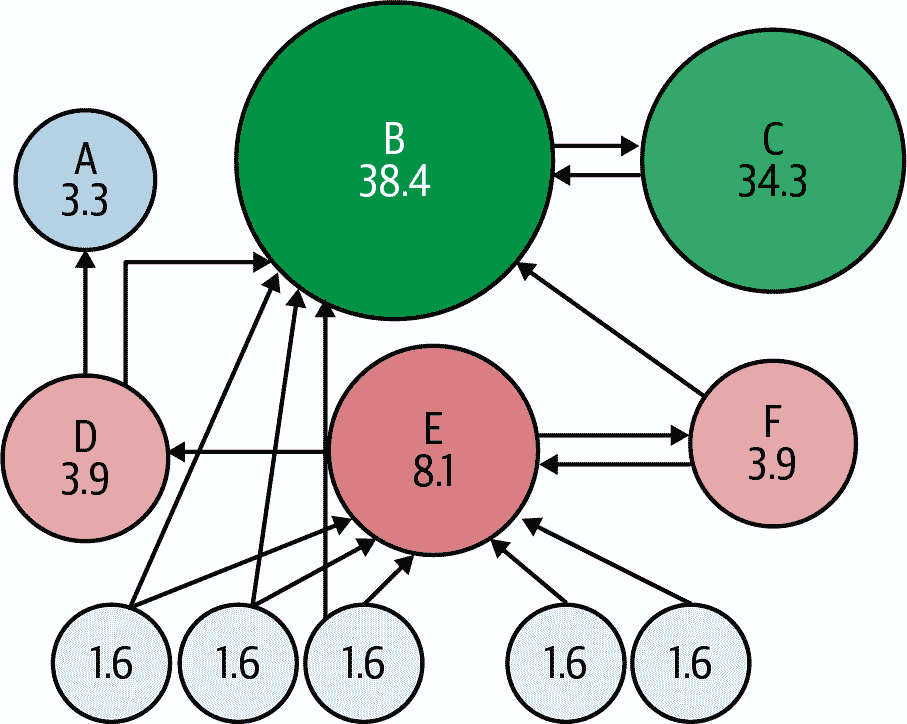
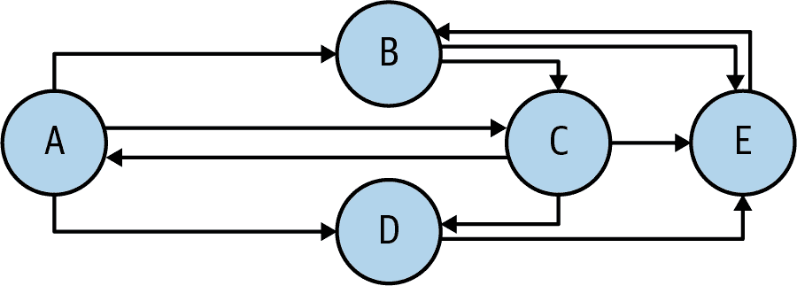

# 第八章：排名算法

本章介绍以下两种排名算法，并在 PySpark 中提供它们的相关实现：

排名产品

此算法在所有项目（如基因）中查找排名。它最初是为检测复制的微阵列实验中不同表达基因而开发的，但目前已被广泛接受，并且现在更广泛地用于包括机器学习在内的多个领域。Spark 不提供排名产品的 API，因此我将提供一个定制的解决方案。

PageRank

PageRank 是一种用于衡量给定图中节点重要性的迭代算法。这个算法被搜索引擎（如 Google）广泛使用，以找出每个网页（文档）相对于所有网页（一组文档）的重要性。简而言之，给定一组网页，PageRank 算法计算每个页面的质量排名。Spark API 为 PageRank 算法提供了多种解决方案。我将介绍其中一种，使用 GraphFrames API，以及两种定制解决方案。

# 排名产品

排名产品是生物信息学领域常用的算法，也称为计算生物学。最初开发为检测复制的微阵列实验中不同表达基因的生物学动机测试。除了表达谱分析外，它还可以用于其他应用领域中的排名列表组合，例如统计元分析和一般特征选择。在生物信息学和机器学习中，排名产品已经成为一种简单直观但功能强大的排名方法。

该算法不使用任何统计数据（如均值或方差），而是根据它们在多个比较中的排名对项目（如基因）进行评分。如果你只有非常少的复制品（在基因分析的背景下）或者想要分析两项研究结果的一致性，这一点尤为有用。

排名产品算法基于这样的假设：在零假设下，假设所有项目的顺序是随机的，找到特定项目在列表前*r*个中的概率(*p*)是：

<math alttext="dollar-sign p equals StartFraction r Over n EndFraction dollar-sign"><mrow><mi>p</mi> <mo>=</mo> <mfrac><mi>r</mi> <mi>n</mi></mfrac></mrow></math>

将这些概率相乘得到排名产品的定义：

<math alttext="dollar-sign upper R upper P equals left-parenthesis product Underscript i Endscripts StartFraction r Subscript i Baseline Over n Subscript i Baseline EndFraction right-parenthesis dollar-sign right-bracket"><mrow><mi>R</mi> <mi>P</mi> <mo>=</mo> <mo>(</mo> <munder><mo>∏</mo> <mi>i</mi></munder> <mfrac><msub><mi>r</mi> <mi>i</mi></msub> <msub><mi>n</mi> <mi>i</mi></msub></mfrac> <mo>)</mo></mrow></math>

其中*r[i]*是第*i*个列表中项目的排名，*n[i]*是第*i*个列表中项目的总数。*RP*值越小，观察到项目在列表顶部的位置不是偶然的概率越小。排名产品等同于计算几何平均排名；用总和替换乘积导致了稍微对异常数据更敏感的统计量（平均排名），并且更加看重各个列表中排名的一致性。

###### 注意

这是一个大数据问题吗？考虑 100 个研究，每个研究有 1,000,000 个测定，每个测定有 60,000 条记录。这转换为 100 × 1,000,000 × 60,000 = 6,000,000,000,000 条记录，这绝对是大数据。

## 计算排名产品

给定 *n* 个基因和 *k* 个重复试验，令 *e[g,i]* 为倍数变化，*r[g,i]* 为基因 *g* 在第 *i* 个重复试验中的排名。

通过几何平均计算排名产品（*RP*）：

<math alttext="dollar-sign upper R upper P left-parenthesis g right-parenthesis equals left-parenthesis product Underscript i equals 1 Overscript k Endscripts r Subscript g comma i Baseline right-parenthesis Superscript 1 slash k dollar-sign"><mrow><mi>R</mi> <mi>P</mi> <mrow><mo>(</mo> <mi>g</mi> <mo>)</mo></mrow> <mo>=</mo> <msup><mfenced separators="" open="(" close=")"><munderover><mo>∏</mo> <mrow><mi>i</mi><mo>=</mo><mn>1</mn></mrow> <mi>k</mi></munderover> <msub><mi>r</mi> <mrow><mi>g</mi><mo>,</mo><mi>i</mi></mrow></msub></mfenced> <mrow><mn>1</mn><mo>/</mo><mi>k</mi></mrow></msup></mrow></math>

或者

<math alttext="dollar-sign upper R upper P left-parenthesis g right-parenthesis equals RootIndex k StartRoot left-parenthesis product Underscript i equals 1 Overscript k Endscripts r Subscript g comma i Baseline right-parenthesis EndRoot dollar-sign"><mrow><mi>R</mi> <mi>P</mi> <mrow><mo>(</mo> <mi>g</mi> <mo>)</mo></mrow> <mo>=</mo> <mroot><mfenced separators="" open="(" close=")"><munderover><mo>∏</mo> <mrow><mi>i</mi><mo>=</mo><mn>1</mn></mrow> <mi>k</mi></munderover> <msub><mi>r</mi> <mrow><mi>g</mi><mo>,</mo><mi>i</mi></mrow></msub></mfenced> <mi>k</mi></mroot></mrow></math>

## 正式化排名产品

为了帮助您理解排名产品算法，我将提供一个具体的例子。让 `{A[1], …, A[k]}` 是（键，值）对数据集，其中每个数据集的键是唯一的。例如，键可以是一个物品，一个用户或一个基因，而值可以是出售的物品数量，该用户的朋友数量或基因值，如倍数变化或测试表达。根据（通常基于数据集的排序值）分配排名，并且根据所有数据集中键 `i` 的排名 `r[i]` 计算 `{A[1], …, A[k]}` 的排名产品。

让我们通过一个非常简单的例子来使用三个数据集 `A[1]`, `A[2]`, `A[3]`。假设数据集 `A[1]` 由以下（键，值）对组成：

```
A1 = { (K1, 30), (K2, 60), (K3, 10), (K4, 80) }
```

如果我们基于键的降序排序值分配排名，我们得到：

```
Rank(A1) = { (K1, 3), (K2, 2), (K3, 4), (K4, 1) }
```

因为 `80 > 60 > 30 > 10`。注意，1 是最高的排名（分配给最大的值）。然后我们为数据集 `A[2]` 做同样的操作，该数据集的内容如下：

```
A2 = { (K1, 90), (K2, 70), (K3, 40), (K4, 50) }
```

这给了我们：

```
Rank(A2) = { (K1, 1), (K2, 2), (K3, 4), (K4, 3) }
```

因为 `90 > 70 > 50 > 40`。最后，数据集 `A[3]` 如下所示：

```
A3 = { (K1, 4), (K2, 8) }
```

在这种情况下，分配排名会给我们带来：

```
Rank(A3) = { (K1, 2), (K2, 1) }
```

因为 `8 > 4`。然后 `{A[1], A[2], A[3]}` 的排名产品表示为：

<math alttext="dollar-sign left-parenthesis upper K 1 comma RootIndex 3 StartRoot 3 times 1 times 2 EndRoot right-parenthesis comma dollar-sign"><mrow><mo>(</mo> <msub><mi>K</mi> <mn>1</mn></msub> <mo>,</mo> <mroot><mrow><mn>3</mn><mo>×</mo><mn>1</mn><mo>×</mo><mn>2</mn></mrow> <mn>3</mn></mroot> <mo>)</mo> <mo>,</mo></mrow></math><math alttext="dollar-sign left-parenthesis upper K 2 comma RootIndex 3 StartRoot 2 times 2 times 1 EndRoot right-parenthesis comma dollar-sign"><mrow><mo>(</mo> <msub><mi>K</mi> <mn>2</mn></msub> <mo>,</mo> <mroot><mrow><mn>2</mn><mo>×</mo><mn>2</mn><mo>×</mo><mn>1</mn></mrow> <mn>3</mn></mroot> <mo>)</mo> <mo>,</mo></mrow></math><math alttext="dollar-sign left-parenthesis upper K 3 comma RootIndex 2 StartRoot 4 times 4 EndRoot right-parenthesis comma dollar-sign"><mrow><mo>(</mo> <msub><mi>K</mi> <mn>3</mn></msub> <mo>,</mo> <mroot><mrow><mn>4</mn><mo>×</mo><mn>4</mn></mrow> <mn>2</mn></mroot> <mo>)</mo> <mo>,</mo></mrow></math><math alttext="dollar-sign left-parenthesis upper K 4 comma RootIndex 2 StartRoot 1 times 3 EndRoot right-parenthesis dollar-sign"><mrow><mo>(</mo> <msub><mi>K</mi> <mn>4</mn></msub> <mo>,</mo> <mroot><mrow><mn>1</mn><mo>×</mo><mn>3</mn></mrow> <mn>2</mn></mroot> <mo>)</mo></mrow></math>

## 排名 产品 示例

现在让我们通过一个实际例子来演示使用排名产品：

+   让 `S = {S[1], S[2], …, S[k]}` 是一个包含 `k` 个研究的集合，其中 `k > 0`，每个研究代表一个微阵列实验。

+   让 `S[i] (i=1, 2, …, k)` 是一个研究，其中有一个由 `{A[i1], A[i2], …}` 标识的任意数量的检测。

+   让每个检测（可以表示为文本文件）是一个任意数量记录的集合，格式如下：

    ```
    <gene_id><,><gene_value_as_double_data_type>
    ```

+   让 `gene_id` 在 `{g[1], g[2], …, g[n]}` 中（我们有 `n` 个基因）。

要找到所有研究的排名积，首先我们找到每个基因每个研究的值的均值，然后对每个研究的基因按值排序并分配排名。例如，假设我们的第一项研究有三个检测，其值显示在表 8-1 中。

表 8-1\. 研究 1 的基因值

| 检测 1 | 检测 2 | 检测 3 |
| --- | --- | --- |
| `g1,1.0` | `g1,2.0` | `g1,12.0` |
| `g2,3.0` | `g2,5.0` | `null` |
| `g3,4.0` | `null` | `g3,2.0` |
| `g4,1.0` | `g4,3.0` | `g4,15.0` |

第一步是找到每个基因的平均值（每个研究）。这给了我们：

```
g1, 5.0
g2, 4.0
g3, 2.0
g4, 8.0
```

按值排序将产生以下结果：

```
g4, 8.0
g1, 5.0
g2, 4.0
g3, 2.0
```

接下来，我们为该研究中的每个基因分配一个排名，基于排序后的值。在这种情况下，结果将如下所示（最后一列是排名）：

```
g4, 8.0, 1
g1, 5.0, 2
g2, 4.0, 3
g3, 2.0, 4
```

我们重复这个过程，为所有研究找到每个基因的排名积（RP）。如果：

<math alttext="dollar-sign upper S 1 equals StartSet left-parenthesis g 1 comma r 11 right-parenthesis comma left-parenthesis g 2 comma r 12 right-parenthesis comma period period period EndSet dollar-sign"><mrow><msub><mi>S</mi> <mn>1</mn></msub> <mo>=</mo> <mrow><mo>{</mo> <mrow><mo>(</mo> <msub><mi>g</mi> <mn>1</mn></msub> <mo>,</mo> <msub><mi>r</mi> <mn>11</mn></msub> <mo>)</mo></mrow> <mo>,</mo> <mrow><mo>(</mo> <msub><mi>g</mi> <mn>2</mn></msub> <mo>,</mo> <msub><mi>r</mi> <mn>12</mn></msub> <mo>)</mo></mrow> <mo>,</mo> <mo>.</mo> <mo>.</mo> <mo>.</mo> <mo>}</mo></mrow></mrow></math><math alttext="dollar-sign upper S 2 equals StartSet left-parenthesis g 1 comma r 21 right-parenthesis comma left-parenthesis g 2 comma r 22 right-parenthesis comma period period period EndSet dollar-sign"><mrow><msub><mi>S</mi> <mn>2</mn></msub> <mo>=</mo> <mrow><mo>{</mo> <mrow><mo>(</mo> <msub><mi>g</mi> <mn>1</mn></msub> <mo>,</mo> <msub><mi>r</mi> <mn>21</mn></msub> <mo>)</mo></mrow> <mo>,</mo> <mrow><mo>(</mo> <msub><mi>g</mi> <mn>2</mn></msub> <mo>,</mo> <msub><mi>r</mi> <mn>22</mn></msub> <mo>)</mo></mrow> <mo>,</mo> <mo>.</mo> <mo>.</mo> <mo>.</mo> <mo>}</mo></mrow></mrow></math>

```
...
```

<math alttext="dollar-sign upper S Subscript k Baseline equals StartSet left-parenthesis g 1 comma r Subscript k Baseline 1 Baseline right-parenthesis comma left-parenthesis g 2 comma r Subscript k Baseline 2 Baseline right-parenthesis comma period period period EndSet dollar-sign"><mrow><msub><mi>S</mi> <mi>k</mi></msub> <mo>=</mo> <mrow><mo>{</mo> <mrow><mo>(</mo> <msub><mi>g</mi> <mn>1</mn></msub> <mo>,</mo> <msub><mi>r</mi> <mrow><mi>k</mi><mn>1</mn></mrow></msub> <mo>)</mo></mrow> <mo>,</mo> <mrow><mo>(</mo> <msub><mi>g</mi> <mn>2</mn></msub> <mo>,</mo> <msub><mi>r</mi> <mrow><mi>k</mi><mn>2</mn></mrow></msub> <mo>)</mo></mrow> <mo>,</mo> <mo>.</mo> <mo>.</mo> <mo>.</mo> <mo>}</mo></mrow></mrow></math>

然后，基因 *g[j]* 的排名积可以表示为：

<math alttext="dollar-sign upper R upper P left-parenthesis g Subscript j Baseline right-parenthesis equals left-parenthesis product Underscript i equals 1 Overscript k Endscripts r Subscript i comma j Baseline right-parenthesis Superscript 1 slash k dollar-sign"><mrow><mi>R</mi> <mi>P</mi> <mrow><mo>(</mo> <msub><mi>g</mi> <mi>j</mi></msub> <mo>)</mo></mrow> <mo>=</mo> <msup><mfenced separators="" open="(" close=")"><munderover><mo>∏</mo> <mrow><mi>i</mi><mo>=</mo><mn>1</mn></mrow> <mi>k</mi></munderover> <msub><mi>r</mi> <mrow><mi>i</mi><mo>,</mo><mi>j</mi></mrow></msub></mfenced> <mrow><mn>1</mn><mo>/</mo><mi>k</mi></mrow></msup></mrow></math>

或：

<math alttext="dollar-sign upper R upper P left-parenthesis g Subscript j Baseline right-parenthesis equals RootIndex k StartRoot left-parenthesis product Underscript i equals 1 Overscript k Endscripts r Subscript i comma j Baseline right-parenthesis EndRoot dollar-sign"><mrow><mi>R</mi> <mi>P</mi> <mrow><mo>(</mo> <msub><mi>g</mi> <mi>j</mi></msub> <mo>)</mo></mrow> <mo>=</mo> <mroot><mfenced separators="" open="(" close=")"><munderover><mo>∏</mo> <mrow><mi>i</mi><mo>=</mo><mn>1</mn></mrow> <mi>k</mi></munderover> <msub><mi>r</mi> <mrow><mi>i</mi><mo>,</mo><mi>j</mi></mrow></msub></mfenced> <mi>k</mi></mroot></mrow></math>

现在，让我们深入研究一个使用 PySpark 的解决方案。

## PySpark 解决方案

如前所述，Spark 并没有提供排名积算法的 API，因此我开发了自己的解决方案。

###### 注意

一部分展示了使用 Java API for Spark 解决排名积问题的网络直播，可以在[O’Reilly 网站](https://oreil.ly/clYwx)上找到，相关的 Java Spark 代码在[GitHub](https://oreil.ly/pPmOX)上找到。

此处介绍的 PySpark 解决方案将接受`K`个输入路径（继续使用前面的示例，每个路径代表一个研究，可以有任意数量的测定文件）。在高层次上，以下是我们将用来查找在这些研究中出现的每个基因的排名产品的步骤：

1.  找到每项研究中每个基因的平均值（在某些情况下，您可能更喜欢应用其他函数来找到中位数）。我们将使用 COPA 分数作为我们的值。¹

1.  根据每项研究中的值对基因进行排序，然后分配排名值（排名值将是`{1, 2, …, *N*}`，其中`1`分配给最高值，*`N`*分配给最低值）。

1.  最后，计算所有研究的每个基因的排名产品。这可以通过按键分组所有排名来完成。

要实现最终步骤，我们可以使用`RDD.groupByKey()`或`RDD.combineByKey()`。这两种解决方案都在[GitHub](https://oreil.ly/SFfH3)上可用，标记为*rank_product_using_groupbykey.py*和*rank_product_using_combinebykey.py*。

请注意，使用`combineByKey()`的 PySpark 解决方案比使用`groupByKey()`解决方案更有效。如第四章中讨论的，这是因为`combineByKey()`中间值在发送给最终减少之前由本地工作人员减少（或合并），而使用`groupByKey()`则没有本地减少；所有值都发送到一个位置进行进一步处理。我只会在这里详细介绍使用`combineByKey()`的解决方案。

### 输入数据格式

每个测定（可以表示为文本文件）是以下格式中任意数量记录的集合：

```
<gene_id><,><gene_value_as_double_data_type>
```

其中`gene_id`是一个关键字，具有类型为`Double`的相关值。

为了演示目的，其中`K=3`（研究数量），我将使用以下示例输入：

```
$ cat /tmp/rankproduct/input/rp1.txt
K_1,30.0
K_2,60.0
K_3,10.0
K_4,80.0

$ cat /tmp/rankproduct/input/rp2.txt
K_1,90.0
K_2,70.0
K_3,40.0
K_4,50.0

$ cat /tmp/rankproduct/input/rp3.txt
K_1,4.0
K_2,8.0
```

### 输出数据格式

我们将以以下格式生成输出：

```
<gene_id><,><R><,><N>
```

这里的*`<R>`*是所有输入数据集中的排名产品，*`<N>`*是参与计算排名产品的值的数量。

### 使用`combineByKey()`计算排名产品解决方案

完整的解决方案在程序*rank_product_using_combinebykey.py*中展示。它需要以下输入/输出参数：

```
# define input/output parameters:
#    sys.argv[1] = output path
#    sys.argv[2] = number of studies (K)
#    sys.argv[3] =   input path for study 1
#    sys.argv[4] =   input path for study 2
#    ...
#    sys.argv[K+2] = input path for study K
```

要实现使用`combineByKey()`转换的 PySpark 排名产品问题的解决方案，我使用了以下驱动程序，该程序调用了几个 Python 函数：

```
# Create an instance of SparkSession
spark = SparkSession.builder.getOrCreate()

# Handle input parameters
output_path = sys.argv[1]

# K = number of studies to process
K = int(sys.argv[2])

# Define studies_input_path
studies_input_path = [sys.argv[i+3] for i in range(K)]

# Step 1: Compute the mean per gene per study
means = [compute_mean(studies_input_path[i]) for i in range(K)]

# Step 2: Compute the rank of each gene per study
ranks = [assign_rank(means[i]) for i in range(K)]

# Step 3: Calculate the rank product for each gene
# rank_products: RDD[(gene_id, (ranked_product, N))]
rank_products = compute_rank_products(ranks)

# Step 4: Save the result
rank_products.saveAsTextFile(output_path)
```

让我们更详细地看看三个主要步骤。

#### 第 1 步：计算每项研究中每个基因的平均值

要找到数据集的排名产品，我们首先需要找到每个基因在每项研究中的平均值。这可以通过`compute_mean()`函数完成。使用`combineByKey()`转换来计算键（`gene_id`）的值的平均值，我们可以创建一个组合数据类型`(Double, Integer)`，表示`(值的总和，值的数量)`。最后，为了找到平均值，我们将`值的总和`除以`值的数量`：

```
# Compute mean per gene for a single study = set of assays
# @param input_Path set of assay paths separated by ","
# @RETURN RDD[(String, Double)]
def compute_mean(input_path):
   # genes as string records: RDD[String]
   raw_genes = spark.sparkContext.textFile(input_path)

   # create RDD[(String, Double)]=RDD[(gene_id, test_expression)]
   genes = raw_genes.map(create_pair)

   # create RDD[(gene_id, (sum, count))]
   genes_combined = genes.combineByKey(
       lambda v: (v, 1), # createCombiner
       lambda C, v: (C[0]+v, C[1]+1), # addAndCount
       lambda C, D: (C[0]+D[0], C[1]+D[1]) # mergeCombiners
   )

   # now compute the mean per gene
   genes_mean = genes_combined.mapValues(lambda p: float(p[0])/float(p[1]))
   return genes_mean
#end-def
```

#### 第 2 步：计算每项研究中每个基因的排名

要计算每个`gene_id`的排名，我们执行以下三个子步骤： . 根据 COPA 分数的绝对值排序值。为了按 COPA 分数排序，我们将键与值交换，然后按键排序。 . 为每个基因分配从 1（具有最高 COPA 分数的基因）到*`n`*（具有最低 COPA 分数的基因）的排名。 . 使用`Math.power(R[1] * R[2] * … * R[n], 1/n)`计算每个`gene_id`的排名。

该整个步骤由`assign_rank()`函数完成。通过使用`RDD.zipWithIndex()`为排名分配排名，该函数将此 RDD 与其元素索引进行压缩（这些索引将是排名）。Spark 索引从 0 开始，因此在计算排名乘积时我们加 1：

```
# @param rdd : RDD[(String, Double)]: (gene_id, mean)
# @returns: RDD[(String, Long)]: (gene_id, rank)
def assign_rank(rdd):
    # Swap key and value (will be used for sorting by key)
    # Convert value to abs(value)
    swapped_rdd = rdd.map(lambda v: (abs(v[1]), v[0]))

    # Sort COPA scores in descending order. We need 1 partition so
    # that we can zip numbers into this RDD with zipWithIndex().
    # If we do not use 1 partition, then indexes will be meaningless.
    # sorted_rdd : RDD[(Double,String)]
    sorted_rdd = swapped_rdd.sortByKey(False, 1)

    # Use zipWithIndex(). Zip values will be 0, 1, 2, ...
    # but for ranking we need 1, 2, 3, .... Therefore,
    # we will add 1 when calculating the rank product.
    # indexed:  RDD[((Double,String), Long)]
    indexed = sorted_rdd.zipWithIndex()

    # add 1 to index to start with 1 rather than 0
    # ranked:  RDD[(String, Long)]
    ranked = indexed.map(lambda v: (v[0][1], v[1]+1))
    return ranked
#end-def
```

#### 第 3 步：计算每个基因的排名乘积

最后，我们调用`compute_rank_products()`来计算每个基因的排名乘积，该方法将所有排名组合成一个 RDD，然后使用`combineByKey()`转换来计算每个基因的排名乘积：

```
# return RDD[(String, (Double, Integer))] = (gene_id, (ranked_product, N))
# where N is the number of elements for computing the rank product
# @param ranks: array of RDD[(String, Long)]
def compute_rank_products(ranks):
        # combine all ranks into one
        union_rdd = spark.sparkContext.union(ranks)

        # next, find unique keys with their associated COPA scores
        # we need 3 basic function to be able to use combinebyKey()
        # combined_by_gene: RDD[(String, (Double, Integer))]
        combined_by_gene = union_rdd.combineByKey(
             lambda v: (v, 1), # createCombiner as C
             lambda C, v: (C[0]*v, C[1]+1), # multiplyAndCount
             lambda C, D: (C[0]*D[0], C[1]+D[1]) # mergeCombiners
		)

        # next calculate rank products and the number of elements
        rank_products = combined_by_gene.mapValues(
           lambda v : (pow(float(v[0]), float(v[1])), v[1])
        )

        return rank_products
#end-def
```

让我们通过使用`combineByKey()`进行一个示例运行：

```
INPUT1=/tmp/rankproduct/input/rp1.txt
INPUT2=/tmp/rankproduct/input/rp2.txt
INPUT3=/tmp/rankproduct/input/rp3.txt
OUTPUT=/tmp/rankproduct/output
PROG=rank_product_using_combinebykey.py
./bin/spark-submit $PROG $OUTPUT 3 $INPUT1 $INPUT2 $INPUT3

output_path=/tmp/rankproduct/output
K=3
studies_input_path ['/tmp/rankproduct/input/rp1.txt',
'/tmp/rankproduct/input/rp2.txt',
'/tmp/rankproduct/input/rp3.txt']
input_path /tmp/rankproduct/input/rp1.txt
raw_genes ['K_1,30.0', 'K_2,60.0', 'K_3,10.0', 'K_4,80.0']
genes [('K_1', 30.0), ('K_2', 60.0), ('K_3', 10.0), ('K_4', 80.0)]
genes_combined [('K_2', (60.0, 1)), ('K_3', (10.0, 1)),
                ('K_1', (30.0, 1)), ('K_4', (80.0, 1))]
input_path /tmp/rankproduct/input/rp2.txt
raw_genes ['K_1,90.0', 'K_2,70.0', 'K_3,40.0', 'K_4,50.0']
genes [('K_1', 90.0), ('K_2', 70.0), ('K_3', 40.0), ('K_4', 50.0)]
genes_combined [('K_2', (70.0, 1)), ('K_3', (40.0, 1)),
                ('K_1', (90.0, 1)), ('K_4', (50.0, 1))]
input_path /tmp/rankproduct/input/rp3.txt
raw_genes ['K_1,4.0', 'K_2,8.0']
genes [('K_1', 4.0), ('K_2', 8.0)]
genes_combined [('K_2', (8.0, 1)), ('K_1', (4.0, 1))]
sorted_rdd [(80.0, 'K_4'), (60.0, 'K_2'), (30.0, 'K_1'), (10.0, 'K_3')]
indexed [((80.0, 'K_4'), 0), ((60.0, 'K_2'), 1),
         ((30.0, 'K_1'), 2), ((10.0, 'K_3'), 3)]
ranked [('K_4', 1), ('K_2', 2), ('K_1', 3), ('K_3', 4)]
sorted_rdd [(90.0, 'K_1'), (70.0, 'K_2'), (50.0, 'K_4'), (40.0, 'K_3')]
indexed [((90.0, 'K_1'), 0), ((70.0, 'K_2'), 1),
         ((50.0, 'K_4'), 2), ((40.0, 'K_3'), 3)]
ranked [('K_1', 1), ('K_2', 2), ('K_4', 3), ('K_3', 4)]
sorted_rdd [(8.0, 'K_2'), (4.0, 'K_1')]
indexed [((8.0, 'K_2'), 0), ((4.0, 'K_1'), 1)]
ranked [('K_2', 1), ('K_1', 2)]
```

这是每个键的最终输出：

```
$ cat /rankproduct/output/part*
(K_2,(1.5874010519681994, 3))
(K_1,(1.8171205928321397, 3))
(K_4,(1.7320508075688772, 2))
(K_3,(4.0, 2))
```

### 使用`groupByKey()`进行排名乘积解决方案

GitHub 上提供了一个使用`groupByKey()`转换而不是`combineByKey()`的排名乘积解决方案，命名为*rank_product_using_groupbykey.py*。总体来说，由于这两种转换实现了 shuffle 步骤的方式不同，`combineByKey()`解决方案更具可扩展性：`combineByKey()`尽可能使用组合器，但`groupByKey()`将所有值传输到一个位置，然后应用所需的算法。

# PageRank

在本节中，我们将注意力转向另一个排名算法：PageRank。该算法使 Google 脱颖而出，成为其他搜索引擎的重要组成部分，至今仍不可或缺，因为它允许它们确定用户可能希望查看的页面，从而确定页面与其他页面的相关性或重要性。PageRank 算法的扩展也用于打击垃圾邮件。

###### 注意

有关 PageRank 如何在底层工作的详细信息（或者至少是以前的工作方式），请参阅 Ian Rogers 的文章[“理解 Google Page Rank”](https://oreil.ly/9DDEn)。

PageRank 算法衡量图中每个节点的重要性（例如互联网上的网页），假设从节点`u`到节点`v`的边表示`u`对`v`重要性的认可。其主要前提是，如果其他重要节点指向某节点，则该节点重要。例如，如果一个 Twitter 用户被许多其他用户关注，特别是那些拥有大量粉丝的用户，则该用户的排名将很高。任何希望提高其网站搜索引擎排名的网页设计师都应该花时间充分理解 PageRank 的工作原理。（请注意，PageRank 纯粹是一种链接分析算法，与页面的语言、内容或大小无关。）

图 8-1 说明了使用简单图表示一组链接文档的 PageRank 概念。



###### 图 8-1\. PageRank 示例

请注意，页面 C 的 PageRank 比页面 E 高，即使 C 的链接较少；这是因为指向 C 的一个链接来自非常重要的页面 B（因此具有高价值）。没有阻尼的话，所有的网络冲浪者最终都会进入页面 B 或 C（因为它们具有最高的 PageRank 分数），而所有其他页面的 PageRank 分数接近零。

PageRank 算法是一种迭代且收敛的算法。它从第一步开始，将一些初始 PageRank（作为`Double`数据类型）分配给所有页面，然后迭代应用该算法，直到到达称为收敛点的稳定状态。这是一个页面已分配了 PageRank，并且算法的后续迭代将在分布中产生很少或没有进一步的变化的点（您可以为此指定阈值）。

让我们看看算法是如何定义的。在这里，我们假设页面 A 被页面{*T*[1]，…，*T*[n]}所指向（引用）。然后，页面`A`的 PageRank（*PR*）定义如下：

<math alttext="dollar-sign upper P upper R left-parenthesis upper A right-parenthesis equals left-parenthesis 1 minus d right-parenthesis plus d times left-bracket StartFraction upper P upper R left-parenthesis upper T 1 right-parenthesis Over upper L left-parenthesis upper T 1 right-parenthesis EndFraction plus period period period plus StartFraction upper P upper R left-parenthesis upper T Subscript n Baseline right-parenthesis Over upper L left-parenthesis upper T Subscript n Baseline right-parenthesis EndFraction right-bracket dollar-sign"><mrow><mi>P</mi> <mi>R</mi> <mrow><mo>(</mo> <mi>A</mi> <mo>)</mo></mrow> <mo>=</mo> <mrow><mo>(</mo> <mn>1</mn> <mo>-</mo> <mi>d</mi> <mo>)</mo></mrow> <mo>+</mo> <mi>d</mi> <mo>×</mo> <mfenced separators="" open="[" close="]"><mstyle scriptlevel="0" displaystyle="true"><mfrac><mrow><mi>P</mi><mi>R</mi><mo>(</mo><msub><mi>T</mi> <mn>1</mn></msub> <mo>)</mo></mrow> <mrow><mi>L</mi><mo>(</mo><msub><mi>T</mi> <mn>1</mn></msub> <mo>)</mo></mrow></mfrac></mstyle> <mo>+</mo> <mo>.</mo> <mo>.</mo> <mo>.</mo> <mo>+</mo> <mstyle scriptlevel="0" displaystyle="true"><mfrac><mrow><mi>P</mi><mi>R</mi><mo>(</mo><msub><mi>T</mi> <mi>n</mi></msub> <mo>)</mo></mrow> <mrow><mi>L</mi><mo>(</mo><msub><mi>T</mi> <mi>n</mi></msub> <mo>)</mo></mrow></mfrac></mstyle></mfenced></mrow></math>

其中*d*是可以设置在 0 和 1 之间的阻尼因子（通常值为 0.85），*PR*(*T[i]*)是链接到页面 A 的页面*T[i]*的 PageRank，*L*(*T[i]*)是页面*T[i]*上的出站链接数。注意，PageRanks 形成对网页的概率分布，因此所有网页的 PageRanks 之和将为 1。

###### 注

为什么添加阻尼因子？PageRank 基于随机冲浪者模型。本质上，阻尼因子是一个衰减因子。它表示用户停止点击链接并请求另一个随机页面的机会（例如，直接键入新的 URL 而不是跟随当前页面上的链接）。阻尼因子为 0.85 表示我们假设典型用户不会在页面上跟随任何链接的概率约为 15%，而是会导航到一个新的随机 URL。

给定具有传入和传出链接的网页图，PageRank 算法可以告诉我们每个节点的重要性或相关性。每个页面的 PageRank 取决于指向它的页面的 PageRank。简而言之，PageRank 是所有其他网页关于一个页面重要性的“投票”。

## PageRank 的迭代计算

给定一组*N*个网页，PageRank 可以通过迭代或代数方法计算。迭代方法可以定义如下：

1.  在（`t = 0`）时，假定一个初始概率分布通常是：

    <math alttext="dollar-sign upper P upper R left-parenthesis p Subscript i Baseline comma 0 right-parenthesis equals StartFraction 1 Over upper N EndFraction dollar-sign"><mrow><mi>P</mi> <mi>R</mi> <mrow><mo>(</mo> <msub><mi>p</mi> <mi>i</mi></msub> <mo>,</mo> <mn>0</mn> <mo>)</mo></mrow> <mo>=</mo> <mstyle scriptlevel="0" displaystyle="true"><mfrac><mn>1</mn> <mi>N</mi></mfrac></mstyle></mrow></math>

1.  在每个时间步骤，如上所述的计算结果如下：

    <math alttext="upper P upper R left-parenthesis p Subscript i Baseline comma t plus 1 right-parenthesis equals StartFraction 1 minus d Over upper N EndFraction plus d sigma-summation Underscript p Subscript j Baseline element-of upper B Subscript p Sub Subscript i Baseline Endscripts StartFraction upper P upper R left-parenthesis p Subscript j Baseline comma t right-parenthesis Over upper L left-parenthesis p Subscript j Baseline right-parenthesis EndFraction" display="block"><mrow><mi>P</mi> <mi>R</mi> <mrow><mo>(</mo> <msub><mi>p</mi> <mi>i</mi></msub> <mo>,</mo> <mi>t</mi> <mo>+</mo> <mn>1</mn> <mo>)</mo></mrow> <mo>=</mo> <mstyle scriptlevel="0" displaystyle="true"><mfrac><mrow><mn>1</mn><mo>-</mo><mi>d</mi></mrow> <mi>N</mi></mfrac></mstyle> <mo>+</mo> <mi>d</mi> <munder><mo>∑</mo> <mrow><msub><mi>p</mi> <mi>j</mi></msub> <mo>∈</mo><msub><mi>B</mi> <msub><mi>p</mi> <mi>i</mi></msub></msub></mrow></munder> <mstyle scriptlevel="0" displaystyle="true"><mfrac><mrow><mi>P</mi><mi>R</mi><mo>(</mo><msub><mi>p</mi> <mi>j</mi></msub> <mo>,</mo><mi>t</mi><mo>)</mo></mrow> <mrow><mi>L</mi><mo>(</mo><msub><mi>p</mi> <mi>j</mi></msub> <mo>)</mo></mrow></mfrac></mstyle></mrow></math>

据信 Google（以及其他搜索引擎）在每次爬网并重建其搜索索引时会重新计算 PageRank 分数。随着收藏中文档数量的增加，对所有文档的 PageRank 的初始近似精度会降低。因此，PageRank 算法通过入站链接的数量和质量对网站进行排名。入站链接的质量定义为提供链接的站点的 PageRank 函数。

###### 注意

请注意，这只是对原始 PageRank 算法的极其简化的描述。Google（以及其他使用类似 PageRank 算法的公司）考虑许多其他因素，如关键词密度、流量、域名年龄等，以计算网页的 PageRank。

接下来，我将向您展示如何计算 PageRank。假设我们有以下简单的图：

```
$ cat simple_graph.txt
A B
B A
A D
D A
```

设定`d = 0.85`，我们可以写成：

```
PR(A) = (1-d) + d (PR(B)/L(B) + PR(D)/L(D))
PR(B) = (1-d) + d (PR(A)/L(A))
PR(D) = (1-d) + d (PR(A)/L(A))
```

where:

```
L(A) = 2
L(B) = 1
L(D) = 1
```

要逐步计算这些`PR()`，我们需要初始化`PR(A)`、`PR(B)`、`PR(D)`。我们将它们全部初始化为`1.0`，然后迭代计算`PR(A)`、`PR(B)`、`PR(D)`，直到这些值不再改变（即收敛）。结果显示在表 8-2 中。

表 8-2\. 初始值为 1.00 的 PageRank 迭代

| 迭代次数 | PR(A) | PR(B) | PR(D) |
| --- | --- | --- | --- |
| 0 | 1.0000 | 1.0000 | 1.0000 |
| 1 | 1.8500 | 0.9362 | 0.9362 |
| … | … | … | … |
| 99 | 1.4595 | 0.7703 | 0.7703 |
| 100 | 1.4595 | 0.7703 | 0.7703 |

请注意，无论您使用什么作为初始值，PageRank 算法都会收敛，并且您将获得期望的结果。表 8-3 显示了使用初始值 40.00 的结果。

表 8-3\. 初始值为 40.00 的 PageRank 迭代

| 迭代次数 | PR(A) | PR(B) | PR(D) |
| --- | --- | --- | --- |
| 0 | 40.0000 | 40.0000 | 40.0000 |
| 1 | 68.1500 | 29.1138 | 29.1137 |
| … | … | … | … |
| 99 | 1.4595 | 0.7703 | 0.7703 |
| 100 | 1.4595 | 0.7703 | 0.7703 |

在这两种情况下，100 次迭代后的结果是相同的：

```
PR(A) = 1.4595
PR(B) = 0.7703
PR(D) = 0.7703
```

正如您在第六章中看到的那样，Spark 提供了通过 GraphX 和 GraphFrames 库实现 PageRank 算法的 API。为了帮助您理解算法的工作原理，我将介绍几种在 PySpark 中实现的自定义 PageRank 解决方案。

## 使用 RDDs 在 PySpark 中进行自定义 PageRank

我将从提供一个简单的自定义解决方案开始，使用 PySpark。完整的程序和示例输入数据可在本书的 GitHub 存储库中找到，文件为*pagerank.py*和*pagerank_data.txt*。

该解决方案使用 Spark RDDs 实现 PageRank 算法。它不使用 GraphX 或 GraphFrames，但稍后我会展示一个 GraphFrames 的例子。

### 输入数据格式

假设我们的输入具有以下语法：

```
<source-URL-ID><,><neighbor-URL-ID>
```

### 输出数据格式

PageRank 算法的目标是生成以下形式的输出：

```
<URL-ID> <page-rank-value>
```

如果算法运行 15 次迭代，结果将如下所示：

```
$ spark-submit pagerank.py pagerank_data.txt 15
1 has rank: 0.86013842528.
3 has rank: 0.33174213968.
2 has rank: 0.33174213968.
5 has rank: 0.473769824736.
4 has rank: 0.33174213968.
```

### PySpark 解决方案

我们的自定义解决方案涉及以下步骤：

1.  读取输入路径和迭代次数：

    ```
    input_path = sys.argv[1]
    num_of_iterations = int(sys.argv[2])
    ```

1.  创建`SparkSession`的实例：

    ```
    spark = SparkSession.builder.getOrCreate()
    ```

1.  从输入路径创建一个`RDD[String]`：

    ```
    records = spark.sparkContext.textFile(input_path)
    ```

1.  从输入文件加载所有 URL 并初始化它们的相邻节点：

    ```
    def create_pair(record_of_urls):
        # record_of_urls = "<source-URL><,><neighbor-URL>"
        tokens = record_of_urls.split(",")
        source_URL = tokens[0]
        neighbor_URL = tokens[1]
        return (source_URL, neighbor_URL)
    #end-def

    links = records.map(lambda rec: create_pair(rec)) 
                   .distinct() 
                   .groupByKey() 
                   .cache() 
    ```

    

    创建一对`（source_URL，neighbor_URL）`。

    

    确保没有重复的对。

    

    查找所有相邻的 URL。

    

    缓存结果，因为在迭代中会多次使用它。

1.  将 URL 相邻节点转换为 1.0 的排名：

    ```
    ranks = links.map(lambda url_neighbors: (url_neighbors[0], 1.0)) 
    ```

    

    `ranks` 是一个`RDD[(String, Float)]`。

1.  计算并迭代更新 URL 排名。要执行此步骤，我们需要两个基本函数：

    ```
    def recalculate_rank(rank):
        new_rank = (rank * 0.85) + 0.15
        return new_rank
    #end-def

    def compute_contributions(urls_rank):
        # calculates URL contributions
        # to the ranks of other URLs
        urls = urls_rank[1][0]
        rank = urls_rank[1][1]

        num_urls = len(urls)
        for url in urls:
            yield (url, rank / num_urls)
    #end-def
    ```

    现在，让我们执行迭代：

    ```
    for iteration in range(num_of_iterations):
        # calculates URL contributions
        # to the ranks of other URLs
        contributions = links
           .join(ranks) 
           .flatMap(compute_contributions)

        # recalculates URL ranks based
        # on neighbor contributions
        ranks = contributions.reduceByKey(lambda x,y : x+y)
                             .mapValues(recalculate_rank)
    #end-for
    ```

    

    请注意，`links.join(ranks)` 将创建形如`[(URL_ID，（ResultIterable，<rank-as-float>）)，…]`的元素。

1.  收集所有 URL 的 PageRank 值并将其转储到控制台：

    ```
    for (link, rank) in ranks.collect():
        print("%s has rank: %s." % (link, rank))
    ```

### 示例输出

为 20 次迭代提供了示例输出。你可以观察 PageRank 算法在更高的迭代中的收敛（迭代次数为 16 到 20）：

```
iteration/node   1      2      3      4      5
0             1.00   1.00   1.00   1.00   null
1             2.27   0.36   0.36   0.36   0.79
2             0.92   0.63   0.63   0.63   0.79
...
19            0.86   0.33   0.33   0.33   0.47
20            0.85   0.33   0.33   0.33   0.47
```

## 使用 PySpark 在邻接矩阵中自定义 PageRank

本节介绍了另一种使用邻接矩阵作为输入的 PageRank 算法的自定义解决方案。邻接矩阵是用于表示有限图的矩阵。矩阵的元素指示图中是否相邻的节点。例如，如果节点`A`链接到其他三个节点（比如`B`、`C`和`D`），那么它的邻接矩阵行如下所示：

```
A B C D
```

假设我们有如下图所示的图图 8-2。



###### 图 8-2。具有五个节点的简单有向图

此图的邻接矩阵如下（每行中的第一个项目是源节点，其他项目是目标节点）：

```
A B C D
B C E
C A D E
D E
E B
```

对图或矩阵进行视觉检查建议`E`是一个重要节点，因为它被许多其他节点引用。因此，我们预计节点`E`的 PageRank 值将高于其他节点。

此解决方案再次使用 Spark RDD 来实现 PageRank 算法，并不使用 GraphX 或 GraphFrames。完整的程序和示例输入数据可在本书的 GitHub 存储库中的文件*pagerank_2.py*和*pagerank_data_2.txt*中找到。

### 输入数据格式

我们假设我们的输入具有以下语法，其中`S`是一个空格：

```
<source-node><S><target-node-1><S><target-node-2><S>...

where S is a single space
```

### 输出数据格式

PageRank 算法的目标是生成如下形式的输出：

```
<node> <page-rank-value>
```

### PySpark 解决方案

我们的第二个 PySpark 解决方案包括三个主要步骤：

1.  映射：对于每个节点 `i`，计算要分配给每个出链的值（排名 / 邻居节点数），并传播到相邻节点。

1.  减少：对于每个节点 `i`，计算即将到来的投票/值的总和并更新排名 `(R[i])`。

1.  迭代：重复直到值收敛（稳定或在定义的边界内）。

这里呈现了完整的 PySpark 解决方案。首先，我们导入所需的库并读取输入参数：

```
from __future__ import print_function
import sys
from pyspark.sql import SparkSession

# Define your input path
input_path = sys.argv[1]
print("input_path: ", input_path)
# input_path:  pagerank_data_2.txt

# Define number of iterations
ITERATIONS = int(sys.argv[2])
print("ITERATIONS: ", ITERATIONS)
# ITERATIONS:  40
```

接下来，我们读取矩阵并创建 `(K, V)` 对，其中 `K` 是源节点，`V` 是目标节点的列表：

```
# Create an instance of SparkSession
spark = SparkSession.builder.getOrCreate()

# Read adjacency list and create RDD[String]
matrix = spark.sparkContext.textFile(input_path)
print("matrix=", matrix.collect())
# matrix= ['A B C D', 'B C E', 'C A D E', 'D E', 'E B']
# x = "A B C"
# returns (A, [B, C])
def create_pair(x):
  tokens = x.split(" ")
  # tokens[0]: source node
  # tokens[1:]: target nodes (links from the source node)
  return (tokens[0], tokens[1:])
#end-def

# create links from source node to target nodes
links = matrix.map(create_pair)
print("links=", links.collect())
# links= [('A', ['B', 'C', 'D']),
#         ('B', ['C', 'E']),
#         ('C', ['A', 'D', 'E']),
#         ('D', ['E']),
#         ('E', ['B'])]
```

我们计数节点并初始化每个节点的排名为 `1.0`：

```
# Find node count
N = links.count()
print("node count N=", N)
# node count N=5

# Create and initialize the ranks
ranks = links.map(lambda node: (node[0], 1.0/N))
print("ranks=", ranks.collect())
# ranks= [('A', 0.2), ('B', 0.2), ('C', 0.2), ('D', 0.2), ('E', 0.2)]
```

然后，我们实现了 PageRank 算法的三个步骤：

```
for i in range(ITERATIONS):
  # Join graph info with rank info, propagate rank scores
  # to all neighbors (rank/(number of neighbors),
  # and add up ranks from all incoming edges
  ranks = links.join(ranks)\
    .flatMap(lambda x : [(i, float(x[1][1])/len(x[1][0])) for i in x[1][0]])\
    .reduceByKey(lambda x,y: x+y)
  print(ranks.sortByKey().collect())
```

这里给出了部分输出：

```
[('A', 0.0667), ('B', 0.2667), ('C', 0.1667), ('D', 0.1334), ('E', 0.3667)]
[('A', 0.0556), ('B', 0.3889), ('C', 0.1556), ('D', 0.0778), ('E', 0.3223)]
...
[('A', 0.0638), ('B', 0.3404), ('C', 0.1915), ('D', 0.0851), ('E', 0.3191)]
[('A', 0.0638), ('B', 0.3404), ('C', 0.1915), ('D', 0.0851), ('E', 0.3191)]
```

PageRank 算法表明节点 `E` 是最重要的节点，因为其页面排名（`0.3191`）最高。我们还观察到，由于页面排名形成概率分布，所有节点的值的总和为 `1`：

```
PR(A) + PR(B) + PR(C) + PR(D) + PR(E) =
0.0638 + 0.3404 + 0.1915 + 0.0851 + 0.3191 =
0.9999
```

结束本节，我将快速通过一个使用 GraphFrames 的示例进行说明。

## 使用 GraphFrames 的 PageRank

下面的 PySpark 示例展示了如何使用 GraphFrames 包找到图的 PageRank，该包在 第六章 中介绍。有至少两种计算给定图的页面排名的方法：

### 容差

指定在收敛时允许的容差（请注意，较小的容差会导致 PageRank 结果的更高精度）：

```
# build graph as a GraphFrame instance
graph = GraphFrame(vertices, edges)
#
# NOTE: You cannot specify maxIter()
# and tol() at the same time.
# damping factor = 1 - 0.15 = 0.85
# tol = the tolerance allowed at convergence
# (smaller => more accurate)
# pagerank is computed as a GraphFrame:
pagerank = graph
             .pageRank()
             .resetProbability(0.15)
             .tol(0.0001)
             .run()
```

### 最大迭代次数

指定算法可运行的最大迭代次数（迭代次数越多，精度越高）：

```
# build graph as a GraphFrame instance
graph = GraphFrame(vertices, edges)
# NOTE: You cannot specify maxIter()
# and tol() at the same time.
# damping factor = 1 - 0.15 = 0.85
# maxIter = the max. number of iterations
# (higher => more accurate)
# pagerank is computed as a GraphFrame:
pagerank = graph
            .pageRank()
            .resetProbability(0.15)
            .maxIter(30)
            .run()
```

# 摘要

总结：

+   我们涵盖了两种排名算法，排名乘积（主要用于基因分析）和 PageRank（主要用于搜索引擎算法）。

+   Spark 不提供排名乘积的 API，但我提供了一个自定义的 PySpark 解决方案。

+   Spark 能够处理记录级算法以及图算法——除了使用 GraphFrames API 外，还提出了两种自定义的 PySpark 实现 PageRank 的方法。

在接下来的章节中，我们将关注一些实际的基础数据设计模式。

¹ 癌症异常基因剖析（COPA）是一种在基因分析中使用的异常检测方法。基因被分组成互斥的基因对，并根据它们在肿瘤样本中的异常值数量进行排名。
