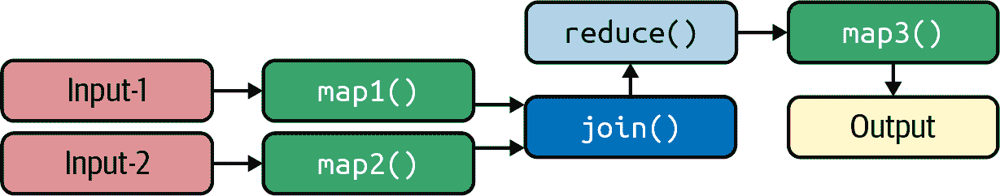
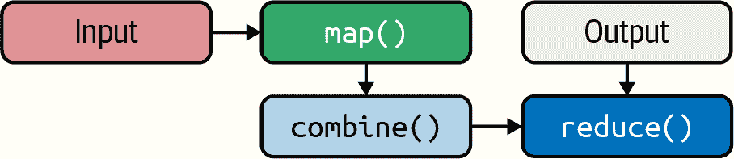
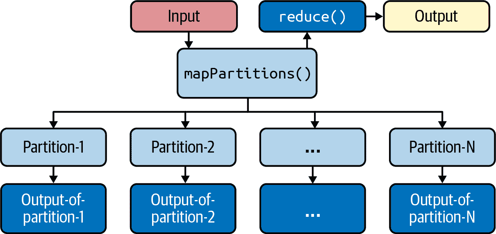

# 第九章：经典数据设计模式

本章讨论了在绝大多数大数据解决方案中使用的一些最基本和经典的数据设计模式。尽管这些是简单的设计模式，但它们在解决许多常见的数据问题中很有用，我在本书的示例中使用了许多这些模式。在本章中，我将介绍以下设计模式的 PySpark 实现：

1.  输入-映射-输出

1.  输入-过滤-输出

1.  输入-映射-减少-输出

1.  Input-Multiple-Maps-Reduce-Output

1.  输入-映射-合并器-减少-输出

1.  输入-映射分区-减少-输出

1.  输入-反向索引-模式-输出

不过，在我们开始之前，我想解释一下“设计模式”的含义。在计算机科学和软件工程中，针对常见问题，设计模式是对该问题的可重用解决方案。它是解决问题的模板或最佳实践，而不是可以直接转换为代码的成品设计。本章介绍的模式将使您能够处理各种数据分析任务。

###### 注意

本章讨论的数据设计模式是基本模式。您可以根据自己的需求创建自己的模式。有关更多示例，请参见 Jeffrey Dean 和 Sanjay Ghemawat 的《MapReduce: 简化大规模集群上的数据处理》（https://oreil.ly/jS7MV）。

# 输入-映射-输出

输入-映射-输出是数据分析的最简单设计模式：如图 9-1 所示，您从一组文件中读取输入，然后对每条记录应用一系列函数，最后生成所需的输出。映射器可以根据其输入创建任何内容，没有限制：它可以创建一组新记录或（键，值）对。


###### 图 9-1. 输入-映射-输出设计模式

没有减少，但有时会使用映射阶段来清理和重新格式化数据。这是一种非常常见的设计模式，用于改变输入数据的格式并生成输出数据，其他映射器和减少器可以使用。

## RDD 解决方案

有时映射阶段用于在生成供减少器使用的(键，值)对之前清理和重新格式化数据。

考虑这样的情况，输入记录具有可以包含诸如以下值的性别字段：

+   女性表示：`"0", "f", "F", "Female", "female"`

+   男性表示：`"1", "m", "M", "Male", "male"`

如果要将性别字段标准化为`{"female", "male", "unknown"}`，假设每条记录的格式如下：

```
  <user_id><,><gender><,><address>
```

下面的函数可以促进`map()`转换，并将每条输入记录创建为`(user_id, normalized_gender, address)`的三元组：

```
# rec: an input record
def normalize_gender(rec):
  tokens = rec.split(",")
  user_id = tokens[0]
  gender = tokens[1].lower()
  if gender in ('0', 'f', 'female'):
    normalized_gender = "female"
  elif gender in ('1', 'm', 'male'):
    normalized_gender = "male"
  else:
    normalized_gender = "unknown"

  return (user_id, normalized_gender, tokens[2])
#end-def
```

给定源`rdd`作为`RDD[String]`，则您的映射器转换将如下所示：

```
# source rdd : RDD[String]
# target rdd_mapped : RDD[(String, String, String)]
# RDD.map() is a 1-to-1 transformation
rdd_mapped = rdd.map(normalize_gender)
```

另一个场景可能是分析形式为`<user_id><,><movie_id><,><rating>`的电影评分记录，你的目标是为每条记录创建一个`(<movie_id>, (<user_id>, <rating>)`的键值对。 进一步假设所有评分将转换为整数。 你可以使用以下的映射器函数：

```
# rec: <user_id><,><movie_id><,><rating>
def create_pair(rec):
  tokens = rec.split(",")
  user_id = tokens[0]
  movie_id = tokens[1]
  rating = int(tokens[2])

  return (movie_id, (user_id, rating))
#end-def
```

如果你想将单个输入记录/元素映射到多个目标元素，并适当地丢弃（过滤掉）记录/元素，该怎么办？ Spark 提供了`flatMap()`转换来实现这一点；它在单个元素上工作（类似于`map()`）并生成多个目标元素。 因此，如果你的输入是`RDD[V]`，你想将每个`V`映射为一组类型为`T`的元素，你可以像下面这样使用`flatMap()`：

```
# source_rdd: RDD[V]
# target_rdd: RDD[T]
target_rdd = source_rdd.flatMap(custom_map_function)

# v an element of source_rdd
def custom_map_function(v):
  # t iterable<T>
  t = *`<``use``-``v``-``to``-``create``-``an``-``iterable``-``of``-``T``-``data``-``type``-``elements``>`*
  return t
#end-def

```

例如，如果对于输入记录`v`，你创建了`t = [t1, t2, t3]`，那么`v`将映射到`target_rdd`的三个元素`t1`、`t2`和`t3`。 如果`t=[]`——一个空列表——那么`target_rdd`将不会创建任何元素：`v`会被过滤掉。

正如这个例子所示，如果你想同时映射和过滤，即映射一些记录并过滤其他记录，你也可以使用单个`flatMap()`转换来实现这一点。 例如，假设你有以下格式的记录：

```
<word1><,><word2><;><word1><,><word2><;>...<word1><,><word2>
```

你的目标是只保留由逗号分隔的两个单词组成的记录（即二元组），你想要丢弃（过滤掉）所有其他记录。

考虑这个源 RDD：

```
records = ['w1,w2;w3,w4', 'w9', 'w5,w6;w7,w8;w10,w11']
rdd = spark.sparkContext.parallelize(records)
```

现在，`rdd`有三个元素。 你想保留`'w1,w2'`、`'w3,w4'`、`'w5,w6'`、`'w7,w8'`和`'w10,w11'`，但是丢弃`'w9'`（因为这不是一个二元组）。 以下的 PySpark 片段展示了如何实现这一点：

```
# map and filter
def map_and_filter(rec):
  if ";" in rec:
    bigrams = rec.split(";")
    result = []
    for bigram in bigrams:
      words = bigram.split(",")
      if len(words) == 2: result.append(bigram)
    return result
  else:
    # no semicolon in rec
    words = rec.split(",")
    if len(words) == 2: return [rec]
    else: return []
#end-def

# map and filter with flatMap()
mapped_and_filtered = rdd.flatMap(map_and_filter)
mapped_and_filtered.collect()
['w1,w2', 'w3,w4', 'w5,w6', 'w7,w8', 'w10,w11']
```

正如这个例子所示，你可以将要保留的记录映射为多个目标元素，并同时使用单个`flatMap()`转换过滤掉你不想保留的记录。

## DataFrame 解决方案

Spark 有一个`RDD.map()`函数，但是 DataFrame 没有这个`map()`函数。 Spark 的 DataFrame 没有显式的`map()`函数，但我们可以通过多种方法实现等价的`map()`：我们可以通过`DataFrame.withColumn()`添加新列，并通过`DataFrame.drop()`删除现有列。

考虑一个 DataFrame：

```
tuples3 = [ ('alex', 800, 8), ('jane', 420, 4),
            ('bob', 380, 5), ('betty', 700, 10),
            ('ted', 480, 10), ('mary', 500, 0) ]
>>> column_names = ["name", "weekly_pay", "overtime_hours"]
>>> df = spark.createDataFrame(tuples3, column_names)
>>> df.show(truncate=False)
+-----+----------+--------------+
|name |weekly_pay|overtime_hours|
+-----+----------+--------------+
|alex |800       |8             |
|jane |420       |4             |
|bob  |380       |5             |
|betty|700       |10            |
|ted  |480       |10            |
|mary |500       |0             |
+-----+----------+--------------+
```

假设我们想通过将`overtime_hours`加到`weekly_pay`来计算总周薪。 因此，我们希望基于`overtime_hours`和`weekly_pay`的值创建一个新列`total weekly pay`。 假设加班费率为每小时$20。

```
def compute_total_pay(weekly_pay, overtime_hours):
    return (weekly_pay + (overtime_hours * 20))
#end-def
```

要保留所有列，请执行以下操作：

```
>>> df2 = df.rdd.map(lambda x: (x["name"], x["weekly_pay"], x["overtime_hours"],
    compute_total_pay(x["weekly_pay"], x["overtime_hours"])))
    .toDF(["name", "weekly_pay", "overtime_hours", "total_pay"])
>>> df2.show(truncate=False)
+-----+----------+--------------+---------+
|name |weekly_pay|overtime_hours|total_pay|
+-----+----------+--------------+---------+
|alex |800       |8             |960      |
|jane |420       |4             |500      |
|bob  |380       |5             |480      |
|betty|700       |10            |900      |
|ted  |480       |10            |680      |
|mary |500       |0             |500      |
+-----+----------+--------------+---------+
```

实质上，你必须将行映射到一个包含所有现有列并添加新列的元组。

如果你的列太多而无法枚举，你也可以只向现有行添加一个元组。

```
>>> df3 = df.rdd.map(lambda x: x + (str(compute_total_pay(x["weekly_pay"],
   x["overtime_hours"])),)).toDF(df.columns + ["total_pay"])
>>> df3.show(truncate=False)
+-----+----------+--------------+---------+
|name |weekly_pay|overtime_hours|total_pay|
+-----+----------+--------------+---------+
|alex |800       |8             |960      |
|jane |420       |4             |500      |
|bob  |380       |5             |480      |
|betty|700       |10            |900      |
|ted  |480       |10            |680      |
|mary |500       |0             |500      |
+-----+----------+--------------+---------+
```

你也可以使用`DataFrame.withColumn()`添加一个`total_pay`列：

```
>>> import pyspark.sql.functions as F
>>> df4 = df.withColumn("total_pay",
   F.lit(compute_total_pay(df.weekly_pay, df.overtime_hours)))
>>> df4.show(truncate=False)
+-----+----------+--------------+---------+
|name |weekly_pay|overtime_hours|total_pay|
+-----+----------+--------------+---------+
|alex |800       |8             |960      |
|jane |420       |4             |500      |
|bob  |380       |5             |480      |
|betty|700       |10            |900      |
|ted  |480       |10            |680      |
|mary |500       |0             |500      |
+-----+----------+--------------+---------+
```

## Flat Mapper 功能

Spark 的 DataFrame 没有`flatMap()`转换（将一个元素展平为多个目标元素），而是提供了`explode()`函数，该函数返回给定列（表示为列表或字典）中每个元素的新行，并对数组中的元素使用默认列名`col`，对字典中的元素使用键和值，除非另有指定。

下面是一个完整的示例，展示如何使用`explode()`函数作为等效于`RDD.flatMap()`转换的方法。

让我们首先创建一个包含两列列表的 DataFrame。

接下来，我们来看如何针对给定的 DataFrame 展开多列。请注意，每个`select`子句只允许一个生成器：这意味着您不能同时展开两列（但可以逐个迭代地展开它们）。以下示例展示了如何展开两列：

```
>>> some_data = [
...     ('alex', ['Java','Scala', 'Python'], ['MS', 'PHD']),
...     ('jane', ['Cobol','Snobol'], ['BS', 'MS']),
...     ('bob', ['C++'], ['BS', 'MS', 'PHD']),
...     ('ted', [], ['BS', 'MS']),
...     ('max', ['FORTRAN'], []),
...     ('dan', [], [])
... ]
>>>
>>> df = spark.createDataFrame(data=some_data,
   schema = ['name', 'languages', 'education'])
>>> df.show(truncate=False)
+----+---------------------+-------------+
|name|languages            |education    |
+----+---------------------+-------------+
|alex|[Java, Scala, Python]|[MS, PHD]    |
|jane|[Cobol, Snobol]      |[BS, MS]     |
|bob |[C++]                |[BS, MS, PHD]|
|ted |[]                   |[BS, MS]     |
|max |[FORTRAN]            |[]           |
|dan |[]                   |[]           |
+----+---------------------+-------------+
```

接下来我们来看一下`languages`列，这是一个数组：

```
>>> exploded_1 = df.select(df.name,
   explode(df.languages).alias('language'), df.education)
>>> exploded_1.show(truncate=False)
+----+--------+-------------+
|name|language|education    |
+----+--------+-------------+
|alex|Java    |[MS, PHD]    |
|alex|Scala   |[MS, PHD]    |
|alex|Python  |[MS, PHD]    |
|jane|Cobol   |[BS, MS]     |
|jane|Snobol  |[BS, MS]     |
|bob |C++     |[BS, MS, PHD]|
|max |FORTRAN |[]           |
+----+--------+-------------+
```

如您所见，当展开一列时，如果某列是空列表，则该列会从展开结果中删除（`tex` 和 `max` 因具有关联的空列表而被删除）。请注意，`ted` 和 `dan` 被删除，因为展开的列值为空列表。

接下来，我们来看一下`education`列：

```
>>> exploded_2 = exploded_1.select(exploded_1.name, exploded_1.language,
   explode(exploded_1.education).alias('degree'))
>>> exploded_2.show(truncate=False)
+----+--------+------+
|name|language|degree|
+----+--------+------+
|alex|Java    |    MS|
|alex|Java    |   PHD|
|alex|Scala   |    MS|
|alex|Scala   |   PHD|
|alex|Python  |    MS|
|alex|Python  |   PHD|
|jane|Cobol   |    BS|
|jane|Cobol   |    MS|
|jane|Snobol  |    BS|
|jane|Snobol  |    MS|
|bob |C++     |    BS|
|bob |C++     |    MS|
|bob |C++     |   PHD|
+----+--------+------+
```

请注意，由于展开的列值为空列表，名称为`max`的列被删除。

# 输入-过滤-输出

图 9-2 中所示的输入-过滤-输出数据设计模式是一种简单的模式，它允许您保留满足数据要求的记录，同时移除不需要的记录。您可以从一组文件中读取输入，然后对每条记录应用一个或多个过滤函数，保留满足布尔谓词的记录并丢弃其他记录。


###### 图 9-2\. 输入-过滤-输出设计模式

这是一个在数据集大且您希望选择其中一部分数据进行关注和可能进行后续分析的情况下非常有用的设计模式。

一个简单的场景是读取由 URL 组成的输入记录，保留有效的 URL 并丢弃无效的 URL。这种设计模式可以通过 RDD 和 DataFrame 实现。

这里是一些示例记录：

```
http://cnn.com 
htp://mysite.com 
http://www.oreilly.com 
https:/www.oreilly.com 
```


有效 URL


无效 URL


有效 URL


无效 URL

## RDD 解决方案

这种设计模式可以通过`RDD.filter()`函数轻松实现：

```
data = ['http://cnn.com', 'htp://mysite.com',
  'http://www.oreilly.com', 'https:/www.oreilly.com' ]

urls = spark.sparkContext.parallelize(data)

# return True if a given URL is valid, otherwise return False
def is_valid_URL(url_as_str):
  if url_as_str is None: return False
  lowercased = url_as_str.lower()
  if (lowercased.startswith('http://') or
      lowercased.startswith('https://')):
    return True
  else:
    return False
#end-def

# return a new RDD containing only the
# elements that satisfy a predicate
valid_urls = urls.filter(is_valid_URL)
valid_urls.collect()
[ 'http://cnn.com', 'http://www.oreilly.com' ]
```

## DataFrame 解决方案

或者，您可以使用`DataFrame.filter()`函数来保留所需的记录并丢弃不需要的记录：

```
>>> data = [('http://cnn.com',), ('htp://mysite.com',),
    ('http://www.oreilly.com',), ('https:/www.oreilly.com',)]

# create a single-column DataFrame
>>> df = spark.createDataFrame(data, ['url'])

>>> df.show(truncate=False)
+----------------------+
|url                   |
+----------------------+
|http://cnn.com        |
|htp://mysite.com      |
|http://www.oreilly.com|
|https:/www.oreilly.com|
+----------------------+

# filter out undesired records
>>> df.filter(df.url.startswith('http://') |
              df.url.startswith('https://'))
      .show(truncate=False)
+----------------------+
|url                   |
+----------------------+
|http://cnn.com        |
|http://www.oreilly.com|
+----------------------+
```

## DataFrame 过滤

Spark 的 `filter()` 函数用于根据给定条件过滤 RDD/DataFrame 中的元素/行。对于 DataFrame，如果您来自 SQL 背景，也可以使用 `where()` 子句代替 `filter()` 函数。这两个函数（`filter()` 和 `where()`）的操作完全相同。`filter()` 和 `where()` 的目标是保留所需的元素/行。

考虑一个 DataFrame 如下：

```
tuples3 = [ ('alex', 800, 8), ('jane', 420, 4),
            ('bob', 380, 5), ('betty', 700, 10),
            ('ted', 480, 10), ('mary', 500, 0) ]
>>> column_names = ["name", "weekly_pay", "overtime_hours"]
>>> df = spark.createDataFrame(tuples3, column_names)
>>> df.show(truncate=False)
+-----+----------+--------------+
|name |weekly_pay|overtime_hours|
+-----+----------+--------------+
|alex |800       |8             |
|jane |420       |4             |
|bob  |380       |5             |
|betty|700       |10            |
|ted  |480       |10            |
|mary |500       |0             |
+-----+----------+--------------+
```

假设我们想保留 `weekly_pay` 大于 490 的行：

让我们首先使用 `filter()`：

```
>>> df.filter(df.weekly_pay > 490).show(truncate=False)
+-----+----------+--------------+
|name |weekly_pay|overtime_hours|
+-----+----------+--------------+
|alex |800       |8             |
|betty|700       |10            |
|mary |500       |0             |
+-----+----------+--------------+
```

我们可以通过 `where` 子句实现相同的功能：

```
>>> df.where(df.weekly_pay > 490).show(truncate=False)
+-----+----------+--------------+
|name |weekly_pay|overtime_hours|
+-----+----------+--------------+
|alex |800       |8             |
|betty|700       |10            |
|mary |500       |0             |
+-----+----------+--------------+
```

`filter()` 可以用于单个和多个条件：

```
>>> df.filter(df.weekly_pay > 400).show(truncate=False)
+-----+----------+--------------+
|name |weekly_pay|overtime_hours|
+-----+----------+--------------+
|alex |800       |8             |
|jane |420       |4             |
|betty|700       |10            |
|ted  |480       |10            |
|mary |500       |0             |
+-----+----------+--------------+

>>> df.filter((df.weekly_pay > 400) &
   (df.overtime_hours > 5)).show(truncate=False)
+-----+----------+--------------+
|name |weekly_pay|overtime_hours|
+-----+----------+--------------+
|alex |800       |8             |
|betty|700       |10            |
|ted  |480       |10            |
+-----+----------+--------------+
```

# 输入-映射-Reduce-输出

输入-映射-Reduce-输出设计模式，如图 9-3 所示，是聚合操作（例如按键找到值的总和或平均值）中最常见的设计模式。

## RDD 解决方案

Spark 提供了以下强大的解决方案来实现这种设计模式，可以使用多种不同的组合来解决数据问题：

+   映射阶段：`map()`、`flatMap()`、`mapPartitions()`、`filter()`

+   Reduce 阶段：`reduceByKey()`、`groupByKey()`、`aggregateByKey()`、`combineByKey()`


###### 图 9-3\. 输入-映射-Reduce-输出设计模式

这是最简单的 MapReduce 设计模式：读取数据，执行映射转换（通常创建（键，值）对），对相同键的所有值进行聚合（求和、平均值等），然后保存输出。

假设您有格式为 `<name><,><age><,><salary>` 的记录，并且希望计算每个年龄组的平均工资，其中年龄组定义为 `0-15`、`16-20`、`21-25`、…、`96-100`。首先，需要读取输入并创建一个 RDD/DataFrame。然后，mapper 将逐个处理记录并创建（键，值）对，其中键是一个年龄组，值是一个工资。例如，如果我们的记录是 `alex,22,45000`，那么 mapper 将创建配对 `('21-25', 45000)`，因为年龄 `22` 属于年龄组 `'21-25'`。Mapper 函数可以表达为：

```
# rec: <name><,><age><,><salary>
def create_key_value_pair(rec):
  tokens = rec.split(",")
  age = int(tokens[1])
  salary = tokens[2]
  if age < 16: return ('0-15', salary)
  if age < 21: return ('16-20', salary)
  ...
  if age < 91: return ('85-90', salary)
  if age < 96: return ('91-95', salary)
  return ('96-100', salary)
#end-def
```

然后，reducer 将按年龄组（`0-15`、`16-20` 等）分组键，聚合每组中的值，并找到每组的平均工资。

假设您有以下输入：

```
alex,22,45000
bob,43,50000,
john,23,65000
jane,41,48000
joe,44,66000
```

Mapper 将生成以下（键，值）对：

```
('21-25', 45000)
('41-45', 54000)
('21-25', 67000)
('41-45', 68000)
('41-45', 70000)
```

然后 reducer 将为每个键分组值：

```
('21-25', [45000, 67000])
('41-45', [54000, 68000, 70000])
```

使用 Spark 的 `groupByKey()` 转换可以轻松实现按键分组。使用 `groupByKey()`，我们可以将 reducer 写成：

```
# rdd: RDD[(age-group, salary)]
grouped_by_age_group = rdd.groupByKey()
```

最后，我们可以计算每个年龄组的平均值：

```
('21-25', 56000)
('41-45', 64000)
```

这可以通过另一个简单的 mapper 实现：

```
# grouped_by_age_group: RDD[(age-group, [salary-1, salary-2, ...])]
age_group_average = grouped_by_age_group.mapValues(lambda v: sum(v)/len(v))
```

如果要使用组合器（Spark 在 `reduceByKey()` 中自动使用组合器），mapper 将生成以下（键，值）对，其中值为 `(sum, count)`：

```
('21-25', (45000, 1))
('41-45', (54000, 1))
('21-25', (67000, 1))
('41-45', (68000, 1))
('41-45', (70000, 1))
```

创建`(sum, count)`作为值的原因是为了保证 Reducer 函数是可结合的和可交换的。如果您的 Reducer 函数不遵循这两个代数规则，那么 Spark 的`reduceByKey()`在输入数据分布在多个分区时将无法产生正确的语义。

给定一个`RDD[(key, (sum, count))]`，使用 Spark 的`reduceByKey()` — 注意，这个 Reducer 基于分区的基础并且也使用组合器，我们可以将 Reducer 编写为：

```
# rdd: RDD[(key, (sum, count))]
reduced_by_age_group = rdd.reduceByKey(
  lambda x, y: (x[0]+y[0], x[1]+y[1]))
```

Reducer 将根据它们关联的键对值进行分组：

```
('21-25', (112000, 2))
('41-45', (192000, 3))
```

然后，可以通过另一个简单的映射器计算每个年龄组的平均值：

```
('21-25', 56000)
('41-45', 64000)
```

也可以使用 Spark 的`map()`和`combineByKey()`转换来实现这种设计模式的组合。映射阶段与之前介绍的完全相同。使用`create_key_value_pair()`函数，它将创建以下(key, value)对：

```
('21-25', 45000)
('41-45', 54000)
('21-25', 67000)
('41-45', 68000)
('41-45', 70000)
```

假设这些(key, value)对由`age_group_rdd`表示。然后我们可以使用一对`combineByKey()`和`mapValues()`转换来进行减少：

```
# C denotes (sum-of-salaries, count-of-salaries)
combined = age_group_rdd.combineByKey(
  lambda v : (v, 1), 
  lambda C, v: (C[0]+v, C[1]+1), 
  lambda C1,C2: (C1[0]+C2[0], C1[1]+C2[1]) 
)

# C denotes (sum-of-salaries, count-of-salaries)
avg_per_age_group = combined.mapValues(
  lambda C : C[0]/C[1]
)
```


创建`C`为`(工资总和, 工资数量)`。


将工资合并到`C`中。


将两个`C`（来自不同分区）合并为一个单一的`C`。

###### 提示

注意，`reduceByKey()`是`combineByKey()`的一个特例。对于`reduceByKey()`，源 RDD 和目标 RDD 必须是`RDD[(K, V])`的形式，而对于`combineByKey()`，源 RDD 可以是`RDD[(K, V)]`，目标 RDD 可以是`RDD[(K, C)]`，其中`V`和`C`可以是不同的数据类型。例如，`V`可以是`Integer`，而`C`可以是`(Integer, Integer)`。在 Spark 中，`combineByKey()`转换是对(key, value)数据集最通用和强大的 Reducer。

## DataFrame 解决方案

PySpark 的 DataFrame 为减少转换提供了全面的功能。您可以使用`Dataframe.groupby(*cols)`，它使用指定的列对 DataFrame 进行分组，以便对它们进行聚合。另一个选项是将您的 DataFrame 注册为表（行和命名列）然后利用 SQL 的功能`GROUP BY`和聚合所需的列。

以下示例显示了如何使用`groupBy()`函数。

首先，让我们创建一个 DataFrame：

```
>>> tuples4 = [("Illumina", "Alex", "San Diego", 100000),
...            ("Illumina", "Bob", "San Diego", 220000),
...            ("Illumina", "Jane", "Foster City", 190000),
...            ("Illumina", "Ted", "Foster City", 230000),
...            ("Google", "Rafa", "Menlo Park", 250000),
...            ("Google", "Roger", "Menlo Park", 160000),
...            ("Google", "Mona", "Menlo Park", 120000),
...            ("IBM", "Joe", "San Jose", 160000),
...            ("IBM", "Alex", "San Jose", 170000),
...            ("IBM", "George", "San Jose", 180000),
...            ("IBM", "Barb", "San Jose", 190000)]
>>> df = spark.createDataFrame(tuples4,
   ["company", "employee", "city", "salary"])
>>> df.show(truncate=False)
+--------+--------+-----------+------+
|company |employee|city       |salary|
+--------+--------+-----------+------+
|Illumina|Alex    |San Diego  |100000|
|Illumina|Bob     |San Diego  |220000|
|Illumina|Jane    |Foster City|190000|
|Illumina|Ted     |Foster City|230000|
|Google  |Rafa    |Menlo Park |250000|
|Google  |Roger   |Menlo Park |160000|
|Google  |Mona    |Menlo Park |120000|
|IBM     |Joe     |San Jose   |160000|
|IBM     |Alex    |San Jose   |170000|
|IBM     |George  |San Jose   |180000|
|IBM     |Barb    |San Jose   |190000|
+--------+--------+-----------+------+
```

接下来，我们应用分组和聚合函数：

+   描述您的 DataFrame：

```
>>> df.describe().show()
+-------+--------+--------+-----------+-----------------+
|summary| company|employee|       city|           salary|
+-------+--------+--------+-----------+-----------------+
|  count|      11|      11|         11|               11|
|   mean|    null|    null|       null|179090.9090909091|
| stddev|    null|    null|       null|44822.88376589473|
|    min|  Google|    Alex|Foster City|           100000|
|    max|Illumina|     Ted|   San Jose|           250000|
+-------+--------+--------+-----------+-----------------+
```

+   在 DataFrame 上使用`groupBy()`：

```
>>> df.groupBy('company').max().show()
+--------+-----------+
| company|max(salary)|
+--------+-----------+
|Illumina|     230000|
|  Google|     250000|
|     IBM|     190000|
+--------+-----------+

>>> df.groupBy('Company').sum().show()
+--------+-----------+
| Company|sum(salary)|
+--------+-----------+
|Illumina|     740000|
|  Google|     530000|
|     IBM|     700000|
+--------+-----------+

>>> df.groupBy("company").agg({'salary':'sum'}).show()
+--------+-----------+
| company|sum(salary)|
+--------+-----------+
|Illumina|     740000|
|  Google|     530000|
|     IBM|     700000|
+--------+-----------+

>>> import pyspark.sql.functions as F
>>> df.groupby('company')
.agg(F.min("salary").alias("minimum_salary"),
F.max("salary").alias("maximum_salary")).show()
+--------+--------------+--------------+
| company|minimum_salary|maximum_salary|
+--------+--------------+--------------+
|Illumina|        100000|        230000|
|  Google|        120000|        250000|
|     IBM|        160000|        190000|
+--------+--------------+--------------+
```

# 输入-多个映射-减少-输出

输入-多个映射-减少-输出设计模式涉及多个映射、连接和减少。这种设计模式也被称为*减少端连接*，因为 Reducer 负责执行连接操作。为了帮助您理解这种设计模式，让我举个例子。假设我们有以下两个输入，一个是电影表，一个是评分表：

| 电影 ID | 电影名称 |
| --- | --- |
| 100 | 狮子王 |
| 200 | 星球大战 |
| 300 | 风中的小提琴手 |
| … | … |
| 电影-ID | 评分 | 用户-ID |
| --- | --- | --- |
| 100 | 4 | 用户-1234 |
| 100 | 5 | 用户-3467 |
| 200 | 4 | 用户-1234 |
| 200 | 2 | 用户-1234 |
| … | … | … |

最终目标是生成以下输出，即平均评分表。这是电影和评分表的连接，但在完成连接操作后，我们仍然需要执行另一次减少以找到每个电影-ID 的评分平均值：

| 电影-ID | 电影名称 | 平均评分 |
| --- | --- | --- |
| 100 | 狮子王 | 4.5 |
| 200 | 星球大战 | 3.0 |
| … | … | … |

此数据设计模式由 图 9-4 描述。



###### 图 9-4\. 输入-映射-减少-输出（减少侧连接）设计模式

让我们逐步走过这一过程：

1.  Mapper 读取输入数据，根据共同列或连接键进行合并。我们读取 `Input-1`，然后将 `map1()` 应用为映射器，并创建 `(<Common-Key>, <Rest-of-Attributes>)` 对。将此应用于电影表将创建 `(电影-ID, 电影名称)` 对，其中 `电影-ID` 是键，`电影名称` 是值。

1.  接下来，我们读取 `Input-2`，然后将 `map2()` 应用为映射器，并创建 `(<Common-Key>, <Rest-of-Attributes>)` 对。将此应用于评分表将创建 `(电影-ID, (电影名称, 评分))` 对，其中 `电影-ID` 是键，`(电影名称, 评分)` 是值。

1.  现在我们在 `map1()` 和 `map2()` 的输出之间执行 `join()` 操作。因此，目标是在共同键 `电影-ID` 上将 `(电影-ID, 电影名称)` 对与 `(电影-ID, (电影名称, 评分))` 对进行连接。此连接的结果是 `(电影-ID, (评分, 电影名称))` 对。

1.  下一步是使用 `电影-ID` 作为键减少和聚合 `join()` 操作的输出：我们需要每个 `电影-ID` 的所有评分以找到评分的平均值。

1.  最后，我们有一个简单的映射器 (`map3()`) 计算评分的平均值并生成最终输出。

对于这种设计模式，我将提供两种 PySpark 解决方案：一种使用 RDD，另一种使用数据框架。

## RDD 解决方案

首先，我将展示使用 RDD 的简单 PySpark 解决方案。第一步是准备输入。我们将创建两个 RDD 来表示我们的两个输入。为此，我将定义两个简单的分词函数：

```
def create_movie_pair(rec):
  tokens = rec.split(",")
  return (tokens[0], tokens[1])
#end-def

def create_rating_pair(rec):
  tokens = rec.split(",")
  # we drop User_ID here (not needed)
  return (tokens[0], int(tokens[1]))
#end-def
```

接下来，我们在映射器转换中使用这些函数：

```
# spark: SparkSession
movies_by_name = ["100,Lion King", "200,Star Wars",
                  "300,Fiddler on the Roof", "400,X-Files"]
movies = spark.sparkContext.parallelize(movies_by_name)
movies.collect()
['100,Lion King', '200,Star Wars',
 '300,Fiddler on the Roof', '400,X-Files']

movies_rdd = movies.map(create_movie_pair)
movies_rdd.collect()
[('100', 'Lion King'), ('200', 'Star Wars'),
 ('300', 'Fiddler on the Roof'), ('400', 'X-Files')]

ratings_by_users = ["100,4,USER-1234", "100,5,USER-3467",
                    "200,4,USER-1234", "200,2,USER-1234"]

ratings = spark.sparkContext.parallelize(ratings_by_users)
ratings.collect()
['100,4,USER-1234', '100,5,USER-3467',
 '200,4,USER-1234', '200,2,USER-1234']

ratings_rdd = ratings.map(create_rating_pair)
ratings_rdd.collect()
[('100', 4), ('100', 5), ('200', 4), ('200', 2)]
```

到目前为止，我们已经创建了两个 RDD：

+   `movies_rdd`: `RDD[(电影-ID, 电影名称)]`

+   `ratings_rdd`: `RDD[(电影-ID, 评分)]`

现在，我们将使用这两个 RDD 来在共同键 `电影-ID` 上执行连接操作：

```
joined = ratings_kv.join(movies_kv)
joined.collect()
[ ('200', (4, 'Star Wars')),
  ('200', (2, 'Star Wars')),
  ('100', (4, 'Lion King')),
  ('100', (5, 'Lion King'))]

grouped_by_movieid = joined.groupByKey()
                           .mapValues(lambda v: list(v))
grouped_by_movieid.collect()
[ ('200', [(4, 'Star Wars'), (2, 'Star Wars')]),
  ('100', [(4, 'Lion King'), (5, 'Lion King')])]
```

最后一步是使用简单的映射器准备最终输出，其中包括每个 `电影-ID` 的平均评分：

```
def find_avg_rating(values):
  total = 0
  for v in values:
    total += v[0]
    movie_name = v[1]
  return (movie_name, float(total)/len(values))
#end-def

grouped_by_movieid.mapValues(
   lambda values: find_avg_rating(values)).collect()
[
 ('200', ('Star Wars', 3.0)),
 ('100', ('Lion King', 4.5))
]
```

## 数据框架解决方案

使用数据框架的解决方案非常简单：我们为每个输入创建一个数据框架，然后在共同键 `电影-ID` 上进行连接。

首先让我们创建数据框架：

```
movies_by_name = [('100', 'Lion King'), ('200', 'Star Wars'),
                  ('300', 'Fiddler on the Roof'), ('400', 'X-Files')]
movies_df = spark.createDataFrame(movies_by_name,
                  ["movie_id", "movie_name"])
movies_df.show()
+--------+-------------------+
|movie_id|         movie_name|
+--------+-------------------+
|     100|          Lion King|
|     200|          Star Wars|
|     300|Fiddler on the Roof|
|     400|            X-Files|
+--------+-------------------+

ratings_by_user = [('100', 4, 'USER-1234'),
                   ('100', 5, 'USER-3467'),
                   ('200', 4, 'USER-1234'),
                   ('200', 2, 'USER-1234')]

ratings_df = spark.createDataFrame(ratings_by_user,
                   ["movie_id", "rating", "user_id"]).drop("user_id")
ratings_df.show()
+--------+------+
|movie_id|rating|
+--------+------+
|     100|     4|
|     100|     5|
|     200|     4|
|     200|     2|
+--------+------+
```

然后我们只需要执行连接操作。这在 DataFrames 中很容易实现：

```
joined = ratings_df.join(movies_df, "movie_id")
joined.show()
+--------+------+----------+
|movie_id|rating|movie_name|
+--------+------+----------+
|     200|     4| Star Wars|
|     200|     2| Star Wars|
|     100|     4| Lion King|
|     100|     5| Lion King|
+--------+------+----------+

output = joined.groupBy("movie_id", "movie_name").avg()
output.show()
+--------+----------+-----------+
|movie_id|movie_name|avg(rating)|
+--------+----------+-----------+
|     200| Star Wars|        3.0|
|     100| Lion King|        4.5|
+--------+----------+-----------+
```

# Input-Map-Combiner-Reduce-Output

输入-映射-组合器-减少-输出设计模式与输入-映射-减少-输出非常相似。主要区别在于还使用了组合器，以加速转换过程。在 MapReduce 范式中（在 Apache Hadoop 中实现），组合器——也称为半减少器——是一个可选函数，通过接受每个工作节点上每个分区的映射器函数的输出，按键聚合结果，最后将输出的 (键, 值) 对传递给减少函数。在 Spark 中，组合器会自动在每个工作节点和分区上执行，你不必编写任何特殊的组合器函数。这样的转换的一个例子是 `reduceByKey()` 转换，它使用一个可结合和交换的减少函数合并每个键的值。

组合器的主要功能是总结和聚合映射器的输出记录，形成 (键, 值) 对，每个分区具有相同的键。这个设计模式的目的是确保组合器可以被使用，并且你的数据算法不会产生错误的结果。例如，目标是按键汇总值，我们有以下 (键, 值) 对：

```
 (K1, 30), (K1, 40),
 (K2, 5), (K2, 6), (K2, 7)
```

在同一个分区中，组合器的任务是将这些汇总为 `(K1, 70), (K2, 18)`。

这个数据设计模式由 图 9-5 描述。



###### 图 9-5\. 输入-映射-组合器-减少-输出设计模式

假设我们有代表城市及其相关温度的输入，并且我们的目标是找到每个城市的平均温度。`source_rdd` 的格式为 `RDD[(String, Double)]`，其中键是城市名称，值是关联的温度。为了找到每个城市的平均温度，您可能会尝试编写：

```
# WARNING: THIS WILL NOT WORK
# let t1, t2 denote temperatures for the same city
avg_per_city = source_rdd.reduceByKey(
  lambda t1, t2: (t1+t2)/2
)
```

但这不是正确的转换，因此它不会计算每个城市的平均值。问题在于，正如我们所知，平均函数不是可结合的：

```
AVG(1, 2, 3, 4, 5) != AVG(AVG(1, 2), AVG(3, 4, 5))
```

换句话说，平均数的平均数不是一个平均数。为什么？下面的例子可以说明。假设我们有这样的数据，在两个分区上：

```
Partition-1:
  (Paris, 20)
  (Paris, 30)

Partition-2:
  (Paris, 40)
  (Paris, 50)
  (Paris, 60)
```

我们的转换将创建：

```
Partition-1:
  (Paris, (20+30)/2) = (Paris, 25)

Partition-2:
  (Paris, (40+50)/2) = (Paris, 45)
  (Paris, (45+60)/2) = (Paris, 52.5)
```

最后，将两个分区的结果合并将产生：

```
(Paris, (25+52.5)/2)) = (Paris, 38.75)
```

38.75 是 (20, 30, 40, 50, 60) 的平均数吗？当然不是！正确的平均数是 (20 + 30 + 40 + 50 + 60) / 5 = 200 / 5 = 40。

因为平均函数不是可结合的，我们的减少函数不正确——但稍作修改，我们可以使映射器的输出具有交换性和结合性。这将给出每个唯一城市的正确平均值。

假设我们在一个 RDD 中有以下数据：

```
sample_cities = [('Paris', 20), ('Paris', 30),
  ('Paris', 40), ('Paris', 50), ('Paris', 60),
  ('Cupertino', 40), ('Cupertino', 60)]

cities_rdd = spark.sparkContext.parallelize(sample_cities)
```

现在，我们将从 `cities_rdd` 创建一个新的 RDD，以确保其值符合交换性和结合性的法则：

```
cities_sum_count = cities_rdd.mapValues(lambda v: (v, 1))
```

`cities_sum_count`是一个`RDD[(city, (sum-of-temp, count-of-temp))`。由于我们知道加法在`(sum, count)`元组上是可交换和可结合的操作，我们可以将我们的减少写成：

```
cities_reduced = cities_sum_count.reduceByKey(
  lambda x, y: (x[0]+y[0], x[1]+y[1])
)
```

然后我们需要一个最终的映射器来找到每个城市的平均温度：

```
avg_per_city = cities_reduced.mapValues(
  lambda v: v[0]/v[1]
)
```

此设计模式的另一种解决方案是使用 Spark 的`combineByKey()`转换。如果`cities_rdd`是我们的源 RDD，则可以按如下方式找到每个城市的平均温度：

```
avg_per_city = cities_rdd.combineByKey(
  lambda v: (v, 1), 
  lambda C, v: (C[0]+v, C[1]+1) 
  lambda C1, C2: (C1[0]+C2[0], C1[1]+C2[1]) 
).mapValues(lambda v: v[0]/v[1])
```


创建`C`为`(sum, count)`。


合并每个分区的值。


将两个分区合并（将两个`C`合并成一个）。

###### 提示

为了使您的组合器正常工作并在语义上正确，您的映射器输出的中间值必须是单子，并遵循交换性和结合性的代数法则。要了解更多关于这种设计模式的信息，请参见第四章和 Jimmy Lin 的论文[“Monoidify! Monoids as a Design Principle for Efficient MapReduce Algorithms”](https://oreil.ly/kWNDP)。

# 输入-MapPartitions-Reduce-Output

输入-MapPartitions-Reduce-Output 是一个非常重要的数据设计模式，其中您将一个函数应用于每个分区——每个分区可能有数千或数百万个元素——而不是每个元素。我们在第二章和第三章讨论了这种设计模式，但由于其重要性，我想在这里更详细地介绍它。想象一下，您有数十亿条记录，您希望将所有这些记录汇总为如列表、数组、元组或字典之类的紧凑数据结构。您可以使用输入-MapPartitions-Reduce-Output 设计模式，如图 9-6 所示。



###### 图 9-6\. 输入-MapPartitions-Reduce-Output 设计模式

通常情况可以总结如下：

输入

数十亿条记录。

处理

使用`mapPartitions()`作为总结设计模式。

将输入分割为*N*个分区，然后使用自定义函数独立和并发地分析/处理每个分区，并产生一个紧凑的数据结构（CDS），如数组、列表或字典。我们可以将这些输出标记为 CDS-1、CDS-2、…、CDS-*N*。

Reducer

最终的减少器在生成的值 CDS-1、CDS-2、…、CDS-*N*上工作。这一步的输出是一个单一的紧凑数据结构，如数组、列表或字典。

Spark 的`mapPartitions()`是一个专门的`map()`，每个分区只调用一次。整个分区的内容作为顺序值流通过输入参数(`Iterator[V]`，其中`V`是源 RDD 元素的数据类型)可用。自定义函数必须返回一个`Iterator[T]`，其中`T`是目标 RDD 元素的数据类型。

要理解这种设计模式，必须理解`map()`和`mapPartitions()`之间的区别。`map()`方法通过应用函数将源 RDD 的每个元素转换为目标 RDD 的单个元素。另一方面，`mapPartitions()`方法将源 RDD 的每个分区（包含成千上万个元素）转换为结果 RDD 的多个元素（可能为零）。

假设我们有数十亿条记录如下形式：

```
<name><,><gender><,><salary>
```

我们的目标是根据员工的性别汇总薪水。我们希望从所有输入记录中找到以下三个(key, value)元组：

```
("male", (total-number-of-males, sum-of-salaries-for-males))
("female", (total-number-of-females, sum-of-salaries-for-females))
("unknown", (total-number-of-unknowns, sum-of-salaries-for-unknowns))
```

正如我们从预期输出中可以观察到的，只有三个键："male"，"female"和"unknown"。

这里有几个输入记录的示例，我将用它们来说明这种设计模式的行为：

```
alex,male,22000
david,male,45000
jane,female,38000
mary,female,39000
max,male,55000
nancy,female,67000
ted,x,45000
sam,x,32000
rafa,male,100000
```

一个简单的解决方案是生成(key, value)对，其中 key 是性别，value 是薪水，然后使用`groupByKey()`转换来聚合结果。然而，这种解决方案效率不高，并且可能存在以下潜在问题，我们可以通过使用 Spark 的`mapPartitions()`转换来避免：

+   它将创建数十亿个(key, value)对，这将使集群网络变得混乱。

+   由于只有三个键，如果使用`groupByKey()`转换，每个键将有数十亿个值，这可能导致 OOM 错误。

+   由于只有三个键，集群可能无法有效利用。

输入-MapPartitions-Reduce-Output 设计模式挺身而出，提供了一个高效的解决方案。首先，我们将输入分区为*`N`*个分区，每个分区包含数千或数百万条记录。根据输入大小决定*`N`*的值，例如`(*N*=200, 400, 1000, 20000, …)`。接下来的步骤是应用`mapPartitions()`转换：我们映射每个分区，并创建一个非常小的字典，其中包含三个键："male"，"female"和"unknown"。最终的规约将聚合这些*`N`*个字典。

让我们将示例输入分区为两个分区：

```
Partition-1:
   alex,male,22000
   david,male,45000
   jane,female,38000
   mary,female,39000
   max,male,55000

Partition-2:
   nancy,female,67000
   ted,x,45000
   sam,x,32000
   rafa,male,100000
```

这种设计模式的主要思想是对输入进行分区，然后独立并发地处理这些分区。例如，如果`*N*=1000`并且您有*`N`*个映射器，那么所有映射器都可以并发执行。通过应用基本的映射使用`mapPartitions()`，我们将为每个分区生成以下字典：

```
Partition-1:
{
  "male": (122000, 3),
  "female": (77000, 2)
}

Partition-2:
{
  "male": (100000, 1),
  "female": (67000, 1),
  "unknown": (77000, 2)
}
```

接下来，我们将应用最终的规约，将所有分区的输出聚合到一个单一的字典中：

```
final output:
{
  "male": (222000, 4),
  "female": (144000, 3),
  "unknown": (77000, 2)
}
```

当使用 Input-MapPartitions-Reduce-Output 设计模式来总结数据时，由于我们每个分区创建一个简单的小数据结构（例如字典），所以没有可扩展性问题。即使我们设置`*N*=100,000`，这个解决方案也是高效的，因为处理 100,000 个小字典不会导致任何 OOM 问题。

###### 提示

使用`mapPartitions()`转换的最重要原因是性能。通过在单个服务器节点上具有所有需要进行计算的数据（作为单个分区），我们减少了洗牌的开销（即需要序列化和网络流量）。

使用 Spark 的`mapPartitions()`转换来实现输入-MapPartitions-Reduce-Output 设计模式的另一个优点是，它允许您每个分区执行重量级初始化（而不是每个元素一次）。以下示例说明了这一点。`mapPartitions()`提供了可以一次性对工作任务/线程/分区进行初始化，而不是对每个 RDD 数据元素进行一次性初始化：

```
# source_rdd: RDD[V]
# source_rdd.count() in billions

# target_rdd: RDD[T]
# target_rdd.count() in thousands

# apply transformation
target_rdd = source_rdd.mapPartitions(custom_func)

def custom_func(partition):
  database_connection = *`<``heavyweight``-``operation``-``initialization``>`*
  target_data_structure = *`<``initialize``>`*
  for element in partition
    target_data_structure = update(element,
                                   target_data_structure,
                                   database_connection)
  #end-for
  close(database_connection)

  return target_data_structure
#def
```

# 反向索引

在计算机科学中，反向索引是一个数据库索引，它存储了从内容（例如单词或数字）到其在表格、文档或一组文档中的位置的映射。例如，考虑以下输入：

```
doc1: ant, dog
doc2: ant, frog
doc3: dog
doc4: ant
```

反向索引的目标是创建此索引：

```
frog: [doc2]
ant: [doc1, doc2, doc4]
dog: [doc1, doc3]
```

现在，如果您要搜索“dog”，您会知道它在`[doc1, doc3]`中。反向索引设计模式从数据集生成索引，以实现更快的搜索。这种类型的索引是文档检索系统中最流行的数据结构，并且在搜索引擎中大规模使用。

反向索引设计模式有优点和缺点。优点包括它使我们能够执行快速的全文搜索（虽然增加了将文档添加到数据库时的处理成本），并且易于开发。使用 PySpark，我们可以通过一系列`map()`、`flatMap()`和减少转换来实现这种设计模式。

然而，更新、删除和插入操作也会带来大量的存储开销和高维护成本。

## 问题陈述

假设我们有一个数据集，其中包含许多文件的莎士比亚作品。我们希望生成一个包含所有单词、每个单词出现的文件以及出现次数的索引。

## 输入

用于创建反向索引的示例输入文档可以从[GitHub](https://oreil.ly/5nD9H)下载。这些文档由一系列 35 个文本文件组成：

```
0ws0110.txt
0ws0210.txt
...
0ws4210.txt
```

## 输出

输出将是从输入阶段读取的所有文档创建的反向索引。此输出将具有以下格式：

```
(*word*, [(*filename1*, *frequency1*), (*filename2*, *frequency2*), ...])
```

表示*`word`*在*`filename1`*（频率为*`frequency1`*）、*`filename2`*（频率为*`frequency2`*）等中。

## PySpark 解决方案

我们对这种设计模式的 PySpark 实现包括以下步骤：

1.  读取输入文件，过滤掉所有停用词（`a`、`of`、`the`等），如果需要还可以应用词干提取算法（例如，将`reading`转换为`read`等）。此步骤创建了`(path, text)`对。

1.  创建具有计数为 1 的元组。也就是说，预期的输出将是`((word, document), 1)`。

1.  分组所有`(word, document)`对并求和计数（需要归约）。

1.  将每个`((word, document), frequency)`的元组转换为`(word, (document, count))`，这样我们就可以按`document`计数`word`。

1.  输出`(document, count)`对的序列到逗号分隔的字符串中。

1.  保存反向索引。

假设我们有以下三个文档作为输入：

```
$ ls -l /tmp/documents/
file1.txt
file2.txt
file3.txt

$ cat /tmp/documents/file1.txt
fox jumped
fox jumped high
fox jumped and jumped

$ cat /tmp/documents/file2.txt
fox jumped
fox jumped high
bear ate fox
bear ate honey

$ cat /tmp/documents/file3.txt
fox jumped
bear ate honey
```

第 1 步是读取输入文件并创建`(path, text)`对，其中`path`是输入文件的完整名称，`text`是文件的内容。例如，如果`path`表示文件*/tmp/documents/file1.txt*，那么`text`就是文件*file1.txt*的内容。Spark 的`wholeTextFiles(*path*)`函数从文件系统 URI 中读取文本文件目录。每个文件作为单个记录读取，并返回成(key, value)对，其中 key 是文件路径，value 是文件内容：

```
docs_path = '/tmp/documents/'
rdd = spark.sparkContext.wholeTextFiles(docs_path)
rdd.collect()
[('file:/tmp/documents/file2.txt',
  'fox jumped\nfox jumped high\nbear ate fox \nbear ate honey\n'),
 ('file:/tmp/documents/file3.txt',
  'fox jumped\nbear ate honey\n'),
 ('file:/tmp/documents/file1.txt',
  'fox jumped\nfox jumped high\nfox jumped and jumped\n')]
```

第 2 步是将每个`text`映射到一组`((word, document), 1)`对。我们从换行符开始分割文本：

```
def get_document_name(path):
  tokens = path.split("/")
  return tokens[-1]
#end-def

rdd2 = rdd.map(lambda x : (get_filename(x[0]), x[1]))
rdd2.collect()
[('file2.txt',
  'fox jumped\nfox jumped high\nbear ate fox \nbear ate honey\n'),
 ('file3.txt',
  'fox jumped\nbear ate honey\n'),
 ('file1.txt',
  'fox jumped\nfox jumped high\nfox jumped and jumped\n')]

rdd3 = rdd2.map(lambda x: (x[0], x[1].splitlines()))
rdd3.collect()
[('file2.txt',
 ['fox jumped', 'fox jumped high', 'bear ate fox ', 'bear ate honey']),
 ('file3.txt',
  ['fox jumped', 'bear ate honey']),
 ('file1.txt',
  ['fox jumped', 'fox jumped high', 'fox jumped and jumped'])]
```

接下来，我们创建`(word, document)`对，并将它们映射到`((word, document), 1)`的元组中，这表示`word`属于`document`，频率为 1：

```
def create_pairs(tuple2):
  document = tuple2[0]
  records = tuple2[1]
  pairs = []
  for rec in records:
    for word in rec.split(" "):
      pairs.append((word, document))
  return pairs
#end-def

rdd4 = rdd3.flatMap(create_pairs)
rdd4.collect()
[('fox', 'file2.txt'), ('jumped', 'file2.txt'),
 ('fox', 'file2.txt'), ('jumped', 'file2.txt'), ... ]

rdd5 = rdd4.map(lambda x: (x, 1))
rdd5.collect()
[(('fox', 'file2.txt'), 1), (('jumped', 'file2.txt'), 1),
 (('fox', 'file2.txt'), 1), (('jumped', 'file2.txt'), 1), ...]
```

第 3 步是执行简单的归约操作，将所有`((word, document), 1)`对分组并求和计数：

```
frequencies = rdd5.reduceByKey(lambda x, y: x+y)
frequencies.collect()
[(('fox', 'file2.txt'), 3), (('jumped', 'file2.txt'), 2),
 (('ate', 'file2.txt'), 2), (('bear', 'file3.txt'), 1), ...]
```

在第 4 步中，我们执行一个非常简单的`map()`转换，将`path`移动到元组的值部分：

```
((word, path), frequency) => (word, (path, frequency))
```

我们这样做如下：

```
mapped = frequencies.map(lambda v: (v[0][0], (v[0][1], v[1])))
>>> mapped.collect()
[('fox', ('file2.txt', 3)), ('jumped', ('file2.txt', 2)),
 ('ate', ('file2.txt', 2)), ('bear', ('file3.txt', 1)), ...]
```

接下来，在第 5 步中，我们将`(document, count)`对的序列输出到逗号分隔的字符串中：

```
inverted_index = mapped.groupByKey()
inverted_index.mapValues(lambda values: list(values)).collect()
[('fox', [('file2.txt', 3), ('file1.txt', 3), ('file3.txt', 1)]),
 ('bear', [('file3.txt', 1), ('file2.txt', 2)]),
 ('honey', [('file3.txt', 1), ('file2.txt', 1)]), ...]
```

要实现此步骤，我使用了`groupByKey()`转换。您也可以使用其他归约转换，如`reduceByKey()`或`combineByKey()`来完成相同的任务。例如，您可以使用`combineByKey()`转换来实现此步骤如下：

```
# convert a tuple into a list
def to_list(a):
  return [a]

# append a tuple to a list
def append(a, b):
  a.append(b)
  return a

# merge two lists from partitions
def extend(a, b):
  a.extend(b)
  return a

inverted_index = rdd6.combineByKey(to_list, append, extend)
```

最后，在第 6 步中，保存您创建的反向索引：

```
inverted_index.saveAsTextFile("/tmp/output/")
```

# 概要

本章介绍了一些最常见和基础的数据分析设计模式，并通过简单的示例演示了使用 PySpark 的实现。在发明新的自定义数据转换之前，您应该研究现有的 PySpark API，并尽可能使用它们（因为这些 API 经过严格测试，您可以放心使用它们）。使用 Spark 转换的组合将使您能够解决几乎任何数据问题。

下一章介绍了一些适用于生产环境的实用数据设计模式。
